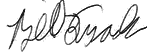

# 前言

伦理与分析和数据科学世界的交汇是我近年来对其充满激情的话题。我已经在这个主题上写了各种博客和论文。我还在许多公共会议和与企业客户的私人会议上谈到了对伦理重视的必要性。我所讨论的内容基于我刻意和持续的努力，了解其他人在分析伦理方面的想法和言论。在这些互动中，我也得到了反馈，这使我能够继续在我的思想中认识到缺陷，并进一步发展我的观点。

在我的互动中，我一直发现，一旦人们意识到伦理考虑的必要性比他们意识到的要广泛和重要得多，他们就会非常愿意更加重视伦理。在我看到的大多数涉及分析和数据科学的不道德事件中，很少有人是出于恶意行事的。相反，通常情况下，情况的伦理性根本没有被充分考虑，甚至根本没有被考虑过。

当 O'Reilly 邀请我参与这个项目时，我知道这是我必须要做的事情。我对能够看到其他数百人对伦理学的看法感到兴奋。我坚信，随着分析和数据科学社区中关于伦理的对话越来越多，我们可以继续努力，确保分析和数据科学以尽可能伦理的方式进行。关键在于引起人们的注意，让他们意识到需要将伦理考虑充分重视起来。这本书的目标是成为这种觉醒的催化剂——帮助读者充分理解将适当的伦理应用于分析和数据科学项目的重要性。为这本书策划最终入选的稿件对我来说是一次巨大的学习经验，我希望读者也能发现最终的成果具有价值。

当你阅读这本书时，你会发现各种不同的观点和写作风格。这是有意为之的。如果两个条目存在冲突的观点，这为你提供了一个机会去思考你认为更具有说服力的观点及其原因。我和我的同事们写这本书并不是要告诉你什么是伦理的，也不是什么不是伦理的。相反，这本书提供了社区其他成员的观点，让你继续完善自己的伦理准则。

书名为 *97 Things About Ethics Everyone in Data Science Should Know*。究竟谁是“数据科学中的每个人”？这个描述应该被广泛解释。毫无疑问，任何参与定义、创建或使用分析和数据科学流程的人都会从这本书中受益。这包括技术和业务角色的人员。学生或考虑转行进入该领域的人也会受益。然而，内容并不深奥或难以理解。因此，对于那些对数据科学中伦理与伦理交叉感兴趣的人来说，这本书无论他们的工作角色或教育背景如何，都会有价值。

# 为什么现在？

尽管在分析和数据科学中需要伦理一直存在，但最近的几个趋势已经帮助将这个主题推向了前台。第一个趋势是我在我的书 [*The Analytics Revolution*](http://www.theanalyticsrevolutionbook.com)（Wiley 出版）中关注的内容。换句话说，我们已经进入一个完全自动化和嵌入决策过程的分析过程的时代。人类现在通常被降级为创建分析和数据科学流程，然后监控其性能，而重要的决策则是自动化的。这种自动化使人们对这些过程内部实际发生的事情更加关注和怀疑，很快就会引发关于伦理的讨论。特别是当模型应用于信用评分、医疗保健或风险评估等敏感领域时，这一点尤为真实。

推动伦理关注的第二个趋势是人工智能（AI）的崛起。不仅是众多 AI 过程被嵌入和自动化作为第一个趋势的一部分，而且 AI 过程本质上也相当不透明。这种不透明性使人们感到不安，迫使他们讨论 AI 算法内部发生的事情以及其原因。这很快又转变成了一个伦理讨论。随着人工智能变得更加复杂并继续每天影响我们的生活，人们希望知道它是以适当的方式使用的。

# 伦理是“模糊的”。

不幸的是，伦理比我们想象中要模糊得多。如果你问一百个人，“伦理选择通常清晰吗？”大多数人会迅速回答“是的”。然而，一旦我们被挑战去更深入地思考这个问题，很快就会显而易见，伦理决策并不像我们允许自己相信的那样清晰明了。虽然通常很容易确定应该遵循的“规则”，但同样容易发现一个或多个例外。

让我们从分析和数据科学领域举一个相关的例子。欧盟通用数据保护条例（GDPR）的核心之一是被遗忘的权利。这意味着我可以告诉组织，我不希望他们继续保留可能存在的与我有关的任何数据，他们必须删除那些数据。听起来很明确，不是吗？如果我要求删除我的数据，那么公司必须依法遵守。

嗯，事情并不是那么简单。有许多情况下，例外情况从法律和/或伦理角度都是有意义的。如果我对产品有保修，该怎么办？如果我要求被遗忘，制造商是否可以保留足够的信息来服务保修直至其到期，或者我的请求是否也会使保修无效（因为公司将不再有我的记录或我的购买记录）？是否按照法律的明文规定行事是道德的道路，还是基于客户可能未考虑到的权衡来给客户选择？关键在于，无论 GDPR 或任何法律多么“明确和明确”，它都无法涵盖每种情况。异常情况将需要判断何为道德行为。

在极端情况下，考虑几乎每个人类社会历史上分享的伦理准则：我们不应该杀害他人。几乎没有人会认为这不是一个好的和道德的规则。然而，我们可以找到许多例外情况，甚至适用于这个普遍接受的规则。举一个例子，如果有人闯入我的家并试图杀害我，我是否可以在自卫中杀害那个人？大多数人和法律系统会说“可以”，而且许多人有各种其他例外情况，例如战争和死刑。如果像“不要杀人”这样明确和明确的事情都有例外情况，我们怎么能不期望在我们的数据科学和分析工作中处理例外情况呢？

一旦我们不得不承认某个规则存在例外，或者某个规则在特定情况下不适用，我们就必须考虑是否存在其他例外情况，以及这个规则是否公平适用于该情况。我们随后被迫做出道德判断。在我们规划、构建和实施分析和数据科学过程时，我们必须专注于考虑道德因素。

# 拥抱伦理责任！

数据分析和数据科学社区必须领导并承担起我们所产生的分析和数据科学过程的伦理责任。理想情况下，这本书可以作为我们前行路上的一个参考点。但你的方法不能简单地是在你的组织法律团队说“停止”或公众哗然之前，随心所欲地去做。不幸的是，我们的法律还没有跟上今天的很多可能性。因此，数据分析和数据科学组织常常面临这样的情况：某种行为可能默认是合法的（因为没有法律涵盖这种情况），但在广泛视角下可能被视为不道德。一个组织的数据分析和数据科学专家的勤勉和判断，通常是防止不道德想法实施的唯一障碍。

正如书中许多观点所敦促的那样，数据分析和数据科学组织应该有意识地追求只做符合伦理的工作。伦理准则、伦理审查委员会、伦理违规举报线和其他相关方法可以帮助组织站在伦理行为的一边。简单地确保人们每天都在考虑伦理，以及在项目的每一步都考虑伦理，会使不道德的决策和行为变得更少见。每次都做出完美的决定是不可能的，但专注于伦理可以推动很多进步。值得注意的是，鉴于许多情况的模糊性，你可以预料到，无论你在哪里划定伦理界限，总会有人不同意你的决定。因此，一定要确保能用逻辑和坚定的信念（同时要完全透明）来捍卫你的决定，如果这些决定受到质疑的话。

如果从这本书中能带走一点，那就应该是*当涉及确保你的分析和数据科学活动是符合伦理的时候，你不能等待别人来带头*。你必须挺身而出，帮助自己成为引领者！每天都要有意识地考虑伦理，这样你晚上睡得安稳，同时保护自己和你的组织的诚信和声誉。

# 书的组织方式

我们经常听到伦理关注集中在模型评分中存在性别、种族等偏见的情况下。虽然这确实是一个关键的关注领域，但在建立、部署和使用数据科学或分析应用的整个过程中都有伦理考虑。在整本书中，你会发现讨论了一系列有趣的场景和解决方案，涵盖了预期和意外的领域。

与其简单地将 97 篇文章推给读者，我们决定将条目分组为一些高层次的主题。这为您作为读者带来了几个好处。首先，如果有某个特定的伦理方面最能吸引您，例如政策指南，您可以快速转到该部分。其次，通过这种方式组织条目，可以更容易地比较和对比关于特定主题的观点，因为这些观点在靠近的位置。每篇投稿都是独立的意见，书中的每个部分都是独立的。没有必要按照典型的从前到后的方式阅读本书。请随意跳转到您最感兴趣的部分和投稿。

本书的部分如下：

+   **第一部分:** 提醒我们应在将伦理应用于我们的分析和数据科学工作时考虑的核心伦理基础。

+   **第二部分:** 将普遍社会伦理规范与分析和数据科学要求联系在一起。

+   **第三部分:** 包含关于供给分析和数据科学过程的数据收集和使用背后伦理的有针对性讨论。

+   **第四部分:** 解决了过程目标的前端定义以及结果的后端应用。

+   **第五部分:** 提供关于如何使一个过程正在做的事情可理解，并确保其随时间的道德运作的见解。

+   **第六部分:** 提供有关如何制定政策以鼓励道德行为的指导。

+   **第七部分:** 包括关于行业特定或用例特定示例的讨论。

敏锐的读者会注意到本书实际上有 98 篇文章，而不是标题中标示的 97 篇。在最后的选择过程中，我们有很多优秀的投稿，因此决定提供给读者一个额外的观点，而不是将列表强行限制在 97 篇。我们相信您可以从中获得价值！

希望您发现这些观点的编译有助于您成功地保持自己的分析和数据科学倡议的道德性。祝您阅读愉快！

—Bill Franks

# O’Reilly 在线学习

###### 注意

40 多年来，[*O’Reilly Media*](http://oreilly.com) 提供技术和商业培训、知识和见解，帮助公司取得成功。

我们独特的专家和创新者网络通过书籍、文章和我们的在线学习平台分享他们的知识和专长。O’Reilly 的在线学习平台为您提供按需访问的实时培训课程、深入学习路径、交互式编码环境，以及来自 O’Reilly 和其他 200 多个出版商的大量文本和视频。更多信息，请访问[*http://oreilly.com*](http://oreilly.com)。

# 如何联系我们

请将有关本书的评论和问题发送至出版商：

+   O’Reilly Media, Inc.

+   1005 Gravenstein Highway North

+   Sebastopol, CA 95472

+   800-998-9938（美国或加拿大）

+   707-829-0515（国际或当地）

+   707-829-0104（传真）

我们为本书设有网页，列出勘误、示例和任何额外信息。您可以访问此页面：[*https://oreil.ly/97-things-ethics-data-science*](https://oreil.ly/97-things-ethics-data-science)。

发送电子邮件至*bookquestions@oreilly.com*以就本书提出评论或技术问题。

获取我们书籍和课程的新闻和信息，请访问[*http://oreilly.com*](http://oreilly.com)。

在 Facebook 上找到我们：[*http://facebook.com/oreilly*](http://facebook.com/oreilly)

在 Twitter 上关注我们：[*http://twitter.com/oreillymedia*](http://twitter.com/oreillymedia)

在 YouTube 上观看我们：[*http://youtube.com/oreillymedia*](http://www.youtube.com/oreillymedia)

# 致谢

首先，我要感谢所有抽出时间为本书作出贡献的人们。考虑到本书的独特格式，如果没有所有的贡献者，它实际上不可能存在。我们收到的贡献广度和质量让我印象深刻。如果本书被认为是成功的，那么这种成功主要归功于贡献者们。

我还要感谢 O’Reilly 团队在整个过程中的支持。在我被邀请合作这个项目并同意之后，很快我意识到我不会独自一人完成。团队在处理投稿、与所有作者协调编辑以及最终格式排版方面的支持非常出色。他们分配给我一个经验丰富、专业的团队，使整个过程尽可能少痛苦。

最后，我要感谢所有在分析和数据科学社区中参与讨论伦理问题的人们，这些讨论帮助形成了我的观点，我相信也帮助了本书的贡献者们形成了他们的观点。如果没有社区中持续进行的强烈对话，本书中的理念不可能如此完整和深入地形成。
