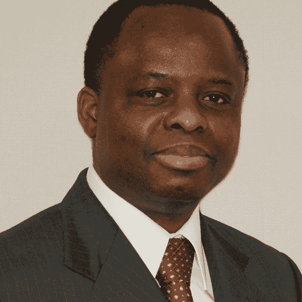

# 第三十四章：如何确定可以在伦理上使用哪些数据

# 莱安德·阿迪丰

VP 工程与技术，英格索尔·兰德

诸如人、社区、公司等实体都有各自的身份。它们拥有现实、特征和独特的特质，这些独特的特质使它们与其他实体区分开来。这种身份定义了它们在存在宇宙中的本质。直到不久之前，即使是在仍在展开的大数据革命之前，实体们也只能用几个数据点来识别。

对于人们来说，主要是他们的名字和姓氏，他们的出生地，也可能是他们父母的名字和部落。列奥纳多·达·芬奇出生在意大利的文奇附近的安基亚诺，他在历史和地理上因其出生地而闻名。公司可能只是简单地沿用其创始人的名字。信息传播手段有限，因此对人、社区或公司所需了解的也有所限制。当被问及我们是谁时，我们的答案总是局限于几个最能描述我们的数据点：我们的名字、出生地、职业和工作地点等。

然而，21 世纪见证了信息爆炸，社交媒体的作用进一步放大。数据变得至关重要。它被收集于每个人和每件事。我们对任何人的了解超出了我们的想象。越来越多的定性因素可以描述任何人的身份。因此，我们的自由受到质疑。当信息被武器化对付他们时，生活可能会瞬间被摧毁。人们的习惯被绘制出来，并且收集到的数据以多种方式被利用。能够更好地捕捉客户购买行为的公司可以通过预测他们的需求并邀请他们参与各种服务来促使他们消费更多。

就像任何旨在改善人们生活的良好技术一样，信息落入错误的手中可能变得有害。信息不仅未能帮助人们得到正确的疾病治疗、准时到达适当的地点或者减少他们的时间和金钱支出，反而可能剥夺他们的人性内容和尊严。它可以揭示他们的位置、拥有的东西等。因此，数据隐私显得至关重要。必须防止未经授权的披露人们隐秘信息并侵入其私生活。

现在的问题是如何确定哪些数据可以在道德上被利用。这个问题中的关键词是“道德”。伦理学简单来说是一组道德原则或价值观，用来指导特定群体的生活方式。系统的规则被定义来指导个人的行为，并保护他们的生命和社区的生命。因此，那些遵循相同伦理规则的社区自己定义或参与定义其隐私的内容是至关重要的，以免受到未经授权的发布的侵害。由于这样一套规则可以在部落、社区和国家之间有所不同，这些群体的个体最适合划定公共和私人之间的界限，其他与他们打交道的人也应该尊重这种划分。

当前述大量数据未经一套规则的筛选时，每个人的自然生活很容易受到威胁。这将阻止人们自由生活和实现他们的潜力。欧盟已经颁布了被称为 GDPR 的法律，以保护其公民的数据和隐私，并控制其个人信息的转移。

为了保障每个人控制其个人数据的自由，应该做出几个简单的考虑：

+   人们的福祉和安全应该成为任何数据收集、分析和利用的核心。

+   社区或国家应参与划定公共和私人数据之间的界限。

+   在个人的个人数据发布给任何第三方之前，应该先取得授权。应该避免在纸质或在线上使用大多数人不读的小字来告知隐私注意事项。

+   那些参与刑事调查并可能访问人们个人数据的人员应该在誓言下收集和管理这些数据。

+   应该有损害控制和修复机制或灾难恢复过程来保护隐私侵犯的受害者。

+   高中教育课程应该教授关于个人数据保护及其处理的知识，以便在个人隐私可能不是优先考虑的年龄段接触到个人数据时。

数据隐私措施和政策应始终旨在保护人们的安全和生命。
