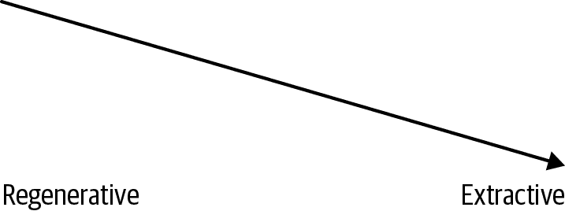
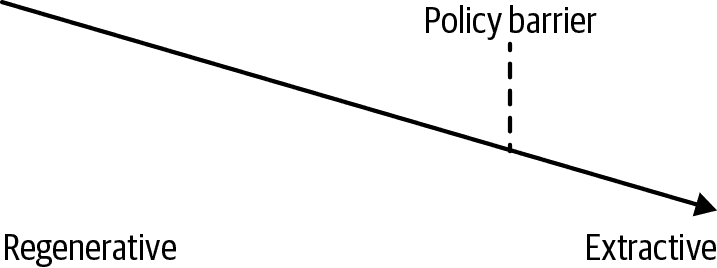
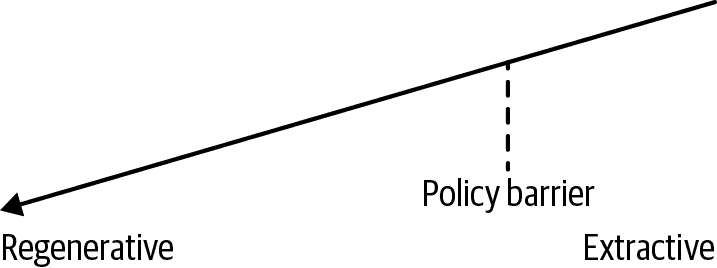

# 第四十六章：走向价值导向的机器学习

# Ron Bodkin

Google Cloud 首席技术官办公室

机器学习（ML）已经成为现代生活中许多方面的重要组成部分，随着数字体验的增加，我们越来越依赖于自动化算法来进行发现、策划以及在娱乐内容（例如 Medium 和 TikTok）、通信（Slack 和 Gmail）、导航（Google Maps）以及购物（Amazon 和 Stitch Fix）等领域做出选择。

机器学习经常被视为一种价值中立的技术，客观的，不受价值观影响或依赖。但实际上，机器学习是一种工具 —— 像任何工具一样，它的使用基于价值观，并且它所产生的后果影响我们的价值观。

自 2007 年以来，我负责将机器学习应用于实际问题，并反复发现使用机器学习会导致意想不到的后果。就像一个邪恶的精灵，机器学习模型通常会准确地给予你你所期望的（优化你所指定的内容），但并不是你真正想要的结果。十年前，当我在 Quantcast 担任工程副总裁时，我们经常会感到沮丧，因为我们创建的机器学习模型无法正常工作。它们会利用我们数据或问题设置中的细微错误，我们不得不努力理解它们的工作原理，以便修复我们的数据并调整我们的目标（或*损失函数*）以实现我们*意图的*结果。

最近，在诸如偏见机器学习模型等领域，出现了重要的意外后果实例。例如，亚马逊的招聘算法对[女性工程师的偏见](https://oreil.ly/UIRbD)，以及 Alphabet Jigsaw 的有毒内容算法对[特定身份群体的偏见](https://oreil.ly/NVLck)。更普遍地说，推荐系统显示出对“垃圾”、具有煽动性的“点击诱饵”内容的偏见（例如，最近 Facebook 的[算法变更](https://oreil.ly/ZTC9I)的影响）。还有从明确损害客户利益的角度出发的价值挑战，例如，亚马逊在[利润优先于顾客需求改变机器学习驱动的搜索结果](https://oreil.ly/1ut8d)。

到目前为止，解决这些问题的大多数方案都是基于这样一个前提：你可以优化一个价值中立的目标函数（例如最大化收入或应用程序上的时间），同时建立各种防护措施。常见的技术包括过滤出问题案例、准备数据以避免偏见、设计模型解释工具以及跟踪次要指标（例如长期队列参与度跟踪而非短期反应）。

我认为这种方法基本上是不够的 —— 以价值中立的目标为导向在定义上是不道德的。相反，我认为我们必须做得更多：我们必须在我们测量的目标中编码价值观，并努力寻找明确产生良好结果的方法，除了其他伦理人工智能实践。

## 价值观重要性的例子

考虑内容推荐系统。[Tristan Harris](https://twitter.com/tristanharris)，[人文技术中心](https://humanetech.com)的联合创始人，对这个问题有着独特的思考方式。想象一个内容光谱，从再生性的（例如反思性和深思熟虑的内容，比如广受尊重的出版物中的文章）到提取性的（例如煽动性和极端的内容，比如边缘或阴谋论网站），如下图所示。

几年前，内容推荐系统通常是为了优化点击而进行训练的。这导致了很多低俗的点击诱饵内容，对用户来说并不具有吸引力（或再生性！）。下一个发展阶段是为了优化总体参与时间。这导致了更持久的用户参与，但不可避免地导致了更多煽动性和极端的内容（如阴谋论、政治极端主义和犯罪活动）。在那个内容的光谱中，系统倾向于图表的右侧——用户参与流向更耸动和令人担忧的材料（见下图）。

这种趋势还增加了数字上瘾，而且以有意义的方式，*贬低*了系统和社会的用户。人工审核、服务条款的监管以及阻止和/或不推荐和/或不提供不准确或其他不良内容的广告的次级系统有所帮助。然而，不良行为者不断找到方法来探索边界并创造最糟糕、最具成瘾性的内容，这将被推广。您可以将这些做法看作是在防范最坏内容的同时保持同样有害流程的屏障，如下图所示。

相反地，想象一个明确优化高质量参与的系统，通过增强再生性内容（见下图）。这应该包括诸如匹配用户花费的资源与他们的意图——例如，“我想每周享受不超过五个小时的娱乐内容”，“我不想被拖入看猫视频直到凌晨两点”，或者“我希望每月的视频娱乐开支不超过 50 美元”。它还应该包括对整个社会的影响——例如，通过向人们提供信息、引发有意义的互动、鼓励深层次的个人互动以及促进政治话语的演变。

当然，将这些概念表示为简单的数学函数是很困难的——对于高质量参与的定义存在着多样化的观点。

## 如何继续？

这不应被视为进步的障碍，而是技术社区应该拥抱的重大挑战。我们如何更好地创建优化我们价值观的客观函数？我们如何更好地预见和减少意外后果？我们如何在系统的目标编码中增加更好的透明度和可见性？

我相信这将成为一门至关重要的工程学科——将技术才能与对政策目标和伦理的广泛洞见相结合。同样，[Keras](https://keras.io)的创始人 François Chollet 认为，为机器学习设定正确的目标至关重要，并且[预测](https://oreil.ly/WQ4HI)“损失函数工程师可能会成为未来的职称”。

在长期研究与实际系统之间的差距中，[AI 价值对齐](https://oreil.ly/bTSlx)（例如，[逆强化学习](https://oreil.ly/mKy4_)）有很多机会。但最重要的一步是对 AI 系统的伦理负责并将价值观融入设计中，尤其是它们的目标！¹

¹ 改编自 Ron Bodkin 的文章，“走向基于价值的机器学习”，Medium，2019 年 10 月 12 日，[*https://oreil.ly/HDlOW*](https://oreil.ly/HDlOW)。
