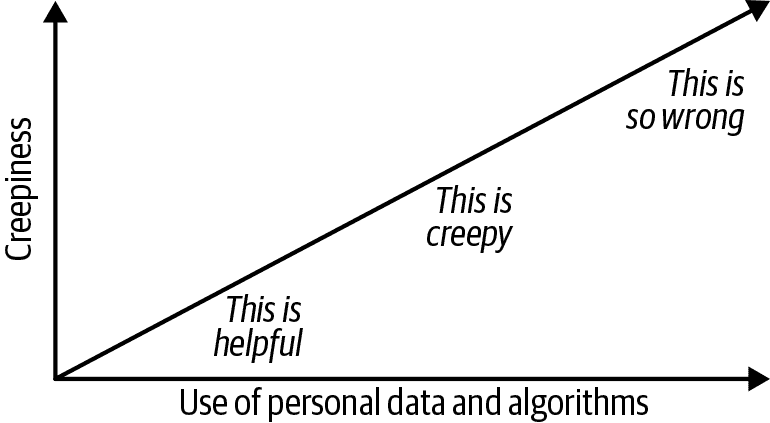

# 第四十九章：避免落入毛骨悚然程度的错误部分

# Hugh Watson

乔治亚大学特里商学院管理信息系统教授

有些利用个人数据的算法被认为是有帮助的，比如 Netflix 上的电影推荐、Yelp 推荐附近餐馆，以及 Waze 的驾驶路线。其他则让人感到毛骨悚然。还记得第一次在网上浏览商品，然后几天内就被来自各个供应商的广告跟踪吗？第一次见到某人，然后很快收到 Facebook 推荐加该人为朋友，也是令人毛骨悚然的。有些个人数据的使用方式确实非常不妥，比如俄罗斯通过定向新闻订阅影响选举结果，或者你在 Facebook 上把婚姻状态从“订婚”改为“单身”后，就收到订婚戒指转售商的广告。

对个人数据和算法使用的不同反应可以通过毛骨悚然程度来衡量，如下图所示，其中 y 轴表示毛骨悚然程度，x 轴表示个人数据和算法使用的程度。

当某事与常规不同，并被认为可能构成威胁或有害时，就会让人感到毛骨悚然。举例来说，一个未经你知情就向他人显示你位置的应用通常是令人毛骨悚然（或者干脆说是错得离谱的），而亚马逊的购物推荐等其他应用功能通常被视为有帮助，因为它们并不构成威胁。

广告或消息的时机和内容也很重要。例如，在医院急诊室收到个人伤害律师的广告似乎不太合适。同样，你不希望在给朋友发送关于你新诊断癌症的电子邮件后看到临终关怀广告。

人们对于什么是毛骨悚然因人而异，且随时间变化，不同人对隐私问题的关注程度和处理方式也各不相同。例如，千禧一代通常被认为对隐私问题的关注较少，因为他们在社交媒体上发布个人信息非常频繁；但他们通过屏蔽某些人（例如前男友）来控制自己的个人信息。一个人第一次经历互联网上追踪广告时，再次遇到时他们并不觉得它那么毛骨悚然。

使用大量个人数据和基于深度学习模型的高级算法的应用并不总是令人毛骨悚然。例如，First Data（最近被 Fiserv 收购）利用大量个人数据，并使用深度学习模型自动检测和预防在线和实体店信用卡欺诈。顾客对此并不感到困扰（偶尔会因误报而被打扰），因为他们得到了保护。只有欺诈者可能会抱怨，而且没人会为他们感到抱歉。

另一方面，即使一个应用程序使用的个人数据很少，也可能会受到严厉批评。在航空业，有些航空价格算法使得在伊尔玛飓风来临之前，试图逃离南佛罗里达的人们的机票价格飙升，这种情况就是如此。

这些讨论显示了可怕性是一个微妙的概念。即使一个潜在的应用程序是合法的（这越来越成为一个考虑因素），也不意味着它是公平和道德的，也不应该开发。那么管理者、专业人士和公司应该采取什么措施，以确保他们不会在“这很可怕”和“这太错误”的可怕性范围内开发和使用应用程序？

最重要的一步是扩展治理（例如，人员、委员会和流程），以包括那些为任何分析应用程序带来必要视角的额外人员。流程可能有所不同，但需要涉及业务、IT 和分析经理，以及与客户互动的律师、数据科学家和业务专业人员。需要业务经理和专业人员评估任何潜在的业务风险。律师们负责确保个人数据的获取、存储、保护、使用和共享方式不违反法律和法规，例如欧盟的 GDPR 和 CCPA。IT 经理和专业人员负责安全地收集、存储、使用和可能共享数据。分析经理和数据科学家需要将关注点从简单开发准确模型扩展到考虑他们工作涉及的更广泛问题。而接近公众的人们需要回答这个问题，这样做是否公平并符合客户的最佳利益？
