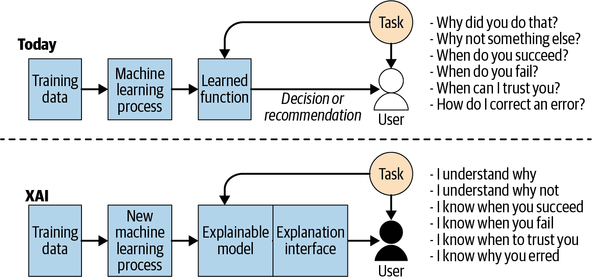

# 第五十九章：伦理、交易与人工智能

# 约翰·鲍尔

商学院教授，慈悲学院

美国股市的形象是肾上腺素驱动的交易员在交易场地上大声喊单。这个形象已经成为了一种记忆。现在，大部分交易由电脑完成，静悄悄地，而且非常非常快速。随着机器学习和人工智能的引入，这一趋势可能会加速，逐渐取代市场中直接的人类交互。立即浮现的问题是：因为市场及其所有的规则和法规主要是为了保护投资者，这一趋势是否构成了对普通投资者的一种问题伦理环境？

市场结构的设计主要是为了保护投资者免受企业行为的侵害，而不是免受其他投资者的侵害。自证券交易委员会（SEC）成立以来，就存在着一些交易员比其他人更快的情况，SEC 似乎并未对此进行区分。技术驱动的投资并不是他们的重点。监管机构更关注的是算法交易实践提供的逐步流动性，这有利于整体市场。目前的做法似乎是不采取任何行动。在可预见的将来，这可能仍然如此。¹

普通投资者买卖股票时会受到不利影响。大多数投资者会以当前市场价格下单买入或卖出，因此他们易受市场动态影响，并为他人提供了利用的机会。例如，当市场当前的卖出价为$9.81 时，一个人会下单购买 1,000 股股票。在$9.81 的价格通常只有 100 股股票可用。一旦这个市场订单到达，算法将察觉到市价买单，然后以每股一分钱的增量提高剩余 900 股的卖出价。这将导致投资者为 1,000 股支付每股高出一到三分钱的平均价格。这个总影响可能看起来很小——在近$10,000 的交易中只有$10 到$30——但每天数十万笔交易的总影响非常显著。普通投资者全面承担负面影响，而机器驱动的交易组织获得全部正面影响。这只是一个简单的例子。

或者考虑一下最近开设的纽约证券交易所数据中心的情况，该中心允许高频交易者在数据中心内放置他们的服务器以实现更快的数据访问。最初，只有靠近纽约证券交易所服务器的机架才受到需求。光纤电缆的长度使得其他机架变得不那么吸引人。想想看，数据在光速附近多行了 20 英尺，这就产生了竞争劣势。纽约证券交易所通过使用相同长度的光纤解决了这个问题，不管服务器的位置如何。

什么导致了这种需求的提升？交易方法。简单来说，计算机算法通过发布订单来持续测试市场，寻找市场的非效率。它们在当前市场附近发布订单（买入或卖出或两者）。如果它们完成了一笔交易，那是因为市场朝向它们移动，并且通常会回归，从而为它们带来利润。如果没有，它们就会取消订单。这会产生对市场深度的虚假印象，并可能导致价格操纵或先行交易订单（这两者都是非法的，但 remarkably hard to police）。²

如果我们能利用人工智能的力量来解决这种不对称问题呢？真正的伦理困境是，当人类与机器互动时，他们无法竞争。假设我们进化到一个所有交易都由人工智能技术驱动的市场。在这种情况下，人工智能机器将查看其掌握的所有信息来做出决策。在这种情况下，市场中的理性程度增加，因为那些不理性的参与者——人类——没有参与。在这种情况下，市场中的信息不对称程度将大大降低，几乎不存在不对称。³

障碍在于人类不知道 AI 系统如何做出决策。随着可解释 AI 的出现（见下图，比较今天的 AI 与可解释 AI⁴），这个障碍开始被清除，使投资者能够利用（可能是他们一生中第一次）符合他们自己价值观的投资策略，促进道德更加健全的市场，并消除大多数不良行为的机会。帮助机器了解你、你的目标和约束，并允许它指导你与金融市场的互动。

¹ “5 Ways AI Is Transforming the Finance Industry,” Marutitech, 2018 年 12 月 25 日, [*https://oreil.ly/A8DVK*](https://oreil.ly/A8DVK).

² Sam Stanton-Cook, Ryan Sparks, Dan O’Riordan, and Rob Hodgkinson，《技术白皮书：有效监控算法和高频交易（第 18 版）》，Kx.com，2014 年 2 月 8 日，[*https://oreil.ly/jQGs3*](https://oreil.ly/jQGs3)。

³ Viktor Ivanitskiy 和 Vasily Tatyannikov，《金融市场中的信息不对称：挑战与威胁》，《地区经济》（俄罗斯科学院乌拉尔分部经济研究所经济安全中心），第 1 卷，第 4 期（2018）：1156–67。

⁴ Matt Turek，《可解释人工智能（XAI）》，国防高级研究计划局（DARPA），2019 年 9 月 10 日检索自 [*https://oreil.ly/--C81*](https://oreil.ly/--C81)。
