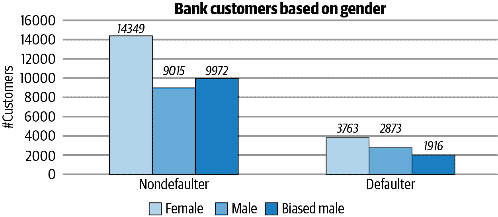
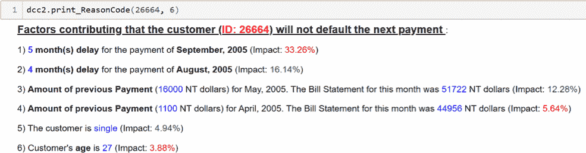
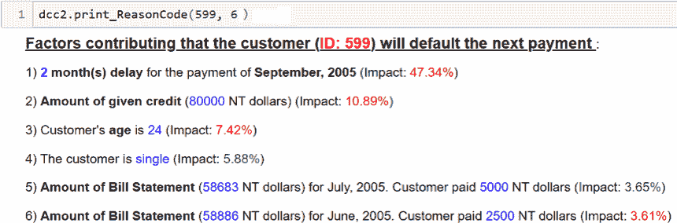

# 第六十五章：使用模型无关解释找出黑盒模型中的偏见

# 伊亚尼斯·卡内洛普洛斯和

安德烈亚斯·梅萨拉斯

创始人，Code4Thought

数据科学家，Code4Thought

揭示“黑盒”模型的不透明性的必要性显而易见：欧盟通用数据保护条例（2018 年）的第 15 和第 22 条、OECD 人工智能原则（2019 年）以及[美国参议院提出的算法问责法案](https://oreil.ly/2Xgzm)等都表明，机器学习的可解释性，以及机器学习的问责性和公平性，已经（或应该）成为任何自动决策应用的一个重要特征。

由于许多组织将被迫就其自动化模型的决策提供解释，第三方机构将有巨大需求来评估可解释性，因为这为整个审计过程提供了额外的完整性和客观性。此外，一些组织（特别是初创企业）将无法应对可解释性问题，从而需要第三方审计机构。

然而，这种方法可能会引发知识产权问题，因为组织不愿透露有关其模型细节的任何信息。因此，在广泛的可解释性方法中，模型无关方法（即不涉及模型细节的方法）被认为是适合这一目的的。

除了解释黑盒模型的预测外，可解释性还能帮助我们洞察模型可能因数据中不良模式而导致的错误行为。本文将通过一个例子探讨可解释性如何帮助我们识别数据中的性别偏见，使用一种利用替代模型和 Shapley 值的模型无关方法。

我们使用信用卡客户违约数据集，其中包含关于 3 万名信用卡客户的信息（人口统计因素、信用数据、支付历史和账单报表），目标标签是他们是否在下一个付款期限（即 2005 年 10 月）违约。下图展示了按性别分开的违约和非违约银行客户；每组中左侧和中间的柱状图代表女性和男性客户的原始分布，而每组中右侧的柱状图则显示了重新构建的男性客户偏倚分布。

我们通过随机选择 957 名男性违约者（即总男性违约者的三分之一），并改变其标签来扭曲数据集。这样一来，我们就得到了一个新的偏倚数据集，其中 34%为男性违约者，66%为女性违约者，以及 41%为男性非违约者，59%为女性非违约者。

然后，我们从数据集中删除性别特征，并采用在此偏倚数据集上训练的黑盒模型的预测结果（其结构我们不关心）。然后，我们训练一个[代理](https://oreil.ly/hpq8U) XGBoost 模型，从中提取 Shapley 值，帮助我们解释原始模型的预测。更准确地说，我们使用 Shapley 值来准确定位最重要的特征，然后通过简单的自然语言句子在解释中使用它们。

我们检查了对男性客户的误判为非违约者的错误预测解释，以及对女性客户的误判为违约者的错误预测解释。他们都是未婚大学毕业生，信用额度相似。然而，男性客户延迟了最后四次付款，而女性只延迟了最近一次—请参见以下表格。

|  |  |  |  | **支付状态（延迟月数）** |
| --- | --- | --- | --- | --- |
| **ID** | **信用额度** | **教育程度** | **婚姻状况** | **九月** | **八月** | **七月** | **六月** | **五月** | **四月** |
| --- | --- | --- | --- | --- | --- | --- | --- | --- | --- |
| 26664 (*男性*) | 80,000 | 大学 | 单身 | 5 | 4 | 3 | 2 | 按时付款 | U.R.C. |
| 599 (*女性*) | 60,000 | 大学 | 单身 | 2 | U.R.C.^(a) | U.R.C. | U.R.C. | U.R.C. |
| ^(a) 使用循环信贷。 |

对于男性客户，九月份的支付延迟对“违约”有 33%的负面影响，正如以下解释所示。然而，令人反感的是，八月份的支付延迟却有积极影响。

对于女性客户，九月份的两个月延迟也产生了负面影响，但比男性客户的五个月延迟（33%）有更大的百分比（47%）；更多细节请参见下图。

尽管在模型的训练中未包含性别特征，但我们在解释的帮助下观察到性别偏见已编码到其他特征中（例如，男性客户延迟支付对延迟的积极贡献）。此外，在观察解释中的影响百分比时，我们发现模型对女性客户的处理更加严厉（例如，较小的支付延迟造成更大的负面影响）。这种奇怪的行为应该引起我们的警觉，并激励我们获取更好的违约样本。

总之，在数据集包含真实人员的情况下，确保模型不会歧视某一群体是非常重要的。解释能够帮助我们发现即使是隐藏的偏见，也能准确指出我们黑盒模型意外的决策模式，并激励我们修正数据。
