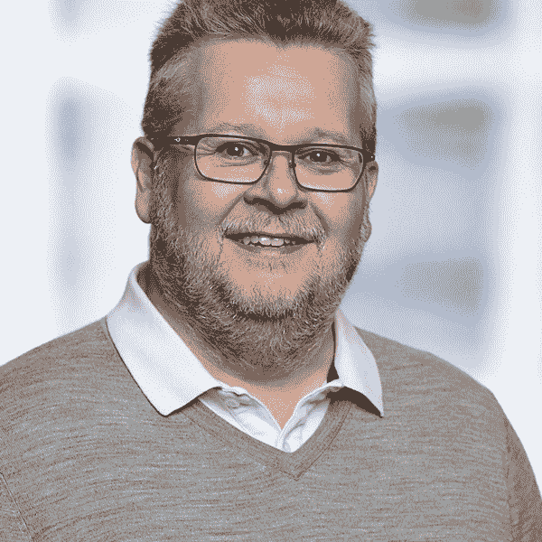
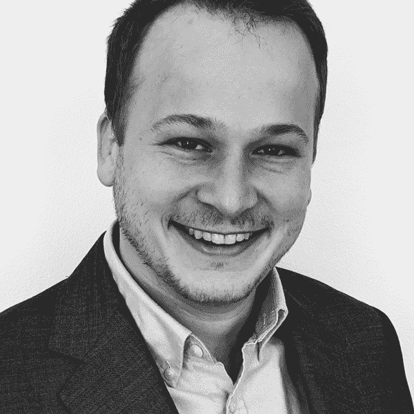
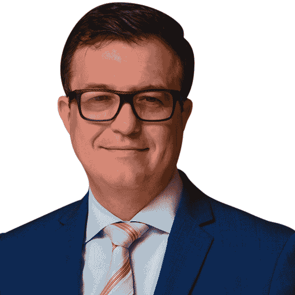

# 第九十九章：贡献者

# Aaron Burciaga

Aaron Burciaga 是一位数据科学家、人工智能工程师、作者和顾问。作为一名经验丰富的科技和商业领袖，在初创企业和大企业中都专注于通过自动化、数据科学、机器学习、人工智能、区块链、量子计算和新兴概念以及创新技术提供效率和价值。他的项目和倡议的开发和实施已经增强了数十亿美元的项目和商业、联邦和国防领域的运营效率。Aaron 曾担任 HCL Technologies 数据科学与分析全球运营总监、Analytics2Go 首席技术官、Booz Allen Hamilton 数据科学与人工智能副总裁、Accenture 全球分析平台负责人以及 Elder Research 高级研究科学家。在转向商业和公共部门之前，Aaron 是海军陆战队军官和伊拉克战争老兵，并曾担任五角大楼运营研究分析主任和运营分析活动主任，支持海军陆战队总部。他还是一名海军陆战队后备军人，在五角大楼海军陆战队总部担任首席信息官领导数据技术工作。Aaron 是 *Forbes* 的撰稿人，经常受邀作为主题演讲嘉宾和演讲人，并且是认证分析专业人士（CAP）。他是美国商务部国家技术信息服务咨询委员会的委任成员。Aaron 毕业于海军研究生院运筹学硕士，并获得美国海军学院学士学位。

*数据科学和人工智能的五大核心美德*

# Andreas Messalas

Andreas Messalas 是一位人工智能研究员和开发者，特别关注机器学习的透明性、公平性和鲁棒性。他在 Code4Thought 的工作主要集中在使算法透明化，并帮助组织变得负责任。Andreas 拥有希腊帕特拉大学的计算机工程和信息学硕士学位。

*使用模型无关解释找出黑箱模型中的偏差*

# Anna Jacobson

Anna Jacobson 通过培训成为一名工程师，通过经验成为项目经理，通过志向成为数据科学家。她对决策的演变充满激情，从数据到信息再到洞察力，最终到行动，她着迷于这一过程改变我们周围世界的潜力。作为加州大学伯克利分校信息与数据科学硕士（MIDS）项目的学生，Anna 正在严谨地追求数据分析多个方面的研究，并同时担任 MIDS 社会公益倡议和女性倡议的学生代表。作为建筑行业的专业人士，她负责领导团队制定和实施策略，帮助客户规划和准备设计和建造建筑物的复杂过程。

*算法时代的公平性*

# Arnobio Morelix

Arnobio Morelix 是一位驻扎在硅谷的领导者，他在战略和数据科学的交汇处工作。他的工作和分析广泛出现在国家和全球媒体上，包括《纽约时报》、《经济学人》、《华尔街日报》和 BBC。他经常在公共场合演讲，并曾在“西南偏南”（South by Southwest）、Facebook、美联储等地演讲。Arnobio 曾为 CEO、创始人、现任和前任政府部长以及顶尖学术人士提供建议、工作和演讲，并在斯坦福大学和《Inc.》杂志担任数据科学相关角色。作为 Startup Genome 的首席创新官，Arnobio 领导一个全球团队，研究并为覆盖 35 个以上国家的政府和私人组织制定创新政策提供建议。

*偿还公平债务，技术债务的暗影孪生*

*算法误分类——（相当）好、坏和丑*

# Bill Schmarzo

Bill Schmarzo，日立万达拉首席创新官，负责定义日立万达拉的分析（人工智能/机器学习/数据科学）方向，并与选定客户共同推动“共创”努力，利用分析驱动数字转型。Bill 是旧金山大学管理学院（SOM）的执行研究员，也是爱尔兰国立大学戈尔韦的商学院经济学和商业荣誉教授，他在这里教授并指导学生学习《大数据 MBA：用数据科学驱动业务战略》和《像数据科学家一样思考》课程。

* pass pass 伦理：被动与主动*

*伦理道德只不过是社会行为的限制和指导原则吗？*

# Bob Gladden

Bob Gladden 是一位经验丰富的医疗保健分析领导者，在行业的多个领域都有经验。他是 Highmark Health 的企业分析副总裁，也是 Front Edge Analytics 的 CEO 兼所有者，后者是一家医疗保健洞察咨询服务组织。他的经验包括在 CareSource 管理集团、Ernst & Young 的医疗保健咨询实践、西北医疗保健系统、Advocate 医疗保健系统、McNerney Heintz 和 CoMed 担任领导职务。Gladden 在医疗保健分析、医疗保健管理、医疗保健研究、数据管理、数据治理、信息系统、精算科学、核保和金融领域拥有超过 35 年的经验。他过去的职位包括首席财务官（CFO）、首席信息官（CIO）以及多个分析领域的高级管理职务。他持有来自 Bowling Green State University 的硕士学位。

*数据伦理与狂鼠效应*

*伦理悖论的悖论*

# Bonnie Holub

Bonnie Holub 拥有人工智能博士学位，并曾在多个角色中任职，包括 Teradata 的数据科学实践领导、Korn Ferry 的人才分析副总裁、Cognizant 的高级数据科学家、PwC 的分析总监以及 UCare 健康保险的企业数据仓库项目经理。她还是一位企业家，创办了几家公司。她在研究生阶段教学，并参与了几所大学成功的大数据、数据科学和人工智能项目的创立。

*隔离区造成问题——也许比你想象的更多*

# Brendan Tierney

Brendan Tierney 长期从事数据解决方案开发，包括数据仓库、大数据、机器学习和数据架构。他是独立顾问（Oralytics），并在都柏林理工大学讲授数据科学、数据库和大数据课程。他活跃于博客界，为各种出版物撰写文章，并定期在各种开发者会议上发表演讲，包括 Oracle 用户组会议、Devoxx、PyCon 和 ODSC。Brendan 出版了四本书籍，其中三本与 Oracle Press/McGraw-Hill 合作（《使用 Oracle 数据挖掘进行预测分析》；《Oracle R 企业：在 Oracle 数据库中利用 R 的力量》；《实用 SQL 和 PL/SQL：专家建议》），还有一本与 MIT Press 合作的《数据科学》，后者已被翻译成其他六种语言。这些书在 Amazon 上以平装书、电子书和有声书的形式出售。访问 Brendan 的网站和博客[*www.oralytics.com*](http://www.oralytics.com)，并在 Twitter 上关注他[*@brendantierney*](https://twitter.com/brendantierney)。

*街头和购物中心的人脸识别*

# Brent Dykes

Brent Dykes 是 Blast Analytics 的洞察和数据故事讲述高级总监。他还是《有效数据故事：如何用数据、叙述和视觉推动变革》（Wiley）的作者。Brent 在 Omniture、Adobe 和 Domo 拥有超过 15 年的企业分析经验。他对数据战略和数据叙述的热情来自于与包括 Nike、Microsoft、Sony 和 Comcast 在内的许多行业领袖的咨询。他经常为 Forbes 撰稿，并在不同的数据相关主题上写了 35 多篇文章。2016 年，Brent 获得了数字分析协会（DAA）的最有影响力行业贡献奖。他是 Strata、Web Summit、Shop.org、Adtech、Pubcon、RISE、Crunch 和 Adobe Summit 等会议的受欢迎的演讲者。Brent 持有 Brigham Young 大学的 MBA 学位和 Simon Fraser 大学市场营销的 BBA 学位。

*数据叙述：事实与虚构的临界点*

*伦理数据叙述者*

# Brian T. O’Neill

Brian T. O’Neill 是一位设计师、顾问，也是 Designing for Analytics 的创始人，这是一家独立的咨询公司，帮助公司将分析和机器学习转化为不可或缺的决策支持应用程序。他已经在 DellEMC、Global Strategy Group、Tripadvisor、Fidelity、JPMorgan Chase、E-Trade 以及几家 SAAS 初创公司工作了 20 多年。他曾国际演讲，在 Strata、Enterprise Data World、国际分析研究所研讨会、Predictive Analytics World 和波士顿学院发表演讲。Brian 还主持广受好评的播客《Experiencing Data》，在这个节目中，他揭示了产品、数据科学和分析领导者为提供有价值数据体验所采取的策略和活动。除了咨询工作，Brian 还是一名专业的打击乐手，曾在卡内基音乐厅和肯尼迪艺术中心演出。在 Twitter 上关注他[*@rhythmspice*](https://twitter.com/rhythmspice)，并加入他的邮件列表[*https://designingforanalytics.com/list*](https://designingforanalytics.com/list)。

*介绍 Ethicize™，完全基于 AI 的云伦理解决方案！*

# Carole Piovesan

Carole Piovesan 是 INQ Data Law 的合伙人和联合创始人，她的执业范围集中在隐私、网络安全准备、数据治理和人工智能等方面。她经常就隐私、数据保护、数据治理、伦理人工智能以及 AI 运营的风险管理等广泛问题为客户提供建议。

*如何负责任地创新*

# Cassie Kozyrkov

Cassie Kozyrkov 是 Google Cloud 的首席决策科学家，她在指导团队进行数据驱动决策流程和 AI 战略方面具有领导地位。她是将决策智能实践引入 Google 的创新者，亲自培训了超过 20,000 名 Google 员工。

*关于 AI 偏见的真相*

*AI 伦理*

# Christof Wolf-Brenner

Christof Wolf-Brenner 在 AI 和大数据领域担任顾问工作。除了领导创意研讨会、进行培训课程和管理项目外，他还以学术爱好者的身份开始从事哲学研究。通过结合工作经验和广泛的理论背景，他在一年前开始深入研究人工智能伦理学。

*规则与理性*

# Collin Cunningham

Collin Cunningham 是亚马逊网络服务的数据科学家。工作之外，他创立了 SpringForward Foundation，帮助服务不足的高中学生申请大学，并担任 ATLFamilyMeal 的首席架构师。在加州大学伯克利分校完成硕士学位期间，Collin 因其在伦理学领域的工作和对社区的贡献而获得了 Jack Larson Data for Good Fellowship 奖学金。

*道德 CRISP-DM：道德数据科学发展框架*

# Damian Gordon

Damian Gordon 在都柏林理工大学担任计算机科学讲师超过 20 年。他撰写了 50 多篇研究论文，其中 40 篇集中在他作为教育研究者的工作上（涵盖混合学习、通用设计、伦理和电子学习）。在成为讲师之前，他在计算机行业工作，曾担任软件开发人员、业务系统分析师、技术团队负责人和实施顾问等多种角色。

*数据匿名化真的非常难*

*伦理是数据泄露的解药*

# Dave Cherry

Dave Cherry 是 Cherry Advisory, LLC 的主管。作为思想领袖、执行策略家和演讲者，他拥有超过 25 年的经验。他帮助客户在客户体验行业（每个有客户的人都在这里）定义一个由创新驱动并通过分析测量/调整的客户体验战略，以建立与客户的深厚关系和连接。他曾与 LBrands、Polo Ralph Lauren、Ascena Retail Group、Journeys、DSW、Disney、Alliance Data、Nationwide Insurance、AEP、Huntington Bank、Cardinal Health、OhioHealth、Deloitte Consulting 和 Price Waterhouse 等领先组织合作。他拥有宾夕法尼亚大学沃顿商学院的经济学学士学位，并担任国际分析学会专家小组和 Women in Analytics Conference 的咨询委员会成员。

*Data Science Does Not Need a Code of Ethics*（数据科学不需要道德准则）

*100% Conversion: Utopia or Dystopia?*（100% 转化：乌托邦还是反乌托邦？）

# Dave Mathias 是结合客户、数据和产品的热情，以弥合商业和技术之间鸿沟的创始人。他是 Beyond the Data 的创始人，*Data Able* podcast 的联合主持人，也是 MinneAnalytics 和 TC Data Viz Group 的联合领导者。

Dave Mathias 将他对客户、数据和产品的热情结合起来，以弥合商业和技术之间的鸿沟。他是 Beyond the Data 的创始人，*Data Able* podcast 的联合主持人，也是 MinneAnalytics 和 TC Data Viz Group 的联合领导者。

*Ethics as a Competitive Advantage*（道德作为竞争优势）

# Doug Hague

Doug Hague 是北卡罗来纳大学数据科学学院的创始执行董事。Hague 博士在加入该大学之前，在航空航天、电信和金融服务领域拥有超过 20 年的企业经验，包括担任美国银行的首席分析官。Hague 博士在学术和专业期刊上发表了超过 20 篇文章，并持有四项专利。

*Unbiased ≠ Fair: For Data Science, It Cannot Be Just About the Math*（无偏 ≠ 公平：对于数据科学来说，不仅仅是数学问题）

*A Framework for Managing Ethics in Data Science: Model Risk Management*（数据科学伦理管理框架：模型风险管理）

# Edward Vandenberg

Edward Vandenberg 是保险业务分析师，专注于数据科学。在过去的 15 年里，他与主要保险公司合作，帮助他们开发高级定量模型，并将其应用于定价、核保和理赔流程中。他拥有商业和技术的高级学位，目前在 Teradata Corporation 工作。

*Auto Insurance: When Data Science and the Business Model Intersect*（汽车保险：当数据科学与商业模式交汇）

# Eric Schmidt

Eric Schmidt 在国际业务中拥有超过 20 年的经验，致力于解决复杂的业务问题、开发分析工具和能力，并将分析转化为高级利益相关者可执行的见解和建议。他的分析职业涵盖多个行业，包括银行业、风险管理、酒店业和消费品包装业，在这些行业中，他领导了信用风险模型验证、定价和收入优化、需求预测以及市场和决策科学。目前，Eric 在乔治亚州亚特兰大市为一家主要饮料公司领导全球数据和分析团队，专注于财务、营销和战略的商业智能和数据科学应用。Eric 拥有乔治亚理工学院的学士、硕士和博士学位，研究机械工程和流体力学，并在埃默里大学的 Goizueta 商学院获得 MBA 学位，专注于市场营销和决策科学。他在乔治亚理工学院和 Goizueta 商学院均获得学术奖学金。2011 年，Eric 因在那年毕业班中成为最佳市场营销学生而获得市场学院荣誉奖。

*首先，不要伤害*

# Eric Siegel

Eric Siegel，博士，Predictive Analytics World 和 Deep Learning World 会议系列的创始人，使得机器学习的如何和为什么变得易于理解且引人入胜。他是著有屡获殊荣的书籍《Predictive Analytics: The Power to Predict Who Will Click, Buy, Lie, or Die》（Wiley）的作者，曾是哥伦比亚大学的教授，以及该领域中享有盛誉的演讲者、教育者和领导者。阅读他在数据和社会正义方面的其他著作，请访问[*www.civilrightsdata.com*](http://www.civilrightsdata.com)，并在 Twitter 上关注他的账号[*@predictanalytic*](https://twitter.com/predictanalytic)。

*明显歧视性算法*

*要打击预测性警务中的偏见，正义不能是色盲*

# Evan Stubbs

Evan Stubbs 是波士顿咨询集团的合伙人兼董事，已经撰写了多本关于通过数据获取竞争优势的书籍，并且是 BCG 数据和数字平台实践的全球领导者。他已在战略、工程和能力交汇的领域工作超过 20 年，并与他的客户全球合作，将技术转化为竞争优势。

*伦理系统的前、现在和后*

# Fred Nugen

Fred Nugen 博士是预测性计算医学研究员，教授数据科学于加州大学伯克利分校。他专注于在工程和医学之间搭建桥梁，促进有意义的合作。他致力于设计、构建和改进可以提高生活质量并挽救生命的新技术。

*保护您的数据免受侵犯将帮助我们改善医疗保健*

# Grant Fleming

Grant Fleming 是 Elder Research Inc. 的数据科学家。在 Elder Research，Grant 与私营和公共部门客户合作，识别和追求分析的新途径。他主要的技术兴趣是可解释的机器学习、可重现性以及用于文本分析的深度学习。

*模型可解释性的伦理困境*

# Hannah Kitcher

Hannah Kitcher 负责提高人们对**艾达·洛芙莱斯学会**工作的认识，这是一个独立机构，致力于确保数据和人工智能为人民和社会服务。在此之前，Hannah 是负责技术思想的沉思所有责任的通信经理。Hannah 在独立组织的研究和沟通方面拥有广泛的经验，致力于理解和解决社会主要社会问题。

*我们还没有准备好技术的信任标记*

# Hassan Masum

Hassan Masum 是 Prodigy Education 的高级分析总监和“进步战略家”。他热衷于与创新组织和变革者合作，解决复杂挑战，并喜欢共同开发社会技术解决方案，结合定量和定性见解，使人们受益。他的经历和出版物是人生旅程中利用分析、协作和仆人领导力追求有价值目标的航标。

*理解您的领导为谁服务*

*构建多角度人工智能*

# Heidi Livingston Eisips

Heidi Livingston Eisips 是圣何塞州立大学卢卡斯商学院营销和商业分析系的兼职教师，教授涵盖营销、数据科学和统计学的广泛课程。致力于将体验式学习和数据伦理融入教学中，Eisips 女士利用超过 30 年在营销战略方面与财富 100 强公司、初创企业和中型公司合作的经验。Eisips 女士拥有英语文学和工商管理硕士学位，目前正在攻读博士学位。

*算法偏见：你是旁观者还是支持者？*

# Hugh Watson

Hugh Watson 博士是乔治亚大学特里商学院的管理信息系统教授。他是业务智能和分析领域的领先学者和权威，出版了 24 本书和 200 多篇学术期刊文章。Hugh 在上世纪 70 年代帮助开发了决策支持系统的概念基础，在 80 年代研究了高级信息系统的开发和实施，过去 20 年专注于数据仓库、业务智能和分析。他是信息系统协会和数据仓库协会的会士，也是 *Business Intelligence Journal* 的高级编辑。

*小心“心灵的决定”*

*避免陷入可怕程度的错误部分*

# Irina Raicu

Irina Raicu 是马克卡拉应用伦理中心的互联网伦理项目主任。她是一名律师和认证信息隐私专家。她的文章发表在多种刊物上，包括 *大西洋月刊*、*今日美国*、*圣何塞水星报*、*旧金山纪事报* 和 Recode。

*个人数据的认知*

# James Taylor

James Taylor 是 Decision Management Solutions 的创始人兼首席执行官，也是国际分析研究所的教职成员。他是数字决策和利用先进分析、业务规则和人工智能提升业务结果的领先专家。他为财富 100 强和全球前 100 家公司提供战略咨询，在各个行业的客户中推广决策技术。James 是 *Digital Decisioning: Using Decision Management to Deliver Business Impact from Artificial Intelligence*（MK Press）的作者，与 Jan Purchase 合著的 *Real-World Decision Modeling with DMN*（MK Press）也由他编写。

*信任、数据科学和斯蒂芬·柯维*

*你正在做出什么决定？*

# Janella Thomas

Janella Thomas 是 Cox Enterprises 的数据科学家。她在斯贝尔曼学院获得经济学学士学位，后在爱荷华州立大学获得分析学硕士学位。她与未婚夫和迷你雪纳瑞犬一起居住在乔治亚州亚特兰大市。

*数据透明度：不了解可能会伤害你*

# Jennifer Lewis Priestley

Jennifer Priestley 博士是肯尼索州立大学研究生院副院长兼分析与数据科学研究所所长。她设计了美国第一个数据科学博士项目，该项目于 2015 年 2 月启动。她撰写了数十篇关于二元分类、风险建模、抽样、统计方法解决问题以及大数据分析应用的文章。在获得统计学博士学位之前，Priestley 博士在金融服务行业工作了 11 年。她曾担任伦敦 VISA 欧洲区的业务发展副总裁以及 MasterCard 美国的业务发展副总裁，还曾在安永战略服务集团担任分析顾问。Priestley 博士毕业于乔治亚州立大学获得博士学位，宾夕法尼亚州立大学获得工商管理硕士学位，乔治亚理工学院获得学士学位。

*数据是否应该拥有权利？*

*伦理与数据科学家为何不能走捷径*

# Jesse Anderson

Jesse Anderson 是数据工程师、创意工程师兼 Big Data Institute 董事总经理。他与从初创公司到财富 100 强公司的企业合作进行大数据处理。他被广泛认为是该领域的专家，并因其新颖的教学方法而受到高度评价。

*自动检测道德违规*

# Jitendra Mudhol

Jitendra Mudhol 是 CollaMeta 创始人兼首席执行官，一家位于硅谷的手工艺术企业，致力于人类创造力与人工智能交叉领域，在商业和社会领域解决问题。他在行业中已有三十年的经验，跨越大陆、文化和诸如西门子、IBM、东芝、富士通、高通和博通等大型企业以及创业初创公司。作为圣克拉拉大学米勒社会企业中心的执行研究员，他利用数据科学和机器学习来最大化社会影响。尽管拥有电子工程学学士学位和工商管理硕士学位，但他认为自己是个新手和终身学习者。

*算法偏见：你是旁观者还是持不同意见者？*

# John F. Carter

约翰·F·卡特博士是一位经验丰富的数据和分析高管及顾问，在广泛的行业经验中利用数据和分析推动业务影响力。约翰的专长包括企业数据管理、分析、预测建模、数字转型和人工智能。约翰目前正在帮助公司使用数据和分析战略性地转变其组织和能力以加速增长。此前，约翰曾任 Charles Schwab 的高级副总裁，创建了高效的企业分析组织，并率先使用非结构化大数据和 AI/机器学习能力。约翰还曾是 Equifax, Inc. 的首席数据官，负责在 Equifax 的全球业务单元中建立数据战略、数据获取和数据治理最佳实践。在其职业生涯中，约翰曾在 Acxiom、花旗银行和 Responsys 担任高级职务。约翰在康涅狄格大学获得统计学博士学位。

*数据伦理——分析领导者的三大关键行动*

# John Power

John Power 是一位拥有近 30 年经验的华尔街高管，曾在 Spear, Leeds & Kellogg、Bank Julius Baer、E-Trade Financial 和 Mellon Bank 等公司担任金融运营职位。John 在过去 10 年中一直在 MBA 项目中教学，并在 Mercy College 工作了第七个年头。John 目前正在 Wilmington University 攻读工商管理博士学位。他与妻子和两个儿子一起居住在纽约皇后区。

*伦理、交易与人工智能*

# John Thuma

John Thuma 在数据和分析领域拥有 30 年的键盘操作经验。John 目前在 FIS 的数据解决方案组工作，这是一个新成立的、高度协作且快节奏的团队，旨在支持 FIS 不断扩展的数据业务。数据解决方案组负责为 FIS 的客户提供下一代数据产品和服务。这些工具提供革命性的、数据驱动的洞察力和行动，并赋予他们的客户在竞争激烈的、数据驱动的世界中取得成功的能力。该团队对自己的工作充满热情，并始终以客户为先。在这个团队内部和业务范围内，有着巨大的成长和学习机会，包括参与团队和业务的特别任务。

*垃圾邮件。你会错过它吗？*

# Justin Cochran

Justin Cochran 是肯尼索州立大学信息系统副教授。他在乔治亚大学获得工商管理博士学位，并在奥本大学获得硕士和学士学位（机械工程）。除了教授的责任外，他还提供项目以挑战商学院教师，使其与不断发展的技术和业务实践保持同步。在空闲时间，他喜欢翻修房屋、在篮球场上教育人们，或者在摩托车上穿越山路。

*在民主化数据科学领域构建知识的重要性*

# Kenneth Viciana

Kenneth Viciana 目前是 Fiserv 公司信息风险管理总监。他被全球公认为创新的数据与分析领导者。作为一位兼具商业与 IT 执行能力的领导者，Kenneth 成功开发并推动了战略、能力和项目，帮助公司利用和驾驭可操作数据的力量，以促进业务成果。

*伦理问题正处于今天数据景观的前沿*

# Keri McConnell

Keri McConnell 是诺斯西特纳互惠数据科学研究所（NMDSI）的执行主任。在这一角色中，Keri 正在领导 NMDSI 的创建，这是诺斯西特纳互惠、马凯特大学和威斯康星大学密尔沃基分校之间独特和创新的合作伙伴关系。她是诺斯西特纳互惠分析实践的创始领导者，在组织快速增长时期起到了重要作用。Keri 早期职业生涯在电信行业度过，担任各种运营和技术角色。她在东北大学获得成人和组织学习专业的教育硕士学位。

*设计企业数据伦理框架*

# Keyur Desai

Keyur Desai 是全球企业数据管理、数据商业化和分析的高级执行官，拥有 30 年的专业经验，擅长通过数据、分析和数据产品最大化业务成果、运营效率、企业风险和创新的影响。他目前担任 TD Ameritrade 公司的首席数据官。

*在数字时代平等分配道德成果*

# Kris Hunt

Kris Hunt 是一位经验丰富的数据分析师，在 IT 行业和软件开发领域有着丰富的工作/咨询历史。她擅长于统计建模、客户关系管理（CRM）、数据库、数据仓库和财务分析。Kris 拥有来自罗格斯大学统计学专业的学士学位，是一位富有企业家精神的专业人士。

*数据科学的黄金法则*

*是准备还是不准备迎接风暴*

# Laura James

Dr. Laura James 是一位工程师和领导者，致力于建立和发展负责任、可持续和协作的产品和组织，专注于新兴互联网技术。

*我们还没有准备好技术的信任标志*

# Leandre Adifon

Leandre Adifon 是 Pyramid Base Technologies LLC（简称 PyBTech LLC）的创始人兼首席执行官，该公司旨在通过使地球友好的高科技产品可负担得起，来改善生活在社会金字塔底部的人们的生活和地球。直到最近，他担任英格索尔兰德公司的副总裁，负责全球系统工程和先进技术。在加入该公司之前，他在联合技术公司工作了 20 年，并担任奥的斯电梯全球工程副总裁。

*如何确定可以道德使用的数据*

# Linda Burtch

Linda Burtch 是量化招聘行业的领导者，并致力于成为分析和数据科学招聘市场的专家。Linda 经常在午餐会、会议、公司会议和网络研讨会上发表关于量化职业主题的演讲，多年来一直是美国统计协会芝加哥分会和 INFORMS 的积极成员，包括担任数个董事会职务。她曾接受过*纽约时报*、*华尔街日报*、CNBC、彭博社、*经济学人*和*信息周刊*等媒体的采访，并在分析和数据科学招聘市场上保持博客超过 10 年。Burtch Works 也被《福布斯》认可为美国最佳招聘公司之一。

*数据科学课程的基石必须是道德*

*道德：数据科学职业的下一个大浪潮？*

# Majken Sander

Majken Sander 是一位数据迷和业务分析师，同时倡导数据素养和数据使用中的道德问题。Majken 在 IT、管理信息、分析、商业智能和数据仓库等领域工作超过 20 年。凭借强大的分析专业知识，她热衷于将“数据驱动”作为商业原则，并关注数据科学和其他与数据相关的事物。更多信息请访问[majkensander.com](http://majkensander.com/)。

*我怎么知道你是对的？*

# Marc Faddoul

Marc Faddoul 是一位算法设计师和研究员，专注于计算传播领域。他在法国顶尖的计算机科学工程学校——Télécom Paris 取得了数据科学硕士学位。然后在工业界担任算法设计师，后来被加州大学伯克利分校信息学院吸引，深入研究新技术的社会影响。

*走向算法谦卑*

# Mario Vela

Mario Vela 是电信行业资深数据科学家，对哲学和数学充满热情，已有超过 20 年工作经验。

*数据科学伦理：何为基础标准？*

# Marty Ellingsworth

Marty Ellingsworth 是一位分析专家和企业家。他运用数据、人工智能、高级分析和云技术解决关键业务问题和公共关切。他专注于财产和意外伤害保险中的风险评估、风险选择、定价、营销、理赔服务和销售，并经常在如何融入创新和数据驱动持续改进的文化方面撰文演讲。Marty 获得了美国空军学院运筹研究学士学位和空军技术研究所运筹研究硕士学位。他长期是 INFORMS 的成员，曾是美国风险与保险协会的董事会成员，并经常作为行业会议的成员参与 KDD。

*对错何在？*

# Michael Hind

Michael Hind 是 IBM 研究 AI 部门的杰出研究员，位于纽约约克镇。他发表了 50 多篇论文，担任过 50 多个程序委员会成员，并在多所顶尖大学、会议和政府机构做过多次主题演讲和邀请演讲。Michael 领导了数十名研究人员成功将技术转移到 IBM 的各个部门，并帮助启动了几个成功的开源项目，如 AI Fairness 360 和 AI Explainability 360。他在 2000 年关于自适应优化的论文被认定为 OOPSLA’00 最具影响力论文，并且他在 Jikes RVM 上的工作获得了 2012 年的 SIGPLAN 软件奖。Michael 是 ACM 杰出科学家和 IBM 技术学院的成员。

*在模型通用之前，不要做出一般化断言*

# Mike McGuirk

Mike McGuirk 是 Babson College 的讲师和全职教师，教授本科和研究生课程，重点是在营销和紧密相关的业务功能中成功使用分析实践。在 2020 年 1 月加入 Babson 之前，Mike 在 Emerson College 教授了四年，在那里他还担任了新的数字营销和数据分析硕士课程的研究生项目主任。在转向学术界之前，Mike 在分析领域工作了超过 25 年，担任数据驱动营销和分析顾问。他一直对利用数据、技术和分析开发解决方案，帮助业务高管做出更为明智的、见解驱动的决策感兴趣。Mike 在帮助财富 1000 强公司识别导致高利润营销项目和优越客户体验的客户洞察方面拥有丰富的经验。他在描述性、预测性和规定性分析技术方面有深厚的专业知识。他最近曾是 iKnowtion（已被 TTEC 收购）的合伙人，并曾领导 Epsilon 和多个初创公司的分析咨询部门。

*伦理与反思是成功数据科学核心*

*终身营销分析师对消费者数据隐私的看法*

# Miroslava Walekova

Miroslava Walekova 是金融服务行业的企业绩效改善架构师，拥有 10 年以上的经验，专注于利用最新技术推动负责任和可持续的组织转型和增长。

*“所有模型都是错误的。”我们该如何应对？*

# Naomi Arcadia Kaduwela

Naomi Arcadia Kaduwela 是创新的、道德的 AI 创作者。作为 Kavi Global 创新部门 Kavi Labs 的负责人，Naomi 与跨行业的客户合作共同创造利用 AI、先进分析和物联网带来的业务价值。在加入 Kavi Global 之前，Naomi 是 GE Healthcare 分析团队的创始成员，并从 GE 的数字技术领导计划毕业。Naomi 是学术研究人员和会议演讲者。Naomi 拥有西北大学分析学硕士学位，以及伊萨卡学院计算机科学和应用心理学双学士学位。

*聊天机器人是否应比人类受到更高的道德标准？*

# Nenad Jukić

尼纳德·尤基奇是芝加哥洛约拉大学奎兰商学院的信息系统教授。他在各种信息管理相关领域进行研究，包括数据库建模和管理、数据仓库、业务智能、数据挖掘、商业分析、大数据、电子商务和 IT 战略。他的作品发表在众多管理信息系统和计算机科学学术期刊、会议论文和书籍中。

*数据科学社会使用因素的不平衡*

# 尼克·哈姆林

尼克·哈姆林致力于使社会公益数据对每个人都可访问、易理解和可操作。作为 GlobalGiving 的首席数据科学家，尼克扮演多重角色，包括领导组织的数据战略、构建和维护核心基础设施，设计实验评估项目影响。他还是 Datakind 社区健康影响实践的数据大使，是 Pando 的开发者（Root Change 社交领域网络探索平台），以及 Aidsight 团队的一员，该应用允许非技术用户轻松探索国际援助透明数据，揭示组织之间的隐藏关系并验证数据质量。在过去，尼克曾在世界各地的财富 500 强公司担任可靠性咨询工程师，并在中国和泰国担任美国国家科学基金会研究职位。在办公室之外，他是民谣音乐街头表演者、业余咖啡迷和前蚯蚓养殖户。了解更多有关尼克的信息，请访问他的 Twitter（[*@nicholashamlin*](https://twitter.com/nicholashamlin)）或[*nickhamlin.com*](http://nickhamlin.com/)。

*利用社交反馈环来解决伦理问题*

# 帕米拉·帕斯曼

帕米拉·帕斯曼创立并担任负责企业与贸易中心（CREATe.org）的主席，该中心开发和传播关于公司如何内部和与其全球供应链管理关键风险的领先实践。在此之前，帕米拉在微软公司工作了 15 年。她是战略与国际问题中心（CSIS）的高级合伙人。

*AI 的责任设计与使用：管理安全性、风险和透明度*

*人工智能：新兴伦理中的法律责任*

# 彼得·布鲁斯

Peter Bruce 是位于弗吉尼亚州阿灵顿的 [Statistics.com](http://Statistics.com) 统计教育研究所的创始人，该公司是 Elder Research 的一部分。之前，与著名经济学家朱利安·西蒙合作，Peter 继续和商业化开发了西蒙的重抽样统计工具——Simon’s Resampling Stats。在 Cytel Software Corp. 工作期间，他开发了类似的 Box Sampler，并帮助推广了 XLMiner，这是一款用于 Excel 的数据挖掘增强插件。他是《Introductory Statistics and Analytics: A Resampling Perspective》（Wiley）的作者，《Data Mining for Business Analytics》（Wiley，11 版，与 Galit Shmueli、Peter Gedeck、Inbal Yahav、Nitin R. Patel 和 Mia L. Stephens 合著）的共同作者，《Practical Statistics for Data Scientists》（O’Reilly，第 2 版，与 Peter Gedeck 和 Andrew Bruce 合著）的共同作者。

*分流与人工智能*

*哈佛大学的随机选择？*

# Phil Bangayan

Phil Bangayan 是 Teradata 的首席数据科学家，在那里他通过应用机器学习帮助合作伙伴解决业务问题。在加入 Teradata 之前，他曾在 NBCUniversal 和华特迪士尼公司的数据科学、市场营销和财务职位上应用分析来增长收入。Phil 拥有 MIT Sloan 管理学院的工商管理硕士学位和 UCLA 的电气工程硕士学位。

*重新思考“获取数据”步骤*

# Phil Broadbent

Phil Broadbent 的整个职业生涯都涉及零售分析的各个方面，从定价到预测，再到运营和商品销售。他的简历包括解决全球最大公司的问题：百思买、玩具反斗城、eBay、家得宝等。

*灰色界限*

# Polly Mitchell-Guthrie

Polly Mitchell-Guthrie 是 Kinaxis 的行业外联和思想领导副总裁，一家供应链和分析软件公司。之前，她是北卡罗来纳大学医疗保健系统分析咨询服务的主任，并在 SAS 的高级分析研发、全球学术计划主任和联盟等多个角色中工作过。她在北卡罗来纳大学教堂山分校的肯南-弗拉格勒商学院获得工商管理硕士学位，并作为莫黑德学者获得政治学学士学位。她在 INFORMS（运筹学与分析的主要专业学会）非常活跃，并共同创办了机器学习和数据科学中的第三章女性联盟（现在全球有超过 60 个分会）。

*伦理数据科学：艺术与科学兼备*

# Rachel Thomas

Rachel Thomas 是旧金山大学应用数据伦理中心的创始主任，也是[fast.ai](http://fast.ai/)的联合创始人，该平台创建了全球最受欢迎的深度学习课程（据我们所知），免费在线提供且无广告。她被*福布斯*评选为“AI 领域 20 位不可思议的女性”之一，并在杜克大学获得数学博士学位，在 Uber 担任早期数据科学家。Rachel 是一位知名作家和主题演讲者。

*算法与人类决策制定者的不同使用*

# Rado Kotorov

Rado Kotorov 是经验丰富的技术创新者、数字化转型领导者和软件执行官，具有广泛的国际经验。Rado 利用对数据、商业智能、分析、机器学习和人工智能的深刻理解来解决当今的业务挑战，并发现未开发的收入机会。Rado 在数字经济中开发愿景、战略和数据驱动的商业模型方面是一位被证明的领导者，并且是两本关于数据和分析在业务中使用的管理书籍的作者：《组织智能：智能公司如何利用信息提升竞争力和盈利能力》（Information Builders）和《数字经济中的数据驱动商业模型：伟大公司如何依赖数据运营》（Business Expert Press）。Rado 获得了 2019 年新泽西数字技术创新奖。

*未来领导力：如何实现道德透明*

*机器学习预测沟通的伦理*

# Randy Guse

Randy Guse 是美国健康联合集团（UnitedHealth Group）Optum 企业分析部门人工智能组织学习、研究和战略主管。他负责人工智能知识发展，推动组织分析成熟度的提升。在加入美国健康联合集团之前，Randy 设计并管理了多个行业的客户分析解决方案交付。这些行业包括金融服务、零售、酒店业、运输、通讯和技术。您可以在他的[LinkedIn 页面](https://www.linkedin.com/in/randyguse)了解更多关于 Randy 的信息。

*算法影响评估*

# Rasmus Wegener

Rasmus Wegener 是贝恩公司旧金山办公室的合伙人，他在贝恩公司的业务转型和高级分析实践中担任领导者。

*如何透明和信任地要求客户数据*

# Richard Hackathorn

理查德·哈克索恩博士目前致力于确保大规模的深度学习系统在技术和伦理上可管理。几十年来，理查德一直以行业分析师、技术创新者、高科技企业家、大学教授和国际数据分析与商业智能讲师而闻名。他在数据库管理、决策支持、数据库连接、数据仓库和沉浸式分析方面开创了创新。

*商业现实将击败你的分析*

# 罗伯特·J·阿贝特

罗伯特·J·阿贝特已经在数据领域工作了比他愿意承认的时间长——从开发开始，转向架构，然后到商业智能可视化，再到大数据科学，最终成为首席数据官。罗伯特通过与技术合作伙伴和专家的战略合作，结合对领先技术和架构的深刻技术理解和人际交往技能，积累了交付创新数据管理、治理和分析解决方案的经验。他有幸被同行视为大数据和分析思想领袖，并从约翰·扎克曼、彼得·艾肯博士、大卫·马可、玛莎·丹贝尔等众多知名人士那里学习。他在《DAMA-DMBOK》，第二版（Technics）中撰写了“大数据与数据科学”章节，并因此被《Toggle》杂志在 2017 年赋予了“数据耳语者”的绰号。他是 2020 年麻省理工学院首席数据官信息质量国际会议的联合主席之一。他的团队因《沃尔玛 2013 年技术创新项目年度奖》中的“企业协作分析设施”（Data CAFÉ）而获奖。

*按用例和结果集限制客户信息的查看*

*何时拒绝数据*

# 罗伯特·J·麦克格拉斯

罗伯特·J·麦克格拉斯博士是新罕布什尔大学健康数据科学与分析研究生项目主任，健康管理与政策系主任。他的研究集中在知识生成的基础、协作科学和公共利益。

*数据科学与审议正义：他者之声的伦理*

# 罗恩·博德金

罗恩·博德金（Ron Bodkin）是一个专注于人工智能有益应用的连续创业者。罗恩领导谷歌云首席技术官办公室的零售行业人工智能和负责任的人工智能工作。他还主导 AI 创新实验，并与谷歌产品管理和工程团队合作开发 AI 和分析产品，与客户共同创新，他是与谷歌云关键客户合作的技术执行赞助人。他在 Medium 上撰写了关于机器学习和人工智能的[文章](https://medium.com/@ronbodkin)。

*朝向价值导向的机器学习*

# Scott Radcliffe

斯科特·拉德克利夫（Scott Radcliffe）是埃默里大学哥伦比亚商学院（Emory University's Goizueta Business School）商业分析硕士项目的执行董事。在这个角色中，他专注于开发行业合作伙伴关系，为学生提供将基础培训与应用到真实业务问题、真实数据和最新技术相结合的实践学习经验。他对商业分析教育中的体验学习充满热情，因为这驱使人们理解何时、如何以及为什么要使用它。在加入埃默里之前，Scott 曾在科克斯通讯公司（Cox Communications）担任执行董事，负责运营和客户体验分析工作。作为一名职业商业分析实践者，Scott 在各种行业如日用品、能源、移动通信和数据分析产品开发中有着丰富的应用经验。Scott 还是 Vajra Partners 的联合创始人兼数据科学副总裁。他是由运筹学和管理科学研究所（INFORMS）颁发的认证分析专家（CAP）。

*机器学习中的因果性和公平意识*

# 塞巴斯蒂安·帕奎特（Sébastien Paquet）

塞巴斯蒂安·帕奎特（Sébastien Paquet）在蒙特利尔大学获得物理学学士学位，并获得计算机科学博士学位。他曾在伽马射线探测器、医学成像、射频设备、计算机图形学、虚拟现实和社交协作软件领域工作，并担任经验丰富的促进者和组织者。作为 Element AI 的首席应用研究科学家，他是公司内几个计划的发起者，并参与建立各种流程和程序，包括应用研究科学家的招聘流程。他管理着持续改进团队和多技能学习计划，加速技术员工的学习过程。他特别关注人工智能企业文化和社会影响的角度。

*构建多角度的人工智能*

# Sherrill W. Hayes

谢瑞尔·W·海斯博士是肯尼索州立大学计算与软件工程学院博士学位项目的主任和冲突管理教授。海斯博士在冲突管理、程序开发和评估领域拥有超过 20 年的经验，在美国、英国和德国的家庭、组织、法院系统和高等教育领域开展过工作，深受尊敬。

*小心的伦理故事：颅相学、优生学…还有数据科学？*

*知情同意和数据素养教育对伦理至关重要*

# 斯蒂芬妮·苏沃德

斯蒂芬妮·苏沃德曾是一名拥有两次派驻经验的美国陆军军官，服役超过六年。离开军队后，她加入了 Booz Allen Hamilton 公司，专注于机器学习和数据科学应用。她于 2020 年 4 月通过加州大学伯克利分校获得了信息与数据科学硕士学位。

*不可避免的法律基础*

# 史蒂夫·斯通

史蒂夫·斯通是一位经验丰富的高管和作家，拥有超过 36 年的技术服务和零售行业经验。作为创新、备受尊敬的领导者，他主导了数字技术和先进分析的采用。除了在多个技术董事会任职外，史蒂夫目前还经营着他在 2017 年成立的 NSU Technologies, LLC 执行顾问公司。

*仅仅因为你可以，你应该吗？为分析选择数据的伦理*

*实施 AI 伦理治理与控制*

# 史蒂文·明茨

史蒂文·明茨博士以 *Ethics Sage* 的名义撰写博客。他的博客被 Feedspot 评为哲学领域中排名第 21 的顶级博客之一。他的 *Workplace Ethics Advice* 博客在 Market Inspector 的“30 个杰出企业社会责任（CSR）博客”中排名第 3，致力于推广可持续发展和企业社会责任意识。明茨博士因其在大学教育和研究领域的工作而获得了多个奖项，包括美国会计协会公共利益部门颁发的“会计楷模”奖。

*伦理、人工智能和财务报告审计功能*

# 史蒂文·C·迈尔斯

Steven C. Myers 是一位应用计量经济学和数据分析的教育家，同时也是经济学家在数据科学中的传道者。他是 SAS 大会的演讲者，曾担任首席信息官，并荣获 2020 年 SAS 杰出教育家奖。他擅长将经济和商业知识与严格的统计和编程技术结合起来解决问题，并提供解决方案。他是阿克伦大学经济学副教授，教授经济学和商业数据分析学位课程。他在 [*econdatascience.com*](http://econdatascience.com) 上撰写博客。

*应用计量经济学和数据科学中的伦理规则*

# Stuart Buck

Stuart Buck 拥有法学博士和教育政策博士学位。作为 Arnold Ventures 的副总裁，他资助了知名的工作，揭示科学研究通常是不可重复的，并且如何使用开放科学和透明政策来改进它。他曾为 DARPA、IARPA（CIA 的研究部门）、退伍军人事务部和白宫社会与行为科学团队提供建议，关于严谨和透明的研究流程，并在顶级期刊（如 *Science*）上发表文章，探讨如何使研究更加准确。

*为什么研究应该是可重复的*

# Thomas Casey

Thomas Casey 在处理、设计解决方案以及帮助全球 2000 客户更好地利用分析技术方面拥有近 25 年的经验。他撰写了自动化智能框架，定义了一种实用的方法来驱动个性化决策，使用一套通用的分析指导原则。Thomas 拥有亚利桑那州立大学的工商管理硕士学位和马萨诸塞大学的学士学位。他目前正在哈佛商业分析项目中学习，并经常在各种分析主题的会议和客户研讨会上做演讲。

*概率—统治分析伦理的法则*

# Tim Wilson

Tim Wilson 自 2001 年以来一直全职从事数字数据工作，担任过多种角色，从管理网页分析平台迁移和作为一家价值 5 亿美元的高科技 B2B 公司商业智能部门负责人，到在三家不同代理公司创建和发展分析实践，这些代理公司与多个大型消费品牌合作。Tim 还向财富 500 强公司的数字分析团队提供咨询，帮助他们制定有效的数字数据战略、流程和策略。他长期以来一直为分析师和营销人员创造实用内容，包括共同主持两周一次的 [*Digital Analytics Power Hour* podcast](https://www.analyticshour.io) 和共同创建 [*dartistics.com*](http://dartistics.com)——一个致力于鼓励分析师学习 R 编程语言并将统计方法应用于其数据的网站。

*“道德”不是一个二元概念*

# Yiannis Kanellopoulos

Yiannis Kanellopoulos 在过去的二十年中，专注于分析和评估软件系统，以帮助组织解决与其相关的潜在风险和缺陷。（根据他的经验，这些风险或缺陷总是由人为因素引起的。）他通过创办初创公司 Code4Thought，将自己的专业知识转化为使算法透明化，并帮助组织承担责任。他还是 Orange Grove Patras 的创始成员，这是由荷兰驻希腊大使馆赞助的企业孵化器，旨在促进创业精神并对抗青年失业问题。Yiannis 拥有曼彻斯特大学的计算机科学博士学位。

*使用模型无关的解释来发现黑盒模型中的偏见*

*把责任放在首位*
