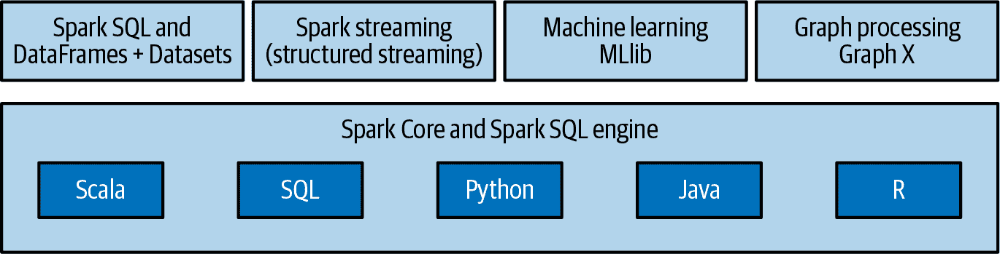

# 第一章：分析大数据

当人们说我们生活在大数据时代时，他们指的是我们拥有工具，可以以前所未有的规模收集、存储和处理信息。在 10 或 15 年前，以下任务简直无法完成：

+   构建一个模型来检测信用卡欺诈，使用数千个特征和数十亿笔交易。

+   智能推荐数百万种产品给数百万用户。

+   通过模拟包含数百万种工具的投资组合来估算财务风险。

+   轻松操作数千人的基因组数据，以检测与疾病的遗传关联。

+   定期处理数百万张卫星图像，评估农业土地利用和作物产量，以改进政策制定。

这些能力的背后是一个开源软件生态系统，可以利用服务器集群处理海量数据。Apache Hadoop 在 2006 年的推出/发布导致了分布式计算的广泛采用。自那时以来，大数据生态系统和工具已经迅速发展。过去五年还见证了许多开源机器学习（ML）和深度学习库的引入和采用。这些工具旨在利用我们现在收集和存储的大量数据。

但就像凿子和一块石头不能创造雕像一样，拥有这些工具和所有这些数据之间存在着差距，以及如何将其应用到有用的事情上。通常，“做一些有用的事情”意味着在表格式数据上放置架构，并使用 SQL 来回答诸如“在我们的注册流程中达到第三页的千万用户中，有多少人年龄超过 25 岁？”这样的问题。如何设计数据存储和组织信息（数据仓库、数据湖等），使回答这类问题变得容易，这是一个丰富的领域，但在本书中我们大多数时间将避免探讨其复杂性。

有时，“做一些有用的事情”需要额外的工作。SQL 可能仍然是方法的核心，但为了解决数据的特异性或进行复杂分析，我们需要一种更灵活、功能更丰富的编程范式，尤其是在机器学习和统计学等领域。这就是数据科学的用武之地，也是我们在本书中将要讨论的内容。

在本章中，我们将从概念上介绍大数据，并讨论处理大型数据集时遇到的一些挑战。然后，我们将介绍 Apache Spark，一个用于分布式计算的开源框架及其关键组件。我们的重点将放在 PySpark 上，即 Spark 的 Python API，以及它如何适应更广泛的生态系统。接下来，我们将讨论 Spark 3.0 带来的变化，这是该框架四年来的第一个重大发布。最后，我们将简要介绍 PySpark 如何解决数据科学的挑战，以及为什么它是你技能集的重要补充。

本书以前的版本使用 Spark 的 Scala API 作为代码示例。我们决定改用 PySpark，因为 Python 在数据科学社区中很受欢迎，并且核心 Spark 团队更加重视对该语言的支持。希望在本章结束时，您能理解这个决定的合理性。

# 处理大数据

许多我们喜爱的小型数据工具在处理大数据时遇到了困境。像 pandas 这样的库无法处理无法放入内存的数据。那么，应该如何设计一个等效的流程，可以利用计算机集群在大型数据集上实现相同的结果？分布式计算的挑战要求我们重新思考我们在单节点系统中依赖的许多基本假设。例如，由于数据必须在集群的许多节点上分区，具有广泛数据依赖性的算法将受到一个事实的影响，即网络传输速率比内存访问慢几个数量级。随着解决问题的机器数量增加，失败的可能性也增加。这些事实要求一种对底层系统特性敏感的编程范式：一种既避免糟糕选择又容易编写以高度并行方式执行的代码。

近年来在软件社区中备受关注的单机工具并不是用于数据分析的唯一工具。处理大型数据集的科学领域，比如基因组学，几十年来一直利用并行计算框架。今天在这些领域处理数据的大多数人都熟悉一种称为 HPC（高性能计算）的集群计算环境。在 Python 和 R 的困难之处在于它们无法扩展的同时，HPC 的困难之处在于其相对较低的抽象水平和难度较高的使用。例如，要并行处理一个大文件中的 DNA 测序读数，我们必须手动将其分割成较小的文件，并为每个文件提交一个作业到集群调度器。如果其中一些失败了，用户必须检测到故障并手动重新提交。如果分析需要所有到所有操作，如对整个数据集进行排序，则必须通过单个节点流式传输大型数据集，或者科学家必须求助于较低级别的分布式框架，如 MPI，这些框架在没有广泛的 C 和分布式/网络系统知识的情况下很难编程。

为 HPC 环境编写的工具通常无法将内存数据模型与较低级别的存储模型解耦。例如，许多工具只知道如何从 POSIX 文件系统中以单个流的形式读取数据，这使得难以使工具自然并行化或使用其他存储后端，如数据库。现代分布式计算框架提供了抽象，允许用户将一组计算机更像单个计算机一样对待——自动拆分文件并在许多计算机上分发存储，将工作划分为较小的任务并以分布式方式执行它们，并从故障中恢复。它们可以自动化处理大型数据集的许多麻烦，并且比 HPC 便宜得多。

*分布式系统*的一个简单思路是它们是一组独立的计算机，对最终用户而言表现为单个计算机。它们允许水平扩展。这意味着增加更多计算机而不是升级单个系统（垂直扩展）。后者相对昂贵，并且通常不足以处理大量工作负载。分布式系统非常适合扩展和可靠性，但在设计、构建和调试时也引入了复杂性。在选择此类工具之前，人们应理解这种权衡。

# 介绍 Apache Spark 和 PySpark

进入 Apache Spark，这是一个开源框架，将程序引擎与优雅的编程模型相结合，可在机器集群上分发程序。Spark 起源于加州大学伯克利分校的 AMPLab，并已贡献给 Apache 软件基金会。在发布时，它可以说是第一个使分布式编程真正对数据科学家可用的开源软件。

## 组件

除了核心计算引擎（Spark Core）外，Spark 由四个主要组件组成。用户使用其 API 之一编写的 Spark 代码在集群中的工作节点的 JVM（Java 虚拟机）中执行（请参见第二章）。这些组件可作为不同的库使用，如图 1-1 所示：

Spark SQL 和 DataFrame +数据集

用于处理结构化数据的模块。

MLlib

一个可扩展的机器学习库。

结构化流处理

这使得构建可扩展的容错流应用程序变得容易。

GraphX（已弃用）

GraphX 是 Apache Spark 的图形和图形并行计算库。但是，对于图形分析，推荐使用 GraphFrames 而不是 GraphX，后者并未得到很好的积极开发，并且缺乏 Python 绑定。[GraphFrames](https://oreil.ly/p6TYQ)是一个开源的通用图处理库，类似于 Apache Spark 的 GraphX，但使用基于 DataFrame 的 API。



###### 图 1-1. Apache Spark 组件

## PySpark

PySpark 是 Spark 的 Python API。简单来说，PySpark 是基于 Python 的 Spark 核心框架的包装器，该框架主要用 Scala 编写。PySpark 为数据科学实践者提供了直观的编程环境，并结合了 Python 的灵活性和 Spark 的分布式处理能力。

PySpark 允许我们跨编程模型工作。例如，一种常见模式是使用 Spark 执行大规模的提取、转换和加载（ETL）工作负载，然后将结果收集到本地机器上，并使用 pandas 进行后续操作。在接下来的章节中，我们将探索这样的编程模型。以下是官方文档中的代码示例，让您一窥未来的内容：

```py
from pyspark.ml.classification import LogisticRegression

# Load training data
training = spark.read.format("libsvm").load("data/mllib/sample_libsvm_data.txt")

lr = LogisticRegression(maxIter=10, regParam=0.3, elasticNetParam=0.8)

# Fit the model
lrModel = lr.fit(training)

# Print the coefficients and intercept for logistic regression
print("Coefficients: " + str(lrModel.coefficients))
print("Intercept: " + str(lrModel.intercept))

# We can also use the multinomial family for binary classification
mlr = LogisticRegression(maxIter=10, regParam=0.3, elasticNetParam=0.8,
                         family="multinomial")

# Fit the model
mlrModel = mlr.fit(training)

# Print the coefficients and intercepts for logistic regression
# with multinomial family
print("Multinomial coefficients: " + str(mlrModel.coefficientMatrix))
print("Multinomial intercepts: " + str(mlrModel.interceptVector))
```

## 生态系统

Spark 是我们在大数据生态系统中最接近瑞士军刀的东西。更重要的是，它与生态系统的其余部分集成良好并且可扩展。与之前描述的 Apache Hadoop 和 HPC 系统不同，Spark 解耦了存储和计算。这意味着我们可以使用 Spark 读取存储在多个来源中的数据 — 包括 Apache Hadoop、Apache Cassandra、Apache HBase、MongoDB、Apache Hive、RDBMS 等 — 并在内存中处理所有这些数据。Spark 的 DataFrameReader 和 DataFrameWriter API 也可以扩展以从其他来源读取数据，如 Apache Kafka、Amazon Kinesis、Azure 存储和 Amazon S3。此外，它支持从本地环境到 Apache YARN 和 Kubernetes 集群等多种部署模式。

这也使得围绕它形成了一个庞大的社区。这导致了许多第三方包的创建。可以在 [这里](https://oreil.ly/N8ZDf) 找到社区创建的此类包的列表。主要的云提供商（[AWS EMR](https://oreil.ly/29yh1)、[Azure Databricks](https://oreil.ly/RAShf)、[GCP Dataproc](https://oreil.ly/5i5MT)）还提供第三方供应商选项来运行托管的 Spark 工作负载。此外，还有专门的会议和本地聚会组，可以帮助了解有趣的应用程序和最佳实践。

# Spark 3.0

2020 年，Apache Spark 自 2016 年 Spark 2.0 发布以来首次进行了重大更新 — Spark 3.0。2017 年发布的最后一版介绍了由 Spark 2.0 带来的变化。Spark 3.0 并未引入像上一个主要版本那样多的 API 变更。这个版本侧重于性能和可用性改进，而不会引入显著的向后不兼容性。

Spark SQL 模块通过自适应查询执行和动态分区修剪实现了主要的性能增强。简单来说，它们允许 Spark 在运行时调整物理执行计划，并跳过不在查询结果中所需的数据。这些优化解决了用户以前必须进行手动调整和优化的重要工作量。Spark 3.0 在 TPC-DS 上几乎比 Spark 2.4 快两倍，这是一个行业标准的分析处理基准测试。由于大多数 Spark 应用程序都由 SQL 引擎支持，所有高级别库，包括 MLlib 和结构化流处理，以及高级 API，包括 SQL 和 DataFrames，都受益于此。符合 ANSI SQL 标准使 SQL API 更易于使用。

Python 在数据科学生态系统中的采用率已经成为领导者。因此，Python 现在是 Spark 上最广泛使用的语言。PySpark 在 Python 包索引(PyPI)上每月下载量超过五百万次。Spark 3.0 改进了其功能和可用性。重新设计了 pandas 用户定义函数(UDFs)，以支持 Python 类型提示和迭代器作为参数。新的 pandas UDF 类型已包含在内，并且错误处理现在更符合 Python 的风格。Python 版本低于 3.6 已被弃用。从 Spark 3.2 开始，Python 3.6 的支持也已被弃用。

在过去的四年里，数据科学生态系统也发生了快速变化。现在更加关注将机器学习模型投入生产。深度学习取得了显著的成果，Spark 团队目前正在实验，以便项目调度器利用 GPU 等加速器。

# PySpark 解决了数据科学的挑战。

对于一个旨在实现大数据复杂分析的系统，其成功需要考虑或至少不与数据科学家面临的一些基本挑战冲突。

+   首先，进行成功分析所需的绝大部分工作都在预处理数据中。数据是混乱的，而清理、整理、融合和其他许多动作都是在做任何有用工作之前的先决条件。

+   第二，*迭代*是数据科学的基本部分。建模和分析通常需要对相同数据进行多次扫描。像随机梯度下降这样的流行优化过程涉及对输入的重复扫描，以达到收敛。迭代还在数据科学家自己的工作流程中起着重要作用。选择正确的特征，选择正确的算法，运行正确的显著性检验，以及找到正确的超参数都需要实验。

+   第三，构建出性能良好的模型后，任务并未结束。数据科学的目的是使数据对非数据科学家有用。数据推荐引擎和实时欺诈检测系统的用途最终落实为数据应用程序。在这种系统中，模型成为生产服务的一部分，并可能需要定期或实时重新构建。

PySpark 很好地处理了数据科学中前述的挑战，承认构建数据应用程序中最大的瓶颈不是 CPU、磁盘或网络，而是分析师的生产力。将从预处理到模型评估的整个流程折叠到一个编程环境中可以加快开发速度。通过在 REPL（读取-评估-打印循环）环境下打包一个表达能力强的编程模型和一组分析库，PySpark 避免了与 IDE 的往返。分析师能够快速实验他们的数据，越快他们就有可能做的事情。

读取-评估-打印循环（REPL）是一个计算机环境，在这里用户输入被读取和评估，然后结果被返回给用户。

PySpark 的核心 API 为数据转换提供了一个坚实的基础，独立于统计、机器学习或矩阵代数的任何功能。当数据科学家探索和感受数据集时，他们可以在运行查询时将数据保留在内存中，并且还可以轻松地缓存转换后的数据版本，而无需遭受磁盘读写的延迟。作为一个既使建模变得容易又非常适合生产系统的框架，对于数据科学生态系统来说，这是一个巨大的胜利。

# 从这里开始

Spark 填   Spark 填补了为探索性分析设计的系统与为运营分析设计的系统之间的鸿沟。通常说，数据科学家比大多数统计学家更擅长工程，比大多数工程师更擅长统计学。至少，Spark 在作为运营系统方面比大多数探索系统更好，并且比运营系统中通常使用的技术更适合数据探索。希望本章对您有所帮助，并且您现在对动手使用 PySpark 感到兴奋。这将是我们从下一章开始要做的事情！
