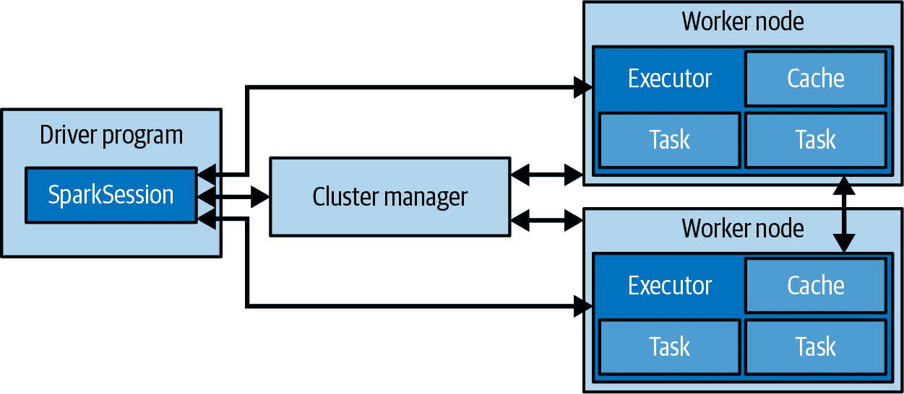

# 第二章。使用 PySpark 进行数据分析介绍

Python 是数据科学任务中最广泛使用的语言。能够使用同一种语言进行统计计算和 Web 编程的前景，促使它在 2010 年代初期的流行。这导致了一个繁荣的工具生态系统和一个为数据分析提供帮助的社区，通常被称为 PyData 生态系统。这是 PySpark 受欢迎的一个重要原因。能够通过 Python 中的 Spark 进行分布式计算帮助数据科学从业者更加高效，因为他们熟悉这种编程语言并且有一个广泛的社区支持。出于同样的原因，我们选择在 PySpark 中编写我们的示例。

很难用言语表达，在一个环境中进行所有数据整理和分析，而不管数据本身存储在何处或如何处理，这种转变有多么具有变革性。这是一种你必须亲自体验才能理解的事情，我们希望我们的示例能捕捉到我们初次使用 PySpark 时所体验到的一些魔力感觉。例如，PySpark 提供了与 pandas 的互操作性，后者是最流行的 PyData 工具之一。我们将在本章进一步探索这个特性。

在本章中，我们将通过一个数据清洗的练习来探索 PySpark 强大的 DataFrame API。在 PySpark 中，DataFrame 是一个抽象概念，用于描述具有规则结构的数据集，其中每条记录是由一组列构成的行，并且每列具有明确定义的数据类型。你可以将 DataFrame 想象成 Spark 生态系统中的表格的类比。尽管命名约定可能让你以为它类似于 `pandas.DataFrame` 对象，但 Spark 的 DataFrames 是一种不同的存在。这是因为它们代表了集群上的分布式数据集，而不是本地数据，其中每一行数据都存储在同一台机器上。尽管在使用 DataFrames 和它们在 Spark 生态系统中扮演的角色方面存在相似之处，但在使用 pandas 或 R 中处理 DataFrame 时习惯的一些事情并不适用于 Spark，因此最好将它们视为独特的实体，并尝试以开放的心态来接近它们。

至于数据清洗，这是任何数据科学项目中的第一步，通常也是最重要的一步。许多精彩的分析因为所分析的数据存在根本的质量问题或基础性的人为瑕疵，导致分析师产生偏见或看到实际并不存在的东西而功亏一篑。因此，没有比通过一个数据清洗的练习更好的方式来介绍使用 PySpark 和 DataFrame 处理数据。

首先，我们将介绍 PySpark 的基础知识，并使用加利福尼亚大学欧文分校的机器学习库中的示例数据集进行练习。我们将重申为什么 PySpark 是进行数据科学的好选择，并介绍其编程模型。然后，我们将在我们的系统或集群上设置 PySpark 并使用 PySpark 的 DataFrame API 分析我们的数据集。您在使用 PySpark 进行数据分析时，大部分时间都将围绕着 DataFrame API，因此准备好与它密切了解。这将为我们做好准备，以便在接下来的章节中深入探讨各种机器学习算法。

对于执行数据科学任务而言，您无需深入了解 Spark 如何在底层工作。然而，理解 Spark 架构的基本概念将使您更容易使用 PySpark 并在编写代码时做出更好的决策。这将在下一节中介绍。

当使用 DataFrame API 时，您的 PySpark 代码应该具有与 Scala 相当的性能。如果您使用 UDF 或 RDD，则会产生性能影响。

# Spark 架构



###### 图 2-1\. Spark 架构图

图 2-1 通过高级组件展示了 Spark 架构。Spark 应用程序作为集群或本地独立的进程集运行。在高层次上，Spark 应用程序由驱动程序、集群管理器和一组执行程序进程组成。驱动程序是中心组件，负责在执行程序进程之间分发任务。将始终存在一个驱动程序进程。当我们谈论扩展性时，我们指的是增加执行程序的数量。集群管理器简单地管理资源。

Spark 是一个分布式的、数据并行的计算引擎。在数据并行模型中，更多的数据分区意味着更多的并行性。分区允许有效的并行处理。将数据分割成块或分区的分布式方案允许 Spark 执行程序仅处理靠近它们的数据，从而最小化网络带宽。也就是说，每个执行程序的核心被分配了自己的数据分区来处理。每当涉及到分区的选择时，请记住这一点。

Spark 编程始于一个数据集，通常驻留在某种形式的分布式持久存储中，例如 Hadoop 分布式文件系统（HDFS）或像 AWS S3 这样的云解决方案，并且格式为 Parquet。编写 Spark 程序通常包括以下几个步骤：

1.  对输入数据集定义一组转换。

1.  调用操作，将转换后的数据集输出到持久存储或将结果返回到驱动程序的本地内存。这些操作理想情况下将由工作节点执行，如图 2-1 中右侧所示。

1.  在本地运行计算，其操作基于分布式计算的结果。这些计算可以帮助您决定接下来要进行的转换和操作。

重要的是要记住，PySpark 的所有高级抽象仍然依赖于自从 Spark 最初推出以来一直存在的哲学：存储和执行的相互作用。了解这些原则将帮助您更好地利用 Spark 进行数据分析。

接下来，我们将在我们的机器上安装并设置 PySpark，以便开始进行数据分析。这是一个一次性的练习，将帮助我们运行本章和以下章节的代码示例。

# 安装 PySpark

本书中的示例和代码假设您有 Spark 3.1.1 可用。为了跟随代码示例，从 [PyPI 仓库](https://oreil.ly/t0WBZ) 安装 PySpark。

```py
$ pip3 install pyspark
```

请注意，PySpark 需要安装 Java 8 或更新版本。如果您想要 SQL、ML 和/或 MLlib 作为额外的依赖项，这也是一个选择。我们稍后会需要这些。

```py
$ pip3 install pyspark[sql,ml,mllib]
```

从 PyPI 安装跳过了运行 Scala、Java 或 R 所需的库。您可以从 [Spark 项目站点](https://oreil.ly/pK2Wi) 获取完整的发布版。请参阅 [Spark 文档](https://oreil.ly/FLh4U)，了解如何在集群或本地环境中设置 Spark 环境的说明。

现在我们准备启动 `pyspark-shell`，这是 Python 语言的 REPL，还具有一些特定于 Spark 的扩展功能。这类似于您可能使用过的 Python 或 IPython shell。如果您只是在个人电脑上运行这些示例，可以通过指定 `local[N]`（其中 `N` 是要运行的线程数）或 `*`（匹配机器上可用的核心数）来启动本地 Spark 集群。例如，在八核机器上启动一个使用八个线程的本地集群：

```py
$ pyspark --master local[*]
```

Spark 应用本身通常被称为 Spark *集群*。这是一个逻辑抽象，不同于物理集群（多台机器）。

如果您有一个运行支持 YARN 的 Hadoop 集群，可以使用 `yarn` 作为 Spark 主机值，在集群上启动 Spark 作业：

```py
$ pyspark --master yarn --deploy-mode client
```

本书其余示例中不会显示 `--master` 参数给 `spark-shell`，但通常需要根据您的环境指定此参数。

若要使 Spark shell 充分利用您的资源，您可能需要指定额外的参数。您可以通过执行 `pyspark --help` 查找参数列表。例如，在使用本地主机运行 Spark 时，您可以使用 `--driver-memory 2g` 让单个本地进程使用 2 GB 内存。YARN 内存配置更为复杂，类似 `--executor-memory` 的相关选项在 [Spark on YARN 文档](https://oreil.ly/3bRjy) 中有详细解释。

Spark 框架正式支持四种集群部署模式：独立模式、YARN、Kubernetes 和 Mesos。更多细节可以在 [部署 Spark 文档](https://oreil.ly/hG2a5) 中找到。

运行这些命令之后，你将看到 Spark 初始化自身的大量日志消息，但你还应该看到一些 ASCII 艺术，然后是一些额外的日志消息和一个提示符：

```py
Python 3.6.12 |Anaconda, Inc.| (default, Sep  8 2020, 23:10:56)
[GCC 7.3.0] on linux
Type "help", "copyright", "credits" or "license" for more information.
Welcome to
      ____              __
     / __/__  ___ _____/ /__
    _\ \/ _ \/ _ `/ __/  '_/
   /__ / .__/\_,_/_/ /_/\_\   version 3.0.1
      /_/

Using Python version 3.6.12 (default, Sep  8 2020 23:10:56)
SparkSession available as 'spark'.
```

你可以在 shell 中运行`:help`命令。这将提示你启动交互式帮助模式或者请求关于特定 Python 对象的帮助。除了关于`:help`的说明之外，Spark 日志消息还指示“SparkSession 可以作为 *spark* 使用。”这是对`SparkSession`的引用，它充当了所有 Spark 操作和数据的入口点。继续在命令行中输入`spark`：

```py
spark
...
<pyspark.sql.session.SparkSession object at DEADBEEF>
```

REPL 将打印对象的字符串形式。对于`SparkSession`对象，这只是它的名称加上对象在内存中的十六进制地址。(`DEADBEEF`是一个占位符；你看到的确切值会因运行而异。) 在交互式 Spark shell 中，Spark 驱动程序会为你实例化一个 SparkSession，而在 Spark 应用中，你自己创建一个 SparkSession 对象。

在 Spark 2.0 中，SparkSession 成为了所有 Spark 操作和数据的统一入口点。之前使用的入口点如 SparkContext、SQLContext、HiveContext、SparkConf 和 StreamingContext 也可以通过它来访问。

我们应该如何处理`spark`变量？`SparkSession`是一个对象，因此它有相关的方法。我们可以在 PySpark shell 中输入变量名后跟一个点和制表符来查看这些方法：

```py
 spark.[\t]
...
spark.Builder(           spark.conf
spark.newSession(        spark.readStream
spark.stop(              spark.udf
spark.builder            spark.createDataFrame(
spark.range(             spark.sparkContext
spark.streams            spark.version
spark.catalog            spark.getActiveSession(
spark.read               spark.sql(
spark.table(
```

在 SparkSession 提供的所有方法中，我们将最常用的那些方法用于创建 DataFrame。现在我们已经设置好了 PySpark，我们可以设置我们感兴趣的数据集，并开始使用 PySpark 的 DataFrame API 与其交互。这就是我们将在下一节中要做的事情。

# 设置我们的数据

UC Irvine 机器学习库是一个提供有趣（且免费）数据集用于研究和教育的绝佳资源。我们将要分析的数据集是从 2010 年在德国一家医院进行的记录链接研究中精选出来的，它包含了数百万对病人记录，这些记录是根据多种不同的标准进行匹配的，比如病人的姓名（名和姓）、地址和生日。每个匹配字段都被分配了一个从 0.0 到 1.0 的数值分数，这个分数是根据字符串的相似程度来确定的，然后对数据进行了手工标记，以确定哪些对代表同一个人，哪些不代表。用于创建数据集的字段的基本值已被移除，以保护病人的隐私。数字标识符、字段的匹配分数以及每个对的标签（匹配与不匹配）都已发布，供记录链接研究使用。

从 shell 中，让我们从库中提取数据：

```py
$ mkdir linkage
$ cd linkage/
$ curl -L -o donation.zip https://bit.ly/1Aoywaq
$ unzip donation.zip
$ unzip 'block_*.zip'
```

如果你有一个 Hadoop 集群可用，你可以在 HDFS 中为块数据创建一个目录，并将数据集中的文件复制到那里：

```py
$ hadoop dfs -mkdir linkage
$ hadoop dfs -put block_*.csv linkage
```

要为我们的记录链接数据集创建一个数据框架，我们将使用`S⁠p⁠a⁠r⁠k​S⁠e⁠s⁠s⁠i⁠o⁠n`对象。具体来说，我们将使用其 Reader API 上的`csv`方法：

```py
prev = spark.read.csv("linkage/block*.csv")
...
prev
...
DataFrame[_c0: string, _c1: string, _c2: string, _c3: string,...
```

默认情况下，CSV 文件中的每列都被视为`string`类型，并且列名默认为`_c0`、`_c1`、`_c2`等。我们可以通过调用其`show`方法在 shell 中查看数据框架的头部：

```py
prev.show(2)
...
+-----+-----+------------+------------+------------+------------+-------+------+
|  _c0|  _c1|         _c2|         _c3|         _c4|         _c5|    _c6|   _c7|
+-----+-----+------------+------------+------------+------------+-------+------+
| id_1| id_2|cmp_fname_c1|cmp_fname_c2|cmp_lname_c1|cmp_lname_c2|cmp_sex|cmp_bd|
| 3148| 8326|           1|           ?|           1|           ?|      1|     1|
|14055|94934|           1|           ?|           1|           ?|      1|     1|
|33948|34740|           1|           ?|           1|           ?|      1|     1|
|  946|71870|           1|           ?|           1|           ?|      1|     1|
```

我们可以看到 DataFrame 的第一行是标题列的名称，正如我们预期的那样，并且 CSV 文件已经被干净地分割成其各个列。我们还可以看到某些列中存在`?`字符串；我们需要将这些处理为缺失值。除了正确命名每个列外，如果 Spark 能够正确推断每列的数据类型，那将是理想的。

幸运的是，Spark 的 CSV 阅读器通过我们可以在 Reader API 上设置的选项为我们提供了所有这些功能。您可以在[`pyspark`文档](https://oreil.ly/xiLj1)中看到 API 接受的完整选项列表。目前，我们将像这样读取和解析链接数据：

```py
parsed = spark.read.option("header", "true").option("nullValue", "?").\
          option("inferSchema", "true").csv("linkage/block*.csv")
```

当我们对`parsed`数据调用`show`时，我们可以看到列名已正确设置，而`?`字符串已被替换为`null`值。要查看每列的推断类型，我们可以像这样打印`parsed` DataFrame 的模式：

```py
parsed.printSchema()
...
root
 |-- id_1: integer (nullable = true)
 |-- id_2: integer (nullable = true)
 |-- cmp_fname_c1: double (nullable = true)
 |-- cmp_fname_c2: double (nullable = true)
...
```

每个`Column`实例包含列的名称、可以处理每条记录中包含的数据类型的最具体数据类型以及一个布尔字段，指示列是否可能包含 null 值，默认情况下为 true。为了执行模式推断，Spark 必须对数据集进行*两次*扫描：一次用于确定每列的类型，另一次用于实际解析。如果需要，第一次可以对样本进行处理。

如果您预先知道要为文件使用的模式，可以创建`pyspark.sql.types.StructType`类的实例，并通过`schema`函数将其传递给 Reader API。当数据集非常大时，这可能会带来显著的性能优势，因为 Spark 不需要再次扫描数据以确定每列的数据类型。

下面是使用`StructType`和`StructField`定义模式的示例：

```py
from pyspark.sql.types import *
schema = StructType([StructField("id_1", IntegerType(), False),
  StructField("id_2", StringType(), False),
  StructField("cmp_fname_c1", DoubleType(), False)])

spark.read.schema(schema).csv("...")
```

另一种定义模式的方法是使用 DDL（数据定义语言）语句：

```py
schema = "id_1 INT, id_2 INT, cmp_fname_c1 DOUBLE"
```

DataFrames 有许多方法，使我们能够从群集中的数据读取到客户端机器上的 PySpark REPL 中。其中最简单的方法之一是`first`，它将 DataFrame 的第一个元素返回到客户端：

```py
parsed.first()
...
Row(id_1=3148, id_2=8326, cmp_fname_c1=1.0, cmp_fname_c2=None,...
```

`first` 方法对于检查数据集的合理性很有用，但是我们通常对将 DataFrame 的较大样本带回客户端进行分析更感兴趣。当我们知道 DataFrame 只包含少量记录时，我们可以使用 `toPandas` 或 `collect` 方法将 DataFrame 的所有内容作为数组返回给客户端。对于非常大的 DataFrame，使用这些方法可能会导致内存不足异常。因为我们目前还不知道链接数据集有多大，所以我们暂时不做这个操作。

在接下来的几节中，我们将使用本地开发和测试以及集群计算来执行更多的数据清洗和记录链接数据的分析，但是如果您需要花点时间来享受您刚刚进入的这个令人惊叹的新世界，我们当然理解。

# 使用 DataFrame API 进行数据分析

DataFrame API 提供了一套强大的工具，这些工具对于习惯于 Python 和 SQL 的数据科学家可能会很熟悉。在本节中，我们将开始探索这些工具以及如何将它们应用于记录链接数据。

如果我们查看 `parsed` DataFrame 的模式和前几行数据，我们会看到这样：

```py
parsed.printSchema()
...
root
 |-- id_1: integer (nullable = true)
 |-- id_2: integer (nullable = true)
 |-- cmp_fname_c1: double (nullable = true)
 |-- cmp_fname_c2: double (nullable = true)
 |-- cmp_lname_c1: double (nullable = true)
 |-- cmp_lname_c2: double (nullable = true)
 |-- cmp_sex: integer (nullable = true)
 |-- cmp_bd: integer (nullable = true)
 |-- cmp_bm: integer (nullable = true)
 |-- cmp_by: integer (nullable = true)
 |-- cmp_plz: integer (nullable = true)
 |-- is_match: boolean (nullable = true)

...

parsed.show(5)
...
+-----+-----+------------+------------+------------+------------+.....
| id_1| id_2|cmp_fname_c1|cmp_fname_c2|cmp_lname_c1|cmp_lname_c2|.....
+-----+-----+------------+------------+------------+------------+.....
| 3148| 8326|         1.0|        null|         1.0|        null|.....
|14055|94934|         1.0|        null|         1.0|        null|.....
|33948|34740|         1.0|        null|         1.0|        null|.....
|  946|71870|         1.0|        null|         1.0|        null|.....
|64880|71676|         1.0|        null|         1.0|        null|.....
```

+   前两个字段是整数 ID，表示在记录中匹配的病人。

+   接下来的九个字段是（可能缺失的）数值（可以是双精度或整数），表示病人记录不同字段（如姓名、生日和位置）上的匹配分数。当只可能的值是匹配（1）或不匹配（0）时，这些字段存储为整数；当可能存在部分匹配时，存储为双精度数值。

+   最后一个字段是布尔值（`true` 或 `false`），指示表示由该行表示的病人记录对是否匹配。

我们的目标是设计一个简单的分类器，以便根据病人记录的匹配分数的值预测记录是否匹配。让我们首先通过 `count` 方法了解我们要处理的记录数量：

```py
parsed.count()
...
5749132
```

这是一个相对较小的数据集——足够小，以至于可以放入集群中的一个节点的内存中，甚至是在您的本地计算机上（如果您没有集群可用的话）。到目前为止，每当我们处理数据时，Spark 都会重新打开文件，重新解析行，然后执行请求的操作，比如显示数据的前几行或者计算记录的数量。当我们提出另一个问题时，Spark 将再次执行这些操作，即使我们已将数据过滤到少量记录或正在使用原始数据集的聚合版本。

这不是我们计算资源的最佳利用方式。数据解析后，我们希望将数据保存在集群上以其解析形式，这样每次想要提出新问题时就无需重新解析数据。Spark 通过允许我们调用实例上的`cache`方法来信号化给定的 DataFrame 在生成后应缓存在内存中来支持这种用例。现在让我们对`parsed` DataFrame 这样做：

```py
parsed.cache()
```

一旦我们的数据已被缓存，我们想知道的下一件事是记录匹配与非匹配的相对比例：

```py
from pyspark.sql.functions import col

parsed.groupBy("is_match").count().orderBy(col("count").desc()).show()
...
+--------+-------+
|is_match|  count|
+--------+-------+
|   false|5728201|
|    true|  20931|
+--------+-------+
```

不是编写一个函数来提取`is_match`列，而是直接将其名称传递给 DataFrame 上的`groupBy`方法，调用`count`方法来统计每个分组内的记录数，基于`count`列按降序排序，然后使用`show`在 REPL 中清晰地呈现计算结果。在底层，Spark 引擎确定执行聚合并返回结果的最有效方式。这展示了使用 Spark 进行数据分析的清晰、快速和表达力强的方式。

请注意，我们可以以两种方式引用 DataFrame 中列的名称：作为文字字符串，如在`groupBy("is_match")`中，或者作为`Column`对象，通过在`count`列上使用的`col`函数。在大多数情况下，任何一种方法都是有效的，但我们需要使用`col`函数来调用所得到的`count`列对象上的`desc`方法。

您可能已经注意到，DataFrame API 中的函数类似于 SQL 查询的组件。这不是巧合，事实上，我们可以将我们创建的任何 DataFrame 视为数据库表，并使用熟悉和强大的 SQL 语法来表达我们的问题。首先，我们需要告诉 Spark SQL 执行引擎应将`parsed` DataFrame 关联的名称，因为变量本身的名称（`parsed`）对于 Spark 不可用：

```py
parsed.createOrReplaceTempView("linkage")
```

因为`parsed` DataFrame 仅在此 PySpark REPL 会话期间可用，它是一个临时表。如果我们配置 Spark 连接到跟踪结构化数据集架构和位置的 Apache Hive 元数据存储，则 Spark SQL 也可以用于查询 HDFS 中的持久表。

一旦我们的临时表已在 Spark SQL 引擎中注册，我们可以像这样查询它：

```py
spark.sql("""
 SELECT is_match, COUNT(*) cnt
 FROM linkage
 GROUP BY is_match
 ORDER BY cnt DESC
""").show()
...
+--------+-------+
|is_match|    cnt|
+--------+-------+
|   false|5728201|
|    true|  20931|
+--------+-------+
```

您可以选择通过调用`enableHiveSupport`方法，在创建`SparkSession`实例时使用符合 ANSI 2003 标准的 Spark SQL（默认方式），或者以 HiveQL 模式运行 Spark。

在 PySpark 中进行分析时，应该使用 Spark SQL 还是 DataFrame API？各有利弊：SQL 具有广泛的熟悉性和表达能力，适用于简单查询。它还允许您使用像 PostgreSQL 这样的数据库或像 Tableau 这样的工具通过 JDBC/ODBC 连接器查询数据。SQL 的缺点在于，它可能难以以动态、可读和可测试的方式表达复杂的多阶段分析——而在这些方面，DataFrame API 表现出色。在本书的其余部分，我们将同时使用 Spark SQL 和 DataFrame API，并留给读者来审视我们所做选择，并将我们的计算从一种接口转换到另一种接口。

我们可以逐个在 DataFrame 上应用函数来获得统计数据，例如计数和均值。然而，PySpark 提供了一种更好的方法来获取数据框的汇总统计信息，这正是我们将在下一节中介绍的内容。

# 快速数据框汇总统计信息

虽然有许多分析可以同样适用 SQL 或 DataFrame API 来表达，但是有一些常见的数据框操作，在 SQL 中表达起来可能会显得繁琐。其中一种特别有帮助的分析是计算数据框中所有数值列非空值的最小值、最大值、均值和标准差。在 PySpark 中，这个函数与 pandas 中的名称相同，即`describe`：

```py
summary = parsed.describe()
...
summary.show()
```

`summary`数据框中每个变量都有一列与`parsed`数据框中的其他列（也称为`summary`）相关的度量标准——`count`、`mean`、`stddev`、`min`或`max`。我们可以使用`select`方法选择列的子集，以使汇总统计信息更易于阅读和比较：

```py
summary.select("summary", "cmp_fname_c1", "cmp_fname_c2").show()
+-------+------------------+------------------+
|summary|      cmp_fname_c1|      cmp_fname_c2|
+-------+------------------+------------------+
|  count|           5748125|            103698|
|   mean|0.7129024704436274|0.9000176718903216|
| stddev|0.3887583596162788|0.2713176105782331|
|    min|               0.0|               0.0|
|    max|               1.0|               1.0|
+-------+------------------+------------------+
```

请注意`count`变量在`cmp_fname_c1`和`cmp_fname_c2`之间的差异。几乎每条记录都有`cmp_fname_c1`的非空值，但不到 2%的记录有`cmp_fname_c2`的非空值。要创建一个有用的分类器，我们需要依赖那些数据中几乎总是存在的变量，除非它们的缺失说明了记录是否匹配的某些有意义的信息。

一旦我们对数据中变量的分布有了整体感觉，我们希望了解这些变量的值如何与`is_match`列的值相关联。因此，我们的下一步是仅计算与匹配和非匹配对应的`parsed` DataFrame 子集的相同汇总统计信息。我们可以使用类似 SQL 的`where`语法或使用 DataFrame API 中的`Column`对象来过滤数据框，然后对结果数据框使用`describe`：

```py
matches = parsed.where("is_match = true")
match_summary = matches.describe()

misses = parsed.filter(col("is_match") == False)
miss_summary = misses.describe()
```

我们在传递给`where`函数的字符串中使用的逻辑可以包含在 Spark SQL 的`WHERE`子句中有效的语句。对于使用 DataFrame API 的过滤条件，我们在`is_match`列对象上使用`==`运算符，检查是否等于布尔对象`False`，因为这只是 Python，而不是 SQL。请注意，`where`函数是`filter`函数的别名；我们可以在上面的片段中颠倒`where`和`filter`调用，结果仍然会相同。

现在我们可以开始比较`match_summary`和`miss_summary` DataFrames，以查看变量的分布如何随记录是匹配还是未匹配而变化。尽管这是一个相对较小的数据集，但进行这种比较仍然有些繁琐——我们真正想要的是对`match_summary`和`miss_summary` DataFrames 进行转置，使行和列互换，这样我们可以通过变量联合转置后的 DataFrames 并分析汇总统计数据，这是大多数数据科学家所知的“数据透视”或“重塑”数据集的做法。在下一节中，我们将展示如何执行这些转换。

# 数据透视和重塑 DataFrames

我们可以使用 PySpark 提供的函数完全转置 DataFrames。然而，还有另一种执行此任务的方法。PySpark 允许在 Spark 和 pandas DataFrames 之间进行转换。我们将会把相关的 DataFrames 转换为 pandas DataFrames，重新整理它们，然后再转换回 Spark DataFrames。由于`summary`、`match_summary`和`miss_summary` DataFrames 的规模较小，我们可以安全地这样做，因为 pandas DataFrames 存储在内存中。在接下来的章节中，对于更大的数据集，我们将依赖于 Spark 操作来进行这些转换。

由于 Apache Arrow 项目的支持，我们可以进行 pandas DataFrames 与 Spark DataFrames 之间的转换，它允许在 JVM 和 Python 进程之间进行高效的数据传输。当我们使用 pip 安装`pyspark[sql]`时，PyArrow 库已作为 Spark SQL 模块的依赖安装。

让我们将`summary`转换为 pandas DataFrame：

```py
summary_p = summary.toPandas()
```

现在我们可以在`summary_p` DataFrame 上使用 pandas 函数：

```py
summary_p.head()
...
summary_p.shape
...
(5,12)
```

现在我们可以执行一个转置操作，使用熟悉的 pandas 方法在 DataFrame 上交换行和列：

```py
summary_p = summary_p.set_index('summary').transpose().reset_index()
...
summary_p = summary_p.rename(columns={'index':'field'})
...
summary_p = summary_p.rename_axis(None, axis=1)
...
summary_p.shape
...
(11,6)
```

我们已成功转置了`summary_p` pandas DataFrame。使用 SparkSession 的`createDataFrame`方法将其转换为 Spark DataFrame：

```py
summaryT = spark.createDataFrame(summary_p)
...
summaryT.show()
...
+------------+-------+-------------------+-------------------+---+------+
|       field|  count|               mean|             stddev|min|   max|
+------------+-------+-------------------+-------------------+---+------+
|        id_1|5749132|  33324.48559643438| 23659.859374488064|  1| 99980|
|        id_2|5749132|  66587.43558331935| 23620.487613269695|  6|100000|
|cmp_fname_c1|5748125| 0.7129024704437266|0.38875835961628014|0.0|   1.0|
|cmp_fname_c2| 103698| 0.9000176718903189| 0.2713176105782334|0.0|   1.0|
|cmp_lname_c1|5749132| 0.3156278193080383| 0.3342336339615828|0.0|   1.0|
|cmp_lname_c2|   2464| 0.3184128315317443|0.36856706620066537|0.0|   1.0|
|     cmp_sex|5749132|  0.955001381078048|0.20730111116897781|  0|     1|
|      cmp_bd|5748337|0.22446526708507172|0.41722972238462636|  0|     1|
|      cmp_bm|5748337|0.48885529849763504| 0.4998758236779031|  0|     1|
|      cmp_by|5748337| 0.2227485966810923| 0.4160909629831756|  0|     1|
|     cmp_plz|5736289|0.00552866147434343|0.07414914925420046|  0|     1|
+------------+-------+-------------------+-------------------+---+------+
```

我们还没有完成。打印`summaryT` DataFrame 的模式：

```py
summaryT.printSchema()
...
root
 |-- field: string (nullable = true)
 |-- count: string (nullable = true)
 |-- mean: string (nullable = true)
 |-- stddev: string (nullable = true)
 |-- min: string (nullable = true)
 |-- max: string (nullable = true)
```

在从`describe`方法获取的 summary 架构中，每个字段都被视为字符串。由于我们希望将汇总统计数据分析为数字，我们需要将值从字符串转换为双精度数：

```py
from pyspark.sql.types import DoubleType
for c in summaryT.columns:
  if c == 'field':
    continue
  summaryT = summaryT.withColumn(c, summaryT[c].cast(DoubleType()))
...
summaryT.printSchema()
...
root
 |-- field: string (nullable = true)
 |-- count: double (nullable = true)
 |-- mean: double (nullable = true)
 |-- stddev: double (nullable = true)
 |-- min: double (nullable = true)
 |-- max: double (nullable = true)
```

现在我们已经弄清楚如何转置汇总 DataFrame，让我们把我们的逻辑实现为一个函数，以便在`match_summary`和`m⁠i⁠s⁠s⁠_​s⁠u⁠m⁠m⁠a⁠r⁠y` DataFrames 上重复使用：

```py
from pyspark.sql import DataFrame
from pyspark.sql.types import DoubleType

def pivot_summary(desc):
  # convert to pandas dataframe
  desc_p = desc.toPandas()
  # transpose
  desc_p = desc_p.set_index('summary').transpose().reset_index()
  desc_p = desc_p.rename(columns={'index':'field'})
  desc_p = desc_p.rename_axis(None, axis=1)
  # convert to Spark dataframe
  descT = spark.createDataFrame(desc_p)
  # convert metric columns to double from string
  for c in descT.columns:
    if c == 'field':
      continue
    else:
      descT = descT.withColumn(c, descT[c].cast(DoubleType()))
  return descT
```

现在在你的 Spark shell 中，对 `match_summary` 和 `miss_summary` DataFrames 使用 `pivot_summary` 函数：

```py
match_summaryT = pivot_summary(match_summary)
miss_summaryT = pivot_summary(miss_summary)
```

现在我们成功地转置了摘要 DataFrame，接下来我们将它们联接和比较。这将在下一节中进行。此外，我们还将选择用于构建模型的理想特征。

# 连接 DataFrames 和选择特征

到目前为止，我们仅使用 Spark SQL 和 DataFrame API 来过滤和聚合数据集中的记录，但我们也可以使用这些工具在 DataFrame 上执行连接操作（内连接、左连接、右连接或全连接）。虽然 DataFrame API 包括一个 `join` 函数，但是在要连接的表具有许多列名相同时，并且我们想要能够清楚地指示我们在选择表达式中正在引用的列时，使用 Spark SQL 表达这些连接通常更容易。让我们为 `match_summaryT` 和 `miss_summaryT` DataFrames 创建临时视图，在 `field` 列上对它们进行连接，并对结果行进行一些简单的摘要统计：

```py
match_summaryT.createOrReplaceTempView("match_desc")
miss_summaryT.createOrReplaceTempView("miss_desc")
spark.sql("""
 SELECT a.field, a.count + b.count total, a.mean - b.mean delta
 FROM match_desc a INNER JOIN miss_desc b ON a.field = b.field
 WHERE a.field NOT IN ("id_1", "id_2")
 ORDER BY delta DESC, total DESC
""").show()
...
+------------+---------+--------------------+
|       field|    total|               delta|
+------------+---------+--------------------+
|     cmp_plz|5736289.0|  0.9563812499852176|
|cmp_lname_c2|   2464.0|  0.8064147192926264|
|      cmp_by|5748337.0|  0.7762059675300512|
|      cmp_bd|5748337.0|   0.775442311783404|
|cmp_lname_c1|5749132.0|  0.6838772482590526|
|      cmp_bm|5748337.0|  0.5109496938298685|
|cmp_fname_c1|5748125.0|  0.2854529057460786|
|cmp_fname_c2| 103698.0| 0.09104268062280008|
|     cmp_sex|5749132.0|0.032408185250332844|
+------------+---------+--------------------+
```

一个好的特征具有两个属性：它倾向于在匹配和非匹配中有显著不同的值（因此均值之间的差异会很大），并且在数据中经常出现，我们可以依赖它定期为任何一对记录提供。按此标准，`cmp_fname_c2` 并不是非常有用，因为它经常缺失，而且在匹配和非匹配的均值之间的差异相对较小——为了一个从 0 到 1 的得分来说，差异只有 0.09。`cmp_sex` 特征也并不特别有帮助，因为即使它对于任何一对记录都是可用的，均值之间的差异只有 0.03。

特征 `cmp_plz` 和 `cmp_by` 非常出色。几乎每对记录都会出现它们，并且它们的均值差异非常大（两个特征均超过 0.77）。特征 `cmp_bd`、`cmp_lname_c1` 和 `cmp_bm` 也看起来有益：它们通常在数据集中出现，并且在匹配和非匹配之间的均值差异也很显著。

特征 `cmp_fname_c1` 和 `cmp_lname_c2` 的情况更加复杂：`cmp_fname_c1` 的区分度并不太好（均值之间的差异仅为 0.28），尽管它通常对于一对记录来说是可用的，而 `cmp_lname_c2` 的均值差异很大，但几乎总是缺失。基于这些数据，我们不太明确在什么情况下应该将这些特征包含在我们的模型中。

现在，我们将使用一个简单的评分模型，根据明显好特征的值之和对记录对的相似性进行排名：`cmp_plz`、`cmp_by`、`cmp_bd`、`cmp_lname_c1` 和 `cmp_bm`。对于这些特征值缺失的少数记录，我们将在我们的汇总中使用 0 替代 `null` 值。我们可以通过创建计算得分和 `is_match` 列的数据框架来大致了解我们简单模型的性能，并评估该分数在各种阈值下如何区分匹配和非匹配。

# 打分与模型评估

对于我们的评分函数，我们将汇总五个字段的值（`cmp_lname_c1`、`cmp_plz`、`cmp_by`、`cmp_bd` 和 `cmp_bm`）。我们将使用来自 `pyspark.sql.functions` 的 `expr` 来执行这些操作。`expr` 函数将输入表达式字符串解析为其表示的列。该字符串甚至可以涉及多个列。

让我们创建所需的表达式字符串：

```py
good_features = ["cmp_lname_c1", "cmp_plz", "cmp_by", "cmp_bd", "cmp_bm"]
...
sum_expression = " + ".join(good_features)
...
sum_expression
...
'cmp_lname_c1 + cmp_plz + cmp_by + cmp_bd + cmp_bm'
```

现在我们可以使用 `sum_expression` 字符串来计算分数。在汇总值时，我们将使用 DataFrame 的 `fillna` 方法来处理和替换空值为 0：

```py
from pyspark.sql.functions import expr
scored = parsed.fillna(0, subset=good_features).\
                withColumn('score', expr(sum_expression)).\
                select('score', 'is_match')
...
scored.show()
...
+-----+--------+
|score|is_match|
+-----+--------+
|  5.0|    true|
|  5.0|    true|
|  5.0|    true|
|  5.0|    true|
|  5.0|    true|
|  5.0|    true|
|  4.0|    true|
...
```

创建我们评分函数的最后一步是决定分数必须超过哪个阈值，以便我们预测两条记录代表匹配。如果设置的阈值过高，则会错误地将匹配记录标记为未命中（称为*假阴性*率），而如果设置的阈值过低，则会错误地将未命中标记为匹配（*假阳性*率）。对于任何非平凡问题，我们总是需要在两种错误类型之间进行权衡，并且模型适用于的情况通常取决于这两种错误的相对成本。

为了帮助我们选择阈值，创建一个*列联表*（有时称为*交叉制表*或*交叉表*），计算得分高于/低于阈值的记录数，交叉与每个类别中的记录数是否匹配。由于我们还不知道要使用哪个阈值，让我们编写一个函数，它以 `scored` DataFrame 和阈值选择为参数，并使用 DataFrame API 计算交叉制表：

```py
def crossTabs(scored: DataFrame, t: DoubleType) -> DataFrame:
  return  scored.selectExpr(f"score >= {t} as above", "is_match").\
          groupBy("above").pivot("is_match", ("true", "false")).\
          count()
```

请注意，我们包括 DataFrame API 的 `selectExpr` 方法，通过 Python 的 f-string 格式化语法动态确定基于 `t` 参数的字段 `above` 的值，该语法允许我们按名称替换变量，如果我们用字母 `f` 开头的字符串文字（这是另一个有用的 Scala 隐式魔法）。一旦定义了 `above` 字段，我们就使用我们之前使用的 `groupBy`、`pivot` 和 `count` 方法的标准组合创建交叉制表。

通过应用高阈值值 4.0，意味着五个特征的平均值为 0.8，我们可以过滤掉几乎所有的非匹配项，同时保留超过 90% 的匹配项：

```py
crossTabs(scored, 4.0).show()
...
+-----+-----+-------+
|above| true|  false|
+-----+-----+-------+
| true|20871|    637|
|false|   60|5727564|
+-----+-----+-------+
```

通过应用较低的阈值 2.0，我们可以确保捕获*所有*已知的匹配记录，但在假阳性方面要付出相当大的代价（右上角的单元格）：

```py
crossTabs(scored, 2.0).show()
...
+-----+-----+-------+
|above| true|  false|
+-----+-----+-------+
| true|20931| 596414|
|false| null|5131787|
+-----+-----+-------+
```

尽管假阳性的数量高于我们的期望，这种更慷慨的过滤器仍然将 90% 的非匹配记录从我们的考虑中移除，同时包括每一个正匹配项。尽管这已经相当不错了，但可能还有更好的方法；看看你能否找到一种利用 `MatchData` 中的其他值（包括缺失的和不缺失的）来设计一个评分函数，成功识别每一个真正的匹配项，并且假阳性少于 100 个。

# 下一步该怎么办

如果这一章是您第一次使用 PySpark 进行数据准备和分析，希望您能感受到这些工具提供的强大基础。如果您已经使用 Python 和 Spark 一段时间了，希望您将本章介绍给您的朋友和同事，让他们也体验一下这种强大的力量。

本章的目标是为您提供足够的知识，以便能够理解并完成本书中其余示例的学习。如果你是那种通过实际示例学习最好的人，那么您的下一步是继续学习下一组章节，我们将向您介绍为 Spark 设计的机器学习库 MLlib。
