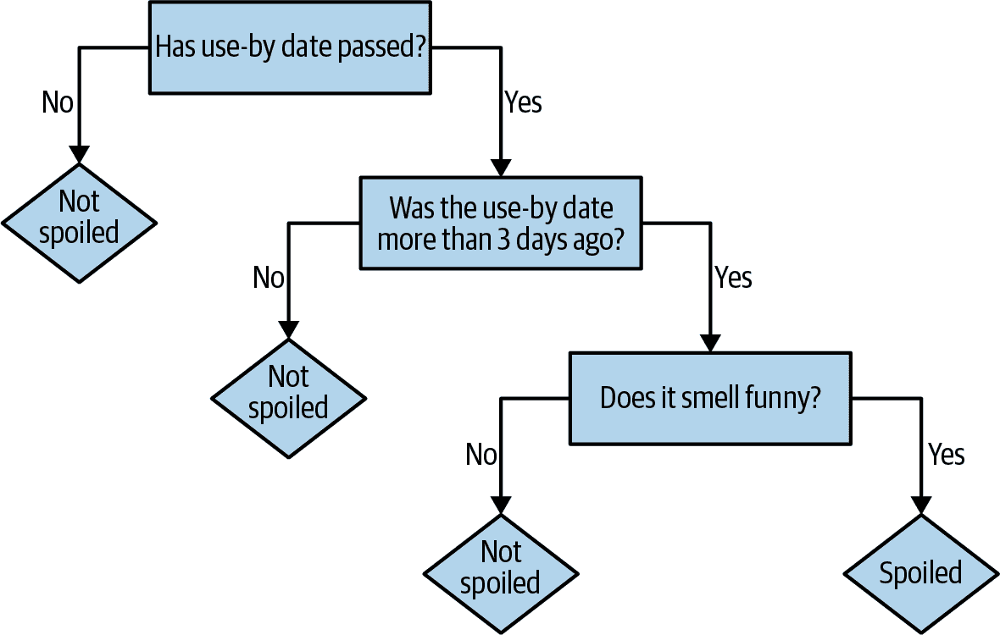
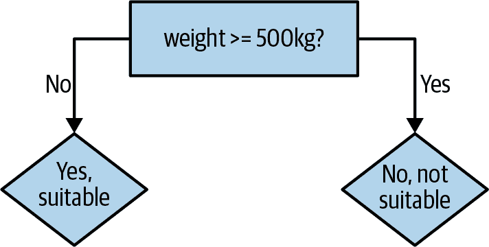

# 第四章：使用决策树和决策森林进行预测

分类和回归是最古老和最研究充分的预测分析类型。在分析软件包和库中，您可能会遇到的大多数算法都是分类或回归技术，如支持向量机、逻辑回归、神经网络和深度学习。联系回归和分类的共同点是，两者都涉及根据一个或多个其他值预测一个（或多个）值。为此，两者都需要一系列输入和输出进行学习。它们需要被提供问题和已知答案。因此，它们被称为监督学习类型。

PySpark MLlib 提供了多种分类和回归算法的实现。这些包括决策树、朴素贝叶斯、逻辑回归和线性回归。这些算法的令人兴奋之处在于它们可以帮助预测未来——或者至少可以预测我们尚不确定的事情，例如基于您的在线行为预测您购买汽车的可能性，给定其包含的单词判断一封电子邮件是否为垃圾，或者哪些土地可能根据其位置和土壤化学成分长出最多的作物。

在本章中，我们将重点介绍一种用于分类和回归的流行且灵活的算法（决策树），以及该算法的扩展（随机决策森林）。首先，我们将了解决策树和森林的基础，并介绍前者的 PySpark 实现。决策树的 PySpark 实现支持二元和多类分类以及回归。该实现通过行分割数据，允许使用数百万甚至数十亿个实例进行分布式训练。接下来是数据集的准备和第一棵决策树的创建。然后我们将调整我们的决策树模型。最后，我们将在处理过的数据集上训练一个随机森林模型并进行预测。

虽然 PySpark 的决策树实现很容易上手，但理解决策树和随机森林算法的基础是非常有帮助的。这是我们下一节要讨论的内容。

# 决策树和森林

*决策树* 是一类算法，可以自然地处理分类和数值特征。可以使用并行计算构建单棵树，并且可以同时并行构建多棵树。它们对数据中的异常值具有鲁棒性，这意味着少数极端和可能错误的数据点可能根本不会影响预测。它们可以处理不同类型和不同尺度的数据，而无需预处理或归一化。

基于决策树的算法具有相对直观和理解的优势。实际上，我们在日常生活中可能都在隐式地使用决策树体现的相同推理方式。例如，我坐下来喝带有牛奶的早晨咖啡。在我决定使用这份牛奶之前，我想要预测：这牛奶是否变质了？我不能确定。我可能会检查是否过期日期已过。如果没有，我预测不会变质。如果日期过了，但是在三天内，我会冒险预测不会变质。否则，我会闻一闻这牛奶。如果闻起来有点怪，我预测会变质，否则预测不会。

这一系列的是/否决策导致了一个预测，这正是决策树体现的内容。每个决策导致两种结果之一，即预测或另一个决策，如图 4-1 所示。从这个意义上说，将这个过程视为决策树是很自然的，其中树的每个内部节点都是一个决策，每个叶节点都是一个最终答案。

这是一个简单的决策树，没有经过严格构建。为了详细说明，考虑另一个例子。一个机器人在一家异国情调的宠物店找了份工作。它希望在店铺开门前了解哪些动物适合孩子作为宠物。店主匆匆列出了九只适合和不适合的宠物，然后匆忙离去。机器人根据观察到的信息从表 4-1 中整理了这些动物的特征向量。



###### 图 4-1\. 决策树：牛奶是否变质？

表 4-1\. 异国情调宠物店的“特征向量”

| 名称 | 重量（公斤） | # 腿 | 颜色 | 适合作宠物？ |
| --- | --- | --- | --- | --- |
| 菲多 | 20.5 | 4 | 棕色 | 是 |
| 斯莱瑟先生 | 3.1 | 0 | 绿色 | 否 |
| 尼莫 | 0.2 | 0 | 棕色 | 是 |
| 邓波 | 1390.8 | 4 | 灰色 | 否 |
| 基蒂 | 12.1 | 4 | 灰色 | 是 |
| 吉姆 | 150.9 | 2 | 棕色 | 否 |
| 米莉 | 0.1 | 100 | 棕色 | 否 |
| 麦克鸽 | 1.0 | 2 | 灰色 | 否 |
| 斯波特 | 10.0 | 4 | 棕色 | 是 |

机器人可以为列出的九只宠物做出决策。店里还有更多的宠物可供选择。它仍然需要一个方法来决定哪些动物适合孩子作宠物。我们可以假设店里所有动物的特征都是可用的。使用店主提供的决策数据和一个决策树，我们可以帮助机器人学习什么样的动物适合孩子作宠物。

虽然给出了一个名字，但不会将其作为我们决策树模型的特征包括进去。凭名字预测的依据有限；“菲利克斯”可能是一只猫，也可能是一只有毒的塔兰图拉蜘蛛。因此，有两个数值特征（重量、腿的数量）和一个分类特征（颜色）预测一个分类目标（适合/不适合孩子作宠物）。

决策树的工作方式是基于提供的特征进行一个或多个顺序决策。首先，机器人可能会尝试将一个简单的决策树拟合到这些训练数据中，这棵树只有一个基于重量的决策，如在图 4-2 中所示。



###### 图 4-2\. 机器人的第一个决策树

决策树的逻辑易于理解和理解：500kg 的动物听起来确实不适合作为宠物。这个规则在九个案例中预测了五次正确的值。快速浏览表明，我们可以通过将重量阈值降低到 100kg 来改进规则。这样可以在九个示例中正确预测六次。现在重的动物被正确预测了；轻的动物只部分正确。

因此，可以构建第二个决策来进一步细化对重量小于 100kg 的示例的预测。选择一个可以将一些不正确的是预测改为不的特征是一个好主意。例如，有一种小的绿色动物，听起来可疑地像蛇，将被我们当前的模型分类为适合的宠物候选者。通过添加基于颜色的决策，机器人可以正确预测，如在图 4-3 中所示。


###### 图 4-3\. 机器人的下一个决策树

现在，九个例子中有七个是正确的。当然，可以添加决策规则，直到所有九个都被正确预测。生成的决策树所体现的逻辑在转化为通俗的语言时可能听起来不太可信：“如果动物的重量小于 100kg，它的颜色是棕色而不是绿色，并且它的腿少于 10 条，那么是，它是一个适合的宠物。”虽然完全符合给定的例子，但这样的决策树在预测小型、棕色、四条腿的狼獾不适合作为宠物时会失败。需要一些平衡来避免这种现象，称为*过拟合*。

决策树推广为更强大的算法，称为*随机森林*。随机森林结合了许多决策树，以减少过拟合的风险，并单独训练决策树。该算法通过在训练过程中引入随机性，使每棵决策树略有不同。结合预测结果降低了预测的方差，使得生成的模型更具泛化能力，并提高了在测试数据上的表现。

这已经足够介绍决策树和随机森林，我们将在 PySpark 中开始使用它们。在下一节中，我们将介绍我们将在 PySpark 中使用的数据集，并为其准备数据。

# 准备数据

本章使用的数据集是著名的 Covtype 数据集，可在[网上](https://oreil.ly/spUWl)获取，以压缩的 CSV 格式数据文件*covtype.data.gz*和配套的信息文件*covtype.info*。

数据集记录了美国科罗拉多州森林覆盖地块的类型。这个数据集关注现实世界的森林只是巧合！每个数据记录包含描述每块土地的几个特征，比如海拔、坡度、到水源的距离、阴影和土壤类型，以及覆盖该土地的已知森林类型。需要从其余的特征中预测森林覆盖类型，总共有 54 个特征。

这个数据集已经被用于研究，甚至是一个 [Kaggle 竞赛](https://oreil.ly/LpjgW)。这是一个有趣的数据集，在这一章中探索它是因为它包含分类和数值特征。数据集中有 581,012 个例子，虽然不完全符合大数据的定义，但足够作为一个例子管理，并且仍然突出了一些规模问题。

幸运的是，数据已经以简单的 CSV 格式存在，并且不需要太多的清洗或其他准备工作即可与 PySpark MLlib 一起使用。 *covtype.data* 文件应该被提取并复制到您的本地或云存储（如 AWS S3）中。

启动 `pyspark-shell`。如果你有足够的内存，指定`--driver-memory 8g`或类似的参数可能会有所帮助，因为构建决策森林可能会消耗大量资源。

CSV 文件包含基本的表格数据，组织成行和列。有时这些列在标题行中有名称，尽管这在这里不是这样。列名在配套文件 *covtype.info* 中给出。在概念上，CSV 文件的每一列也有一个类型——数字、字符串——但 CSV 文件并未指定这一点。

将这些数据解析为数据框是很自然的，因为这是 PySpark 对表格数据的抽象，具有定义的列模式，包括列名和类型。 PySpark 内置支持读取 CSV 数据。让我们使用内置的 CSV 读取器将我们的数据集读取为 DataFrame：

```py
data_without_header = spark.read.option("inferSchema", True)\
                      .option("header", False).csv("data/covtype.data")
data_without_header.printSchema()
...
root
 |-- _c0: integer (nullable = true)
 |-- _c1: integer (nullable = true)
 |-- _c2: integer (nullable = true)
 |-- _c3: integer (nullable = true)
 |-- _c4: integer (nullable = true)
 |-- _c5: integer (nullable = true)
 ...
```

这段代码将输入作为 CSV 读取，并且不试图解析第一行作为列名的标题。它还请求通过检查数据来推断每列的类型。它正确地推断出所有列都是数字，更具体地说是整数。不幸的是，它只能将列命名为 `_c0` 等。

我们可以查看 *covtype.info* 文件获取列名。

```py
$ cat data/covtype.info

...
[...]
7.	Attribute information:

Given is the attribute name, attribute type, the measurement unit and
a brief description.  The forest cover type is the classification
problem.  The order of this listing corresponds to the order of
numerals along the rows of the database.

Name                                    Data Type
Elevation                               quantitative
Aspect                                  quantitative
Slope                                   quantitative
Horizontal_Distance_To_Hydrology        quantitative
Vertical_Distance_To_Hydrology          quantitative
Horizontal_Distance_To_Roadways         quantitative
Hillshade_9am                           quantitative
Hillshade_Noon                          quantitative
Hillshade_3pm                           quantitative
Horizontal_Distance_To_Fire_Points      quantitative
Wilderness_Area (4 binary columns)      qualitative
Soil_Type (40 binary columns)           qualitative
Cover_Type (7 types)                    integer

Measurement                  Description

meters                       Elevation in meters
azimuth                      Aspect in degrees azimuth
degrees                      Slope in degrees
meters                       Horz Dist to nearest surface water features
meters                       Vert Dist to nearest surface water features
meters                       Horz Dist to nearest roadway
0 to 255 index               Hillshade index at 9am, summer solstice
0 to 255 index               Hillshade index at noon, summer soltice
0 to 255 index               Hillshade index at 3pm, summer solstice
meters                       Horz Dist to nearest wildfire ignition point
0 (absence) or 1 (presence)  Wilderness area designation
0 (absence) or 1 (presence)  Soil Type designation
1 to 7                       Forest Cover Type designation
...
```

查看列信息时，显然有些特征确实是数值型的。 `Elevation` 是以米为单位的海拔；`Slope` 是以度为单位的。然而，`Wilderness_Area` 是另一回事，因为它据说跨越四列，每列是 0 或 1。实际上，`Wilderness_Area` 是一个分类值，而不是数值。

这四列实际上是一种独热或 1-of-N 编码。当对分类特征执行这种编码时，一个分类特征，它有 *N* 个不同的值，就变成了 *N* 个数值特征，每个特征的值为 0 或 1。这 *N* 个值中恰好有一个值为 1，其余为 0。例如，一个可以是 `cloudy`、`rainy` 或 `clear` 的天气分类特征会变成三个数值特征，其中 `cloudy` 由 `1,0,0` 表示，`rainy` 由 `0,1,0` 表示，依此类推。这三个数值特征可以被视为 `is_cloudy`、`is_rainy` 和 `is_clear` 特征。同样，其他 40 列实际上是一个 `Soil_Type` 分类特征。

编码分类特征为数字并不是唯一的方法。另一种可能的编码方式是，将分类特征的每个可能值分配一个不同的数值。例如，`cloudy` 可以变成 1.0，`rainy` 变成 2.0，依此类推。目标本身 `Cover_Type` 是一个被编码为 1 到 7 的分类值。

在将分类特征编码为单个数值特征时要小心。原始的分类值没有顺序，但是当编码为数字时，它们似乎有了顺序。将编码特征视为数值会导致毫无意义的结果，因为算法实际上是假装 `rainy` 比 `cloudy` 更大，并且是 `cloudy` 的两倍大。只要编码的数值不被用作数字，这是可以接受的。

我们已经看到了分类特征的两种编码类型。也许，如果不编码这些特征（而且是两种方式），而是直接包含它们的值，像“Rawah Wilderness Area”，可能会更简单和更直接。这可能是历史的遗留；数据集发布于 1998 年。出于性能原因或者为了与当时更多用于回归问题的库的期望格式相匹配，数据集经常包含以这些方式编码的数据。

无论如何，在继续之前，给这个 DataFrame 添加列名是很有用的，以便更容易地处理它：

```py
from pyspark.sql.types import DoubleType
from pyspark.sql.functions import col

colnames = ["Elevation", "Aspect", "Slope", \
            "Horizontal_Distance_To_Hydrology", \
            "Vertical_Distance_To_Hydrology", "Horizontal_Distance_To_Roadways", \
            "Hillshade_9am", "Hillshade_Noon", "Hillshade_3pm", \
            "Horizontal_Distance_To_Fire_Points"] + \ 
[f"Wilderness_Area_{i}" for i in range(4)] + \ [f"Soil_Type_{i}" for i in range(40)] + \ ["Cover_Type"]

data = data_without_header.toDF(*colnames).\
                          withColumn("Cover_Type",
                                    col("Cover_Type").cast(DoubleType()))

data.head()
...
Row(Elevation=2596,Aspect=51,Slope=3,Horizontal_Distance_To_Hydrology=258,...)
```


+ 连接集合。

与荒野和土壤相关的列被命名为 `Wilderness_Area_0`、`Soil_Type_0` 等，一点点 Python 可以生成这些 44 个名称，而不必逐个打出。最后，目标 `Cover_Type` 列被提前转换为 `double` 值，因为在所有 PySpark MLlib API 中实际上需要将其作为 `double` 而不是 `int` 来使用。这将在稍后变得明显。

您可以调用 `data.show` 来查看数据集的一些行，但是显示的宽度非常宽，可能会难以阅读全部。`data.head` 将其显示为原始的 `Row` 对象，在这种情况下更易读。

现在我们熟悉了数据集并且已经处理过了，我们可以训练一个决策树模型。

# 我们的第一个决策树

在第三章，我们立即在所有可用数据上构建了一个推荐模型。这创建了一个可以由任何对音乐有一定了解的人进行审查的推荐器：通过查看用户的听歌习惯和推荐，我们感觉到它产生了良好的结果。在这里，这是不可能的。我们无法想象如何为科罗拉多州的一块新地块编写一个包含 54 个特征的描述，或者期望从这样一个地块获得什么样的森林覆盖。

相反，我们必须直接跳到保留一些数据来评估生成的模型。之前，使用 AUC 指标来评估保留的听觉数据与推荐预测之间的一致性。AUC 可以视为随机选择的好推荐优于随机选择的坏推荐的概率。这里的原则是相同的，尽管评估指标将会不同：*准确度*。大部分——90%——的数据将再次用于训练，稍后，我们将看到这个训练集的一个子集将被保留用于交叉验证（CV 集）。这里保留的另外 10%实际上是第三个子集，一个适当的测试集。

```py
(train_data, test_data) = data.randomSplit([0.9, 0.1])
train_data.cache()
test_data.cache()
```

数据需要更多的准备工作才能与 MLlib 中的分类器一起使用。输入 DataFrame 包含许多列，每一列都包含一个特征，可以用来预测目标列。MLlib 要求所有输入都收集到*一个*列中，其值是一个向量。PySpark 的`VectorAssembler`类是在线性代数意义上向量的抽象，只包含数字。对于大多数意图和目的来说，它们工作起来就像一个简单的`double`值数组（浮点数）。当然，输入特征中有一些在概念上是分类的，即使它们在输入中都用数字表示。

幸运的是，`VectorAssembler`类可以完成这项工作：

```py
from pyspark.ml.feature import VectorAssembler

input_cols = colnames[:-1] 
vector_assembler = VectorAssembler(inputCols=input_cols,
                                    outputCol="featureVector")

assembled_train_data = vector_assembler.transform(train_data)

assembled_train_data.select("featureVector").show(truncate = False)
...
+------------------------------------------------------------------- ...
|featureVector                                                       ...
+------------------------------------------------------------------- ...
|(54,[0,1,2,5,6,7,8,9,13,18],[1874.0,18.0,14.0,90.0,208.0,209.0, ...
|(54,[0,1,2,3,4,5,6,7,8,9,13,18],1879.0,28.0,19.0,30.0,12.0,95.0, ...
...
```

![1

排除标签，Cover_Type

`VectorAssembler`的关键参数是要合并成特征向量的列以及包含特征向量的新列的名称。在这里，所有列——当然除了目标列——都包含为输入特征。结果 DataFrame 有一个新的`featureVector`列，如所示。

输出看起来不完全像一系列数字，但这是因为它显示了一个原始的向量表示，表示为一个`sparseVector`实例以节省存储空间。因为大多数的 54 个值都是 0，它只存储非零值及其索引。在分类中，这些细节并不重要。

`VectorAssembler` 是当前 MLlib Pipelines API 中 `Transformer` 的一个示例。它根据某些逻辑将输入的 DataFrame 转换为另一个 DataFrame，并且可以与其他转换组合成管道。在本章后面，这些转换将被连接成一个实际的 `Pipeline`。在这里，转换只是直接调用，这已足以构建第一个决策树分类器模型：

```py
from pyspark.ml.classification import DecisionTreeClassifier

classifier = DecisionTreeClassifier(seed = 1234, labelCol="Cover_Type",
                                    featuresCol="featureVector",
                                    predictionCol="prediction")

model = classifier.fit(assembled_train_data)
print(model.toDebugString)
...
DecisionTreeClassificationModel: uid=DecisionTreeClassifier_da03f8ab5e28, ...
  If (feature 0 <= 3036.5)
   If (feature 0 <= 2546.5)
    If (feature 10 <= 0.5)
     If (feature 0 <= 2412.5)
      If (feature 3 <= 15.0)
       Predict: 4.0
      Else (feature 3 > 15.0)
       Predict: 3.0
     Else (feature 0 > 2412.5)
       ...
```

同样，分类器的基本配置包括列名：包含输入特征向量的列和包含目标值以预测的列。因为模型将稍后用于预测目标的新值，所以给定了一个列名来存储预测。

打印模型的表示形式显示了其树结构的一部分。它由一系列关于特征的嵌套决策组成，比较特征值与阈值。（在这里，由于历史原因，特征仅仅通过编号而不是名称来引用，这是个不幸的情况。）

决策树能够在构建过程中评估输入特征的重要性。也就是说，它们可以估计每个输入特征对于做出正确预测的贡献。可以从模型中简单地访问这些信息：

```py
import pandas as pd

pd.DataFrame(model.featureImportances.toArray(),
            index=input_cols, columns=['importance']).\
            sort_values(by="importance", ascending=False)
...
                                  importance
Elevation                         0.826854
Hillshade_Noon                    0.029087
Soil_Type_1                       0.028647
Soil_Type_3                       0.026447
Wilderness_Area_0                 0.024917
Horizontal_Distance_To_Hydrology  0.024862
Soil_Type_31                      0.018573
Wilderness_Area_2                 0.012458
Horizontal_Distance_To_Roadways   0.003608
Hillshade_9am                     0.002840
...
```

这些重要性值（数值越高越好）与列名配对，并按重要性从高到低的顺序打印出来。海拔似乎是最重要的特征；大多数特征在预测覆盖类型时被估计几乎没有任何重要性！

生成的 `DecisionTreeClassificationModel` 本身也是一个转换器，因为它可以将包含特征向量的 dataframe 转换为另一个包含预测的 dataframe。

例如，看看模型在训练数据上的预测，并将其预测与已知的正确覆盖类型进行比较可能很有趣：

```py
predictions = model.transform(assembled_train_data)
predictions.select("Cover_Type", "prediction", "probability").\
            show(10, truncate = False)

...
+----------+----------+------------------------------------------------ ...
|Cover_Type|prediction|probability                                      ...
+----------+----------+------------------------------------------------ ...
|6.0       |4.0       |0.0,0.0,0.028372324539571926,0.2936784469885515, ...
|6.0       |3.0       |0.0,0.0,0.024558587479935796,0.6454654895666132, ...
|6.0       |3.0       |[0.0,0.0,0.024558587479935796,0.6454654895666132, ...
|6.0       |3.0       |[0.0,0.0,0.024558587479935796,0.6454654895666132, ...
...
```

有趣的是，输出还包含一个 `probability` 列，给出模型对每种可能结果正确性的估计。这表明在这些实例中，模型相当确定答案是 3，并且相当确定答案不是 1。

细心的读者可能会注意到，概率向量实际上有八个值，尽管只有七种可能的结果。索引为 1 到 7 的向量值包含了对应结果 1 到 7 的概率。然而，索引为 0 的值始终显示为概率 0.0。这可以忽略，因为 0 不是一个有效的结果，正如这里所说的。这是表示这些信息为向量的一种特殊方式，值得注意。

根据上述片段，模型似乎需要改进。其预测结果经常是错误的。与[第三章中的 ALS 实现一样，`DecisionTreeClassifier`的实现有几个超参数需要选择数值，并且这些都被默认留在这里。在这里，测试集可用于对使用这些默认超参数构建的模型的预期准确性进行无偏评估。

现在我们将使用 `MulticlassClassificationEvaluator` 来计算准确性和其他评估模型预测质量的指标。这是 MLlib 中评估器的一个示例，负责以某种方式评估输出 DataFrame 的质量：

```py
from pyspark.ml.evaluation import MulticlassClassificationEvaluator

evaluator = MulticlassClassificationEvaluator(labelCol="Cover_Type",
                                        predictionCol="prediction")

evaluator.setMetricName("accuracy").evaluate(predictions)
evaluator.setMetricName("f1").evaluate(predictions)

...
0.6989423087953562
0.6821216079701136
```

在给定包含“标签”（目标或已知正确输出值）的列和包含预测的列名之后，它发现两者大约有 70% 的匹配率。这就是该分类器的准确性。它还可以计算其他相关的度量，如 F1 分数。在这里，准确性将用于评估分类器。

这个单一数字很好地总结了分类器输出的质量。然而，有时查看*混淆矩阵*也很有用。这是一个表格，其中每个可能的目标值都有一行和一列。因为有七个目标类别值，所以这是一个 7×7 的矩阵，其中每行对应一个实际正确值，每列对应一个预测值，按顺序排列。在第 *i* 行和第 *j* 列的条目计算了真实类别为 *i* 的示例被预测为类别 *j* 的次数。因此，正确预测是对角线上的计数，而其他都是预测值。

可以直接使用 DataFrame API 计算混淆矩阵，利用其更通用的操作符。

```py
confusion_matrix = predictions.groupBy("Cover_Type").\
  pivot("prediction", range(1,8)).count().\
  na.fill(0.0).\ ![1  orderBy("Cover_Type")confusion_matrix.show()...+----------+------+------+-----+---+---+---+-----+|Cover_Type|     1|     2|    3|  4|  5|  6|    7|+----------+------+------+-----+---+---+---+-----+|       1.0|133792| 51547|  109|  0|  0|  0| 5223||       2.0| 57026|192260| 4888| 57|  0|  0|  750||       3.0|     0|  3368|28238|590|  0|  0|    0||       4.0|     0|     0| 1493|956|  0|  0|    0||       5.0|     0|  8282|  283|  0|  0|  0|    0||       6.0|     0|  3371|11872|406|  0|  0|    0||       7.0|  8122|    74|    0|  0|  0|  0|10319|+----------+------+------+-----+---+---+---+-----+```

将 null 替换为 0。

电子表格用户可能已经意识到这个问题，就像计算数据透视表一样。数据透视表根据两个维度对值进行分组，这些值成为输出的行和列，并在这些分组内计算一些聚合值，例如这里的计数。这也可以作为几个数据库中的 PIVOT 函数，并得到 Spark SQL 支持。这种方法计算起来可能更加优雅和强大。

尽管 70% 的准确率听起来还不错，但并不清楚它是优秀还是较差。使用简单方法建立一个基准，能有多好呢？就像一块坏了的时钟每天正确两次一样，对每个示例随机猜测一个分类也偶尔会得到正确答案。

我们可以通过在训练集中按照其在训练集中的比例随机选择一个类来构建这样一个随机的“分类器”。例如，如果训练集的 30%是 cover type 1，则随机分类器将 30%的时间猜测“1”。每个分类将按照其在测试集中的比例正确，如果测试集的 40%是 cover type 1，则猜测“1”将在 40%的时间内正确。因此，cover type 1 将在 30% x 40% = 12%的时间内被正确猜测，并对总体准确度贡献 12%。因此，我们可以通过总结这些概率的乘积来评估准确性：

```py
from pyspark.sql import DataFrame

def class_probabilities(data):
    total = data.count()
    return data.groupBy("Cover_Type").count().\ 
    orderBy("Cover_Type").\ 
    select(col("count").cast(DoubleType())).\
    withColumn("count_proportion", col("count")/total).\
    select("count_proportion").collect()

train_prior_probabilities = class_probabilities(train_data)
test_prior_probabilities = class_probabilities(test_data)

train_prior_probabilities
...

[Row(count_proportion=0.36455357859838705),
 Row(count_proportion=0.4875111371136425),
 Row(count_proportion=0.06155716924206445),
 Row(count_proportion=0.00468236760696409),
 Row(count_proportion=0.016375858943914835),
 Row(count_proportion=0.029920118693908142),
 Row(count_proportion=0.03539976980111887)]

...

train_prior_probabilities = [p[0] for p in train_prior_probabilities]
test_prior_probabilities = [p[0] for p in test_prior_probabilities]

sum([train_p * cv_p for train_p, cv_p in zip(train_prior_probabilities,
                                              test_prior_probabilities)]) 
...

0.37735294664034547
```


按类别计数


按类别顺序计数


在训练集和测试集中求和产品对

随机猜测达到 37%的准确率，这使得 70%的结果看起来像是一个很好的结果。但后一个结果是通过默认超参数实现的。通过探索超参数对于树构建过程实际意味着什么，我们甚至可以做得更好。这就是我们将在下一节中做的事情。

# 决策树超参数

在第三章中，ALS 算法公开了几个超参数，我们必须通过使用各种值的模型构建，并使用某些指标评估每个结果的质量来选择它们的值。这里的过程是相同的，尽管度量现在是多类准确度，而不是 AUC。控制树决策选择的超参数也将大不相同：最大深度、最大 bins、不纯度度量和最小信息增益。

*最大深度*简单地限制了决策树中的层级数。它是分类器将做出的用于分类示例的一系列链式决策的最大数量。限制这一点对于避免过度拟合训练数据是有用的，正如在宠物店示例中所示。

决策树算法负责在每个级别提出潜在的决策规则，例如在宠物店示例中的`weight >= 100`或`weight >= 500`决策。决策始终具有相同的形式：对于数值特征，决策的形式为`feature >= value`；对于分类特征，形式为`feature in (value1, value2, …)`。因此，要尝试的决策规则集实际上是要插入决策规则的一组值。在 PySpark MLlib 实现中，这些被称为*bins*。更多的 bin 需要更多的处理时间，但可能会导致找到更优的决策规则。

什么使得一个决策规则好？直觉上，一个好的规则会通过目标类别值有意义地区分示例。例如，一个将 Covtype 数据集划分为一方面仅包含类别 1–3，另一方面包含类别 4–7 的规则将是优秀的，因为它清楚地将一些类别与其他类别分开。而导致与整个数据集中相同混合的规则似乎并不有用。遵循这种决策的任一分支导致可能目标值分布大致相同，因此并没有真正向自信的分类取得进展。

换句话说，好的规则将训练数据的目标值分成相对均匀或“纯净”的子集。选择最佳规则意味着最小化其引起的两个子集的不纯度。常用的不纯度度量有两种：基尼不纯度和熵。

*基尼不纯度*与随机猜测分类器的准确性直接相关。在子集内，它是随机选择的分类在随机选择的示例上（根据子集中类的分布）是*错误*的概率。要计算此值，首先将每个类乘以其在所有类中的比例。然后从 1 中减去所有值的总和。如果一个子集有*N*个类，*p*[*i*]是类*i*示例的比例，则其基尼不纯度由基尼不纯度方程给出：

<math alttext="upper I Subscript upper G Baseline left-parenthesis p right-parenthesis equals 1 minus sigma-summation Underscript i equals 1 Overscript upper N Endscripts p Subscript i Superscript 2" display="block"><mrow><msub><mi>I</mi> <mi>G</mi></msub> <mrow><mo>(</mo> <mi>p</mi> <mo>)</mo></mrow> <mo>=</mo> <mn>1</mn> <mo>-</mo> <munderover><mo>∑</mo> <mrow><mi>i</mi><mo>=</mo><mn>1</mn></mrow> <mi>N</mi></munderover> <msubsup><mi>p</mi> <mi>i</mi> <mn>2</mn></msubsup></mrow></math>

如果子集仅包含一个类，则该值为 0，因为它是完全“纯净”的。当子集中有*N*个类时，此值大于 0，并且当类出现相同次数时最大——最大不纯度。

*熵*是来自信息论的另一种不纯度度量。其性质更难以解释，但它捕捉了在子集中目标值的集合对于落入该子集的数据预测意味着多少不确定性。包含一个类的子集表明子集的结果是完全确定的，熵为 0——没有不确定性。另一方面，包含每种可能类的子集表明对于该子集的预测有很多不确定性，因为观察到了各种目标值的数据。这具有高熵。因此，低熵和低基尼不纯度一样，是一件好事。熵由熵方程定义：

<math alttext="upper I Subscript upper E Baseline left-parenthesis p right-parenthesis equals sigma-summation Underscript i equals 1 Overscript upper N Endscripts p Subscript i Baseline log left-parenthesis StartFraction 1 Over p Subscript i Baseline EndFraction right-parenthesis equals minus sigma-summation Underscript i equals 1 Overscript upper N Endscripts p Subscript i Baseline log left-parenthesis p Subscript i Baseline right-parenthesis" display="block"><mrow><msub><mi>I</mi> <mi>E</mi></msub> <mrow><mo>(</mo> <mi>p</mi> <mo>)</mo></mrow> <mo>=</mo> <munderover><mo>∑</mo> <mrow><mi>i</mi><mo>=</mo><mn>1</mn></mrow> <mi>N</mi></munderover> <msub><mi>p</mi> <mi>i</mi></msub> <mo form="prefix">log</mo> <mrow><mo>(</mo> <mfrac><mn>1</mn> <msub><mi>p</mi> <mi>i</mi></msub></mfrac> <mo>)</mo></mrow> <mo>=</mo> <mo>-</mo> <munderover><mo>∑</mo> <mrow><mi>i</mi><mo>=</mo><mn>1</mn></mrow> <mi>N</mi></munderover> <msub><mi>p</mi> <mi>i</mi></msub> <mo form="prefix">log</mo> <mrow><mo>(</mo> <msub><mi>p</mi> <mi>i</mi></msub> <mo>)</mo></mrow></mrow></math>

有趣的是，不确定性有单位。因为对数是自然对数（以*e*为底），单位是*nats*，是更熟悉的*bits*（我们可以用对数 2 为底来获得）的*e*对应物。它确实在测量信息，因此在使用熵与决策树时，也常常讨论决策规则的*信息增益*。

在给定数据集中，一个度量值可能是选择决策规则的更好指标。它们在某种程度上是相似的。两者都涉及加权平均：通过 *p*[*i*] 加权值的总和。在 PySpark 的实现中，默认是基尼不纯度。

最后，*最小信息增益* 是一个超参数，它对候选决策规则施加了一个最小的信息增益，或者说减少了不纯度。不能显著提高子集不纯度的规则将被拒绝。就像较低的最大深度一样，这可以帮助模型抵抗过拟合，因为仅帮助划分训练输入的决策实际上可能根本不会有助于划分未来数据。

现在我们了解了决策树算法的相关超参数，接下来将在下一节调整我们的模型，以提高其性能。

# 调整决策树

从数据看，不明显哪种不纯度度量可以提高准确性，或者最大深度或箱数是足够的而不是过多。幸运的是，就像在第三章中一样，让 PySpark 尝试这些值的多种组合并报告结果是很简单的。

首先，需要设置一个管道，将我们在前几节中执行的两个步骤封装起来——创建特征向量和使用它创建决策树模型。创建 `VectorAssembler` 和 `DecisionTreeClassifier` 并将这两个 `Transformer` 链接在一起，生成一个单一的 `Pipeline` 对象，将这两个操作一起表示为一个操作：

```py
from pyspark.ml import Pipeline

assembler = VectorAssembler(inputCols=input_cols, outputCol="featureVector")
classifier = DecisionTreeClassifier(seed=1234, labelCol="Cover_Type",
                                    featuresCol="featureVector",
                                    predictionCol="prediction")

pipeline = Pipeline(stages=[assembler, classifier])
```

当然，管道可以更长，更复杂。这是尽可能简单的案例。现在，我们还可以使用 PySpark ML API 内置的 `ParamGridBuilder` 定义应该使用的超参数组合。还是该定义将用于选择“最佳”超参数的评估指标，再次是 `MulticlassClassificationEvaluator`：

```py
from pyspark.ml.tuning import ParamGridBuilder

paramGrid = ParamGridBuilder(). \
  addGrid(classifier.impurity, ["gini", "entropy"]). \
  addGrid(classifier.maxDepth, [1, 20]). \
  addGrid(classifier.maxBins, [40, 300]). \
  addGrid(classifier.minInfoGain, [0.0, 0.05]). \
  build()

multiclassEval = MulticlassClassificationEvaluator(). \
  setLabelCol("Cover_Type"). \
  setPredictionCol("prediction"). \
  setMetricName("accuracy")
```

这意味着将为四个超参数的两个值构建和评估模型。总共 16 个模型。它们将通过多类准确性进行评估。最后，`TrainValidationSplit` 将这些组件结合在一起——制作模型的管道、模型评估指标和要尝试的超参数——并可以在训练数据上运行评估。值得注意的是，在大数据存在的情况下，也可以使用 `CrossValidator` 进行完整的 k 折交叉验证，但它的成本是 *k* 倍，并且在这里添加的价值不如 `TrainValidationSplit` 大。因此，这里使用 `TrainValidationSplit`：

```py
from pyspark.ml.tuning import TrainValidationSplit

validator = TrainValidationSplit(seed=1234,
  estimator=pipeline,
  evaluator=multiclassEval,
  estimatorParamMaps=paramGrid,
  trainRatio=0.9)

validator_model = validator.fit(train_data)
```

这将需要几分钟或更长时间，取决于您的硬件，因为它正在构建和评估许多模型。请注意，train ratio 参数设置为 0.9。这意味着实际上训练数据被 `TrainValidationSplit` 进一步分割为 90%/10% 的子集。前者用于训练每个模型。剩余的 10% 输入作为交叉验证集用于评估模型。如果已经保留了一些数据进行评估，那么为什么我们要保留原始数据的 10% 作为测试集？

如果 CV 集的目的是评估适合*训练*集的*参数*，那么测试集的目的就是评估适合 CV 集的*超参数*。也就是说，测试集确保了对最终选择的模型及其超参数准确性的无偏估计。

假设这个过程选择的最佳模型在 CV 集上表现出 90% 的准确性。预计它在未来数据上也将表现出 90% 的准确性是合理的。但是，这些模型的构建有一定的随机性。由于偶然因素，这个模型和评估可能异常地好。顶级模型和评估结果可能受益于一点运气，因此它的准确性估计可能稍微乐观。换句话说，超参数也可能过拟合。

要真正评估最佳模型在未来示例上的表现如何，我们需要在未用于训练它的示例上评估它。但是，我们也需要避免用于评估它的 CV 集中的示例。这就是为什么第三个子集，测试集，被保留出来的原因。

验证器的结果包含它找到的最佳模型。这本身是找到的最佳整体*管道*的表示，因为我们提供了一个要运行的管道实例。要查询 `DecisionTreeClassifier` 选择的参数，需要从结果的 `PipelineModel` 中手动提取 `DecisionTreeClassificationModel`，它是管道中的最终阶段：

```py
from pprint import pprint

best_model = validator_model.bestModel
pprint(best_model.stages[1].extractParamMap())

...
{Param(...name='predictionCol', doc='prediction column name.'): 'prediction',
 Param(...name='probabilityCol', doc='...'): 'probability',
 [...]
 Param(...name='impurity', doc='...'): 'entropy',
 Param(...name='maxDepth', doc='...'): 20,
 Param(...name='minInfoGain', doc='...'): 0.0,
 [...]
 Param(...name='featuresCol', doc='features column name.'): 'featureVector',
 Param(...name='maxBins', doc='...'): 40,
 [...]
 Param(...name='labelCol', doc='label column name.'): 'Cover_Type'}
 ...
}
```

这个输出包含了关于拟合模型的大量信息，但它也告诉我们熵显然作为不纯度度量表现最好，并且深度为 20 与深度为 1 相比并不奇怪地更好。也许最佳模型仅使用 40 个箱子是令人惊讶的，但这可能是 40 是“足够”而不是“比 300 更好”的迹象。最后，没有最小信息增益比小最小信息增益更好，这可能意味着模型更容易欠拟合而不是过拟合。

您可能想知道是否可以查看每个模型在每组超参数组合下达到的准确性。超参数和评估由 `getEstimatorParamMaps` 和 `validationMetrics` 提供。它们可以组合在一起，按度量值排序显示所有参数组合：

```py
validator_model = validator.fit(train_data)

metrics = validator_model.validationMetrics
params = validator_model.getEstimatorParamMaps()
metrics_and_params = list(zip(metrics, params))

metrics_and_params.sort(key=lambda x: x[0], reverse=True)
metrics_and_params

...
[(0.9130409881445563,
  {Param(...name='minInfoGain' ...): 0.0,
   Param(...name='maxDepth'...): 20,
   Param(...name='maxBins' ...): 40,
   Param(...name='impurity'...): 'entropy'}),
 (0.9112655352131498,
  {Param(...name='minInfoGain',...): 0.0,
   Param(...name='maxDepth' ...): 20,
   Param(...name='maxBins'...): 300,
   Param(...name='impurity'...: 'entropy'}),
...
```

这个模型在 CV 集上实现了多少准确性？最后，在测试集上模型达到了什么准确度？

```py
metrics.sort(reverse=True)
print(metrics[0])
...

0.9130409881445563
...

multiclassEval.evaluate(best_model.transform(test_data)) 

...
0.9138921373048084
```


`best_Model`是一个完整的管道。

结果都是约为 91%。情况是估计从 CV 集中开始就很好。事实上，测试集显示非常不同的结果并不常见。

现在是重新讨论过拟合问题的有趣时刻。正如之前讨论的那样，可能会构建一个深度和复杂度非常高的决策树，它非常好地或完全地拟合给定的训练示例，但由于过于密切地适应了训练数据的特殊性和噪声，因此不能泛化到其他示例。这是大多数机器学习算法常见的问题，不仅仅是决策树。

当决策树过度拟合时，在用于训练模型的相同训练数据上表现出高准确率，但在其他示例上准确率较低。在这里，最终模型在其他新示例上的准确率约为 91%。准确率也可以轻松地在模型训练的相同数据`trainData`上评估。这给出了约 95%的准确率。差异不大，但表明决策树在某种程度上过度拟合了训练数据。较低的最大深度可能是一个更好的选择。

到目前为止，我们隐式地将所有输入特征，包括分类特征，视为数值特征。我们可以通过将分类特征视为精确的分类特征来进一步改善模型的性能吗？我们将在下一步中探讨这个问题。

# 重新审视分类特征

我们数据集中的分类特征被独热编码为几个二进制 0/1 值。将这些单独特征视为数值特征其实效果不错，因为任何对“数值”特征的决策规则都将选择 0 到 1 之间的阈值，而所有值都是等效的，因为所有值都是 0 或 1。

当然，这种编码方式迫使决策树算法单独考虑底层分类特征的值。因为像土壤类型这样的特征被分解成许多特征，并且决策树将特征视为独立的，所以更难以关联相关土壤类型的信息。

例如，九种不同的土壤类型实际上属于莱顿家族的一部分，它们可能以决策树可以利用的方式相关联。如果将土壤类型编码为单一的分类特征，并且有 40 种土壤值，那么树可以直接表达规则，比如“如果土壤类型是九种莱顿家族类型之一”。然而，如果将其编码为 40 个特征，则树必须学习一系列关于土壤类型的九个决策才能达到相同效果，这种表达能力可能导致更好的决策和更高效的树。

然而，40 个数值特征代表一个 40 值分类特征会增加内存使用并减慢速度。

如何撤销 one-hot 编码呢？例如，用一个将荒野类型编码为 0 到 3 的数字的列来替换原来的四列，比如 `Cover_Type`：

```py
def unencode_one_hot(data):
    wilderness_cols = ['Wilderness_Area_' + str(i) for i in range(4)]
    wilderness_assembler = VectorAssembler().\
                            setInputCols(wilderness_cols).\
                            setOutputCol("wilderness")

    unhot_udf = udf(lambda v: v.toArray().tolist().index(1)) 

    with_wilderness = wilderness_assembler.transform(data).\
      drop(*wilderness_cols).\ 
      withColumn("wilderness", unhot_udf(col("wilderness")))

    soil_cols = ['Soil_Type_' + str(i) for i in range(40)]
    soil_assembler = VectorAssembler().\
                      setInputCols(soil_cols).\
                      setOutputCol("soil")
    with_soil = soil_assembler.\
                transform(with_wilderness).\
                drop(*soil_cols).\
                withColumn("soil", unhot_udf(col("soil")))

    return with_soil
```


注意 UDF 定义


删除 one-hot 列；不再需要

这里使用 `VectorAssembler` 来将 4 个荒野类型和 40 个土壤类型列组合成两个 `Vector` 列。这些 `Vector` 中的值都是 0，除了一个位置上的值是 1。没有简单的 DataFrame 函数可以做到这一点，因此我们必须定义自己的 UDF 来操作列。这将把这两个新列转换成我们需要的类型的数值。

现在我们可以通过上面定义的函数，去除数据集中的 one-hot 编码：

```py
unenc_train_data = unencode_one_hot(train_data)
unenc_train_data.printSchema()
...
root
 |-- Elevation: integer (nullable = true)
 |-- Aspect: integer (nullable = true)
 |-- Slope: integer (nullable = true)
 |-- Horizontal_Distance_To_Hydrology: integer (nullable = true)
 |-- Vertical_Distance_To_Hydrology: integer (nullable = true)
 |-- Horizontal_Distance_To_Roadways: integer (nullable = true)
 |-- Hillshade_9am: integer (nullable = true)
 |-- Hillshade_Noon: integer (nullable = true)
 |-- Hillshade_3pm: integer (nullable = true)
 |-- Horizontal_Distance_To_Fire_Points: integer (nullable = true)
 |-- Cover_Type: double (nullable = true)
 |-- wilderness: string (nullable = true)
 |-- soil: string (nullable = true)
...

unenc_train_data.groupBy('wilderness').count().show()
...

+----------+------+
|wilderness| count|
+----------+------+
|         3| 33271|
|         0|234532|
|         1| 26917|
|         2|228144|
+----------+------+
```

从这里开始，几乎与上述过程相同，可以用来调整基于这些数据构建的决策树模型的超参数，并选择和评估最佳模型。然而，有一个重要的区别。这两个新的数值列并没有任何信息表明它们实际上是分类值的编码。将它们视为数值是不正确的，因为它们的排序是没有意义的。模型仍然会构建，但由于这些特征中的一些信息不可用，准确性可能会受到影响。

MLlib 内部可以存储关于每列的附加元数据。这些数据的详细信息通常对调用者隐藏，但包括诸如列是否编码为分类值以及它有多少个不同的值等信息。为了添加这些元数据，需要通过 `VectorIndexer` 处理数据。它的任务是将输入转换为正确标记的分类特征列。虽然我们已经完成了将分类特征转换为 0 索引值的大部分工作，但 `VectorIndexer` 将负责处理元数据。

我们需要将此阶段添加到 `Pipeline` 中：

```py
from pyspark.ml.feature import VectorIndexer

cols = unenc_train_data.columns
inputCols = [c for c in cols if c!='Cover_Type']

assembler = VectorAssembler().setInputCols(inputCols).setOutputCol("featureVector")

indexer = VectorIndexer().\
  setMaxCategories(40).\ 
  setInputCol("featureVector").setOutputCol("indexedVector")

classifier = DecisionTreeClassifier().setLabelCol("Cover_Type").\
                                      setFeaturesCol("indexedVector").\
                                      setPredictionCol("prediction")

pipeline = Pipeline().setStages([assembler, indexer, classifier])
```


>= 40 是因为土壤有 40 个值

这种方法假设训练集至少包含每个分类特征的所有可能值。也就是说，它仅在所有 4 个土壤值和所有 40 个荒野值至少出现一次的训练集中才能正常工作，以便所有可能的值都有映射。在这里，情况确实如此，但是对于一些标签非常少见的小训练数据集，可能需要手动创建并添加一个包含完整值映射的 `VectorIndexerModel`。

除此之外，流程与之前的相同。你应该会发现，它选择了一个类似的最佳模型，但测试集的准确率约为 93%。通过在前几节中将分类特征视为实际的分类特征，分类器的准确率提高了近 2%。

我们已经训练并调整了一棵决策树。现在，我们将转向随机森林，这是一种更强大的算法。正如我们将在下一节看到的那样，使用 PySpark 实现它们此时将会非常简单。

# 随机森林

如果你一直在跟着代码示例，你可能已经注意到，你的结果与书中的代码清单中的结果略有不同。这是因为在构建决策树时存在一定的随机性，当你决定使用哪些数据和探索哪些决策规则时，这种随机性就会起作用。

算法并不考虑每个级别的所有可能决策规则。这样做将需要大量时间。对于一个包含*N*个值的分类特征，存在 2^(*N*)–2 个可能的决策规则（除了空集和整个集合的每个子集）。对于一个甚至是中等大小的*N*，这将产生数十亿个候选决策规则。

相反，决策树使用几个启发式方法来确定实际考虑的少数规则。选择规则的过程还涉及一些随机性；每次只查看随机挑选的少数特征，并且只使用随机子集的训练数据。这种做法在很大程度上换取了一点准确性以换取更快的速度，但也意味着决策树算法不会每次都构建相同的树。这是一件好事。

出于和“群体的智慧”通常能胜过个体预测的同样原因，它是有好处的。为了说明这一点，做个简单的测验：伦敦有多少辆黑色出租车？

不要提前看答案；先猜测。

我猜测是 10,000 辆，这比正确答案大约 19,000 辆要少很多。因为我猜低了，你更有可能猜得比我高，所以我们的平均答案将更接近实际。再次回归到平均数。办公室里进行的一次非正式调查中的平均猜测确实更接近：11,170 辆。

该效果的关键在于这些猜测是独立的，彼此不会互相影响。（你没有偷看，对吧？）如果我们都同意并使用相同的方法来猜测，那么这个练习就没有意义了，因为猜测的答案会是一样的——也就是说，可能是完全错误的答案。如果我仅仅通过提前陈述我的猜测来影响你，情况甚至会变得更糟。

我们不是只需要一棵树而是需要许多树，每棵树都产生合理但不同和独立的目标值估计，这将有助于预测的集体平均预测接近真实答案，超过任何一棵单独树的预测。建造过程中的*随机性*有助于创建这种独立性。这就是*随机森林*的关键。

通过构建许多树注入随机性，每棵树都会看到一个不同的随机数据子集 —— 甚至是特征子集。这使得整个森林对过拟合的倾向较小。如果特定特征包含嘈杂的数据或者在*训练*集中仅具有欺骗性的预测性，那么大多数树大部分时间都不会考虑这个问题特征。大多数树将不会适应噪声，并倾向于“否决”在森林中适应噪声的树。

随机森林的预测只是树预测的加权平均。对于分类目标，这可以是多数投票或基于树所产生的概率平均值的最可能值。随机森林与决策树一样支持回归，此时森林的预测是每棵树预测的平均数。

尽管随机森林是一种更强大且复杂的分类技术，好消息是，在本章开发的流水线中使用它实际上几乎没有任何不同。只需在 `DecisionTreeClassifier` 的位置放置一个 `RandomForestClassifier`，然后像以前一样继续即可。实际上，没有更多的代码或 API 需要理解来使用它：

```py
from pyspark.ml.classification import RandomForestClassifier

classifier = RandomForestClassifier(seed=1234, labelCol="Cover_Type",
                                    featuresCol="indexedVector",
                                    predictionCol="prediction")
```

请注意，此分类器还有另一个超参数：要构建的树的数量。与最大箱数超参数一样，较高的值应该在一定程度上产生更好的结果。然而，代价是构建许多树当然比构建一棵树花费的时间要长得多。

从类似调整过程产生的最佳随机森林模型的准确率一开始就达到了 95% —— 已经比最佳决策树的错误率低了大约 2%，尽管从另一个角度看，这是错误率从之前的 7%下降到 5%的 28%。您可能通过进一步调整获得更好的效果。

顺便说一句，在这一点上，我们对特征重要性有了更可靠的图像：

```py
forest_model = best_model.stages[1]

feature_importance_list = list(zip(input_cols,
                                  forest_model.featureImportances.toArray()))
feature_importance_list.sort(key=lambda x: x[1], reverse=True)

pprint(feature_importance_list)
...
(0.28877055118903183,Elevation)
(0.17288279582959612,soil)
(0.12105056811661499,Horizontal_Distance_To_Roadways)
(0.1121550648692802,Horizontal_Distance_To_Fire_Points)
(0.08805270405239551,wilderness)
(0.04467393191338021,Vertical_Distance_To_Hydrology)
(0.04293099150373547,Horizontal_Distance_To_Hydrology)
(0.03149644050848614,Hillshade_Noon)
(0.028408483578137605,Hillshade_9am)
(0.027185325937200706,Aspect)
(0.027075578474331806,Hillshade_3pm)
(0.015317564027809389,Slope)
```

随机森林在大数据背景下很有吸引力，因为树应该独立构建，大数据技术如 Spark 和 MapReduce 天生需要*数据并行*问题，在数据的各个部分上可以独立计算整体解决方案的部分。树可以且应该仅在特征或输入数据的子集上进行训练，使得并行构建树变得微不足道。

# 进行预测

构建分类器虽然是一个有趣且微妙的过程，但不是最终目标。目标是进行预测。这是回报，相比较而言，它相对容易得多。

“最佳模型”实际上是一个完整的操作流程。它封装了输入如何被转换以供模型使用，并包括模型本身，该模型可以进行预测。它可以在新输入的数据帧上操作。我们开始的`data` DataFrame 唯一的不同之处在于它缺少`Cover_Type`列。当我们进行预测时——尤其是关于未来的预测，波尔先生说——输出当然是未知的。

为了证明它，请尝试从测试数据输入中删除`Cover_Type`并获取一个预测。

```py
unenc_test_data = unencode_one_hot(test_data)
bestModel.transform(unenc_test_data.drop("Cover_Type")).\
                    select("prediction").show()

...
+----------+
|prediction|
+----------+
|       6.0|
+----------+
```

结果应该是 6.0，对应于原始 Covtype 数据集中的第 7 类（原始特征是从 1 开始编号的）。此示例中描述的土地的预测覆盖类型是 Krummholz。

# 何去何从

本章介绍了两种相关且重要的机器学习类型，分类和回归，以及构建和调整模型的一些基本概念：特征、向量、训练和交叉验证。它演示了如何使用 Covtype 数据集，使用 PySpark 中实现的决策树和随机森林来预测森林覆盖类型，例如位置和土壤类型等。

与第三章中的推荐系统一样，继续探索超参数对准确性的影响可能很有用。大多数决策树超参数都在时间和准确性之间进行权衡：更多的箱子和树通常会产生更高的准确性，但会达到收益递减的点。

这里的分类器结果非常准确。超过 95%的准确性是不寻常的。一般来说，通过包含更多特征或将现有特征转换为更具预测性的形式，你可以进一步提高准确性。这是在迭代改进分类器模型中的常见重复步骤。例如，对于这个数据集，编码水平和垂直距离到水表的两个特征可以产生第三个特征：直线距离到水表的特征。这可能比任何一个原始特征都更有用。或者，如果有可能收集更多数据，我们可以尝试添加新的信息，比如土壤湿度来改进分类。

当然，并非所有现实世界中的预测问题都与 Covtype 数据集完全相同。例如，有些问题需要预测连续的数值，而不是分类值。对于这种*回归*问题，大部分相同的分析和代码都适用；在这种情况下，`RandomForestRegressor`类将会很有用。

此外，决策树和随机森林不是唯一的分类或回归算法，也不是仅在 PySpark 中实现的算法。每个算法的运作方式都与决策树和随机森林大不相同。然而，许多元素是相同的：它们都可以插入到一个`Pipeline`中，并在数据框架的列上操作，并且具有您必须使用输入数据的训练、交叉验证和测试子集来选择的超参数。对于这些其他算法，相同的一般原则也可以用来建模分类和回归问题。

这些都是监督学习的例子。当一些或全部目标值未知时会发生什么？接下来的章节将探讨在这种情况下可以做些什么。
