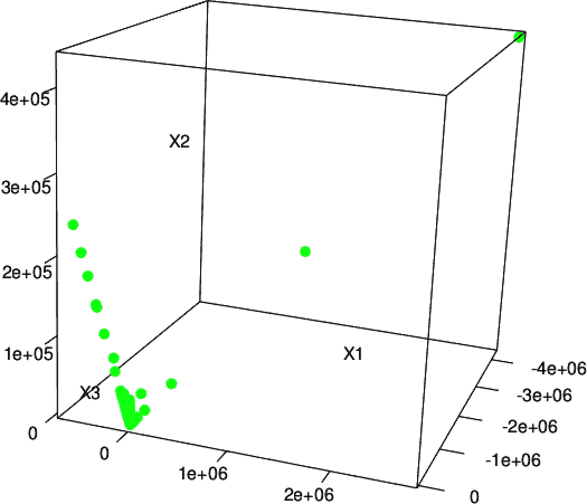
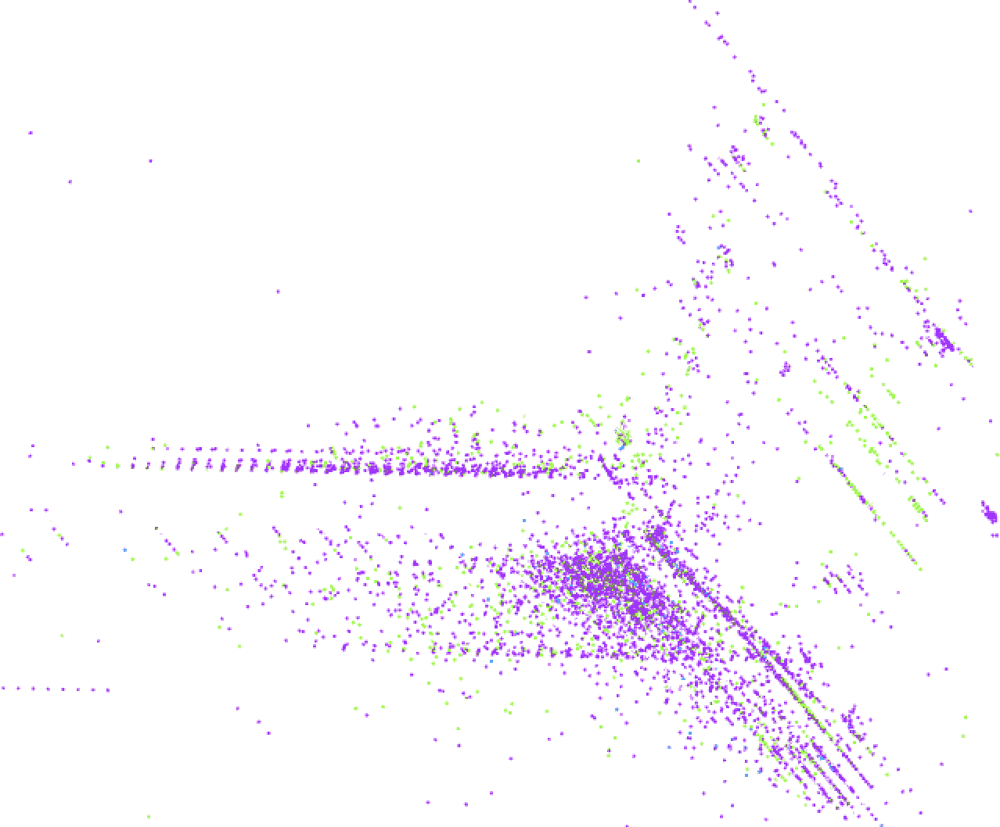

# 第五章。使用 K 均值聚类进行异常检测

分类和回归是机器学习中强大且深入研究的技术。第四章展示了使用分类器作为未知值的预测器。但有一个问题：为了预测新数据的未知值，我们必须知道许多先前看到的示例的目标值。只有我们，数据科学家，知道我们在寻找什么，并能提供许多示例，其中输入产生已知输出时，分类器才能帮助。这些被统称为*监督学习*技术，因为它们的学习过程接收输入中每个示例的正确输出值。

然而，有时某些或所有示例的正确输出是未知的。考虑将电子商务网站的客户按其购物习惯和喜好分组的问题。输入特征包括他们的购买、点击、人口统计信息等。输出应该是客户的分组：也许一个组将代表时尚意识强的购买者，另一个组则会对应价格敏感的猎奇者，依此类推。

如果要求您为每个新客户确定目标标签，您在应用像分类器这样的监督学习技术时会迅速遇到问题：例如，您不知道谁应该被视为时尚意识，事实上，您甚至不确定“时尚意识”是否是该网站客户的一个有意义的分组的开始！

幸运的是，*无监督学习*技术可以帮助。这些技术不会学习预测目标值，因为目标值是不可用的。但它们可以学习数据中的结构，并找到类似输入的分组，或学习哪些类型的输入可能发生，哪些不可能发生。本章将介绍使用 MLlib 中的聚类实现进行无监督学习。具体来说，我们将使用 K 均值聚类算法来识别网络流量数据中的异常。异常检测通常用于发现欺诈、检测网络攻击或发现服务器或其他传感器设备中的问题。在这些情况下，能够发现以前从未见过的新类型异常是非常重要的——新形式的欺诈、入侵和服务器故障模式。无监督学习技术在这些情况下非常有用，因为它们可以学习输入数据通常的外观，因此可以检测到新数据与过去数据不同。这样的新数据不一定是攻击或欺诈；它只是不寻常，因此值得进一步调查。

我们将从 K-means 聚类算法的基础开始。接下来是对 KDD Cup 1999 数据集的介绍。然后我们将使用 PySpark 创建我们的第一个 K-means 模型。然后我们将讨论在实施 K-means 算法时确定良好*k*值（聚类数）的方法。接下来，我们通过实施独热编码方法来使用以前丢弃的分类特征来改进我们的模型。我们将通过熵度量来总结，并探索一些来自我们模型的结果。

# K-means 聚类

异常检测的固有问题正如其名称所示，即寻找异常的问题。如果我们已经知道数据集中什么是“异常”，我们可以很容易地通过监督学习检测数据中的异常。算法将接收标记为“正常”和“异常”的输入，并学会区分这两者。然而，异常的本质是未知的未知。换句话说，已经观察和理解的异常不再是异常。

聚类是最知名的无监督学习类型。聚类算法试图在数据中找到自然的分组。彼此相似但与其他数据不同的数据点可能代表一个有意义的分组，因此聚类算法试图将这样的数据放入同一个聚类中。

K-means 聚类可能是最广泛使用的聚类算法。它试图在数据集中检测*k*个聚类，其中*k*由数据科学家给定。*k*是模型的超参数，正确的值取决于数据集。事实上，在本章中选择一个好的*k*值将是一个核心情节。

当数据集包含客户活动或交易等信息时，“相似”意味着什么？K-means 需要数据点之间的距离概念。通常使用简单的欧氏距离来测量 K-means 中数据点之间的距离是常见的，正如在本文写作时 Spark MLlib 支持的两种距离函数之一，另一种是余弦距离。欧氏距离适用于其特征全部为数值的数据点。“相似”的点是其间距离较小的点。

对于 K-means 来说，聚类仅仅是一个点：所有构成该聚类的点的中心。事实上，它们只是包含所有数值特征的特征向量，可以称为向量。然而，在这里将它们视为点可能更直观，因为它们在欧氏空间中被视为点。

这个中心被称为聚类*中心*，是点的算术平均值，因此得名 K-*means*。算法首先选择一些数据点作为初始聚类中心。然后将每个数据点分配给最近的中心。然后为每个聚类计算新的聚类中心，作为刚刚分配给该聚类的数据点的平均值。这个过程重复进行。

现在我们来看一个使用案例，描述了 K 均值聚类如何帮助我们识别网络中潜在的异常活动。

# 识别异常网络流量

网络攻击越来越多地出现在新闻中。一些攻击试图通过大量网络流量淹没计算机以排除合法流量。但在其他情况下，攻击试图利用网络软件中的缺陷未经授权访问计算机。当计算机遭受大量流量时显而易见，但检测到攻击行为则如同在网络请求的非常大的大海中搜索针一样困难。

有些攻击行为遵循已知的模式。例如，迅速连续访问一台机器上的所有端口，这绝不是任何正常软件程序应该做的事情。然而，这是攻击者寻找可能易受攻击的计算机服务的典型第一步。

如果你计算一个远程主机在短时间内访问的不同端口数量，你可能会得到一个相当好的预测端口扫描攻击的特征。少数端口可能是正常的；数百个则可能是攻击。通过网络连接的其他特征来检测其他类型的攻击也是如此——发送和接收的字节数，TCP 错误等等。

但未知的未知呢？最大的威胁可能是那些从未被检测和分类过的。检测潜在网络入侵的一部分是检测异常。这些是不被认为是攻击的连接，但与过去观察到的连接不相似。

在这里，像 K 均值这样的无监督学习技术可以用来检测异常的网络连接。K 均值可以根据每个连接的统计数据进行聚类。结果的聚类本身并不是特别有趣，但它们共同定义了类似过去连接的类型。不接近任何聚类的内容可能是异常的。聚类之所以有趣，是因为它们定义了正常连接的区域；其他一切都是异常的，有潜在风险。

## KDD Cup 1999 数据集

[KDD Cup](https://oreil.ly/UtYd9)是由计算机协会（ACM）的一个特别兴趣小组每年组织的数据挖掘竞赛。每年，都会提出一个机器学习问题，并附带一个数据集，邀请研究人员提交详细介绍他们解决问题的最佳方案的论文。1999 年的主题是网络入侵，数据集仍然可以在 KDD 网站上找到[（链接）](https://oreil.ly/ezBDa)。我们需要从网站上下载*kddcupdata.data.gz*和*kddcup.info*文件。本章的其余部分将通过学习这些数据来构建一个使用 Spark 来检测异常网络流量的系统。

不要使用这个数据集来构建真正的网络入侵系统！数据并不一定反映了当时的实际网络流量 —— 即使反映了，它也反映了 20 多年前的流量模式。

幸运的是，组织者已经将原始网络数据处理为关于单个网络连接的摘要信息。数据集大小约为 708 MB，包含约 490 万个连接。这是一个大数据集，如果不是巨大的话，在这里绝对足够了。对于每个连接，数据集包含诸如发送的字节数、登录尝试、TCP 错误等信息。每个连接都是一个 CSV 格式的数据行，包含 38 个特征。特征信息和顺序可以在 *kddcup.info* 文件中找到。

解压 *kddcup.data.gz* 数据文件，并将其复制到您的存储中。像其他示例一样，假设文件可在 *data/kddcup.data* 处获得。让我们看看数据的原始形式：

```py
head -n 1 data/kddcup.data

...

0,tcp,http,SF,215,45076,0,0,0,0,0,1,0,0,0,0,0,0,0,0,0,0,1,1,...
```

例如，这个连接是一个 TCP 连接到一个 HTTP 服务 —— 发送了 215 字节，接收了 45,706 字节。用户已登录，等等。

许多特征是计数，例如在第 17 列中列出的 `num_file_creations`，如 *kddcup.info* 文件所示。许多特征取值为 0 或 1，表示某种行为的存在或不存在，例如在第 15 列中的 `su_attempted`。它们看起来像是来自第四章的独热编码分类特征，但并非以同样的方式分组和相关。每一个都像是一个是/否特征，因此可以被视为分类特征。将分类特征翻译为数字并将其视为具有顺序的数字特征并不总是有效的。然而，在二元分类特征的特殊情况下，在大多数机器学习算法中，将其映射为取值为 0 和 1 的数字特征将非常有效。

其余的是像 `dst_host_srv_rerror_rate` 这样的比率，位于倒数第二列，并且取值从 0.0 到 1.0，包括 0.0 和 1.0。

有趣的是，标签给出在最后一个字段中。大多数连接被标记为 `normal.`，但有些已被识别为各种类型的网络攻击示例。这些将有助于学习区分已知攻击与正常连接，但这里的问题是异常检测和发现潜在的新的未知攻击。对于我们的目的，这个标签将大部分被搁置。

# 关于聚类的初步尝试

打开 `pyspark-shell`，并将 CSV 数据加载为数据框架。这又是一个 CSV 文件，但没有头信息。需要根据附带的 *kddcup.info* 文件提供列名。

```py
data_without_header = spark.read.option("inferSchema", True).\
                                  option("header", False).\
                                  csv("data/kddcup.data")

column_names = [  "duration", "protocol_type", "service", "flag",
  "src_bytes", "dst_bytes", "land", "wrong_fragment", "urgent",
  "hot", "num_failed_logins", "logged_in", "num_compromised",
  "root_shell", "su_attempted", "num_root", "num_file_creations",
  "num_shells", "num_access_files", "num_outbound_cmds",
  "is_host_login", "is_guest_login", "count", "srv_count",
  "serror_rate", "srv_serror_rate", "rerror_rate", "srv_rerror_rate",
  "same_srv_rate", "diff_srv_rate", "srv_diff_host_rate",
  "dst_host_count", "dst_host_srv_count",
  "dst_host_same_srv_rate", "dst_host_diff_srv_rate",
  "dst_host_same_src_port_rate", "dst_host_srv_diff_host_rate",
  "dst_host_serror_rate", "dst_host_srv_serror_rate",
  "dst_host_rerror_rate", "dst_host_srv_rerror_rate",
  "label"]

data = data_without_header.toDF(*column_names)
```

从探索数据集开始。数据中存在哪些标签，每个标签有多少个？以下代码简单地按标签计数，并按计数降序打印结果：

```py
from pyspark.sql.functions import col
data.select("label").groupBy("label").count().\
      orderBy(col("count").desc()).show(25)

...
+----------------+-------+
|           label|  count|
+----------------+-------+
|          smurf.|2807886|
|        neptune.|1072017|
|         normal.| 972781|
|          satan.|  15892|
...
|            phf.|      4|
|           perl.|      3|
|            spy.|      2|
+----------------+-------+
```

共有 23 个不同的标签，最常见的是 `smurf.` 和 `neptune.` 攻击。

请注意，数据包含非数字特征。例如，第二列可能是`tcp`、`udp`或`icmp`，但是 K-means 聚类需要数字特征。最终的标签列也是非数字的。首先，这些将被简单地忽略。

除此之外，创建数据的 K-means 聚类遵循与第四章中看到的相同模式。`VectorAssembler` 创建特征向量，`KMeans` 实现从特征向量创建模型，`Pipeline` 将其全部连接起来。从生成的模型中，可以提取并检查聚类中心。

```py
from pyspark.ml.feature import VectorAssembler
from pyspark.ml.clustering import KMeans, KMeansModel
from pyspark.ml import Pipeline

numeric_only = data.drop("protocol_type", "service", "flag").cache()

assembler = VectorAssembler().setInputCols(numeric_only.columns[:-1]).\
                              setOutputCol("featureVector")

kmeans = KMeans().setPredictionCol("cluster").setFeaturesCol("featureVector")

pipeline = Pipeline().setStages([assembler, kmeans])
pipeline_model = pipeline.fit(numeric_only)
kmeans_model = pipeline_model.stages[1]

from pprint import pprint
pprint(kmeans_model.clusterCenters())

...
[array([4.83401949e+01, 1.83462155e+03, 8.26203190e+02, 5.71611720e-06,
       6.48779303e-04, 7.96173468e-06...]),
 array([1.0999000e+04, 0.0000000e+00, 1.3099374e+09, 0.0000000e+00,
       0.0000000e+00, 0.0000000e+00,...])]
```

从直觉上解释这些数字并不容易，但每个数字代表了模型生成的一个聚类的中心（也称为质心）。这些值是质心在每个数字输入特征上的坐标。

打印了两个向量，意味着 K-means 在数据上拟合了*k*=2 个聚类。对于一个已知至少有 23 种不同连接类型的复杂数据集来说，这几乎肯定不足以准确建模数据中的不同分组。

这是一个很好的机会，利用给定的标签来直观地了解这两个聚类中包含了什么，通过计算每个聚类内的标签数量。

```py
with_cluster = pipeline_model.transform(numeric_only)

with_cluster.select("cluster", "label").groupBy("cluster", "label").count().\
              orderBy(col("cluster"), col("count").desc()).show(25)

...
+-------+----------------+-------+
|cluster|           label|  count|
+-------+----------------+-------+
|      0|          smurf.|2807886|
|      0|        neptune.|1072017|
|      0|         normal.| 972781|
|      0|          satan.|  15892|
|      0|        ipsweep.|  12481|
...
|      0|            phf.|      4|
|      0|           perl.|      3|
|      0|            spy.|      2|
|      1|      portsweep.|      1|
+-------+----------------+-------+
```

结果显示，聚类毫无帮助。只有一个数据点最终进入了聚类 1！

# 选择*k*

显然，两个聚类是不够的。对于这个数据集来说，适合多少个聚类？很明显，数据中存在 23 种不同的模式，因此*k*至少可以是 23，甚至可能更多。通常会尝试许多*k*值来找到最佳值。但是什么是“最佳”呢？

如果每个数据点接近其最近的质心，则可以认为聚类是好的，“接近”由欧氏距离定义。这是评估聚类质量的一种简单常见方式，通过所有点的这些距离的均值，有时是距离平方的均值。事实上，`KMeansModel` 提供了一个 `ClusteringEvaluator` 方法，可以计算平方距离的和，可以轻松用来计算均方距离。

手动评估几个*k*值的聚类成本很简单。请注意，此代码可能需要运行 10 分钟或更长时间：

```py
from pyspark.sql import DataFrame
from pyspark.ml.evaluation import ClusteringEvaluator

from random import randint

def clustering_score(input_data, k):
    input_numeric_only = input_data.drop("protocol_type", "service", "flag")
    assembler = VectorAssembler().setInputCols(input_numeric_only.columns[:-1]).\
                                  setOutputCol("featureVector")
    kmeans = KMeans().setSeed(randint(100,100000)).setK(k).\
                      setPredictionCol("cluster").\
                      setFeaturesCol("featureVector")
    pipeline = Pipeline().setStages([assembler, kmeans])
    pipeline_model = pipeline.fit(input_numeric_only)

    evaluator = ClusteringEvaluator(predictionCol='cluster',
                                    featuresCol="featureVector")
    predictions = pipeline_model.transform(numeric_only)
    score = evaluator.evaluate(predictions)
    return score

for k in list(range(20,100, 20)):
    print(clustering_score(numeric_only, k)) 

...
(20,6.649218115128446E7)
(40,2.5031424366033625E7)
(60,1.027261913057096E7)
(80,1.2514131711109027E7)
(100,7235531.565096531)
```


分数将使用科学计数法显示。

打印的结果显示，随着*k*的增加，分数下降。请注意，分数以科学计数法显示；第一个值超过 10⁷，不仅仅是略高于 6。

再次说明，您的值可能会有所不同。聚类取决于随机选择的初始质心集。

然而，这是显而易见的。随着增加更多的聚类，总是可以将数据点放置在最近的质心附近。事实上，如果选择*k*等于数据点的数量，平均距离将为 0，因为每个点将成为其自身的一个包含一个点的聚类！

更糟糕的是，在前述结果中，*k*=80 的距离比*k*=60 的距离更高。这不应该发生，因为更高的*k*总是至少能够实现与较低*k*一样好的聚类。问题在于，K 均值算法不一定能够为给定的*k*找到最优的聚类。其迭代过程可能会从一个随机起点收敛到局部最小值，这可能是良好但并非最优的。

即使使用更智能的方法选择初始质心，这仍然是真实的。[K-means++和 K-means||](https://oreil.ly/zes8d)是选择算法的变体，更有可能选择多样化、分离的质心，并更可靠地导致良好的聚类。事实上，Spark MLlib 实现了 K-means||。然而，所有这些方法仍然在选择过程中具有随机性，并不能保证最优的聚类。

对于*k*=80 随机选择的起始聚类集可能导致特别次优的聚类，或者在达到局部最优之前可能提前停止。

我们可以通过增加迭代次数来改善它。该算法通过`setTol`设置一个阈值，控制被认为是显著的聚类质心移动的最小量；较低的值意味着 K 均值算法将允许质心继续移动更长时间。通过`setMaxIter`增加最大迭代次数也可以防止它在可能的计算成本更高的情况下过早停止。

```py
def clustering_score_1(input_data, k):
    input_numeric_only = input_data.drop("protocol_type", "service", "flag")
    assembler = VectorAssembler().\
                  setInputCols(input_numeric_only.columns[:-1]).\
                  setOutputCol("featureVector")
    kmeans = KMeans().setSeed(randint(100,100000)).setK(k).setMaxIter(40).\ 
      setTol(1.0e-5).\ 
      setPredictionCol("cluster").setFeaturesCol("featureVector")
    pipeline = Pipeline().setStages([assembler, kmeans])
    pipeline_model = pipeline.fit(input_numeric_only)
    #
    evaluator = ClusteringEvaluator(predictionCol='cluster',
                                    featuresCol="featureVector")
    predictions = pipeline_model.transform(numeric_only)
    score = evaluator.evaluate(predictions)
    #
    return score

for k in list(range(20,101, 20)):
    print(k, clustering_score_1(numeric_only, k))
```


从默认值 20 增加。


从默认值 1.0e-4 减少。

这一次，至少分数是持续下降的：

```py
(20,1.8041795813813403E8)
(40,6.33056876207124E7)
(60,9474961.544965891)
(80,9388117.93747141)
(100,8783628.926311461)
```

我们希望找到一个点，在增加*k*后停止显著降低分数——或者在*k*与分数图中找到一个“肘部”，通常情况下分数是递减的，但最终趋于平缓。在这里，看起来在 100 之后明显减少。正确的*k*值可能在 100 之后。

# 使用 SparkR 进行可视化

此时，重新聚类之前，深入了解数据可能会很有帮助。特别是查看数据点的图表可能会有所帮助。

Spark 本身没有用于可视化的工具，但流行的开源统计环境[R](https://www.r-project.org)提供了数据探索和数据可视化的库。此外，Spark 还通过[SparkR](https://oreil.ly/XX0Q9)提供了与 R 的基本集成。本简短部分将演示如何使用 R 和 SparkR 对数据进行聚类和探索聚类。

SparkR 是本书中使用的 `spark-shell` 的变体，使用 `sparkR` 命令调用。它运行一个本地的 R 解释器，就像 `spark-shell` 运行 Scala shell 的变体作为本地进程。运行 `sparkR` 的机器需要安装本地的 R，这不包含在 Spark 中。例如，在 Ubuntu 这样的 Linux 发行版上可以通过 `sudo apt-get install r-base` 安装，或者在 macOS 上通过 [Homebrew](http://brew.sh) 安装 R。

SparkR 是一个类似于 R 的命令行 shell 环境。要查看可视化效果，必须在能够显示图像的 IDE 类似环境中运行这些命令。[RStudio](https://www.rstudio.com) 是一个适用于 R 的 IDE（与 SparkR 兼容）；它在桌面操作系统上运行，因此只有在本地实验 Spark 而不是在集群上时才能在此处使用。

如果你在本地运行 Spark，请[下载](https://oreil.ly/JZGQm) RStudio 的免费版本并安装。如果没有，则本例的大部分其余部分仍可在命令行上（例如在集群上）通过 `sparkR` 运行，尽管这种方式无法显示可视化。

如果通过 RStudio 运行，请启动 IDE 并配置 `SPARK_HOME` 和 `JAVA_HOME`，如果你的本地环境尚未设置这些路径，则指向 Spark 和 JDK 的安装目录，分别如下：

```py
Sys.setenv(SPARK_HOME = "*`/path/to/spark`*") 
Sys.setenv(JAVA_HOME = "*`/path/to/java`*") library(SparkR, lib.loc = c(file.path(Sys.getenv("SPARK_HOME"), "R", "lib"))) sparkR.session(master = "local[*]",
 sparkConfig = list(spark.driver.memory = "4g"))
```


当然要替换为实际路径。

请注意，如果在命令行上运行 `sparkR`，则无需执行这些步骤。相反，它接受类似于 `--driver-memory` 的命令行配置参数，就像 `spark-shell` 一样。

SparkR 是围绕相同的 DataFrame 和 MLlib API 的 R 语言封装，这些在本章中已经展示过。因此，可以重新创建数据的 K-means 简单聚类：

```py
clusters_data <- read.df("*`/path/to/kddcup.data`*", "csv", 
 inferSchema = "true", header = "false") colnames(clusters_data) <- c( 
 "duration", "protocol_type", "service", "flag", "src_bytes", "dst_bytes", "land", "wrong_fragment", "urgent", "hot", "num_failed_logins", "logged_in", "num_compromised", "root_shell", "su_attempted", "num_root", "num_file_creations", "num_shells", "num_access_files", "num_outbound_cmds", "is_host_login", "is_guest_login", "count", "srv_count", "serror_rate", "srv_serror_rate", "rerror_rate", "srv_rerror_rate", "same_srv_rate", "diff_srv_rate", "srv_diff_host_rate", "dst_host_count", "dst_host_srv_count", "dst_host_same_srv_rate", "dst_host_diff_srv_rate", "dst_host_same_src_port_rate", "dst_host_srv_diff_host_rate", "dst_host_serror_rate", "dst_host_srv_serror_rate", "dst_host_rerror_rate", "dst_host_srv_rerror_rate", "label") 
numeric_only <- cache(drop(clusters_data, 
 c("protocol_type", "service", "flag", "label"))) 
kmeans_model <- spark.kmeans(numeric_only, ~ ., 
 k = 100, maxIter = 40, initMode = "k-means||")
```


替换为 *kddcup.data* 的路径。


命名列。


再次丢弃非数字列。


`~ .` 表示所有列。

从这里开始，为每个数据点分配一个聚类很简单。上述操作展示了使用 SparkR API，这些 API 自然对应于核心 Spark API，但表达为 R 库的 R-like 语法。实际的聚类是使用相同基于 JVM 的 Scala 语言实现的 MLlib 进行的。这些操作实际上是远程控制分布式操作，而不是在 R 中执行。

R 拥有自己丰富的分析库以及类似的数据框架概念。因此，有时将一些数据下载到 R 解释器中以使用这些本地 R 库是很有用的，这些库与 Spark 无关。

当然，R 及其库并未分发，因此将包含 4,898,431 个数据点的整个数据集导入 R 中是不可行的。不过，只导入一个样本却很容易：

```py
clustering <- predict(kmeans_model, numeric_only) clustering_sample <- collect(sample(clustering, FALSE, 0.01)) 

str(clustering_sample) 
... 'data.frame': 48984 obs. of  39 variables:
 $ duration                   : int  0 0 0 0 0 0 0 0 0 0 ... $ src_bytes                  : int  181 185 162 254 282 310 212 214 181 ... $ dst_bytes                  : int  5450 9020 4528 849 424 1981 2917 3404 ... $ land                       : int  0 0 0 0 0 0 0 0 0 0 ... ...
 $ prediction                 : int  33 33 33 0 0 0 0 0 33 33 ...
```


无替换的 1%样本

`clustering_sample`实际上是一个本地的 R 数据框架，而不是 Spark DataFrame，因此可以像 R 中的任何其他数据一样进行操作。上面的`str`显示了数据框架的结构。

例如，可以提取集群分配，然后显示有关分配分布的统计信息：

```py
clusters <- clustering_sample["prediction"] 
data <- data.matrix(within(clustering_sample, rm("prediction"))) 

table(clusters) 
... clusters
 0    11    14    18    23    25    28    30    31    33    36    ... 47294     3     1     2     2   308   105     1    27  1219    15    ...
```


只有聚类分配列


除了聚类分配之外的所有内容

例如，这表明大多数点落入集群 0。虽然在 R 中可以对此数据做更多处理，但进一步的覆盖范围超出了本书的范围。

要可视化数据，需要一个名为`rgl`的库。仅在 RStudio 中运行此示例时才会生效。首先安装（一次）并加载该库：

```py
install.packages("rgl")
library(rgl)
```

请注意，R 可能会提示您下载其他包或编译器工具以完成安装，因为安装包意味着编译其源代码。

此数据集有 38 个维度。必须将其投影到最多三个维度中以使用*随机投影*进行可视化：

```py
random_projection <- matrix(data = rnorm(3*ncol(data)), ncol = 3) 
random_projection_norm <-
 random_projection / sqrt(rowSums(random_projection*random_projection)) 
projected_data <- data.frame(data %*% random_projection_norm) 
```


进行随机 3-D 投影并归一化。


投影并创建新的数据框架。

通过选择三个随机单位向量并将数据投影到它们上，将 38 维数据集创建为 3-D 数据集。这是一种简单粗糙的降维方法。当然，还有更复杂的降维算法，比如主成分分析或奇异值分解。这些算法在 R 中都可以找到，但运行时间更长。在本示例中，随机投影可以更快地实现几乎相同的可视化效果。

最后，可以在交互式 3-D 可视化中绘制集群点：

```py
num_clusters <- max(clusters)
palette <- rainbow(num_clusters)
colors = sapply(clusters, function(c) palette[c])
plot3d(projected_data, col = colors, size = 10)
```

请注意，这将需要在支持`rgl`库和图形的环境中运行 RStudio。

图 5-1 中的可视化展示了 3-D 空间中的数据点。许多点重叠在一起，结果稀疏且难以解释。然而，可视化的主要特征是其 L 形状。点似乎沿着两个不同的维度变化，其他维度变化较小。

这是有道理的，因为数据集中有两个特征的尺度远大于其他特征。大多数特征的值在 0 到 1 之间，而 bytes-sent 和 bytes-received 特征的值则在 0 到数万之间变化。因此，点之间的欧氏距离几乎完全由这两个特征决定。其他特征几乎像不存在一样！因此，将这些尺度差异标准化是很重要的，以便使特征在接近相等的水平上。



###### 图 5-1\. 随机 3-D 投影

# 特征标准化

我们可以通过将每个特征转换为标准分数来标准化每个特征。这意味着从每个值的特征均值中减去该值，并除以标准差，如标准分数方程所示：

<math alttext="n o r m a l i z e d Subscript i Baseline equals StartFraction f e a t u r e Subscript i Baseline minus mu Subscript i Baseline Over sigma Subscript i Baseline EndFraction" display="block"><mrow><mi>n</mi> <mi>o</mi> <mi>r</mi> <mi>m</mi> <mi>a</mi> <mi>l</mi> <mi>i</mi> <mi>z</mi> <mi>e</mi> <msub><mi>d</mi> <mi>i</mi></msub> <mo>=</mo> <mfrac><mrow><mi>f</mi><mi>e</mi><mi>a</mi><mi>t</mi><mi>u</mi><mi>r</mi><msub><mi>e</mi> <mi>i</mi></msub> <mo>-</mo><msub><mi>μ</mi> <mi>i</mi></msub></mrow> <msub><mi>σ</mi> <mi>i</mi></msub></mfrac></mrow></math>

实际上，减去均值对聚类没有影响，因为减法实际上将所有数据点以相同的方向和相同的量移动。这不会影响点与点之间的欧氏距离。

MLlib 提供了 `StandardScaler`，这是一个可以执行这种标准化并且可以轻松添加到聚类管道中的组件。

我们可以在更高范围的 *k* 上使用标准化数据运行相同的测试：

```py
from pyspark.ml.feature import StandardScaler

def clustering_score_2(input_data, k):
    input_numeric_only = input_data.drop("protocol_type", "service", "flag")
    assembler = VectorAssembler().\
                setInputCols(input_numeric_only.columns[:-1]).\
                setOutputCol("featureVector")
    scaler = StandardScaler().setInputCol("featureVector").\
                              setOutputCol("scaledFeatureVector").\
                              setWithStd(True).setWithMean(False)
    kmeans = KMeans().setSeed(randint(100,100000)).\
                      setK(k).setMaxIter(40).\
                      setTol(1.0e-5).setPredictionCol("cluster").\
                      setFeaturesCol("scaledFeatureVector")
    pipeline = Pipeline().setStages([assembler, scaler, kmeans])
    pipeline_model = pipeline.fit(input_numeric_only)
    #
    evaluator = ClusteringEvaluator(predictionCol='cluster',
                                    featuresCol="scaledFeatureVector")
    predictions = pipeline_model.transform(numeric_only)
    score = evaluator.evaluate(predictions)
    #
    return score

for k in list(range(60, 271, 30)):
    print(k, clustering_score_2(numeric_only, k))
...
(60,1.2454250178069293)
(90,0.7767730051608682)
(120,0.5070473497003614)
(150,0.4077081720067704)
(180,0.3344486714980788)
(210,0.276237617334138)
(240,0.24571877339169032)
(270,0.21818167354866858)
```

这有助于使维度更平等，并且点之间的绝对距离（因此成本）在绝对值上要小得多。然而，上述输出尚未提供一个明显的 *k* 值，超过该值增加对成本的改进很少。

标准化后的数据点的另一个 3-D 可视化显示了预期的更丰富的结构。某些点在一个方向上以正规的离散间隔排列；这些可能是数据中离散维度（如计数）的投影。在 100 个簇的情况下，很难确定哪些点来自哪些簇。一个大簇似乎占主导地位，许多簇对应于小型、紧凑的子区域（其中一些在整个 3-D 可视化的缩放细节中被省略）。在 图 5-2 中显示的结果并不一定推进分析，但是这是一个有趣的健全性检查。



###### 图 5-2\. 随机 3-D 投影，已标准化

# 分类变量

标准化是迈出的一大步，但可以做更多来改进聚类。特别是，由于它们不是数值的原因，一些特征已经完全被排除在外。这是在抛弃宝贵信息。以某种形式将它们重新添加回来应该会产生更为明智的聚类。

早些时候，由于非数值特征无法与 MLlib 中 K-means 使用的欧氏距离函数一起使用，三个分类特征被排除在外。这与 “随机森林” 中所指出的问题相反，那里使用数值特征来表示分类值，但却希望有一个分类特征。

使用独热编码将分类特征转换为多个二进制指示特征，可以看作是数值维度。例如，第二列包含协议类型：`tcp`、`udp`或`icmp`。这个特征可以被视为*三*个特征，就像数据集中有“是 TCP”、“是 UDP”和“是 ICMP”一样。单个特征值`tcp`可能会变成`1,0,0`；`udp`可能是`0,1,0`；依此类推。

同样地，MLlib 提供了实现此转换的组件。事实上，对像`protocol_type`这样的字符串值特征进行独热编码实际上是一个两步过程。首先，将字符串值转换为像 0、1、2 等整数索引，使用`StringIndexer`。然后，这些整数索引被编码成一个向量，使用`OneHotEncoder`。这两个步骤可以被看作是一个小型的`Pipeline`。

```py
from pyspark.ml.feature import OneHotEncoder, StringIndexer

def one_hot_pipeline(input_col):
    indexer = StringIndexer().setInputCol(input_col).\
                              setOutputCol(input_col + "-_indexed")
    encoder = OneHotEncoder().setInputCol(input_col + "indexed").\
                              setOutputCol(input_col + "_vec")
    pipeline = Pipeline().setStages([indexer, encoder])
    return pipeline, input_col + "_vec" 
```


返回管道和输出向量列的名称。

该方法生成一个`Pipeline`，可以作为整体聚类管道的组件添加；管道可以被组合。现在只需确保将新的向量输出列添加到`VectorAssembler`的输出中，并按照之前的方式进行缩放、聚类和评估。此处为了简洁起见省略了源代码，但可以在本章节附带的存储库中找到。

```py
(60,39.739250062068685)
(90,15.814341529964691)
(120,3.5008631362395413)
(150,2.2151974068685547)
(180,1.587330730808905)
(210,1.3626704802348888)
(240,1.1202477806210747)
(270,0.9263659836264369)
```

这些样本结果表明，可能 *k*=180 是一个得分趋于平缓的值。至少聚类现在使用了所有的输入特征。

# 使用熵和标签

之前，我们使用每个数据点的给定标签来创建一个快速的聚类质量检查。这个概念可以进一步形式化，并用作评估聚类质量和因此选择*k*的替代手段。

标签告诉我们关于每个数据点真实本质的信息。一个好的聚类应该与这些人工应用的标签一致。它应该将经常共享标签的点放在一起，而不是将许多不同标签的点放在一起。它应该产生具有相对均匀标签的簇。

您可能还记得“随机森林”中我们有关于同质性的度量：基尼不纯度和熵。这些是每个簇中标签比例的函数，并产生一个在标签比例偏向少数或一个标签时低的数字。这里将使用熵来进行说明：

```py
from math import log

def entropy(counts):
    values = [c for c in counts if (c > 0)]
    n = sum(values)
    p = [v/n for v in values]
    return sum([-1*(p_v) * log(p_v) for p_v in p])
```

一个好的聚类应该有具有同质标签的簇，因此熵应该较低。因此，可以使用熵的加权平均作为簇得分：

```py
from pyspark.sql import functions as fun
from pyspark.sql import Window

cluster_label = pipeline_model.\
                    transform(data).\
                    select("cluster", "label") 

df = cluster_label.\
        groupBy("cluster", "label").\
        count().orderBy("cluster") 

w = Window.partitionBy("cluster")

p_col = df['count'] / fun.sum(df['count']).over(w)
with_p_col = df.withColumn("p_col", p_col)

result = with_p_col.groupBy("cluster").\
              agg(-fun.sum(col("p_col") * fun.log2(col("p_col")))\
                        .alias("entropy"),
                    fun.sum(col("count"))\
                        .alias("cluster_size"))

result = result.withColumn('weightedClusterEntropy',
                          col('entropy') * col('cluster_size')) 

weighted_cluster_entropy_avg = result.\
                            agg(fun.sum(
                              col('weightedClusterEntropy'))).\
                            collect()
weighted_cluster_entropy_avg[0][0]/data.count()
```


针对每个数据点预测簇。


计算每个簇的标签数。


由聚类大小加权的平均熵。

与之前一样，此分析可用于获得关于 *k* 的适当值的一些想法。熵不一定会随着 *k* 的增加而减少，因此可以寻找局部最小值。在这里，结果再次表明 *k*=180 是一个合理的选择，因为其分数实际上比 150 和 210 都要低：

```py
(60,0.03475331900669869)
(90,0.051512668026335535)
(120,0.02020028911919293)
(150,0.019962563512905682)
(180,0.01110240886325257)
(210,0.01259738444250231)
(240,0.01357435960663116)
(270,0.010119881917660544)
```

# 聚类实战

最后，有信心地使用 *k*=180 对完整的标准化数据集进行聚类。同样，我们可以打印每个聚类的标签，以对得到的聚类结果有所了解。聚类似乎主要由一种类型的攻击主导，并且只包含少数类型：

```py
pipeline_model = fit_pipeline_4(data, 180) 
count_by_cluster_label = pipeline_model.transform(data).\
                                        select("cluster", "label").\
                                        groupBy("cluster", "label").\
                                        count().orderBy("cluster", "label")
count_by_cluster_label.show()

...
+-------+----------+------+
|cluster|     label| count|
+-------+----------+------+
|      0|     back.|   324|
|      0|   normal.| 42921|
|      1|  neptune.|  1039|
|      1|portsweep.|     9|
|      1|    satan.|     2|
|      2|  neptune.|365375|
|      2|portsweep.|   141|
|      3|portsweep.|     2|
|      3|    satan.| 10627|
|      4|  neptune.|  1033|
|      4|portsweep.|     6|
|      4|    satan.|     1|
...
```


查看 `fit_pipeline_4` 定义的相关源代码。

现在我们可以制作一个实际的异常检测器。异常检测就是测量新数据点到其最近质心的距离。如果这个距离超过了某个阈值，那么它是异常的。此阈值可以选择为已知数据中第 100 个最远数据点的距离：

```py
import numpy as np

from pyspark.spark.ml.linalg import Vector, Vectors
from pyspark.sql.functions import udf

k_means_model = pipeline_model.stages[-1]
centroids = k_means_model.clusterCenters

clustered = pipeline_model.transform(data)

def dist_func(cluster, vec):
    return float(np.linalg.norm(centroids[cluster] - vec))
dist = udf(dist_func)

threshold = clustered.select("cluster", "scaledFeatureVector").\
    withColumn("dist_value",
        dist(col("cluster"), col("scaledFeatureVector"))).\
    orderBy(col("dist_value").desc()).take(100)
```

最后一步可以是将这个阈值应用于所有新数据点。例如，可以使用 Spark Streaming 将此函数应用于从诸如 Kafka 或云存储中的文件等来源到达的小批量输入数据。超过阈值的数据点可能会触发一个警报，发送电子邮件或更新数据库。

# 接下来做什么

`KMeansModel` 本身就是异常检测系统的精髓。前面的代码演示了如何将其应用于数据以检测异常。这段代码也可以在[Spark Streaming](https://oreil.ly/UHHBR)中使用，以几乎实时地对新数据进行评分，并可能触发警报或审核。

MLlib 还包括一种称为 `StreamingKMeans` 的变体，它可以将聚类作为新数据以增量方式到达时更新到 `StreamingKMeansModel` 中。我们可以使用这个来继续学习，大致了解新数据如何影响聚类，而不仅仅是对现有聚类评估新数据。它也可以与 Spark Streaming 集成。但是，它尚未针对新的基于 DataFrame 的 API 进行更新。

这个模型只是一个简单的模型。例如，这个例子中使用欧几里得距离是因为这是 Spark MLlib 目前支持的唯一距离函数。在未来，可能会使用能更好地考虑特征分布和相关性的距离函数，比如[马哈拉诺比斯距离](https://oreil.ly/PKG7A)。

还有更复杂的[聚类质量评估指标](https://oreil.ly/9yE9P)，即使在没有标签的情况下也可以应用于选择*k*，例如[轮廓系数](https://oreil.ly/LMN1h)。这些指标倾向于评估不仅仅是一个簇内点的紧密程度，还包括点与其他簇的紧密程度。最后，可以应用不同的模型来取代简单的 K-means 聚类；例如，[高斯混合模型](https://oreil.ly/KTgD6)或者[DBSCAN](https://oreil.ly/xlshs)可以捕捉数据点与簇中心之间更微妙的关系。Spark MLlib 已经实现了[高斯混合模型](https://oreil.ly/LG84u)；其他模型的实现可能会在 Spark MLlib 或其他基于 Spark 的库中出现。

当然，聚类不仅仅用于异常检测。事实上，它更常用于实际集群很重要的用例！例如，聚类还可以根据客户的行为、偏好和属性对客户进行分组。每个簇本身可能代表一种有用可区分的客户类型。这是一种更加数据驱动的客户分段方式，而不是依赖于像“年龄 20-34 岁”和“女性”这样任意的通用划分。
