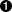
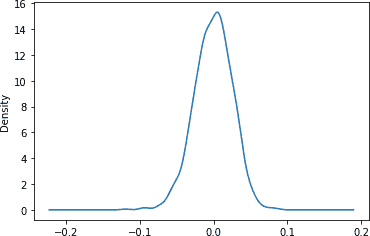
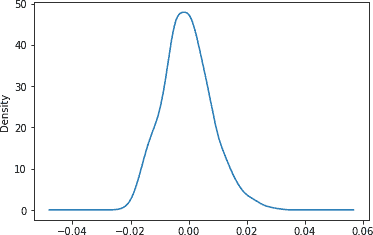
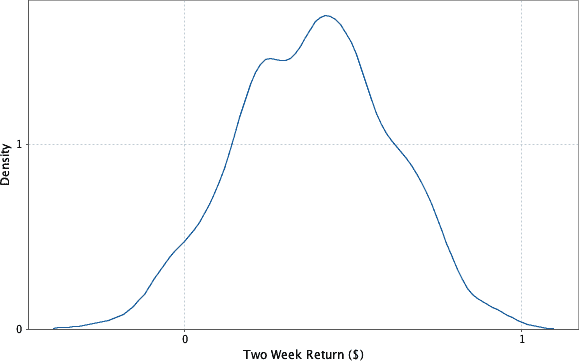

# 第八章：估计金融风险

在投资金融市场时，是否有一种方法可以近似预期损失的量？这就是金融统计量*风险价值*（VaR）试图衡量的内容。VaR 是一种简单的投资风险度量，试图提供投资组合在特定时间段内可能的最大损失的合理估计。VaR 统计量依赖于三个参数：一个投资组合，一个时间段和一个概率。例如，VaR 值为$1 million，概率为 5%，时间为两周，则表明投资组合只有 5%的概率在两周内损失超过$1 million。

自 1987 年股市崩盘后不久，VaR 在金融服务组织中广泛使用。该统计量通过帮助确定策略的风险特征，在这些机构的管理中发挥着至关重要的作用。

许多估计这一统计量的最复杂方法依赖于在随机条件下市场的计算密集型模拟。这些方法背后的技术被称为蒙特卡洛模拟，涉及提出数千甚至数百万个随机市场场景，并观察它们如何影响投资组合。这些场景被称为*试验*。PySpark 是进行蒙特卡洛模拟的理想工具。PySpark 可以利用数千个核心运行随机试验并汇总它们的结果。作为通用数据转换引擎，它还擅长执行围绕模拟的预处理和后处理步骤。它可以将原始金融数据转换为执行模拟所需的模型参数，并支持对结果的临时分析。与使用 HPC 环境的更传统方法相比，其简单的编程模型可以大大减少开发时间。

我们还将讨论如何计算一个相关的统计量称为*条件风险价值*（CVaR），有时也称为*预期损失*，这是几年前巴塞尔银行监督委员会提出的比 VaR 更好的风险度量。CVaR 统计量与 VaR 统计量具有相同的三个参数，但考虑的是预期平均损失，而不是提供可能损失的值。例如，CVaR 为$5 million，概率为 5%，时间为两周，则表明最差的 5%结果中平均损失为$5 million。

在建模 VaR 的过程中，我们将介绍一些不同的概念、方法和工具包。我们将从介绍贯穿整章使用的基本金融术语开始，然后学习计算 VaR 的方法，包括蒙特卡洛模拟技术。之后，我们将使用 PySpark 和 pandas 下载和准备我们的数据集。我们将使用 2000 年代末和 2010 年代初的股市数据，包括国债价格和各种公司的股票价值等市场指标。在预处理完成后，我们将创建一个线性回归模型，以计算股票在一段时间内的价值变化。我们还将想出一种方法，在执行蒙特卡洛模拟时生成样本市场指标值。最后，我们将使用 PySpark 执行模拟，并检查我们的结果。

让我们开始定义我们将使用的基本金融术语。

# 术语

本章使用了金融领域特定术语的集合：

工具

可交易资产，例如债券、贷款、期权或股票投资。任何特定时间，工具都被认为具有*价值*，即其可售出价格。

投资组合

金融机构拥有的一系列工具。

收益

一段时间内工具或投资组合价值的变化。

损失

负回报。

指数

一种虚构的工具组合。例如，纳斯达克综合指数包括约 3000 只主要美国和国际公司的股票及类似工具。

市场因素

用作特定时间金融环境宏观方面指标的值——例如，一个指数的价值，美国的国内生产总值，或美元与欧元之间的汇率。我们通常将市场因素简称为*因素*。

# 计算 VaR 的方法

到目前为止，我们对风险价值（VaR）的定义一直比较开放。估计这一统计量需要提出一个关于投资组合运作方式的模型，并选择其收益可能服从的概率分布。机构采用各种方法来计算 VaR，这些方法通常可以归纳为几种一般方法之下。

## 方差-协方差

*方差-协方差*方法是最简单且计算强度最低的方法。其模型假设每种工具的收益服从正态分布，这使得可以通过解析推导出一个估计值。

## 历史模拟

*历史模拟*通过直接使用其分布而不依赖于摘要统计数据，从历史数据中推断风险。例如，为了确定一个投资组合的 95% VaR，我们可能会查看该投资组合过去 100 天的表现，并将该统计数据估计为第五差的一天的值。这种方法的一个缺点是，历史数据可能有限，并且未包含假设情况。例如，如果我们投资组合中的工具的历史缺乏市场崩盘，我们想要模拟在这些情况下我们的投资组合会发生什么？存在技术可以使历史模拟能够应对这些问题，例如向数据引入“冲击”，但我们在这里不会详细介绍这些技术。

## 蒙特卡洛模拟

*蒙特卡洛模拟*，本章的其余部分将重点介绍，试图通过在随机条件下模拟投资组合来减弱前述方法中的假设。当我们无法从解析上导出一个概率分布的闭合形式时，我们通常可以通过重复抽样它所依赖的更简单的随机变量来估计其概率密度函数，并观察其在总体上的表现。在其最一般的形式中，该方法：

+   确定市场条件与每种工具收益之间的关系。该关系采用根据历史数据拟合的模型形式。

+   为市场条件定义分布，可以方便地从中进行抽样。这些分布是根据历史数据拟合的。

+   提出由随机市场条件组成的试验。

+   计算每次试验的总投资组合损失，并使用这些损失来定义损失的经验分布。这意味着如果我们进行 100 次试验，并希望估计 5%的 VaR，则会选择第五大损失的试验。要计算 5%的 CVaR，则会找到五个最差试验的平均损失。

当然，蒙特卡洛方法也并非完美无缺。它依赖于用于生成试验条件和推断仪器性能的模型，而这些模型必须做出简化的假设。如果这些假设与现实不符，那么最终得出的概率分布也将不符合实际情况。

# 我们的模型

蒙特卡洛风险模型通常将每个工具的回报表述为一组市场因素。常见的市场因素可能是诸如标准普尔 500 指数、美国 GDP 或货币汇率等的指数值。然后，我们需要一个模型，根据这些市场条件预测每个工具的回报。在我们的模拟中，我们将使用一个简单的线性模型。按照我们之前对回报的定义，*因子回报*是市场因素在特定时间内的价值变化。例如，如果标准普尔 500 指数的值从 2000 变到 2100，在一个时间间隔内，其回报将是 100。我们将从因子回报的简单转换中派生一组特征。也就是说，对于试验*t*，市场因素向量*m[t]*通过某些函数ϕ转换为可能具有不同长度*f[t]*的特征向量：

+   *f[t] = ϕ(m[t])*

对于每个工具，我们将训练一个模型，为每个特征分配一个权重。为了计算试验*t*中工具*i*的回报*r[it]*，我们使用*c[i]*，工具*i*的截距项；*w[ij]*，工具*i*在特征*j*上的回归权重；以及*f[tj]*，试验*t*中特征*j*的随机生成值：

<math alttext="r Subscript i t Baseline equals c Subscript i Baseline plus sigma-summation Underscript j equals 1 Overscript StartAbsoluteValue w Subscript i Baseline EndAbsoluteValue Endscripts w Subscript i j Baseline asterisk f Subscript t j" display="block"><mrow><msub><mi>r</mi> <mrow><mi>i</mi><mi>t</mi></mrow></msub> <mo>=</mo> <msub><mi>c</mi> <mi>i</mi></msub> <mo>+</mo> <munderover><mo>∑</mo> <mrow><mi>j</mi><mo>=</mo><mn>1</mn></mrow> <mrow><mrow><mo>|</mo></mrow><msub><mi>w</mi> <mi>i</mi></msub> <mrow><mo>|</mo></mrow></mrow></munderover> <msub><mi>w</mi> <mrow><mi>i</mi><mi>j</mi></mrow></msub> <mo>*</mo> <msub><mi>f</mi> <mrow><mi>t</mi><mi>j</mi></mrow></msub></mrow></math>

这意味着每个工具的回报被计算为市场因素特征的回报乘以它们在该工具上的权重的总和。我们可以使用历史数据（也称为进行线性回归）为每个工具拟合线性模型。如果 VaR 计算的视野是两周，则回归将历史上的每个（重叠的）两周间隔视为一个标记点。

值得一提的是，我们也可以选择更复杂的模型。例如，模型不一定是线性的：它可以是回归树或明确地结合领域特定知识。

现在我们有了计算市场因素造成的工具损失的模型，我们需要一个模拟市场因素行为的过程。一个简单的假设是每个市场因素回报都遵循正态分布。为了捕捉市场因素通常相关的事实——当纳斯达克下跌时，道琼斯也可能在遭受损失——我们可以使用具有非对角协方差矩阵的多元正态分布：

<math alttext="m Subscript t Baseline tilde script upper N left-parenthesis mu comma normal upper Sigma right-parenthesis" display="block"><mrow><msub><mi>m</mi> <mi>t</mi></msub> <mo>∼</mo> <mi>𝒩</mi> <mrow><mo>(</mo> <mi>μ</mi> <mo>,</mo> <mi>Σ</mi> <mo>)</mo></mrow></mrow></math>

其中，μ是因素回报的经验均值向量，Σ是因素回报的经验协方差矩阵。

和以前一样，我们可以选择更复杂的模拟市场的方法，或者假设每个市场因素的不同类型分布，也许使用尾部更厚的分布。

# 获取数据

下载历史股价数据集并将其放置在*data/stocks/*目录中：

```py
$ mkdir stocks && cd stocks
$ url="https://raw.githubusercontent.com/ \
 sryza/aas/master/ch09-risk/data/stocks.zip"
$ wget $url
$ unzip stocks.zip
```

找到大量格式良好的历史价格数据可能很困难。本章使用的数据集是从 Yahoo!下载的。

我们还需要风险因素的历史数据。对于我们的因素，我们将使用以下值：

+   iShares 20 Plus Year Treasury Bond ETF (纳斯达克：TLT)

+   iShares 美国信用债券 ETF（NYSEArca: CRED）

+   黄金 ETF 信托基金（NYSEArca: GLD）

下载并放置因子数据：

```py
$ cd .. && mkdir factors && cd factors
$ url2 = "https://raw.githubusercontent.com/ \
 sryza/aas/master/ch09-risk/data/factors.zip"
$ wget $url2
$ unzip factors.zip
$ ls factors
...

NASDAQ%3ATLT.csv  NYSEARCA%3ACRED.csv  NYSEARCA%3AGLD.csv
```

让我们看看其中一个因子：

```py
$ !head -n 5 data/factors/NASDAQ%3ATLT.csv
...

Date,Open,High,Low,Close,Volume
31-Dec-13,102.29,102.55,101.17,101.86,7219195
30-Dec-13,102.15,102.58,102.08,102.51,4491711
27-Dec-13,102.07,102.31,101.69,101.81,4755262
26-Dec-13,102.35,102.36,102.01,102.10,4645323
24-Dec-13,103.23,103.35,102.80,102.83,4897009
```

下载了我们的数据集后，我们现在将对其进行准备。

# 准备数据

雅虎格式化数据中 GOOGL 的前几行如下所示：

```py
$ !head -n 5 data/stocks/GOOGL.csv
...

Date,Open,High,Low,Close,Volume
31-Dec-13,556.68,561.06,553.68,560.92,1358300
30-Dec-13,560.73,560.81,555.06,555.28,1236709
27-Dec-13,560.56,560.70,557.03,559.76,1570140
26-Dec-13,557.56,560.06,554.90,559.29,1338507
24-Dec-13,558.04,558.18,554.60,556.48,734170
```

让我们启动 PySpark shell：

```py
$ pyspark --driver-memory 4g
```

作为 DataFrame 读取工具数据集：

```py
stocks = spark.read.csv("data/stocks/", header='true', inferSchema='true')

stocks.show(2)
...

+----------+----+----+----+-----+------+
|      Date|Open|High| Low|Close|Volume|
+----------+----+----+----+-----+------+
|2013-12-31|4.40|4.48|3.92| 4.07|561247|
|2013-12-30|3.93|4.42|3.90| 4.38|550358|
+----------+----+----+----+-----+------+
```

DataFrame 缺少工具符号。 让我们使用对应每一行的输入文件名添加它：

```py
from pyspark.sql import functions as fun

stocks = stocks.withColumn("Symbol", fun.input_file_name()).\
                withColumn("Symbol",
                  fun.element_at(fun.split("Symbol", "/"), -1)).\
                withColumn("Symbol",
                  fun.element_at(fun.split("Symbol", "\."), 1))

stocks.show(2)
...
+---------+-------+-------+-------+-------+------+------+
|     Date|   Open|   High|    Low|  Close|Volume|Symbol|
+---------+-------+-------+-------+-------+------+------+
|31-Dec-13|1884.00|1900.00|1880.00| 1900.0|   546|  CLDN|
|30-Dec-13|1889.00|1900.00|1880.00| 1900.0|  1656|  CLDN|
+---------+-------+-------+-------+-------+------+------+
```

我们将以类似的方式读取并处理因子数据集：

```py
factors = spark.read.csv("data/factors", header='true', inferSchema='true')
factors = factors.withColumn("Symbol", fun.input_file_name()).\
                  withColumn("Symbol",
                    fun.element_at(fun.split("Symbol", "/"), -1)).\
                  withColumn("Symbol",
                    fun.element_at(fun.split("Symbol", "\."), 1))
```

我们过滤掉历史不足五年的工具：

```py
from pyspark.sql import Window

stocks = stocks.withColumn('count', fun.count('Symbol').\
                over(Window.partitionBy('Symbol'))).\
                filter(fun.col('count') > 260*5 + 10)
```

不同类型的工具可能在不同的日期交易，或者数据可能由于其他原因缺少值，因此确保我们不同历史记录对齐非常重要。 首先，我们需要将所有时间序列修剪到同一时间段内。 为此，我们首先将`Date`列的类型从字符串转换为日期：

```py
stocks = stocks.withColumn('Date',
                  fun.to_date(fun.to_timestamp(fun.col('Date'),
                                              'dd-MM-yy')))
stocks.printSchema()
...
root
 |-- Date: date (nullable = true)
 |-- Open: string (nullable = true)
 |-- High: string (nullable = true)
 |-- Low: string (nullable = true)
 |-- Close: double (nullable = true)
 |-- Volume: string (nullable = true)
 |-- Symbol: string (nullable = true)
 |-- count: long (nullable = false)
```

让我们修剪工具的时间段以对齐：

```py
from datetime import datetime

stocks = stocks.filter(fun.col('Date') >= datetime(2009, 10, 23)).\
                filter(fun.col('Date') <= datetime(2014, 10, 23))
```

我们将转换`Date`列的类型，并在因子 DataFrame 中也修剪时间段：

```py
factors = factors.withColumn('Date',
                              fun.to_date(fun.to_timestamp(fun.col('Date'),
                                                          'dd-MMM-yy')))

factors = factors.filter(fun.col('Date') >= datetime(2009, 10, 23)).\
                  filter(fun.col('Date') <= datetime(2014, 10, 23))
```

几千个工具和三个因子的历史数据足够小，可以在本地读取和处理。 即使在具有数十万个工具和数千个因子的更大模拟中，情况也是如此。 尽管到目前为止我们使用 PySpark 对数据进行预处理，但在实际运行模拟时，例如可以需要大量计算的分布式系统（如 PySpark）。 我们可以将 PySpark DataFrame 转换为 pandas DataFrame，并继续通过执行内存操作轻松地处理它。

```py
stocks_pd_df = stocks.toPandas()
factors_pd_df = factors.toPandas()

factors_pd_df.head(5)
...
 	Date 	Open 	High 	Low 	Close 	Volume 	Symbol
0 	2013-12-31 	102.29 	102.55 	101.17 	101.86 	7219195
    NASDAQ%253ATLT
1 	2013-12-30 	102.15 	102.58 	102.08 	102.51 	4491711
    NASDAQ%253ATLT
2 	2013-12-27 	102.07 	102.31 	101.69 	101.81 	4755262
    NASDAQ%253ATLT
3 	2013-12-26 	102.35 	102.36 	102.01 	102.10 	4645323
    NASDAQ%253ATLT
4 	2013-12-24 	103.23 	103.35 	102.80 	102.83 	4897009
    NASDAQ%253ATLT
```

我们将在下一节中使用这些 pandas DataFrame，尝试将线性回归模型拟合到基于因子回报的工具回报上。

# 确定因子权重

回顾 VaR 处理*特定时间段内*的损失。 我们关心的不是工具的绝对价格，而是这些价格在给定时间长度内的变动情况。 在我们的计算中，我们将该长度设定为两周。 以下功能利用 pandas 的`rolling`方法，将价格时间序列转换为重叠的两周价格变动序列。 请注意，我们使用 10 而不是 14 来定义窗口，因为金融数据不包括周末：

```py
n_steps = 10
def my_fun(x):
    return ((x.iloc[-1] - x.iloc[0]) / x.iloc[0])

stock_returns = stocks_pd_df.groupby('Symbol').Close.\
                            rolling(window=n_steps).apply(my_fun)
factors_returns = factors_pd_df.groupby('Symbol').Close.\\
                            rolling(window=n_steps).apply(my_fun)

stock_returns = stock_returns.reset_index().\
                              sort_values('level_1').\
                              reset_index()
factors_returns = factors_returns.reset_index().\
                                  sort_values('level_1').\
                                  reset_index()
```

手头有了这些回报历史数据，我们可以着手训练用于工具回报预测的预测模型。 对于每个工具，我们希望有一个模型，根据相同时间段内因子的回报来预测其两周回报。 为简单起见，我们将使用线性回归模型。

为了建模工具回报可能是因子回报的非线性函数，我们可以在模型中包含一些额外的特征，这些特征是从因子回报的非线性变换中导出的。例如，我们将为每个因子回报添加一个额外的特征：平方。从特征的角度来看，我们的模型仍然是线性模型。某些特征只是碰巧由因子回报的非线性函数确定。请记住，这种特定的特征变换旨在展示可用选项中的一些内容，不应被视为预测金融建模中的最先进实践。

```py
# Create combined stocks DF
stocks_pd_df_with_returns = stocks_pd_df.\
                              assign(stock_returns = \
                                    stock_returns['Close'])

# Create combined factors DF
factors_pd_df_with_returns = factors_pd_df.\
                              assign(factors_returns = \
                                    factors_returns['Close'],
                                    factors_returns_squared = \
                                    factors_returns['Close']**2)

factors_pd_df_with_returns = factors_pd_df_with_returns.\
                                pivot(index='Date',
                                      columns='Symbol',
                                      values=['factors_returns', \
                                              'factors_returns_squared']) 

factors_pd_df_with_returns.columns = factors_pd_df_with_returns.\
                                        columns.\
                                        to_series().\
                                        str.\
                                        join('_').\
                                        reset_index()[0]  

factors_pd_df_with_returns = factors_pd_df_with_returns.\
                                reset_index()

print(factors_pd_df_with_returns.head(1))
...
0        Date  factors_returns_NASDAQ%253ATLT  \ 0  2009-10-23                         0.01834

0  factors_returns_NYSEARCA%253ACRED
0                          -0.006594

0 factors_returns_NYSEARCA%253AGLD  \ 0                       - 0.032623

0  factors_returns_squared_NASDAQ%253ATLT  \ 0                                0.000336

0  factors_returns_squared_NYSEARCA%253ACRED  \ 0                                   0.000043

0  factors_returns_squared_NYSEARCA%253AGLD
0                                  0.001064
...

print(factors_pd_df_with_returns.columns)
...
Index(['Date', 'factors_returns_NASDAQ%253ATLT',
       'factors_returns_NYSEARCA%253ACRED', 'factors_returns_NYSEARCA%253AGLD',
       'factors_returns_squared_NASDAQ%253ATLT',
       'factors_returns_squared_NYSEARCA%253ACRED',
       'factors_returns_squared_NYSEARCA%253AGLD'],
      dtype='object', name=0)
...
```


将因子数据框从长格式转换为宽格式，以便每个周期的所有因子都在一行中


展平多级索引数据框并修复列名

即使我们将执行许多回归分析——每个工具一个——每个回归中的特征数和数据点数都很小，这意味着我们不需要利用 PySpark 的分布式线性建模能力。相反，我们将使用 scikit-learn 包提供的普通最小二乘回归：

```py
from sklearn.linear_model import LinearRegression

# For each stock, create input DF for linear regression training

stocks_factors_combined_df = pd.merge(stocks_pd_df_with_returns,
                                      factors_pd_df_with_returns,
                                      how="left", on="Date")

feature_columns = list(stocks_factors_combined_df.columns[-6:])

with pd.option_context('mode.use_inf_as_na', True):
    stocks_factors_combined_df = stocks_factors_combined_df.\
                                    dropna(subset=feature_columns \
                                            + ['stock_returns'])

def find_ols_coef(df):
    y = df[['stock_returns']].values
    X = df[feature_columns]

    regr = LinearRegression()
    regr_output = regr.fit(X, y)

    return list(df[['Symbol']].values[0]) + \
                list(regr_output.coef_[0])

coefs_per_stock = stocks_factors_combined_df.\
                      groupby('Symbol').\
                      apply(find_ols_coef)

coefs_per_stock = pd.DataFrame(coefs_per_stock).reset_index()
coefs_per_stock.columns = ['symbol', 'factor_coef_list']

coefs_per_stock = pd.DataFrame(coefs_per_stock.\
                                factor_coef_list.tolist(),
                                index=coefs_per_stock.index,
                                columns = ['Symbol'] + feature_columns)

coefs_per_stock
```

现在我们有一个数据框，其中每一行都是一个工具的模型参数（系数、权重、协变量、回归器或者你想称呼它们的任何东西）。

在任何实际的流程中，理解这些模型如何与数据拟合是很有用的。由于数据点来自时间序列，特别是因为时间间隔重叠，很可能样本是自相关的。这意味着常见的测量如*R*²很可能会高估模型拟合数据的效果。[布鲁舍-戈德弗雷检验](https://oreil.ly/9cwg6)是评估这些效应的标准检验方法。评估模型的一个快速方法是将时间序列分为两组，中间留出足够的数据点，使得前一组的最后点与后一组的第一点不自相关。然后在一组上训练模型，并查看其在另一组上的误差。

现在我们手头有将因子回报映射到工具回报的模型，接下来我们需要一个过程来通过生成随机因子回报来模拟市场条件。这就是我们接下来要做的。

# 采样

要想出一个生成随机因子回报的方法，我们需要决定一个因子回报向量上的概率分布，并从中进行采样。数据实际上取什么分布？通常可以从视觉上开始回答这类问题是有用的。

一种很好的方法来可视化连续数据上的概率分布是密度图，它将分布的定义域与其概率密度函数进行绘制。因为我们不知道控制数据的分布，所以我们没有能够在任意点给出其密度的方程，但是我们可以通过一种称为*核密度估计*（KDE）的技术来近似它。以一种宽松的方式，核密度估计是平滑直方图的一种方法。它在每个数据点处都会居中一个概率分布（通常是正态分布）。因此，一个两周回报样本集将产生多个正态分布，每个都有不同的均值。为了估计给定点处的概率密度，它评估所有正态分布在该点的概率密度函数，并取它们的平均值。核密度图的平滑程度取决于其*带宽*，即每个正态分布的标准差。

我们将使用 pandas DataFrame 的内置方法之一来计算并绘制 KDE 图。以下代码片段创建了一个因子的密度图：

```py
samples = factors_returns.loc[factors_returns.Symbol == \
                              factors_returns.Symbol.unique()[0]]['Close']
samples.plot.kde()
```

图 8-1 显示了我们历史中两周期国库债券 ETF 的回报分布（概率密度函数）。



###### 图 8-1\. 两周 20+ 年期国库债券 ETF 回报分布

图 8-2 展示了美国信用债的两周回报情况。



###### 图 8-2\. 美国信用债 ETF 两周回报分布

我们将对每个因子的回报拟合一个正态分布。寻找更接近数据的、可能具有更胖尾巴的更奇特分布通常是值得的。然而，为了简单起见，我们将避免以这种方式调整我们的模拟。

对因子的回报进行抽样的最简单方法是对每个因子拟合一个正态分布，并从这些分布中独立抽样。然而，这忽视了市场因子通常存在相关性的事实。如果国库债券 ETF 下跌，信用债券 ETF 也可能下跌。未能考虑这些相关性可能使我们对风险配置的实际情况持有过于乐观的看法。我们的因子回报是否相关？pandas 中的 Pearson 相关性实现可以帮助我们找出答案：

```py
f_1 = factors_returns.loc[factors_returns.Symbol == \
                          factors_returns.Symbol.unique()[0]]['Close']
f_2 = factors_returns.loc[factors_returns.Symbol == \
                          factors_returns.Symbol.unique()[1]]['Close']
f_3 = factors_returns.loc[factors_returns.Symbol == \
                          factors_returns.Symbol.unique()[2]]['Close']

pd.DataFrame({'f1': list(f_1), 'f2': list(f_2), 'f3': list(f_3)}).corr()
...

         f1 	   f2 	    f3
f1 	1.000000 	0.530550 	0.074578
f2 	0.530550 	1.000000 	0.206538
f3 	0.074578 	0.206538 	1.000000
```

因为我们的非对角元素是非零的，所以它看起来并不像它。

## 多元正态分布

多元正态分布在这里有助于考虑因子之间的相关信息。来自多元正态分布的每个样本都是一个向量。对于所有维度中除一维之外的给定值，该维度上的值分布是正态的。但是，在它们的联合分布中，变量并不是独立的。

多元正态分布是用每个维度的均值和描述每对维度之间的协方差的矩阵来参数化的。对于*N*个维度，协方差矩阵是*N*乘*N*的，因为我们想要捕获每对维度之间的协方差。当协方差矩阵是对角线时，多元正态分布将减少到沿着每个维度独立采样，但在对角线上放置非零值有助于捕获变量之间的关系。

VaR 文献通常描述了一种在因子权重被转换（去相关）的步骤，以便可以进行采样。这通常通过 Cholesky 分解或特征分解来完成。NumPy 软件包的`MultivariateNormalDistribution`在底层使用特征分解为我们处理了这一步。

要将多元正态分布拟合到我们的数据中，首先我们需要找到其样本均值和协方差：

```py
factors_returns_cov = pd.DataFrame({'f1': list(f_1),
                                    'f2': list(f_2[:-1]),
                                    'f3': list(f_3[:-2])})\
                                    .cov().to_numpy()
factors_returns_mean = pd.DataFrame({'f1': list(f_1),
                                     'f2': list(f_2[:-1]),
                                     'f3': list(f_3[:-2])}).\
                                     mean()
```

然后我们可以简单地创建一个以它们为参数的分布，并从中采样一组市场条件：

```py
from numpy.random import multivariate_normal

multivariate_normal(factors_returns_mean, factors_returns_cov)
...
array([ 0.02234821,  0.01838763, -0.01107748])
```

有了每个仪器模型和采样因子收益的过程，我们现在有了运行实际试验所需的部件。让我们开始着手进行我们的模拟并运行试验。

# 运行试验

由于运行试验是计算密集型的，我们将求助于 PySpark 来帮助我们并行化它们。在每个试验中，我们希望采样一组风险因素，用它们来预测每个仪器的收益，并将所有这些收益相加以找到完整的试验损失。为了获得代表性的分布，我们希望运行数千或数百万次这样的试验。

我们有几种选择来并行化模拟。我们可以沿试验、仪器或两者一起并行化。要沿两者一起并行化，我们将创建一个仪器数据集和一个试验参数数据集，然后使用`crossJoin`转换来生成所有配对的数据集。这是最一般的方法，但它有一些缺点。首先，它需要明确创建一个试验参数的 DataFrame，我们可以通过一些随机种子的技巧来避免这种情况。其次，它需要一个洗牌操作。

沿仪器分区的情况如下所示：

```py
random_seed = 1496
instruments_dF = ...
def trialLossesForInstrument(seed, instrument):
  ...

instruments_DF.rdd.\
  flatMap(trialLossesForInstrument(random_seed, _)).\
  reduceByKey(_ + _)
```

使用这种方法，数据被分区到一个仪器 DataFrame 中，并且对于每个仪器，`flatMap`转换计算并产生了针对每个试验的损失。在所有任务中使用相同的随机种子意味着我们将生成相同的试验序列。`reduceByKey`将所有与相同试验对应的损失相加在一起。这种方法的一个缺点是它仍然需要对*O*(|instruments| * |trials|)数据进行洗牌。

我们少量工具的模型数据足够小，可以在每个执行器的内存中容纳，并且一些粗略的计算显示，即使是数百万工具和数百个因素，这可能仍然适用。百万工具乘以 500 因素乘以存储每个因素权重所需的 8 字节，大约相当于 4 GB，足够小，可以在大多数现代集群机器的每个执行器上容纳。这意味着一个好的选择是在广播变量中分发工具数据。每个执行器拥有工具数据的完整副本的优势在于可以在单台机器上计算每个试验的总损失。不需要聚合。我们还广播了一些其他用于计算试验回报所需的数据。

```py
b_coefs_per_stock = spark.sparkContext.broadcast(coefs_per_stock)
b_feature_columns = spark.sparkContext.broadcast(feature_columns)
b_factors_returns_mean = spark.sparkContext.broadcast(factors_returns_mean)
b_factors_returns_cov = spark.sparkContext.broadcast(factors_returns_cov)
```

使用按试验分区的方法（我们将使用它），我们从种子的 DataFrame 开始。我们希望每个分区中有一个不同的种子，以便每个分区生成不同的试验：

```py
from pyspark.sql.types import IntegerType

parallelism = 1000
num_trials = 1000000
base_seed = 1496

seeds = [b for b in range(base_seed,
                          base_seed + parallelism)]
seedsDF = spark.createDataFrame(seeds, IntegerType())

seedsDF = seedsDF.repartition(parallelism)
```

随机数生成是一个耗时且 CPU 密集型的过程。虽然我们在这里没有使用这个技巧，但通常可以预先生成一组随机数，并在多个作业中使用它。不应在单个作业内使用相同的随机数，因为这将违反蒙特卡洛假设，即随机值是独立分布的。

对于每个种子，我们希望生成一组试验参数，并观察这些参数对所有仪器的影响。我们将编写一个函数来计算多个试验的所有仪器的全面回报。我们首先简单地应用我们之前为每个仪器训练的线性模型。然后我们对所有仪器的回报取平均值。这假设我们在投资组合中持有每种仪器相等的价值。如果我们持有不同数量的每只股票，则将使用加权平均。最后，在每个任务中我们需要生成一堆试验。因为选择随机数是该过程的一个重要部分，所以使用强随机数生成器非常重要。Python 内置的`random`库包括一个梅森旋转实现，非常适合这个任务。我们用它来从先前描述的多变量正态分布中抽样：

```py
import random

from pyspark.sql.types import LongType, ArrayType
from pyspark.sql.functions import udf

def calculate_trial_return(x):
#     return x
    trial_return_list = []

    for i in range(num_trials/parallelism):
        random_int = random.randint(0, num_trials*num_trials)

        seed(x)

        random_factors = multivariate_normal(b_factors_returns_mean.value,
          b_factors_returns_cov.value)

        coefs_per_stock_df = b_coefs_per_stock.value
        returns_per_stock = coefs_per_stock_df[b_feature_columns.value] *
          (list(random_factors) + list(random_factors**2))

        trial_return_list.append(float(returns_per_stock.sum(axis=1).sum()/b_coefs_
          per_stock.value.size))

    return trial_return_list

udf_return = udf(calculate_trial_return, ArrayType(DoubleType()))
```

随着我们的支架完成，我们可以用它来计算一个 DataFrame，其中每个元素是单个试验的总回报：

```py
from pyspark.sql.functions import col, explode

trials = seedsDF.withColumn("trial_return", udf_return(col("value")))
trials = trials.select('value', explode('trial_return')) 

trials.cache()
```


将试验回报的分割数组拆分为单独的 DataFrame 行

如果你还记得，我们一直在处理所有这些数字的整个原因是为了计算 VaR。现在，`trials` 形成了投资组合收益的经验分布。为了计算 5% VaR，我们需要找到预计会低于 5% 时间的收益和预计会超过 5% 时间的收益。通过我们的经验分布，这就像找到比率中最差的 5% 和比率中最好的 95% 一样简单。我们可以通过把最差的 5% 的试验拉到驾驶中来实现这一点。我们的 VaR 是这个子集中最佳试验的收益：

```py
trials.approxQuantile('trial_return', [0.05], 0.0)
...
-0.010831826593164014
```

我们可以用几乎相同的方法找到 CVaR。不同于从最差的 5% 试验中取最佳试验收益，我们从这些试验的集合中取平均收益：

```py
trials.orderBy(col('trial_return').asc()).\
  limit(int(trials.count()/20)).\
  agg(fun.avg(col("trial_return"))).show()
...
+--------------------+
|   avg(trial_return)|
+--------------------+
|-0.09002629251426077|
+--------------------+
```

# 可视化收益分布

除了在特定置信水平计算 VaR 外，查看收益分布的更完整图像也很有用。它们是否正态分布？它们在极端时是否会突然上升？就像我们为个别因素所做的那样，我们可以使用核密度估计绘制联合概率分布的概率密度函数的估计（见 图 8-3）。

```py
trials.plot.kde()
```



###### 图 8-3\. 两周收益分布

# 接下来的步骤

在这个练习中提出的模型是在实际金融机构中使用的第一次粗略尝试。在构建准确的 VaR 模型时，我们忽略了一些非常重要的步骤。筛选市场因素的集合可能是模型的成败关键，金融机构在其模拟中通常会融合数百种因素。选择这些因素既需要在历史数据上运行多次实验，又需要大量的创造力。选择将市场因素映射到工具收益的预测模型也很重要。虽然我们使用了简单的线性模型，但许多计算使用非线性函数或模拟时间路径使用布朗运动。

最后，我们值得关注用于模拟因子收益的分布。科尔莫哥洛夫-斯米尔诺夫检验和卡方检验对于测试经验分布的正态性非常有用。Q-Q 图用于直观比较分布。通常，金融风险更好地通过具有比我们使用的正态分布更胖尾部的分布来反映。正态分布的混合是实现这些胖尾部的一种好方法。Markus Haas 和 Christian Pigorsch 的文章[《金融经济学，胖尾分布》](https://oreil.ly/XSxhB)提供了一些其他胖尾分布的良好参考。

银行使用 PySpark 和大规模数据处理框架计算历史方法的 VaR。[“使用历史数据评估风险价值模型”](https://oreil.ly/0JoXu)，由 Darryll Hendricks 编写，提供了对历史 VaR 方法的概述和性能比较。

蒙特卡洛风险模拟不仅可以用于计算单一统计量。其结果可以用于通过塑造投资决策来积极降低投资组合的风险。例如，在那些回报最差的试验中，特定的一组工具可能会反复亏损，我们可能考虑从投资组合中剔除这些工具，或者添加那些倾向于与它们相反方向移动的工具。
