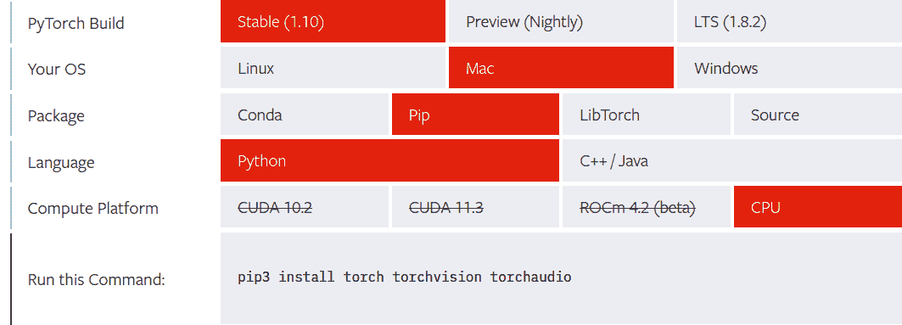
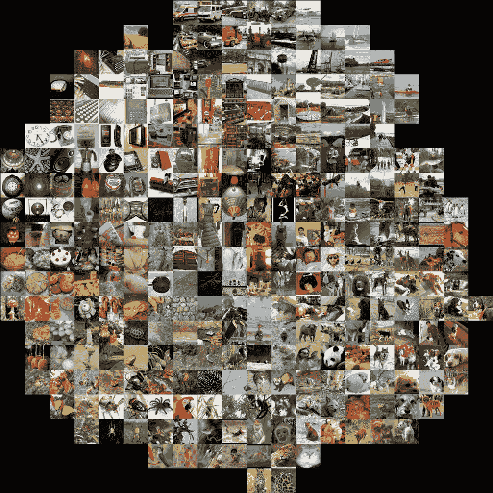
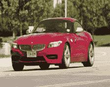
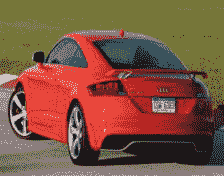
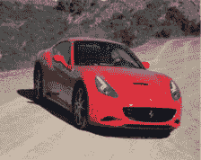
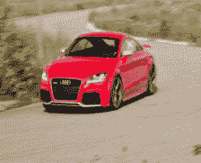
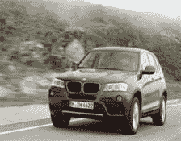

# 第十章。深度学习与 PySpark LSH 的图像相似性检测

无论您在社交媒体还是电子商务店铺上遇到它们，图像对于我们的数字生活至关重要。事实上，正是一个图像数据集——ImageNet——引发了当前深度学习革命的关键组成部分。在 ImageNet 2012 挑战中，分类模型的显著表现是重要的里程碑，并引起了广泛关注。因此，作为数据科学从业者，您很可能会在某个时刻遇到图像数据。

本章中，你将通过使用 PySpark 来扩展深度学习工作流程，针对视觉任务——即图像相似性检测，获得经验。识别相似图像对于人类来说是直观的，但对计算机来说是一项复杂的任务。在大规模情况下，这变得更加困难。在本章中，我们将介绍一种用于查找相似项的近似方法，称为局部敏感哈希（LSH），并将其应用于图像。我们将使用深度学习将图像数据转换为数值向量表示。PySpark 的 LSH 算法将应用于生成的向量，这将使我们能够在给定新输入图像时找到相似图像。

从高层次来看，这个例子反映了像 Instagram 和 Pinterest 等照片分享应用程序用于图像相似性检测的方法之一。这有助于他们的用户理解其平台上存在的大量视觉数据。这也展示了一个深度学习工作流程如何从 PySpark 的可扩展性中受益。

首先，我们将简要介绍 PyTorch，一个深度学习框架。近年来，它因其相对于其他主要低级深度学习库更易学习的曲线而备受关注。然后，我们将下载和准备我们的数据集。用于我们任务的数据集是由斯坦福人工智能实验室于 2013 年发布的 Cars 数据集。PyTorch 将用于图像预处理。接下来，我们将把输入图像数据转换为向量表示（图像嵌入）。然后，我们将导入结果嵌入到 PySpark 中，并使用 LSH 算法进行转换。最后，我们将采用新图像，并使用我们的 LSH 转换数据集进行最近邻搜索，以找到相似的图像。

让我们从介绍和设置 PyTorch 开始。

# PyTorch

PyTorch 是一个用于构建深度学习项目的库。它强调灵活性，并允许使用 Python 来表达深度学习模型的习惯用语。它早期被研究社区早期采用。最近，由于其易用性，它已成为广泛应用的主要深度学习工具之一。与 TensorFlow 一起，它是目前最流行的深度学习库之一。

PyTorch 的简单灵活接口支持快速实验。您可以加载数据，应用转换并用几行代码构建模型。然后，您可以灵活编写定制的训练、验证和测试循环，并轻松部署训练模型。它始终在专业环境中用于实际的关键任务。能够利用 GPU（图形处理单元）训练资源密集型模型是使深度学习流行的重要因素。PyTorch 提供出色的 GPU 支持，尽管我们不需要在我们的任务中使用它。

## 安装

在[PyTorch 网站](https://oreil.ly/CHkJo)上，您可以根据系统配置轻松获取安装说明，如图 10-1 所示。



###### 图 10-1. PyTorch 安装，CPU 支持

执行提供的命令并按照您的配置说明操作：

```py
$ pip3 install torch torchvision
```

我们不会依赖 GPU，因此将选择 CPU 作为计算平台。如果您有要使用的 GPU 设置，请根据需要选择选项以获取所需的说明。我们在本章中也不需要 Torchaudio，因此跳过其安装。

# 准备数据

我们将使用[斯坦福汽车数据集](https://oreil.ly/gxo8Q)。它是由 Jonathan Krause、Michael Stark、Jia Deng 和 Li Fei-Fei 在 ICCV 2013 年论文“3D 对象表示用于细粒度分类”中发布的。

您可以从 Kaggle 下载图像，或使用斯坦福人工智能实验室提供的源链接下载。

```py
wget http://ai.stanford.edu/~jkrause/car196/car_ims.tgz
```

下载完成后，解压缩训练和测试图像目录，并将它们放在名为*cars_data*的目录中：

```py
data_directory = "cars_data"
train_images = "cars_data/cars_train/cars_train"
```

您可以在这里获取包含训练数据集标签的 CSV 文件[here](https://oreil.ly/UoHXh)。下载它，将其重命名为*cars_train_data.csv*，并将其放在数据目录中。让我们来看一下它：

```py
import pandas as pd

train_df = pd.read_csv(data_directory+"/cars_train_data.csv")

train_df.head()
...

    Unnamed: 0 	x1 	y1 	    x2 	    y2 	    Class 	image
0 	         0 	39 	116 	569 	375 	14 	    00001.jpg
1 	         1 	36 	116 	868 	587 	3 	    00002.jpg
2 	         2 	85 	109 	601 	381 	91 	    00003.jpg
3 	         3 	621 	393     1484    1096    134 	    00004.jpg
4 	         4 	14 	36      133     99      106 	    00005.jpg
```

忽略除了`Class`和`image`之外的所有列。其他列与此数据集衍生自的原始研究项目相关，不会在我们的任务中使用。

## 使用 PyTorch 调整图像大小

在我们进一步之前，我们需要预处理我们的图像。在机器学习中，预处理数据非常普遍，因为深度学习模型（神经网络）希望输入满足某些要求。

我们需要应用一系列预处理步骤，称为*转换*，将输入图像转换为模型所需的正确格式。在我们的案例中，我们需要它们是 224 x 224 像素的 JPEG 格式图像，因为这是我们将在下一节中使用的 ResNet-18 模型的要求。我们使用 PyTorch 的 Torchvision 包执行此转换的代码如下：

```py
import os
from PIL import Image
from torchvision import transforms

# needed input dimensions for the CNN
input_dim = (224,224)
input_dir_cnn = data_directory + "/images/input_images_cnn"

os.makedirs(input_dir_cnn, exist_ok = True)

transformation_for_cnn_input = transforms.Compose([transforms.Resize(input_dim)])

for image_name in os.listdir(train_images):
    I = Image.open(os.path.join(train_images, image_name))
    newI = transformation_for_cnn_input(I)

    newI.save(os.path.join(input_dir_cnn, image_name))

    newI.close()
    I.close()
```

在这里，我们使用单一转换来调整图像大小以适应神经网络。然而，我们也可以使用`Compose`转换来定义一系列用于预处理图像的转换。

现在我们的数据集已经准备就绪。在下一节中，我们将把图像数据转换为适用于 PySpark LSH 算法的向量表示。

# 图像的深度学习模型用于向量表示

卷积神经网络（CNN），在输入观察数据为图像时，是用于预测的标准神经网络架构。我们不会将其用于任何预测任务，而是用于生成图像的向量表示。具体来说，我们将使用 ResNet-18 架构。

残差网络（ResNet）由 Shaoqing Ren、Kaiming He、Jian Sun 和 Xiangyu Zhang 在其 2015 年的论文“Deep Residual Learning for Image Recognition”中引入。ResNet-18 中的 18 表示神经网络架构中存在的层数。ResNet 的其他流行变体包括 34 和 50 层。层数越多，性能提高，但计算成本也增加。

## 图像嵌入

*图像嵌入* 是图像在向量空间中的表示。基本思想是，如果给定图像接近另一图像，则它们的嵌入也会相似且在空间维度上接近。

图 10-2 中的图像，[由 Andrej Karpathy 发布](https://oreil.ly/YRhhT)，展示了图像如何在较低维度空间中表示。例如，您可以注意到顶部附近的车辆和左下角空间中的鸟类。



###### 图 10-2\. ILSVRC 2012 图像嵌入在二维空间中的表示

我们可以通过取其倒数第二个全连接层的输出来从 ResNet-18 获取图像的嵌入。接下来，我们创建一个类，该类可以在提供图像的情况下返回其数值向量形式的表示。

```py
import torch
from torchvision import models

class Img2VecResnet18():
    def __init__(self):
        self.device = torch.device("cpu")
        self.numberFeatures = 512
        self.modelName = "resnet-18"
        self.model, self.featureLayer = self.getFeatureLayer()
        self.model = self.model.to(self.device)
        self.model.eval()
        self.toTensor = transforms.ToTensor() 
        self.normalize = transforms.Normalize(mean=[0.485, 0.456, 0.406],
                                              std=[0.229, 0.224, 0.225]) 

    def getFeatureLayer(self):
        cnnModel = models.resnet18(pretrained=True)
        layer = cnnModel._modules.get('avgpool')
        self.layer_output_size = 512

        return cnnModel, layer

    def getVec(self, img):
        image = self.normalize(self.toTensor(img)).unsqueeze(0).to(self.device)
        embedding = torch.zeros(1, self.numberFeatures, 1, 1)
        def copyData(m, i, o): embedding.copy_(o.data)
        h = self.featureLayer.register_forward_hook(copyData)
        self.model(image)
        h.remove()
        return embedding.numpy()[0, :, 0, 0]
```


将图像转换为 PyTorch 张量格式。


将像素值范围重新缩放到 0 到 1 之间。均值和标准差（std）的值是基于用于训练模型的数据预先计算的。对图像进行标准化可以提高分类器的准确性。

现在我们初始化 `Img2VecResnet18` 类，并对所有图像应用 `getVec` 方法以获取它们的图像嵌入。

```py
import tqdm

img2vec = Img2VecResnet18()
allVectors = {}
for image in tqdm(os.listdir(input_dir_cnn)):
    I = Image.open(os.path.join(input_dir_cnn, image))
    vec = img2vec.getVec(I)
    allVectors[image] = vec
    I.close()
```

对于更大的数据集，您可能希望顺序写入向量输出到文件，而不是将其保留在内存中，以避免内存溢出错误。这里的数据可以管理，因此我们创建一个字典，并将其保存为 CSV 文件：

```py
import pandas as pd

pd.DataFrame(allVectors).transpose().\
    to_csv(data_folder + '/input_data_vectors.csv')
```

由于我们是在本地工作，我们选择了 CSV 格式来保存向量输出。然而，Parquet 格式更适合这种类型的数据。您可以通过在前面的代码中用 `to_parquet` 替换 `to_csv` 来轻松将数据保存为 Parquet 格式。

现在我们已经有了所需的图像嵌入，我们可以将它们导入到 PySpark 中。

## 将图像嵌入导入到 PySpark 中

启动 PySpark shell：

```py
$ pyspark --driver-memory 4g
```

导入图像嵌入：

```py
input_df = spark.read.option('inferSchema', True).\
                    csv(data_directory + '/input_data_vectors.csv')
input_df.columns
...

['_c0',
 '_c1',
 '_c2',
 '_c3',
 '_c4',
[...]
'_c509',
 '_c510',
 '_c511',
 '_c512']
```

PySpark 的 LSH 实现需要一个向量列作为输入。我们可以通过使用`VectorAssembler`转换将数据框中的相关列组合成一个向量列：

```py
from pyspark.ml.feature import VectorAssembler

vector_columns = input_df.columns[1:]
assembler = VectorAssembler(inputCols=vector_columns, outputCol="features")

output = assembler.transform(input_df)
output = output.select('_c0', 'features')

output.show(1, vertical=True)
...

-RECORD 0------------------------
 _c0      | 01994.jpg
 features | [0.05640895,2.709...

...

output.printSchema()
...

root
 |-- _c0: string (nullable = true)
 |-- features: vector (nullable = true)
```

在下一节中，我们将使用 LSH 算法创建一种从数据集中查找相似图像的方法。

# 使用 PySpark LSH 进行图像相似性搜索

局部敏感哈希是一类重要的哈希技术，通常用于具有大型数据集的聚类、近似最近邻搜索和异常值检测。局部敏感函数接受两个数据点并决定它们是否应该成为候选对。

LSH 的一般思想是使用一组函数家族（“LSH 家族”）将数据点哈希到桶中，以便彼此接近的数据点具有高概率地位于相同的桶中，而相距较远的数据点很可能位于不同的桶中。映射到相同桶的数据点被认为是候选对。

在 PySpark 中，不同的 LSH 家族由不同的类实现（例如`MinHash`和`BucketedRandomProjection`），并且在每个类中提供了用于特征转换、近似相似性连接和近似最近邻的 API。

我们将使用 LSH 的 BucketedRandomProjection 实现。

让我们首先创建我们的模型对象：

```py
from pyspark.ml.feature import BucketedRandomProjectionLSH

brp = BucketedRandomProjectionLSH(inputCol="features", outputCol="hashes",
                                  numHashTables=200, bucketLength=2.0)
model = brp.fit(output)
```

在 BucketedRandomProjection LSH 实现中，桶长度可用于控制哈希桶的平均大小（从而控制桶的数量）。较大的桶长度（即较少的桶）增加了特征被哈希到同一桶中的概率（增加真正和假正例的数量）。

现在，我们使用新创建的 LSH 模型对象转换输入 DataFrame。生成的 DataFrame 将包含一个`hashes`列，其中包含图像嵌入的哈希表示：

```py
lsh_df = model.transform(output)
lsh_df.show(5)

...
+---------+--------------------+--------------------+
|      _c0|            features|              hashes|
+---------+--------------------+--------------------+
|01994.jpg|[0.05640895,2.709...|[[0.0], [-2.0], [...|
|07758.jpg|[2.1690884,3.4647...|[[0.0], [-1.0], [...|
|05257.jpg|[0.7666548,3.7960...|[[-1.0], [-1.0], ...|
|07642.jpg|[0.86353475,2.993...|[[-1.0], [-1.0], ...|
|00850.jpg|[0.49161428,2.172...|[[-1.0], [-2.0], ...|
+---------+--------------------+--------------------+
only showing top 5 rows
```

准备好我们的 LSH 转换数据集后，在下一节中我们将测试我们的工作。

## 最近邻搜索

让我们尝试使用新图像找到相似的图像。暂时，我们将从输入数据集中选择一个（图 10-3）：

```py
from IPython.display import display
from PIL import Image

input_dir_cnn = data_folder + "/images/input_images_cnn"

test_image = os.listdir(input_dir_cnn)[0]
test_image = os.path.join(input_dir_cnn, test_image)
print(test_image)
display(Image.open(test_image))
...
cars_data/images/input_images_cnn/01994.jpg
```



###### 图 10-3。从我们的数据集中随机选择的汽车图像

首先，我们需要使用我们的`Img2VecResnet18`类将输入图像转换为向量格式：

```py
img2vec = Img2VecResnet18()
I = Image.open(test_image)
test_vec = img2vec.getVec(I)
I.close()

print(len(test_vec))
print(test_vec)
...

512
[5.64089492e-02 2.70972490e+00 2.15519500e+00 1.43926993e-01
 2.47581363e+00 1.36641121e+00 1.08204508e+00 7.62105465e-01
[...]
5.62133253e-01 4.33687061e-01 3.95899676e-02 1.47889364e+00
 2.89110214e-01 6.61322474e-01 1.84713617e-01 9.42268595e-02]
...

test_vector = Vectors.dense(test_vec)
```

现在我们执行近似最近邻搜索：

```py
print("Approximately searching lsh_df for 5 nearest neighbors \
 of input vector:")
result = model.approxNearestNeighbors(lsh_df, test_vector, 5)

result.show()
...
+---------+--------------------+--------------------+--------------------+
|      _c0|            features|              hashes|             distCol|
+---------+--------------------+--------------------+--------------------+
|01994.jpg|[0.05640895,2.709...|[[0.0], [-2.0], [...|3.691941786298668...|
|00046.jpg|[0.89430475,1.992...|[[0.0], [-2.0], [...|   10.16105522433224|
|04232.jpg|[0.71477133,2.582...|[[-1.0], [-2.0], ...|  10.255391011678762|
|05146.jpg|[0.36903867,3.410...|[[-1.0], [-2.0], ...|  10.264572173322843|
|00985.jpg|[0.530428,2.87453...|[[-1.0], [-2.0], ...|  10.474841359816633|
+---------+--------------------+--------------------+--------------------+
```

您可以查看图 10-4 到图 10-8 中的图像（链接：#result-image1 至 #result-image5），看看模型已经有了一些正确的结果：

```py
for i in list(result.select('_c0').toPandas()['_c0']):
    display(Image.open(os.path.join(input_dir_cnn, i)))
```


###### 图 10-4。结果图像 1



###### 图 10-5。结果图像 2



###### 图 10-6。结果图像 3



###### 图 10-7。结果图像 4



###### 图 10-8\. 结果图像 5

输入图像位于列表顶部，正如人们所预期的那样。

# 下一步怎么走

在本章中，我们学习了如何将 PySpark 与现代深度学习框架结合起来，以扩展图像相似性检测工作流程。

有多种方法可以改进这个实现。你可以尝试使用更好的模型或者改进预处理以获得更好的嵌入质量。此外，LSH 模型也可以进行调整。在实际环境中，你可能需要定期更新参考数据集，以适应系统中新图像的到来。最简单的方法是定期运行批处理作业，创建新的 LSH 模型。你可以根据自己的需求和兴趣来探索所有这些方法。
