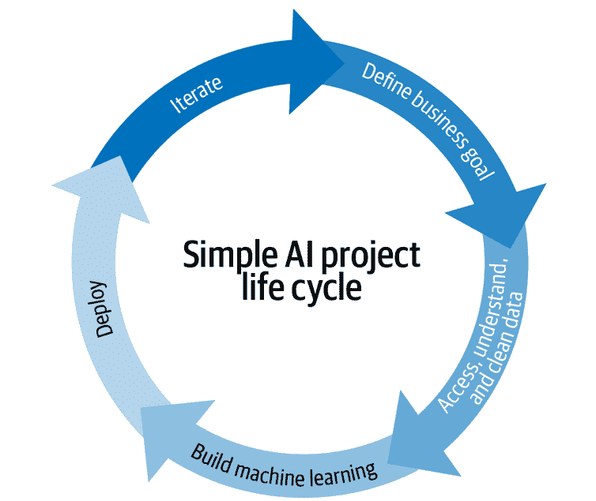
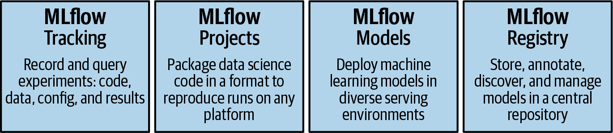
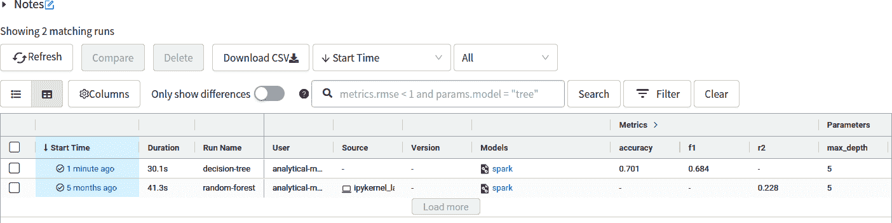
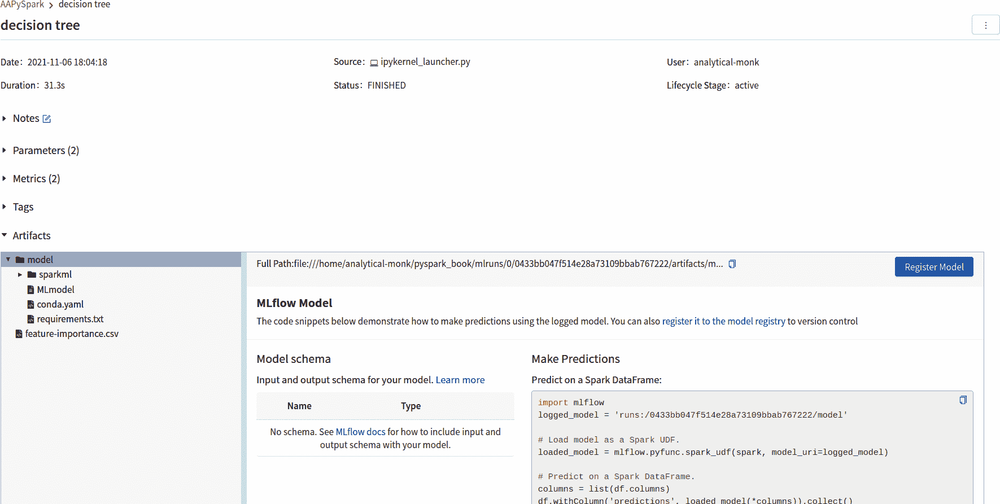
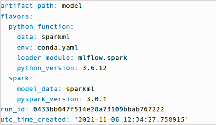
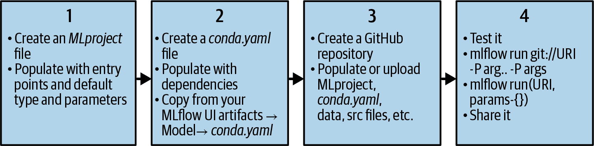

# 第十一章：使用 MLflow 管理机器学习生命周期

随着机器学习在各行业的重要性日益突出并在生产环境中部署，围绕它的协作和复杂性水平也相应增加。幸运的是，已经出现了平台和工具，以有组织的方式管理机器学习生命周期。一个与 PySpark 兼容的这类平台是 MLflow。在本章中，我们将展示如何使用 MLflow 与 PySpark。在此过程中，我们将介绍您可以在数据科学工作流中引入的关键实践。

与其从头开始，我们将在第四章所做的工作基础上进行构建。我们将使用 Covtype 数据集重新审视我们的决策树实现。这一次，我们将使用 MLflow 来管理机器学习生命周期。

我们将首先解释围绕机器学习生命周期的挑战和过程。然后我们将介绍 MLflow 及其组件，以及 MLflow 对 PySpark 的支持。接下来我们将介绍如何使用 MLflow 跟踪机器学习训练运行。然后我们将学习如何使用 MLflow Models 管理机器学习模型。然后我们将讨论我们的 PySpark 模型的部署并对其进行实现。我们将通过创建一个 MLflow 项目来结束本章。这将展示如何使我们迄今为止的工作对合作者可重现。让我们开始讨论机器学习生命周期。

# 机器学习生命周期

描述机器学习生命周期的方法有多种。一个简单的方法是将其分解为不同的组件或步骤，如图 11-1 所示。这些步骤对于每个项目来说不一定是顺序的，并且生命周期往往是循环的。

+   业务项目定义和利益相关者的对齐

+   数据获取和探索

+   数据建模

+   结果的解释和沟通

+   模型实施和部署



###### 图 11-1。ML 生命周期

你能够迭代机器学习生命周期的速度影响你能够将工作投入实际应用的速度。例如，由于底层数据的变化，实施的模型可能会过时。在这种情况下，你需要重新审视过去的工作并再次构建。

机器学习项目生命周期中可能出现的挑战示例包括：

缺乏可重现性

即使代码和参数已被跟踪，同一团队的数据科学家可能无法复现彼此的结果。这可能是由于执行环境（系统配置或库依赖项）不同造成的。

模型标准化的缺乏

不同的团队可能使用不同的库和存储机器学习模型的约定，这在团队间共享工作时可能会成为问题。

在进行 ML 生命周期的结构化工作时可能会快速变得无法控制。针对这类挑战，多个开源和专有平台可供选择。其中一个领先的开源平台是 MLflow，在接下来的部分中我们将进行介绍。

# MLflow

MLflow 是一个管理端到端机器学习生命周期的开源平台。它帮助我们复现和共享实验，管理模型并为最终用户部署模型。除了 REST API 和 CLI 外，它还提供了 Python、R 和 Java/Scala 的 API。

如 图 11-2 所示，它有四个主要组件：

MLflow Tracking

此组件记录参数、指标、代码版本、模型以及如图表和文本等工件。

MLflow 项目

此组件为您提供可重复使用的、可重现的格式，以与其他数据科学家共享或传输到生产中。它帮助您管理模型训练过程。

MLflow 模型

此组件使您能够将模型打包部署到各种模型服务和推断平台。它提供了一个一致的 API，用于加载和应用模型，无论使用哪种底层库构建模型。

MLflow 注册表

此组件使您能够在中心存储中协作跟踪模型衍生、模型版本、阶段转换和注释。



###### 图 11-2\. MLflow 组件

让我们安装 MLflow。使用 pip 安装非常简单：

```py
$ pip3 install mlflow
```

就是这样！

MLflow 与许多流行的机器学习框架集成，如 Spark、TensorFlow、PyTorch 等。接下来的几节中，我们将使用它对 Spark 的本地支持。导入特定于 Spark 的 MLflow 组件就像运行 `import mlflow.spark` 一样简单。

在下一节中，我们将介绍 MLflow Tracking 并将其添加到我们的决策树代码中 第四章。

# 实验跟踪

典型的机器学习项目涉及尝试多种算法和模型以解决问题。需要跟踪相关的数据集、超参数和指标。通常使用临时工具（如电子表格）进行实验跟踪可能效率低下，甚至不可靠。

MLflow Tracking 是一个 API 和 UI，用于在运行机器学习代码时记录参数、代码版本、指标和工件，并在稍后可视化结果。您可以在任何环境中使用 MLflow Tracking（例如独立脚本或笔记本）将结果记录到本地文件或服务器，然后比较多次运行。它与多个框架集成且与库无关。

MLflow 跟踪围绕“运行”这一概念组织，这些运行是某段数据科学代码的执行。MLflow 跟踪提供了一个界面，让您可以可视化，搜索和比较运行，以及下载运行的工件或元数据以在其他工具中进行分析。它包含以下关键功能：

+   基于实验的运行列表和比较

+   根据参数或指标值搜索运行

+   可视化运行指标

+   下载运行结果

让我们在 PySpark shell 中的决策树代码中添加 MLflow 跟踪。假设您已下载了[Covtype 数据集](https://oreil.ly/0xyky)并对其熟悉。Covtype 数据集以压缩的 CSV 格式数据文件*covtype.data.gz*和配套的信息文件*covtype.info*的形式在线提供。

启动`pyspark-shell`。如前所述，构建决策树可能需要大量资源。如果您有足够的内存，请指定`--driver-memory 8g`或类似的值。

我们首先准备数据和机器学习管道：

```py
from pyspark.ml import Pipeline
from pyspark.sql.functions import col
from pyspark.sql.types import DoubleType
from pyspark.ml.feature import VectorAssembler
from pyspark.ml.classification import DecisionTreeClassifier

data_without_header = spark.read.option("inferSchema", True).\
                                option("header", False).\
                                csv("data/covtype.data")

colnames = ["Elevation", "Aspect", "Slope",
            "Horizontal_Distance_To_Hydrology",
            "Vertical_Distance_To_Hydrology",
            "Horizontal_Distance_To_Roadways",
            "Hillshade_9am", "Hillshade_Noon",
            "Hillshade_3pm", "Horizontal_Distance_To_Fire_Points"] + \
[f"Wilderness_Area_{i}" for i in range(4)] + \
[f"Soil_Type_{i}" for i in range(40)] + \
["Cover_Type"]

data = data_without_header.toDF(*colnames).\
                            withColumn("Cover_Type",
                                        col("Cover_Type").\
                                        cast(DoubleType()))

(train_data, test_data) = data.randomSplit([0.9, 0.1])

input_cols = colnames[:-1]
vector_assembler = VectorAssembler(inputCols=input_cols,outputCol="featureVector")

classifier = DecisionTreeClassifier(seed = 1234,
                                    labelCol="Cover_Type",
                                    featuresCol="featureVector",
                                    predictionCol="prediction")

pipeline = Pipeline(stages=[vector_assembler, classifier])
```

要开始使用 MLflow 记录日志，我们使用`mlflow.start_run`启动一个运行。我们将使用`with`子句来在块结束时自动结束运行：

```py
import mlflow
import mlflow.spark
import pandas as pd
from pyspark.ml.evaluation import MulticlassClassificationEvaluator

with mlflow.start_run(run_name="decision-tree"):
    # Log param: max_depth
    mlflow.log_param("max_depth", classifier.getMaxDepth())
    # Log model
    pipeline_model = pipeline.fit(train_data)
    mlflow.spark.log_model(pipeline_model, "model")
    # Log metrics: Accuracy and F1
    pred_df = pipeline_model.transform(test_data)
    evaluator = MulticlassClassificationEvaluator(labelCol="Cover_Type",
                                                predictionCol="prediction")
    accuracy = evaluator.setMetricName("accuracy").evaluate(pred_df)
    f1 = evaluator.setMetricName("f1").evaluate(pred_df)
    mlflow.log_metrics({"accuracy": accuracy, "f1": f1})
    # Log artifact: feature importance scores
    tree_model = pipeline_model.stages[-1]
    feature_importance_df = (pd.DataFrame(list(
                                    zip(vector_assembler.getInputCols(),
                                    tree_model.featureImportances)),
                            columns=["feature", "importance"])
                .sort_values(by="importance", ascending=False))
    feature_importance_df.to_csv("feature-importance.csv", index=False)
    mlflow.log_artifact("feature-importance.csv")
```

现在我们可以通过跟踪界面访问我们的实验数据。运行`mlflow ui`命令启动它。默认情况下，它会在端口 5000 上启动。您可以使用`-p <port_name>`选项更改默认端口。一旦成功启动界面，请转到[*http://localhost:5000/*](http://localhost:5000/)。您将看到一个如图 11-3 所示的界面。您可以搜索所有运行，过滤符合特定条件的运行，将运行进行比较等。如果您愿意，还可以将内容导出为 CSV 文件以进行本地分析。点击界面中名为`decision-tree`的运行。



###### 图 11-3\. MLflow UI 1

在查看单个运行时，如图 11-4 所示，您会注意到 MLflow 存储了所有相应的参数，指标等。您可以在其中添加关于此运行的自由文本注释，以及标签。



###### 图 11-4\. MLflow UI 2

现在我们能够跟踪和重现我们的实验。现在让我们讨论使用 MLflow 管理我们的模型。

# 管理和提供机器学习模型

MLflow 模型是打包机器学习模型的标准格式，可以在各种下游工具中使用，例如通过 REST API 进行实时服务或在 Apache Spark 上进行批量推断。该格式定义了一种约定，可让您以不同的“口味”保存模型，这些口味可以被不同的库理解。

Flavor 是使 MLflow 模型强大的关键概念。它使得可以编写可以与任何 ML 库中的模型一起工作的工具，而无需将每个工具与每个库集成。MLflow 定义了几种“标准” flavor，所有其内置部署工具都支持，如描述如何将模型作为 Python 函数运行的“Python function” flavor。然而，库也可以定义和使用其他 flavors。例如，MLflow 的`mlflow.sklearn`库允许将模型加载回作为 scikit-learn 的`Pipeline`对象，在意识到 scikit-learn 的代码中使用，或者作为通用 Python 函数在仅需要应用模型的工具中使用（例如用于将模型部署到 Amazon SageMaker 的`mlflow.sagemaker`工具）。

MLflow 模型是一个包含一组文件的目录。我们之前使用`log_model`API 记录了我们的模型。这创建了一个名为 *MLmodel* 的文件。打开决策树运行并向下滚动到“Artifacts”部分。查看 *MLmodel* 文件。它的内容应类似于图 11-5 所示。



###### 图 11-5\. MLflow 模型

该文件捕获了我们模型的元数据、签名和 flavors。模型签名定义了模型输入和输出的模式。

我们的模型文件有两种 flavor：python_function 和 spark。python_function flavor 使得 MLflow 的模型部署和服务工具可以处理任何 Python 模型，而不管该模型是用哪个 ML 库训练的。因此，任何 Python 模型都可以轻松地在各种运行时环境中投入生产。

Spark 模型风格支持将 Spark MLlib 模型导出为 MLflow 模型。例如，可以使用记录的模型在 Spark DataFrame 上进行预测：

```py
import mlflow

run_id = "0433bb047f514e28a73109bbab767222" 
logged_model = f'runs:/{run_id}/model' 

# Load model as a Spark UDF.
loaded_model = mlflow.spark.load_model(model_uri=logged_model)

# Predict on a Spark DataFrame.
preds = loaded_model.transform(test_data)
preds.select('Cover_Type', 'rawPrediction', 'probability', 'prediction').\
        show(1, vertical=True)
...
-RECORD 0-----------------------------
 Cover_Type    | 6.0
 rawPrediction | 0.0,0.0,605.0,15...
 probability   | 0.0,0.0,0.024462...
 prediction    | 3.0
only showing top 1 row
```

[

我们使用 Python f-strings 添加相关的运行 ID。

我们还可以使用`mlflow serve`命令行工具来为与特定运行 ID 对应的模型提供服务。

```py
$ mlflow models serve --model-uri runs:/0433bb047f514e28a73109bbab767222/model \
        -p 7000

...

2021/11/13 12:13:49 INFO mlflow.models.cli: Selected backend for...
2021/11/13 12:13:52 INFO mlflow.utils.conda: === Creating conda ...
Collecting package metadata (repodata.json): done
Solving environment: done ...
```

您已成功将模型部署为 REST API！

现在我们可以使用这个端点进行推断。让我们准备并发送一个请求到端点来看看它的运行情况。我们将使用`requests`库来完成这个操作。如果你还没有安装它，请先使用 pip 进行安装：

```py
pip3 install requests
```

现在我们将发送一个包含 JSON 对象的请求到模型服务器，该对象的方向为 pandas-split。

```py
import requests

host = '0.0.0.0'
port = '7001'

url = f'http://{host}:{port}/invocations'

headers = {
    'Content-Type': 'application/json;',
    'format': 'pandas-split';
}

http_data = '{"columns":["Elevation","Aspect","Slope", \
 "Horizontal_Distance_To_Hydrology", \
 "Vertical_Distance_To_Hydrology","Horizontal_Distance_To_Roadways", \
 "Hillshade_9am","Hillshade_Noon","Hillshade_3pm",\
 "Horizontal_Distance_To_Fire_Points",\
 "Wilderness_Area_0","Wilderness_Area_1","Wilderness_Area_2",\
 "Wilderness_Area_3","Soil_Type_0","Soil_Type_1","Soil_Type_2",\
 "Soil_Type_3","Soil_Type_4","Soil_Type_5","Soil_Type_6",\
 "Soil_Type_7","Soil_Type_8","Soil_Type_9","Soil_Type_10",\
 "Soil_Type_11","Soil_Type_12","Soil_Type_13",\
 "Soil_Type_14","Soil_Type_15","Soil_Type_16",\
 "Soil_Type_17","Soil_Type_18","Soil_Type_19",\
 "Soil_Type_20","Soil_Type_21","Soil_Type_22",\
 "Soil_Type_23","Soil_Type_24","Soil_Type_25",\
 "Soil_Type_26","Soil_Type_27","Soil_Type_28",\
 "Soil_Type_29","Soil_Type_30","Soil_Type_31",\
 "Soil_Type_32","Soil_Type_33","Soil_Type_34",\
 "Soil_Type_35","Soil_Type_36","Soil_Type_37",\
 "Soil_Type_38","Soil_Type_39","Cover_Type"],\
 "index":[0],\
 "data":[[2596,51,3,258,0,510,221,232,148,6279,1,\
 0,0,0,0,0,0,0,0,0,0,0,0,0,0,0,0,0,0,0,0,\
 0,0,0,0,0,0,0,0,0,0,0,1,0,0,0,0,0,0,0,0,0,0,0,5.0]]'\

r = requests.post(url=url, headers=headers, data=http_data)

print(f'Predictions: {r.text}')
...
Predictions: [2.0]
```

我们不仅加载了一个保存的模型，还将其部署为 REST API 并进行了实时推断！

现在让我们学习如何为我们迄今所做的工作创建一个 MLflow 项目。

# 创建和使用 MLflow 项目

MLflow Projects 是一个可重复使用和可复制打包的标准格式。它是一个自包含单元，捆绑了执行机器学习工作流所需的所有机器代码和依赖项，并使你能够在任何系统或环境上生成特定模型运行。MLflow Projects 包括一个 API 和命令行工具来运行项目。它还可以用于将项目链接到工作流中。

每个项目只是一个文件目录，或者是一个包含你的代码的 Git 仓库。MLflow 可以根据在该目录中放置文件的约定来运行某些项目（例如，*conda.yml*文件被视为一个 Conda 环境），但是你可以通过添加 MLproject 文件来更详细地描述你的项目，该文件是一个格式为 YAML 的文本文件。

MLflow 当前支持以下项目环境：Conda 环境、Docker 容器环境和系统环境。默认情况下，MLflow 使用系统路径来查找和运行 Conda 二进制文件。

创建一个基本的 MLflow 项目很简单。所需的步骤列在图 11-6 中。



###### 图 11-6\. 如何构建一个 MLflow 项目

我们将从创建名为*decision_tree_project*的项目目录开始：

```py
mkdir decision_tree_project
cd decision_tree_project
```

接下来，我们首先会创建一个 MLproject 文件：

```py
name: decision_tree_project

conda_env: conda.yml

entry_points:
  main:
    command: "python train.py"
```

现在我们需要我们的*conda.yml*文件。我们可以从之前介绍的 MLflow UI 中获取这个。进入我们之前看到的 decision-tree 运行。向下滚动到 Artifacts，点击 conda YAML 文件，将其内容复制到我们项目目录中的*conda.yml*中：

```py
channels:
- conda-forge
dependencies:
- python=3.6.12
- pip
- pip:
  - mlflow
  - pyspark==3.2.1
  - scipy==1.5.3
name: mlflow-env
```

现在我们将创建 Python 脚本，用于在执行 MLflow 项目时训练决策树模型。为此，我们将使用前面一节中的代码：

```py
from pyspark.sql import SparkSession
from pyspark.ml import Pipeline
from pyspark.sql.functions import col
from pyspark.sql.types import DoubleType
from pyspark.ml.feature import VectorAssembler
from pyspark.ml.classification import DecisionTreeClassifier
from pyspark.ml.evaluation import MulticlassClassificationEvaluator

spark = SparkSession.builder.appName("App").getOrCreate()

def main():
    data_without_header = spark.read.option("inferSchema", True).\
                                    option("header", False).\
                                    csv("../data/covtype.data") 

    colnames = ["Elevation", "Aspect", "Slope",
                "Horizontal_Distance_To_Hydrology",
                "Vertical_Distance_To_Hydrology",
                "Horizontal_Distance_To_Roadways",
                "Hillshade_9am", "Hillshade_Noon",
                "Hillshade_3pm",
                "Horizontal_Distance_To_Fire_Points"] + \
    [f"Wilderness_Area_{i}" for i in range(4)] + \
    [f"Soil_Type_{i}" for i in range(40)] + \
    ["Cover_Type"]

    data = data_without_header.toDF(*colnames).\
                                withColumn("Cover_Type",
                                            col("Cover_Type").\
                                            cast(DoubleType()))

    (train_data, test_data) = data.randomSplit([0.9, 0.1])

    input_cols = colnames[:-1]
    vector_assembler = VectorAssembler(inputCols=input_cols,
                                outputCol="featureVector")

    classifier = DecisionTreeClassifier(seed = 1234,
                                        labelCol="Cover_Type",
                                        featuresCol="featureVector",
                                        predictionCol="prediction")

    pipeline = Pipeline(stages=[vector_assembler, classifier])

    pipeline_model = pipeline.fit(train_data)
    # Log metrics: Accuracy and F1
    pred_df = pipeline_model.transform(test_data)
    evaluator = MulticlassClassificationEvaluator(labelCol="Cover_Type",
                                                predictionCol="prediction")
    accuracy = evaluator.setMetricName("accuracy").evaluate(pred_df)
    f1 = evaluator.setMetricName("f1").evaluate(pred_df)
    print({"accuracy": accuracy, "f1": f1})

if __name__ == "__main__":
    main()
```


假设数据位于执行的 MLflow 项目目录的上一级目录。

数据也可以包含在 MLflow 项目中。在这种情况下，我们没有这样做是因为数据太大了。在这种情况下，可以使用 AWS S3 或 GCS 等云存储来共享数据。

在分享之前，你也可以在本地模拟协作者如何工作，我们使用`mlflow run`命令来实现这一点。

```py
mlflow run decision_tree_project
...
[...]
{'accuracy': 0.6988990605087336, 'f1': 0.6805617730220171}
```

现在我们有一个可复制的 MLflow 项目。我们可以将其上传到 GitHub 仓库，并与协作者分享，对方能够复现我们的工作。

# 从这里开始

本章介绍了 MLflow 项目，并指导您如何在简单项目中实施它。 MLflow 项目本身有很多可以探索的内容。 您可以在[官方文档](https://mlflow.org)中找到更多信息。 还有其他工具可供选择。 这些包括开源项目，如 Metaflow 和 Kubeflow，以及亚马逊 SageMaker 和 Databricks 平台等大型云提供商的专有产品。

当然，工具只是应对现实世界中机器学习项目挑战的一部分解决方案。 进程需要由参与任何项目的人员定义。 我们希望您能在本章提供的基础上建立，并为野外成功的机器学习项目做出贡献。
