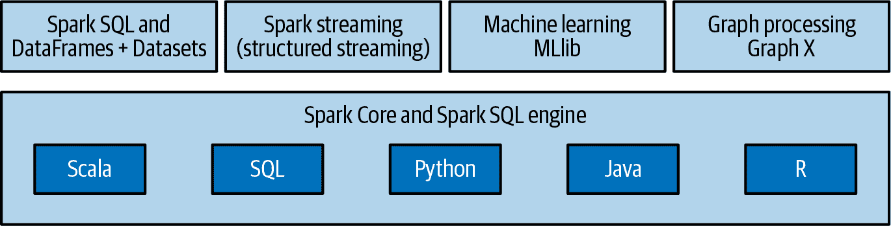

# 第一章：分析大数据

当人们说我们生活在大数据时代时，他们意味着我们有工具可以在以前听都没听说过的规模上收集、存储和处理信息。在 10 或 15 年前，以下任务根本无法完成：

+   使用数千个特征和数十亿笔交易构建检测信用卡欺诈的模型

+   智能向数百万用户推荐数百万种产品

+   通过包含数百万个工具的投资组合模拟估算财务风险

+   轻松操作来自数千人的基因组数据，以检测与疾病相关的遗传关联

+   通过定期处理数百万张卫星图像评估农业用地利用和作物产量，以改进政策制定

在这些能力背后是一整套开源软件生态系统，可以利用服务器集群处理大量数据。2006 年引入/发布的 Apache Hadoop 推动了分布式计算的广泛采用。从那时起，大数据生态系统和工具在快速发展。过去五年还见证了许多开源机器学习（ML）和深度学习库的引入和采用。这些工具旨在利用我们现在收集和存储的大量数据。

但就像凿子和一块石头不能创造雕像一样，拥有这些工具和所有这些数据之间存在一定的差距。通常，“做些有用的事情”意味着在表格数据上放置架构，并使用 SQL 来回答像“在我们的注册流程中成功到达第三页的无数用户中，超过 25 岁的有多少？”这样的问题。关于如何设计数据存储和组织信息（数据仓库、数据湖等）以便轻松回答此类问题的领域非常丰富，但在本书中我们大多数情况下将避免其复杂性。

有时，“做些有用的事情”需要额外的工作。虽然 SQL 仍然可能是方法的核心，但为了解决数据的特殊性或进行复杂的分析，我们需要一种更灵活、功能更丰富的编程范式，特别是在机器学习和统计等领域。这就是数据科学的应用场景，也是我们在本书中将要讨论的内容。

在本章中，我们将首先介绍大数据的概念，并讨论处理大型数据集时出现的一些挑战。然后，我们将介绍 Apache Spark，一个用于分布式计算的开源框架，以及其关键组件。我们的重点将放在 PySpark 上，这是 Spark 的 Python API，并探讨它在更广泛生态系统中的应用。接着，我们将讨论 Spark 3.0 带来的变化，这是该框架四年来的首个重要版本。最后，我们将简要说明 PySpark 如何解决数据科学的挑战，并解释为什么它是你技能组合的重要补充。

本书的早期版本使用了 Spark 的 Scala API 来展示代码示例。我们决定改用 PySpark，因为 Python 在数据科学社区中很受欢迎，而且核心 Spark 团队也在更好地支持这种语言。通过本章的学习，您理想地将会欣赏到这个决定。

# 处理大数据

在处理大数据时，我们喜爱的许多小数据工具在某些时候会遇到瓶颈。像 pandas 这样的库无法处理不能放入内存的数据。那么，等效的过程应该是什么样的，可以利用计算机集群在大数据集上实现相同的结果？分布式计算的挑战要求我们重新思考在单节点系统中依赖的许多基本假设。例如，因为数据必须分布在集群的许多节点上，具有广泛数据依赖关系的算法将受到网络传输速率远远慢于内存访问的影响。随着解决问题的机器数量增加，失败的概率也会增加。这些事实要求一种编程范式，对底层系统的特性敏感：它阻止糟糕的选择，并且使编写能够高度并行执行的代码变得容易。

最近几年在软件社区中备受关注的单机工具并不是数据分析的唯一工具。像基因组学这样处理大数据集的科学领域几十年来一直在利用并行计算框架。今天在这些领域处理数据的大多数人熟悉一个名为 HPC（高性能计算）的集群计算环境。Python 和 R 的困难在于它们无法很好地扩展，而 HPC 的困难在于其相对低的抽象水平和使用难度。例如，要并行处理一个充满 DNA 测序读数的大文件，我们必须手动将其分割成更小的文件，并为每个文件提交一个作业给集群调度器。如果其中一些失败，用户必须检测到故障并手动重新提交。如果分析需要全局排序等全对全操作，大数据集必须通过单个节点进行流式处理，或者科学家必须借助更低级别的分布式框架如 MPI，而这些框架在没有对 C 语言和分布/网络系统的广泛知识的情况下很难编程。

面向高性能计算环境的工具通常未能将内存中的数据模型与较低级别的存储模型解耦。例如，许多工具只知道如何从 POSIX 文件系统中以单一流的方式读取数据，这使得工具在自然并行化或使用其他存储后端（如数据库）方面变得困难。现代分布式计算框架提供了抽象层，允许用户将计算机集群视为单个计算机——自动分割文件并将存储分布到多台机器上，将工作分解为较小的任务并以分布式方式执行，以及从故障中恢复。它们可以自动化处理大型数据集的许多麻烦，并且比高性能计算成本更低。

关于*分布式系统*的一个简单理解是，它们是一组独立的计算机，对最终用户表现为单个计算机。它们支持横向扩展，即添加更多计算机，而不是升级单个系统（纵向扩展）。后者成本相对较高，通常无法满足大工作负载。分布式系统在扩展性和可靠性方面表现出色，但在设计、构建和调试时也引入了复杂性。在选择此类工具之前，应理解这种权衡。

# 介绍 Apache Spark 和 PySpark

进入 Apache Spark，这是一个开源框架，结合了跨多台机器分发程序的引擎和一个优雅的编程模型。Spark 起源于加州大学伯克利分校的 AMPLab，并已贡献给 Apache 软件基金会。在发布时，它可以说是第一个使分布式编程真正对数据科学家可访问的开源软件。

## 组件

除了核心计算引擎（Spark Core）外，Spark 还由四个主要组件组成。用户使用其任一 API 编写的 Spark 代码在集群中的工作节点的 JVM（Java 虚拟机）中执行（参见 第二章）。这些组件作为独立的库提供，如图 1-1 所示：

Spark SQL 和 DataFrames + Datasets

用于处理结构化数据的模块。

MLlib

一个可扩展的机器学习库。

结构化流处理

这使得构建可扩展的容错流应用程序变得容易。

GraphX（已过时）

GraphX 是 Apache Spark 的图形和图形并行计算库。然而，对于图形分析，推荐使用 GraphFrames 而不是 GraphX，因为 GraphX 的开发不如以前活跃，并且缺乏 Python 绑定。[GraphFrames](https://oreil.ly/p6TYQ) 是一个开源的通用图形处理库，类似于 Apache Spark 的 GraphX，但使用基于 DataFrame 的 API。



###### 图 1-1\. Apache Spark 组件

## PySpark

PySpark 是 Spark 的 Python API。简单来说，PySpark 是基于核心 Spark 框架的 Python 封装，而 Spark 框架主要是用 Scala 编写的。PySpark 为数据科学从业者提供直观的编程环境，结合了 Python 的灵活性和 Spark 的分布式处理能力。

PySpark 允许我们跨编程模型工作。例如，一个常见模式是使用 Spark 执行大规模的提取、转换和加载（ETL）工作负载，然后将结果收集到本地机器上，并使用 pandas 进行操作。在接下来的章节中，我们将探讨这些编程模型。这里是官方文档中的一个代码示例，让你一窥即将到来的内容：

```
from pyspark.ml.classification import LogisticRegression

# Load training data
training = spark.read.format("libsvm").load("data/mllib/sample_libsvm_data.txt")

lr = LogisticRegression(maxIter=10, regParam=0.3, elasticNetParam=0.8)

# Fit the model
lrModel = lr.fit(training)

# Print the coefficients and intercept for logistic regression
print("Coefficients: " + str(lrModel.coefficients))
print("Intercept: " + str(lrModel.intercept))

# We can also use the multinomial family for binary classification
mlr = LogisticRegression(maxIter=10, regParam=0.3, elasticNetParam=0.8,
                         family="multinomial")

# Fit the model
mlrModel = mlr.fit(training)

# Print the coefficients and intercepts for logistic regression
# with multinomial family
print("Multinomial coefficients: " + str(mlrModel.coefficientMatrix))
print("Multinomial intercepts: " + str(mlrModel.interceptVector))
```

## 生态系统

Spark 是大数据生态系统中最接近瑞士军刀的工具。此外，它与生态系统的其余部分集成良好，并具有可扩展性。与之前描述的 Apache Hadoop 和 HPC 系统不同，Spark 分离了存储和计算。这意味着我们可以使用 Spark 读取存储在多个来源中的数据 — 如 Apache Hadoop、Apache Cassandra、Apache HBase、MongoDB、Apache Hive、关系型数据库等 — 并在内存中处理它。Spark 的 DataFrameReader 和 DataFrameWriter API 还可以扩展到从其他来源读取数据，例如 Apache Kafka、Amazon Kinesis、Azure Storage 和 Amazon S3 等。它还支持多种部署模式，从本地环境到 Apache YARN 和 Kubernetes 集群。

它还有一个庞大的社区。这导致了许多第三方包的创建。一个由社区创建的这类包的列表可以在[这里](https://oreil.ly/N8ZDf)找到。主要的云提供商（[AWS EMR](https://oreil.ly/29yh1)，[Azure Databricks](https://oreil.ly/RAShf)，[GCP Dataproc](https://oreil.ly/5i5MT)）还提供了用于运行托管 Spark 工作负载的第三方供应商选项。此外，还有专门的会议和本地聚会组，可用于了解有趣的应用和最佳实践。

# Spark 3.0

在 2020 年，Apache Spark 发布了自 2016 年发布 Spark 2.0 以来的第一个重要版本 — Spark 3.0。这个系列的上一个版本，发布于 2017 年，涵盖了由 Spark 2.0 带来的变化。与上一个主要版本发布相比，Spark 3.0 并没有引入太多重大的 API 变更。该版本主要侧重于性能和可用性的改进，而不引入显著的向后不兼容性。

Spark SQL 模块在自适应查询执行和动态分区修剪方面获得了主要的性能增强。简单来说，它们允许 Spark 在运行时调整物理执行计划，并在查询结果中跳过不需要的数据。这些优化解决了用户以前需要进行手动调优和优化的重大工作量。在 TPC-DS 上，Spark 3.0 比 Spark 2.4 快近两倍，这是一个行业标准的分析处理基准。由于大多数 Spark 应用程序都由 SQL 引擎支持，所有高级库，包括 MLlib 和结构化流处理，以及高级 API，包括 SQL 和 DataFrames，都受益于此。符合 ANSI SQL 标准使得 SQL API 更加可用。

Python 在数据科学生态系统中的采用率领先。因此，Python 现在是 Spark 上最广泛使用的语言。PySpark 在 Python 包索引(PyPI)上每月的下载量超过 500 万次。Spark 3.0 改进了其功能和可用性。重设计了 pandas 用户定义函数（UDFs），以支持 Python 类型提示和迭代器作为参数。新增了新的 pandas UDF 类型，并且错误处理现在更符合 Python 的风格。Python 版本低于 3.6 已被弃用。从 Spark 3.2 开始，也已弃用了 Python 3.6 支持。

在过去的四年里，数据科学生态系统也发生了快速变化。现在更加关注将机器学习模型投入生产。深度学习已经取得了显著的成果，Spark 团队目前正在实验，以便项目的调度程序可以利用像 GPU 这样的加速器。

# PySpark 解决了数据科学的挑战

对于一个旨在实现对海量数据进行复杂分析的系统来说，要取得成功，它需要考虑到或者至少不与数据科学家面临的一些基本挑战冲突。

+   首先，成功进行分析所需的绝大部分工作都涉及数据预处理。数据是杂乱的，清洗、整理、融合、拼接以及其他许多动作都是能够对其进行实用处理的先决条件。

+   其次，*迭代* 是数据科学的一个基本部分。建模和分析通常需要多次对相同数据进行遍历。流行的优化过程如随机梯度下降涉及对其输入进行重复扫描以达到收敛。迭代也在数据科学家自身的工作流中起着重要作用。选择正确的特征，选择正确的算法，运行正确的显著性测试以及找到正确的超参数都需要进行实验。

+   第三，当构建出一个表现良好的模型时，任务并未结束。数据科学的目的是使数据对非数据科学家有用。数据推荐引擎和实时欺诈检测系统的用途最终体现在数据应用程序中。在这样的系统中，模型成为生产服务的一部分，并可能需要定期甚至实时重建。

PySpark 很好地处理了数据科学中提到的挑战，承认构建数据应用程序中最大的瓶颈不是 CPU、磁盘或网络，而是分析师的生产力。将从预处理到模型评估的整个流程折叠到单一编程环境中可以加快开发速度。通过在 REPL（读取-评估-打印循环）环境中打包表达性编程模型和一组分析库，PySpark 避免了与集成开发环境的来回往返。分析师能够快速地实验他们的数据，这样他们就更有可能从中获得实用的东西。

读取-评估-打印循环，或称 REPL，是一种计算机环境，其中用户输入被读取和评估，然后结果被返回给用户。

PySpark 的核心 API 为数据转换提供了坚实的基础，独立于统计、机器学习或矩阵代数的任何功能。在探索和感知数据集的同时，数据科学家可以将数据保留在内存中运行查询，并且可以轻松地缓存转换后的数据版本，而不需要经历磁盘的来回。作为一个既使建模变得简单又非常适合生产系统的框架，对于数据科学生态系统来说，这是一个巨大的胜利。

# 接下来的去向

Spark 跨越了为探索性分析设计的系统和为运营分析设计的系统之间的鸿沟。据说，数据科学家在工程方面比大多数统计学家更擅长，在统计方面比大多数工程师更擅长。至少，Spark 在作为运营系统方面比大多数探索系统更出色，在数据探索方面也比运营系统中常用的技术更好。希望本章对您有所帮助，并且您现在对开始使用 PySpark 感到兴奋。从下一章开始我们将进入实际操作！
