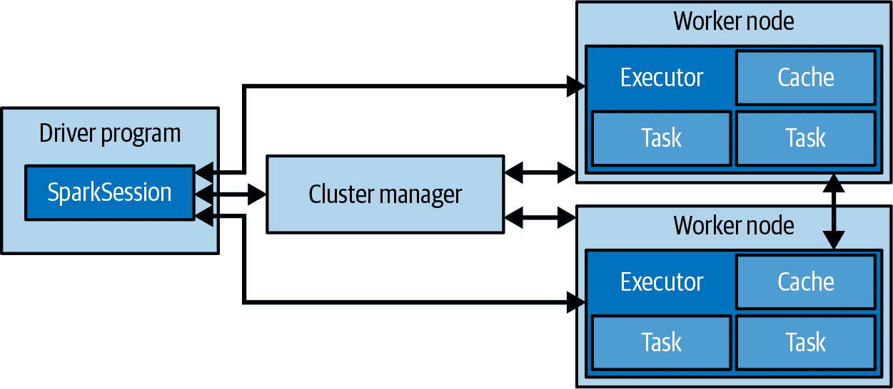

# 第二章：使用 PySpark 进行数据分析介绍

Python 是数据科学任务中使用最广泛的语言。能够使用同一语言进行统计计算和 web 编程的前景，促成了它在 2010 年代初期的流行。这导致了一个繁荣的工具生态系统和一个对数据分析非常有帮助的社区，通常被称为 PyData 生态系统。这是 PySpark 受欢迎的一个重要原因。能够通过 Python 中的 Spark 利用分布式计算帮助数据科学从业者提高生产力，因为他们熟悉这种编程语言并且有一个广泛的社区。出于同样的原因，我们选择在 PySpark 中编写我们的示例。

在同一个环境中完成所有数据清洗和分析工作，不论数据本身存储和处理的位置如何，都会产生多么深远的变革，这是很难用言语表达的。这种感受需要亲身经历才能理解，我们希望我们的示例能够捕捉到我们首次开始使用 PySpark 时所体验到的那种神奇感觉。例如，PySpark 支持与 pandas 的互操作性，后者是最流行的 PyData 工具之一。我们将在本章进一步探讨这一功能。

在本章中，我们将通过数据清洗练习探索 PySpark 强大的 DataFrame API。在 PySpark 中，DataFrame 是一种数据集的抽象，具有正则结构，其中每条记录是由一组列组成的行，每列具有明确定义的数据类型。你可以将 DataFrame 视为 Spark 中关系数据库表的类比。尽管命名惯例可能让你以为是 `pandas.DataFrame` 对象，但 Spark 的 DataFrames 是完全不同的东西。这是因为它们代表了集群上的分布式数据集，而不是本地数据，其中每一行数据都存储在同一台机器上。尽管在使用 DataFrames 和它们在 Spark 生态系统中扮演角色的方式上有些相似之处，但在使用 pandas 或 R 中处理数据框时习惯的一些方法在 Spark 中并不适用，因此最好将它们视为独立的实体，并以开放的心态去接触它们。

至于数据清洗，这是任何数据科学项目的第一步，通常也是最重要的一步。许多聪明的分析由于分析的数据存在根本性质量问题或潜在的伪造信息而未能实现。因此，介绍如何使用 PySpark 和 DataFrames 处理数据的最好方式，不是进行数据清洗练习吗？

首先，我们将介绍 PySpark 的基础知识，并使用来自加州大学尔湾分校机器学习库的样本数据集进行实践。我们将重申为什么 PySpark 是进行数据科学的良好选择，并介绍其编程模型。然后，我们将在我们的系统或集群上设置 PySpark，并使用 PySpark 的 DataFrame API 分析我们的数据集。在使用 PySpark 进行数据分析时，你将大部分时间集中在 DataFrame API 上，因此准备好对其进行深入了解。这将为我们进入后续章节并深入探讨各种机器学习算法做好准备。

对于执行数据科学任务，你不需要深入理解 Spark 在底层是如何工作的。然而，理解关于 Spark 架构的基本概念将使得在使用 PySpark 时更容易工作，并在编写代码时做出更好的决策。这就是我们将在下一节中讨论的内容。

当使用 DataFrame API 时，你的 PySpark 代码应该提供与 Scala 相当的性能。如果使用 UDF 或 RDD，将会影响性能。

# Spark 架构



###### 图 2-1\. Spark 架构图

图 2-1 通过高级组件展示了 Spark 架构。Spark 应用程序作为独立的进程集合在集群或本地上运行。在高层次上，一个 Spark 应用程序由驱动程序进程、集群管理器和一组执行器进程组成。驱动程序是中心组件，负责在执行器进程间分发任务。始终只有一个驱动程序进程。当我们谈论扩展性时，我们指的是增加执行器的数量。集群管理器简单地管理资源。

Spark 是一个分布式、数据并行的计算引擎。在数据并行模型中，更多的数据分区意味着更多的并行性。分区允许高效的并行处理。将数据分解成块或分区的分布式方案允许 Spark 执行器仅处理靠近它们的数据，从而最小化网络带宽。换句话说，每个执行器的核心被分配到自己的数据分区上进行处理。在涉及分区选择时，请记住这一点。

Spark 编程始于数据集，通常驻留在分布式持久存储中，如 Hadoop 分布式文件系统（HDFS）或云解决方案（例如 AWS S3），并以 Parquet 格式存储。编写 Spark 程序通常包括以下几个步骤：

1.  定义一组对输入数据集的转换。

1.  调用将转换后的数据集输出到持久存储或将结果返回到驱动程序本地内存的操作。这些操作理想情况下应由工作节点执行，如 图 2-1 右侧所示。

1.  运行在分布式方式下计算的本地计算。这些计算可以帮助你决定接下来应采取哪些转换和操作。

重要的是要记住，PySpark 的所有高级抽象仍然依赖于自 Spark 诞生以来存在的相同哲学：存储和执行之间的相互作用。理解这些原则将帮助您更好地利用 Spark 进行数据分析。

接下来，我们将在我们的机器上安装和设置 PySpark，以便我们可以开始进行数据分析。这是一个一次性的操作，将帮助我们运行本章及后续章节的代码示例。

# 安装 PySpark

本书中的示例和代码假设您已经安装了 Spark 3.1.1。为了跟随代码示例，从 [PyPI repository](https://oreil.ly/t0WBZ) 安装 PySpark。

```
$ pip3 install pyspark
```

注意，PySpark 需要安装 Java 8 或更高版本。如果需要 SQL、ML 和/或 MLlib 作为额外的依赖项，这也是一个选择。我们稍后会需要这些。

```
$ pip3 install pyspark[sql,ml,mllib]
```

从 PyPI 安装会跳过运行 Scala、Java 或 R 所需的库。完整的发行版本可以从 [Spark project site](https://oreil.ly/pK2Wi) 获取。请参考 [Spark documentation](https://oreil.ly/FLh4U) 来了解在集群或本地机器上设置 Spark 环境的说明。

现在我们准备启动 `pyspark-shell`，这是 Python 语言的 REPL，同时具有一些特定于 Spark 的扩展。这类似于您可能使用过的 Python 或 IPython shell。如果您只是在个人计算机上运行这些示例，可以通过指定 `local[N]` 来启动本地 Spark 集群，其中 `N` 是要运行的线程数，或者 `*` 来匹配计算机上可用的核心数。例如，要在八核机器上启动一个使用八个线程的本地集群：

```
$ pyspark --master local[*]
```

Spark 应用本身通常被称为 Spark *集群*。这是一个逻辑抽象，不同于物理集群（多台机器）。

如果您有一个运行支持 YARN 的 Hadoop 集群，可以使用 `yarn` 作为 Spark 主节点的值在集群上启动 Spark 作业：

```
$ pyspark --master yarn --deploy-mode client
```

本书其余示例将不显示 `--master` 参数到 `spark-shell`，但您通常需要根据环境设置适当的参数。

您可能需要指定额外的参数以使 Spark shell 充分利用您的资源。通过执行 `pyspark --help` 可以找到参数列表。例如，在本地主节点运行 Spark 时，您可以使用 `--driver-memory 2g` 来让单个本地进程使用 2 GB 内存。YARN 内存配置更为复杂，相关选项如 `--executor-memory` 在 [Spark on YARN documentation](https://oreil.ly/3bRjy) 中有解释。

Spark 框架正式支持四种集群部署模式：独立模式、YARN、Kubernetes 和 Mesos。更多详细信息可以在 [Deploying Spark documentation](https://oreil.ly/hG2a5) 中找到。

运行这些命令之一后，您将看到大量来自 Spark 的日志消息，因为它初始化自身，但您还应该看到一些 ASCII 艺术，随后是一些额外的日志消息和提示：

```
Python 3.6.12 |Anaconda, Inc.| (default, Sep  8 2020, 23:10:56)
[GCC 7.3.0] on linux
Type "help", "copyright", "credits" or "license" for more information.
Welcome to
      ____              __
     / __/__  ___ _____/ /__
    _\ \/ _ \/ _ `/ __/  '_/
   /__ / .__/\_,_/_/ /_/\_\   version 3.0.1
      /_/

Using Python version 3.6.12 (default, Sep  8 2020 23:10:56)
SparkSession available as 'spark'.
```

在 shell 中可以运行`:help`命令。这会提示您启动交互式帮助模式或请求有关特定 Python 对象的帮助。除了关于`:help`的说明外，Spark 日志消息还指出“SparkSession 可用作 *spark*。”这是对`SparkSession`的引用，它作为所有 Spark 操作和数据的入口点。请继续在命令行输入`spark`：

```
spark
...
<pyspark.sql.session.SparkSession object at DEADBEEF>
```

REPL 将打印对象的字符串形式。对于`SparkSession`对象，这只是它在内存中的名称加上十六进制地址。（`DEADBEEF`是一个占位符；您在这里看到的确切值会因运行而异。）在交互式 Spark shell 中，Spark 驱动程序会为您实例化一个 SparkSession，而在 Spark 应用程序中，您需要自己创建一个 SparkSession 对象。

在 Spark 2.0 中，SparkSession 成为了所有 Spark 操作和数据的统一入口点。以前使用的入口点如 SparkContext、SQLContext、HiveContext、SparkConf 和 StreamingContext 也可以通过它访问。

我们究竟如何处理`spark`变量？`SparkSession`是一个对象，因此它有与之关联的方法。我们可以在 PySpark shell 中通过输入变量名称，然后加上一个句点，然后加上 tab 键来查看这些方法是什么：

```
 spark.[\t]
...
spark.Builder(           spark.conf
spark.newSession(        spark.readStream
spark.stop(              spark.udf
spark.builder            spark.createDataFrame(
spark.range(             spark.sparkContext
spark.streams            spark.version
spark.catalog            spark.getActiveSession(
spark.read               spark.sql(
spark.table(
```

在 SparkSession 提供的所有方法中，我们将经常使用的是允许我们创建 DataFrames 的方法。现在我们已经设置好了 PySpark，我们可以设置我们感兴趣的数据集，并开始使用 PySpark 的 DataFrame API 与之交互。这是我们将在下一节中做的事情。

# 设置我们的数据

UC Irvine 机器学习存储库是一个非常好的资源，提供用于研究和教育的有趣（且免费）的数据集。我们将分析的数据集是从 2010 年在德国医院进行的一项记录链接研究中策划的，包含数百万对根据多种不同标准（如患者姓名（名和姓）、地址和生日）匹配的患者记录。每个匹配字段根据字符串相似性被分配了从 0.0 到 1.0 的数值分数，然后手动标记数据以识别哪些对表示同一人，哪些不是。用于创建数据集的字段的基础值已被删除，以保护患者的隐私。数值标识符、字段的匹配分数以及每对的标签（匹配与非匹配）已发布，供记录链接研究使用。

从 shell 中，让我们从存储库中拉取数据：

```
$ mkdir linkage
$ cd linkage/
$ curl -L -o donation.zip https://bit.ly/1Aoywaq
$ unzip donation.zip
$ unzip 'block_*.zip'
```

如果您有一个 Hadoop 集群方便的话，可以在 HDFS 中为块数据创建一个目录，并将数据集的文件复制到那里：

```
$ hadoop dfs -mkdir linkage
$ hadoop dfs -put block_*.csv linkage
```

要为我们的记录链接数据集创建一个 DataFrame，我们将使用`S⁠p⁠a⁠r⁠k​S⁠e⁠s⁠s⁠i⁠o⁠n`对象。具体来说，我们将在其 Reader API 上使用`csv`方法：

```
prev = spark.read.csv("linkage/block*.csv")
...
prev
...
DataFrame[_c0: string, _c1: string, _c2: string, _c3: string,...
```

默认情况下，CSV 文件中的每一列都被视为`string`类型，列名默认为`_c0`、`_c1`、`_c2`等。我们可以通过调用其`show`方法在 shell 中查看 DataFrame 的头部：

```
prev.show(2)
...
+-----+-----+------------+------------+------------+------------+-------+------+
|  _c0|  _c1|         _c2|         _c3|         _c4|         _c5|    _c6|   _c7|
+-----+-----+------------+------------+------------+------------+-------+------+
| id_1| id_2|cmp_fname_c1|cmp_fname_c2|cmp_lname_c1|cmp_lname_c2|cmp_sex|cmp_bd|
| 3148| 8326|           1|           ?|           1|           ?|      1|     1|
|14055|94934|           1|           ?|           1|           ?|      1|     1|
|33948|34740|           1|           ?|           1|           ?|      1|     1|
|  946|71870|           1|           ?|           1|           ?|      1|     1|
```

我们可以看到 DataFrame 的第一行是标头列的名称，正如我们所预期的那样，并且 CSV 文件已被干净地分割为其各个列。我们还可以看到一些列中存在`?`字符串；我们需要将这些处理为缺失值。除了正确命名每列之外，如果 Spark 能够正确推断每列的数据类型将是理想的。

幸运的是，Spark 的 CSV 读取器通过我们可以在 Reader API 上设置的选项为我们提供了所有这些功能。您可以在[`pyspark`文档](https://oreil.ly/xiLj1)中看到 API 接受的完整选项列表。现在，我们将像这样读取和解析链接数据：

```
parsed = spark.read.option("header", "true").option("nullValue", "?").\
          option("inferSchema", "true").csv("linkage/block*.csv")
```

当我们在`parsed`数据上调用`show`时，我们看到列名已正确设置，并且`?`字符串已被`null`值替换。要查看每列的推断类型，我们可以像这样打印`parsed` DataFrame 的架构：

```
parsed.printSchema()
...
root
 |-- id_1: integer (nullable = true)
 |-- id_2: integer (nullable = true)
 |-- cmp_fname_c1: double (nullable = true)
 |-- cmp_fname_c2: double (nullable = true)
...
```

每个`Column`实例包含列的名称，能处理每条记录中数据类型的最具体数据类型，以及一个布尔字段，指示该列是否可以包含空值，默认为 true。为了执行架构推断，Spark 必须对数据集进行*两次*遍历：第一次遍历以确定每列的类型，第二次遍历执行实际的解析。如果需要，第一次遍历可以对样本进行处理。

如果您提前知道要为文件使用的架构，可以创建`pyspark.sql.types.StructType`类的实例，并通过`schema`函数将其传递给 Reader API。当数据集非常大时，这可以显著提高性能，因为 Spark 不需要再次遍历数据以确定每列的数据类型。

下面是使用`StructType`和`StructField`定义架构的示例：

```
from pyspark.sql.types import *
schema = StructType([StructField("id_1", IntegerType(), False),
  StructField("id_2", StringType(), False),
  StructField("cmp_fname_c1", DoubleType(), False)])

spark.read.schema(schema).csv("...")
```

另一种定义架构的方法是使用 DDL（数据定义语言）语句：

```
schema = "id_1 INT, id_2 INT, cmp_fname_c1 DOUBLE"
```

DataFrames 具有多种方法，使我们能够将数据从集群读取到我们客户端机器上的 PySpark REPL 中。其中最简单的方法可能是`first`，它将 DataFrame 的第一个元素返回到客户端：

```
parsed.first()
...
Row(id_1=3148, id_2=8326, cmp_fname_c1=1.0, cmp_fname_c2=None,...
```

`first`方法对于对数据集进行健全性检查很有用，但我们通常对将 DataFrame 的较大样本带回客户端进行分析感兴趣。当我们知道一个 DataFrame 只包含少量记录时，我们可以使用`toPandas`或`collect`方法将 DataFrame 的所有内容作为数组返回到客户端。对于非常大的 DataFrames，使用这些方法可能是危险的，并且可能导致内存不足的异常。因为我们还不知道链接数据集有多大，所以暂时不会这样做。

在接下来的几节中，我们将使用本地开发和测试以及集群计算的混合方式执行更多的数据处理和数据分析工作，但如果你需要花一点时间来沉浸在你刚刚进入的新的精彩世界中，我们当然会理解。

# 使用 DataFrame API 分析数据

DataFrame API 配备了一组强大的工具，这些工具对于习惯于 Python 和 SQL 的数据科学家可能会很熟悉。在本节中，我们将开始探索这些工具以及如何将其应用于记录链接数据。

如果我们查看`parsed` DataFrame 的模式和前几行数据，我们会看到：

```
parsed.printSchema()
...
root
 |-- id_1: integer (nullable = true)
 |-- id_2: integer (nullable = true)
 |-- cmp_fname_c1: double (nullable = true)
 |-- cmp_fname_c2: double (nullable = true)
 |-- cmp_lname_c1: double (nullable = true)
 |-- cmp_lname_c2: double (nullable = true)
 |-- cmp_sex: integer (nullable = true)
 |-- cmp_bd: integer (nullable = true)
 |-- cmp_bm: integer (nullable = true)
 |-- cmp_by: integer (nullable = true)
 |-- cmp_plz: integer (nullable = true)
 |-- is_match: boolean (nullable = true)

...

parsed.show(5)
...
+-----+-----+------------+------------+------------+------------+.....
| id_1| id_2|cmp_fname_c1|cmp_fname_c2|cmp_lname_c1|cmp_lname_c2|.....
+-----+-----+------------+------------+------------+------------+.....
| 3148| 8326|         1.0|        null|         1.0|        null|.....
|14055|94934|         1.0|        null|         1.0|        null|.....
|33948|34740|         1.0|        null|         1.0|        null|.....
|  946|71870|         1.0|        null|         1.0|        null|.....
|64880|71676|         1.0|        null|         1.0|        null|.....
```

+   前两个字段是表示记录中匹配的患者的整数 ID。

+   下面的九个字段是（可能缺失的）数字值（可以是 double 或 int），表示患者记录不同字段的匹配评分，比如他们的姓名、生日和位置。当字段的唯一可能值是匹配（1）或不匹配（0）时，字段存储为整数，而在可能存在部分匹配时存储为双精度数。

+   最后一个字段是一个布尔值（`true`或`false`），表示该行代表的患者记录对是否匹配。

我们的目标是制定一个简单的分类器，让我们能够根据患者记录的匹配评分的值来预测记录是否匹配。让我们通过`count`方法来了解我们要处理的记录数量的概念：

```
parsed.count()
...
5749132
```

这是一个相对较小的数据集—肯定足够小，可以在集群中的一个节点或者甚至在你的本地机器的内存中存储，如果你没有可用的集群。到目前为止，每当我们处理数据时，Spark 都会重新打开文件，重新解析行，然后执行请求的操作，比如显示数据的前几行或计算记录的数量。当我们提出另一个问题时，Spark 将再次执行这些操作，即使我们已经将数据筛选到少量记录中，或者正在使用原始数据集的聚合版本。

这并不是我们计算资源的最佳使用方式。数据解析完成后，我们希望将数据保存在集群上的解析形式，这样每次需要提出新问题时就不必重新解析。Spark 通过允许我们在实例上调用`cache`方法来信号化指定 DataFrame 应在生成后缓存在内存中来支持这种用例。现在让我们为`parsed` DataFrame 进行这样的操作：

```
parsed.cache()
```

数据缓存后，我们想知道的下一件事是记录的匹配与非匹配的相对比例：

```
from pyspark.sql.functions import col

parsed.groupBy("is_match").count().orderBy(col("count").desc()).show()
...
+--------+-------+
|is_match|  count|
+--------+-------+
|   false|5728201|
|    true|  20931|
+--------+-------+
```

我们不需要编写函数来提取`is_match`列，只需将其名称传递给 DataFrame 的`groupBy`方法，调用`count`方法来计算每个分组内的记录数量，根据`count`列按降序排序，然后使用`show`在 REPL 中清晰地呈现计算结果。在幕后，Spark 引擎确定执行聚合并返回结果的最有效方法。这展示了 Spark 提供的进行数据分析的干净、快速和表达方式。

请注意，我们可以有两种方式引用 DataFrame 中列的名称：一种是作为字面字符串，例如`groupBy("is_match")`中的用法，另一种是通过使用我们在`count`列上使用的`col`函数获取的`Column`对象。在大多数情况下，这两种方法都是有效的，但我们需要使用`col`函数调用结果`count`列对象上的`desc`方法。

你可能已经注意到，DataFrame API 中的函数与 SQL 查询的组件相似。这不是巧合，事实上，我们可以选择将我们创建的任何 DataFrame 视为数据库表，并使用熟悉和强大的 SQL 语法来表达我们的问题。首先，我们需要告诉 Spark SQL 执行引擎应将`parsed` DataFrame 关联的名称，因为变量名称本身（"parsed"）对于 Spark 是不可用的：

```
parsed.createOrReplaceTempView("linkage")
```

因为`parsed` DataFrame 仅在此 PySpark REPL 会话期间可用，它是一个*临时*表。如果我们配置 Spark 连接到跟踪结构化数据集架构和位置的 Apache Hive 元存储，Spark SQL 也可以用于查询 HDFS 中的持久表。

一旦我们的临时表在 Spark SQL 引擎中注册，我们可以像这样查询它：

```
spark.sql("""
 SELECT is_match, COUNT(*) cnt
 FROM linkage
 GROUP BY is_match
 ORDER BY cnt DESC
""").show()
...
+--------+-------+
|is_match|    cnt|
+--------+-------+
|   false|5728201|
|    true|  20931|
+--------+-------+
```

您可以选择通过调用`enableHiveSupport`方法在创建`SparkSession`实例时使用 ANSI 2003 兼容版本的 Spark SQL（默认方式）或在 HiveQL 模式下运行 Spark。

在 PySpark 中，您应该使用 Spark SQL 还是 DataFrame API 来进行分析呢？每种方法都有其利弊：SQL 的优点在于它广泛被认知，并且对于简单查询而言表达能力强。它还允许您使用 JDBC/ODBC 连接器从诸如 PostgreSQL 或像 Tableau 这样的工具中查询数据。然而，SQL 的缺点在于，在动态、可读且可测试的方式下表达复杂的多阶段分析可能会很困难——而 DataFrame API 在这些方面表现出色。在本书的其余部分中，我们既使用 Spark SQL 又使用 DataFrame API，并留给读者作为一个练习来审视我们所做的选择，并将我们的计算从一种接口转换到另一种接口。

我们可以逐个将函数应用于我们的 DataFrame，以获取诸如计数和平均值之类的统计数据。然而，PySpark 提供了一种更好的方法来获取 DataFrames 的汇总统计数据，这就是我们将在下一节中讨论的内容。

# DataFrames 的快速汇总统计

尽管有许多种类的分析可以在 SQL 或 DataFrame API 中同样有效地表达，但有些常见的数据框架操作在 SQL 中表达起来可能很乏味。其中一种特别有帮助的分析是计算数据框架数值列中所有非空值的最小值、最大值、平均值和标准差。在 PySpark 中，这个函数与 pandas 中的函数同名，即 `describe`：

```
summary = parsed.describe()
...
summary.show()
```

`summary` DataFrame 拥有 `parsed` DataFrame 中每个变量的一列，以及另一列（也称为 `summary`），指示其余列中的哪个指标——`count`、`mean`、`stddev`、`min` 或 `max`——存在。我们可以使用 `select` 方法选择列的子集，以便更容易阅读和比较汇总统计信息：

```
summary.select("summary", "cmp_fname_c1", "cmp_fname_c2").show()
+-------+------------------+------------------+
|summary|      cmp_fname_c1|      cmp_fname_c2|
+-------+------------------+------------------+
|  count|           5748125|            103698|
|   mean|0.7129024704436274|0.9000176718903216|
| stddev|0.3887583596162788|0.2713176105782331|
|    min|               0.0|               0.0|
|    max|               1.0|               1.0|
+-------+------------------+------------------+
```

注意 `count` 变量在 `cmp_fname_c1` 和 `cmp_fname_c2` 之间的值的差异。几乎每条记录的 `cmp_fname_c1` 都有非空值，而仅不到 2% 的记录有 `cmp_fname_c2` 的非空值。要创建一个有用的分类器，我们需要依赖几乎总是出现在数据中的变量——除非它们的缺失反映出记录是否匹配的有意义信息。

一旦我们对数据中变量的分布有了整体的了解，我们希望了解这些变量的值如何与 `is_match` 列的值相关联。因此，我们的下一步是仅针对与匹配和非匹配对应的 `parsed` DataFrame 子集计算相同的汇总统计数据。我们可以使用类似 SQL 的 `where` 语法或使用 DataFrame API 中的 `Column` 对象来过滤 DataFrames，然后在结果 DataFrames 上使用 `describe`：

```
matches = parsed.where("is_match = true")
match_summary = matches.describe()

misses = parsed.filter(col("is_match") == False)
miss_summary = misses.describe()
```

我们传递给 `where` 函数的字符串内部逻辑可以包含在 Spark SQL 中的 `WHERE` 子句中有效的语句。对于使用 DataFrame API 的过滤条件，我们使用 `==` 运算符来检查 `is_match` 列对象与布尔对象 `False` 是否相等，因为这只是 Python，而不是 SQL。请注意，`where` 函数是 `filter` 函数的别名；我们可以在上述片段中颠倒 `where` 和 `filter` 的调用顺序，一切仍将正常工作。

现在我们可以开始比较 `match_summary` 和 `miss_summary` DataFrame，以查看变量分布如何随记录是匹配还是未匹配而变化。尽管这是一个相对较小的数据集，进行这种比较仍然有些繁琐——我们真正想要的是转置 `match_summary` 和 `miss_summary` DataFrame，以便行和列被交换，这将允许我们通过变量连接转置的 DataFrame 并分析汇总统计信息，这是大多数数据科学家所知的“透视”或“重塑”数据集的实践。在下一节中，我们将展示如何执行这些转换。

# 数据透视和重塑 DataFrame

我们可以使用 PySpark 提供的函数完全转置 DataFrames。但是，还有一种执行此任务的方法。 PySpark 允许在 Spark 和 pandas DataFrames 之间进行转换。我们将问题中的 DataFrames 转换为 pandas DataFrames，重塑它们，然后将它们转换回 Spark DataFrames。由于 `summary`、`match_summary` 和 `miss_summary` DataFrames 的大小较小，因此我们可以安全地执行此操作，因为 pandas DataFrames 位于内存中。在接下来的章节中，我们将依靠 Spark 操作来处理较大数据集上的这些转换。

由于 Apache Arrow 项目的存在，允许在 JVM 和 Python 进程之间高效传输数据，所以可以进行 Spark 和 pandas DataFrames 之间的转换。当我们使用 pip 安装 `pyspark[sql]` 时，PyArrow 库作为 Spark SQL 模块的依赖项被安装。

让我们将 `summary` 转换为 pandas DataFrame：

```
summary_p = summary.toPandas()
```

现在我们可以在 `summary_p` DataFrame 上使用 pandas 函数：

```
summary_p.head()
...
summary_p.shape
...
(5,12)
```

现在，我们可以使用 DataFrame 上熟悉的 pandas 方法执行转置操作，以交换行和列：

```
summary_p = summary_p.set_index('summary').transpose().reset_index()
...
summary_p = summary_p.rename(columns={'index':'field'})
...
summary_p = summary_p.rename_axis(None, axis=1)
...
summary_p.shape
...
(11,6)
```

我们已成功转置了 `summary_p` pandas DataFrame。使用 SparkSession 的 `createDataFrame` 方法将其转换为 Spark DataFrame：

```
summaryT = spark.createDataFrame(summary_p)
...
summaryT.show()
...
+------------+-------+-------------------+-------------------+---+------+
|       field|  count|               mean|             stddev|min|   max|
+------------+-------+-------------------+-------------------+---+------+
|        id_1|5749132|  33324.48559643438| 23659.859374488064|  1| 99980|
|        id_2|5749132|  66587.43558331935| 23620.487613269695|  6|100000|
|cmp_fname_c1|5748125| 0.7129024704437266|0.38875835961628014|0.0|   1.0|
|cmp_fname_c2| 103698| 0.9000176718903189| 0.2713176105782334|0.0|   1.0|
|cmp_lname_c1|5749132| 0.3156278193080383| 0.3342336339615828|0.0|   1.0|
|cmp_lname_c2|   2464| 0.3184128315317443|0.36856706620066537|0.0|   1.0|
|     cmp_sex|5749132|  0.955001381078048|0.20730111116897781|  0|     1|
|      cmp_bd|5748337|0.22446526708507172|0.41722972238462636|  0|     1|
|      cmp_bm|5748337|0.48885529849763504| 0.4998758236779031|  0|     1|
|      cmp_by|5748337| 0.2227485966810923| 0.4160909629831756|  0|     1|
|     cmp_plz|5736289|0.00552866147434343|0.07414914925420046|  0|     1|
+------------+-------+-------------------+-------------------+---+------+
```

我们还没有完成。打印 `summaryT` DataFrame 的模式：

```
summaryT.printSchema()
...
root
 |-- field: string (nullable = true)
 |-- count: string (nullable = true)
 |-- mean: string (nullable = true)
 |-- stddev: string (nullable = true)
 |-- min: string (nullable = true)
 |-- max: string (nullable = true)
```

在从 `describe` 方法获取的汇总模式中，每个字段都被视为字符串。由于我们希望将汇总统计信息作为数字进行分析，因此需要将值从字符串转换为双精度数：

```
from pyspark.sql.types import DoubleType
for c in summaryT.columns:
  if c == 'field':
    continue
  summaryT = summaryT.withColumn(c, summaryT[c].cast(DoubleType()))
...
summaryT.printSchema()
...
root
 |-- field: string (nullable = true)
 |-- count: double (nullable = true)
 |-- mean: double (nullable = true)
 |-- stddev: double (nullable = true)
 |-- min: double (nullable = true)
 |-- max: double (nullable = true)
```

现在我们已经找到了如何转置汇总 DataFrame 的方法，让我们将我们的逻辑实现为一个函数，我们可以在 `match_summary` 和 `miss_summary` DataFrame 上重复使用：

```
from pyspark.sql import DataFrame
from pyspark.sql.types import DoubleType

def pivot_summary(desc):
  # convert to pandas dataframe
  desc_p = desc.toPandas()
  # transpose
  desc_p = desc_p.set_index('summary').transpose().reset_index()
  desc_p = desc_p.rename(columns={'index':'field'})
  desc_p = desc_p.rename_axis(None, axis=1)
  # convert to Spark dataframe
  descT = spark.createDataFrame(desc_p)
  # convert metric columns to double from string
  for c in descT.columns:
    if c == 'field':
      continue
    else:
      descT = descT.withColumn(c, descT[c].cast(DoubleType()))
  return descT
```

现在在你的 Spark shell 中，对 `match_summary` 和 `miss_summary` DataFrames 使用 `pivot_summary` 函数：

```
match_summaryT = pivot_summary(match_summary)
miss_summaryT = pivot_summary(miss_summary)
```

现在我们已经成功地转置了汇总的 DataFrames，我们可以连接并比较它们。这就是我们将在下一节中做的事情。此外，我们还将选择适合建立模型的理想特征。

# 连接 DataFrames 和选择特征

到目前为止，我们仅使用 Spark SQL 和 DataFrame API 进行数据集的过滤和聚合，但我们也可以使用这些工具在 DataFrames 上执行连接操作（内连接、左连接、右连接或全连接）。虽然 DataFrame API 包括一个 `join` 函数，但通常使用 Spark SQL 更容易表达这些连接操作，特别是当我们要连接的表有很多列名相同时，并且我们希望能够清楚地指示在选择表达式中正在引用哪个列时。让我们为 `match_summaryT` 和 `miss_summaryT` DataFrames 创建临时视图，在 `field` 列上进行连接，并对结果行计算一些简单的汇总统计信息：

```
match_summaryT.createOrReplaceTempView("match_desc")
miss_summaryT.createOrReplaceTempView("miss_desc")
spark.sql("""
 SELECT a.field, a.count + b.count total, a.mean - b.mean delta
 FROM match_desc a INNER JOIN miss_desc b ON a.field = b.field
 WHERE a.field NOT IN ("id_1", "id_2")
 ORDER BY delta DESC, total DESC
""").show()
...
+------------+---------+--------------------+
|       field|    total|               delta|
+------------+---------+--------------------+
|     cmp_plz|5736289.0|  0.9563812499852176|
|cmp_lname_c2|   2464.0|  0.8064147192926264|
|      cmp_by|5748337.0|  0.7762059675300512|
|      cmp_bd|5748337.0|   0.775442311783404|
|cmp_lname_c1|5749132.0|  0.6838772482590526|
|      cmp_bm|5748337.0|  0.5109496938298685|
|cmp_fname_c1|5748125.0|  0.2854529057460786|
|cmp_fname_c2| 103698.0| 0.09104268062280008|
|     cmp_sex|5749132.0|0.032408185250332844|
+------------+---------+--------------------+
```

一个好的特征具有两个特性：它倾向于在匹配和非匹配情况下具有显著不同的值（因此平均值之间的差异将很大），并且在数据中经常出现，我们可以依赖它定期出现在任何一对记录中。按此标准，`cmp_fname_c2` 并不是非常有用，因为它大部分时间都缺失，并且匹配和非匹配的平均值之间的差异相对较小——0.09，对于一个从 0 到 1 的分数来说。`cmp_sex` 特征也不是特别有帮助，因为即使它对于任何一对记录都是可用的，平均值之间的差异仅为 0.03。

另一方面，`cmp_plz` 和 `cmp_by` 特征则非常优秀。它们几乎总是出现在任何一对记录中，并且平均值之间的差异非常大（这两个特征都超过了 0.77）。`cmp_bd`、`cmp_lname_c1` 和 `cmp_bm` 特征似乎也是有益的：它们通常在数据集中可用，并且匹配和非匹配的平均值之间的差异很大。

`cmp_fname_c1` 和 `cmp_lname_c2` 特征则有些复杂：`cmp_fname_c1` 并不能很好地区分（平均值之间的差异仅为 0.28），即使它通常对于一对记录来说是可用的，而 `cmp_lname_c2` 在平均值之间有很大的差异，但几乎总是缺失。根据这些数据，不太明显在什么情况下应该在我们的模型中包含这些特征。

目前，我们将使用一个简单的评分模型，根据显然良好特征的值之和对记录对的相似性进行排名：`cmp_plz`、`cmp_by`、`cmp_bd`、`cmp_lname_c1`和`cmp_bm`。对于这些特征值缺失的少数记录，我们将在求和中使用 0 替代`null`值。通过创建计算得分和`is_match`列的 DataFrame，我们可以大致了解我们简单模型的性能，并评估得分在各种阈值下如何区分匹配和非匹配。

# 评分和模型评估

对于我们的评分函数，我们将对五个字段（`cmp_lname_c1`、`cmp_plz`、`cmp_by`、`cmp_bd`和`cmp_bm`）的值进行求和。我们将使用`pyspark.sql.functions`中的`expr`来实现这一点。`expr`函数将输入的表达式字符串解析成对应的列。这个字符串甚至可以涉及多个列。

让我们创建所需的表达式字符串：

```
good_features = ["cmp_lname_c1", "cmp_plz", "cmp_by", "cmp_bd", "cmp_bm"]
...
sum_expression = " + ".join(good_features)
...
sum_expression
...
'cmp_lname_c1 + cmp_plz + cmp_by + cmp_bd + cmp_bm'
```

现在，我们可以使用`sum_expression`字符串来计算分数。在对值进行求和时，我们将使用 DataFrame 的`fillna`方法考虑并替换为 0 的空值：

```
from pyspark.sql.functions import expr
scored = parsed.fillna(0, subset=good_features).\
                withColumn('score', expr(sum_expression)).\
                select('score', 'is_match')
...
scored.show()
...
+-----+--------+
|score|is_match|
+-----+--------+
|  5.0|    true|
|  5.0|    true|
|  5.0|    true|
|  5.0|    true|
|  5.0|    true|
|  5.0|    true|
|  4.0|    true|
...
```

创建评分函数的最后一步是决定分数必须超过什么阈值，以便我们预测两个记录表示匹配。如果我们设置的阈值过高，那么我们将错误地将匹配记录标记为错过（称为*假阴性*率），而如果我们将阈值设置得太低，我们将错误地将错过标记为匹配（*假阳性*率）。对于任何非平凡的问题，我们总是需要在两种错误类型之间进行某种权衡，阈值值应该是多少的问题通常取决于模型应用的情况中两种错误类型的相对成本。

为了帮助我们选择一个阈值，创建一个*列联表*（有时称为*交叉表*或*crosstab*），计算分数高于/低于阈值的记录数，并将这些类别中记录数与每个类别中的匹配/非匹配数量交叉。因为我们还不知道将使用什么阈值，让我们编写一个函数，该函数接受`scored` DataFrame 和阈值选择作为参数，并使用 DataFrame API 计算交叉表：

```
def crossTabs(scored: DataFrame, t: DoubleType) -> DataFrame:
  return  scored.selectExpr(f"score >= {t} as above", "is_match").\
          groupBy("above").pivot("is_match", ("true", "false")).\
          count()
```

注意，我们在 DataFrame API 中包括了`selectExpr`方法，根据`t`参数的值使用 Python 的 f-string 格式化语法动态确定名为`above`的字段的值，这使我们能够按名称替换变量，如果我们在字符串文字前加上字母`f`（这是另一个 Scala 隐式魔法的方便部分）。一旦定义了`above`字段，我们就使用之前使用的`groupBy`、`pivot`和`count`方法创建交叉表。

通过应用高阈值值为 4.0，意味着五个特征的平均值为 0.8，我们可以筛选掉几乎所有非匹配项，同时保留超过 90%的匹配项：

```
crossTabs(scored, 4.0).show()
...
+-----+-----+-------+
|above| true|  false|
+-----+-----+-------+
| true|20871|    637|
|false|   60|5727564|
+-----+-----+-------+
```

通过应用较低的阈值 2.0，我们可以确保捕捉到*所有*已知的匹配记录，但在假阳性方面会付出很大的代价（右上角的单元格）：

```
crossTabs(scored, 2.0).show()
...
+-----+-----+-------+
|above| true|  false|
+-----+-----+-------+
| true|20931| 596414|
|false| null|5131787|
+-----+-----+-------+
```

尽管假阳性的数量高于我们的期望，这种更宽松的筛选仍然从我们的考虑中移除了 90%的非匹配记录，同时包含每一个正匹配。虽然这已经相当不错了，但还有可能做得更好；看看是否能找到一种方法来利用`MatchData`的其他值（包括缺失和非缺失的值）来设计一个评分函数，以成功识别每一个`true`匹配，而成本低于 100 个假阳性。

# 如何继续前进

如果本章是您首次使用 PySpark 进行数据准备和分析，我们希望您能感受到这些工具提供的强大基础。如果您已经使用 Python 和 Spark 一段时间了，我们希望您能把本章推荐给您的朋友和同事，作为向他们介绍这种强大力量的一种方式。

本章的目标是为您提供足够的知识，以便能够理解并完成本书中其余示例。如果您是通过实际示例学习最佳的人，那么您的下一步是继续学习下一组章节，我们将在那里向您介绍 MLlib，这是专为 Spark 设计的机器学习库。
