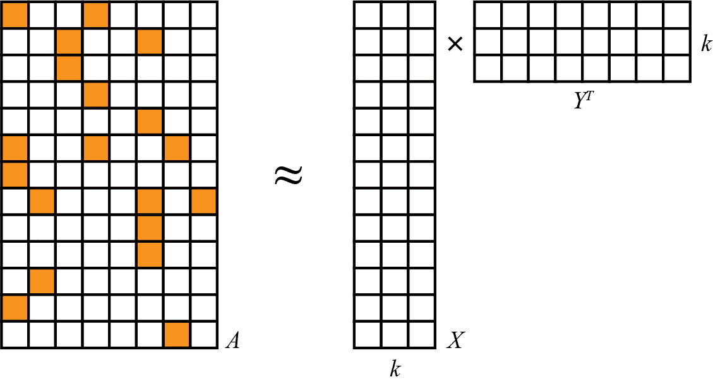
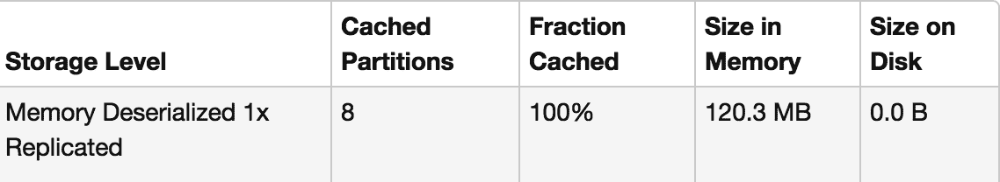

# 第三章：推荐音乐与 Audioscrobbler 数据集

推荐引擎是大规模机器学习的最受欢迎的示例之一；例如，大多数人都熟悉亚马逊的推荐系统。推荐引擎是一个共同点，因为它们无处不在，从社交网络到视频站点再到在线零售商。我们也可以直接观察它们的运行。我们知道 Spotify 在选择播放曲目时是由计算机决定的，就像我们并不一定注意到 Gmail 在判断传入邮件是否是垃圾邮件时的操作一样。

推荐系统的输出比其他机器学习算法更直观易懂，甚至有些令人兴奋。尽管我们认为音乐品味是个人的、难以解释的，推荐系统却出奇地能够准确识别我们可能会喜欢的音乐曲目。在像音乐或电影这样的领域，推荐系统通常能够相对容易地解释为什么推荐某首音乐与某人的收听历史相符。并非所有的聚类或分类算法都能满足这一描述。例如，支持向量机分类器是一组系数，即使对于从业者来说，在进行预测时这些数字代表的含义也很难表达清楚。

在接下来的三章中，我们将探讨 PySpark 上的关键机器学习算法，其中第一章围绕推荐引擎展开，特别是音乐推荐。这是一个介绍 PySpark 和 MLlib 实际应用的方式，同时也会涉及到随后章节中发展的一些基础机器学习概念。

在本章中，我们将在 PySpark 中实现一个推荐系统。具体来说，我们将使用交替最小二乘（ALS）算法处理由音乐流媒体服务提供的开放数据集。我们将首先了解数据集并在 PySpark 中导入它。然后，我们将讨论选择 ALS 算法的动机以及在 PySpark 中的实现。接着是数据准备和使用 PySpark 构建模型。最后，我们将提供一些用户推荐，并讨论通过超参数选择改进我们的模型的方法。

# 数据设置

我们将使用由 Audioscrobbler 发布的数据集。Audioscrobbler 是 [Last.fm](http://www.last.fm) 的第一个音乐推荐系统，也是最早的互联网流媒体广播站之一，成立于 2002 年。Audioscrobbler 提供了一个开放的 API 用于“scrobbling”，即记录听众的歌曲播放情况。Last.fm 利用这些信息构建了一个强大的音乐推荐引擎。由于第三方应用和网站可以将收听数据返回给推荐引擎，该系统达到了数百万用户。

当时，关于推荐引擎的研究大多限于从类似评分的数据中学习。也就是说，推荐系统通常被视为在输入数据上运行的工具，如“Bob 对 Prince 的歌曲评级为 3.5 星”。Audioscrobbler 数据集很有趣，因为它仅记录了播放事件：“Bob 播放了一首 Prince 的歌曲”。播放事件比评级事件包含的信息更少。仅因为 Bob 播放了这首歌，并不意味着他实际上喜欢它。你我可能偶尔会播放一首不喜欢的歌曲，甚至播放整张专辑然后离开房间。

然而，听众评价音乐的频率远低于播放音乐的频率。因此，这样的数据集要大得多，涵盖的用户和艺术家更多，包含的总信息也更多，即使每个个体数据点的信息量较少。这种类型的数据通常被称为*隐式反馈*数据，因为用户与艺术家的连接是作为其他行为的副作用而暗示的，而不是作为显式评分或赞赏给出的。

可以在[在线压缩存档](https://oreil.ly/Z7sfL)中找到 Last.fm 在 2005 年发布的数据集快照。下载该存档，并在其中找到几个文件。首先，需要将数据集的文件可用化。如果您使用远程集群，请将所有三个数据文件复制到存储中。本章将假定这些文件在*data/*目录下可用。

启动`pyspark-shell`。请注意，本章中的计算将比简单的应用程序占用更多的内存。例如，如果您在本地而不是在集群上运行，可能需要指定类似`--driver-memory 4g`的参数来确保有足够的内存完成这些计算。主要数据集位于*user_artist_data.txt*文件中。该文件包含约 141,000 个唯一用户和 1.6 百万个唯一艺术家。记录了约 2420 万个用户对艺术家的播放次数及其计数。让我们将这个数据集读入 DataFrame 并查看一下：

```
raw_user_artist_path = "data/audioscrobbler_data/user_artist_data.txt"
raw_user_artist_data = spark.read.text(raw_user_artist_path)

raw_user_artist_data.show(5)

...
+-------------------+
|              value|
+-------------------+
|       1000002 1 55|
| 1000002 1000006 33|
|  1000002 1000007 8|
|1000002 1000009 144|
|1000002 1000010 314|
+-------------------+
```

像 ALS 这样的机器学习任务可能比简单的文本处理更需要计算资源。最好将数据分成更小的片段，即更多的分区进行处理。您可以在读取文本文件后链式调用`.repartition(n)`来指定不同且更大的分区数。例如，可以将此值设置为与集群中的核心数相匹配。

数据集还在*artist_data.txt*文件中按 ID 提供了每位艺术家的名称。请注意，在提交播放时，客户端应用程序会提交正在播放的艺术家的名称。这个名称可能拼写错误或非标准，这可能在稍后才会被发现。例如，“The Smiths”，“Smiths, The”和“the smiths”可能会作为数据集中不同的艺术家 ID 出现，尽管它们实际上是同一位艺术家。因此，数据集还包括*artist_alias.txt*，它将已知的拼写错误或变体的艺术家 ID 映射到该艺术家的规范 ID 上。让我们也将这两个数据集读入 PySpark：

```
raw_artist_data = spark.read.text("data/audioscrobbler_data/artist_data.txt")

raw_artist_data.show(5)

...
+--------------------+
|               value|
+--------------------+
|1134999\t06Crazy ...|
|6821360\tPang Nak...|
|10113088\tTerfel,...|
|10151459\tThe Fla...|
|6826647\tBodensta...|
+--------------------+
only showing top 5 rows
...

raw_artist_alias = spark.read.text("data/audioscrobbler_data/artist_alias.txt")

raw_artist_alias.show(5)

...
+-----------------+
|            value|
+-----------------+
| 1092764\t1000311|
| 1095122\t1000557|
| 6708070\t1007267|
|10088054\t1042317|
| 1195917\t1042317|
+-----------------+
only showing top 5 rows
```

现在我们对数据集有了基本的理解，我们可以讨论我们对推荐算法的需求，并且随后理解为什么交替最小二乘算法是一个好选择。

# 我们对推荐系统的需求

我们需要选择一个适合我们数据的推荐算法。以下是我们的考虑：

隐式反馈

这些数据完全由用户和艺术家歌曲之间的互动组成。除了它们的名称，它没有任何关于用户或艺术家的信息。我们需要一种能够在没有用户或艺术家属性访问权限的情况下学习的算法。这些通常被称为协同过滤算法。例如，决定两个用户可能有相似品味是因为他们同岁*不是*协同过滤的例子。决定两个用户可能喜欢同一首歌是因为他们播放了许多其他相同的歌*是*协同过滤的例子。

稀疏性

我们的数据集看起来很大，因为它包含数千万次播放。但从另一个角度来看，它是稀疏的和不足的，因为它是稀疏的。平均而言，每个用户只听了大约 171 位艺术家的歌曲 —— 而这些艺术家共有 160 万。有些用户只听过一个艺术家的歌曲。我们需要一种算法，即使对这些用户也能提供良好的推荐。毕竟，每个单独的听众最初肯定是从一个播放开始的！

可扩展性和实时预测

最后，我们需要一个能够扩展的算法，无论是建立大型模型还是快速生成推荐。推荐通常需要在几乎实时内提供 —— 在一秒钟内，而不是明天。

一类可能适合的算法是潜在因子模型。它们试图通过相对较少数量的*未观察到的潜在原因*来解释大量用户和项目之间的*观察到的互动*。例如，考虑一个客户购买了金属乐队 Megadeth 和 Pantera 的专辑，但也购买了古典作曲家莫扎特的专辑。可能很难解释为什么只有这些专辑被购买而没有其他的。然而，这可能只是更大音乐品味集合中的一个小窗口。也许这个客户喜欢从金属到前卫摇滚再到古典的连贯音乐光谱。这种解释更简单，并且额外地建议了许多其他可能感兴趣的专辑。在这个例子中，“喜欢金属、前卫摇滚和古典音乐”是三个潜在因子，可以解释成千上万个个别专辑的偏好。

在我们的案例中，我们将专门使用一种类型的矩阵因子分解模型。从数学上讲，这些算法将用户和产品数据视为一个大矩阵 *A*，如果用户 *i* 玩了艺术家 *j*，则在第 *i* 行和第 *j* 列的条目存在。*A* 是稀疏的：大多数 *A* 的条目为 0，因为实际数据中只有少数可能的用户-艺术家组合出现。它们将 *A* 分解为两个较小矩阵 *X* 和 *Y* 的矩阵乘积。它们非常瘦长—都有很多行，因为 *A* 有很多行和列，但是两者都只有少数列（*k*）。*k* 列对应用于解释交互数据的潜在因子。

由于*k*较小，因此因子分解只能是近似的，如图 3-1 所示。



###### 图 3-1\. 矩阵因子分解

这些算法有时被称为矩阵补全算法，因为原始矩阵 *A* 可能非常稀疏，但乘积 *XY*^(*T*) 是密集的。很少或没有条目为 0，因此模型只是 *A* 的近似。从模型的角度来看，它产生（“补全”）了即使在原始 *A* 中缺少的（即 0 的）条目的值。

这是一个例子，令人高兴的是，线性代数直接而优雅地映射到直觉中。这两个矩阵包含每个用户和每个艺术家的一行。这些行具有很少的值—*k*。每个值对应模型中的一个潜在特征。因此，这些行表达了用户和艺术家与这些*k*个潜在特征的关联程度，这些特征可能对应于品味或流派。简单地说，用户特征和特征-艺术家矩阵的乘积产生了整个稠密的用户-艺术家互动矩阵的完整估计。可以将这个乘积视为将项目映射到它们的属性，然后按用户属性加权的过程。

坏消息是，通常情况下 *A* = *XY*^(*T*) 没有确切的解，因为 *X* 和 *Y* 不够大（严格来说是太低的[rank](https://oreil.ly/OfVj4)）以完美地表示 *A*。这实际上是件好事。*A* 只是所有可能互动的一个微小样本。在某种程度上，我们认为 *A* 是一个极其零星且因此难以解释的简单潜在现实的视角，只需要几个因子 *k* 就能很好地解释。想象一下描绘猫的拼图。最终的拼图描述很简单：一只猫。然而，当你手里只有几片时，你看到的图片却很难描述。

*XY*^(*T*) 应尽可能接近 *A*。毕竟，这是我们唯一的线索。它不会也不应该完全复制它。再次的坏消息是，不能直接求解得到最佳的 *X* 和 *Y*。好消息是，如果 *Y* 已知，那么求解最佳的 *X* 是微不足道的，反之亦然。但是事先都不知道！

幸运的是，有些算法可以摆脱这种困境并找到一个合理的解决方案。PySpark 中提供的一种算法就是 ALS 算法。

## 交替最小二乘算法

我们将使用交替最小二乘算法从我们的数据集中计算潜在因子。这种方法在 Netflix Prize 竞赛时期被如《“面向隐性反馈数据集的协同过滤”》和《“Netflix Prize 的大规模并行协同过滤”》等论文广泛应用。PySpark MLlib 的 ALS 实现借鉴了这些论文的思想，并且是目前 Spark MLlib 中唯一实现的推荐算法。

这里有一个代码片段（非功能性），让你一窥后面章节的内容：

```
from pyspark.ml.recommendation import ALS

als = ALS(maxIter=5, regParam=0.01, userCol="user",
          itemCol="artist", ratingCol="count")
model = als.fit(train)

predictions = model.transform(test)
```

使用 ALS，我们将把输入数据视为一个大型稀疏矩阵*A*，并找出*X*和*Y*，如前面讨论的那样。起初，*Y*是未知的，但可以初始化为一个填满随机选定行向量的矩阵。然后，简单的线性代数给出了在给定*A*和*Y*的情况下最佳解决方案的方法。事实上，可以分别计算*X*的每一行*i*作为*Y*和*A*的一行的函数。因为可以分别完成，所以可以并行进行，这对大规模计算是一个极好的特性：

<math display="block"><mrow><msub><mi>A</mi><mi>i</mi></msub><mi>Y</mi><mo>(</mo><msup><mi>Y</mi><mi>T</mi></msup><mi>Y</mi><msup><mo>)</mo><mi>–1</mi></msup> <mo>=</mo> <msub><mi>X</mi><mi>i</mi></msub></mrow></math>

无法完全实现等式，因此实际上目标是最小化|*A*[*i*]*Y*(*Y*^(*T*)*Y*)^(*–1*) – *X*[*i*]|，或两个矩阵条目之间平方差的总和。这就是名称中“最小二乘”的含义。实际上，这永远不会通过计算逆解决，而是更快、更直接地通过 QR 分解等方法。该方程简单地阐述了计算行向量的理论。

可以用相同的方法计算每个*Y*[*j*]从*X*中得到。再次，从*Y*计算*X*，依此类推。这就是“交替”的来源。这里只有一个小问题：*Y*是虚构的——随机的！*X*计算得最优，没错，但对*Y*给出了一个虚假的解。幸运的是，如果这个过程重复进行，*X*和*Y*最终会收敛到合理的解决方案。

当用于分解表示隐式数据的矩阵时，ALS 分解会更加复杂。它不是直接分解输入矩阵*A*，而是一个包含 0 和 1 的矩阵*P*，其中*A*包含正值的地方为 1，其他地方为 0。后续会将*A*中的值作为权重加入。这些细节超出了本书的范围，但并不影响理解如何使用该算法。

最后，ALS 算法还可以利用输入数据的稀疏性。这一点，以及它依赖简单优化的线性代数和数据并行性质，使得它在大规模上非常快速。

接下来，我们将预处理我们的数据集，使其适合与 ALS 算法一起使用。

# 数据准备

构建模型的第一步是了解可用的数据，并将其解析或转换为在 Spark 中进行分析时有用的形式。

Spark MLlib 的 ALS 实现在用户和项目的 ID 不需要严格为数字时也可以使用，但当 ID 确实可表示为 32 位整数时更有效。这是因为在底层数据使用 JVM 的数据类型表示。这个数据集已经符合这个要求了吗？

```
raw_user_artist_data.show(10)

...
+-------------------+
|              value|
+-------------------+
|       1000002 1 55|
| 1000002 1000006 33|
|  1000002 1000007 8|
|1000002 1000009 144|
|1000002 1000010 314|
|  1000002 1000013 8|
| 1000002 1000014 42|
| 1000002 1000017 69|
|1000002 1000024 329|
|  1000002 1000025 1|
+-------------------+
```

文件的每一行包含一个用户 ID、一个艺术家 ID 和一个播放计数，由空格分隔。为了对用户 ID 进行统计，我们通过空格字符拆分行并将值解析为整数。结果在概念上有三个“列”：一个用户 ID，一个艺术家 ID 和一个整数计数。将其转换为具有“user”、“artist”和“count”列的数据框是有意义的，因为这样可以简单地计算最大值和最小值：

```
from pyspark.sql.functions import split, min, max
from pyspark.sql.types import IntegerType, StringType

user_artist_df = raw_user_artist_data.withColumn('user',
                                    split(raw_user_artist_data['value'], ' ').\
                                    getItem(0).\
                                    cast(IntegerType()))
user_artist_df = user_artist_df.withColumn('artist',
                                    split(raw_user_artist_data['value'], ' ').\
                                    getItem(1).\
                                    cast(IntegerType()))
user_artist_df = user_artist_df.withColumn('count',
                                    split(raw_user_artist_data['value'], ' ').\
                                    getItem(2).\
                                    cast(IntegerType())).drop('value')

user_artist_df.select([min("user"), max("user"), min("artist"),\
                                    max("artist")]).show()
...
+---------+---------+-----------+-----------+
|min(user)|max(user)|min(artist)|max(artist)|
+---------+---------+-----------+-----------+
|       90|  2443548|          1|   10794401|
+---------+---------+-----------+-----------+
```

最大的用户和艺术家 ID 分别为 2443548 和 10794401（它们的最小值分别为 90 和 1；没有负值）。这些值远远小于 2147483647。在使用这些 ID 时不需要进行额外的转换。

在本示例的后续过程中了解与不透明数字 ID 对应的艺术家名称将会很有用。`raw_artist_data` 包含以制表符分隔的艺术家 ID 和名称。PySpark 的 `split` 函数接受 `pattern` 参数的正则表达式值。我们可以使用空白字符 `\s` 进行拆分：

```
from pyspark.sql.functions import col

artist_by_id = raw_artist_data.withColumn('id', split(col('value'), '\s+', 2).\
                                                getItem(0).\
                                                cast(IntegerType()))
artist_by_id = artist_by_id.withColumn('name', split(col('value'), '\s+', 2).\
                                               getItem(1).\
                                               cast(StringType())).drop('value')

artist_by_id.show(5)
...
+--------+--------------------+
|      id|                name|
+--------+--------------------+
| 1134999|        06Crazy Life|
| 6821360|        Pang Nakarin|
|10113088|Terfel, Bartoli- ...|
|10151459| The Flaming Sidebur|
| 6826647|   Bodenstandig 3000|
+--------+--------------------+
```

这导致一个数据框，其艺术家 ID 和名称作为列 `id` 和 `name`。

`raw_artist_alias`将可能拼写错误或非标准的艺术家 ID 映射到艺术家规范名称的 ID。这个数据集相对较小，大约有 20 万条目。每行包含两个 ID，由制表符分隔。我们将以类似的方式解析这个数据集，就像我们对`raw_artist_data`所做的那样：

```
artist_alias = raw_artist_alias.withColumn('artist',
                                          split(col('value'), '\s+').\
                                                getItem(0).\
                                                cast(IntegerType())).\
                                withColumn('alias',
                                            split(col('value'), '\s+').\
                                            getItem(1).\
                                            cast(StringType())).\
                                drop('value')

artist_alias.show(5)
...
+--------+-------+
|  artist|  alias|
+--------+-------+
| 1092764|1000311|
| 1095122|1000557|
| 6708070|1007267|
|10088054|1042317|
| 1195917|1042317|
+--------+-------+
```

第一个条目将 ID 1092764 映射到 1000311。我们可以从 `artist_by_id` DataFrame 中查找这些 ID：

```
artist_by_id.filter(artist_by_id.id.isin(1092764, 1000311)).show()
...

+-------+--------------+
|     id|          name|
+-------+--------------+
|1000311| Steve Winwood|
|1092764|Winwood, Steve|
+-------+--------------+
```

此条目显然将“Winwood, Steve”映射到“Steve Winwood”，这实际上是艺术家的正确名称。

# 构建第一个模型

虽然数据集几乎符合与 Spark MLlib 的 ALS 实现一起使用的形式，但需要进行小的额外转换。如果存在不同的规范化 ID，则应用别名数据集以将所有艺术家 ID 转换为规范化 ID：

```
from pyspark.sql.functions import broadcast, when

train_data = train_data = user_artist_df.join(broadcast(artist_alias),
                                              'artist', how='left').\ train_data = train_data.withColumn('artist',
                                    when(col('alias').isNull(), col('artist')).\
                                    otherwise(col('alias'))) 
train_data = train_data.withColumn('artist', col('artist').\
                                             cast(IntegerType())).\
                                             drop('alias')

train_data.cache()

train_data.count()
...
24296858
```


获取艺术家的别名（如果存在）；否则，获取原始艺术家。

我们 `broadcast` 之前创建的 `artist_alias` DataFrame。这使得 Spark 在集群中每个执行器上发送并保存一个副本。当有成千上万个任务并且许多任务在每个执行器上并行执行时，这可以节省大量的网络流量和内存。作为经验法则，在与一个非常大的数据集进行连接时，广播一个明显较小的数据集是有帮助的。

调用`cache`表明向 Spark 建议，在计算后，应该临时存储这个 DataFrame，并且在集群中保留在内存中。这很有帮助，因为 ALS 算法是迭代的，通常需要多次访问这些数据。如果没有这个，每次访问时 DataFrame 都可能会从原始数据中重新计算！Spark UI 中的 Storage 标签将显示 DataFrame 的缓存量和内存使用情况，如 Figure 3-2 所示。这个 DataFrame 在整个集群中消耗约 120 MB。



###### 图 3-2\. Spark UI 中的 Storage 标签，显示了缓存的 DataFrame 内存使用情况

当您使用`cache`或`persist`时，DataFrame 在触发遍历每条记录的操作（例如`count`）之前并不完全缓存。如果您使用`show(1)`这样的操作，只有一个分区会被缓存。这是因为 PySpark 的优化器会发现您并不需要计算所有分区才能检索一条记录。

请注意，UI 中的“Deserialized”标签在 Figure 3-2 中仅与 RDD 相关，其中“Serialized”意味着数据存储在内存中，而不是作为对象，而是作为序列化字节。然而，像这样的 DataFrame 实例会单独在内存中“编码”常见数据类型。

实际上，120 MB 大小令人惊讶地小。考虑到这里存储了约 2400 万次播放，一个快速的估算计算表明，每个用户-艺术家-计数条目平均消耗仅 5 个字节。然而，仅三个 32 位整数就应该消耗 12 个字节。这是 DataFrame 的一个优点之一。因为存储的数据类型是基本的 32 位整数，它们的内存表示可以在内部进行优化。

最后，我们可以构建一个模型：

```
from pyspark.ml.recommendation import ALS

model = ALS(rank=10, seed=0, maxIter=5, regParam=0.1,
            implicitPrefs=True, alpha=1.0, userCol='user',
            itemCol='artist', ratingCol='count'). \
        fit(train_data)
```

使用默认配置将`model`构建为一个`ALSModel`。操作可能需要几分钟或更长时间，具体取决于您的集群。与某些机器学习模型相比，这种类型的模型非常庞大。模型中为每个用户和产品包含一个包含 10 个值的特征向量，在这种情况下，超过 170 万个特征向量。模型包含这些大型用户特征和产品特征矩阵，它们作为自己的 DataFrame 存在。

您的结果中的值可能略有不同。最终模型取决于随机选择的初始特征向量集。然而，MLlib 中这些组件的默认行为是通过默认的固定种子使用相同的随机选择集。这与其他库不同，其他库中随机元素的行为通常默认不是固定的。因此，在这里和其他地方，随机种子设置为`(… seed=0, …)`。

要查看一些特征向量，请尝试以下操作，显示仅一行，不截断特征向量的宽显示：

```
model.userFactors.show(1, truncate = False)

...
+---+----------------------------------------------- ...
|id |features                                        ...
+---+----------------------------------------------- ...
|90 |0.16020626, 0.20717518, -0.1719469, 0.06038466 ...
+---+----------------------------------------------- ...
```

在`ALS`上调用的其他方法，如`setAlpha`，设置了*超参数*，其值可能会影响模型做出的推荐的质量。稍后将对此进行解释。更重要的第一个问题是：模型好不好？它是否能产生好的推荐？这是我们将在下一节中尝试回答的问题。

# 检查点建议

我们首先应该看看艺术家的推荐是否有直观的意义，方法是检查一个用户、播放和该用户的推荐。以用户 2093760 为例，首先让我们看看他或她的播放记录，以了解其品味。提取该用户听过的艺术家 ID，并打印他们的名称。这意味着搜索由该用户播放的艺术家 ID 的输入，然后通过这些 ID 筛选艺术家集以按顺序打印名称：

```
user_id = 2093760

existing_artist_ids = train_data.filter(train_data.user == user_id) \ 

existing_artist_ids = [i[0] for i in existing_artist_ids]

artist_by_id.filter(col('id').isin(existing_artist_ids)).show() 
...
+-------+---------------+
|     id|           name|
+-------+---------------+
|   1180|     David Gray|
|    378|  Blackalicious|
|    813|     Jurassic 5|
|1255340|The Saw Doctors|
|    942|         Xzibit|
+-------+---------------+
```


查找其用户为 2093760 的行。


收集艺术家 ID 的数据集。


过滤这些艺术家。

这些艺术家看起来是主流流行音乐和嘻哈的混合体。一位 Jurassic 5 的粉丝？请记住，现在是 2005 年。如果你在想，Saw Doctors 是一支非常受爱尔兰人欢迎的爱尔兰摇滚乐队。

现在，对于用户进行推荐很简单，尽管通过这种方式计算需要一些时间。适用于批量评分，但不适用于实时用例：

```
user_subset = train_data.select('user').where(col('user') == user_id).distinct()
top_predictions = model.recommendForUserSubset(user_subset, 5)

top_predictions.show()
...
+-------+--------------------+
|   user|     recommendations|
+-------+--------------------+
|2093760|[{2814, 0.0294106...|
+-------+--------------------+
```

结果推荐包含由艺术家 ID 组成的列表和当然的“预测”。对于这种 ALS 算法，预测是一个通常在 0 到 1 之间的不透明值，较高的值意味着更好的推荐。它不是概率，但可以被视为估计一个 0/1 值，指示用户是否会与艺术家互动。

提取推荐的艺术家 ID 后，我们可以类似地查找艺术家的名称：

```
top_predictions_pandas = top_predictions.toPandas()
print(top_prediction_pandas)
...
      user                                    recommendations
0  2093760  [(2814, 0.029410675168037415), (1300642, 0.028...
...

recommended_artist_ids = [i[0] for i in top_predictions_pandas.\
                                        recommendations[0]]

artist_by_id.filter(col('id').isin(recommended_artist_ids)).show()
...
+-------+----------+
|     id|      name|
+-------+----------+
|   2814|   50 Cent|
|   4605|Snoop Dogg|
|1007614|     Jay-Z|
|1001819|      2Pac|
|1300642|  The Game|
+-------+----------+
```

结果全是嘻哈。乍一看，这并不像是一个很好的推荐集。虽然这些通常是受欢迎的艺术家，但它们似乎并不符合这位用户的听歌习惯。

# 评估推荐质量

当然，这只是对一个用户结果的主观判断。对于除该用户外的任何人来说，很难量化推荐的好坏。此外，即使对少量输出进行人工评分也是不可行的。

合理地假设用户倾向于播放吸引人的艺术家的歌曲，而不播放不吸引人的艺术家的歌曲是合理的。因此，用户的播放行为为用户推荐的“好”和“坏”艺术家提供了部分信息。这是一个问题性的假设，但是在没有其他数据的情况下，这是最好的选择。例如，据推测用户 2093760 喜欢的艺术家远不止 5 位，而 170 万其他未播放的艺术家中，有一些是有趣的，而不是所有的推荐都是“坏”的。

如果一个推荐系统被评估其在推荐列表中将好的艺术家排名高的能力，会怎样？这是可应用于像推荐系统这样的排名系统的几个通用度量标准之一。问题在于，“好”被定义为“用户曾经听过的艺术家”，而推荐系统已经将所有这些信息作为输入接收。它可以简单地返回用户之前听过的艺术家作为顶级推荐并获得完美分数。但这并不实用，特别是因为推荐系统的角色是推荐用户以前未曾听过的艺术家。

为了使其具有意义，可以将部分艺术家播放数据保留并隐藏在 ALS 模型构建过程之外。然后，可以将这些保留的数据解释为每个用户的一组好的推荐，但是推荐系统尚未收到这些推荐。要求推荐系统对模型中的所有项目进行排名，并检查保留艺术家的排名。理想情况下，推荐系统应将它们全部或几乎全部排在列表的顶部。

然后，我们可以通过比较所有保留艺术家的排名与其余排名来计算推荐系统的得分。（在实践中，我们只检查所有这些对中的一个样本，因为可能存在大量这样的对。）在保留艺术家排名较高的对中的比例就是其得分。得分为 1.0 表示完美，0.0 是最差的分数，0.5 是从随机排名艺术家中获得的期望值。

这个度量指标直接与信息检索概念“接收者操作特征曲线（ROC 曲线）”（[oreil.ly/Pt2bn](https://oreil.ly/Pt2bn)）相关联。上一段中的度量值等于该 ROC 曲线下的面积，通常称为 AUC，即曲线下面积。AUC 可以看作是随机选择一个好推荐高于随机选择一个坏推荐的概率。

AUC 度量标准还用于分类器的评估。它与相关方法一起实现在 MLlib 类`BinaryClassificationMetrics`中。对于推荐系统，我们将计算每个用户的 AUC 并对结果进行平均。得到的度量标准略有不同，可能称为“平均 AUC”。我们将实现这一点，因为它在 PySpark 中尚未（完全）实现。

与排名系统相关的其他评估指标在`RankingMetrics`中实现。这些包括精确度、召回率和[平均精度（MAP）](https://oreil.ly/obbTT)。MAP 也经常被使用，更专注于顶部推荐的质量。然而，在这里，AUC 将作为衡量整个模型输出质量的常见和广泛指标。

在机器学习中，事实上，将一些数据保留用于选择模型并评估其准确性的过程是常见做法。通常，数据被分成三个子集：训练集、交叉验证（CV）集和测试集。在这个初始示例中，为简单起见，只使用两个集合：训练集和 CV 集。这足以选择一个模型。在第四章中，这个想法将被扩展到包括测试集。

# 计算 AUC

伴随本书的源代码提供了平均 AUC 的实现。这里不会重复，但在源代码的注释中有详细说明。它接受 CV 集作为每个用户的“正面”或“好”的艺术家，并且一个预测函数。这个函数将包含每个用户-艺术家对的数据帧转换为一个数据帧，也包含其预估的互动强度作为“预测”，其中更高的值意味着在推荐中更高的排名。

要使用输入数据，我们必须将其分成训练集和 CV 集。ALS 模型将仅在训练数据集上进行训练，CV 集将用于评估模型。这里，90%的数据用于训练，剩余的 10%用于交叉验证：

```
def area_under_curve(
    positive_data,
    b_all_artist_IDs,
    predict_function):
...

all_data = user_artist_df.join(broadcast(artist_alias), 'artist', how='left') \
    .withColumn('artist', when(col('alias').isNull(), col('artist'))\
    .otherwise(col('alias'))) \
    .withColumn('artist', col('artist').cast(IntegerType())).drop('alias')

train_data, cv_data = all_data.randomSplit([0.9, 0.1], seed=54321)
train_data.cache()
cv_data.cache()

all_artist_ids = all_data.select("artist").distinct().count()
b_all_artist_ids = broadcast(all_artist_ids)

model = ALS(rank=10, seed=0, maxIter=5, regParam=0.1,
            implicitPrefs=True, alpha=1.0, userCol='user',
            itemCol='artist', ratingCol='count') \
        .fit(train_data)
area_under_curve(cv_data, b_all_artist_ids, model.transform)
```

注意，`areaUnderCurve`接受一个函数作为其第三个参数。在这里，从`ALSModel`中传入的`transform`方法被传递进去，但很快会被另一种方法替代。

结果约为 0.879。这好吗？它显然高于从随机推荐中预期的 0.5，接近 1.0，这是可能得分的最大值。通常，AUC 超过 0.9 被认为是高的。

但这是一个准确的评估吗？可以将这个评估用不同的 90%作为训练集重复。得到的 AUC 值的平均可能会更好地估计算法在数据集上的性能。事实上，一个常见的做法是将数据分成*k*个大小相似的子集，使用*k*-1 个子集进行训练，并在剩余的子集上进行评估。我们可以重复这个过程*k*次，每次使用不同的子集。这被称为[*k*-折交叉验证](https://oreil.ly/DolrQ)。为了简单起见，在这些示例中不会实施这种技术，但 MLlib 中的`CrossValidator` API 支持这种技术。验证 API 将在“随机森林”中再次讨论。

将其与更简单的方法进行基准测试是有帮助的。例如，考虑向每个用户推荐全球播放次数最多的艺术家。这不是个性化的，但简单且可能有效。定义这个简单的预测函数，并评估其 AUC 分数：

```
from pyspark.sql.functions import sum as _sum

def predict_most_listened(train):
    listen_counts = train.groupBy("artist")\
                    .agg(_sum("count").alias("prediction"))\
                    .select("artist", "prediction")

    return all_data.join(listen_counts, "artist", "left_outer").\
                    select("user", "artist", "prediction")

area_under_curve(cv_data, b_all_artist_ids, predict_most_listened(train_data))
```

结果也约为 0.880\. 这表明根据这个度量标准，非个性化推荐已经相当有效。然而，我们预期“个性化”的推荐在比较中得分更高。显然，模型需要一些调整。它能做得更好吗？

# 超参数选择

到目前为止，用于构建`ALSModel`的超参数值仅仅是给出的，没有评论。这些参数不会被算法学习，必须由调用者选择。配置的超参数包括：

`setRank(10)`

模型中潜在因子的数量，或者等价地说，用户特征矩阵和产品特征矩阵中的列数*k*。在非平凡情况下，这也是它们的秩。

`setMaxIter(5)`

因子分解运行的迭代次数。更多的迭代需要更多的时间，但可能会产生更好的因子分解。

`setRegParam(0.01)`

一个常见的过拟合参数，通常也称为*lambda*。更高的值抵抗过拟合，但值太高会损害因子分解的准确性。

`setAlpha(1.0)`

控制因子分解中观察到的与未观察到的用户-产品交互的相对权重。

`rank`、`regParam`和`alpha`可以被视为模型的*超参数*。（`maxIter`更多地是对因子分解中使用的资源的限制。）这些不是最终出现在`ALSModel`内部矩阵中的值，那些只是其*参数*，由算法选择。这些超参数实际上是构建过程的参数。

前述列表中使用的值不一定是最优的。选择好的超参数值是机器学习中常见的问题。选择值的最基本方法是简单地尝试不同的组合，并评估每个组合的度量标准，并选择产生最佳度量值的组合。

在下面的例子中，尝试了八种可能的组合：`rank` = 5 或 30，`regParam` = 4.0 或 0.0001，`alpha` = 1.0 或 40.0\. 这些值仍然有些随意选择，但被选来涵盖广泛的参数值范围。结果按照顶部 AUC 分数的顺序打印：

```
from pprint import pprint
from itertools import product

ranks = [5, 30]
reg_params = [4.0, 0.0001]
alphas = [1.0, 40.0]
hyperparam_combinations = list(product(*[ranks, reg_params, alphas]))

evaluations = []

for c in hyperparam_combinations:
    rank = c[0]
    reg_param = c[1]
    alpha = c[2]
    model = ALS().setSeed(0).setImplicitPrefs(true).setRank(rank).\
                  setRegParam(reg_param).setAlpha(alpha).setMaxIter(20).\
                  setUserCol("user").setItemCol("artist").\
                  setRatingCol("count").setPredictionCol("prediction").\
        fit(trainData)

    auc = area_under_curve(cv_aata, b_all_artist_ids, model.transform)

    model.userFactors.unpersist() 
    model.itemFactors.unpersist()

    evaluations.append((auc, (rank, regParam, alpha)))

evaluations.sort(key=lambda x:x[0], reverse=True) 
pprint(evaluations)

...
(0.8928367485129145,(30,4.0,40.0))
(0.891835487024326,(30,1.0E-4,40.0))
(0.8912376926662007,(30,4.0,1.0))
(0.889240668173946,(5,4.0,40.0))
(0.8886268430389741,(5,4.0,1.0))
(0.8883278461068959,(5,1.0E-4,40.0))
(0.8825350012228627,(5,1.0E-4,1.0))
(0.8770527940660278,(30,1.0E-4,1.0))
```


立即释放模型资源。


按第一个值（AUC）降序排列，并打印。

绝对值上的差异很小，但对于 AUC 值来说仍然有些显著。有趣的是，参数`alpha`在 40 时似乎一直比 1 更好。(对于好奇的人来说，40 是早期提到的原始 ALS 论文中建议的默认值之一。) 这可以解释为表明模型更专注于用户听过的内容，而不是未听过的内容。

更高的`regParam`看起来也更好。这表明模型在某种程度上容易过拟合，因此需要更高的`regParam`来抵抗试图过度拟合每个用户给出的稀疏输入。过拟合将在“随机森林”中进一步详细讨论。

如预期的那样，5 个特征对于这样大小的模型来说相当低，它的表现不如使用 30 个特征来解释口味的模型。也许最佳特征数实际上比 30 更高，而这些值之间因为都太小而相似。

当然，这个过程可以针对不同的值范围或更多的值重复进行。这是一种选择超参数的蛮力方法。然而，在一个拥有数百个核心和大量内存的集群不少见的世界里，以及可以利用并行性和内存加速的 Spark 等框架中，这变得非常可行。

不严格要求理解超参数的含义，但知道值的正常范围有助于开始搜索一个既不太大也不太小的参数空间。

这是一个相当手动的方式来循环超参数、构建模型并评估它们。在第四章中，通过学习更多关于 Spark ML API 的知识，我们将发现有一种更自动化的方式，可以使用`Pipeline`和`TrainValidationSplit`来计算这个过程。

# 进行推荐

暂时使用最佳超参数集，新模型为用户 2093760 推荐什么？

```
+-----------+
|       name|
+-----------+
|  [unknown]|
|The Beatles|
|     Eminem|
|         U2|
|  Green Day|
+-----------+
```

传闻，这对于此用户来说更有意义，因为他主要听的是流行摇滚而不是所有的嘻哈。`[unknown]`明显不是一个艺术家。查询原始数据集发现它出现了 429,447 次，几乎进入了前 100 名！这是一些没有艺术家信息的播放的默认值，可能由某个特定的 scrobbling 客户端提供。这不是有用的信息，我们在重新开始之前应该从输入中丢弃它。这是数据科学实践通常是迭代的一个例子，在每个阶段都会有关于数据的发现。

这个模型可以用来为所有用户做推荐。这在批处理过程中可能很有用，该过程每小时或甚至更短时间重新计算一次模型和用户的推荐，具体取决于数据的大小和集群的速度。

然而，目前 Spark MLlib 的 ALS 实现并不支持一次向所有用户推荐的方法。可以像上面展示的那样一次向一个用户推荐，尽管每次会启动一个持续几秒钟的短期分布式作业。这对于快速重新计算小组用户的推荐可能是合适的。这里，推荐给了从数据中选取的 100 名用户并打印出来：

```
some_users = all_data.select("user").distinct().limit(100) 
val someRecommendations =
  someUsers.map(userID => (userID, makeRecommendations(model, userID, 5)))
someRecommendations.foreach { case (userID, recsDF) =>
  val recommendedArtists = recsDF.select("artist").as[Int].collect()
  println(s"$userID -> ${recommendedArtists.mkString(", ")}")
}

...
1000190 -> 6694932, 435, 1005820, 58, 1244362
1001043 -> 1854, 4267, 1006016, 4468, 1274
1001129 -> 234, 1411, 1307, 189, 121
...
```


100 名不同用户的子集

这里，推荐只是被打印出来了。它们也可以被写入像[HBase](https://oreil.ly/SQImy)这样的外部存储，它提供了运行时快速查找。

# 从这里开始

自然而然，可以花更多时间调整模型参数，查找并修复输入中的异常，如`[unknown]`艺术家。例如，快速分析播放次数显示用户 2064012 播放了艺术家 4468 惊人的 439,771 次！艺术家 4468 是一个不可思议成功的另类金属乐队——System of a Down，早在推荐中就出现过。假设平均歌曲长度为 4 分钟，这相当于连续 33 年播放像“Chop Suey!”和“B.Y.O.B.”这样的热门曲目。因为该乐队从 1998 年开始制作唱片，这需要每次同时播放四到五首歌曲七年。这必然是垃圾信息或数据错误的例子，也是生产系统可能需要解决的真实数据问题之一。

ALS 并不是唯一可能的推荐算法，但目前它是 Spark MLlib 唯一支持的算法。不过，MLlib 也支持 ALS 的一种变体用于非隐式数据。它的使用方式相同，只是`ALS`配置为`setImplicitPrefs(false)`。当数据更像是评分而不是计数时，这是合适的。例如，当数据集是用户对艺术家评分在 1-5 分之间时。从`ALSModel.transform`推荐方法返回的`prediction`列确实是一个估计的评分。在这种情况下，简单的 RMSE（均方根误差）指标适合评估推荐系统。

以后，Spark MLlib 或其他库可能会提供其他推荐算法。

在生产环境中，推荐引擎经常需要实时推荐，因为它们用于像电子商务网站这样的环境中，顾客在浏览产品页面时频繁请求推荐。预先计算并存储推荐是一种在规模上可行的方法。这种方法的一个缺点是需要为所有可能需要推荐的用户预先计算推荐结果，而实际上只有其中的一小部分用户每天访问网站。例如，如果一百万用户中只有 10,000 名用户在一天内访问网站，每天为所有一百万用户预先计算推荐是 99%的浪费努力。

我们最好根据需要动态计算推荐。虽然我们可以使用`ALSModel`为一个用户计算推荐，但这是一个必须分布式执行的操作，需要几秒钟的时间，因为`ALSModel`非常庞大，实际上是一个分布式数据集。而对于其他模型来说，并不是这样，它们可以提供更快的评分。
