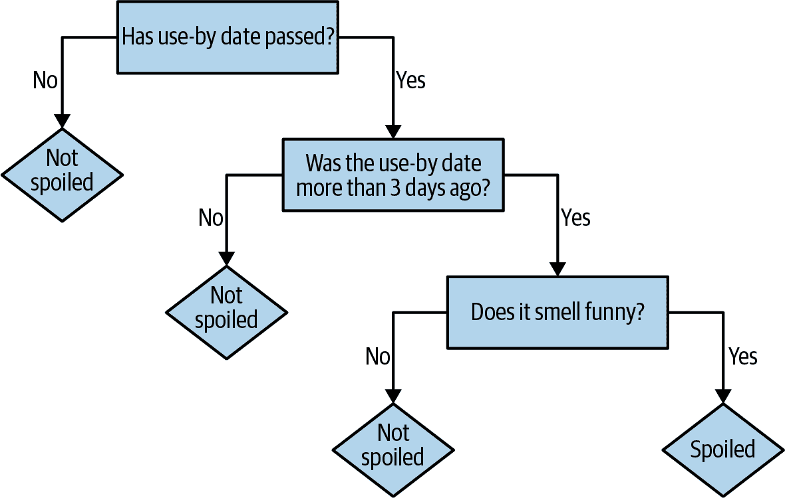
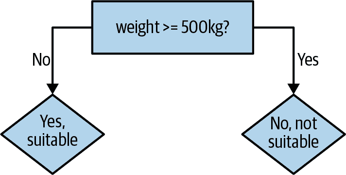
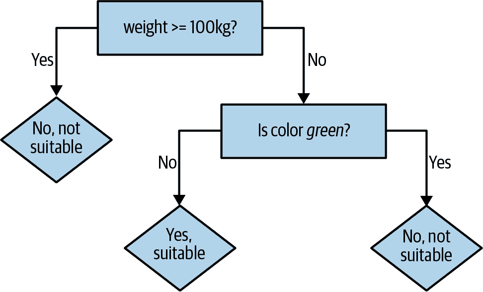

# 第四章：使用决策树和决策森林进行预测

分类和回归是最古老和最深入研究的预测分析类型。您在分析软件包和库中可能遇到的大多数算法都是分类或回归技术，比如支持向量机、逻辑回归、神经网络和深度学习。将回归和分类联系在一起的共同线索是，它们都涉及根据一个或多个其他值来预测一个（或多个）值。为了做到这一点，它们需要一组输入和输出来学习。它们需要同时提供问题和已知答案。因此，它们被称为监督学习的类型。

PySpark MLlib 提供了多种分类和回归算法的实现。其中包括决策树、朴素贝叶斯、逻辑回归和线性回归。这些算法的令人兴奋之处在于，它们可以帮助预测未来——或者至少预测我们尚不确定的事物，比如基于你的在线行为预测你购买汽车的可能性，根据电子邮件中的词汇预测邮件是否为垃圾，或者哪些土地可能根据其位置和土壤化学成分种植出最多的庄稼。

在本章中，我们将专注于一种流行且灵活的分类和回归算法（决策树），以及该算法的扩展（随机决策森林）。首先，我们将理解决策树和森林的基础知识，并介绍前者的 PySpark 实现。决策树的 PySpark 实现支持二元和多类分类，以及回归。该实现通过行进行数据分区，允许使用数百万甚至数十亿个实例进行分布式训练。接下来我们将准备我们的数据集并创建我们的第一棵决策树。然后我们将调整我们的决策树模型。最后，我们将在处理过的数据集上训练一个随机森林模型并进行预测。

尽管 PySpark 的决策树实现易于入门，理解决策树和随机森林算法的基础知识是有帮助的。这是我们将在下一节中讨论的内容。

# 决策树和森林

决策树（*Decision trees*）是一类算法家族，可以自然处理类别和数值特征。使用并行计算可以构建单棵树，并且可以同时并行构建多棵树。它们对数据中的异常值具有鲁棒性，这意味着少数极端甚至可能错误的数据点可能完全不会影响预测结果。它们可以处理不同类型和不同规模的数据，无需预处理或标准化。

基于决策树的算法具有相对直观和理解的优势。事实上，我们在日常生活中可能都在隐含地使用决策树体现的同样推理方式。例如，我早晨坐下来喝带牛奶的咖啡。在我决定使用牛奶加入我的咖啡之前，我想预测一下：牛奶是不是变质了？我不确定。我可能会检查一下使用日期是否已过期。如果没有，我预测它没变质。如果日期已经过期，但是距离过期日不到三天，我会冒险预测它没变质。否则，我会闻一下牛奶。如果闻起来有点怪，我预测是变质的；否则，预测不是。

这一系列的是/否决策导致了一个预测结果，这就是决策树所体现的。每个决策都导致两种结果中的一种，即预测结果或另一个决策，如图 4-1 所示。从这个意义上说，把这个过程想象成一个决策树是很自然的，其中树的每个内部节点都是一个决策，每个叶节点都是最终答案。

那是一个简单的决策树，没有经过严谨的构建。为了阐述，再考虑另一个例子。一个机器人在一家异国情调的宠物商店找了一份工作。它想在商店开门前学习，哪些动物适合孩子作为宠物。店主匆匆忙忙列出了九种适合和不适合的宠物。机器人从检查动物中收集到的信息编制了表 4-1。



###### 图 4-1\. 决策树：牛奶是否变质？

表 4-1\. 异国情调宠物商店“特征向量”

| Name | Weight (kg) | # Legs | Color | Good pet? |
| --- | --- | --- | --- | --- |
| Fido | 20.5 | 4 | Brown | Yes |
| Mr. Slither | 3.1 | 0 | Green | No |
| Nemo | 0.2 | 0 | Tan | Yes |
| Dumbo | 1390.8 | 4 | Gray | No |
| Kitty | 12.1 | 4 | Gray | Yes |
| Jim | 150.9 | 2 | Tan | No |
| Millie | 0.1 | 100 | Brown | No |
| McPigeon | 1.0 | 2 | Gray | No |
| Spot | 10.0 | 4 | Brown | Yes |

机器人可以为九种列出的宠物做出决策。商店里还有更多的宠物可供选择。它仍需要一种方法来决定其余动物中哪些适合孩子作为宠物。我们可以假设所有动物的特征都是已知的。利用商店主提供的决策数据和决策树，我们可以帮助机器人学习什么样的动物是适合孩子作为宠物的。

虽然有名字，但名字不会包含在我们的决策树模型的特征中。没有理由相信仅仅是名字就具有预测性；对于机器人来说，“费利克斯”可能是猫，也可能是有毒的大蜘蛛。因此，我们有两个数值特征（体重、腿的数量）和一个分类特征（颜色），预测一个分类目标（是否是孩子的好宠物）。

决策树的工作原理是基于提供的特征进行一个或多个顺序决策。起初，机器人可能会尝试将一个简单的决策树适配到这些训练数据上，该决策树仅基于体重做出一个决策，如图 4-2 所示。



###### 图 4-2\. 机器人的第一棵决策树

决策树的逻辑易于阅读和理解：500 公斤的动物显然不适合作为宠物。这条规则在九个案例中预测了五个正确的值。快速浏览表明，我们可以通过将体重阈值降低到 100 公斤来改进规则。这样做可以在九个例子中正确预测六个。重的动物现在被正确预测了；轻的动物只部分正确。

因此，可以构建第二个决策来进一步调整对于体重小于 100 公斤的例子的预测。最好选择一个能够将某些不正确的“是”预测变成“否”的特征。例如，有一种听起来像蛇的小型绿色动物，我们当前的模型将其分类为合适的宠物候选者。通过基于颜色的决策，如图 4-3 所示，机器人可以进行正确预测。



###### 图 4-3\. 机器人的下一棵决策树

现在，九个例子中有七个是正确的。当然，可以添加决策规则，直到所有九个都正确预测。但是，当翻译成通俗语言时，这样的决策树所包含的逻辑可能会显得不太可信：“如果动物的体重小于 100 公斤，它的颜色是棕色而不是绿色，并且它的腿少于 10 条，那么是，它适合作为宠物。”虽然完全符合给定的例子，但这样的决策树无法预测到小型、棕色、四条腿的狼獾不适合作为宠物。需要一些平衡来避免这种现象，称为*过拟合*。

决策树推广为一种更强大的算法，称为*随机森林*。随机森林结合了许多决策树，以减少过拟合的风险，并单独训练决策树。该算法在训练过程中注入随机性，使得每棵决策树都有所不同。组合预测减少了预测的方差，使得生成的模型更具普适性，并提高了在测试数据上的性能。

这就足够我们开始在 PySpark 中使用决策树和随机森林了。在接下来的部分，我们将介绍我们将使用的数据集，并为在 PySpark 中使用做好准备。

# 数据准备

本章使用的数据集是著名的 Covtype 数据集，可以在[线上](https://oreil.ly/spUWl)获取，格式为压缩的 CSV 文件*covtype.data.gz*及其附带的信息文件*covtype.info*。

数据集记录了美国科罗拉多州森林覆盖地块的类型。这个数据集和现实世界的森林有些巧合！每条数据记录包含描述每块地的多个特征，如海拔、坡度、距离水源的距离、阴影和土壤类型，以及覆盖该地块的已知森林类型。要从其他特征中预测森林覆盖类型，总共有 54 个特征。

这个数据集已经在研究中使用过，甚至在[Kaggle 比赛](https://oreil.ly/LpjgW)中也有应用。这是本章中探索的一个有趣的数据集，因为它既包含分类特征又包含数值特征。数据集中有 581,012 个示例，虽然不完全符合大数据的定义，但足够作为一个示例来管理，并且仍然突出了一些规模问题。

幸运的是，这些数据已经是简单的 CSV 格式，不需要太多的清洗或其他准备工作即可用于 PySpark MLlib。*covtype.data* 文件应该被提取并复制到您的本地或云存储（如 AWS S3）中。

开始`pyspark-shell`。如果要构建决策森林，给 shell 分配足够的内存是很有帮助的。如果有足够的内存，可以指定`--driver-memory 8g`或类似的参数。

CSV 文件基本上包含表格数据，组织成行和列。有时这些列在标题行中有命名，虽然这里并非如此。列名在伴随文件*covtype.info*中给出。从概念上讲，CSV 文件的每列也有一个类型，可以是数字或字符串，但 CSV 文件本身并未指定这一点。

这是自然而然的解析数据的方法，因为这是 PySpark 处理表格数据的抽象，具有定义的列模式，包括列名和类型。PySpark 内置支持读取 CSV 数据。让我们使用内置的 CSV 读取器将数据集读取为 DataFrame：

```
data_without_header = spark.read.option("inferSchema", True)\
                      .option("header", False).csv("data/covtype.data")
data_without_header.printSchema()
...
root
 |-- _c0: integer (nullable = true)
 |-- _c1: integer (nullable = true)
 |-- _c2: integer (nullable = true)
 |-- _c3: integer (nullable = true)
 |-- _c4: integer (nullable = true)
 |-- _c5: integer (nullable = true)
 ...
```

这段代码将输入作为 CSV 文件读取，并且不尝试解析第一行作为列名的标题。它还请求通过检查数据来推断每列的类型。它正确推断出所有列都是数字，具体来说是整数。不幸的是，它只能将列命名为 `_c0` 等。

我们可以查看*covtype.info* 文件获取列名。

```
$ cat data/covtype.info

...
[...]
7.	Attribute information:

Given is the attribute name, attribute type, the measurement unit and
a brief description.  The forest cover type is the classification
problem.  The order of this listing corresponds to the order of
numerals along the rows of the database.

Name                                    Data Type
Elevation                               quantitative
Aspect                                  quantitative
Slope                                   quantitative
Horizontal_Distance_To_Hydrology        quantitative
Vertical_Distance_To_Hydrology          quantitative
Horizontal_Distance_To_Roadways         quantitative
Hillshade_9am                           quantitative
Hillshade_Noon                          quantitative
Hillshade_3pm                           quantitative
Horizontal_Distance_To_Fire_Points      quantitative
Wilderness_Area (4 binary columns)      qualitative
Soil_Type (40 binary columns)           qualitative
Cover_Type (7 types)                    integer

Measurement                  Description

meters                       Elevation in meters
azimuth                      Aspect in degrees azimuth
degrees                      Slope in degrees
meters                       Horz Dist to nearest surface water features
meters                       Vert Dist to nearest surface water features
meters                       Horz Dist to nearest roadway
0 to 255 index               Hillshade index at 9am, summer solstice
0 to 255 index               Hillshade index at noon, summer soltice
0 to 255 index               Hillshade index at 3pm, summer solstice
meters                       Horz Dist to nearest wildfire ignition point
0 (absence) or 1 (presence)  Wilderness area designation
0 (absence) or 1 (presence)  Soil Type designation
1 to 7                       Forest Cover Type designation
...
```

查看列信息后，显然一些特征确实是数值型的。`Elevation` 是以米为单位的海拔；`Slope` 以度数表示。然而，`Wilderness_Area` 是不同的，因为据说它跨越四列，每列都是 0 或 1。事实上，`Wilderness_Area` 是一个分类值，而不是数值型的。

这四列实际上是一种独热编码或者 1-of-N 编码。当对分类特征执行这种编码时，一个具有*N*个不同值的分类特征变成了*N*个数值特征，每个特征取值为 0 或 1。精确地说，*N*个值中有一个值为 1，其余值为 0。例如，一个关于天气的分类特征可以是`cloudy`、`rainy`或者`clear`，将变成三个数值特征，其中`cloudy`表示为`1,0,0`，`rainy`表示为`0,1,0`，等等。这三个数值特征可以被看作是`is_cloudy`、`is_rainy`和`is_clear`特征。同样地，有 40 列其实只是一个`Soil_Type`分类特征。

这不是将分类特征编码为数字的唯一可能方法。另一种可能的编码方法是简单地为分类特征的每个可能值分配一个唯一的数值。例如，`cloudy`可能变成 1.0，`rainy`变成 2.0，依此类推。目标本身`Cover_Type`是一个编码为 1 到 7 的分类值。

当将分类特征编码为单个数值特征时要小心。原始的分类值没有排序，但编码为数字后似乎有了排序。将编码特征视为数值会导致无意义的结果，因为算法实际上是假装`rainy`比`cloudy`更大，且大两倍。只要不将编码的数值作为数字使用，这种做法是可以接受的。

我们已经看到了分类特征的两种编码方式。也许，将这些特征直接包含其值，如“Rawah Wilderness Area”，而不编码（并且以两种方式编码）可能更简单和直接。这可能是历史的产物；数据集发布于 1998 年。出于性能原因或者为了匹配当时更多用于回归问题的库的格式，数据集通常以这些方式编码数据。

无论如何，在继续之前，给这个 DataFrame 添加列名是非常有用的，以便更轻松地处理：

```
from pyspark.sql.types import DoubleType
from pyspark.sql.functions import col

colnames = ["Elevation", "Aspect", "Slope", \
            "Horizontal_Distance_To_Hydrology", \
            "Vertical_Distance_To_Hydrology", "Horizontal_Distance_To_Roadways", \
            "Hillshade_9am", "Hillshade_Noon", "Hillshade_3pm", \
            "Horizontal_Distance_To_Fire_Points"] + \ 
[f"Wilderness_Area_{i}" for i in range(4)] + \ [f"Soil_Type_{i}" for i in range(40)] + \ ["Cover_Type"]

data = data_without_header.toDF(*colnames).\
                          withColumn("Cover_Type",
                                    col("Cover_Type").cast(DoubleType()))

data.head()
...
Row(Elevation=2596,Aspect=51,Slope=3,Horizontal_Distance_To_Hydrology=258,...)
```


+ 连接集合。

与荒野和土壤相关的列名为`Wilderness_Area_0`、`Soil_Type_0`等，一小段 Python 代码即可生成这 44 个名称，无需逐个输入。最后，目标`Cover_Type`列被最初转换为`double`值，因为在所有 PySpark MLlib API 中，需要将其作为`double`而不是`int`使用。这一点稍后会变得明显。

你可以调用`data.show`来查看数据集的部分行，但显示的宽度太大，很难一眼看完。`data.head`以原始`Row`对象显示，这种情况下更易读。

现在我们熟悉了数据集并对其进行了处理，可以训练一个决策树模型。

# 我们的第一个决策树

在第三章中，我们立即在所有可用数据上建立了一个推荐模型。这创造了一个可以被具有一些音乐知识的任何人检查的推荐系统：观察用户的听音乐习惯和推荐，我们有些感觉它产生了良好的结果。在这里，这是不可能的。我们不知道如何对科罗拉多州的一个新地块进行 54 特征描述，或者可以从这样一个地块期望什么样的森林覆盖。

相反，我们必须直接开始保留一些数据以评估生成的模型。以前，AUC 指标用于评估保留的听数据和推荐预测之间的一致性。AUC 可视为随机选择一个好的推荐高于随机选择一个坏的推荐的概率。这里的原则是相同的，尽管评估指标将会不同：*准确性*。大多数——90%——的数据将再次用于训练，稍后，我们会看到这个训练集的一个子集将被保留用于交叉验证（CV 集）。这里保留的另外 10% 实际上是第三个子集，一个真正的测试集。

```
(train_data, test_data) = data.randomSplit([0.9, 0.1])
train_data.cache()
test_data.cache()
```

数据需要做更多的准备工作，以便在 MLlib 中与分类器一起使用。输入的 DataFrame 包含许多列，每列都持有一个可以用来预测目标列的特征。MLlib 要求所有的输入被收集到 *一个* 列中，其值是一个向量。PySpark 的 `VectorAssembler` 类是线性代数意义上向量的一个抽象，只包含数字。在大多数意图和目的上，它们就像一个简单的 `double` 值数组（浮点数）。当然，一些输入特征在概念上是分类的，即使它们在输入中都用数字表示。

幸运的是，`VectorAssembler` 类可以完成这项工作：

```
from pyspark.ml.feature import VectorAssembler

input_cols = colnames[:-1] 
vector_assembler = VectorAssembler(inputCols=input_cols,
                                    outputCol="featureVector")

assembled_train_data = vector_assembler.transform(train_data)

assembled_train_data.select("featureVector").show(truncate = False)
...
+------------------------------------------------------------------- ...
|featureVector                                                       ...
+------------------------------------------------------------------- ...
|(54,[0,1,2,5,6,7,8,9,13,18],[1874.0,18.0,14.0,90.0,208.0,209.0, ...
|(54,[0,1,2,3,4,5,6,7,8,9,13,18],1879.0,28.0,19.0,30.0,12.0,95.0, ...
...
```

![1

排除标签，Cover_Type

`VectorAssembler` 的关键参数是要合并成特征向量的列，以及包含特征向量的新列的名称。在这里，所有列——当然除了目标列——都作为输入特征包含在内。生成的 DataFrame 有一个新的 `featureVector` 列，如图所示。

输出看起来并不像一系列数字，但这是因为它显示的是一个原始的向量表示，表示为一个 `SparseVector` 实例以节省存储空间。因为 54 个值中大多数是 0，它仅存储非零值及其索引。这个细节在分类中并不重要。

`VectorAssembler`是当前 MLlib Pipelines API 中的`Transformer`示例。它根据一些逻辑将输入的 DataFrame 转换为另一个 DataFrame，并且可以与其他转换组合成管道。在本章的后面，这些转换将连接成一个实际的`Pipeline`。在这里，转换只是直接调用，已足以构建第一个决策树分类器模型：

```
from pyspark.ml.classification import DecisionTreeClassifier

classifier = DecisionTreeClassifier(seed = 1234, labelCol="Cover_Type",
                                    featuresCol="featureVector",
                                    predictionCol="prediction")

model = classifier.fit(assembled_train_data)
print(model.toDebugString)
...
DecisionTreeClassificationModel: uid=DecisionTreeClassifier_da03f8ab5e28, ...
  If (feature 0 <= 3036.5)
   If (feature 0 <= 2546.5)
    If (feature 10 <= 0.5)
     If (feature 0 <= 2412.5)
      If (feature 3 <= 15.0)
       Predict: 4.0
      Else (feature 3 > 15.0)
       Predict: 3.0
     Else (feature 0 > 2412.5)
       ...
```

同样，分类器的基本配置包括列名：包含输入特征向量的列和包含目标值以预测的列。因为模型将来会用于预测目标的新值，所以需要给出一个列名来存储预测结果。

打印模型的表示形式显示了它的树结构的一部分。它由一系列关于特征的嵌套决策组成，比较特征值与阈值。（由于历史原因，这些特征只用数字而不是名称来表示，这一点很不幸。）

决策树能够在构建过程中评估输入特征的重要性。也就是说，它们可以估计每个输入特征对于做出正确预测的贡献程度。从模型中获取这些信息很简单：

```
import pandas as pd

pd.DataFrame(model.featureImportances.toArray(),
            index=input_cols, columns=['importance']).\
            sort_values(by="importance", ascending=False)
...
                                  importance
Elevation                         0.826854
Hillshade_Noon                    0.029087
Soil_Type_1                       0.028647
Soil_Type_3                       0.026447
Wilderness_Area_0                 0.024917
Horizontal_Distance_To_Hydrology  0.024862
Soil_Type_31                      0.018573
Wilderness_Area_2                 0.012458
Horizontal_Distance_To_Roadways   0.003608
Hillshade_9am                     0.002840
...
```

这将重要性值（数值越高越好）与列名配对，并按重要性从高到低顺序打印它们。海拔似乎是最重要的特征；大多数特征在预测覆盖类型时估计几乎没有任何重要性！

生成的`DecisionTreeClassificationModel`本身也是一个转换器，因为它可以将包含特征向量的数据框转换为同样包含预测的数据框。

例如，看看模型对训练数据的预测，并将其与已知的正确覆盖类型进行比较可能会很有趣：

```
predictions = model.transform(assembled_train_data)
predictions.select("Cover_Type", "prediction", "probability").\
            show(10, truncate = False)

...
+----------+----------+------------------------------------------------ ...
|Cover_Type|prediction|probability                                      ...
+----------+----------+------------------------------------------------ ...
|6.0       |4.0       |0.0,0.0,0.028372324539571926,0.2936784469885515, ...
|6.0       |3.0       |0.0,0.0,0.024558587479935796,0.6454654895666132, ...
|6.0       |3.0       |[0.0,0.0,0.024558587479935796,0.6454654895666132, ...
|6.0       |3.0       |[0.0,0.0,0.024558587479935796,0.6454654895666132, ...
...
```

有趣的是，输出还包含一个`probability`列，显示了模型对每种可能结果正确的估计概率。这表明在这些情况下，它相当确信答案是 3，并且几乎可以肯定答案不是 1。

细心的读者可能会注意到，概率向量实际上有八个值，即使只有七种可能的结果。向量中索引为 1 到 7 的值包含了结果 1 到 7 的概率。然而，索引为 0 的值总是显示为 0.0 的概率。这可以忽略，因为 0 不是有效的结果，正如所述的那样。这是表示这一信息的向量的一种特殊方式，值得注意。

基于以上片段，看起来模型可能需要进一步改进。它的预测看起来经常是错误的。与[第三章中的 ALS 实现一样，`DecisionTreeClassifier`实现有几个需要选择值的超参数，这些参数都被默认设置。在这里，测试集可以用来产生使用这些默认超参数构建的模型的预期准确性的无偏评估。

现在我们将使用`MulticlassClassificationEvaluator`来计算准确率和其他评估模型预测质量的指标。这是 MLlib 中评估器的一个示例，负责以某种方式评估输出 DataFrame 的质量：

```
from pyspark.ml.evaluation import MulticlassClassificationEvaluator

evaluator = MulticlassClassificationEvaluator(labelCol="Cover_Type",
                                        predictionCol="prediction")

evaluator.setMetricName("accuracy").evaluate(predictions)
evaluator.setMetricName("f1").evaluate(predictions)

...
0.6989423087953562
0.6821216079701136
```

在给出包含“标签”（目标或已知正确输出值）的列和包含预测的列名之后，它发现这两者大约有 70%的匹配率。这就是分类器的准确率。它还可以计算其他相关的度量值，如 F1 分数。在这里，我们将使用准确率来评估分类器。

这个单一数字很好地总结了分类器输出的质量。然而，有时候查看*混淆矩阵*也很有用。这是一个表格，其中为每个可能的目标值（target）都有一行和一列。因为有七个目标类别值，所以这是一个 7×7 的矩阵，其中每行对应一个实际正确值，每列对应一个按顺序预测的值。在第*i*行和第*j*列的条目计数了真实类别*i*被预测为类别*j*的次数。因此，正确的预测在对角线上计数，而其他则是预测。

可以直接使用 DataFrame API 计算混淆矩阵，利用其更一般的操作符。

```
confusion_matrix = predictions.groupBy("Cover_Type").\
  pivot("prediction", range(1,8)).count().\
  na.fill(0.0).\ ![1  orderBy("Cover_Type")confusion_matrix.show()...+----------+------+------+-----+---+---+---+-----+|Cover_Type|     1|     2|    3|  4|  5|  6|    7|+----------+------+------+-----+---+---+---+-----+|       1.0|133792| 51547|  109|  0|  0|  0| 5223||       2.0| 57026|192260| 4888| 57|  0|  0|  750||       3.0|     0|  3368|28238|590|  0|  0|    0||       4.0|     0|     0| 1493|956|  0|  0|    0||       5.0|     0|  8282|  283|  0|  0|  0|    0||       6.0|     0|  3371|11872|406|  0|  0|    0||       7.0|  8122|    74|    0|  0|  0|  0|10319|+----------+------+------+-----+---+---+---+-----+```

用 0 替换空值。

电子表格用户可能已经意识到这个问题就像计算数据透视表一样。数据透视表通过两个维度对值进行分组，这些值成为输出的行和列，并在这些分组内计算一些聚合，例如在这里计数。这也可以作为几个数据库中的 PIVOT 函数提供，并受到 Spark SQL 的支持。通过这种方式计算可能更加优雅和强大。

尽管 70%的准确率听起来不错，但是否出色或糟糕并不立即清楚。一个简单的方法能建立基线吗？就像一个停止的时钟每天会准确两次一样，随机猜测每个例子的分类也偶尔会得出正确答案。

我们可以构建这样一个随机的“分类器”，方法是按照其在训练集中的普遍性随机选择一个类别。例如，如果训练集中有 30%的覆盖类型 1，则随机分类器会有 30%的概率猜测“1”。每个分类在测试集中的正确性与其在测试集中的普遍性成比例。如果测试集中有 40%的覆盖类型 1，则猜测“1”将有 40%的准确率。因此，覆盖类型 1 将在 30% x 40% = 12%的时间内被正确猜测，并对总体准确率贡献 12%。因此，我们可以通过对这些概率乘积求和来评估准确性：

```
from pyspark.sql import DataFrame

def class_probabilities(data):
    total = data.count()
    return data.groupBy("Cover_Type").count().\ 
    orderBy("Cover_Type").\ 
    select(col("count").cast(DoubleType())).\
    withColumn("count_proportion", col("count")/total).\
    select("count_proportion").collect()

train_prior_probabilities = class_probabilities(train_data)
test_prior_probabilities = class_probabilities(test_data)

train_prior_probabilities
...

[Row(count_proportion=0.36455357859838705),
 Row(count_proportion=0.4875111371136425),
 Row(count_proportion=0.06155716924206445),
 Row(count_proportion=0.00468236760696409),
 Row(count_proportion=0.016375858943914835),
 Row(count_proportion=0.029920118693908142),
 Row(count_proportion=0.03539976980111887)]

...

train_prior_probabilities = [p[0] for p in train_prior_probabilities]
test_prior_probabilities = [p[0] for p in test_prior_probabilities]

sum([train_p * cv_p for train_p, cv_p in zip(train_prior_probabilities,
                                              test_prior_probabilities)]) 
...

0.37735294664034547
```


按类别计数


按类别排序计数


在训练集和测试集中求对数乘积

随机猜测当时的准确率为 37%，这使得 70%看起来像是一个很好的结果。但后者是使用默认超参数实现的。通过探索超参数对树构建过程的实际影响，我们可以取得更好的效果。这正是我们将在下一节中做的。

# 决策树超参数

在 第三章，ALS 算法揭示了几个超参数，我们必须通过使用不同数值组合构建模型，然后使用某些度量评估每个结果的质量来选择这些数值。尽管度量标准现在是多类准确率而不是 AUC，但过程是相同的。控制决策树决策方式的超参数也将大不相同：最大深度、最大 bin 数、纯度度量和最小信息增益。

*最大深度* 简单地限制了决策树中的层级数。它是分类器用于分类示例时将做出的最大连锁决策数量。为了避免过度拟合训练数据，限制这一点非常有用，正如前面在宠物店示例中所示。

决策树算法负责提出在每个级别尝试的潜在决策规则，例如宠物店示例中的 `weight >= 100` 或 `weight >= 500` 决策。决策始终具有相同的形式：对于数值特征，决策形式为 `feature >= value`；对于分类特征，形式为 `feature in (value1, value2, …)`。因此，要尝试的决策规则集合实际上是要插入到决策规则中的一组值。在 PySpark MLlib 实现中称为 *bins*。更多的 bin 数量需要更多的处理时间，但可能会导致找到更优的决策规则。

什么使得决策规则变得好？直觉上，一个好的规则能够有意义地通过目标类别值来区分示例。例如，将 Covtype 数据集分成只有类别 1-3 和 4-7 的例子的规则会非常好，因为它清晰地将一些类别与其他类别分开。一个导致与整个数据集中所有类别几乎相同混合的规则似乎不会有帮助。遵循这样一个决策的任一分支会导致可能目标值的大致相同分布，因此并不会真正取得向有信心的分类的进展。

换句话说，好的规则将训练数据的目标值分成相对同质或“纯净”的子集。选择最佳规则意味着最小化它引起的两个子集的不纯度。有两种常用的不纯度度量：基尼不纯度和熵。

*基尼不纯度*与随机猜测分类器的准确性直接相关。在一个子集内，它是随机选择的分类中一个被选择的例子（根据子集中类别的分布）*不正确*的概率。为了计算这个值，我们首先将每个类别乘以其在所有类别中的比例。然后从 1 中减去所有值的总和。如果一个子集有*N*个类别，*p*[*i*]是类别*i*的例子比例，则其基尼不纯度在基尼不纯度方程中给出：

<math alttext="upper I Subscript upper G Baseline left-parenthesis p right-parenthesis equals 1 minus sigma-summation Underscript i equals 1 Overscript upper N Endscripts p Subscript i Superscript 2" display="block"><mrow><msub><mi>I</mi> <mi>G</mi></msub> <mrow><mo>(</mo> <mi>p</mi> <mo>)</mo></mrow> <mo>=</mo> <mn>1</mn> <mo>-</mo> <munderover><mo>∑</mo> <mrow><mi>i</mi><mo>=</mo><mn>1</mn></mrow> <mi>N</mi></munderover> <msubsup><mi>p</mi> <mi>i</mi> <mn>2</mn></msubsup></mrow></math>

如果子集只包含一个类别，那么这个值为 0，因为它完全是“纯净的”。当子集中有*N*个类别时，这个值大于 0，当且仅当各类别出现次数相同时值最大——即最大不纯度。

*熵*是另一种来自信息论的不纯度度量。其本质更难以解释，但它捕捉了子集中目标值集合关于数据预测的不确定性程度。包含一个类别的子集表明该子集的结果是完全确定的，并且熵为 0——没有不确定性。另一方面，包含每种可能类别的子集则表明对于该子集的预测有很大的不确定性，因为数据已经观察到各种目标值。这就有很高的熵。因此，低熵和低基尼不纯度一样，是一个好事。熵由熵方程定义：

<math alttext="upper I Subscript upper E Baseline left-parenthesis p right-parenthesis equals sigma-summation Underscript i equals 1 Overscript upper N Endscripts p Subscript i Baseline log left-parenthesis StartFraction 1 Over p Subscript i Baseline EndFraction right-parenthesis equals minus sigma-summation Underscript i equals 1 Overscript upper N Endscripts p Subscript i Baseline log left-parenthesis p Subscript i Baseline right-parenthesis" display="block"><mrow><msub><mi>I</mi> <mi>E</mi></msub> <mrow><mo>(</mo> <mi>p</mi> <mo>)</mo></mrow> <mo>=</mo> <munderover><mo>∑</mo> <mrow><mi>i</mi><mo>=</mo><mn>1</mn></mrow> <mi>N</mi></munderover> <msub><mi>p</mi> <mi>i</mi></msub> <mo form="prefix">log</mo> <mrow><mo>(</mo> <mfrac><mn>1</mn> <msub><mi>p</mi> <mi>i</mi></msub></mfrac> <mo>)</mo></mrow> <mo>=</mo> <mo>-</mo> <munderover><mo>∑</mo> <mrow><mi>i</mi><mo>=</mo><mn>1</mn></mrow> <mi>N</mi></munderover> <msub><mi>p</mi> <mi>i</mi></msub> <mo form="prefix">log</mo> <mrow><mo>(</mo> <msub><mi>p</mi> <mi>i</mi></msub> <mo>)</mo></mrow></mrow></math>

有趣的是，不确定性是有单位的。因为对数是自然对数（以*e*为底），单位是*nats*，是更熟悉的*bits*的对应物（通过使用以 2 为底的对数可以得到）。它确实是在测量信息，因此在使用熵来进行决策树时，谈论决策规则的*信息增益*也很常见。

在给定数据集中，其中一个或另一个度量可能更适合选择决策规则。在某种程度上，它们是相似的。两者都涉及加权平均：按*p*[i]加权值的总和。PySpark 实现的默认值是基尼不纯度。

最后，*最小信息增益*是一个超参数，它对候选决策规则施加最小信息增益或不纯度减少要求。那些不能足够改善子集不纯度的规则将被拒绝。与较低的最大深度类似，这可以帮助模型抵抗过拟合，因为仅仅能帮助将训练输入划分的决策，可能实际上在将来的数据中并不帮助划分。

现在我们理解了决策树算法的相关超参数，接下来我们将在下一节调整我们的模型以提高其性能。

# 调整决策树

从数据看，不明显哪种不纯度度量可以带来更好的准确性，或者最大深度或者箱数目是否足够而不过度。幸运的是，就像在第三章中一样，让 PySpark 尝试多个这些值的组合并报告结果是很简单的。

首先，需要设置一个流水线，封装我们在前几节中执行的两个步骤——创建特征向量和使用它创建决策树模型。创建`VectorAssembler`和`DecisionTreeClassifier`，并将这两个`Transformer`链接在一起，结果是一个单一的`Pipeline`对象，它将这两个操作作为一个操作整合在一起：

```
from pyspark.ml import Pipeline

assembler = VectorAssembler(inputCols=input_cols, outputCol="featureVector")
classifier = DecisionTreeClassifier(seed=1234, labelCol="Cover_Type",
                                    featuresCol="featureVector",
                                    predictionCol="prediction")

pipeline = Pipeline(stages=[assembler, classifier])
```

当然，流水线可以更长，更复杂。这是最简单的情况。现在我们还可以使用 PySpark ML API 内置的支持，定义应该使用的超参数组合的`ParamGridBuilder`。现在是定义评估指标的时候了，将用于选择“最佳”超参数，这是`MulticlassClassificationEvaluator`：

```
from pyspark.ml.tuning import ParamGridBuilder

paramGrid = ParamGridBuilder(). \
  addGrid(classifier.impurity, ["gini", "entropy"]). \
  addGrid(classifier.maxDepth, [1, 20]). \
  addGrid(classifier.maxBins, [40, 300]). \
  addGrid(classifier.minInfoGain, [0.0, 0.05]). \
  build()

multiclassEval = MulticlassClassificationEvaluator(). \
  setLabelCol("Cover_Type"). \
  setPredictionCol("prediction"). \
  setMetricName("accuracy")
```

这意味着将建立一个模型，并对四个超参数的两个值进行评估。这是 16 个模型。它们将通过多类精度进行评估。最后，`TrainValidationSplit`将这些组件结合在一起——创建模型的流水线、模型评估指标和要尝试的超参数——并且可以在训练数据上运行评估。值得注意的是，这里也可以使用`CrossValidator`来执行完整的 k 折交叉验证，但它的成本是*k*倍，并且在处理大数据时添加的价值不如`TrainValidationSplit`大。因此，这里使用了`TrainValidationSplit`：

```
from pyspark.ml.tuning import TrainValidationSplit

validator = TrainValidationSplit(seed=1234,
  estimator=pipeline,
  evaluator=multiclassEval,
  estimatorParamMaps=paramGrid,
  trainRatio=0.9)

validator_model = validator.fit(train_data)
```

这将花费几分钟甚至更长时间，具体取决于您的硬件，因为它正在构建和评估许多模型。请注意，训练比例参数设置为 0.9。这意味着训练数据实际上由`TrainValidationSplit`进一步分为 90%/10%子集。前者用于训练每个模型。剩余的 10%输入数据保留为交叉验证集以评估模型。如果已经保留了一些数据用于评估，那么为什么我们还要保留原始数据的 10%作为测试集？

如果 CV 集的目的是评估适合*训练*集的*参数*，那么测试集的目的是评估适合 CV 集的*超参数*。换句话说，测试集确保了对最终选择的模型及其超参数准确度的无偏估计。

假设这个过程选择的最佳模型在 CV 集上表现出 90%的准确率。预计它将在未来的数据上表现出 90%的准确率似乎是合理的。然而，构建这些模型的过程中存在随机性。由于偶然因素，这个模型和评估结果可能会特别好。顶级模型和评估结果可能会受益于一点运气，因此其准确度估计可能稍微乐观一些。换句话说，超参数也可能会出现过拟合的情况。

要真正评估这个最佳模型在未来示例中的表现如何，我们需要对未用于训练的示例进行评估。但我们也需要避免使用 CV 集中用于评估它的示例。这就是为什么第三个子集，即测试集，被保留的原因。

验证器的结果包含它找到的最佳模型。这本身就是它找到的最佳整体*管道*的表示，因为我们提供了一个要运行的管道实例。要查询由`DecisionTreeClassifier`选择的参数，必须手动从最终的`PipelineModel`中提取`DecisionTreeClassificationModel`，这是管道中的最后一个阶段：

```
from pprint import pprint

best_model = validator_model.bestModel
pprint(best_model.stages[1].extractParamMap())

...
{Param(...name='predictionCol', doc='prediction column name.'): 'prediction',
 Param(...name='probabilityCol', doc='...'): 'probability',
 [...]
 Param(...name='impurity', doc='...'): 'entropy',
 Param(...name='maxDepth', doc='...'): 20,
 Param(...name='minInfoGain', doc='...'): 0.0,
 [...]
 Param(...name='featuresCol', doc='features column name.'): 'featureVector',
 Param(...name='maxBins', doc='...'): 40,
 [...]
 Param(...name='labelCol', doc='label column name.'): 'Cover_Type'}
 ...
}
```

此输出包含关于拟合模型的大量信息，但它还告诉我们，熵显然作为杂质度量效果最好，并且最大深度为 20 并不出奇。最佳模型仅使用 40 个箱似乎有些令人惊讶，但这可能表明 40 个“足够”而不是“比 300 更好”。最后，没有最小信息增益比小最小信息增益更好，这可能意味着该模型更容易欠拟合而不是过拟合。

您可能想知道是否可以查看每个模型在每种超参数组合下实现的准确率。超参数和评估结果通过`getEstimatorParamMaps`和`validationMetrics`公开。它们可以组合在一起，按度量值排序显示所有参数组合：

```
validator_model = validator.fit(train_data)

metrics = validator_model.validationMetrics
params = validator_model.getEstimatorParamMaps()
metrics_and_params = list(zip(metrics, params))

metrics_and_params.sort(key=lambda x: x[0], reverse=True)
metrics_and_params

...
[(0.9130409881445563,
  {Param(...name='minInfoGain' ...): 0.0,
   Param(...name='maxDepth'...): 20,
   Param(...name='maxBins' ...): 40,
   Param(...name='impurity'...): 'entropy'}),
 (0.9112655352131498,
  {Param(...name='minInfoGain',...): 0.0,
   Param(...name='maxDepth' ...): 20,
   Param(...name='maxBins'...): 300,
   Param(...name='impurity'...: 'entropy'}),
...
```

这个模型在 CV 集上达到了什么准确率？最后，这个模型在测试集上达到了什么准确率？

```
metrics.sort(reverse=True)
print(metrics[0])
...

0.9130409881445563
...

multiclassEval.evaluate(best_model.transform(test_data)) 

...
0.9138921373048084
```


`best_Model` 是一个完整的流水线。

结果都约为 91%。偶然情况下，来自 CV 集的估计一开始就相当不错。事实上，测试集显示非常不同的结果并不常见。

这是重新审视过拟合问题的一个有趣时刻。如前所述，可能会构建一个非常深奥的决策树，使其非常好或完全适合给定的训练示例，但由于过于密切地拟合了训练数据的特异性和噪声，无法推广到其他示例。这是大多数机器学习算法（不仅仅是决策树）常见的问题。

当决策树过度拟合时，在用于拟合模型的相同训练数据上，其准确率会很高，但在其他示例上准确率会很低。在这里，最终模型对其他新示例的准确率约为 91%。准确率也可以很容易地在模型训练时的相同数据上评估，`trainData`。这样的准确率约为 95%。差异不大，但表明决策树在某种程度上过度拟合了训练数据。更低的最大深度可能是更好的选择。

到目前为止，我们已经将所有输入特征（包括分类特征）隐式地视为数值。通过将分类特征作为确切的分类特征处理，我们可以进一步提高模型的性能。我们将在接下来探讨这一点。

# 分类特征再探讨

我们数据集中的分类特征被单热编码为多个二进制 0/1 值。将这些单独特征视为数值处理是可行的，因为对于“数值”特征的任何决策规则都会选择 0 到 1 之间的阈值，而且所有阈值都是等价的，因为所有值都是 0 或 1。

当然，这种编码方式迫使决策树算法单独考虑底层分类特征的值。由于特征如土壤类型被分解成许多特征，并且决策树单独处理特征，因此更难以关联相关土壤类型的信息。

例如，九种不同的土壤类型实际上是莱顿家族的一部分，它们可能以决策树可以利用的方式相关联。如果将土壤类型编码为一个具有 40 个土壤值的单一分类特征，则树可以直接表达诸如“如果土壤类型是九种莱顿家族类型之一”的规则。然而，当编码为 40 个特征时，树必须学习关于土壤类型的九个决策序列才能达到相同的表达能力，这种表达能力可能会导致更好的决策和更高效的树。

然而，将 40 个数值特征代表一个 40 值分类特征增加了内存使用量并减慢了速度。

如何撤销独热编码？例如，将四列编码的荒野类型替换为一个列，该列将荒野类型编码为 0 到 3 之间的数字，如`Cover_Type`：

```
def unencode_one_hot(data):
    wilderness_cols = ['Wilderness_Area_' + str(i) for i in range(4)]
    wilderness_assembler = VectorAssembler().\
                            setInputCols(wilderness_cols).\
                            setOutputCol("wilderness")

    unhot_udf = udf(lambda v: v.toArray().tolist().index(1)) 

    with_wilderness = wilderness_assembler.transform(data).\
      drop(*wilderness_cols).\ 
      withColumn("wilderness", unhot_udf(col("wilderness")))

    soil_cols = ['Soil_Type_' + str(i) for i in range(40)]
    soil_assembler = VectorAssembler().\
                      setInputCols(soil_cols).\
                      setOutputCol("soil")
    with_soil = soil_assembler.\
                transform(with_wilderness).\
                drop(*soil_cols).\
                withColumn("soil", unhot_udf(col("soil")))

    return with_soil
```


注意 UDF 定义


删除一热编码列；不再需要

这里使用`VectorAssembler`来将 4 个荒野和土壤类型列合并成两个`Vector`列。这些`Vector`中的值都是 0，只有一个位置是 1。没有简单的 DataFrame 函数可以做到这一点，因此我们必须定义自己的 UDF 来操作列。这将把这两个新列转换为我们需要的类型的数字。

现在我们可以通过上面定义的函数转换我们的数据集，删除独热编码：

```
unenc_train_data = unencode_one_hot(train_data)
unenc_train_data.printSchema()
...
root
 |-- Elevation: integer (nullable = true)
 |-- Aspect: integer (nullable = true)
 |-- Slope: integer (nullable = true)
 |-- Horizontal_Distance_To_Hydrology: integer (nullable = true)
 |-- Vertical_Distance_To_Hydrology: integer (nullable = true)
 |-- Horizontal_Distance_To_Roadways: integer (nullable = true)
 |-- Hillshade_9am: integer (nullable = true)
 |-- Hillshade_Noon: integer (nullable = true)
 |-- Hillshade_3pm: integer (nullable = true)
 |-- Horizontal_Distance_To_Fire_Points: integer (nullable = true)
 |-- Cover_Type: double (nullable = true)
 |-- wilderness: string (nullable = true)
 |-- soil: string (nullable = true)
...

unenc_train_data.groupBy('wilderness').count().show()
...

+----------+------+
|wilderness| count|
+----------+------+
|         3| 33271|
|         0|234532|
|         1| 26917|
|         2|228144|
+----------+------+
```

从这里开始，几乎可以使用与上述相同的过程来调整建立在这些数据上的决策树模型的超参数，并选择和评估最佳模型。但是有一个重要的区别。这两个新的数值列并没有任何信息表明它们实际上是分类值的编码。将它们视为数字是不正确的，因为它们的排序是没有意义的。模型仍然会构建，但由于这些特征中的一些信息不可用，精度可能会受到影响。

在内部，MLlib 可以存储关于每列的额外元数据。这些数据的细节通常对调用方隐藏，但包括列是否编码为分类值以及它取多少个不同的值等信息。要添加这些元数据，需要通过`VectorIndexer`处理数据。它的工作是将输入转换为正确标记的分类特征列。虽然我们已经做了大部分工作，将分类特征转换为 0 索引的值，但`VectorIndexer`将负责元数据。

我们需要将此阶段添加到`Pipeline`中：

```
from pyspark.ml.feature import VectorIndexer

cols = unenc_train_data.columns
inputCols = [c for c in cols if c!='Cover_Type']

assembler = VectorAssembler().setInputCols(inputCols).setOutputCol("featureVector")

indexer = VectorIndexer().\
  setMaxCategories(40).\ 
  setInputCol("featureVector").setOutputCol("indexedVector")

classifier = DecisionTreeClassifier().setLabelCol("Cover_Type").\
                                      setFeaturesCol("indexedVector").\
                                      setPredictionCol("prediction")

pipeline = Pipeline().setStages([assembler, indexer, classifier])
```


大于等于 40，因为土壤有 40 个值

这种方法假设训练集中至少包含每个分类特征的所有可能值一次。也就是说，只有当所有 4 个土壤值和所有 40 个荒野值出现在训练集中时，它才能正确工作，以便所有可能的值都能得到映射。在这里，情况确实如此，但对于一些标签非常少出现的小训练数据集来说，情况可能并非如此。在这些情况下，可能需要手动创建并添加一个`VectorIndexerModel`，并手动提供完整的值映射。

除此之外，这个过程和之前是一样的。你应该发现它选择了一个类似的最佳模型，但是在测试集上的准确率大约是 93%。通过在前几节中将分类特征视为实际的分类特征，分类器的准确率提高了将近 2%。

我们已经训练并调整了一个决策树。现在，我们将转向随机森林，这是一个更强大的算法。正如我们将在下一节看到的，使用 PySpark 实现它们在这一点上将会非常简单。

# 随机森林

如果你已经跟着代码示例走过来，你可能会注意到你的结果与书中代码清单中呈现的结果略有不同。这是因为在构建决策树时存在随机因素，而当你决定使用什么数据和探索什么决策规则时，随机性就会发挥作用。

算法在每个级别并不考虑每一个可能的决策规则。这样做将需要大量的时间。对于一个包含*N*个值的分类特征，存在 2^(*N*)–2 个可能的决策规则（每个子集除了空集和整个集合）。对于一个即使是适度大的*N*，这将产生数十亿个候选决策规则。

相反，决策树使用几个启发式方法来确定实际考虑哪些规则。挑选规则的过程也涉及一些随机性；每次只查看随机选择的少数几个特征，并且仅来自训练数据的随机子集的值。这种做法在速度上稍微牺牲了一点准确性，但也意味着决策树算法不会每次都构建相同的树。这是件好事。

出于同样的原因，通常“众人的智慧”会胜过个体的预测。为了说明这一点，来做个快速测验：伦敦有多少辆黑色出租车？

不要先看答案；先猜测。

我猜大约 10,000 辆，这远低于正确答案约为 19,000 辆。因为我猜得比较少，你更有可能比我猜得多，所以我们的平均答案将更接近正确。这里又出现了均值回归。办公室里 13 个人的非正式投票平均猜测确实更接近：11,170。

这种效应的关键在于猜测是独立的，并且不会相互影响。（你没有偷看，对吧？）如果我们都同意并使用相同的方法进行猜测，这个练习将毫无用处，因为猜测将会是相同的答案——可能是完全错误的答案。如果我仅仅通过提前说明我的猜测来影响你，结果甚至会更糟。

不只一棵树，而是许多树将会很棒，每棵树都会产生合理但不同和独立的目标值估计。它们的集体平均预测应该接近真实答案，比任何单棵树的预测更接近。这个过程中的*随机性*有助于创建这种独立性。这是*随机森林*的关键。

通过构建许多树注入随机性，每棵树都看到不同的随机数据子集——甚至是特征子集。这使得整个森林对过度拟合的倾向较小。如果特定特征包含嘈杂数据或只在*训练*集中具有迷惑性预测能力，那么大多数树大部分时间都不会考虑这个问题特征。大多数树不会适应噪声，并倾向于“否决”在森林中适应噪声的树。

随机森林的预测只是树预测的加权平均值。对于分类目标，这可以是多数投票或基于树产生的概率平均值的最可能值。与决策树一样，随机森林也支持回归，而在这种情况下，森林的预测是每棵树预测数的平均值。

虽然随机森林是一种更强大且复杂的分类技术，好消息是在本章开发的流水线中使用它实际上几乎没有区别。只需将`RandomForestClassifier`放入`DecisionTreeClassifier`的位置，并像以前一样继续即可。实际上，没有更多的代码或 API 需要理解以便使用它：

```
from pyspark.ml.classification import RandomForestClassifier

classifier = RandomForestClassifier(seed=1234, labelCol="Cover_Type",
                                    featuresCol="indexedVector",
                                    predictionCol="prediction")
```

注意，这个分类器还有另一个超参数：要构建的树的数量。像最大箱子超参数一样，更高的值应该在一定程度上产生更好的结果。然而，代价是，构建许多树当然比构建一棵树需要花费的时间长得多。

从类似调整过程中产生的最佳随机森林模型的准确率一开始就达到了 95%——比以前建立的最佳决策树高出约 2%，尽管从另一个角度来看，这是从 7%降到 5%的误差率减少了 28%。通过进一步调整，你可能会获得更好的结果。

顺便说一句，在这一点上，我们对特征重要性有了更可靠的了解：

```
forest_model = best_model.stages[1]

feature_importance_list = list(zip(input_cols,
                                  forest_model.featureImportances.toArray()))
feature_importance_list.sort(key=lambda x: x[1], reverse=True)

pprint(feature_importance_list)
...
(0.28877055118903183,Elevation)
(0.17288279582959612,soil)
(0.12105056811661499,Horizontal_Distance_To_Roadways)
(0.1121550648692802,Horizontal_Distance_To_Fire_Points)
(0.08805270405239551,wilderness)
(0.04467393191338021,Vertical_Distance_To_Hydrology)
(0.04293099150373547,Horizontal_Distance_To_Hydrology)
(0.03149644050848614,Hillshade_Noon)
(0.028408483578137605,Hillshade_9am)
(0.027185325937200706,Aspect)
(0.027075578474331806,Hillshade_3pm)
(0.015317564027809389,Slope)
```

随机森林在大数据背景下非常吸引人，因为树被认为是独立构建的，而大数据技术如 Spark 和 MapReduce 固有地需要*数据并行*问题，即整体解决方案的各部分可以独立计算在数据的各部分上。树可以且应该仅在特征或输入数据的子集上训练，使得并行构建树变得微不足道。

# 进行预测

构建分类器，虽然是一个有趣且微妙的过程，但并非最终目标。目标是进行预测。这才是回报，而且相对来说相当容易。

最终的“最佳模型”实际上是一整套操作流程。它包含了如何将输入转换为模型使用的方式，并包括模型本身，可以进行预测。它可以在新输入的数据框架上操作。与我们开始的`data`数据框架唯一的区别是缺少`Cover_Type`列。当我们进行预测时——尤其是关于未来的预测，如 Bohr 先生所说——输出当然是未知的。

为了证明这一点，请尝试从测试数据输入中删除`Cover_Type`并获得预测：

```
unenc_test_data = unencode_one_hot(test_data)
bestModel.transform(unenc_test_data.drop("Cover_Type")).\
                    select("prediction").show()

...
+----------+
|prediction|
+----------+
|       6.0|
+----------+
```

结果应该是 6.0，这对应于原始 Covtype 数据集中的第 7 类（原始特征为 1 索引）。本示例描述的土地的预测覆盖类型是 Krummholz。

# 下一步该去哪里

本章介绍了机器学习中的两种相关且重要的类型，分类和回归，以及一些构建和调整模型的基础概念：特征、向量、训练和交叉验证。它演示了如何使用 Covtype 数据集，通过位置和土壤类型等因素预测森林覆盖类型，使用 PySpark 实现了决策树和随机森林。

就像第三章中的推荐系统一样，继续探索超参数对准确性的影响可能会很有用。大多数决策树超参数在时间和准确性之间进行权衡：更多的箱子和树通常可以提高准确性，但会遇到收益递减的点。

这里的分类器结果非常准确。通常情况下，超过 95%的准确率是不寻常的。一般来说，通过包含更多特征或将现有特征转换为更具预测性的形式，可以进一步提高准确性。这是在迭代改进分类器模型中常见且重复的步骤。例如，对于这个数据集，编码水平和垂直距离到水面特征的两个特征可以产生第三个特征：直线距离到水面特征。这可能比任何原始特征都更有用。或者，如果可能收集更多数据，我们可以尝试添加像土壤湿度这样的新信息来改善分类。

当然，并非所有真实世界中的预测问题都与 Covtype 数据集完全相同。例如，有些问题需要预测连续的数值，而不是分类值。对于这种类型的*回归*问题，相同的分析和代码适用；在这种情况下，`RandomForestRegressor`类将非常有用。

此外，决策树和随机森林并非唯一的分类或回归算法，也不是仅有的 PySpark 实现算法。每种算法的操作方式都与决策树和随机森林有很大不同。然而，许多元素是相同的：它们都可以插入到 `Pipeline` 中，在数据帧的列上操作，并且有超参数需要使用训练、交叉验证和测试数据子集来选择。同样的一般原则，也可以用于这些其他算法来建模分类和回归问题。

这些是监督学习的例子。当一些或所有目标值未知时会发生什么？接下来的章节将探讨在这种情况下可以采取的措施。
