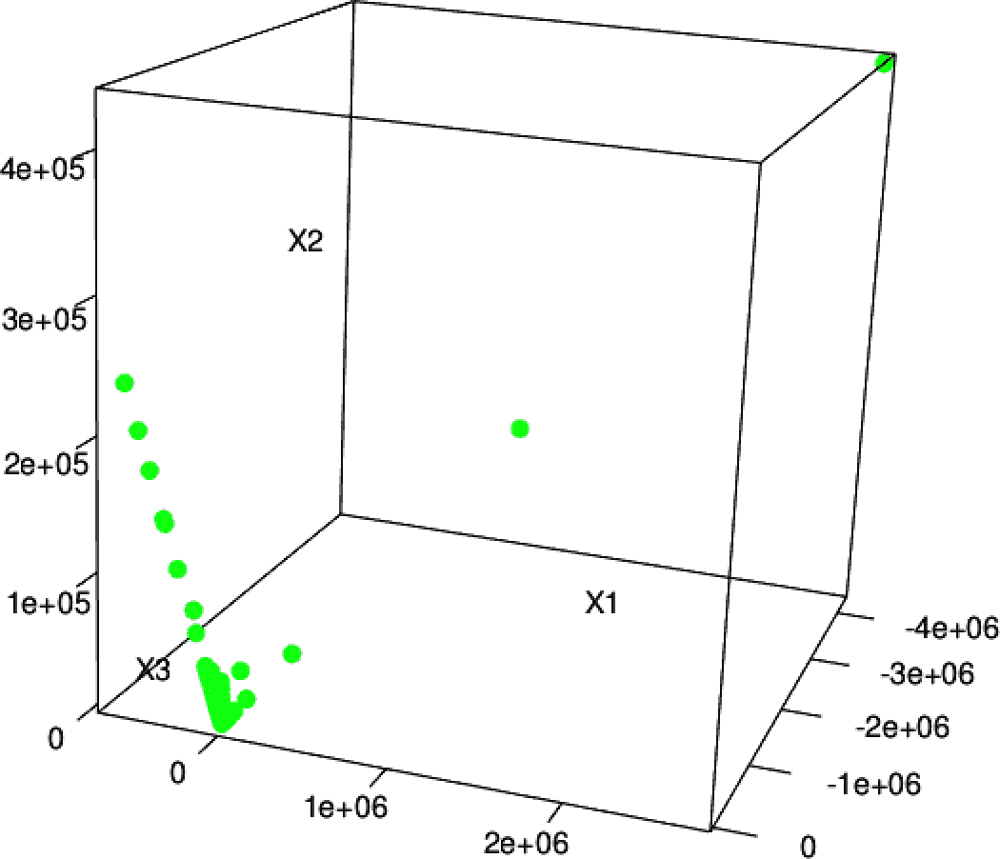
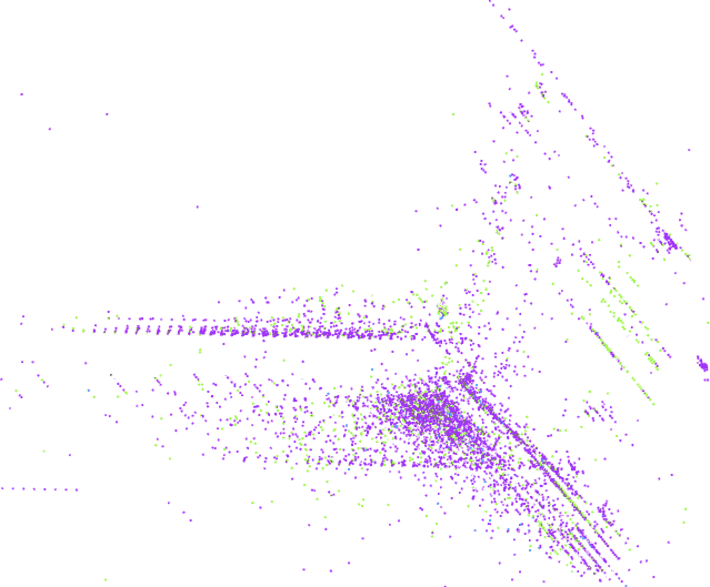

# 第五章：使用 K 均值聚类进行异常检测

分类和回归是机器学习中强大且深入研究的技术。第四章展示了如何使用分类器作为未知值的预测器。但是有一个问题：为了预测新数据的未知值，我们必须知道许多先前见过的示例的目标值。只有当数据科学家知道自己在寻找什么并且可以提供大量示例，输入才能产生已知输出时，分类器才能提供帮助。这些被统称为*监督学习*技术，因为它们的学习过程为输入中的每个示例接收正确的输出值。

然而，有时对于某些或所有示例，正确的输出是未知的。考虑将电子商务网站的客户根据其购物习惯和喜好分组的问题。输入特征包括他们的购买、点击、人口统计信息等。输出应该是客户的分组：也许一个组将代表注重时尚的购买者，另一个组可能对应于价格敏感的猎奇者，等等。

如果要为每个新客户确定这个目标标签，您将很快在应用监督学习技术（如分类器）时遇到问题：您事先不知道谁应被认为是时尚意识强的人。实际上，您甚至不确定“时尚意识强”的定义是否能够有效地将网站的客户分组起来！

幸运的是，*无监督学习*技术可以提供帮助。这些技术不会学习预测目标值，因为没有目标值可用。然而，它们可以学习数据中的结构，并找到相似输入的分组，或者学习哪些类型的输入可能发生，哪些不可能。本章将介绍使用 MLlib 中的聚类实现的无监督学习。具体来说，我们将使用 K 均值聚类算法来识别网络流量数据中的异常。异常检测通常用于发现欺诈、检测网络攻击或发现服务器或其他传感器设备中的问题。在这些情况下，能够发现以前从未见过的新类型异常是非常重要的——新形式的欺诈、入侵和服务器故障模式。无监督学习技术在这些情况下很有用，因为它们可以学习输入数据通常的外观，并因此在新数据与过去数据不同之时进行检测。这样的新数据不一定是攻击或欺诈；它只是不寻常，因此值得进一步调查。

我们将从 K 均值聚类算法的基础开始。接着介绍 KDD Cup 1999 数据集。然后使用 PySpark 创建我们的第一个 K 均值模型。然后我们将讨论在实施 K 均值算法时确定好的*k*值（簇的数量）的方法。接下来，我们通过实现一位热编码方法来改进我们的模型，通过归一化输入特征和使用先前被丢弃的分类特征。最后，我们将回顾熵指标并探索一些我们模型的结果。

# K 均值聚类

异常检测的固有问题，顾名思义，是寻找不寻常的事物。如果我们已经知道数据集中“异常”的含义，我们可以很容易地通过监督学习检测数据中的异常。算法会接收标记为“正常”和“异常”的输入，并学会区分两者。然而，异常的本质在于它们是未知的未知。换句话说，一旦观察并理解了的异常就不再是异常了。

聚类是最知名的无监督学习类型。聚类算法试图在数据中找到自然的分组。那些相似但不同于其他数据点的数据点可能代表一个有意义的分组，因此聚类算法试图将这样的数据放入同一簇中。

K 均值聚类可能是最广泛使用的聚类算法。它试图在数据集中检测*k*个簇，其中*k*由数据科学家给定。*k*是模型的超参数，合适的值将取决于数据集。事实上，在本章中选择一个合适的*k*值将是一个核心情节点。

当数据集包含客户活动或交易等信息时，“相似”是什么意思？K 均值需要一个数据点之间距离的概念。通常使用简单的欧氏距离来测量 K 均值中数据点之间的距离，正如现在这篇文章中所做的一样，这也是 Spark MLlib 支持的两种距离函数之一，另一种是余弦距离。欧氏距离适用于所有特征都是数值的数据点。“相似”的点是那些中间距离较小的点。

对于 K 均值来说，一个簇就是一个点：所有构成该簇的点的中心。事实上，这些仅仅是包含所有数值特征的特征向量，并且可以称为向量。然而，在这里把它们看作点可能更直观，因为它们在欧几里得空间中被视为点。

此中心称为聚类的*质心*，是点的算术平均值，因此得名 K-*means*。算法首先选择一些数据点作为初始的聚类质心。然后将每个数据点分配给最近的质心。然后对于每个簇，计算新的聚类质心作为刚分配到该簇的数据点的平均值。这个过程重复进行。

现在我们将介绍一个用例，描述 K 均值聚类如何帮助我们识别网络中潜在的异常活动。

# 发现异常网络流量

网络攻击越来越频繁地出现在新闻中。一些攻击试图用网络流量淹没计算机，以排挤合法流量。但在其他情况下，攻击试图利用网络软件中的漏洞来未经授权地访问计算机。当计算机被大量流量轰炸时很明显，但检测利用漏洞可以像在大量网络请求的巨大干草堆中寻找针一样困难。

一些攻击行为遵循已知模式。例如，快速连续访问机器上的每个端口并非任何正常软件程序所需。然而，这是攻击者寻找可能易受攻击的计算机服务的典型第一步。

如果你计算远程主机在短时间内访问的不同端口数量，你可能会得到一个相当好的预测端口扫描攻击的特征。几个端口可能是正常的；数百个表示攻击。检测网络连接其他特征的其他类型攻击也是如此——发送和接收的字节数、TCP 错误等。

那么未知的未知情况呢？最大的威胁可能是从未被检测和分类的威胁。检测潜在网络入侵的一部分是检测异常情况。这些连接不被认为是攻击，但与过去观察到的连接不相似。

在这里，像 K 均值这样的无监督学习技术可以用来检测异常网络连接。K 均值可以根据每个连接的统计信息进行聚类。结果的聚类本身并不有趣，但它们集体定义了与过去连接类似的连接类型。与聚类不接近的任何连接可能是异常的。聚类之所以有趣，是因为它们定义了正常连接的区域；其他一切都是不寻常的，可能是异常的。

## KDD Cup 1999 数据集

[KDD Cup](https://oreil.ly/UtYd9) 是由计算机协会的一个特别兴趣小组组织的年度数据挖掘竞赛。每年，他们会提出一个机器学习问题，并提供一个数据集，邀请研究人员提交详细描述他们对问题的最佳解决方案的论文。1999 年的主题是网络入侵，数据集仍然可以在[KDD 网站](https://oreil.ly/ezBDa)上找到。我们需要从该网站下载*kddcupdata.data.gz*和*kddcup.info*文件。本章的其余部分将演示如何使用 Spark 构建系统来检测异常网络流量。

不要使用此数据集构建真实的网络入侵系统！该数据并不一定反映当时的真实网络流量——即使它反映了，它也反映了 20 多年前的流量模式。

幸运的是，组织者已经将原始网络数据处理成关于各个网络连接的摘要信息。数据集大小约为 708 MB，包含约 490 万个连接。对于我们的目的来说，这是一个很大甚至是庞大的数据集，绝对足够了。对于每个连接，数据集包含诸如发送的字节数、登录尝试、TCP 错误等信息。每个连接是一个 CSV 格式的数据行，包含 38 个特征。特征信息和顺序可以在*kddcup.info*文件中找到。

解压*kddcup.data.gz*数据文件并将其复制到您的存储中。例如，假设文件位于*data/kddcup.data*。让我们看看数据的原始形式：

```
head -n 1 data/kddcup.data

...

0,tcp,http,SF,215,45076,0,0,0,0,0,1,0,0,0,0,0,0,0,0,0,0,1,1,...
```

例如，这个连接是一个 TCP 连接到 HTTP 服务——发送了 215 字节，接收了 45,706 字节。用户已登录等等。

许多特征是计数，例如在第 17 列中列出的`num_file_creations`，如*kddcup.info*文件中所示。许多特征取值为 0 或 1，表示行为的存在或不存在，例如在第 15 列中的`su_attempted`。它们看起来像是来自第四章的独热编码分类特征，但并非以同样的方式分组和相关。每个特征都像是一个是/否特征，因此可以说是一个分类特征。通常情况下，将分类特征转换为数字并视其具有顺序是不总是有效的。但是，在二元分类特征的特殊情况下，在大多数机器学习算法中，将其映射为取值为 0 和 1 的数值特征将效果很好。

其余的是像`dst_host_srv_rerror_rate`这样的比率，位于倒数第二列，并且取值范围从 0.0 到 1.0，包括 0.0 和 1.0。

有趣的是，标签位于最后一个字段中。大多数连接被标记为`normal.`，但有些被识别为各种类型的网络攻击的示例。这些将有助于学习区分已知攻击和正常连接，但问题在于异常检测和发现潜在的新攻击和未知攻击。对于我们的目的，这个标签将大部分被忽略。

# 对聚类的初步尝试

打开`pyspark-shell`，并将 CSV 数据加载为数据帧。这又是一个没有头部信息的 CSV 文件。需要按照附带的*kddcup.info*文件中给出的列名提供列名。

```
data_without_header = spark.read.option("inferSchema", True).\
                                  option("header", False).\
                                  csv("data/kddcup.data")

column_names = [  "duration", "protocol_type", "service", "flag",
  "src_bytes", "dst_bytes", "land", "wrong_fragment", "urgent",
  "hot", "num_failed_logins", "logged_in", "num_compromised",
  "root_shell", "su_attempted", "num_root", "num_file_creations",
  "num_shells", "num_access_files", "num_outbound_cmds",
  "is_host_login", "is_guest_login", "count", "srv_count",
  "serror_rate", "srv_serror_rate", "rerror_rate", "srv_rerror_rate",
  "same_srv_rate", "diff_srv_rate", "srv_diff_host_rate",
  "dst_host_count", "dst_host_srv_count",
  "dst_host_same_srv_rate", "dst_host_diff_srv_rate",
  "dst_host_same_src_port_rate", "dst_host_srv_diff_host_rate",
  "dst_host_serror_rate", "dst_host_srv_serror_rate",
  "dst_host_rerror_rate", "dst_host_srv_rerror_rate",
  "label"]

data = data_without_header.toDF(*column_names)
```

从探索数据集开始。数据中有哪些标签，每个标签有多少个？以下代码简单地按标签计数并按计数降序打印结果：

```
from pyspark.sql.functions import col
data.select("label").groupBy("label").count().\
      orderBy(col("count").desc()).show(25)

...
+----------------+-------+
|           label|  count|
+----------------+-------+
|          smurf.|2807886|
|        neptune.|1072017|
|         normal.| 972781|
|          satan.|  15892|
...
|            phf.|      4|
|           perl.|      3|
|            spy.|      2|
+----------------+-------+
```

有 23 个不同的标签，最频繁的是`smurf.`和`neptune.`攻击。

注意，数据中包含非数值特征。例如，第二列可能是`tcp`、`udp`或`icmp`，但是 K 均值聚类需要数值特征。最终的标签列也是非数值的。因此，在开始时，这些特征将被简单地忽略。

除此之外，创建数据的 K 均值聚类与第四章中看到的模式相同。`VectorAssembler`创建特征向量，`KMeans`实现从特征向量创建模型，而`Pipeline`则将它们全部串联起来。从生成的模型中，可以提取并检查聚类中心。

```
from pyspark.ml.feature import VectorAssembler
from pyspark.ml.clustering import KMeans, KMeansModel
from pyspark.ml import Pipeline

numeric_only = data.drop("protocol_type", "service", "flag").cache()

assembler = VectorAssembler().setInputCols(numeric_only.columns[:-1]).\
                              setOutputCol("featureVector")

kmeans = KMeans().setPredictionCol("cluster").setFeaturesCol("featureVector")

pipeline = Pipeline().setStages([assembler, kmeans])
pipeline_model = pipeline.fit(numeric_only)
kmeans_model = pipeline_model.stages[1]

from pprint import pprint
pprint(kmeans_model.clusterCenters())

...
[array([4.83401949e+01, 1.83462155e+03, 8.26203190e+02, 5.71611720e-06,
       6.48779303e-04, 7.96173468e-06...]),
 array([1.0999000e+04, 0.0000000e+00, 1.3099374e+09, 0.0000000e+00,
       0.0000000e+00, 0.0000000e+00,...])]
```

不容易直观地解释这些数字，但每个数字代表模型生成的一个聚类中心（也称为质心）。这些值是每个数值输入特征的质心坐标。

打印了两个向量，这意味着 K 均值将*k*=2 个群集适合于数据。对于已知至少具有 23 种不同连接类型的复杂数据集来说，这几乎肯定不足以准确建模数据中的不同分组。

这是使用给定标签获取直观感觉的好机会，以了解这两个聚类中的内容，通过计算每个聚类内的标签数量。

```
with_cluster = pipeline_model.transform(numeric_only)

with_cluster.select("cluster", "label").groupBy("cluster", "label").count().\
              orderBy(col("cluster"), col("count").desc()).show(25)

...
+-------+----------------+-------+
|cluster|           label|  count|
+-------+----------------+-------+
|      0|          smurf.|2807886|
|      0|        neptune.|1072017|
|      0|         normal.| 972781|
|      0|          satan.|  15892|
|      0|        ipsweep.|  12481|
...
|      0|            phf.|      4|
|      0|           perl.|      3|
|      0|            spy.|      2|
|      1|      portsweep.|      1|
+-------+----------------+-------+
```

结果显示聚类并没有提供任何帮助。只有一个数据点最终进入了群集 1！

# 选择 k 值

显然，两个聚类是不够的。对于这个数据集来说，适当的聚类数量是多少？显然，数据中有 23 种不同的模式，因此*k*至少应该是 23，甚至可能更多。通常，会尝试多个*k*值来找到最佳值。但是，“最佳”是什么？

如果每个数据点都接近其最近的质心，则可以认为聚类是好的，其中“接近”由欧氏距离定义。这是评估聚类质量的简单常见方法，通过所有点上这些距离的均值，或者有时是距离平方的均值。实际上，`KMeansModel`提供了一个`ClusteringEvaluator`方法，可以计算平方距离的和，并且可以轻松地用于计算平均平方距离。

对几个*k*值手动评估聚类成本是相当简单的。请注意，此代码可能需要运行 10 分钟或更长时间：

```
from pyspark.sql import DataFrame
from pyspark.ml.evaluation import ClusteringEvaluator

from random import randint

def clustering_score(input_data, k):
    input_numeric_only = input_data.drop("protocol_type", "service", "flag")
    assembler = VectorAssembler().setInputCols(input_numeric_only.columns[:-1]).\
                                  setOutputCol("featureVector")
    kmeans = KMeans().setSeed(randint(100,100000)).setK(k).\
                      setPredictionCol("cluster").\
                      setFeaturesCol("featureVector")
    pipeline = Pipeline().setStages([assembler, kmeans])
    pipeline_model = pipeline.fit(input_numeric_only)

    evaluator = ClusteringEvaluator(predictionCol='cluster',
                                    featuresCol="featureVector")
    predictions = pipeline_model.transform(numeric_only)
    score = evaluator.evaluate(predictions)
    return score

for k in list(range(20,100, 20)):
    print(clustering_score(numeric_only, k)) 

...
(20,6.649218115128446E7)
(40,2.5031424366033625E7)
(60,1.027261913057096E7)
(80,1.2514131711109027E7)
(100,7235531.565096531)
```


分数将使用科学计数法显示。

打印的结果显示随着*k*的增加，分数下降。请注意，分数使用科学计数法显示；第一个值超过了 10⁷，而不仅仅是略高于 6。

同样，您的数值将会有所不同。聚类依赖于随机选择的初始质心集。

然而，这一点是显而易见的。随着添加更多的簇，总是可以将数据点放置在最近的质心附近。事实上，如果*k*被选为数据点的数量，那么平均距离将为 0，因为每个点将成为自己的一个包含一个点的簇！

更糟糕的是，在先前的结果中，*k*=80 的距离比*k*=60 的距离要大。这不应该发生，因为更高的*k*至少应该允许与更低的*k*一样好的聚类。问题在于，对于给定的*k*，K-means 不一定能找到最优的聚类。它的迭代过程可以从一个随机起始点收敛到一个局部最小值，这可能很好但不是最优的。

即使在使用更智能的方法选择初始质心时，这一点仍然是真实的。[K-means++和 K-means||](https://oreil.ly/zes8d)是选择算法的变体，更有可能选择多样化、分离的质心，并更可靠地导致良好的聚类。事实上，Spark MLlib 实现了 K-means||。然而，所有这些算法在选择时仍然具有随机性，并不能保证最优的聚类。

选择的随机起始簇集合*k*=80 可能导致特别不理想的聚类，或者在达到局部最优之前可能会提前停止。

我们可以通过延长迭代时间来改善它。算法通过`setTol`设定了一个阈值，用于控制被认为是显著的簇质心移动的最小量；较低的值意味着 K-means 算法将允许质心继续移动更长时间。通过`setMaxIter`增加最大迭代次数也可以防止算法在可能的情况下过早停止，但可能会增加计算量。

```
def clustering_score_1(input_data, k):
    input_numeric_only = input_data.drop("protocol_type", "service", "flag")
    assembler = VectorAssembler().\
                  setInputCols(input_numeric_only.columns[:-1]).\
                  setOutputCol("featureVector")
    kmeans = KMeans().setSeed(randint(100,100000)).setK(k).setMaxIter(40).\ 
      setTol(1.0e-5).\ 
      setPredictionCol("cluster").setFeaturesCol("featureVector")
    pipeline = Pipeline().setStages([assembler, kmeans])
    pipeline_model = pipeline.fit(input_numeric_only)
    #
    evaluator = ClusteringEvaluator(predictionCol='cluster',
                                    featuresCol="featureVector")
    predictions = pipeline_model.transform(numeric_only)
    score = evaluator.evaluate(predictions)
    #
    return score

for k in list(range(20,101, 20)):
    print(k, clustering_score_1(numeric_only, k))
```


从默认的 20 增加。


从默认的 1.0e-4 减少。

这一次，至少得分是一致递减的：

```
(20,1.8041795813813403E8)
(40,6.33056876207124E7)
(60,9474961.544965891)
(80,9388117.93747141)
(100,8783628.926311461)
```

我们希望找到一个点，在这个点之后增加*k*不会显著减少得分，或者在*k*与得分之间的图形中找到一个“拐点”，该图形通常是递减的，但最终会趋于平缓。在这里，看起来过了 100 之后递减明显。*k*的合适值可能超过 100。

# 使用 SparkR 进行可视化

此时，重新进行聚类之前了解更多关于数据的信息可能会有帮助。特别是查看数据点的图表可能会有所帮助。

Spark 本身没有用于可视化的工具，但流行的开源统计环境[R](https://www.r-project.org)具有用于数据探索和数据可视化的库。此外，Spark 还通过[SparkR](https://oreil.ly/XX0Q9)提供与 R 的基本集成。本简短部分将演示使用 R 和 SparkR 对数据进行聚类和探索聚类。

SparkR 是本书中贯穿始终的 `spark-shell` 的一个变体，可以通过命令 `sparkR` 调用。它运行一个本地 R 解释器，就像 `spark-shell` 运行 Scala shell 的变体作为本地进程一样。运行 `sparkR` 的机器需要一个本地安装的 R，Spark 不包含在内。例如，在 Ubuntu 等 Linux 发行版上可以通过 `sudo apt-get install r-base` 安装它，或者在 macOS 上可以通过 [Homebrew](http://brew.sh) 使用 `brew install R` 安装。

SparkR 是一个类似于 R 的命令行 shell 环境。要查看可视化效果，需要在能够显示图片的类 IDE 环境中运行这些命令。[RStudio](https://www.rstudio.com) 是 R 的 IDE（也适用于 SparkR）；它运行在桌面操作系统上，因此只有在本地实验 Spark 而不是在集群上时才能使用它。

如果你在本地运行 Spark，请[下载](https://oreil.ly/JZGQm)免费版的 RStudio 并安装它。如果不是，那么本示例的大部分仍可在命令行上使用 `sparkR` 运行，例如在集群上，尽管无法以此方式显示可视化结果。

如果通过 RStudio 运行，请启动 IDE 并配置 `SPARK_HOME` 和 `JAVA_HOME`，如果本地环境尚未设置它们，则设置为指向 Spark 和 JDK 安装目录：

```
Sys.setenv(SPARK_HOME = "*`/path/to/spark`*") 
Sys.setenv(JAVA_HOME = "*`/path/to/java`*") library(SparkR, lib.loc = c(file.path(Sys.getenv("SPARK_HOME"), "R", "lib"))) sparkR.session(master = "local[*]",
 sparkConfig = list(spark.driver.memory = "4g"))
```


当然，需要用实际路径替换。

注意，如果在命令行上运行 `sparkR`，则不需要这些步骤。相反，它接受命令行配置参数，如 `--driver-memory`，就像 `spark-shell` 一样。

SparkR 是围绕相同的 DataFrame 和 MLlib API 的 R 语言包装器，这些 API 已在本章中展示过。因此，可以重新创建数据的 K-means 简单聚类：

```
clusters_data <- read.df("*`/path/to/kddcup.data`*", "csv", 
 inferSchema = "true", header = "false") colnames(clusters_data) <- c( 
 "duration", "protocol_type", "service", "flag", "src_bytes", "dst_bytes", "land", "wrong_fragment", "urgent", "hot", "num_failed_logins", "logged_in", "num_compromised", "root_shell", "su_attempted", "num_root", "num_file_creations", "num_shells", "num_access_files", "num_outbound_cmds", "is_host_login", "is_guest_login", "count", "srv_count", "serror_rate", "srv_serror_rate", "rerror_rate", "srv_rerror_rate", "same_srv_rate", "diff_srv_rate", "srv_diff_host_rate", "dst_host_count", "dst_host_srv_count", "dst_host_same_srv_rate", "dst_host_diff_srv_rate", "dst_host_same_src_port_rate", "dst_host_srv_diff_host_rate", "dst_host_serror_rate", "dst_host_srv_serror_rate", "dst_host_rerror_rate", "dst_host_srv_rerror_rate", "label") 
numeric_only <- cache(drop(clusters_data, 
 c("protocol_type", "service", "flag", "label"))) 
kmeans_model <- spark.kmeans(numeric_only, ~ ., 
 k = 100, maxIter = 40, initMode = "k-means||")
```


替换为 *kddcup.data* 的路径。


命名列。


再次删除非数值列。


`~ .` 表示所有列。

从这里开始，为每个数据点分配一个集群非常简单。上述操作展示了使用 SparkR API 的用法，这些 API 自然对应于核心 Spark API，但表现为类似 R 语法的 R 库。实际的聚类是使用同一基于 JVM 的 Scala 语言实现的 MLlib 执行的。这些操作实际上是对不在 R 中执行的分布式操作的一种 *句柄* 或远程控制。

R 有其自己丰富的分析库集合，以及其自己类似的 dataframe 概念。因此，有时将一些数据拉入 R 解释器以使用这些与 Spark 无关的本地 R 库是很有用的。

当然，R 及其库不是分布式的，因此不可能将 4,898,431 个数据点的整个数据集导入 R。不过，只导入一个样本非常容易：

```
clustering <- predict(kmeans_model, numeric_only) clustering_sample <- collect(sample(clustering, FALSE, 0.01)) 

str(clustering_sample) 
... 'data.frame': 48984 obs. of  39 variables:
 $ duration                   : int  0 0 0 0 0 0 0 0 0 0 ... $ src_bytes                  : int  181 185 162 254 282 310 212 214 181 ... $ dst_bytes                  : int  5450 9020 4528 849 424 1981 2917 3404 ... $ land                       : int  0 0 0 0 0 0 0 0 0 0 ... ...
 $ prediction                 : int  33 33 33 0 0 0 0 0 33 33 ...
```


无重复抽样的 1%样本

`clustering_sample`实际上是一个本地的 R 数据框，而不是 Spark DataFrame，因此可以像 R 中的任何其他数据一样进行操作。上面的`str`显示了数据框的结构。

例如，可以提取聚类分配，然后显示关于分配分布的统计信息：

```
clusters <- clustering_sample["prediction"] 
data <- data.matrix(within(clustering_sample, rm("prediction"))) 

table(clusters) 
... clusters
 0    11    14    18    23    25    28    30    31    33    36    ... 47294     3     1     2     2   308   105     1    27  1219    15    ...
```


只有聚类分配列


除了聚类分配以外的所有内容。

例如，这显示大多数点都属于聚类 0。虽然在 R 中可以对这些数据进行更多操作，但是这超出了本书的范围。

要可视化数据，需要一个名为`rgl`的库。只有在 RStudio 中运行这个示例时，它才能正常工作。首先，安装（仅需一次）并加载这个库：

```
install.packages("rgl")
library(rgl)
```

请注意，R 可能会提示您下载其他软件包或编译器工具来完成安装，因为安装该软件包意味着编译其源代码。

这个数据集是 38 维的。为了在随机投影中可视化它，最多必须将其投影到三维空间中：

```
random_projection <- matrix(data = rnorm(3*ncol(data)), ncol = 3) 
random_projection_norm <-
 random_projection / sqrt(rowSums(random_projection*random_projection)) 
projected_data <- data.frame(data %*% random_projection_norm) 
```


进行一个随机的 3 维投影并进行归一化。


投影并创建一个新的数据框。

通过选择三个随机单位向量并将数据投影到它们上面，这将从一个 38 维的数据集创建一个 3 维的数据集。这是一种简单粗糙的降维方法。当然，还有更复杂的降维算法，如主成分分析或奇异值分解。这些算法在 R 中也有实现，但运行时间更长。在这个例子中，为了可视化的目的，随机投影可以更快地达到类似的结果。

最后，可以在交互式 3D 可视化中绘制聚类点：

```
num_clusters <- max(clusters)
palette <- rainbow(num_clusters)
colors = sapply(clusters, function(c) palette[c])
plot3d(projected_data, col = colors, size = 10)
```

请注意，这将需要在支持`rgl`库和图形的环境中运行 RStudio。

在图 5-1 中的结果可视化显示了三维空间中的数据点。许多点重叠在一起，结果稀疏且难以解释。然而，可视化的主要特征是其 L 形状。点似乎沿着两个不同的维度变化，而其他维度变化较小。

这是有道理的，因为数据集有两个特征的量级比其他特征大得多。而大多数特征的值在 0 到 1 之间，而字节发送和字节接收特征的值则在 0 到数万之间变化。因此，点之间的欧氏距离几乎完全由这两个特征决定。其他特征几乎不存在！因此，通过标准化消除这些规模差异非常重要，以便让特征处于近乎相等的地位。



###### 图 5-1\. 随机 3-D 投影

# 特征标准化

我们可以通过将每个特征转换为标准分来标准化每个特征。这意味着从每个值中减去特征的值的平均值，并除以标准差，如标准分公式所示：

<math alttext="n o r m a l i z e d Subscript i Baseline equals StartFraction f e a t u r e Subscript i Baseline minus mu Subscript i Baseline Over sigma Subscript i Baseline EndFraction" display="block"><mrow><mi>n</mi> <mi>o</mi> <mi>r</mi> <mi>m</mi> <mi>a</mi> <mi>l</mi> <mi>i</mi> <mi>z</mi> <mi>e</mi> <msub><mi>d</mi> <mi>i</mi></msub> <mo>=</mo> <mfrac><mrow><mi>f</mi><mi>e</mi><mi>a</mi><mi>t</mi><mi>u</mi><mi>r</mi><msub><mi>e</mi> <mi>i</mi></msub> <mo>-</mo><msub><mi>μ</mi> <mi>i</mi></msub></mrow> <msub><mi>σ</mi> <mi>i</mi></msub></mfrac></mrow></math>

实际上，减去均值对聚类没有影响，因为这种减法实际上是以相同方向和相同数量移动所有数据点。这并不影响点与点之间的欧氏距离。

MLlib 提供了`StandardScaler`，这是一种可以执行此类标准化并轻松添加到聚类管道中的组件。

我们可以在更高范围的*k*上使用标准化数据运行相同的测试：

```
from pyspark.ml.feature import StandardScaler

def clustering_score_2(input_data, k):
    input_numeric_only = input_data.drop("protocol_type", "service", "flag")
    assembler = VectorAssembler().\
                setInputCols(input_numeric_only.columns[:-1]).\
                setOutputCol("featureVector")
    scaler = StandardScaler().setInputCol("featureVector").\
                              setOutputCol("scaledFeatureVector").\
                              setWithStd(True).setWithMean(False)
    kmeans = KMeans().setSeed(randint(100,100000)).\
                      setK(k).setMaxIter(40).\
                      setTol(1.0e-5).setPredictionCol("cluster").\
                      setFeaturesCol("scaledFeatureVector")
    pipeline = Pipeline().setStages([assembler, scaler, kmeans])
    pipeline_model = pipeline.fit(input_numeric_only)
    #
    evaluator = ClusteringEvaluator(predictionCol='cluster',
                                    featuresCol="scaledFeatureVector")
    predictions = pipeline_model.transform(numeric_only)
    score = evaluator.evaluate(predictions)
    #
    return score

for k in list(range(60, 271, 30)):
    print(k, clustering_score_2(numeric_only, k))
...
(60,1.2454250178069293)
(90,0.7767730051608682)
(120,0.5070473497003614)
(150,0.4077081720067704)
(180,0.3344486714980788)
(210,0.276237617334138)
(240,0.24571877339169032)
(270,0.21818167354866858)
```

这有助于使维度更平等，并且点之间的绝对距离（因此成本）在绝对数值上要小得多。然而，上述输出还没有提供一个明显的*k*值，超过这个值增加对成本的改进很少。

另一个对标准化数据点进行的 3-D 可视化揭示了更丰富的结构，正如预期的那样。一些点在一个方向上以规则的离散间隔分布；这些很可能是数据中离散维度的投影，比如计数。有 100 个聚类，很难辨别哪些点来自哪些聚类。一个大聚类似乎占主导地位，许多聚类对应于小而紧凑的子区域（其中一些在整个 3-D 可视化的放大细节中被省略）。结果显示在图 5-2 中，虽然并未必然推进分析，但是作为一个有趣的合理性检查。



###### 图 5-2\. 随机 3-D 投影，标准化

# 类别变量

标准化是向前迈出的一步，但可以做更多工作来改进聚类。特别是，一些特征完全被忽略，因为它们不是数字型的。这样做等于丢失了宝贵的信息。以某种形式将它们加回来，应该会产生更为明智的聚类。

之前，由于非数值特征无法与 MLlib 中 K-means 使用的欧氏距离函数一起使用，因此排除了三个分类特征。这与“随机森林”中所述的问题相反，其中数值特征用于表示分类值，但是希望使用分类特征。

分类特征可以通过使用一位有效编码转换为几个二进制指示特征，这可以视为数值维度。例如，第二列包含协议类型：`tcp`、`udp`或`icmp`。这个特征可以被看作是*三*个特征，就好像数据集中有“是 TCP”、“是 UDP”和“是 ICMP”一样。单个特征值`tcp`可能会变成`1,0,0`；`udp`可能会变成`0,1,0`；依此类推。

在这里，MLlib 提供了实现此转换的组件。事实上，像`protocol_type`这样的字符串值特征的一位有效编码实际上是一个两步过程。首先，使用`StringIndexer`将字符串值转换为整数索引（如 0、1、2 等）。然后，使用`OneHotEncoder`将这些整数索引编码成一个向量。这两个步骤可以看作是一个小的`Pipeline`。

```
from pyspark.ml.feature import OneHotEncoder, StringIndexer

def one_hot_pipeline(input_col):
    indexer = StringIndexer().setInputCol(input_col).\
                              setOutputCol(input_col + "-_indexed")
    encoder = OneHotEncoder().setInputCol(input_col + "indexed").\
                              setOutputCol(input_col + "_vec")
    pipeline = Pipeline().setStages([indexer, encoder])
    return pipeline, input_col + "_vec" 
```


返回管道和输出向量列的名称

这种方法生成一个`Pipeline`，可以作为整体聚类流水线的一个组件添加；流水线可以组合。现在要做的就是确保将新的向量输出列添加到`VectorAssembler`的输出中，并像以前一样进行缩放、聚类和评估。此处省略了源代码以保持简洁，但可以在本章节附带的存储库中找到。

```
(60,39.739250062068685)
(90,15.814341529964691)
(120,3.5008631362395413)
(150,2.2151974068685547)
(180,1.587330730808905)
(210,1.3626704802348888)
(240,1.1202477806210747)
(270,0.9263659836264369)
```

这些示例结果表明，可能是*k*=180，这个值使得分数略微趋于平稳。至少现在聚类已经使用了所有的输入特征。

# 使用带熵的标签

早些时候，我们使用每个数据点的给定标签来快速检查聚类质量的合理性。这个概念可以进一步形式化，并用作评估聚类质量和因此选择*k*的替代手段。

标签告诉我们关于每个数据点真实特性的一些信息。一个好的聚类似乎应该与这些人工标记的标签一致。它应该将共享标签的点聚在一起，并且不应该将许多不同标签的点混在一起。它应该生成具有相对均匀标签的聚类。

您可能还记得“随机森林”中关于同质性的指标：基尼不纯度和熵。这些都是每个聚类中标签比例的函数，并产生一个在标签倾向于少数或一个标签时较低的数字。这里将使用熵进行说明：

```
from math import log

def entropy(counts):
    values = [c for c in counts if (c > 0)]
    n = sum(values)
    p = [v/n for v in values]
    return sum([-1*(p_v) * log(p_v) for p_v in p])
```

一个好的聚类应该具有标签集合是同质的聚类，因此具有低熵。因此，可以使用熵的加权平均作为聚类得分：

```
from pyspark.sql import functions as fun
from pyspark.sql import Window

cluster_label = pipeline_model.\
                    transform(data).\
                    select("cluster", "label") 

df = cluster_label.\
        groupBy("cluster", "label").\
        count().orderBy("cluster") 

w = Window.partitionBy("cluster")

p_col = df['count'] / fun.sum(df['count']).over(w)
with_p_col = df.withColumn("p_col", p_col)

result = with_p_col.groupBy("cluster").\
              agg(-fun.sum(col("p_col") * fun.log2(col("p_col")))\
                        .alias("entropy"),
                    fun.sum(col("count"))\
                        .alias("cluster_size"))

result = result.withColumn('weightedClusterEntropy',
                          col('entropy') * col('cluster_size')) 

weighted_cluster_entropy_avg = result.\
                            agg(fun.sum(
                              col('weightedClusterEntropy'))).\
                            collect()
weighted_cluster_entropy_avg[0][0]/data.count()
```


预测每个数据点的聚类。


统计每个聚类的标签


由聚类大小加权的平均熵。

与之前一样，此分析可用于获取*k*的合适值的某些想法。熵不一定会随*k*的增加而减少，因此可以寻找局部最小值。在这里，结果再次表明*k*=180 是一个合理的选择，因为其得分实际上比 150 和 210 低：

```
(60,0.03475331900669869)
(90,0.051512668026335535)
(120,0.02020028911919293)
(150,0.019962563512905682)
(180,0.01110240886325257)
(210,0.01259738444250231)
(240,0.01357435960663116)
(270,0.010119881917660544)
```

# 聚类活动

最后，我们可以有信心地将完整的归一化数据集聚类到*k*=180。同样，我们可以打印每个集群的标签，以便对得到的聚类结果有所了解。每个集群似乎只由一种类型的攻击主导，并且只包含少量类型：

```
pipeline_model = fit_pipeline_4(data, 180) 
count_by_cluster_label = pipeline_model.transform(data).\
                                        select("cluster", "label").\
                                        groupBy("cluster", "label").\
                                        count().orderBy("cluster", "label")
count_by_cluster_label.show()

...
+-------+----------+------+
|cluster|     label| count|
+-------+----------+------+
|      0|     back.|   324|
|      0|   normal.| 42921|
|      1|  neptune.|  1039|
|      1|portsweep.|     9|
|      1|    satan.|     2|
|      2|  neptune.|365375|
|      2|portsweep.|   141|
|      3|portsweep.|     2|
|      3|    satan.| 10627|
|      4|  neptune.|  1033|
|      4|portsweep.|     6|
|      4|    satan.|     1|
...
```


参见`fit_pipeline_4`定义的相关源代码。

现在我们可以制作一个真正的异常检测器。异常检测相当于测量新数据点到其最近质心的距离。如果此距离超过某个阈值，则为异常。此阈值可能选择为已知数据中第 100 个最远数据点的距离：

```
import numpy as np

from pyspark.spark.ml.linalg import Vector, Vectors
from pyspark.sql.functions import udf

k_means_model = pipeline_model.stages[-1]
centroids = k_means_model.clusterCenters

clustered = pipeline_model.transform(data)

def dist_func(cluster, vec):
    return float(np.linalg.norm(centroids[cluster] - vec))
dist = udf(dist_func)

threshold = clustered.select("cluster", "scaledFeatureVector").\
    withColumn("dist_value",
        dist(col("cluster"), col("scaledFeatureVector"))).\
    orderBy(col("dist_value").desc()).take(100)
```

最后一步可以是在所有新数据点到达时应用此阈值。例如，Spark Streaming 可以用于将此函数应用于从 Kafka 或云存储文件等来源接收的小批量输入数据。超过阈值的数据点可能会触发发送电子邮件或更新数据库的警报。

# 下一步该去哪里

`KMeansModel`本身就是异常检测系统的核心。前面的代码演示了如何将其应用于数据以检测异常。这段代码也可以在[Spark Streaming](https://oreil.ly/UHHBR)中使用，以几乎实时地对新数据进行评分，并可能触发警报或审核。

MLlib 还包括一种称为`StreamingKMeans`的变体，它可以在`StreamingKMeansModel`中增量地更新聚类。我们可以使用它来持续学习，大致了解新数据如何影响聚类，而不仅仅是评估新数据与现有聚类的关系。它也可以与 Spark Streaming 集成。但是，它尚未针对新的基于 DataFrame 的 API 进行更新。

此模型只是一个简单的模型。例如，在此示例中使用欧几里得距离，因为它是 Spark MLlib 当前支持的唯一距离函数。未来可能会使用能更好地考虑特征分布和相关性的距离函数，例如[马氏距离](https://oreil.ly/PKG7A)。

还有更复杂的[集群质量评估指标](https://oreil.ly/9yE9P)，即使没有标签，也可以应用于选择*k*，例如[轮廓系数](https://oreil.ly/LMN1h)。这些指标通常评估的不仅是一个集群内点的接近度，还包括点到其他集群的接近度。最后，可以应用不同的模型来替代简单的 K 均值聚类；例如，[高斯混合模型](https://oreil.ly/KTgD6)或[DBSCAN](https://oreil.ly/xlshs)可以捕捉数据点与集群中心之间更微妙的关系。Spark MLlib 已经实现了[高斯混合模型](https://oreil.ly/LG84u)，其他模型的实现可能会在未来出现在 Spark MLlib 或其他基于 Spark 的库中。

当然，聚类不仅仅用于异常检测。事实上，它更常与实际集群关系重要的用例相关联！例如，聚类还可以用于根据客户的行为、偏好和属性进行分组。每个集群本身可能代表一种有用的可区分客户类型。这是一种更加数据驱动的客户分段方式，而不是依赖于任意的通用分割，如“年龄 20-34 岁”和“女性”。
