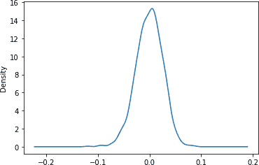
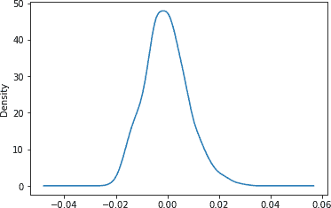
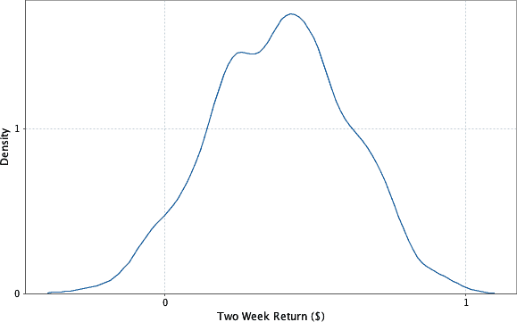

# 第八章：金融风险估算

在投资金融市场时，您能期望损失多少？这正是金融统计量*风险价值*（VaR）试图衡量的数量。VaR 是一种简单的投资风险度量，试图提供关于投资组合在特定时间段内最大潜在损失的合理估计。VaR 统计量取决于三个参数：一个投资组合、一个时间段和一个概率。例如，具有 5%概率和两周的$1 百万 VaR 值表示相信，在两周内，投资组合仅有 5%的概率损失超过$1 百万。

自 1987 年股市崩盘后不久的发展以来，VaR 已被广泛应用于金融服务组织中。该统计量通过帮助确定其战略的风险特征，在这些机构的管理中发挥着关键作用。

许多估算此统计量的最复杂方法依赖于在随机条件下进行计算密集型市场模拟。这些方法背后的技术称为蒙特卡洛模拟，涉及提出数千甚至数百万个随机市场场景，并观察它们如何倾向于影响投资组合。这些场景被称为*试验*。PySpark 是进行蒙特卡洛模拟的理想工具。PySpark 能够利用数千个核心来运行随机试验并汇总它们的结果。作为通用的数据转换引擎，它还擅长执行围绕模拟的预处理和后处理步骤。它可以将原始金融数据转换为执行模拟所需的模型参数，并支持对结果进行临时分析。与使用 HPC 环境的传统方法相比，其简单的编程模型可以大大缩短开发时间。

我们还将讨论如何计算称为*条件风险价值*（CVaR）的相关统计量，有时也称为*预期缺口*，几年前，巴塞尔银行监管委员会提议将其作为比 VaR 更好的风险度量。CVaR 统计量与 VaR 统计量具有相同的三个参数，但考虑的是预期平均损失，而不是提供潜在损失值。具有 5%*q 值*和两周的$5 百万 CVaR 表示相信，在最差的 5%结果中平均损失为$5 百万。

在建模 VaR 的过程中，我们将介绍一些不同的概念、方法和软件包。我们将从介绍整章中将使用的基本金融术语开始，然后学习计算 VaR 的方法，包括蒙特卡洛模拟技术。之后，我们将使用 PySpark 和 pandas 下载和准备我们的数据集。我们将使用 2000 年代末和 2010 年代初的股市数据，包括国库债券价格以及各种公司的股票价值等市场指标。在预处理完成后，我们将创建一个线性回归模型来计算股票在一段时间内的价值变化。我们还将想出一种方法，在执行蒙特卡洛模拟时生成样本市场指标值。最后，我们将使用 PySpark 执行模拟并检查我们的结果。

让我们从定义我们将使用的基本金融术语开始。

# 术语

本章使用了一组特定于金融领域的术语：

仪器

可交易资产，例如债券、贷款、期权或股票投资。在任何特定时间，仪器被认为有一个*价值*，这是它可能被出售的价格。

投资组合

金融机构拥有的一系列工具。

回报

仪器或投资组合在一段时间内价值的变化。

损失

负回报。

指数

一种虚拟的仪器投资组合。例如，纳斯达克综合指数包含约 3000 只美国和国际主要公司的股票和类似的仪器。

市场因子

可用作特定时间金融环境宏观方面指标的价值，例如一个指数的值，美国的国内生产总值，或美元与欧元之间的汇率。我们通常将市场因子简称为*factors*。

# 计算 VaR 的方法

到目前为止，我们对 VaR 的定义相对开放。估算这一统计量需要提出一个关于如何计算投资组合的模型，并选择其回报可能遵循的概率分布。机构使用多种方法来计算 VaR，这些方法大多归结为几种一般方法之下。

## 方差-协方差

*方差-协方差*是迄今为止最简单且计算量最小的方法。其模型假设每个仪器的回报是正态分布的，这允许通过分析推导出一个估计。

## 历史模拟

*历史模拟*通过直接使用其分布而不依赖于摘要统计数据来从历史数据中推断风险。例如，为了确定投资组合的 95% VaR，我们可以查看过去 100 天内该投资组合的表现，并将其统计量估计为第五差的那天的值。该方法的缺点是历史数据可能有限，并且未能包括假设情况。例如，如果我们的投资组合中的工具历史记录缺少市场崩盘，我们想要模拟在这些情况下我们的投资组合的表现会发生什么？存在使历史模拟在这些问题上更为健壮的技术，例如向数据中引入“冲击”，但我们在这里不会涉及这些技术。

## 蒙特卡罗模拟

*蒙特卡罗模拟*，本章剩余部分将重点讨论，试图通过模拟投资组合在随机条件下的表现，减弱前一种方法中的假设。当我们无法从解析上导出一个概率分布的闭合形式时，我们通常可以通过重复抽样它依赖的更简单的随机变量来估计其概率密度函数，并观察其在总体中的表现。在其最一般的形式下，这种方法：

+   定义了市场条件与每个工具收益之间的关系。这种关系采用了根据历史数据拟合的模型形式。

+   定义了市场条件的分布，可以轻松进行抽样。这些分布是根据历史数据拟合的。

+   提出由随机市场条件组成的试验。

+   计算每次试验的总投资组合损失，并使用这些损失定义损失的经验分布。这意味着如果我们进行 100 次试验并希望估计 5%的 VaR，我们将选择第五大损失的试验的损失。要计算 5%的 CVaR，我们将找出最差五次试验的平均损失。

当然，蒙特卡罗方法也并非完美无缺。它依赖于用于生成试验条件和推断仪器性能的模型，并且这些模型必须进行简化假设。如果这些假设与现实不符，那么最终的概率分布也将不准确。

# 我们的模型

蒙特卡洛风险模型通常将每个工具的回报用一组市场因素表达。常见的市场因素可能是诸如标准普尔 500 指数、美国 GDP 或货币汇率等的指数值。然后，我们需要一个模型，根据这些市场条件预测每个工具的回报。在我们的模拟中，我们将使用一个简单的线性模型。根据我们之前对回报的定义，*因子回报*是一个特定时间内市场因素值的变化。例如，如果标准普尔 500 指数从 2000 上升到 2100，其回报将是 100。我们将从因子回报的简单转换中派生一组特征。也就是说，试验*t*中的市场因素向量*m[t]*通过某个函数ϕ转换，产生可能不同长度的特征向量*f[t]*：

+   *f[t] = ϕ(m[t])*

对于每个工具，我们将训练一个模型，为每个特征分配一个权重。要计算*r[it]*，即试验*t*中工具*i*的回报，我们使用*c[i]*，工具的截距项；*w[ij]*，工具*i*上特征*j*的回归权重；以及*f[tj]*，试验*t*中特征*j*的随机生成值：

<math alttext="r Subscript i t Baseline equals c Subscript i Baseline plus sigma-summation Underscript j equals 1 Overscript StartAbsoluteValue w Subscript i Baseline EndAbsoluteValue Endscripts w Subscript i j Baseline asterisk f Subscript t j" display="block"><mrow><msub><mi>r</mi> <mrow><mi>i</mi><mi>t</mi></mrow></msub> <mo>=</mo> <msub><mi>c</mi> <mi>i</mi></msub> <mo>+</mo> <munderover><mo>∑</mo> <mrow><mi>j</mi><mo>=</mo><mn>1</mn></mrow> <mrow><mrow><mo>|</mo></mrow><msub><mi>w</mi> <mi>i</mi></msub> <mrow><mo>|</mo></mrow></mrow></munderover> <msub><mi>w</mi> <mrow><mi>i</mi><mi>j</mi></mrow></msub> <mo>*</mo> <msub><mi>f</mi> <mrow><mi>t</mi><mi>j</mi></mrow></msub></mrow></math>

这意味着每个工具的回报被计算为市场因素特征的回报之和，乘以它们在该工具上的权重。我们可以使用历史数据为每个工具拟合线性模型（也称为进行线性回归）。如果 VaR 计算的视野是两周，那么回归将历史上每个（重叠的）两周区间视为一个标记点。

值得一提的是，我们本可以选择更复杂的模型。例如，模型不必是线性的：它可以是回归树，或者明确地结合领域特定的知识。

现在，我们有了计算市场因素导致的工具损失的模型，我们需要一个过程来模拟市场因素的行为。一个简单的假设是，每个市场因素的回报都遵循正态分布。为了捕捉市场因素通常相关的事实——当纳斯达克下跌时，道琼斯也可能在受苦——我们可以使用带有非对角协方差矩阵的多元正态分布：

<math alttext="m Subscript t Baseline tilde script upper N left-parenthesis mu comma normal upper Sigma right-parenthesis" display="block"><mrow><msub><mi>m</mi> <mi>t</mi></msub> <mo>∼</mo> <mi>𝒩</mi> <mrow><mo>(</mo> <mi>μ</mi> <mo>,</mo> <mi>Σ</mi> <mo>)</mo></mrow></mrow></math>

其中μ是因素回报的经验均值向量，Σ是因素回报的经验协方差矩阵。

与之前一样，我们本可以选择更复杂的模拟市场的方法，或者假设每个市场因素的分布类型不同，也许使用具有更厚尾部的分布。

# 获取数据

下载历史股价数据集，并将其放置在*data/stocks/*目录中：

```
$ mkdir stocks && cd stocks
$ url="https://raw.githubusercontent.com/ \
 sryza/aas/master/ch09-risk/data/stocks.zip"
$ wget $url
$ unzip stocks.zip
```

很难找到大量格式良好的历史价格数据。本章中使用的数据集是从 Yahoo!下载的。

我们还需要风险因素的历史数据。对于我们的因素，我们将使用以下值：

+   iShares 20 Plus Year Treasury Bond ETF (NASDAQ: TLT)

+   iShares 美国信用债券 ETF（NYSEArca: CRED）

+   SPDR 黄金信托基金（NYSEArca: GLD）

下载并放置因子数据：

```
$ cd .. && mkdir factors && cd factors
$ url2 = "https://raw.githubusercontent.com/ \
 sryza/aas/master/ch09-risk/data/factors.zip"
$ wget $url2
$ unzip factors.zip
$ ls factors
...

NASDAQ%3ATLT.csv  NYSEARCA%3ACRED.csv  NYSEARCA%3AGLD.csv
```

让我们看看我们的一个因子：

```
$ !head -n 5 data/factors/NASDAQ%3ATLT.csv
...

Date,Open,High,Low,Close,Volume
31-Dec-13,102.29,102.55,101.17,101.86,7219195
30-Dec-13,102.15,102.58,102.08,102.51,4491711
27-Dec-13,102.07,102.31,101.69,101.81,4755262
26-Dec-13,102.35,102.36,102.01,102.10,4645323
24-Dec-13,103.23,103.35,102.80,102.83,4897009
```

下载完我们的数据集后，现在我们将对其进行准备。

# 准备数据

雅虎格式的 GOOGL 数据的前几行如下所示：

```
$ !head -n 5 data/stocks/GOOGL.csv
...

Date,Open,High,Low,Close,Volume
31-Dec-13,556.68,561.06,553.68,560.92,1358300
30-Dec-13,560.73,560.81,555.06,555.28,1236709
27-Dec-13,560.56,560.70,557.03,559.76,1570140
26-Dec-13,557.56,560.06,554.90,559.29,1338507
24-Dec-13,558.04,558.18,554.60,556.48,734170
```

让我们启动 PySpark shell：

```
$ pyspark --driver-memory 4g
```

将仪器数据集作为 DataFrame 读取：

```
stocks = spark.read.csv("data/stocks/", header='true', inferSchema='true')

stocks.show(2)
...

+----------+----+----+----+-----+------+
|      Date|Open|High| Low|Close|Volume|
+----------+----+----+----+-----+------+
|2013-12-31|4.40|4.48|3.92| 4.07|561247|
|2013-12-30|3.93|4.42|3.90| 4.38|550358|
+----------+----+----+----+-----+------+
```

DataFrame 缺少仪器符号。让我们使用对应每行的输入文件名添加它：

```
from pyspark.sql import functions as fun

stocks = stocks.withColumn("Symbol", fun.input_file_name()).\
                withColumn("Symbol",
                  fun.element_at(fun.split("Symbol", "/"), -1)).\
                withColumn("Symbol",
                  fun.element_at(fun.split("Symbol", "\."), 1))

stocks.show(2)
...
+---------+-------+-------+-------+-------+------+------+
|     Date|   Open|   High|    Low|  Close|Volume|Symbol|
+---------+-------+-------+-------+-------+------+------+
|31-Dec-13|1884.00|1900.00|1880.00| 1900.0|   546|  CLDN|
|30-Dec-13|1889.00|1900.00|1880.00| 1900.0|  1656|  CLDN|
+---------+-------+-------+-------+-------+------+------+
```

我们将以类似的方式读取并处理因子数据集：

```
factors = spark.read.csv("data/factors", header='true', inferSchema='true')
factors = factors.withColumn("Symbol", fun.input_file_name()).\
                  withColumn("Symbol",
                    fun.element_at(fun.split("Symbol", "/"), -1)).\
                  withColumn("Symbol",
                    fun.element_at(fun.split("Symbol", "\."), 1))
```

我们过滤掉历史少于五年的仪器：

```
from pyspark.sql import Window

stocks = stocks.withColumn('count', fun.count('Symbol').\
                over(Window.partitionBy('Symbol'))).\
                filter(fun.col('count') > 260*5 + 10)
```

不同类型的仪器可能在不同的日子交易，或者数据可能由于其他原因存在缺失值，因此确保我们的不同历史记录对齐非常重要。首先，我们需要将所有时间序列剪裁到同一时间段。为此，我们将首先将`Date`列的类型从字符串转换为日期：

```
stocks = stocks.withColumn('Date',
                  fun.to_date(fun.to_timestamp(fun.col('Date'),
                                              'dd-MM-yy')))
stocks.printSchema()
...
root
 |-- Date: date (nullable = true)
 |-- Open: string (nullable = true)
 |-- High: string (nullable = true)
 |-- Low: string (nullable = true)
 |-- Close: double (nullable = true)
 |-- Volume: string (nullable = true)
 |-- Symbol: string (nullable = true)
 |-- count: long (nullable = false)
```

让我们将仪器的时间期限调整对齐：

```
from datetime import datetime

stocks = stocks.filter(fun.col('Date') >= datetime(2009, 10, 23)).\
                filter(fun.col('Date') <= datetime(2014, 10, 23))
```

我们还将在因子 DataFrame 中转换`Date`列的类型并调整时间段：

```
factors = factors.withColumn('Date',
                              fun.to_date(fun.to_timestamp(fun.col('Date'),
                                                          'dd-MMM-yy')))

factors = factors.filter(fun.col('Date') >= datetime(2009, 10, 23)).\
                  filter(fun.col('Date') <= datetime(2014, 10, 23))
```

几千种仪器和三个因子的历史数据足够小，可以在本地读取和处理。即使是包含数十万个仪器和数千个因子的更大型模拟，情况也是如此。尽管我们迄今为止使用 PySpark 对数据进行预处理，但当我们实际运行模拟时，如 PySpark 这样的分布式系统的需求变得迫切，因为每个仪器可能需要大量计算。我们可以将 PySpark 的 DataFrame 转换为 pandas 的 DataFrame，仍然可以通过内存操作轻松地继续使用它。

```
stocks_pd_df = stocks.toPandas()
factors_pd_df = factors.toPandas()

factors_pd_df.head(5)
...
 	Date 	Open 	High 	Low 	Close 	Volume 	Symbol
0 	2013-12-31 	102.29 	102.55 	101.17 	101.86 	7219195
    NASDAQ%253ATLT
1 	2013-12-30 	102.15 	102.58 	102.08 	102.51 	4491711
    NASDAQ%253ATLT
2 	2013-12-27 	102.07 	102.31 	101.69 	101.81 	4755262
    NASDAQ%253ATLT
3 	2013-12-26 	102.35 	102.36 	102.01 	102.10 	4645323
    NASDAQ%253ATLT
4 	2013-12-24 	103.23 	103.35 	102.80 	102.83 	4897009
    NASDAQ%253ATLT
```

我们将在下一节中使用这些 pandas 数据框架，试图拟合一个线性回归模型，以预测基于因子回报的仪器回报。

# 确定因子权重

记住 VaR 处理的是*特定时间范围内*的损失。我们关注的不是仪器的绝对价格，而是这些价格在给定时间段内的波动。在我们的计算中，我们将将这个长度设置为两周。以下函数利用 pandas 的`rolling`方法将价格时间序列转换为重叠的两周价格变动序列。请注意，我们使用 10 而不是 14 来定义窗口，因为金融数据不包括周末：

```
n_steps = 10
def my_fun(x):
    return ((x.iloc[-1] - x.iloc[0]) / x.iloc[0])

stock_returns = stocks_pd_df.groupby('Symbol').Close.\
                            rolling(window=n_steps).apply(my_fun)
factors_returns = factors_pd_df.groupby('Symbol').Close.\\
                            rolling(window=n_steps).apply(my_fun)

stock_returns = stock_returns.reset_index().\
                              sort_values('level_1').\
                              reset_index()
factors_returns = factors_returns.reset_index().\
                                  sort_values('level_1').\
                                  reset_index()
```

有了这些回报历史数据，我们可以开始实现对仪器回报进行预测模型的目标。对于每个仪器，我们希望建立一个模型，根据相同时间段内因子的回报来预测其两周回报。为简单起见，我们将使用线性回归模型。

为了模拟仪器收益可能是因子收益的非线性函数的事实，我们可以在我们的模型中包含一些额外的特征，这些特征是从因子收益的非线性转换中导出的。例如，我们将为每个因子收益添加一个额外的特征：平方。我们的模型仍然是一个线性模型，因为响应变量是特征的线性函数。一些特征恰好是由因子收益的非线性函数确定的。请记住，这种特定的特征转换旨在演示一些可用的选项，不应被视为预测金融建模中的最新实践。

```
# Create combined stocks DF
stocks_pd_df_with_returns = stocks_pd_df.\
                              assign(stock_returns = \
                                    stock_returns['Close'])

# Create combined factors DF
factors_pd_df_with_returns = factors_pd_df.\
                              assign(factors_returns = \
                                    factors_returns['Close'],
                                    factors_returns_squared = \
                                    factors_returns['Close']**2)

factors_pd_df_with_returns = factors_pd_df_with_returns.\
                                pivot(index='Date',
                                      columns='Symbol',
                                      values=['factors_returns', \
                                              'factors_returns_squared']) 

factors_pd_df_with_returns.columns = factors_pd_df_with_returns.\
                                        columns.\
                                        to_series().\
                                        str.\
                                        join('_').\
                                        reset_index()[0]  

factors_pd_df_with_returns = factors_pd_df_with_returns.\
                                reset_index()

print(factors_pd_df_with_returns.head(1))
...
0        Date  factors_returns_NASDAQ%253ATLT  \ 0  2009-10-23                         0.01834

0  factors_returns_NYSEARCA%253ACRED
0                          -0.006594

0 factors_returns_NYSEARCA%253AGLD  \ 0                       - 0.032623

0  factors_returns_squared_NASDAQ%253ATLT  \ 0                                0.000336

0  factors_returns_squared_NYSEARCA%253ACRED  \ 0                                   0.000043

0  factors_returns_squared_NYSEARCA%253AGLD
0                                  0.001064
...

print(factors_pd_df_with_returns.columns)
...
Index(['Date', 'factors_returns_NASDAQ%253ATLT',
       'factors_returns_NYSEARCA%253ACRED', 'factors_returns_NYSEARCA%253AGLD',
       'factors_returns_squared_NASDAQ%253ATLT',
       'factors_returns_squared_NYSEARCA%253ACRED',
       'factors_returns_squared_NYSEARCA%253AGLD'],
      dtype='object', name=0)
...
```


将因子数据框从长格式转换为宽格式，以便每个周期的所有因子都在一行中


展平多级索引数据框并修复列名

即使我们将进行许多回归分析——每个仪器一个——但每个回归中的特征数和数据点都很少，这意味着我们不需要使用 PySpark 的分布式线性建模能力。相反，我们将使用 scikit-learn 包提供的普通最小二乘回归：

```
from sklearn.linear_model import LinearRegression

# For each stock, create input DF for linear regression training

stocks_factors_combined_df = pd.merge(stocks_pd_df_with_returns,
                                      factors_pd_df_with_returns,
                                      how="left", on="Date")

feature_columns = list(stocks_factors_combined_df.columns[-6:])

with pd.option_context('mode.use_inf_as_na', True):
    stocks_factors_combined_df = stocks_factors_combined_df.\
                                    dropna(subset=feature_columns \
                                            + ['stock_returns'])

def find_ols_coef(df):
    y = df[['stock_returns']].values
    X = df[feature_columns]

    regr = LinearRegression()
    regr_output = regr.fit(X, y)

    return list(df[['Symbol']].values[0]) + \
                list(regr_output.coef_[0])

coefs_per_stock = stocks_factors_combined_df.\
                      groupby('Symbol').\
                      apply(find_ols_coef)

coefs_per_stock = pd.DataFrame(coefs_per_stock).reset_index()
coefs_per_stock.columns = ['symbol', 'factor_coef_list']

coefs_per_stock = pd.DataFrame(coefs_per_stock.\
                                factor_coef_list.tolist(),
                                index=coefs_per_stock.index,
                                columns = ['Symbol'] + feature_columns)

coefs_per_stock
```

现在我们有了一个数据框，其中每一行都是一个仪器的模型参数集（系数、权重、协变量、回归变量，或者你希望称呼它们的任何东西）。

在任何真实的管道中的这一点上，了解这些模型对数据的拟合程度是很有用的。因为数据点来自时间序列，特别是时间间隔重叠，样本很可能是自相关的。这意味着常见的测量如 *R*² 很可能会高估模型对数据的拟合程度。[Breusch-Godfrey test](https://oreil.ly/9cwg6) 是评估这些效应的标准测试。评估模型的一种快速方法是将时间序列分成两组，留出足够的中间数据点，以使较早集合中的最后点与较晚集合中的第一点不自相关。然后在一组上训练模型，并查看其在另一组上的误差。

现在我们手头有了将因子收益映射到仪器收益的模型，接下来我们需要一个过程来通过生成随机因子收益来模拟市场条件。这就是我们接下来要做的。

# 抽样

为了想出一种生成随机因子收益的方法，我们需要决定因子收益向量上的概率分布，并从中抽样。数据实际上采用什么分布？从视觉上回答这类问题通常是有用的。

可视化连续数据上的概率分布的一种好方法是密度图，它绘制了分布的定义域与其概率密度函数。因为我们不知道支配数据的分布，所以我们没有一个可以在任意点给出其密度的方程，但我们可以通过一种称为*核密度估计*（KDE）的技术来近似它。在松散的方式中，核密度估计是一种平滑直方图的方法。它在每个数据点处将概率分布（通常是正态分布）居中。因此，一组两周回报样本将导致多个正态分布，每个分布具有不同的均值。为了在给定点估计概率密度，它评估该点处所有正态分布的概率密度函数并取它们的平均值。核密度图的平滑程度取决于其*带宽*，即每个正态分布的标准差。

我们将使用 pandas DataFrame 的内置方法之一来计算并绘制 KDE 图。以下代码片段创建了一个因子的密度图：

```
samples = factors_returns.loc[factors_returns.Symbol == \
                              factors_returns.Symbol.unique()[0]]['Close']
samples.plot.kde()
```

图 8-1 展示了我们历史上两周 20+年期国库券 ETF 回报的分布（概率密度函数）。



###### 图 8-1\. 两周 20+年期国库券 ETF 分布

图 8-2 展示了美国信用债券两周收益的相同情况。



###### 图 8-2\. 美国信用债券 ETF 两周回报分布

我们将为每个因子的回报拟合正态分布。寻找一个更接近数据的更奇特分布，也许是具有更胖尾巴的分布，通常是值得的。然而，出于简化起见，我们将避免通过这种方式调整我们的模拟。

抽样因子回报的最简单方法是将正态分布拟合到每个因子，并从这些分布中独立抽样。然而，这忽略了市场因素通常相关的事实。如果国库券 ETF 下跌，信用债券 ETF 也可能下跌。不考虑这些相关性可能会使我们对我们的风险配置有一个比实际情况更乐观的看法。我们的因子回报是否相关？pandas 中的 Pearson 相关实现可以帮助我们找出：

```
f_1 = factors_returns.loc[factors_returns.Symbol == \
                          factors_returns.Symbol.unique()[0]]['Close']
f_2 = factors_returns.loc[factors_returns.Symbol == \
                          factors_returns.Symbol.unique()[1]]['Close']
f_3 = factors_returns.loc[factors_returns.Symbol == \
                          factors_returns.Symbol.unique()[2]]['Close']

pd.DataFrame({'f1': list(f_1), 'f2': list(f_2), 'f3': list(f_3)}).corr()
...

         f1 	   f2 	    f3
f1 	1.000000 	0.530550 	0.074578
f2 	0.530550 	1.000000 	0.206538
f3 	0.074578 	0.206538 	1.000000
```

因为我们对角线之外有非零元素，看起来不像是这样。

## 多元正态分布

多元正态分布可以通过考虑因素之间的相关信息来帮助。来自多元正态分布的每个样本都是一个向量。给定所有维度但一个维度的值，沿该维度的值的分布是正态的。但是，在它们的联合分布中，变量不是独立的。

多元正态分布是用每个维度的均值和描述每对维度之间协方差的矩阵参数化的。对于 *N* 维度，协方差矩阵是 *N* 行 *N* 列，因为我们希望捕捉每对维度之间的协方差关系。当协方差矩阵是对角线时，多元正态分布减少到独立沿每个维度抽样，但在非对角线上放置非零值有助于捕捉变量之间的关系。

VaR 文献经常描述了一个步骤，其中因子权重被转换（去相关化），以便进行抽样。通常使用 Cholesky 分解或特征分解来实现这一点。NumPy 包的`MultivariateNormalDistribution`在幕后使用特征分解为我们处理这一步。

要将多元正态分布拟合到我们的数据中，首先我们需要找到其样本均值和协方差：

```
factors_returns_cov = pd.DataFrame({'f1': list(f_1),
                                    'f2': list(f_2[:-1]),
                                    'f3': list(f_3[:-2])})\
                                    .cov().to_numpy()
factors_returns_mean = pd.DataFrame({'f1': list(f_1),
                                     'f2': list(f_2[:-1]),
                                     'f3': list(f_3[:-2])}).\
                                     mean()
```

然后我们可以简单地创建一个由它们参数化的分布，并从中抽样一组市场条件：

```
from numpy.random import multivariate_normal

multivariate_normal(factors_returns_mean, factors_returns_cov)
...
array([ 0.02234821,  0.01838763, -0.01107748])
```

通过每个仪器模型和抽样因子回报的过程，我们现在具备运行实际试验所需的条件。让我们开始模拟并运行试验。

# 运行试验

由于运行试验的计算密集型，我们将求助于 PySpark 来帮助我们并行化它们。在每次试验中，我们希望抽样一组风险因素，用它们来预测每个仪器的回报，并总结所有这些回报以找到完整的试验损失。为了获得代表性分布，我们希望运行数千或数百万次这样的试验。

我们有几种选择来并行化模拟。我们可以沿着试验、仪器或两者并行化。要沿两者并行化，我们将创建一个仪器数据集和一个试验参数数据集，然后使用`crossJoin`转换来生成所有配对的数据集。这是最一般的方法，但它有几个缺点。首先，它需要显式创建一个试验参数的 DataFrame，我们可以通过使用一些随机种子的技巧来避免这一点。其次，它需要进行洗牌操作。

按仪器进行分区可能看起来像这样：

```
random_seed = 1496
instruments_dF = ...
def trialLossesForInstrument(seed, instrument):
  ...

instruments_DF.rdd.\
  flatMap(trialLossesForInstrument(random_seed, _)).\
  reduceByKey(_ + _)
```

采用这种方法，数据被分区到仪器的 DataFrame 中，对于每个仪器，`flatMap`转换计算并产生相应的每个试验的损失。在所有任务中使用相同的随机种子意味着我们将生成相同的试验序列。`reduceByKey`将所有对应相同试验的损失总和在一起。这种方法的一个缺点是仍然需要对 *O*(|instruments| * |trials|) 的数据进行洗牌。

我们数千种工具的模型数据足够小，可以放入每个执行器的内存中，一些粗略的计算显示，即使是数百万种工具和数百个因子，情况可能仍然如此。一百万个工具乘以 500 个因子乘以每个因子权重所需的 8 字节，大约等于 4 GB，足够小，可以放入大多数现代集群机器上的每个执行器中。这意味着一个好的选项是将工具数据分布为广播变量。每个执行器都拥有工具数据的完整副本的优势在于，每次试验的总损失可以在单台机器上计算。不需要聚合。我们还广播了一些其他用于计算试验回报所需的数据。

```
b_coefs_per_stock = spark.sparkContext.broadcast(coefs_per_stock)
b_feature_columns = spark.sparkContext.broadcast(feature_columns)
b_factors_returns_mean = spark.sparkContext.broadcast(factors_returns_mean)
b_factors_returns_cov = spark.sparkContext.broadcast(factors_returns_cov)
```

使用分区试验方法（我们将使用此方法），我们从种子数据框开始。我们希望每个分区中都有不同的种子，以便每个分区生成不同的试验：

```
from pyspark.sql.types import IntegerType

parallelism = 1000
num_trials = 1000000
base_seed = 1496

seeds = [b for b in range(base_seed,
                          base_seed + parallelism)]
seedsDF = spark.createDataFrame(seeds, IntegerType())

seedsDF = seedsDF.repartition(parallelism)
```

随机数生成是一个耗时且需要大量 CPU 资源的过程。虽然我们这里没有采用这个技巧，但通常预先生成一组随机数并在多个作业中使用是非常有用的。不应在单个作业内使用相同的随机数，因为这会违反蒙特卡洛假设，即随机值是独立分布的。

对于每个种子，我们希望生成一组试验参数，并观察这些参数对所有工具的影响。我们将编写一个函数，用于计算多次试验中工具的全面回报。我们首先简单地应用我们之前为每个工具训练过的线性模型。然后我们对所有工具的回报进行平均。这假设我们在投资组合中持有每种工具的等值。如果我们持有每支股票的数量不同，则会使用加权平均。最后，在每个任务中需要生成一堆试验。由于选择随机数是过程的重要部分，使用强大的随机数生成器非常重要。Python 内置的`random`库包括一个梅森旋转器实现，非常适合这个目的。我们用它来从之前描述的多变量正态分布中进行抽样：

```
import random

from pyspark.sql.types import LongType, ArrayType
from pyspark.sql.functions import udf

def calculate_trial_return(x):
#     return x
    trial_return_list = []

    for i in range(num_trials/parallelism):
        random_int = random.randint(0, num_trials*num_trials)

        seed(x)

        random_factors = multivariate_normal(b_factors_returns_mean.value,
          b_factors_returns_cov.value)

        coefs_per_stock_df = b_coefs_per_stock.value
        returns_per_stock = coefs_per_stock_df[b_feature_columns.value] *
          (list(random_factors) + list(random_factors**2))

        trial_return_list.append(float(returns_per_stock.sum(axis=1).sum()/b_coefs_
          per_stock.value.size))

    return trial_return_list

udf_return = udf(calculate_trial_return, ArrayType(DoubleType()))
```

随着我们的脚手架完成，我们可以使用它来计算一个数据框，其中每个元素都是单次试验的总回报：

```
from pyspark.sql.functions import col, explode

trials = seedsDF.withColumn("trial_return", udf_return(col("value")))
trials = trials.select('value', explode('trial_return')) 

trials.cache()
```


将试验回报的分割数组拆分为单独的数据框行

如果您还记得，我们一直在处理所有这些数字的原因是为了计算 VaR。`trials` 现在形成了一个投资组合回报的经验分布。要计算 5%的 VaR，我们需要找到一个我们预计在 5%的时间内表现不佳的回报，以及一个我们预计在 95%的时间内表现优异的回报。通过我们的经验分布，这简单地意味着找到那些比 5%的 trials 更差的值，以及比 95%的 trials 更好的值。我们可以通过将最差的 5%的 trials 拉到驾驶员中来实现这一点。我们的 VaR 是这个子集中最佳试验的回报：

```
trials.approxQuantile('trial_return', [0.05], 0.0)
...
-0.010831826593164014
```

我们可以使用几乎相同的方法找到 CVaR。与从最差的 5%的试验中获取最佳试验回报不同，我们从该组试验中获取回报的平均值：

```
trials.orderBy(col('trial_return').asc()).\
  limit(int(trials.count()/20)).\
  agg(fun.avg(col("trial_return"))).show()
...
+--------------------+
|   avg(trial_return)|
+--------------------+
|-0.09002629251426077|
+--------------------+
```

# 可视化回报分布

除了在特定置信水平下计算 VaR 外，查看回报分布的更全面画面也很有用。它们是否呈正态分布？它们是否在极端处出现尖峰？正如我们为个体因素所做的那样，我们可以使用核密度估计来绘制联合概率分布的概率密度函数的估计（见图 8-3）：

```
trials.plot.kde()
```



###### 图 8-3\. 两周回报分布

# 接下来该如何进行

这个练习中提出的模型是实际金融机构中使用的第一个粗糙版本。在建立准确的 VaR 模型时，我们忽略了一些非常重要的步骤。筛选市场因素集合可以使模型成功或失败，金融机构在其模拟中通常会纳入数百个因素。选择这些因素需要在历史数据上运行大量实验和大量创意。选择将市场因素映射到工具回报的预测模型也很重要。虽然我们使用了简单的线性模型，但许多计算使用非线性函数或通过布朗运动模拟随时间的路径。

最后，值得注意的是，用于模拟因子回报的分布需要仔细考虑。Kolmogorov-Smirnov 检验和卡方检验对于测试经验分布的正态性非常有用。Q-Q 图对于直观比较分布也很有用。通常，金融风险更好地通过具有比我们使用的正态分布更大尾部的分布来反映。混合正态分布是实现这些更大尾部的一种好方法。马克斯·哈斯和克里斯蒂安·皮戈尔施的文章“《金融经济学，厚尾分布》”（[`oreil.ly/XSxhB`](https://oreil.ly/XSxhB)）提供了关于其他厚尾分布的良好参考。

银行使用 PySpark 和大规模数据处理框架来计算历史方法下的 VaR。["使用历史数据评估风险价值模型"](https://oreil.ly/0JoXu)，作者 Darryll Hendricks，提供了对历史 VaR 方法的概述和性能比较。

蒙特卡罗风险模拟不仅可以用于计算单一统计数据。其结果可以通过塑造投资决策来主动减少投资组合的风险。例如，如果在表现最差的试验中，某一类工具反复出现亏损，我们可以考虑将这些工具从投资组合中剔除，或者增加那些与其运动方向相反的工具。
