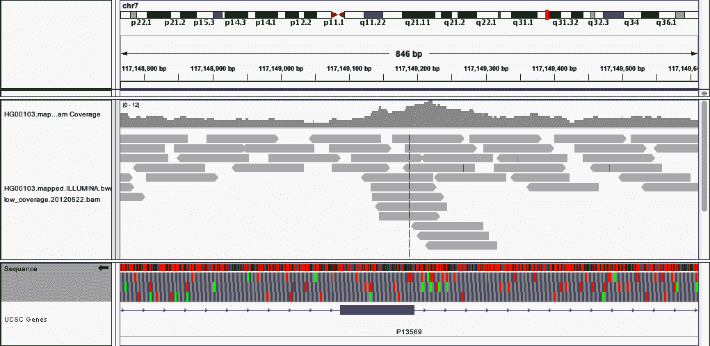

# 第九章：分析基因组数据和 BDG 项目

下一代 DNA 测序（NGS）技术的出现迅速将生命科学转变为数据驱动的领域。然而，最好利用这些数据的问题正在于传统的计算生态系统，它基于难以使用的低级别分布式计算基元和半结构化文本文件格式的丛林。

本章将有两个主要目的。首先，我们介绍了一组流行的序列化和文件格式（Avro 和 Parquet），这些格式简化了数据管理中的许多问题。这些序列化技术使我们能够将数据转换为紧凑的、机器友好的二进制表示。这有助于在网络中传输数据，并帮助在不同编程语言之间实现交叉兼容。虽然我们将这些序列化技术应用于基因组数据，但这些概念在处理大量数据时也是有用的。

其次，我们展示了如何在 PySpark 生态系统中执行典型的基因组任务。具体来说，我们将使用 PySpark 和开源 ADAM 库来操作大量的基因组数据，并处理来自多个来源的数据，创建一个用于预测转录因子（TF）结合位点的数据集。为此，我们将从[ENCODE 数据集](https://oreil.ly/h0yOq)中加入基因组注释。本章将作为 ADAM 项目的教程，该项目包括一组专用于基因组的 Avro 模式、基于 PySpark 的 API 以及用于大规模基因组分析的命令行工具。除了其他应用程序外，ADAM 还提供了使用 PySpark 的[基因组分析工具包（GATK）](https://oreil.ly/k2YZH)的本地分布式实现。

我们将首先讨论生物信息学领域使用的各种数据格式，相关挑战以及序列化格式如何帮助。然后，我们将安装 ADAM 项目，并使用示例数据集探索其 API。然后，我们将使用多个基因组数据集准备一个用于预测 DNA 序列中特定类型蛋白质（CTCF 转录因子）结合位点的数据集。这些数据集将从公开可用的 ENCODE 数据集获取。由于基因组暗示了一个一维坐标系，许多基因组操作具有空间性质。ADAM 项目提供了一个面向基因组的 API，用于执行我们将使用的分布式空间连接。

对于那些感兴趣的人，生物学的一个很好的入门课程是[Eric Lander 的 EdX 课程](https://oreil.ly/WIky1)。想要了解生物信息学的人，可以参考 Arthur Lesk 的《生物信息学导论》（牛津大学出版社）。

# 解耦存储和建模

生物信息学家在处理文件格式上花费了大量时间，如*.fasta*, *.fastq*, *.sam*, *.bam*, *.vcf*, *.gvcf*, *.bcf*, *.bed*, *.gff*, *.gtf*, *.narrowPeak*, *.wig*, *.bigWig*, *.bigBed*, *.ped*, 和 *.tped*等等。一些科学家还觉得有必要为他们的自定义工具指定自己的自定义格式。此外，许多格式规范都是不完整或不明确的（这使得确保实现的一致性或合规性变得困难），并且指定 ASCII 编码数据。ASCII 数据在生物信息学中非常常见，但效率低且相对难以压缩。此外，数据必须始终被解析，需要额外的计算周期。

这特别令人困扰，因为所有这些文件格式本质上都只存储几种常见的对象类型：对齐的序列读取，调用的基因型，序列特征和表型。（在基因组学中，“序列特征”这个术语略有重载，但在本章中，我们指的是 UCSC 基因组浏览器轨迹的元素意义上的内容。）像[`biopython`](http://biopython.org)这样的库非常受欢迎，因为它们充斥着解析器（例如`Bio.SeqIO`），试图将所有文件格式读入少数常见的内存模型中（例如`Bio.Seq`，`Bio.SeqRecord`，`Bio.SeqFeature`）。

我们可以通过像 Apache Avro 这样的序列化框架一次性解决所有这些问题。关键在于 Avro 将数据模型（即显式模式）与底层存储文件格式以及语言的内存表示分离开来。Avro 指定了如何在不同进程之间传递特定类型的数据，无论是在互联网上运行的进程之间，还是尝试将数据写入特定文件格式的进程中。例如，使用 Avro 的 Java 程序可以将数据写入与 Avro 数据模型兼容的多种底层文件格式中。这使得每个进程都不必再担心与多种文件格式的兼容性：进程只需要知道如何读取 Avro，而文件系统则需要知道如何提供 Avro。

让我们以序列特征为例。我们首先使用 Avro 接口定义语言（IDL）为对象指定所需的模式：

```
enum Strand {
  Forward,
  Reverse,
  Independent
}

record SequenceFeature {
  string featureId;
  string featureType; 
  string chromosome;
  long startCoord;
  long endCoord;
  Strand strand;
  double value;
  map<string> attributes;
}
```


例如，“保护”，“蜈蚣”，“基因”

此数据类型可以用来编码基因组中特定位置的保守水平、启动子或核糖体结合位点的存在、转录因子结合位点等。可以将其视为 JSON 的二进制版本，但更为受限且性能更高。根据特定的数据模式，Avro 规范确定对象的精确二进制编码，以便可以在不同编程语言中的进程之间（甚至是不同编程语言中的进程）、通过网络或存储到磁盘进行轻松通信。Avro 项目包括用于处理来自多种语言的 Avro 编码数据的模块，包括 Java、C/C++、Python 和 Perl；然后，语言可以自由选择以最有利的方式将对象存储在内存中。数据建模与存储格式的分离提供了另一层灵活性/抽象；Avro 数据可以存储为 Avro 序列化的二进制对象（Avro 容器文件）、为快速查询存储为列式文件格式（Parquet 文件）或以文本 JSON 数据的方式存储以获得最大灵活性（最小效率）。最后，Avro 支持模式演化，允许用户在需要时添加新字段，而软件可以优雅地处理新旧版本的模式。

总体而言，Avro 是一种高效的二进制编码，允许您指定可演变的数据模式，从许多编程语言处理相同的数据，并使用多种格式存储数据。决定使用 Avro 模式存储数据使您摆脱了不断使用越来越多自定义数据格式的困扰，同时提高了计算性能。

在前面示例中使用的特定的 `SequenceFeature` 模型对于真实数据来说有些简单，但是大数据基因组学（BDG）项目已经定义了 Avro 模式来表示以下对象，以及许多其他对象：

+   `AlignmentRecord` 表示读取时的对齐记录。

+   `Variant` 表示已知的基因组变异和元数据。

+   `Genotype` 表示特定位点上的基因型。

+   `Feature` 表示基因组片段上的序列特征（注释）。

实际的模式可以在 [bdg-formats GitHub 仓库](https://oreil.ly/gCf1f) 中找到。BDG 格式可以替代广泛使用的“传统”格式（如 BAM 和 VCF），但更常见的是作为高性能的“中间”格式。（这些 BDG 格式最初的目标是取代 BAM 和 VCF 的使用，但它们顽固的普遍性使得这个目标变得难以实现。）相对于自定义的 ASCII 标准，Avro 提供了许多性能和数据建模的优势。

在本章的其余部分，我们将使用一些 BDG 模式来完成一些典型的基因组学任务。在此之前，我们需要安装 ADAM 项目。这将在下一节中进行。

# 设置 ADAM

BDG 的核心基因组工具集称为 ADAM。从一组映射读取开始，此核心包括可以执行标记重复、基质质量分数校正、插入缺失实线和变异调用等任务的工具。ADAM 还包含一个命令行界面，用于简化使用。与传统的 HPC 工具不同，ADAM 可以在集群中自动并行化，无需手动拆分文件或调度作业。

我们可以通过 pip 安装 ADAM 开始：

```
pip3 install bdgenomics.adam
```

可以在[GitHub 页面](https://oreil.ly/4eFnX)找到替代的安装方法。

ADAM 还附带一个提交脚本，可以方便地与 Spark 的 `spark-submit` 脚本进行交互：

```
adam-submit
...

Using ADAM_MAIN=org.bdgenomics.adam.cli.ADAMMain
Using spark-submit=/home/analytical-monk/miniconda3/envs/pyspark/bin/spark-submit

       e        888~-_         e            e    e
      d8b       888   \       d8b          d8b  d8b
     /Y88b      888    |     /Y88b        d888bdY88b
    /  Y88b     888    |    /  Y88b      / Y88Y Y888b
   /____Y88b    888   /    /____Y88b    /   YY   Y888b
  /      Y88b   888_-~    /      Y88b  /          Y888b

Usage: adam-submit [<spark-args> --] <adam-args>

Choose one of the following commands:

ADAM ACTIONS
          countKmers : Counts the k-mers/q-mers from a read dataset...
     countSliceKmers : Counts the k-mers/q-mers from a slice dataset...
 transformAlignments : Convert SAM/BAM to ADAM format and optionally...
   transformFeatures : Convert a file with sequence features into...
  transformGenotypes : Convert a file with genotypes into correspondi...
  transformSequences : Convert a FASTA file as sequences into corresp...
     transformSlices : Convert a FASTA file as slices into correspond...
   transformVariants : Convert a file with variants into correspondin...
         mergeShards : Merges the shards of a fil...
            coverage : Calculate the coverage from a given ADAM fil...
CONVERSION OPERATION
          adam2fastq : Convert BAM to FASTQ file
  transformFragments : Convert alignments into fragment records
PRIN
               print : Print an ADAM formatted fil
            flagstat : Print statistics on reads in an ADAM file...
                view : View certain reads from an alignment-record file.
```

此时，您应该能够从命令行运行 ADAM 并获得使用消息。如使用消息中所述，Spark 参数在 ADAM 特定参数之前给出。

设置好 ADAM 后，我们可以开始处理基因组数据。接下来，我们将使用一个样本数据集探索 ADAM 的 API。

# 介绍使用 ADAM 处理基因组数据的工作方式

我们将从一个包含一些映射的 *.bam* 文件开始，将其转换为相应的 BDG 格式（在这种情况下为 `AlignedRecord`），并将其保存到 HDFS 中。首先，我们获取一个合适的 *.bam* 文件：

```
# Note: this file is 16 GB
curl -O ftp://ftp.ncbi.nlm.nih.gov/1000genomes/ftp/phase3/data\
/HG00103/alignment/HG00103.mapped.ILLUMINA.bwa.GBR\
.low_coverage.20120522.bam

# or using Aspera instead (which is *much* faster)
ascp -i path/to/asperaweb_id_dsa.openssh -QTr -l 10G \
anonftp@ftp.ncbi.nlm.nih.gov:/1000genomes/ftp/phase3/data\
/HG00103/alignment/HG00103.mapped.ILLUMINA.bwa.GBR\
.low_coverage.20120522.bam .
```

将下载的文件移动到我们将存储本章所有数据的目录中：

```
mv HG00103.mapped.ILLUMINA.bwa.GBR\
.low_coverage.20120522.bam data/genomics
```

接下来，我们将使用 ADAM CLI。

## 使用 ADAM CLI 进行文件格式转换

然后，我们可以使用 ADAM 的 `transform` 命令将 *.bam* 文件转换为 Parquet 格式（在“Parquet 格式和列式存储”中描述）。这在集群和 `local` 模式下都可以工作：

```
adam-submit \
  --master yarn \ 
  --deploy-mode client \
  --driver-memory 8G \
  --num-executors 6 \
  --executor-cores 4 \
  --executor-memory 12G \
  -- \
  transform \ 
  data/genomics/HG00103.mapped.ILLUMINA.bwa.GBR\ .low_coverage.20120522.bam \
  data/genomics/HG00103
```


运行在 YARN 上的示例 Spark 参数


ADAM 子命令本身

这应该会启动大量输出到控制台，包括跟踪作业进度的 URL。

结果数据集是 *data/genomics/reads/HG00103/* 目录中所有文件的串联，每个 *part-*.parquet* 文件都是一个 PySpark 任务的输出。您还会注意到，由于列式存储，数据比初始的 *.bam* 文件（其底层是经过 gzip 压缩的）更有效地压缩（请参见“Parquet 格式和列式存储”）。

```
$ du -sh data/genomics/HG00103*bam
16G  data/genomics/HG00103\. [...] .bam

$ du -sh data/genomics/HG00103/
13G  data/genomics/HG00103
```

让我们看看这些对象在交互会话中是什么样子的。

## 使用 PySpark 和 ADAM 吸入基因组数据

首先，我们使用 ADAM 助手命令启动 PySpark shell。它会加载所有必要的 JAR 包。

```
pyadam

...

[...]
Welcome to
      ____              __
     / __/__  ___ _____/ /__
    _\ \/ _ \/ _  / __/   _/
   /__ / .__/\_,_/_/ /_/\_\   version 3.2.1
      /_/

Using Python version 3.6.12 (default, Sep  8 2020 23:10:56)
Spark context Web UI available at http://192.168.29.60:4040
Spark context available as 'sc'.
SparkSession available as 'spark'.

>>>
```

在某些情况下，当尝试在 PySpark 中使用 ADAM 时，可能会遇到 TypeError 错误，其中提到 JavaPackage 对象不存在。这是一个已知问题，详细记录在[这里](https://oreil.ly/67uBd)。

在这种情况下，请尝试在线程中建议的解决方案。例如，可以运行以下命令启动带有 ADAM 的 PySpark shell：

```
!pyspark --conf spark.serializer=org.apache.spark.
serializer.KryoSerializer --conf spark.kryo.registrator=
org.bdgenomics.adam.serialization.ADAMKryoRegistrator
--jars `find-adam-assembly.sh` --driver-class-path
`find-adam-assembly.sh`
```

现在我们将加载对齐的读取数据作为`AlignmentDataset`：

```
from bdgenomics.adam.adamContext import ADAMContext

ac = ADAMContext(spark)

readsData = ac.loadAlignments("data/HG00103")

readsDataDF = readsData.toDF()
readsDataDF.show(1, vertical=True)

...

-RECORD 0-----------------------------------------
 referenceName             | hs37d5
 start                     | 21810734
 originalStart             | null
 end                       | 21810826
 mappingQuality            | 0
 readName                  | SRR062640.14600566
 sequence                  | TCCATTCCACTCAGTTT...
 qualityScores             | /MOONNCRQPIQIKRGL...
 cigar                     | 92M8S
 originalCigar             | null
 basesTrimmedFromStart     | 0
 basesTrimmedFromEnd       | 0
 readPaired                | true
 properPair                | false
 readMapped                | false
 mateMapped                | true
 failedVendorQualityChecks | false
 duplicateRead             | false
 readNegativeStrand        | false
 mateNegativeStrand        | false
 primaryAlignment          | true
 secondaryAlignment        | false
 supplementaryAlignment    | false
 mismatchingPositions      | null
 originalQualityScores     | null
 readGroupId               | SRR062640
 readGroupSampleId         | HG00103
 mateAlignmentStart        | 21810734
 mateReferenceName         | hs37d5
 insertSize                | null
 readInFragment            | 1
 attributes                | RG:Z:SRR062640\tX...
only showing top 1 row
```

由于数据的分区可能在您的系统上不同，因此无法保证哪个读取会先返回，您可能会得到不同的读取结果。

现在我们可以与数据集互动地提出问题，同时在后台跨集群执行计算。在这个数据集中有多少读取？

```
readsData.toDF().count()
...
160397565
```

这些数据集的读取是否源自所有人类染色体？

```
unique_chr = readsDataDF.select('referenceName').distinct().collect()
unique_chr = [u.referenceName for u in unique_chr]

unique_chr.sort()
...
1
10
11
12
[...]
GL000249.1
MT
NC_007605
X
Y
hs37d5
```

是的，我们观察到来自染色体 1 到 22、X 和 Y 的读取，还有一些不属于“主”染色体的其他染色体片段或位置不明的片段。让我们更仔细地分析一下代码：

```
readsData = ac.loadAlignments("data/HG00103") 

readsDataDF = readsData.toDF() 

unique_chr = readsDataDF.select('referenceName').distinct(). \ 
              collect() 
```


`AlignmentDataset`：一种包含所有数据的 ADAM 类型。


`DataFrame`：底层 Spark DataFrame。


这将聚合所有不同的 contig 名称；这将很小。


这将触发计算并将 DataFrame 中的数据带回客户端应用程序（即 shell）。

举个临床例子，假设我们正在测试一个个体的基因组，以检查其是否携带任何会导致其子代患囊性纤维化（CF）风险基因变异。我们的基因检测使用下一代 DNA 测序从多个相关基因生成读取结果，例如 CFTR 基因（其突变可能导致 CF）。在运行数据通过我们的基因分型管道后，我们确定 CFTR 基因似乎有一个早期终止密码子破坏其功能。然而，这种突变在[Human Gene Mutation Database](https://oreil.ly/wULRR)中从未报告过，也不在[Sickkids CFTR database](https://oreil.ly/u1L0j)中，该数据库汇总了 CF 基因变异。我们想要回到原始测序数据，查看潜在有害基因型调用是否是假阳性。为此，我们需要手动分析所有映射到该变异位点的读取，例如染色体 7 的 117149189 位点（见 Figure 9-1）：

```
from pyspark.sql import functions as fun
cftr_reads = readsDataDF.where("referenceName == 7").\
              where(fun.col("start") <= 117149189).\
              where(fun.col("end") > 117149189)

cftr_reads.count()
...

9
```

现在可以手动检查这九个读取结果，或者通过自定义的对齐器处理它们，例如检查报告的致病变异是否是假阳性。



###### 图 9-1\. 在 CFTR 基因的 chr7:117149189 处的 HG00103 的整合基因组查看器可视化

假设我们正在作为临床实验室运行，为临床医生提供这样的携带者筛查服务。使用 AWS S3 等云存储系统存档原始数据可确保数据保持相对温暖（与磁带存档相比）。除了确保实际进行数据处理的可靠系统外，我们还可以轻松访问所有过去的数据进行质量控制，或在需要手动干预的情况下（例如前面介绍的 CFTR 示例）进行操作。除了快速访问全部数据的能力外，中心化还使得进行大规模分析研究（如人口遗传学、大规模质量控制分析等）变得更加容易。

现在我们熟悉了 ADAM API，让我们开始创建我们的转录因子预测数据集。

# 从 ENCODE 数据预测转录因子结合位点

在这个例子中，我们将使用公开可用的序列特征数据来构建一个简单的转录因子结合模型。TFs 是在基因组中结合到特定 DNA 序列的蛋白质，并帮助控制不同基因的表达。因此，它们对于确定特定细胞的表型至关重要，并参与许多生理和疾病过程。ChIP-seq 是一种基于 NGS 的分析方法，允许在特定细胞/组织类型中全基因组特征化特定 TF 的结合位点。然而，除了 ChIP-seq 的成本和技术难度外，它还需要对每种组织/TF 对进行单独的实验。相比之下，DNase-seq 是一种寻找全基因组开放染色质区域的分析方法，每种组织类型只需执行一次。我们不想通过为每种组织/TF 组合执行 ChIP-seq 实验来分析 TF 结合位点，而是希望仅凭借 DNase-seq 数据的可用性来预测新组织类型中的 TF 结合位点。

具体来说，我们将使用 DNase-seq 数据以及来自[HT-SELEX](https://oreil.ly/t5OEkL)的已知序列模式数据和[公开可用的 ENCODE 数据集](https://oreil.ly/eFJ9n)中的其他数据，预测 CTCF TF 的结合位点。我们选择了六种不同的细胞类型，这些细胞类型具有用于训练的 DNase-seq 和 CTCF ChIP-seq 数据。训练示例将是一个 DNase 敏感性（HS）峰（基因组的一个片段），TF 是否结合/未结合的二进制标签将根据 ChIP-seq 数据导出。

总结整体数据流程：主要的训练/测试示例将从 DNase-seq 数据中派生。每个开放染色质区域（基因组上的一个区间）将用于生成是否会在特定组织类型中结合特定 TF 的预测。为此，我们将 ChIP-seq 数据与 DNase-seq 数据进行空间连接；每个重叠部分都是 DNase seq 对象的正标签。最后，为了提高预测准确性，我们在 DNase-seq 数据的每个区间中生成一个额外的特征——到转录起始位点的距离（使用 GENCODE 数据集）。通过空间连接（可能进行聚合），将该特征添加到训练示例中。

我们将使用以下细胞系的数据：

GM12878

常见研究的淋巴母细胞系

K562

女性慢性髓系白血病

BJ

皮肤成纤维细胞

HEK293

胚胎肾

H54

胶质母细胞瘤

HepG2

肝细胞癌

首先，我们下载每个细胞系的 DNase 数据，格式为*.narrowPeak*：

```
mkdir data/genomics/dnase

curl -O -L "https://www.encodeproject.org/ \
              files/ENCFF001UVC/@@download/ENCFF001UVC.bed.gz" | \
              gunzip > data/genomics/dnase/GM12878.DNase.narrowPeak 
curl -O -L "https://www.encodeproject.org/ \
              files/ENCFF001UWQ/@@download/ENCFF001UWQ.bed.gz" | \
              gunzip > data/genomics/dnase/K562.DNase.narrowPeak
curl -O -L "https://www.encodeproject.org/ \
              files/ENCFF001WEI/@@download/ENCFF001WEI.bed.gz" | \
              gunzip > data/genomics/dnase/BJ.DNase.narrowPeak
curl -O -L "https://www.encodeproject.org/ \
              files/ENCFF001UVQ/@@download/ENCFF001UVQ.bed.gz" | \
              gunzip > data/genomics/dnase/HEK293.DNase.narrowPeak
curl -O -L "https://www.encodeproject.org/ \
            files/ENCFF001SOM/@@download/ENCFF001SOM.bed.gz" | \
            gunzip > data/genomics/dnase/H54.DNase.narrowPeak
curl -O -L "https://www.encodeproject.org/ \
            files/ENCFF001UVU/@@download/ENCFF001UVU.bed.gz" | \
            gunzip > data/genomics/dnase/HepG2.DNase.narrowPeak

[...]
```


流式解压缩

接下来，我们下载 CTCF TF 的 ChIP-seq 数据，同样是*.narrowPeak*格式，并且 GENCODE 数据，格式为 GTF：

```
mkdir data/genomics/chip-seq

curl -O -L "https://www.encodeproject.org/ \
 files/ENCFF001VED/@@download/ENCFF001VED.bed.gz" | \
            gunzip > data/genomics/chip-seq/GM12878.ChIP-seq.CTCF.narrowPeak
curl -O -L "https://www.encodeproject.org/ \
 files/ENCFF001VMZ/@@download/ENCFF001VMZ.bed.gz" | \
            gunzip > data/genomics/chip-seq/K562.ChIP-seq.CTCF.narrowPeak
curl -O -L "https://www.encodeproject.org/ \
 files/ENCFF001XMU/@@download/ENCFF001XMU.bed.gz" | \
            gunzip > data/genomics/chip-seq/BJ.ChIP-seq.CTCF.narrowPeak
curl -O -L "https://www.encodeproject.org/ \
 files/ENCFF001XQU/@@download/ENCFF001XQU.bed.gz" | \
            gunzip > data/genomics/chip-seq/HEK293.ChIP-seq.CTCF.narrowPeak
curl -O -L "https://www.encodeproject.org/ \
 files/ENCFF001USC/@@download/ENCFF001USC.bed.gz" | \
            gunzip> data/genomics/chip-seq/H54.ChIP-seq.CTCF.narrowPeak
curl -O -L "https://www.encodeproject.org/ \
 files/ENCFF001XRC/@@download/ENCFF001XRC.bed.gz" | \
            gunzip> data/genomics/chip-seq/HepG2.ChIP-seq.CTCF.narrowPeak

curl -s -L "http://ftp.ebi.ac.uk/pub/databases/gencode/\
 Gencode_human/release_18/gencode.v18.annotation.gtf.gz" | \
            gunzip > data/genomics/gencode.v18.annotation.gtf
[...]
```

请注意我们如何在将数据流解压缩的过程中使用`gunzip`来将其存储到文件系统中。

从所有这些原始数据中，我们希望生成一个类似以下的训练集模式：

1.  染色体

1.  开始

1.  结束

1.  到最近转录起始位点（TSS）的距离

1.  TF 标识（在这种情况下始终为“CTCF”）

1.  细胞系

1.  TF 结合状态（布尔值；目标变量）

这个数据集可以轻松转换为 DataFrame，以便导入机器学习库中。由于我们需要为多个细胞系生成数据，我们将为每个细胞系单独定义一个 DataFrame，并在最后将它们连接起来：

```
cell_lines = ["GM12878", "K562", "BJ", "HEK293", "H54", "HepG2"]
for cell in cell_lines:
## For each cell line…
  ## …generate a suitable DataFrame
## Concatenate the DataFrames and carry through into MLlib, for example
```

我们定义一个实用函数和一个广播变量，用于生成特征：

```
local_prefix = "data/genomics"
import pyspark.sql.functions as fun

## UDF for finding closest transcription start site
## naive; exercise for reader: make this faster
def distance_to_closest(loci, query):
  return min([abs(x - query) for x in loci])
distance_to_closest_udf = fun.udf(distance_to_closest)

## build in-memory structure for computing distance to TSS
## we are essentially implementing a broadcast join here
tss_data = ac.loadFeatures("data/genomics/gencode.v18.annotation.gtf")
tss_df = tss_data.toDF().filter(fun.col("featureType") == 'transcript')
b_tss_df = spark.sparkContext.broadcast(tss_df.groupBy('referenceName').\
                agg(fun.collect_list("start").alias("start_sites")))
```

现在，我们已经加载了定义训练示例所需的数据，我们为计算每个细胞系的数据定义“循环”的主体部分。请注意我们如何读取 ChIP-seq 和 DNase 数据的文本表示，因为数据集并不是很大，不会影响性能。

为此，我们加载 DNase 和 ChIP-seq 数据：

```
current_cell_line = cell_lines[0]

dnase_path = f'data/genomics/dnase/{current_cell_line}.DNase.narrowPeak'
dnase_data = ac.loadFeatures(dnase_path) 
dnase_data.toDF().columns 
...
['featureId', 'sampleId', 'name', 'source', 'featureType', 'referenceName',
'start', 'end', 'strand', 'phase', 'frame', 'score', 'geneId', 'transcriptId',
'exonId', 'proteinId', 'aliases', 'parentIds', 'target', 'gap', 'derivesFrom',
'notes', 'dbxrefs', 'ontologyTerms', 'circular', 'attributes']

...

chip_seq_path = f'data/genomics/chip-seq/ \
                  {current_cell_line}.ChIP-seq.CTCF.narrowPeak'
chipseq_data = ac.loadFeatures(chipseq_path) 
```


`FeatureDataset`


Dnase DataFrame 中的列

与 `chipseq_data` 中的 `ReferenceRegion` 定义的 ChIP-seq 峰重叠的位点具有 TF 结合位点，因此标记为 `true`，而其余的位点标记为 `false`。这是通过 ADAM API 中提供的一维空间连接原语来实现的。连接功能需要一个按 `ReferenceRegion` 键入的 RDD，并将生成根据通常的连接语义（例如，内连接与外连接）具有重叠区域的元组。

```
dnase_with_label = dnase_data.leftOuterShuffleRegionJoin(chipseq_data)
dnase_with_label_df = dnase_with_label.toDF()
...

-RECORD 0----------------------------------------------------------------------..
 _1  | {null, null, chr1.1, null, null, chr1, 713841, 714424, INDEPENDENT, null..
 _2  | {null, null, null, null, null, chr1, 713945, 714492, INDEPENDENT, null, ..
-RECORD 1----------------------------------------------------------------------..
 _1  | {null, null, chr1.2, null, null, chr1, 740179, 740374, INDEPENDENT, null..
 _2  | {null, null, null, null, null, chr1, 740127, 740310, INDEPENDENT, null, ..
-RECORD 2----------------------------------------------------------------------..
 _1  | {null, null, chr1.3, null, null, chr1, 762054, 763213, INDEPENDENT, null..
 _2  | null...
only showing top 3 rows
...

dnase_with_label_df = dnase_with_label_df.\
                        withColumn("label", \
                                    ~fun.col("_2").isNull())
dnase_with_label_df.show(5)
```

现在我们在每个 DNase 峰上计算最终的特征集：

```
## build final training DF
training_df = dnase_with_label_df.withColumn(
    "contig", fun.col("_1").referenceName).withColumn(
    "start", fun.col("_1").start).withColumn(
    "end", fun.col("_1").end).withColumn(
    "tf", fun.lit("CTCF")).withColumn(
    "cell_line", fun.lit(current_cell_line)).drop("_1", "_2")

training_df = training_df.join(b_tss_df,
                               training_df.contig == b_tss_df.referenceName,
                               "inner") 

training_df.withColumn("closest_tss",
                      fun.least(distance_to_closest_udf(fun.col("start_sites"),
                                                        fun.col("start")),
                          distance_to_closest_udf(fun.col("start_sites"),
                                                  fun.col("end")))) 
```


与先前创建的 `tss_df` 进行左连接。


获取最近的 TSS 距离。

在每次对细胞系循环的过程中计算出这个最终的 DF。最后，我们将来自每个细胞系的每个 DF 进行联合，并将这些数据缓存在内存中，以备用于训练模型：

```
preTrainingData = data_by_cellLine.union(...)
preTrainingData.cache()

preTrainingData.count()
preTrainingData.filter(fun.col("label") == true).count()
```

此时，`preTrainingData` 中的数据可以被归一化并转换为一个 DataFrame，以用于训练分类器，如 “随机森林” 中所述。请注意，应执行交叉验证，在每一折中，将一个细胞系的数据保留下来。

# 接下来的步骤

许多基因组学中的计算非常适合于 PySpark 的计算范式。当您进行即席分析时，像 ADAM 这样的项目最有价值的贡献是代表底层分析对象的 Avro 模式集（以及转换工具）。我们看到，一旦数据转换为相应的 Avro 模式，许多大规模计算变得相对容易表达和分布。

虽然在 PySpark 上执行科学研究的工具可能仍然相对不足，但确实存在一些项目可以帮助避免重复发明轮子。我们探索了 ADAM 中实现的核心功能，但该项目已经为整个 GATK 最佳实践流水线，包括插入缺失重排和去重，提供了实现。除了 ADAM 外，Broad Institute 现在也正在使用 Spark 开发重大软件项目，包括最新版本的 [GATK4](https://oreil.ly/hGR87) 和一个名为 [Hail](https://oreil.ly/V6Wpl) 的用于大规模种群遗传学计算的项目。所有这些工具都是开源的，因此，如果您开始在自己的工作中使用它们，请考虑贡献改进！
