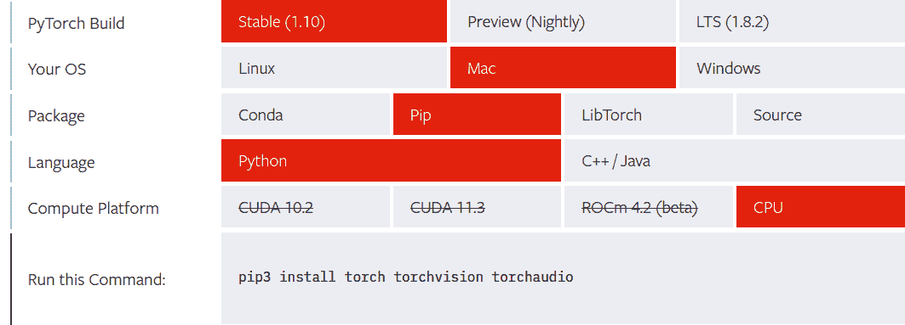
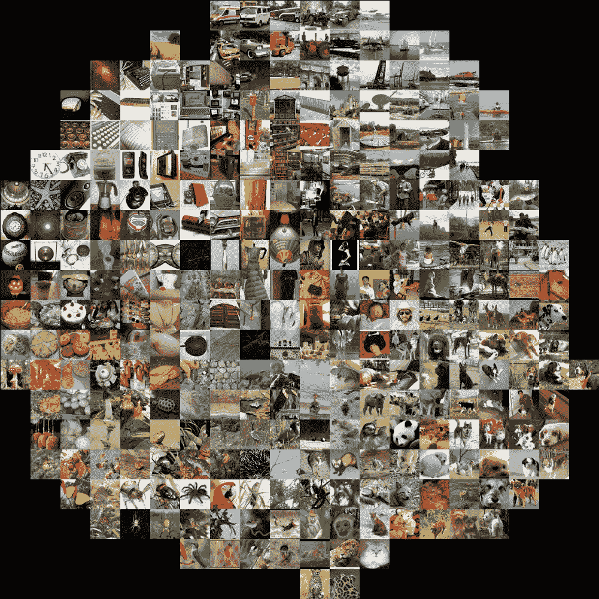
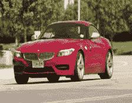
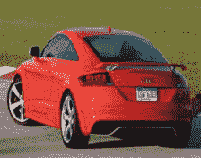
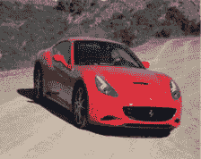
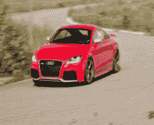
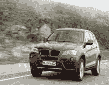

# 第十章：使用深度学习和 PySpark LSH 进行图像相似度检测

无论您是在社交媒体还是电子商务平台上遇到它们，图像都是我们数字生活中不可或缺的一部分。事实上，正是一个图像数据集——ImageNet——成为引发当前深度学习革命的关键组成部分。在 ImageNet 2012 挑战中，分类模型的显著表现是一个重要的里程碑，引起了广泛关注。因此，作为数据科学从业者，您很可能会在某个时候遇到图像数据。

在本章中，您将获得扩展深度学习工作流程的经验，特别是使用 PySpark 进行图像相似度检测的视觉任务。识别相似图像的任务对人类来说很直观，但是在计算上是一个复杂的任务。在大规模上，这变得更加困难。在本章中，我们将介绍一种用于寻找相似项的近似方法，称为局部敏感哈希（LSH），并将其应用于图像。我们将使用深度学习将图像数据转换为数值向量表示。然后，将 PySpark 的 LSH 算法应用于生成的向量，这将允许我们在给定新输入图像的情况下找到相似的图像。

从高层次来看，这个示例反映了类似于 Instagram 和 Pinterest 等照片分享应用程序用于图像相似度检测的方法之一。这有助于他们的用户理解其平台上存在的大量视觉数据。这也展示了深度学习工作流如何从 PySpark 的可伸缩性中受益。

我们将先简要介绍 PyTorch，它是一个深度学习框架。与其他主要低级深度学习库相比，PyTorch 因其相对较低的学习曲线而在近年来广受欢迎。然后，我们将下载并准备我们的数据集。用于我们任务的数据集是由斯坦福 AI 实验室在 2013 年发布的汽车数据集。PyTorch 将用于图像预处理。接下来，我们将把我们的输入图像数据转换为向量表示（图像嵌入）。然后，我们将这些嵌入导入 PySpark 并使用 LSH 算法进行转换。最后，我们将使用 LSH 转换后的数据集对新图像进行最近邻搜索，以找到相似的图像。

让我们开始介绍并设置 PyTorch。

# PyTorch

PyTorch 是一个用于构建深度学习项目的库。它强调灵活性，允许用 Python 的惯用方式表达深度学习模型。它在研究社区中找到了早期的采用者。近年来，由于其易用性，它已成为广泛应用于各种应用领域的最重要的深度学习工具之一。与 TensorFlow 一起，它是目前最流行的深度学习库之一。

PyTorch 的简单和灵活接口支持快速实验。你可以加载数据、应用变换和构建模型只需几行代码。然后，你可以灵活编写定制的训练、验证和测试循环，并轻松部署训练好的模型。它在专业环境中用于真实世界的关键工作中被广泛使用。GPU（图形处理单元）对于训练资源密集型模型的支持是使深度学习流行的重要因素。虽然我们的任务中不需要，但 PyTorch 提供了很好的 GPU 支持。

## 安装

在[PyTorch 网站](https://oreil.ly/CHkJo)上，你可以根据你的系统配置轻松获取安装说明，如图 10-1 所示。



###### 图 10-1\. PyTorch 安装，CPU 支持

执行提供的命令，并按照你的配置说明操作：

```
$ pip3 install torch torchvision
```

我们不会依赖 GPU，因此将选择 CPU 作为计算平台。如果你有一个 GPU 设置并希望使用它，请选择相应的选项获取所需的说明。本章中我们也不需要 Torchaudio，因此跳过它的安装。

# 数据准备

我们将使用[斯坦福汽车数据集](https://oreil.ly/gxo8Q)。该数据集是由 Jonathan Krause、Michael Stark、Jia Deng 和李飞飞在 ICCV 2013 年论文“用于细粒度分类的三维物体表示”中发布的。

你可以从 Kaggle 下载图片，或者使用斯坦福人工智能实验室提供的源链接。

```
wget http://ai.stanford.edu/~jkrause/car196/car_ims.tgz
```

下载完成后，解压训练和测试图像目录，并将它们放在一个名为*cars_data*的目录中：

```
data_directory = "cars_data"
train_images = "cars_data/cars_train/cars_train"
```

你可以在这里获取包含训练数据标签的 CSV 文件[here](https://oreil.ly/UoHXh)。下载它，重命名为*cars_train_data.csv*，并将其放在数据目录中。让我们看一下它：

```
import pandas as pd

train_df = pd.read_csv(data_directory+"/cars_train_data.csv")

train_df.head()
...

    Unnamed: 0 	x1 	y1 	    x2 	    y2 	    Class 	image
0 	         0 	39 	116 	569 	375 	14 	    00001.jpg
1 	         1 	36 	116 	868 	587 	3 	    00002.jpg
2 	         2 	85 	109 	601 	381 	91 	    00003.jpg
3 	         3 	621 	393     1484    1096    134 	    00004.jpg
4 	         4 	14 	36      133     99      106 	    00005.jpg
```

忽略除了`Class`和`image`之外的所有列。其他列与这个数据集来源的原始研究项目相关，不会用于我们的任务。

## 使用 PyTorch 调整图像大小

在我们进一步之前，我们需要预处理我们的图像。在机器学习中，预处理数据非常常见，因为深度学习模型（神经网络）期望输入满足特定的要求。

我们需要应用一系列预处理步骤，称为*transforms*，将输入图片转换为模型所需的正确格式。在我们的情况下，我们需要它们是 224 x 224 像素的 JPEG 格式图片，因为这是我们接下来将使用的 ResNet-18 模型的要求。我们使用 PyTorch 的 Torchvision 包在下面的代码中执行这个转换：

```
import os
from PIL import Image
from torchvision import transforms

# needed input dimensions for the CNN
input_dim = (224,224)
input_dir_cnn = data_directory + "/images/input_images_cnn"

os.makedirs(input_dir_cnn, exist_ok = True)

transformation_for_cnn_input = transforms.Compose([transforms.Resize(input_dim)])

for image_name in os.listdir(train_images):
    I = Image.open(os.path.join(train_images, image_name))
    newI = transformation_for_cnn_input(I)

    newI.save(os.path.join(input_dir_cnn, image_name))

    newI.close()
    I.close()
```

这里我们使用一个单一的转换，将图像调整大小以适应神经网络。但是，我们也可以使用`Compose`变换来定义一系列用于预处理图像的变换。

我们的数据集现在已准备就绪。在下一节中，我们将把我们的图像数据转换为适合与 PySpark 的 LSH 算法一起使用的向量表示形式。

# 用于图像向量表示的深度学习模型

卷积神经网络，即 CNN，是用于预测的标准神经网络架构，当输入观察数据是图像时使用。我们不会将它们用于任何预测任务，而是用于生成图像的向量表示。具体来说，我们将使用 ResNet-18 架构。

Residual Network（ResNet）是由 Shaoqing Ren、Kaiming He、Jian Sun 和 Xiangyu Zhang 在他们 2015 年的论文“Deep Residual Learning for Image Recognition”中引入的。ResNet-18 中的 18 代表神经网络架构中存在的层数。ResNet 的其他流行变体包括 34 层和 50 层。层数增加会提高性能，但也会增加计算成本。

## 图像嵌入

*图像嵌入*是图像在向量空间中的表示。基本思想是，如果给定图像接近另一张图像，它们的嵌入也将在空间维度上相似且接近。

图像中的图 10-2，由 Andrej Karpathy 发布，展示了如何在较低维度空间中表示图像。例如，您可以注意到顶部附近的车辆和左下角的鸟类空间。



###### 图 10-2。ILSVRC 2012 年图像嵌入在 2 维空间中

我们可以通过取其倒数第二个全连接层的输出来从 ResNet-18 中获得图像嵌入，该层的维度为 512。接下来，我们创建一个类，提供一张图像，即可返回其数值向量形式的表示。

```
import torch
from torchvision import models

class Img2VecResnet18():
    def __init__(self):
        self.device = torch.device("cpu")
        self.numberFeatures = 512
        self.modelName = "resnet-18"
        self.model, self.featureLayer = self.getFeatureLayer()
        self.model = self.model.to(self.device)
        self.model.eval()
        self.toTensor = transforms.ToTensor() 
        self.normalize = transforms.Normalize(mean=[0.485, 0.456, 0.406],
                                              std=[0.229, 0.224, 0.225]) 

    def getFeatureLayer(self):
        cnnModel = models.resnet18(pretrained=True)
        layer = cnnModel._modules.get('avgpool')
        self.layer_output_size = 512

        return cnnModel, layer

    def getVec(self, img):
        image = self.normalize(self.toTensor(img)).unsqueeze(0).to(self.device)
        embedding = torch.zeros(1, self.numberFeatures, 1, 1)
        def copyData(m, i, o): embedding.copy_(o.data)
        h = self.featureLayer.register_forward_hook(copyData)
        self.model(image)
        h.remove()
        return embedding.numpy()[0, :, 0, 0]
```


将图像转换为 PyTorch 张量格式。


将像素值范围重新缩放到 0 到 1 之间。均值和标准差（std）的值是基于用于训练模型的数据预先计算的。归一化图像可以提高分类器的准确性。

现在我们初始化`Img2VecResnet18`类，并对所有图像应用`getVec`方法，以获得它们的图像嵌入。

```
import tqdm

img2vec = Img2VecResnet18()
allVectors = {}
for image in tqdm(os.listdir(input_dir_cnn)):
    I = Image.open(os.path.join(input_dir_cnn, image))
    vec = img2vec.getVec(I)
    allVectors[image] = vec
    I.close()
```

对于较大的数据集，您可能希望将向量输出顺序写入文件，而不是将其保留在内存中，以避免内存不足错误。这里的数据是可管理的，因此我们创建一个字典，并在下一步将其保存为 CSV 文件：

```
import pandas as pd

pd.DataFrame(allVectors).transpose().\
    to_csv(data_folder + '/input_data_vectors.csv')
```

由于我们是在本地工作，所以选择了 CSV 格式来保存向量输出。但是，Parquet 格式更适合这种类型的数据。您可以通过在先前的代码中用`to_parquet`替换`to_csv`来轻松保存 Parquet 格式的数据。

现在我们有了所需的图像嵌入，可以将它们导入 PySpark 中。

## 导入图像嵌入到 PySpark

启动 PySpark shell：

```
$ pyspark --driver-memory 4g
```

导入图像嵌入：

```
input_df = spark.read.option('inferSchema', True).\
                    csv(data_directory + '/input_data_vectors.csv')
input_df.columns
...

['_c0',
 '_c1',
 '_c2',
 '_c3',
 '_c4',
[...]
'_c509',
 '_c510',
 '_c511',
 '_c512']
```

PySpark 的 LSH 实现要求矢量列作为输入。我们可以通过使用 `VectorAssembler` 转换来将数据框中的相关列组合成一个列来创建这样一个列：

```
from pyspark.ml.feature import VectorAssembler

vector_columns = input_df.columns[1:]
assembler = VectorAssembler(inputCols=vector_columns, outputCol="features")

output = assembler.transform(input_df)
output = output.select('_c0', 'features')

output.show(1, vertical=True)
...

-RECORD 0------------------------
 _c0      | 01994.jpg
 features | [0.05640895,2.709...

...

output.printSchema()
...

root
 |-- _c0: string (nullable = true)
 |-- features: vector (nullable = true)
```

在接下来的部分，我们将使用 LSH 算法创建一种方法来从数据集中找到相似的图像。

# 使用 PySpark LSH 进行图像相似度搜索

局部敏感哈希是一种重要的哈希技术类，通常用于聚类、近似最近邻搜索和大数据集的异常值检测。局部敏感函数接受两个数据点，并决定它们是否应该成为候选对。

LSH 的一般思想是使用一组函数族（“LSH 家族”）将数据点哈希到桶中，以便数据点彼此靠近的概率很高地放置在同一个桶中，而数据点相距很远的概率很高地放置在不同的桶中。映射到相同桶中的数据点被视为候选对。

在 PySpark 中，不同的 LSH 家族被实现为单独的类（例如 `MinHash` 和 `BucketedRandomProjection`），并且每个类都提供了用于特征转换、近似相似性连接和近似最近邻的 API。

我们将使用 BucketedRandomProjection 实现的 LSH。

让我们首先创建我们的模型对象：

```
from pyspark.ml.feature import BucketedRandomProjectionLSH

brp = BucketedRandomProjectionLSH(inputCol="features", outputCol="hashes",
                                  numHashTables=200, bucketLength=2.0)
model = brp.fit(output)
```

在 BucketedRandomProjection LSH 实现中，桶长度可以用来控制哈希桶的平均大小（从而控制桶的数量）。较大的桶长度（即较少的桶）增加了特征被哈希到同一桶的概率（增加了真正和错误的正例数量）。

现在我们使用新创建的 LSH 模型对象转换输入的 DataFrame。结果的 DataFrame 将包含一个 `hashes` 列，其中包含图像嵌入的哈希表示：

```
lsh_df = model.transform(output)
lsh_df.show(5)

...
+---------+--------------------+--------------------+
|      _c0|            features|              hashes|
+---------+--------------------+--------------------+
|01994.jpg|[0.05640895,2.709...|[[0.0], [-2.0], [...|
|07758.jpg|[2.1690884,3.4647...|[[0.0], [-1.0], [...|
|05257.jpg|[0.7666548,3.7960...|[[-1.0], [-1.0], ...|
|07642.jpg|[0.86353475,2.993...|[[-1.0], [-1.0], ...|
|00850.jpg|[0.49161428,2.172...|[[-1.0], [-2.0], ...|
+---------+--------------------+--------------------+
only showing top 5 rows
```

有了我们的 LSH 转换后的数据集准备好了，我们将在下一部分进行测试。

## 最近邻搜索

让我们尝试使用新图像找到相似的图像。目前，我们将从输入数据集中选择一个（图 10-3）：

```
from IPython.display import display
from PIL import Image

input_dir_cnn = data_folder + "/images/input_images_cnn"

test_image = os.listdir(input_dir_cnn)[0]
test_image = os.path.join(input_dir_cnn, test_image)
print(test_image)
display(Image.open(test_image))
...
cars_data/images/input_images_cnn/01994.jpg
```



###### 图 10-3\. 我们数据集中随机选择的汽车图像

首先，我们需要使用我们的 `I⁠m⁠g⁠2⁠V⁠e⁠c​R⁠e⁠s⁠n⁠e⁠t⁠1⁠8` 类将输入图像转换为矢量格式：

```
img2vec = Img2VecResnet18()
I = Image.open(test_image)
test_vec = img2vec.getVec(I)
I.close()

print(len(test_vec))
print(test_vec)
...

512
[5.64089492e-02 2.70972490e+00 2.15519500e+00 1.43926993e-01
 2.47581363e+00 1.36641121e+00 1.08204508e+00 7.62105465e-01
[...]
5.62133253e-01 4.33687061e-01 3.95899676e-02 1.47889364e+00
 2.89110214e-01 6.61322474e-01 1.84713617e-01 9.42268595e-02]
...

test_vector = Vectors.dense(test_vec)
```

现在我们执行近似最近邻搜索：

```
print("Approximately searching lsh_df for 5 nearest neighbors \
 of input vector:")
result = model.approxNearestNeighbors(lsh_df, test_vector, 5)

result.show()
...
+---------+--------------------+--------------------+--------------------+
|      _c0|            features|              hashes|             distCol|
+---------+--------------------+--------------------+--------------------+
|01994.jpg|[0.05640895,2.709...|[[0.0], [-2.0], [...|3.691941786298668...|
|00046.jpg|[0.89430475,1.992...|[[0.0], [-2.0], [...|   10.16105522433224|
|04232.jpg|[0.71477133,2.582...|[[-1.0], [-2.0], ...|  10.255391011678762|
|05146.jpg|[0.36903867,3.410...|[[-1.0], [-2.0], ...|  10.264572173322843|
|00985.jpg|[0.530428,2.87453...|[[-1.0], [-2.0], ...|  10.474841359816633|
+---------+--------------------+--------------------+--------------------+
```

您可以查看图 10-4 到 10-8 的图像，看到模型已经相当正确：

```
for i in list(result.select('_c0').toPandas()['_c0']):
    display(Image.open(os.path.join(input_dir_cnn, i)))
```


###### 图 10-4\. 结果图像 1



###### 图 10-5\. 结果图像 2



###### 图 10-6\. 结果图像 3



###### 图 10-7\. 结果图像 4



###### 图 10-8\. 结果图像 5

输入图像如预期一样位于列表顶部。

# 从这里开始

在本章中，我们学习了如何将 PySpark 与现代深度学习框架结合起来，以扩展图像相似性检测工作流程。

有多种方法可以改进这个实现。你可以尝试使用更好的模型或改进预处理以获得更好的嵌入质量。此外，LSH 模型可以进行调整。在实际设置中，您可能需要定期更新参考数据集，以适应系统中新加入的图像。最简单的方法是定期运行批处理作业以创建新的 LSH 模型。您可以根据需求和兴趣探索所有这些方法。
