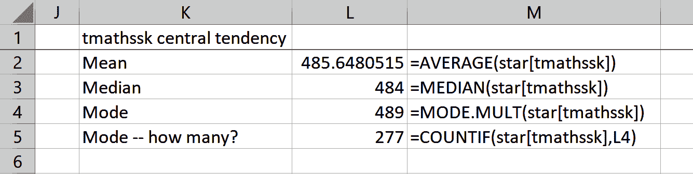
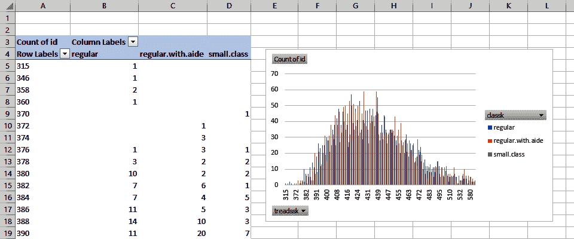

# 第一章：探索性数据分析的基础

“你永远不知道会有什么从那扇门走出来，”瑞克·哈里森在热门节目*当铺之星*的开场白中说道。在分析中也是一样：面对一个新数据集，你永远不知道你将会发现什么。本章是关于 *探索* 和 *描述* 数据集，以便我们知道要向它提出什么问题。这个过程被称为 *探索性数据分析*，或者 EDA。

# 什么是探索性数据分析？

美国数学家约翰·图基在他的书《探索性数据分析》（Pearson）中推广了使用 EDA 的方法。图基强调分析员需要首先 *探索* 数据以找出潜在的研究问题，然后再通过假设检验和推断统计学来 *确认* 答案。

EDA（探索性数据分析）通常被比喻为对数据进行“面试”；这是分析员了解数据并了解它有什么有趣的事情的时候。作为我们的面试的一部分，我们将要做以下事情：

+   将我们的变量分类为连续的，分类的等等

+   用描述性统计总结我们的变量

+   使用图表可视化我们的变量

EDA 给了我们很多事情要做。让我们使用 Excel 和一个真实的数据集来走一遍这个过程。您可以在本书的[存储库](https://oreil.ly/VHslH)中的*star*子文件夹下的*datasets*文件夹中找到*star.xlsx*工作簿中的数据。这个数据集是为了研究班级规模对考试成绩的影响而收集的。对于这个和其他基于 Excel 的演示，我建议您完成以下步骤，使用原始数据： 

1.  复制文件，以保持原始数据集不变。我们稍后将把这些 Excel 文件中的一些导入到 R 或 Python 中，因此对数据集的任何更改都将影响到该过程。

1.  添加一个名为*id*的索引列。这将为数据集的每一行编号，使得第一行的 ID 为 1，第二行为 2，依此类推。这可以在 Excel 中快速完成，方法是在列的前几行输入数字，然后突出显示该范围，并使用快速填充根据该模式完成选择。查找您活动单元格右下角的小方块，在上面悬停直到您看到一个小加号，然后填写其余的范围。添加这个索引列将使得按组分析数据更容易。

1.  最后，通过选择范围中的任何单元格，然后转到功能区并单击插入→表格来将结果数据集转换为表格。Windows 的键盘快捷键是 Ctrl + T，Mac 的是 Cmd + T。如果您的表格有标题，请确保“我的表格有标题”选项已打开。表格有很多好处，其中最重要的是它们的美观性。在表操作中也可以通过名称引用列。

    你可以通过单击表格任意位置，然后转到功能区并单击“表格设计”→“属性”组下的“表格名称”，来为表格命名，就像图 1-1 所示。

###### 图 1-1\. 表格名称框

这些首个分析任务将成为在 Excel 中处理其他数据集时的良好实践。对于*star*数据集，你完成的表格应该看起来像图 1-2。我已经将我的表格命名为`star`。这个数据集按列和行的矩形形式排列。

###### 图 1-2\. *star*数据集，按行和列排列

你可能已经处理过足够多的数据，知道这是分析所需的理想形式。有时，我们需要清理数据，以使其达到我们想要的状态；我将在本书的后面讨论其中一些数据清理操作。但是现在，让我们感叹一下，并学习关于我们的数据和 EDA 的相关内容。

在分析中，我们经常使用*观察*和*变量*这些术语，而不是*行*和*列*。让我们探索这些术语的重要性。

## 观察

在这个数据集中，我们有 5,748 行：每一行都是一个独特的观察结果。在这种情况下，测量是在学生级别进行的；观察结果可以是从个体公民到整个国家的任何内容。

## 变量

每列都提供了关于我们观察的独特信息片段。例如，在*star*数据集中，我们可以找到每个学生的阅读分数（*treadssk*）以及学生所在班级类型（*classk*）。我们将这些列称为*变量*。表 1-1 描述了*star*数据集中每列所测量的内容：

表 1-1\. *star*数据集变量的描述

| 列 | 描述 |
| --- | --- |
| *id* | 唯一标识符/索引列 |
| *tmathssk* | 总数学标准化分数 |
| *treadssk* | 总阅读标准化分数 |
| *classk* | 班级类型 |
| *totexpk* | 教师的总工作年限 |
| *sex* | 性别 |
| *freelunk* | 是否有资格免费午餐？ |
| *race* | 种族 |
| *schidkn* | 学校标识符 |

准备好一个废话？我们称它们为变量，因为它们的值可能会在观察中*变化*。如果我们记录的每个观察结果都返回相同的测量结果，那么分析的意义就不大了。每个变量可以为我们的观察提供非常不同的信息。即使在这个相对较小的数据集中，我们有文本、数字以及是/否陈述作为变量。有些数据集可能会有几十甚至上百个变量。

在继续我们的分析时，对这些变量类型进行分类将会有所帮助。请记住，这些区分在某种程度上是任意的，并且可能会根据分析的目的和情况而改变。你会发现探索性数据分析（EDA）以及整体分析具有高度的迭代性。

###### 注意

变量的分类有些是主观的，与许多分析一样，建立在经验法则而不是硬性标准之上。

我将讨论不同的变量类型，如图 1-3 所示，然后根据这些区别对*star*数据集进行分类。

###### 图 1-3\. 变量类型

这里还有进一步的变量类型可以涵盖：例如，我们不会考虑区间和比例数据之间的差异。要更详细地了解变量类型，请查阅 Sarah Boslaugh 的[*Statistics in a Nutshell*](https://oreil.ly/QAOxt)，第二版（O’Reilly）。让我们从图 1-3 的左侧向右侧工作。

### 分类变量

有时被称为*定性*变量，这些描述观察结果的质量或特征。分类变量通常回答的典型问题是“哪种类型？”分类变量通常用非数值表示，尽管并非总是如此。

一个分类变量的例子是原产国家。像任何变量一样，它可以采用不同的值（美国，芬兰等），但我们不能在它们之间进行定量比较（谁能告诉我印度尼西亚是美国的两倍？）。分类变量所采用的任何独特值称为该变量的一个*级别*。原产国家的三个级别可能是美国，芬兰或印度尼西亚，例如。

因为分类变量描述的是观察结果的质量而不是数量，因此这些数据上的许多定量操作并不适用。例如，我们无法计算*平均*出生国家，但我们可以计算*最常见*的，或者每个级别的总体频率计数。

我们可以进一步根据它们可以采用的级别数量以及这些级别的排名顺序是否有意义来区分分类值。

二元变量只能采用两个级别。通常，这些变量被陈述为是/否的回答，尽管并非总是如此。一些二元变量的例子包括：

+   结婚了吗？（是或否）

+   是否购买？（是或否）

+   酒的类型？（红或白）

就酒的类型而言，我们隐含地假设我们感兴趣的数据仅包括红葡萄酒或白葡萄酒……但是如果我们还想分析葡萄酒，会发生什么？在这种情况下，我们不能再包含所有三个级别并将数据分析为二元数据。

任何具有超过两个级别的定性变量都是名义变量。一些例子包括：

+   原产国家（美国，芬兰，印度尼西亚等）

+   喜欢的颜色（橙色，蓝色，烧焦赭色等）

+   酒的类型（红，白，葡萄酒）

注意，像 ID 号这样的东西是以数字形式陈述的分类变量：虽然我们*可以*计算平均 ID 号，但这个数字是没有意义的。重要的是，名义变量没有*内在的排序*。例如，红色作为颜色不能本质上比蓝色更高或更低。由于内在的排序并不一定清楚，让我们看一些其使用的例子。

有序变量具有两个以上的级别，在这些级别之间存在内在的排序。一些有序变量的例子包括：

+   饮料尺寸（小，中，大）

+   班级（大一，大二，大三，大四）

+   工作日（星期一，星期二，星期三，星期四，星期五）

在这里，我们*可以*本质上对级别进行排序：高年级高于低年级，而我们不能说红色与蓝色一样。虽然我们可以*排名*这些级别，但我们不一定能量化它们之间的*距离*。例如，小型和中型饮料之间的大小差异可能不同于中型和大型饮料之间的差异。

### 定量变量

这些变量描述了观察的可测量数量。定量变量通常由数字表示。我们可以根据它们能够取值的数量进一步区分定量变量。

*连续*变量的观察理论上可以在任何两个其他值之间取无限多个值。这听起来很复杂，但连续变量在自然界中非常常见。一些例子包括：

+   身高（在 59 到 75 英寸范围内，观察值可以是 59.1、74.99 或者介于两者之间的任何其他值）

+   pH 水平

+   表面积

因为我们可以对连续变量的不同观察进行定量比较，所以我们可以应用更广泛的分析方法。例如，对连续变量取平均值是有意义的，而对于分类变量则不然。本章后面，您将学习如何通过在 Excel 中找到它们的描述性统计来分析连续变量。

另一方面，*离散*变量的观察只能在任意两个值之间取有限数量的可计数值。离散变量在社会科学和商业中非常常见。一些例子包括：

+   一个家庭中的人数（在 1 和 10 之间的范围内，观察可以是 2 或 5，但不能是 4.3）

+   销售单位

+   森林中的树木数量

经常情况下，当我们处理具有许多水平或许多观测值的离散变量时，为了进行更全面的统计分析，我们会将它们视为连续变量。例如，你可能听说过美国家庭平均有 1.93 个孩子。我们知道，没有家庭*确实*有这么多孩子。毕竟，这是一个*离散*变量，只能是整数。然而，在许多观察中，这个说法可以作为期望在典型家庭中有多少孩子的有用表示。

但等等，还有更多！在更高级的分析中，我们经常会重新计算和混合变量：例如，我们可能对一个变量进行*对数变换*，以满足特定分析的假设，或者我们可能使用称为*降维*的方法将多个变量的含义提取为更少的变量。这些技术超出了本书的范围。

# 演示：变量分类

利用你到目前为止学到的知识，使用图 1-3 中介绍的类型来分类*星号*变量。在你深入思考时，不要犹豫去调查数据。我会在这里为你提供一个简便方法，稍后在本章节中我们将详细讨论这个过程。

一个快速获取变量类型感觉的方法是查找它们所具有的唯一值的数量。可以通过 Excel 中的筛选预览来完成此操作。我点击了图 1-4 中*sex*变量旁边的下拉箭头，并发现它只有两个不同的值。你认为这可能是什么类型的变量？花点时间通过这种或其他方法来检查这些变量。

###### 图 1-4\. 使用筛选预览查找变量具有多少个不同值

表格 1-2 展示了我如何对这些变量进行分类。

表格 1-2\. 我如何对这些变量进行分类

| **变量** | **描述** | **分类或数量？** | **类型？** |
| --- | --- | --- | --- |
| *id* | 索引列 | 分类 | 名义 |
| *tmathssk* | 总数学标准化分数 | 数量型 | 连续型 |
| *treadssk* | 总阅读分数标准化分数 | 数量型 | 连续型 |
| *classk* | 班级类型 | 分类 | 名义 |
| *totexpk* | 教师的总工作经验年限 | 数量型 | 离散型 |
| *sex* | 性别 | 分类 | 二元 |
| *freelunk* | 是否有资格享受免费午餐？ | 分类 | 二元 |
| *race* | 种族 | 分类 | 名义 |
| *schidkn* | 学校指标 | 分类 | 名义 |

其中一些变量，如*classk*和*freelunk*，比较容易分类。而其他一些，如*schidkn*和*id*，则不那么明显：它们以数值方式陈述，但不能进行数量化比较。

###### 警告

数据以数值方式陈述，并不意味着它可以用作数量型变量。

你会发现，这些变量中只有三个是定量的：*tmathssk*、*treadssk*和*totexpk*。我决定将前两个分类为连续变量，最后一个分类为离散变量。为了理解原因，让我们从*totexpk*开始，即教师的教学经验年限。所有这些观察结果都是以整数表达的，范围从 0 到 27。因为这个变量只能取固定数量的可数值，我将其分类为离散变量。

那么*tmathssk*和*treadssk*这两个测试分数如何呢？这些分数也都是以整数表达的：也就是说，一个学生不能得到 528.5 分，只能是 528 或 529 分。从这个角度来看，它们也是离散的。然而，因为这些分数可以有如此多的唯一值，实际上将它们分类为连续变量是有道理的。

看到这样一个严谨的分析领域中竟然没有多少明确的规则，可能会让你感到惊讶。

# 总结：变量类型

> 熟知规则，这样你才能有效地打破它们。
> 
> 第十四世达赖喇嘛

我们如何对待一个变量的分类方式会影响我们在分析中对其的处理方式——例如，我们可以计算连续变量的均值，但不能计算名义变量的均值。同时，出于便利性考虑，我们常常会打破规则——例如，计算离散变量的平均值，这样一家人平均有 1.93 个孩子。

随着我们在分析中的进展，我们可能会决定更改更多规则，重新分类变量，或者完全构建新的变量。记住，探索性数据分析（EDA）是一个迭代的过程。

###### 注意

与数据和变量一起工作是一个迭代的过程。我们对变量分类的方式可能会随着我们在探索中发现的内容以及我们决定询问数据的类型而改变。

# 在 Excel 中探索变量

让我们继续使用*star*数据集进行*描述性统计*和*可视化*的探索。我们将在 Excel 中进行这一分析，尽管你也可以在 R 或 Python 中按照相同步骤获得相同的结果。通过本书的学习，你将能够使用这三种方法进行 EDA。

我们将从*star*的分类变量开始进行变量探索。

## 探索分类变量

记住，我们在处理分类变量时是在测量*特性*而不是*数量*，因此这些变量不会有有意义的平均值、最小值或最大值，例如。尽管如此，我们仍然可以对这些数据进行一些分析，特别是通过计算*频率*。在 Excel 中，我们可以使用数据透视表来做到这一点。将光标放在*star*数据集的任何位置，然后选择插入 → 数据透视表，如图 1-5 所示。然后点击确定。

###### 图 1-5\. 插入数据透视表

我想找出每种班级类型的观察次数。为此，我将*classk*拖到数据透视表的“行区域”，并将*id*放入“值”中。默认情况下，Excel 将*id*字段的*总和*。它错误地假设分类变量是定量的。我们不能定量比较 ID 号码，但我们*可以*计算它们的频率。在 Windows 上执行此操作，请单击“值区域”中的“Sum of id”，然后选择“值字段设置”。在“汇总值字段方式”下，选择“计数”。单击“确定”。在 Mac 上，单击“Sum of id”旁边的*i*图标以执行此操作。现在我们得到了想要的结果：每种班级类型的观察次数。这被称为*单向频率表*，如图 1-6 所示。

###### 图 1-6\. 班级类型的单向频率表

将这个频率计数拆分为参加和未参加免费午餐项目的学生的观察结果。为此，请将*freelunk*放入数据透视表的“列区域”中。现在我们有一个*双向*频率表，如图 1-7 所示。

###### 图 1-7\. 班级类型按午餐项目分类的双向频率表

在本书的整个过程中，我们将创建可视化作为分析的一部分。除此以外，我们不会花太多时间讨论数据可视化的原则和技术。然而，这个领域非常值得您的研究；对于一个有帮助的介绍，请查看克劳斯·O·威尔克的《[*数据可视化基础*](https://oreil.ly/Tg5xC)》（O’Reilly）。

我们可以用条形图（也称为*条形图*或*计数图*）可视化一种或两种方式的频率表。让我们通过点击数据透视表内部并点击插入 → 聚类列来绘制我们的双向频率表。图 1-8 显示了结果。我将通过点击图表周围，然后点击右上角出现的加号图标来为图表添加标题。在显示的图表元素菜单中，选中图表标题。在 Mac 上找到此菜单，请单击图表，然后从功能区转到“设计” → “添加图表元素”。在本书的其余部分，我将继续以这种方式添加图表。

注意，计数图和表格将观察次数按班级类型分成了参与和不参与免费午餐项目的学生。例如，表格和计数图上的第一和第二标签和柱分别表示 1,051 和 949。

###### 图 1-8\. 以计数图方式可视化的双向频率表

即使对于像双向频率表这样简单的分析，将结果可视化也不是一个坏主意。人们可以比处理表中的数字更轻松地处理图表上的线条和柱，因此随着我们分析的复杂性增加，我们应继续绘制结果。

对于分类数据，我们无法进行定量比较，因此我们对它们进行的任何分析都将基于它们的计数。这可能看起来不那么令人兴奋，但仍然很重要：它告诉我们哪些值的级别最常见，我们可能希望通过其他变量比较这些级别进行进一步分析。但现在，让我们探索定量变量。

## 探索定量变量

在这里，我们将运行更全面的*摘要*或*描述性*统计。描述性统计允许你使用定量方法总结数据集。频率是描述性统计的一种类型；让我们逐步介绍其他方法以及如何在 Excel 中计算它们。

*集中趋势度量*是描述性统计的一组统计量，表达了典型观测值的取值。我们将涵盖这些度量中的三个最常见的。

首先是均值或平均值。更具体地说是*算术*平均值，计算方法是将所有观测值相加，然后除以观测值的总数。在所有讨论的统计量中，你可能最熟悉这个，我们会继续参考它。

接下来是中位数。这是数据集中的*中间*观测值。要计算中位数，首先将数据从低到高排序或排名，然后从两侧向内数，找到中间的观测值。如果中间有两个值，取平均值作为中位数。

最后，众数：出现频率最高的值。排序数据也有助于找到众数。一个变量可能有一个、多个或没有众数。

Excel 拥有丰富的统计函数套件，包括一些用于计算集中趋势度量的函数，这些函数在表格 1-3 中显示。

表 1-3\. Excel 用于测量集中趋势的函数

| 统计量 | Excel 函数 |
| --- | --- |
| Mean | `AVERAGE(number1, [number2], ...)` |
| Median | `MEDIAN(number1, [number2], ...)` |
| Mode | `MODE.MULT(number1, [number2], ...)` |

`MODE.MULT()` 是 Excel 中利用动态数组返回多个潜在模式的新函数。如果你无法使用此函数，请尝试 `MODE()`。利用这些函数，找出我们的*tmathssk*分数的集中趋势度量。图表 1-9 显示了结果。

从这个分析中，我们看到我们的三个集中趋势度量具有相似的值，均值为 485.6，中位数为 484，众数为 489。我还决定查找众数发生的频率：277 次。

###### 图表 1-9\. 在 Excel 中计算集中趋势度量

有了所有这些中心趋势度量，应该关注哪一个呢？我将通过一个简短的案例研究来回答这个问题。想象一下你在一个非营利组织做咨询。他们要求你查看捐赠情况，并建议追踪哪种中心趋势度量。捐赠情况如表 1-4 所示。请花一点时间计算并做出决定。

表 1-4。考虑给定这些数据应该追踪哪个度量

| $10 | $10 | $25 | $40 | $120 |
| --- | --- | --- | --- | --- |

算术平均数似乎是一个传统的追踪方法，但是$41 *真的*代表了我们的数据吗？实际上，除了一个个人捐赠以外，所有捐赠都*不到*这个数；$120 的捐赠正在夸大这个数字。这是算术平均数的一个缺点：极端值可能会不适当地影响它。

如果我们使用中位数就不会有这个问题：$25 或许更能代表“中间值”而不是$41。这个度量的问题在于它没有考虑到每个观察值的精确值：我们只是“倒数”进入变量的中间，而没有考虑每个观察值的相对大小。

这就让我们只剩下众数，它确实提供了有用的信息：*普遍*的礼物是$10。然而，$10 并不能代表捐赠的整体情况。此外，正如前文所述，数据集可能有多个众数，也可能没有，因此这不是一个非常稳定的度量。

对于非营利组织的回答呢？应该追踪和评估它们所有的度量。每个度量都从不同的角度总结了我们的数据。然而，正如你将在后面的章节中看到的，进行更高级的统计分析时，最常见的是关注平均值。

###### 注：

我们经常会分析几个统计量，以便更全面地了解同一数据集。没有一种度量一定比其他更好。

现在我们已经确定了变量的“中心”在哪里，我们想要探索这些值从中心“散开”的程度。存在几种*可变性度量*；我们将重点关注最常见的。

首先，是范围，或者说最大值和最小值之间的差异。尽管推导起来很简单，但它对观察结果非常敏感：只要有一个极端值，范围就可能对大多数观察结果的实际位置产生误导。

接下来是方差。这是一个测量观察值与平均值之间分散程度的指标。这比我们到目前为止讨论的内容更加深入。我们的步骤如下：

1.  找到我们数据集的平均值。

1.  从每个观察值中减去平均值。这就是*偏差*。

1.  求出所有偏差的平方和。

1.  将平方和除以观察次数。

要跟上这么多内容确实有点难。对于这么复杂的操作，使用数学符号可能会有所帮助。我知道起初可能会有些让人畏惧，但请考虑前面列表的替代方案。这里的数学符号可以提供一个更精确的表达方法。例如，我们可以涵盖找到方差的所有步骤，如公式 1-1 所示：

##### 公式 1-1\. 找到方差的公式

<math alttext="s squared equals StartFraction sigma-summation left-parenthesis upper X minus upper X overbar right-parenthesis squared Over upper N EndFraction" display="block"><mrow><msup><mi>s</mi> <mn>2</mn></msup> <mo>=</mo> <mfrac><mrow><mo>∑</mo><msup><mrow><mo>(</mo><mi>X</mi><mo>-</mo><mover accent="true"><mi>X</mi> <mo>¯</mo></mover><mo>)</mo></mrow> <mn>2</mn></msup></mrow> <mi>N</mi></mfrac></mrow></math>

<math alttext="s 平方"><msup><mi>s</mi> <mn>2</mn></msup></math> 是我们的方差。 <math alttext="左括号 上标 X 减 上标 X 横线 平方"><msup><mrow><mo>(</mo><mi>X</mi><mo>-</mo><mover accent="true"><mi>X</mi> <mo>¯</mo></mover><mo>)</mo></mrow> <mn>2</mn></msup></math> 告诉我们，我们需要从每个观察值 <math alttext="上标 X"><mi>X</mi></math> 中减去平均值 <math alttext="上标 X 横线"><mover accent="true"><mi>X</mi> <mo>¯</mo></mover></math> ，然后平方。 <math alttext="sigma-求和"><mo>∑</mo></math> 告诉我们对这些结果求和。最后，将结果除以观察值的数量 <math alttext="上标 N"><mi>N</mi></math> 。

在本书中我还会多次使用数学符号，但只有在它比逐步书写更有效表达和理解给定概念时才会这样做。尝试计算 表 1-5 中数字的方差。

表 1-5\. 测量这些数据的变异性

| 3 | 5 | 2 | 6 | 3 | 2 |
| --- | --- | --- | --- | --- | --- |

由于这个统计量相对更复杂，我将使用 Excel 来管理计算。稍后你将学习如何使用 Excel 的内置函数计算方差。图 1-10 展示了结果。

###### 图 1-10\. 在 Excel 中计算方差

你可以在本章附带的工作簿的 *variability* 工作表中找到这些结果，即 *ch-1.xlsx*。

你可能会问为什么我们要处理偏差的*平方*。要理解为什么，请对未平方的偏差求和。它是零：这些偏差互相抵消了。

方差的问题在于现在我们是在处理原始单位的*平方偏差*。这不是分析数据的直观方式。为了纠正这一点，我们将取方差的平方根，即*标准差*。变异性现在是用测量单位的平均值来表达的。公式 1-2 展示了用数学符号表示的标准差。

##### 公式 1-2\. 找到标准差的公式

<math alttext="s equals StartRoot StartFraction sigma-summation left-parenthesis upper X Subscript i Baseline minus upper X overbar right-parenthesis squared Over upper N EndFraction EndRoot" display="block"><mrow><mi>s</mi> <mo>=</mo> <msqrt><mfrac><mrow><mo>∑</mo><msup><mfenced close=")" open="(" separators=""><msub><mi>X</mi> <mi>i</mi></msub> <mo>-</mo><mover accent="true"><mi>X</mi> <mo>¯</mo></mover></mfenced> <mn>2</mn></msup></mrow> <mi>N</mi></mfrac></msqrt></mrow></math>

使用这个公式，图 1-10 的标准偏差是 1.5（2.25 的平方根）。我们可以使用表 1-6 中的函数在 Excel 中计算这些变异度的测量。请注意，对*样本*和*总体*方差和标准偏差使用了不同的函数。样本测量使用<math alttext="上 N 减 1"><mrow><mi>N</mi> <mo>-</mo> <mn>1</mn></mrow></math>而不是<math alttext="上 N"><mi>N</mi></math>作为分母，结果是较大的方差和标准偏差。

表 1-6\. Excel 的测量变异性的函数

| 统计量 | Excel 函数 |
| --- | --- |
| 范围 | `MAX(number1, [number2], ...)_ - _MIN(number1, [number2], ...)` |
| 方差（样本） | `VAR.S(number1, [number2], ...)` |
| 标准偏差（样本） | `STDEV.S(number1, [number2], ...)` |
| 方差（总体） | `VAR.P(number1, [number2], ...)` |
| 标准偏差（总体） | `STDEV.P(number1, [number2], ...)` |

后面的章节将重点讨论样本与总体的区别。如果你不确定是否已经收集了你感兴趣的*所有*数据，可以使用*样本*函数。正如你现在看到的，我们有*几个*描述统计要关注。我们可以利用 Excel 的函数加快计算速度，但也可以使用其数据分析工具包通过几次点击生成完整的描述统计。

###### 小贴士

在计算总体或样本的统计量时，有些统计量会有所不同。如果你不确定你正在处理的是哪种情况，请假设是样本。

这个插件已经与 Excel 一同安装，但首先需要加载它。对于 Windows，从功能区选择 文件 → 选项 > 加载项。然后点击底部的“转到”。从菜单中选择分析工具包，然后点击确定。不必选择分析工具包-VBA 选项。对于 Mac，从菜单栏选择 数据 → 分析工具。从菜单中选择分析工具包，然后点击确定。可能需要重新启动 Excel 以完成配置。之后，您将在“数据”选项卡中看到一个新的数据分析按钮。

在表 1-1 中，我们确定了*tmathssk*和*treadssk*是连续变量。让我们使用 ToolPak 计算它们的描述统计。从功能区选择 数据 → 数据分析 → 描述统计。会出现一个菜单；选择输入范围`B1:C5749`。确保打开“首行为标签”和“汇总统计”复选框。您的菜单应该看起来像图 1-11。您可以保持其他设置不变，然后点击确定。

这将把这两个变量的描述统计插入到一个新的工作表中，如图 1-12 所示。

现在让我们来比较各组中每个分类变量的描述统计量。为此，将基于*star*数据插入新的工作表中的透视表。将*freelunk*放置在列区域，*id*放置在行区域，将*Sum of treadssk*放置在值区域。请记住，*id*字段是唯一标识符，因此我们实际上不应该在透视表中对其求和，尽管它可能会这样认为。

###### 图 1-11\. 使用分析 ToolPak 导出描述统计量

###### 图 1-12\. 从分析 ToolPak 导出的描述统计量

对于这次以及将来进行的任何透视表操作，最好是关闭所有总计，方法是单击内部并选择“设计”→“总计”→“关闭行”和“关闭列”。这样我们就不会误将总计包括在分析中。现在可以使用 ToolPak 插入描述统计量。图 1-13 显示了结果。

###### 图 1-13\. 按组计算描述统计量

您已经了解了这些措施的大部分内容；本书稍后将会涉及其余部分。看起来，ToolPak 呈现的所有信息似乎都消除了对数据可视化的需求。事实上，可视化仍然在探索性数据分析中发挥着不可或缺的作用。特别是，我们将使用它们来了解在变量的整个值范围内观测值的*分布*。

首先，我们将看看直方图。通过这些图，我们可以可视化观测值按区间的相对频率。要在 Excel 中构建*treadssk*的直方图，请选择该数据范围，然后转到功能区并选择“插入”→“直方图”。图 1-14 显示了结果。

从图 1-14 中我们可以看到，最频繁出现的区间在 426.6 到 432.8 之间，大约有 650 个观测值落在这个范围内。我们实际的测试分数中没有小数，但是我们的 x 轴可能包括它们，这取决于 Excel 如何确定间隔或箱子。我们可以通过右键单击图表的 x 轴并选择“格式轴”来更改箱子的数量。右侧将显示一个菜单。（这些功能在 Mac 上不可用。）

###### 图 1-14\. 阅读分数的分布

默认情况下，Excel 决定使用 51 个箱子，但如果我们（大约）将该数字减半和加倍为 25 和 100 呢？在菜单中调整这些数字；图 1-15 显示了结果。我喜欢将其看作是在分布的细节上“放大和缩小”。

###### 图 1-15\. 改变直方图箱子数量

将分布可视化为直方图后，我们可以快速看到，在分布的极右端有相当数量的考试分数，但大多数考试分数主要集中在 400–500 的范围内。

如果我们想要查看阅读分数的分布如何在三种班级规模之间变化？在这里，我们正在比较一个连续变量在一个分类变量的三个水平上的表现。在 Excel 中通过直方图设置这一点将需要一些“技巧”，但我们可以依赖数据透视表来完成任务。

在基于*star*数据集上插入一个新的数据透视表，然后将*treadssk*拖到行区域，*classk*拖到列区域，“id 的计数”拖到值区域。同样地，如果我们从数据透视表中删除总计，后续的分析会更容易。

现在让我们从这些数据创建一个图表。单击数据透视表中的任意位置，然后从功能区选择插入 → 簇状列。结果如图 1-16 所示，非常难以阅读，但与源数据透视表进行比较，它告诉我们对于分数为 380 的学生，10 人是常规班级，2 人是带助理的常规班级，2 人是小班级。

###### 图 1-16\. 开始一个多组直方图

从这里开始，将这些值合并到更大的间隔中就是一个问题了。为此，右键单击数据透视表的第一列的任意位置，然后选择“组合”。Excel 将默认将此分组设置为 100 的增量；将其更改为 25。

一个可识别的直方图开始显现。让我们重新格式化图表，使其看起来更像一个。右键单击图表的任何条形，然后选择“格式数据系列”。您将把“系列重叠”调整为 75%，将“间隙宽度”调整为 0%。图 1-17 显示了结果。

###### 图 1-17\. 使用数据透视表创建一个多组直方图

我们可以将间隙宽度设置为完全相交，但这样一来，就更难看清晰的常规班级大小分布。直方图是查看连续变量分布的常用可视化工具，但它们很快就会变得混乱不堪。

作为替代方案，让我们来看看箱线图。在这里，我们将以*四分位数*来可视化我们的分布。箱线图的中心是一个您熟悉的度量值，*中位数*。

作为我们数据集的“中间”位置，一个理解中位数的方式是将其视为第二个四分位数。我们可以通过将数据集均匀地分成四分之一并找到它们的中点来找到第一和第三四分位数。图 1-18 标记了箱线图的各个元素。

###### 图 1-18\. 箱线图的元素

在“盒形图”中找到的结果图的部分被称为*四分位距*。 这个范围被用作推导图的其他部分的基础。 落在 1.5 倍四分位距内的剩余范围由两条线或“须”表示。 实际上，Excel 将这种类型的图称为盒形和须图。

不在此范围内的观察显示为图中的单个点。 这些被视为*异常值*。 盒形图可能比直方图更复杂，但幸运的是 Excel 会为我们处理所有准备工作。 让我们回到我们的*treadssk*示例。 高亮显示此范围，然后从选项卡中选择“插入”→“盒形图”。

我们可以在图 1-19 中看到，我们的四分位距大约在 415 到 450 之间，并且有几个异常值，特别是在高端。 我们从直方图中注意到了数据的类似模式，虽然我们对完整分布有了更加视觉化的视角，并且能够使用不同的箱宽度在不同粒度水平上进行检查。 就像描述性统计一样，每个可视化都提供了数据的独特视角； 没有一个本质上比其他视角更优越。

###### 图 1-19\. 一个阅读成绩的盒形图

盒形图的一个优点是它为我们提供了关于数据四分位数位置的一些精确信息，以及哪些观测值被认为是异常值。 另一个优点是，它可以更容易地比较多个组之间的分布情况。 要在 Excel 中制作多组的盒形图，最简单的方法是直接将感兴趣的分类变量放在连续变量的左侧。 通过这种方式，在数据源中将*classk*移至*treadssk*左侧。 选择此数据后，单击“插入”→“盒形图”选项卡。 在图 1-20 中，我们可以看到三组分数的总体分布看起来相似。

###### 图 1-20\. 根据班级类型的阅读成绩盒形图

总结一下，在处理定量数据时，我们可以做的远不止计数频率：

+   我们可以使用集中趋势的测量确定数据围绕哪个（些）值中心化。

+   我们可以使用变异性的测量来确定数据的相对分布情况。

+   我们可以使用直方图和盒形图来可视化数据的分布。

还有其他描述性统计和其他可视化方法来探索定量变量。 您将在本书的后面了解其中一些。 但在探索探索性数据分析期间，这是对数据最关键的问题的良好开端。

# 结论

虽然我们永远不知道在新数据集中会得到什么，但是探索性数据分析（EDA）框架为我们提供了一个很好的过程来理解它。现在我们知道在*star*中我们正在处理哪些类型的变量，以及它们的整体观察如何看待和行为：相当深入的访谈。在第三章，我们将通过学习如何通过探索数据*confirm*所获得的洞察来进一步建立这项工作。但在此之前，我们将在第二章中进行概率之旅，这为分析引擎提供了很多燃料。

# 练习

使用书籍的[仓库](https://oreil.ly/LHiLl)中的*datasets* → *housing* → *housing.xlsx*中的*housing*数据集练习您的 EDA 技能。这是一个真实的数据集，包含加拿大安大略省温莎市的住房销售价格。您可以在文件的*readme*工作表中找到变量的描述。完成以下内容，同时也不要犹豫自己完成您的 EDA：

1.  对每个变量的类型进行分类。

1.  建立*airco*和*prefarea*的双向频率表。

1.  返回*price*的描述统计数据。

1.  可视化*lotsize*的分布。

您可以在书籍仓库的*exercise-solutions*文件夹中找到这些和所有其他习题的解决方案。每章都有一个命名的文件。
