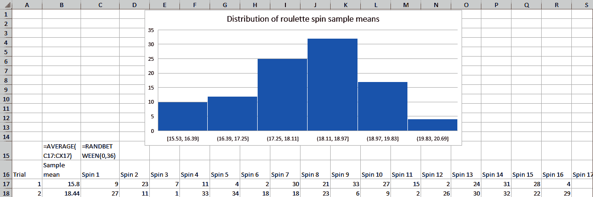

# 第二章。概率的基础

你有没有停下来考虑过你的气象学家所说的 30%降雨几率是什么意思？除非有水晶球，他们不能确定会下雨。也就是说，他们对一个*结果*感到*不确定*。但他们*能够*将这种不确定性量化为介于 0%（肯定不会下雨）和 100%（肯定会下雨）之间的值。

数据分析师，就像气象学家一样，没有水晶球。通常情况下，我们希望对整个人群做出断言，但只有样本数据。因此，我们也需要将不确定性量化为概率。

我们将从深入探讨概率的工作原理及其推导方式开始本章。我们还将使用 Excel 模拟一些统计学中最重要的定理，这些定理大多基于概率。这将为第三章和第四章的推断统计学在 Excel 中的实施奠定良好的基础。

# 概率与随机性

俗称，当某事似乎脱离上下文或杂乱无章时，我们说它是“随机”的。在概率论中，当我们知道事件将*有*一个结果，但不确定结果会是什么时，称之为*随机*。

以一个六面骰子为例。当我们掷骰子时，我们知道它会落在一面上，而不会消失或落在多面上。知道我们会得到*一个*结果，但不知道是*哪一个*结果，这就是统计学中所说的随机性。

# 概率和样本空间

我们知道，当骰子落地时，会显示一个介于一到六之间的数字。这些所有可能的结果构成了一个*样本空间*。每个结果都被赋予大于零的概率，因为骰子可能会落在任一面上。这些概率加在一起得到 1，因为我们确信结果将在样本空间中的这些可能性之一。

# 概率与实验

我们已经确定掷骰子是随机的，并且我们已经概述了它的*样本空间*。现在我们可以开始为这一随机事件构建实验。在概率论中，实验是可以无限重复的过程，其可能的结果构成了一个一致的样本空间。

有些实验需要多年的计划，但我们的实验幸运地很简单：掷骰子。每次我们这样做，我们会得到一个介于一到六之间的值。结果就是我们的输出。每次掷骰子称为实验的*试验*。

# 无条件和条件概率

根据我们目前对概率的了解，关于掷骰子的典型概率问题可能是：“掷出 4 的概率是多少？”这称为*边际*或*无条件*概率，因为我们只考虑一个事件的独立情况。

但如果有这样一个问题：“在上次试验中我们掷出 1 的情况下，掷出 2 的概率是多少？”要回答这个问题，我们需要讨论*联合*概率。有时候，在研究两个事件的概率时，我们知道其中一个事件的结果，但不知道另一个事件的结果。这被称为*条件*概率，计算方法之一就是 Bayes 定理。

我们不会在本书中涵盖 Bayes 定理及其适用的许多概率与统计领域，但它非常值得你未来的学习。查看 Will Kurt 的*Bayesian Statistics the Fun Way*（No Starch Press）可以获得出色的介绍。你会发现贝叶斯主义在数据处理中提供了独特的方法，有一些令人印象深刻的应用于分析中。

###### 注意

Bayes 定理形成的思想流派与本书中使用的所谓频率主义方法及大部分古典统计学有所不同。

# 概率分布

到目前为止，我们已经了解了什么使我们的掷骰子成为一个随机实验，并枚举了试验可能取值的样本空间。我们知道每个结果的概率之和必须等于 1，但每个结果的相对概率是多少呢？为此，我们可以参考*概率分布*。概率分布列出了事件可能取得的结果，以及每个结果的普遍程度。虽然概率分布可以写成正式的数学函数，但我们将集中于其数量输出。

在第一章中，你了解了离散和连续变量之间的区别。还有相关的离散和连续概率*分布*。让我们更深入地学习，从前者开始。

## 离散概率分布

我们将继续使用掷骰子的示例。这被认为是*离散*概率分布，因为结果是可数的：例如，掷骰子可能会得到 2 或 3，但永远不可能得到 2.25。

特别是，掷骰子属于*离散均匀*概率分布，因为每次试验的每个结果都同等可能发生：也就是说，掷出 4 和掷出 2 的可能性一样大，依此类推。具体而言，每个结果的概率为六分之一。

要继续学习本章中的 Excel 演示及其他演示，请转到本书的[存储库](https://oreil.ly/1hlYj)中的*ch-2.xlsx*文件。在大多数这些练习中，我已经完成了工作表的某些分段，并将在这里与您一起完成其余部分。首先查看*uniform-distribution*工作表。范围`A2:A7`中列出了每种可能的结果*X*。我们知道每种结果都有相同的可能性，所以我们在`B2:B7`中的公式应为`=1/6`。*P(X=x)*表示给定事件导致列出的结果的概率。

现在选择范围`A1:B7`，然后从功能区选择插入 > 聚类柱状图。你的概率分布和可视化应该像图 2-1 那样。

欢迎来到你的第一个，尽管有些乏味的概率分布。注意我们可视化中数值之间的间隔？这是一个明智的选择，表明这些是*离散*而不是连续的结果。

有时我们可能想知道一个结果的*累积*概率。在这种情况下，我们将所有概率的累积总和直到达到 100%（因为样本空间必须总和为 1）。我们将在`C`列中找到一个事件的概率*小于或等于*给定的结果。我们可以用公式`=SUM($B$2:B2)`在范围`C2:C7`中设置一个累积总和。


###### 图 2-1\. 六面骰子投掷的概率分布

现在，选择范围`A1:A7`，在 Windows 下按住 Ctrl 键或 Mac 下按住 Cmd 键，然后高亮显示`C1:C7`。选择这个非连续范围后，创建第二个聚类柱状图。你能在图 2-2 中看到概率分布和*累积*概率分布之间的差异吗？


###### 图 2-2\. 六面骰子投掷的概率与累积概率分布

基于逻辑和数学推理，我们一直假设每面骰子的概率为六分之一。这被称为我们的*理论概率*。我们也可以通过多次掷骰子并记录结果来实验性地找出概率分布。这被称为*实验概率*。毕竟，我们可能通过实验发现，每面骰子的概率实际上*并不*像理论推断的那样是六分之一，而是对某一面有偏好。

我们有几种选项来推导实验概率：首先，我们确实可以进行真正的实验。当然，多次掷骰子并记录结果可能会变得相当乏味。我们的另一个选择是让计算机来承担繁重的工作，并*模拟*实验。模拟通常能够相对准确地反映现实，经常用于当进行真实实验过于困难或耗时时。模拟的缺点是它可能无法反映出现实实验中的任何异常或特殊情况。

###### 注意

模拟经常用于分析中，以获取在实际实验中找出的结果，即使实际实验过于困难甚至不可能。

要模拟掷骰子的实验，我们需要一种以随机方式在一到六之间选择数字的方法。我们可以使用 Excel 的随机数生成器`RANDBETWEEN()`来做到这一点。你在书中看到的结果将与你自己尝试时得到的结果不同……但它们将都是一到六之间的随机数。

###### 警告

使用 Excel 的随机数生成器生成的个人结果将与书中记录的结果不同。

现在，转到*实验概率*工作表。在列`A`中，我们已经标记了 100 次骰子投掷的试验，我们希望记录结果。此时，你可以开始用真实骰子滚动并在列`B`中记录结果。更高效但不太真实的选择是使用`RANDBETWEEN()`模拟结果。

此函数接受两个参数：

```py
RANDBETWEEN(bottom, top)
```

我们使用的是六面体骰子，这使得我们的范围介于一到六之间：

```py
RANDBETWEEN(1, 6)
```

`RANDBETWEEN()`仅返回整数，这在本例中正是我们所需要的：再次强调，这是一个*离散*分布。使用填充手柄，你可以为所有 100 次试验生成一个结果。不要过于依赖当前的结果：在 Windows 中按下 F9，在 Mac 中按下 fn-F9，或从功能区选择公式 → 立即计算。这将重新计算你的工作簿，并重新生成随机数。

让我们比较在列`D-F`中骰子投掷的理论与实验概率。列`D`将用于列举我们的样本空间：数字一到六。在列`E`中，采用理论分布：`1/6`，或`16.67%`。在列`F`中，从列`A`和`B`中计算实验分布。这是我们在所有试验中发现每个结果的百分比。你可以使用以下公式找到这一点：

```py
=COUNTIF($B$2:$B$101, D2)/COUNT($A$2:$A$101)
```

选择你的范围`D1:F7`，然后从功能区中选择插入 → 聚类柱状图。你的工作表现在应该看起来像图 2-3。试着重新计算几次。


###### 图 2-3\. 六面体骰子投掷的理论与实验概率比较

根据我们的实验分布，我们预测每个数字滚动的可能性相等是正确的。当然，我们的实验分布不是*完全*与理论相同：由于随机机会，总会有一些误差。

然而，实际进行实验时可能会出现与我们从模拟中得出的结果不同的情况。也许真实情况下的骰子*并不*公平，而我们依赖自己的推理和 Excel 的算法可能忽视了这一点。这似乎是个琐碎的细节，但实际生活中的概率通常不像我们（或我们的计算机）所预期的那样行为。

离散均匀分布是许多离散概率分布之一；在分析中常用的其他分布包括二项分布和泊松分布。

## 连续概率分布

当结果可以在两个值之间取任意可能值时，分布被认为是连续的。我们在这里将重点放在正态分布，或者*钟形曲线*上，如直方图所示。你可能熟悉这个著名的形状，见于图 2-4。

在这个图表中，你会看到一个完全对称的分布，以变量的平均值（μ）为中心。让我们深入了解正态分布是什么，以及它告诉我们的内容，使用 Excel 来说明基于它的基本统计概念。


###### 图 2-4\. 用直方图描述的正态分布

正态分布很值得回顾，因为它在自然界中非常常见。例如，图 2-5 展示了学生身高和酒的 pH 值的分布直方图。这些数据集可以在本书的[仓库](https://oreil.ly/1hlYj)中找到，你可以在 *heights* 和 *wine* 文件夹下探索这些数据集。


###### 图 2-5\. 现实生活中两个服从正态分布的变量：学生身高和酒的 pH 值

你可能想知道我们如何知道一个变量是否服从正态分布。好问题。回想一下我们的骰子投掷例子：我们列举了所有可能的结果，推导出一个理论分布，然后通过模拟推导出一个实验分布，以比较两者。将图 2-5 中的直方图视为它们自己的*实验分布*：在这种情况下，数据是手动收集的，而不是依赖于模拟。

有几种方法可以确定现实生活中的数据集及其实验分布是否接近理论正态分布。现在，我们将寻找那个显著的钟形曲线直方图：一个对称的形状，大多数值集中在中心附近。其他方法包括评估偏度和峰度，它们是衡量分布对称性和尖峭度的两个附加摘要统计数据。还可以使用统计推断方法来检验正态性。你将在第三章中学习统计推断的基础知识。但现在，我们将遵循这个规则：“看到了就知道是。”

###### 警告

当你处理真实数据时，你在处理*实验*分布。它们永远不会完全匹配理论分布。

正态分布为我们提供了一些易于记忆的指导原则，用于描述我们期望在距离平均值一定标准差范围内找到观察值的百分比。具体来说，对于一个正态分布的变量，我们期望：

+   68% 的观察值落在平均值一个标准差范围内。

+   95% 的观察值落在平均值两个标准差范围内。

+   99.7% 的观察值落在平均值三个标准差范围内。

这被称为*经验法则*，或者*68–95–99.7 法则*。让我们通过 Excel 看它的实际应用。接下来，转到 *经验法则* 工作表，如 图 2-6 所示。


###### 图 2-6\. *经验法则*工作表的开头

在 `A10:A109` 单元格中，我们有值 1–100。在 `B10:B109` 单元格中，我们的目标是找出以均值为 50 和标准差为 10（分别在 `B1` 和 `B2` 单元格中）的正态分布变量将取得这些值的观测百分比。然后我们将找出均值在一个、两个和三个标准差范围内观测的百分比在 `C10:E109` 中。完成后，右侧的图表将得到填充。`C4:E4` 单元格还将找到每列的总百分比。

正态分布是连续的，这意味着观测理论上可以取得两个值之间的任何值。这使得为*很多*结果分配概率成为可能。为简单起见，通常将这些观察结果分组到离散的范围内。概率质量函数（PMF）将返回在观察范围内每个离散区间中找到的概率。我们将使用 Excel 的 `NORM.DIST()` 函数来计算我们变量在范围 1–100 内的 PMF。由于这个函数比之前使用的其他函数更复杂，因此我在 表 2-1 中描述了每个参数。

表 2-1\. `NORM.DIST()` 所需的参数

| **Argument** | **描述** |
| --- | --- |
| `X` | 您想要找到概率的结果 |
| `Mean` | 分布的均值 |
| `Standard_dev` | 分布的标准差 |
| `Cumulative` | 如果为 `TRUE`，则返回累积函数；如果为 `FALSE`，则返回质量函数 |

我们的工作表的 `A` 列包含我们的结果，`B1` 和 `B2` 包含我们的均值和标准差，我们希望得到质量而不是累积分布。累积会返回概率的累积和，而这里我们不需要。这使得我们的公式为 `B10`：

```py
=NORM.DIST(A10, $B$1, $B$2, 0)
```

使用填充手柄，您将得到每个值从 0 到 100 的观测概率百分比。例如，您将在 `B43` 单元格中看到，观测等于 34 的概率大约为 1.1%。

我们可以看到在 `B4` 单元格中，结果有 99.99%的概率落在 1 到 100 之间。重要的是，这个数字并不等于 100%，因为连续分布中的观测可以取得*任何*可能的值，而不仅仅是从 1 到 100。在 `C7:E8` 单元格中，我编写了公式来找出我们均值在一个、两个和三个标准差范围内的值。

我们可以使用这些阈值以及条件逻辑来找出在列 `B` 中我们概率质量函数的哪些部分可以在这些相应区域内找到。在 `C10` 单元格中输入以下公式：

```py
=IF(AND($A10 > C$7, $A10 < C$8), $B10, "")
```

如果列 `A` 的值在标准差范围内，此函数将从列 `B` 中传递概率。如果落在范围之外，则单元格为空白。使用填充手柄，你可以将此公式应用于整个范围 `C10:E109`。现在你的工作表应该像 图 2-7 所示。


###### 图 2-7\. 在 Excel 中演示的经验法则

单元格 `C4:E4` 表明，大约有 65.8%、94.9% 和 99.7% 的值分别位于均值的一个、两个和三个标准差内。这些数字非常接近于 68-95-99.7 法则。

现在，看一下产生的可视化效果：我们可以看到大多数观察值都在一个标准差内，更多的观察值在两个标准差内。到了三个标准差，很难看到 图 2-8 中没有覆盖的部分，但那部分仍然存在。（请记住，这只是所有观察值的 0.3%。）


###### 图 2-8\. 在 Excel 中可视化的经验法则

当你把我们的例子的标准差改为八时会发生什么？改为十二时呢？钟形曲线的形状始终对称地围绕均值 50 中心展开和收缩：较低的标准差导致“更紧密”的曲线，反之亦然。无论如何，经验法则大致适用于数据。如果你将均值移动到 49 或 51，你会看到曲线的“中心”沿着 x 轴移动。一个变量可以具有任何均值和标准差，仍然可以服从正态分布；其结果的概率质量函数将是不同的。

图 2-9 展示了两个具有不同均值和标准差的正态分布。尽管它们的形状非常不同，它们仍然遵循经验法则。


###### 图 2-9\. 不同的正态分布

###### 注意

正态分布可以具有任意可能的均值和标准差的组合。结果的概率密度函数会有所变化，但大致上会遵循经验法则。

正态分布之所以重要，还因为它在中心极限定理中的地位。出于你将在本章和以下章节看到的原因，我称这个定理为统计学的“缺失链接”。

作为中心极限定理的一个示例，我们将使用另一种常见的赌博游戏：轮盘赌。欧洲轮盘赌盘上任何数字落下的概率都是相等的（相比之下，美国轮盘赌盘上的槽口标有 0 和 00）。基于你对掷骰子的了解，这是一种什么样的概率分布？这是一个离散均匀分布。看起来我们在一个关于正态分布的演示中分析这种分布是否有些奇怪？好吧，这里要感谢中心极限定理。要亲自看到这个定理的作用，请前往 *roulette-dist* 工作表，并在 `B2:B101` 中使用 `RANDBETWEEN()` 模拟轮盘赌 100 次：

```py
RANDBETWEEN(0, 36)
```

使用直方图来可视化结果。你的工作表应该像图 2-10 那样。尝试重新计算几次。你会发现每次都得到一个看起来非常平坦的直方图。这确实是一个离散均匀分布，即在 0 到 36 之间每个数字落下的概率是相等的。


###### 图 2-10\. 模拟轮盘赌结果的分布

现在前往 *roulette-sample-mean-dist* 工作表。在这里我们将做一些有些不同的事情：我们将模拟 100 次轮盘赌，然后取这些结果的平均值。我们将这样做 100 次，并将这些试验均值的分布作为直方图显示。这种“均值的平均值”被称为*样本均值*。一旦你使用 `RANDBETWEEN()` 和 `AVERAGE()` 函数完成这些操作，你应该能看到类似于 图 2-11 的结果。



###### 图 2-11\. 模拟轮盘赌结果的样本均值分布

现在这个分布不再像一个矩形：实际上，它看起来像一个钟形曲线。它是对称的，大多数观察值都聚集在中心周围：现在我们有了一个正态分布。当轮盘赌结果本身不是正态分布时，我们的样本均值分布如何能够呈现正态分布？欢迎来到被称为中心极限定理的这种非常特殊的魔力（CLT）。

具体来说，中心极限定理告诉我们：

> 如果样本量足够大，样本均值的分布将近似于正态分布。

这一现象是一个游戏规则改变者，因为它使我们能够利用正态分布的独特特性（比如经验法则），来推断一个变量的样本均值，即使这个变量本身并不服从正态分布。

你注意到了细则吗？中心极限定理仅在“样本量足够大”的情况下适用。这是一个重要的声明，但也是一个模糊的声明：多大才算足够大呢？让我们通过另一个 Excel 演示收集一些想法。前往 *law-of-large-numbers* 工作表参与。在列 `B` 中，我们可以使用 `RANDBETWEEN(0, 36)` 模拟 300 次轮盘赌结果的实验。

在列`C`中，我们想要获取结果的运行平均值。我们可以使用混合引用；在列`C`中输入以下内容，并将其拖动到你的 300 次试验旁边：

```py
=AVERAGE($B$2:B2)
```

这将导致找到列`B`的运行平均值。选择你在列`C`中得到的数据，然后转到功能区，点击“插入”→“线条”。查看你的折线图，并重新计算工作簿几次。每次模拟的结果都会与图 2-12 所示有所不同，但模式上平均值倾向于在更多的旋转中收敛到 18，这是合理的：它是 0 到 36 之间的平均值。这个预期的数字称为*期望值*。


###### 图 2-12。在 Excel 中可视化的大数定律

这种现象被称为*大数定律*（LLN）。正式地说，大数定律告诉我们：

> 从试验中得到的结果的平均值随着试验次数的增加越来越接近期望值。

尽管如此，这个定义引发了我们首先提出的问题：为了中心极限定理适用，样本量需要有多大？你经常听到 30 作为一个阈值。更保守的指导方针可能要求样本量为 60 或 100。考虑到这些样本量的指导方针，请回顾图 2-12。看看它确实在这些阈值周围更接近期望值？

###### 注

大数定律为符合中心极限定理的足够样本量提供了一个宽泛的经验法则。

样本量为 30、60 和 100 仅为经验法则；有更严格的方法来确定需要应用中心极限定理的样本量。目前，请记住：只要我们的样本量达到这些阈值，我们的样本均值应该接近期望值（多亏了大数定律），并且还应该服从正态分布（多亏了中心极限定理）。

存在几种连续概率分布，如指数分布和三角形分布。我们专注于正态分布，既因为它在现实世界中的普遍性，也因为它特殊的统计特性。

# 结论

正如本章开头提到的那样，数据分析师生活在一个充满不确定性的世界中。具体来说，我们经常希望对整个人群做出声明，而只拥有样本数据。利用本章介绍的概率框架，我们将能够在量化其固有不确定性的同时做到这一点。在第三章中，我们将深入探讨假设检验的要素，这是数据分析的核心方法。

# 练习

利用 Excel 和你对概率的了解，考虑以下情况：

1.  投掷一个六面骰子的期望值是多少？

1.  考虑一个均值为 100，标准差为 10 的正态分布变量。

    +   变量观察值取 87 的概率是多少？

    +   你预计观察结果中有多少百分比会落在 80 和 120 之间？

1.  如果欧洲轮盘赌的期望值是 18，这是否意味着你押注 18 比其他号码更划算呢？
