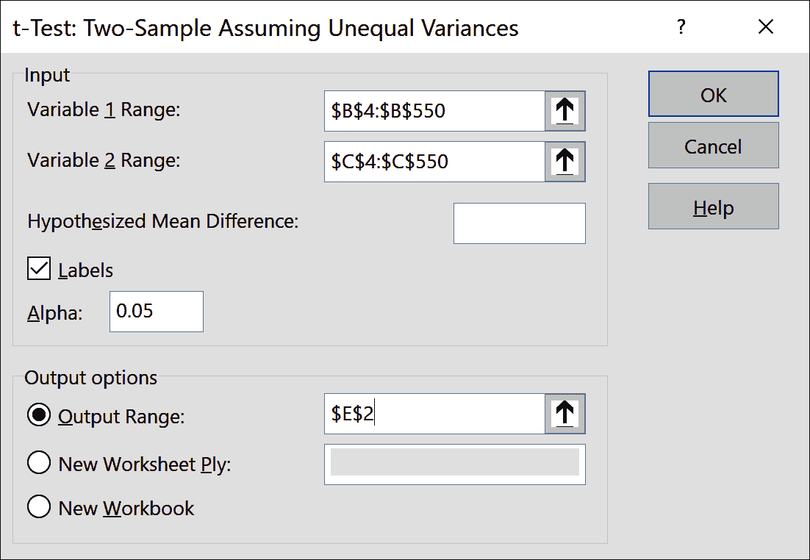

# 第三章. 推断统计基础

第一章提供了一个通过分类、总结和可视化变量探索数据集的框架。尽管这是分析的重要起点，但我们通常不希望止步于此：我们想知道我们在样本数据中看到的是否可以*推广*到更大的总体。

问题在于，我们实际上不知道在总体中会找到什么，因为我们没有所有数据。然而，利用第第二章介绍的概率原理，我们可以量化我们在样本中看到的东西也会在总体中找到的不确定性。

根据样本估计人口值被称为*推断统计*，并由*假设检验*执行。这一框架是本章的基础。您可能在学校学过推断统计学，这可能很容易让您对这门学科感到反感，似乎难以理解且无法应用。这就是为什么我会尽可能地将本章应用于现实，使用 Excel 探索真实数据集。

到本章结束时，您将掌握这种支持大部分分析的基本框架。我们将继续在第四章中扩展其应用。

第一章以*房屋*数据集上的练习作为结束，这将成为本章的重点。您可以在书籍库的*数据集*文件夹中的*房屋*子文件夹中找到数据集。制作一份副本，添加索引列，并将此数据集转换为名为*房屋*的表格。

# 统计推断的框架

基于样本推断人口特征的能力似乎像是魔术，不是吗？就像任何魔术技巧一样，推断统计学对外人来说可能看起来很容易。但对于内部人员来说，这是一系列精细调节步骤的结合：

1.  *收集代表性样本*。这在*假设检验*之前，但对其成功至关重要。我们必须确保收集的样本公平地反映了总体。

1.  *提出假设*。首先，我们将提出一个*研究假设*，或者一个解释我们人口中某些事物的陈述，并认为这解释某些人口特征。然后，我们将陈述一个*统计假设*，以测试数据是否支持这一解释。

1.  *制定分析计划*。然后我们将概述我们将用来进行此测试的方法，以及我们将用来评估它的标准。

1.  *分析数据*。这是我们实际上进行数字分析和开发证据的地方，我们将用它来评估我们的测试。

1.  *作出决策*。这是真相的时刻：我们将比较第 2 步的评估标准与第 3 步的实际结果，并得出结论，证据是否支持我们的统计假设。

对于每一个步骤，我将提供一个简要的概念概述。然后我们将立即将这些概念应用于*房屋*数据集。

## 收集一个具有代表性的样本

在 第二章 中，你学到了，由于大数定律的存在，样本均值的平均值应该随着样本大小的增加而越来越接近期望值。这形成了一个经验法则，用于确定进行推断统计所需的充分样本大小。不过，我们假设，我们处理的是一个*代表性*样本，或者说是一个公正反映人口的一组观察。如果样本不具有代表性，我们就不能假设其样本均值会随着更多观察逼近人口均值。

确保一个具有代表性的样本最好是在研究的概念化和收集阶段进行处理；一旦数据收集完成，要回到与抽样相关的任何问题就很难了。收集数据有许多方法，但是虽然它是分析工作流程的重要组成部分，但它超出了本书的范围。

###### 注意

确保具有代表性样本的最佳时间是在数据收集过程中。如果你正在使用预先组装的数据集，请考虑为达到这个目标而采取了哪些步骤。

获得人口代表性样本会引发一个问题：什么是目标人口？这个人口可以是我们想要的任何一般或特定的。例如，假设我们有兴趣探索狗的身高和体重。我们的人口可以是所有狗，或者可以是特定品种。也可以是某个年龄组或性别的狗。一些目标人口可能在理论上更重要，或者在逻辑上更容易抽样。你的目标人口可以是任何东西，但你对该人口的样本必须是具有代表性的。

在 546 次观察中，*房屋*可能是进行有效推断统计的足够大的样本。但是，它是否具有代表性呢？如果没有对收集方法或目标人口的一些理解，很难确定。这些数据来自同行评审的*应用计量经济学杂志*，因此是可信的。你在工作中接收的数据可能不会像这样经过精心处理，因此思考或询问收集和抽样过程是值得的。

至于数据的目标人口，书库中*数据集*→*房屋*下的 *readme* 文件指示其来自加拿大安大略省温莎市的房屋销售。这意味着温莎市的房价可能是最佳的目标人口；例如，其结果可能或可能不会转移到加拿大甚至安大略省的其他房价。这也是一个较旧的数据集，取自上世纪 90 年代的一篇论文，因此不能保证其结果适用于今天的房地产市场，即使是在温莎市。

## 提出假设

在一定程度上，我们的样本数据代表了总体，我们可以开始思考我们希望通过陈述假设推断出的具体内容。也许你听说过数据中的某种趋势或不寻常的现象。也许在进行探索性数据分析时，数据中的某些内容引起了你的注意。这是你推测分析结果时的时机。回到我们的*房地产*示例，我想很少有人会否认，在家中拥有空调是令人向往的。因此，可以推断，拥有空调的房屋销售价格高于没有空调的房屋。关于数据中这种关系的非正式陈述被称为*研究假设*。另一种陈述这种关系的方式是，空调对销售价格有*影响*。温莎的房屋是我们的*总体*，而拥有和没有空调的这些房屋则是其两个组或*亚总体*。

现在，你对空调如何影响销售价格有了自己的假设，这非常棒。作为分析师，对自己的工作有强烈的直觉和看法是至关重要的。但正如美国工程师 W. Edwards Deming 所说，“信仰上帝，其他人必须带来数据。”我们真正想知道的是，你所推测的关系是否确实存在于总体中。为此，我们需要使用推断统计学。

正如你已经看到的那样，统计语言通常不同于日常语言。起初可能会感觉有些学究，但其中的细微差别揭示了关于数据分析如何工作的很多内容。*统计假设*就是其中之一。为了测试数据是否支持我们提出的关系，我们将提出两个如下所示的统计假设。现在先看一眼它们；稍后会解释它们：

H0

有空调和没有空调的房屋的平均销售价格没有差异。

Ha

有空调和没有空调的房屋的平均销售价格存在差异。

从设计上来说，这些假设是互斥的，所以如果一个成立，另一个必定为假。它们也是可测试和可证伪的，这意味着我们可以使用现实世界的证据来衡量并推翻它们。这些都是关于科学哲学的大思想主题，我们无法在这里完全涵盖；主要的要点是，你希望确保你的假设确实可以通过数据来测试。

此时，我们需要摒弃所有关于数据的预设观念，比如在研究假设中推测的内容。我们现在假设*没有*效应。毕竟，为什么要有？我们只有总体数据的*样本*，因此我们永远无法真正了解总体的真实值或参数。这就是为什么第一个假设，或称为*零假设*的 H0，被如此奇特地陈述。

另一方面是*备择假设*，或者说是 Ha。如果数据中没有证据支持零假设，那么根据它们的陈述方式，证据必须是支持备择假设的。也就是说，我们永远不能说我们已经 *证明* 其中任何一个为真，因为我们实际上并不知道总体参数。可能我们在样本中找到的效应只是偶然事件，而在总体中我们并没有真正找到它。事实上，测量这种情况发生的概率将是我们在假设检验中所做的主要内容之一。

###### 注意

假设检验的结果并不会 "证明" 任何一个假设是正确的，因为首先我们并不知道总体的 "真实" 参数。

## 制定分析计划

现在我们已经准备好了我们的统计假设，是时候指定用于测试数据的方法了。对于给定假设的适当统计检验取决于多种因素，包括分析中使用的变量类型：连续的、分类的等等。这也是在探索性数据分析期间对变量进行分类的一个好理由。具体来说，我们决定使用的测试取决于我们的自变量和因变量的类型。

因果关系的研究驱动我们在分析中所做的大部分工作；我们使用 *自变量* 和 *因变量* 来建模和分析这些关系。（请记住，由于我们处理的是样本，因果关系不可能确凿无误。）我们在 第二章 中讨论了实验的概念，即可重复事件产生一组定义好的随机结果。我们以掷骰子为例进行了实验；而现实生活中的大多数实验要复杂得多。让我们来看一个例子。

假设我们是一些对促进植物生长有兴趣的研究人员。一位同事推测浇水可能会产生积极影响。我们决定通过实验来验证这一点。我们在观察中提供不同量的水，并确保记录数据。然后我们等几天并测量所得的植物生长情况。在这个实验中，我们有两个变量：浇水量和植物生长。你能猜出哪个是我们的自变量，哪个是我们的因变量吗？

浇水是 *自变量*，因为这是我们作为研究人员在实验中控制的部分。植物生长是 *因变量*，因为我们假设在自变量改变的情况下会发生变化。自变量通常首先记录：例如，首先浇水给植物，然后它们生长。

###### 注意

自变量通常是在因变量之前记录的，因为因果必须先于效果。

鉴于这个例子，模拟空调和销售价格之间的关系的更合理的方式是什么？ 合理的推断是先安装空调，*然后*出售房屋。 这使得*airco*和*price*成为我们的自变量和因变量，分别。

因为我们正在测试一个二元独立变量对一个连续依赖变量的影响，所以我们将使用一种称为*独立样本 t 检验*的方法。 不必担心记住在任何情况下使用的最佳检验。 相反，这里的目标是掌握根据样本对总体进行推断的常见框架。

大多数统计测试对其数据做出一些假设。 如果这些假设不成立，则测试结果可能不准确。 例如，独立样本 t 检验假设没有观察值相互影响，并且每个观察值只出现在一个且仅一个组中（即它们是*独立的*）。 为了充分估计总体均值，该测试通常假设样本呈正态分布； 也就是说，鉴于中心极限定理的神奇，对于较大的数据集，可以绕过该约束。 Excel 将帮助我们绕过另一个假设：每个总体的方差相等。

我们知道我们将使用什么测试，但我们仍然需要制定一些实施规则。 首先，我们需要决定测试的*统计显著性*。 让我们回到先前提到的场景，其中在样本中推断的效果只是一个偶然事件，不会在总体中被发现。 这种情况最终会发生，因为我们实际上永远不会知道总体均值。 换句话说，我们对此结果*不确定*... 正如您在第二章中学到的，可以将不确定性量化为 0 和 1 之间的数字。 这个数字称为*阿尔法*，表示测试的统计显著性。

阿尔法显示了我们对于在总体中实际上没有效果，但由于偶然因素我们在样本中发现了一个效果的可能性有多舒适。 在本书中，我们将使用的常见阈值为 5%。 换句话说，当数据中实际上没有关系时，我们对声称数据中存在关系感到舒适的时间不到 5%。

###### 注意

本书遵循在 5%的统计显著水平上进行双尾假设检验的标准约定。

其他常见的显著水平包括 10%或 1%。 没有一个“正确”的阿尔法水平；设置它取决于多种因素，如研究目标、易于解释等等。

您可能想知道为什么我们对声称存在效果时根本不感到舒服。换句话说，为什么不将α设为 0 呢？在这种情况下，我们无法对我们的样本给出关于总体的*任何*结论。事实上，如果α为 0，我们将会说，因为我们绝不希望关于总体的真实值错了，它可能是任何值。为了做出任何推断，犯错是我们必须承担的风险。

我们还需要说明我们感兴趣的*方向*。例如，我们假设空调对销售价格有*正面*影响：即带有空调的房屋平均销售价格高于没有空调的房屋。然而，可能出现负面影响：你可能正在处理一个更倾向于没有空调的人群。或者，也可能是一个很少需要使用空调的气候，拥有空调是不必要的开支。这些情况在理论上是可能的；如果有任何疑问，那么统计检验应该同时考虑正面和负面影响。这被称为*双尾*（或 Excel 中称为双尾）检验，我们将在本书中使用它。单尾检验是可能的，但相对罕见，超出了我们的范围。

当然，在我们甚至还没有触及数据之前，这可能看起来有些冗长。但这些步骤存在的目的是确保我们作为分析师在最终进行计算时公正地看待数据。我们的假设检验结果取决于统计显著性水平和检验的尾部数。正如您稍后将看到的那样，测试中略微不同的输入，如不同的统计显著性水平，可能导致不同的结果。这确实会诱使我们先算出结果，*然后*决定进行哪种具有有利结果的特定测试。然而，我们希望避免因为调整结果以符合我们的议程而产生的冲动。

## 分析数据

现在，您可能一直在等待的时刻到了：是时候开始处理数据了。这部分工作通常受到最多的关注，也是我们将重点关注的内容，但值得注意的是，这只是假设检验的许多步骤之一。请记住，数据分析是一个迭代过程。在进行假设检验之前，您几乎不可能（也不明智）不对这些数据进行*任何*分析。事实上，探索性数据分析被设计为假设检验或*确认性*数据分析的先导。在开始分析之前，您应该*始终*对数据集的描述性统计感到满意。在这种精神下，让我们通过我们的*房屋*数据集进行这些操作，然后进行分析。

图 3-1 计算了 *airco* 两个级别的 *price* 的描述统计信息，并可视化了它们的分布。如果您需要了解如何执行此操作，请查看 第一章。我重新标记了 ToolPak 输出，以帮助指示每个组中正在测量的内容。

###### 图 3-1. 房屋数据集的 EDA

此输出中的直方图向我们显示，两组数据都近似服从正态分布，而描述性统计告诉我们，我们有相对较大的样本大小。虽然没有空调的房屋更多（373 个没有，173 个有），但这不一定是 t 检验的问题。

###### 注意

独立样本 t 检验对两组之间的样本大小差异不敏感，只要每组足够大。其他统计测试可能会受到这种差异的影响。

图 3-1 还向我们提供了我们的组的样本均值：大约为 86,000 美元的有空调房屋，以及 60,000 美元的没有空调房屋。知道这一点很好，但我们真的希望知道在整个人口中是否可以期望这样的影响。这就是 t 检验的作用，我们将再次依靠数据透视表和数据分析 ToolPak 进行进行。

在新工作表中插入一个数据透视表，将*id*放在行区域，*airco*放在列区域，将“价格总和”放在值区域。清除报表中的所有总计。这种数据排列将很容易输入到 t-Test 菜单中，可以通过数据选项卡的数据分析 → t-Test: Two-Sample Assuming Unequal Variances 访问。这里所指的“方差”是我们的子群体方差。我们真的不知道这些是否相等，所以最好选择这个选项，假设方差相等以获得更保守的结果。

会出现一个对话框；按照 图 3-2 的方式填写它。确保标签旁边的框已选中。在此选择上方有一个名为假设的均值差异的选项。默认情况下，这是空白的，这意味着我们正在测试零的差异。这恰好是我们的零假设，所以我们不需要改变任何内容。在该行下方即可看到一个名为 Alpha 的选项。这是我们声明的统计显着水平；Excel 默认为 5%，这正是我们想要的。  

###### 图 3-2. ToolPak 中的 t-检验设置菜单

结果显示在 图 3-3 中。我再次将每个组标记为 *ac-no* 和 *ac-yes*，以澄清代表的组。接下来我们将逐步讨论输出的部分。

###### 图 3-3. t-检验输出

首先，我们在 `F5:G7` 中给出了有关我们的两个样本的一些信息：它们的均值、方差和样本大小。我们的假设的均值差异为零也包括在内。

我们将跳过一些统计内容，接下来专注于单元格 `F13`，*P(T <= t) 双尾*。这可能对你来说并不意味着什么，但*双尾*应该听起来很熟悉，因为这是我们早些时候决定专注于而不是单尾检验的类型。这个数字被称为*p 值*，我们将用它来对假设检验做出决策。

## 做出决策

之前您了解到 alpha 是我们的统计显著性水平，或者说是我们在假设在总体中没有真实效应的情况下，由于我们在样本中找到的效应是由于随机机会造成的，我们感到舒服的水平。p 值量化了我们在数据中找到这种情况的概率，并将其与 alpha 进行比较以做出决策：

+   如果 p 值小于或等于我们的显著性水平 alpha，则我们拒绝零假设。

+   如果 p 值大于我们的显著性水平 alpha，则我们无法拒绝零假设。

让我们通过手头的数据来理解这些统计术语。作为概率，p 值始终介于 0 和 1 之间。在我们的 `F13` 中，我们的 p 值非常小，小到 Excel 用科学计数法来标记它。读取这个输出的方法是将其解释为 1.93 乘以 10 的负 22 次方——一个*非常*小的数。因此，我们在说，如果在总体中真的没有效应，我们预计会在样本中发现我们所观察到的效应的情况非常少，远低于 1% 的时间。这远低于我们设定的 5% 的显著性水平，因此我们可以拒绝零假设。当 p 值如此之小以至于需要用科学计数法来报告时，通常会简单地总结为 “p < 0.05”。

另一方面，假设我们的 p 值是 0.08 或者 0.24。在这些情况下，我们将*无法*拒绝零假设。为什么会有这种奇怪的说法？为什么我们不直接说我们“证明”了零假设或备择假设呢？一切都归结于推断统计的固有不确定性。我们永远不知道真实的子群体数值，因此更安全的做法是假设它们相等。我们的检验结果可以确认或否认对任一假设的证据，但它们永远不能明确地*证明*它。

虽然 p 值用于对假设检验做出决策，但了解它们*不能*告诉我们的内容同样重要。例如，一个常见的误解是 p 值是犯错误的概率。事实上，p 值*假设*我们的零假设为真，不管在样本中找到什么；样本中存在“错误”的概念并不改变这一假设。p 值*只*告诉我们，在总体中没有效应的情况下，我们会在我们的样本中找到我们所观察到的效应的百分比。

###### 注记

p 值*不是*犯错误的概率；相反，它是我们在样本中找到观察到的效应的概率，假设总体中没有效应。

另一个常见的误解是 p 值越小，效应越大。然而，p 值只是*统计*显著性的一个度量：它告诉我们在总体中发生效应的*可能性*有多大。p 值并不表示*实质性*显著性，即效应大小可能有多大。统计软件通常只报告统计显著性而不是实质显著性。我们的 Excel 输出就是一个例子：它返回了 p 值，但没有返回*置信区间*，即我们预期在总体中找到的范围。

我们可以使用测试的所谓临界值，在图 3-3 的 F14 单元格中显示，来计算置信区间。这个数字（1.97）可能看起来是任意的，但是实际上可以根据你在第二章学到的知识来理解它。通过这个 t 检验，我们得出了平均房价差异的样本。如果我们继续随机取样并绘制平均差异的分布，这个分布将是……没错，*正态*的，这是由于中心极限定理。

对于正态分布，根据经验法则，我们可以预期大约 95% 的观测值落在平均值的两个标准差内。在均值为 0，标准差为 1 的特殊情况下（称为*标准*正态分布），我们可以说大约 95% 的观测值会落在 -2 到 2 之间。稍微具体一点，它们会落在 -1.96 到 1.96 之间，这就是双尾临界值的来源。图 3-4 展示了我们预期在其中找到具有 95% 置信度的总体参数的区域。

###### 图 3-4\. 在直方图上可视化的 95% 置信区间和临界值

方程 3-1 显示了寻找双尾独立样本 t 检验置信区间的公式。我们将在 Excel 中计算标记的元素。

##### 方程 3-1\. 寻找置信区间的公式

<math alttext="c period i period equals left-parenthesis upper X overbar Subscript 1 Baseline minus upper X overbar Subscript 2 Baseline right-parenthesis plus-or-minus t a Subscript slash 2 Baseline times StartRoot StartFraction s 1 squared Over n 1 EndFraction plus StartFraction s 2 squared Over n 2 EndFraction EndRoot" display="block"><mrow><mtext>c.</mtext> <mi>i</mi> <mo>.</mo> <mo>=</mo> <mfenced close=")" open="(" separators=""><msub><mover accent="true"><mi>X</mi> <mo>¯</mo></mover> <mn>1</mn></msub> <mo>-</mo> <msub><mover accent="true"><mi>X</mi> <mo>¯</mo></mover> <mn>2</mn></msub></mfenced> <mo>±</mo> <mi>t</mi> <msub><mi>a</mi> <mrow><mo>/</mo><mn>2</mn></mrow></msub> <mo>×</mo> <msqrt><mrow><mfrac><msubsup><mi>s</mi> <mrow><mn>1</mn></mrow> <mn>2</mn></msubsup> <msub><mi>n</mi> <mn>1</mn></msub></mfrac> <mo>+</mo> <mfrac><msubsup><mi>s</mi> <mrow><mn>2</mn></mrow> <mn>2</mn></msubsup> <msub><mi>n</mi> <mn>2</mn></msub></mfrac></mrow></msqrt></mrow></math>

要详细解释这个公式，<math alttext="left-parenthesis upper X overbar Subscript 1 Baseline minus upper X overbar Subscript 2 Baseline right-parenthesis"><mfenced close=")" open="(" separators=""><msub><mover accent="true"><mi>X</mi> <mo>¯</mo></mover> <mn>1</mn></msub> <mo>-</mo> <msub><mover accent="true"><mi>X</mi> <mo>¯</mo></mover> <mn>2</mn></msub></mfenced></math> 是点估计，<math alttext="t a Subscript slash 2"><mrow><mi>t</mi> <msub><mi>a</mi> <mrow><mo>/</mo><mn>2</mn></mrow></msub></mrow></math> 是关键值，<math alttext="StartRoot StartFraction s 1 squared Over n 1 EndFraction plus StartFraction s 2 squared Over n 2 EndFraction EndRoot"><msqrt><mrow><mfrac><msubsup><mi>s</mi> <mrow><mn>1</mn></mrow> <mn>2</mn></msubsup> <msub><mi>n</mi> <mn>1</mn></msub></mfrac> <mo>+</mo> <mfrac><msubsup><mi>s</mi> <mrow><mn>2</mn></mrow> <mn>2</mn></msubsup> <msub><mi>n</mi> <mn>2</mn></msub></mfrac></mrow></msqrt></math> 是标准误差。关键值和标准误差的乘积是误差边界。

这个方程可能相当令人生畏，所以为了使其更具体，我已经计算了我们示例中的置信区间及其各个元素，见图 3-5。与其对正式方程感到困扰，我们的重点将放在计算结果和理解它们所告诉我们的内容上。

###### 图 3-5\. 在 Excel 中计算置信区间

首先，在单元格`F16`中的*点估计*，或者我们最有可能找到的总体效应。这是我们样本均值的差异。毕竟，如果我们的样本代表总体，样本和总体均值之间的差异应该可以忽略不计。但实际上可能不完全相同；我们将推导出一个值范围，在这个范围内，我们有 95%的信心可以找到这个真实差异。

接下来，在单元格`F17`中的关键值。Excel 为我们提供了这个数字，但为了分析方便，我在这里包含了它。如前所述，我们可以使用这个值来帮助我们找到落在平均值大约两个标准偏差内的 95%值。

现在我们有了单元格`F18`中的标准误差。你实际上在 ToolPak 的描述性统计输出中见过这个术语；例如见图 3-1。要理解标准误差的工作原理，想象一下，如果你不断地从总体中重新抽取房价样本。每次，你都会得到略有不同的样本均值。这种变异性称为*标准误差*。较大的标准误差意味着样本在代表总体方面的准确性较低。

对于一个样本的标准误差可以通过将其标准偏差除以其样本大小来找到。因为我们正在找到平均值差异的标准误差，所以公式稍微复杂一些，但模式相同：样本的变异性在分子中，观察数在分母中。这是合理的：当我们收集更大的样本大小时，我们预期它们在与人群的变异性方面表现得更少。

现在我们将临界值与标准误的乘积得出在单元格 `F19` 中的*误差边界*。这可能是你听过的一个术语：投票经常会包含此数字。误差边界提供了围绕我们点估计的变异性的估计。在图 3-5 的情况下，我们说，虽然我们认为人口差异是$25,996，但我们可能会偏差多达$4,784。

因为这是一个双尾检验，这种差异可以在*任何方向*找到。因此，我们需要减去和添加误差边界以分别推导置信区间的下限和上限。这些数字分别在 `F20` 和 `F21` 中找到。最重要的是？以 95%的置信水平，我们相信有空调的房屋的平均价格比没有空调的房屋高出$21,211 到$30,780。

为什么要费心推导置信区间？作为实质性而非统计显著性的衡量，它通常在普通受众中更受欢迎，因为它将统计假设检验的结果翻译回研究假设的语言。例如，想象你是一家银行的研究分析师，向管理层报告此项有关房价的研究结果。这些经理如果依赖职业生涯来进行 t 检验，他们可能不知从何处开始——但是他们的职业生涯*确实*依赖于从该分析中做出明智的决策，因此您希望尽可能使其易于理解。哪种声明您认为将更有帮助？

+   “我们拒绝了零假设，即在 p < 0.05 的情况下，有空调和没有空调的房屋的平均售价没有差异。”

+   “以 95%的置信水平，有空调的房屋的平均售价比没有空调的房屋高约 21,200 到 30,800 美元。”

几乎任何人都能理解第二个声明，而第一个则需要相当数量的统计学知识。但置信区间不仅适用于普通人：在研究和数据领域，还有一股推动，要求与 p 值一起报告它们。毕竟，p 值*只*衡量统计效应，*不*衡量实质性。

但是，尽管 p 值和置信区间展示了不同角度的结果，它们在根本上*总是一致*。让我们通过对*房屋*数据集进行另一次假设检验来说明这个概念。这一次，我们想知道有没有一个显著差异，即有无完整装修的地下室（*fullbase*）对房屋平均地块面积（*lotsize*）的影响。这种关系也可以用 t 检验来检验；我会在一个新的工作表中按照之前的步骤进行，结果见图 3-6。（不要忘记首先探索这些新变量的描述统计。）

###### 图 3-6\. 完整装修地下室对地块面积的影响

这次检验的结果在统计上*不*具有显著性：基于 p 值为 0.27，我们预计在我们的样本中超过四分之一的情况下会发现我们所发现的效应，假设在总体中没有效应。至于实质性显著性，我们有 95% 的置信度，认为平均地块面积的差异在约 167 平方英尺到 599 平方英尺之间。换句话说，真实差异可能是正的*或*负的，我们无法确定。基于这两个结果中的任何一个，我们未能拒绝零假设：看起来平均地块面积没有显著差异。这些结果将总是一致，因为它们都部分基于统计显著性的水平：α 决定了我们如何评估 p 值，并设置了用于推导置信区间的临界值。

如果你曾经建立过一个财务模型，你可能熟悉在你的工作上进行假设分析，以查看给定输入或假设时输出如何变化。出于同样的精神，让我们看看我们对地下室/地块面积 t 检验的结果可能有何不同。因为我们将操纵 ToolPak 输出的结果，所以明智地将单元格`E2:G21`的数据复制粘贴到一个新范围，以便保留原始数据。我会将我的数据放在当前工作表的单元格`J2:L22`中。我还会重新标记我的输出并突出显示单元格`K6:L6`和`K14`，以便清楚地显示它们已被篡改。

让我们在这里操纵样本大小和临界值。在看置信区间的结果之前，尝试根据你所知道的这些数字如何相关来猜测会发生什么。首先，我将每组的样本大小设定为 550 次观察。这是一个危险的游戏；我们实际上没有*真正*收集 550 次观察，但是为了理解统计学，有时你必须把手弄脏。接下来，我们将将我们的统计显著性从 95% 更改为 90%。结果的临界值为 1.64。这也是冒险的；统计显著性应该在分析之前锁定，因为你将看到的原因。

图 3-7 显示了这种假设分析的结果。我们的置信区间在$1 到$430 之间，表明统计显著性，尽管仅仅如此——非常接近零。

###### 图 3-7. 置信区间的假设分析

有方法可以计算相应的 p 值，但因为你知道它在根本上总是与置信区间一致的，我们将跳过这个练习。我们的检验现在是显著的，这可能对资金、名声和荣耀产生重大影响。

故事的寓意是，假设检验的结果很容易被操纵。有时，只需改变统计显著性水平就足以推翻原假设。重新采样或者，如我们的例子，错误地增加观察数量也可能做到这一点。即使没有不当行为，声称找到你实际上并不了解的总体参数时总会存在一个灰色地带。

# 这是你的世界...数据只是生活在其中

在进行推断统计时，很容易陷入自动模式，仅仅插入和使用 p 值，而不考虑关于数据收集或实质性意义的更广泛考虑。你已经看到结果在统计显著性或样本大小变化时是多么敏感。为了展示另一种可能性，让我们从*住房*数据集中再举一个例子。

独自测试是否存在使用燃气供暖和无燃气供暖的房屋销售价格显著差异。相关变量是*price*和*gashw*。结果显示在图 3-8 中。

###### 图 3-8. 使用燃气对销售价格影响的 t 检验结果

单单根据 p 值，我们应该不能拒绝原假设：毕竟，它大于 0.05。但是 0.067 并不*那么*不同，所以在这里值得更仔细关注。首先，考虑样本大小：仅有 25 个使用燃气的房屋观察值，可能在最终拒绝原假设之前，值得收集更多数据。当然，在运行测试期间的描述统计中，你可能已经观察到这个样本大小。

同样地，置信区间表明真实差异可能在约$900 减少和$24,500 增加之间。面对这样的金额，进一步深入研究问题是值得的。如果仅仅因为 p 值而盲目拒绝原假设，你可能会错过潜在重要的关系。要注意这些潜在的“边缘情况”：如果在这个数据集中已经出现了一个，可以肯定在你的数据工作中会发现更多。

###### 提示

统计和分析是理解世界的强大工具，但它们只是工具。在没有熟练的操作者控制下，它们充其量是无用的，最坏的情况下可能是有害的。不要满足于表面的 p 值；考虑统计工作的更广泛背景以及你要达到的目标（不要像你已经看到的那样操纵结果）。记住：这是你的世界，数据只是其中的一部分。

# 结论

或许你之前曾想知道，在一本关于分析的书中，我们为何要花一个章节来讨论看似晦涩的概率主题。我希望现在你已经清楚了：因为我们不知道总体的参数，所以必须将这种不确定性量化为概率。在本章中，我们使用了推断统计学和假设检验的框架来探索两组之间的平均差异。在下一章中，我们将用它来研究一个连续变量对另一个的影响，这可能是你听说过的方法：线性回归。虽然是不同的测试，但背后的统计框架仍然是相同的。

# 练习

现在轮到你对数据集进行概率推断了。在书的[配套存储库](https://oreil.ly/1hlYj)的*datasets*文件夹和*tips*子文件夹中找到*tips.xlsx*数据集，然后尝试以下练习：

1.  测试白天时间（午餐或晚餐）与总账单之间的关系：

    +   你的统计假设是什么？

    +   你的结果在统计上显著吗？这为你的假设提供了什么证据？

    +   估计的效应大小是多少？

1.  回答同样的问题，但是针对白天时间和小费之间的关系。
