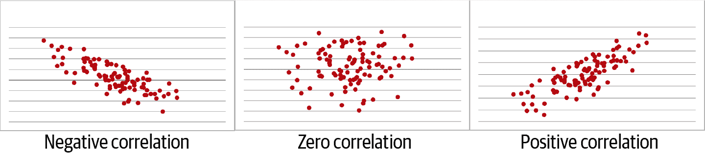

# 第四章。相关性与回归

你听说过冰淇淋消费与鲨鱼袭击有关吗？显然，大白鲨对薄荷巧克力片有致命的喜好。图 4-1 可视化了这种假设关系。


###### 图 4-1。冰淇淋消费与鲨鱼袭击之间的假设关系

“不尽然，”你可能会反驳。“这并不一定意味着鲨鱼袭击是由冰淇淋消费引发的。”

“你推断说，”随着室外温度的升高，消费的冰淇淋会增加。当天气变暖时，人们也会更多地在海边活动，*这*巧合导致更多的鲨鱼袭击。

# “相关性不意味着因果关系”

你可能已经多次听到“相关性不意味着因果关系”的说法。

在第三章中，你学到了*因果关系*在统计学中是一个棘手的表达。我们之所以只是拒绝零假设，是因为我们根本没有足够的数据来确定地声称因果关系。除了这种语义差异，相关性与因果关系有*任何*关系吗？标准表达有些过于简化了它们的关系；在本章中，你将会看到为什么使用你之前学到的推断统计学工具。

这将是我们主要在 Excel 中进行的最后一章。之后，你将已经足够掌握了分析框架，准备好进入 R 和 Python。 

# 引入相关性

到目前为止，我们主要是一次分析一个变量的统计数据：我们发现了平均阅读成绩或房价方差，例如。这被称为*单变量*分析。

我们还进行了一些*双变量*分析。例如，我们使用两向频率表比较了两个分类变量的频率。我们还分析了一个连续变量，当被分为多个水平的分类变量时，为每个组找到了描述统计数据。

现在我们将使用相关性计算两个连续变量的双变量度量。更具体地说，我们将使用*皮尔逊相关系数*来衡量两个变量之间的*线性关系*的强度。如果没有线性关系，那么皮尔逊相关系数是不合适的。

那么，我们如何知道我们的数据是线性的呢？有更严格的检查方法，但通常情况下，可视化是一个很好的开始。特别是，我们将使用*散点图*根据它们的 x 和 y 坐标来描述所有观测。

如果看起来可以画一条穿过散点图总结整体模式的线，那么这就是线性关系，可以使用皮尔逊相关系数。如果你需要一条曲线或其他形状来总结模式，那么情况就相反。图 4-2 描述了一个线性和两个非线性关系。


###### 图 4-2\. 线性与非线性关系

特别是，图 4-2 给出了一个*正*线性关系的例子：随着 x 轴上的值增加，y 轴上的值也会增加（呈线性速率）。

也可能存在*负*相关，其中负斜线总结了关系，或者根本没有相关性，在这种情况下，一条水平线总结了它。这些不同类型的线性关系在图 4-3 中显示。请记住，这些都必须是线性关系才能应用相关性。



###### 图 4-3\. 负相关、零相关和正相关

一旦我们确定数据是线性的，就可以找到相关系数。它始终在–1 和 1 之间取值，–1 表示完全负线性关系，1 表示完全正线性关系，0 表示根本没有线性关系。表 4-1 显示了评估相关系数强度的一些经验法则。这些绝不是官方标准，但是是解释的一个有用出发点。

表 4-1\. 相关系数的解释

| 相关系数 | 解释 |
| --- | --- |
| –1.0 | 完全的负线性关系 |
| –0.7 | 强烈的负相关关系 |
| –0.5 | 适度的负相关关系 |
| –0.3 | 弱负相关关系 |
| 0 | 无线性关系 |
| +0.3 | 弱正相关关系 |
| +0.5 | 适度的正相关关系 |
| +0.7 | 强烈的正相关关系 |
| +1.0 | 完全的正线性关系 |

在心中牢记相关性的基本概念框架后，让我们在 Excel 中进行一些分析。我们将使用一个车辆里程数据集；你可以在书籍存储库的[*数据集*文件夹](https://oreil.ly/ygWQn)中的*mpg*子文件夹中找到*mpg.xlsx*。这是一个新的数据集，所以花点时间了解一下它：我们正在处理什么类型的变量？使用第一章中介绍的工具对它们进行总结和可视化。为了帮助后续分析，请不要忘记添加索引列并将数据集转换为表格，我将其称为*mpg*。

Excel 包含`CORREL()`函数，用于计算两个数组之间的相关系数：

```py
CORREL(array1, array2)
```

让我们使用这个函数找到我们数据集中`weight`和`mpg`之间的相关性：

```py
=CORREL(mpg[weight], mpg[mpg])
```

这的确返回了一个介于–1 和 1 之间的值: –0.832\. (你还记得如何解释这个值吗?)

*相关矩阵*呈现了所有变量对之间的相关性。让我们使用数据分析工具包来构建一个。从功能区中，前往数据 → 数据分析 → 相关性。

请记住，这是两个*连续*变量之间线性关系的度量，因此我们应该排除像*origin*这样的分类变量，并审慎地考虑包含像*cylinders*或*model.year*这样的离散变量。工具包要求所有变量都在一个连续的范围内，因此我将谨慎地包括 *cylinders*。图 4-4 显示了工具包源菜单的样子。


###### 图 4-4\. 在 Excel 中插入相关矩阵

这导致了如 图 4-5 所示的相关矩阵。


###### 图 4-5\. Excel 中的相关矩阵

我们可以在单元格`B6`中看到 `-0.83`，这是*重量*和*mpg*的交叉点。同样的数值也会在单元格`F2`中看到，但 Excel 将矩阵的这一半留空，因为这是冗余信息。对角线上的所有数值都是 1，因为任何变量与自身完全相关。

###### 警告

当两个变量之间的关系是线性的时，皮尔逊相关系数才是一个合适的度量。

通过分析它们的相关性，我们对变量的关系做出了重大假设。你能想到是什么吗？*我们假设它们的关系是线性的。* 让我们通过散点图来验证这个假设。不幸的是，在基本的 Excel 中没有办法同时生成每对变量的散点图。练习时，考虑将它们全部绘制，但让我们先尝试一下 *重量* 和 *mpg* 变量。选中这些数据，然后转到功能区，点击插入 → 散点图。

我将添加一个自定义的图表标题，并重新标记轴线以帮助解释。要更改图表标题，双击它。要重新标记轴线，点击图表的边缘，然后选择出现的加号以展开图表元素菜单（在 Mac 上，点击图表内部，然后选择图表设计 → 添加图表元素）。从菜单中选择轴标题。图 4-6 显示了结果散点图。在轴上包含测量单位是一个不错的主意，以帮助外部人员理解数据。

图 4-6 基本上显示了一个负线性关系，随着重量减轻和里程增加而扩展。默认情况下，Excel 将我们数据选择中的第一个变量绘制在 x 轴上，第二个变量绘制在 y 轴上。但为什么不尝试反过来呢？尝试在工作表中切换这些列的顺序，使 *重量* 在列 `E` 中，*mpg* 在列 `F` 中，然后插入一个新的散点图。


###### 图 4-6\. 重量和里程的散点图

图 4-7 展示了关系的镜像。Excel 是一个很棒的工具，但与任何工具一样，你必须告诉它该做什么。Excel 会计算相关性，无论关系是否线性。它还会制作散点图，而不用担心哪个变量应该放在哪个轴上。

那么，哪个散点图是“正确的”？这有关系吗？按照惯例，自变量放在 x 轴上，因变量放在 y 轴上。花点时间考虑哪个是哪个。如果不确定，记住自变量通常是首先测量的那个。

我们的自变量是 *weight*，因为它是由汽车的设计和建造确定的。*mpg* 是*因变量*，因为我们假设它受汽车重量的影响。这将*weight*放在 x 轴上，*mpg*放在 y 轴上。

在商业分析中，罕见只为统计分析而收集数据；例如，我们的 *mpg* 数据集中的汽车是为了创造收入而建造的，并非用于研究重量对里程影响的研究。由于不总能明确自变量和因变量，我们需要更加注意这些变量在衡量什么以及它们如何被测量。这就是为什么了解你研究的领域或至少了解变量描述及观察数据的方式如此重要。


###### 图 4-7\. 里程和重量的散点图

# 从相关性到回归

虽然按照惯例将自变量放在 x 轴上，但这不影响相关系数。然而，这里有一个重要的警告，它与早期使用直线总结散点图中找到的关系的想法相关联。这一做法开始偏离相关性，你可能听说过：*线性回归*。

相关性不关心你称哪个变量为自变量或因变量；这不影响其定义为“两个变量在线性移动程度”的因素。

另一方面，线性回归本质上受到这种关系的影响，“自变量 *X* 的单位变化对因变量 *Y* 的估计影响”。

你将看到我们通过散点图拟合的直线可以表示为一个方程；与相关系数不同，这个方程取决于我们如何定义自变量和因变量。

像相关性一样，线性回归假设两个变量之间存在线性关系。还存在其他假设，对建模数据时很重要。例如，我们不希望有极端观察值，这可能会不成比例地影响线性关系的总体趋势。

出于演示目的，我们暂时忽略这个和其他假设。这些假设在使用 Excel 进行测试时通常很难。当您深入研究线性回归的深层次问题时，您对统计编程的了解将对您大有裨益。

深呼吸一下；是时候看另一个方程了：

##### 方程 4-1\. 线性回归方程

<math alttext="upper Y equals beta 0 plus beta 1 times upper X plus epsilon" display="block"><mrow><mi>Y</mi> <mo>=</mo> <msub><mi>β</mi> <mn>0</mn></msub> <mo>+</mo> <msub><mi>β</mi> <mn>1</mn></msub> <mo>×</mo> <mi>X</mi> <mo>+</mo> <mi>ϵ</mi></mrow></math>

方程 4-1 的目标是预测我们的因变量*Y*。这是左侧。你可能还记得从学校里学过，一条线可以分解为其*截距*和*斜率*。这就是<math alttext="beta 0"><msub><mi>β</mi> <mn>0</mn></msub></math>和<math alttext="beta 1 times upper X Subscript i"><mrow><msub><mi>β</mi> <mn>1</mn></msub> <mo>×</mo> <msub><mi>X</mi> <mi>i</mi></msub></mrow></math>在哪里发挥作用。在第二项中，我们通过斜率*系数*乘以我们的自变量。

最后，我们的自变量和因变量之间的关系中可能有一部分是模型本身无法解释的，而是由某些外部影响所致。这被称为模型的*误差*，并由<math alttext="epsilon Subscript i"><msub><mi>ε</mi> <mi>i</mi></msub></math>表示。

早些时候，我们使用独立样本 t 检验来检验两组之间平均值的显著差异。在这里，我们正在测量一个连续变量对另一个连续变量的线性影响。我们将通过检验回归线的*斜率*是否与零在统计上有显著差异来进行。这意味着我们的假设检验将类似于这样进行：

> H0: 我们的自变量对因变量没有线性影响。（回归线的斜率等于零。）
> 
> Ha: 我们的自变量对因变量有线性影响。（回归线的斜率不等于零。）

图 4-8 展示了显著和不显著斜率的一些例子。

记住，我们没有*所有*的数据，因此我们不知道人群的“真实”斜率会是多少。相反，我们在推断，考虑到我们的样本，这个斜率是否在统计上与零有显著差异。我们可以使用相同的 p 值方法来估计斜率的显著性，就像我们之前用来找出两组平均数差异的方法一样。我们将继续在 95%置信区间进行双尾检验。让我们开始使用 Excel 找出结果。


###### 图 4-8\. 具有显著和不显著斜率的回归模型

# 在 Excel 中进行线性回归

在这个 Excel 中*mpg*数据集的线性回归演示中，我们测试一辆汽车的重量（*weight*）是否对其行驶里程（*mpg*）有显著影响。这意味着我们的假设将是：

> H0: 重量对里程没有线性影响。
> 
> Ha: 重量对里程的线性影响是存在的。

在开始之前，建议使用感兴趣的具体变量写出回归方程，我已在方程式 4-2 中完成了这一点：

##### 方程式 4-2\. 用于估计里程的回归方程

<math alttext="m p g equals beta 0 plus beta 1 times w e i g h t plus epsilon" display="block"><mrow><mi>m</mi> <mi>p</mi> <mi>g</mi> <mo>=</mo> <msub><mi>β</mi> <mn>0</mn></msub> <mo>+</mo> <msub><mi>β</mi> <mn>1</mn></msub> <mo>×</mo> <mi>w</mi> <mi>e</mi> <mi>i</mi> <mi>g</mi> <mi>h</mi> <mi>t</mi> <mo>+</mo> <mi>ϵ</mi></mrow></math>

让我们从可视化回归结果开始：我们已经有了来自图 4-6 的散点图，现在只需将回归线覆盖或“拟合”到上面。点击图的周边以启动“图表元素”菜单。点击“趋势线”，然后点击侧边的“更多选项”。点击“在图表上显示方程式”屏幕底部的单选按钮。

现在让我们点击图表中的结果方程式，添加粗体格式并将其字体大小增加到 14 号。我们将趋势线设为纯黑色，并通过点击图表中的它，然后转到 Format Trendline 菜单顶部的油漆桶图标。我们现在拥有了线性回归的基础。我们的散点图与趋势线看起来像图 4-9。Excel 还包括了我们根据其重量估计汽车里程的*回归*方程，如方程式 4-2 所示。


###### 图 4-9\. 带有权重对里程影响的散点图和趋势线及回归方程

我们可以在我们的方程中将截距放在斜率之前，以获得方程式 4-3。

##### 方程式 4-3\. 方程式 4-3\. 用于估计里程的我们的拟合回归方程

<math alttext="m p g equals 46.217 minus 0.0076 times w e i g h t" display="block"><mrow><mi>m</mi> <mi>p</mi> <mi>g</mi> <mo>=</mo> <mn>46.217</mn> <mo>-</mo> <mn>0.0076</mn> <mo>×</mo> <mi>w</mi> <mi>e</mi> <mi>i</mi> <mi>g</mi> <mi>h</mi> <mi>t</mi></mrow></math>

注意，Excel 未将误差项作为回归方程的一部分。现在我们已经拟合了回归线，我们量化了期望从方程中得到的值与数据中实际值之间的差异。这种差异称为*残差*，我们稍后会在本章回来讨论它。首先，我们将回到我们的目标：建立统计显著性。

很棒，Excel 为我们拟合了线并给出了结果方程式。但这并不足以进行假设检验：我们仍然不知道线的斜率是否在统计上与零有显著差异。为了获取这些信息，我们将再次使用 Analysis ToolPak。从菜单栏，转到数据 → 数据分析 → 回归。您将被要求选择您的 Y 和 X 范围；这些是您的因变量和自变量，分别。确保指示您的输入包括标签，如图 4-10 所示。


###### 图 4-10\. 使用 ToolPak 导出回归设置的菜单

这带来了大量信息，显示在图 4-11 中。让我们逐步进行解释。

暂时忽略单元格 `A3:B8` 中的第一部分；我们稍后会回到它。我们的第二部分在 `A10:F14` 中标记为方差分析（简称 *ANOVA*）。这告诉我们我们的回归是否与仅有截距的回归相比显著更好。


###### 图 4-11\. 回归输出

表 4-2 阐明了这里的竞争方程。

表 4-2\. 仅截距模型与完整回归模型

| 仅截距模型 | 带系数的模型 |
| --- | --- |
| *mpg* = 46.217 | *mpg* = 46.217 − 0.0076 × *weight* |

统计上显著的结果表明我们的系数确实改善了模型。我们可以从图 4-11 的单元格 `F12` 中找到的 p 值来确定测试结果。请记住，这是科学记数法，因此将 p 值读作为 $6.01 \times 10^{-102}$：远小于 0.05。我们可以得出结论，*重量* 值得作为回归模型中的系数保留。

这将我们带到了第三部分，在单元格 `A16:I18` 中；这里是我们最初寻找的信息。这个范围包含了大量的信息，所以让我们从列开始逐列解释，从系数开始，单元格 `B17:B18`。这些应该看起来很熟悉，因为它们是在方程式 4-3 中给出的线的截距和斜率。

接下来是标准误差，在 `C17:C18` 中。我们在第三章中已经讨论过这个：它是在重复样本中变异性的度量，而在这种情况下可以看作是我们系数精度的度量。

接下来是 Excel 称之为 “t 统计量”的内容，又称 t 统计量或检验统计量，在 `D17:D18` 中；这可以通过将系数除以标准误差来获得。我们可以将其与 1.96 的临界值进行比较，以在 95% 置信水平下建立统计显著性。

然而，更常见的是解释和报告 p 值，它提供了相同的信息。我们有两个 p 值要解释。首先，截距的系数在 `E17` 中。这告诉我们截距是否与零显著不同。截距的显著性 *不* 是我们假设检验的一部分，因此此信息是无关的。（这是另一个说明我们不能仅仅以 Excel 输出为准的好例子。）

###### 警告

尽管大多数统计软件（包括 Excel）报告截距的 p 值，但通常这不是相关信息。

相反，我们想要单元格 `E18` 中*重量*的 p 值：这与线的斜率有关。p 值远低于 0.05，因此我们未能拒绝零假设，并得出结论称重量可能确实影响里程数。换句话说，该线的斜率明显不同于零。就像我们早期的假设检验一样，我们不会得出我们已经“证明”了一种关系的结论，或者更重的重量*导致*较低的里程数。再次强调，我们是基于样本对总体进行推断，因此不确定性是固有的。

输出还给出了我们截距和斜率的 95% 置信区间，分别在单元格 `F17:I18` 中。默认情况下，这个信息被重复了：如果我们在输入菜单中要求不同的置信区间，那么这里也会得到相应的输出。

现在您已经掌握了解释回归输出的要诀，让我们尝试根据方程线进行*点估计*：如果一辆重 3,021 磅的汽车，我们预期它的里程数会是多少？让我们把它代入我们在方程 4-4 中的回归方程：

##### 方程 4-4\. 基于我们的方程进行点估计

<math alttext="m p g equals 46.217 minus 0.0076 times 3021" display="block"><mrow><mi>m</mi> <mi>p</mi> <mi>g</mi> <mo>=</mo> <mn>46.217</mn> <mo>-</mo> <mn>0.0076</mn> <mo>×</mo> <mn>3021</mn></mrow></math>

基于方程 4-4，我们预计一辆重 3,021 磅的汽车能行驶 23.26 英里每加仑。看看源数据集：数据中有一条重 3,021 磅的观察结果（福特麦弗里克，数据集中的第 `101` 行），但它每加仑只能行驶 18 英里，而不是 23.26。*怎么回事？*

这种差异就是之前提到的*残差*：它是我们在回归方程中估计的值与实际数据中找到的值之间的差异。我已在图 4-12 中包括了这些以及其他一些观察结果。散点代表数据集中实际找到的值，而直线则代表我们用回归预测的值。

合理推测我们会受到激励以尽量减少这些值之间的差异。Excel 和大多数回归应用程序使用*普通最小二乘法*（OLS）来实现这一点。在 OLS 中，我们的目标是最小化残差，特别是*残差平方和*，以便负值和正值的残差都能平等衡量。残差平方和越低，我们的实际值和预期值之间的差异就越小，我们的回归方程在估计方面就越好。


###### 图 4-12\. 残差即实际值与预测值之间的差异

我们从斜率的 p 值中得知，独立变量和因变量之间存在显著关系。但这并不告诉我们因变量的变异性有多少是由独立变量解释的。

记住，变异性是我们作为分析师研究的核心；变量会变化，我们想研究 *为什么* 它们变化。实验让我们做到了这一点，通过理解自变量和因变量之间的关系。但我们不能用自变量来解释关于我们的因变量的一切。总会有一些无法解释的误差。

*R 平方*，或称决定系数（Excel 称为 *R 平方*），表示回归模型解释了因变量变异性的百分比。例如，R 平方为 0.4 表示模型可以解释 Y 变异性的 40%。这意味着 1 减去 R 平方就是模型无法解释的变异性。如果 R 平方为 0.4，那么 60% 的 Y 的变异性是无法解释的。

Excel 为我们计算了 R 平方在回归输出的第一个框中；回顾一下图 4-11 中的 B5 单元格。R 平方的平方根是多重 R，也可以在输出的 B4 单元格中看到。调整后的 R 平方（B6 单元格）被用作对具有多个自变量的模型的 R 平方的更保守估计。这个指标在进行 *多元* 线性回归时是有用的，这超出了本书的范围。

除了 R 平方之外，还有其他衡量回归性能的方法：Excel 在其输出中包括其中一个，即回归标准误差（在图 4-11 的 B7 单元格）。这个指标告诉我们观察值偏离回归线的平均距离。一些分析师更喜欢这个或其他指标来评估回归模型，尽管 R 平方仍然是一个主要选择。无论偏好如何，最好的评估通常来自于在适当背景下评估多个图表，所以没有必要盲目追随或拒绝任何一个指标。

恭喜：你进行了并解释了完整的回归分析。

# 重新思考我们的结果：虚假关系

根据它们的时间顺序和我们自己的逻辑，在我们的里程示例中，*重量*应该是自变量，*mpg*应该是因变量，这几乎是绝对的。但是如果我们将这些变量颠倒来拟合回归线会发生什么呢？试试使用 ToolPak。得到的回归方程显示在方程 4-5 中。

##### 方程 4-5。方程 4-5。一个根据里程估计重量的回归方程

<math alttext="w e i g h t equals 5101.1 minus 90.571 times m p g" display="block"><mrow><mi>w</mi> <mi>e</mi> <mi>i</mi> <mi>g</mi> <mi>h</mi> <mi>t</mi> <mo>=</mo> <mn>5101.1</mn> <mo>-</mo> <mn>90.571</mn> <mo>×</mo> <mi>m</mi> <mi>p</mi> <mi>g</mi></mrow></math>

我们可以颠倒我们的自变量和因变量，并获得相同的相关系数。但当我们将它们改变用于回归时，*我们的系数会改变*。

如果我们发现*mpg*和*weight*同时受到某个外部变量的影响，那么这两个模型都不会是正确的。这与我们在冰淇淋消费和鲨鱼袭击中面临的情况是相同的。说冰淇淋消费会影响鲨鱼袭击是愚蠢的，因为这两者都受到温度的影响，正如图 4-13 所示。


###### 图 4-13\. 冰淇淋消费和鲨鱼袭击：一种虚假关系

这被称为*虚假*关系。它经常出现在数据中，而且可能并不像这个例子那么明显。对你正在研究的数据具有一定领域知识可能对检测虚假关系非常有价值。

###### 警告

变量可能存在相关性；甚至可能有因果关系的证据。但这种关系可能是由一些你甚至没有考虑过的变量驱动的。

# 结论

还记得这句老话吗？

> 相关性不意味着因果关系。

分析是高度渐进的：我们通常会将一个概念叠加在另一个概念之上，以构建越来越复杂的分析。例如，我们总是从样本的描述统计开始，然后再尝试推断出总体的参数。虽然相关性不意味着因果关系，但因果关系是建立在相关性基础之上的。这意味着更好地总结这种关系的方式可能是：

> 相关性是因果关系的必要条件但不是充分条件。

在本章和之前的章节中，我们只是初步涉及了推论统计学的表面。有很多种测试存在，但它们都使用了与我们在这里使用的*假设检验*相同的框架。掌握这个过程，你就能够测试各种不同的数据关系。

# 进入编程领域

我希望你已经看到并同意 Excel 是学习统计学和分析的一种绝佳工具。你亲身了解了支持这项工作的统计原理，并学会了如何在真实数据集中探索和测试关系。

尽管如此，Excel 在进行更高级分析时可能会有收益递减的情况。例如，我们一直在使用可视化工具检查正态性和线性性等特性；这是一个良好的起点，但还有更为稳健的测试方法（通常使用统计推断）。这些技术通常依赖于矩阵代数和其他计算密集型操作，这些在 Excel 中推导可能很繁琐。虽然可以使用插件来弥补这些不足，但它们可能昂贵且缺乏特定功能。另一方面，作为开源工具，R 和 Python 是免费的，并且包含许多称为*包*的应用程序式功能，几乎可以满足任何用例。这种环境将允许你专注于数据的概念分析，而不是原始计算，但你需要学习如何编程。这些工具以及分析工具包总体将是第五章的重点。

# 练习

通过分析书库存储的[*数据集*文件夹](https://oreil.ly/hazKQ)中的*ais*数据集，练习你的相关性和回归技能。该数据集包括来自不同体育项目的澳大利亚男女运动员的身高、体重和血液读数。

使用数据集，尝试以下操作：

1.  生成该数据集中相关变量的相关矩阵。

1.  可视化*ht*和*wt*的关系。这是线性关系吗？如果是，是正相关还是负相关？

1.  在*ht*和*wt*中，你认为哪个是自变量，哪个是因变量？

    +   自变量对因变量有显著影响吗？

    +   你拟合的回归线的斜率是多少？

    +   自变量解释因变量方差的百分比是多少？

1.  该数据集包含一个变量，即身体质量指数*bmi*。如果你对这个指标不熟悉，请花些时间了解它是如何计算的。了解了这一点，你想分析*ht*和*bmi*之间的关系吗？在这里不要只依赖统计推理，也要倾向于常识。
