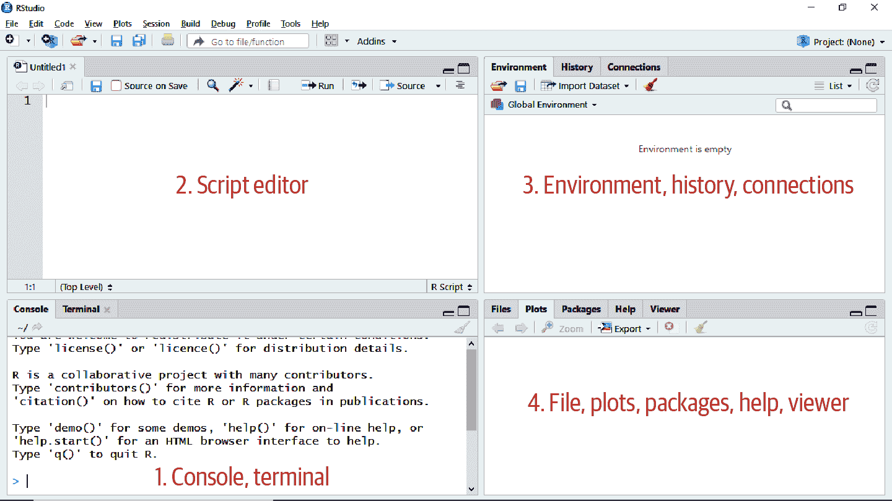
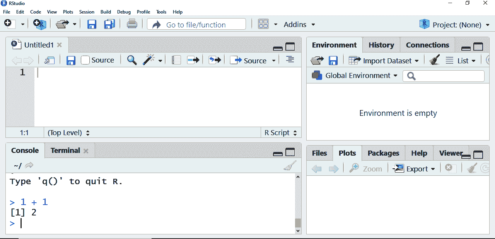
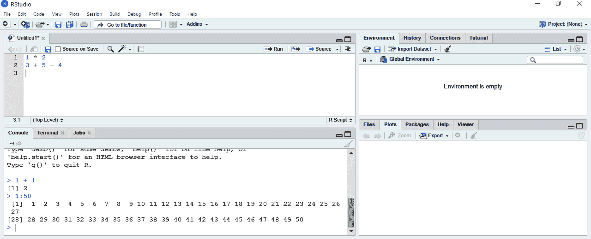
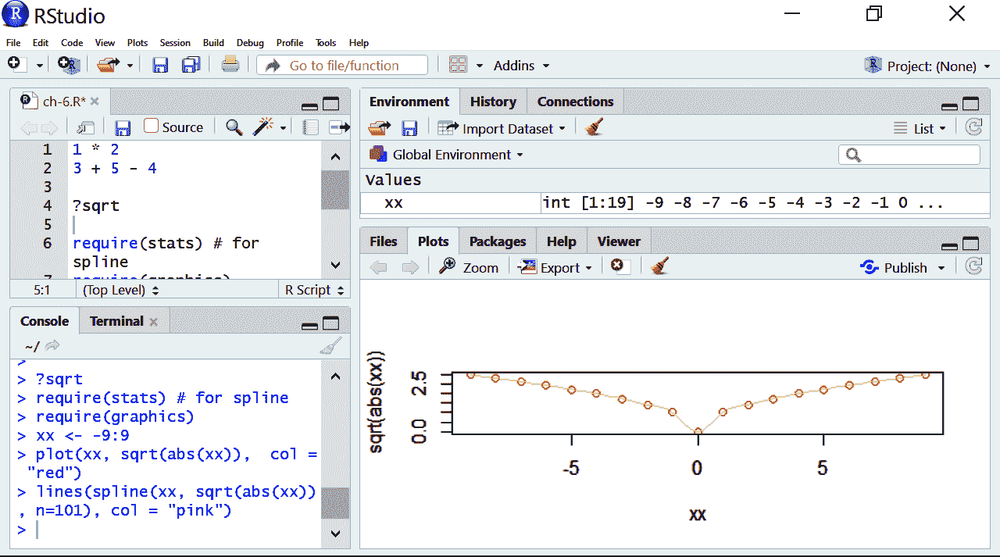
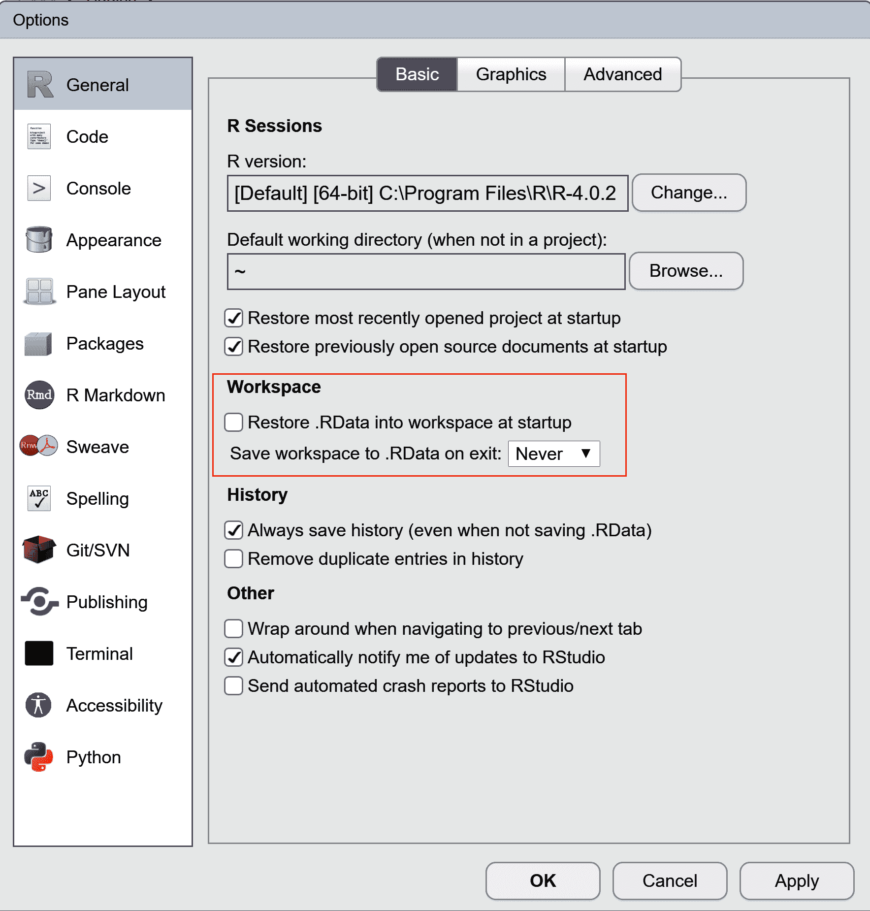

# 第六章：R 新手入门指南

在 第一章 中，你学习了如何在 Excel 中进行探索性数据分析。也许你还记得那一章提到，约翰·图基被誉为推广 EDA 实践的人物。图基的数据分析方法启发了几种统计编程语言的发展，包括在传奇贝尔实验室开发的 S 语言。S 语言后来又启发了 R 语言的诞生。由 Ross Ihaka 和 Robert Gentleman 在 1990 年代初开发，这个名称不仅仅是从 S 语言派生而来，也是两位共同创始人名字的谐音。R 是开源的，并由 R 基金会维护。因其主要用于统计计算和图形绘制，因此在研究人员、统计学家和数据科学家中最为流行。

###### 注意

R 的开发专门考虑了统计分析。

# 下载 R

要开始，请访问 [R 项目的网站](https://r-project.org)。点击页面顶部的链接下载 R。您将被要求从 Comprehensive R Archive Network (CRAN) 中选择一个镜像。这是一个分发 R 源代码、包和文档的服务器网络。选择一个靠近您的镜像，以便为您的操作系统下载 R。

# 开始使用 RStudio

你现在已经安装了 R，但我们还会进行一次下载，以优化我们的编程体验。在 第五章 中，你了解到开源软件意味着任何人都可以在其上构建、分发或贡献代码。例如，供应商可以提供一个 *集成开发环境*（IDE）与代码交互。RStudio IDE 在单一界面下结合了代码编辑、图形、文档等工具。这在 R 编程市场上的十多年中已成为主流 IDE，用户使用它构建从交互式仪表板（Shiny）到研究报告（R Markdown）的各种产品。

你可能会想，*如果 RStudio 如此出色，为什么我们还要安装 R？* 实际上，这两个下载是不同的：我们下载了 R 作为代码库，而下载 RStudio 则是为了与代码一起工作的 IDE。这种应用分离可能对 Excel 用户来说很陌生，但在开源软件世界中非常常见。

###### 警告

RStudio 是一个与 R 代码一起工作的平台，而不是代码库本身。首先，从 CRAN 下载 R，然后下载 RStudio。

要下载 RStudio，请访问其网站的 [下载页面](https://oreil.ly/rfP1X)。您会看到 RStudio 是基于分层定价系统提供的；选择免费的 RStudio Desktop。（RStudio 是如何在开源软件的基础上建立稳固业务的一个很好的例子。）一开始可能会觉得 RStudio 非常压抑，因为它有很多面板和功能。为了克服这种初始的不适感，我们将进行一次导览。

首先，转到主菜单并选择 文件 → 新建文件 → R 脚本。现在你应该看到类似于 Figure 6-1 的界面。这里有很多花哨的功能；IDE 的理念就是将所有编码开发所需的工具集中在一个地方。我们将介绍每个四块窗格的功能，这些是你入门所需了解的。

位于 RStudio 左下角的 *控制台* 是提交命令给 R 执行的地方。在这里，你会看到 `>` 符号后跟着一个闪烁的光标。你可以在这里键入操作，然后按 Enter 执行。让我们从一些非常基础的操作开始，比如找到 1 + 1，就像 Figure 6-2 中所示。



###### Figure 6-1\. RStudio IDE



###### Figure 6-2\. 在 RStudio 中编码，从 1 + 1 开始

你可能已经注意到在你的 `2` 结果之前出现了 `[1]`。要理解这意味着什么，可以在控制台中键入并执行 `1:50`。在 R 中，`:` 运算符会在给定范围内以增量为 1 生成所有数字，类似于 Excel 中的填充手柄。你应该看到类似这样的输出：

```py
1:50
#> [1]  1  2  3  4  5  6  7  8  9 10 11 12 13 14 15 16 17 18 19 20 21 22 23
#> [24] 24 25 26 27 28 29 30 31 32 33 34 35 36 37 38 39 40 41 42 43 44 45 46
#> [47] 47 48 49 50
```

这些带方括号的标签表示输出中每行第一个值的数值位置。

虽然你可以继续从这里工作，但通常先在 *脚本* 中编写你的命令，然后将它们发送到控制台是个好主意。这样你可以保存你运行的代码的长期记录。脚本编辑器位于控制台正上方的窗格中。在那里输入几行简单的算术，如 Figure 6-3 中所示。



###### Figure 6-3\. 在 RStudio 中使用脚本编辑器

将光标放在第 1 行，然后将其悬停在脚本编辑器顶部的图标上，直到找到一个标有“运行当前行或选定内容”的图标。点击该图标会发生两件事。首先，活动代码行将在控制台中执行。然后，光标将移到脚本编辑器中的下一行。你可以通过选择它们并点击该图标一次性将多行发送到控制台。此操作的键盘快捷键是 Windows 下的 Ctrl + Enter，Mac 下的 Cmd + Return。作为 Excel 用户，你可能是键盘快捷键的爱好者；RStudio 提供了大量的快捷键，可以通过选择 工具 → 键盘快捷键帮助 查看。

让我们保存我们的脚本。从菜单中选择 文件 → 保存。将文件命名为 *ch-6*。R 脚本的文件扩展名是 *.r*。打开、保存和关闭 R 脚本的过程可能让你想起在文字处理器中操作文档；毕竟，它们都是书面记录。

现在我们将转向右下角的窗格。这里有五个选项卡：文件（Files）、绘图（Plots）、包（Packages）、帮助（Help）、查看器（Viewer）。R 提供了大量的帮助文档，可以在这个窗格中查看。例如，我们可以使用`?`操作符了解更多关于 R 函数的信息。作为 Excel 用户，你对诸如`VLOOKUP()`或`SUMIF()`之类的函数了如指掌。一些 R 函数与 Excel 中的函数非常相似；例如，让我们学习一下 R 的平方根函数`sqrt()`。将以下代码输入到你脚本的新行中，并使用菜单图标或键盘快捷键运行它：

```py
?sqrt
```

在帮助窗口中将出现一个名为“Miscellaneous Mathematical Functions”的文档。这包含了关于`sqrt()`函数、它的参数以及更多重要信息。它还包括了这个函数的示例：

```py
require(stats) # for spline
require(graphics)
xx <- -9:9
plot(xx, sqrt(abs(xx)),  col = "red")
lines(spline(xx, sqrt(abs(xx)), n=101), col = "pink")
```

现在不用担心理解这段代码；只需将选定的部分复制粘贴到你的脚本中，突出显示整个选择，并运行它。绘图将如同图 6-4 中所示出现。我已调整我的 RStudio 窗格大小以使绘图更大。你将学会如何在第 8 章中构建 R 绘图。



###### 图 6-4\. 你的第一个 R 绘图

现在，看向右上角的窗格：环境（Environment）、历史（History）、连接（Connections）。环境选项卡列出了称为`xx`的东西，旁边似乎是一些整数集合。这是什么？事实证明，*你*是用我让你盲目运行的`sqrt()`文档中的代码创建的。实际上，在 R 中我们大部分工作都围绕这里显示的内容展开：一个*对象*。

正如你可能注意到的那样，在这次 RStudio 之旅中我们忽略了几个窗格、图标和菜单选项。它是一个功能丰富的集成开发环境：不要害怕去探索、实验和搜索引擎以获取更多学习资料。但现在，你已经了解如何在 RStudio 中四处走动，开始正式学习 R 编程。你已经看到 R 可以用作一个高级计算器。表格 6-1 列出了 R 中一些常见的算术运算符。

表格 6-1\. R 中常见的算术运算符

| 操作符 | 描述 |
| --- | --- |
| `+` | 加法 |
| `-` | 减法 |
| `*` | 乘法 |
| `/` | 除法 |
| `^` | 指数 |
| `%%` | 取模 |
| `%/%` | 地板除法 |

或许你对表格 6-1 中的最后两个操作符不太熟悉：*modulo*返回除法的余数，*floor division*将除法结果向下取整到最接近的整数。

像 Excel 一样，R 遵循算术运算的操作顺序。

```py
# Multiplication before addition
3 * 5 + 6
#> [1] 21

# Division before subtraction
2 / 2 - 7
#> [1] -6
```

哪些带有井号（`#`）和文本的行是怎么回事？ 这些是*单元格注释*，用于提供关于代码的口头说明和提醒。 注释帮助其他用户——以及日后的自己——理解和记住代码的用途。 R 不执行单元格注释：脚本的这部分是给程序员看的，而不是给计算机看的。 虽然可以将注释放在代码右侧，但最好放在上方：

```py
1 * 2 # This comment is possible
#> [1] 2

# This comment is preferred
2 * 1
#> [1] 2
```

您不需要使用注释来解释关于代码正在做什么的*所有*内容，但请解释您的推理和假设。 将其视为，嗯，评论。 我将在本书的示例中继续使用相关且有帮助的注释。

###### 提示

养成习惯，包括注释以记录您编写代码的目标、假设和推理。

正如先前提到的，函数在 R 中的工作中占据了很大的比重，就像在 Excel 中一样，并且通常看起来非常相似。 例如，我们可以取–100 的绝对值：

```py
# What is the absolute value of -100?
abs(-100)
#> [1] 100
```

但是，在使用 R 中处理函数时有一些非常重要的区别，正如这些错误所示。

```py
# These aren't going to work
ABS(-100)
#> Error in ABS(-100) : could not find function "ABS"
Abs(-100)
#> Error in Abs(-100) : could not find function "Abs"
```

在 Excel 中，您可以输入小写`abs()`或 Proper Case `Abs()`而不会有问题。 然而，在 R 中，`abs()`函数*必须*小写。 这是因为 R 是*区分大小写*的。 这是 Excel 和 R 之间的一个主要区别，迟早会让你碰壁。

###### 警告

R 是一种区分大小写的语言：`SQRT()`函数与`sqrt()`不同。

就像在 Excel 中一样，一些 R 函数，例如 `sqrt()`，用于处理数字；其他函数，如 `toupper()`，用于处理字符：

```py
# Convert to upper case
toupper('I love R')
#> [1] "I LOVE R"
```

让我们看另一个情况，R 表现类似于 Excel，只有一个例外将有巨大的影响：比较运算符。 当我们比较两个值之间的某种关系时，例如一个是否大于另一个。

```py
# Is 3 greater than 4?
3 > 4
#> [1] FALSE
```

R 将返回`TRUE`或`FALSE`作为任何比较运算符的结果，就像 Excel 一样。 表 6-2 列出了 R 的比较运算符。

表 6-2\. R 中的比较运算符

| 运算符 | 意义 |
| --- | --- |
| `>` | 大于 |
| `<` | 小于 |
| `>=` | 大于或等于 |
| `<=` | 小于或等于 |
| `!=` | 不等于 |
| `==` | 等于 |

大部分这些可能对您来说很熟悉，除了…你注意到最后一个了吗？ 是的，你在 R 中不是用一个等号检查两个值是否相等，而是用*两个*等号。 这是因为在 R 中，单个等号用于*赋值对象*。

如果你还不太清楚问题的重要性，稍等片刻，我们来看另一个例子。 让我们将–100 的绝对值分配给一个对象；我们称之为`my_first_object`。

```py
# Assigning an object in R
my_first_object = abs(-100)
```

您可以将对象看作我们放入信息的鞋盒。通过使用`=`操作符，我们将`abs(-100)`的结果存储在名为`my_first_object`的鞋盒中。我们可以通过*打印*它来打开这个鞋盒。在 R 中，您可以通过运行对象的名称来简单地做到这一点：

```py
# Printing an object in R
my_first_object
#> [1] 100
```

在 R 中另一种分配对象的方法是使用`<-`操作符。事实上，这通常比使用`=`更可取，部分原因是为了避免它与`==`之间的混淆。尝试使用此操作符分配另一个对象，然后打印它。在 Windows 上的键盘快捷键是 Alt+-，在 Mac 上是 Option--。您可以在您的函数和操作中大胆创新，就像我做的一样：

```py
my_second_object <- sqrt(abs(-5 ^ 2))
my_second_object
#> [1] 5
```

在 R 中，对象名称必须以字母或点开头，并且只能包含字母、数字、下划线和句点。还有一些禁用的关键字。这给“创造性”对象命名留下了很大的余地。但是好的对象名称能够准确地指示它们所存储的数据，就像鞋盒上的标签指示了里面装的鞋的类型一样。

对象可以包含不同类型或*模式*的数据，就像您可能有不同类型的鞋盒一样。表 6-3 列出了一些常见的数据类型。

表 6-3\. R 中常见的数据类型

| 数据类型 | 示例 |
| --- | --- |
| 字符 | `'R'`, `'Mount'`, `'Hello, world'` |
| 数值 | `6.2`, `4.13`, `3` |
| 整数 | `3L`, `-1L`, `12L` |
| 逻辑 | `TRUE`, `FALSE`, `T`, `F` |

让我们创建一些不同模式的对象。首先，字符数据通常用单引号括起来以增加可读性，但双引号也可以工作，并且如果要包含单引号作为输入的一部分，则双引号尤其有用。

```py
my_char <- 'Hello, world'
my_other_char <- "We're able to code R!"
```

数字可以表示为小数或整数：

```py
my_num <- 3
my_other_num <- 3.21
```

然而，整数也可以作为独立的整数数据类型存储。输入中包含的`L`代表*字面值*；这个术语来自计算机科学，用于表示固定值的记法：

```py
my_int <- 12L
```

`T` 和 `F` 默认会评估为逻辑数据 `TRUE` 和 `FALSE`：

```py
my_logical <- FALSE
my_other_logical <- F
```

我们可以使用`str()`函数来了解对象的*结构*，例如其类型和包含的信息：

```py
str(my_char)
#> chr "Hello, world"
str(my_num)
#> num 3
str(my_int)
#> int 12
str(my_logical)
#> logi FALSE
```

一旦分配完成，我们就可以在其他操作中自由使用这些对象：

```py
# Is my_num equal to 5.5?
my_num == 5.5
#> [1] FALSE

# Number of characters in my_char
nchar(my_char)
#> [1] 12
```

我们甚至可以使用对象作为输入来分配其他对象，或重新分配它们：

```py
my_other_num <- 2.2
my_num <- my_num/my_other_num
my_num
#> [1] 1.363636
```

“那又怎样？”你可能会问。“我处理大量数据，所以将每个数字分配给自己的对象如何帮助我？”幸运的是，在第七章中，您将看到将多个值组合成一个对象是可能的，就像在 Excel 中处理范围和工作表一样。但在此之前，让我们稍微转换一下方向，了解一下包的相关内容。

# R 中的包

想象一下，如果您无法在智能手机上下载应用程序。您可以打电话、浏览互联网并记录笔记——这仍然非常方便。但智能手机真正的力量来自于其应用程序，即应用程序或应用程序。R 发货就像一个“出厂默认设置”智能手机：仍然非常有用，如果必要，您几乎可以完成任何事情。但通常更有效的是进行 R 版本的应用安装：*安装包*。

R 的出厂默认版本称为“基础 R”。包，即 R 的“应用程序”，是可共享的代码单元，包括函数、数据集、文档等等。这些包建立在基础 R 之上，以提高功能和添加新特性。

之前，您从 CRAN 下载了基础 R。该网络还托管了超过 10,000 个包，这些包由 R 广泛的用户基础贡献，并由 CRAN 志愿者审核。这就是您的 R “应用商店”，借用著名口号改编，“R 天下无不包”。虽然可以从其他地方下载包，但对于初学者来说，最好还是坚持使用 CRAN 上托管的内容。要从 CRAN 安装包，可以运行`install.packages()`。

本书将使用包来帮助我们进行数据处理和可视化任务。特别地，我们将使用`tidyverse`，这实际上是一个*集合*的包，设计用于一起使用。要安装这个集合，请在控制台中运行以下命令：

```py
install.packages('tidyverse')
```

您刚刚安装了一些有用的包；其中一个是`dplyr`（通常发音为*d-plier*），其中包含一个`arrange()`函数。尝试打开此函数的文档，您会收到一个错误：

```py
?arrange
#> No documentation for ‘arrange’ in specified packages and libraries:
#> you could try ‘??arrange’
```

要理解为什么 R 找不到这个`tidyverse`函数，请回到智能手机类比：即使您已安装了应用程序，您仍然需要打开它才能使用它。与 R 相同：我们已经用`install.packages()`安装了包，但现在我们需要用`library()`将其调用到我们的会话中：

```py
# Call the tidyverse into our session
library(tidyverse)
#> -- Attaching packages -------------------------- tidyverse  1.3.0 --
#> v ggplot2 3.3.2     v purrr   0.3.4
#> v tibble  3.0.3     v dplyr   1.0.2
#> v tidyr   1.1.2     v stringr 1.4.0
#> v readr   1.3.1     v forcats 0.5.0
#> -- Conflicts ------------------------------ tidyverse_conflicts() --
#> x dplyr::filter() masks stats::filter()
#> x dplyr::lag()    masks stats::lag()
```

`tidyverse`的包现在可用于您的其余 R 会话；您现在可以运行示例而不出错。

###### 注意

包是*安装*一次，但每次会话都需要*调用*。

# 升级 R、RStudio 和 R 包

RStudio、R 包和 R 本身不断改进，因此偶尔检查更新是个好主意。要更新 RStudio，请导航到菜单并选择帮助 → 检查更新。如果需要更新，RStudio 将引导您完成步骤。

要从 CRAN 更新所有包，您可以运行此函数并按提示步骤操作：

```py
update.packages()
```

您还可以通过 RStudio 菜单中的工具 → 检查包更新来更新包。将会出现一个更新包菜单；选择您希望更新的所有包。您还可以通过工具菜单安装包。

升级 R 本身的操作更为复杂。如果您使用的是 Windows 计算机，您可以使用来自`installr`包的`updateR()`函数并按照其说明操作：

```py
# Update R for Windows
install.packages('installr')
library(installr)
updateR()
```

对于 Mac 用户，请返回到 [CRAN 网站](https://cran.r-project.org) 安装最新版本的 R。

# 结论

在本章中，您学习了如何在 R 中处理对象和包，并且熟悉了使用 RStudio。您学到了很多；我认为现在是休息的时候了。保存您的 R 脚本并通过选择文件 → 退出会话关闭 RStudio。这时会询问您：“将工作空间图像保存到 ~/.RData？”作为一种规则，*不要保存您的工作空间图像*。如果保存了，所有保存的对象的副本将被保存，以便在下一个会话中使用。尽管这听起来*像*一个好主意，但是存储这些对象并*为什么*存储它们可能会变得繁琐。

相反，依靠 R 脚本本身在下一个会话中重新生成这些对象。毕竟，编程语言的优势在于它是可重复的：如果我们可以按需创建它们，就不需要将对象带在身边。

###### 提示

在*不*保存工作空间图像的一侧出错；您应该能够使用脚本重新创建以前会话中的任何对象。

为了防止 RStudio 在会话之间保留您的工作空间，请转到主菜单，然后转到工具 → 全局选项。在常规菜单下，如图 [Figure 6-5](https://cran.r-project.org) 中所示，更改工作空间下的两个设置。



###### 图 6-5\. RStudio 中的自定义工作空间选项

# 练习

以下练习提供了关于处理对象、包和 RStudio 的额外实践和见解：

1.  除了作为一个工具的工作马之外，RStudio 还提供了无限的外观定制选项。从菜单中选择工具 → 全局选项 → 外观，并自定义编辑器的字体和主题。例如，您可以决定使用“深色模式”主题。

1.  在 RStudio 中使用脚本，执行以下操作：

    +   将 1 和 4 的和赋值为 `a`。

    +   将 `a` 的平方根赋值为 `b`。

    +   将 `b` 减 1 赋值给 `d`。

    +   `d` 中存储的是什么类型的数据？

    +   `d` 是否大于 2？

1.  从 CRAN 安装`psych`包，并将其加载到会话中。使用注释解释安装和加载包之间的区别。

除了这些练习外，我鼓励您立即在日常工作中开始使用 R。目前，这可能只涉及将应用程序用作一个高级计算器。但即使这样，也能帮助您熟悉使用 R 和 RStudio。
