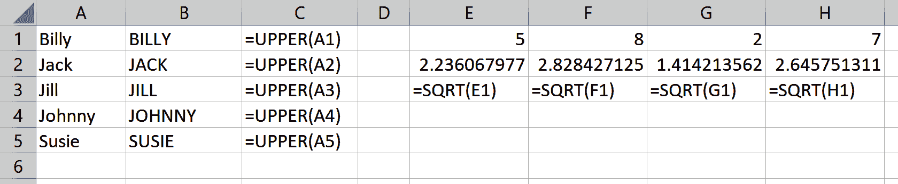

# 第七章：R 中的数据结构

在第六章的末尾，您学会了如何在 R 中使用包。在脚本的开头加载所需的包是很常见的，这样可以避免后续下载时出现意外情况。在这个精神上，我们现在会调用本章需要的所有包。您可能需要安装其中一些包；如果需要恢复到如何执行此操作，请回顾第六章。在适当的时候，我会进一步解释这些包。

```py
# For importing and exploring data
library(tidyverse)

# For reading in Excel files
library(readxl)

# For descriptive statistics
library(psych)

# For writing data to Excel
library(writexl)
```

# 向量

在第六章中，您还学习了如何对不同模式的数据调用函数，并将数据分配给对象：

```py
my_number <- 8.2
sqrt(my_number)
#> [1] 2.863564

my_char <- 'Hello, world'
toupper(my_char)
#> [1] "HELLO, WORLD"
```

大多数情况下，您通常会同时处理多个数据片段，因此将每个数据片段分配给单独的对象可能并不太实用。在 Excel 中，您可以将数据放入连续的单元格中，称为*范围*，并轻松地对该数据进行操作。图 7-1 展示了在 Excel 中操作数字和文本范围的简单示例：



###### 图 7-1\. 在 Excel 中操作范围

早些时候，我将对象的*模式*类比为鞋盒里特定类型的鞋子。对象的*结构*是鞋盒本身的形状、大小和结构。事实上，您已经用`str()`函数找到了 R 对象的结构。

R 包含几种对象结构：我们可以通过将数据放入称为*向量*的特定结构中来存储和操作一小部分数据。向量是同一类型的一个或多个数据元素的集合。事实证明，我们已经在使用向量，我们可以用`is.vector()`函数确认：

```py
is.vector(my_number)
#> [1] TRUE
```

尽管`my_number`是一个向量，但它只包含一个元素——有点像 Excel 中的单个单元格。在 R 中，我们会说这个向量的长度为 1：

```py
length(my_number)
#> [1] 1
```

我们可以用`c()`函数将多个元素组成一个向量，类似于 Excel 中的范围。这个函数之所以被称为如此，是因为它用于*组合*多个元素成为一个单一向量。让我们来试试：

```py
my_numbers <- c(5, 8, 2, 7)
```

此对象确实是一个向量，其数据是数值型，长度为 4：

```py
is.vector(my_numbers)
#> [1] TRUE

str(my_numbers)
#> [1] num [1:4] 5 8 2 7

length(my_numbers)
#> [1] 4
```

让我们看看在`my_numbers`上调用函数会发生什么：

```py
sqrt(my_numbers)
#> [1] 2.236068 2.828427 1.414214 2.645751
```

*现在*我们有了进展。我们可以类似地操作字符向量：

```py
roster_names <- c('Jack', 'Jill', 'Billy', 'Susie', 'Johnny')
toupper(roster_names)
#> [1] "JACK"   "JILL"   "BILLY"  "SUSIE"  "JOHNNY"
```

通过使用`c()`函数将数据元素组合成向量，我们能够轻松地在 R 中复制 Excel 中图 7-1 所示的内容。如果将不同类型的元素分配给同一个向量会发生什么？让我们试试看：

```py
my_vec <- c('A', 2, 'C')
my_vec
#> [1] "A" "2" "C"

str(my_vec)
#> chr [1:3] "A" "2" "C"
```

R 将*强制转换*所有元素为相同类型，以便它们可以组合成一个向量；例如，前面例子中的数字元素 `2` 被强制转换为字符型。

# 索引和子集向量

在 Excel 中，`INDEX()`函数用于找到范围内元素的位置。例如，我将在图 7-2 中使用`INDEX()`从命名范围`roster_names`（单元格`A1:A5`）中提取第三个位置的元素：


###### 图 7-2\. Excel 范围上的`INDEX()`函数

我们也可以通过在对象名称内的括号中添加所需的索引位置来类似地索引 R 中的向量：

```py
# Get third element of roster_names vector
roster_names[3]
#> [1] "Billy"
```

使用相同的符号，可以通过它们的索引号选择多个元素，我们称之为*子集*。让我们再次使用`:`运算符来提取位置在 1 到 3 之间的所有元素：

```py
# Get first through third elements
roster_names[1:3]
#> [1] "Jack"  "Jill"  "Billy"
```

在这里也可以使用函数。还记得`length()`吗？我们可以使用它获取向量中的最后一个元素：

```py
# Get second through last elements
roster_names[2:length(roster_names)]
#> [1] "Jill"   "Billy"  "Susie"  "Johnny"
```

我们甚至可以使用`c()`函数按非连续元素的向量进行索引：

```py
# Get second and fifth elements
roster_names[c(2, 5)]
#> [1] "Jill"   "Johnny"
```

# 从 Excel 表到 R 数据框架

“这一切都很好，”您可能会想，“但我不只是处理这些小范围。那些完整的数据*表格*呢？” 毕竟，在第一章中，您学习了将数据排列成变量和观察值的重要性，例如图 7-3 中显示的*star*数据。这是一个*二维*数据结构的例子。


###### 图 7-3\. Excel 中的二维数据结构

虽然 R 的向量是一维的，但*数据框架*允许同时存储行和列的数据。这使得数据框架成为 Excel 表格的 R 等价物。形式上，数据框架是一个二维数据结构，每列的记录是相同模式，并且所有列的长度相同。在 R 中，像 Excel 一样，通常为每列分配一个标签或名称。

我们可以使用`data.frame()`函数从头开始创建数据框架。让我们构建并打印一个名为`roster`的数据框架：

```py
roster <- data.frame(
   name = c('Jack', 'Jill', 'Billy', 'Susie', 'Johnny'),
   height = c(72, 65, 68, 69, 66),
   injured = c(FALSE, TRUE, FALSE, FALSE, TRUE))

roster
#>     name height injured
#> 1   Jack     72   FALSE
#> 2   Jill     65    TRUE
#> 3  Billy     68   FALSE
#> 4  Susie     69   FALSE
#> 5 Johnny     66    TRUE
```

我们之前使用过`c()`函数将元素组合成向量。事实上，数据框架可以被看作是*等长向量的集合*。在三个变量和五个观察值时，`roster`是一个相当小的数据框架。幸运的是，并不总是需要像这样从头开始构建数据框架。例如，R 自带许多数据集。您可以使用这个函数查看它们的列表：

```py
data()
```

一个标记为“R 数据集”的菜单将出现在脚本窗格的新窗口中。这些数据集中的许多（但并非全部）都结构化为数据框架。例如，您可能之前遇到过著名的*iris*数据集；这在 R 中是默认提供的。

就像任何对象一样，在这里也可以打印*iris*；但是，这将快速地用 150 行数据淹没您的控制台。（想象这个问题扩展到成千上万甚至百万行。）更常见的做法是使用`head()`函数仅打印前几行数据：

```py
head(iris)
#> Sepal.Length Sepal.Width Petal.Length Petal.Width Species
#> 1          5.1         3.5          1.4         0.2  setosa
#> 2          4.9         3.0          1.4         0.2  setosa
#> 3          4.7         3.2          1.3         0.2  setosa
#> 4          4.6         3.1          1.5         0.2  setosa
#> 5          5.0         3.6          1.4         0.2  setosa
#> 6          5.4         3.9          1.7         0.4  setosa
```

我们可以确认`iris`确实是一个数据框架，可以用`is.data.frame()`来验证：

```py
is.data.frame(iris)
#> [1] TRUE
```

除了打印它之外，了解我们的新数据集的另一种方法是使用`str()`函数：

```py
str(iris)
#> 'data.frame':	150 obs. of  5 variables:
#> $ Sepal.Length: num  5.1 4.9 4.7 4.6 5 5.4 4.6 5 4.4 4.9 ...
#> $ Sepal.Width : num  3.5 3 3.2 3.1 3.6 3.9 3.4 3.4 2.9 3.1 ...
#> $ Petal.Length: num  1.4 1.4 1.3 1.5 1.4 1.7 1.4 1.5 1.4 1.5 ...
#> $ Petal.Width : num  0.2 0.2 0.2 0.2 0.2 0.4 0.3 0.2 0.2 0.1 ...
#> $ Species     : Factor w/ 3 levels "setosa","versicolor",..: 1 1 1 1 1 1 ...
```

输出返回数据框架的大小以及关于其列的一些信息。你会看到其中四列是数值型的。最后一列*Species*是一个*factor*。因素是一种特殊的存储变量的方式，它们只能取有限数量的值。它们对于存储*分类*变量特别有帮助：事实上，你会看到*Species*被描述为具有三个*levels*，这是我们在统计学中描述分类变量时使用的术语之一。

虽然这本书不涉及因素，但对于处理分类变量，因素有很多好处，比如提供更高效的内存存储。要了解更多关于因素的信息，请查阅 R 的帮助文档，找到`factor()`函数（可以使用`?`运算符）。`tidyverse`也包括`forcats`作为一个核心包，用于处理因素。

除了 R 预加载的数据集之外，许多包还包含它们自己的数据。你也可以使用`data()`函数来了解它们。让我们看看`psych`包中是否包含任何数据集：

```py
data(package = 'psych')
```

“R 数据集”菜单将在新窗口中再次启动；这一次，会出现一个名为“包`psych`中的数据集”的额外部分。其中一个数据集被称为`sat.act`。要使这个数据集在我们的 R 会话中可用，我们可以再次使用`data()`函数。现在它是一个分配的 R 对象，你可以在你的环境菜单中找到它，并像任何其他对象一样使用；让我们确认一下它是一个数据框架：

```py
data('sat.act')
str(sat.act)
#> 'data.frame':	700 obs. of  6 variables:
#> $ gender   : int  2 2 2 1 1 1 2 1 2 2 ...
#> $ education: int  3 3 3 4 2 5 5 3 4 5 ...
#> $ age      : int  19 23 20 27 33 26 30 19 23 40 ...
#> $ ACT      : int  24 35 21 26 31 28 36 22 22 35 ...
#> $ SATV     : int  500 600 480 550 600 640 610 520 400 730 ...
#> $ SATQ     : int  500 500 470 520 550 640 500 560 600 800 ...
```

# 在 R 中导入数据

当在 Excel 中工作时，通常会在同一个工作簿中存储、分析和呈现数据。相比之下，在 R 脚本内部存储数据是不常见的。一般情况下，数据会从外部来源导入，从文本文件和数据库到网页和应用程序接口（API）再到图像和音频，然后才在 R 中进行分析。分析结果经常被导出到不同的来源。让我们开始这个过程，从不出所料的 Excel 工作簿（文件扩展名*.xlsx*）和逗号分隔值文件（文件扩展名*.csv*）中读取数据。

要在 R 中导入数据，理解文件路径和目录如何工作非常重要。每次使用程序时，你都在计算机上的一个“家庭基地”或*工作目录*上工作。从 R 引用的任何文件，比如导入数据集时，都假定相对于该工作目录。`getwd()`函数打印工作目录的文件路径。如果你在 Windows 上，你会看到类似于这样的结果：

```py
getwd()
#> [1] "C:/Users/User/Documents"
```

对于 Mac 用户，效果会类似这样：

```py
getwd()
#> [1] "/Users/user"
```

R 有一个全局默认的工作目录，在每个会话启动时都是相同的。我假设你是从书的伴随仓库的下载或克隆副本中运行文件，并且你也在同一个文件夹中的 R 脚本中工作。在这种情况下，最好将工作目录设置为此文件夹，可以使用`setwd()`函数完成。如果你不习惯使用文件路径，可能会难以正确填写；幸运的是，RStudio 提供了一个基于菜单驱动的方法来完成这个操作。

要将工作目录更改为与当前 R 脚本相同的文件夹，请转到 Session → Set Working Directory → To Source File Location。你会在控制台看到`setwd()`函数的结果。再次运行`getwd()`，你会看到你现在在不同的工作目录中。

现在我们已经设定了工作目录，让我们练习与相对于该目录的文件进行交互。我已经在书籍仓库的主文件夹中放置了一个*test-file.csv*文件。我们可以使用`file.exists()`函数来检查我们是否能成功定位它：

```py
file.exists('test-file.csv')
#> [1] TRUE
```

我还将此文件的副本放置在仓库的*test-folder*子文件夹中。这次，我们需要指定要查找的子文件夹：

```py
file.exists('test-folder/test-file.csv')
#> [1] TRUE
```

如果我们需要向*上*一个文件夹怎么办？试着将*test-file*的副本放在当前目录的上一级文件夹中。我们可以使用`..`告诉 R 向上查找一个文件夹：

```py
file.exists('../test-file.csv')
#> [1] TRUE
```

现在你已经掌握了在 R 中定位文件的窍门，让我们实际读取一些数据。书籍仓库包含一个[*datasets*文件夹](https://oreil.ly/wtneb)，其中有一个*star*子文件夹。其中包含了两个文件：*districts.csv*和*star.xlsx*。

要读取*.csv*文件，我们可以使用`readr`中的`read_csv()`函数。该包是`tidyverse`集合的一部分，因此我们无需安装或加载任何新内容。我们将文件的位置传递给该函数。（现在你明白为什么理解工作目录和文件路径是有帮助的了吗？）

```py
read_csv('datasets/star/districts.csv')
#>-- Column specification ---------------------------
#> cols(
#>  schidkn = col_double(),
#>  school_name = col_character(),
#>  county = col_character()
#> )
#>
#> # A tibble: 89 x 3
#>   schidkn school_name     county
#>     <dbl> <chr>           <chr>
#> 1       1 Rosalia         New Liberty
#> 2       2 Montgomeryville Topton
#> 3       3 Davy            Wahpeton
#> 4       4 Steelton        Palestine
#> 5       5 Bonifay         Reddell
#> 6       6 Tolchester      Sattley
#> 7       7 Cahokia         Sattley
#> 8       8 Plattsmouth     Sugar Mountain
#> 9       9 Bainbridge      Manteca
#>10      10 Bull Run        Manteca
#> # ... with 79 more rows
```

这会产生相当多的输出。首先，指定了我们的列，并告知了用于将数据解析到 R 中的函数。接下来，列出了数据的前几行，作为一个*tibble*。这是对数据框的现代化处理。它仍然是一个数据框，并且大部分行为与数据框类似，但做了一些修改以使其更易于在`tidyverse`中使用。

尽管我们能够将数据读入 R 中，但除非我们将其分配给一个对象，否则我们将无法对其进行操作：

```py
districts <- read_csv('datasets/star/districts.csv')
```

tibble 的许多好处之一是，我们可以打印它，而不必担心控制台输出过多；仅打印前 10 行：

```py
districts
#> # A tibble: 89 x 3
#>   schidkn school_name     county
#>     <dbl> <chr>           <chr>
#> 1       1 Rosalia         New Liberty
#> 2       2 Montgomeryville Topton
#> 3       3 Davy            Wahpeton
#> 4       4 Steelton        Palestine
#> 5       5 Bonifay         Reddell
#> 6       6 Tolchester      Sattley
#> 7       7 Cahokia         Sattley
#> 8       8 Plattsmouth     Sugar Mountain
#> 9       9 Bainbridge      Manteca
#> 10      10 Bull Run        Manteca
#> # ... with 79 more rows
```

`readr`不包括导入 Excel 工作簿的方法；我们将使用`readxl`包。虽然它是`tidyverse`的一部分，但这个包不像`readr`那样随核心套件一起加载，这就是为什么我们在本章开始时单独导入它的原因。

我们将使用`read_xlsx()`函数来类似地导入*star.xlsx*作为一个 tibble：

```py
star <- read_xlsx('datasets/star/star.xlsx')
head(star)
#> # A tibble: 6 x 8
#>  tmathssk treadssk classk       totexpk sex   freelunk race  schidkn
#>     <dbl>    <dbl> <chr>          <dbl> <chr> <chr>    <chr>   <dbl>
#> 1      473      447 small.class        7 girl  no       white      63
#> 2      536      450 small.class       21 girl  no       black      20
#> 3      463      439 regular.wit~       0 boy   yes      black      19
#> 4      559      448 regular           16 boy   no       white      69
#> 5      489      447 small.class        5 boy   yes      white      79
#> 6      454      431 regular            8 boy   yes      white       5
```

使用`readxl`还可以做更多事情，比如读取*.xls*或*.xlsm*文件以及读取工作簿的特定工作表或范围。要了解更多，请查看该包的[文档](https://oreil.ly/kuZPE)。

# 探索数据框

之前你学过`head()`和`str()`来估算数据框的大小。这里有几个更有用的函数。首先，`View()`是一个来自 RStudio 的函数，它的输出对你作为 Excel 用户来说会非常受欢迎：

```py
View(star)
```

调用此函数后，一个类似于电子表格的查看器将出现在你的脚本窗格的新窗口中。你可以像在 Excel 中一样对数据集进行排序、筛选和探索。然而，正如函数所示，它仅供*查看*。你不能从这个窗口对数据框进行更改。

`glimpse()`函数是另一种打印数据框的几个记录以及其列名和类型的方式。这个函数来自于`dplyr`，它是`tidyverse`的一部分。在后面的章节中，我们将大量使用`dplyr`来操作数据。

```py
glimpse(star)
#> Rows: 5,748
#> Columns: 8
#> $ tmathssk <dbl> 473, 536, 463, 559, 489,...
#> $ treadssk <dbl> 447, 450, 439, 448, 447,...
#> $ classk   <chr> "small.class", "small.cl...
#> $ totexpk  <dbl> 7, 21, 0, 16, 5, 8, 17, ...
#> $ sex      <chr> "girl", "girl", "boy", "...
#> $ freelunk <chr> "no", "no", "yes", "no",...
#> $ race     <chr> "white", "black", "black...
#> $ schidkn  <dbl> 63, 20, 19, 69, 79, 5, 1...
```

还有基本的 R 中的`summary()`函数，它产生各种 R 对象的摘要。当一个数据框被传递到`summary()`中时，会提供一些基本的描述性统计数据：

```py
summary(star)
#>     tmathssk        treadssk        classk             totexpk
#>  Min.   :320.0   Min.   :315.0   Length:5748        Min.   : 0.000
#>  1st Qu.:454.0   1st Qu.:414.0   Class :character   1st Qu.: 5.000
#>  Median :484.0   Median :433.0   Mode  :character   Median : 9.000
#>  Mean   :485.6   Mean   :436.7                      Mean   : 9.307
#>  3rd Qu.:513.0   3rd Qu.:453.0                      3rd Qu.:13.000
#>  Max.   :626.0   Max.   :627.0                      Max.   :27.000
#>      sex              freelunk             race
#>  Length:5748        Length:5748        Length:5748
#>  Class :character   Class :character   Class :character
#>  Mode  :character   Mode  :character   Mode  :character
#>     schidkn
#>  Min.   : 1.00
#>  1st Qu.:20.00
#>  Median :39.00
#>  Mean   :39.84
#>  3rd Qu.:60.00
#>  Max.   :80.00
```

许多其他包包括它们自己版本的描述性统计；我最喜欢的之一是`psych`中的`describe()`函数：

```py
describe(star)
#>           vars    n   mean    sd median trimmed   mad min max range  skew
#> tmathssk     1 5748 485.65 47.77    484  483.20 44.48 320 626   306  0.47
#> treadssk     2 5748 436.74 31.77    433  433.80 28.17 315 627   312  1.34
#> classk*      3 5748   1.95  0.80      2    1.94  1.48   1   3     2  0.08
#> totexpk      4 5748   9.31  5.77      9    9.00  5.93   0  27    27  0.42
#> sex*         5 5748   1.49  0.50      1    1.48  0.00   1   2     1  0.06
#> freelunk*    6 5748   1.48  0.50      1    1.48  0.00   1   2     1  0.07
#> race*        7 5748   2.35  0.93      3    2.44  0.00   1   3     2 -0.75
#> schidkn      8 5748  39.84 22.96     39   39.76 29.65   1  80    79  0.04
#>           kurtosis   se
#> tmathssk      0.29 0.63
#> treadssk      3.83 0.42
#> classk*      -1.45 0.01
#> totexpk      -0.21 0.08
#> sex*         -2.00 0.01
#> freelunk*    -2.00 0.01
#> race*        -1.43 0.01
#> schidkn      -1.23 0.30
```

如果你对所有这些描述性统计数据不熟悉，你知道该做什么：*查看函数的文档*。

# 数据框索引和子集

在本节的前面，我们创建了一个小的数据框`roster`，其中包含了四个人的姓名和身高。让我们用这个对象演示一些基本的数据框操作技巧。

在 Excel 中，你可以使用`INDEX()`函数来引用表格的行和列位置，如图 7-4 所示：


###### 图 7-4。Excel 表格上的`INDEX()`函数

这在 R 中也会类似地工作。我们将使用与索引向量相同的方括号表示法，但这次我们将同时引用行和列的位置：

```py
# Third row, second column of data frame
roster[3, 2]
#> [1] 68
```

再次，我们可以使用`:`运算符来检索给定范围内的所有元素：

```py
# Second through fourth rows, first through third columns
roster[2:4, 1:3]
#>    name height injured
#> 2  Jill     65    TRUE
#> 3 Billy     68   FALSE
#> 4 Susie     69   FALSE
```

也可以通过将其索引留空来选择整行或整列，或者使用`c()`函数来选择非连续的元素：

```py
# Second and third rows only
roster[2:3,]
#>    name height injured
#> 2  Jill     65    TRUE
#> 3 Billy     68   FALSE

# First and third columns only
roster[, c(1,3)]
#>     name injured
#> 1   Jack   FALSE
#> 2   Jill    TRUE
#> 3  Billy   FALSE
#> 4  Susie   FALSE
#> 5 Johnny    TRUE
```

如果我们只想访问数据框的一列，我们可以使用`$`运算符。有趣的是，这会产生一个*向量*：

```py
roster$height
#> [1] 72 65 68 69 66
is.vector(roster$height)
#> [1] TRUE
```

这证实了数据框确实是一个等长向量的列表。

# 写入数据框

正如前面提到的，将数据读入 R 中，对其进行操作，然后将结果导出到其他地方是很典型的。要将数据框写入 *.csv* 文件，您可以使用 `readr` 中的 `write_csv()` 函数：

```py
# Write roster data frame to csv
write_csv(roster, 'output/roster-output-r.csv')
```

如果你的工作目录设置为本书的伴随存储库，你应该会在 *output* 文件夹中找到这个文件。

不幸的是，`readxl` 包中没有包含将数据写入 Excel 工作簿的功能。不过，我们可以使用 `writexl` 及其 `write_xlsx()` 函数：

```py
# Write roster data frame to csv
write_xlsx(roster, 'output/roster-output-r.xlsx')
```

# 结论

在本章中，你从单元素对象进展到更大的向量，最后到数据框。虽然我们在本书的剩余部分将会使用数据框，但记住它们是向量的集合，并且在很大程度上行为类似。接下来，你将学习如何分析、可视化和最终测试 R 数据框中的关系。

# 练习

完成以下练习，测试你在 R 中数据结构的知识：

1.  创建一个包含五个元素的字符向量，然后访问这个向量的第一个和第四个元素。

1.  创建两个长度为 4 的向量 `x` 和 `y`，其中一个包含数值值，另一个包含逻辑值。将它们相乘并将结果传递给 `z`。结果是什么？

1.  从 CRAN 下载 `nycflights13` 包。这个包中包含多少个数据集？

    +   其中一个数据集叫做 `airports`。打印这个数据框的前几行以及描述性统计信息。

    +   另一个叫做 `weather`。找到这个数据框的第 10 到 12 行以及第 4 到 7 列。将结果写入一个 *.csv* 文件和一个 Excel 工作簿中。
