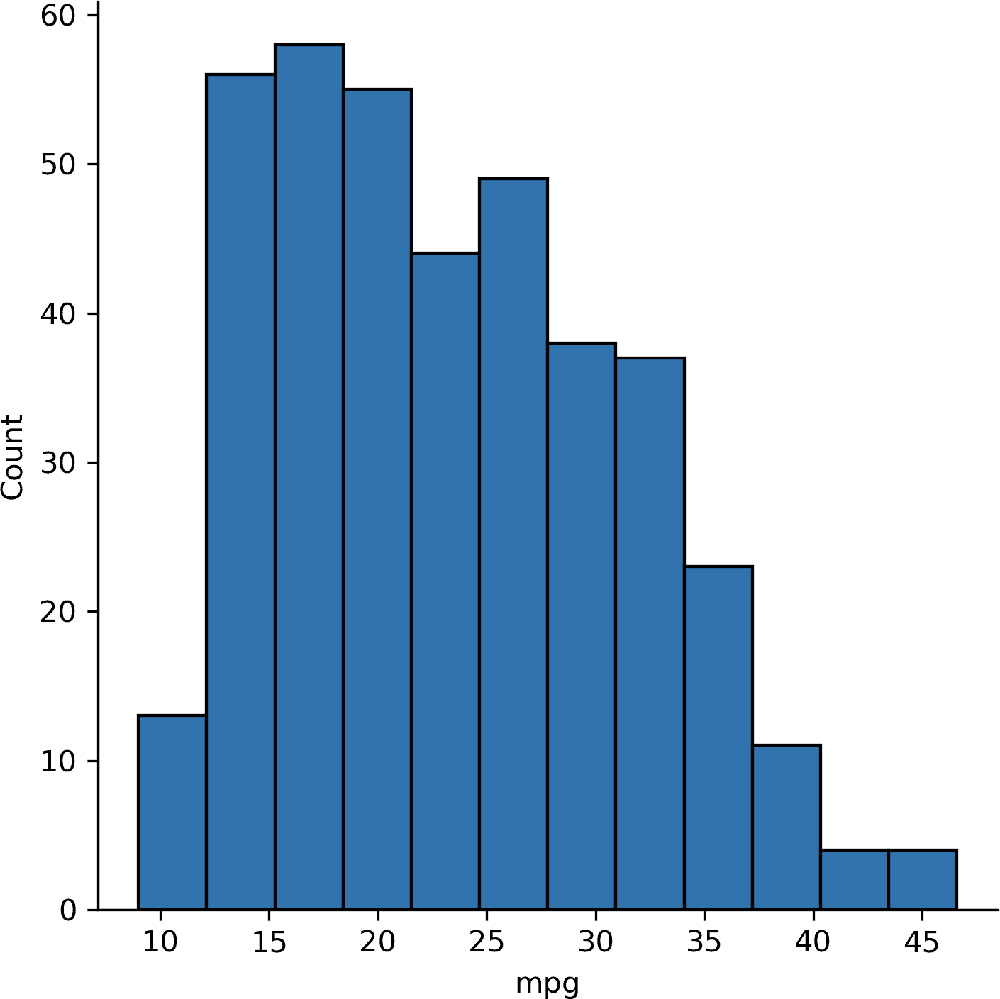
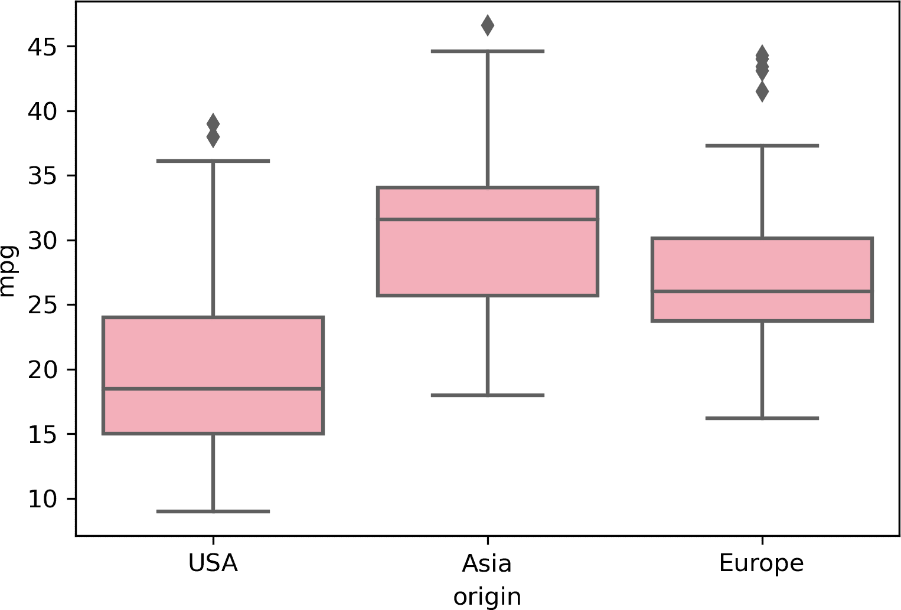
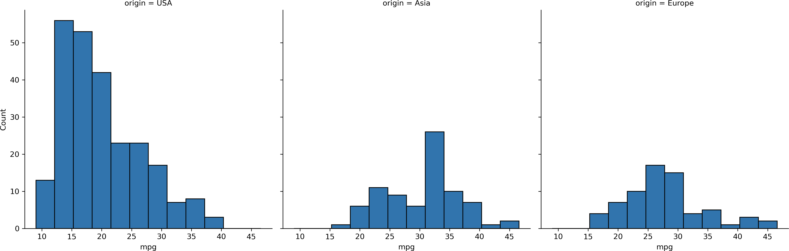
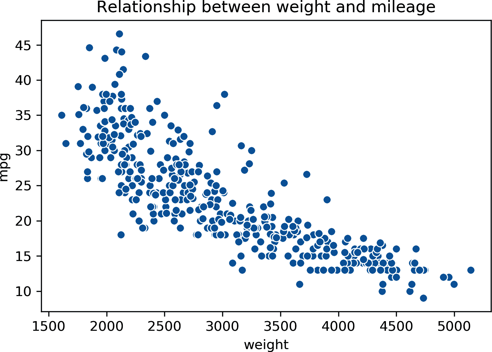
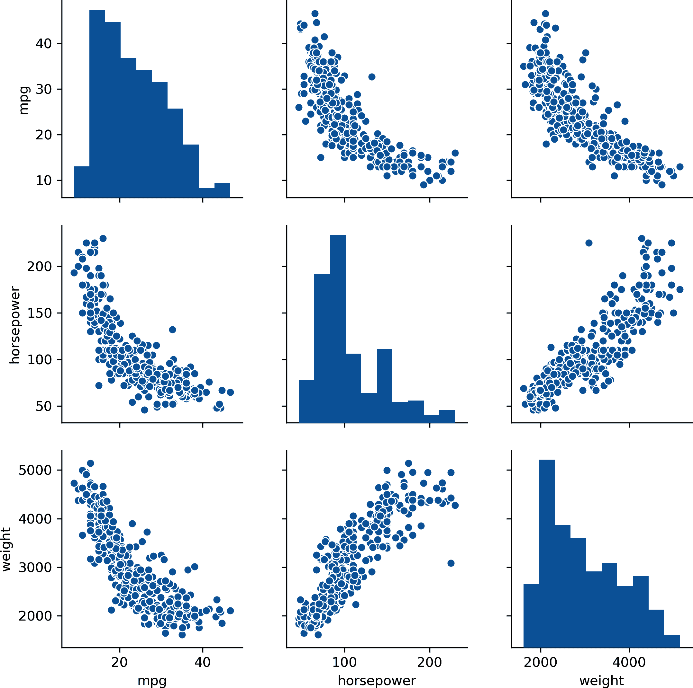
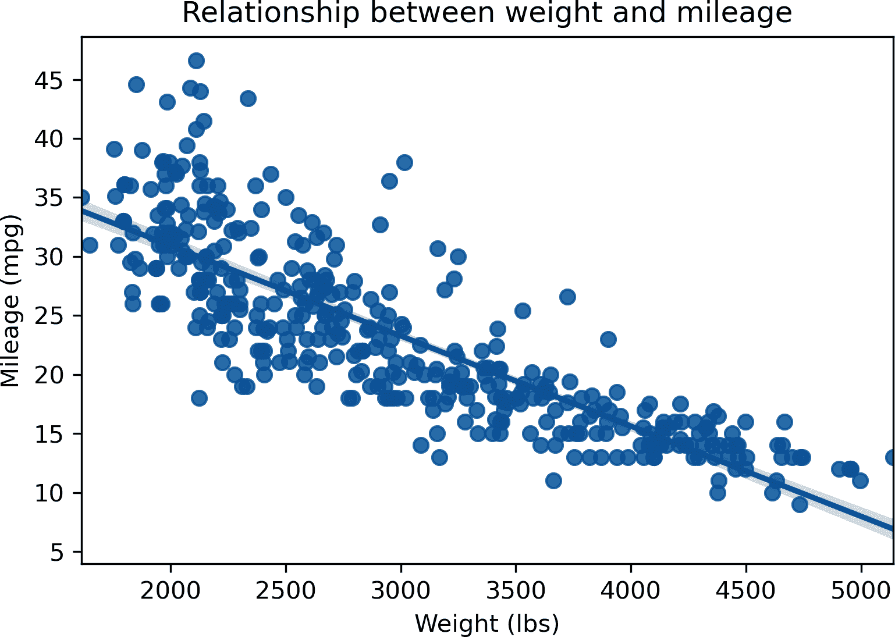

# 第十三章\. 项目实战：Python 数据分析

在 第八章 结尾，你扩展了对 R 的学习，以探索和测试 *mpg* 数据集中的关系。在本章中，我们将使用 Python 进行相同的工作。我们在 Excel 和 R 中进行了相同的工作，所以我将更专注于如何在 Python 中进行分析，而不是为什么要进行分析。

要开始，请调用所有必要的模块。其中一些是新的：从 `scipy` 中，我们将导入 `stats` 子模块。为了告诉 Python 要查找哪个模块，我们将使用 `from` 关键字，然后使用 `import` 关键字来选择一个子模块。正如其名，我们将使用 `scipy` 的 `stats` 子模块来进行统计分析。我们还将使用一个称为 `sklearn` 或 *scikit-learn* 的新包，在训练/测试拆分上验证我们的模型。这个包已经成为机器学习的主要资源，并且与 Anaconda 一起安装。

```py
In [1]: import pandas as pd
        import seaborn as sns
        import matplotlib.pyplot as plt
        from scipy import stats
        from sklearn import linear_model
        from sklearn import model_selection
        from sklearn import metrics
```

使用 `read_csv()` 的 `usecols` 参数，我们可以指定读入 DataFrame 的列：

```py
In [2]: mpg = pd.read_csv('datasets/mpg/mpg.csv',usecols=
           ['mpg','weight','horsepower','origin','cylinders'])
        mpg.head()

Out[2]:
     mpg  cylinders  horsepower  weight origin
 0  18.0          8         130    3504    USA
 1  15.0          8         165    3693    USA
 2  18.0          8         150    3436    USA
 3  16.0          8         150    3433    USA
 4  17.0          8         140    3449    USA
```

# 探索性数据分析

让我们从描述统计开始：

```py
In[3]: mpg.describe()

Out[3]:
              mpg   cylinders  horsepower       weight
count  392.000000  392.000000  392.000000   392.000000
mean    23.445918    5.471939  104.469388  2977.584184
std      7.805007    1.705783   38.491160   849.402560
min      9.000000    3.000000   46.000000  1613.000000
25%     17.000000    4.000000   75.000000  2225.250000
50%     22.750000    4.000000   93.500000  2803.500000
75%     29.000000    8.000000  126.000000  3614.750000
max     46.600000    8.000000  230.000000  5140.000000
```

因为 *origin* 是一个分类变量，默认情况下它不会显示为 `describe()` 的一部分。让我们改为用频率表探索这个变量。这可以在 `pandas` 中用 `crosstab()` 函数来实现。首先，我们将指定将数据放在索引上的内容：*origin*。通过将 `columns` 参数设置为 `count`，我们将得到每个水平的计数：

```py
In [4]: pd.crosstab(index=mpg['origin'], columns='count')

Out[4]:
col_0   count
origin
Asia       79
Europe     68
USA       245
```

要制作双向频率表，我们可以将 `columns` 设置为另一个分类变量，如 `cylinders`：

```py
In [5]: pd.crosstab(index=mpg['origin'], columns=mpg['cylinders'])

Out[5]:
cylinders  3   4  5   6    8
origin
Asia       4  69  0   6    0
Europe     0  61  3   4    0
USA        0  69  0  73  103
```

接下来，让我们按 *origin* 水平检索 *mpg* 的描述统计信息。我将通过链接两种方法，然后子集化结果来完成这项工作：

```py
In[6]: mpg.groupby('origin').describe()['mpg']

Out[6]:
        count       mean       std   min    25%   50%     75%   max
origin
Asia     79.0  30.450633  6.090048  18.0  25.70  31.6  34.050  46.6
Europe   68.0  27.602941  6.580182  16.2  23.75  26.0  30.125  44.3
USA     245.0  20.033469  6.440384   9.0  15.00  18.5  24.000  39.0
```

我们还可以像 图 13-1 那样可视化 *mpg* 的整体分布：

```py
In[7]: sns.displot(data=mpg, x='mpg')
```



###### 图 13-1\. *mpg* 的直方图

现在让我们制作一个箱线图，如 图 13-2，比较每个 *origin* 水平上 *mpg* 的分布：

```py
In[8]: sns.boxplot(x='origin', y='mpg', data=mpg, color='pink')
```



###### 图 13-2\. 按 *origin* 分组的 *mpg* 箱线图

或者，我们可以将 `displot()` 的 `col` 参数设置为 `origin` 来创建分面直方图，例如 图 13-3：

```py
In[9]: sns.displot(data=mpg, x="mpg", col="origin")
```



###### 图 13-3\. 按 *origin* 分组的分面直方图

# 假设检验

让我们再次测试美国和欧洲汽车之间的里程差异。为了便于分析，我们将每个组中的观测分割成它们自己的数据框。

```py
In[10]: usa_cars = mpg[mpg['origin']=='USA']
        europe_cars = mpg[mpg['origin']=='Europe']
```

## 独立样本 t 检验

现在我们可以使用 `scipy.stats` 中的 `ttest_ind()` 函数进行 t 检验。这个函数期望接收两个 `numpy` 数组作为参数；`pandas` 的 Series 也可以使用：

```py
In[11]: stats.ttest_ind(usa_cars['mpg'], europe_cars['mpg'])

Out[11]: Ttest_indResult(statistic=-8.534455914399228,
            pvalue=6.306531719750568e-16)
```

不幸的是，这里的输出相当有限：虽然包括了 p 值，但未包括置信区间。要获得更多输出的 t 检验结果，请查看`researchpy`模块。

现在我们来分析我们的连续变量。我们将从相关矩阵开始。我们可以使用`pandas`中的`corr()`方法，只包括相关变量：

```py
In[12]: mpg[['mpg','horsepower','weight']].corr()

Out[12]:
                 mpg  horsepower    weight
mpg         1.000000   -0.778427 -0.832244
horsepower -0.778427    1.000000  0.864538
weight     -0.832244    0.864538  1.000000
```

接下来，让我们用散点图可视化*weight*和*mpg*之间的关系，如图 13-4 所示：

```py
In[13]: sns.scatterplot(x='weight', y='mpg', data=mpg)
        plt.title('Relationship between weight and mileage')
```



###### 图 13-4\. *mpg*按*weight*的散点图

或者，我们可以使用`seaborn`的`pairplot()`函数在数据集的所有变量对上生成散点图。对角线上包括每个变量的直方图，如图 13-5 所示：

```py
In[14]: sns.pairplot(mpg[['mpg','horsepower','weight']])
```



###### 图 13-5\. *mpg*、*horsepower*和*weight*的 Pairplot

## 线性回归

现在是进行线性回归的时候了。为此，我们将使用`scipy`中的`linregress()`函数，该函数同样适用于两个`numpy`数组或`pandas` Series。我们将使用`x`和`y`参数指定哪个变量是独立变量和依赖变量：

```py
In[15]: # Linear regression of weight on mpg
        stats.linregress(x=mpg['weight'], y=mpg['mpg'])

Out[15]: LinregressResult(slope=-0.007647342535779578,
   intercept=46.21652454901758, rvalue=-0.8322442148315754,
   pvalue=6.015296051435726e-102, stderr=0.0002579632782734318)
```

同样地，您会发现您习惯于看到的一些输出在这里是缺失的。*请注意：* 这里包含的`rvalue`是*相关系数*，而不是 R 平方。要获得更丰富的线性回归输出，请查看`statsmodels`模块。

最后但同样重要，让我们在散点图上叠加回归线。`seaborn`有一个专门的函数来实现这一点：`regplot()`。与往常一样，我们将指定我们的独立和依赖变量，以及数据的来源。这将产生图 13-6：

```py
In[16]: # Fit regression line to scatterplot
        sns.regplot(x="weight", y="mpg", data=mpg)
        plt.xlabel('Weight (lbs)')
        plt.ylabel('Mileage (mpg)')
        plt.title('Relationship between weight and mileage')
```



###### 图 13-6\. *mpg*按*weight*的散点图与拟合回归线

## 训练/测试拆分与验证

在第九章结束时，您学习了如何在构建 R 中的线性回归模型时应用训练/测试拆分。

我们将使用`train_test_split()`函数将数据集分为*四*个 DataFrame：不仅包括训练和测试数据，还包括独立和依赖变量。我们将先传入包含独立变量的 DataFrame，然后是包含依赖变量的 DataFrame。使用`random_state`参数，我们会为随机数生成器设置种子，以确保本示例的结果保持一致：

```py
In[17]: X_train, X_test, y_train, y_test =
        model_selection.train_test_split(mpg[['weight']], mpg[['mpg']],
        random_state=1234)
```

默认情况下，数据以 75/25 的比例分割为训练和测试子集。

```py
In[18]:  y_train.shape

Out[18]: (294, 1)

In[19]:  y_test.shape

Out[19]: (98, 1)
```

现在，让我们将模型拟合到训练数据上。首先，我们将使用`LinearRegression()`指定线性模型，然后使用`regr.fit()`训练模型。要获取测试数据集的预测值，我们可以使用`predict()`方法。这将得到一个`numpy`数组，而不是`pandas` DataFrame，因此`head()`方法不能用来打印前几行。不过，我们可以对其进行切片操作：

```py
In[20]:  # Create linear regression object
         regr = linear_model.LinearRegression()

         # Train the model using the training sets
         regr.fit(X_train, y_train)

         # Make predictions using the testing set
         y_pred = regr.predict(X_test)

         # Print first five observations
         y_pred[:5]

Out[20]:  array([[14.86634263],
         [23.48793632],
         [26.2781699 ],
         [27.69989655],
         [29.05319785]])
```

`coef_`属性返回了我们测试模型的系数：

```py
In[21]:  regr.coef_

Out[21]: array([[-0.00760282]])
```

要获取关于模型的更多信息，如系数的 p 值或 R 平方，请尝试使用`statsmodels`包进行拟合。

目前，我们将评估模型在测试数据上的表现，这次使用`sklearn`的`metrics`子模块。我们将实际值和预测值传递给`r2_score()`和`mean_squared_error()`函数，分别返回 R 平方和 RMSE。

```py
In[22]:  metrics.r2_score(y_test, y_pred)

Out[22]: 0.6811923996681357

In[23]:  metrics.mean_squared_error(y_test, y_pred)

Out[23]: 21.63348076436662
```

# 结论

这一章节的常规警告同样适用：我们只是触及了对这个或任何其他数据集可能进行的分析的表面。但我希望你感觉在使用 Python 处理数据方面已经步入佳境。

# 练习

再次查看*ais*数据集，这次使用 Python。从[书籍仓库](https://oreil.ly/dsZDM)中读取 Excel 工作簿，并完成以下操作。现在你应该对这个分析已经非常熟悉了。

1.  通过性别（*sex*）可视化红细胞计数（*rcc*）的分布。

1.  两组性别之间的红细胞计数是否存在显著差异？

1.  在该数据集中生成相关变量的相关矩阵。

1.  可视化身高（*ht*）和体重（*wt*）之间的关系。

1.  将*wt*回归到*ht*上。找出拟合回归线的方程。是否存在显著关系？

1.  将回归模型分割成训练集和测试集。测试模型的 R 平方和 RMSE 是多少？
