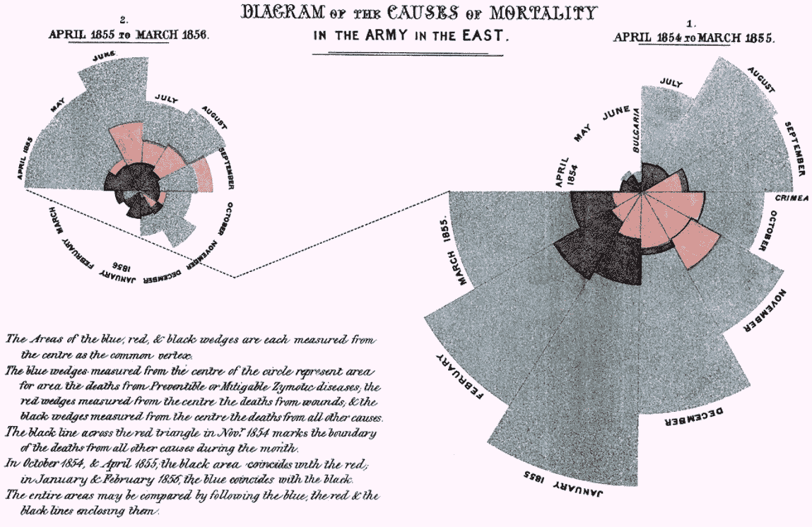
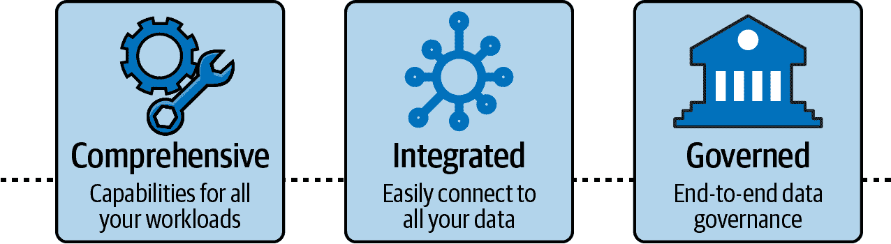
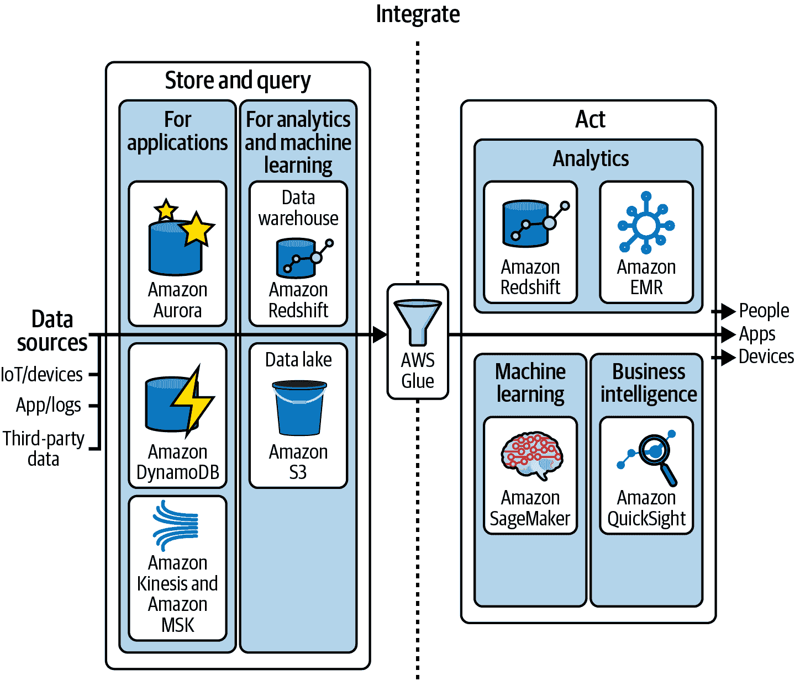
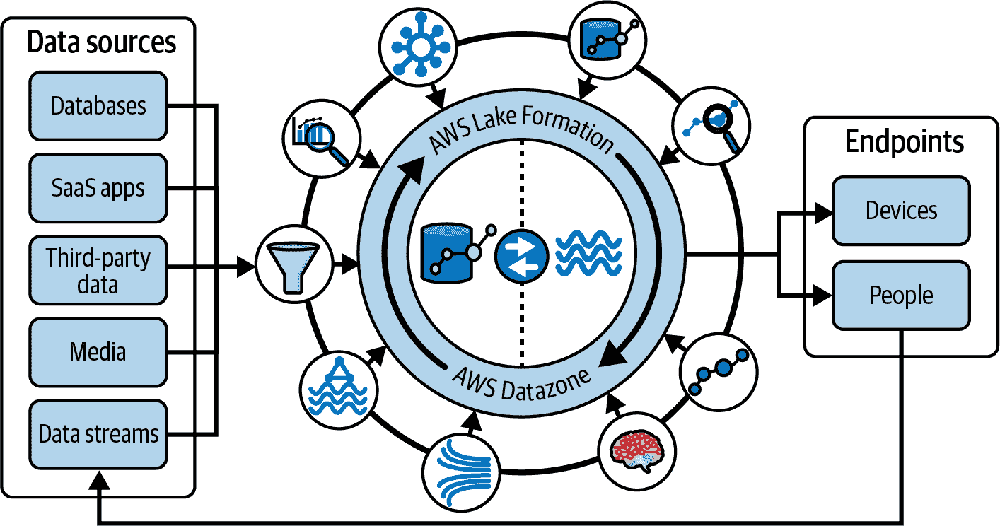
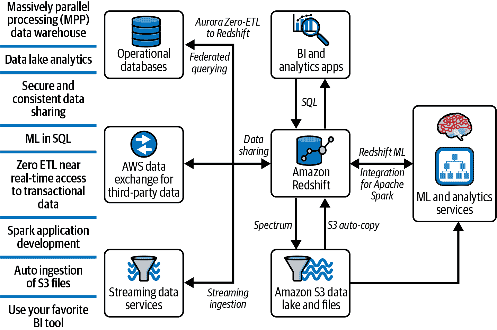
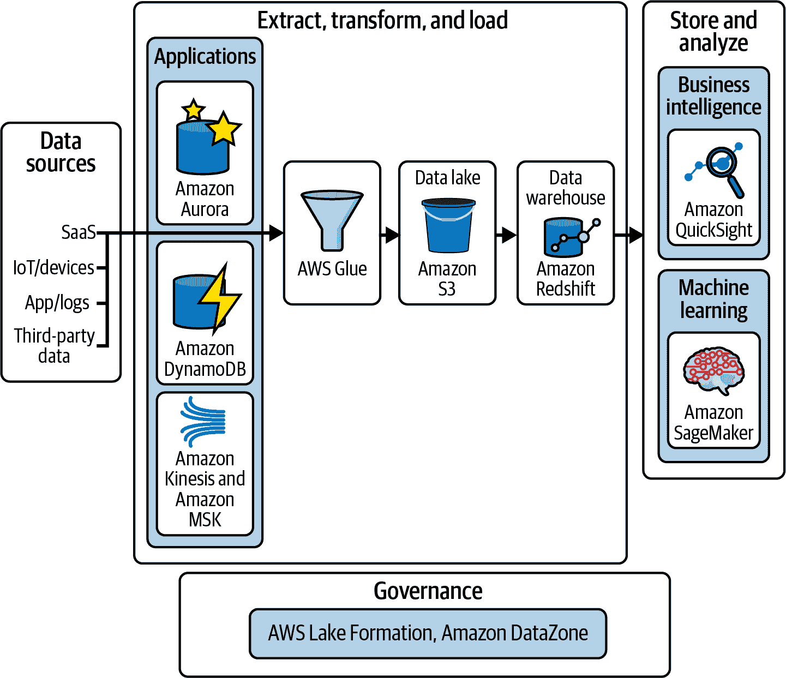
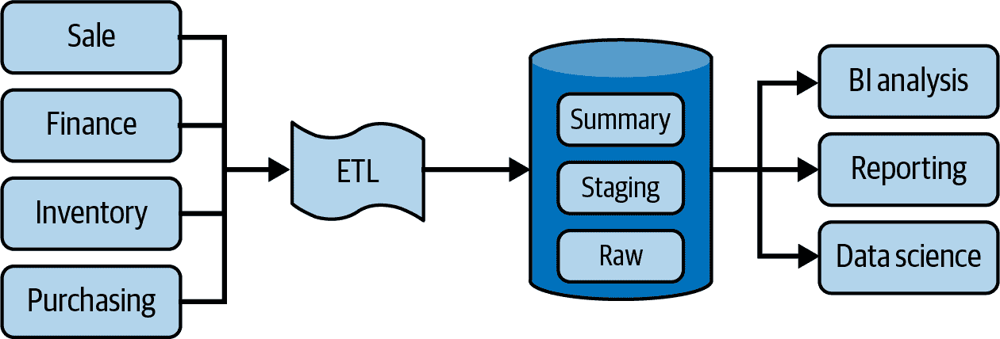
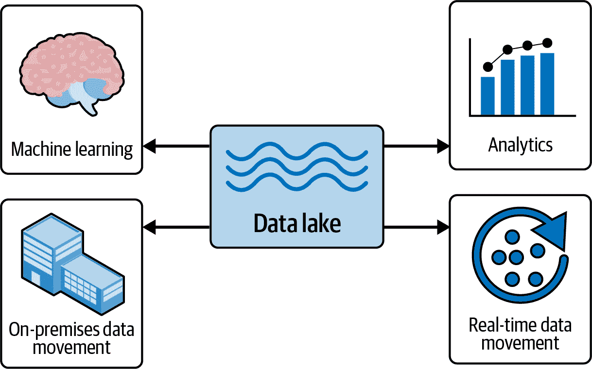
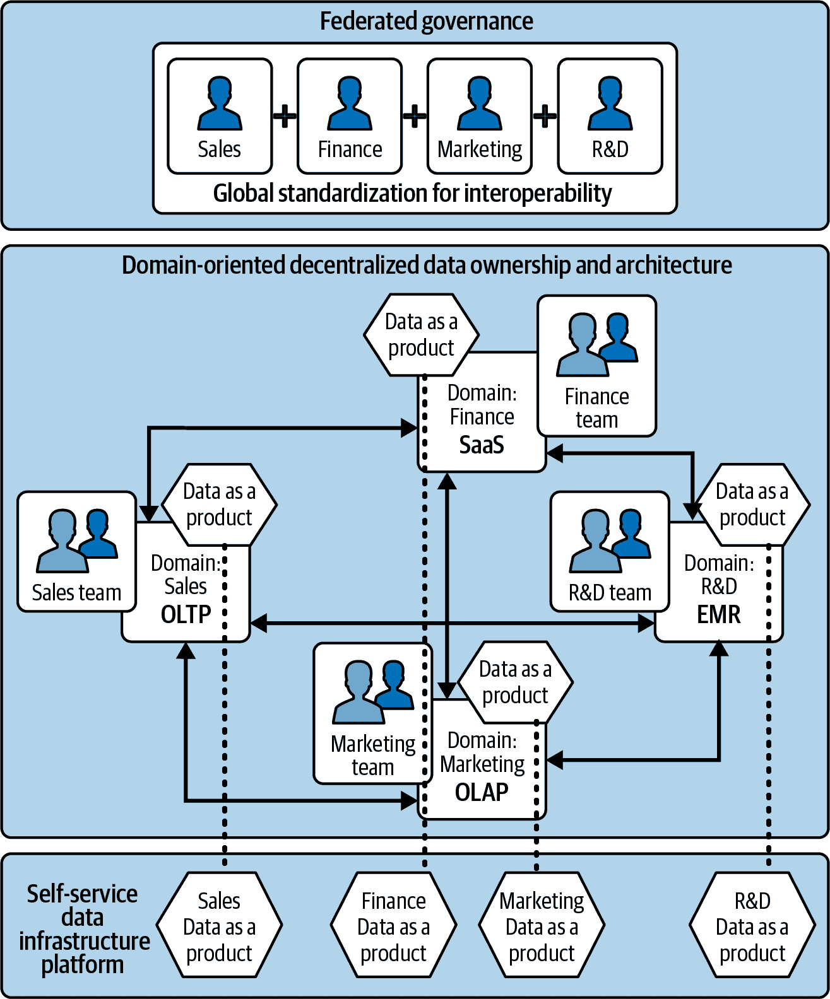
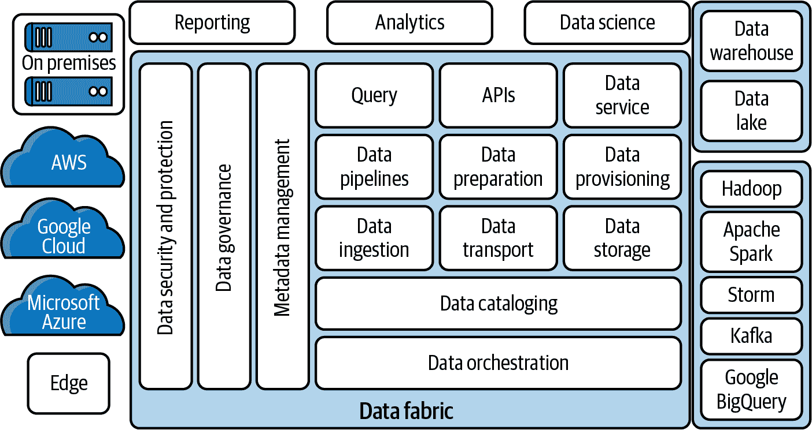

# 第一章：AWS 数据

> 在有数据之前进行理论推测是一个严重的错误。
> 
> Sherlock Holmes

数据是无处不在的，驱动着我们今天所做的一切。谁能想到仅通过行走就能生成数据，并在你打电话给朋友时实时监测你的步数？从手机、智能手表和网页点击到物联网（IoT），我们正在大量生成各种类型的数据，组织面临着从所有这些数据中提取意义以提供洞察的挑战。您必须分析这些数据，以简单的方式呈现无偏见的信息，供领导者做出业务决策。数据是推动洞察和预测、促进更好决策和创新的基础力量。尽管具有挑战性，但必须利用这些数据，重塑您的业务，以保持在现在和将来的相关性。Amazon Redshift 是一个完全托管的 PB 级云数据仓库服务，支持现代数据架构，可将来自所有来源的数据存储在集中或分散的架构中。它使您能够在数据仓库、数据湖和操作性数据库之间查询数据，获得其他方式无法实现的更快速和更深入的洞察。

在本章中，我们将涵盖亚马逊网络服务（AWS）数据框架的核心要素，包括是什么让“数据驱动的组织”成功，“现代数据战略”的核心要素，以及构建“现代数据架构”的要点。最后，我们将深入探讨一些流行的方法，组织如何利用“数据网格和数据布局”以可伸缩的方式满足每个分析用户群体的需求。

# 数据驱动组织

数据驱动的组织将数据视为一种资产；它们不仅使其对业务用户可用和可访问，而且对所有需要数据来做决策的人都可用，以便他们能做出更为明智的决策。这些组织认识到数据的内在价值，并意识到优质数据为组织及其经济影响带来的价值。它们民主化数据，并为业务决策者提供衡量关键绩效指标（KPIs）的数据。彼得·德鲁克归因于的名言“不能提升不可测量的事物”对当今的企业更为相关。

大多数企业都有一系列常规监控以推动增长和提高生产力的 KPI。这些 KPI 可能从常见的增长、销售、市场份额、客户数量和客户获取成本到更多领域特定的指标如销售量、产能利用率、电子邮件退出率或购物车放弃率。一个好的 KPI 是具体的、可测量的，并对整体业务目标有影响，可能会因企业而异。

虽然一些属性，如员工士气、信心和组织的诚信，实际上无法进行真正的衡量，但有很多可以进行测量和监控以实现进展。访问这些数据意味着领导者可以采取策略将企业朝特定方向发展。例如，一家制造商收购了一家电动工具公司后，直到他们的 IT 团队将数据集成到核心企业资源计划（ERP）系统中，他们才像是打开了灯，看清了他们在业务道路上的前进方向。执行官评论说，这对他们来说就像是开启了光明，让他们看到了这个业务的前进方向。

在他的书《信息经济学》（Gartner, Inc.）中，道格·兰尼讨论了组织超越仅仅思考和谈论信息作为资产的重要性，实际上评估和对待它作为一个资产。他认为信息应被视为一种新的资产类别，因为它具有可衡量的经济价值，并应像管理其他类型的资产一样加以管理。兰尼为企业提供了一个框架，以将信息作为实际资产进行货币化、管理和衡量。他谈到，货币化并不仅仅是卖数据或交换现金。它是关于实现信息价值，更广泛地思考影响客户并产生利润的方法。这是关于从客户需求和兴趣出发，逆向思考，将业务和运营策略与客户的优先事项对齐。分析帮助组织做出更好的决策，推动关键战略举措。它还帮助你改善与客户和业务伙伴的关系。

在 AWS re:Invent 2021 上，亚当·塞利普斯基谈到了佛罗伦萨·南丁格尔如何分析克里米亚战争期间士兵的死亡率。护士南丁格尔利用数据和分析得出一个结论，即大多数士兵不是在战斗中死亡，而是在医院因恶劣的卫生条件导致的可预防疾病中死亡。南丁格尔分析了她收集的数据，并创建了一个简单但强大的可视化图表（图 1-1），描述了士兵死亡原因的玫瑰图。这种玫瑰图，也称为极地面积图，允许在一个图表中进行多个比较，展示了每个月因疾病、伤口和其他原因的死亡率。这种可视化帮助南丁格尔说服维多利亚女王和将军们，更多士兵是因疾病而非伤口死亡，尤其是在冬季，突显了对医院改革和对士兵的关爱的需求。这是数据讲述影响的一个很好的例子；它确实改变了对话以帮助挽救生命。

###### 图 1-1\. 佛罗伦萨·南丁格尔的死因玫瑰图

今天，您可能期望能够即时获取洞察，并倾向于在数据到达后立即访问数据。有许多激励人心的数据驱动型公司的例子，它们通过使用分析工具专注于并适应客户偏好变化。全球新闻提供商道琼斯通过使用分析工具并使数据可访问，将其邮件沟通的回应率提高了 50%至 100%。Magellan Rx 现代化其数据仓库，能够通过更快地将药物推向市场和减少运营成本 20%，从而改善患者结果。Moderna 使用 Amazon Redshift 进行简单且具有成本效益的数据仓库，以避免信息孤岛并为整个组织建立真正的单一数据来源。纳斯达克将其不断增长的数据仓库迁移到更现代的数据湖架构，并能够通过 Amazon Simple Storage Service (S3) 和 Amazon Redshift 的灵活性和可伸缩性支持每天从 30 亿条记录增加到 70 亿条记录。Netflix 利用数据创造了像《纸牌屋》这样的大热剧集。他们的管理者通过分析媒体和娱乐行业数字化转型的数据，建立了以前不存在的利润市场。可口可乐安迪纳在南美生产和分销可口可乐公司授权的产品，通过创建一个数据湖提高了其分析团队的生产力 80%，该数据湖成为由 SAP ERP 和其他遗留数据库生成的数据的单一来源。

这些成功的数据驱动型公司的共同主题是数据民主化，并将洞察力交给决策者手中。拥有可靠的数据是获取可操作洞察力的基础，良好设计的数据架构和技术堆栈可以增强数据的可靠性。限制数据在组织内的流动是避免数据不一致的一种方式，可以增强数据的完整性和信任度。这并不一定意味着建立一个所有数据的单一存储库。使用 Amazon S3，你可以将来自不同来源的数据以不同格式存储在一个存储库中。但组织也在考虑从源系统或独立数据仓库中直接查询数据。这促使了数据网格和数据布置等新概念的产生，我们将在本章后面看到。那些以数据驱动为核心，并专注于建立与数据的信任和规模的组织，更有利于在市场竞争中获得实时洞察。

## 业务使用案例

从小企业到全球企业，数据和分析对于获取对业务或组织状态的洞察至关重要。我们挑选了一些常见的使用案例，以展示您如何在本书中使用 AWS 分析服务和特定数据模型获得业务洞察。让我们看看一些最常见的使用案例及分析如何提供业务成果。

供应链管理

随着电子商务对传统实体零售商的影响，公司必须利用分析来转变他们定义和管理供应链的方式。使用数据和定量方法，需求和供应规划者可以在整个供应链周期中改善决策制定。制造商和零售商可以应用统计方法来改善供应链决策，确保产品在适当的时间和地点供应给消费者。他们可以分析库存并根据需求信号计划供应。亚马逊是一个很好的例子，他们通过 Amazon Redshift 每天处理 51,000 个查询，以推动供应链的卓越表现。

金融

金融和银行组织帮助客户进行投资决策，并提供资金管理解决方案。如今，许多银行利用人工智能（AI）和机器学习（ML）来识别欺诈、预测客户流失，并积极参与以预防欺诈或客户流失。例如，您可能在度假或访问新地方时曾经遇到过信用卡被停用的情况。这就是机器学习在幕后工作，检测异常活动并在可能发生欺诈交易之前阻止。正确的数据的可用性和易访问性使这一切成为可能。

客户关系管理（CRM）

实施客户关系管理（CRM）数据仓储数据模型可以帮助企业整合来自多个接触点（如销售、营销和客户支持）的客户数据。通过分析这些数据，企业可以深入了解客户行为、偏好和满意度水平。这些信息可以用来个性化营销活动，改善客户服务，并促进长期客户关系。

教育

教育分析可以在学生的学习体验和结果中产生重大影响。传统的课堂教学方法对今天沉浸在数字世界的孩子们有其挑战。学校面临高辍学率、低效结果和过时的课程大纲等问题。转向个性化学习方法意味着学生可以利用灵活性，按自己的节奏学习。这也意味着采用混合学习，结合在线学习管理解决方案，能够为学习者提供定制内容。来自学生与在线学习环境的互动数据，再加上测试成绩的数据，可以用来分析并提供对学生可能需要额外帮助的见解。借助人工智能和机器学习，教育工作者可以预测个别学生的结果，并采取积极措施，以确保积极的结果和体验。

医疗保健行业

数据在医疗行业中发挥着关键作用，改革了提供患者护理、进行医学研究以及通过运营效率控制成本的方式。医疗组织可以利用数据的力量解锁有价值的洞见，推动基于证据的决策，以改善患者结果并提升整体医疗服务。通过在大型数据集中识别模式、趋势和相关性，医疗专业人员可以更深入地理解疾病和基于患者反应的治疗效果。通过预测分析，这些组织可以早期发现疾病，并为高风险患者群体提供个性化药物治疗。这些组织还可以通过分析索赔数据并识别欺诈活动的模式来检测虚假索赔。

## 利用生成式 AI 的新商业用例

生成式 AI 和数据仓库可以相辅相成，增强数据分析和决策过程的各个方面。接下来，我们将概述生成式 AI 如何与数据仓库集成的几种方式：

代码生成

生成式 AI 模型可以在广泛的代码仓库和编程语言上进行训练，以生成代码完成和建议。当开发人员编写代码时，AI 模型可以提供实时建议，帮助提高程序员的效率，通过建议或编写代码片段来完成。这也有助于减少错误，并提高整体开发者生产力，以更快地推向市场。

自然语言生成

数据仓库通常涉及从数据中提取洞见并以有意义的方式呈现给利益相关者。生成式 AI 模型可以基于仓库中存储的数据生成人类可读的报告或叙述。这也可以是描述性分析的自动化生成或总结，使决策者更容易理解和解释数据或报告的内容。

合成数据生成

要训练机器学习模型，数据的质量决定了预测的准确性。生成式 AI 模型可用于生成模拟真实数据特征的合成数据。这些合成数据可以与数据仓库中的实际数据结合使用，扩展数据集并为机器学习模型创建更全面和多样化的训练集。它有助于克服数据稀缺问题，提高分析模型的准确性和鲁棒性。

异常检测

生成式 AI 模型，如生成对抗网络（GANs），可以用于数据仓库中的异常检测。通过在正常数据模式上训练 GAN，它可以通过比较生成的数据与仓库中实际数据来学习识别异常。这可以帮助您检测到异常模式和离群值，以识别潜在的欺诈交易或操作。

数据填补和增强

不完整或缺失的数据可能会影响数据分析和决策的准确性。生成式 AI 技术可以通过学习现有数据中的潜在模式来填补缺失值。通过在现有数据上训练生成模型，它可以为缺失的数据点生成合理的值，填补空白并提升数据仓库的完整性。您可以基于现有数据扩充数据仓库中的现有数据集，生成新的合成样本，从而创建一个更大更多样化的数据集，用于训练分析模型。这可以提高机器学习算法的性能和泛化能力，从而实现更好的预测和洞察。

推荐系统

生成式 AI 技术可以通过为用户生成个性化推荐来增强推荐系统。通过利用存储在数据仓库中的用户行为数据，生成模型可以学习用户偏好并生成针对产品、服务或内容的个性化推荐。这有助于企业提升客户参与度，推动销售或用户满意度。

将生成式 AI 与数据仓库集成可以扩展数据分析的能力，增强数据质量，并支持高级分析和决策过程。然而，在生成和利用合成数据时，确保道德考虑、隐私和安全至关重要。

# 现代数据策略

数据引力的概念最早由 Dave McCrory 在 2010 年提出。在他的类比中，他将数据比作一个行星，并讨论了组织在一个地方收集数据时形成的数据质量。应用程序和服务被吸引到这个数据质量附近，因为接近数据会带来更好的性能和吞吐量。这加速了数据的增长，最终使得数据几乎不可能再移动。由物联网、智能设备、云应用和社交媒体生成的数据正在继续呈指数增长。您需要一种简单且具有成本效益的方法来分析所有这些数据，无论数据的格式或存储位置如何，以在最短时间内获取洞察。

数据位于每个应用程序、流程和业务决策的中心。它几乎是每个组织数字转型的基石。它推动新体验，并带来促进创新的洞见。但要制定一个能够为整个组织释放数据价值的策略并不容易和直接。数据系统通常是庞杂、孤立和复杂的，各种数据集散布在数据湖、数据仓库、云数据库、软件即服务（SaaS）应用程序、物联网设备和本地系统之间。许多组织掌握着丰富的数据宝库，但不知道从何处着手获取其价值。企业难以掌握所有数据的位置，如何有效连接和处理这些数据，并管理对这些数据的访问。随着数据量的增长，这些问题只会变得更加棘手。无法有效利用数据会妨碍快速决策和持续创新。

要挖掘数据的价值，组织需要的不仅仅是单一数据库、数据湖、数据仓库或商业智能服务。事实上，每个组织都有多种用例、数据类型、用户和应用程序，这些需要不同的工具。这些需求会随时间演变。要真正释放数据的价值，驱动及时洞见和创新，您需要实施一个端到端的数据战略，在数据旅程的每一步都让数据处理更加轻松，以满足组织中每个需要数据的人员的需求。端到端数据战略结合了工具、资源和流程，用于数据摄取、存储和查询、分析数据以及构建机器学习模型，最终帮助最终用户开发基于数据驱动的洞见。这种端到端数据战略必须具备：

适用于任何数据用例的全面功能集

一个全面的工具集，考虑到当前和未来使用数据的规模、多样性以及多种目的。

一套集成工具，轻松连接所有数据

整合存储和分析不同工具和系统中的数据能力，以更好地理解您的业务并预测未来发展。

端到端数据治理

管理所有数据的治理，确保在用户需要时在何地安全地提供数据访问权限。

使用这三大支柱（如图 1-2 所示），您可以规模化存储不断增长的数据，无缝访问这些数据，并通过安全和治理控制管理数据访问权限。

###### 图 1-2\. 端到端现代数据战略的支柱

AWS 为您提供了一整套数据服务中所需的能力，具备内置智能和自动化功能，助您实施端到端的数据战略。让我们更深入地了解每个支柱及其涵盖的内容。

## 全面的能力集

要了解您的业务并随着工作负载的变化进行扩展、简化流程并做出更好的决策，您需要构建能够满足现在和未来需求的数据策略。有效利用数据不仅仅需要单一的数据湖、数据仓库或商业智能工具，还需要一套全面的工具集，考虑到数据的规模、多样性以及您希望使用它的多种目的。

您可以在数据旅程的各个阶段现代化您的数据架构，这意味着摆脱遗留数据库并转向完全托管和专为特定用途设计的数据服务。如果您正在运行遗留的本地数据存储或在云中自我管理的数据库，您仍然需要处理诸如数据库配置、补丁管理和备份等管理任务。通过过渡到 AWS 云或其他超大规模云服务提供商的托管服务，您可以受益于云提供商在托管和管理应用程序方面的经验、成熟性、可靠性、安全性和性能。

要实现端到端数据策略，您需要将数据存储在针对您的工作负载优化的数据库中，从多个来源进行集成，并使用他们选择的工具使业务决策者能够访问信息并采取行动。如图 1-3 所示，AWS 提供了一套全面的数据能力，用于存储、集成、执行和管理各种类型的数据工作负载。采用一种适合所有情况的方法来现代化分析平台最终可能会导致妥协，因此 AWS 提供了专为支持各种数据模型设计的目的构建引擎，包括关系型、键值、文档、内存、图形、时间序列、宽列和分类账数据库。这些能力集帮助您在数据存储的任何位置访问数据、分析数据并根据洞察行动。

###### 图 1-3\. 端到端数据策略

这些数据服务和分析工具针对特定类型的工作负载进行了优化，AWS 提供了工具来集成和管理存储在专为特定用途设计的数据服务中的数据。

AWS Glue

一个无服务器、可扩展的抽取、转换和加载（ETL）以及数据集成服务，使发现、准备、移动和集成来自多个来源的数据以进行分析和机器学习变得更加容易。

亚马逊 DynamoDB

一个完全托管的、无服务器的键值 NoSQL 数据库，旨在以任意规模运行高性能应用程序。DynamoDB 提供内置安全性、持续备份、自动多区域复制、内存缓存以及数据导入和导出工具。

亚马逊 EMR

一个大数据解决方案，用于在云上处理 PB 级数据，具备交互式分析和机器学习能力，使用诸如 Apache Spark、Apache Hive 和 Presto 等开源框架。

OpenSearch

一个分布式、社区驱动、Apache 2.0 许可的开源搜索和分析套件，用于广泛的用例，如实时应用监控、日志分析和网站搜索。

Amazon Simple Storage Service（Amazon S3）

一种对象存储服务，提供高可扩展性、数据可用性、安全性和性能。您可以存储和保护结构化和非结构化数据，用于数据湖、云原生应用和移动应用等用例。

Amazon QuickSight

一种为用户提供的无服务器服务，通过现代交互式仪表板、分页报告、嵌入式分析和自然语言查询，帮助您从同一真实数据源满足各种分析需求。

Amazon Kinesis

使收集、处理和分析实时流数据变得简单，使您能够及时获取见解并快速对新信息做出反应。Amazon Kinesis 提供能力以成本效益的方式处理规模化的流数据，同时灵活选择最适合应用程序需求的工具。

Amazon Redshift

一个在云中完全托管的 PB 级数据仓库服务。使用 Amazon Redshift，您可以通过符合性、安全性和治理现代化云数据仓库，并利用扩展功能来满足您的可变需求。您可以安全地摄取、组合和运行历史、实时或预测性分析，使用无服务器或预配部署选项处理所有数据。

Amazon SageMaker

一个完全托管的服务，用于准备数据和构建、训练和部署任何用例的机器学习模型，提供完全托管的基础设施、工具和工作流程。

这些服务紧密集成并能相互通信，以利用彼此的数据。

## 一套集成工具

最有影响力的数据驱动洞见来自于全面了解您的业务和客户的全貌。只有当您在多个部门、服务、本地工具和第三方应用（如商业智能系统或统计建模工具）之间连接数据源时，才能实现这一点。通常，跨不同数据源连接数据需要数据复制或复杂的 ETL 管道，这可能需要数小时，甚至数天的时间。这只是不够快以跟上决策速度。ETL 需要更简单化，甚至在许多情况下需要消除。

伟大的业务领袖看到了在价值链上实现业务转型的机会。但要实现这样的转型，需要数据来帮助决策者全面了解业务并建立真实的单一数据源。这需要打破数据孤岛，以安全的方式使数据可访问和共享，从而释放组织中数据的价值。

要快速做出决策，您需要新的数据存储，这些存储将随着业务需求的变化而扩展和增长。您还希望能够将所有内容连接在一起，包括数据湖、数据仓库和所有目的构建的数据存储，形成一个安全且良好治理的连贯系统。

要实现这种综合视图，有多种方法：联合查询、低代码/无代码数据同步，或传统的使用无服务器或服务器执行的 ETL。Amazon Redshift 为这些方法提供了选择，与其他 AWS 服务紧密集成。Amazon Aurora 与 Amazon Redshift 之间的零 ETL 功能使您能够将事务数据近乎实时地同步到数据仓库中。Amazon Redshift 允许从您的 Amazon S3 数据湖中查询数据，而联合查询功能则允许从操作数据库安全地直接查询数据。对于需要隔离计算的分析工作负载，您可以构建 ETL 管道，将数据提取、转换并加载到目标数据存储中。与 AWS Glue 的紧密集成允许您在 AWS Glue Studio 中轻松创建基于 Spark 的作业，并使用无服务器框架执行。有关 Amazon Redshift 数据转换策略的更多详细信息，请参见第四章，“数据转换策略”。

为了向数据分析师和数据科学家公开您的数据，Amazon Redshift 简化了访问路径。过去，机器学习局限于高技能的数据科学家或具有 Python、R 等编程语言深度技能的程序员。通过与 Amazon SageMaker 的紧密集成，Amazon Redshift 数据分析师可以使用 Amazon Redshift ML 从数据仓库或数据湖内运行机器学习工作负载，而无需选择、构建或训练 ML 模型。有关 Amazon Redshift 机器学习的更多详细信息，请参见第六章，“Amazon Redshift 机器学习”。此外，业务分析师可以使用 Amazon QuickSight 等工具自动发现他们的 Amazon Redshift 数据仓库，并连接到数据存储，快速生成具有业务见解的有影响力的仪表板。有关到达 Amazon Redshift 数据仓库的不同选项的更多详细信息，请参见第二章，“开始使用 Amazon Redshift”。

## 全流程数据治理

建立正确的治理机制可以帮助您平衡控制与访问权限，并使组织内的人员对数据充满信任和信心。它鼓励创新，而不是限制，因为合适的人员可以在需要时快速找到、访问和共享数据。

为了激发创新，组织应该支持数据安全的概念，意味着如何以安全的方式释放您的数据，而不是意味着如何保护数据并限制用户访问。在 AWS 上进行端到端的数据治理，您可以在数据工作流的每个步骤控制数据的位置、访问者以及可以对其执行的操作。

对于数据工程师和开发人员，AWS 在服务如 AWS Glue 和 AWS Lake Formation 中提供了精细的控制、目录和元数据。AWS Glue 使您能够在数据湖、数据仓库和数据库中对数据进行目录化。AWS Glue 还具有数据质量规则，用于检查数据的新鲜度、准确性和完整性。通过 AWS Lake Formation，您可以管理和审计在 Amazon S3 数据湖上的数据操作以及在 Amazon Redshift 中的数据共享。如果您在 Amazon S3 上拥有数据湖，您还可以使用 Amazon S3 访问点创建唯一的访问控制策略，轻松控制对共享数据集的访问。

数据科学家可以使用 SageMaker 中的治理控制来获得对 ML 模型的端到端可见性，包括训练、版本历史和模型性能，一切尽在一个地方。

最后，Amazon DataZone 是一个数据管理服务，用于目录化、发现、共享和治理数据。它使数据工程师、数据科学家、产品经理、分析师和其他业务用户能够发现、使用和共享数据，从而为您的业务带来洞察。

总结一下，越来越清楚的是，利用数据是数字转型的下一个浪潮。现代化意味着统一数据湖和专用数据存储的最佳方案，并使其易于通过 ML 进行创新。通过全面性、集成性和治理性这三大支柱，AWS 的现代数据战略可以帮助您构建根据需求扩展并降低运营成本的架构。

# 现代数据架构

当你着手进行现代数据战略时，你必须考虑如何以低成本处理任意数量的数据，并且使用开放的、基于标准的数据格式。该战略还应该让你打破数据孤岛，使团队能够使用他们喜欢的工具或技术进行分析或机器学习，并管理谁可以访问数据，确保适当的安全性和数据治理控制。

要执行现代数据策略，您需要一个*现代数据架构*。您可能听说过数据仓库、数据湖和数据网格，您可能也在考虑其中一种策略。*数据仓库*使您能够存储结构化数据并在大量数据上进行快速查询访问。*数据湖*是一个中央仓库，您可以在其中存储所有结构化和非结构化数据，并轻松访问。*数据网格*允许您在原地访问数据，同时分散数据的所有权和治理。现代数据架构需要支持所有这些方面，以从不断增长的数据质量中获得业务洞察。

AWS 现代数据架构建立在包括专用数据存储在内的模型之上，以优化规模、可用性、性能和成本。它支持集成数据湖、数据仓库和专用存储，实现统一治理和简化数据移动。Amazon Redshift 和 Amazon S3 构成了您现代数据架构的核心，与其他专用服务紧密集成。

在所示的现代数据架构中（见图 1-4），有三种不同的数据移动模式：内部移动、外部移动和周边移动。

###### 图 1-4\. 使用专用服务构建的现代数据架构

内部移动数据

有时会将中央数据存储中的数据子集移动到专用数据存储中，例如用于在线分析处理（OLAP）工作负载的 Amazon Redshift，Amazon OpenSearch Service 集群或 Amazon Neptune 集群，以支持专业分析，如搜索分析、构建知识图谱或两者兼而有之。在 Amazon Redshift 的背景下，您可以使用 Amazon Redshift 作为中央数据存储，其他服务（如 AWS Glue 或其他 Amazon Redshift 数据仓库）可以通过数据共享访问数据。或者，您可以通过`COPY`命令将 Amazon S3 数据湖中的数据加载到 Amazon Redshift 中，或者直接查询作为外部 Amazon S3 模式的数据。

外部移动数据

组织机构从最适合其应用程序的数据存储开始，随后将这些数据移动到中央数据存储以进行协作。例如，为了卸载不经常访问的历史数据，您可能希望从 Amazon Redshift 将这些数据`UNLOAD`到您的 Amazon S3 数据湖中。游戏公司可能会选择 Amazon DynamoDB 作为维护游戏状态、玩家数据、会话历史和排行榜的数据存储。这些数据稍后可以导出到 Amazon S3 数据湖中，以进行额外的分析，以改善玩家的游戏体验。

周边移动

也有一些场景，数据从一个专门的数据存储移动到另一个。例如，您可以使用 Amazon Redshift 的联合查询功能直接从操作数据存储（如 Amazon Aurora）查询数据，或者使用 Amazon Redshift ML 功能运行模型，这将触发 Amazon SageMaker 中的流程。

您可以通过避免构建紧密耦合的单块应用程序，而是构建具有独立组件（称为微服务）的模块化应用程序，在现代数据战略的各个阶段进行创新。这些本地的、专为目的而建的集成 AWS 服务非常适合构建模块化应用程序，同时利用 ML 和 AI 等新兴技术。

## Amazon Redshift 在现代数据架构中的角色

Amazon Redshift 推动现代数据架构，并使您能够在集中式或分散式架构中存储数据，并通过使组织中的所有数据可访问来打破数据孤岛。借助现代数据架构，您可以在 Amazon S3 数据湖中以结构化列格式和开放文件格式存储和访问数据仓库表中的数据。通过安全和治理能力在数据仓库、数据湖和操作数据库之间查询数据有助于统一并使数据轻松可用于您的业务用户和其他应用程序。

Amazon Redshift 的一些关键功能及与本地服务紧密集成的好处显示在图 1-5 中。

###### 图 1-5\. Amazon Redshift 在现代数据架构中

我们将在后续章节详细讨论这些功能，但这里是每个功能的简要摘要：

大规模并行处理（MPP）数据仓库

Amazon Redshift 基于 MPP 架构，通过将查询处理分布到数据仓库中的多个节点和每个节点内的虚拟处理单元来快速运行复杂查询，这使其能够处理大量数据。MPP 架构通过使用分布键将类似数据放置在处理单元中，从而使分析处理更具成本效益。在第二章，“开始使用 Amazon Redshift”，您将了解有关 MPP 架构重要性的更多信息。

存储和计算分离

通过 Redshift 架构第 3 代（RA3），Amazon Redshift 实现了存储和计算的分离，这有助于根据工作负载需求独立扩展存储或计算。在第二章，您将进一步了解 Amazon Redshift 的架构及其如何入门。

无服务器

亚马逊 Redshift 提供了一种无服务器选项，因此您可以在不需要预配和管理数据仓库的情况下运行和扩展分析工作负载。使用亚马逊 Redshift 无服务器，您无需选择特定工作负载所需的节点类型或节点数量；相反，您设置一个计算单元的初始配置，该计算单元以 Redshift 处理单元（RPU）进行衡量。亚马逊 Redshift 自动预配和扩展数据仓库容量，以满足要求严格和不可预测的工作负载的需求，您只需支付所使用的容量费用。亚马逊 Redshift 无服务器兼容预配的集群，因此您可以将应用程序从预配的集群迁移到无服务器，而无需更改现有的分析或 BI 应用程序。在 第二章，“使用亚马逊 Redshift 入门” 中，您将了解如何创建亚马逊 Redshift 无服务器数据仓库。

数据湖分析

亚马逊 Redshift 可以高效地查询和转换存储在亚马逊 S3 中的结构化和半结构化数据，而无需将数据加载到亚马逊 Redshift 表中。亚马逊 Redshift 查询外部 S3 数据，仅将所需数据发送到您的亚马逊 Redshift 数据仓库。在 第三章，“设置数据模型和数据摄入” 中，您将了解如何从亚马逊 S3 查询和转换数据。

安全且一致的数据共享

亚马逊 Redshift 数据共享允许您在组织内部或与外部合作伙伴之间共享实时数据仓库数据。此功能使您能够在多个数据仓库部署中扩展单个数据仓库的好处，而无需复制或移动数据。这使您可以通过跨组织边界和数据领域共享数据来访问和查询存储数据。在 第七章，“数据共享协作” 中，您将了解更多关于亚马逊 Redshift 数据共享的信息，以及如何与内部和外部利益相关者进行协作。

使用 SQL 进行机器学习

亚马逊 Redshift ML 使数据分析师和数据库开发人员能够使用熟悉的标准查询语言（SQL）命令在亚马逊 Redshift 数据仓库中创建、训练和应用机器学习模型变得更加简单。通过亚马逊 Redshift ML，您可以减少使用基于 SQL 的预测模型创建和利用与 [Amazon SageMaker](https://oreil.ly/aG8L1) 完全托管的机器学习服务集成的 ML 模型开发时间，无需学习新工具或语言。在 第六章，“亚马逊 Redshift 机器学习” 中，您将了解如何使用亚马逊 Redshift ML 解决各种机器学习问题类型。

零 ETL

Amazon Aurora 支持与 Amazon Redshift 的零 ETL 集成，以便使用 Amazon Redshift 对交易数据进行近实时分析。使用基于日志的复制，写入 Aurora 的交易数据在几秒钟内可在 Amazon Redshift 中使用。一旦数据在 Amazon Redshift 中可用，您可以按原样查询数据，或者使用 SQL 或存储过程应用转换规则。在第三章，您将学习如何设置与 Amazon Redshift 的零 ETL 集成。

Spark 应用程序开发

使用[Apache Spark 集成](https://oreil.ly/tkSCj)，您可以在 Java、Scala 和 Python 等多种语言中构建 Apache Spark 应用程序，并且该连接器原生安装在 Amazon EMR（以前称为 Amazon Elastic MapReduce）、AWS Glue 和 SageMaker 上。这些应用程序可以读取和写入您的 Amazon Redshift 数据仓库，而不会影响应用程序的性能或数据的事务一致性，同时通过推送优化提高性能。在第三章，您将学习如何利用 Spark 连接器进行摄取，在第四章，“数据转换策略”，您将学习如何使用 Spark 连接器进行数据转换。

自动摄取 Amazon S3 文件

您可以设置连续文件摄取规则来跟踪您的 Amazon S3 路径，并自动将新文件加载到 Amazon Redshift 中，无需额外的工具或自定义解决方案。使用`COPY`命令是将数据摄取到 Amazon Redshift 的最佳实践。您可以将`COPY`语句存储到复制作业中，该作业会自动加载检测到的指定 Amazon S3 路径中的新文件。在第三章，我们将描述加载数据的不同选项以及如何配置自动摄取。

使用联合查询查询交易数据

使用联合查询，您可以将实时数据作为 BI 和报告应用程序的一部分。通过此功能，您可以从 Amazon Redshift 内部查询来自外部数据库（如 PostgreSQL 或 MySQL）的当前实时数据，并将其与存储在数据仓库中的历史数据结合起来，为业务用户提供综合视图。在第四章，您将学习如何设置联合数据源，并实时查询用于报告和转换的数据。

使用您喜爱的 BI 工具

您可以使用您选择的 BI 工具通过标准的 Java 数据库连接（JDBC）和开放数据库连接（ODBC）连接或使用 API 查询您的 Amazon Redshift 数据仓库，并提供业务洞察。[Amazon QuickSight](https://oreil.ly/ZgXHL)是 AWS 的本地服务，用于创建现代交互式仪表板、分页报告、嵌入式分析和多数据源的自然语言查询，包括 Amazon Redshift。在第二章中，您将了解将客户端工具连接到 Amazon Redshift 的多种方式。

发现和分享数据

Amazon Redshift 还支持与[Amazon DataZone](https://oreil.ly/HtHqd)集成，使您能够在组织边界内以规模发现和共享数据，并具有治理和访问控制。在第七章，“数据共享协作”中，您将了解 Amazon DataZone 如何为您提供联合数据治理，数据集的数据所有者和主题专家可以对其相关数据资产实施安全和访问控制。

## 采用现代数据架构的真实世界益处

多位分析师进行的研究结果显示，使数据即使提高几个百分点的组织将会看到净收入显著增加。根据[理查德·乔伊斯，Forrester 的高级分析师](https://oreil.ly/VFZJu)的说法，“数据可访问性增加 10%将使典型的财富 1000 强公司的净收入增加 6500 万美元以上。”分析可以通过对顶线和运营成本有影响的见解来探索新市场或新业务线。

以下是一些真实世界的例子：

+   Intuit 迁移到基于 Amazon Redshift 的解决方案，以使数据更易访问。该解决方案的规模扩展到了公司以前解决方案的 7 倍以上，并提供了 20 倍的性能。这导致团队成本减少了 25%，维护时间减少了 60%至 80%，整体成本节约了 20%至 40%，部署模型的时间减少了 90%。这使团队有更多时间开发下一波创新。

+   Nasdaq 通过将公司的数据产品整合到云上的集中位置，将数据访问的上线时间从几个月缩短到几周。他们使用 Amazon S3 构建数据湖，每天可以摄入 700 亿条记录。交易所现在加载金融市场数据比以前快了五个小时，并且 Amazon Redshift 的查询速度提高了 32%。

+   Expedia 集团每年通过 AWS 数据服务处理超过 6000 亿次 AI 预测，数据量达到 70PB。三星的 11 亿用户每秒发出 80,000 次请求，Pinterest 在 Amazon S3 上存储超过 1EB 的数据。

+   丰田从本地数据湖迁移到云端，并从车载传感器、运营系统和数据仓库中收集和结合 PB 级别的数据。他们的团队在需要时可以安全地访问这些数据，从而赋予他们快速创新的自主权和灵活性。现在，丰田可以做一些像监控车辆健康状况并在影响客户之前解决问题的事情。飞利浦建立了一个安全和符合 HIPAA 标准的数字云平台，作为应用套件的基础，可以存储、解释、统一和从不同来源提取客户数据的平台。

## 现代数据架构参考架构

现在您了解了现代数据架构的好处以及将数据存储在数据湖和数据仓库中的价值，让我们来看看使用 AWS 分析服务实现数据仓库工作负载的参考架构。图 1-6 说明了您如何使用 AWS 服务从各种来源和应用程序中收集或提取数据到您的 Amazon S3 数据湖，以及如何利用 Amazon Redshift 摄取和处理数据，以及如何使用 Amazon QuickSight 和 Amazon SageMaker 分析数据。

###### 图 1-6\. 现代数据参考架构

## 数据采集

现代数据架构使您能够从各种来源接收和分析数据。其中许多来源，如业务线（LOB）应用程序、ERP 应用程序和 CRM 应用程序，会定期生成高度结构化的数据批次。除了内部结构化来源外，您还可以从现代来源（如 Web 应用程序、移动设备、传感器、视频流和社交媒体）接收数据。这些现代来源通常生成半结构化和非结构化数据，通常作为连续的数据流。

数据以 Amazon S3 的形式临时或持久存储为数据湖，采用开放文件格式如 Apache Parquet、Avro、CSV、ORC 和 JSON 等。来自您的 Amazon S3 数据湖的相同数据可以作为您的真实数据源，并可用于 Amazon Redshift、Amazon Athena、Amazon EMR 和 Amazon SageMaker 等其他分析服务。数据湖允许您在大多数数据上运行分析的单一位置，而专为目的构建的分析服务提供您所需的速度，例如数据仓库、实时仪表板和日志分析。

## 提取、转换和加载

ETL 层负责从多个来源提取数据，根据业务规则转换数据，并填充存储层的清理和筛选区域。它可以连接到各种协议的内部和外部数据源。它可以将批处理和实时流数据导入数据仓库以及数据湖中。

为了提供高度精选、符合标准和可信的数据，在存储数据之前，您可以通过预处理、验证和转换处理源数据。对数据仓库数据和模式的更改应受严格控制和验证，以提供高度可信的真实数据集，跨业务领域。

过去可能采用的一种常见架构模式是将需要高性能的频繁访问数据存储在类似 Amazon Redshift 的数据库或数据仓库中，而只偶尔查询的冷数据存储在数据湖中。例如，金融或银行组织可能需要保留超过 10 年的历史交易以符合法律合规要求，但仅需分析 2 或 3 年的数据。现代架构提供了灵活性，可以在本地存储中存储最近三年的数据，并将超过三年的历史数据持久化到数据湖中。

按照这种模式，当使用 RA3 节点类型或服务器无关部署选项时，Amazon Redshift 具有内置的分层存储模型。存储和计算被分离，数据存储在 Amazon Redshift 托管存储（RMS）中，使您能够独立于存储扩展计算。Amazon Redshift 通过将频繁使用的数据块靠近计算来管理热数据和冷数据，替换不经常使用的数据。通过这种架构，虽然您仍然可以将历史数据持久化到数据湖中以在其他分析服务上运行分析，但您不必从数据仓库中卸载太多数据，甚至不需要卸载任何数据。

## 存储

数据存储层负责提供耐用、可扩展和具有成本效益的组件来存储和管理大量数据。数据仓库和数据湖本地集成，提供一体化的成本效益存储层，支持非结构化、半结构化以及高度结构化和建模数据。存储层可以存储数据在不同消费就绪状态下，包括原始数据、信任-符合数据、丰富数据和建模数据。

### 数据仓库中的存储

数据仓库源于需要存储和访问大量数据。基于 MPP 架构的系统被设计为在可扩展的一组昂贵且高性能的计算节点上分布处理。

从历史上看，数据仓库存储符合标准且高度可信的数据，结构化成星型、雪花型、数据保险库或非规范化模式，并且通常来自高度结构化的来源，如事务系统、关系数据库和其他结构化操作来源。数据仓库通常是批量加载并执行 OLAP 查询。

Amazon Redshift 是第一个完全托管的基于 MPP 的云数据仓库，支持传统数据仓库的所有功能，但已发展出具有弹性存储、减少所需计算节点数量、存储半结构化数据、访问实时数据并执行预测分析的功能。图 1-7 显示了典型的数据仓库工作流程。

###### 图 1-7\. 典型的数据仓库工作流程

### 数据湖中的存储

数据湖是存储组织所有数据的集中式数据存储库。它支持结构化、半结构化和非结构化格式的数据存储，并能够扩展存储至 Exabytes 级别。通常，数据湖根据数据的消费准备情况被分为落地、原始、可信和策划区域以存储数据。由于数据可以在不需要首先定义模式的情况下被摄取和存储，数据湖可以加速数据摄入并减少数据探索前的准备时间。数据湖支持使用多种方法对多样化的数据集进行分析，包括大数据处理和机器学习。数据湖与数据仓库之间的原生集成还通过允许您访问所需的任何数据湖数据并仅加载最有价值的数据来降低存储成本。构建在 AWS 上的数据湖使用 Amazon S3 作为其主要存储平台，如 图 1-8 所示。

###### 图 1-8\. 数据湖的用例

## 分析

您可以使用查询编辑器进行交互式 SQL 查询，使用 Amazon QuickSight 的可视化仪表板，或者通过运行预测机器学习模型使用 Amazon SageMaker 分析存储在数据湖和数据仓库中的数据。

使用这些服务时，无需不断移动和转换数据，AWS 提供原生且完全集成的核心用例服务，而非来自其他供应商的部分集成服务的集合。

### 比较事务性数据库、数据仓库和数据湖

尽管事务数据库、数据仓库和数据湖可能都被组织成类似的数据集合，并可以通过简单的 *结构化查询语言*（SQL）存储和访问电子化数据，但让我们更仔细地看看每个的关键区别特征。

事务性数据库是一种系统，其底层表结构设计用于快速高效地对单个行进行数据插入和更新。数据模型通常高度规范化，并且存储设计为存储大量交易。为了支持特定数据行的高交易量，在磁盘上所有数据行都会物理存储在一起（基于行的存储）。这种类型的数据库用于构建在线事务处理（OLTP）系统。在线购买、销售订单、股票交易以及银行的存款或取款是事务性数据库的一些使用案例。

数据仓库是一种专为分析来自事务系统和 LOB 应用程序的关系数据以及来自移动应用程序、物联网设备和社交媒体的半结构化非关系型数据而优化的数据库。数据经过清洗、增强和转换，以便作为用户可以信任的“单一数据源”。数据结构和模式被优化为快速汇总大量数据或大批处理。结果用于报告和分析。一些分析用例的示例包括分析年度零售和在线销售、客户购买偏好的趋势分析以及确定前 10 个利润最高的产品。

事务性数据库和数据仓库的关键区别特征列在表 1-1 中。

表 1-1\. 数据仓库与数据库比较

| 特征 | 数据仓库 | 事务性数据库 |
| --- | --- | --- |
| 适用工作负载 | 大规模分析、报告、大数据 | 事务处理、运营报告 |
| 数据来源 | 从多个来源收集并规范化的数据 | 直接从单一来源（如事务系统）捕获的数据 |
| 数据捕获 | 典型地批量写入操作，通常在预定的批处理时间表上进行 | 优化为连续写入操作，以便在新数据可用时最大化事务吞吐量 |
| 数据规范化 | 非规范化模式，如星型模式或雪花模式 | 高度规范化的静态模式 |
| 数据存储 | 优化为简化访问和高速查询性能，使用列存储 | 优化为对单行物理块进行高吞吐量写操作 |
| 数据访问 | 优化以最小化 I/O 并最大化数据吞吐量 | 大量小型读操作 |

数据湖还存储来自 LOB 应用程序和半结构化数据的关系数据，但也可以存储完全非结构化的数据。在捕获数据时，数据的结构或模式未定义。这意味着您可以在没有初始设计的情况下存储数据，并根据业务用户查询需求创建目录。

随着拥有数据仓库的组织看到数据湖的好处，他们需要一个能够支持两种用例的平台。他们正在发展他们的仓库，以包括数据湖，并实现多样化的查询能力。

表 1-2 包含数据仓库和数据湖的关键区别特征。

表 1-2\. 数据仓库与数据湖

| 特征 | 数据仓库 | 数据湖 |
| --- | --- | --- |
| 数据 | 来自事务系统、操作数据库、具有流入功能的 JSON 和业务应用程序的关系数据 | 所有数据，包括结构化、半结构化和非结构化数据 |
| 模式 | 通常在数据仓库实施之前设计，但也可以在分析时编写（写时模式或读时模式） | 在分析时编写（读时模式） |
| 价格/性能 | 使用本地存储获取最快的查询结果 | 使用低成本存储和计算与存储的解耦合，查询结果变得更快 |
| 数据质量 | 高度策划的数据，用作真实版本的中心 | 可能是或可能不是策划的任何数据（即原始数据） |
| 用户 | 业务分析师、数据科学家、数据架构师和数据工程师 | 商业分析师（使用策划的数据）、数据科学家、数据开发人员、数据工程师和数据架构师 |
| 分析 | 批量报告、商业智能和可视化、机器学习 | 机器学习、探索性分析、数据发现、流处理、运营分析、大数据和数据剖析 |

# 数据网格和数据织物

数据网格和数据织物是在分布式和复杂环境中实施现代数据架构的两种方法。它们共享一些共同原则，如使用分布式架构和数据质量及治理的重要性。然而，它们在数据管理的目标和方法上有所不同。数据网格专注于数据领域的分散化和自治，而数据织物专注于在不同来源和系统之间实现数据的集成和一致性。数据织物是一种自上而下的技术解决方案，而数据网格是一种自下而上的方法，更注重团队和流程，而不是架构执行。

## 数据网格

在数据网格架构中，数据围绕业务能力或领域组织，每个领域负责其自身的数据管理、质量和治理。数据被视为产品，数据团队负责创建和维护可供其他团队消费的数据产品。数据网格的目标是通过减少依赖关系和改善团队之间的协作，提高在复杂和快速变化环境中的数据管理的灵活性和可扩展性。

数据网格鼓励分布式团队独立拥有和构建他们认为合适的面向领域的解决方案；参见 图 1-9，展示了销售、营销、财务、研发以及各自团队的领域。然后要求每个团队通过自助式基础设施平台提供数据作为产品，如 图 1-9 的最后一块所示。为了数据网格能够保持全球互操作性，监督责任由联邦治理团队负责，如图的顶部所示。

###### 图 1-9\. 数据网格架构

这种面向领域的数据所有权和架构允许生态系统按需扩展。提供数据作为产品能够在多个领域之间轻松发现。自助式基础设施平台使各个领域团队能够通过抽象复杂性创建和消费数据产品。联邦治理团队负责为整个数据网格生态系统的互操作性定义全球标准化规则，更重要的是平衡需要全球标准化的内容和应由面向领域的团队决定的内容。

每个团队都可以自由构建自己的解决方案，Amazon Redshift 数据共享功能可以提供构建数据网格架构所需的数据基础设施平台。通过 [Amazon DataZone](https://oreil.ly/HtHqd)，您可以构建一个数据网格架构，其中您可以使用去中心化和治理模型与消费者共享数据产品。

## 数据布局

*数据布局* 是一种数据集成和编排方法，强调跨不同来源和系统的数据一致性、质量和可访问性。在数据布局架构中，数据组织成统一的虚拟层，为用户提供数据的单一视图，无论其位置或格式如何。数据在通过布局时进行转换、丰富和协调，使用自动化和手动处理的组合。数据布局的目标是简化数据访问和分析，使组织能够基于可信数据做出更快速和更准确的决策。

随着收集到的数据，伴随而来的是与访问、发现、整合、安全性、治理和谱系相关的挑战。数据布局解决方案提供了解决这些挑战的能力。

数据织物是一种基于元数据驱动的方法，用于连接数据管理工具，以实现自助式数据消费。参考图 1-10，中央元素代表数据织物提供的工具。实际数据源或数据孤岛（显示在左侧）仍然分布，但通过数据织物覆盖进行统一管理。在所有数据源上建立单一的数据织物层为人物角色（在顶部显示：报告、分析和数据科学）提供了统一的体验，这些角色既可以提供数据，也可以使用整个组织的数据。各个组件通常通过 API 以 JSON 格式交换数据。

数据织物可以被视为一个生动、具有持续学习能力的元素，它包括 AI 和机器学习组件，帮助自动发现和谱系过程。这里的挑战在于获得各部门和团队对统一管理的一致认可，这些部门和团队负责拥有和维护其各自的数据集。

###### 图 1-10\. 数据织物由多个数据管理层组成（图片来源：Eckerson Group）

Amazon Redshift 与[AWS Lake Formation](https://oreil.ly/9Gi-I)的集成可用于提供访问便捷性、安全性和治理。在第八章，“安全和数据治理”中，您将学习如何在使用 AWS Lake Formation 时设置访问控制。此外，[Amazon SageMaker](https://oreil.ly/C0ChL)可以用来在 AWS 上构建数据织物架构的机器学习能力。在第六章，“Amazon Redshift 机器学习”中，您将了解 Amazon Redshift 如何与 Amazon SageMaker 紧密集成。

# 摘要

在这一章中，我们探讨了如何通过使用专为数据服务而构建的现代数据架构，使组织变得数据驱动。现代数据策略将帮助您推动迁移数据工作负载到云端的路线图，我们看到了 Amazon Redshift 如何成为现代数据架构的基础。

剩余的章节探讨了如何使用 Amazon Redshift 将数据工作负载转换到云端，民主化数据，并为所有用户提供业务洞见。您还将学习如何使用 Amazon Redshift 实现数据网格等现代架构，并利用其与其他 AWS 原生分析服务的紧密集成。
