# 第三章：设置您的数据模型和摄入数据

现在您已经设置好了 Amazon Redshift 数据仓库，让我们考虑一个数据管理策略。

在本章中，我们将讨论几种数据管理策略选项，以及是否应该采用“数据湖优先与数据仓库优先策略”。接下来，我们将进入“定义您的数据模型”，并使用“学生信息学习分析数据集”来说明如何在 Amazon S3 中创建表格和“批量加载数据到 Amazon Redshift”。然而，在今天的竞争激烈的世界中，洞察力的速度至关重要，我们还将向您展示如何“加载实时和准实时数据”。最后，我们将介绍如何“优化您的数据结构”。

# 数据湖优先与数据仓库优先策略

在今天的数字时代，组织不断收集和生成大量数据。这些数据可以来自各种来源，如用户互动、传感器读数和社交媒体活动。有效管理这些数据对于组织获取见解并做出明智的业务决策至关重要。在管理这些数据时面临的关键挑战之一是决定适当的数据管理策略。组织常用的两种流行策略是*数据湖优先*策略和*数据仓库优先*策略。当您考虑您的基于云的数据管理策略时，无论是迁移本地数据仓库还是加载新数据，您应该考虑的一个问题是是否采用数据湖优先策略还是数据仓库优先策略。

## 数据湖优先策略

数据湖优先策略涉及创建一个集中的存储库，用于存放所有原始数据，无论其结构或格式如何。这个数据湖通常建立在可扩展的存储平台上，例如亚马逊 S3，并且设计用于处理大量数据。然后将数据以其原始形式摄入到数据湖中，数据科学家、分析师和其他利益相关者可以使用各种数据处理和分析工具从数据中提取见解。

数据湖优先策略的主要优势之一是它允许灵活性和可伸缩性。组织可以轻松摄入新的数据源，并且数据湖可以扩展以处理大量数据。此外，保持原始数据未经转换的格式可以提供更精确的洞察，并保持数据的完整性和数据血统。

然而，数据湖优先策略的主要缺点之一是，管理和有效治理数据可能会很困难。您必须适当地将文件组织和维护在存储桶中，进行分区以获得良好的性能。此外，数据科学家和分析师可能需要花费大量时间和资源准备数据，然后才能提取见解。

## 数据仓库优先策略

数据仓库优先策略涉及创建为查询和报告优化的集中式数据库。数据从各种来源提取，经过转换以适应预定义的架构，然后加载到数据仓库中。数据科学家、分析师和其他利益相关者随后可以使用 SQL 或其他查询语言从数据中提取见解。当主要关注点是分析和商业智能时，通常偏好这种方法，并且这种中心化的数据存储用于与其他服务或用户共享数据。

数据仓库优先策略的主要优势之一是，它允许更好的数据治理和管理。结构化数据易于理解和查找，这使得利益相关者更容易提取见解。业务分析师可以使用易于使用的 ANSI SQL 查询语言分析数据。数据在加载过程中经过转换和清理，因此减少了为分析准备数据所需的时间和资源。

然而，数据仓库优先策略的主要缺点之一是，组织可能需要花费更多的时间和资源，从新数据源中提取和转换数据，然后才能提供给业务决策者访问。此外，转换和清理过程可能导致数据丢失或不准确，在 ETL 设计过程中需要考虑这些问题。零 ETL 策略的新创新减轻了从源到目标复制数据的一些问题。

## 制定策略

数据湖优先策略和数据仓库优先策略都有各自的优缺点。组织在选择策略时必须考虑其特定需求和目标。数据湖优先策略最适合需要处理大量结构化和非结构化数据，并需要更灵活性和可扩展性以通过更广泛的工具访问数据的组织。另一方面，数据仓库优先策略最适合希望使用基于 SQL 的数据管理和数据治理来处理结构化和半结构化数据的组织。

选择策略可能取决于数据来源，以及您是希望在表级别还是应用程序层级复制数据从源到目标。当您从源系统提取数据时，通常会在物理层面以表级别复制。但是，如果源系统是像 Salesforce、SAP 或 ServiceNow 这样的 SaaS 应用程序，则可以选择在数据库表层级或应用程序层级复制数据。由于这些 SaaS 应用程序通常涉及数千个表，它们通常内置提取逻辑来应用本地表的业务规则。例如，SAP 拥有数据提取器（SAP Business Warehouse 提取器），用于将业务逻辑应用到源表并在逻辑层面提取数据。例如，销售订单交易可能存储在 SAP 应用程序内的 50 个不同表中，但提取器将应用业务逻辑来合并这些表，以提供一个易于使用的单个去规范化的销售数据行。如果您希望将这些数据集中存储用于各种工作负载，例如大数据处理、机器学习或用于本地和非本地 AWS 分析服务的分析，则构建数据湖是有意义的。如果工作负载纯粹用于分析和 BI，那么最好采用数据仓库优先的方法。

如果需求要求在表级别进行复制，则可以将原始数据带入数据湖，或直接将数据摄入到数据仓库（例如 Amazon Redshift）。您在这种情况下采取的方法将取决于您的业务和技术要求。在 AWS 云中，如果您希望将原始数据与 Amazon S3 数据湖中的其他服务（如 EMR、Athena 或 SageMaker）共享，以供业务用户和数据科学家使用，则采用数据湖优先的方法是有意义的。采用湖优先的方法，您可以灵活地保留数据的原始格式，并在数据上建立治理，无需通过其他服务即可共享数据。这增加了维护 Amazon S3 中原始文件的复杂性，并通过存储和管理存储桶和分区来实现最佳的存储和性能分区。可以使用 Apache Hudi 来更新这些文件。

在选择方法之前，您需要首先评估组织中的技能和长期战略。Amazon Redshift 现在支持本地 Spark 集成，可以在 Amazon Redshift 上运行 EMR 或 AWS Glue 代码。此集成使您可以编写 Python 或 Scala 代码，Amazon Redshift 将负责将代码转换为本地 SQL 代码，并在 Amazon Redshift 数据仓库内运行。借助 Amazon Redshift ML，您可以使用 SQL 语法运行机器学习，而无需使用 Python 或 R 语言进行编码。通过像数据共享、Amazon Redshift ML、本地 Spark 集成和 AWS 数据交换（ADX）集成这样的新功能，构建数据湖仅用于与其他服务共享数据的需求可能进一步减少。

在“数据仓库优先”方法中，您将原始数据直接导入到 Amazon Redshift 数据仓库中。这是通过使用 AWS 数据库迁移服务（DMS）或您选择的数据集成工具在数据库表级别完成的。这将与 ELT 方法一致，其中您随后从数据仓库内部读取原始数据进行转换和加载，以供进一步分析使用。通过这种方法，当您需要将数据共享到其他 AWS 本地服务时，您可以使用 Amazon Redshift 数据共享功能；而对于非本地服务的其他用例，您可以使用`UNLOAD`命令将数据从 Amazon Redshift 卸载到 Amazon S3。

综上所述，数据湖与数据仓库优先策略中的“数据湖优先”方法在您希望保留原始数据以满足已知和未知未来需求、为您的分析应用未雨绸缪时非常有用。这是为了满足组织层面决策者的需求，最初可能难以提供业务价值。数据湖只是数据的存储库，需要额外的计算服务来产生价值。而“数据仓库优先”方法则是将处理后的数据存储在专门构建的数据存储中，通常适用于特定领域和需求范围。它非常适合分析大数据，因为它结构良好、易于使用和理解。组织通常需要两者兼而有之。数据仓库已存在多年。数据湖则诞生于需要利用大数据并从原始、粒度化的结构化和非结构化数据中获益的需求。但仍然需要创建数据仓库，以供业务用户进行分析使用。

# 定义您的数据模型

在启动 Amazon Redshift 时，将创建一个默认数据库。您可以在默认数据库下创建您的数据库对象，或创建额外的数据库以便在不同数据库下组织对象。如何组织数据库对象将取决于多个因素，包括应用程序所有权、安全需求、易于管理以及跨数据库查询需求。

本节描述了 Amazon Redshift 数据仓库的组织结构，并提供了理解在哪里创建数据库对象的起点。我们还将涵盖用于管理数据的常见数据建模策略。

## 数据库架构、用户和组

对于 Amazon Redshift，数据库是数据库对象层次结构中的最高级别，您可以在数据仓库中创建多个数据库。在每个数据库中，您可以有一个或多个模式。在每个模式中，您可以创建以结构化格式存储数据的表，以及包括视图、过程和函数在内的其他对象。默认情况下，数据库有一个名为“public”的单个模式。您可以使用模式将数据库对象分组到一个公共名称下。

Amazon Redshift 支持跨模式和跨数据库查询，您可以选择将与每个应用程序相关的数据库对象组织在单独的模式或单独的数据库中。在组织数据库时，请考虑您的查询是否必须跨数据库。跨模式查询发生在同一个数据库中，并且没有任何限制。但是跨数据库查询有一些[限制](https://oreil.ly/2zPZV)，您应考虑这些限制。就性能而言，注意跨数据库查询不支持结果缓存，因此重复查询必须针对数据库进行。并发缩放也不支持跨数据库查询。在决定将对象组织到不同数据库之前，请考虑多少百分比的查询必须跨数据库。

另一个要考虑的因素是工作负载或业务领域中模式或表对象的数量。如果所需的模式或表对象数量超过[配额或限制](https://oreil.ly/wtKal)，那么您可能希望将数据组织在单独的数据库中。

对于跨数据库查询，您可以使用两点(`database.schema.table`)表示法访问当前数据库之外的表。您还可以创建外部模式以使用一点(`externalschema.table`)表示法进行引用。有关跨数据库查询的更多详细信息，请参考[跨数据库查询数据](https://oreil.ly/-03Yn)。

当您拥有多租户架构时，您可以参考[此博客](https://oreil.ly/gaFz7)来组织您的数据库对象。

## 星型模式、去规范化、规范化

数据仓库使用*星型模式*构建，其中有一个或多个中心事实表包含要分析的度量，周围是提供分析业务背景的维度表。这种布局看起来像一个星星，因此得名。星型模式维度可以是去规范化的单个表，每个维度的属性都有列，也可以进一步规范化为单独的表，这使得模式图看起来像雪花而不是星星，因此称为雪花模式(图 3-1)。

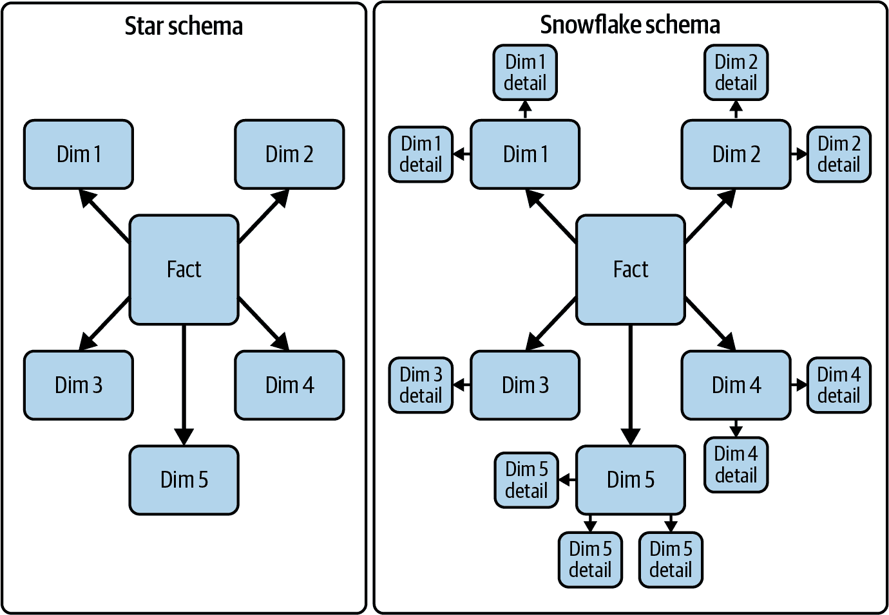

###### 图 3-1\. 星型模式对象与雪花模式对象的比较

星型模式数据模型在维表中存储冗余数据，而在*雪花模式*中，维表避免了冗余。然而，这会增加查询复杂性，并可能影响查询性能，因为分析时需要连接更多的表。在创建 Amazon Redshift 的数据仓库时，推荐使用星型模式数据模型或去规范化数据模型。

另一方面，雪花模式的存储需求较低，因为没有冗余，数据完整性问题的风险也较低。

随着存储介质的进步和每 TB 价格的下降，存储方面不再是问题，查询简单性通常更受现代数据仓库的重视。这使得星型模式成为运行非常大数据集分析的流行架构。

让我们看一个简单的数据模型，以了解标准化和去规范化星型模式之间的区别。销售订单使用标准化模型存储在关系数据库中。如您在图 3-2 中所见，销售头和销售行项目存储在单独的表中，并且与客户、产品和货币的主数据表具有一对多的关系。


###### 图 3-2\. 源数据库中的去规范化 OLTP 模式数据模型

对于图 3-3 中的星型模式模型，销售头和销售行项目表合并为一个销售事实表，并且数据还在订单级别进行了聚合。

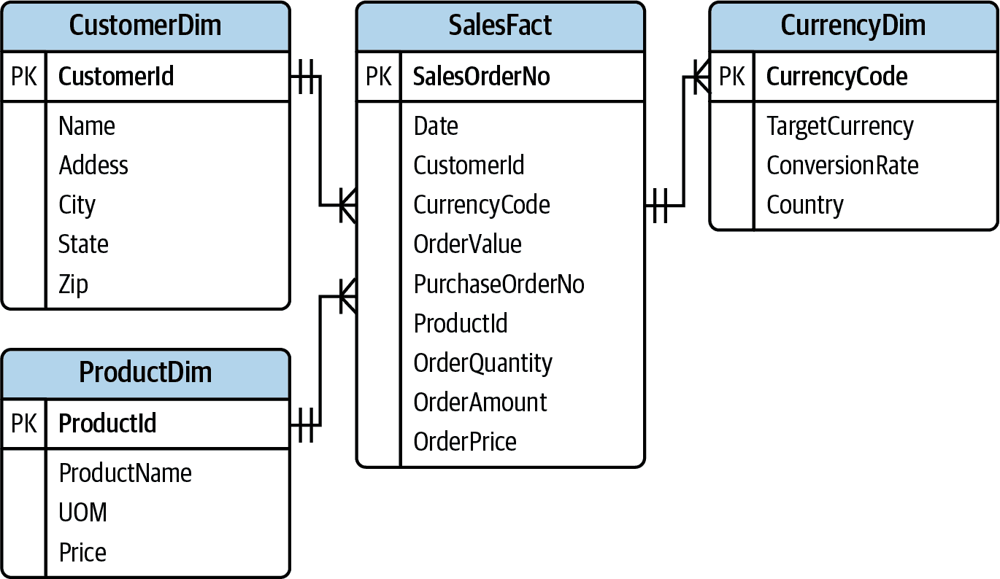

###### 图 3-3\. 数据仓库的星型模式数据模型

# 学生信息学习分析数据集

在前一章中，您学习了如何创建 Amazon Redshift 无服务器数据仓库，并使用查询编辑器查询示例数据。现在让我们看看如何创建新的数据模型，将数据导入 Amazon Redshift，并使用本地查询编辑器进行分析。

为此，我们选择了一个帮助你了解如何构建星型模式数据模型并将数据导入 Amazon Redshift 以分析、预测和改善学生结果的[学生学习分析数据集](https://oreil.ly/TxkDS)¹。

Open University 学习分析数据集（OULAD）包含关于课程、学生及其在在线虚拟学习环境（VLE）中互动的数据，适用于七个选定的课程（称为模块）。数据集假设每年有两个学期，课程在每年的二月和十月开始。课程学期由课程表中的 code_presentation 列标识，而代码模块则以字母“B”和“J”后缀，并以四位数年份作为前缀。数据集由使用唯一标识符连接的表组成，所有表均以 CSV 格式存储。

数据模型包括七个表，其中包含与学生、模块和活动相关的数据，如 图 3-4 所示，显示了实体关系。为了本书的目的，我们修改了此数据模型，以存储多个学校的数据，而不仅仅是一个学校。您可以使用所示的数据定义语言（DDL）脚本（参见 示例 3-1）来创建架构和数据库表。

匿名样本数据集可在链接 [OULAD 数据集](https://oreil.ly/TxkDS) 中获取，了解更多数据集信息，并可以下载并存储在您选择的 S3 存储桶中。我们将其存储在 S3 存储桶 [`arn:aws:s3:::openlearn-redshift`](https://oreil.ly/Fdjqm) 中，您可以使用此 S3 位置使用 `COPY` 命令将数据导入 Amazon Redshift。您可以查看 S3 数据集，如 图 3-5 所示。

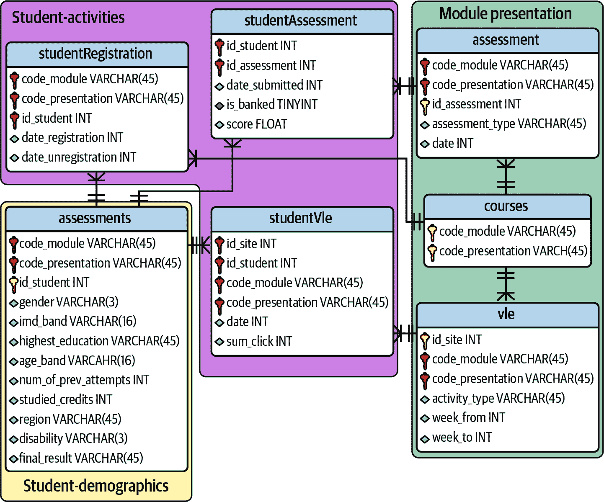

###### 图 3-4\. 学生信息系统数据集

您可以查看 S3 数据集，如 图 3-5 所示，并将其用作源，使用 `COPY` 命令将样本数据集导入 Amazon Redshift。同样，您可以找到其他公开可用的数据集，并为这些数据集创建数据模型，以探索 Amazon Redshift 的功能。

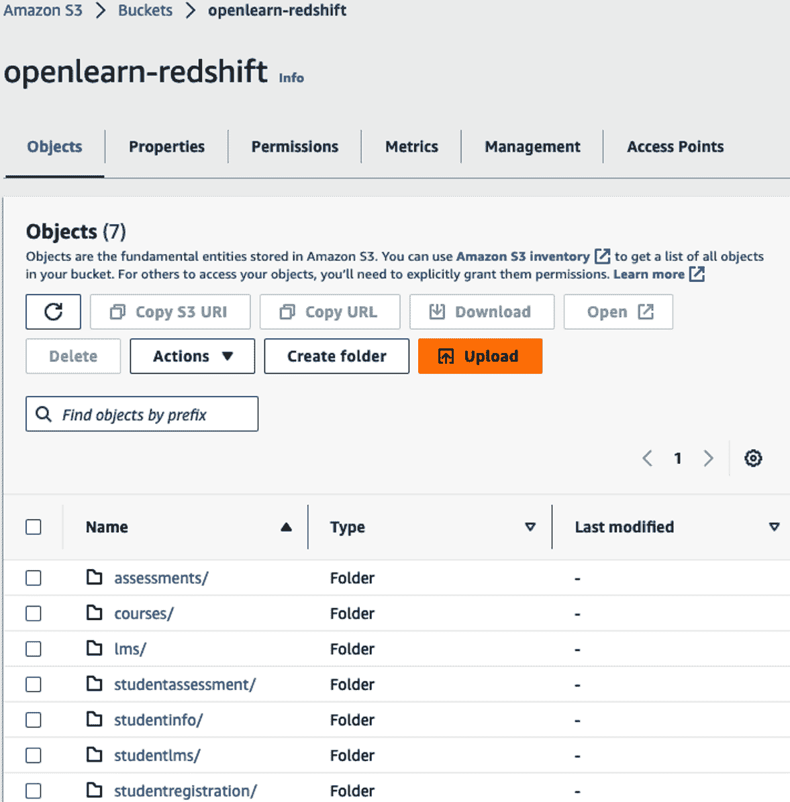

###### 图 3-5\. 在 Amazon S3 中查看原始数据

## 为学生信息学习分析数据集创建数据模型

接下来，让我们创建数据库表，将数据加载到 Amazon Redshift 中。连接到您的 Amazon Redshift 数据仓库。使用以下脚本为您的样本学生信息数据集创建架构和表（参见 示例 3-1）。

##### 示例 3-1\. 加载学生信息数据

```
/* We'll use a modified version of the Open University Learning Analytics dataset */
/* to store data for multiple schools */
/* https://analyse.kmi.open.ac.uk/open_dataset */
/* https://analyse.kmi.open.ac.uk/open_dataset#rights */
/* Kuzilek J., Hlosta M., Zdrahal Z. Open University Learning Analytics dataset */
/* Sci. Data 4:170171 doi: 10.1038/sdata.2017.171 (2017). */

CREATE SCHEMA openlearn;

CREATE TABLE "openlearn"."assessments"
(
    code_module varchar(5),
    code_presentation varchar(5),
    id_assessment integer,
    assessment_type varchar(5),
    assessment_date bigint,
    weight decimal(10,2)
    )
DISTSTYLE AUTO
SORTKEY AUTO
ENCODE AUTO;

CREATE TABLE "openlearn"."courses"
(
    code_module                varchar(5),
    code_presentation          varchar(5),
    module_presentation_length integer
    )
DISTSTYLE AUTO
SORTKEY AUTO
ENCODE AUTO;

CREATE TABLE "openlearn"."student_assessment"
(
    id_assessment  integer,
    id_student     integer,
    date_submitted bigint,
    is_banked      smallint,
    score          smallint
    )
DISTSTYLE AUTO
SORTKEY AUTO
ENCODE AUTO;

CREATE TABLE "openlearn"."student_info"
(
    code_module           varchar(5),
    code_presentation     varchar(5),
    id_student            integer,
    gender                CHAR(1),
    region                varchar(50),
    highest_education     varchar(50),
    imd_band              varchar(10),
    age_band              varchar(10),
    num_of_prev_atteempts smallint,
    studied_credits       smallint,
    disability            char(1),
    final_result          varchar(20)
    )
DISTSTYLE AUTO
SORTKEY AUTO
ENCODE AUTO;

CREATE TABLE "openlearn"."student_registration"
(
    code_module         varchar(5),
    code_presendation   varchar(5),
    id_student          integer,
    date_registration   bigint ,
    date_unregistration bigint
    )
DISTSTYLE AUTO
SORTKEY AUTO
ENCODE AUTO;

CREATE TABLE "openlearn"."student_lms"
(
    code_module       varchar(5),
    code_presentation varchar(5),
    id_student        integer,
    id_site           integer,
    date              bigint,
    sum_click         integer
    )
DISTSTYLE AUTO
SORTKEY AUTO
ENCODE AUTO;

CREATE TABLE "openlearn"."lms"
(
    id_site           integer,
    code_module       varchar(5),
    code_presentation varchar(5),
    activity_type     varchar(20),
    week_from         smallint,
    week_to           smallint
    )
DISTSTYLE AUTO
SORTKEY AUTO
ENCODE AUTO;
```

在创建 Amazon Redshift 表时，虽然有多种选项可供选择分发、排序和编码每个表，但在上一个示例中，我们没有指定这些选项，并且使用了 `AUTO` 的默认设置。在大多数情况下，使用 `AUTO` 将指示 Amazon Redshift 服务监视表的实际使用情况，并自动调整表。

# 将批量数据加载到 Amazon Redshift

现在您已创建数据表并在 Amazon S3 中有数据文件可用，您可以将数据加载到 Amazon Redshift 中。有多种选项可用于将数据加载到 Amazon Redshift 中。

+   使用 `COPY` 命令

+   使用 AWS Glue 或第三方 ETL 工具

+   使用 SQL 命令进行手动加载

+   使用查询编辑器 V2

## 使用 `COPY` 命令

`COPY`命令是将数据加载到 Amazon Redshift 中最简单和最有效的方式。它允许直接从 Amazon S3、Amazon DynamoDB 和 Amazon EMR 加载数据，以及从 CSV 和 JSON 文件等外部数据源加载。`COPY`命令自动并行加载数据，并可以快速轻松地处理大量数据。该命令读取多个数据文件，并根据目标数据仓库中的切片数量必要时分割文件，以将工作负载分配给所有节点和切片。它还将行排序并分发数据到节点切片之间。存储在 Amazon S3 中时，推荐的最佳做法是压缩文件以提高读取速度。在数据摄入方面，请注意加载压缩文件与未压缩文件之间的差异。

当您将压缩数据作为单个大文件加载时，Amazon Redshift 会串行加载数据。但是，如果您将文件分割成较小的文件，`COPY`命令会并行加载多个文件。这通过将工作负载分割到数据仓库中的节点之间增加了并行性。我们建议您将数据分割成大约相等大小的较小文件，压缩后大小从 1 MB 到 1 GB。为了实现最佳并行性，根据您的数据仓库中切片的数量将文件数设为 1 到 125 MB 之间的倍数。例如，如果您将 1 GB 文件加载到具有每个节点 4 个切片的双节点 ra3.4xlarge 数据仓库中，则可以将文件分割为 8 个 125 MB 大小的文件，以实现高效加载。

当您从单个大压缩文件加载所有数据时，Amazon Redshift 被迫执行串行加载，速度要慢得多。

相比之下，当您从大型未压缩文件中加载分隔数据时，Amazon Redshift 会利用多个切片。这些切片会自动并行工作。这提供了快速的加载性能。具体来说，当 Amazon Redshift 加载未压缩的分隔数据时，数据会分割成范围，并由每个节点中的切片处理。

当加载压缩文件时，一个好的做法是将数据分割成大约相等大小的较小文件，压缩后大小从 1 MB 到 1 GB。为了实现最佳并行性，理想的文件大小在压缩后为 1 到 125 MB。

## 摄入学生学习分析数据集

为了摄入示例学生学习分析数据集，我们使用推荐的`COPY`命令，将样本数据存储在 Amazon S3 桶中。命令列表如示例 3-2 所示，您可以使用这些命令，并替换适当值的 S3 位置和地区。

##### 示例 3-2\. 创建学生信息数据的模式和表

```
COPY "openlearn"."assessments"
FROM 's3://openlearn-redshift/assessments'
iam_role default
delimiter ',' region 'us-east-1'
REMOVEQUOTES IGNOREHEADER 1;

COPY "openlearn"."courses"
FROM 's3://openlearn-redshift/courses'
iam_role default
delimiter ',' region 'us-east-1'
REMOVEQUOTES IGNOREHEADER 1;

COPY "openlearn"."student_assessment"
FROM 's3://openlearn-redshift/studentAssessment'
iam_role default
delimiter ',' region 'us-east-1'
REMOVEQUOTES IGNOREHEADER 1;

COPY "openlearn"."student_info"
FROM 's3://openlearn-redshift/studentInfo'
iam_role default
delimiter ',' region 'us-east-1'
REMOVEQUOTES IGNOREHEADER 1;

COPY "openlearn"."student_registration"
FROM 's3://openlearn-redshift/studentRegistration'
iam_role default
delimiter ',' region 'us-east-1'
REMOVEQUOTES IGNOREHEADER 1;

COPY "openlearn"."student_lms"
FROM 's3://openlearn-redshift/studentlms'
iam_role default
delimiter ',' region 'us-east-1'
REMOVEQUOTES IGNOREHEADER 1;

COPY "openlearn"."lms"
FROM 's3://openlearn-redshift/lms'
iam_role default
delimiter ',' region 'us-east-1'
REMOVEQUOTES IGNOREHEADER 1;
```

我们使用`default`关键字来使用与数据仓库关联的默认 IAM 角色。当命令运行时，Amazon Redshift 使用被设定为默认并与数据仓库关联的 IAM 角色。您可以运行`DEFAULT_IAM_ROLE`命令来检查当前附加到数据仓库的默认 IAM 角色。详细信息请参见 [此处设定为默认](https://oreil.ly/lRd6z)。

Amazon Redshift 根据排序键顺序对每批记录进行排序。然而，它不会对已存储的每个`COPY`执行中的现有记录重新排序。如果每批新数据遵循表中现有行的顺序，则您的数据将按排序顺序正确存储，您无需运行真空操作。您不需要在每次加载中对行进行预排序，因为`COPY`在加载每批传入数据时会对数据进行排序。

## 构建星型模式

您刚刚将数据导入了一个规范化的学生信息数据模型，用于存储学生的课程选择、成绩、结果和注册的事务记录。然而，业务需求是使学校管理员和教师能够衡量课程成果。如前一章所讨论的，一个由事实和维度表组成的星型模式模型是数据仓库的推荐数据模型。表`course_registration`、`course_outcome`和`course_schedule`包含了测量结果所需的数据，因此这些表可以形成事实表的基础。

有许多方法可以将数据转换为您的去规范化事实表。您可以使用 *提取-转换-加载* (ETL) 方法，该方法读取源数据，在外部应用程序中处理转换，并加载结果；或者您可以使用 *提取-加载-转换* (ELT) 方法，该方法使用您刚刚加载的数据，并利用 Amazon Redshift 计算的能力在原地转换数据。在 第四章，“数据转换策略” 中，我们将更详细地讨论如何在这些策略之间进行选择。然而，为了完成此示例，我们将展示如何使用您刚刚加载的数据来使用 ELT 方法。

示例 3-3 读取规范化的源表，并构建`mv_course_outcomes_fact`物化视图。创建物化视图的优点是，当底层表更新时，可以设置增量刷新数据。

##### 示例 3-3\. 创建一个物化视图来去规范化

```
CREATE materialized view mv_course_outcomes_fact AS
SELECT
    co.student_id,
    co.course_id,
    co.semester_id,
    co.score,
    co.letter_grade,
    cr.date_registered,
    cr.date_dropped,
    cr.status,
    cs.staff_id,
    cs.lecture_days,
    cs.lecture_start_hour,
    cs.lecture_duration,
    cs.lab_days,
    cs.lab_start_hour,
    cs.lab_duration
FROM openlearn.course_registration cr
JOIN openlearn.course_outcome co
  ON cr.student_id = co.student_id AND
     cr.course_id = co.course_id AND
     cr.semester_id = co.semester_id
JOIN openlearn.course_schedule cs
  ON cr.course_id = cs.course_id AND
     cr.semester_id = cs.semester_id;
```

现在可以将学生和教师维度表连接到物化视图，这是事实表，用于创建一个星型模式模型。现在，当您查看完整的星型模式模型时，如 图 3-6 所示。

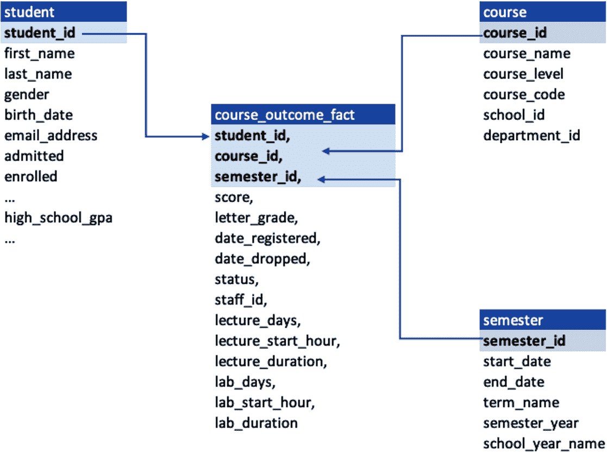

###### 图 3-6\. 完整的星型模式模型

一旦您摄取数据，您可以通过从表格中选择数据来测试结果。由于我们刚刚创建了一个从多个表中整合数据的物化视图，因此可以查询此物化视图以实现高效的查询性能。让我们使用一些查询进行测试（示例 3-4 和 3-5）。

##### 示例 3-4\. 查找获得每个等级的学生人数

```
SELECT semester_id, course_name, letter_grade, count(*)
FROM openlearn.mv_course_outcomes_fact
GROUP BY semester_id, course_name, letter_grade;
```

##### 示例 3-5\. 确定讲座持续时间与成绩之间是否存在相关性

```
SELECT course_name, letter_grade, sum(lecture_duration), count(*)
FROM openlearn.mv_course_outcomes_fact
GROUP BY course_name, letter_grade
ORDER BY course_name, letter_grade;
```

为了将学生在学习管理系统上的参与与结果相关联，您可以将 `student_lms` 表与 `student_assessment` 进行连接以获取洞察。接下来您将看到一个已物化的视图，`mv_student_lmsactivites_and_score`，创建于 示例 3-6。

##### 示例 3-6\. 学生活动 `total_score mean_score`

```
CREATE materialized view openlearn.mv_student_lmsactivites_and_score AS
SELECT student_info.id_student,
  student_info.code_module,
  student_info.code_presentation,
  gender,
  region,
  highest_education,
  imd_band,
  age_band,
  num_of_prev_atteempts,
  studied_credits,
  disability,
  final_result,
  st_lms_clicks.sum_of_clicks,
  scores.total_score,
  scores.mean_score
FROM openlearn.student_info
  LEFT JOIN
    (SELECT code_module,code_presentation,id_student,sum(sum_click) AS sum_of_clicks
    FROM openlearn.student_lms
      GROUP BY code_module,code_presentation,id_student) st_lms_clicks
    ON student_info.code_module=st_lms_clicks.code_module
    AND student_info.code_presentation=st_lms_clicks.code_presentation
    AND student_info.id_student=st_lms_clicks.id_student
    LEFT JOIN
      (SELECT id_student, sum(score) AS total_score, avg(score) AS mean_score
      FROM openlearn.student_assessment
      GROUP BY id_student)  scores
      ON student_info.id_student = scores.id_student;
```

有了这个物化视图，您可以获得许多关于学生表现的洞察，如 示例 3-7，分析学生在在线学习管理中的点击次数与结果或成绩的影响。在这里，您分析了学生使用在线学习管理与结果或成绩之间的点击次数。

##### 示例 3-7\. 点击次数与结果

```
SELECT code_module, final_result, sum(sum_of_clicks)
FROM  openlearn.mv_student_lmsactivites_and_score
GROUP BY code_module, final_result
ORDER BY code_module, final_result;
```

在 示例 3-8 中，您看到一个查询以分析按模块的百分比结果，以了解哪些模块学生得分较高或较低，因此学校可以积极设置计划，以增加学生参与度，从而获得更好的结果。

##### 示例 3-8\. 按模块的百分比结果

```
SELECT code_module,
  sum( CASE final_result WHEN 'Pass' THEN 1 ELSE 0 END ) AS PassCount ,
    sum( CASE final_result WHEN 'Distinction' THEN 1 ELSE 0 END ) AS DistCount,
  sum( CASE final_result WHEN 'Fail'  THEN 1 ELSE 0 END ) AS FailCount,
  sum( CASE final_result WHEN 'Withdraws' THEN 1 ELSE 0 END ) AS WithdrawnCount,
    count(*) AS TotalCount,
        round(cast(PassCount AS numeric(10,4))/TotalCount, 2)*100 AS pct_PassCount
FROM  openlearn.mv_student_lmsactivites_and_score
GROUP BY code_module
ORDER BY code_module;
```

您还可以直接查询表格以获得洞察。示例 3-9 展示了一条查询，以查找完成课程但未通过考试进行任何评估的学生人数。您可以尝试运行此查询。

##### 示例 3-9\. 完成课程进行任何评估但未通过考试的学生

```
select DISTINCT q.code_module, q.code_presentation, final_result
FROM openlearnm.student_info si
INNER JOIN
( SELECT * FROM openlearnm.student_assessment sa
    INNER JOIN openlearnm.assessments a
    ON sa.id_assessment = a.id_assessment) q
ON q.code_module = si.code_module
AND q.code_presentation = si.code_presentation
WHERE q.assessment_type = 'Exam';
```

## 从 Amazon S3 进行连续文件摄取

从 Amazon S3 存储桶连续摄取文件到 Amazon Redshift 表允许用户简化其转换管道。当您设置 `COPY JOB` 时，Amazon Redshift 检测到新的 Amazon S3 文件添加到您 `COPY` 命令指定的路径时。然后会自动触发 `COPY` 命令，并且系统会跟踪已加载的文件，并确定每个 `COPY` 命令批处理在一起的文件数量。您可以使用此功能自动化摄取过程，而无需创建外部数据摄取管道。有关连续摄取的更多详细信息，请参阅 [在线文档](https://oreil.ly/FNea8)。

`COPY` 作业的执行细节（如 示例 3-10）存储在系统表中，供您监视加载，并且您还可以使用此信息来审查历史作业执行和加载细节。`sys_copy_job` 系统表包含当前定义的每个 `COPY JOB` 的行。

##### 示例 3-10\. 创建 `COPY` 作业

```
<copy command>
JOB CREATE <job-name>
[auto on|off]
```

如 示例 3-11 所示，要查看由 `COPY JOB` 加载的文件列表，您可以运行以下示例查询，并替换 `job_id`：

##### 示例 3-11\. 查看 `COPY` 作业

```
SELECT job_id, job_name, data_source, copy_query,filename,status, curtime
FROM sys_copy_job copyjob
JOIN stl_load_commits loadcommit
ON copyjob.job_id = loadcommit.copy_job_id
WHERE job_id = <job_id>;
```

## 用于转换的 AWS Glue

AWS Glue 是一种原生的无服务器数据集成服务，通常用于使用 Python 或 Scala 语言进行数据转换并在数据处理引擎上运行。AWS Glue 使得从多个来源发现、准备、移动和集成数据变得更加简单，用于分析、ML 和应用开发。它提供多个数据集成引擎，包括 AWS Glue for Apache Spark、AWS Glue for Ray 和 AWS Glue for Python Shell。您可以根据工作负载的特征以及开发人员和分析师的偏好，选择适合您工作负载的引擎。Amazon Redshift 支持 Spark 集成，允许您将 Python 或 Scala 转换逻辑的执行推送到 Amazon Redshift 层，通过将 Spark 代码转换为 SQL 代码，而无需移动数据出数据仓库。

自 AWS Glue V4 起，现在有一个带有新 JDBC 驱动程序的 Amazon Redshift Spark 连接器，特色是与 AWS Glue ETL 作业一起使用。您可以使用它来构建 Apache Spark 应用程序，读取和写入 Amazon Redshift 中的数据，作为数据摄取和转换流水线的一部分。有了新的连接器和驱动程序，这些应用程序可以保持其数据的性能和事务一致性。

使用 AWS Glue (图 3-7)，您可以爬取 Amazon S3 数据源以创建目录，应用转换，并将数据摄入 Amazon Redshift 数据仓库。

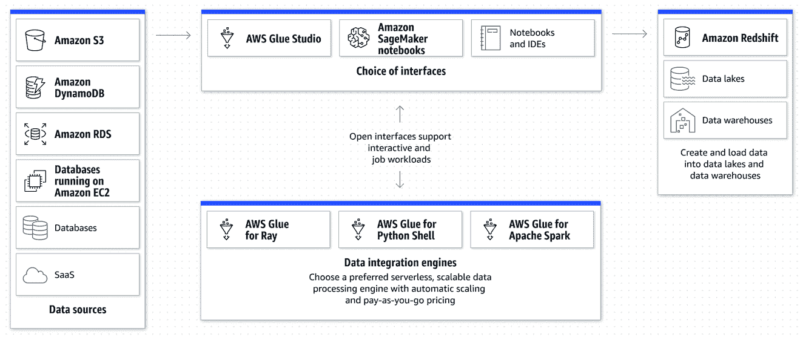

###### 图 3-7\. 使用 AWS Glue 进行 ETL 集成

Amazon Redshift 与 Apache Spark 的集成使得在 Amazon Redshift 上使用 AWS Glue 构建和运行 Spark 应用程序变得更加简单。这种 Apache Spark 的集成功能增加了对排序、聚合、限制、连接和标量函数等操作的推送能力，因此只有相关数据从 Amazon Redshift 数据仓库移动到 AWS 中消费的 Spark 应用程序，以获得更好的性能。您可以参考此 [博客获取更多信息](https://oreil.ly/A309N)。在 第四章，“数据转换策略” 中，您将学习如何使用 AWS Glue Studio 创建 ETL 转换，使用可视化界面。

## 使用 SQL 命令手动加载数据

使用 SQL 命令手动将数据加载到 Amazon Redshift 是一种可行的选择，但通常不建议用于大型数据集，因为这是耗时且容易出错的。但是，对于小型数据集或测试目的，它可能很有用。如果不能使用 `COPY` 命令，则可以使用诸如 `INSERT` 和 `CREATE TABLE` 等 SQL 命令来加载数据。建议使用多行插入或批量插入操作，而不是单个 `INSERT` 语句。

多行插入通过批量插入一系列插入来提高性能。以下是 示例 3-12 使用单个 `INSERT` 语句将两行插入到具有五列的表中。这仍然是一个小插入，简单地展示了多行插入的语法。

##### 示例 3-12\. 多行插入

```
INSERT INTO openlearn.course_outcome values
(1, 1,1, 95,'A'),
(1, 2,2, 96,'B');
```

当您需要将数据或数据子集从一张表移动到另一张表时，可以使用带有 `SELECT` 子句的批量插入操作，例如 示例 3-13，用于高性能数据插入。

##### 示例 3-13\. 使用数据创建表语句（CTAS）

```
CREATE TABLE course_outcome_stage AS (SELECT * FROM course_outcome);
```

如果您想要逐步添加到表中，请先创建表，然后按照条件插入记录，如 示例 3-14 所示。

##### 示例 3-14\. 使用数据创建表语句（CTAS）但不包含数据

```
CREATE TABLE course_outcome_stage AS (SELECT * FROM course_outcome WHERE 1<>1);

INSERT INTO course_outcome_stage
(SELECT * FROM course_outcome);
```

## 使用查询编辑器 V2

对于简单快速的数据加载到 Amazon Redshift，您可以使用查询编辑器 V2 的加载数据功能。您可以直接从桌面文件夹上传文件，或将数据文件上传到 Amazon S3 位置，然后在查询编辑器 V2 中选择加载数据选项，如 图 3-8 所示。

查询编辑器 V2 将在后台使用 `COPY` 命令从您指定的 Amazon S3 位置加载数据。在查询编辑器 V2 的加载数据向导中生成和使用的 `COPY` 命令支持所有 `COPY` 命令语法可用的参数，用于通过向导从 Amazon S3 复制。您可以设置数据转换参数以接受无效字符，设置日期和时间格式，截断数据，处理空白行、缺少列、尾随空格等异常情况。在屏幕的“高级设置”部分下选择“数据转换参数”选项，如 图 3-8 所示。此外，您还可以设置加载数据操作，例如分析用于压缩分析的行数、自动更新压缩编码选项、错误处理和统计更新选项。

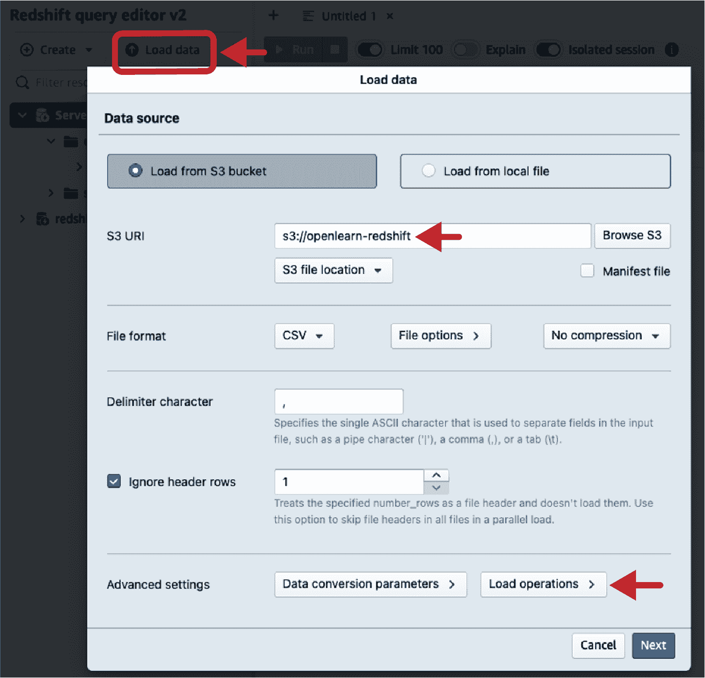

###### 图 3-8\. 将 CSV 文件上传到 Amazon S3 并使用查询编辑器 V2 加载

当您使用 `COPY` 命令将数据输入空表时，Amazon Redshift 可以分析数据并为每列优化压缩类型。`COPY` 命令中的 `COMPUPDATE` 参数确定压缩的操作方式。

# 加载实时和准实时数据

*实时数据*指的是生成后立即处理和分析的数据。这种类型的数据对于诸如金融交易、运输和物流等时间敏感的应用至关重要。*准实时数据*与实时数据类似，但在处理和分析上稍有延迟，通常为几分钟或更少。

将实时和准实时数据加载到数据仓库或 BI 系统是一项具有挑战性的任务，需要高效的数据摄取、处理和存储能力。加载实时和准实时数据的过程涉及多个步骤，包括数据提取、数据转换和数据加载。

*数据提取* 是从各种来源（如传感器、日志文件和流数据平台）获取数据的过程。*数据转换* 是在加载到数据仓库或 BI 系统之前清理、验证和规范化数据的过程。*数据加载* 是将数据导入目标系统并使其可用于分析和报告的过程。

处理实时和准实时数据的几种方法包括批量加载、增量加载和流处理。*批量加载* 是定期以大块加载数据的过程。*增量加载* 是仅加载新数据或更改的过程。*流处理* 是连续处理和分析生成的数据的过程。

为了处理实时和准实时数据的高容量、高速率和多样性，广泛采用各种大数据技术，如 Apache Kafka、Apache Storm、Apache Spark 和 Apache Flink。

## 使用 AWS 数据库迁移服务进行近实时复制

AWS DMS 是一项完全托管的服务，使得将数据库迁移到 AWS 变得轻松。DMS 可以将您的数据迁移到和从多数广泛使用的商业和开源数据库，如 Oracle、MySQL、MariaDB、PostgreSQL（pgSQL）、Microsoft SQL Server 等。DMS 的常见用例之一是将数据迁移到 Amazon Redshift。

在开始迁移之前，重要的是计划和准备好迁移工作。这包括识别源数据库和目标数据库、需要迁移的数据量以及需要考虑的任何特定要求或约束条件。您还应在非生产环境中测试迁移过程，以确保一切按预期运行。

一旦您计划并准备好迁移工作，您可以创建 DMS 复制实例。复制实例是一个 DMS 资源，用于执行实际的迁移工作。它负责连接源数据库和目标数据库，并将数据从一处移动到另一处。

创建复制实例后，您可以创建迁移任务。迁移任务是 DMS 资源，定义了迁移的具体细节，如源数据库和目标数据库、要迁移的数据以及任何特定的设置或选项。

创建迁移任务时，您可以选择执行完整加载或变更数据捕获（CDC）迁移。完整加载迁移将所有数据从源数据库复制到目标数据库，而 CDC 迁移仅复制自上次迁移以来对源数据库所做的更改。

一旦创建了迁移任务，您可以开始迁移。DMS 将开始从源数据库向目标数据库移动数据。您可以使用 DMS 控制台或 AWS CLI 监视迁移进度。有关更多详细信息，请参阅[使用 Amazon Redshift 数据仓库作为目标的文档](https://oreil.ly/LN6gM)。

迁移完成后，您可以执行任何必要的迁移后任务，例如创建索引或将数据加载到其他表中。您还应该测试目标数据库，确保所有数据已正确迁移，并且目标数据库按预期工作。

Amazon DMS 为将数据迁移到 Amazon Redshift 提供了一种简单且易用的方法。通过遵循本章中概述的步骤，您可以计划、准备和执行迁移，放心地知道您的数据将快速且安全地移动到您的新数据仓库中。

## Amazon Aurora 与 Amazon Redshift 的零 ETL 集成

*零 ETL 集成*与 Amazon Redshift 结合，实现了一种架构模式，消除了为分析移动数据而需要复杂 ETL 作业的需要。从 Amazon Aurora 到 Amazon Redshift 的零 ETL 集成可以实现几乎实时的分析和 ML 处理，无论数据是否在同一账户或不同账户中。在将事务数据写入 Aurora 数据库几秒钟内，数据就可用于 Amazon Redshift，因此您无需构建和维护复杂的数据流水线来执行抽取和加载操作。

这种[零 ETL 集成](https://oreil.ly/QNwc-)还使您能够在同一个新的或现有的 Amazon Redshift 数据仓库中分析来自多个 Amazon Aurora 数据库集群的数据，从而跨多个应用程序或分区获取洞见。通过接近实时访问事务数据，您可以利用 Amazon Redshift 的分析能力，如内置 ML、物化视图、数据共享和对多个数据存储和数据湖的联合访问，从事务数据和其他数据中获取洞见。此架构允许更快的洞察时间和降低成本，因为数据在分析之前不需要加载和转换。此外，它允许在数据仓库中接近实时地分析数据，而不会影响您的事务系统的工作负载。

要开始使用零 ETL，您首先需要确保 Amazon Aurora 数据库和 Amazon Redshift 数据仓库已正确配置。例如，对于 Aurora，您需要确保使用最新版本并启用了日志记录。同样，对于 Amazon Redshift，您需要确保使用最新版本并设置了必需的参数。有关所需配置参数的详细信息，请参阅[在线文档](https://oreil.ly/meMEy)。

接下来，您将设置所需的权限，以使您的 Amazon Aurora 数据库能够加载 Amazon Redshift 数据仓库的数据。要完成此操作，您需要确保您的用户具有`redshift:CreateInboundIntegration`权限。

转到 Amazon Redshift 控制台中的数据仓库资源策略，并使用“添加授权集成源”选项指定 Amazon Aurora 数据库的 Amazon 资源名称（ARN）（参见图 3-9）。

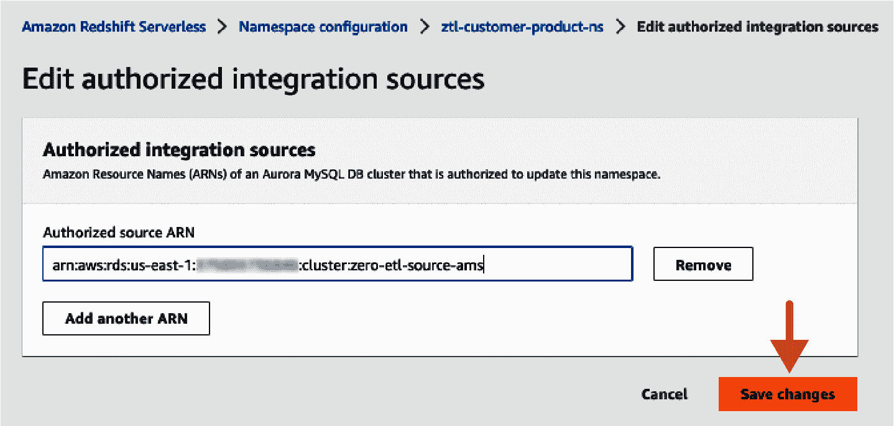

###### 图 3-9\. 编辑授权集成源

现在，您已经准备好创建零 ETL 集成。要完成此操作，您需要确保您的用户具有`rds:CreateIntegration`和`rds:DescribeIntegration`权限。此外，如果您需要删除集成，可能还需要`rds:DeleteIntegration`权限。

转到 Amazon 关系数据库服务（RDS）控制台，点击“零 ETL 集成”菜单项。接下来，点击“创建零 ETL 集成”（参见图 3-10）。在同一账户中创建集成时，选择预填充列表中的 Amazon Aurora 数据库和 Amazon Redshift 数据仓库，然后提交请求。您可以通过检查 Amazon RDS 控制台中的状态字段来监视零 ETL 集成的创建情况。当状态从“Creating”变为“Active”时，您的集成就准备就绪了。

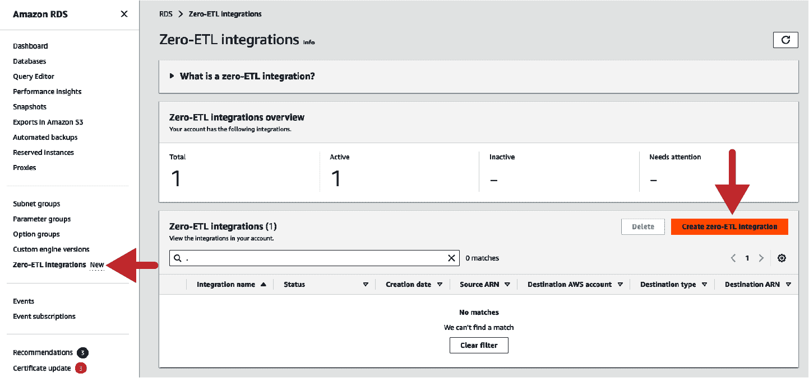

###### 图 3-10\. 创建零 ETL 集成

最后，您可以开始查询加载到 Amazon Redshift 的数据。首先，从 Amazon RDS 控制台或通过在 Amazon Redshift 中执行以下 SQL 语句捕获您的零 ETL 集成的`integration_id`：

```
SELECT integration_id FROM svv_integration;
```

接下来，创建一个引用`integration_id`的本地数据库：

```
CREATE DATABASE <local_db_name> FROM INTEGRATION integration_id;
```

完成后，您可以浏览和查询从您的 Amazon Aurora 数据库同步到 Amazon Redshift 的所有对象，几乎实时显示。源 Amazon Aurora 数据库/模式将作为目标 Amazon Redshift 数据仓库数据库中的不同模式呈现。

要进一步处理数据，您可以考虑物化视图、脚本或存储过程，并可以使用 Amazon Redshift 调度程序或外部编排工具定期运行。

如果您的 Amazon Aurora 数据库与您的 Redshift 数据仓库位于不同的账户中，则需要执行额外的配置步骤，如设置授权主体和启用跨账户访问。有关如何设置跨账户集成的详细信息，请参阅[在线文档](https://oreil.ly/QNwc-)。

## 使用 Amazon AppFlow

当今许多组织使用 SaaS 应用来运行其业务操作。一些 SaaS 应用，如 [SAP](https://www.sap.com) 和 [Infor](https://www.infor.com)，提供全面的 ERP 模块，而其他一些如 Salesforce、Google Analytics、Facebook Ads 和 ServiceNow 则提供最佳功能来运行业务的特定功能。为了向用户提供业务见解，您可能需要结合来自多个 SaaS 应用的数据，例如来自 [Salesforce](https://www.salesforce.com) 的机会和来自 SAP 的实际销售。这些 SaaS 应用提供 API 或提取器，以从应用程序的事务级或应用级提取数据。

Amazon AppFlow 是一种完全托管的集成服务，帮助您安全地在多个点击之间传输数据，例如 Salesforce、SAP、Google Analytics、Facebook Ads 和 ServiceNow 等 SaaS 应用与 AWS 服务，如 Amazon S3 和 Amazon Redshift。

使用 Amazon AppFlow（图 3-11），您可以通过过滤器和验证执行转换和数据增强。它支持与 50 个连接器的数据连接，并可以双向移动数据到 AWS 服务如 Amazon S3 和 Amazon Redshift。您还可以创建自定义连接器，从任何 API 源读取数据流入 Amazon Redshift。要从任何源应用程序将数据传输到 Amazon Redshift，请[创建一个 Amazon AppFlow 流](https://oreil.ly/AQs8T)，并选择 Amazon Redshift 作为数据目标。有关连接 Amazon Appflow 到您的 Amazon Redshift 数据仓库的详细步骤，请参阅此[文档](https://oreil.ly/ythnj)。

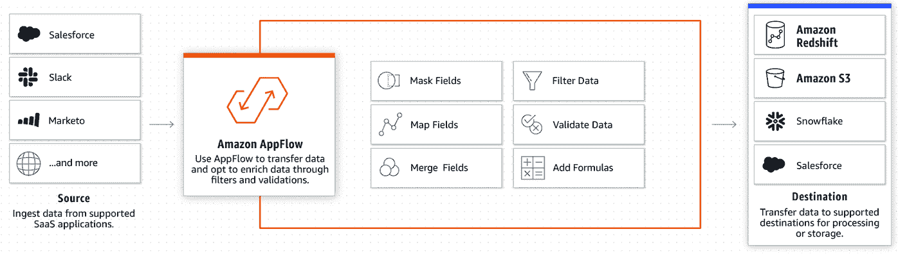

###### 图 3-11\. 使用 Amazon AppFlow 进行 ETL 集成

在开始数据摄入之前，重要的是规划和准备您的数据流。这包括识别要传输的源和目标应用程序和服务、要传输的数据以及需要考虑的任何特定要求或约束。您还应在非生产环境中测试数据流，以确保一切按预期工作。

一旦您规划并准备好数据流，您可以在 AppFlow 中创建新的流。为此，您需要指定源应用程序和服务、目标应用程序和服务以及要传输的数据。AppFlow 支持许多热门的应用程序和服务，包括 Salesforce、ServiceNow、Slack 等等。

接下来，您需要配置流的设置。这包括指定流的计划，例如数据传输的频率以及源应用程序和目标应用程序和服务的任何特定选项或设置。

完成流的设置后，您可以创建流。创建流时，AppFlow 将创建所有必要的资源，如连接器和触发器，以在源应用程序和目标应用程序和服务之间传输数据。

创建流程后，AppFlow 将自动开始从源应用程序和服务传输数据到目标位置。您可以使用 AppFlow 控制台或 AWS CLI 监视流程的进度。

当数据传输完成后，数据将被摄入到您的亚马逊 Redshift 数据仓库中，您可以使用标准 SQL 对其进行查询和分析。然后，您可以使用现有的 BI 工具基于数据创建报告和可视化。

亚马逊 AppFlow 提供了一种简单易行的方法将数据摄入到亚马逊 Redshift 中。通过按照本章节中概述的步骤进行规划、准备和执行数据摄取，您可以放心地知道您的数据将快速安全地传输到数据仓库中。AppFlow 使您能够自动化不同应用程序和服务之间的数据流程，并提高其效率。要了解使用亚马逊 AppFlow 从 Salesforce 拉取数据到亚马逊 Redshift 的实际用例，请参阅此[博客](https://oreil.ly/Zhrpk)。

## 流式摄取

流式摄取是将数据连续加载到数据仓库或 BI 系统中的过程，实时或准实时进行。这允许对数据进行实时分析和报告，对于金融交易、交通运输和物流等时间敏感应用程序至关重要。流式摄取通常使用流式数据平台（如 Apache Kafka 或亚马逊 Kinesis）来收集和管理数据流。然后处理并将数据加载到目标数据仓库或 BI 系统中。

使用流式数据摄取有几个好处，包括处理高速和大容量数据的能力，进行实时分析和报告，并实时检测和响应事件。然而，流式数据摄取也带来了一些挑战，如需要高效的数据处理和存储能力、强大的数据集成和管理工具，以及专业的技能和专业知识。

亚马逊 Redshift 流式摄取的用例主要围绕持续生成的数据（流式数据）进行工作，需要在其生成后的短时间内（延迟）进行处理。数据来源可以多种多样，从物联网设备到系统遥测、公用服务使用、设备地理位置等。流式摄取可以有多个用例，包括以下内容：

实时监控设备以获取警报

考虑一组装有传感器的车辆队列，这些传感器收集各种指标数据，如速度、温度和燃料消耗。需要实时分析传感器数据，以提供有关任何异常值的警报，以便能够及时解决问题。

网站上的实时广告投放

分析来自多个平台（如 Twitter 和 Facebook）的社交媒体数据，用于实时广告投放或防止虚假信息或淫秽内容。

改善游戏体验

您可以通过分析游戏玩家的实时数据，专注于游戏内转化率、玩家留存率和优化游戏体验。

流式 POS 数据的实时零售分析

您可以实时访问和可视化所有全球销售点（POS）零售销售交易数据，进行实时分析、报告和可视化。

Amazon Redshift 支持使用流式服务加载实时数据。您可以独立使用 Amazon Kinesis 数据 Firehose 或 Kinesis 数据流，或使用与 Amazon Redshift 的本地集成：

+   第一选项是使用 Kinesis Firehose 或 Kinesis 数据流。这涉及将数据流连接到 Amazon Kinesis 数据 Firehose，并等待 Kinesis 数据 Firehose 将数据暂存在 Amazon S3 中，使用各种大小的批处理和不同长度的缓冲间隔。之后，Kinesis 数据 Firehose 启动`COPY`命令，从 Amazon S3 加载数据。以前，这通常涉及几分钟的延迟，并且需要在从数据流加载的数据之上构建数据管道。现在，您可以直接从数据流摄入数据。

+   第二个选项是与 Amazon Kinesis 数据流或 Amazon 托管的 Apache Kafka（MSK）数据流的本地集成。通过与 Amazon 流引擎的本地集成，Amazon Redshift 流摄入每秒摄入数百 MB 的数据，因此您可以几乎实时地查询数据。使用 Amazon Redshift 流摄入，您可以连接到多个 Amazon Kinesis 数据流或 Amazon MSK 数据流，并直接将数据拉入 Amazon Redshift，无需将数据暂存在 Amazon S3 中。定义方案或选择使用`SUPER`数据类型摄入半结构化数据；您还可以使用 SQL 设置和管理 ELT 管道。

本地的 Amazon Redshift 流式摄入功能允许您直接连接到 Kinesis 数据流，无需通过将数据暂存到 Amazon S3 并加载到数据仓库中的延迟和复杂性。您现在可以使用 SQL 连接并访问数据流，并通过直接在数据流之上创建物化视图简化数据流水线。物化视图还可以包括作为 ELT 管道的一部分的 SQL 转换。

定义物化视图后，您可以刷新它们以查询最新的流数据。这意味着您可以使用 SQL 对流数据进行下游处理和转换，而不会产生额外的费用，并可以使用现有的 BI 和分析工具进行实时分析。

Amazon Redshift 流式摄入通过充当流消费者的方式工作。材料化视图是从流中消费的数据的着陆区域。当材料化视图被刷新时，Amazon Redshift 计算节点会将每个数据分片分配给计算片段。每个片段从分配的分片中消费数据，直到材料化视图与流达到一致。材料化视图的第一次刷新从流的`TRIM_HORIZON`获取数据。后续刷新从前一次刷新的`SEQUENCE_NUMBER`开始读取数据，直到与流数据达到一致。图 3-12 说明了这个工作流程。

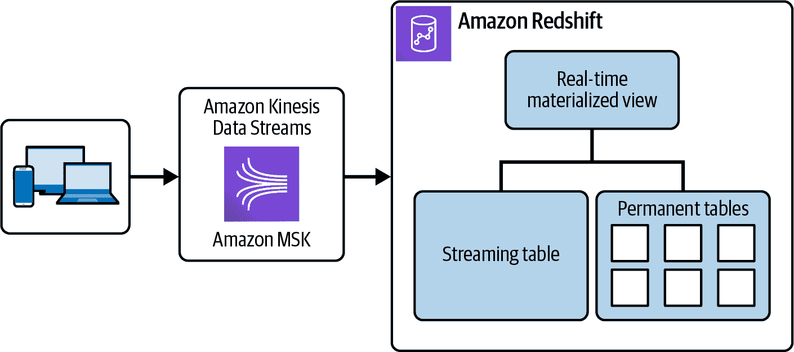

###### 图 3-12\. 流摄入工作流

### 开始使用流摄入的步骤

第一步是设置 Kinesis Data Stream 作为流摄入管道的源。您可以使用 Kinesis Streams 数据生成器设置测试数据，如博客中所述[“使用新的 Amazon Kinesis 数据生成器测试您的流数据解决方案”](https://oreil.ly/Iz7xC)。

设置数据流后，您可以在 Amazon Redshift 中使用`CREATE EXTERNAL SCHEMA`定义模式，以引用 Kinesis Data Streams 资源。

```
CREATE EXTERNAL SCHEMA kds
FROM KINESIS
IAM_ROLE { default | 'iam-role-arn' };
```

创建一个 IAM 角色，如示例 3-15，其中信任策略允许您的 Amazon Redshift 数据仓库扮演该角色。

##### 示例 3-15\. 授予访问流的 IAM 策略

```
{
    "Version": "2012-10-17",
    "Statement": [
        {
            "Sid": "ReadStream",
            "Effect": "Allow",
            "Action": [
                "kinesis:DescribeStreamSummary",
                "kinesis:GetShardIterator",
                "kinesis:GetRecords",
                "kinesis:DescribeStream"
            ],
            "Resource": "arn:aws:kinesis:*:0123456789:stream/*"
        },
        {
            "Sid": "ListStream",
            "Effect": "Allow",
            "Action": [
                "kinesis:ListStreams",
                "kinesis:ListShards"
            ],
            "Resource": "*"
        }
    ]
}
```

要访问流中的数据，您可以创建一个带有流选择的材料化视图。当您查询材料化视图时，返回的记录是流的某一时刻视图：

```
CREATE MATERIALIZED VIEW my_view AS
SELECT approximate_arrival_timestamp,
JSON_PARSE(kinesis_data) AS Data
FROM schema_one.my_stream_name
WHERE CAN_JSON_PARSE(kinesis_data)
AUTO REFRESH YES;
```

接下来，您刷新视图以从流到材料化视图进行初始数据加载：

```
REFRESH MATERIALIZED VIEW my_view;
```

现在您可以使用标准 SQL 语句从材料化视图查询数据：

```
SELECT * FROM my_view;
```

您可以将流记录存储在半结构化的 SUPER 格式中，或者定义一个模式，将数据转换为 Amazon Redshift 数据类型。

有关从 Amazon Kinesis Data Streams 设置流摄入的详细步骤，请参阅[“开始使用 Amazon Kinesis Data Streams 进行流摄入”](https://oreil.ly/2rhbT)。

### 重要考虑因素和最佳实践

以下是在设置流摄入环境时性能和计费的重要考虑因素和最佳实践。

自动刷新查询材料化视图或视图被视为任何其他用户工作负载。自动刷新会在数据流到达时加载数据。

自动刷新可以明确地打开用于流入站点创建的物化视图。要做到这一点，请在物化视图定义中指定 `AUTO REFRESH`。手动刷新是默认设置。要为现有的用于流入站点的物化视图指定自动刷新，可以运行 `ALTER MATERIALIZED VIEW` 来打开它。有关更多信息，请参阅 [`CREATE MATERIALIZED VIEW`](https://oreil.ly/syJfX) 或 [`ALTER MATERIALIZED VIEW`](https://oreil.ly/UBWgM)。

对于亚马逊 Redshift 无服务器，设置和配置说明与在预置集群上设置流入站点相同。非常重要的是，要使用适当级别的 RPUs 大小亚马逊 Redshift 无服务器，以支持带有自动刷新和其他工作负载的流入站点。

在配置流入站点时，如果 Amazon MSK 的机架感知已启用，则 Amazon Redshift 尝试连接到同一可用区（AZ）中的 Amazon MSK 集群。如果您所有的节点都与 Amazon Redshift 数据仓库的不同 AZ 中，您可能会产生跨 AZ 数据传输成本。为了避免这种情况，请至少在 Amazon Redshift 数据仓库相同 AZ 中保留一个 Amazon MSK broker 集群节点。

创建物化视图后，其初始刷新从 Kinesis 流的 `TRIM_HORIZON` 或 Amazon MSK 主题的偏移 0 开始。

支持的数据格式仅限于可以从 `VARBYTE` 转换的格式。有关更多信息，请参阅 [`VARBYTE` 类型](https://oreil.ly/MyZiJ) 和 [`VARBYTE` 运算符](https://oreil.ly/XPn3v)。

可以将流入的数据流落入多个物化视图中。例如，一种用例是您接收包含体育数据的流，但将每种体育的数据组织到单独的物化视图中。然而，当您将数据流入并刷新多个物化视图时，可能会导致更高的出站成本，以及对您的流媒体提供商的带宽、吞吐量和性能限制。此外，请考虑读取更多物化视图的高资源使用如何影响其他工作负载。因此，我们建议您将每个流的数据落入单个物化视图中。有关数据流定价的更多信息，请参阅 [Kinesis 数据流定价](https://oreil.ly/wUws2) 和 [Amazon MSK 定价](https://oreil.ly/Lt7KM)。

# 优化您的数据结构

传统上，数据库建立在对称多处理（SMP）架构上，多个 CPU 访问共享内存和磁盘。这种紧密耦合的多处理器系统无法线性扩展以满足数据增长和查询执行吞吐量要求。

这些挑战通过 MPP 架构得以克服。MPP 架构有两种类型：

+   共享磁盘架构：在此，CPU 和内存是并行处理的，但磁盘是共享的。

+   共享无事务架构：在此，CPU、内存以及磁盘都是并行处理的。

正如本书前面提到的，Amazon Redshift 是一种 MPP 共享无共享体系结构，通过在每个节点上使用节点附加的内存和 CPU 来处理数据，实现线性可伸缩性。这种架构通过在每个节点上处理数据，实现了大规模，因为没有单个执行器瓶颈来减慢系统，并且添加或删除节点提供了线性可伸缩性。在单个对象或表的物理存储数据中，意味着 MPP 系统具有分布式或复制表，分布式风格在查询性能中起着关键作用。迈克尔·斯通布雷克（Michael Stonebraker）在他的论文中探讨了[共享无共享的情况](https://oreil.ly/eMiar)。

当您创建数据库对象时，某些关键的表设计决策会影响整体查询性能。这些设计选择还会对存储需求产生重大影响，进而可能影响查询性能。关键目标是减少 I/O 操作的数量并最小化处理查询所需的内存。

Amazon Redshift 通过“自动表优化和自动化”的结合为您自动化了许多决策，但是在您希望优化您的环境并设置自己的“分布式风格”、“排序键”或“压缩编码”时，可能需要微调。

## 自动表优化和自动化

Amazon Redshift 在创建带有`AUTO`选项的表时使用自动表优化（ATO）来选择正确的分布式风格、排序键和编码。因此，利用自动功能并使用`DISTSTYLE AUTO`、`SORTKEY AUTO`和`ENCODING AUTO`创建表是一个良好的实践。当使用`AUTO`选项创建表时，Amazon Redshift 最初会根据主键和数据类型等信息创建具有最佳首次查询性能的表。此外，Amazon Redshift 分析数据量和查询使用模式，随着时间的推移演变分布策略和排序键以优化性能。最后，Amazon Redshift 将在您的表上执行减少碎片和确保统计数据最新的表维护活动。我们在第五章，“扩展和性能优化”中进一步讨论了 ATO 主题。

## 分布式风格

由于亚马逊 Redshift 是基于计算节点的 MPP 数据仓库，因此数据分布的方式对于确保在给定工作负载下充分利用资源至关重要。当执行查询时，查询优化器可能需要将行重新分发到计算节点以执行任何连接操作。在选择表分布样式时的目标是通过将数据定位在查询运行之前的位置来最小化重新分发步骤的影响，以便连接两个或多个表。有四种数据分布策略：`AUTO`、`EVEN`、`ALL`和`KEY`（见图 3-13）。

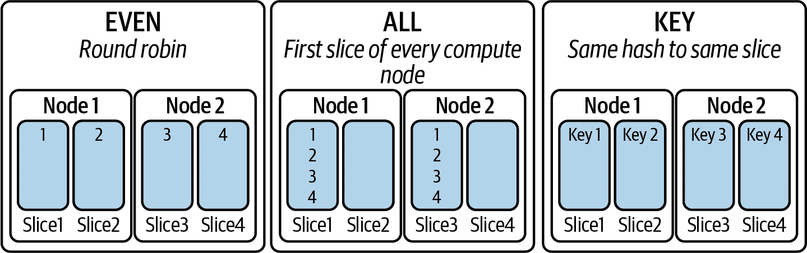

###### 图 3-13\. 计算节点切片之间的数据分布

`AUTO` 分布

正如前面提到的，使用 `AUTO` 关键字意味着亚马逊 Redshift 利用其内置的 AI 和 ML 能力，并根据数据量和查询模式自动执行最佳数据分布。这是许多角色的首选分布策略，特别是那些可能对架构不熟悉但仍需要分析数据集以获取业务洞见的人。

`EVEN` 分布

在这种分布策略中，数据以轮询方式存储到亚马逊 Redshift 数据仓库的每个切片中，因此数据在切片和节点之间的数据量分布非常均匀，几乎没有倾斜或不平衡。`EVEN` 分布最适合大型事实表，通常不参与与其他维度表的连接。另一个很好的候选对象是已经执行了所有连接并捕获了结果的物化视图，查询主要只是过滤行。

`ALL` 分布

在这种分布策略中，整个表的完整副本存储在亚马逊 Redshift 数据仓库每个计算节点的第一个切片上。这最适合维度表，以便在不需要跨节点移动数据的情况下与事实表进行连接。正如您所见，这有助于更快地执行查询，但增加了存储成本。

`KEY` 分布

在这种分布策略中，事实表基于指定列值生成的哈希进行分布，使得所有产生相同哈希值的值存储在亚马逊 Redshift 数据仓库的同一切片上。当在相同键分布列上连接两个表时应用此策略。这两个表可以是两个事实表，一个事实表和一个维度表，或一个暂存表和一个目标表。

`KEY`分发允许在联接执行时共同位于同一片的事实表和对应的维度表行。为确保片之间的倾斜最小化，需要使用高基数列作为关键分发。还要注意，Amazon Redshift 仅允许将一列定义为分发键，因此如果您的查询进行多列联接，则应在数据加载过程中通过串联这些单独的列值来创建新列。

您会注意到，在所有三种分发样式中，重点是在执行查询时减少数据移动。这允许 Amazon Redshift 通过将总工作量按节点和片数分割，每个片并行运行，以实现最大吞吐量。

假设您有一个销售数据仓库，`fact_sales`是最大的事实表，拥有数十亿行，经常与`dim_customer`（拥有数千万或数亿行）进行联接。然后您还有`dim_calendar`、`dim_product`和`dim_region`，这些表的记录数较少。您还为`sales_annual_mv`、`sales_qtrly_mv`和`sales_monthly_mv`创建了物化视图，用于仪表板和报告的预聚合度量。在分析此数据仓库中的数据后，以下是分发的一些建议：

+   `fact_sales`和`dim_customer`适合使用`KEY`分发，但不适合在`calendar_key`或`product_key`上使用。

+   其他维度适合使用`ALL`分发。

+   物化视图适合使用`EVEN`分发。

由于 Amazon Redshift 只能选择一个列作为分发键，如果您从具有多列主键/外键的源导入数据，可能会看到表在多个列上进行联接。在这种情况下，考虑在您的表中创建一个新列，该列是联接列的串联，并将该新列用作分发键。

## 排序键

除了如何在计算节点片之间分发数据之外，下一个方面是数据在磁盘上的物理排序方式。Amazon Redshift 没有索引，但排序键和区域映射提供了类似的功能。数据按照排序键的顺序存储在磁盘上，并且查询优化器在确定最佳查询计划时使用排序顺序。由于可以跳过时间范围之外的整个块，因此使用作为数据过滤谓词的列作为排序键列是高效的。

区域映射是每个表中每个列的每个 1 MB 存储块的高和低值。如果列已经排序，则获得非重叠的区域映射。这些区域映射通过允许 Amazon Redshift 仅针对查询需要访问的那些块来进一步减少 I/O。设置排序键时，请参考[`Create Table`命令](https://oreil.ly/t2Pp8)中的表属性。

图 3-14 说明了销售表的块如何存储在您的 Amazon Redshift 数据仓库中。它还显示了销售 _dt 列的第一个 1 MB 块的区域映射，其中最小值为 20010523，最大值为 20010527。查询处理器首先扫描此头记录，以确定谓词子句或过滤器中的数据是否可能存在于该块中。如果谓词值超出区域映射中的范围，则 Amazon Redshift 将跳过整个块并移动到下一个块。这最小化了 I/O 并提高了查询的性能。

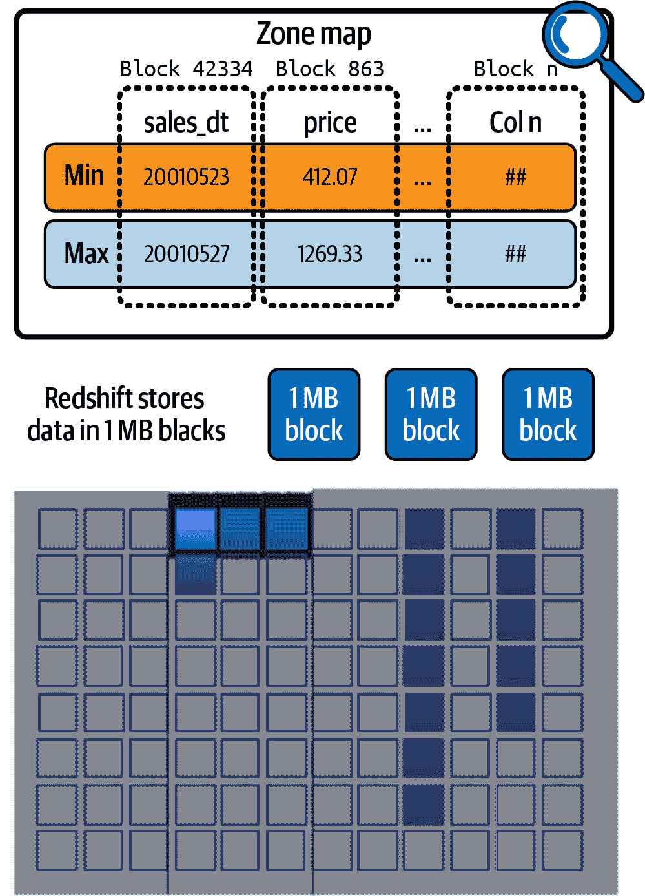

###### 图 3-14\. 区域映射

另一个例子是，考虑对`course_outcomes_fact`表的查询。您可以在特定日期上过滤该表，比如`Jun-09-2012`：

```
SELECT count(*)
FROM course_outcomes_fact
WHERE date_registered = '06-09-2017';
```

如图 3-15 所示，无论表是排序还是未排序，查询处理器都能跳过块。对于未排序表，处理器跳过一个块并根据区域映射中的最小/最大值扫描四个块中的三个。但是对于排序表，处理器只需扫描四个块中的一个。

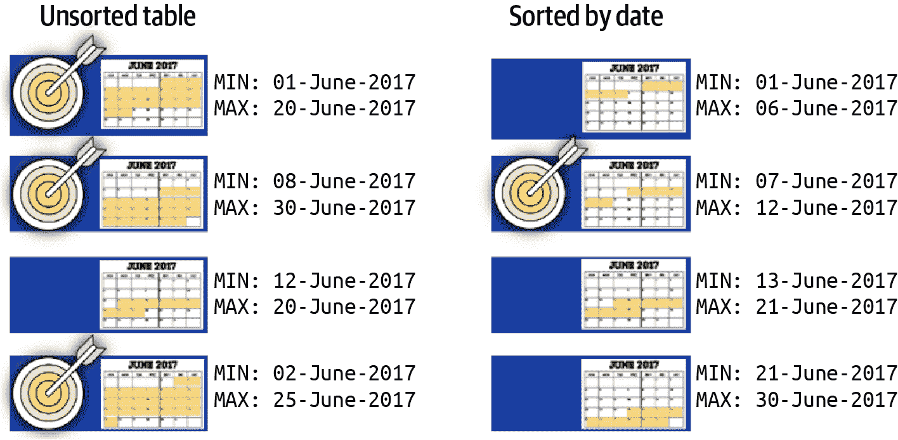

###### 图 3-15\. 排序键和区域映射

如前所述，我们建议您使用`SORTKEY AUTO`创建表，以便让 Amazon Redshift ATO 选择最佳排序键。对于`SORTKEY AUTO`，Amazon Redshift 将分析您表的查询模式并应用最常用于查询谓词中的排序键。通过使用自动化来调整表设计，您可以更轻松地开始并快速获得最快的性能，而无需投入时间手动调整和实施表优化。

在选择自己的排序键时，请参考[此查询](https://oreil.ly/DIkwX)来识别谓词列。建议在排序键中不超过五列，并且建议不对排序键的第一列应用任何压缩，以便能够快速有效地过滤数据块，因为这会减少解压缩的开销。在使用前导列而不是仅在尾随列上进行过滤时，复合排序键非常有效。如果发现用户查询中有不同的前导排序键列同样受欢迎，则利用 Amazon Redshift 材料化视图（MV）。MV 提供自动查询重写，查询优化器将选择适当的 MV 而不是基础表。

如果您频繁执行范围过滤或等值过滤于一列，请将该列指定为排序键。在分析使用情况下，基于日期和时间组件查询数据是常见的，建议将日期或时间戳列作为排序键的主导列创建表格是个不错的主意。

如果您经常连接表格，且通常不会在连接表格上进行过滤，则可以将连接列同时指定为排序键和分布键。这样做可以使查询优化器选择排序合并连接而不是较慢的哈希连接。因为数据已经在连接键上排序，查询优化器可以绕过排序阶段的排序合并连接。

## 压缩编码

Amazon Redshift 应用列级压缩，也称为编码，以实现比原始数据三到四倍的压缩。这也减少了访问数据时的 I/O 需求。

如前所述，在您的 Amazon Redshift 表上管理编码的最简单方法是利用`ENCODING AUTO`选项在您的`create table`语句中。启用后，编码将由列的数据类型和加载数据的启发式确定。

另一种设置表格编码的选择是首次使用`COPY`命令将数据加载到空表中时。默认情况下，Amazon Redshift 将通过对传入数据进行抽样或使用列的数据类型选择适当的压缩类型。可以在`COPY`命令中使用`COMPUPDATE`参数进行控制。使用`PRESET`选项时，压缩类型将基于数据类型确定，`ON`选项将对数据集进行抽样，`OFF`选项将不更改压缩类型。如果您一遍又一遍地重新加载同一表格，您无需每次分析压缩。`PRESET`快速且在大多数情况下运行良好。这些选项使您能够控制何时以及如何确定压缩，并且可以确保表格的属性在性能满意时不会更改。

在数据概况发生变化的情况下，分析表格中的压缩设置是否最优是个好主意。您可以使用`ANALYZE COMPRESSION`命令来执行此操作（见示例 3-16）。请注意，该命令可在整个表格或表格中的特定列集上执行。

##### 示例 3-16\. `ANALYZE COMPRESSION`命令

```
ANALYZE COMPRESSION
[ [ table_name ]
[ ( column_name [, ...] ) ] ]
[COMPROWS numrows]
[Script, SQL]
```

有几个最佳实践，如果实施，可以确保最大的压缩：

+   如果不使用`AUTO`，请为您的数据类型使用适当的编码。例如，对于具有高重复度的列，请使用游程编码（RLE），对于行之间具有高相似性的列，请使用增量编码。

+   使用`COPY`命令加载数据，因为它会自动应用编码参数。

+   使用`VACUUM`命令通过减少碎片来增加压缩。

+   监控表格大小及其使用的磁盘空间，以寻找应用额外压缩的机会。

+   避免对小维度表进行编码，因为每列的 1 MB 块可以容纳大量数据，在这些情况下，压缩不会带来 I/O 效益。

+   对频繁访问的列使用压缩。

# 摘要

本章讨论了数据湖优先方法与数据仓库优先方法之间的关键差异，以及可以考虑使用哪种方法的场景。此外，您还创建了样本数据模型和各种类型的转换工具和策略。

下一章将更深入地探讨在 Amazon Redshift 中针对数据库内转换（ELT）和外部转换（ETL）的数据，以及如何在数据仓库中未加载数据的情况下查询和转换所有数据。我们还将讨论编排数据加载的策略。

¹ Kuzilek J., Hlosta M., 和 Zdrahal Z. [开放大学学习分析数据集](https://doi.org/10.1038/sdata.2017.171)，Sci. Data 4:170171 (2017)。
