# 第四章：数据转换策略

最近，[Forbes 发布的一份报告](https://oreil.ly/q-xZU)描述了一些股票经纪商和交易公司能够比竞争对手更快地访问和分析数据。这使他们能够“在众人之前微秒级地以最佳价格执行交易。在时间上稍微占优，但在速度洞察方面却取得了巨大的竞争优势。”

在考虑分析解决方案时，洞察力速度很重要，组织能够快速响应其数据变化，将更具竞争力。在许多情况下，为了获取所需的洞察力，数据需要进行转换。正如在第三章，“设置数据模型和数据摄入”中简要讨论的，您可以使用 ETL 方法，从源数据中读取数据，通过外部应用程序进行转换处理，并加载结果；或者您可以使用 ELT 方法，使用刚刚加载的数据，并使用 Amazon Redshift 计算的能力在原地转换数据。

在本章中，我们将从“比较 ELT 和 ETL 策略”开始，帮助您决定在构建数据仓库时使用哪种数据加载策略。我们还将深入探讨一些为分析使用案例而构建的 Redshift 的独特功能，并支持“数据库内转换”，以及如何利用内置的“调度和编排”功能来运行您的数据管道。然后，我们将介绍亚马逊 Redshift 如何通过允许您即使未加载到 Redshift 中也可以“访问所有数据”来进一步采用 ELT 策略。最后，我们将讨论在何时使用“外部转换”策略以及如何使用 AWS Glue Studio 构建您的 ETL 管道。

# 比较 ELT 和 ETL 策略

无论是 ELT 还是 ETL 策略，都可以支持数据管理平台的共同目标，这些目标通常涉及为加载到报告数据模型中的数据进行清洗、转换和聚合。这些都是资源密集型的操作，两种策略之间的主要区别在于处理发生的位置：在您的 ETL 服务器计算中或在您的数据仓库平台计算中。ETL 过程涉及从多个来源读取数据，并使用 ETL 引擎的函数和功能对数据进行转换。相反，ELT 过程还涉及从各种来源提取数据，但首先将其加载到数据仓库中。在加载数据之后，使用熟悉的 SQL 语义执行数据转换步骤。在选择两者之间时需要考虑的一些因素包括：

性能和可扩展性

ETL 过程依赖于 ETL 服务器的资源，并要求平台所有者正确管理和调整环境。像 Spark 这样的计算平台可以用于并行化数据转换，AWS Glue 提供了管理 ETL 管道的无服务器选项。ELT 处理是使用数据仓库的计算资源执行的。在 Amazon Redshift 的情况下，使用 MPP 架构的强大性能来执行转换。在历史上，首选在外部进行数据转换，因为处理被卸载到独立计算上。然而，现代数据仓库平台，包括 Amazon Redshift，可以动态扩展并支持混合工作负载，使 ELT 策略更具吸引力。此外，由于数据仓库平台设计用于使用本地数据库函数处理和转换大量数据，ELT 作业往往表现更佳。最后，ELT 策略不受网络瓶颈的限制，而 ETL 需要在处理中移动数据。

灵活性

虽然数据平台中的任何转换代码都应遵循开发生命周期，使用 ETL 策略时，该代码通常由具有外部应用程序专业技能的团队管理。相比之下，ELT 策略中，所有原始数据都可以在数据管理平台中查询和转换。分析师可以使用熟悉的 SQL 函数编写代码，利用他们已有的技能。赋予分析师权力可以缩短开发生命周期，因为他们可以原型化代码并验证业务逻辑。数据平台的所有者将负责优化和调度代码。

元数据管理和编排

数据策略的一个重要考虑因素是如何管理作业元数据和编排。利用 ELT 策略意味着数据平台所有者需要跟踪作业、它们的依赖关系和加载计划。ETL 工具通常具有捕获和组织源、目标和作业特性以及数据血统的功能。它们还可以编排作业并在多个数据平台之间构建依赖关系。

最终，选择 ETL 和 ELT 之间的方式将取决于分析工作负载的具体需求。两种策略各有优势和劣势，使用哪种策略取决于数据源的特性、转换需求以及项目的性能和可扩展性需求。为了减轻每种策略的挑战，许多用户采取混合方法。您可以利用 ETL 工具的元数据管理和编排功能，以及构建将 ETL 代码转换为 SQL 语句的作业来利用 ELT 处理的性能和可扩展性。在“外部转换”中，我们将更详细地讨论这种可能性。

# 在数据库转换中

面对当今数据的多样性和速度，设计数据平台的挑战在于使其既可扩展又灵活。Amazon Redshift 持续创新并提供功能，以在一个地方处理所有数据，具有其数据库内转换（ELT）能力。作为符合 ANSI SQL 的关系数据库，Amazon Redshift 支持 [SQL 命令](https://oreil.ly/d6v8t)，使其成为大多数数据库开发人员熟悉的开发环境。Amazon Redshift 还支持现代数据平台中的高级功能，如 [窗口函数](https://oreil.ly/5I6s6)，[HyperLogLog 函数](https://oreil.ly/cIqsB)，以及 [递归 CTE（通用表达式）](https://oreil.ly/rRPCc) 等。除了您熟悉的这些功能外，Amazon Redshift 还支持用于分析处理的独特能力。例如，Amazon Redshift 支持就地查询 “半结构化数据”，为分析人员提供了一种高效访问此类数据的方式，而无需等待其加载到表和列中。此外，如果需要扩展 Amazon Redshift 的功能，您可以利用可以在数据库内运行或调用外部服务的 “用户定义函数”。最后，“存储过程” 允许您打包转换逻辑，可以根据输入参数返回结果集，甚至执行数据加载和管理操作，如加载事实、维度或聚合表。

## 半结构化数据

半结构化数据属于不符合关系数据库中预期的严格模式的数据类别。半结构化格式在网络日志、传感器数据或 API 消息中常见且通常受欢迎，因为这些应用程序经常需要发送带有嵌套关系的数据，而不是进行多次往返，一次性发送数据更为高效。半结构化数据包含复杂值，如数组和嵌套结构，这些与序列化格式（例如 JSON）相关联。虽然可以使用第三方工具在数据库之外转换数据，但这将需要工程资源来构建和维护该代码，并且可能性能不佳。无论您是访问 “外部亚马逊 S3 数据” 还是本地加载的数据，Amazon Redshift 利用 [PartiQL](https://oreil.ly/9kqbr) 语法分析和转换半结构化数据。为了以其原生形式存储此数据，特别推出了一个名为 [`SUPER`](https://oreil.ly/oyUbd) 的特殊数据类型。然而，当从 Amazon S3 访问时，将使用 `struct` 或 `array` 数据类型进行分类。

在以下示例中，我们引用了一个已经存储在 Amazon S3 环境中的文件。您可以通过创建外部模式并将存在于此 Amazon S3 前缀中的任何文件映射到该表定义，对此文件进行目录化并使其在 Amazon Redshift 中可访问。

第一个查询（示例 4-1）查找每个事件的总销售收入。

##### 示例 4-1\. 从 JSON 数据创建外部表

```
CREATE external SCHEMA IF NOT EXISTS nested_json
FROM data catalog DATABASE 'nested_json'
IAM_ROLE default
CREATE EXTERNAL DATABASE IF NOT EXISTS;

DROP TABLE IF EXISTS nested_json.nested_json;
CREATE EXTERNAL TABLE nested_json.nested_json (
    c_name varchar,
    c_address varchar,
    c_nationkey int,
    c_phone varchar,
    c_acctbal float,
    c_mktsegment varchar,
    c_comment varchar,
    orders struct<"order":array<struct<
      o_orderstatus:varchar,
      o_totalprice:float,
      o_orderdate:varchar,
      o_order_priority:varchar,
      o_clerk:varchar,
      o_ship_priority:int,
      o_comment:varchar
      >>> )
row format serde 'org.openx.data.jsonserde.JsonSerDe'
with serdeproperties ('paths'='c_name,c_address,c_nationkey,c_phone,
 c_acctbal,c_mktsegment,c_comment,Orders')
stored as inputformat 'org.apache.hadoop.mapred.TextInputFormat'
outputformat 'org.apache.hadoop.hive.ql.io.HiveIgnoreKeyTextOutputFormat'
location 's3://redshift-immersionday-labs/data/nested-json/';
```

此数据文件位于 us-west-2 地区，此示例仅在您的 Amazon Redshift 数据仓库也位于该地区时有效。此外，我们引用了 `default` IAM 角色。确保修改角色以允许读取此 Amazon S3 位置的权限，并且具有管理 AWS Glue 数据目录的访问权限。

现在表已经可用，可以对其进行查询，您可以在不进行任何特殊处理的情况下访问顶级属性（示例 4-2）。

##### 示例 4-2\. 顶级属性

```
SELECT cust.c_name,
  cust.c_nationkey,
  cust.c_address
FROM nested_json.nested_json cust
WHERE cust.c_nationkey = '-2015'
  AND cust.c_address like '%E12';
```

使用 PartiQL 语法，您可以访问嵌套的 `struct` 数据。在 示例 4-3 中，我们将 `orders` 字段中的数据进行非嵌套化，并展示与客户记录关联的多个订单。

##### 示例 4-3\. 非嵌套属性（外部）

```
SELECT cust.c_name,
   cust_order.o_orderstatus,
   cust_order.o_totalprice,
   cust_order.o_orderdate::date,
   cust_order.o_order_priority,
   cust_order.o_clerk,
   cust_order.o_ship_priority,
   cust_order.o_comment
FROM nested_json.nested_json cust,
     cust.orders.order cust_order
WHERE cust.c_nationkey = '-2015'
  AND cust.c_address like '%E12';
```

除了访问 S3 中的数据外，此半结构化数据还可以使用 `SUPER` 数据类型加载到您的 Amazon Redshift 表中。在 示例 4-4 中，同一文件加载到物理表中。在加载到 Amazon Redshift 时，与映射到 `SUPER` 数据类型的 `orders` 列的架构相关的信息不需要。这简化了加载和元数据管理过程，并在元数据更改时提供了灵活性。

##### 示例 4-4\. 从 JSON 数据创建本地表

```
DROP TABLE IF EXISTS nested_json_local;
CREATE TABLE nested_json_local (
    c_name varchar,
    c_address varchar,
    c_nationkey int,
    c_phone varchar,
    c_acctbal float,
    c_mktsegment varchar,
    c_comment varchar,
    orders SUPER);

COPY nested_json_local
from 's3://redshift-immersionday-labs/data/nested-json/'
IAM_ROLE default REGION 'us-west-2'
JSON 'auto ignorecase';
```

我们引用了 `default` IAM 角色。确保修改角色以授予从此 Amazon S3 位置读取的权限。

现在表已经可用，可以对其进行查询。使用相同的 PartiQL 语法，您可以访问订单详情（示例 4-5）。

##### 示例 4-5\. 非嵌套属性（本地）

```
SET enable_case_sensitive_identifier TO true;
SELECT cust.c_name,
   cust_order.o_orderstatus,
   cust_order.o_totalprice,
   cust_order.o_orderdate::date,
   cust_order.o_order_priority,
   cust_order.o_clerk,
   cust_order.o_ship_priority,
   cust_order.o_comment
FROM nested_json_local cust,
     cust.orders."Order" cust_order
WHERE cust.c_nationkey = '-2015'
  AND cust.c_address like '%E12';
```

`enable_case_sensitive_identifier` 是在查询 `SUPER` 数据时的一个重要参数，如果您的输入具有混合大小写标识符。有关更多信息，请参阅[在线文档](https://oreil.ly/Ou8HU)。

有关查询半结构化数据的更多详细信息和示例，请参阅[在线文档](https://oreil.ly/YjliK)。

## 用户定义函数

如果没有适合您特定转换需求的内置函数，Amazon Redshift 提供了几种选项来扩展平台功能。Amazon Redshift 允许您创建三种类型的 *标量用户定义函数*（UDF）：SQL、Python 和 Lambda。有关创建每种类型函数的详细文档，请参阅[在线文档](https://oreil.ly/VO8gm)。

标量函数每次调用将返回一个确切的值。在大多数情况下，您可以将其视为每行返回一个值。

SQL UDF 利用现有的 SQL 语法。它可以用于确保应用一致的逻辑，并简化每个用户需要单独编写的代码量。在 示例 4-6 中，来自 [Amazon Redshift UDFs GitHub 仓库](https://oreil.ly/Rd33u) 的示例中，您将看到一个 SQL 函数，它接受两个输入参数；第一个 `varchar` 字段是要掩码的数据，第二个字段是数据的分类。结果是基于数据分类的不同掩码策略。

##### 示例 4-6\. SQL UDF 定义

```
CREATE OR REPLACE function f_mask_varchar (varchar, varchar)
  returns varchar
immutable
AS $$
  SELECT case $2
    WHEN 'ssn' then
      substring($1, 1, 7)||'xxxx'
    WHEN 'email' then
      substring(SPLIT_PART($1, '@', 1), 1, 3) + 'xxxx@' + SPLIT_PART($1, '@', 2)
    ELSE substring($1, 1, 3)||'xxxxx' end
$$ language sql;
```

用户可以在 `SELECT` 语句中引用 SQL UDF。在这种情况下，您可能会编写 示例 4-7 中所示的 `SELECT` 语句。

##### 示例 4-7\. SQL UDF 访问

```
SELECT
 f_mask_varchar (name, NULL) mask_name, name,
 f_mask_varchar (email, 'email') mask_email, email,
 f_mask_varchar (ssn, 'ssn') mask_ssn, ssn
FROM Customer;
```

示例 4-7 中的 `SELECT` 语句的结果如下：

| mask_name | name | mask_email | email | mask_ssn | ssn |
| --- | --- | --- | --- | --- | --- |
| Janxxxxx | Jane Doe | jdoxxxx@org.com | jdoe@org.com | 123-45-xxxx | 123-45-6789 |

Python UDF 允许用户利用 Python 代码转换其数据。除了核心 Python 库外，用户还可以导入自己的库，以扩展在 Amazon Redshift 中可用的功能。在 示例 4-8 中，来自 [Amazon Redshift UDFs GitHub 仓库](https://oreil.ly/d_ief) 的示例中，您将看到一个利用外部库 `ua_parser` 的 Python 函数，该函数可以将用户代理字符串解析为 JSON 对象并返回客户端操作系统系列。

##### 示例 4-8\. Python UDF 定义

```
CREATE OR REPLACE FUNCTION f_ua_parser_family (ua VARCHAR)
RETURNS VARCHAR IMMUTABLE AS $$
  FROM ua_parser import user_agent_parser
  RETURN user_agent_parser.ParseUserAgent(ua)['family']
$$ LANGUAGE plpythonu;
```

类似于 SQL UDF，用户可以在 `SELECT` 语句中引用 Python UDF。在本例中，您可能会编写 示例 4-9 中所示的 `SELECT` 语句。

##### 示例 4-9\. Python UDF 访问

```
SELECT f_ua_parser_family (agent) family, agent FROM weblog;
```

示例 4-9 中的 `SELECT` 语句的结果如下：

| family | agent |
| --- | --- |
| Chrome | Mozilla/5.0 (Macintosh; Intel Mac OS X 10_9_4) AppleWebKit/537.36 (KHTML, like Gecko) Chrome/41.0.2272.104 Safari/537.36 |

最后，Lambda UDF 允许用户与 Amazon Redshift 之外的外部组件进行交互和集成。您可以使用任何支持的编程语言编写 Lambda UDF，例如 Java、Go、PowerShell、Node.js、C#、Python、Ruby 或自定义运行时。此功能支持新的 Amazon Redshift 用例，包括从外部数据存储（例如 Amazon DynamoDB、Amazon ElastiCache 等）进行数据丰富、从外部 API（例如 Melissa Global Address Web API 等）进行数据丰富、从外部提供者（例如 Protegrity）进行数据掩码和令牌化，以及将其他语言（如 C、C++和 Java）编写的遗留 UDF 转换为 Lambda UDF。在 示例 4-10 中，从 [Amazon Redshift UDFs GitHub Repo](https://oreil.ly/pll2W) 中，您将看到一个 Lambda 函数，利用 AWS 密钥管理服务（KMS）并将传入的字符串返回为加密值。第一个代码块定义了一个 Lambda 函数 `f-kms-encrypt`，该函数期望传递给函数的参数的嵌套数组。在此示例中，用户将作为输入参数提供 `kmskeyid` 和 `columnValue`；`argument[0]` 和 `argument[1]`。该函数将使用 `boto3` 库调用 `kms` 服务以返回加密的 `response`。

##### 示例 4-10\. Lambda 函数定义

```
import json, boto3, os, base64
kms = boto3.client('kms')
def handler(event, context):
  ret = dict()
  res = []
  for argument in event['arguments']:
    try:
      kmskeyid = argument[0]
      columnValue = argument[1]
      if (columnValue == None):
          response = None
      else:
          ciphertext = kms.encrypt(KeyId=kmskeyid, Plaintext=columnValue)
          cipherblob = ciphertext["CiphertextBlob"]
          response = base64.b64encode(cipherblob).decode('utf-8')
      res.append(response)
    except Exception as e:
      print (str(e))
      res.append(None)
  ret['success'] = True
  ret['results'] = res
  return json.dumps(ret)
```

下一个代码块定义了 Amazon Redshift UDF，其中引用了 Lambda 函数（示例 4-11）。

##### 示例 4-11\. Lambda UDF 定义

```
CREATE OR REPLACE EXTERNAL FUNCTION f_kms_encrypt (key varchar, value varchar)
RETURNS varchar(max) STABLE
LAMBDA 'f-kms-encrypt'
IAM_ROLE default;
```

我们引用了`default` IAM 角色。请确保修改角色以授予执行先前创建的 Lambda 函数的访问权限。

就像 SQL 和 Python UDF 一样，用户可以在 `SELECT` 语句中引用 Lambda UDF。在这种场景中，您可能会编写在 示例 4-12 中显示的 `SELECT` 语句。

##### 示例 4-12\. Lambda UDF 访问

```
SELECT f_kms_encrypt (email) email_encrypt, email FROM customer;
```

在 示例 4-12 中的 `SELECT` 语句将产生以下输出：

| email_encrypt | email |
| --- | --- |
| AQICAHiQbIJ478Gbu8DZyl0frUxOrbgDlP+CyfuWCuF0kHJyWg …​ | jdoe@org.com |

有关 Python UDF 的更多详细信息，请参阅 [“Amazon Redshift 中 Python UDF 的介绍”博文](https://oreil.ly/aX77w)，有关 Lambda UDF 的更多详细信息，请参阅 [“使用 Amazon Redshift Lambda UDF 访问外部组件”博文](https://oreil.ly/cEeQH)。

## 存储过程

Amazon Redshift 存储过程是用户创建的对象，用于执行一组 SQL 查询和逻辑操作。该过程存储在数据库中，并可供有执行权限的用户使用。与仅能在表中操作一行数据的标量 UDF 函数不同，*存储过程* 可以包含数据定义语言（DDL）和数据操作语言（DML），还可以包含循环和条件表达式。此外，存储过程不必返回值。

存储过程通常用于封装数据转换、数据验证和业务特定操作的逻辑，作为替代 Shell 脚本或复杂的 ETL 和编排工具。存储过程允许将 ETL/ELT 的逻辑步骤完全封装在一个过程中。您可以编写过程以便增量提交数据，或者使其完全成功（处理所有行）或完全失败（不处理任何行）。由于所有处理均在数据仓库上进行，因此无需在网络上移动数据，而且您可以利用 Amazon Redshift 的 MPP 架构快速执行大量数据的批量操作。

另外，由于存储过程是用 PL/pgSQL 编程语言实现的，您可能不需要学习新的编程语言来使用它们。实际上，您可能在传统数据平台上已有现有的存储过程，可以通过最少的代码更改迁移到 Amazon Redshift。使用外部编程语言或新的 ETL 平台重新创建现有流程的逻辑可能是一个大项目。AWS 还提供[AWS Schema Conversion Tool (SCT)](https://oreil.ly/h0Tn-)，这是一个迁移助手，可以将其他数据库编程语言中的现有代码转换为 Amazon Redshift 本机的 PL/pgSQL 代码。

在示例 4-13 中，您可以看到一个简单的过程，该过程将从 Amazon S3 加载数据到暂存表，然后将新记录加载到`lineitem`表中，同时确保删除重复项。该过程利用了`MERGE`运算符，可以使用一个语句完成任务。在此示例中，`l_orderyear`和`l_ordermonth`有常量变量。然而，通过使用`date_part`函数和`current_date`变量确定要加载的当前年份和月份，或者通过向过程传递`year`和`month`参数，可以轻松地使其动态化。

##### 示例 4-13\. 存储过程定义

```
CREATE OR REPLACE PROCEDURE lineitem_incremental()
AS $$
DECLARE
  yr CONSTANT INTEGER := 1998; --date_part('year',current_date);
  mon CONSTANT INTEGER := 8; --date_part('month', current_date);
  query VARCHAR;
BEGIN
  TRUNCATE stage_lineitem;
  query := 'COPY stage_lineitem ' ||
  	'FROM ''s3://redshift-immersionday-labs/data/lineitem-part/' ||
	  'l_orderyear=' || yr || '/l_ordermonth=' || mon || '/''' ||
    ' IAM_ROLE default REGION ''us-west-2'' gzip delimiter ''|''';
  EXECUTE query;

  MERGE INTO lineitem
  USING stage_lineitem s ON s.l_orderkey=lineitem.l_orderkey
  AND s.l_linenumber = lineitem.l_linenumber
  WHEN MATCHED THEN DELETE
  WHEN NOT MATCHED THEN INSERT
    VALUES ( s.L_ORDERKEY, s.L_PARTKEY, s.L_SUPPKEY, s.L_LINENUMBER,
      s.L_QUANTITY, s.L_EXTENDEDPRICE, s.L_DISCOUNT, s.L_TAX,
      s.L_RETURNFLAG, s.L_LINESTATUS, s.L_SHIPDATE, s.L_COMMITDATE,
      s.L_RECEIPTDATE, s.L_SHIPINSTRUCT, s.L_SHIPMODE, s.L_COMMENT);

END;
$$ LANGUAGE plpgsql;
```

我们已引用`default` IAM 角色。请确保修改角色以授予读取此 Amazon S3 位置的访问权限。

您可以使用`call`关键字执行存储过程（参见示例 4-14）。

##### 示例 4-14\. 存储过程访问

```
CALL lineitem_incremental();
```

有关 Amazon Redshift 存储过程的更多详细信息，请参阅[“将您的存储过程带到 Amazon Redshift”](https://oreil.ly/z3RUq) 博客文章。

# 调度和编排

当您开始考虑编排数据管道时，您需要考虑工作流程的复杂性以及对外部进程的依赖性。一些用户必须管理具有复杂依赖关系的多个系统。如果作业失败或未达到 SLA，您可能需要高级通知要求。如果是这样，您可能要考虑使用第三方调度工具。流行的第三方企业作业调度工具包括[Tivoli](https://oreil.ly/c0QVz)，[Control-M](https://oreil.ly/eEY_P)和[AutoSys](https://oreil.ly/fVA8y)，每个工具都与 Amazon Redshift 集成，允许您建立连接并执行一个或多个 SQL 语句。AWS 还提供基于开源[Apache Airflow](https://airflow.apache.org)项目的[Amazon 管理的工作流编排（MWAA）](https://oreil.ly/eRpJA)服务。如果您已经在运行 Apache Airflow 工作流并希望将其迁移到云端，这将非常有用。

然而，如果您可以基于时间触发您的加载操作，您可以利用查询调度程序。当您使用查询调度程序时，UI 将利用 Amazon Redshift Data API 和 EventBridge 的基础服务。

要使用查询调度程序触发简单的基于时间的查询，请导航至[查询编辑器 V2](https://oreil.ly/OfaXg)，准备您的查询，然后点击计划按钮（图 4-1）。对于此示例，我们将使用`COPY`语句加载`stage_lineitem`表。

设置连接（图 4-2）以及调度程序将用来执行查询的 IAM 角色。在随后的对话框中，从列表中选择适用的 Amazon Redshift 数据仓库以及相应的帐户和区域。在我们的情况下，我们将使用“临时凭证”进行连接。有关其他连接策略的详细信息，请参阅第二章，“Amazon Redshift 入门”。

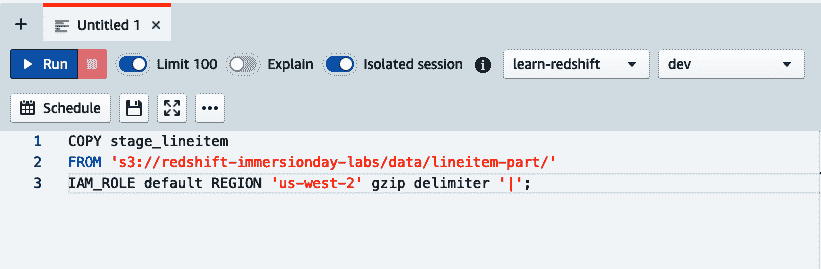

###### 图 4-1\. 计划按钮

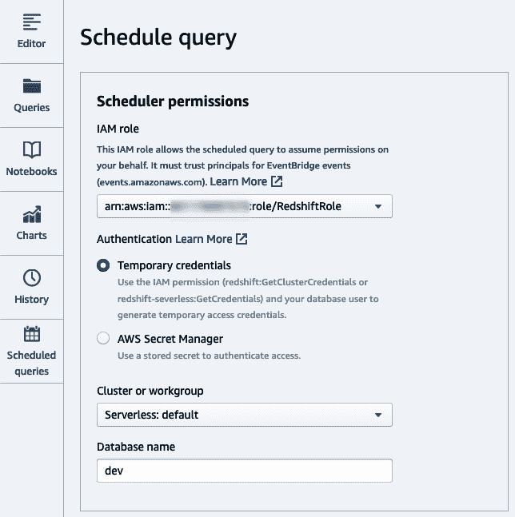

###### 图 4-2\. 选择连接

接下来，设置将要执行的查询名称以及可选描述（图 4-3）。查询将从编辑器页面复制过来。

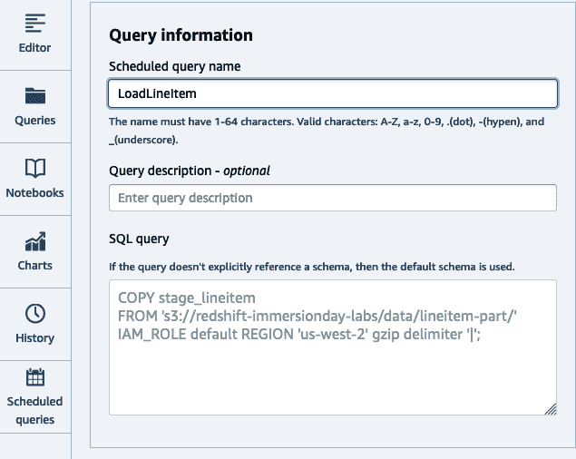

###### 图 4-3\. 设置查询

接下来，按照 Cron 格式设置基于时间的计划，或者通过选择适用的单选选项（图 4-4）。可选地，选择是否希望将执行事件传递到 Amazon 简单通知服务（SNS）主题，以便接收通知。单击“保存更改”保存计划。

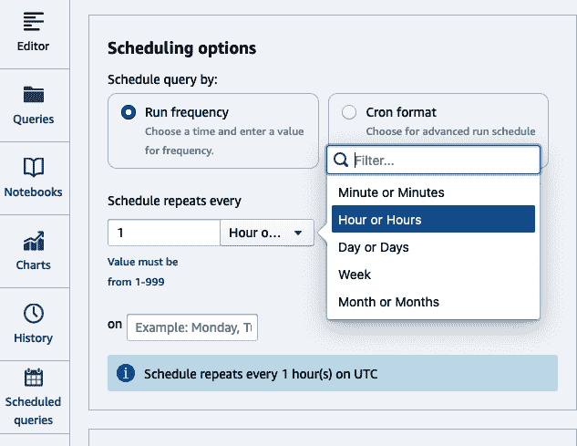

###### 图 4-4\. 设置计划

要查看已安排的查询列表，请导航至[已安排查询页面](https://oreil.ly/jvCFh)的查询编辑器 V2（图 4-5）。

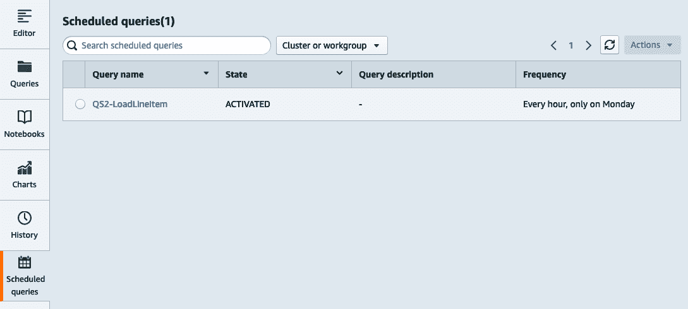

###### 图 4-5\. 已安排的查询列表

要管理调度作业，请点击调度查询。在此屏幕上，您可以修改作业、停用它或删除它。您还可以检查历史记录，其中包含开始/停止时间以及作业状态（参见图 4-6）。


###### 图 4-6\. 查看调度历史

您还可以查看在 EventBridge 中创建的资源。导航到[EventBridge 规则页面](https://oreil.ly/Phb4H)，注意已创建一个新的调度规则（图 4-7）。

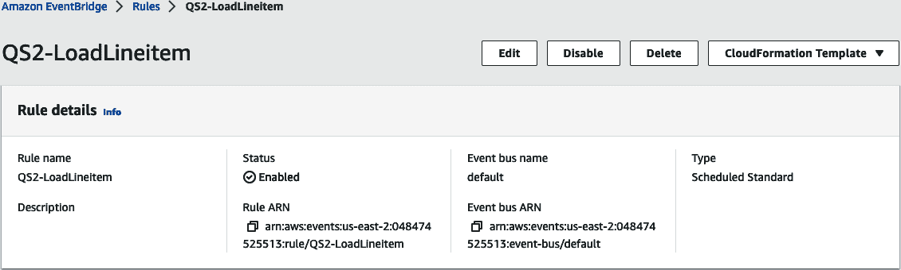

###### 图 4-7\. 调度规则

检查规则目标（图 4-8），您将看到`Redshift cluster`目标类型以及执行查询所需的参数。

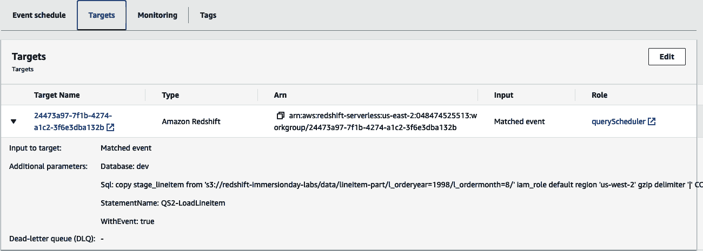

###### 图 4-8\. 调度规则目标

# 访问所有数据

要完成 ELT 故事，Amazon Redshift 支持访问未加载的数据。Amazon Redshift 计算将使用所有已提到的转换能力处理您的数据，无需单独的处理服务器。无论是“外部 Amazon S3 数据”，“外部操作数据”，甚至是“外部 Amazon Redshift 数据”，在您的 Amazon Redshift 数据仓库中使用熟悉的 ANSI SQL 语法提交查询；只有适用的数据由 Amazon Redshift 计算处理。它可以与本地数据进行连接，并用于填充您的 Amazon Redshift 数据仓库本地表。

## 外部 Amazon S3 数据

Amazon Redshift 使您能够使用简单的 SQL 查询读取和写入存储在 Amazon S3 中的外部数据。访问 Amazon S3 上的数据增强了您的数据的互操作性，因为您可以从 Amazon Redshift 以外的多个计算平台访问相同的 Amazon S3 数据。这些平台包括 Amazon Athena、Amazon EMR、Presto 以及任何其他能够访问 Amazon S3 的计算平台。使用此功能，Amazon Redshift 可以将外部 Amazon S3 表与驻留在 Amazon Redshift 数据仓库本地磁盘上的表进行连接。在使用预置集群时，Amazon Redshift 将利用称为 Amazon Redshift Spectrum 的节点群集，进一步隔离 Amazon S3 处理，并应用优化，如谓词推送和聚合到 Amazon Redshift Spectrum 计算层，提高查询性能。您可以推送到 Amazon Redshift Spectrum 的谓词运算符类型包括：`=`, `LIKE`, `IS NULL`和`CASE WHEN`。此外，您还可以使用转换逻辑，在 Amazon Redshift Spectrum 层推送许多聚合和字符串函数。聚合函数的类型包括：`COUNT`, `SUM`, `AVG`, `MIN`和`MAX`。

Amazon Redshift Spectrum 使用计算资源处理 Amazon S3 数据，计算资源是您的预配集群中切片数量的 10 倍。此外，扫描每 TB 数据的成本为 $5。相比之下，使用 Amazon Redshift 无服务器查询 Amazon S3 数据时，处理发生在您的 Amazon Redshift 计算资源上，并且成本包含在 RPU 定价中。

查询外部 Amazon S3 数据通过利用一个外部 `metadata catalog`，该目录将数据集组织成 `databases` 和 `tables`。然后，您将一个数据库映射到 Amazon Redshift 的 `schema`，并通过 `IAM ROLE` 提供凭据，确定您的访问级别。在 示例 4-15 中，您的 metadata catalog 是 AWS Glue `data catalog`，其中包含一个名为 `externaldb` 的数据库。如果该数据库不存在，此命令将创建它。我们已将该数据库映射到一个新的架构 `externalschema`，使用附加到数据仓库的 `default` IAM 角色。除了 AWS Glue `data catalog` 外，用户还可以映射到 `hive metastore`，如果您的数据位于 EMR 集群或自管理的 Apache Hadoop 环境中。有关创建外部架构选项的更多详细信息，请参阅 [在线文档](https://oreil.ly/FtiZ-)。

##### 示例 4-15\. 创建外部 S3 架构

```
CREATE EXTERNAL SCHEMA IF NOT EXISTS externalschema
FROM data catalog DATABASE 'externaldb'
IAM_ROLE default
CREATE EXTERNAL DATABASE IF NOT EXISTS;
```

我们已经引用了`default` IAM 角色。请确保修改角色以便访问和管理 AWS Glue 数据目录。

一旦外部架构创建完成，您可以像操作已加载到 Amazon Redshift 中的表一样轻松查询数据。在 示例 4-16 中，您可以查询与本地存储的数据进行关联的外部表数据。

##### 示例 4-16\. 外部 S3 表访问

```
SELECT
 t.returnflag,
 t.linestatus,
 c.zip,
 sum(t.quantity) AS sum_qty,
 sum(t.extendedprice*(1-t.discount)*(1+t.tax)) AS sum_charge
FROM externalschema.transactions t
JOIN public.customers c on c.id = t.customer_id
WHERE t.year = 2022 AND t.month = 1
GROUP BY t.returnflag, t.linestatus, c.zip;
```

此查询具有一个筛选器，将外部表数据限制为 2022 年 1 月和一个简单的聚合操作。在使用预配集群时，此筛选器和部分聚合将在 Amazon Redshift Spectrum 层处理，从而减少发送到计算节点的数据量，并提高查询性能。

因为在 Amazon Redshift 中查询本地存储的数据时可以获得最佳性能，因此将最近的数据加载到 Amazon Redshift 并从外部来源查询不经常访问的数据是最佳实践。通过遵循这一策略，您可以确保最热的数据存储在计算资源附近，并且以优化了的分析处理格式存在。在 示例 4-17 中，您可能会有一个加载过程，用最新一个月的数据填充交易表，但所有数据都存在于 Amazon S3 中。当用户访问时，他们将看到数据的汇总视图，但当他们访问最热的数据时，Amazon Redshift 将从本地存储中检索它。

##### 示例 4-17\. 合并 S3 和本地数据

```
CREATE VIEW public.transactions_all AS
  SELECT … FROM public.transactions
  UNION ALL
  SELECT … FROM externalschema.transactions
  WHERE year != date_part(YEAR, current_date)
    AND month != date_part(MONTH, current_date);
WITH NO SCHEMA BINDING;
```

`NO SCHEMA BINDING` 子句必须用于外部表，以确保数据可以在 Amazon S3 中加载，而不会对 Amazon Redshift 造成任何影响或依赖。

有关 Amazon Redshift Spectrum 优化技术的更多详细信息，请参阅 [Amazon Redshift Spectrum 最佳实践博客](https://oreil.ly/A1_Xz)。

## 外部运营数据

Amazon Redshift 联合查询允许您直接查询存储在事务性数据库中的数据，实现实时数据集成和简化的 ETL 处理。使用联合查询，您可以为用户提供实时洞察。一个典型的用例是当您向数据仓库批量注入数据时，但您需要实时分析时。您可以提供 Amazon Redshift 批量加载数据和事务性数据库当前实时数据的结合视图。联合查询还将这些源数据库的元数据暴露为外部表，允许像 Tableau 和 Amazon QuickSight 这样的 BI 工具查询联合数据源。这为您提供了无缝查询运营数据、简化 ETL 流水线以及构建数据到绑定视图的新数据仓库用例。截至 2022 年，支持的事务性数据库包括 Amazon Aurora PostgreSQL/MySQL 和 Amazon RDS for PostgreSQL/MySQL。

Amazon Redshift 联合查询通过与您的操作数据存储建立 TCP/IP 连接并将其映射到外部模式来工作。您需要通过 AWS Secrets Manager 密钥提供数据库类型和连接信息以及连接凭据。在 示例 4-18 中，数据库类型为 `POSTGRES`，连接信息指定了数据库的 `DATABASE`、`SCHEMA` 和 `URI`。有关使用联合查询创建外部模式时的选项的详细信息，请参阅 [在线文档](https://oreil.ly/zhWJR)。

##### 示例 4-18\. 创建外部模式

```
CREATE EXTERNAL SCHEMA IF NOT EXISTS federatedschema
FROM POSTGRES DATABASE 'db1' SCHEMA 'pgschema'
URI '<rdsname>.<hashkey>.<region>.rds.amazonaws.com'
SECRET_ARN 'arn:aws:secretsmanager:us-east-1:123456789012:secret:pgsecret'
IAM_ROLE default;
```

我们引用了 `default` IAM 角色。确保修改角色以授予使用 Secrets Manager 检索名为 `pgsecret` 的秘密的访问权限。

创建外部模式后，您可以像查询本地 Amazon Redshift 表一样查询这些表。在 示例 4-19 中，您可以查询从外部表获取的数据，与本地存储的数据进行连接，类似于查询外部 Amazon S3 数据时执行的查询。查询还包含一个筛选器，将联合表中的数据限制为 2022 年 1 月。Amazon Redshift 联合查询智能地将谓词推送到联合源以限制扫描的数据量，极大地提高了查询性能。

##### 示例 4-19\. 外部表访问

```
SELECT
 t.returnflag,
 t.linestatus,
 c.zip,
 sum(t.quantity) AS sum_qty,
 sum(t.extendedprice*(1-t.discount)*(1+t.tax)) AS sum_charge
FROM federatedschema.transactions t
JOIN public.customers c ON c.id = t.customer_id
WHERE t.year = 2022 AND t.month = 1
GROUP by t.returnflag, t.linestatus, c.zip;
```

由于联合查询在事务系统上执行查询，请注意限制查询的数据。一个好的实践是使用 Amazon Redshift 本地表中的历史数据，并仅访问联合数据库中的最新数据。

除了查询实时数据外，联合查询还开辟了简化 ETL 过程的机会。许多组织在构建其数据仓库时使用的常见 ETL 模式是 `upsert`。 `upsert` 是指数据工程师任务是扫描数据仓库表的源，确定是否应插入新记录或更新/删除现有记录。过去，通常需要多个步骤来完成此操作：

1.  创建源表的完全抽取，或者如果您的源有变更跟踪，则提取自上次加载处理以来的记录。

1.  将该抽取移动到您数据仓库的本地位置。对于亚马逊 Redshift，这将是 Amazon S3。

1.  使用批量加载器将数据加载到暂存表中。对于亚马逊 Redshift，这将是 `COPY` 命令。

1.  根据已经暂存的数据执行 `MERGE`（`UPSERT`—`UPDATE` 和 `INSERT`）命令，以更新目标表。

使用联合查询，您可以绕过在 Amazon S3 中进行增量提取和随后通过 `COPY` 加载数据的需求，直接在其源数据库中的原地查询数据。在 示例 4-20 中，我们展示了如何通过单个 `MERGE` 语句从操作源同步客户表。

##### 示例 4-20\. 使用 `MERGE` 进行增量更新

```
MERGE INTO customer
USING federatedschema.customer p ON p.customer_id = customer.customer_id
  AND p.updatets > current_date-1 and p.updatets < current_date
WHEN MATCHED THEN UPDATE SET customer_id = p.customer_id,
  name = p.name, address = p.address,
  nationkey = p.nationkey, mktsegment = p.mktsegment
WHEN NOT MATCHED THEN INSERT (custkey, name, address, nationkey, mktsegment)
  VALUES ( p.customer_id, p.name, p.address, p.nationkey, p.mktsegment )
```

欲了解有关联合查询优化技术的更多详细信息，请参阅博文 [“亚马逊 Redshift 联合查询的最佳实践”](https://oreil.ly/fhtqi)，以及有关简化 ETL 策略的其他方法的更多详细信息，请参阅博文 [“使用亚马逊 Redshift 联合查询构建简化的 ETL 和实时数据查询解决方案”](https://oreil.ly/wYhtm)。

## 外部亚马逊 Redshift 数据

亚马逊 Redshift 数据共享使您能够直接查询存储在另一个亚马逊 Redshift 数据仓库的 Amazon RMS 中的实时数据，无论是使用 RA3 节点类型的预配集群还是服务器无数据仓库。此功能使得在另一个亚马逊 Redshift 数据仓库中访问在一个亚马逊 Redshift 数据仓库中生成的数据成为可能。与其他外部数据源类似，数据共享功能还将来自生产者亚马逊 Redshift 数据仓库的元数据作为外部表暴露出来，允许消费者在不必制作本地副本的情况下查询该数据。这使得新的数据仓库用例成为可能，例如分配数据所有权和隔离不同工作负载的执行。在 第七章，“与数据共享协作” 中，我们将更详细地介绍这些用例。在接下来的示例中，您将了解如何使用 SQL 语句配置数据共享以及如何在您的 ETL/ELT 过程中使用它。有关如何从 Redshift 控制台启用和配置数据共享的详细信息，请参阅 [在线文档](https://oreil.ly/3DCQT)。

数据共享的第一步是了解生产者和消费者数据仓库的`命名空间`。在每个数据仓库上执行以下操作以检索相应的值（示例 4-21）。

##### 示例 4-21\. 当前命名空间

```
SELECT current_namespace;
```

接下来，在生产者数据仓库中创建一个数据共享对象，并添加诸如`架构`和`表`等数据库对象（示例 4-22）。

##### 示例 4-22\. 创建数据共享

```
CREATE DATASHARE transactions_datashare;
ALTER DATASHARE transactions_datashare
  ADD SCHEMA transactions_schema;
ALTER DATASHARE transactions_datashare
  ADD ALL TABLES IN SCHEMA transactions_schema;
```

您现在可以通过引用其`命名空间`（示例 4-23）将数据共享的访问权从生产者授予给消费者。

##### 示例 4-23\. 授予数据共享使用权

```
GRANT USAGE ON DATASHARE transactions_datashare
TO NAMESPACE '1m137c4-1187-4bf3-8ce2-CONSUMER-NAMESPACE';
```

最后，您在消费者端创建一个数据库，引用数据共享名称以及生产者的`命名空间`（示例 4-24）。

##### 示例 4-24\. 创建数据共享数据库

```
CREATE DATABASE transactions_database from DATASHARE transactions_datashare
OF NAMESPACE '45b137c4-1287-4vf3-8cw2-PRODUCER-NAMESPACE';
```

数据共享还可以跨帐户授予。在这种情况下，与数据共享相关的管理员需要执行额外的步骤。有关更多信息，请参阅[在线文档](https://oreil.ly/072-D)。

一旦外部数据库创建完成，您可以像本地 Amazon Redshift 数据仓库中的表一样轻松查询数据。在示例 4-25 中，您正在查询外部表与本地存储的数据联接，类似于使用外部 Amazon S3 和运营数据时执行的查询。同样，该查询包含一个筛选器，将外部表的数据限制为 2022 年 1 月的数据。

##### 示例 4-25\. 数据共享访问

```
SELECT
 t.returnflag,
 t.linestatus,
 c.zip,
 sum(t.quantity) as sum_qty,
 sum(t.extendedprice*(1-t.discount)*(1+t.tax)) as sum_charge
FROM transactions_database.transcations_schema.transactions t
JOIN public.customers c on c.id = t.customer_id
WHERE t.year = 2022 AND t.month = 1
GROUP by t.returnflag, t.linestatus, c.zip;
```

您可以想象一种设置，其中一个部门可能负责管理销售交易，另一个部门负责客户关系。客户关系部门有兴趣确定他们最好和最差的客户，以便发送定向营销。与其需要维护单一的数据仓库并共享资源，每个部门可以利用自己的 Amazon Redshift 数据仓库，并负责自己的数据。客户关系团队可以直接查询而不是复制交易数据。他们可以构建和维护该数据的聚合，并将其与以前的营销活动数据以及客户情感数据联接，以构建他们的营销活动。

了解更多有关数据共享的信息，请阅读[“在 Amazon Redshift 集群之间安全共享 Amazon Redshift 数据”](https://oreil.ly/UOfaa)和[“Amazon Redshift 数据共享的最佳实践和考虑因素”](https://oreil.ly/jf1Mu)。

# 外部转换

在希望使用外部工具进行数据转换的场景中，Amazon Redshift 可以通过 JDBC 和 ODBC 驱动程序连接到您选择的 ETL 平台，这些驱动程序可以是这些应用程序打包的，也可以是可下载的。与 Amazon Redshift 集成的流行 ETL 平台包括第三方工具如[Informatica](https://www.informatica.com)、[Matillion](https://www.matillion.com)和[dbt](https://www.getdbt.com)，以及 AWS 本地工具如“AWS Glue”。ETL 工具是管理数据流水线所有组件的宝贵方式。它们提供作业存储库来组织和维护元数据，使组织能够更轻松地管理其代码，而不是将该逻辑存储在 SQL 脚本和存储过程中。它们还具有调度功能，有助于作业编排，这在您没有使用 AWS 本地提供的“调度和编排”时非常有用。

一些 ETL 工具还具有“下推”转换逻辑的能力。在您可能需要从 Amazon Redshift 数据仓库读取和写入数据的情况下，您可以使用 ETL 工具的可视化能力设计作业，但不是将数据实际提取到 ETL 服务器的计算中，而是将代码转换为在 Amazon Redshift 上运行的 SQL 语句。当转换大量数据时，这种策略可以非常高效，但也可能消耗您的最终用户可能需要用于分析数据的大量资源。当您不使用 ETL 工具的下推功能时，无论是因为您的作业不是从 Amazon Redshift 读取和写入数据，还是因为您决定要卸载转换逻辑，都很重要确保您的 ETL 工具以高效的方式从 Amazon Redshift 读取和写入数据。

正如在第三章，“设置数据模型和数据摄入”中讨论的那样，加载数据的最佳性能方式是使用`COPY`语句。由于 AWS 与 Informatica 和 Matillion 等 ETL 供应商的合作，AWS 确保供应商基于这一策略构建了连接器。例如，在 Informatica Amazon Redshift 架构的图 4-9 中，您可以看到，如果您已指定了 Amazon Redshift 目标和 Amazon S3 中的临时区域，工具将不会直接通过插入加载目标，而是会先将数据写入 Amazon S3，然后使用 Amazon Redshift 的`COPY`语句加载到目标表中。这种策略对于`update`和`delete`语句同样适用，只是 Informatica 会将数据写入临时表，并执行后续的`update`和`delete`语句。这种优化得益于 AWS 与多个软件供应商的合作，确保用户轻松利用工具并确保其数据管道的性能。详细的最佳实践指南，请参阅以下已发布的内容：

+   [Informatica——Amazon Redshift 连接器最佳实践](https://oreil.ly/CX57A)

+   [Matillion——Amazon Redshift ETL 处理的最佳实践](https://oreil.ly/0jRs2)

+   [dbt——利用 Amazon Redshift 和 dbt 的最佳实践](https://oreil.ly/mRYaI)

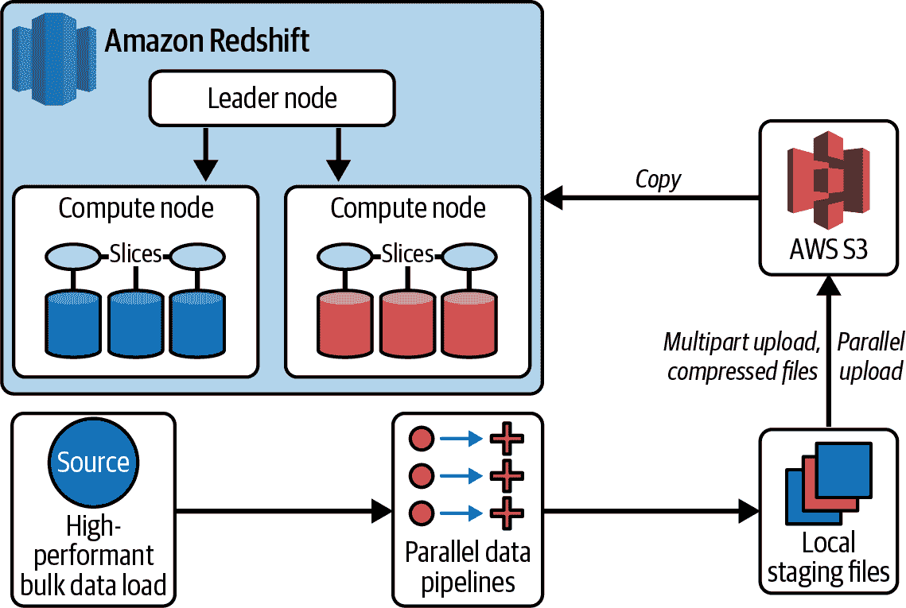

###### 图 4-9\. Informatica Amazon Redshift 架构

## AWS Glue

AWS Glue 是常用的本地无服务器数据集成服务之一，可使用 Python 或 Scala 语言进行数据转换，并在数据处理引擎上运行。通过 AWS Glue（图 4-10），您可以读取 Amazon S3 数据，应用转换，并将数据摄入 Amazon Redshift 数据仓库以及其他数据平台。AWS Glue 使发现、准备、移动和集成来自多个来源的数据，以进行分析、机器学习和应用程序开发变得更加简单。它提供多个数据集成引擎，包括 AWS Glue for Apache Spark、AWS Glue for Ray 和 AWS Glue for Python Shell。您可以根据工作负载的特性和开发人员与分析师的偏好选择合适的引擎。

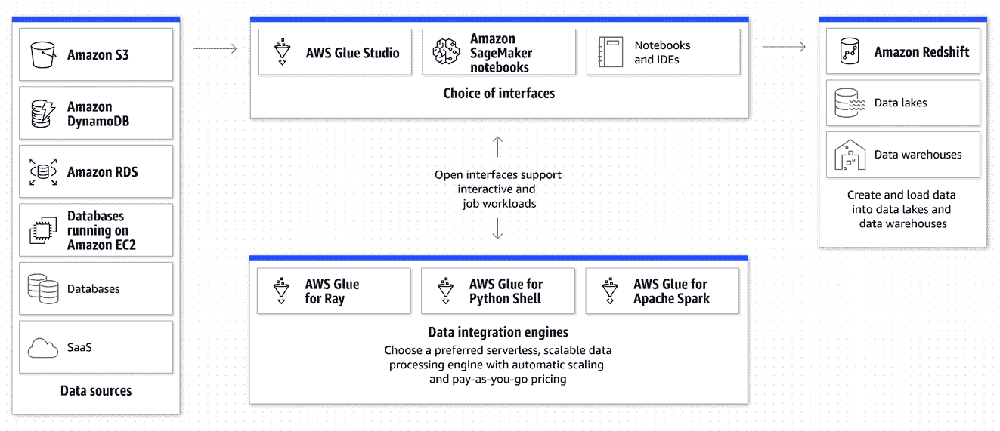

###### 图 4-10\. 使用 AWS Glue 进行 ETL 集成

自 AWS Glue V4 起，AWS Glue ETL 作业配备了一个新的 Amazon Redshift Spark 连接器和新的 JDBC 驱动程序。您可以使用它构建 Apache Spark 应用程序，作为数据摄取和转换管道的一部分，读取和写入 Amazon Redshift 中的数据。新的连接器和驱动程序支持将关系操作（如连接、聚合、排序和标量函数）从 Spark 推送到 Amazon Redshift，以减少需要处理的数据量，从而提高作业性能。它还支持基于 IAM 的角色，以实现单点登录功能，并与 AWS Secrets Manager 集成，用于安全管理密钥。

要管理您的 AWS Glue 作业，AWS 提供了一种可视化的创作工具，[AWS Glue Studio](https://oreil.ly/vvdyo)。该服务遵循已经提到的第三方 ETL 工具的许多最佳实践，但由于集成，构建和管理数据管道所需的步骤更少。

在 示例 4-26 中，我们将构建一个作业，从 Amazon S3 加载增量交易数据，并将其合并到您的 Amazon Redshift 数据仓库中的 `lineitem` 表中，使用键 (`l_orderkey`, `l⁠_⁠l⁠i⁠n⁠e​n⁠u⁠m⁠b⁠e⁠r`)。

##### 示例 4-26\. 创建 `lineitem` 表

```
CREATE TABLE lineitem (
  L_ORDERKEY varchar(20) NOT NULL,
  L_PARTKEY varchar(20),
  L_SUPPKEY varchar(20),
  L_LINENUMBER integer NOT NULL,
  L_QUANTITY varchar(20),
  L_EXTENDEDPRICE varchar(20),
  L_DISCOUNT varchar(20),
  L_TAX varchar(20),
  L_RETURNFLAG varchar(1),
  L_LINESTATUS varchar(1),
  L_SHIPDATE date,
  L_COMMITDATE date,
  L_RECEIPTDATE date,
  L_SHIPINSTRUCT varchar(25),
  L_SHIPMODE varchar(10),
  L_COMMENT varchar(44));
```

要构建一个 Glue 作业，请按照接下来的两个部分的说明操作。

### 注册 Amazon Redshift 目标连接

转到 [“创建连接”](https://oreil.ly/Jlypu) 创建一个新的 AWS Glue 连接。命名连接并选择 Amazon Redshift 作为连接类型（参见 图 4-11）。

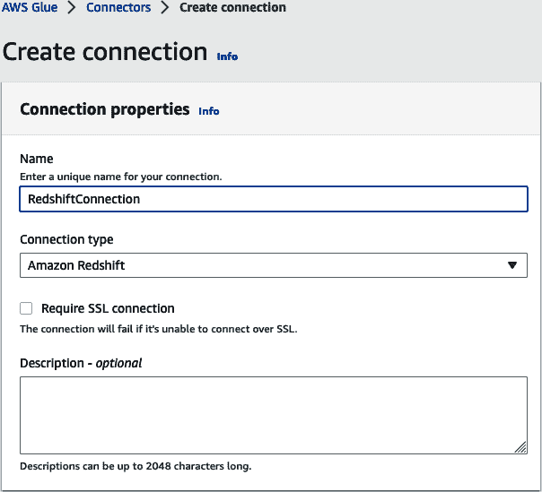

###### 图 4-11\. Amazon Redshift 连接名称

接下来，从您的 AWS 帐户和区域的自动发现的 Amazon Redshift 数据仓库列表中选择数据库实例。设置数据库名称和访问凭据。您可以选择设置用户名和密码，或使用 AWS Secrets Manager。最后，点击“创建连接”（参见 图 4-12）。

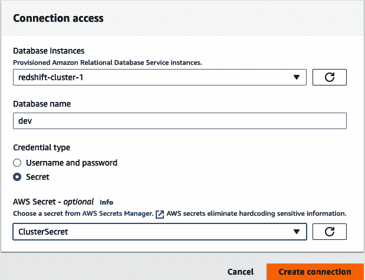

###### 图 4-12\. Amazon Redshift 连接实例

### 构建并运行您的 AWS Glue 作业

要构建一个 AWS Glue 作业，请导航至 AWS Glue Studio 的 [作业页面](https://oreil.ly/G873X)。您将看到一个对话框，提示您选择作业的选项（参见 图 4-13）。在本例中，我们将选择“可视化，带有源和目标”。将目标修改为 Amazon Redshift，并选择创建。

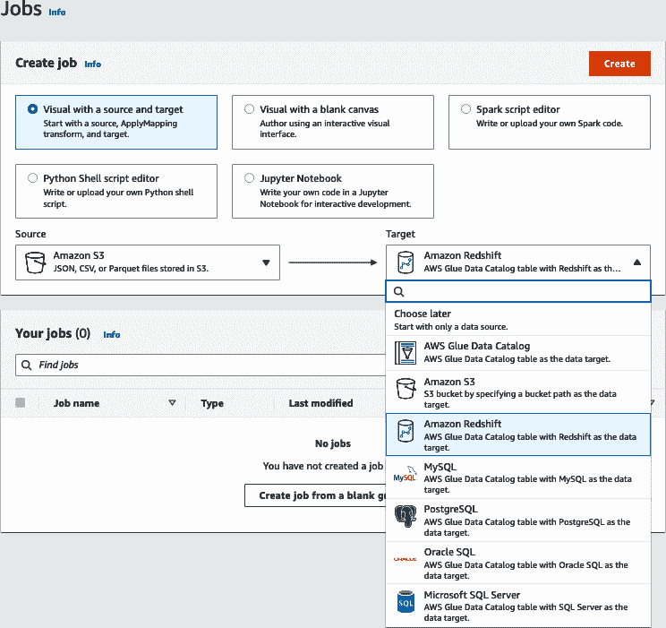

###### 图 4-13\. AWS Glue 创建作业

接下来，您将看到作业的可视化表示。第一步是选择数据源节点并设置 S3 源类型（图 4-14）。对于我们的用例，我们将使用一个 S3 位置，并输入我们数据的位置：s3://redshift-immersionday-labs/data/lineitem-part/。选择解析细节，如数据格式、分隔符、转义字符等。对于我们的用例，文件将采用 CSV 格式，是以管道符（|）分隔的，并且没有列标题。最后，点击“推断模式”按钮。

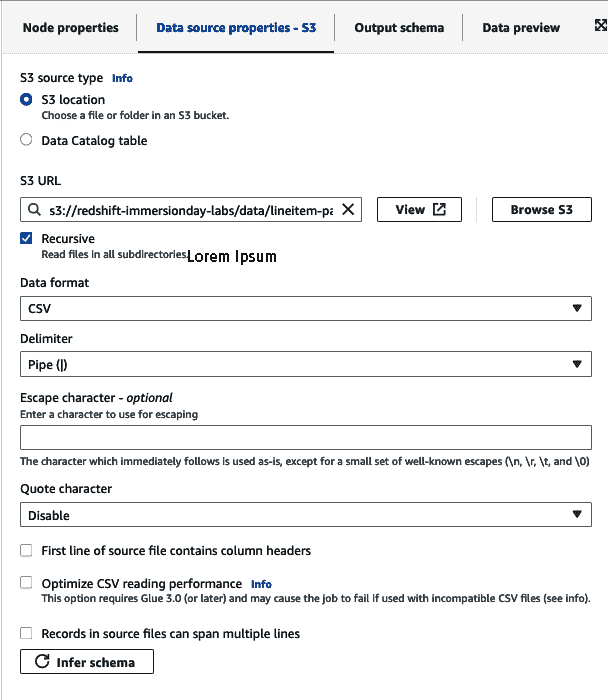

###### 图 4-14\. AWS Glue 设置 Amazon S3 存储桶

如果您已建立了一个数据湖，并且正在使用它来查询其他 AWS 服务，如 Amazon Athena、Amazon EMR，甚至是作为外部表的 Amazon Redshift，您也可以选择使用“数据目录表”选项。

接下来，我们可以转换我们的数据（图 4-15）。该作业建立在一个简单的 ApplyMapping 节点上，但您有许多选项来转换您的数据，如连接、拆分和聚合数据。请参阅[“编辑 AWS Glue 管理的数据转换节点” AWS 文档](https://oreil.ly/JwlWy)了解更多转换节点信息。选择转换节点，并设置与源键匹配的目标键。在我们的情况下，源数据没有列标题，并且以通用列（col#）注册。将它们映射到您 `lineitem` 表中的相应列。

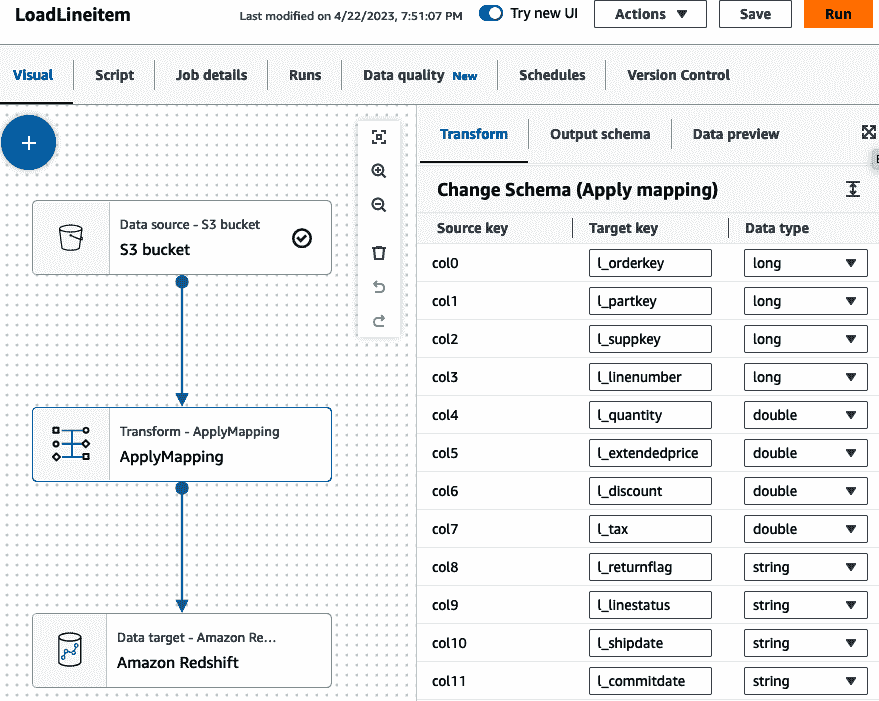

###### 图 4-15\. AWS Glue 应用映射

现在您可以设置 Amazon Redshift 的详细信息（图 4-16）。选择“直接数据连接”，并选择适用的模式（public）和表（lineitem）。您还可以设置作业如何处理新记录；您可以选择仅插入每条记录或设置一个键，以便作业可以更新需要重新处理的数据。对于我们的用例，我们将选择`MERGE`，并设置键 `l_orderkey` 和 `l_linenumber`。这样做的好处是，当作业运行时，数据将首先加载到暂存表中，然后基于目标中已存在的任何数据运行`MERGE`语句，然后再使用`INSERT`语句加载新数据。

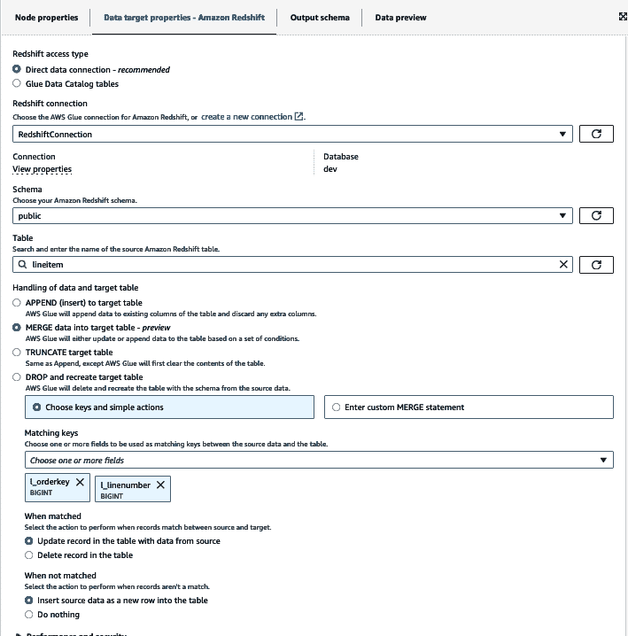

###### 图 4-16\. AWS Glue 设置 Amazon Redshift 目标

在保存并运行作业之前，您必须设置一些额外的作业详细信息，如 IAM 角色，该角色将用于运行作业，并设置脚本文件名（图 4-17）。该角色应具有访问 Amazon S3 位置中文件的权限，并且还应该能够被 AWS Glue 服务所假定。创建和设置 IAM 角色后，单击“保存并运行”来执行您的作业。

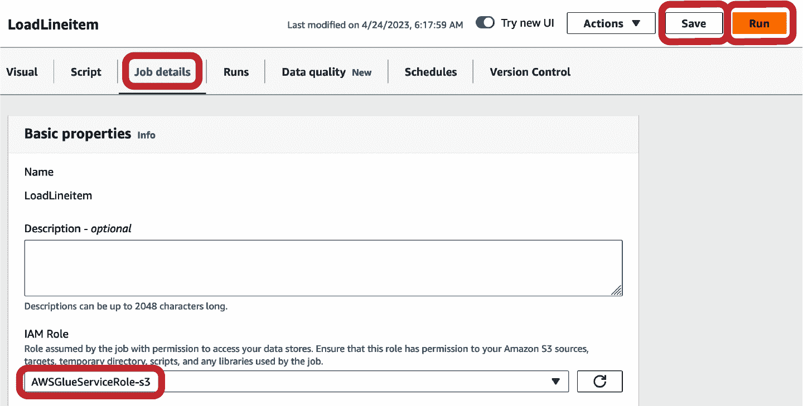

###### 图 4-17\. AWS Glue 设置作业详细信息

您可以通过导航到“运行”选项卡来检查作业运行。您将看到有关作业 ID 和运行统计信息的详细信息（图 4-18）。

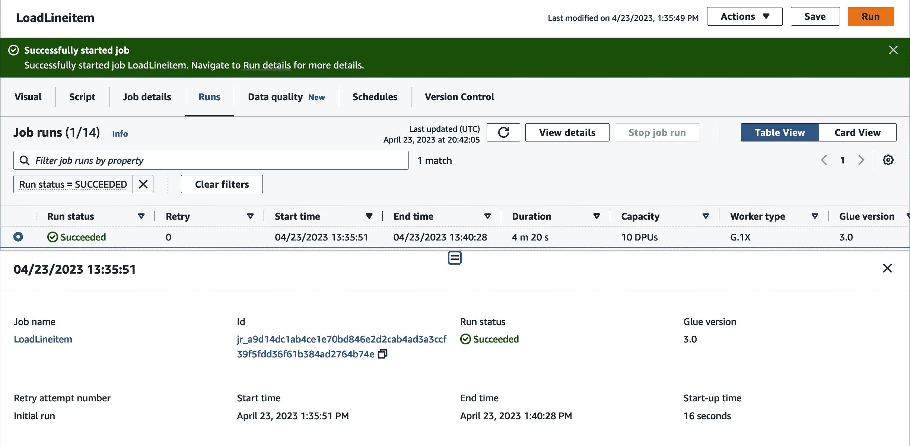

###### 图 4-18\. AWS Glue 作业运行详情

要让 AWS Glue 访问 Amazon S3，如果还没有创建 VPC 终端节点，您需要先创建一个。请参阅[在线文档](https://oreil.ly/440WX)获取更多详细信息。

作业完成后，您可以导航到[Amazon Redshift 控制台](https://oreil.ly/aPeIg)查看查询和加载情况（图 4-19）。您将看到创建临时表、加载 Amazon S3 文件以及执行合并语句以删除旧数据并插入新数据所需的查询。

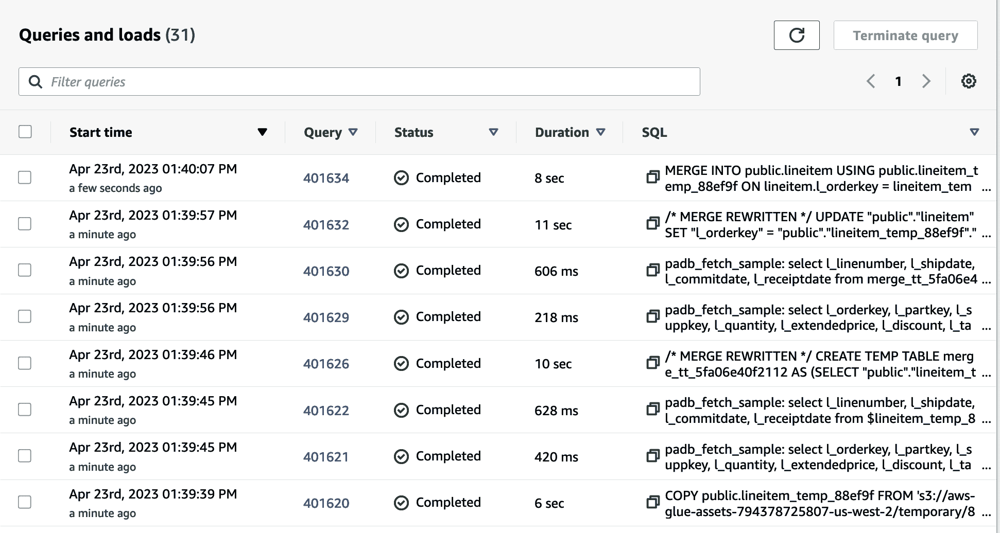

###### 图 4-19\. Amazon Redshift 查询历史

# 摘要

本章描述了使用 Amazon Redshift 转换数据的各种方法。借助 Amazon Redshift 能够访问您加载或未加载的所有数据，您可以快速轻松地转换数据湖、运营来源或其他 Amazon Redshift 数据仓库中的数据。此外，我们展示了如何使用 Amazon Redshift 查询调度程序实现基于时间的调度以编排这些作业。最后，我们介绍了 Amazon Redshift 如何与第三方 ETL 和编排供应商合作，以提供最佳执行性能，并与您组织中可能已有的工具集成。

在下一章中，我们将讨论当您对工作负载进行更改时 Amazon Redshift 如何扩展。我们还将介绍 Amazon Redshift 无服务器数据仓库如何自动扩展，以及您如何控制扩展您的预配数据仓库的方式。此外，我们还将讨论如何通过实施最佳实践在 Amazon Redshift 中获得最佳性价比。
