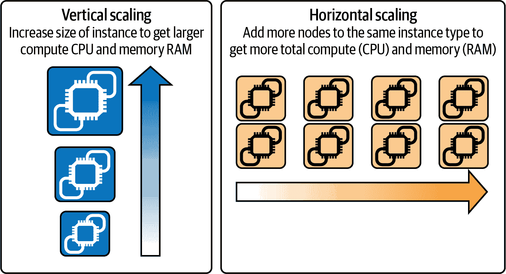
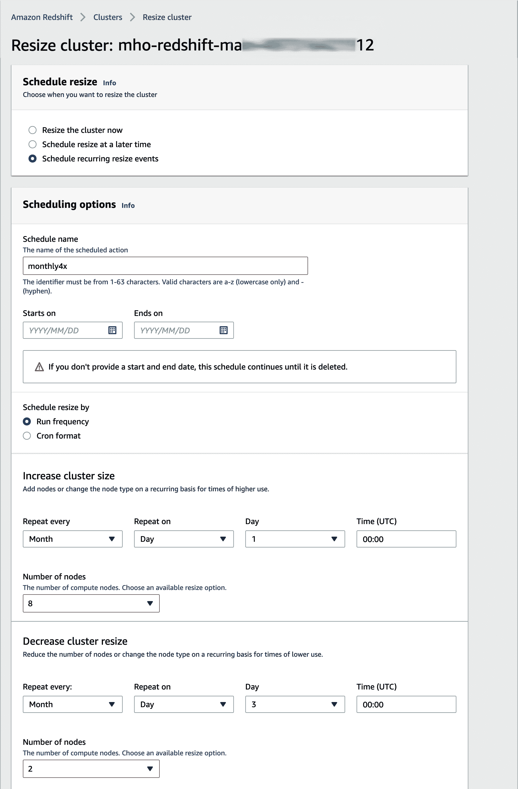
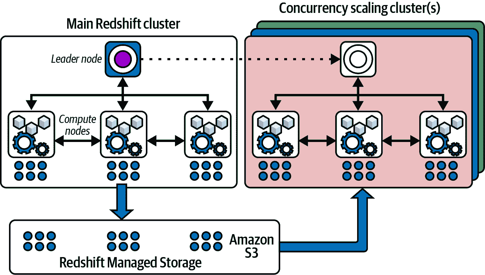
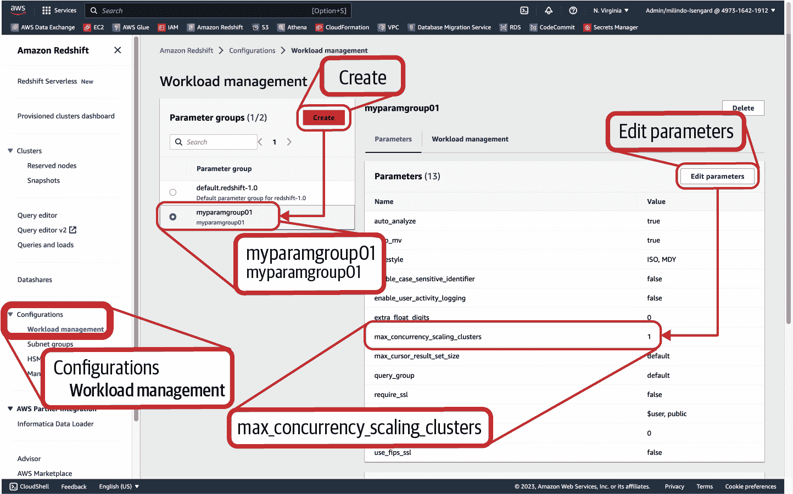
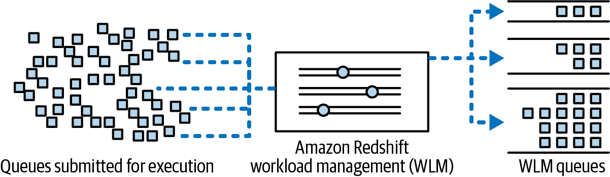
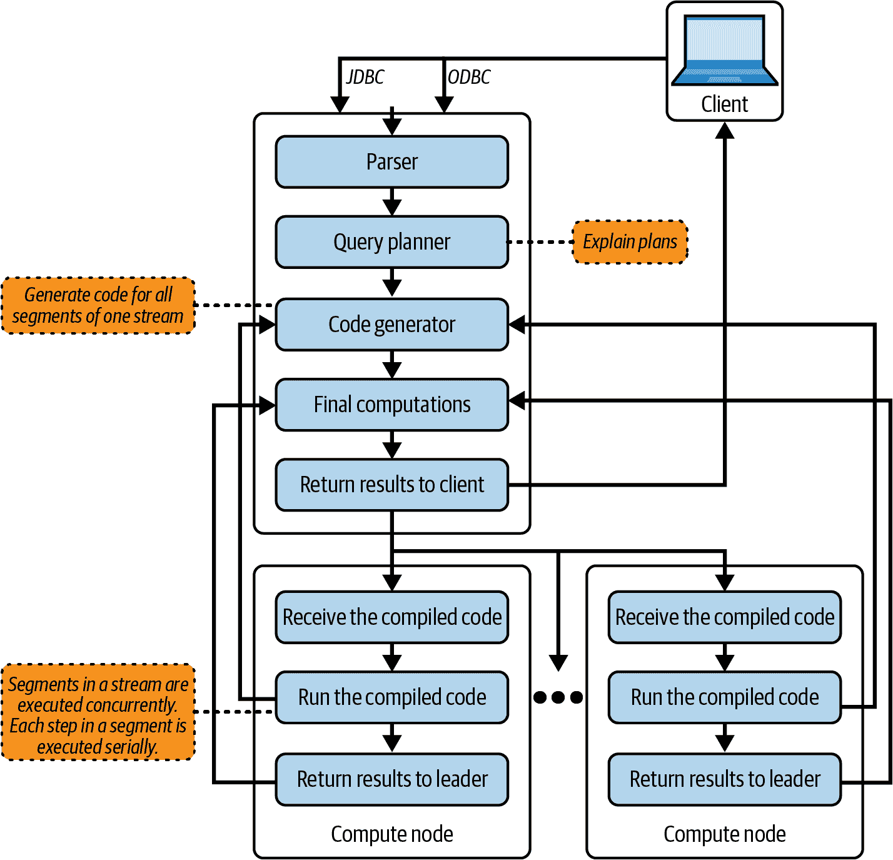
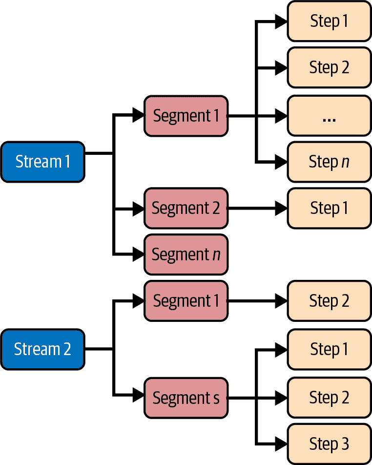
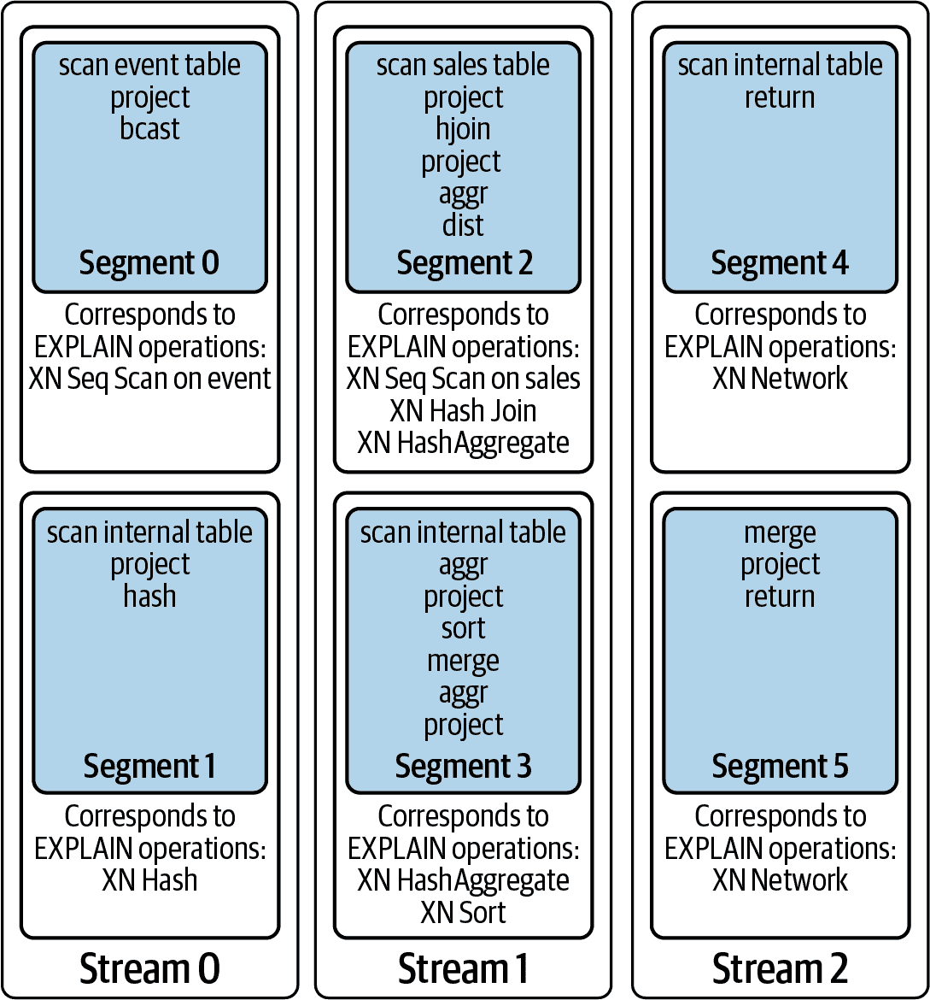
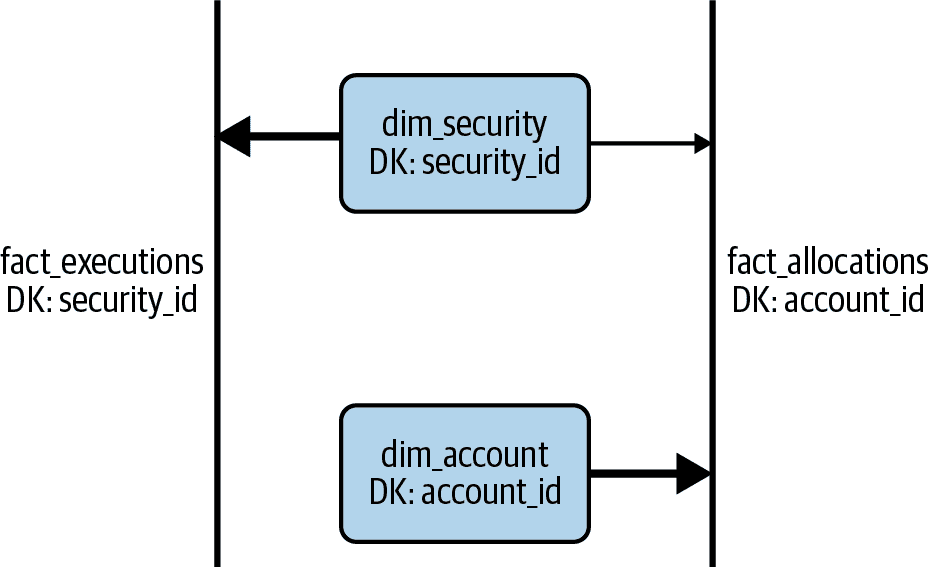

# 第五章：扩展与性能优化

如果我们告诉您唯一不变的是变化，那么很可能我们只是“对牛弹琴”。今天的挑战是您的数据仓库能够多快地适应变化。传统的数据仓库系统，由于资源预配的提前时间，往往很难适应这种变化。通过 Amazon Redshift，适应变化变得容易，无论是存储需求的变化还是计算需求的变化。您可以快速根据需求的增加或减少来进行扩展，而不会产生昂贵的错误决策。

扩展的目标是为了满足工作负载的变化，以维持当前的性能水平和相关的 SLA。如果您向数据仓库添加新的工作负载，则现有的工作负载 SLA 可能会受到影响；这就是扩展发挥作用的地方。如果您分析的数据比以前多，这可能导致工作负载 SLA 显著影响，也可能需要扩展。为了通过 Amazon Redshift 实现您的扩展目标，有两种策略需要考虑：确保您的数据仓库大小正确，并确保您的工作负载经过性能调优。

使用 Amazon Redshift，您可以通过垂直和水平扩展来调整数据仓库的大小（参见 Figure 5-1）。*垂直扩展* 是指通过在单个查询上运行的额外计算来进行“向上”扩展。向上扩展导致 vCPU 或内存总数增加。如果您需要保持现有工作负载的 SLA 并处理额外的工作负载，则通常会“向上”扩展您的数据仓库。垂直扩展通常用于工作负载变化可预测的情况，允许您运行拉取大量行、处理更多连接并管理更长事务的更大查询。*水平扩展* 是指通过添加更多副本来处理额外工作负载的“向外”扩展。当您进行水平扩展时，每个查询可能由独立计算提供服务，从共享数据中读取。水平扩展通常用于工作负载变化不可预测的情况，因为每个单独的查询都会接收相同的计算资源，但系统可以处理更多并发工作负载。

在本章中，我们将向您展示，如果您使用无服务器或者 RA3 预配置的数据仓库，Amazon Redshift 将会自动“扩展存储”。此外，我们将看到，对于无服务器数据仓库，Amazon Redshift 将会根据工作负载“自动扩展您的无服务器数据仓库”，可以是向任何方向。而对于预配置的数据仓库，您可以选择何时以及何种方向“扩展您的预配置数据仓库”。



###### 图 5-1\. 竖向与横向扩展

确保你的 Amazon Redshift 数据仓库大小设置正确非常重要，同样重要的是确保你的工作负载经过调优以提升性能。这两者的结合将确保你充分利用资源，并获得最佳性价比。为了提升工作负载的性能，Amazon Redshift 提供了许多功能，适用于无服务器和预置数据仓库。在本章中，我们将介绍一些最佳实践。我们将描述“WLM，队列和 QMR”，这是预置数据仓库特有的功能。我们将展示“Materialized Views”如何支持不同的访问模式，“Autonomics”如何确保表的良好维护，以及“Workload Isolation”如何确保混合工作负载获得所需的计算资源。接下来，我们将详细介绍查询的执行方式以及如何考虑“Query Tuning”。最后，我们将描述几种“实现最佳性价比的额外优化”。

# 扩展存储

在第二章，“开始使用 Amazon Redshift”中，我们描述了在使用无服务器或 RA3 预置数据仓库时，Amazon Redshift 由 RMS 支持的情况。使用 RMS 的好处在于存储弹性，这意味着你不需要简单地调整计算能力来适应额外的历史数据。考虑到你的数据仓库通常仅对最近 12 个月的数据执行分析工作负载。每天都会添加新数据，但你的计算需求仅限于分析最近 12 个月的数据。在这种情况下，无论你的仓库包含两年数据还是五年数据，你的计算成本都将保持不变。由于你的存储需求增加，你只需支付额外的存储费用。这种情况更为常见，数据仓库最终变成长期存储所有数据的库，但仅对最近的数据进行分析查询。

假设你在四月份的前 15 天内使用 RA3 节点类型的托管存储中存储了 100 GB 的数据，并在四月份的最后 15 天内存储了 100 TB 的数据。

让我们来计算四月份的 GB-hours 使用量。

在四月份的前 15 天，你将有如下使用量：`100 GB` × `15 天` × `24 小时/天` = `36,000 GB-Hours`。

在过去的 15 天中，你将会有如下使用量：`100 TB` × `1024 GB/TB` × `15 天` × `24 小时/天` = `36,864,000 GB-hours`。

四月份结束时，GB-hours 的总使用量是：`36,000 GB-Hours` + `36,864,000 GB-hours` = `36,900,000 GB-hours`。

将其转换为 GB-month：`36,900,000 GB-hours` / 四月份的 `720 小时/月` = `51,250 GB-months`。

考虑 us-east-1 区域，在这里托管存储将按照`$0.024/GB-Month`收费。对于`51,250 GB-month`的月度存储费用将是：`51,250 GB-month` × `$0.024 每 GB-Month` = `$1,230`。

四月份的总 RMS 费用为`$1,230`。

我们这里没有展示计算成本，但无论您的数据增长如何，计算成本都将保持不变。如果您暂停了集群并且没有查询在执行，那么只会应用 RMS 成本。请注意，即使没有查询在执行，直到您删除集群，存储费用也会计入账单。

# 自动缩放您的无服务器数据仓库

Amazon Redshift 无服务器会自动调整您的数据仓库容量，无论您需要扩展还是扩展。在没有活动时，计算资源会在幕后自动关闭，并在加载数据或查询进入时恢复。通过 Amazon Redshift 无服务器，您无需预测工作负载需求或调整计算大小，因为它会根据工作负载变化调整计算资源。在许多情况下，使用无服务器可能会减少执行工作负载所需的总体计算。使用无服务器，Amazon Redshift 将调整计算资源以满足您的工作负载需求。以前因计算资源不足而导致磁盘分页的查询将更快完成，排队等待的查询将不再等待。

计算能力以 RPUs 衡量，并且您按照 RPU-hours 计费，采用每秒计费方式。为了控制成本，您可以指定使用限制，并定义当达到这些限制时 Amazon Redshift 将自动采取的措施。您可以按照 RPU-hours 指定使用限制，并将限制关联到每日、每周或每月的检查。设置更高的使用限制可以提高系统的整体吞吐量，特别是对需要处理高并发同时保持高性能的工作负载而言。详见 第二章，“开始使用 Amazon Redshift”，以了解 Amazon Redshift 无服务器定价示例。

# 扩展您的预配置数据仓库

当您配置 Amazon Redshift 集群时，您可以选择特定的节点类型和节点数量。何时扩展（通过添加更多节点或更改节点类型）以及何时扩展（通过添加并行计算）完全由您决定。通常情况下，当您面对“进化中的计算需求”或“可预测的工作负载变化”时，您会选择扩展，并且在面对“不可预测的工作负载变化”时也会选择扩展。

## 进化中的计算需求

要了解进化中计算的情况，让我们假设您的数据仓库项目非常成功，您正在向其中添加新的分析工作负载，但是您的仓库中的数据仍然与以前一样，因为您正在将旧数据转移到数据湖中。因此，在这种情况下，由于有更多用户查询数据仓库以获取业务见解，您的计算需求正在增长。为了保持与业务用户的相同用户体验和服务级别协议，您可以通过添加更多节点或迁移到更大的节点类型来扩展集群。

在扩展您的集群时，您的存储成本保持不变，因为数据量没有变化。

通过增加节点或更改集群的节点类型来扩展是一个快速的过程，可以通过 AWS 控制台、CLI 或 API 完成。例如，如果您从一个 2 节点 ra3.4xl 集群改为一个 2 节点 ra3.16xl 集群，您的节点规模增加了四倍，从 24 个 vCPU 增加到 96 个 vCPU，并且获得了四倍的计算和内存。同样地，如果您将您的集群从一个 2 节点 ra3.4xl 扩展到一个 8 节点 ra3.4xl，您将获得 96 个 vCPU。通过更改节点类型来扩展可以带来益处，如果您已经达到当前节点类型的限制。例如，想象一下您正在运行一个 64 节点 ra3.4xl 集群。将其扩展为一个 16 节点 ra3.16xl 集群将为您提供相同的总计算资源，但有一个更大的领导节点。

更改节点类型需要从一种计算类型到另一种计算类型的物理数据移动。您必须计划停机时间，跨团队协调，并且向系统、应用程序和用户通报日程，以限制影响。

为了说明扩展如何影响定价，假设您从 2 节点 ra3.4xlarge 集群开始，并增加了新项目，需要在月中的第 15 天调整大小到 5 节点集群。

在前 15 天，您的使用情况如下：`$3.26 每个节点小时` × `2 节点` × `每天 5 小时` × `15 天` = `$489`

在后 15 天，您的使用情况如下：`$3.26 每个节点小时` × `5 节点` × `每天 10 小时` × `15 天` = `$2,445`

四月的总计算费用 = `$2,934`

下列（见示例 5-1）AWS CLI 命令展示如何通过增加节点或选择更大的节点类型来扩展。

##### 示例 5-1\. 使用 CLI 扩展预配置集群

```
# scale up to 4 nodes
aws redshift modify-cluster
  --cluster-identifier mycluster01
  --node-type ra3.4xlarge
  --number-of-nodes 4

# scale up to ra3.16xl cluster
aws redshift modify-cluster
  --cluster-identifier mycluster01
  --node-type ra3.16xlarge
  --number-of-nodes 2
```

### 可预测的工作负载变化

可预测的工作负载变化是指您预期的变化，有一些时间线的概念，并且可以制定采纳计划。可预测的变化可以是前面示例中解释的一次性变化，也可以是定期重复的。比如说，您的稳态工作负载每天处理增量文件。但是每月第一天，您还需要处理上个月的对账文件。现在您已经为每日文件处理优化了您的亚马逊 Redshift 数据仓库，但是您需要在每月的第一天额外的计算来继续及时处理每日增量文件，并且还能处理对账文件。

要处理这种情况，您可以将调整大小作为月度处理作业工作流的一部分，或者您可以计划在每月的第一天进行调整大小（最多增加 4 倍），并在月的第三天将节点数调整回原始数量。一旦计划好，亚马逊 Redshift 将根据您建立的日程表进行缩放。

亚马逊 Redshift 计划程序的 cron 表达式格式为：

```
minute hour dayOfMonth month dayOfWeek year
0 0 1 * ? * # upsize on 1st of every month at midnight
0 0 2 * ? * # downsize on 3rd of every month at midnight
```

您还可以使用内置调度程序安排调整操作，如 Figure 5-2 所示。



###### Figure 5-2\. 定时调整

亚马逊 Redshift 提供两种 [调整集群大小的方法](https://oreil.ly/UEo9E)。弹性调整适合周期性调整。对于永久调整，您可以选择经典调整或弹性调整。

可以查询未记录的表 `stv_xrestore_alter_queue_state` 以监视调整操作的进度。请注意，示例 5-2 中的表仅捕获大于 5 TB 的大规模调整的详细信息。

##### Example 5-2\. 监视调整操作

```
SELECT db_id, status, count(*)
FROM stv_xrestore_alter_queue_state
GROUP BY 1, 2
ORDER BY 3 desc;
```

| db_id | 状态 | 计数 |
| --- | --- | --- |
| 654321 | 等待中 | 456 |
| 654321 | 已完成 | 23 |
| 654321 | 应用中 | 1 |

## 不可预测的工作负载变化

通过调整您的亚马逊 Redshift 数据仓库大小，可以处理可预测的工作负载变化，但不可预测的工作负载峰值可能会成为挑战，因为它们可能具有间歇性的特性。如果您为满足峰值需求而配置集群，则在非高峰时段浪费资源。另一种选择是为典型工作负载进行大小调整，这可能意味着在意外查询出现时需要更长时间以作出重要的业务决策。这就是并发缩放（CS）发挥作用的地方。

亚马逊 Redshift 自动启动额外的扩展集群，以满足不可预测的工作负载峰值，如 Figure 5-3 所示。亚马逊 Redshift 在其所有节点类型上为读取查询提供 CS，对于 RA3 节点类型，还可以为写入查询提供 CS。后续章节详细介绍如何启用此功能以及其位置。

通过配置工作负载管理（WLM）队列来选择哪些查询利用并发缩放，详情请参阅 “WLM、队列和 QMR”。当所有 CS 启用队列中所有等待查询的总等待时间超过一分钟时，将触发 CS。对于那些需要更积极的 CS 的情况，可以通过与 AWS 支持合作来更改这一分钟设置。一旦启动了 CS 集群，那么任何新的查询进入 CS 启用队列时都不再等待，而是直接发送到 CS 集群。



###### Figure 5-3\. 亚马逊 Redshift 并发缩放

通过访问亚马逊 Redshift 控制台的“工作负载管理”部分来控制并发缩放，如 Figure 5-4 所示。虽然您无法编辑 `default.redshift-1.0` 参数组，但可以创建新的参数组并修改 `max_concurrency_scaling_clusters` 参数以控制可以启动的 CS 集群数量。请注意，最多可以为 10 个，但如果您的工作负载需要更多，可以申请增加。我们将在 “参数组” 中深入介绍参数组。

Concurrency Scaling 集群独立运行以执行分配的查询。每个要执行的查询首先需要编译，并且请注意主集群和 CS 集群上的编译缓存是独立的。在查询处理过程中，Amazon Redshift 生成查询段，并检查集群本地缓存中是否有查询段。如果没有，则检查外部代码编译缓存（全局缓存）中是否有查询段。如果有，则从全局缓存下载编译对象到本地缓存；否则，将查询段发送到外部编译农场以使用大规模并行编译，然后存储在外部代码编译缓存和相应的本地编译缓存中。因此，即使 CS 集群在启动时没有查询段，仍然可以利用全局缓存（如果可用），否则将需要从头开始重新编译查询。



###### 图 5-4\. 最大并发扩展集群

使用 Concurrency Scaling，用户查询运行在最新数据上，无论其在主集群还是 CS 集群上运行。只要服务查询，Amazon Redshift 就会不断刷新 CS 集群的最新数据。请注意，CS 有相关成本，但 Amazon Redshift 每 24 小时主集群运行时提供一小时免费 CS 信用。

Concurrency Scaling 集群在几分钟内启动，按秒计费，仅在活动查询时计费，而不是在其被提供或释放时。一旦释放 CS 集群，它们将返回到 Amazon EC2 池中，其中这些 EC2 虚拟机在被重新引入 CS 集群前会进行完全清理和重置。这确保没有残留对象从一个 CS 使用到另一个 CS 使用。

Concurrency Scaling 使用按需定价计费，Amazon Redshift 提供预留实例（RI）定价折扣。因此，如果您发现高 Concurrency Scaling 使用率，则应评估是否通过向 RI 集群添加节点来提升效果更佳。

Concurrency Scaling 成本控制可以直接在 Amazon Redshift 控制台中设置。一旦达到定义的限制，Amazon Redshift 可以将日志记录写入系统表，或者完全关闭 Concurrency Scaling 功能。在达到使用限制时正在执行的任何查询将在 Concurrency Scaling 集群中完成执行，但随后的查询将留在主集群中排队，直到执行。

Concurrency Scaling 限制可以动态更改，无需重新启动集群。截至目前，Concurrency Scaling 功能仅在商业地区可用，并且在 AWS GovCloud 地区不可用。

# WLM、队列和 QMR

典型的组织可能有多种类型的用户，对性能有不同的期望。亚马逊 Redshift 预配置集群的 *工作负载管理*（WLM）功能提供了根据业务优先级运行工作负载的能力（见 图 5-5）。WLM 提供了必要的控制来最大化数据仓库的吞吐量，即在给定时间内处理的查询数量。您可以定义最多八个队列来逻辑上分离正在执行的查询。每个队列都有一个唯一的服务类标识符。标识符 1 到 4 保留用于系统使用，5 用于超级用户队列，15 用于亚马逊 Redshift 的日常运维活动。更多详情请参阅 [WLM 系统表和视图](https://oreil.ly/7nZea)。



###### 图 5-5\. Amazon Redshift WLM 队列

在 图 5-5 中，您可以看到已定义了三个队列，WLM 根据队列分配规则将从左侧进入的查询分配到右侧特定的 WLM 队列。

## 队列分配

亚马逊 Redshift 的默认配置包含一个队列，即默认队列，除非根据分配规则将查询路由到另一个队列，否则所有查询都将在其中执行。

根据匹配逻辑，WLM 将查询分配给队列，方法如下：

1.  如果具有超级用户特权的用户提交查询，并且查询组已设置为超级用户，则分配到超级用户队列。

1.  如果普通用户提交查询，并且匹配到用户组，则分配到匹配的队列。

1.  如果普通用户提交查询，并且匹配到查询组，则分配到匹配的队列。

1.  如果没有找到匹配项，则分配到默认队列。

请参阅 [WLM 队列分配规则](https://oreil.ly/nnBdx) 以获取队列分配的流程图和示例。

如果一个查询匹配多个队列，则将其分配给首个匹配的队列。

每个查询被分配一个执行插槽。插槽是您集群内存或 RAM 的一部分。超级用户队列始终具有并发度为一，无论是手动 WLM 还是自动 WLM。您必须手动将查询组设置为超级用户，才能将您的查询运行在超级用户队列中（见 示例 5-3）。

##### 示例 5-3\. 超级用户队列

```
SET query_group TO 'superuser';
RESET query_group;
```

每个队列可以映射到用户组或查询组。用户组只是用户的逻辑分组，例如，一个名为 `etl_group` 的用户组，其中包含所有个别应用的 ETL 用户，如 `app_1_etl_usr`、`app_2_etl_usr`。查询组是在运行时设置的文本标签（见 示例 5-4）。这通常由使用单个数据库用户 ID 的 BI 工具使用，但希望将某个仪表板查询优先于其他查询。

##### 示例 5-4\. 设置查询组

```
SET query_group TO 'c_level_dashboard';
```

默认情况下，每个查询被分配一个单独的插槽，如果查询能够在分配的内存内完成执行，那么性能会比查询溢出到磁盘时更快。

使用 示例 5-5 查询来检查磁盘溢出的查询。

##### 示例 5-5\. 检查磁盘溢出

```
WITH q_spill AS
  (
  SELECT
      starttime,
      q.query,
      round(nvl(query_temp_blocks_to_disk,0)::decimal/1000,2) spill
  FROM stl_query q
  LEFT JOIN svl_query_metrics_summary m
  USING (query)
  WHERE q.userid >= 100
  )
SELECT
    date_trunc('d',starttime) AS day,
    count(query) AS queries,
    sum(CASE WHEN spill = 0
      THEN 1 ELSE 0 END) AS no_spill,
    sum(CASE WHEN spill > 0 AND
      spill < 5 THEN 1 ELSE 0 END) AS "<5GB",
    sum(CASE WHEN spill
      BETWEEN 5 AND 200 THEN 1 ELSE 0 END) AS "5-200GB",
    sum(CASE WHEN spill
      BETWEEN 201 AND 500 THEN 1 ELSE 0 END) AS "201-500GB",
    sum(CASE WHEN spill
      BETWEEN 501 AND 1000 THEN 1 ELSE 0 END) AS "501GB-1TB",
    sum(CASE WHEN spill > 1000
      THEN 1 ELSE 0 END) AS ">1TB",
    round(max(spill),2) AS max_spill_gb
FROM
    q_spill
GROUP BY 1
ORDER BY 1;
```

分配的插槽数量和每个插槽分配的内存量对查询执行性能至关重要。

您可以使用`wlm_query_slot_count`参数来为大查询（如`VACUUM`）分配更多的插槽，这会暂时降低集群的并发性，直到重置查询插槽计数。这在手动 WLM 以及自动 WLM 模式下均适用。

您可以选择在手动 WLM 中自行设置这些插槽，或者让 Amazon Redshift 在自动 WLM 模式下管理它们。

## 短查询加速

还有一个专门用于短时查询的队列，称为*短查询加速（SQA）队列*。Amazon Redshift 会估计每个查询的执行时间，如果符合条件，则将其发送到 SQA 队列。如果实际查询运行时间超过 SQA 时间，则将查询移到匹配的 WLM 队列之一。只有只读查询符合 SQA 资格。SQA 的服务类标识符为 14。

在手动 WLM 中，您可以指定使查询符合 SQA 资格所需的最大运行时间（秒），但在自动 WLM 中，这将根据您的查询模式由 Amazon Redshift 自动确定。

如果你正在使用手动的 WLM，那么可以使用 SQL 示例 5-6 分析你的工作负载队列，并选择在第 70 到 90 百分位之间设置一个 SQA 阈值。

##### 示例 5-6\. SQA 阈值

```
SELECT
  service_class AS QUEUE,
  count(1) AS queries,
  avg(total_queue_time)/1000000 AS avg_q_sec,
  min(total_queue_time)/1000000 AS min_q_sec,
  max(total_queue_time)/1000000 AS max_q_sec,
  round(percentile_cont(0.7)
    WITHIN group
      (ORDER BY total_queue_time)/1000000,0) AS p70_sec,
  round(percentile_cont(0.9)
    WITHIN group
      (ORDER BY total_queue_time)/1000000,0) AS p90_sec
FROM
  stl_wlm_query
WHERE
  userid >= 100
GROUP BY
  service_class
ORDER BY
  service_class;
```

| 队列 | 查询数 | 平均查询时间（秒） | 最小查询时间（秒） | 最大查询时间（秒） | p70 时间（秒） | p90 时间（秒） |
| --- | --- | --- | --- | --- | --- | --- |
| 5 | 20103 | 23 | 0 | 95 | 15 | 19 |
| 6 | 3421 | 42 | 15 | 32 | 18 | 23 |
| 7 | 42 | 178 | 109 | 466 | 176 | 261 |
| 8 | 196 | 398 | 99 | 1399 | 108 | 206 |

在前面的例子中，设置 SQA 在 15 到 18 之间将允许大多数查询利用 SQA 的优势。

## 查询监控规则

在 Amazon Redshift 的两种 WLM 模式中，都提供了*查询监控规则*（QMR），用于根据某些查询执行规则控制集群行为。您可以使用 16 个系统定义的度量来定义 QMR 条件，Amazon Redshift 还提供了 5 个系统定义的模板，帮助您快速开始使用 QMR。一旦执行中的查询触发了定义的边界，就会触发定义的动作。动作可以是中止、记录、更改查询优先级（仅自动 WLM）、或将查询（仅手动 WLM）跳转到另一个匹配的队列。您可以在所有队列中定义最多 25 个 QMR，每个 QMR 可以评估最多 3 个条件。当规则的所有条件都满足时，WLM 会向`STL_WLM_RULE_ACTION`系统表写入一行。此行包含触发规则的查询的详细信息及其结果动作。

Amazon Redshift 无服务器没有 WLM，但它确实有[查询限制](https://oreil.ly/jywZ-)，其遵循与 QMR 相同的规则逻辑。使用这些功能确保用户不会发出运行失控的查询。

QMR 指标每 10 秒进行评估，因此可能会看到一些规则需要一段时间才能触发。

您可以设置 QMR 以获得有关糟糕查询的通知，并主动采取行动，而不是在用户投诉后再处理延迟问题。使用 QMR 还可以识别用户社区的学习领域，并通过记录编写不佳的查询并进行后续讨论和工作坊来帮助他们提升技术技能。

利用系统表和视图来确定定义 QMR 的阈值。表`STV_QUERY_METRICS`显示*当前运行*查询的指标，表`STL_QUERY_METRICS`记录*已完成*查询的指标，视图`SVL_QUERY_METRICS`显示*已完成*查询的指标，视图`SVL_QUERY_M⁠E⁠T⁠R⁠I⁠C⁠S⁠_​S⁠U⁠M⁠M⁠A⁠R⁠Y`显示*已完成*查询的指标的*最大值*。

对于典型的`BI 队列`，应设置 QMR 以处理嵌套循环连接，这通常由于缺少连接谓词而导致大型笛卡尔积。使用低行数早期查找潜在的运行失控查询。如果专门为简单且运行时间短的查询设置了队列，则包括一个规则，查找返回异常高行数的查询。使用`unload`选项而不是返回数十亿行。

对于典型的`分析师队列`，应设置 QMR 以处理行数较多的连接，这可能表明需要更严格的过滤器。或者在写入中间结果时使用高磁盘使用量，这可能是一个恶意查询的结果，通常也是使用最多磁盘空间的查询。

对于严重违规情况，例如`仪表板队列`，其中查询在 10 秒内完成，应设置 QMR 以在查询执行时间超过 20 秒时中止，这可能表明存在错误查询。

对于典型的`数据科学家队列`，预期存在长时间运行的查询，请设置 QMR 以限制提交到队列并在队列中等待的查询数量。

要开始使用 QMR，Amazon Redshift 提供了准备好的模板，您只需为每个 QMR 自定义阈值。有关详细信息，请参阅[查询监控规则模板](https://oreil.ly/qjn8u)。

最初，您可以使用`log`操作记录各种规则。每周与用户社区进行定期交流，审查已记录的查询并提供调整查询的手段。如果没有改善，然后可以在提醒用户后将操作更改为`abort`。

使用以下 SQL 示例 5-7 揭示数据仓库过去七天的使用模式，这可以帮助您确定最佳的 WLM 配置设置。该查询将按服务类别（也称为工作负载队列）和每小时数据展示`Select`、`UPDATE`、`INSERT`、`DELETE`、`CURSOR`、`CACHED`、`COPY`、`UNLOAD`、`VACUUM` 和 `SYSTEM` 在您的数据仓库上执行的查询。

##### 示例 5-7\. 工作负载队列详细信息

```
SELECT
  service_class,
  query_hour,
  TO_CHAR(
    MAX(CASE WHEN query_type = 'SELECT' THEN qry_cnt ELSE NULL END),
      '999,999') AS "select_query_count",
  TO_CHAR(
    MAX(CASE WHEN query_type = 'SELECT' THEN exec_s ELSE NULL END),
      '999,999') AS "select_exec_seconds",
  TO_CHAR(
    MAX(CASE WHEN query_type = 'SELECT' THEN queue_s ELSE NULL END),
      '999,999') AS "select_queue_seconds",
  TO_CHAR(
    MAX(CASE WHEN query_type = 'INSERT' THEN qry_cnt ELSE NULL END),
      '999,999') AS "insert_count",
  TO_CHAR(
    MAX(CASE WHEN query_type = 'INSERT' THEN exec_s ELSE NULL END),
      '999,999') AS "insert_exec_seconds",
  TO_CHAR(
    MAX(CASE WHEN query_type = 'INSERT' THEN queue_s ELSE NULL END),
      '999,999') AS "insert_queue_seconds",
  TO_CHAR(
    MAX(CASE WHEN query_type = 'UPDATE' THEN qry_cnt ELSE NULL END),
      '999,999') AS "update_count",
  TO_CHAR(
    MAX(CASE WHEN query_type = 'UPDATE' THEN exec_s ELSE NULL END),
      '999,999') AS "update_exec_seconds",
  TO_CHAR(
    MAX(CASE WHEN query_type = 'UPDATE' THEN queue_s ELSE NULL END),
      '999,999') AS "update_queue_seconds",
  TO_CHAR(
    MAX(CASE WHEN query_type = 'DELETE' THEN qry_cnt ELSE NULL END),
      '999,999') AS "delete_count",
  TO_CHAR(
    MAX(CASE WHEN query_type = 'DELETE' THEN exec_s ELSE NULL END),
      '999,999') AS "delete_exec_seconds",
  TO_CHAR(
    MAX(CASE WHEN query_type = 'DELETE' THEN queue_s ELSE NULL END),
      '999,999') AS "delete_queue_seconds",
  TO_CHAR(
    MAX(CASE WHEN query_type = 'CURSOR' THEN qry_cnt ELSE NULL END),
      '999,999') AS "cursor_count",
  TO_CHAR(
    MAX(CASE WHEN query_type = 'CURSOR' THEN exec_s ELSE NULL END),
      '999,999') AS "cursor_exec_seconds",
  TO_CHAR(
    MAX(CASE WHEN query_type = 'CURSOR' THEN queue_s ELSE NULL END),
      '999,999') AS "cursor_queue_seconds",
  TO_CHAR(
    MAX(CASE WHEN query_type = 'CACHED' THEN qry_cnt ELSE NULL END),
      '999,999') AS "cached_query_count",
  TO_CHAR(
    MAX(CASE WHEN query_type = 'COPY' THEN qry_cnt ELSE NULL END),
      '999,999') AS "copy_count",
  TO_CHAR(
    MAX(CASE WHEN query_type = 'COPY' THEN exec_s ELSE NULL END),
      '999,999') AS "copy_exec_seconds",
  TO_CHAR(
    MAX(CASE WHEN query_type = 'COPY' THEN queue_s ELSE NULL END),
      '999,999') AS "copy_queue_seconds",
  TO_CHAR(
    MAX(CASE WHEN query_type = 'UNLOAD' THEN qry_cnt ELSE NULL END),
      '999,999') AS "unload_count",
  TO_CHAR(
    MAX(CASE WHEN query_type = 'UNLOAD' THEN exec_s ELSE NULL END),
      '999,999') AS "unload_exec_seconds",
  TO_CHAR(
    MAX(CASE WHEN query_type = 'UNLOAD' THEN queue_s ELSE NULL END),
      '999,999') AS "unload_queue_seconds",
  TO_CHAR(
    MAX(CASE WHEN query_type = 'VACUUM' THEN qry_cnt ELSE NULL END),
      '999,999') AS "vacuum_count",
  TO_CHAR(
    MAX(CASE WHEN query_type = 'VACUUM' THEN exec_s ELSE NULL END),
      '999,999') AS "vacuum_exec_seconds",
  TO_CHAR(
    MAX(CASE WHEN query_type = 'VACUUM' THEN queue_s ELSE NULL END),
      '999,999') AS "vacuum_queue_seconds",
  TO_CHAR(
    MAX(CASE WHEN query_type = 'OTHER' THEN qry_cnt ELSE NULL END),
      '999,999') AS "system_query_count",
  TO_CHAR(
    MAX(CASE WHEN query_type = 'OTHER' THEN exec_s ELSE NULL END),
      '999,999') AS "system_exec_seconds",
  TO_CHAR(
    MAX(CASE WHEN query_type = 'OTHER' THEN queue_s ELSE NULL END),
      '999,999') AS "system_queue_seconds"
FROM
    (SELECT
      NVL(w.service_class,14) service_class,
      CASE
        WHEN w.query IS NULL
            THEN 'CACHED'
        WHEN q.userid = 1
            THEN 'OTHER'
        WHEN REGEXP_INSTR("querytxt", '(padb_|pg_internal)')
            THEN 'OTHER'
        WHEN REGEXP_INSTR("querytxt", '[uU][nN][dD][oO][iI][nN][gG]')
            THEN 'OTHER'
        WHEN REGEXP_INSTR("querytxt", '[uU][nN][lL][oO][aA][dD] ')
            THEN 'UNLOAD'
        WHEN REGEXP_INSTR("querytxt", '[cC][uU][rR][sS][oO][rR] ')
            THEN 'CURSOR'
        WHEN REGEXP_INSTR("querytxt", '[fF][eE][tT][cC][hH] ')
            THEN 'CURSOR'
        WHEN REGEXP_INSTR("querytxt", '[dD][eE][lL][eE][tT][eE] ')
            THEN 'DELETE'
        WHEN REGEXP_INSTR("querytxt", '[cC][oO][pP][yY] ')
            THEN 'COPY'
        WHEN REGEXP_INSTR("querytxt", '[uU][pP][dD][aA][tT][eE] ')
            THEN 'UPDATE'
        WHEN REGEXP_INSTR("querytxt", '[iI][nN][sS][eE][rR][tT] ')
            THEN 'INSERT'
        WHEN REGEXP_INSTR("querytxt", '[vV][aA][cC][uU][uU][mM][ :]')
            THEN 'VACUUM'
        WHEN REGEXP_INSTR("querytxt", '[sS][eE][lL][eE][cC][tT] ')
            THEN 'SELECT'
        ELSE 'OTHER'
      END AS query_type,
      DATEPART(hour, q.starttime) AS query_hour,
      COUNT(1) AS qry_cnt,
      ROUND(SUM(w.total_exec_time)::NUMERIC/1000000,0) AS exec_s,
      ROUND(SUM(w.total_queue_time)::NUMERIC/1000000,0) AS queue_s
    FROM
        stl_query     q
    LEFT
    JOIN stl_wlm_query w
      ON q.userid = w.userid
     AND q.query = w.query
    WHERE
      q.endtime >= DATEADD(day, -7, CURRENT_DATE)
    AND q.userid > 1
    AND NVL(w.service_class,14) > 4
    GROUP BY
      service_class,
      query_type,
      query_hour
  )
GROUP BY
  service_class,
  query_hour
ORDER BY
  service_class,
  query_hour;
```

## 自动 WLM

*自动 WLM* 是启动 Amazon Redshift 时启用的默认模式。使用自动 WLM，您让 Amazon Redshift 动态地自动分配总插槽数和内存到每个插槽。您可以创建最多八个队列，服务类别标识符为 100 到 107\. 您为每个队列分配从最低到最高的优先级，如果有查询在多个队列之间争夺资源，则优先级较高的查询将优先于优先级较低的查询，以确保最重要的查询不会被较不重要的查询耗尽资源。在执行资源密集型查询时，您希望较低的并发性和每个查询更多的内存，反之，当执行较轻的查询时，您希望更高的并发性以执行更多的查询。自动 WLM 的关键目的是在任何时间点容纳和执行尽可能多的查询。

虽然在 AWS 控制台中未显示，但无服务器数据仓库使用自动 WLM 确保为每个查询分配适合其需求的资源。

自动 WLM 尊重您为队列关联的优先级，并相应地优先处理优先级较高的查询。因此，您必须确保将业务优先级与队列优先级关联起来。例如，假设业务优先级是获取最新数据，那么可以定义 ETL 队列的优先级高于报告队列。Amazon Redshift 将根据正在执行的查询的相对大小需要调节集群并发性。如果正在执行重型 ETL 查询，Amazon Redshift 将检测到每个查询的高资源需求，并减少同时运行的查询数。相反，当执行较轻的仪表板查询时，Amazon Redshift 将检测到每个查询的低资源需求，并增加同时运行的查询数。您还可以为每个队列启用并发扩展，并通过扩展您的集群实现更高的吞吐量。如果您的集群正在执行所有较高优先级查询和新查询，则在没有并发扩展的情况下，这些新查询将必须等待当前查询完成。

Amazon Redshift 提供了六种优先级，如下所列：

1.  最低

1.  低

1.  普通

1.  高

1.  最高

1.  临界

您可以将前五个任意关联到 WLM 队列。关键优先级只能由超级用户在查询或会话级别应用。只有一个查询可以以关键优先级执行。

默认情况下，自动 WLM 定义了五个重型槽和五个轻型槽。重型槽分配了集群内存的 95%，轻型槽获得剩余的 5%内存。随着工作负载查询的到来，这些槽会被利用，并在需要时创建更多槽。较少的槽意味着每个槽的内存增加，这对于重型查询是有利的；而更多的槽意味着减少每个槽的内存，适用于轻型查询。五个轻型槽专门为短时间运行的查询保留，而重型查询无法使用这些槽。但是，如果五个重型槽空闲，轻型查询可以使用这些槽。

您可以查询未记录的视图 `stl_wlm_auto_concurrency`，以了解有关自动 WLM 并发性的信息。

##### 示例 5-8\. 检查自动 WLM 并发性

```
select
  now,
  heavy_slots AS hs,
  heavy_queries_finished AS hqf,
  heavy_queries_exec_time AS hqe,
  heavy_queries_queued AS hqq,
  light_slots AS ls,
  light_queries_finished AS lqf,
  light_queries_exec_time_sec AS lqe,
  light_queries_queued AS lqq
FROM
  stl_wlm_auto_concurrency
WHERE
  NOW BETWEEN '2023-01-16 21:08:00' AND '2023-01-16 21:33:00'
ORDER BY 1;
```

| now | hs | hqf | hqe | hqq | ls | lqf | lqe | lqq |
| --- | --- | --- | --- | --- | --- | --- | --- | --- |
| 1/16/23 9:09:53 PM | 5 | 17 | 1.78 | 0 | 5 | 4 | 0.03 | 0 |
| 1/16/23 9:11:54 PM | 20 | 411 | 683.69 | 12 | 5 | 96 | 14.73 | 10 |
| 1/16/23 9:13:55 PM | 20 | 375 | 562.20 | 23 | 5 | 113 | 15.60 | 16 |
| 1/16/23 9:15:58 PM | 17 | 418 | 552.47 | 11 | 5 | 152 | 21.61 | 18 |
| 1/16/23 9:19:00 PM | 20 | 352 | 720.27 | 63 | 5 | 90 | 15.30 | 10 |
| 1/16/23 9:22:02 PM | 20 | 445 | 757.10 | 44 | 5 | 119 | 17.91 | 38 |
| 1/16/23 9:24:03 PM | 20 | 414 | 719.95 | 25 | 5 | 87 | 13.24 | 12 |
| 1/16/23 9:26:05 PM | 20 | 356 | 335.15 | 13 | 5 | 98 | 6.45 | 9 |
| 1/16/23 9:28:06 PM | 13 | 482 | 355.50 | 9 | 5 | 130 | 9.05 | 9 |
| 1/16/23 9:30:07 PM | 10 | 217 | 183.45 | 1 | 5 | 91 | 6.33 | 0 |
| 1/16/23 9:31:08 PM | 7 | 131 | 79.04 | 0 | 5 | 44 | 3.83 | 0 |
| 1/16/23 9:32:06 PM | 5 | 27 | 33.81 | 0 | 5 | 8 | 1.43 | 0 |

如果高优先级查询需要资源而没有可用资源，则自动 WLM 有可能终止尚未开始返回数据的低优先级查询。

当您的工作负载动态变化且希望根据不同用户或工作负载的业务优先级来驱动工作负载时，建议使用自动 WLM。自动 WLM 可以最大化集群资源，并尽可能并发执行尽可能多的查询。强烈建议在使用自动 WLM 时设置 QMR，详见“查询监控规则”，以防止某个恶意查询耗尽所有资源。

## 手动 WLM

使用*手动 WLM*，你可以更好地控制每个查询的并发性和内存分配。如果你有一个需要 24-7 专用资源的工作负载，那么你可以使用手动 WLM。例如，当你有一个一直进行数据摄取的 ETL 流水线时，你可以设置一个分配了一定百分比内存的队列。与自动 WLM 类似，你可以创建最多八个手动 WLM 队列。主要区别在于你可以手动控制每个队列的槽位数量和分配的内存百分比。你可以创建八个队列，服务类别标识符为 6 至 13。建议在所有手动 WLM 队列中总共使用 15 个槽位。

手动 WLM 仅适用于专用数据仓库。无服务器数据仓库使用自动 WLM。

如果你的仓库有`300 GiB`内存，并且你已经为`ETL`队列设置了`40%`的内存，每个查询将分配`300 x 0.40 / 3 = 40 GiB`的内存。如果查询需要超过 40 GiB，那么查询将溢出到磁盘并且执行时间会变长。在手动 WLM 模式下，内存为每个队列槽位保留，如果超过定义的槽位的查询进来，它们将排队等待执行。要扩展每个队列分配的内存，你可以启用并发扩展。并发扩展针对每个队列启用，并且只有当特定队列填满时，查询才会路由到扩展集群。

在手动 WLM 模式下，一旦一个队列的所有槽位被占用，后续查询必须等待，即使另一个队列有可用的空闲槽位。

推荐在你非常熟悉工作负载并且希望最大程度控制集群资源时使用手动 WLM。但它可能导致资源利用率不高。具有非常一致和可重复工作负载的实例是手动 WLM 的候选者，但每次引入新的工作负载时，如果工作负载有定义的 SLA，应重新评估手动槽位和内存分配。如果新的工作负载没有严格的 SLA，则可以进入默认队列，并在执行时完成。

当你注意到自动 WLM 大量向磁盘溢出或者大量排队而系统可以使用更多槽位时，你应考虑使用手动 WLM。请注意，虽然手动 WLM 需要更多的管理工作，但它可能会提供更好的成本优化。在大量溢出的情况下，成本更高但更容易管理的选项是扩展集群。在不溢出但排队大量的情况下，一种选择是使用更多的并发扩展，但这可能会变得昂贵，因此手动 WLM 可以提供更好的成本优化。

如果您定义了手动 WLM 并且未分配 100% 的总内存，则 Amazon Redshift 将未分配的部分分配给需要更多内存的任何队列。这可以被视为一种混合 WLM 模式，在此模式下，您从每个队列的最小内存分配开始，并允许 Amazon Redshift 在您的手动设置之上进行一些自动内存分配。

表 5-1 总结了自动 WLM 和手动 WLM 的特性。

表 5-1\. 自动 WLM 对比手动 WLM

| 特性 | 自动 WLM | 手动 WLM | 附加信息 |
| --- | --- | --- | --- |
| 定义队列优先级 | 是 | 否 | 队列优先级仅在自动 WLM 中可用。 |
| 定义队列并发性 | 否 | 是 | 队列中的槽位数量仅在手动 WLM 中可用。 |
| 定义队列内存分配 | 否 | 是 | 队列内存量仅在手动 WLM 中可用。 |
| 每个查询过度分配内存 | 否 | 是 | 如果您在手动 WLM 中定义的槽位过少。 |
| 每个查询过度分配内存 | 否 | 是 | 如果您在手动 WLM 中定义的槽位过多。 |
| 同时执行的最大查询数 | 动态 | 固定 | 在手动 WLM 中，所有队列定义的总槽位数是将执行的最大查询数。 |
| 按队列定义查询优先级 | 是 | 否 | 在手动 WLM 中，队列上的更多槽位意味着更低的优先级，而较少的槽位意味着更高的优先级。 |
| 查询溢出到磁盘 | 较低 | 较高 | 自动 WLM 通过限制并发性来允许更少的查询，因此更多的内存被分配给每个查询。在手动 WLM 中，您必须基于每个查询分配更多的槽位。 |
| 定义短查询时间 | 自动 | 是 | 在手动 WLM 中，您可以选择 1 到 20 秒之间的时间。 |
| QMR 操作：跳跃 | 否 | 是 | WLM 会根据 WLM 队列分配规则尝试将查询路由到下一个匹配的队列。但是，如果没有匹配到其他队列定义，则查询会被取消，而不会分配到默认队列。 |
| 并发扩展 (CS) | CS 集群使用自动 WLM | CS 集群限制为 5 个槽位 | 如果启用了多个 CS 集群，则可以为主集群创建额外的集群。 |

WLM 的目标是管理在您的数据仓库上执行的查询的资源。您可以查询 Amazon Redshift 系统表以分析您的工作负载，并相应地设置 WLM 配置。

使用查询 示例 5-9 来查看每小时的查询执行统计信息。

##### 示例 5-9\. 每小时查询执行统计

```
SELECT DATE_TRUNC('hour',starttime) AS start_hour
     , MIN(starttime)               AS first_query_start_time
     , MAX(starttime)               AS last_query_start_time
     , COUNT(*)                     AS query_count
FROM stl_query
WHERE userid > 1
GROUP BY start_hour
ORDER BY start_hour DESC
;
```

使用查询 示例 5-10 来了解每个队列或服务类的峰值内存。注意，您还可以按 `service_class_start_time` 列过滤特定日期和时间范围。

##### 示例 5-10\. 峰值内存估算

```
SELECT
    w.service_class,
    COUNT(*) query_count,
    ROUND(PERCENTILE_CONT(0.25)
      WITHIN GROUP
        (ORDER BY est_peak_mem)/1024²,0)::INT AS prcntl25_mb,
    ROUND(PERCENTILE_CONT(0.50)
      WITHIN GROUP
        (ORDER BY est_peak_mem)/1024²,0)::INT AS prcntl50_mb,
    ROUND(PERCENTILE_CONT(0.75)
      WITHIN GROUP
        (ORDER BY est_peak_mem)/1024²,0)::INT AS prcntl75_mb,
    ROUND(PERCENTILE_CONT(0.90)
      WITHIN GROUP
        (ORDER BY est_peak_mem)/1024²,0)::INT AS prcntl90_mb,
    ROUND(PERCENTILE_CONT(0.95)
      WITHIN GROUP
        (ORDER BY est_peak_mem)/1024²,0)::INT AS prcntl95_mb,
    ROUND(PERCENTILE_CONT(0.99)
      WITHIN GROUP
        (ORDER BY est_peak_mem)/1024²,0)::INT AS prcntl99_mb,
    ROUND(MAX(est_peak_mem)/1024²,0)::INT AS p100_mb
FROM stl_wlm_query w
WHERE w.userid > 1
GROUP BY w.service_class
ORDER BY w.service_class
;
```

如果您需要确保多个工作负载同时执行，并且不能为这些工作负载队列设置不同的优先级，那么您有两个选择。一个选项是使用手动 WLM，第二个选项是创建两个单独的集群，从而隔离这两个工作负载，并在每个集群上使用自动 WLM 进行数据共享。通过第二种方法，您可以最大化每个工作负载在其自己隔离的集群上的吞吐量，并仍然确保资源的充分利用。第七章 对此进行了详细讨论。

## 参数组

*参数* 是设置的一个值，例如 `auto_mv`，可以是 `true` 或 `false`。而 *参数组* 则是这些参数的集合（参见 图 5-4）。参数组仅适用于预置数据仓库。参数组适用于与参数组关联的集群上的所有数据库。Amazon Redshift 自带一个无法编辑的默认参数组，但您可以创建一个新的参数组并自定义数据库设置。

您可以创建多个参数组，每个参数组具有不同的数据库参数设置值。您可以将参数组关联到一个或多个集群。通过修改参数组，您可以更改使用相同参数组的所有集群的配置。某些 WLM 属性是静态的，需要重新启动，而其他属性是动态的，并立即生效。

在 示例 5-11 中，您可以看到如何使用 modify-cluster CLI 命令来更改参数组。

##### 示例 5-11\. 修改集群的 AWS CLI 命令

```
aws redshift modify-cluster
  --cluster-identifier mycluster01
  --cluster-parameter-group-name pg_bi
```

您可以为写重的 ETL 工作负载设置一个参数组，并为读重的 BI 工作负载设置另一个参数组。如果在这两个参数组中仅仅选择动态属性，则可以有效地在不需要重新启动的情况下将集群从一种配置切换到另一种配置。这种策略被应用于基于 ETL/BI 时间窗口配置您的集群，尽管自动 WLM 会动态地为您执行此操作。

## WLM 动态内存分配

在每个队列中，WLM 创建与队列设置的并发限制相同数量的槽。然后，分配给队列的内存会按照每个槽平均分配。如果更改了内存分配或并发性，Amazon Redshift 将动态管理向新 WLM 配置的过渡。活动查询继续使用已经分配的内存直至完成。

工作负载管理器执行以下步骤进行转换：

1.  计算每个槽的新内存分配。

1.  空闲槽释放其先前分配的内存。

1.  活动槽在查询完成并随后释放关联内存时执行。

1.  只要有足够的内存可用，新的槽就会立即添加。

1.  一旦所有先前运行的查询完成，新的 WLM 配置的过渡就完成了，插槽数等于新的并发级别。

实际上，在发生变化时正在运行的查询继续使用原始的内存分配。当变化发生时排队的查询将被路由到新的插槽，随着可用的插槽变多。由于亚马逊 Redshift 的内存分配的动态特性，您可以在参数组中更改 WLM 队列的内存分配百分比，而无需重新启动。

# 物化视图

*物化视图*（MV）是加速资源密集型连接查询的强大工具，这些查询具有重复性和可预测性。典型用例包括具有昂贵连接和聚合的仪表板查询。物化视图存储基础查询的结果。这与普通数据库视图不同，后者仅存储查询定义，每次访问视图时执行视图查询。

亚马逊 Redshift 查询优化器会自动识别可以使用的现有物化视图以满足请求。然后透明地重写请求以使用物化视图。查询直接访问物化视图，而不是底层详细表。这种自动查询重写功能意味着一旦编写应用程序查询，就无需更改即可利用新创建的 MV。

MV 可以建立在其他 MV 之上，因此允许您为不同的聚合级别创建不同的 MV，因此可以使用一个或另一个 MV 更快地满足最终用户查询的任何聚合形式。请注意，刷新 MV 不是一个级联过程，因此应从最深的 MV 开始刷新，并保持 MV 向上工作刷新。

MV 保持截至其上次刷新时间戳的数据点。亚马逊 Redshift 支持快速增量刷新，它跟踪基表的变化并仅拉取受影响的记录。如果一个 MV 不符合增量刷新条件，则在刷新时将完全重新计算。您可以在加载基表后立即刷新 MV，以确保 MV 始终具有最新结果，并始终可以使用自动查询重写功能提供查询结果。

以下表提供有关 MV 的关键信息：

`STV_MV_INFO` 表

每个 MV 的行，无论数据是否过时，以及其状态信息

`STL_MV_STATE` 视图

每个物化视图的每个状态转换都包含一行

`SVL_MV_REFRESH_STATUS` 视图

每个物化视图刷新活动的行

当从数据湖中的外部表查询外部表时，执行大表连接可能是一个昂贵的操作。一种优化技术是在 Amazon Redshift 中创建带有外部表聚合数据的物化视图。如果需要更深入的分析的行级数据，则可以通过外部表查询随时访问各个文件。

# 自主性

Amazon Redshift 的自动调整能力由机器学习赋予。Amazon Redshift 根据最佳实践为其许多架构设置建立智能默认值，并根据启发式自动调整物理数据布局。这些在本节中归入自主性的范畴。

表`SVL_AUTO_WORKER_ACTION`记录了 Amazon Redshift 执行的所有自动优化活动。

## 自动表优化器和智能默认值

*自动表优化* 是一种自动调整能力，通过应用排序和分布键自动优化表的设计，无需管理员干预。自动表优化器（ATO）会自动选择使用`AUTO`分布样式和排序键来定义您的表的最佳分布样式和排序键。

通过使用自动化调整表的设计，您可以更轻松地开始，并快速获得最快的性能，而无需投入时间手动调整和实施表优化。通常在表上定义的主键（PK）是一个没有重复项的高基数列，因此主键是作为分布键使用的一个良好候选项，并且智能默认算法会将其应用为表的自动分布键。

另外，即使主键尚未参与连接，Amazon Redshift Advisor 也会应用启发式方法来进行推荐。这将确保尽早做出推荐而不是之后。一旦有更多的工作负载数据可用，顾问可以做出更好的建议。具有复合主键的表，通常是事实表，不会基于启发式方法做出推荐，因为事实表的外键通常引用维表的主键，并且当存在多个维表时，根据工作负载中实际的连接来做出推荐更好。一旦可以分析这种工作负载模式，ATO 工作程序可能会选择在连接中最常使用的分布键。

如果选择了自动 DK，ATO 工作程序将实施的另一种优化是从基于 PK 的分布迁移到小表的 ALL 类型分布。这是一种有效的优化，因为通常维表在许多连接中使用，与事实表相比，行数较少。修改小表的分布样式可确保连接共同位置和更好的性能，例如使用 ALL 分布样式的日历维度。

## 自动真空

自动清理工作者后台进程执行两项任务。首先是自动清理删除，用于回收被前面的更新和删除操作标记为删除的行占用的磁盘空间。其次是自动清理排序，按照表格定义的排序关键列对物理数据块进行排序。如果一个表已经有 95%以上是排序的，那么自动清理工作者将跳过对该表的排序。

示例 5-12 查询提供了样本表格的无序度。

##### 示例 5-12\. 表格排序效益

```
SELECT
  "table",
  unsorted,
  vacuum_sort_benefit,
  tbl_rows,
  estimated_visible_rows
FROM
  svv_table_info
ORDER BY 1;

 table | unsorted | vacuum_sort_benefit | tbl_rows | estimated_visible_rows
-------+----------+---------------------+----------+----------------------
 sales |    85.71 |                   5 | 17686548 | 17601203
 event |    35.24 |                  67 | 27586582 | 27486080
(2 rows)
```

销售表格非常无序（86%），但从排序清理中获益很少（5%）。`event`表格相对较少无序（35%），但对查询的排序行为有很大的好处（67%）。

Amazon Redshift 每小时都会继续寻找执行清理的机会，而自动清理工作者的阈值基于用户查询占用的 WLM 槽位数量。只要超过一半的 WLM 槽位可用，自动清理工作者将分配自身 100 MB 的内存，加载表格的 100 个数据块，并开始操作。每次迭代后，它会评估 WLM 状态并继续另一批处理。如果用户查询到达并且超过 50%的 WLM 槽位被用户查询占用，则自动清理工作者将终止。任何部分完成的工作将被丢弃，下次自动清理工作者将重新分配 100 MB，但之前完成的工作将被保存。相比之下，如果用户发出`VACUUM`命令，则同一清理工作者将开始工作，但这次不会检查 50%的 WLM 槽位，而是会一直执行清理工作直至完成。

`recluster`选项对部分无序的表格进行排序。已经通过自动清理排序的表格部分将保持不变。该选项不会将新排序的数据与已排序区域合并，也不会回收所有标记为删除的空间。如果你有频繁的数据导入，并且查询只访问最新数据，那么使用`recluster`选项。

用户查询可以在自动或手动清理过程中访问表格。在表格被清理时，你可以执行`select`和`insert`操作，但如果在清理过程中运行`update`或`delete`，那么`VACUUM`和`update`或`delete`操作可能会花费更长时间。

如果需要为特定表格优先进行清理，并且有空闲的计算资源，那么使用`BOOST`选项，它会为清理操作分配多个槽位，以便更快地完成。

如果一个大表格非常无序，那么深拷贝可能比空操作更快，因为深拷贝一次性操作整个表格，而空操作则分块进行。这也意味着在深拷贝操作期间，你的存储空间会加倍。

提供了表格`my_tbl`的深拷贝示例，详见示例 5-13。

##### 示例 5-13\. 深拷贝

```
CREATE TABLE new_tbl (LIKE my_tbl);
INSERT INTO new_tbl (SELECT * FROM my_tbl);
DROP TABLE my_tbl;
ALTER TABLE new_tbl rename TO my_tbl;
```

在`insert`步骤期间对`my_tbl`进行的任何数据更改对深度复制操作不可见。因此，在深度复制操作期间，您需要跟踪更改并自行应用它们。更好的选择是在最小或无活动期间执行此操作，例如您的计划维护窗口。

## 自动真空排序

自动真空排序通过表的定义排序键列保持表数据按排序顺序排列。它还检查 50%的 WLM 槽空闲情况，并在可用时从 WLM 借用 3 GB 内存。然后在数据块中执行物理数据排序，并与自动真空工作器协同工作。它通过分析查询模式使用机器学习优先对表的哪些块进行排序。如果明确在给定表上运行真空排序有益处，则 Amazon Redshift Advisor 将提供建议。请参考示例 5-12 获取真空排序的效益。

## 自动分析

自动分析工作器生成或更新用于选择更好查询性能的最佳查询执行计划的表统计元数据。在数据仓库空闲且超过 10 分钟无活动时运行。自动分析是增量进行的，用户发出的分析命令将自动跳过已经是最新统计数据的表。

典型的数据仓库表具有许多列，这些列主要在`SELECT`子句中使用，而在`JOIN`和`FILTER`中使用的列相对较少。使用分析命令选项`PREDICATE COLUMNS`来分析仅在查询中用作谓词的列，例如分布键列、排序键列以及在`JOIN`、`FILTER`或`GROUP BY`子句中使用的列。此选项通过收集对查询性能影响最大的列的统计信息提供最大的收益。如果没有列被标记为谓词列，例如因为尚未查询表，则将分析所有列，因此这是一个非常安全的默认使用选项。

Amazon Redshift 会自动在使用`CREATE [TEMP] TABLE AS`或`SELECT INTO`命令创建的表上运行分析。默认的分析阈值是更改的行数的 10%。但您可以选择在会话级别设置不同的分析阈值来微调此行为。

您可能希望在 ETL 的一部分明确分析表，当后续步骤可以从最新的统计数据中获益时，或者当 Amazon Redshift 没有自动分析因为您的数据仓库被大量使用且没有空闲时段来运行自动分析后台任务时。

## 自动物化视图（AutoMV）

我们在 “物化视图” 中介绍了物化视图的用例，AutoMV 功能现在根据其内置的 ML 算法识别查询模式来构建、刷新和删除 MV。您的最终用户查询无需更改，因为 Amazon Redshift 会无缝地从 MV 中获取结果，以提供更快的查询响应时间。

Amazon Redshift 使用一种称为谓词提升的技术来通过将用户查询中的过滤列移动到 AutoMV 的 `GROUP BY` 子句中，从而创建通用的自动化物化视图。因此，Amazon Redshift 在物化视图中存储完整的数据范围，允许类似的查询使用同一个物化视图。这种方法是由仪表板样式的工作负载驱动的，这些工作负载经常发出具有不同过滤谓词的相同查询。

Amazon Redshift 应用 AI 来计算哪个候选物化视图提供最佳的性能优势和系统范围的性能优化。此外，它还计算创建和维护候选 MV 所需的系统资源成本。现有的手动物化视图也会被考虑在内，如果已经存在一个覆盖相同范围的手动物化视图，则不会创建 AutoMV。手动物化视图具有比 AutoMV 更高的自动刷新优先级。同时，与高优先级队列上的查询相关的 AutoMV 将优先于与低优先级队列上的查询相关的 AutoMV。创建的 AutoMV 然后由后台进程监控其活动，例如它们被查询和刷新的频率。如果 Amazon Redshift 确定一个 AutoMV 没有被使用或刷新，例如由于基表结构的变化或查询模式的变化，则该 AutoMV 会被自动删除。

AutoMV 的刷新由后台自动处理。如果由于某些原因 Amazon Redshift 无法刷新 AutoMV，则将其标记为过时，并且不用来提供查询结果。稍后，当刷新完成后，AutoMV 再次用于查询。

## Amazon Redshift 顾问

Amazon Redshift 顾问就像拥有一位全天候的数据库管理员，监视您的工作负载并为您提供与操作和数据仓库设置相关的具体建议，以改善仓库的吞吐量并节省运营成本。它还优先考虑建议并按照对工作负载性能影响的顺序对其进行排名。

亚马逊 Redshift Advisor 的建议是基于对您特定工作负载的性能统计和操作数据的观察。它通过在您的数据仓库上运行测试来生成建议，以确定疑似值是否在指定范围内。如果测试结果超出该范围，Advisor 会为您的数据仓库生成建议。同时，Advisor 提供可行的步骤，帮助将偏离值调整回最佳实践范围。Advisor 仅显示对性能有显著影响的建议。一旦您处理了建议，它还会从您的建议列表中删除建议。

参见[亚马逊 Redshift Advisor](https://oreil.ly/YfSA_)关于如何处理来自亚马逊 Redshift Advisor 的建议的最佳实践。

目前它涵盖了以下主题：

+   通过`COPY`压缩亚马逊 S3 文件对象

+   隔离多个活动数据库

+   重新分配工作负载管理（WLM）内存

+   在`COPY`期间跳过压缩分析

+   通过`COPY`加载分割亚马逊 S3 对象

+   更新表统计信息

+   启用短查询加速

+   在表上修改分布键

+   在表上修改排序键

+   在列上修改压缩编码

+   数据类型建议

每个建议都附带进行的分析、分析的数据时间范围，以及要实施建议的查询或列出受影响对象的查询。

如果您看不到建议，并不一定意味着您当前的表设置是最合适的。当数据不足或者预期的变更效益较小时，Advisor 不会提供建议。

Advisor 运行的时间不受用户控制。当您的数据仓库不忙时，Amazon Redshift 可以利用一些空闲周期和资源来执行其分析。这类似于您的数据仓库非常繁忙时，自动调整活动如自动清理、自动表优化（ATO）和自动分析可能不会运行。

截至 2022 年，亚马逊 Redshift Advisor 需要在表上执行至少 100 个查询才能提出建议。这一要求将来会放宽，您将更早地看到建议。

# 工作负载隔离

*工作负载* 是由团队、部门或群组运行的一组查询。为了能够在单个亚马逊 Redshift 集群上支持多个工作负载，您需要设计工作负载隔离。*工作负载隔离* 是如何确保一个工作负载不会以影响其他工作负载执行方式消耗资源。您已经看到之前 WLM 队列和相关的 QMR 如何提供控制和工作负载隔离的方法。在这些情况下，一个集群的资源被多个用户工作负载共享。这样的设计可能会导致冲突，特别是如果每个工作负载由不同团队拥有，并且这些团队被迫共享单个集群的资源。您只能定义八个队列，对于复杂的多用户工作负载，八个队列可能不足以进行隔离。

使用数据共享功能，您可以通过将工作负载隔离到其自己的亚马逊 Redshift 数据仓库中，实现更高的工作负载隔离和更紧密的资源分配控制。然后，每个仓库可以实施自己的 WLM 队列并进一步分配计算资源。您甚至可以基于工作负载的持续时间混合和匹配预配和无服务器数据仓库，并且由生产者共享的相同数据可以有多个消费者。请参考第七章了解更多关于如何使用数据共享来进行工作负载隔离的信息。

# 为实现最佳价格和性能的额外优化

当前的分析环境非常苛刻，工作负载随着时间推移不断演变，数据量也在持续增加。"自动化" 讨论了亚马逊 Redshift 通过自动化更多任务来简化操作。以下是一些考虑因素，您可以优化数据仓库，实现最佳价格和性能的平衡。

## 数据库与数据仓库

考虑您的数据量，并评估适合 GB 级数据量的亚马逊 Aurora，甚至用于分析工作负载。亚马逊 Redshift 适合处理大数据量，并且对于较小的工作负载来说成本较高。对于对查询响应时间要求较为宽松的工作负载，甚至可以考虑将最终转置的分析数据转移到亚马逊 S3 数据湖中，使用 Parquet 等开放格式，并利用亚马逊 Athena 的查询功能。

## 亚马逊 Redshift 无服务器

如果您尚未使用亚马逊 Redshift 无服务器，当难以预测计算需求时，这是一个不错的选择，因为您具有可变的工作负载、周期性的工作负载和间歇空闲时间的峰值。亚马逊 Redshift 无服务器会根据查询模式的变化自动扩展，随着更多并发用户和新工作负载的出现。只有在执行用户数据上的用户查询时，您才会收到计算费用；对元数据或系统表执行的查询是不计费的。

如果您正在分析数据集，那么 Amazon Redshift 无服务器提供了一种快速简便的方式，无需选择或配置适当的集群配置即可开始。在无服务器环境下，您的计算设置以 Redshift 处理单元（RPU）为单位，这相当于某种处理器和内存配置。无服务器设置了默认的 RPU，您可以根据工作负载需求更改默认值。无服务器会根据传入的工作负载自动调整 RPU 的规模。与维护调整到性能的预配置集群相比，自动扩展 RPU 的好处可能更胜一筹。

## 多仓库环境

与试图管理一个巨大的集群相比，将数据仓库环境分解为许多较小的数据仓库可能更有利。除了工作负载隔离外，您还可以获得预算、会计和所有权的细粒度。每个团队、部门和组织单位都可以独立地根据其用例大小和付费计算，并利用数据共享来民主化其数据。

Amazon Redshift 支持使用数据共享功能设置多仓库环境，既可以是预配置的数据仓库，也可以是无服务器数据仓库。生产者和消费者可以是预配置或无服务器的。这种灵活性结合 AWS Lake Formation 集成所有数据目录、数据访问和数据治理，将使您的组织能够轻松快速地在整个组织中构建数据网格架构；详情请参阅[AWS 博客](https://oreil.ly/VhBwX)。

## AWS 数据交换

AWS 数据交换通过统一计费，使您轻松获取所需数据。您可以搜索所有列出产品的目录，并按行业、供应商或交付方式进行过滤。AWS 数据交换（ADX）提供免费和付费订阅选项，供您在订阅之前先尝试数据。它还提供公共定价和私人定价协议，以便您在购买之前就可以协商产品的条款和条件。ADX 将在订阅到期后自动撤销访问权限，因此数据提供者和数据消费者都可以确保只有授权的数据产品可访问。您还可以通过创建 ADX 数据共享并将其列为 AWS 市场上的产品来获取 Amazon Redshift 数据的收益。

如果您的工作负载需要第三方数据，则应利用 ADX 简化数据采购过程。您可以从 Amazon S3 文件、Amazon Redshift 数据共享或通过 API 获取实时数据。详情请参阅[AWS 数据交换](https://oreil.ly/fsRC_)。

## 表设计

如果您从其他数据库迁移到 Amazon Redshift，则应特别注意这两种技术之间的技术差异。

在选择关键分布样式时，您仅限于单列。如果您的表在多列上进行连接，则可以创建一个新列，其中包含所有原始连接列的连接数据，并将其用作分布键。如果基础列包含可变长度字符串字段，则对连接结果进行哈希处理以获得固定长度的列作为分布键。这将确保联合连接位于同一位置，最小化节点间数据移动，从而提供最佳性能。

Amazon Redshift 已自动化大部分数据架构方面的工作，因此您无需过多担心表设计。但这是基于机器学习的，并且需要数据来推断，因此在 Amazon Redshift 为您调整表之前会有一定的滞后。遵循[表设计最佳实践](https://oreil.ly/tjjaO)，以便从数据仓库旅程的最开始就获得良好的性能。

## 索引与区域映射

Amazon Redshift 不提供索引或表分区。它使用区域映射来定位数据，区域映射是每个数据块的最小和最大列值。当数据排序时，区域映射最为有效。对于小表，您可以跳过定义排序键。对于具有均匀分布样式的大表，选择最频繁过滤的列作为排序键。如果使用关键分布，则可以将连接列指定为排序键和分布键，从而实现更快的排序合并连接。

## 驱动程序

始终使用最新的[驱动程序](https://oreil.ly/QWgZW)来自 Amazon Redshift，以便跟上提供的最新功能。如果您的第三方软件为 Amazon Redshift 提供自己的驱动程序，则使用该驱动程序。仅在您的工具需要特定版本的驱动程序时才使用 Amazon Redshift 的先前版本驱动程序。

## 简化 ETL

利用类似[Amazon Redshift 联合查询](https://oreil.ly/zuJIB)的功能简化 ETL，直接利用运营数据或将其复制到数据仓库，并实施 ELT 方法。为了减少网络数据传输并提高性能，Amazon Redshift 直接将联合查询的部分计算分布到远程操作数据库中。

[Amazon Redshift 与 Apache Spark 集成](https://oreil.ly/kO62y)使得在 Amazon Redshift 上构建和运行 Spark 应用程序变得容易。您的 Spark 应用程序可以读取和写入您的 Amazon Redshift 数据仓库，同时利用 Amazon Redshift 的推送优化，无需牺牲数据的事务一致性或性能。

如果您要加载来自 Amazon Aurora 的整个事务数据到 Amazon Redshift 进行分析，则可以利用[Amazon Aurora 与 Amazon Redshift 零 ETL 集成](https://oreil.ly/-9Yal)的功能。这种零 ETL 是一种存储级别的复制机制，比从源到目标的导出或复制行更有效率。

## 查询编辑器 V2

Amazon Redshift 查询编辑器 V2 是一个完全托管的 SQL 编辑器，可以在您的浏览器中使用。随着用户社区的增长，它会自动扩展。无需安装桌面软件，并减少运行第一个查询所需的步骤。作为额外的团队可扩展功能，它通过保存的查询和共享结果以及用户之间的分析来提高协作。

在本章中，您已经学习了如何扩展您的 Amazon Redshift 数据仓库，如何设置工作负载管理，并优化工作负载的最佳价格和性能。

# 查询调优

Amazon Redshift 使用基于结构化查询语言（SQL）的查询与系统中的数据和对象交互。*数据操作语言*（DML）是您用来查看、添加、更改和删除数据的 SQL 的子集。*数据定义语言*（DDL）是您用来添加、更改和删除数据库对象（如表和视图）的 SQL 的子集。在我们深入了解查询写作的最佳实践和优化查询性能之前，让我们先了解一下 Amazon Redshift 如何处理查询。

## 查询处理

所有提交到 Amazon Redshift 的查询都首先被解析，然后优化器开发查询执行计划（参见 图 5-6）。

每个查询的三个步骤是：

1.  查询规划

1.  查询编译

1.  查询执行



###### 图 5-6\. Amazon Redshift 查询处理

### 查询规划和执行工作流程

Amazon Redshift 领导节点接收查询并解析 SQL 查询。报告任何语法错误，如果解析成功，则解析器生成原始查询的逻辑表示。这个初始查询树被发送给查询优化器。

查询优化器评估查询，分析表统计信息以确定连接顺序和谓词选择性，并重新编写查询以最大化其效率。查询优化器生成描述执行顺序和网络操作以及示例连接类型、连接顺序、聚合选项和数据分布要求的查询计划。优化后的查询计划然后作为输入提交给执行引擎。

执行引擎首先检查编译缓存以查找查询计划匹配项。如果找不到匹配项，则执行引擎将查询计划转换为步骤、段和流。执行引擎基于步骤、段和流生成编译后的 C++ 代码，如 图 5-7 所示。编译后的代码被添加到缓存中，然后广播到计算节点。



###### 图 5-7\. Amazon Redshift 查询步骤

计算节点切片并行执行查询段。当计算节点完成执行后，它们将查询结果返回给领导节点进行最终处理。领导节点将从计算节点合并结果到单一结果集，并在返回给查询提交者之前进行任何必要的排序或聚合。

### 查询阶段和系统表

现在我们将详细查看每个阶段及相关的系统表以捕获具体信息。

第 1 阶段：解析和验证

在查询规划期间，SQL 查询首先被解析和语法验证。如果查询有效，则生成查询树。此时，将在[`STV_RECENTS`](https://oreil.ly/XRDLl)系统表中记录条目。此外，在此阶段，如果 Redshift 识别到可以缓存查询，将检查任何现有条目，并且如果找到，则结果将通过领导节点从 Redshift 缓存中获取并发送给客户端，而无需经过后续阶段。关于查询缓存的信息可以在[`SVL_QLOG`](https://oreil.ly/rZeZq)系统表中找到。

第 2 阶段：查询请求锁定

然后，查询树被发送以获取锁。可以在[`STV_LOCKS`](https://oreil.ly/bRo5n)系统表中找到 Redshift 集群的当前锁定状态。

第 3 阶段：规划器和优化器

获取锁之后，Redshift 优化器将查询重写为适合 Redshift 的最佳形式。此阶段的输出是计划树，与 PostgreSQL 兼容。在此阶段，查询计划将记录在[`STL_EXPLAIN`](https://oreil.ly/YPo9j)中，而查询文本则记录在[`STL_QUERYTEXT`](https://oreil.ly/mb1Ln)系统表中。

第 4 阶段：WLM 调度器

计划生成成功后，查询进入 WLM 调度器。在这里，查询将等待队列槽位，一旦可用，将根据[队列分配](https://oreil.ly/kMvtF)将其发送到执行。此阶段，查询在[`STV_WLM_QUERY_STATE`](https://oreil.ly/sFzSz)系统表中记录详细的查询队列状态，并检查[`STV_WLM_QUERY_QUEUE_STATE`](https://oreil.ly/CdFQu)系统表。

第 5 阶段：代码生成器/编译器

执行`WLM`槽位后，[`STV_INFLIGHT`](https://oreil.ly/KWfG0)系统表中会记录一个条目。现在，Redshift 执行计划器将生成的计划树符合 Redshift 的分布式架构，即将查询分成流、段和步骤。完成后，段将被发送进行编译；在这里，我们可以检查[`SVL_COMPILE`](https://oreil.ly/FZoD1)系统表，获取编译时间记录及每个查询段的位置。

第 6 阶段：分布

主节点将代码分发到计算节点。由于数据分布在各个片段中，流的所有段通过所有切片进行执行。一旦第一个流的段通过所有切片完成执行，第二个流的段将被执行。

阶段 7: 查询执行

计算节点执行计算并处理查询。在此阶段的查询执行信息可以在 [`STV_EXEC_STATE`](https://oreil.ly/mxgBz)（处于运行状态时）和执行后的 [`SVL_QUERY_REPORT`](https://oreil.ly/mhu-U) 以及 [`SVL_QUERY_SUMMARY`](https://oreil.ly/igWRB) 系统表中找到。

阶段 8: 最终计算/聚合

在此阶段，计算节点将结果发送给主节点。主节点执行最终计算并将结果发送回客户端。在此阶段之后，您可以在 [`STL_QUERY`](https://oreil.ly/A_Iox) 和 [`STL_WLM_QUERY`](https://oreil.ly/56idm) 系统表中找到查询信息。

阶段 9: 提交队列（如有需要）

查询进入提交队列。对于需要提交操作的查询（例如 DDL 命令），查询在返回结果给客户端之前会经历这个额外的阶段。此信息记录在 [`STL_COMMIT_STATS`](https://oreil.ly/gDAM9) 中。在所有计算节点上执行提交操作后，LN 将结果发送给客户端。

要了解查询执行运行时的概述，请使用 [`SYS_QUERY_HISTORY`](https://oreil.ly/76IZa) 系统表。

缓存的编译代码在会话之间共享，因此即使使用不同的参数，对相同查询的后续执行也将更快。查询计划编译和编译代码的执行仅在每个流中执行一次。

### 理解查询计划

您可以运行 `explain` 命令来查看查询执行计划，如 示例 5-14 所示。它为执行引擎执行的操作提供信息。阅读计划是从底部到顶部，从内到外的最内步骤开始。您将看到每个操作中使用的表和列，以及每个操作中处理的数据量（以行数和字节的行宽表示）。您还会看到每个操作的成本。需要注意的是，这些成本并不提供关于实际执行时间或内存消耗的精确信息。查询优化器比较各种执行计划的成本，并选择最佳执行计划。每个步骤的成本指示了估计为每个给定查询中的特定操作消耗最多资源的情况。

##### 示例 5-14\. 查询执行计划

```
EXPLAIN
  SELECT AVG(DATEDIFF(day, listtime, saletime)) AS avgwait
  FROM sales, listing
  WHERE sales.listid = listing.listid
;
```

```
QUERY PLAN
----------------------------------------------------------------
XN Aggregate (cost=6350.30..6350.31 rows=1 width=16)
-> XN Hash Join DS_DIST_NONE (cost=47.08..6340.89 rows=3766 width=16)
   Hash Cond: ("outer".listid = "inner".listid)
 -> XN Seq Scan on listing (cost=0.00..1924.97 rows=192497 width=12)
 -> XN Hash (cost=37.66..37.66 rows=3766 width=12)
   -> XN Seq Scan on sales (cost=0.00..37.66 rows=3766 width=12)
```

`XN Seq Scan` 表示特定表上的顺序扫描操作符。`Seq Scan` 顺序扫描表中的每个选定列，从开头到结尾依次扫描，并评估在`WHERE`子句中指定的任何查询谓词，对于每一行扫描的情况。

成本显示为`(cost=0.00..37.66 rows=3766 width=12)`；这里显示了获取第一行和获取最后一行的成本；还显示了估计的行数和行宽度。

`XN Hash` 操作符用于创建连接中内表的哈希表。`XN Hash Join` 操作符用于内连接、左连接和右连接。哈希连接操作符读取外表，对连接列进行哈希处理，并在内部哈希表中查找匹配项。

成本显示为 `XN Hash Join DS_DIST_NONE (cost=47.08..6340.89 rows=3766 width=16)`；这里的 `rows=3766` 表示连接操作的预计行数。

请查看计划，以确定连接操作的行数是否在预期范围内。此处的数字过高可能表示缺少统计信息或缺少主键或外键约束。这些信息可以帮助查询规划器生成更好的行估计。

Amazon Redshift 还具有嵌套循环连接，主要用于交叉连接（笛卡尔积）和一些不等连接。

嵌套循环连接是 Amazon Redshift 中最不理想的连接方式。

Amazon Redshift 还具有合并连接（merge join），用于内连接和外连接，但不用于全连接。合并连接通常是最快的连接操作符，用于连接表，其中连接列既是分布键又是排序键，并且连接的表中不超过 20%未排序。

`XN Aggregate` 操作符用于涉及聚合函数和 `GROUP BY` 操作的查询。您可以查看聚合函数的查询执行计划，例如 示例 5-15。

##### 示例 5-15。聚合操作符的查询执行计划

```
explain
SELECT eventname, sum(pricepaid) FROM sales, event
WHERE sales.eventid = event.eventid
GROUP BY eventname
ORDER BY 2 DESC;
```

```
QUERY PLAN
----------------------------------------------------------------
XN Merge (cost=1002815366604.92..1002815366606.36 rows=576 width=27)
Merge Key: sum(sales.pricepaid)
-> XN Network (cost=1002815366604.92..1002815366606.36 rows=576 width=27)
 Send to leader
 -> XN Sort (cost=1002815366604.92..1002815366606.36 rows=576 width=27)
  Sort Key: sum(sales.pricepaid)
  -> XN HashAggregate (cost=2815366577.07..2815366578.51 rows=576 width=27)
   -> XN Hash Join DS_BCAST_INNER (cost=109.98..2815365714.80 rows=172456 width=27)
    Hash Cond: ("outer".eventid = "inner".eventid)
    -> XN Seq Scan on sales (cost=0.00..1724.56 rows=172456 width=14)
    -> XN Hash (cost=87.98..87.98 rows=8798 width=21)
     -> XN Seq Scan on event (cost=0.00..87.98 rows=8798 width=21)
```

图 5-8 显示了前述查询及其相关查询计划。它展示了查询操作如何映射到 Amazon Redshift 用于生成计算节点片段编译代码的步骤。每个查询计划操作映射到多个段内的多个步骤，有时也映射到流内的多个段。



###### 图 5-8。Amazon Redshift 查询流

查询优化器按以下方式运行查询计划：

1.  在 Stream 0 中，查询运行 Segment 0，执行顺序扫描操作以扫描事件表。查询继续到 Segment 1，使用哈希操作创建连接中内表的哈希表。

1.  在 Stream 1 中，查询运行 Segment 2，执行顺序扫描操作以扫描销售表。它继续使用哈希连接操作执行 Segment 2，以连接不同时作为分布键和排序键的表。然后再次使用哈希聚合操作执行 Segment 2，以聚合结果。然后查询运行 Segment 3，使用哈希聚合操作执行无序分组聚合函数，并使用排序操作评估 `ORDER BY` 子句和其他排序操作。

1.  在流 2 中，查询在 Segment 4 和 Segment 5 中运行网络操作，将中间结果发送到领导节点进行进一步处理。

查询的最后一个段返回数据。如果返回集合是聚合的或排序的，则计算节点各自将它们的中间结果片段发送到领导节点。然后领导节点合并数据并将最终结果返回给查询提交者。

### 影响查询性能的因素

您的数据仓库和整体数据库操作的以下方面决定了查询执行速度：

节点数量

更多节点意味着更多的处理器和更多的切片，这使得您的查询可以通过在切片之间并行运行查询的部分来更快地处理，但您需要在性能和成本之间找到一个良好的平衡。

节点类型

Amazon Redshift 预置集群提供不同的节点类型，每种节点类型具有不同的大小和限制，帮助您适当扩展集群。这些节点类型确定了集群中每个节点的存储容量、内存、CPU 和价格。

数据分布

当您运行查询时，查询优化器根据需要将数据重新分配给计算节点以执行任何连接和聚合。为表选择合适的分布方式有助于通过将数据放置在连接执行之前的位置来最小化重新分配步骤的影响。

排序顺序

查询优化器和查询处理器使用数据位置信息来减少需要扫描的块数，从而提高查询速度。

数据集的容量

大数据量上的查询可能会影响查询性能，因为需要扫描和重新分配更多的行。定期运行 vacuum 操作、归档不经常查询的数据以及使用谓词限制查询数据集可以改善性能。

WLM 设置

每个查询操作占据一个或多个可用查询队列中的插槽，并使用与这些插槽相关联的内存。如果其他操作正在运行，则可能没有足够的查询队列插槽可用。在这种情况下，查询必须等待插槽开放才能开始处理。

代码编译

Amazon Redshift 为每个查询执行计划生成和编译代码，并为后续调用缓存此信息。首次生成和编译代码会产生一些额外开销。编译的代码段在集群上本地缓存和在一个几乎无限的缓存中。此缓存在集群重新启动后仍然存在。由于可以跳过编译阶段，因此后续执行相同查询的速度更快。

## 分析查询

如果查询花费的时间比预期长，您需要识别和纠正可能对查询性能产生负面影响的问题。有时候，本应快速运行的查询被迫等待另一个运行时间较长的查询完成。在这种情况下，您可以通过创建和使用不同类型查询的查询队列来提高整体系统性能。

### 查询警报审查

使用[`STL_ALERT_EVENT_LOG`](https://oreil.ly/o5wOu)系统表来识别和纠正查询可能存在的性能问题。此表捕获查询的潜在问题，并提供建议的解决方案以解决警报。

### 分析查询计划

使用`explain`命令并分析查询计划。集中优化具有最高成本的步骤。查看正在执行的连接，`merge`是最好的；`hash`对于内部表来说是相当常见且可以接受的，而`nested loop`则应避免，除非是少量行或循环。

Amazon Redshift 选择较小的表进行内连接，并选择较大的表进行外连接。如果情况不同，则可能是表统计数据没有更新。

在连接步骤中，一个切片可能需要处理未本地存储的数据，而对于查询来说，网络传输远远是最昂贵的操作。

表 5-2\. 分布连接

| 连接类型 | 描述 |
| --- | --- |
| DS_DIST_NONE | 这是理想的情况，表明连接数据位于同一切片上。这是最有效的选项，因为不会发生网络传输。 |
| DS_DIST_ALL_NONE | 表示正在使用`DISTSTYLE ALL`的表进行连接，并且不涉及网络传输。 |
| DS_DIST_ALL_INNER | 表示*内部*连接表由于使用了`DISTSTYLE ALL`而被发送到单个节点。这种连接在单个节点上执行，可能会很慢。 |
| DS_DIST_INNER, DS_DIST_OUTER | 表示在使用外部连接时重新分配哪个表（内部或外部表）；如果其中一个表要小得多或者更新不频繁，请考虑将其更改为`DISTSTYLE ALL`。 |
| DS_BCAST_INNER | 表示*内部*连接表正在广播到所有节点。 |
| DS_BCAST_BOTH | 表示连接中的两个表都正在广播到所有节点。这是最糟糕的选择。 |

## 识别性能调整的查询

表 5-2 中的前三个连接是您将看到最小性能下降的地方，因此如果发现频繁运行的查询或业务 SLA 属于最后三个，则这些查询是性能调整的良好候选。

让我们以一个交易公司的数据仓库为例，其主要有两个事实表，`fact_executions` 用于所有交易执行，`fact_allocation` 用于所有交易分配，如图 5-9 所示。较粗的线表示由于匹配的分布键而进行的共同分布连接。



###### 图 5-9\. 多事实模式

考虑到大多数情况下，您通过安全维度分析执行情况，而通过账户维度分析分配情况。请注意，安全维度仍然加入到分配事实，因为每个分配都是针对特定的交易安全性。

基于此设计，您的大多数执行报告将表现良好，因为您主要与安全维度连接。大多数您的分配报告也将表现良好，因为您主要与账户维度连接。但是，如果您需要对按安全性进行的分配进行一些分析，由于这不是一个共同分布连接，您将看到安全维度数据的重新分配。如果这种分析不经常进行，则其业务影响较小，可以容忍较慢的查询响应。但是，如果这种分析被视为业务关键并且有严格的 SLA 定义，则可能需要将安全维度更改为 `ALL` 的分布样式，以便分析，按安全性分配和按安全性执行成为共同分布连接。在这种情况下，为了满足性能需求，您可能需要为存储支付更多的费用。

并非所有的查询都需要或者可以为了性能而调优。根据查询的业务优先级，您需要权衡在调优上花费的时间和达到性能所需的成本。

此外，请参考 [调优的前几名候选](https://oreil.ly/dYmc0) 来确定所有查询中的优先查询，[数据倾斜或未排序行的表](https://oreil.ly/IJd66) 来确定考虑不同分布策略和手动抽真空需求的候选表，[嵌套循环的查询](https://oreil.ly/csbQS) 来确定可能写得不好的查询和实施特定队列上的查询监控规则的候选者，[查询等待时间](https://oreil.ly/eY_GK) 来确定更改 WLM 设置和利用并发扩展以减少队列等待的机会，[查询警报](https://oreil.ly/hmGvH) 来确定表警报和修复查询建议，以及 [缺失统计信息的表](https://oreil.ly/cRTmL) 来确定手动收集统计信息的表。

# 摘要

在本章中，我们涵盖了针对可预测需求的扩展以及处理不可预测的尖峰工作负载，介绍了如何设置工作负载管理和查询监控规则，以减少糟糕查询的影响范围，并保护您的亚马逊 Redshift 数据仓库。我们还讨论了如何利用材料化视图、亚马逊 Redshift 提供的各种自动化功能，以及如何使用数据共享功能实现工作负载隔离。本章最后讨论了在平衡价格性能和查询性能调优技术方面的优化，并介绍了如何识别和调优查询。

在下一章中，我们将涵盖机器学习。我们将描述数据科学家需要解决的不同问题集，以及他们应用的算法类型来解决这些问题。最后，我们将展示亚马逊 Redshift 如何通过提供工具来构建、训练和运行预测分析，解密预测分析过程，使数据科学家、数据工程师甚至数据分析师能够使用亚马逊 Redshift 进行预测分析。我们将展示用户如何直接使用 SQL 命令运行整个机器学习生命周期，以及高级用户如何将亚马逊 Redshift 与亚马逊 SageMaker 集成。
