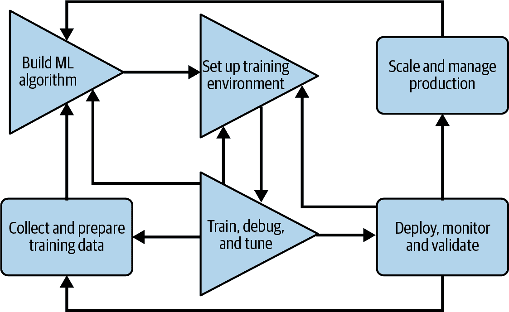
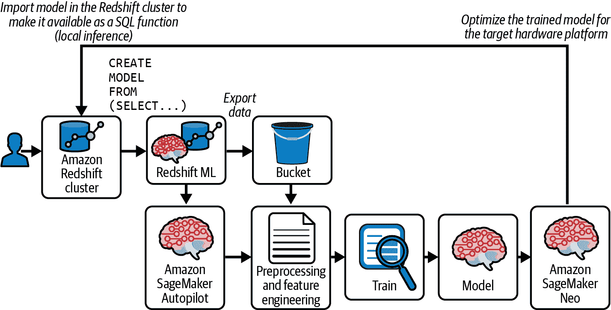
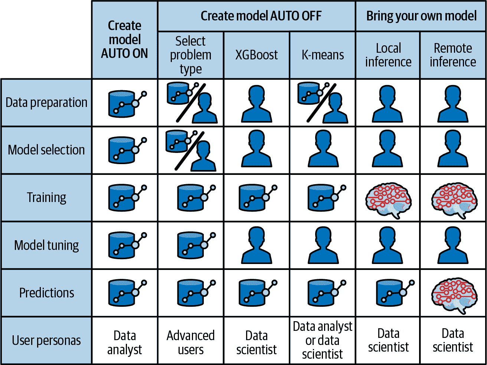

# 第六章：Amazon Redshift 机器学习

机器学习和人工智能已经从科幻概念发展为日常伴侣，无论是在您的移动设备上还是在赋予企业能力以颠覆和增强决策制定的各个领域。

根据 [GlobalNewsWire](https://oreil.ly/6keHq) 的研究，AI/ML 市场预计将在 2029 年发展成为一个 1.4 万亿美元的行业。 [PwC 2022 AI Business Survey](https://oreil.ly/jACdB) 显示，86% 的受访者表示 AI 技术是公司的主流部分，52% 的受访者正在加速对 AI/ML 的采用。

下面是一个公司利用 Redshift 的 AI/ML 能力改进业务的示例。Jobcase，一家领先的面向求职者的在线求职平台，需要为超过 1.1 亿注册会员进行职位匹配，通过识别强匹配项为其会员推荐优质工作。它还帮助雇主招聘合格的工人。其推荐系统生成特定的职位列表推荐，以及搜索建议和公司推荐。使用 AI/ML，Jobcase 能够在会员参与度指标上实现 5% 的改进，这转化为提升的会员体验、更高的会员保留率和相应的收入增长。他们还能将测试时间从 1 到 2 个月缩短到不到一周，消除了将数据移至单独的 ML 环境的需要，提高了可伸缩性，并能在约 15 分钟内进行数十亿次预测，而不是原来的 4 到 5 小时。详细信息请参阅案例研究 [“Jobcase Scales ML Workflows to Support Billions of Daily Predictions Using Amazon Redshift ML”](https://oreil.ly/v12dX)。

这里是另一个例子：Magellan Rx Management，Magellan Health, Inc. 的一个部门，开发并提供预测分析，以预测未来的药品成本，识别将推动未来趋势的药品，并积极识别可能变得不依从其药物治疗的患者，通过他们在 Amazon Redshift ML 上构建的 MRx Predict 解决方案。在使用 Amazon Redshift ML 之前，他们的数据分析师和临床医生需要手动将任何新药物分类到适当的治疗条件中。使用 Amazon Redshift ML，他们现在使用标准 SQL 编程进行预测，以预测适当的药物治疗条件，从而提高了操作效率，同时保持高水平的临床准确性。详细信息请参阅博客文章 [“How Magellan Rx Management Used Amazon Redshift ML to Predict Drug Therapeutic Conditions”](https://oreil.ly/x6mXd)。

在本章中，我们将涵盖端到端的“机器学习周期”，以及“Amazon Redshift ML”如何为您的组织中的多个角色提供工具，以开始利用“机器学习技术”推动创新。我们还将深入探讨不同的“机器学习算法”，并通过一个示例向您展示如何使用“与 Amazon SageMaker Autopilot 集成”来预测人类与机器之间虚构街头竞赛的结果。我们还将继续使用我们的学生信息系统数据集，并解释“使用 Amazon Redshift ML 预测学生结果”。我们还将描述某些 ML 问题无法通过 Amazon SageMaker Autopilot 解决的情况。在这些情况下，您可以使用“Amazon SageMaker 与 Amazon Redshift 集成”通过 Amazon SageMaker 画布工具访问 Amazon Redshift 数据来构建您的模型。有了您的模型，您可以利用“与 Amazon SageMaker 集成—自带模型 (BYOM)”在 Amazon Redshift 中进行推断。最后，我们将介绍“Amazon Redshift ML 成本”。

# 机器学习周期

机器学习中涉及的典型步骤（图 6-1）包括以下步骤：数据收集，数据准备和清洗，ML 模型和算法选择，设置训练环境，训练 ML 模型，评估和调整 ML 模型，部署 ML 模型以供生产使用并进行扩展，最后进行预测以驱动业务决策。

您的 ML 模型的质量直接受您使用数据的质量影响。不正确或过时的数据将导致错误的结果或不相关的预测。因此，为构建 ML 模型准备数据涉及数据清理，以删除不需要的数据、缺失值、重复值，甚至转换某些属性的数据类型。您可能需要重新组织数据集并转置行和列或索引行和列。您还需要将数据集分割为用于训练和测试的数据集，以在训练后检查模型的准确性。一个好的训练数据集是相关的，包含最少的缺失和重复值，并提供各种子类/类别的良好表示。通过 Amazon Redshift ML，您可以利用已经清洗和验证的数据仓库数据作为构建 ML 模型的源数据。



###### 图 6-1\. 典型 ML 生命周期

一旦你有了用于机器学习的数据集，你需要选择一个用于训练的模型。机器学习模型决定了在收集的数据上运行机器学习算法后得到的输出结果。选择一个与你手头任务相关的模型至关重要。科学家和工程师们开发了各种机器学习模型，比如线性回归、决策树、最近邻、随机森林等等。这些模型适用于不同的任务，比如语音识别、图像识别、预测以及各种不同的用例。除了模型类型，你还需要根据数据是数值型还是分类型来选择适合的模型算法，然后据此进行选择。

一旦确定了模型类型，现在你需要设置模型训练环境。你必须配置构成你的机器学习训练环境的基础设施组件，并决定数据、代码和模型的存储方式。确定最适合你尝试构建的机器学习模型类型的计算资源。安装必要的软件、集成开发环境（IDE）、框架和算法，开始你的机器学习之旅。

在你的训练环境中，你会迭代地训练、调试和调优你的机器学习模型。当准备好时，你需要部署到生产环境，验证预测结果，并监控机器学习模型执行的性能。这一步通常涉及扩展你的基础设施，以实现模型执行的性能期望和业务服务级别协议（SLA）。

我们只是以高层次介绍了机器学习过程，但你可以看到，直到你获得完全调优的适合你特定用例的模型之前，这是一个非常密集和迭代的过程。

# Amazon Redshift ML

为了解决业务问题，组织使用监督学习、无监督学习和强化学习等机器学习技术，我们稍后在“机器学习技术”中会详细讨论。但要实施这些技术需要理解不断发展的工具和技术，以获得基于机器学习的洞见。然而，Amazon Redshift ML 使数据分析师、数据科学家或决策者能够使用熟悉的 SQL 命令创建、训练和部署机器学习模型。要创建一个机器学习模型，用户需要编写`CREATE MODEL`命令，并传递 Amazon Redshift 中可用的必要数据。

当 Amazon Redshift ML 执行`CREATE MODEL` SQL 命令时，它会安全地将数据从 Amazon Redshift 导出到 Amazon S3，调用 Amazon SageMaker Autopilot 准备数据和训练机器学习模型，最后使用 Amazon SageMaker Neo 将机器学习模型作为 SQL 函数在 Amazon Redshift 中提供（参见 Figure 6-2）。

换句话说，Amazon Redshift ML 在幕后与 Amazon S3、Amazon SageMaker 和 Amazon Redshift 等各种基于云的服务进行通信，以简化使用 SQL 查询进行模型开发。



###### Figure 6-2\. Amazon Redshift ML 架构

Amazon Redshift ML 使用 [Amazon SageMaker](https://aws.amazon.com/sagemaker) 构建和训练 ML 模型。Amazon SageMaker 是一个全管理服务，用于准备数据、构建、训练和部署 ML 模型，并使用完全管理的基础设施、工具和工作流来运行预测。

Amazon SageMaker Autopilot 预处理训练数据，例如用不同值替换缺失数据，以保留数据集的大部分信息。它识别分类列的特征，如国家/州/邮政编码，并为训练适当地格式化它们。它选择最佳预处理器，并确定最合适的算法和算法超参数，以提供最准确的预测模型。

模型训练完成后，Amazon Redshift ML 使用 [Amazon SageMaker Neo](https://aws.amazon.com/sagemaker/neo)，优化 ML 模型以进行部署，并将其作为 SQL 函数在 Amazon Redshift 中提供。您可以使用 SQL 函数在查询、报告和仪表板中应用 ML 模型。通过执行 `CREATE MODEL` 命令来实现所有这些功能，详见 “Create Model”。

## Amazon Redshift ML 灵活性

Amazon Redshift ML 提供 `CREATE MODEL` 命令，并默认选项为 `AUTO ON`。当您使用 `AUTO ON` 与 Amazon Redshift ML 并运行 SQL 命令创建模型时，Amazon Redshift ML 将指定的数据从 Amazon Redshift 导出到 Amazon S3，并调用 SageMaker Autopilot 自动准备数据，选择适当的预构建算法，并应用算法进行模型训练。Amazon Redshift ML 处理 Amazon Redshift、Amazon S3 和 SageMaker 之间的所有交互，抽象出训练和编译的步骤。模型训练完成后，Amazon Redshift ML 将其作为 SQL 函数提供在您的 Amazon Redshift 数据仓库中使用。

`AUTO OFF` 选项适用于了解模型类型和训练超参数的高级用户。这会关闭创建模型的自动发现预处理器和超参数的功能，并且相较于 `AUTO ON` 选项，可以减少创建模型所需的时间。使用 `AUTO OFF` 选项，您可以更精细地控制 Amazon Redshift 模型的训练。



###### 图 6-3\. Amazon Redshift ML 灵活性

在图 6-3 中，您可以看到 Amazon Redshift ML 为不同水平的 ML 知识提供了渠道。任何熟悉 SQL 语言的数据分析师都可以使用自动选项开始使用 Amazon Redshift ML，无需了解 ML 算法的详细信息或 ML 编程语言如[Python](https://www.python.org/about)或[R](https://www.r-project.org/about.html)。对于熟悉 ML 算法并希望调整模型特性的数据科学家来说，Amazon Redshift ML 也非常有用。Amazon Redshift ML 还支持一种自带模型（BYOM）的方法，我们在“与 Amazon SageMaker 集成——自带模型（BYOM）”中进行了介绍，通过这种方法，您可以利用 SageMaker 环境选择特定的运行时和计算类型来构建、训练和调整模型。然后，您可以在 Amazon Redshift 中导入模型并运行推理，或者直接从 SageMaker 中使用您的数据进行远程推理。

## 开始使用 Amazon Redshift ML

Amazon Redshift 需要明确授权才能与其机器学习功能的 Amazon SageMaker 进行交互。通过为 Amazon Redshift ML 配置您的[IAM 角色](https://oreil.ly/M6Wvn)来设置此功能。

作为最佳实践，您应该将创建模型的权限与使用模型进行预测功能的权限分开。示例 6-1 中的查询展示了两个组，`model_create_grp`具有创建模型的权限，而`model_user_grp`具有用于推理您的 ML 模型的权限。

##### 示例 6-1\. 为 Amazon Redshift ML 授予权限

```
GRANT CREATE MODEL TO GROUP model_create_grp;
GRANT EXECUTE ON MODEL demo_ml.ml_model TO GROUP model_user_grp;
```

Amazon Redshift 支持默认的`sql`语言以及其他不同的语言。您可以查询`SVV_LANGUAGE_PRIVILEGES`表格以查看用户、角色或组授予的所有语言和权限。Amazon Redshift ML 也是 Amazon Redshift 中的另一种语言，在该表中显示为`mlfunc`。

当您执行授权语句以允许创建模型时，Amazon Redshift 会向 ML 语言授予权限（参见示例 6-2）。

##### 示例 6-2\. 语言权限

```
SELECT
    language_name,
    privilege_type,
    identity_type,
    identity_name,
    identity_id,
    admin_option
FROM
    svv_language_privileges;
```

| language_name | privilege | identity_type | identity_name | identity_id | admin_option |
| --- | --- | --- | --- | --- | --- |
| c | USAGE | public | public | 0 | false |
| internal | USAGE | public | public | 0 | false |
| mlfunc | USAGE | group | model_create_grp | 834679 | false |
| plpgsql | USAGE | public | public | 0 | false |
| sql | USAGE | public | public | 0 | false |
| plpythonu | USAGE | public | public | 0 | false |

# 机器学习技术

机器学习模型在您的数据中发现模式，然后将这些模式应用于生成新数据的预测。有许多种类的 ML 技术，但以下是三种常见的方法：

监督机器学习

该算法分析标记数据并学习如何将输入数据映射到输出标签。通常用于分类和预测。

无监督机器学习

不同于监督学习，这种算法不用于预测结果，因此被视为未标记。这种算法通过对数据进行聚类并识别聚类数据中的相似性来找出模式。常见用途包括推荐系统和定向广告。

强化学习

这种技术类似于人类学习的方式，通过试错来学习。强化学习针对一个被置于特定环境中的数字代理，以学习问题解决。类似于我们学习新事物的方式，代理面临着类似游戏的情境，并必须做出一系列决策来尝试达到正确的结果。通过试错，代理将学会该如何做和不该做，并相应地受到奖励或惩罚。每次获得奖励时，都会强化这种行为，并向代理信号使用同样的策略。通过这样的训练，机器学习模型可以被教导遵循指令，进行测试和操作设备，例如。

由于强化学习的复杂性，尽管在亚马逊 SageMaker 中受到支持，但在亚马逊 Redshift ML 中并不支持这种技术。

## 监督学习技术

监督学习是最常见的机器学习方法，你从具有输入数据列和输出数据列的训练数据集开始。这些输入数据属性到你的机器学习模型被称为“特征”，输出数据属性被称为“标签”。这个训练数据集旨在训练机器学习算法以准确分类数据或预测输出标签。

有两种亚马逊 Redshift ML 支持的监督学习 ML 问题：分类和回归。你的特定用例将只属于这两个不同的问题类型之一：

+   分类问题用于将数据分配到特定类别中。分类有两种类型：

    +   二分类是指预测*两种*结果的问题，例如在你的收件箱中分类垃圾邮件或预测客户是否会流失。

    +   多类分类是指预测*多种*结果的问题，例如预测特定客户可能最感兴趣的信用卡类型。

+   回归问题是从输入变量到连续输出变量的映射函数的近似任务。它使用算法来理解依赖变量和独立变量（特征）之间的关系，并定义映射函数来预测输出变量（标签）。连续输出变量是实值，整数或浮点值，通常是数量，例如给定业务的销售收入预测或客户的总支出。

一个特定的回归问题，其中输入变量按时间顺序排列，被称为时间序列预测问题。这个问题由预测模型解决。

[Amazon Forecast](https://aws.amazon.com/forecast) 是一种完全托管的服务，使用统计和机器学习算法来提供时间序列预测。Amazon Redshift ML 支持使用 Amazon Forecast 构建预测模型。这使您可以使用一段时间内的历史数据来预测未来事件。Amazon Forecast 的常见用例包括使用零售产品数据决定如何定价库存，使用历史订单预测市场需求，使用历史制造和销售数据预测需要订购的某一商品数量，以及使用网站流量数据预测 Web 服务器可能收到的流量量。

Amazon Forecast 的配额限制在 Amazon Redshift 预测模型中执行；例如，最多可以进行 100 次预测，尽管这可以通过支持请求进行更改。

删除预测模型不会自动删除 Amazon Forecast 中关联的资源。

## 无监督学习技术

无监督学习使用 ML 算法分析数据集，发现数据中的隐藏模式，无需人类干预，因此属于无监督学习类别。与监督学习不同，监督学习具有定义的输入属性和输出属性，无监督学习则是识别数据中的异常或离群值。

Amazon Redshift ML 通过 Amazon SageMaker 支持三种类型的无监督 ML 问题类型：聚类、关联和降维。您的特定用例可能同时属于这些问题类型中的多种。

*聚类*是一种根据它们的相似性或差异对未标记数据进行分组的技术，然后识别异常值；例如，*k*-means 聚类算法将相似的数据点分配到组中，其中*k*值表示组的大小和粒度。它试图在数据中找到离散的分组，其中组的成员彼此尽可能相似，并且与其他组的成员尽可能不同。这种聚类技术对于分割很有帮助，例如，信用卡公司可以根据客户的购买行为将其忠诚卡客户分成不同的组，并启动有针对性的活动或促销产品。

*关联*使用不同的规则在给定数据集中查找变量之间的关系，例如推荐系统中的“购买了此商品的客户还购买了”类似问题。

*降维*在给定数据集中特征（或维度或输入列）的数量过高时使用。它减少数据输入的数量到一个可管理的大小，同时保持数据的完整性，例如编码器从视觉数据中去除噪音以改善图片质量。

# 机器学习算法

我们已经涵盖了问题类型，现在我们将讨论可以用来解决这些问题类型的算法。要深入了解特定的问题类型及可用于解决该特定问题类型的特定算法，请参阅[Amazon SageMaker 内置算法的文档](https://oreil.ly/LaxlD)。

对于监督学习，Amazon Redshift ML 支持极限梯度增强（XGBoost）、多层感知器（MLP）和线性学习器算法。

XGBoost 算法是梯度增强树算法的优化开源实现。XGBoost 从头开始设计，以高效、灵活、便携和准确的方式处理许多数据科学问题。XGBoost 可用于回归、二分类、多分类和排名问题。排名问题类型用于按相关性顺序查找工件。它为查询中的每个输入关联一个数值分数到最终工件。一旦您有了每个工件的相关性分数，就可以根据这些分数对工件进行排名，并预测排名最高的 N 个最佳匹配值。有关 XGBoost 和 SageMaker 的详细信息，请参阅博文[“介绍开源 Amazon SageMaker XGBoost 算法容器”](https://oreil.ly/NmfuI)。

MLP 是一种监督深度学习方法，用于训练多层人工神经网络，也称为深度神经网络。MLP 学习线性和非线性数据之间的关系。它是一种前馈人工神经网络，从一组输入生成一组输出。MLP 以几层输入节点连接的方式作为输入和输出层之间的有向图来特征化。MLP 算法的典型应用包括图像分类、语音识别和机器翻译。

线性模型是用于解决分类或回归问题的监督学习算法。你向线性学习模型提供标记数据，算法学习一个线性函数，或者对于分类问题，学习一个线性阈值函数。线性学习算法适用于预测产品销售、确定营销效果或预测客户购买产品或服务的意愿等用例。你可以阅读更多关于[SageMaker 线性学习](https://oreil.ly/vtXU7)算法的信息，该算法探索不同的训练目标或准确度指标，并从验证集中选择最佳解决方案。

对于无监督学习，Amazon Redshift ML 支持 Amazon SageMaker Random Cut Forest (RCF) 和 *k*-means 算法。这些必须在 Amazon SageMaker 中构建，并作为 BYOM 导入到 Amazon Redshift。我们将在“Amazon SageMaker 集成——自带模型（BYOM）”中涵盖 BYOM。

RCF 是一种聚类技术，用于检测数据集中与其余结构良好或有模式的数据不符的异常数据点。对于每个数据点，RCF 关联一个异常分数。低分值表示数据点被认为是“正常”的。高值表示数据中存在异常。“低”和“高”的定义取决于应用程序，但通常做法表明，超出均值分数三个标准偏差的分数被视为异常。

如果你使用 *k*-means，你需要定义算法用来确定 *相似性* 的属性。它识别出数据中的离散群组，使得每个群组的成员尽可能相似，并尽可能不同于其他群组的成员。数字 `k` 决定了此算法将生成的群组数。*k*-means 适用于当你想从随机分布的事物集合中生成相似事物的群组时。

# 与 Amazon SageMaker Autopilot 的集成

[Amazon SageMaker](https://aws.amazon.com/sagemaker) 是一种全面管理的机器学习服务，供数据科学家和开发人员构建、训练并直接部署模型到生产环境中。

Amazon Redshift ML 利用[Amazon SageMaker Autopilot](https://oreil.ly/VrhVT)功能，基于您的数据训练和调整多个机器学习模型，并保留准确率最高的模型。Amazon SageMaker Autopilot 提供自动数据清理、自动数据预处理、线性回归、二分类和多分类的自动算法选择。它还支持自动[超参数调优优化（HPO）](https://oreil.ly/kkrib)、分布式训练、自动实例和集群大小选择。

Amazon SageMaker Autopilot 使得在不需要太多关于机器学习理论的情况下，轻松在 Amazon Redshift 中构建模型成为可能。

## 创建模型

让我们深入一些实践来创建一个模型。假设您想预测人类和机器之间未来街头赛车的结果。您有先前比赛的历史数据，比赛发生的城市，比赛期间的天气，道路状况，需走的距离以及人类和机器的速度，还有实际的结果—人类是否赢得了比赛。是的，我们支持人类胜利！

你所需的仅仅是用于训练模型的表格和一个 Amazon S3 存储桶来保存训练产物。在示例 6-3 中的代码将为您准备这些表格。您有一个训练表用于训练机器学习模型，并且有一个推断表用于进行机器学习推断。稍后（参见示例 6-4），您将看到创建模型的语法。

##### 示例 6-3\. 准备赛车模式

```
CREATE SCHEMA race;

CREATE TABLE race.speed_training(
  city              varchar(10),
  machine_distance  decimal,
  human_distance    decimal,
  weather           varchar(5),
  road_condition    varchar(5),
  machine_speed     decimal,
  human_speed       decimal,
  human_win_y_n     boolean);

COPY race.speed_training
FROM 's3://redshift-demos/ANT402/training.csv'
region 'us-east-1'
iam_role default
csv delimiter ',';

CREATE TABLE race.speed_inference(
  city              varchar(10),
  machine_distance  decimal,
  human_distance    decimal,
  weather           varchar(5),
  road_condition    varchar(5),
  machine_speed     decimal,
  human_speed       decimal,
  human_win_y_n     boolean);

COPY race.speed_inference
FROM 's3://redshift-demos/ANT402/inference.csv'
region 'us-east-1'
iam_role default
csv delimiter ',';
```

在示例 6-4 中，Amazon SageMaker Autopilot 将为您处理所有繁重工作，并找出最佳的机器学习模型来预测人类是否会获胜。告诉模型使用标签`human_win_y_n`，其值可以是`True`或`False`，在训练数据上。由于期望的目标`human_win_y_n`是二元的，Autopilot 将确定这是一个二元分类问题，并选择最准确的算法。

##### 示例 6-4\. 创建模型

```
CREATE MODEL race.human_vs_machine
FROM race.speed_training
TARGET human_win_y_n
FUNCTION fnc_will_human_win
IAM_ROLE default
SETTINGS (
  S3_BUCKET 'my_ml_bucket',
  MAX_RUNTIME 10800);
```

我们在这个示例中将`MAX_RUNTIME`设置得比默认的 5400（1.5 小时）要高，以确保在表 6-3 中生成的模型可解释性报告成功。

使用示例 6-5 中的`show model`命令查看 ML 模型状态。检查`模型状态`以确定模型是否准备好。当您首次创建模型时，您将看到`TRAINING`的状态。

##### 示例 6-5\. 显示模型

```
SHOW MODEL race.human_vs_machine;
```

表 6-1\. 显示模型—`TRAINING`

| 键 | 值 |
| --- | --- |
| 模型名称 | 人类对机器 |
| 模式名称 | race |
| 所有者 | model_create_user |
| 创建时间 | 星期二, 12.12.2023 05:10:15 |
| 模型状态 | 训练中 |
| …​ |  |

当你的模型处于`READY`状态时，流程已完成，你可以开始使用你的模型。你可以检查`objective`和相应的`validation`分数来确定模型的准确性。如表 6-2 所示，目标是`f1`，得分为 0.93432，即 93.43%的准确率得分。估算成本是推导模型所需的预估[SageMaker 处理小时数](https://oreil.ly/S-aSp)。准确率高的模型将生成更精确的模型预测，但更高的准确率可能意味着更高的成本。我们将在“Amazon Redshift ML Costs”中介绍成本。

表 6-2\. 展示模型—`READY`

| 键 | 值 |
| --- | --- |
| 模型名称 | human_vs_machine |
| 模式名称 | race |
| 所有者 | model_create_user |
| 创建时间 | 2023 年 12 月 12 日星期二 05:10:15 |
| 模型状态 | READY |
| 训练作业状态 | MaxAutoMLJobRuntimeReached |
| 验证:f1_binary | 0.93432 |
| 预估成本 | 20.805736 |
|  |  |
| 训练数据: |  |
| 表 | race.speed_training |
| 目标列 | HUMAN_WIN_Y_N |
|  |  |
| 参数: |  |
| 模型类型 | xgboost |
| 问题类型 | 二元分类 |
| 目标 | F1 |
| AutoML 作业名称 | redshiftml-20230114201510598817 |
| 函数名称 | fnc_will_human_win |
|  | fnc_will_human_win_prob |
| 函数参数 | city machine_distance human_distance |
|  | weather road_condition machine_speed |
|  | human_speed |
| 函数参数类型 | varchar numeric numeric |
|  | varchar varchar numeric |
|  | numeric |
| IAM 角色 | default-aws-iam-role |
| S3 存储桶 | my_ml_bucket |
| 最大运行时间 | 3800 |

准确率超过 80%被认为是一个良好的分数，但根据您的具体用例，您可以选择进一步调整以获得更高的分数。

要运行推断，只需在您的 SQL 查询中使用函数`fnc_will_human_win`。您需要授予执行模型的权限给将运行推断的标识，如示例 6-6 所示。

##### 示例 6-6\. 使用模型进行推断

```
SELECT
    city,
    machine_distance,
    human_distance,
    weather,
    road_condition,
    machine_speed,
    race.fnc_will_human_win
      (city,
       machine_distance,
       human_distance,
       weather,
       road_condition,
       machine_speed,
       human_speed) AS predicted
FROM
    race.speed_inference;
```

在验证`F1`分数时，拥有一组*未经训练*的数据是个好习惯。运行推断查询并将 ML 模型预测值与*未经训练*数据中的实际值进行比较。

在前面的示例中，我们展示了如何使用 Amazon SageMaker Autopilot 仅通过提供训练数据表和表中的目标列来创建您的模型。Amazon Redshift ML 还提供了使用用户指导参数创建模型的选项，您可以在`CREATE MODEL`命令中指定模型类型、问题类型、目标和预处理器，如示例 6-7 所示。如果您知道问题类型和/或模型类型和/或目标，则在`CREATE MODEL`命令中指定这些值将减少模型创建时间和相关成本。在某些情况下，您需要自定义算法或预处理器。在这些情况下，您需要指定这些参数。

查看[创建模型文档](https://oreil.ly/KbxLq)以查看示例 6-7 中显示的所有选项的详细信息。

##### 示例 6-7\. 完整创建模型

```
CREATE MODEL model_name
    FROM { table_name | ( select_statement ) }
    TARGET column_name
    FUNCTION function_name
    IAM_ROLE { default }
    [ MODEL_TYPE { XGBOOST | MLP | LINEAR_LEARNER} ]
    [ PROBLEM_TYPE (
      REGRESSION | BINARY_CLASSIFICATION |
      MULTICLASS_CLASSIFICATION ) ]
    [ OBJECTIVE ( 'MSE' | 'Accuracy' | 'F1' | 'F1Macro' | 'AUC') ]
    [ PREPROCESSORS ( TRANSFORMERS ) ]
    SETTINGS (
      S3_BUCKET 'bucket',
      S3_GARBAGE_COLLECT { ON | OFF },
      KMS_KEY_ID 'kms_key_id',
      MAX_CELLS integer,
      MAX_RUNTIME integer (, ...)
    );
```

设置`S3_GARBAGE_COLLECT`用于在模型准备就绪后自动清除用于保存训练工件的 Amazon S3 存储桶。但是，如果禁用此设置，您可以使用 Amazon S3 中创建的文件的多种方式，使用 BYOM 策略（参见“与 Amazon SageMaker 集成—Bring Your Own Model (BYOM)”）。如果删除 Amazon Redshift 数据仓库，则可以使用这些文件重新创建推断函数。您还可以使用这些文件实现模型版本控制；例如，在重新训练模型之前，可以使用文件创建旧版本的模型。最后，您可以在一个 Amazon Redshift 数据仓库上创建您的模型，但是在另一个 Amazon Redshift 数据仓库上公开该模型，而无需经过重新训练的过程。

## 标签概率

标签是您要预测的值或结果。对于`human_vs_machine`模型，您要预测的是人类是否会获胜，有两种可能的结果或标签：`true`表示人类获胜，`false`表示人类未获胜。标签概率度量将概率值分配给每个标签，以指示其发生的可能性。您可以通过使用`fnc_will_human_win_prob`推断函数访问分配给每个标签的标签概率度量，该函数将输出其发生的百分比可能性。当创建问题类型为二元分类或多类分类的`AUTO ON`模型时，可以使用标签概率度量。

标签概率是为每一行计算的，而不是实际运行 ML 模型。您可以在推断数据集上运行此功能，以获取预期结果的指示。

概率函数`fnc_will_human_win_prob`由 Amazon Redshift ML 自动创建，使用您为 ML 模型提供的函数名`fnc_will_human_win`并添加`_prob`后缀。

##### 示例 6-8\. 标签概率

```
SELECT
  race.fnc_will_human_win_prob
    (city,
    machine_distance,
    human_distance,
    weather,
    road_condition,
    machine_speed,
    human_speed)
FROM
    race.speed_inference
LIMIT 5;
```

| fnc_will_human_win_prob |
| --- |
| {"probabilities”:[0.98792028,0.01207972],"labels”:["f”,"t"]} |
| {"probabilities”:[0.99937975,0.00062025],"labels”:["f”,"t"]} |
| {"probabilities”:[0.91194165,0.08805832],"labels”:["t”,"f"]} |
| {"probabilities”:[0.95782197,0.04217804],"labels”:["t”,"f"]} |
| {"probabilities”:[0.93414819,0.06585180],"labels”:["t”,"f"]} |

在这里，您可以看到在输入数据的前两行中，人类赢得比赛的概率较低，而在接下来的三行中，概率较高。

## 解释模型

在机器学习中，每个作为模型输入的独立变量称为特征。在 Amazon Redshift ML 中，您用于构建模型的列是该模型的特征。

`explain_model` 命令 (示例 6-9) 提供了 ML 模型的可解释性报告，其中包含有关所有模型特征的 [Shapley 值](https://oreil.ly/HwYfZ) 的信息。这些 Shapley 值帮助您理解每个特征对模型预测的贡献。Shapley 值是在特征空间中所有可能值的平均边际贡献。较高的 Shapley 值意味着该特征对预测结果有更大的影响。

##### 示例 6-9\. 解释模型命令

```
SELECT explain_model('race.fnc_will_human_win_prob');
```

您在 表 6-3 中看到，`city` 和 `human_speed` 对比 `road_condition` 的 `1.04` 和 `weather` 的 `1.46` 影响要小得多。您可以从这些数据中推断出，无论是人类还是机器在适应天气和道路条件方面，可能更好。

表 6-3\. 解释模型结果

| explain_model |
| --- |
| {"explanations”:{"kernel_shap”:{"label0”:{ “expected_value”:-0.5694439538988466, “global_shap_values”:{ “city”:0.2865426473431818, “human_distance”:0.8485933955733828, “human_speed”:0.4954490773124456, “machine_distance”:0.8925393014624781, “machine_speed”:0.7125560417928333, “road_condition”:1.0487996886952989, “weather”:1.460974788708901} }}},"version”:"1.0"} |

`explain_model` 命令利用亚马逊 SageMaker Clarify，提供工具来帮助解释 ML 模型如何进行预测。有关详细信息，请参见 [Amazon SageMaker Clarify 模型可解释性](https://oreil.ly/-V9BF)。

在 ML 模型训练后，模型可解释性报告将自动生成。如果由于 `MAX_RUNTIME` 参数中断了模型训练，您可能会看到对 `explain_model` 的错误返回。在这种情况下，您可以增加 `MAX_RUNTIME` 值并重新运行训练。

# 使用亚马逊 Redshift ML 预测学生的结果

在 第三章 中，我们讨论了 “学生信息学习分析数据集”。让我们利用我们对亚马逊 Redshift ML 的了解，并使用学生学习数据集构建一个模型，预测学生的表现结果：通过、失败、退出或优异。您还将确定影响学生表现最重要的因素。

首先，您将从历史数据创建训练数据集作为表格。此表将包含学生人口统计信息、从学习管理系统（LMS）收集的数据以及学生评估成绩。您将使用这些输入作为构建 ML 模型的特征，以预测学生的表现结果，即 `final_result` 列。

表格 `tbl_student_lmsactivities_and_score` 在 示例 6-10 中通过连接 `student_info`、`student_lms` 中的点击总数以及 `student_assessment` 中的分数总数而创建。这是*特征工程*的一个重要方面，即数据透视，使所有输入能够进入训练/推断过程。

##### 示例 6-10\. Openlearn 机器学习模型特征

```
CREATE TABLE tbl_student_lmsactivities_and_score AS
SELECT
  st.school_id, st.id_student, st.code_module,
  st.code_presentation, st.gender, st.region,
  st.highest_education, st.imd_band, st.age_band,
  st.num_of_prev_atteempts, st.studied_credits,
  st.disability, st.final_result,
  st_lms_clicks.sum_of_clicks, scores.total_score,
  scores.mean_score
FROM
  openlearnm.student_info st
  LEFT JOIN
    (SELECT school_id, code_module,
      code_presentation, id_student,
      sum(sum_click) AS sum_of_clicks
    FROM
      OPENLEARNM.student_lms
    GROUP BY 1,2,3,4) st_lms_clicks
  ON st.school_id = st_lms_clicks.school_id
  AND st.code_module = st_lms_clicks.code_module
  AND st.code_presentation = st_lms_clicks.code_presentation
  AND st.id_student = st_lms_clicks.id_student
  LEFT JOIN
    (SELECT
      school_id, id_student,
      sum(score) AS total_score,
      avg(score) AS mean_score
    FROM
      openlearnm.student_assessment
    GROUP BY 1,2) scores
  ON st.school_id = scores.school_id
  AND st.id_student = scores.id_student
;
```

现在，在 `tbl_student_lmsactivities_and_score` 表上运行 `CREATE MODEL` 命令以调用 Amazon SageMaker Autopilot。

##### 示例 6-11\. Openlearn 创建模型

```
CREATE MODEL student_result
FROM tbl_student_lmsactivities_and_score
TARGET final_result
FUNCTION fnc_final_result
IAM_ROLE default
SETTINGS (
  S3_BUCKET 'my_ml_bucket',
  MAX_RUNTIME 10800
  )
;
```

与前面的示例类似，我们将 `MAX_RUNTIME` 设置得比默认的 5400（1.5 小时）更高，以确保在 表 6-3 中生成模型可解释性报告成功。

现在，您可以执行 `show model` 命令查看 Amazon SageMaker Autopilot 选择的模型的详细信息。您将在 表 6-4 中看到，它能够选择一个准确率为 87% 的模型，并且由于您确定了多个可能的标签之一（`退课`、`通过`、`优异` 和 `不及格`），它确定问题类型是多类分类。

##### 示例 6-12\. 展示模型

```
show model student_result;
```

表 6-4\. 展示模型输出

| 键 | 值 |
| --- | --- |
| 模型名称 | student_result |
| 模式名称 | public |
| 所有者 | model_create_user |
| 创建时间 | 日，2024 年 03 月 05 日 18:54:11 |
| 模型状态 | READY |
| 验证精度 | 0.870610 |
| 预计成本 | 29.814964 |
|  |  |
| 训练数据： |  |
| 表 | tbl_student_lmsactivities_and_score |
| 目标列 | FINAL_RESULT |
|  |  |
| 参数： |  |
| 模型类型 | xgboost |
| 问题类型 | 多类分类 |
| 目标 | 准确性 |
| AutoML 任务名称 | redshiftml-20230305185411524819 |
| 函数名称 | fnc_final_result |
|  | fnc_final_result_prob |
| 函数参数 | id_student code_module code_presentation |
|  | 性别 地区 最高教育程度 imd_band |
|  | 年龄段 前几次尝试次数 |
|  | 学习学分 残疾 点击总数 |
|  | 总分 平均分 |
| 函数参数类型 | int4 varchar varchar |
|  | bpchar varchar varchar varchar |
|  | varchar int2 |
|  | int2 bpchar int8 |
|  | int8 int8 |
| IAM 角色 | default-aws-iam-role |
| S3 存储桶 | my_ml_bucket |
| 最大运行时间 | 10800 |

最后，您可以执行`explain_model`命令以查看 Shapley 值。您可以在示例 6-13 中看到，与`年龄段`相比，`性别`、`地区`、`以前的尝试`和`残疾`的影响较小，分别为`0.51`、`最高学历`为`0.59`、`学习学分`为`0.66`。具有`0.99`值的`点击次数`似乎是决定学生表现最重要的因素。`点击次数`表示与虚拟学习环境的互动。基于此 ML 模型，您可以预期增加与虚拟学习环境的互动应该会改善学生的成绩—例如，在虚拟课程内容之间增加一场小测验。

##### 示例 6-13\. 解释模型`student_result`

```
SELECT
  t.r.explanations.kernel_shap.label0.global_shap_values
FROM (SELECT
        explain_model('student_result') AS r
     ) AS t
;
```

| global_shap_values |
| --- |
| “年龄段”:0.510843481387332466, “code_module”:0.1775745286500845, “code_presentation”:0.09353407379714834, “残疾”:0.051944180058839748, “性别”:0.05065581722765354, “最高学历”:0.592895528627924518, “id_student”:0.00000483678127755, “imd_band”:0.033637420953443259, “mean_score”:0.2120711173613374, “num_of_prev_attempts”:0.05241636943859941, “地区”:0.13375708054846678, “studied_credits”:0.6551317963150247, “sum_of_clicks”:0.9983975396249064, “total_score”:0.25218934352064467 |

# Amazon SageMaker 与 Amazon Redshift 集成

到目前为止，我们已经描述了用户如何使用 SQL 创建模型并进行推断。对于在 Amazon SageMaker 中构建和训练模型的数据科学家用户，Amazon SageMaker Studio 是一个提供单一基于 Web 的视觉界面的 IDE，您可以访问工具以执行所有机器学习操作。SageMaker 笔记本是一个流行的界面，运行 Jupyter Notebook 应用程序以准备和处理数据，编写代码来训练模型，将模型部署到 SageMaker 托管环境，并测试或验证您的模型。在“Amazon Redshift 数据 API”讨论的 Amazon Redshift 数据 API 简化了连接管理，而 Jupyter Notebook 预加载了访问 Amazon Redshift 数据 API 所需的库。这使得在 Amazon SageMaker 中使用来自 Amazon Redshift 的数据进行高级 ML 训练变得简单。

Amazon SageMaker Canvas 允许业务分析师在不编写代码或需要 ML 专业知识的情况下构建 ML 模型。一旦您[授予用户访问 Amazon Redshift 的权限](https://oreil.ly/WSKwt)，您可以通过使用 SQL 查询和连接，将 Amazon Redshift 数据导入，并将其推送到 Amazon Redshift 以利用其本地特性。

# Amazon SageMaker 集成—自定义模型（BYOM）

对于在 Amazon Redshift 外部创建的高级 ML 模型，如果满足 Redshift ML 的要求，可以将其引入 Amazon Redshift 以进行 ML 推理。您可以导入这些预训练模型，用于本地推理或远程推理。这些模型可以使用 Amazon Redshift 数据创建和训练，详见“Amazon SageMaker 与 Amazon Redshift 集成”，或者可以使用其他数据源创建和训练。

要将自己的 SageMaker 模型引入 Amazon Redshift，必须满足以下条件：

+   模型必须通过文本或 CSV 的内容类型接受 CSV 格式的输入。

+   端点必须由拥有 Amazon Redshift 数据仓库的同一 AWS 账户托管。

+   模型的输出必须是在创建函数时指定类型的单个值。

+   模型必须接受空值作为空字符串处理。

+   Amazon SageMaker 端点必须具有足够资源来容纳来自 Amazon Redshift 的推理调用，或者 SageMaker 端点可以进行[自动扩展](https://oreil.ly/gvDJk)。

## BYOM 本地

示例 6-14 是 BYOM 本地推理的查询语法。您可以指定一个 SageMaker 作业名称或者由 SageMaker 作业生成的 `.tar.gz` 模型工件文件在 Amazon S3 上的位置。ML 模型被存储为本地编译的 Amazon Redshift 函数。

##### 示例 6-14\. BYOM 本地

```
CREATE MODEL public.predict_customer_churn
FROM 'job_customer_churn-xxxxxxxxxx'
FUNCTION fn_customer_churn(int)
RETURNS decimal(8,7)
iam_role 'arn:aws:iam::123456789012:role/myRSMLrole';
```

在本地运行 BYOM ML 模型推理时，Amazon Redshift SQL 函数会在 Amazon Redshift 中本地调用，并进行预测，因此不涉及 SageMaker。

## BYOM 远程

您也可以在 Amazon Redshift 中引用 SageMaker 模型端点进行远程推理。示例 6-15 是 BYOM 远程推理的查询语法。`sagemaker` 关键字告诉 Amazon Redshift ML 此特定 ML 模型是用于远程推理的 SageMaker 模型。

在 Amazon Redshift 上运行远程 BYOM 模型推理查询时，会调用 SageMaker ML 模型，并直接从 SageMaker 获取预测。

##### 示例 6-15\. BYOM 远程

```
CREATE MODEL public.remote_random_cut_forest
FUNCTION fn_remote_rcf(int)
RETURNS decimal(10,6)
sagemaker 'randomcurforest-xxxxxxxxxx'
iam_role 'arn:aws:iam::123456789012:role/myRSMLrole';
```

若要查看更多创建模型的用例，请参阅[创建模型用例](https://oreil.ly/aYm_k)。

# Amazon Redshift ML 成本

Amazon Redshift ML 使用 Amazon SageMaker 训练您的模型，因此训练 ML 模型会产生相关费用。启用 Amazon Redshift ML 功能不会产生额外费用。此外，在 Amazon Redshift 中进行本地预测不会产生 Amazon SageMaker 的费用，但远程预测则会额外产生 Amazon SageMaker 费用。

`create model` 语句提供 `MAX_RUNTIME` 和 `MAX_CELLS` 选项，用于控制在 Amazon Redshift 中训练 ML 模型时的成本、时间和潜在模型精度：

`MAX_RUNTIME`

默认值为`5,400`秒或`90`分钟。这是亚马逊 SageMaker 训练的最长时间。降低此值限制了在亚马逊 SageMaker 中的时间和计算开销，从而减少了训练模型的成本。

`MAX_CELLS`

默认值为`1,000,000`个单元格，其中一个单元格是您数据集中的单个数据点。因此，如果您的训练数据表具有`12 列`和`20,000 行`，那么它有`240,000`个单元格用于训练 ML 模型。使用较低的最大单元格值会导致亚马逊 Redshift ML 选择减少的数据集进行训练，从而减少成本和训练模型的时间。

训练完成后，亚马逊 Redshift 需要一些时间在本地编译和安装模型，因此您可能会发现您的`create model`语句执行时间比您指定的`max_runtime`更长。

如果训练数据集中的实际单元格数超过`MAX_CELLS`值，则亚马逊 Redshift 将从训练数据集中随机选择较少的记录。这种随机化有助于在减少的训练数据集中防止偏差，同时仍然提供良好的机器学习预测。

设置`MAX_CELLS`和`MAX_RUNTIME`的值过低可能导致亚马逊 Redshift ML 无法为您确定机器学习模型，甚至可能选择准确度降低的模型。

大多数机器学习用例都属于默认的一百万个单元格范围内，这可以使大多数用例的训练成本保持在不到`$20`。然而，如果您的训练数据超过一百万个单元格，那么价格将如下例所示增加。

前 1 千万个单元格的价格为每百万单元格`$20`。接下来的 9 千万个单元格的价格为每百万单元格`$15`。超过 1 亿单元格的价格为每百万单元格`$7`。

下面是一个包含 1.25 亿单元格的定价示例：

```
First 10 million = 10 x $20 =  $200
 Next 90 million = 90 x $15 = $1350
Over 100 million = 25 x $07 =  $175
-----------------------      ------
TOTAL 125 million cells       $1825
-----------------------      ------
```

此外，根据使用情况收取亚马逊 S3 存储训练数据和与模型相关的工件的费用。在训练期间，默认的垃圾收集模式会自动删除这些临时的亚马逊 S3 数据，一旦模型创建完成，亚马逊 S3 的费用也因此得到了最小化。

# 摘要

本章涵盖了一些您可以使用亚马逊 Redshift ML 解决的机器学习用例。我们讨论了如何使用监督学习技术在亚马逊 Redshift 中直接启动`CREATE MODEL`命令来解决分类和回归问题。我们还详细介绍了如何使用无监督学习技术在亚马逊 SageMaker 中解决聚类、关联和维度问题，以及如何通过内置连接器从亚马逊 Redshift 导入训练这些模型所需的数据，并且如何将这些模型通过自带模型策略返回到亚马逊 Redshift 中用于推理。

在本书中，我们已经讨论了数据共享及其如何通过能够独立隔离和扩展工作负载的能力，从而支持现代数据战略。在下一章中，我们将描述数据共享的不同用例，以及如何设置数据共享，无论它们是在相同的账户和地区，还是在不同的地区，以及如何使用 Amazon DataZone 来管理数据共享访问。
