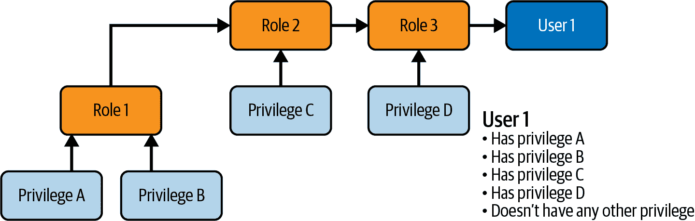

# 第八章：数据保护和管理

> 对于一家典型的财富 1000 强公司，数据可访问性仅增加 10%就能带来超过 6500 万美元的额外净收入。
> 
> Richard Joyce, Forrester¹

在本书中，我们已经讨论了数据的重要性，以及如何通过 Amazon Redshift 访问各种结构化或半结构化数据，无论是本地加载还是从外部源查询。然而，在成本效率的方式下访问和转换数据同样重要的是安全地执行此操作，确保只有合适的人员能够访问他们应该访问的数据。许多组织在使所有数据对用户可访问上存在困难。在数据不断扩展且对数据访问需求如此之高的世界中，实现这种访问性和安全性的平衡至关重要且具有挑战性。

在本章中，我们将讨论用户在 Amazon Redshift 中管理安全性的不同方法，包括“对象级访问控制”和“数据库角色”。我们将探讨用户群体需要细粒度访问控制的使用案例，以及如何通过“行级安全”和“动态数据遮蔽”来实现这一目标。最后，我们将讨论 Amazon Redshift 如何通过“外部对象访问控制”管理安全性。

# 对象级访问控制

Amazon Redshift 是一个对象层次结构组织的数据库系统，每个对象都由一组权限管理。如在第三章，“设置数据模型和数据导入”中所讨论的，Amazon Redshift 可以包含多个数据库，每个数据库可以包含多个模式（schemas），每个模式可以包含多个对象，例如表、视图、函数和过程。除了这些对象外，Amazon Redshift 还包含跨所有数据库适用的管理对象，如用户、组和角色。

用户是登录到数据库的个体主体。数据库组是用户的集合，用户可以是多个组的成员。最后，“数据库角色”类似于组，但具有额外的功能，我们将在本章后面讨论。用户、数据库组或数据库角色使用`GRANT`或`REVOKE`语句分配对象的权限。请参阅表 8-1 以获取权限列表及其适用的对象。有关执行`GRANT`语句的详细信息，请参阅[在线文档](https://oreil.ly/TUf0G)。注意，您可以将`UPDATE`和`SELECT`权限应用于数据库列。在限制对个人可识别信息（PII）数据访问时，这种授权策略非常有用。

表 8-1\. 对象权限

| Privilege | Object |
| --- | --- |
| INSERT,DELETE,DROP,REFERENCES | TABLE |
| UPDATE | 表,列 |
| SELECT | 表,视图,列 |
| EXECUTE | 函数,过程 |
| CREATE | 数据库,模式 |
| TEMP | 数据库 |
| USAGE | 语言,模式 |
| CREATE MODEL,EXECUTE | 模型 |
| ALTER,SHARE | 数据共享 |

作为最佳实践，将权限授予数据库组或数据库角色，而不是直接授予用户权限。为了进一步扩展权限管理，考虑通过单点登录从公司身份提供者传递用户、组和角色信息，以管理用户与数据库组和角色的分配。使用 SSO 将确保基于组成员资格授予权限，这可以在中央位置进行控制。有关详细信息，请查阅第 2 章，“开始使用 Amazon Redshift”中的连接部分。

## 对象所有权

除了通过`GRANT`分配给对象的特权之外，对象的所有者隐含地获得*所有*对象的特权。除了对象特权之外，对象所有者在对象上还具有管理特权；例如，所有者可以运行`ALTER TABLE`或`REFRESH MATERIALIZED VIEW`语句(示例 8-1)。在某些情况下，您可能需要更改对象的所有者。要执行此操作，对象所有者可以执行`ALTER`语句。

##### 示例 8-1\. 对象所有权

```
ALTER TABLE table1 OWNER TO user1;
```

如果用户拥有对象，则无法`DROP`该用户。最佳实践是限制用户可以创建对象的位置，以便轻松识别用户拥有的所有对象。例如，您可以授予与用户关联的模式的`CREATE`权限，但是共享模式的`SELECT`权限。

在创建 Amazon Redshift 数据仓库时，您会被提示输入一个具有`超级用户`特权的管理员用户。超级用户将拥有与对象所有者类似的所有权限。此用户还不受您在对象级别定义的访问控制的约束。此外，超级用户可以创建其他超级用户或通过创建或修改带有`CREATEUSER`属性的用户来将用户的权限提升为`超级用户`(示例 8-2)。

##### 示例 8-2\. 超级用户特权

```
CREATE USER adminuser CREATEUSER PASSWORD '1234Admin';
ALTER USER adminuser CREATEUSER;
```

作为最佳实践，不要将`超级用户`用于日常活动。应将适当的权限分配给数据库组和/或数据库角色，以清楚地显示授予哪些权限给哪些用户社区。

## 默认特权

为了使`GRANT`管理更加方便，您可以设置任何显示在表 8-2 中的默认特权，这样用户或架构中创建的任何对象都将授予另一个用户、组或角色的特权。有关如何授予或撤销默认特权的更多详细信息，请参阅[在线文档](https://oreil.ly/A159w)。

表 8-2\. 默认特权

| 特权 | 对象 |
| --- | --- |
| INSERT,UPDATE,DELETE,DROP,REFERENCES | 表 |
| SELECT | 表,视图 |
| EXECUTE | 函数,过程 |

## 公共模式和搜索路径

当您启动 Amazon Redshift 数据仓库时，在每个数据库中都会创建一个`public`模式，并且在 Amazon Redshift 中创建的每个用户将成为`PUBLIC`组的成员。默认情况下，`PUBLIC`组将对 Amazon Redshift 数据仓库中每个数据库中的`public`模式具有读/写访问权限。此策略允许用户在公共空间中进行协作，但要求必须显式授予任何额外模式的权限。此外，创建用户时，默认的`search_path`参数设置为`$user,public`。这意味着当引用没有数据库或模式限定符的对象时，Amazon Redshift 将首先在与用户 ID 匹配的模式中搜索，然后在`public`模式中搜索。该策略允许用户按照首选顺序在本地模式中处理数据集，而不是在公共模式中共享数据。正如在第三章，“设置数据模型和数据导入”中讨论的那样，将数据模型组织成专用模式仍然是最佳实践，这些模式代表一个主题区域，便于元数据管理，也简化了访问授权。这些模式也可以添加到用户的`search_path`中，以简化对共享数据的访问。

## 访问控制的实际应用

为了说明这些访问控制，让我们使用来自第三章的学生信息系统学习数据集，并遵循一个使用`public`模式存储共享数据的访问控制模型。`public`模式将对所有用户可读，但仅`etluser`可以写入。

要设置这些访问控制，首先禁用`PUBLIC`组对`public`模式的写入权限，以确保没有用户会意外修改共享表。示例 8-3 中的语句将删除任何现有的*写入*权限，并确保新对象的默认权限也将*写入*权限被撤销。注意：此语句不会撤销`SELECT`权限，这意味着`PUBLIC`组的成员仍然可以从`public`模式中*读取*数据。

##### 示例 8-3\. 撤销对`PUBLIC`组的模式写入权限

```
REVOKE INSERT,UPDATE,DELETE,DROP ON ALL TABLES
  IN SCHEMA public FROM GROUP PUBLIC;
REVOKE CREATE ON SCHEMA public FROM GROUP PUBLIC;
ALTER DEFAULT PRIVILEGES
  IN SCHEMA public REVOKE INSERT,UPDATE,DELETE ON TABLES FROM PUBLIC;
```

接下来，授予`etluser`对`public`模式的所有权限，并确保新对象的默认权限也将拥有所有权限（示例 8-4）。

##### 示例 8-4\. 授予用户模式写入权限

```
GRANT ALL ON ALL TABLES IN SCHEMA public TO etluser;
GRANT ALL ON SCHEMA public TO etluser;
ALTER DEFAULT PRIVILEGES IN SCHEMA public
  GRANT ALL ON TABLES TO USER etluser;
```

最后，让我们创建一个名为`faculty_bob`的用户，该用户将继承对`public`模式中数据的`SELECT`访问权限。我们还将创建一个与用户名匹配的模式，允许该用户创建数据的副本进行分析和操作（示例 8-5）。

##### 示例 8-5\. 创建用户模式并授予用户所有权限

```
CREATE USER faculty_bob PASSWORD '<your password>';
CREATE SCHEMA faculty_bob;
GRANT ALL ON SCHEMA faculty_bob TO USER faculty_bob;
```

具备权限后，假设`etluser`已加载`public`模式。查询示例 8-6 将按`semester_id`和`lecture_duration`返回`student_cnt`，并且将从`public`模式读取，无需显式引用它，无论您是作为`faculty_bob`还是`etluser`查询，都因为`search_path`以及因为这些表都不存在于用户模式中。

##### 示例 8-6\. 使用`search_path`选择共享表

```
SELECT
    co.semester_id,
    cs.lecture_duration,
    count(distinct co.student_id) student_cnt,
FROM course_registration cr
JOIN course_outcome co
  ON cr.student_id = co.student_id AND
     cr.course_id = co.course_id AND
     cr.semester_id = co.semester_id
JOIN course_schedule cs
  ON cr.course_id = cs.course_id AND
     cr.semester_id = cs.semester_id
GROUP BY 1,2;
```

现在，想象`faculty_bob`的任务是扩展`course_schedule`表，以包括一个新字段`lecture_duration_band`，以分组不同的`lecture_duration`值。用户`faculty_bob`可以创建该表的副本，并扩展该表以包含新字段。请注意，由于`search_path`，`faculty_bob`仍然不需要指定模式名称。新的`course_schedule`表将在`faculty_bob`模式中创建，他对其具有*写*权限（示例 8-7）。

##### 示例 8-7\. 使用`search_path`创建用户表

```
CREATE TABLE course_schedule AS SELECT * FROM course_schedule;
ALTER TABLE course_schedule ADD column lecture_duration_band varchar(100);
UPDATE TABLE course_schedule SET lecture_duration_band = CASE
  WHEN lecture_duration BETWEEN 0 AND 60 THEN '0-1 Hour'
  WHEN lecture_duration BETWEEN 61 AND 120 THEN '1-2 Hour'
  WHEN lecture_duration > 120 THEN '2+ Hour' END;
```

为了测试结果，`faculty_bob`可以执行引用新字段的修改后的查询（示例 8-8）。

##### 示例 8-8\. 使用`search_path`选择用户表

```
SELECT
    co.semester_id,
    cs.lecture_duration_band, -- changed from lecture_duration
    count(distinct co.student_id) student_cnt,
FROM course_registration cr
JOIN course_outcome co
  ON cr.student_id = co.student_id AND
     cr.course_id = co.course_id AND
     cr.semester_id = co.semester_id
JOIN course_schedule cs
  ON cr.course_id = cs.course_id AND
     cr.semester_id = cs.semester_id
GROUP BY 1,2;
```

如果结果符合目标，用户可以将转换规则传递给`etluser`，它可以修改`public`模式。注意，由于`search_path`，`etluser`也无需指定模式名称。`etluser`在`search_path`中唯一的`course_schedule`表位于`public`模式中，`etluser`对其具有*写*权限（示例 8-9）。

##### 示例 8-9\. 修改共享表

```
ALTER TABLE course_schedule ADD column lecture_duration_band varchar(100);
UPDATE TABLE course_schedule SET lecture_duration_band = CASE
  WHEN lecture_duration BETWEEN 0 AND 60 THEN '0-1 Hour'
  WHEN lecture_duration BETWEEN 61 AND 120 THEN '1-2 Hour'
  WHEN lecture_duration > 120 THEN '2+ Hour' END;
```

最后，`faculty_bob`可以删除他的用户表，并运行修改后的 SQL，该 SQL 将引用更新的共享表（示例 8-10）。

##### 示例 8-10\. 删除用户表并查询修改后的共享表

```
DROP TABLE course_schedule;

SELECT
    co.semester_id,
    cs.lecture_duration_band, -- changed from lecture_duration
    count(distinct co.student_id) student_cnt,
FROM course_registration cr
JOIN course_outcome co
  ON cr.student_id = co.student_id AND
     cr.course_id = co.course_id AND
     cr.semester_id = co.semester_id
JOIN course_schedule cs
  ON cr.course_id = cs.course_id AND
     cr.semester_id = cs.semester_id
GROUP BY 1,2;
```

# 数据库角色

数据库角色与数据库组类似，但在管理 Amazon Redshift 安全性时具有两个额外的灵活性功能。

首先，数据库角色允许您委派系统权限以运行先前仅授予对象所有者或超级用户的某些命令，例如更改或删除表，刷新材料化视图或管理用户。有关系统权限的详细列表，请参阅[在线文档](https://oreil.ly/fxOTI)。

其次，数据库角色支持角色的嵌套，并且 Amazon Redshift 随每个角色授权传播权限。在示例中，授予角色 R1 给角色 R2，然后授予角色 R2 给角色 R3，将授权角色 R3 具有来自这三个角色的所有权限。因此，通过向用户授予角色 R3，该用户具有来自角色 R1、R2 和 R3 的所有权限。



###### 图 8-1\. 角色层次结构

Amazon Redshift 不允许创建循环角色授权周期，因此不能将角色 R3 授予角色 R1，因为那将构成循环角色授权。

要开始使用数据库角色，Amazon Redshift 提供了四个系统定义的角色(表 8-3)，您可以根据需要创建额外的更精细的角色。系统定义的角色使用`sys:`前缀，您不能将此前缀用于您创建的角色。

表 8-3\. 系统定义的角色

| 角色名 | 权限描述 |
| --- | --- |
| sys:operator | 可以访问目录或系统表，并分析、清空或取消查询。 |
| sys:dba | 可以创建模式，创建表，删除模式，删除表，截断表，创建或替换存储过程，删除存储过程，创建或替换函数，创建或替换外部函数，创建视图和删除视图。此外，此角色还继承了 sys:operator 角色的所有权限。 |
| sys:superuser | 拥有与 Amazon Redshift 超级用户相同的权限。 |
| sys:secadmin | 可以创建用户、更改用户、删除用户、创建角色、删除角色，并授予角色。只有在显式授予角色的情况下，此角色才可以访问用户表。 |

## 数据库角色实战

使用系统定义的角色，您可以提升用户的权限。假设您有一个需要管理数据库对象和监视加载过程但不能管理安全对象（如用户、组和角色）的`etluser`。在示例 8-11 中，您可以看到如何将这些权限授予`etluser`。

##### 示例 8-11\. 将数据库角色授予用户

```
GRANT ROLE sys:dba TO etluser;
GRANT ROLE sys:operator TO etluser;
```

类似地，您可以创建角色来*限制*对系统权限的访问。想象一种情景，用户需要对象管理权限，但不应具有用户管理权限。在示例 8-12 中，您可以看到`etluser`被提升为`superuser`，并且可以使用数据库角色`revoke_secadmin`，该角色取消用户管理权限并分配给`etluser`。

##### 示例 8-12\. 删除用户表和修改共享表查询

```
ALTER USER etluser CREATEUSER;
CREATE ROLE revoke_secadmin;
REVOKE CREATE USER, DROP USER, ALTER USER,
       CREATE ROLE, GRANT ROLE
FROM ROLE revoke_secadmin;
GRANT ROLE revoke_secadmin TO etluser;
```

若要了解更多有关基于角色的访问控制的示例，请参阅博客文章[“使用基于角色的访问控制简化 Amazon Redshift 数据库权限管理”](https://oreil.ly/jZ3kb)。

# 行级安全性

Amazon Redshift 中的 RLS 提供了细粒度的访问控制，确定登录用户是否应该访问表中的记录，仅返回用户有权访问的记录。

RLS 策略通过引用正在查询的表中的零个或多个列并将这些值与静态值或动态值（如`current_user`或会话配置变量）进行比较来定义。有关如何定义 RLS 策略的详细信息，请参阅[`CREATE RLS POLICY`文档](https://oreil.ly/U-VbC)，有关如何设置会话配置变量的详细信息，请参阅[`SET_CONFIG`文档](https://oreil.ly/TPLMb)。

RLS 策略随后分配到一个表格中，并且必须与用户、数据库角色或`PUBLIC`组关联。详见[`ATTACH RLS POLICY` documentation](https://oreil.ly/kdU_m)了解如何附加 RLS 策略的详细信息。

博文["通过在 Amazon Redshift 中使用行级访问控制实现细粒度数据安全"](https://oreil.ly/OW_YI)展示了在决定您的 RLS 访问控制策略时的多种选项。

## 行级安全实施

使用在 Chapter 3, "Setting Up Your Data Models and Ingesting Data"中定义的学生数据模型，让我们使用 RLS 确保学生只能看到自己的数据。为实现此任务，您需要创建一个检查`current_user`的策略。对于这种用例，您可以假设当前用户将与`student_id`列匹配。还可以假设登录到系统的所有学生都将关联到`student`角色(Example 8-13)。

##### Example 8-13\. 使用`current_user`的行级安全

```
CREATE RLS POLICY student
WITH (student_id int)
USING (student_id = current_user);

GRANT SELECT ON
  student,
  course_outcome,
  course_registration,
  degree_plan
TO RLS POLICY student;

ATTACH RLS POLICY student ON student TO ROLE student;
ATTACH RLS POLICY student ON course_outcome TO ROLE student;
ATTACH RLS POLICY student ON course_registration TO ROLE student;
ATTACH RLS POLICY student ON degree_plan TO ROLE student;
```

设置好这个配置后，查询任何附加到策略的表都只会返回与用户相关的数据。例如，执行语句`SELECT * FROM course_outcome;`将仅返回与查询该表的学生相关的记录。

Amazon Redshift 中的 RLS 支持在一个表上附加多个策略。当一个用户在一个表上定义了多个策略时，无论是通过直接关系还是数据库角色，Amazon Redshift 都会应用所有带有`AND`语法的策略。

在一个有数千名学生的大学场景中，您可能无法为每个学生创建数据库用户，并且需要使用一个共享数据库登录的应用程序。在这种情况下，假设登录名是`application_user`。之前的 RLS 策略将不起作用，因为`student_id`与`current_user`变量不匹配。相反，如果查询数据的应用程序知道是哪个学生发出的请求，它可以设置一个会话配置变量。该配置变量可以在您的 RLS 策略中使用。还可以假设`application_user`登录关联到`student`角色(Example 8-14).

##### Example 8-14\. 使用配置变量的行级安全

```
DROP RLS POLICY student CASCADE;
CREATE RLS POLICY student
WITH (student_id int)
USING (student_id = current_setting('app.student_id', FALSE));

GRANT SELECT ON
  student,
  course_outcome,
  course_registration,
  degree_plan
TO RLS POLICY student;

ATTACH RLS POLICY student ON student TO ROLE student;
ATTACH RLS POLICY student ON course_outcome TO ROLE student;
ATTACH RLS POLICY student ON course_registration TO ROLE student;
ATTACH RLS POLICY student ON degree_plan TO ROLE student;
```

最后，如果应用程序在查询受影响的表之前执行[`set_config`命令](https://oreil.ly/3EFxp)，则 RLS 策略将被应用(Example 8-15).

##### Example 8-15\. 使用`set_config`

```
SELECT set_config('app.student_id', '<VALUE>', FALSE);
```

让我们继续在 Chapter 7, "Collaboration with Data Sharing"中描述的示例中继续工作，多个租户可以访问数据共享并在消费者数据仓库中应用 RLS。您已经在学校表中添加了字段`consumer_namespace`。在消费者数据共享上建立示例 Example 8-16 中显示的 RLS 策略，将确保只有授权的消费者能够查询其授权访问的学校数据。

##### 示例 8-16\. 使用消费者命名空间的行级安全性

```
CREATE RLS POLICY consumer
WITH (school_id int)
USING (school_id = (
  SELECT school_id
  FROM school
  WHERE consumer_namespace = current_namespace));

GRANT SELECT ON
  student,
  course_outcome,
  course_registration,
  degree_plan
TO RLS POLICY consumer;

ATTACH RLS POLICY consumer ON student TO ROLE school;
ATTACH RLS POLICY consumer ON course_outcome TO ROLE school;
ATTACH RLS POLICY consumer ON course_registration TO ROLE school;
ATTACH RLS POLICY consumer ON degree_plan TO ROLE school;
```

## 行级安全性考虑

引入 RLS 后，您可能想知道像视图、物化视图或通过数据共享公开的对象是如何处理的。参见表 8-4 以了解这些行为和解决方法。

表 8-4\. 依赖 RLS 的对象行为

| 依赖性 | 行为 | 解决方法 |
| --- | --- | --- |
| 视图 | 您无法将 RLS 策略附加到视图上。 | 视图继承组件表的策略，因此不需要将 RLS 策略附加到视图上。 |
| 物化视图 | 您无法附加 RLS 策略到物化视图。此外，您也不能在被物化视图引用的表上创建 RLS 策略。 | 您可以将 MV 代码转换为管理物理表的存储过程，并在该表上应用 RLS 策略。 |
| 数据共享 | 可以将 RLS 策略附加到通过数据共享向消费者公开的表；但是，消费者不会受到生产者定义的 RLS 策略的约束。 | 消费者可以在 datashare 对象上定义自己的策略。 |
| 数据湖表 | 您无法将 RLS 策略附加到作为外部表从数据湖公开的表上。 | 您可以利用 Lake Formation 的[cell-level filtering](https://oreil.ly/CKPST)，该过滤可以分配给创建外部架构时使用的 IAM 角色。 |
| 联合表 | 您无法将 RLS 策略附加到作为外部表从联合数据源公开的表上。 | 您可以利用受限制数据库视图的策略，这些视图授予给外部架构定义中的联合用户。 |

在使用 RLS 时，还需查看[在线文档](https://oreil.ly/Kl1Yf)以获取额外的考虑事项。

# 动态数据脱敏

DDM 允许您对数据进行脱敏，并通常用于监管或合规要求，或实施内部隐私标准。DDM 允许您根据用户权限在查询时动态地操作敏感数据的显示。DDM 是对静态数据脱敏的可扩展替代方案，需要修改加载和转换过程。通过将策略附加到表和列，您可以控制对数据的访问。策略应用于特定用户、数据库角色或`PUBLIC`组。DDM 允许您响应不断变化的隐私要求，而无需修改转换代码、底层数据或应用 SQL 查询。

正如在“对象级访问控制”中讨论的那样，可以通过`REVOKE`语句应用列级安全（CLS）访问控制。然而，在使用 CLS 时，当用户尝试执行`select *`语句时会导致错误。相比之下，应用 DDM 策略不会导致错误，而是可以混淆数据或返回`NULL`值。

掩码策略是通过引用用于确定数据掩码方式的列以及用于评估列值并确定掩码输出值的机制来定义的。在大多数情况下，仅对一个被掩码的列进行掩码即可定义掩码策略，但在更复杂的情况下，需要从表中额外的列来满足掩码要求。

支持数据掩码的机制包括静态值、内联 SQL 语句、标量 SQL UDF 或可以引用像`current_user`或会话配置变量等动态值的 Python UDF。有关如何定义 DDM 策略的详细信息，请参阅[在线文档](https://oreil.ly/ZINmQ)。

然后将 DDM 策略分配给一个表，引用用于掩码策略中使用的输入列，并必须与用户、数据库角色或`PUBLIC`组关联。有关如何附加 DDM 策略的详细信息，请参阅[在线文档](https://oreil.ly/YjsDj)。

在同一用户适用多个策略的情况下，因为该用户属于多个数据库角色，PRIORITY 限定符将确定应用哪个策略。

鉴于定义 DDM 策略的灵活性和选项，当确定掩码策略时有许多选择。博文[“Amazon Redshift 中动态数据掩码支持如何帮助实现数据隐私和合规性”](https://oreil.ly/1rvmR)展示了其中许多选项。

## 动态数据掩码实施

让我们继续使用在第三章，“设置数据模型和数据摄取”中描述的学生数据模型，探讨如何将 DDM 策略应用到数据上。假设您被要求实施以下掩码规则以保护学生的 PII 数据：

+   默认情况下，PII 数据应显示为`NULL`。

+   `birth_date`和`email_address`被分类为 PII。

+   学生应该看到他们的数据未经混淆。

+   教职人员应能看到生日的月份和日期，但不应看到年份。

+   教职人员应能看到被混淆的电子邮件地址。

让我们首先创建一些默认策略。因为 DDM 策略必须根据列的数据类型进行定义，所以您可以为每种数据类型创建一个通用策略。在示例 8-17 中，您可以看到如何创建一个返回`varchar`字段为 null 和一个返回`date`字段为 null 的策略。

##### 示例 8-17\. 定义默认动态数据掩码策略

```
CREATE MASKING POLICY null_varchar
WITH (i_varchar varchar) USING (NULL);

CREATE MASKING POLICY null_date
WITH (i_date date) USING (NULL);
```

接下来，通过将这些策略附加到`student.email_address`字段和`student.birth_date`字段，并将策略分配给所有用户都是成员的`PUBLIC`组，完成要求 1 和 2。请注意，此策略的优先级设置为`99`（示例 8-18）。稍后，您可以添加优先级较低的策略，如果用户匹配其中一个策略，则会使用该策略而不是默认策略。

##### 示例 8-18\. 附加默认动态数据掩码策略

```
ATTACH MASKING POLICY null_varchar
ON student(email_address) TO PUBLIC PRIORITY 99;

ATTACH MASKING POLICY null_date
ON student(birth_date) TO PUBLIC PRIORITY 99;
```

可选地，您可以省略短语`TO PUBLIC`，如果未指定用户或数据库角色，则默认为`PUBLIC`组。

现在，让我们为具有对数据完全访问权限的用户创建策略。在示例 8-19 中，您可以看到如何创建一个假设有两个输入的策略。第一个是被屏蔽的列，第二个是用于定义策略的任何附加数据。此策略将检查`student_id`是否与`current_user`变量匹配，如果匹配，则返回`date`值或`varchar`值。如果不匹配，则返回`NULL`。

##### 示例 8-19\. 定义透传动态数据屏蔽策略

```
CREATE MASKING POLICY passthrough_varchar_student_id
WITH (i_varchar varchar, student_id int) USING (
  CASE student_id WHEN current_user THEN i_varchar ELSE NULL END
  );

CREATE MASKING POLICY passthrough_date_student_id
WITH (i_date date, student_id int) USING (
  CASE student_id WHEN current_user THEN i_date ELSE NULL END
  );
```

接下来，通过将这些策略附加到`student.email_address`字段和`student.birth_date`字段，并将策略分配给`student`角色，来完成要求 3。请注意，此策略的优先级设置为`25`，当用户被分配`student`角色时，此策略将优先于上次创建的策略（示例 8-20）。

##### 示例 8-20\. 附加透传动态数据屏蔽策略

```
ATTACH MASKING POLICY passthrough_varchar_student_id
ON student(email_address)
USING (email_address, student_id) TO ROLE student PRIORITY 25;

ATTACH MASKING POLICY passthrough_date_student_id
ON student(birth_date)
USING (birth_date, student_id) TO ROLE student PRIORITY 25;
```

现在，让我们创建一个更复杂的屏蔽策略，以满足遮蔽年份的要求 4。在示例 8-21 中，我们将使用 SQL 函数来转换日期字段`i_date`，并用静态值`1900`替换年份。

##### 示例 8-21\. 定义日期动态数据屏蔽策略

```
CREATE MASKING POLICY date_noyear
WITH (i_date date) USING (
  (extract('mon' FROM i_date)||'/'||date_part('day', i_date)||'/1900')::date);
```

要满足邮件部分内容的遮盖要求 5，我们将使用 Python UDF。该函数将含有电子邮件地址的`varchar`字段的前四个字符替换为静态值。此函数还具有额外的逻辑，以确保字段包含`@`符号，并处理字符串在`@`符号之前长度少于四个字符的情况（示例 8-22）。

##### 示例 8-22\. 定义电子邮件动态数据屏蔽策略

```
CREATE OR REPLACE FUNCTION redact_email (i_email TEXT)
RETURNS TEXT IMMUTABLE
AS $$
    md=i_email.find('@')
    ln=len(i_email)
    IF md>0 and ln>0:
      RETURN '####'+i_email[0:md][4:]+i_email[md:]
    ELSE:
      RETURN 'invalid email'
$$ LANGUAGE plpythonu;

CREATE MASKING POLICY email_redact
WITH (i_email varchar) USING (
  redact_email(i_email)
  );
```

最后，通过将这些策略附加到`student.email_address`字段和`student.birth_date`字段，并将策略分配给`faculty`角色，来完成要求 4 和 5。请注意，此策略的优先级设置为`50`，当用户被分配`faculty`角色时，此策略将优先于上次创建的默认策略。然而，如果用户同时是`faculty`和`student`角色的成员，由于优先级较低，将应用`student`策略（示例 8-23）。

##### 示例 8-23\. 附加日期和电子邮件动态数据屏蔽策略

```
ATTACH MASKING POLICY date_noyear
ON openlearn.student(birth_date) TO ROLE faculty PRIORITY 50;

ATTACH MASKING POLICY email_redact
ON openlearn.student(email_address) TO ROLE faculty PRIORITY 50;
```

## 动态数据屏蔽注意事项

与 RLS 类似，在引入 DDM 后，您可能会想知道如何处理依赖对象，如其他视图、物化视图和通过数据共享公开的对象。请参阅表 8-5，了解每个对象的行为和解决方法。

表 8-5\. DDM 相关对象行为

| 依赖性 | 行为 | 解决方法 |
| --- | --- | --- |
| 视图 | 你不能将 DDM 策略附加到视图上。 | 视图继承组件表的策略，因此不需要将 DDM 策略附加到视图上。 |
| 材料化视图 | 你不能将 DDM 策略附加到材料化视图上。此外，你也不能在被材料化视图引用的表上创建 DDM 策略。 | 相反，你可以将 MV 代码转换为管理物理表的存储过程，并在该表上应用 DDM 策略。 |
| Datashare | 可以将 DDM 策略附加到通过数据共享向消费者公开的表上；然而，消费者不会受到生产者定义在 datashare 对象上的 DDM 策略的约束。 | 消费者将能够在 datashare 对象上定义自己的策略。 |
| 数据湖表 | 你不能将 DDM 策略附加到从数据湖公开为外部表的表上。 | 您可以在数据湖数据静态时模糊/令牌化，并使用 Amazon Redshift 上的 UDF 解密数据。 |
| 联合表 | 你不能将 DDM 策略附加到从联合数据源作为外部表公开的表上。 | 您可以在联合数据源数据静态时模糊/令牌化，并使用 Amazon Redshift 上的 UDF 解密数据。 |

欲了解更多有关使用 DDM 时的考虑，请参阅[在线文档](https://oreil.ly/TZF-N)。

# 外部数据访问控制

如在第一章，“AWS 数据”中所讨论的，现代数据架构经常涉及允许用户访问其产生的数据，即使数据存储在亚马逊 Redshift 之外。在第四章，“数据转换策略”中，我们描述了用户如何在使用亚马逊 Redshift 转换数据时直接访问这些外部来源。为了管理这些外部数据访问，亚马逊 Redshift 利用 IAM 角色。在进行 `COPY`、`UNLOAD`、`EXTERNAL FUNCTIONS` 和 `CREATE MODEL` 操作时，执行查询的用户将直接引用 IAM 角色，并需要有权限来扮演这个角色。对于操作性数据、亚马逊 S3 数据和流数据摄入，IAM 角色用于创建外部架构。针对每种情况，让我们深入探讨如何将“关联 IAM 角色”到您的亚马逊 Redshift 数据仓库，如何“授权 Assume Role 权限”，以及如何使用角色来“建立外部架构”。最后，我们将看看如何使用“Lake Formation 进行细粒度访问控制”来对您的亚马逊 S3 数据湖中的数据进行细粒度访问控制。

## 关联 IAM 角色

在启动数据仓库时或稍后使用 AWS 控制台或 API 命令，可以将 IAM 角色关联到您的 Amazon Redshift。但是，只有当 IAM 角色具有信任关系，允许 Amazon Redshift 服务 (`redshift.amazonaws.com`) 或 Amazon Redshift 无服务器服务 (`redshift-serverless.amazonaws.com`) 执行操作 `sts:AssumeRole` 时，才能将 IAM 角色附加到 Amazon Redshift 数据仓库。在 示例 8-24 中，您可以看到如何使用 AWS 命令行客户端将 IAM 角色 `myRedshiftRole` 附加到 Amazon Redshift 数据仓库。

##### 示例 8-24\. 集群添加 IAM 角色

```
> aws redshift modify-cluster-iam-roles \
    --cluster-identifier mycluster \
    --add-iam-roles arn:aws:iam::1234567890:role/myRedshiftRole
```

在本书的早期多个示例中，您使用 `default` IAM 角色与 Amazon S3 等外部服务进行交互，使用户能够编写其 SQL 语句，而不必担心 IAM 角色 ARN 的确切语法或要使用的 IAM 角色。在 示例 8-25 中，您可以看到如何使用 AWS 命令行客户端将 IAM 角色 `myRedshiftRole` 设置为默认角色。

##### 示例 8-25\. 集群设置默认 IAM 角色

```
> aws redshift modify-cluster-iam-roles \
    --cluster-identifier mycluster \
    --default-iam-role-arn arn:aws:iam::1234567890:role/myRedshiftRole
```

在 示例 8-26（来自 第 3 章）中，您可以看到如何使用默认 IAM 角色将数据加载到您的 Amazon Redshift 数据仓库中，该角色已被授予从 S3 位置 `s3://openlearn-redshift/assessments` 读取的权限。

##### 示例 8-26\. 使用 IAM 角色进行 `COPY` 操作

```
COPY "openlearn"."assessments"
FROM 's3://openlearn-redshift/assessments'
IAM_ROLE default
DELIMITER ',' COMPUPDATE ON REGION 'us-east-1'
REMOVEQUOTES IGNOREHEADER 1;
```

在 示例 8-27（来自 第 7 章）中，如果默认 IAM 角色已被授予写入到 S3 位置 `s3://openlearn/studentactivities` 的 IAM 权限，您可以看到如何将数据从您的 Amazon Redshift 数据仓库导出到 Amazon S3。

##### 示例 8-27\. 使用 IAM 角色进行 UNLOAD 操作

```
UNLOAD ('select * from mv_student_lmsactivities_and_score')
TO 's3://openlearn/studentactivities'
IAM_ROLE default PARQUET PARTITION BY (school_id);
```

在 示例 8-28（来自 第 4 章）中，您可以看到如何在 Amazon Redshift 中创建一个指向 AWS Lambda 函数的标量 UDF。在这种情况下，IAM 角色将需要执行 Lambda 函数 `f-kms-encrypt` 的权限。

##### 示例 8-28\. 使用 IAM 角色进行 Lambda UDF

```
CREATE OR REPLACE EXTERNAL FUNCTION
f_kms_encrypt (key varchar, value varchar)
RETURNS varchar(max) STABLE
LAMBDA 'f-kms-encrypt'
IAM_ROLE default;
```

最后，在 示例 8-29（来自 第 6 章）中，您可以看到如何使用 SQL 接口创建、训练和开始运行机器学习模型的推理。在这种情况下，IAM 角色将需要权限来使用 SageMaker，并写入到临时的 S3 存储桶 `bucketname`。

##### 示例 8-29\. 使用 IAM 角色进行 Redshift ML

```
CREATE MODEL demo_ml.customer_churn_model
FROM (SELECT state,
        area_code,
        total_charge/account_length AS average_daily_spend,
        cust_serv_calls/account_length AS average_daily_cases,
        churn
      FROM demo_ml.customer_activity
         WHERE record_date < '2020-01-01')
TARGET churn
FUNCTION predict_customer_churn
IAM_ROLE default
SETTINGS (S3_BUCKET 'bucketname');
```

要启用从不同 AWS 帐户访问资源，您可以使用角色链接策略。这涉及在两个帐户中的 IAM 角色之间建立信任关系。有关此策略的更多信息，请参阅[在线文档](https://oreil.ly/oo5-L)。

## 授权假设角色权限

当您将 IAM 角色关联到您的 Amazon Redshift 数据仓库时，默认权限是`PUBLIC`组中的任何成员都可以承担任何 IAM 角色。对于具有多种类型用户的大规模部署，您可能希望进一步限制用户可以承担的 IAM 角色。为此，您可以执行示例 8-30 中显示的`REVOKE`命令，该命令将从所有用户中删除默认的`ASSUMEROLE`权限。

##### 示例 8-30\. 撤销 Assume IAM 角色

```
REVOKE ASSUMEROLE on ALL from PUBLIC for ALL;
```

随后，您可以执行一个`GRANT`语句，以确保所需的用户、数据库角色或数据库组具有访问他们所需的角色。通过实施这一策略，您可以为职能或资源定义特定的 IAM 角色。例如，您可以授予`faculty`数据库角色访问权限，以承担具有调用`f_kms_decrypt` Lambda 函数的访问权限的 IAM 角色（示例 8-31）。

##### 示例 8-31\. 授予 Assume IAM 角色 Lambda

```
GRANT ASSUMEROLE ON 'arn:aws:iam::1234567890:role/myLambdaRole'
TO ROLE faculty FOR EXTERNAL FUNCTION
```

如示例 8-32 所示，您可以授予`etluser`数据库角色访问权限，以承担具有对用于加载数据的原始 Amazon S3 数据的读取权限的 IAM 角色。

##### 示例 8-32\. 授予 Assume IAM 角色 S3

```
GRANT ASSUMEROLE ON 'arn:aws:iam::1234567890:role/myETLRole'
TO ROLE etluser FOR COPY, UNLOAD
```

您可以将最多 50 个角色关联到您的 Amazon Redshift 数据仓库。在确定 IAM 角色策略时，请记住这一点。

## 建立外部模式

对于实时查询外部源，如在 Amazon S3 中查询开放格式文件，MySQL 或 PostgreSQL 数据库中的操作数据存储，或从 Kinesis 或托管 Kafka 中流式处理数据，您必须首先建立外部模式。对于每个外部模式，您可以通过管理`GRANT USAGE`或`REVOKE USAGE`特权来进一步限制访问到模式。这可以确保正确的用户、组和角色可以查询这些源。

在示例 8-33（来自第 4 章）中，您可以看到如何将 Amazon Redshift 数据仓库中的模式`federatedschema`映射到 Amazon RDS 中的 PostgreSQL 操作数据存储。

##### 示例 8-33\. 使用 IAM 角色的外部联合模式

```
CREATE EXTERNAL SCHEMA IF NOT EXISTS federatedschema
FROM POSTGRES DATABASE 'db1' SCHEMA 'pgschema'
URI '<rdsname>.<hashkey>.<region>.rds.amazonaws.com'
SECRET_ARN 'arn:aws:secretsmanager:us-east-1:123456789012:secret:pgsecret'
IAM_ROLE default;
```

在使用联合查询访问操作数据存储时，将会与源数据库建立网络连接，并使用存储在 AWS Secrets Manager 中的凭据建立连接。在 Amazon Redshift 外部模式定义中使用的 IAM 角色需要在 AWS Secrets Manager 秘密上具有读取权限。此外，从 Secret Manager 接收的凭据需要在联合数据库上具有执行查询的数据库权限。最后，在您的 Amazon Redshift 数据仓库和联合数据库之间需要存在 TCP/IP 网络路径。有关如何使用联合查询的详细信息，请参阅[在线文档](https://oreil.ly/P838P)。

在示例 8-34（来自第三章），您可以看到如何将 Amazon Redshift 数据仓库中的模式`kds`映射到 Kinesis 数据流中。

##### 示例 8-34\. 使用 IAM 角色的外部流模式

```
CREATE EXTERNAL SCHEMA kds
FROM KINESIS
IAM_ROLE default;
```

与模式关联的 IAM 角色将需要对 Kinesis 流具有读取权限。您需要在 IAM 策略中包含适当的`kinesis:Get*`，`kinesis:List*`和`kinesis:Describe*`操作，可以将其限制和限定为您将访问的流。有关流式摄取的更多详细信息，请参阅[在线文档](https://oreil.ly/Pp_Fm)。

在示例 8-35（来自第四章），您可以看到如何将 Amazon Redshift 数据仓库中的`EXTERNAL SCHEMA`映射到 AWS Glue Data Catalog 中的数据库。

##### 示例 8-35\. 使用 IAM 角色的外部 S3 模式

```
CREATE EXTERNAL SCHEMA IF NOT EXISTS externalschema
FROM data catalog DATABASE 'externaldb'
IAM_ROLE default;
```

在示例 8-35，您会注意到授权是由`default` IAM 角色确定的，这意味着只有一个身份主体决定可以访问哪些数据或无法访问。在多种类型的用户访问您的 Amazon Redshift 数据仓库的情况下，每个用户可能需要不同级别的 S3 数据访问控制。满足此要求的一种选项是建立不同的外部模式，并使用不同的 IAM 角色授予用户访问每个角色的权限，使用"授权假定角色权限"技术。但是，如果您正在使用联合访问您的 Amazon Redshift 数据仓库，可以设置每个用户组通过不同的 IAM 角色对 Amazon Redshift 进行身份验证，并且您可以在外部模式定义中使用关键字`SESSION`来传递 IAM 角色（示例 8-36）。此外，提供与您 AWS 账户 ID 匹配的`CATALOG_ID`参数允许跨账户访问 S3。在设置外部模式时使用此策略可以消除设置多个外部模式和将多个 IAM 角色附加到 Amazon Redshift 数据仓库的需要。有关更多详细信息，请参阅[在线文档](https://oreil.ly/UFyFd)。

##### 示例 8-36\. 使用`SESSION`授权的外部 S3 模式

```
CREATE EXTERNAL SCHEMA IF NOT EXISTS externalschema
FROM data catalog DATABASE 'externaldb'
IAM_ROLE 'SESSION'
CATALOG_ID '123456789012';
```

AWS Glue Data Catalog 除了被 Amazon Redshift 使用外，还提供对 Amazon Athena、AWS Glue ETL 和 Amazon EMR 的访问。您在 Amazon Redshift 外部模式定义中使用的 IAM 角色将需要对 AWS Glue Data Catalog 中的对象具有读取权限，以及对 AWS Glue Data Catalog 中定义的对象具有读取权限。可选地，您可以授予 AWS Glue Data Catalog 写入权限，这将允许 Amazon Redshift 用户在不离开 SQL 界面的情况下使用[`CREATE EXTERNAL TABLE`命令](https://oreil.ly/5IHYZ)注册新的外部表。如果启用了 Lake Formation，则对象权限将由 Lake Formation 管理。有关更多详细信息，请参阅下一节。

如果未启用 Lake Formation，则对象权限将受 IAM 角色的 IAM 策略中列出的特权控制。您需要包括适当的`s3:Get*`和`s3:List*`操作，可以通过资源限制进行范围限制，以限制对 Amazon S3 数据湖中对象的访问。有关如何查询 Amazon S3 数据的更多详细信息，请参阅[在线文档](https://oreil.ly/cHeO2)。

## Lake Formation 用于细粒度访问控制。

在管理大型数据湖时，仅通过 IAM 策略定义访问控制可能会变得繁琐，特别是当用户群体庞大且不同组的权限开始重叠时。此外，通过 IAM 策略管理权限仅限于您可以强制执行的策略，这些策略要么让用户访问整个表，要么让用户访问表的某些分区，要么根本没有访问权限。

开始使用 AWS Lake Formation 无需对外部模式定义进行任何更改，因为 Lake Formation 与 AWS Glue 数据目录共享。从 IAM 权限迁移到 Lake Formation 是一个过程，需要维护现有的数据结构，首先启用 Lake Formation 来管理访问控制，然后从各个 IAM 角色的 IAM 策略语句中移除，将其迁移到分配给 IAM 角色的 Lake Formation 权限。有关涉及步骤的更多详细信息，请参阅[在线文档](https://oreil.ly/2kmui)。完成后，访问管理集中到 AWS Lake Formation 控制台，您可以使用熟悉的概念，如数据库、表和列，以及更高级的选项，如行级和单元级安全性，而不是对象级权限。

为了简化对 Lake Formation 数据权限的管理，您可以直接在 SQL 界面中执行 `GRANT` 语句，而不必导航到 Lake Formation 界面。例如，如果您想在外部交易表上强制执行列级安全性，您可以执行以下 `GRANT` 语句，将 `Finance` IAM 角色授予所有列的访问权限，但限制 `Analyst` IAM 角色对 `customer_id` 的访问（参见示例 8-37）。

##### 示例 8-37\. 从 Amazon Redshift 授予 Lake Formation 权限

```
GRANT SELECT (
  returnflag,linestatus,zip,quantity,extendedprice,
  discount,tax,customer_id,year,month)
ON EXTERNAL TABLE  externalschema.transactions
TO IAM_ROLE 'arn:aws:iam::1234567890:role/myFinanceRole'

GRANT SELECT (returnflag,linestatus,zip,quantity,
  extendedprice,discount,tax,year,month)
ON EXTERNAL TABLE  externalschema.transactions
TO IAM_ROLE 'arn:aws:iam::1234567890:role/myAnalystRole'
```

用于额外阅读的博客文章，查看[“通过 AWS Lake Formation 集中管理您的数据湖，同时使用 Amazon Redshift Spectrum 实现现代数据架构”](https://oreil.ly/h96DT)。

# 摘要

在本章中，我们详细说明了加载到 Amazon Redshift 中的数据的不同访问控制方式，以及 Amazon Redshift 可访问的数据。我们介绍了如何在确保数据安全性的同时，为用户提供分析数据和生成洞察的灵活性。

在下一章中，我们将讨论从当前分析环境迁移到 Amazon Redshift 的考虑因素和策略。我们将详细介绍可用的不同工具和服务，展示迁移的示例过程，并介绍如何利用 Amazon Redshift 加速迁移。

¹ [“数字媒体购买的未来”](https://oreil.ly/8cj7p)，Forrester Research，2014 年 12 月 2 日，第 10 页。
