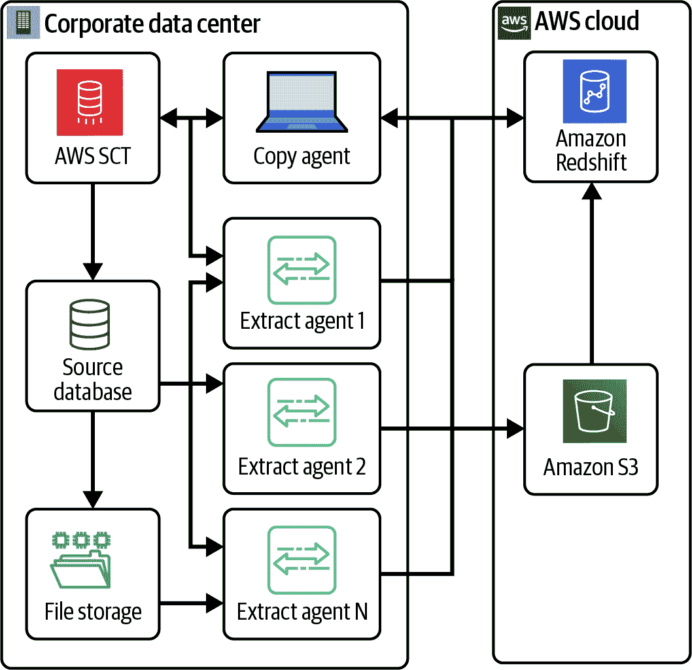
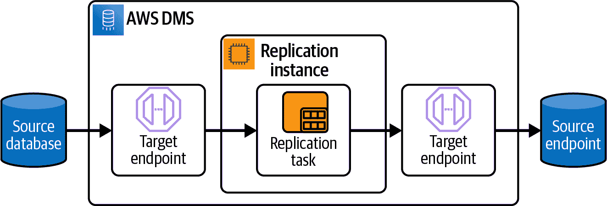
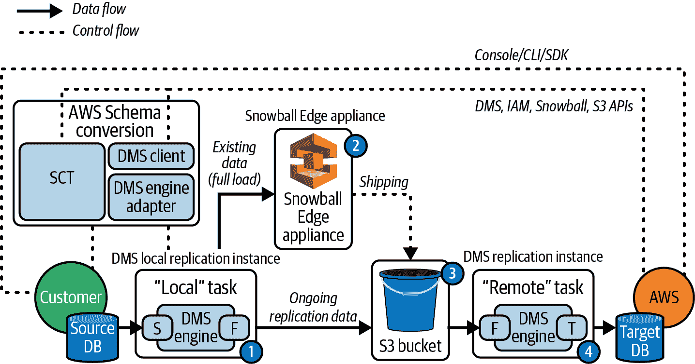
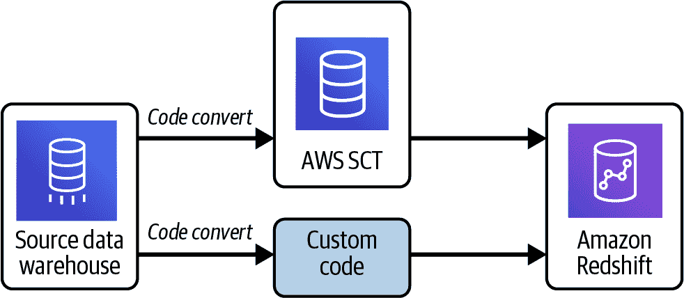
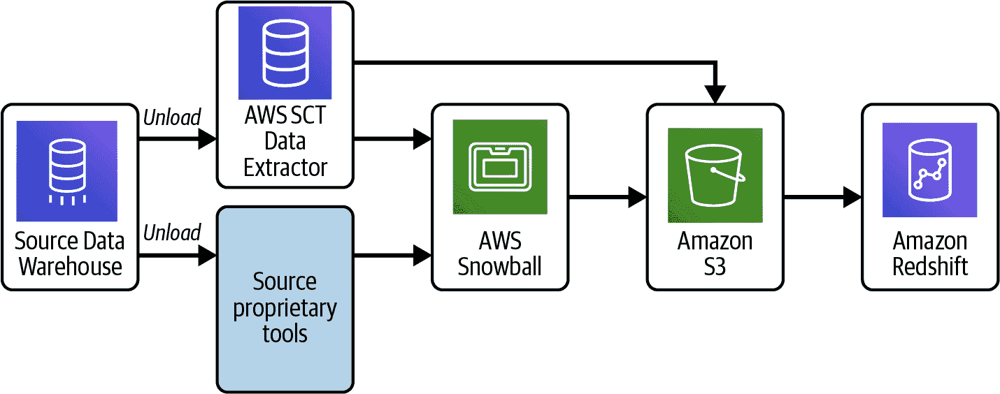
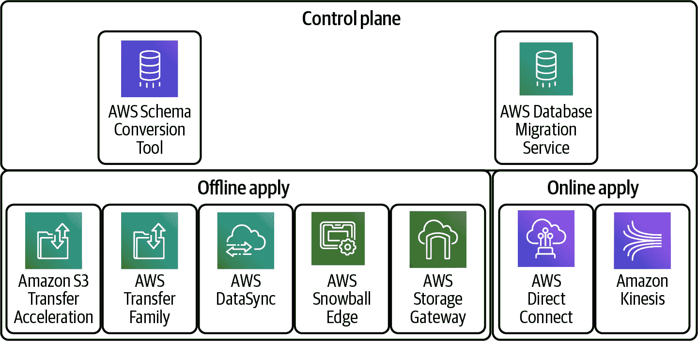

# 第九章：迁移到 Amazon Redshift

组织多年来一直在本地数据仓库上运行，并且这些数据仓库对昨天的工作负载非常有用。但今天的数据量、种类和速度要求客户现代化他们的数据仓库，以确保最佳性能。以下是传统数据仓库的一些主要限制或缺陷：

获取速度慢

自己采购服务器并调整它们的大小比在云中配置基础设施要花费更长的时间。

维护成本高昂

它们的结构如此严格，以至于任何修改都意味着成本和项目时间表的急剧增加。

弹性

硬件组件迟早会出现故障。围绕故障设计冗余，并拥有多个数据中心和待命服务器会非常快速地增加成本。

不灵活的架构

每个企业的首要需求是敏捷性和可扩展性。传统数据仓库的不灵活架构几乎无法快速进行变更。

技术进步

每天都有技术进步。您为业务建立的传统数据仓库可能已经是几年前的事情了。因此，您已经落后了。

要解决这些限制，一个选择是为您的分析需求采用 Amazon Redshift，因为它是一个完全托管的、快速、可扩展且成本效益高的服务，使您能够从所有数据中获取洞察。

然而，数据仓库迁移项目可能非常复杂和具有挑战性。很容易低估迁移过程的复杂性，导致对需要迁移的内容、所需时间以及所需资源缺乏清晰的认识。

本章将涵盖“迁移考虑”，然后讨论“迁移策略”以及 AWS 原生的“迁移工具和服务”。这些主题将帮助您清楚地概述迁移的复杂性，并为您提供挑战的明确认识。

然后我们将详细讨论实际的“数据库迁移过程”，最后讨论如何“加速您的 Amazon Redshift 迁移”。

# 迁移考虑

数据仓库迁移项目在项目复杂性方面可能具有挑战性，并可能暴露与资源、时间和成本相关的风险。在开始数据仓库迁移之前，请考虑应用“现代数据架构”中涵盖的原则，并重新评估您未来状态的数据仓库架构。仅仅因为您当前数据库中有所有这些表并不意味着您必须将它们全部迁移到 Amazon Redshift。评估如何利用此机会并现代化您的整体数据仓库战略。

## 废弃与保留

迁移到任何新平台都是审视您的数据占用情况的机会，消除冗余或未使用的数据和报告。您可以从分析报告的使用情况开始，并识别是否存在未使用的报告。审查随时间积累的报告，并消除不再使用的报告。除非您的组织有定期的重新认证过程，否则很可能只是生成了报告而实际上并未使用。

这种情况最常见的原因之一是*业务流程随时间的演变*，一旦发生这种情况，较旧的报告就不再提供它以前提供的价值。满足新流程的紧迫性和推动力更重要，而较旧的报告通常会被搁置。

另一个常见原因是*报告老化*：报告按照要求构建，非常有用，但其背后的数据已经增长，现在报告占据了太多页面。因此，委托建立了一个新的高级或摘要报告，原始报告仍然被使用，尽管不频繁，最终根本不再使用。如果确定与数据集关联的所有报告都不再需要，则可以彻底从 ETL 过程中删除该数据集。

审查当前数据仓库中积累的数据，并分类需要高性能查询执行与不需要严格执行 SLA 要求的查询数据。考虑现代数据架构，如之前介绍的“现代数据架构参考架构”。

清理掉任何不再需要的现有备份方案或表格，并在可能的情况下删除这些对象。要保留任何必需的备份表格，您可以使用`unload`命令，如示例 7-27 所示，并将这些表格卸载到您的 Amazon S3 存储桶中。Amazon S3 为您存储的对象提供多种存储类别。根据您的使用情况和性能访问需求选择 S3 存储类别；请查看各种[Amazon S3 存储类别](https://oreil.ly/tzKAn)。在`unload`之后，您可以应用[S3 生命周期配置](https://oreil.ly/tuk9u)策略，并将 S3 备份文件移动到更便宜的存储类别。还需审查[将对象过渡到不同 S3 存储类别的考虑因素](https://oreil.ly/PGlzY)以制定这些规则。

您可以使用 Amazon S3 Glacier Instant Retrieval 存储类别，Amazon Athena 可以查询。但要使用 S3 Glacier Flexible Retrieval 或 S3 Glacier Deep Archive 存储类别下的对象，您需要将恢复的对象复制回 Amazon S3 以更改其存储类别。

一旦完成所有必要的清理工作，下一步是选择合适的迁移策略。这基于您的源数据仓库景观以及迁移到 Amazon Redshift 所需的转换量。这将减少数据仓库迁移项目的复杂性和风险。

可影响您迁移策略决策的关键因素包括：

+   迁移数据量

+   需要的转换

+   数据波动性和可用性

+   迁移和 ETL 工具

+   数据移动选项

+   使用域名系统

## 迁移数据大小

要迁移的源数据仓库的总大小取决于数据库的数量、这些数据库中模式的数量以及迁移范围内的这些模式中的对象数量。了解移至 Amazon Redshift 所需的数据源和数据域将有助于优化迁移项目的大小。

例如，您的源数据仓库有五个模式，并不意味着您在单个 Amazon Redshift 数据仓库上必须有五个模式。相反，您应该尝试隔离模式及其工作负载，评估是否可以启动多个 Amazon Redshift 数据仓库，并利用数据共享来提供工作负载隔离，正如我们在“数据共享用例”中详细介绍的那样。

## 需要平台特定的转换

您现有的数据仓库可能具有某些专有组件，特定于当前供应商。迁移到 Amazon Redshift 可能涉及数据映射和模式更改等转换。需要应用的数据转换复杂性将确定迁移所需的预处理时间。还要考虑您是否已将转换逻辑编码为存储过程并存储在您的模式本身。

利用这个机会现代化，并将 ETL 逻辑放在数据仓库之外。这将未来保护您的整体数据仓库设计，并且如果需要，使您能够独立地更换 ETL 工具或数据仓库技术堆栈。现代 ETL 工具将利用推送功能以基于其连接位置提供最佳性能。我们先前在第四章中讨论过数据转换策略，您可以利用联邦化来现代化转换过程，并且我们介绍了“AWS 模式转换工具”。

## 数据波动性和可用性要求

请注意您现有数据仓库的上线时间和可用性要求。这些要求可能由摄入速率、更新间隔以及最终用户的数据消费模式所决定。这些要求将影响您在数据仓库迁移项目中的选择。高数据变更率的源数据仓库可能需要严格的过渡窗口。如果迁移需要延长的服务停机时间，可能会导致更高的复杂性。您可以进行迁移测试以确保能够满足严格的过渡窗口。

如果在单源数据仓库上有多个逻辑工作负载，您可能会发现它们都具有相同的上线时间要求，因为它们共享相同的硬件。与各个业务利益相关者确认，讨论在多个目标 Amazon Redshift 数据仓库中的工作负载隔离，并且每个业务利益相关者有机会单独确定其[自己的 RTO 和 RPO 目标](https://oreil.ly/VqPHN)。我们在“Migration Strategies”中深入探讨不同的过渡选项。

## 选择迁移和 ETL 工具

选择迁移工具至 ETL 可能会影响迁移项目。当迁移到 Amazon Redshift 时，您可以选择将 ETL 工作流迁移到新的 AWS 本地服务，如[AWS Glue ETL](https://oreil.ly/egGZ8)，并利用[AWS Glue Studio visual editor](https://oreil.ly/Zv8Z5)，或者保留现有的 ETL 工具。您可以根据项目的时间表和预算权衡利弊，并计划 ETL 迁移。您可以采取迭代方法，首先迁移数据仓库，保留现有 ETL 工作流工具，最终迁移 ETL 工作流。在规划迁移项目的时间表时，考虑这些工具的部署和设置所需的额外时间，可以简化执行周期。我们将在“Migration Tools and Services”中介绍 AWS 工具和服务。

## 数据移动考虑事项

数据仓库迁移涉及源数据仓库服务器与您的 AWS 基础设施之间的数据传输。根据当前网络容量及其现有利用率，您可以通过 Direct Connect 进行网络连接传输，详见“Private/Public VPC and Secure Access”，或选择通过离线服务如[AWS Snow Family](https://aws.amazon.com/snow)进行数据传输。

数据仓库大小在 10 TB 以下时可以考虑通过网络传输进行迁移，但通常情况下，更高的数据量会使用 AWS Snowball Edge 设备进行迁移。我们介绍 AWS Snow 系列设备，包括 AWS Snowball Edge，以及在不同网络连接下传输 10 TB 数据的预估时间，详见“AWS Snow Family”。

## 域名系统（DNS）

您的数据仓库的使用者将使用当前数据仓库名称或 IP 地址来建立到数据仓库的连接。迁移到新的数据仓库将需要应用程序修改其连接设置，指向新的数据仓库。如果您已经使用 DNS 服务，则此迁移项目将最小化对消费者应用程序的影响。如果没有，那么现在是在您的架构中引入 DNS 层的好时机。此 DNS 层还可以在灾难场景中通过自动切换到次要区域来帮助；参考[Route 53 故障转移类型](https://oreil.ly/G_hrv)了解详情。

# 迁移策略

根据源数据仓库的数据速率和可用性要求，有三种主要的迁移策略可供选择：

+   单步迁移

+   两步迁移

+   迭代迁移

## 单步迁移

单步迁移要求您冻结当前数据库并通过停止所有摄入作业来禁止更改。然后，提取时点数据库快照到 CSV 文件或列格式，如 Parquet。然后，根据您的连接选项，您可以使用现有网络或 AWS Snow Family 服务（如 AWS Snowball）将数据集传送到 Amazon S3，以加载到 Amazon Redshift 中。然后，使用源的冻结快照测试目标 Amazon Redshift 数据仓库以确保数据一致性。在所有验证通过后，您将切换现有数据库的使用者到 Amazon Redshift。这对于不需要持续可用性并且具有可接受的时间窗口（如周末或几天）来执行迁移的数据库是一个不错的选择。

如果您现有的数据仓库主要是批处理导向的，那么根据批处理间隔，单步迁移可能是一个很好的选择。

## 两步迁移

这通常用于需要连续运行的数据库，如连续复制。在迁移过程中，源数据库允许持续的数据变更，并且您需要一个持续的复制过程来保持源数据仓库和 Amazon Redshift 之间数据变更的同步。两步迁移策略的详细步骤如下：

### 初始数据迁移

初始数据通过之前描述的单步迁移方法迁移到 Amazon Redshift。在最小使用期间从源数据库提取此数据快照，以减少对持续活动的影响。为了捕获初始快照后的变更，您可以同时启用变更日志。如果您的所有表中都有日期时间戳表示的更新时间，您还可以使用日期时间戳来捕获初始快照后的变更。您将通过运行验证脚本和/或业务用户测试报告来进行测试，以确保数据一致性。

### 变更数据迁移

在初始数据迁移后，在切换之前，将源数据库中发生变化的数据传播到目标数据库。您的迁移工具可以通过持续的复制作业来实现这一点，或者您可以像之前提到的那样使用日期时间戳来识别变更的数据。第二步是通过同步源和目标数据库来验证目的地数据库中的所有已更改数据。在所有验证通过后，可以将现有数据库的使用者切换到 Amazon Redshift。

## 迭代迁移

此迁移方法适用于大规模数据仓库迁移项目。迭代迁移的原则是将复杂的迁移项目谨慎地划分为多个系统化的迭代。此策略通过将总体风险分解为多个较小的部分，显著降低了迁移项目的复杂性和整体风险。

您从覆盖多个数据源和主题领域的工作负载开始，通常涵盖中等复杂性区域，然后在每个后续迭代中添加更多数据源和主题领域。这种方法的挑战在于能够将整体迁移项目分解为多个逻辑迭代。有关如何使用基于迭代的迁移方法识别和分组从源数据仓库迁移到 Amazon Redshift 的数据源和分析应用程序的更多详细信息，请参阅博客[“开发应用迁移方法论，以现代化 Amazon Redshift 数据仓库”](https://oreil.ly/fzDAA)。

使用这种策略，您在完全淘汰成功迁移的特定工作负载之前，在一定时间内同时运行源数据仓库和 Amazon Redshift 生产环境。此外，在进入下一迭代时，如果可行，您可以缩小源系统以适应工作负载的减少。

参考图 9-1，以可视化我们讨论的三种迁移策略。


###### 图 9-1\. 迁移策略

而且，为了指导您的迁移策略决策，请参考表 9-1，将考虑因素与首选迁移策略进行映射。

表 9-1\. 迁移策略决策

| 迁移策略 | 单步迁移 | 两步迁移 | 迭代迁移 |
| --- | --- | --- | --- |
| 迁移范围中的主题区域数量 | 小 | 中等到大 | 大 |
| 数据传输量 | 小 | 小到大 | 大 |
| 迁移过程中的数据变更率 | 无 | 最小 | 最小到频繁 |
| 数据转换复杂性 | 小 | 中等 | 任意 |
| 从源到目标切换的迁移更改窗口 | 几小时到几天 | 几天 | 几分钟 |
| 迁移项目持续时间 | 周 | 几周到几个月 | 多个月 |

# 迁移工具和服务

您的数据仓库迁移到 Amazon Redshift 将涉及模式对象和数据的迁移。源端的对象包括模式、表、视图、物化视图以及代码对象，如函数、存储过程和包。Amazon Redshift 不支持的某些对象，如序列、触发器和索引，将不会被迁移。

虽然您可以通过 [Amazon Redshift 合作伙伴](https://oreil.ly/GLUTP) 和 [AWS 专业服务](https://oreil.ly/xys8u) 的组合找到实际帮助，但本节重点介绍 AWS 原生工具和服务。这些工具和服务可以用来从多种源数据仓库引擎迁移到 Amazon Redshift，如 表 9-2 所述。

## AWS Schema Conversion Tool

[AWS SCT](https://oreil.ly/fluxt) 是一个桌面应用程序，提供基于项目的用户界面，自动将源数据库的数据库架构转换为与目标 AWS 本地数据库兼容的格式。它支持多种类型的源和目标数据库。使用 AWS SCT 将现有数据库架构从一个数据库引擎转换为另一个。AWS SCT 支持多个行业标准，包括联邦信息处理标准 (FIPS)，用于连接到 Amazon S3 存储桶或其他 AWS 资源。AWS SCT 还符合联邦风险和授权管理计划 (FedRAMP)。

AWS SCT 支持以下数据仓库架构转换，并提供了必须授予的特定源权限、建立安全连接的详细信息、该源的任何已知限制，以及如何定向 Amazon Redshift 的转换设置和优化设置。

表 9-2\. SCT 源支持的 Amazon Redshift 目标

| 源数据仓库 | 版本 | 所需设置 |
| --- | --- | --- |
| Amazon Redshift | 任意 | [Amazon Redshift 作为源](https://oreil.ly/8Ul5v) |
| Azure Synapse | 任意 | [Azure Synapse Analytics 作为源](https://oreil.ly/IPnVK) |
| BigQuery | 任意 | [BigQuery 作为源](https://oreil.ly/Pi_Z8) |
| Greenplum | 4.3 和 6.21 | [Greenplum 作为源](https://oreil.ly/81HBB) |
| MS SQL Server | 2008 或更高版本 | [SQL Server 数据仓库作为源](https://oreil.ly/RYHD5) |
| Netezza | 7.0.3 或更高版本 | [Netezza 作为源](https://oreil.ly/nbWfU) |
| Oracle | 10.1 或更高版本 | [Oracle 数据仓库作为源](https://oreil.ly/TL7a2) |
| Snowflake | 3 或更高版本 | [Snowflake 作为源](https://oreil.ly/FSfR9) |
| Vertica | 7.2.2 或更高版本 | [Vertica 作为源](https://oreil.ly/LcJUG) |
| Teradata | 13 或更高版本 | [Teradata 作为源](https://oreil.ly/_65vV) |

Table 9-2 在撰写时是最新的，但请参阅[最新的数据仓库源](https://oreil.ly/wWjxS)。

另外，AWS SCT 还支持将以下 ETL 过程转换为目标 AWS 服务；参考 Table 9-3。

表 9-3\. SCT 支持的 ETL 转换

| 源 | 目标 |
| --- | --- |
| Microsoft SQL Server Integration Services (SSIS) ETL 包 | AWS Glue 或 AWS Glue Studio |
| 包含 Teradata Basic Teradata Query (BTEQ) 嵌入命令的 Shell 脚本 | Amazon Redshift RSQL |
| Teradata BTEQ ETL 脚本 | AWS Glue 或 Amazon Redshift RSQL |
| Teradata FastExport 作业脚本 | Amazon Redshift RSQL |
| Teradata FastLoad 作业脚本 | Amazon Redshift RSQL |
| Teradata MultiLoad 作业脚本 | Amazon Redshift RSQL |

### SCT 概述

AWS SCT 自动执行大部分模式对象转换。但由于源数据库引擎可能具有多种不同的功能和能力，AWS SCT 尽可能在 Amazon Redshift 中创建等效模式。AWS SCT 允许您提供源数据仓库统计信息，以便优化数据仓库的转换方式。您可以直接从数据库收集统计信息，或者上传现有的统计文件。

AWS SCT 根据源表的主键和外键自动为 Redshift 表分配分发样式和排序键。具有单列主键的源表被分配为键分发样式，并将主键列设置为分发键以及排序键。具有多列主键的源表被分配为键分发样式，第一个主键列被设置为分发键，并将所有源主键列添加为复合排序键。

### SCT 迁移评估报告

AWS SCT 提供了一个数据库 [迁移评估报告](https://oreil.ly/-1Vky)，其中列出了数据库对象及其转换复杂度。该报告包括执行摘要、许可评估、云就绪性（指示源数据库中目标不可用的任何特性）以及有关转换服务器对象、备份建议和链接服务器更改的建议。最重要的是，该报告包括为目标 DB 实例编写等效代码所需的工作复杂度估计，这些代码无法自动转换。

报告将这些模式项转换所需的估计时间分类如下：

简单

可在两小时以内完成的操作。

中等

复杂且需要两至六小时完成的操作。

显著

非常复杂且需要超过六小时完成的操作。

使用 AWS SCT，您可以管理目标 Amazon Redshift 的排序键和分布键，映射数据类型和对象，并创建手动转换。 如果某些对象无法自动转换，则 SCT 会为您提供可能的手动操作列表。 AWS SCT 为您创建转换后模式的本地版本供您审核。 您可以更新源模式并重试，或执行手动转换。 当准备就绪时，您可以将转换后的模式应用于 Amazon Redshift 目标。

### SCT 数据提取代理

在某些迁移场景中，源数据库和目标数据库彼此非常不同，需要额外的数据转换。 AWS SCT 是可扩展的，因此您可以使用代理来处理这些情况。 代理是与 AWS SCT 集成的外部程序，但在其他地方执行数据转换（例如在 Amazon EC2 实例上）。 另外，AWS SCT 代理可以代表您与其他 AWS 服务交互，例如为您创建和管理 AWS 数据库迁移服务任务。 它还帮助您增加加载到 Redshift 的任务并行性。 使用 AWS [SCT 数据提取代理](https://oreil.ly/BkWre) 从您的本地数据仓库中提取数据并迁移到 Amazon Redshift。 SCT 代理提取您的数据并将数据上传到 Snowball Edge 设备或通过网络直接上传到 Amazon S3。 Snowball Edge 设备被运送到 AWS，一旦接收到，数据将卸载到您指定的 S3 上。 对于大规模迁移，我们推荐使用 Snowball Edge 设备，它不会给您的网络带来额外负担，我们在“AWS Snow Family”中进行了介绍。 然后，您可以使用 AWS SCT 将数据复制到 Amazon Redshift，使用 SCT 复制代理，如图 9-2 所示。



###### 图 9-2. AWS SCT 代理流程

当您的源数据库服务器支持最多 120 个连接，并且您的网络附加了足够的存储时，此配置非常有用。 当您在源数据仓库上有分区表并且可以并行提取大量数据集时，尤其是在数据仓库迁移的初始加载阶段，这种方法也非常有用。

将 AWS SCT 数据提取代理安装在尽可能靠近数据源的位置，以提高数据迁移性能和可靠性。 为了增加数据迁移速度，请并行使用多个 AWS SCT 代理。

或者，您可以使用 AWS DMS，我们在“数据仓库迁移服务”中介绍，将数据迁移到 Amazon Redshift。 AWS DMS 的优点在于能够执行持续的复制（变更数据捕获）任务。 您还可以使用 AWS SCT 和 AWS DMS 的组合方法。 使用 AWS SCT 进行初始加载，使用 AWS DMS 进行持续复制任务。

### 将 BLOB 迁移到 Amazon Redshift

Amazon Redshift 不支持存储二进制大对象（BLOB）。但是，如果您需要将一个或多个 BLOB 迁移到 Amazon Redshift，AWS SCT 可以执行迁移。AWS SCT 使用 Amazon S3 存储桶来存储 BLOB，并将对象在 Amazon S3 中的 URL 写入目标数据库的表列中。

我们建议对非常大型数据仓库迁移使用 AWS SCT，对小到中型数据仓库迁移使用 AWS DMS。AWS SCT 代理通过数据压缩、支持表分区的并行迁移以及不同的配置设置，比 AWS DMS 快 15%到 35%。

## 数据仓库迁移服务

AWS DMS 是一个托管的迁移和复制服务，帮助您将数据库工作负载迁移到 AWS。AWS DMS 支持 20 多种数据库引擎和分析引擎之间的迁移。通过 AWS DMS，您可以发现源数据存储，转换源模式并迁移数据。

使用[DMS Fleet Advisor](https://oreil.ly/P3tmR)来发现您的源数据基础设施。该服务从您的本地数据库和分析服务器收集数据，并构建一个服务器、数据库和模式的清单，您可以将其迁移到 AWS 云上。

使用[DMS 模式转换](https://oreil.ly/wp-O5)从源数据库引擎迁移到 AWS 数据库引擎。该服务自动评估并转换您的源模式到新的目标引擎。或者，您可以将 AWS SCT 下载到本地机器上，按照“AWS 模式转换工具”中描述的方式转换源模式。

在转换源模式并将转换后的代码应用到您的 Amazon Redshift 后，您可以使用 AWS DMS 迁移数据。您可以执行一次性迁移或复制持续变更以保持源和目标同步。由于 AWS DMS 是 AWS 云的一部分，您可以享受 AWS 服务提供的成本效益、市场速度、安全性和灵活性。



###### 图 9-3\. AWS DMS 复制过程

### AWS DMS 的工作原理

AWS DMS 是 AWS 云中运行复制软件的服务器（见图 9-3）。您需要创建源和目标连接来告诉 AWS DMS 从哪里提取数据和加载到哪里。然后，您可以调度在此服务器上运行的任务来移动您的数据。AWS DMS 会在目标上创建表和相关的主键（如果它们在目标上不存在）。如果您愿意，您可以自己创建目标表，或者您可以使用 AWS SCT 创建部分或全部目标数据库对象。

AWS DMS 支持初始加载任务以及持续复制或变更数据捕获（CDC）任务，以迁移新进入源数据仓库的数据。值得注意的是，较大的数据仓库迁移可能包括多个 TB 的数据。在现有网络上执行复制过程可能会因网络带宽限制而变得繁琐。AWS DMS 可使用 AWS Snow Family 的一部分 AWS Snowball Edge 和 Amazon S3 来迁移大型数据库。虽然 AWS DMS 允许对没有主键或唯一键的源表进行复制，但 CDC 延迟可能较高，导致性能水平不可接受。因此，始终为每个源表定义主键是一种最佳实践。

如果源表上未定义主键且您不希望更改源表，则可以使用 [DMS 转换规则来定义合成主键，通过连接多个源列](https://oreil.ly/CrVOg)，然后告诉 DMS 它是该表的主键。但是，这种方法要求在源数据库上增强日志记录，即使只有少数列实际发生变化，也需捕获表的所有列。

在持续复制期间，识别源数据库系统与 AWS DMS 复制实例之间的网络带宽至关重要。确保网络在持续复制过程中不会造成任何瓶颈。还要识别源数据库系统每小时的变更率和归档日志生成率。这样做可以帮助您了解持续复制过程中可能获得的吞吐量。

AWS DMS 使用按使用量付费的模式。您只在使用 AWS DMS 资源时付费，而不是传统许可模型的前期购买成本和持续维护费用。AWS DMS 自动管理迁移所需的所有硬件和软件的部署、管理和监控。

AWS DMS 自动管理支持迁移服务器的所有基础设施，包括硬件和软件、软件打补丁和错误报告。AWS DMS 还提供自动故障转移功能；如果您的主复制服务器由于任何原因发生故障，备用复制服务器可以接管服务而几乎不会中断服务。

将 AWS SCT 和 AWS DMS 代理安装在不同的机器上。确保 AWS DMS 代理安装在与 ODBC 驱动程序和 AWS Snowball Edge 客户端相同的机器上，以实现高效性能，详细信息请参阅 “AWS Snowball Edge 客户端”。

使用 AWS DMS 可创建三种迁移任务之一：

迁移现有数据（仅全量加载）

执行从源端点到目标端点的一次性迁移。

迁移现有数据并复制持续变更（全量加载和 CDC）

执行一次性从源到目标的迁移，然后继续从源到目标复制数据更改。

仅复制数据更改（仅 CDC）

不执行一次性迁移，而是继续从源到目标复制数据更改。

以下是 AWS DMS 加载数据到 Amazon Redshift 目标的步骤：

1.  AWS DMS 将数据从源写入 CSV 文件到复制服务器。

1.  AWS DMS 使用 AWS SDK 将 CSV 文件上传到您在您的帐户中指定的 S3 存储桶。

1.  然后 AWS DMS 在 Amazon Redshift 中发出`COPY`命令，将数据从 CSV 文件复制到目标 Amazon Redshift 表中。

1.  对于持续复制，AWS DMS 首先将数据加载到临时表，然后按以下方式运行 DML 语句：

    1.  使用增强日志记录

        1.  插入的源行 → 插入到目标

        1.  删除的源行 → 删除到目标

        1.  更新的源行 → 删除并插入到目标

    1.  使用部分日志记录

        1.  插入的源行 → 插入到目标

        1.  删除的源行 → 删除到目标

        1.  更新的源行 → 更新到目标

如果您在 Amazon Redshift 目标中使用[增强 VPC 路由](https://oreil.ly/EuQXq)，则所有 Amazon Redshift 集群与数据存储库之间的`COPY`流量都通过您的 VPC。如果未启用增强 VPC 路由，Amazon Redshift 将通过 Internet 路由流量，包括 AWS 网络内其他服务的流量。如果未启用此功能，则无需配置网络路径。但是，如果启用了此功能，则必须明确创建集群 VPC 与数据资源之间的网络路径。您可以配置[VPC 终端节点](https://oreil.ly/Bv2jc)或[VPC 中的网络地址转换（NAT）网关](https://oreil.ly/b1Ztm)。

您还可以使用 AWS KMS 密钥对推送到 Amazon S3 的数据进行加密，然后加载到 Amazon Redshift 目标。您只需具备适当的 IAM 角色与 AWS 托管策略，并指定带有宽容密钥策略的 KMS 密钥 ARN，即可在 AWS DMS 设置中使用。

AWS DMS 还具有列出的资源配额和约束，请参阅[AWS 数据库迁移服务的资源配额](https://oreil.ly/baRxg)。

此外，您可以参考[“使用亚马逊 Redshift 优化 AWS 数据库迁移服务性能”](https://oreil.ly/PaF-I)白皮书。

### DMS 复制实例

对于性能而言，适当大小的复制服务器至关重要。一些较小的亚马逊 EC2 实例类别已足以用于测试服务或小规模迁移。但是，如果您的迁移涉及大量表，或者打算同时运行多个复制任务，请考虑使用具有相对较多内存和 CPU 的较大 EC2 实例之一。

C5 实例类别专为处理计算密集型工作负载而设计。AWS DMS 可能会消耗大量 CPU 资源，特别是在大规模迁移到 Amazon Redshift 时。

R5 实例类别为内存优化，适用于内存密集型工作负载。使用 AWS DMS 进行高吞吐量事务系统的持续复制任务迁移或复制可能会消耗大量 CPU 和内存。建议使用 R5 实例，因为每个 vCPU 包含更多内存。

由于 AWS DMS 服务器是 AWS 云中的计算资源，因此您的 AWS DMS 迁移任务的性能取决于：

+   源端资源可用性

+   可用网络吞吐量

+   复制服务器的资源容量

+   目标端接收更改的能力

+   源数据类型和分布

+   需要迁移的对象数量

您可以通过使用多线程任务设置来提高 Amazon Redshift 目标端点的全量加载和 CDC 任务的性能。它们允许您指定并发线程数和要存储在缓冲区中的记录数。

参考 [AWS DMS 最佳实践](https://oreil.ly/6OXH_)，其中涵盖了广泛的建议。

### DMS 复制验证

AWS DMS 支持数据验证，以确保您的数据从源到 Amazon Redshift 的准确迁移。如果启用验证，则在表的全量加载后立即开始验证。验证会比较正在进行的复制任务的增量变化。当为仅复制任务启用验证时，然后在开始新数据验证之前验证表中所有现有数据。

在数据验证阶段，AWS DMS 将每行源数据与目标数据进行比较，验证它们是否包含相同的数据，并报告任何不匹配。为实现此目的，AWS DMS 发出适当的查询以检索数据。

DMS 验证查询会在源和目标端消耗额外资源，以及额外的网络资源，因此请确保适当调整 DMS 实例的大小。

数据验证需要额外的时间，超出迁移本身所需的时间。额外的时间取决于迁移了多少数据。

将迁移或复制任务的数据验证部分拆分为单独的仅验证任务。这样可以控制验证发生的确切时间，并通过为验证任务使用单独的 DMS 实例减少主复制实例的负载。同时，单独的验证任务允许您在运行该任务时快速确定有多少行不匹配。

源端主键值用于跟踪持续复制变更。在源表上运行更改或删除操作，这些操作会更改或删除主键值，将需要 AWS DMS 运行完整验证扫描。除非用于小型参考数据源表，否则这是一项昂贵且耗时的任务。

表 9-4 总结了我们迄今讨论过的 AWS 迁移工具。

表 9-4\. AWS DMS 与 AWS SCT 对比

| AWS 数据库迁移服务 | AWS 模式转换工具 |
| --- | --- |
| 付费服务（有免费套餐） | 免费下载软件 |
| 服务器在 AWS 云上运行 | 安装在本地机器上 |
| 支持多个可用区以实现高可用性 | 一次只能处理一个机器 |
| 小于 10 TB 迁移 | 大于 10 TB 迁移 |
| 源数据库或目标数据库必须在 AWS 上 | 支持本地到本地转换 |
| 从源数据库表迁移数据到目标 | 将架构从一个数据库引擎转换为另一个 |
| 支持变更数据捕获（CDC） | 主要用于初始数据加载 |
| 可直接与目标数据库工作 | 可与 AWS Snowball Edge 工作 |
| 能够读写加密数据库 | 有限的加密支持，Amazon RDS 或 Amazon Aurora |

还有其他数据集成合作伙伴工具，如 Informatica、Matillion、SnapLogic、Talend 和 BryteFlow Ingest，特别是如果你已经对它们有所了解的话，可以考虑使用它们。

## AWS Snow Family

[AWS Snow Family](https://aws.amazon.com/snow) 设备用于将数据从您的数据中心移动到 AWS 基础设施，而无需依赖可能正在使用的现有网络，用于日常活动。当网络带宽限制不存在时，[AWS Storage Gateway](https://aws.amazon.com/storagegateway) 和 [AWS Direct Connect](https://aws.amazon.com/directconnect) 服务是很好的选择。您可以使用 AWS Snow Family 服务进行脱机数据传输。

让我们看看在不同网络链接上传输 10 TB 数据的预估时间（见表 9-5）。所需时间以天/小时/分钟/秒的格式表示，并假设你能获得整个带宽或额定速度。在共享线路上，通常可以获得额定速度的 1/10 至 1/25。

表 9-5\. 传输 10 TB 数据的预估时间

| 网络类型 | 额定速度 | 预估时间 | 共享（1/10） |
| --- | --- | --- | --- |
| T3/DS3 线路 | 45 Mbps | 20 天 13 小时 49 分钟 38 秒 | 205 天 18 小时 16 分钟 18 秒 |
| 快速以太网 | 100 Mbps | 9 天 06 小时 13 分钟 20 秒 | 92 天 14 小时 13 分钟 20 秒 |
| T4/DS4 线路 | 275 Mbps | 3 天 08 小时 48 分钟 29 秒 | 33 天 16 小时 04 分钟 51 秒 |
| 吉比特以太网 | 1000 Mbps | 0 天 22 小时 13 分钟 20 秒 | 9 天 06 小时 13 分钟 20 秒 |
| 10 吉比特以太网 | 10 Gbps | 0 天 02 小时 13 分钟 20 秒 | 0 天 22 小时 13 分钟 20 秒 |

在选择使用现有网络进行数据传输还是 AWS Snow 设备时，请考虑以下几点。

### AWS Snow Family 关键特性

Snow Family 设备具有计算资源，可在边缘收集和处理数据。这提供了在写入数据到 AWS Snow 设备时，在您的站点上运行预处理数据等转换的能力。

[AWS OpsHub](https://oreil.ly/08UmM) 是一个免费的图形界面工具，可帮助您轻松设置和管理 Snow 设备，并快速部署边缘计算工作负载，并将数据迁移到云端。您的本地应用程序可以将 Snow Family 设备作为网络文件系统（NFS）挂载点使用。支持 NFS v3 和 v4.1，因此您可以轻松地将 Snow 设备与现有的本地服务器和基于文件的应用程序配合使用。

每个 Snow 设备使用[E Ink](https://oreil.ly/AUIdX)航运标签进行防篡改跟踪，并通过 Amazon 简单通知服务（SNS）、短信和 AWS 控制台进行返回运输的自动标签更新。

所有迁移到 AWS Snow Family 设备的数据都会使用 256 位加密密钥自动加密，这些密钥由 AWS 密钥管理服务（KMS）管理。加密密钥永远不会存储在 AWS Snow 设备上，因此您的数据在传输过程中保持安全。

AWS Snow 设备具有可信平台模块（TPM），提供硬件信任根。每个设备在使用后都会进行检查，以确保设备的完整性，并帮助保护您数据的机密性。

### AWS Snow Family devices

AWS Snowcone 是 AWS Snow Family 边缘计算和数据传输设备中最小的成员。它提供 22 TB 的存储空间，4 个 vCPU，4 GB 内存，重量不到 5 磅。您可以使用 Snowcone 收集、处理并将数据移动到 AWS，可以通过邮寄设备离线使用，也可以通过[AWS DataSync](https://aws.amazon.com/datasync)在线使用。

AWS Snowball 是一个手提箱大小的，重 50 磅的数据迁移和边缘计算设备，提供两种设备选项——计算优化设备或存储优化设备：

Snowball Edge 存储优化设备

为本地处理提供 80 TB 硬盘驱动器（HDD）存储空间，1 TB SSD 存储空间，40 vCPU 和 80 GB 内存。非常适合大规模数据传输的大容量本地存储。

Snowball Edge 计算优化设备

为本地处理提供 28 TB SSD 存储空间，104 vCPU 和 416 GB 内存，并提供可选的 GPU，适用于断开连接环境中的高级机器学习和全运动视频分析等用例。

AWS Snowmobile 是一个用于将大规模数据迁移到 AWS 的百亿字节级数据迁移设备。您可以在一个 45 英尺长的强化运输集装箱中迁移高达 100 PB 的数据，由半挂卡车牵引。

当您使用 AWS Snow 设备时，数据迁移过程可以如图 9-4 所示进行可视化。

1.  您可以使用 AWS SCT 在本地提取数据并将其移动到 AWS Snowball Edge 设备中。

1.  您将边缘设备（们）运回 AWS。

1.  在 AWS 收到您的运输后，边缘设备会自动将其数据加载到 Amazon S3 存储桶中。

1.  AWS DMS 将 S3 文件应用到目标数据存储中。



###### 图 9-4。AWS Snowball 迁移过程

在 AWS DMS 中，您可以指定特定的时间戳或系统更改号（SCN）来启动 CDC。基于该时间戳或 SCN，将生成 CDC 文件。

您不能使用 AWS DMS 来使用 AWS Snowcone 设备迁移数据。您只能使用 AWS SCT 与 AWS Snowcone 设备一起使用。

## AWS Snowball Edge 客户端

Snowball Edge 客户端是一个独立的终端应用程序，您可以在本地服务器上运行它，以解锁 AWS Snow 设备并获取凭据、日志和状态信息。您还可以将多个 AWS Snow 设备集群成 Snowball Edge 集群。您可以使用此 Snowball Edge 客户端进行所有设置，包括设置网络、标签、启动和停止服务以及设置集群。有关 Snowball Edge 客户端命令的完整列表，包括使用示例和样本输出，请参阅[Snowball Edge 客户端命令](https://oreil.ly/5m33-)。

# 数据库迁移过程

在高层次上，迁移过程包括三个步骤。两步迁移策略和迭代迁移策略涵盖了所有三个迁移步骤。但请注意，迭代迁移策略会在多个迭代中运行，每个迭代都必须按照这些迁移过程步骤进行。由于只有不需要连续运行的数据库才适合单步迁移，因此在以下各节中概述的迁移过程中只需要步骤 1 和步骤 2，这是单步迁移策略所需的。

## 步骤 1：转换模式和主题区域

在这一步中，您需要转换源数据仓库的模式，使其与 Amazon Redshift 兼容（参见 Figure 9-5）。在进行实际转换之前，需要评估此转换的复杂性。您可以利用 AWS SCT 等模式转换工具，AWS 合作伙伴的其他工具，或者您可能已经具有专业知识的第三方提供商的工具。请记住，在某些情况下，您可能还需要使用自定义代码来进行复杂的模式转换，正如我们在“AWS 模式转换工具”中所探讨的那样。



###### 图 9-5\. AWS SCT 模式转换

## 步骤 2：初始数据提取和加载

在这一步中，您完成了初始数据提取，并首次将源数据加载到 Amazon Redshift 中（参见 Figure 9-6）。您可以创建 AWS DMS 加载任务或使用 AWS SCT 数据提取器从源数据仓库提取数据，如“SCT 数据提取代理”所述，并在数据大小和数据传输要求允许在互联网络上传输数据时将数据加载到 Amazon S3。或者，如果存在网络容量限制等限制，则可以将数据加载到 Snowball 以便转移到 Amazon S3。当源数据仓库中的数据在 Amazon S3 上可用时，将其加载到 Amazon Redshift，如“AWS Snow Family”中所述。



###### 图 9-6. AWS SCT 初始加载

## 第三步：通过数据捕获进行增量加载

这通常被称为 CDC 阶段、增量加载阶段或持续复制阶段。CDC 是一个捕获数据库中更改的过程，并确保这些更改复制到数据仓库等目标。在这一步骤中，您使用 AWS DMS 或 AWS SCT，有时甚至使用源数据仓库的本地工具来捕获和加载这些增量变更，从源到 Amazon Redshift。

图 9-7 显示了可用于数据迁移不同方面的 AWS 服务。



###### 图 9-7. AWS 数据迁移服务

现在您应该有足够的信息来开始为数据仓库制定迁移计划。与之前的部分一样，我们深入探讨了可以帮助您将数据仓库迁移到 Amazon Redshift 的 AWS 服务，并使用这些服务的最佳实践来加速数据仓库迁移项目的成功交付。表 9-6 总结了我们到目前为止所涵盖的内容。

表 9-6. 迁移操作摘要

| 评估 | 迁移 | 验证 |
| --- | --- | --- |
| 淘汰与保留 | 初始数据迁移 | 模式验证 |
| 迁移范围 | 持续变更复制 | 数据验证任务 |
| 数据可用性 | 迭代迁移 | 持续变更验证 |
| ETL 工具 | 模式转换 | 业务验证 |
| 数据移动选项 | 数据库迁移服务 | 切换 |
| 迁移评估报告 | AWS Snow 设备 |  |

# Amazon Redshift 迁移工具考虑事项

为了改善和加速数据仓库向 Amazon Redshift 的迁移，请考虑以下提示和最佳实践：

+   使用 AWS SCT 创建迁移评估报告并确定迁移工作的范围。

+   在可能的情况下使用 AWS SCT 自动化迁移。AWS SCT 可以自动创建大部分 DDL 和 SQL 脚本。

    +   当无法进行自动化模式转换时，使用自定义脚本进行代码转换。

+   尽可能将 AWS SCT 数据抽取代理程序安装在靠近数据源的位置，以提高数据迁移性能和可靠性。

    +   为了提高数据迁移性能，正确调整您的 Amazon EC2 实例及其等效的虚拟机，安装数据抽取代理程序。

    +   配置多个数据抽取代理程序以并行运行多个任务，通过最大化分配的网络带宽使用来提高数据迁移性能。

+   调整 AWS SCT 内存配置以提高模式转换性能。

    +   编辑`JavaOptions`部分以设置可用内存的最小和最大值。以下示例将最小值设置为`4 GB`，最大值设置为`40 GB`：

        ```
         [JavaOptions]
         -Xmx40960M
         -Xms4096M
        ```

+   使用 Amazon S3 存储大对象，例如来自现有数据仓库的图像、PDF 和其他二进制数据。

+   为了迁移大表，使用虚拟分区并创建子任务以提高数据迁移性能。

+   了解 AWS 服务（例如 Direct Connect、AWS Transfer Family 和 AWS Snow Family）的用例。

    +   选择合适的服务或工具以满足您的数据迁移需求。

    +   了解 AWS 服务配额并做出明智的迁移设计决策。

# 加速您的迁移到亚马逊 Redshift

有几个新功能可自动化您的架构转换，保留您对现有脚本、报告和应用程序的投资，加快查询性能，并降低迁移到亚马逊 Redshift 的总体成本。

AWS SCT 转换专有 SQL 语句，包括：

+   `TO_DATE()`函数

+   `CURSOR`结果集

+   `IDENTITY`列

+   带有不等谓词的`ANY`和`SOME`过滤器

+   具有`RESET WHEN`的分析函数

+   `TD_NORMALIZE_OVERLAP()`函数

+   `TD_UNPIVOT()`函数

+   `QUANTILE`函数

+   `QUALIFY`过滤器

请参阅这篇[自动化专有 SQL 语句的博客](https://oreil.ly/ettSl)获取更多详细信息。

在接下来的章节中，我们讨论了一些常见的迁移挑战，包括：

宏转换

宏是一种专有的 SQL 扩展。本质上，宏是 SQL 语句，可以接受参数，并可以从应用程序代码的多个入口点调用。您可以将宏视为不返回任何输出值的存储过程。

大小写不敏感的字符串比较

ANSI 兼容的字符串比较是区分大小写的，而且亚马逊 Redshift 是符合 ANSI 标准的，大写的“A”和小写的“a”是不同的。一些数据库支持大小写不敏感的字符串比较。在这里，“A” = “a”为`TRUE`，就好像两个操作数都转换为小写（或大写）进行比较。例如，在 Teradata 数据库中，大小写不敏感的排序是运行在`BEGIN TRANSACTION`和`END TRANSACTION`语义（BTET 模式）的默认会话模式，这是 Teradata 引擎的默认会话模式。

递归通用表达式

通用表达式（CTEs）是在大型复杂的 SQL 语句中封装查询逻辑的便捷方式。使用`WITH`子句定义 CTEs，主查询通过在`FROM`子句中引用它来使用 CTEs。

专有数据类型

截至本文撰写时，亚马逊 Redshift 不原生支持`INTERVAL`、`PERIOD`或`BLOB`数据类型。AWS SCT 包括`INTERVAL`和`PERIOD`数据类型的自动化、自动类型转换、二进制数据支持以及其他多个数据类型增强功能。

## 宏转换

尽管亚马逊 Redshift 本身不支持宏，AWS SCT 可以为您自动执行此转换。AWS SCT 将宏转换为亚马逊 Redshift 存储过程。

示例 9-1 展示了一个为员工加薪的宏示例。

##### 示例 9-1。宏的示例

```
CREATE MACRO Give_Emp_Raise (
  EmployeeNo  INTEGER,
  RaisePerc   DECIMAL(4,2)
)
AS
  (
  UPDATE
    Employee
  SET
    NetPay = NetPay * :RaisePerc
  WHERE
    EmployeeNo = :EmployeeNo ;
);
```

此宏将转换为显示在示例 9-2 中的存储过程，并在 Amazon Redshift 数据仓库中执行。

##### 示例 9-2\. 宏转换为存储过程

```
CREATE OR REPLACE PROCEDURE give_emp_raise (
  par_empl_nmbr    INTEGER,
  par_raise_perc   NUMERIC(4,2)
)
AS $BODY$
BEGIN
  UPDATE
    employee
  SET
    netpay = netpay * par_raise_perc
  WHERE
    employeenumber = par_empl_nmbr ;
END;
$BODY$
LANGUAGE plpgsql
```

AWS SCT 还将任何相应的宏调用转换为对应存储过程的调用，以减少手动转换。

## 不区分大小写的字符串比较

在 Amazon Redshift 中，区分大小写的比较是默认的语义。Amazon Redshift 默认使用正常的 ANSI 兼容语义。Amazon Redshift 现在作为数据库引擎的特性本地执行不区分大小写的比较。通过这一新特性，您可以在定义新数据库、新列或在表达式中使用列时启用不区分大小写的排序规则，如示例 9-3 所示。

##### 示例 9-3\. 不区分大小写的样例

```
CREATE DATABASE new_db collate case_insensitive;

CREATE TABLE new_db.test_case_sensitive
( default_col1      varchar(20)
, sensitive_col2    varchar(20) collate case_sensitive
, insensitive_col3  varchar(20) collate case_insensitive
)
;

INSERT INTO new_db.test_case_sensitive
VALUES ('Hello', 'hello', 'HELLO')
;
```

让我们比较默认列和显式声明的不区分大小写列与示例 9-4 中的查询。因为 `new_db` 的数据库默认值是 `C⁠A⁠S⁠E⁠_​I⁠N⁠S⁠E⁠N⁠S⁠I⁠T⁠I⁠V⁠E`，所以比较是不区分大小写的，字符串匹配。

##### 示例 9-4\. 不区分大小写的测试

```
SELECT 1 AS tst FROM new_db.test_case_sensitive
WHERE default_col1 = insensitive_col3;

 tst
 ---
  1
(1 row)
```

同样地，您可以覆盖列的大小写敏感性。在示例 9-5 中，我们将大小写敏感的列覆盖为 `CASE_INSENSITIVE`，并观察到比较再次匹配。

##### 示例 9-5\. 不区分大小写的 `test2`

```
SELECT 1 AS tst2 FROM new_db.test_case_sensitive
WHERE default_col1 = collate(sensitive_col2, 'case_insensitive');

 tst2
 ---
  1
(1 row)
```

请注意，Amazon Redshift 不会允许您直接比较 `CASE_SENSITIVE` 列与 `CASE_INSENSITIVE` 列（如示例 9-6）。

##### 示例 9-6\. 不区分大小写的测试 3

```
SELECT 1 AS tst3 FROM new_db.test_case_sensitive
WHERE sensitive_col2 = insensitive_col3;

 ERROR: Query with different collations is not supported yet.
 DETAIL:
 -----------------------------------------------
 error: Query with different collations is not supported yet.
 code: 1020
 context:
 query: 0
 location: parse_expr.c:613
 process: padbmaster [pid=17580]
```

为了避免这种情况，请确保适当地显式覆盖一个或两个操作数的排序规则。这是 SQL 代码的最佳实践，当显式应用排序规则时，将更容易理解。

## 递归公共表达式

Amazon Redshift 支持递归公共表达式（CTE）。递归 CTE 在查询层次数据（例如显示员工与经理之间报告关系的组织结构图）时非常有用。还请注意，AWS SCT 会自动转换具有递归 CTE 的查询。如果您创建了一个名为 `johns_org` 的视图，如示例 9-7 所示，SCT 将转换为 Amazon Redshift 中等效的视图。

##### 示例 9-7\. 递归 CTE 示例

```
WITH recursive
  john_org (id, name, manager_id, level)
AS
  (
    SELECT id, name, manager_id, 1 AS level
      FROM employee
     WHERE name = 'John'
  UNION ALL
    SELECT e.id, e.name, e.manager_id, level + 1 AS next_level
      FROM employee e, john_org j
     WHERE e.manager_id = j.id
       AND level < 4
  )
SELECT distinct id, name, manager_id
  FROM john_org
ORDER BY manager_id
;
```

## 私有数据类型

AWS SCT 会自动为您转换 `INTERVAL` 数据类型。AWS SCT 将 `INTERVAL` 列转换为 Amazon Redshift 中的 `CHARACTER VARYING` 列。然后 AWS SCT 将使用该列的应用程序代码转换为模拟 `INTERVAL` 语义。

考虑以下表格，其中有一个`MONTH`区间列。该表存储了不同类型的*缺席请假*以及每种请假类型的*允许持续时间*。您的应用程序代码使用`leave_duration`列，如示例 9-8 所示。在这里，`INTERVAL MONTH`字段被添加到当前日期上，以计算请假从今天开始时的结束日期。

##### 示例 9-8\. 区间示例

```
-- source table with INTERVAL data type
CREATE TABLE src_schema.employee_leaves
(
  leave_type_id INTEGER ,
  leave_name VARCHAR(100) CHARACTER SET LATIN ,
  leave_duration INTERVAL MONTH(2)
)
UNIQUE PRIMARY INDEX ( leave_type_id )
;

-- source view with interval logic implemented
CREATE VIEW src_schema.employee_leaves_projected
AS
SELECT
  leave_type_id,
  leave_name,
  leave_duration,
  current_date AS projected_start_date,
  current_date + leave_duration AS projected_end_date
FROM
  src_schema.employee_leaves
;
```

当 AWS SCT 将表转换为 Amazon Redshift 时，AWS SCT 会将`INTERVAL`替换为`VARCHAR`数据类型，如示例 9-9 中`leave_duration`列所示。现在由于数据存储为`VARCHAR`，AWS SCT 会将适当的`CAST`类型添加到 Amazon Redshift 代码中，以将字符串值解释为`MONTH`区间。然后，它会转换视图的算术逻辑，使用 Amazon Redshift 日期函数进行`dateadd MONTH`。

##### 示例 9-9\. 区间转换为日期

```
-- target table with VARCHAR data type
CREATE TABLE rs_schema.employee_leaves(
  leave_type_id INTEGER
, leave_name VARCHAR(100)
, leave_duration VARCHAR(64)
)
DISTSTYLE KEY
DISTKEY ( leave_type_id )
SORTKEY ( leave_type_id )
;

-- target view with interval logic implemented
CREATE OR REPLACE VIEW rs_schema.employee_leaves_projected
SELECT
  leave_type_id,
  leave_name,
  leave_duration,
  current_date AS projected_start_date,
  dateadd
    (MONTH,
     CAST (leave_duration AS INTEGER),
     CURRENT_DATE
     )::DATE AS projected_end_date
FROM
  rs_schema.employee_leaves
;
```

通过使用`VARCHAR`数据类型来存储`leave_duration`列，AWS SCT 减少了表转换失败的机会，从而提高了数据迁移成功的概率。如果需要进行一些手动重写，则很可能是视图中的 SQL 代码。

AWS SCT 会自动将`PERIOD`数据类型转换为两个相应的`DATE`（或`TIME`或`TIMESTAMP`）列在 Amazon Redshift 上。然后 AWS SCT 会转换使用该列的应用程序代码，以模拟源引擎的语义（见示例 9-10）。

##### 示例 9-10\. 期间示例

```
CREATE SET TABLE src_schema.period_table
(
  id INTEGER ,
  period_col PERIOD(timestamp)
)
UNIQUE PRIMARY INDEX (id);

CREATE VIEW src_schema.period_view_begin_end
AS
SELECT
  BEGIN(period_col) AS period_start ,
  END(period_col) AS period_end
FROM
  src_schema.period_table
;
```

AWS SCT 将示例 9-10 中`CREATE SET TABLE`语句中的`PERIOD(TIMESTAMP)`列转换为两个`TIMESTAMP`列，如示例 9-11 的`CREATE TABLE IF NOT EXISTS`命令所示。然后，它会转换视图`` period_view_begin_end` ``的应用程序代码，以使用这两个新的`TIMESTAMP`列：

##### 示例 9-11\. 期间转换为时间戳

```
CREATE TABLE IF NOT EXISTS
rs_schema.period_table
(
  id INTEGER ,
  period_col_begin TIMESTAMP ,
  period_col_end TIMESTAMP
)
DISTSTYLE KEY
DISTKEY ( id )
SORTKEY ( id )
;

CREATE OR REPLACE VIEW rs_schema.period_view_begin_end
AS
SELECT
  period_col_begin AS period_start ,
  period_col_end AS period_end
FROM
  rs_schema.period_table
;
```

# 概要

数据量正在以前所未有的速度增长。传统上，这些宝贵的资产仅供分析的一小部分。本地数据仓库具有不适合现代大数据分析用例的严格架构。这些传统数据仓库在软件和硬件方面都需要大量的前期投资。

我们介绍了 Amazon Redshift 如何帮助您分析所有数据，并在任何规模下实现低成本和可预测的性能。要将您的数据仓库迁移到 Amazon Redshift，您需要考虑一系列因素，例如数据仓库的总大小、数据变更速率和数据转换复杂性，在选择适当的迁移策略和过程之前，以减少数据仓库迁移项目的复杂性和成本。

使用 AWS 服务，如 AWS Schema Conversion Tool (SCT) 和 AWS Database Migration Service (DMS)，并采纳这些服务的建议和最佳实践，您可以自动化迁移任务，扩展迁移规模，并加快数据仓库迁移项目的交付。

在下一章中，我们将讨论监控和管理 Amazon Redshift 数据仓库的各个方面。
