# 第十章：监控与管理

> 你无法改进你不测量的东西。
> 
> 彼得·德鲁克

作为一个完全托管的云数据仓库，亚马逊 Redshift 不断监控您的数据库，并自动捕获和存储与资源利用率以及您在数据仓库上运行的工作负载相关的数据。作为数据仓库的用户，您可以专注于数据的摄取和分析，无需持续监控或管理。亚马逊 Redshift 使操作数据可供您监控，并处理异常以确保数据仓库的最佳性能。

你可以在亚马逊 Redshift 控制台上查看你的数据仓库操作指标，使用 AWS CloudWatch，并直接查询亚马逊 Redshift 系统表。在本章中，我们将从“亚马逊 Redshift 监控概述”开始，并深入探讨监控亚马逊 Redshift 预配置集群和无服务器的各种选项。我们将从“使用控制台进行监控”开始，并讨论“监控和管理无服务器”以及“使用控制台监控和管理预配置数据仓库”。然后我们将涵盖预配置集群和无服务器“使用亚马逊 CloudWatch 进行监控”和“使用系统表和视图进行监控”。如今，对于数据仓库工作负载来说，弹性和高可用性变得越来越重要。我们将介绍如何设置“高可用性和灾难恢复”以及“快照、备份和恢复”。由于监控细节存储在 Redshift 的表和视图中，您可以创建自定义可视化来监控数据仓库。我们将涵盖“使用自定义可视化工具监控亚马逊 Redshift”，帮助您了解如何使用您选择的工具创建自定义可视化。

# 亚马逊 Redshift 监控概述

亚马逊 Redshift 提供性能指标和数据，以便您可以跟踪集群和数据库的健康和性能。[Amazon CloudWatch](https://oreil.ly/rkTBj) 是一个监控服务，从 AWS 中的各种服务捕获日志和指标。亚马逊 Redshift 每分钟记录性能数据，并从 CloudWatch 指标和系统表中提供有关查询和加载数据的性能数据和统计信息。您可以使用控制台、CloudWatch 或系统表和视图来监控您的亚马逊 Redshift 工作负载和资源。通过亚马逊 Redshift 控制台，您可以查看 CloudWatch 指标以及查询/加载性能数据。此外，您可以使用 Amazon CloudWatch 查看系统利用率和性能信息，方法是使用标准仪表板模板或创建自定义模板。

你可以利用这些信息来识别和诊断处理时间长的工作负载，并创建阻碍其他工作负载高效执行的瓶颈。监控和诊断的应用场景源自用户的问题，可以归类为监控、故障排除和优化活动。我们将在以下章节中讨论一些常见问题。

## 监控

*监控* 是一种主动的活动，你希望积极寻找数据仓库中的异常情况，以确保可以制定流程来避免因系统故障而导致的停机。这些问题包括：

+   我的数据仓库在查询性能和资源利用率方面表现如何？

+   我的数据仓库吞吐量、并发性和延迟如何？

+   查询是否在我的集群中排队？

+   目前有哪些查询或加载正在运行？

+   哪些查询或加载花费的时间比平时长？

+   最近一小时或最近 24 小时内持续时间最长的查询是什么？

+   哪些查询失败了？

+   我的数据仓库平均查询延迟是随时间增加还是减少？

+   我应该何时考虑扩展或工作负载隔离，以避免资源不足？

## 故障排除

当发生事件并且你正忙于解决问题时，你处于反应模式，Redshift 控制台为你提供以下选项：

+   有用户在特定时间抱怨性能问题。如何识别那个 SQL 并诊断问题？

+   我的查询运行缓慢时，还有哪些查询在运行？所有查询都运行缓慢吗？

+   我的数据库是否被其他用户的查询过载？我的队列深度是增加还是减少？

+   如何识别特定用户运行的查询？

+   我的数据仓库资源使用率非常高。如何查找正在运行的查询？

## 优化

当你最初为数据仓库设计数据模型时，你会基于某些关于数据使用方式的假设。然而，用户的查询模式可能与这些假设不同。通过监控，你可以识别出可以优化数据仓库以提升性能和利用率的领域：

+   如何优化我们最终用户编写的 SQL？

+   是否需要优化我的模式设计？

+   我的 WLM 队列是否需要调整？

+   如果启用并发缩放，我能得到什么好处？

+   我可以主动监控工作负载以防止运行失控的查询吗？

# 使用控制台进行监控

Amazon Redshift 控制台提供监控仪表板和选项，用于创建和管理 Amazon Redshift 数据仓库。控制台利用来自 Amazon CloudWatch 和其他系统表的数据，为您提供有关数据库的整体资源利用率和性能指标的见解。这些指标适用于预配置和无服务器数据仓库，并可在相应的仪表板屏幕中查看。无论是无服务器还是预配置的集群仪表板，都有一个显示所有账户中所有命名空间或集群的指标的主仪表板。您可以查看所有命名空间的指标，也可以选择特定的命名空间或集群以监视特定的数据仓库。使用控制台帮助您通过在一个位置查看数据仓库的健康状况和性能来简化数据仓库的管理。控制台监控指标在控制台的各个部分中组织，我们将在接下来的章节中讨论。

## 无服务器的监控和管理

这包括命名空间列表、查询指标、RPU 容量和 CloudWatch 中的任何警报，如 Figure 10-1 所示。主无服务器仪表板显示了账户中所有命名空间或工作组的查询和数据库指标的详细信息。通过这个视图，您可以将查询工作负载与使用的 RPU 容量相关联，了解一天中哪个时间段您的利用率较高，以及是否需要增加无服务器的基础 RPU。您还可以查看所有失败的查询，进一步分析失败原因。

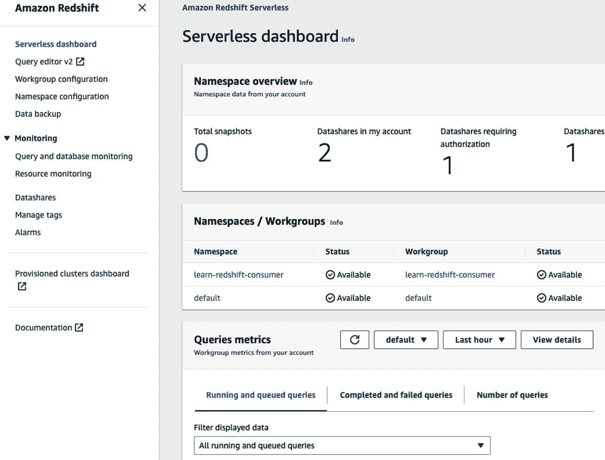

###### Figure 10-1\. 无服务器查询和数据库监控

在无服务器仪表板中显示的详细指标列表如 Table 10-1 所示。有关单个无服务器实例级别的指标，请参见下一节。

Table 10-1\. 无服务器主面板中的监控指标

| 指标 | 详细信息 |
| --- | --- |
| 查询指标 | 运行中和排队中的查询 |
|  | 使用的 RPU 容量 |
| 完成和失败的查询 | 时间轴上完成或失败的查询 |
|  | 使用的 RPU 容量 |
| 查询数量 | 时间轴上的查询计数 |
|  | 使用的 RPU 容量 |

还有其他监控选项可用于监控查询、数据库和资源，您可以通过单击左侧菜单按钮进入。在这里，您将看到“查询和数据库监控”以及“资源监控”选项。

### 无服务器的查询和数据库监控

当你需要监控工作负载时，通常会针对特定的命名空间或工作组进行监控。要过滤特定的无服务器命名空间或工作组的指标，你可以从主仪表板上选择特定的命名空间，要么通过点击链接，要么通过筛选命名空间来进行。这将显示该特定命名空间的查询和数据库资源指标。

#### 无服务器查询和数据库监控

当您选择“查询和数据库监控”时，可以选择无服务器工作组来分析查询和负载工作负载。在这里，您可以选择监控“查询历史记录”或“数据库性能”，如 图 10-1 所示。由于无服务器将根据需要自动缩放并添加 RPU 容量，直至配置的最大 RPU 值，因此无需像在提供的集群中那样监控或管理工作负载或工作负载并发。在“查询历史记录”下，您可以使用“查询运行时间”图来查看在相同时间段内运行的查询，选择一个查询来查看更多的查询执行详细信息。您还可以分析和查看查询的完成状态、持续时间和 SQL 语句的详细信息。

您还可以选择额外的过滤器，选择时间范围、查询类型和使用的 SQL 命令类型，或选择特定的用户或数据库，如 图 10-2 所示。

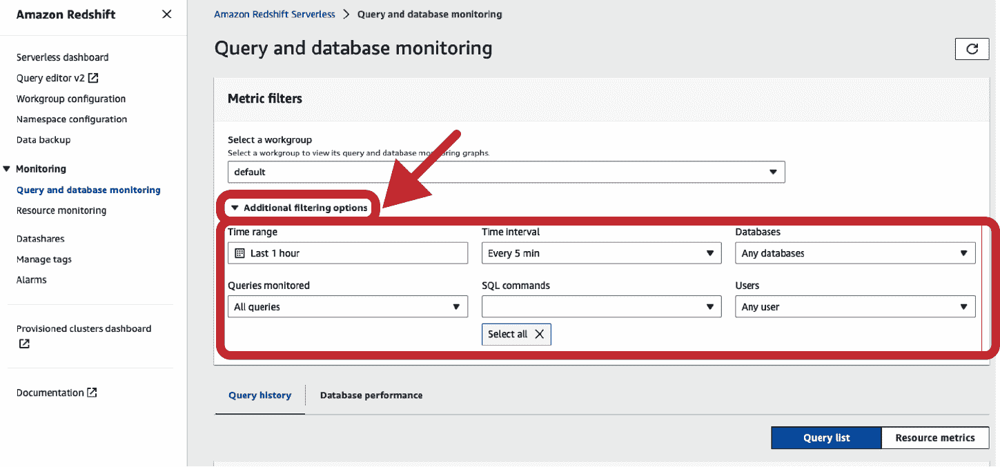

###### 图 10-2\. 无服务器查询和数据库监控的额外过滤器

#### 无服务器查询监控的深入展开查询

您还可以进一步展开查询 ID，查看查询 SQL、查询计划和相关指标的详细信息，如 图 10-3 所示。查询计划将基于重写后的查询，并且相关指标包括使用的 RPU 容量和活动数据库连接。

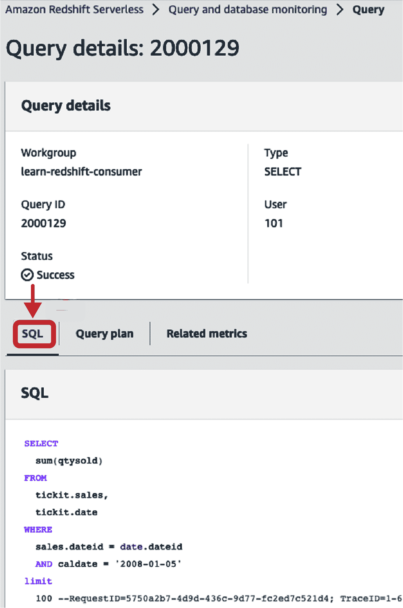

###### 图 10-3\. 无服务器查询监控的深入展开

#### 无服务器查询监控的深入展开查询计划

图 10-4 中的查询计划屏幕显示了查询的详细计划，以及各个流和段的运行时间。此外，您还可以看到输入和输出行，以确定瓶颈所在。

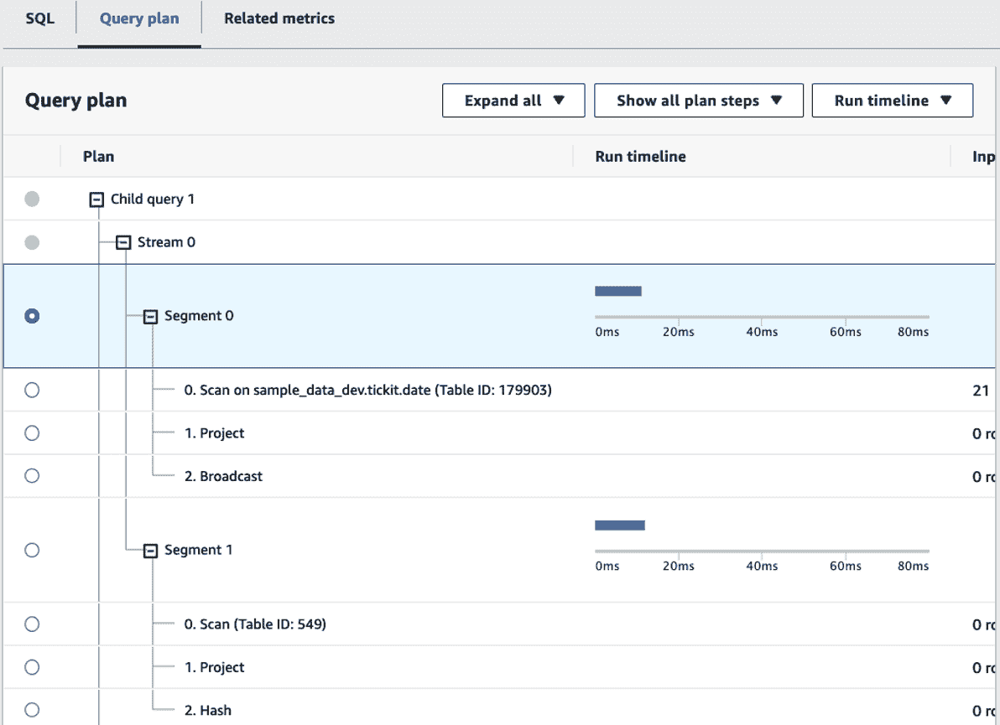

###### 图 10-4\. 无服务器查询监控的深入展开

#### 无服务器查询监控的深入展开相关指标

相关指标显示了过去 10 小时内使用的 RPUs 的总体容量，以及活跃数据库连接的数量，帮助您将此时段内的容量使用情况与活跃数据库连接相关联。例如，在图 10-5 中，您可以看到从下午 12:00 到下午 3:00 期间存在活跃的数据库连接，除了下午 1:30 左右的一个短暂时期未执行任何查询。这就是为什么 RPUs 容量在 12:00 到 3:00 之间的某些时间保持为零的原因。

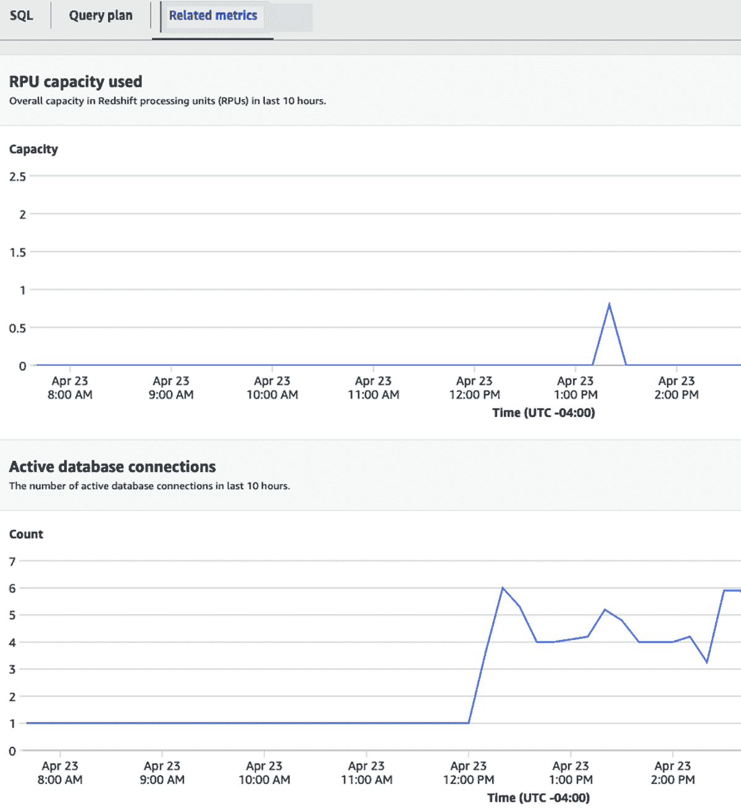

###### 图 10-5\. 服务器无服务查询监控详细信息

服务器无服务查询和数据库监控的指标详细信息显示在表 10-2 中。

表 10-2\. 服务器无服务查询和数据库监控指标

| 查询/数据库 | 查询/资源 | 指标 | 详细信息 |
| --- | --- | --- | --- |
| 查询历史 | 查询列表 | 查询运行时间 | 使用此图表查看在同一时间段内运行的查询。选择一个查询以查看更多的查询执行细节。 |
|  |  | 查询和负载 | 开始时间、持续时间的查询和负载统计 |
|  | 资源指标 | 查询运行时间 | 查询查看更多的查询执行细节 |
|  |  | 使用的 RPU 容量 | RPUs 的总体容量 |
|  |  | 数据库连接 | 活跃数据库连接的数量 |
| 数据库性能 |  | 每秒完成的查询数 | 每秒完成的平均查询数 |
|  |  | 查询持续时间 | 完成查询的平均时间 |
|  |  | 数据库连接 | 活跃数据库连接的数量 |
|  |  | 正在运行的查询 | 特定时间正在运行的总查询数 |
|  |  | 排队查询 | 特定时间排队的总查询数 |
|  |  | 使用的 RPU 容量 | RPUs 的总体容量 |
|  |  | 查询运行时间分解 | 按查询类型运行的查询总时间 |

### 资源监控

对于 Amazon Redshift 无服务器，计算容量以 RPU 表示，每个 RPU 对应于相关的 CPU 和内存容量。如无服务器控制台中所示选择“资源监控”，您将看到两个图表；第一个显示 Redshift RPUs 的总容量随时间轴的变化，第二个图表显示了按期间累积使用的 Redshift 无服务器。正如前文讨论的，您可以通过扩展额外的过滤选项选择时间范围。正如您所见，只有当工作负载需要处理时才会配置 RPU 容量；实际计算工作负载的使用量降低后，容量将降至零，并且跟踪计算使用模式。类似地，RPU 容量领先于使用图，仅当查询工作负载开始进入无服务器端点时，RPU 容量才会自动扩展。这表明 RPU 容量会自动扩展以满足传入的工作负载。持续大量的累积使用可能表明您可以为无服务器设置更高的初始 RPU，以更快地执行工作负载，但成本相同。

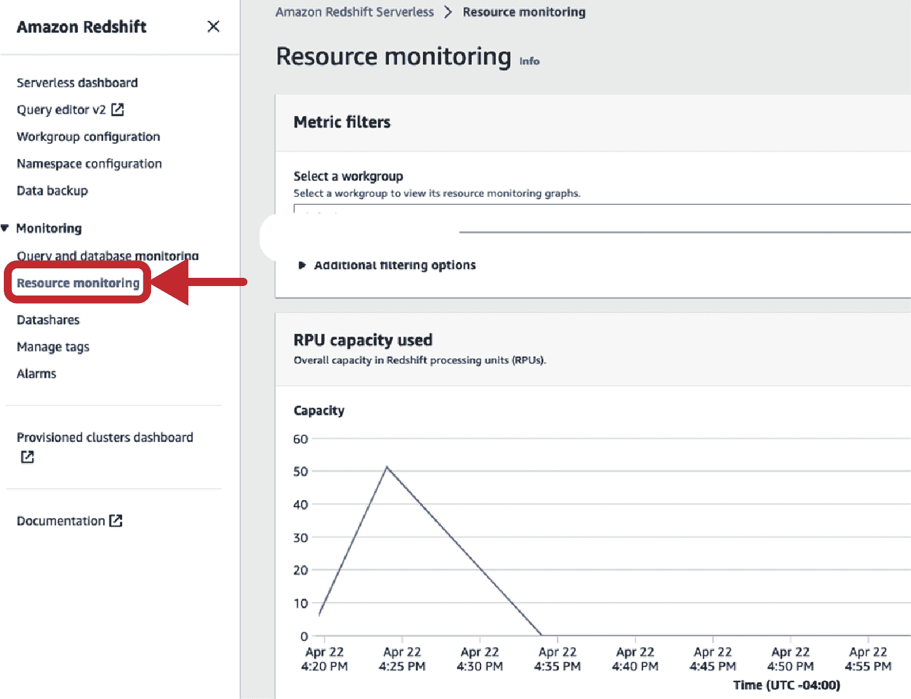

###### 图 10-6\. 无服务器资源监控

无服务器资源监控度量的详细信息如 表 10-3 所示。

表 10-3\. 无服务器资源监控

| --- | --- |
| --- | --- |
| 使用的 RPU 容量 | RPUs 的总容量 |
| 计算使用量 | 在所选时间范围内 Redshift 无服务器的累积使用情况 |

## 使用控制台监控预置数据仓库

Amazon Redshift 预置数据仓库的主仪表板显示所有集群的度量，并且您可以选择特定的预置数据仓库进行监控。如 图 10-7 所示，您可以在各种度量之间切换以查看查询、数据库连接、磁盘空间和 CPU 利用率。

您可以在 Amazon Redshift 控制台中查看和监控的预置集群的性能数据分为两类：

+   数据仓库性能和资源利用度量

+   查询和数据摄取性能度量

使用数据仓库性能度量，您可以监控系统资源，并分析是否需要扩展或缩小。通过查询和摄取度量，您可以分析在给定资源下某个工作负载的执行情况。

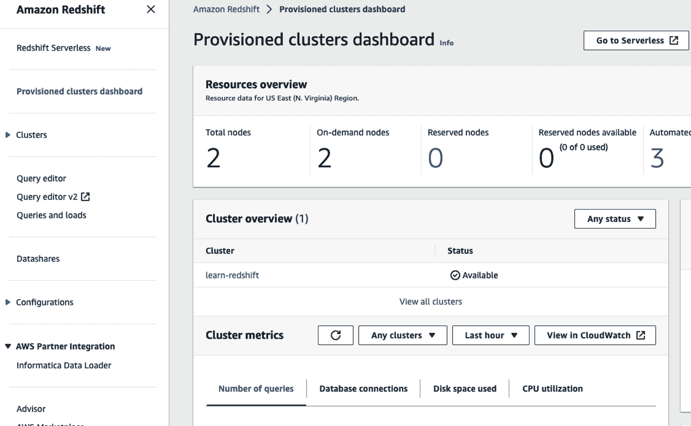

###### 图 10-7\. 监控数据仓库性能

如 表 10-4 所示，可以总结主仪表板中的这些度量。

表 10-4\. 监控预置集群主仪表板中的度量

| 指标 | 详情 |
| --- | --- |
| 集群度量 | 查询数 |
|  | 数据库连接数 |
|  | 使用的磁盘空间 |
|  | CPU 利用率 |
| 查询概述 | 查询工作负载（短期、中期和长期）以特定时间为基础 |

### 数据仓库性能和资源利用率指标

Amazon CloudWatch 捕获您集群的物理方面，如 CPU 利用率、延迟和吞吐量。这些指标直接显示在 Amazon Redshift 控制台中，与您正在查看的数据仓库上下文相关，如图 10-8 所示，适用于预留的集群。对于监控无服务器，您可以跳转到 “监控和管理无服务器” 了解更多资源监控详情。您还可以通过创建仪表板并选择要分析的指标，在 CloudWatch 控制台中查看相同的指标。这些指标的详细信息在 “使用 Amazon CloudWatch 进行监控” 中涵盖。或者，您可以使用 AWS CLI 或 AWS SDK 之一通过自定义 Web 界面来消耗这些指标。

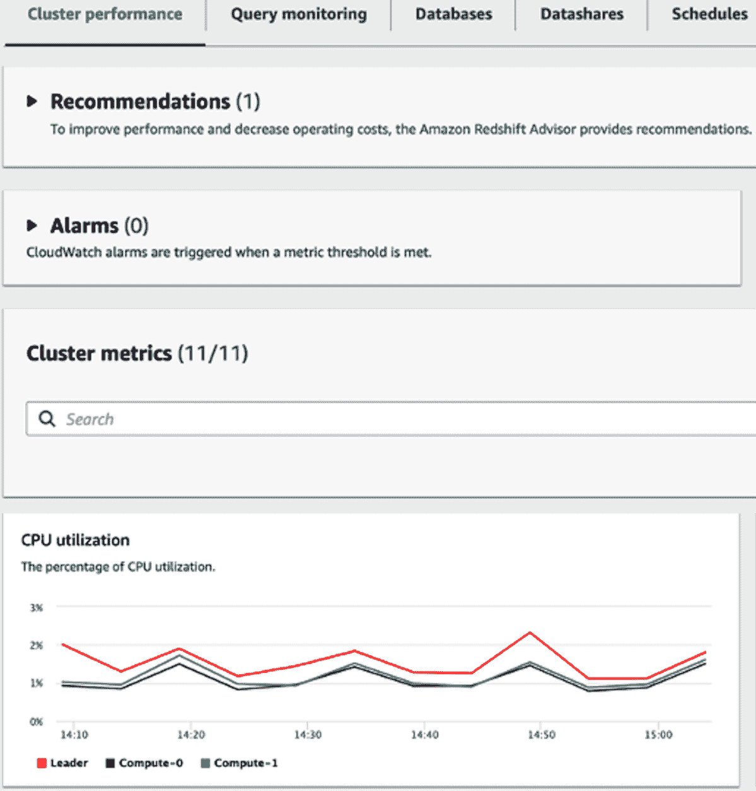

###### 图 10-8\. 监控数据仓库性能

当您为预留数据仓库调整大小或为无服务器实例设置基础 RPU 时，通常从当前数据量的估计和热数据的百分比开始。随着工作负载和数据量的增长，您可以调整数据仓库的大小或增加 RPU。Redshift 控制台中的数据仓库性能指标可让您了解数据仓库资源是过度利用还是未充分利用的指示，并且这些数据帮助您监控数据库活动和性能。Redshift 顾问还分析您的工作负载并为您提供大小建议。

使用 Amazon Redshift 中的数据仓库指标，您可以执行以下常见性能任务：

+   检查数据仓库指标在指定时间范围内的异常活动，如磁盘使用率波动、CPU 使用率和查询队列时间，并识别引起异常的查询。您还可以检查这些查询是否导致系统性能下降。然后，您可以为预留的集群添加相关的 QMR 到参数组 WLM 配置中，或者为无服务器工作组设置查询限制。

+   检查历史或当前查询是否影响数据仓库的性能。如果确定存在问题的查询，您可以设置 QMR 规则，以防止此查询影响其他工作负载。然后，您可以在查询执行期间查看计划和整体数据仓库性能的详细信息，并利用此信息诊断查询为何缓慢以及如何改进其性能。

#### 查看性能数据

要查看性能数据，您可以登录 AWS 管理控制台并打开[Amazon Redshift 控制台](https://oreil.ly/IxcVd)。在导航菜单中，选择预配置的集群仪表板，然后从列表中选择数据仓库的名称以打开其详细信息。数据仓库的详细信息如图 10-9 所示，包括集群性能、查询监控、数据库、数据共享、调度、维护和属性标签。

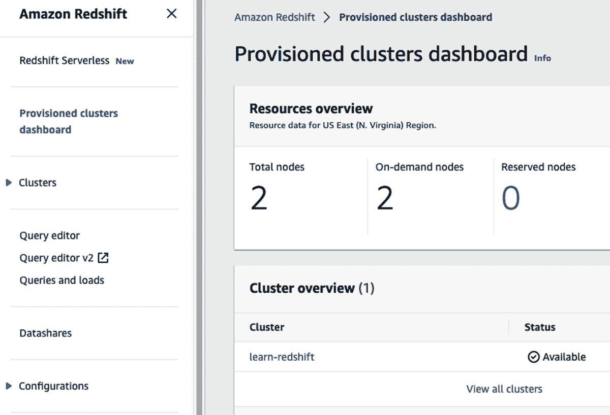

###### 图 10-9\. 选择预配置的集群仪表板

选择“集群性能”标签以查看性能信息，如表 10-5 所示。

表 10-5\. 预配置集群仪表板中的集群性能指标

| 指标 | 详情 |
| --- | --- |
| 告警 | 当满足度量阈值时，CloudWatch 将触发告警。 |
| 事件 | 发生在您的集群上的事件。 |
| CPU 利用率 | CPU 利用率百分比。 |
| 使用的磁盘空间百分比 | 使用的磁盘空间百分比。 |
| 自动清理释放的空间 | 自动清理在所有表中回收的空间。 |
| 数据库连接 | 连接到集群的数据库连接数。 |
| 健康状态 | 指示集群的健康状况。 |
| 查询持续时间 | 完成查询的平均时间。 |
| 查询吞吐量 | 每秒完成的平均查询数量。 |
| 每个 WLM 队列的查询持续时间 | 完成 WLM 队列的查询的平均时间长度。 |
| 每个 WLM 队列的查询吞吐量 | 每秒完成的 WLM 队列的平均查询数量。 |
| 并发缩放活动 | 并发缩放使用限制。 |
| Redshift Spectrum 的使用限制 | Redshift Spectrum 使用限制。 |

您可以通过单击“首选项”按钮选择额外的指标并配置仪表板，以显示您需要监控的特定指标，如图 10-10 所示。

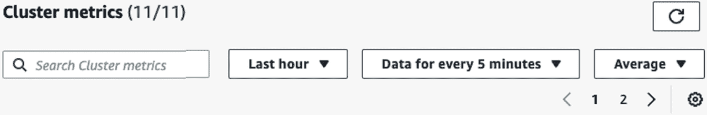

###### 图 10-10\. 选择额外指标的首选项

让我们看一些可用的数据仓库指标及其相应的图表。有关性能指标的详细信息，请参阅[集群性能数据](https://oreil.ly/aKtuE)。

#### CPU 利用率

这个指标显示所有节点（领导节点和计算节点）的 CPU 利用率百分比。在安排数据仓库迁移或其他资源消耗型操作之前，可以监控此图表以查看每个节点的 CPU 利用率，找到数据仓库使用最低的时间点。您可以查看图 10-11 中的 CPU 利用率和磁盘使用百分比。如果您持续看到高 CPU 利用率，这表明您的工作负载可能会受益于调整集群大小。如果 CPU 利用率时断时续并伴有间歇性波动，则这可能是使用无服务器进行成本节约的良好案例。

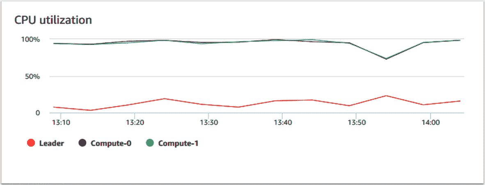

###### 图 10-11\. 监视 CPU 利用率

#### 磁盘空间使用百分比

这个指标显示每个计算节点的磁盘空间使用百分比，而不是整个数据仓库，如图 10-12 所示。您可以查看此图表来监控磁盘利用率，并估算是否需要调整大小。当您使用 RA3 节点时，每个 ra3.4xl 和 ra3.16xl 节点可以存储高达 128 TB，ra3.xlplus 可以存储高达 32 TB。因此，您可以存储大量数据，但在调整大小时，还应考虑您的计算需求。

维护操作如`VACUUM`和`COPY`使用中间临时存储空间进行排序操作，因此预期磁盘使用率会出现波动。


###### 图 10-12\. 监视磁盘空间使用

#### 数据库连接数

这显示了对群集的数据库连接数，如图 10-13 所示。您可以使用此图表查看连接到数据库的连接数，并找到数据仓库使用最低的时间点。您还可以将数据库连接与查询持续时间和查询吞吐量等查询指标进行关联，并分析数据库连接数是否对查询工作负载产生影响。

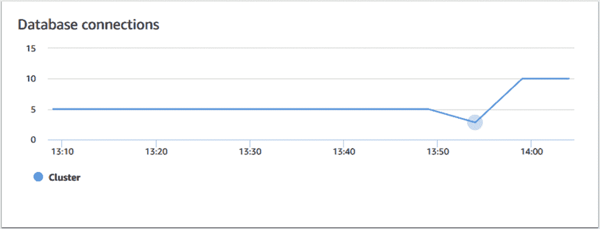

###### 图 10-13\. 监视数据库连接

#### 查询持续时间

这个指标显示完成查询所需的平均时间（以微秒为单位），如图 10-14 所示。您可以在此图表上的数据进行基准测试，以衡量数据仓库内的 I/O 性能，并在必要时调整最耗时的查询。

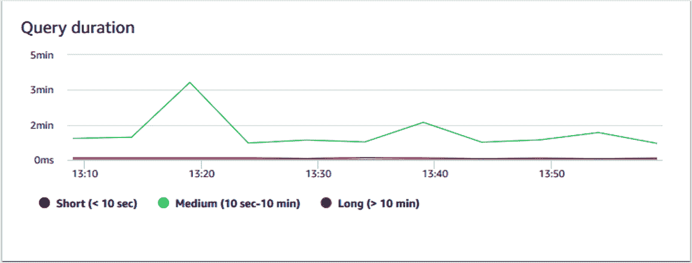

###### 图 10-14\. 监视查询持续时间

#### 查询吞吐量

这个指标显示每秒完成的平均查询数，如图 10-15 所示。您可以分析此图表上的数据来衡量数据库性能，并评估系统支持多用户工作负载的能力。

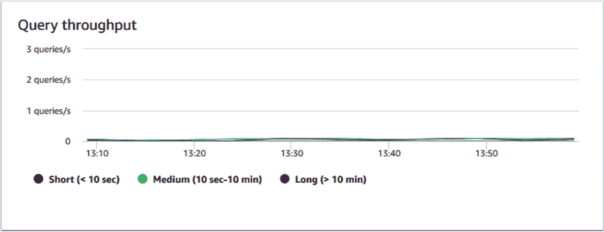

###### 图 10-15\. 监视查询吞吐量

### 查询和数据接入性能指标：查询监控选项卡

Amazon Redshift 控制台提供有关在数据仓库中运行的查询性能的信息。当用户投诉查询性能问题时，您可以使用查询监控仪表板来分离查询性能问题的原因。您还可以比较查询运行时指标和数据仓库性能指标以确定它们在相同时间轴上的关联性，以帮助您识别性能不佳的查询、寻找瓶颈查询，并确定是否需要调整数据仓库以适应工作负载。

这些数据在 Amazon Redshift 控制台中聚合，帮助您轻松将性能指标与特定数据库查询和负载事件进行关联，如 图 10-16 所示。对于无服务器，您可以参考 图 10-1 进行查询和数据库监控。

单一区域数据仅在 Amazon Redshift 控制台中显示，并未作为 CloudWatch 指标发布。

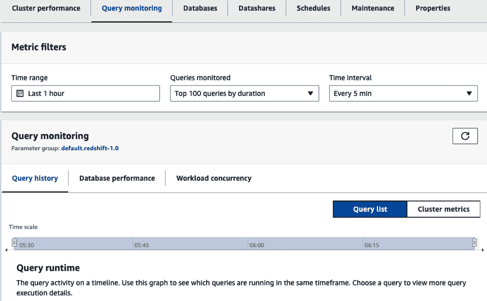

###### 图 10-16\. 监控查询性能

查询和数据摄取性能指标的详细信息显示在 表 10-6 中。

表格 10-6\. 预置集群数据仓库仪表板中的查询监控指标

| 监控 | 指标 | 详情 |
| --- | --- | --- |
| 查询历史记录 | 查询运行时 | 时间轴上的查询活动。使用此图表查看在同一时间段内运行的查询。选择一个查询以查看更多查询执行详情。 |
|  | 查询和负载 | 查询执行详细信息。 |
| 数据库性能 | 工作负载执行细分 | 查询处理阶段使用的时间。 |
|  | 按持续时间范围分类的查询 | 短、中、长查询的数量。 |
|  | 查询吞吐量 | 每秒完成的平均查询数量。 |
|  | 查询持续时间 | 完成查询所需的平均时间。 |
|  | 按优先级平均队列等待时间 | 查询优先级中查询在 WLM 队列中等待的总时间。 |
| 工作负载并发性 | 集群上排队与运行的查询对比 | 运行中的查询数量（来自主数据仓库和并发扩展集群）与集群中所有 WLM 队列中等待的查询数量对比。 |

#### 数据仓库级别的查询历史记录

要显示特定集群的查询历史记录，您可以通过单击特定集群的链接选择数据仓库，然后选择“查询监控”选项卡。您将看到“查询历史记录”、“数据库性能”和“工作负载并发性”三个选项卡，如 图 10-17 所示。在此处选择“查询历史记录”选项卡，并可以使用窗口上的按钮在查询列表和集群指标之间切换。

当您选择“查询列表”时，选项卡中包含以下图表：

查询运行时间

此图显示了时间轴上的查询活动（请参见图 10-17）。使用此图可查看在相同时间段内运行的查询。选择一个查询以查看更多的查询执行详情。X 轴显示了所选周期。您可以通过运行、完成、加载等方式过滤图表中的查询。每个水平条代表一个查询，条的长度表示从条的开始到结束的运行时间。查询可以包括 SQL 数据操作语句（例如`SELECT`、`INSERT`、`DELETE`）和加载（例如`COPY`）。默认情况下，显示所选时间段内前 100 个运行时间最长的查询。

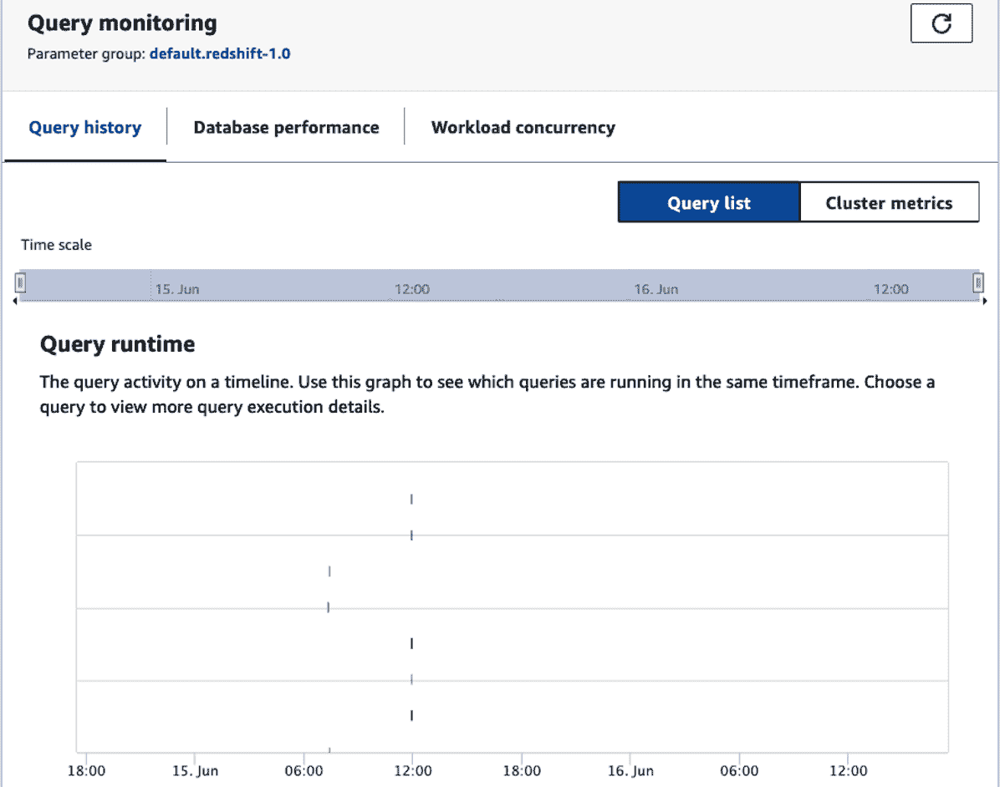

###### 图 10-17\. 查询监控性能

查询和加载

此图显示了在集群上运行的查询和加载的列表（请参见图 10-18），您还可以深入到查询 ID 查看查询计划以进一步分析查询。您还可以选择在此终止查询。

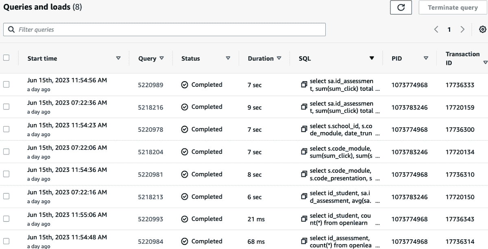

###### 图 10-18\. 查询监控加载

当您选择“集群指标”时，选项卡中包含以下图表，如图 10-19 所示：

查询运行时间

此图显示了时间轴上的查询活动。使用此图可查看在相同时间段内运行的查询。选择一个查询以查看更多的查询执行详情。

CPU 利用率

此图显示了数据仓库通过主节点和计算节点的 CPU 利用率的情况及其平均值。

已使用的存储容量

此图显示了已使用的存储容量的百分比。

活跃的数据库连接

此图显示了连接到集群的活跃数据库连接数。

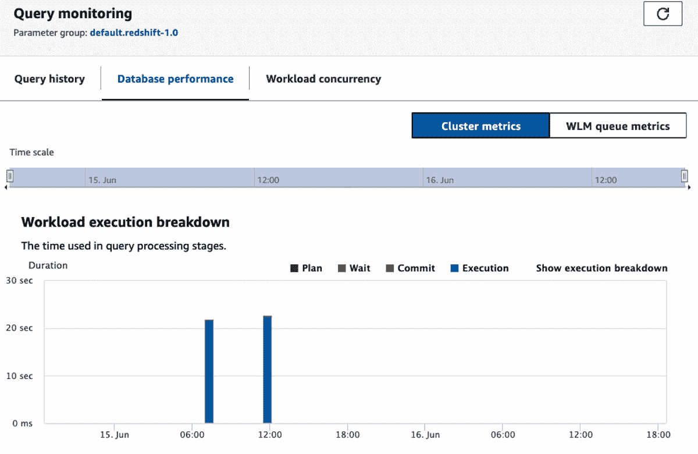

###### 图 10-19\. 监控数据库性能

#### 查询的数据库性能

数据库性能指标详细说明了查询时间在计划、等待、提交或执行中的花费位置以及数据库的吞吐量。这些指标在“集群指标”和“WLM 队列指标”两个选项卡下可用，您可以使用 Amazon Redshift 的数据库性能指标执行以下操作：

+   分析查询通过处理阶段花费的时间，并查找异常趋势，例如高查询等待时间、运行时间或执行时间，其中在某个阶段花费的时间较长。

+   基于查询状态进行过滤：正在运行的、已完成的、失败的或停止的查询。

+   分析查询数量、持续时间以及查询通过不同持续时间范围的吞吐量（短：< 10 秒、中等：10 秒至 10 分钟、长：> 10 分钟）。

+   查找按查询优先级（最低、低、普通、高、最高、关键）排序的查询等待时间的趋势。通过工作负载管理（WLM），您可以设置具有不同优先级的多个队列，我们在“WLM、队列和 QMR”中进行了介绍。

+   查找 WLM 队列中查询持续时间、吞吐量或等待时间的趋势。

接下来我们将讨论一些示例图表：

工作负载执行分解

此图显示了查询处理阶段计划、等待、提交和实际执行所用的时间（参见 图 10-20）。您可以确定特定查询或查询是否在等待状态中花费了太多时间。这些细节将帮助您评估是否需要调整集群大小。在这种情况下，打开并发缩放可能会有所帮助。

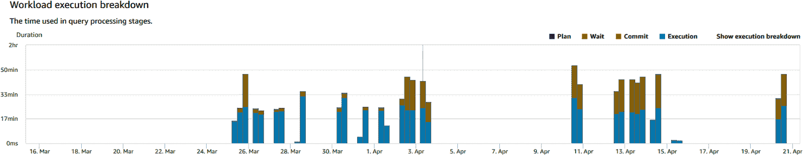

###### 图 10-20\. 工作负载执行分解

查询按持续时间范围

此图表显示了短期、中期和长期查询的数量，如 图 10-21 所示。

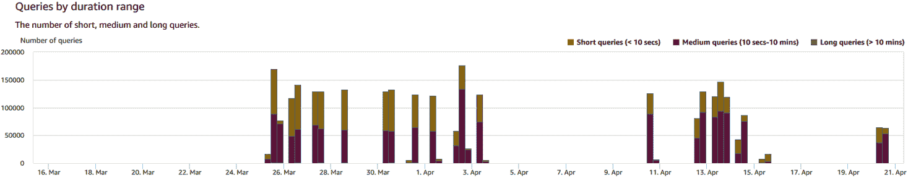

###### 图 10-21\. 按持续时间范围的查询

查询吞吐量

此图表显示了每秒完成的平均查询数量，如 图 10-22 所示。

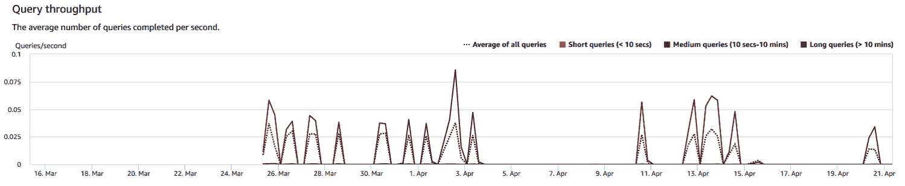

###### 图 10-22\. 查询吞吐量

查询持续时间

图 10-23 显示了完成查询所需的平均时间。

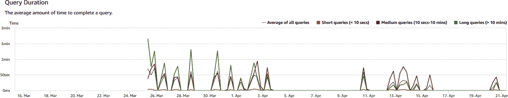

###### 图 10-23\. 查询持续时间

按优先级平均队列等待时间

图 10-24 中的图表显示了查询按查询优先级在 WLM 队列中等待的总时间。

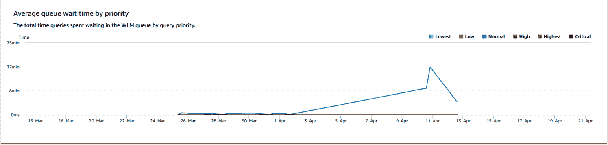

###### 图 10-24\. 按优先级平均队列等待时间

按队列查询吞吐量

此图表显示了每个 WLM 队列的查询运行时间和吞吐量，如 图 10-25 所示。

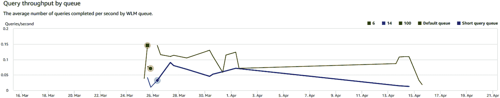

###### 图 10-25\. 按队列查询吞吐量

### 工作负载并发

在 图 5-3 中学习到，您可以使用并发缩放功能自动扩展计算能力，以满足动态工作负载的要求。工作负载并发选项卡提供与并发缩放相关的度量，并帮助您理解以下内容：

+   通过比较所有 WLM 队列中排队与运行查询的数量，分析启用并发缩放是否有助于减少排队查询的数量。

+   查看并发缩放集群中的并发缩放活动，并确定并发缩放是否限制在 max_concurrency_scaling_clusters。这将为您提供是否应选择增加集群参数组中的 max_concurrency_scaling_clusters 的指示。

+   查看所有并发缩放集群中并发缩放的总使用情况，以确定启用并发缩放对成本的影响。

对于无服务器，这是自动发生的，您只需要分析“计算容量”。无服务器中的“查询运行时间分解”具有查询等待指标，您可以使用这些指标来分析是否需要增加基础 RPU。接下来我们将讨论一些用于监视并发缩放影响的图表：

集群中排队与运行的查询

图 10-26 显示了集群中所有 WLM 队列中正在运行的查询数量与等待的查询数量的对比。此指标包括主要集群和并发缩放集群中正在运行的所有查询。

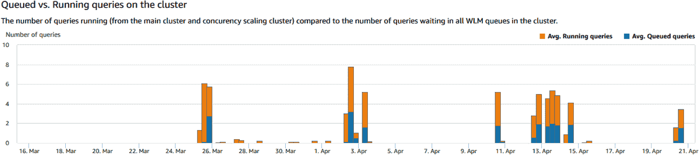

###### 图 10-26\. 集群中排队与运行的查询

每个队列中排队与运行的查询

图 10-27 显示了每个 WLM 队列中正在运行的查询数量与等待的查询数量的对比。

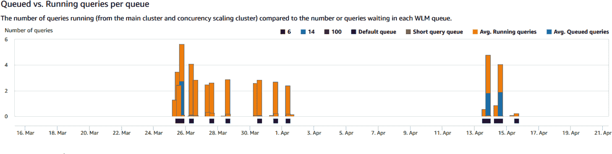

###### 图 10-27\. 每个队列中排队与运行的查询

并发缩放活动

图 10-28 显示了正在主动处理查询的并发缩放集群的数量。您可以使用此指标来了解是否需要增加并发缩放集群的数量或设置任何使用限制。

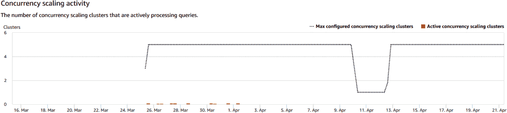

###### 图 10-28\. 并发缩放活动

并发缩放使用情况

图 10-29 显示了具有活动查询处理活动的并发缩放集群的使用情况。


###### 图 10-29\. 并发缩放使用情况

## 跨集群监控查询和负载

在控制台中，有多种监控查询和负载的方式。要分析跨集群的查询和负载，您可以从主要的 Amazon Redshift 控制台菜单中选择“查询和负载”，如图 10-30 所示。在这里，您可以分析和查看查询详情，包括查询的完成状态、持续时间、SQL 语句以及是否为用户查询或由 Amazon Redshift 重写的查询。

用户查询是从 SQL 客户端提交到 Amazon Redshift 的查询，或由 BI 工具生成的查询。Amazon Redshift 可能会重写查询以对其进行优化，这可能会导致多个重写查询。例如，使用自动 MV 功能时，当您在基本表上编写查询时，Redshift 可能会创建一个物化视图，并重写查询以针对物化视图而不是基本表运行。类似地，如果您已有一个物化视图，并且您在基本表上编写查询，查询处理器将重写查询以从现有的物化视图中读取。您可以在控制台上的查询详情页面上查看重写的查询以及最初的用户查询。

### 监控查询和负载

在显示中的屏幕中 图 10-30，您可以选择要分析查询工作负载的数据仓库，并可以基于日期/时间范围或查询状态进行过滤。这些过滤器可以包括前 100 个查询、已完成的查询以及失败或停止的查询。过滤器列表也显示在此处。

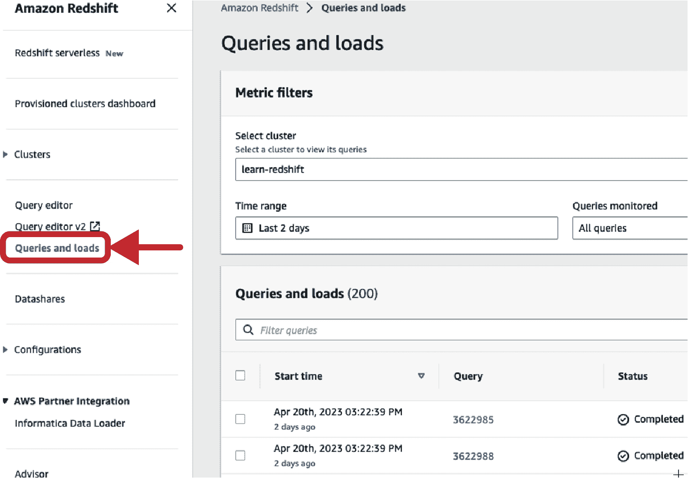

###### 图 10-30\. 监控查询和负载

控制台允许您通过单击查询 ID 链接来深入了解特定查询的详细信息。当查询 ID 和其他属性显示在图表下方的行中时，您可以选择查询以查看诸如查询的 SQL 语句、执行详细信息和查询计划等详细信息，如 图 10-31 所示。 "查询详情" 页面显示了用于分析的读写工作负载的父查询和所有重写查询。


###### 图 10-31\. 监控查询计划

### 监控顶级查询

默认情况下，“查询监控” 页面显示所选时间窗口内按运行时间或持续时间排序的前 100 个最长查询。您可以更改时间窗口以查看该时段内的前查询 (见 图 10-32)。前查询还包括已完成的查询和运行中的查询。已完成的查询按查询运行时间或持续时间的降序排序。

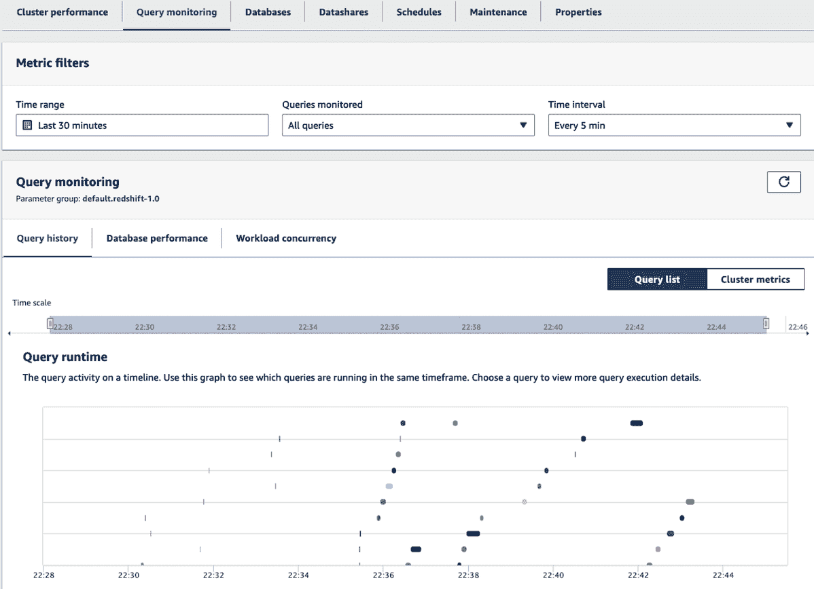

###### 图 10-32\. 监控顶级查询

## 识别系统性查询性能问题

考虑这样一个场景，您的许多用户抱怨查询运行时间比正常情况长。您想诊断集群中发生了什么。您可以自定义时间并切换到图形视图，这有助于您将更长的运行时间与集群中发生的情况相关联。正如 图 10-33 中的甘特图和 CPU 利用率图所示，许多查询在 CPU 利用率几乎达到 25% 的时候运行。

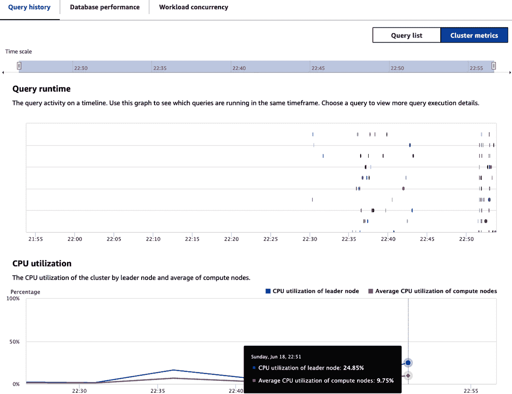

###### 图 10-33\. 查询持续时间

# 使用 Amazon CloudWatch 进行监控

[Amazon CloudWatch](https://aws.amazon.com/cloudwatch) 是一个监控服务，可监控和捕获来自 AWS 各种服务的警报、日志和事件。您可以使用 Amazon CloudWatch 监控和跟踪集群的各种物理方面，如 CPU 利用率、延迟和资源及应用程序的吞吐量。

您可以使用可用的自动模板创建仪表板，也可以使用您希望监控的指标创建自定义仪表板。Amazon Redshift 还有一个自动仪表板可用作模板。请注意，与控制台相比，CloudWatch 中显示的某些性能指标具有不同的比例单位。例如，WriteThroughput 指标以 GB 为单位显示，而控制台上以字节显示，这是节点的典型存储空间的更相关单位。

您可以创建警报来监控指标，并在达到限制或阈值时发送通知。您还可以设置根据阈值自动更改资源的功能；例如，您可以监控 Amazon Redshift 数据仓库中的 CPU 使用率、查询吞吐量或等待时间，然后使用这些数据来确定是否应该增加或减少集群的大小。您还可以使用这些数据来暂停或调整未充分利用的数据仓库以节省费用。使用 CloudWatch，您可以全面了解资源利用情况、应用程序性能以及所有服务的运行健康情况。您可以使用 CloudWatch 监控控制台中提供的指标以及您希望监控 Amazon Redshift 预置集群和无服务器的其他指标。

使用 CloudWatch 指标监控 Amazon Redshift，您可以获取关于整个集群健康和性能或单个节点级别的信息。在使用这些指标时，请记住每个指标都有一个或多个相关联的维度。这些维度告诉您指标的范围，以及指标是针对数据仓库还是单个节点：

+   具有 NodeID 维度的指标为集群节点提供性能数据。此组指标包括领导节点和计算节点。这些指标的示例包括 CPUUtilization、ReadIOPS 和 WriteIOPS。

+   只具有 ClusterIdentifier 维度的指标为集群提供性能数据。这些指标的示例包括 HealthStatus 和 MaintenanceMode。

## Amazon Redshift CloudWatch 指标

在 CloudWatch 控制台上，您可以选择各种仪表板来查看服务仪表板、跨服务仪表板、计费仪表板或最近的警报。Amazon Redshift 指标收集在 `AWS/Redshift` 命名空间下，每分钟收集一次这些指标。您可以选择“服务仪表板”，然后选择“Redshift”来查看在 CloudWatch 中捕获的指标，如图 10-34 所示。

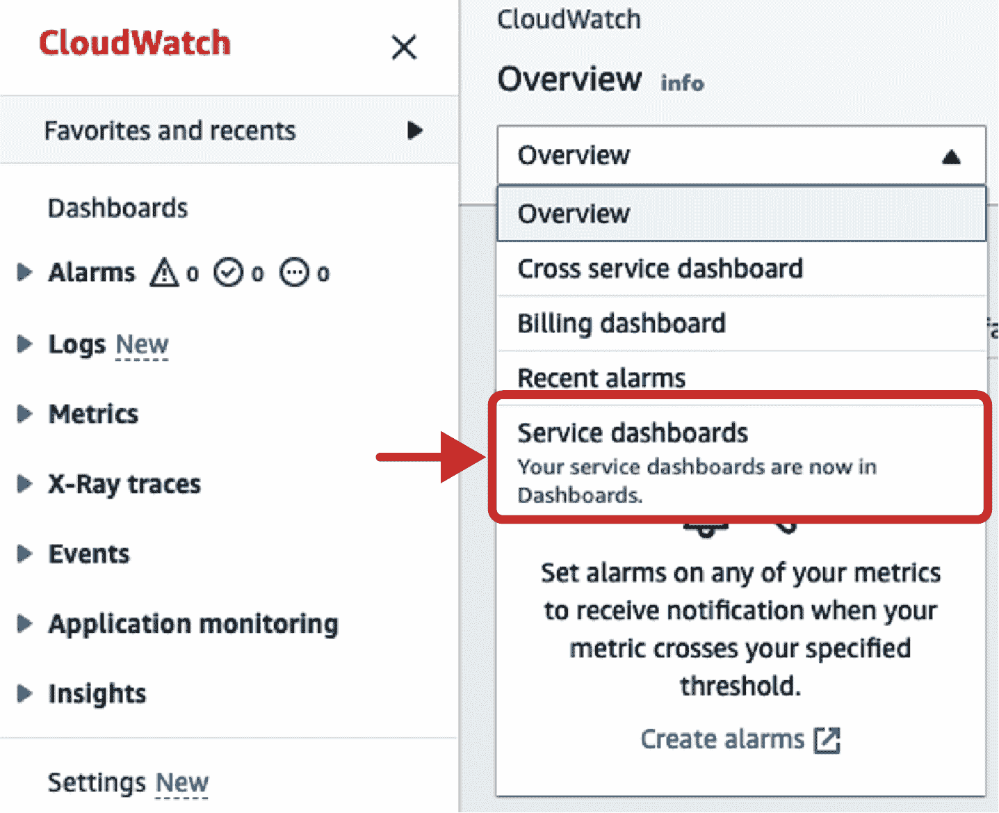

###### 图 10-34\. CloudWatch 监控

如你在 图 10-35 中所见，您也可以在列表中搜索任何其他特定服务。AWS 预先创建了大多数常用指标的自动仪表板。此外，如果您想创建自定义仪表板，可以通过选择“自定义仪表板”选项卡来创建您自己的仪表板。

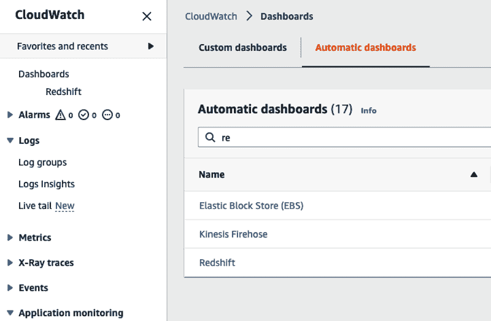

###### Figure 10-35\. CloudWatch 监控搜索 Redshift

自动仪表板包含如 CPU 利用率、磁盘空间使用百分比、数据库连接数、健康状态等指标。如果要添加新指标，您可以使用“添加到仪表板”按钮，如 图 10-36 所示，将适当的指标添加到此仪表板，或者您可以从头开始创建新的客户仪表板。

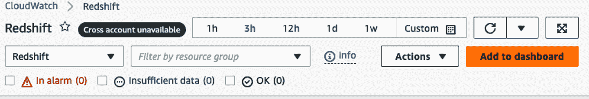

###### Figure 10-36\. CloudWatch 监控自动添加到仪表板

您还可以将默认的周期覆盖为从 1 秒到 30 天的任意范围。如果有系统级别的警报，详细信息将在此处捕获，您可以筛选只查看警报。

图 10-37 展示了默认的 CloudWatch 监控仪表板，应该能满足大多数用例。但如果需要，您也可以创建自定义仪表板。

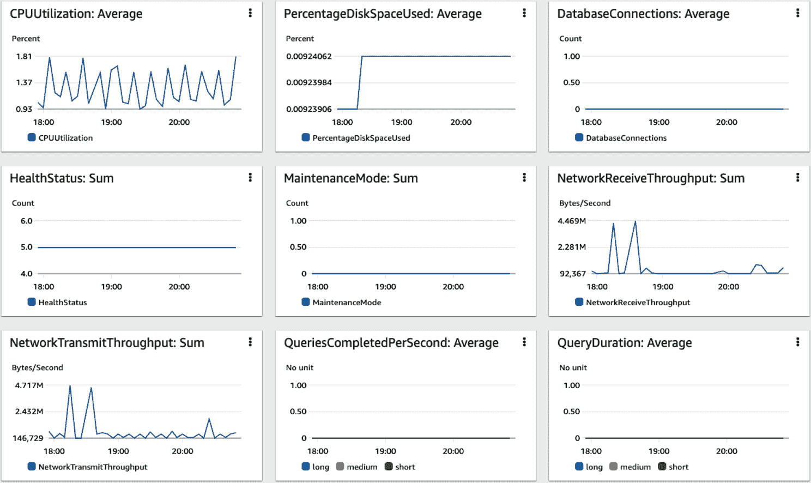

###### Figure 10-37\. CloudWatch 监控自动仪表板

要创建自定义仪表板，请选择“自定义仪表板”选项卡，然后单击“自定义仪表板”，如 图 10-39 所示。您可以首先在小组件中选择图表类型，如 图 10-38，然后创建自定义仪表板。

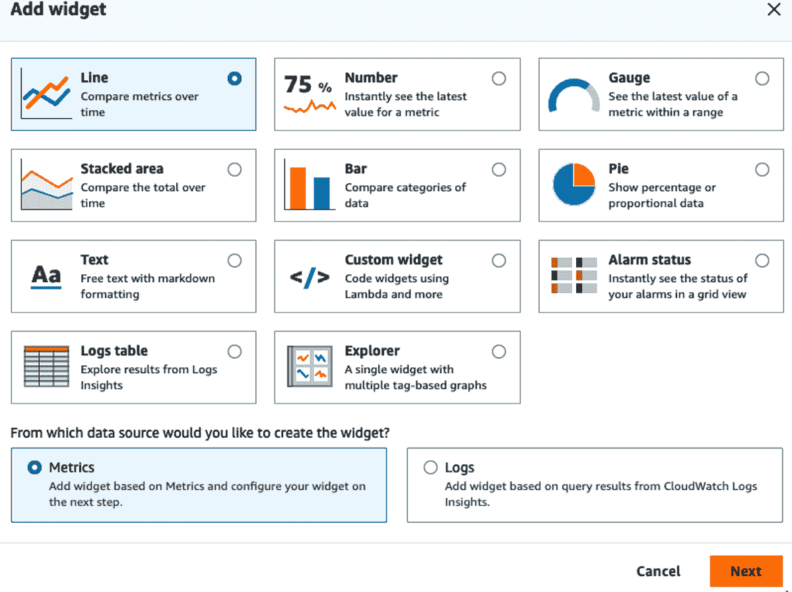

###### Figure 10-38\. CloudWatch 向自定义仪表板添加小组件

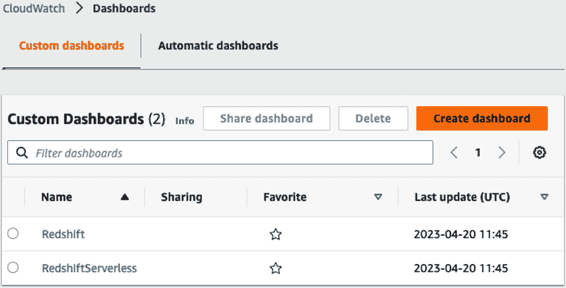

###### Figure 10-39\. CloudWatch 创建自定义仪表板

在这里，您可以筛选与 Redshift 相关的指标，并选择任何适用于创建自己的仪表板的指标，这些指标与您的数据库或组织的监控需求相关。您还可以从默认仪表板开始自定义，通过使用“添加到仪表板”选项向仪表板添加新指标。在 图 10-40 中，您可以看到诸如“按资源类型”、“节点指标”、“按集群聚合”等与 WLM 队列和查询相关的指标。

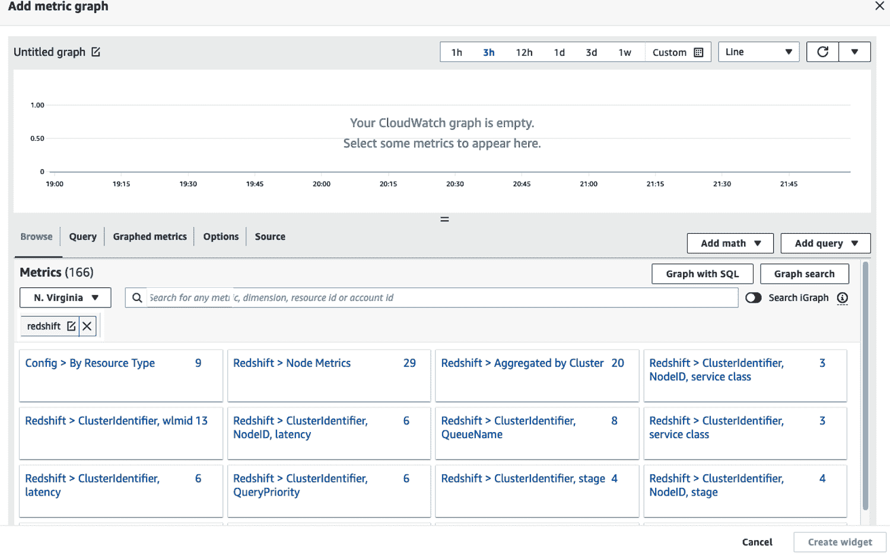

###### Figure 10-40\. CloudWatch 监控自定义仪表板

在某些情况下，特定集群指标代表节点行为的聚合。例如，健康状态和维护模式，其中指标值的解释是所有计算节点的聚合值。

# 使用系统表和视图进行监控

Amazon Redshift 将关于数据仓库的各种信息存储在系统表和视图中，这些信息对于理解系统如何运行是有用的。这些表作为以 STL、SVCS、STV 和 SVV 字母为前缀的系统视图存在于`pg_catalog`模式中，具有权限的用户可以直接查询这些系统视图以分析数据库性能。本节解释了存储在这些系统表中的关键细节，提供了一些示例系统表和查询。它还解释了：

+   如何生成不同类型的系统表和视图

+   您可以从这些表中获取什么类型的信息

+   如何将 Amazon Redshift 系统表与目录表连接

+   如何管理系统表日志文件的增长

一些系统表仅供 AWS 员工用于诊断目的。接下来的部分将讨论系统管理员或其他数据库用户可查询的有用信息系统表。

有几种类型的系统表和视图：

STL 系统视图

这些视图是从已持久化到磁盘的日志生成的，用于提供系统历史记录。这些文件驻留在数据仓库集群中的每个节点上。STL 视图从日志中提取信息，并将其格式化为系统管理员可以使用的视图。STL 系统视图保留七天的日志历史记录。日志保留对所有数据仓库大小和节点类型都是保证的，并且不受数据仓库工作负载变化的影响。日志保留也不受数据仓库状态的影响，例如数据仓库暂停时。只有在数据仓库是新的情况下，日志历史记录少于七天。保留日志不需要任何客户操作，但如果您想将日志数据存储超过七天，您必须定期将其复制到其他表或卸载到 Amazon S3。您可以在[STL 视图](https://oreil.ly/O6n_N)中找到详细的视图列表。

STV 表

这些是包含当前系统数据快照的虚拟系统表。它们基于瞬态的内存数据，并不持久化到磁盘日志或常规表中。

SVCS 系统视图

前缀*SVCS*提供了有关主集群和并发扩展集群上查询的详细信息。这些视图类似于带有前缀*STL*的表，不同之处在于 STL 表仅提供对主集群上运行查询的信息。

SVL 视图

Amazon Redshift 中的这些系统视图包含对 STL 表和日志的引用，用于提供更详细的信息。这些视图为查询这些表中常见数据提供了更快捷、更便利的访问。

SVV 视图

Amazon Redshift 中的这些系统视图包含对 STV 表和快照的引用，以获取更详细的信息。

SYS 视图

这些是用于监控查询和工作负载使用情况的系统监控视图。这些视图位于 `pg_catalog` 模式中。要显示这些视图提供的信息，请运行 SQL `SELECT` 语句。`SYS_SERVERLESS_USAGE` 仅收集 Amazon Redshift Serverless 的使用数据。

系统表不包括在自动化或手动数据仓库备份（快照）中。STL 系统视图和日志历史的保留期为七天。如果要存储超过七天的日志数据，必须定期将其复制到其他表或卸载到 Amazon S3。可以编写存储过程或使用 [Amazon Redshift 系统对象持久化实用程序](https://oreil.ly/SeYIY) 从系统表归档数据。

系统表和视图中的数据具有两类可见性：对用户可见和对超级用户可见：

超级用户可见视图

只有具有超级用户权限的用户才能查看超级用户可见类别中的表中的数据。常规用户可以查看用户可见表中的数据。要使常规用户可以访问超级用户可见表，请为该表 [授予常规用户 `SELECT` 权限](https://oreil.ly/90LZA)。

对用户可见视图

默认情况下，在大多数用户可见表中，另一个用户生成的行对常规用户是不可见的。如果给予常规用户无限制的 SYSLOG 访问权限，则该用户可以查看所有用户可见表中的所有行，包括由其他用户生成的行。有关更多信息，请参阅如何 [更改用户](https://oreil.ly/zbKCQ) 或 [创建用户](https://oreil.ly/Uiis9) 的信息。

给用户无限制地访问系统表会使用户能够查看其他用户生成的数据。例如，`STL_QUERY` 和 `STL_QUERY_TEXT` 包含可能包含敏感用户生成数据的 `INSERT`、`UPDATE` 和 `DELETE` 语句的完整文本。

## 使用系统视图监控 Serverless

监控视图是 Amazon Redshift Serverless 中用于监控查询和工作负载使用情况的系统视图。这些视图位于 `pg_catalog` 模式中。这些系统视图的设计目的是为了提供监控 Amazon Redshift Serverless 所需的信息，比起预置集群更为简单。SYS 系统视图已被设计用于与 Amazon Redshift Serverless 协同工作。要显示这些视图提供的信息，可以在任何这些表或视图上运行 `SQL SELECT` 语句。要获取完整的视图列表，请参阅 [系统视图](https://oreil.ly/CRJPa) 文档。

系统视图的定义旨在支持以下监控目标。要获取所有系统视图的详细列表，请参阅 [“使用 Amazon Redshift Serverless 监控查询和工作负载”](https://oreil.ly/gR8Y_)。

其中一个视图是`SYS_SERVERLESS_USAGE`，提供有关使用的计算能力和存储以及计费秒数的详细信息，以及如果存在跨区域数据传输成本（参见图 10-41）。您可以使用查询编辑器 V2 使用`SELECT`语句查询数据：

```
SELECT * FROM SYS_SERVERLESS_USAGE;
```

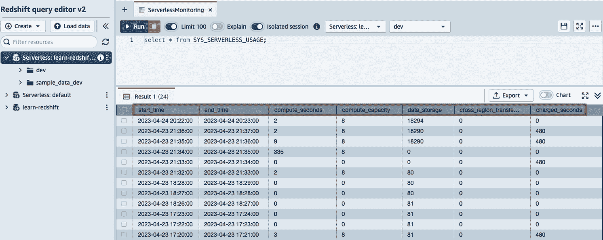

###### 图 10-41. Serverless 资源监控

系统视图捕获数据，帮助您监视数据仓库和运行的工作负载的各个方面。这些视图可以按以下方式分类：

工作负载监控

您可以随时间监视查询活动，以了解工作负载模式，从而确定什么是正常的（基线）以及符合业务 SLA 的内容。这将帮助您快速识别与正常情况的偏差，这可能是暂时性问题或需要进一步处理的问题。视图`SVL_QUERY_SUMMARY`、`SYS_QUERY_HISTORY`和`SYS_QUERY_DETAIL`提供有关查询工作负载的详细信息，您可以使用这些信息来监视查询运行时每个步骤的详细信息，包括运行时间、读取的块、返回的行以及查询的任何警报。

数据加载和卸载监控

要在 Amazon Redshift Serverless 中移动数据，您可以使用`COPY`和`UNLOAD`命令加载或卸载数据。您可以密切监视数据加载或卸载的进度，以字节/行转移和完成的文件来跟踪业务 SLA 的遵守情况。通常通过频繁运行系统表查询（即每分钟一次）来跟踪进度，并在检测到显著偏差时引发警报以进行调查/纠正措施。视图`SYS_LOAD_DETAIL`、`SYS_LOAD_HISTORY`、`SYS_LOAD_ERROR_DETAIL`和`SYS_UNLOAD_HISTORY`包含行、字节和任何错误的详细信息。

失败和问题诊断

有些情况下，您必须针对查询或运行时故障采取行动。开发人员依赖系统表自我诊断问题并确定正确的补救措施。视图`STL_ALERT_EVENT_LOG`提供系统范围警报的详细信息，视图`STL_LOAD_ERRORS`和`SYS_LOAD_ERROR_DETAIL`提供使用`COPY`命令进行数据加载时的错误详细信息。

性能调整

您可能需要调整未满足 SLA 要求的查询，无论是从一开始就未满足还是随时间降低。要进行调整，您必须有包括运行计划、统计信息、持续时间和资源消耗在内的运行时详细信息。您需要基线数据来确定引起偏差的原因，并指导您如何提高性能。一些用于用户对象监视的关键表格包括：

`SYS_QUERY_HISTORY`和`SYS_QUERY_DETAIL`

使用这些视图通过检查是否存在长的`queue_time`、`lock_wait_time`或`planning_time`来分析查询并调整性能。您还可以查看返回的行以确定是否可以筛选所选数据。

`SVV_TABLE_INFO`

此视图包括有关压缩编码、分布键、排序样式、数据分布偏差、表大小以及特定表的统计信息的详细信息。 使用这些信息，您可以诊断和解决像数据分布偏差这样可能影响查询性能的表设计问题。

用户对象事件监视

您需要监视用户对象上的操作和活动，例如刷新物化视图、吸尘和分析。 这包括系统管理的事件，如物化视图的自动刷新。 如果是用户发起的事件，您希望监视事件结束的时间，或者如果是系统发起的，监视最后一次成功运行的时间。 可用于用户对象监视的一些关键表包括：

`SVV_VACUUM_SUMMARY`, `STL_VACUUM`, `STL_SORT` 和 `STL_ANALYZE`

汇总系统记录的有关吸尘、排序和分析操作的信息。

`SVV_MV_INFO`, `SVL_MV_REFRESH_STATUS` 和 `STL_MV_STATE`

包含有关物化视图和刷新活动的详细信息。

用于计费的使用跟踪

您可以随时间监视您的使用趋势，以进行预算规划和业务扩展估算。 您还可以识别潜在的节省成本的机会，如调整最大 RPU 或归档冷数据。 按所配置的节点类型和数量计费已配置的集群。 对于无服务器，`SYS_SERVERLESS_USAGE` 系统表跟踪使用情况并获取查询的费用。 要跟踪 Spectrum 的使用情况，您可以使用 `SVL_S3QUERY_SUMMARY` 视图。

`SVL_QUERY_SUMMARY` 视图仅包含由 Amazon Redshift 运行的查询的信息，不包括其他实用程序和 DDL 命令。 要获取 Amazon Redshift 运行的所有语句的完整列表和信息，包括 DDL 和实用程序命令，您可以查询 `SVL_STATEMENTTEXT` 视图。

# 高可用性和灾难恢复

在一个组织中，一些应用程序被分类为关键任务，而另一些则被认为不是关键任务。 应用程序的关键任务性可以通过一个度量来衡量，您可以使用它来识别工作负载的重要性。

## 恢复时间目标和恢复点目标考虑事项

您的应用程序或工作负载的关键任务性由两个维度决定，在设计生产应用程序的备份和恢复架构时，您必须考虑这两个因素：

+   灾难恢复场景中恢复的可接受时间是多少？（恢复时间目标 [RTO]）

+   数据库中所有数据摄入的可接受时间点是多少？（恢复点目标 [RPO]）

    恢复时间目标

    使用 Amazon Redshift 时，您的 RTO 取决于快照恢复时间。通常基于数据仓库中的数据量、节点类型、节点数量以及目标恢复数据仓库或无服务器实例来确定。您可以测试从在生产数据仓库上创建的快照进行恢复，以正确确定 RTO。此外，当您调整数据仓库的大小或数据量发生显著变化时，重新测试恢复性能非常重要。这将确定在服务不可用时什么被视为可接受的时间窗口。如果使用多可用区（Multi-AZ）配置，则 RTO 为 0，因为在单区域策略中没有需要恢复的快照。

    恢复点目标（RPO）

    使用 Amazon Redshift，自动备份是基于更改的块（5 GB）的阈值或一定时间（八小时）触发的。对于数据变化较少的数据仓库，大约每八小时会进行一次备份。对于数据量大的数据仓库，备份可以每小时多次进行。如果发现您的数据变化速率没有触发自动备份以满足您的 RPO 频率，那么您需要构建定制解决方案来保证目标 RPO 之间数据的可接受丢失。这将确定在最后一个恢复点和服务中断之间认为什么是可以接受的数据丢失。

Amazon Redshift 支持为预留 RA3 集群进行 Multi-AZ 部署。Multi-AZ 部署支持同时在多个可用区运行您的数据仓库，并且可以在意外故障场景下继续运行。Multi-AZ 部署适用于需要最高可用性和弹性的业务关键分析应用的客户。

Redshift 的 Multi-AZ 部署利用两个可用区的计算资源来扩展数据仓库的工作负载处理。无论是高并发还是低并发，Multi-AZ 功能始终进行轮询以利用所有资源。它会自动利用两个可用区的资源，通过主动-主动处理提供读写请求的弹性。对于 Multi-AZ，AWS 的建议是为了良好的性能，节点数要加倍。因此，这会造成双倍的价格，但对于预期有大量并发/突发情况的客户来说，这可能是一个引人注目的购买 RI 的方式，而且您不必等待突发性集群可用。

## Multi-AZ 与 Single-AZ 部署比较

在单区部署中，Amazon Redshift 需要一个数据仓库子网组来在您的 VPC 中创建数据仓库。数据仓库子网组包括有关 VPC ID 的信息以及 VPC 中子网的列表。当您启动集群时，Amazon Redshift 会自动创建一个默认的数据仓库子网组，或者您可以选择自己喜欢的数据仓库子网组，以便 Amazon Redshift 可以在 VPC 的某个子网中为您的数据仓库进行预配。您可以配置数据仓库子网组，以添加来自不同可用区的子网，Amazon Redshift 会在这些子网中用于数据仓库部署。

当前所有 Amazon Redshift 集群都是在 AWS 区域内特定可用区创建和定位，因此称为单区部署。对于单区部署，Amazon Redshift 会从区域内一个可用区中选择子网并部署数据仓库。

另一方面，多区部署同时在多个可用区预配。对于多区部署，Amazon Redshift 会自动从两个不同可用区中选择两个子网，并在每个可用区中部署相同数量的计算节点。所有这些跨可用区的计算节点通过单个端点使用，因为来自两个可用区的节点都用于工作负载处理。

如图 10-42 所示，Amazon Redshift 在单区部署中在一个可用区中部署数据仓库，在多区部署中在多个可用区中部署数据仓库。

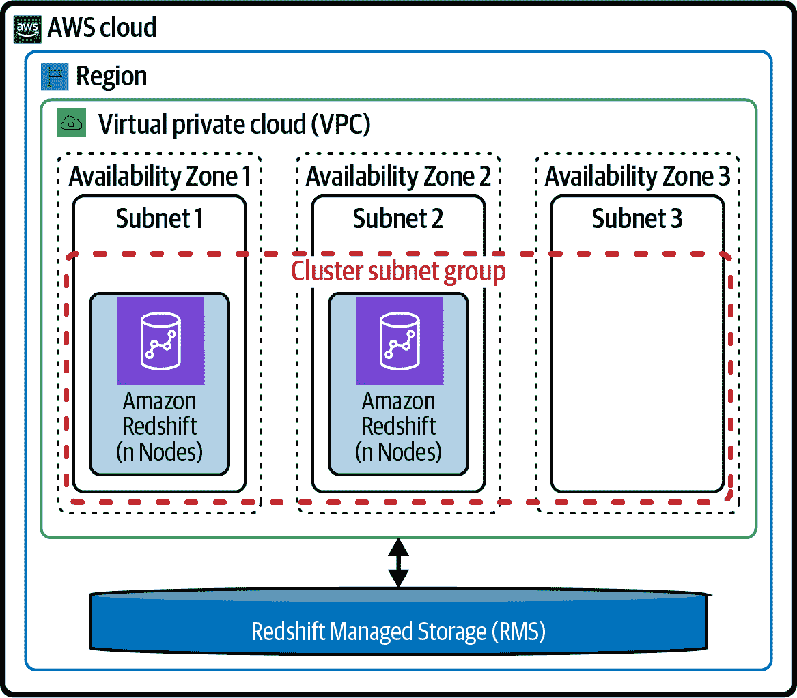

###### 图 10-42. 多区部署与单区部署的比较

## 创建或将预配数据仓库转换为多区配置

您可以在创建新的预配集群时设置 Amazon Redshift 多区部署，或将现有的单区集群迁移到多区配置。本节中，我们涵盖了两种选项：

### 创建带有多区选项的新数据仓库

您可以通过 Amazon Redshift 控制台轻松创建新的多区部署。对于多区部署，Amazon Redshift 将在两个可用区中部署相同数量的节点。多区部署的所有节点在正常操作期间都可以执行读写工作负载处理。多区部署仅支持配置的 RA3 集群。如图 10-43 所示，在创建新集群时选择“是”以进行多区部署选项。这将在两个可用区中部署该集群，并且节点数量为输入值的两倍。

要了解如何在多个可用区中创建 Amazon Redshift 配置的预配数据仓库的详细步骤，请参考博客文章[“为您的 Amazon Redshift 数据仓库启用多区部署”](https://oreil.ly/GDTac)。

对于多可用区，当您选择节点数量时，您将支付四个节点的费用，因为每个可用区将有两个节点可用。您可以为所有四个节点购买预留实例。

在撰写本书时，[多可用区功能](https://oreil.ly/CypTq) 处于预览阶段。因此，您可以选择“预览跟踪”，如 图 10-43 所示，以创建具有多可用区配置的集群。当该功能普遍可用时，您可以选择当前跟踪而不是“预览跟踪”来启用此功能。

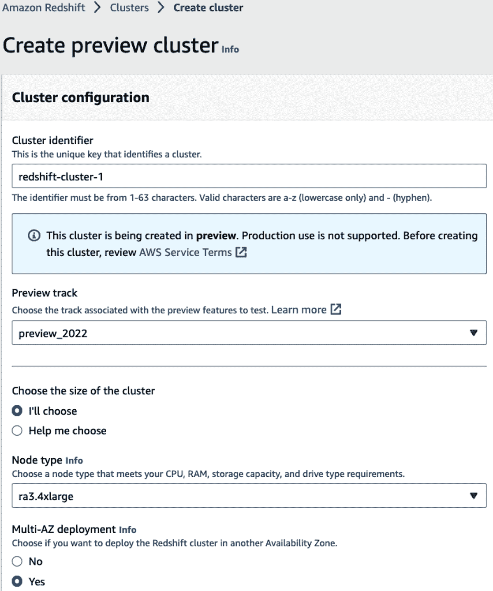

###### 图 10-43\. 创建新的多可用区数据仓库

### 将现有数据仓库从单可用区迁移到多可用区

如果您的组织已经在运行 Amazon Redshift，并且没有配置为多可用区，那么可以通过从现有数据仓库中恢复快照（参见 图 10-44）并配置多可用区来迁移该现有数据仓库。从现有单可用区部署迁移到多可用区部署时，为了保持单查询性能，可能需要在两个可用区中都配置与当前单可用区部署中使用的节点数量相同的节点。这样在迁移到多可用区时，需要确保提供的数据仓库节点数量加倍。例如，如果在单可用区中有两个节点，在迁移到多可用区时，需要在每个可用区中都维护两个节点以保持相同的性能。

如果一个可用区发生故障，Amazon Redshift 将自动使用剩余可用区中的资源继续运行。但是，用户连接可能会丢失并且必须重新建立。此外，正在运行的位于失败可用区的查询将停止。不过，您可以重新连接到您的集群并立即重新安排查询。Amazon Redshift 将在剩余可用区处理重新安排的查询。如果查询失败或连接关闭，Amazon Redshift 将立即重试失败的查询或重新建立连接。在多可用区数据仓库恢复期间，可能会出现运行时延迟以处理故障发生后或发生时发出的查询。

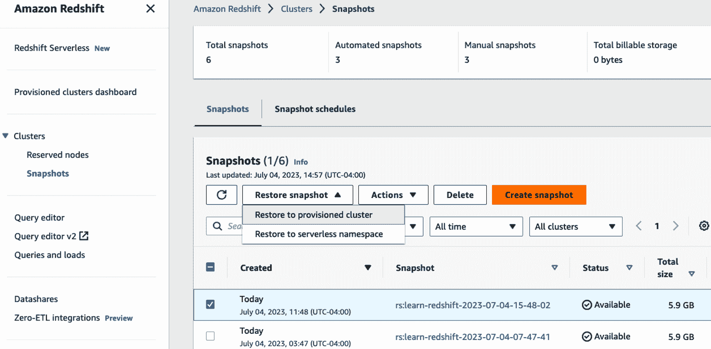

###### 图 10-44\. 将现有单可用区数据仓库转换为多可用区

## 多可用区部署的自动恢复

在可用区失败的不太可能事件中，亚马逊 Redshift 多可用区部署将继续通过自动使用另一个可用区中的资源为您的工作负载提供服务。在意外中断期间，您无需进行任何应用程序更改以维持业务连续性，因为多可用区部署可以访问单个数据仓库端点。亚马逊 Redshift 多可用区部署旨在确保没有数据丢失，并且可以查询在故障发生点之前提交的所有数据。

如图 Figure 10-45 所示，如果发生不太可能的事件导致 AZ1 中的计算节点失败，多可用区部署将自动恢复以使用 AZ2 的计算资源。亚马逊 Redshift 还将自动在另一个可用区（AZ3）中提供相同的计算节点，以便在两个可用区（AZ2 和 AZ3）中同时运行。

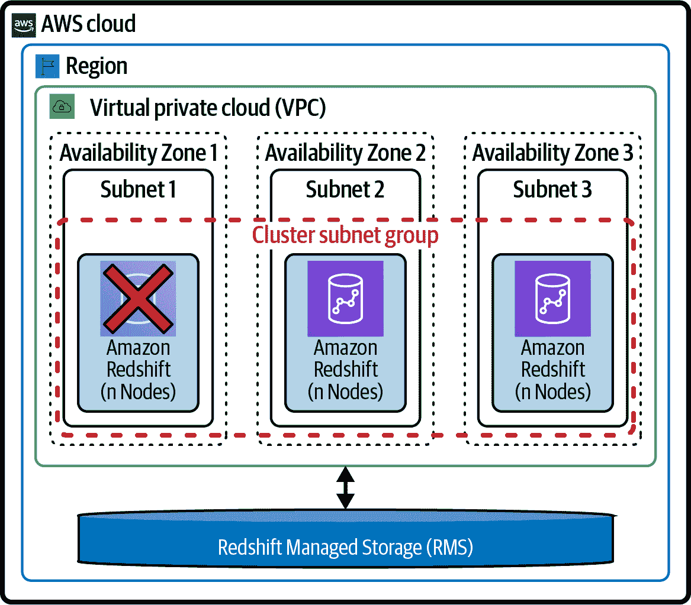

###### 图 10-45\. 多可用区自动恢复

亚马逊 Redshift 多可用区部署不仅用于保护免受可用区故障的可能性，还可以通过自动在多个可用区之间分布工作负载处理来最大化数据仓库的性能。多可用区部署将始终仅使用一个可用区的计算资源处理单个查询，但可以自动将多个同时查询的处理分配到两个可用区，以提高高并发工作负载的整体性能。

在 ETL 过程和仪表盘中设置自动重试是一个良好的实践，这样在主要可用区发生不太可能的故障时，可以重新发出并由辅助可用区的数据仓库提供服务。如果连接中断，可以立即重新尝试或重新建立连接。只有在故障发生时正在进行的活动查询或加载会中止，任何新查询将被路由到辅助可用区，而在失败的可用区中的节点则会恢复到另一个可用区。

# 快照、备份和恢复

通过亚马逊 Redshift 中的快照启用备份和恢复操作。快照是数据仓库或无服务器的备份，可以自动或手动地在某个时间点进行。

## 用于备份的快照

亚马逊 Redshift 在写入快照时使用加密的安全套接字层（SSL）连接将这些快照内部存储在亚马逊 S3 中，并使用 AWS KMS 加密进行存储。

您可以从快照中恢复到新的数据仓库或无服务器实例。在恢复快照时，Amazon Redshift 会创建一个新的数据仓库，并在加载所有数据之前使新的数据仓库可用，因此您可以立即开始查询新的数据仓库。数据仓库根据活动查询按需从快照流式传输数据，然后在后台加载剩余数据。您可以通过在 AWS 管理控制台中查看快照详细信息或通过 CLI 中的 describe-cluster-snapshots 或 DescribeClusterSnapshots API 操作来监视快照的进度。对于正在进行中的快照，这些信息包括增量快照的大小、传输速率、经过的时间以及估计剩余时间。

Amazon Redshift 将快照存储在由 Amazon Redshift 管理的内部 Amazon S3 存储桶中，因此始终可用。为了管理存储费用，请评估需要保留自动快照的天数，并相应配置其保留期。删除任何不再需要的手动快照。有关备份存储成本的更多信息，请参阅[Amazon Redshift 价格页面](https://oreil.ly/6v1Pv)。

为了管理成本，您可以为自动和手动快照设置保留期。您可以通过修改数据仓库或创建时间来更改自动和手动快照的默认保留期。

## 自动快照

默认情况下，自动快照已启用，并且 Amazon Redshift 定期每八小时或每个节点的数据变更超过 5 GB 时拍摄快照，以先到者为准。如果您的数据大于 5 GB * 节点数，则自动快照创建之间的最短时间为 15 分钟。或者，您可以创建一个快照计划以控制何时拍摄自动快照。对于自定义计划，自动快照之间的最短时间为一小时。正如您在图 10-46 中所看到的，快照定期拍摄并在八小时内分布，因为总大小没有变化。

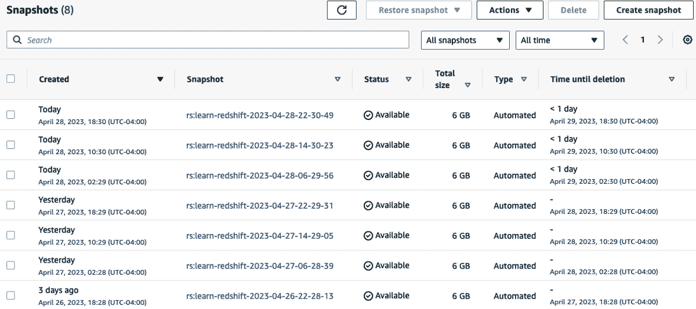

###### 图 10-46\. 自动快照

自动快照在保留期结束时或删除集群时删除。如果要删除集群，请记得为恢复拍摄手动快照。您还可以安排在每日加载后手动拍摄快照，以在灾难恢复情况下提供恢复点。

## 手动快照

当您希望对数据库进行完整备份或需要较长的快照保留期时，可以随时创建手动快照。您可以使用控制台或 CLI 命令 `create-cluster-snapshot` 创建手动快照。在控制台中，选择一个集群，在“操作”菜单下选择“创建快照”以创建手动快照。对于手动快照，您可以选择使用保留期选项无限期保留或特定时间段，如图 10-47 所示。即使删除集群，手动快照也会被保留。您可以为手动快照加上日期时间戳标记，以便将其恢复到先前的状态。

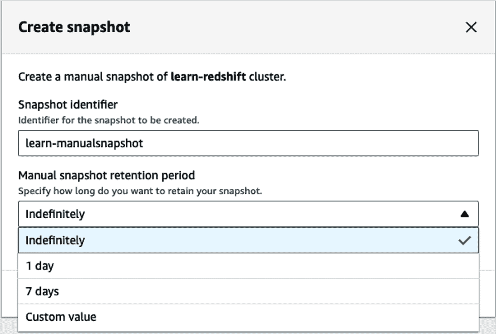

###### 图 10-47。手动快照

要提高还原快照过程的性能，可以创建不需要备份的表，并使用 `BACKUP NO` 选项。这还将减少快照使用的存储空间。

## 使用跨区域快照进行灾难恢复

灾难恢复（DR）传统上仅对事务应用程序至关重要。但是最近，随着数据和分析在决策中的重要性增加，数据仓库应用程序变得至关重要。因此，在构建数据仓库应用程序时，灾难恢复必须成为架构和策略的一部分。

DR 是关于为灾难做好准备，并在主要区域出现意外中断时快速从另一区域恢复您的操作的能力。

使用 Amazon Redshift，可以从控制台设置跨区域快照。选择一个集群，您可以使用“操作”菜单，并选择“配置跨区域快照”，如图 10-48 所示，设置跨区域快照以将数据仓库的快照复制到另一个 AWS 区域。您可以配置将快照复制到的位置以及在目标 AWS 区域中保留自动或手动快照的时间长度。当为集群启用跨区域复制时，所有随后创建的手动和自动快照都会复制到指定的 AWS 区域。

在区域性灾难发生时，您可以使用快照快速在另一区域恢复，并确保应用程序的业务连续性，同时保持成本控制。

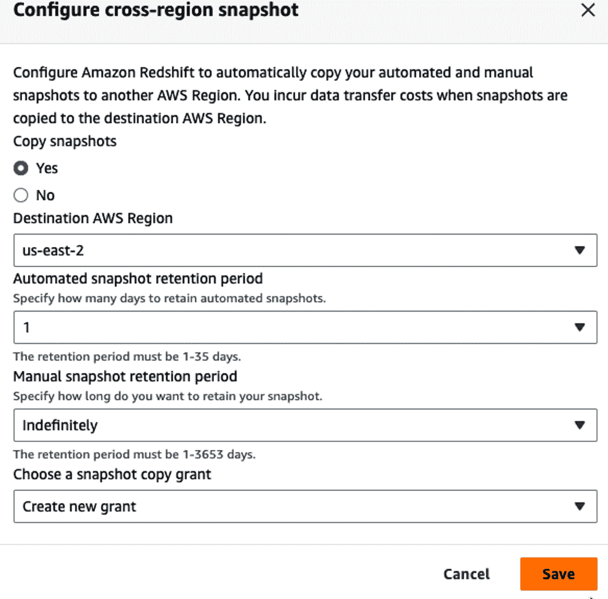

###### 图 10-48。用于灾难恢复的跨区域快照

对于跨多个区域的 Amazon Redshift 的主动-主动设置，可以使用[Amazon Route 53](https://oreil.ly/aBBbH)，这是一个完全托管的 DNS 服务，进行基于延迟或任何规则的路由，以确定用户将访问哪个集群。您可以参考这篇博客文章：[“构建多 AZ 或多区域 Amazon Redshift 集群”](https://oreil.ly/AJ5Uc)。

## 使用快照进行简单重播

对于需要全天候可用的业务关键工作负载，可能无法在生产集群上测试不同的数据模型配置或系统配置。在这些场景下，您可以使用来自主生产数据仓库的快照创建一个测试环境，以测试配置更改是否符合您的性能预期。[Simple Replay Utility](https://oreil.ly/Y0n3y) 是一个工具，您可以使用它进行假设分析，评估您的工作负载在不同数据库配置下的性能表现。

# 使用 CloudTrail 监控 Amazon Redshift

[AWS CloudTrail](https://aws.amazon.com/cloudtrail) 是一个记录用户、角色或 AWS 服务在 Amazon Redshift 中执行操作的服务。CloudTrail 捕获所有 API 调用，包括从 Redshift 控制台的调用和通过代码执行的 Redshift 操作调用。Amazon Redshift 数据共享、Amazon Redshift 无服务器、Amazon Redshift 数据 API 和查询编辑器 V2 都集成在 AWS CloudTrail 中，并在 CloudTrail 操作类别下提供，例如 “Redshift”、“Redshift-data”、“sqlworkbench” 和 “Redshift-serverless”。

CloudTrail 捕获的 Amazon Redshift 事件持续传送到 Amazon S3 存储桶。如果未配置跟踪，则仍可以在 CloudTrail 控制台的事件历史中查看最近的事件。使用 CloudTrail 收集的信息，您可以确定发送给 Redshift 的请求，请求的来源 IP 地址，请求者身份，请求时间以及请求参数。

要使用 CloudTrail 监控 Amazon Redshift，您可以按照以下步骤操作：

启用 CloudTrail

首先，在您的 AWS 帐户中启用 CloudTrail（如果尚未启用）。CloudTrail 记录 AWS API 调用并捕获相关事件。

配置 Redshift 事件日志记录

启用 Amazon Redshift 集群的事件日志记录。这将确保将与 Redshift 相关的事件记录在 CloudTrail 中。您可以通过 AWS 管理控制台或使用 AWS CLI 启用事件日志记录。

查看 CloudTrail 日志

一旦启用了 CloudTrail 并配置了 Redshift 事件日志记录，您可以查看 CloudTrail 日志。这些日志将包含有关 Redshift API 调用的信息，例如集群创建、修改、删除、用户活动等。

设置监控和警报

使用 AWS CloudWatch 设置监控和警报，以监视特定的 Redshift 事件。CloudWatch 允许您创建自定义指标，并根据日志中的特定阈值或模式定义警报。例如，您可以在修改集群或进行特定 API 调用时设置警报。

分析和响应

定期审查和分析 CloudTrail 日志和 CloudWatch 指标，以识别 Amazon Redshift 环境中的任何可疑活动或性能问题。根据发现，采取适当的措施来应对情况，例如调查潜在的安全漏洞或优化查询性能。

通过使用 CloudTrail 监控 Amazon Redshift，您可以深入了解 Redshift 集群的活动和使用模式，这有助于维护安全性、解决问题和优化性能。除了 Amazon Redshift 数据库审计日志之外，您还应使用 CloudTrail，以获取内外数据仓库中运行的操作命令的完整图像。

# 自定义可视化工具来监控 Amazon Redshift

除了使用查询、控制台、CloudWatch 或 API 监控您的数据仓库外，您还可以使用您选择的自定义可视化工具来分析 Amazon Redshift 捕获的指标。Amazon Redshift 在系统表中存储有关查询、摄取、用户日志、工作负载管理以及一般系统配置、性能和使用情况的指标，如 “使用系统表和视图进行监控” 中所讨论的那样。您可以像查询任何其他数据库表一样查询这些系统表和视图。

为了更轻松地使用来自系统表的特定见解来监控数据仓库，您可以使用像 Amazon QuickSight 和 Grafana 这样的可视化工具来构建自己的仪表板。您可以使用 JDBC/ODBC 连接从任何前端可视化工具连接到数据库，并基于对组织重要的指标创建您自定义的可视化。我们将介绍如何使用 AWS 原生可视化工具 Amazon QuickSight 和 Amazon 管理的 Grafana 插件来选择您喜欢的工具构建有影响力的仪表板示例。

## 使用系统表和 Amazon QuickSight 监控运行指标

通过 Amazon QuickSight，您可以通过现代交互式仪表板、分页报告、嵌入式分析和自然语言查询满足不同的分析需求，这些需求都可以从同一真实数据源获得支持。您可以连接到各种数据库，包括 Amazon Redshift，以创建可视化或报告。您可以通过查询系统表来构建自己的监控仪表板，类似于 图 10-49 所示的那样。

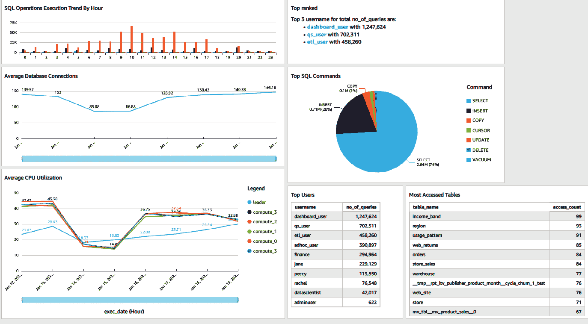

###### 图 10-49\. 使用 QuickSight 创建自定义可视化

## 使用 Amazon Redshift 的 Grafana 插件监控运行指标

Grafana 是由 Grafana Labs 提供的交互式开源可视化工具，用于分析和可视化来自一个或多个数据源的数据。它在各种现代监控堆栈中被使用，使您能够拥有一个共同的技术基础，并在不同系统中应用常见的监控实践。由 AWS 开发的 Amazon 托管的 Grafana 是一个完全托管的 Grafana 服务，可帮助您在指标、日志和跟踪上可视化警报，如 图 10-50 所示。

Grafana 报告增强了协作、透明度和问责制，同时提高了操作指标和趋势的可见性和效率。使用类似 Grafana 的工具可以利用 SQL 的灵活性来获取有关工作负载的见解。您可以查询系统表，如 “使用系统表和视图进行监控” 中讨论的内容。

Amazon Redshift 支持一个用于 Grafana 的插件，您可以通过它构建一个可视化一组策划运行指标的集中式仪表板。这建立在 Amazon Redshift Grafana 数据源之上，您可以将其添加到 Amazon 托管的 Grafana 工作区以及任何其他安装了该数据源的 Grafana 部署中。

若要逐步创建 Amazon 托管的 Grafana 工作区，并使用 Grafana 数据源配置 Amazon Redshift 数据仓库的过程，请参阅博文 [“使用 Amazon Redshift 插件查询和可视化 Amazon Redshift 运行指标”](https://oreil.ly/i2Yta)。

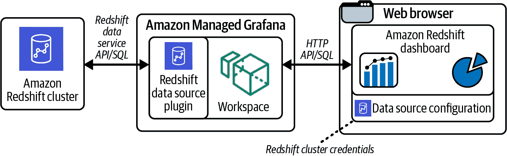

###### 图 10-50\. 使用 Grafana 创建自定义可视化

该解决方案包括以下组件：

+   Amazon Redshift 数据仓库或无服务器实例用于获取要分析的指标。

+   Amazon 托管的 Grafana，附加了 Amazon Redshift 数据源插件。Amazon 托管的 Grafana 通过 Amazon Redshift 数据服务 API 与 Amazon Redshift 数据仓库进行通信。

+   Grafana Web UI，使用 Amazon Redshift 数据仓库作为数据源的 Amazon Redshift 仪表板。Web UI 通过 HTTP API 与 Amazon 托管的 Grafana 进行通信。

如 图 10-51 所示，仪表板显示了集群的运行数据。当您添加更多集群并在 Grafana 中为它们创建数据源时，您可以从仪表板上的数据源列表中选择它们。

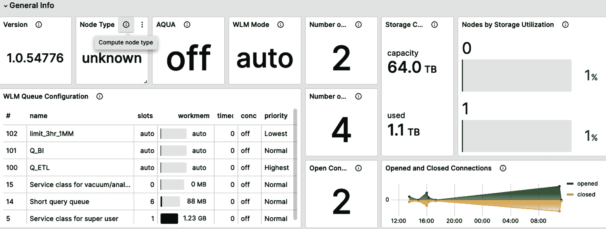

###### 图 10-51\. 使用 Grafana 创建自定义仪表板可视化

由于 Amazon Redshift 数据源插件是一个开源项目，您可以将其安装在任何 Grafana 部署中，无论是在云端、本地，还是甚至在运行在您笔记本电脑上的容器中。这使您能够将 Amazon Redshift 监控无缝集成到几乎所有现有的基于 Grafana 的监控堆栈中。

# 摘要

本章讨论了监控亚马逊 Redshift 专用数据仓库和无服务器的不同方式。Redshift 控制台使得任何管理员都可以更轻松地查看关于查询、摄入工作负载或整体系统资源的警报。由于这些统计数据存储在物理表中，您可以灵活使用您选择的工具创建警报，并监控对工作负载重要的关键指标。我们还涵盖了快照作为备份和恢复的机制，以及使用快照进行容错和灾难恢复的选项。

这也将我们带到了本书的尾声。我们着重讨论了基于我们的经验的架构模式和真实客户场景，并提供了关于亚马逊 Redshift 特定功能何时能更好地管理您的数据并为您的客户提供更好访问的见解。正如您所见，我们还在整本书中提供了对在线文档和博客的引用，因此您可以参考最新更新的文档和最佳实践，随着增加更多的功能。在需要时，我们深入探讨了某些主题，并解释了这些特性对业务工作负载的相关性及其示例。希望您发现本书及其参考资源对现代化云端数据工作负载有所帮助。

本书探索了使用亚马逊 Redshift 的数据仓库世界，全面理解其概念、方法和实际应用。我们深入研究了数据仓库的基本原理，审视了强大数据仓库架构的基本组成部分，并讨论了 ETL 过程、数据建模和数据治理的关键角色。

我们见证了数据仓库在促进组织有效存储、组织和分析大量数据方面的变革力量，最终推动了基于信息的决策，并促进了战略洞见的实现。通过将来自不同来源的数据集中到一个统一、可靠且可访问的存储库中，数据仓库使企业能够揭示有价值的模式、趋势和关联，从而增强其竞争优势。我们还讨论了尽管集中化具有其优势，但一个称为*数据网格*的去中心化数据架构已经发展，以在不移动数据的情况下促进数据访问。

此外，本书强调了将数据仓库倡议与业务目标对齐的重要性，突显了明确定义的数据战略、有效的数据治理框架以及健全的数据质量管理实践的重要性。我们探讨了各种数据仓库架构，例如传统的使用星型模式数据模型的集中式数据仓库，以及包括数据湖、数据网格和数据织物在内的新方法，以及如何利用 Amazon Redshift 构建基于云的解决方案。任何数据专业人士都应该意识到不断变化的景观和适应业务决策者需求的必要性。

随着我们结束这段旅程，必须承认数据仓库领域在技术进步、数据来源的增加和业务需求的发展驱动下仍然以快速的速度演变。对从业者来说，了解新兴趋势（如生成式人工智能、实时数据集成、大数据分析以及人工智能和机器学习技术融入数据仓库流程）至关重要。

最终，本书旨在为读者提供数据仓库原理、技术和最佳实践的坚实基础，作为导航数据管理和分析复杂领域的指南。通过理解与数据仓库相关的关键概念、挑战和机会，读者可以启程进行他们自己的转型之旅，在日益数据驱动的世界中利用数据作为战略资产，释放其组织的全部潜力。
