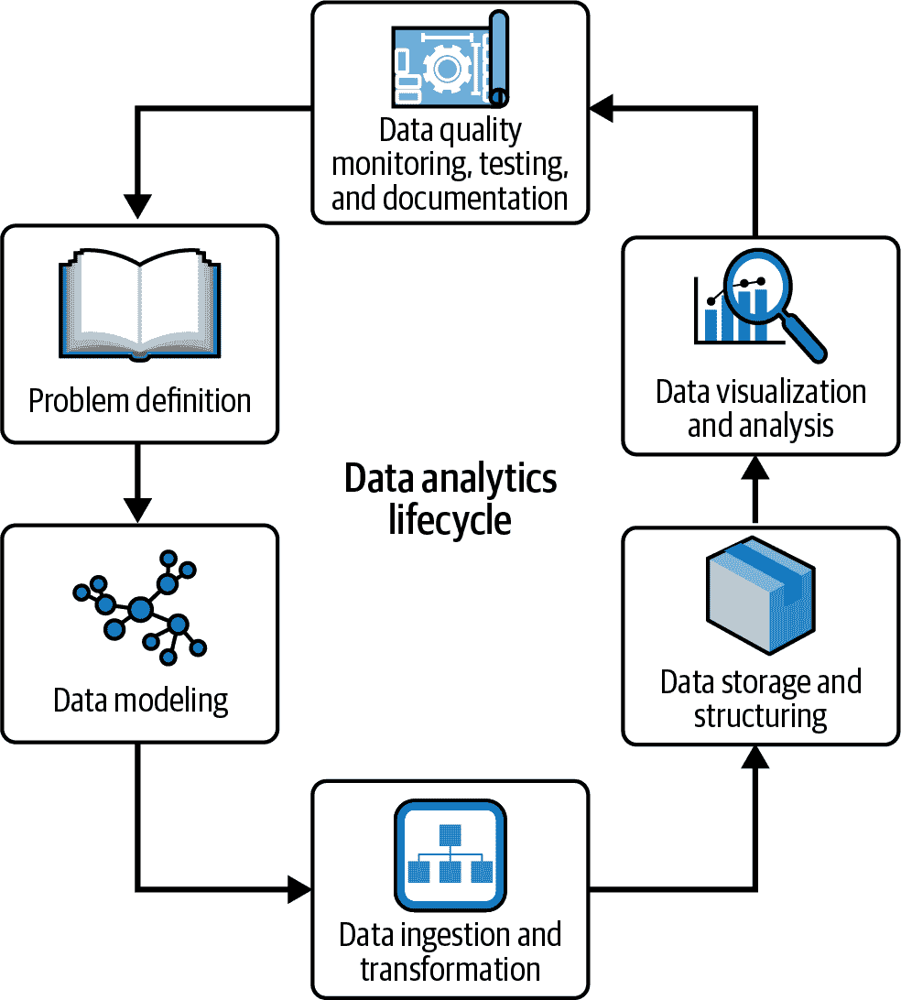

# 第一章：分析工程

分析的发展历程包括许多重要的里程碑和技术，这些里程碑和技术塑造了今天的分析领域。它始于 1980 年代数据仓库的出现，为组织和分析商业数据建立了基础框架。计算机科学家比尔·因蒙（Bill Inmon）在 1980 和 1990 年代持续发表作品，被广泛认为是为数据仓库提供了第一个坚实的理论基础。

随后的发   在 Ralph Kimball，另一位数据仓库和商业智能（BI）领域的主要贡献者，于 1996 年发表了他的影响力巨著《数据仓库工具箱》之后，数据仓库和商业智能的发展迎来了又一波浪潮。Kimball 的工作为维度建模奠定了基础，标志着分析发展中的另一个关键里程碑。Inmon 和 Kimball 的贡献，跨越 20 世纪末，发挥了在塑造数据仓库和分析领域的关键作用。

在 2000 年初，谷歌和亚马逊等科技巨头的崛起，催生了对更先进的数据处理解决方案的需求，促成了 Google 文件系统和 Apache Hadoop 的发布。这标志着大数据工程时代的到来，专业人士利用 Hadoop 框架处理海量数据。

像亚马逊网络服务（AWS）这样的公共云提供商的崛起，彻底改变了软件和数据应用的开发与部署方式。AWS 的一个开创性产品是亚马逊 Redshift，于 2012 年推出。它代表了一种在线分析处理（OLAP）与传统数据库技术的有趣结合。在 Redshift 的早期阶段，数据库管理员需要管理如清理和扩展等任务，以维持最佳性能。

随着时间的推移，云原生技术不断发展，Redshift 本身也经历了重大提升。在保留其核心优势的同时，Redshift 的新版本，以及 Google BigQuery 和 Snowflake 等云原生平台，简化了许多管理任务，向各类企业提供了先进的数据处理能力。这一发展突显了云数据处理生态系统内持续的创新。

现代数据堆栈，包括诸如 Apache Airflow、数据构建工具（dbt）和 Looker 等工具，进一步改变了数据工作流。随着这些进步，"大数据工程师"这个术语已经过时，为数据工程师更广泛和更包容的角色让路。这种转变得到了 Maxime Beauchemin 的影响深远的文章的认可——他是 Apache Superset 和 Airflow 的创造者之一，也是 Facebook 和 Airbnb 的首批数据工程师之一——尤其是他的文章["数据工程师的崛起"](https://oreil.ly/Sc-94)，强调了数据工程在行业中日益重要的地位。所有这些数据领域的快速发展都导致了数据专业人员角色的重大变化。随着数据工具的出现，简单任务正变成战略任务。

如今的数据工程师拥有多方面的角色，包括数据建模、质量保证、安全性、数据管理、架构设计和编排。他们越来越多地采纳软件工程的实践和概念，如功能化数据工程和声明式编程，以增强他们的工作流程。虽然 Python 和结构化查询语言（SQL）在数据工程师中表现突出，但值得注意的是，程序设计语言的选择在这个领域可以因项目的具体需求和偏好而广泛变化。工程师们可能利用其他语言，如 Java（通常用于管理 Apache Spark 和 Beam）、Scala（在 Spark 和 Beam 生态系统中也很普遍）、Go 等。在大型组织中，Java 和 SQL 等语言的组合也是数据工程师中常见的。

组织日益向分散的数据团队、自助服务平台和替代数据存储选项转移。随着数据工程师不得不适应所有这些市场变化，我们经常看到一些人承担更加技术化的角色，专注于平台的启用。其他数据工程师更接近业务，设计、实施和维护将原始数据转化为高价值信息的系统，因此适应这个快速发展的行业，每天都为市场带来新工具，促使了分析工程的奇妙世界的产生。

在本章中，我们介绍了分析工程领域及其在数据驱动决策过程中的角色。我们讨论了分析工程在今天数据驱动世界中的重要性，以及分析工程师的主要角色。此外，我们将探讨分析工程生命周期如何用于管理分析过程，并如何确保生成的数据和见解的质量和准确性。我们还将讨论正在塑造分析工程领域的当前趋势和技术，从历史到现在，涉及到像数据网格这样的新兴概念，并讨论全球采用的诸多数据建模技术之间的基本选择，同时也触及了抽取、加载和转换（ELT）与抽取、转换和加载（ETL）策略。

# 数据库及其对分析工程的影响

长期以来，数据越来越成为公司关注的焦点，这些公司希望在竞争中保持领先、改善内部流程，或仅仅理解其客户的行为。随着新工具、新工作方式和数据科学、商业智能等新知识领域的出现，如今完全调查和理解数据景观变得越来越困难。

技术的自然进步导致了数据分析、可视化和存储工具的过剩供应，每种工具都提供独特的功能和能力。然而，这些工具的加速部署导致了碎片化的景观，个人和组织需要保持与最新技术发展的同步，同时在如何使用它们上做出明智选择。有时这种丰富会造成困惑，并需要持续的学习和适应。

工作实践的演变伴随着工具的多样化。动态和敏捷的方法论取代了数据管理和分析的传统方法。迭代实践和跨功能协作为数据项目引入了灵活性和速度，但同时也在协调各种团队和角色之间的工作流程上带来挑战。有效的沟通和对齐至关重要，因为数据流程的各个方面融合在一起，这要求对这些新型工作实践有全面的理解。

数据科学和商业智能（BI）等专业领域也增加了数据领域的复杂性。数据科学家应用先进的统计和机器学习技术来检测复杂模式，而商业智能专家则从原始数据中提取有价值的信息，产生实用的见解。这些专业领域引入了精细的技术，需要定期的技能发展和学习。成功采用这些实践需要致力于教育，并灵活掌握技能获取的方法。

随着数据在数字领域的传播，它带来了意想不到的数量、种类和速度。数据的涌入，以及现代数据源（如物联网设备和无组织文本）的复杂特性，使得数据管理变得更加严峻。将数据整合、转换和评估数据精度的细节变得更加明显，强调了需要确保可靠和精确洞见的强大方法。

数据世界的多面性增加了其复杂性。作为各个领域技能汇聚的结果，包括计算机科学、统计学和领域特定的熟练程度，需要一种协作和沟通的策略。这种跨学科的互动突显了有效团队合作和知识分享的重要性。

但情况并非始终如此。几十年来，电子表格一直是存储、管理和分析各级别数据的标准技术，无论是用于业务运营管理还是用于分析以理解它。然而，随着企业变得更加复杂，对数据相关决策的需求也在增加。其中第一个改变的形式是被称为数据库的革命。*数据库*可以定义为有组织的、结构化信息或数据的集合，通常以电子方式存储在计算机系统中。这些数据可以是文本、数字、图像或其他类型的数字信息。数据以一种便于访问和检索的方式存储，使用一组预定义的规则和结构，称为*模式*。

数据库在分析中是不可或缺的，因为它们提供了一种有效存储、组织和检索大量数据的方式，允许分析人员轻松访问他们需要进行复杂分析所需的数据，以获得其他情况下难以获得的洞见。此外，可以配置数据库以确保数据完整性，这保证了正在分析的数据准确和一致，从而使分析更可靠和值得信赖。

在分析中使用数据库的最常见方法之一是数据仓库技术，即构建和使用数据仓库。*数据仓库*是一个大型的、集中式的数据存储，旨在简化数据使用。数据仓库中的数据通常来自多种来源，例如事务系统、外部数据源和其他数据库。然后对数据进行清洗、转换，并集成到一个统一的数据模型中，通常遵循星型模式或数据仓库等维度建模技术。

数据库在分析中的另一个重要用途是数据挖掘过程。*数据挖掘*使用统计和机器学习技术来发现大型数据集中的模式和关系。通过这种方式，可以识别趋势、预测未来行为以及进行其他类型的预测。

数据库技术和数据科学家在数据科学的兴起中发挥了关键作用，通过提供一种有效存储、组织和检索大量数据的方式，使数据科学家能够处理大数据集并专注于重要的事务：从数据中获取知识。

使用 SQL 和其他编程语言（如 Python 或 Scala），可以与数据库进行交互，使数据科学家能够执行复杂的数据查询和操作。此外，数据可视化工具如 Tableau 和 Microsoft Power BI 与数据库引擎轻松集成，使数据科学家能够以清晰直观的方式呈现其发现。

随着大数据的出现和存储及处理大规模数据集的需求增长，出现了各种数据库技术以满足不同的需求。例如，数据分析师经常依赖数据库进行广泛的应用，包括数据仓库、数据挖掘以及与 Tableau 等 BI 工具的集成。

然而，深入探讨这些用例以理解分析工程的必要性至关重要。当将 BI 工具直接连接到运营数据库（在线事务处理[OLTP]副本）时，性能和可伸缩性可能受到限制。这种方法对于较小的数据集和简单的查询可能效果良好，但随着数据量的增长和分析复杂性的增加，可能会导致性能瓶颈和子优化的查询响应时间。

这就是分析工程的发挥作用之处。分析工程师是优化数据工作流程、转换和聚合数据的专家，确保数据以适合分析任务的正确格式存在。他们设计和维护数据管道，从各种来源 ETL 数据到优化的数据仓库或数据湖中。通过这样做，他们帮助组织克服直接 OLTP 连接的限制，利用像 Tableau 这样的工具进行更快速、更高效的数据分析。本质上，分析工程弥合了原始数据与可操作洞见之间的差距，确保数据分析师和科学家能够有效地处理大规模、复杂的数据集。

# 云计算及其对分析工程的影响

在过去几十年中，世界面临了一系列具有重大技术影响的复杂挑战。经济衰退推动了金融技术和风险管理系统的创新。地缘政治紧张局势要求在保护关键基础设施和敏感数据方面进行网络安全的进步。全球健康危机凸显了先进数据分析和预测建模在疾病监测和管理中的重要性。此外，迫切需要应对气候变化推动了先进的可再生能源技术和可持续工程解决方案的发展，以实现气候目标。

在面对这些挑战时，追求利润和增长仍然是全球企业的关键驱动力。然而，人力劳动时间的价值已经具备了新的维度，这导致企业运营方式和云计算如何容纳它们发生了显著变化。这种变化反映在越来越多地采用减少对全职支持人员（如数据库管理员）依赖的托管和无服务器产品上。

随着公司适应这一变化的格局，创新、差异化和商业模型与战略的可持续性已成为寻求在快速变化的世界中成功的公司的重要考量。在这种情况下，信息技术和系统行业发现了在帮助组织克服这个充满不确定性和压力的世界中增强其能力的好机会。操作模型的合理化变得迫在眉睫，需要重新评估数据中心和定价结构。此外，产品和服务的提供必须主要侧重于易用性、低延迟、提高安全性、更广泛的实时工具、更多的集成、更智能化、更少的代码以及更快的上市时间。

组织已经意识到投资于创新工具、推动数字转型以及采用以数据为中心的决策方法的重要性，以实现更大的灵活性和竞争优势。为实现这些目标，许多公司正在专注于利用来自内部和外部来源的精心策划的数据。这些精心构建的数据可以为业务绩效提供宝贵的见解。

在行业中，以可访问的格式创建、可视化和分析互联的业务数据的做法通常被称为*数据分析*。从历史上看，它也被称为*商业智能*，这两个术语密切相关。虽然商业智能是分析的一个子集，专注于面向业务的决策，但数据分析涵盖了更广泛的范围，包括产品分析、运营分析和其他几个专业领域。商业智能和数据分析在通过数据驱动的见解帮助组织获得竞争优势方面都发挥着关键作用。

尽管数据分析为改进和重塑业务战略、监控绩效提供了诸多好处，但其需要在服务器、软件许可证以及数据工程师、数据科学家和数据可视化专家等专业人员方面进行重大的财务投入。在经济危机期间，与 IT 硬件、软件和专业人员相关的高前期和运营成本被认为是不切实际和不吸引人的。

因此，设在公司自有场地上并由公司自行管理数据分析基础设施的本地解决方案，对于对此概念不熟悉的分析新手来说，吸引力已大不如前。本地解决方案通常需要大量投资于硬件、软件和持续维护。与基于云的数据分析解决方案相比，它们也缺乏灵活性和可伸缩性。偏好转移促使新的基于云的数据分析解决方案为满足传统数据分析的类似业务需求铺平了道路。然而，与基于本地服务器和软件依赖相比，基于云的解决方案利用云计算服务加速部署并减少基础设施成本。

云计算在各行各业的日益普及，促使微软、谷歌和亚马逊等软件供应商开发了先进的数据分析和数据仓库工具。这些工具设计为在云计算范式下运行，并利用共享网络资源，以实现更大的可访问性和简化的部署。这一趋势的生动例子是微软的综合数据分析平台，Microsoft Fabric。

同时，dbt Labs 的 dbt 产品，在本书稍后会详细讨论，作为一种多功能混合产品脱颖而出。dbt 与 Hadoop 类似，是一种开源解决方案，使用户能够根据其特定需求进行部署，无论是在云端还是本地。在其云端版本中，dbt 与包括 Microsoft Azure、Google Cloud Platform (GCP) 和 AWS 在内的主要云平台无缝集成。这种开源性质使得组织能够根据其独特的需求和基础设施偏好定制其部署方案。

尽管基于云的数据分析解决方案和平台是全球趋势和现代数据平台的核心概念，但重要的是要认识到，云计算解决方案带来了既有利也有风险的影响，这些风险不容忽视。这些风险包括潜在的安全问题、服务器的物理位置以及从特定提供商迁移所带来的成本。

尽管如此，云技术目前正在改变组织部署和构建信息系统和技术解决方案的方式，数据分析也不例外。因此，认识到转向云端不久将不再是一种选择，而是一种必要性，变得至关重要。理解作为服务的分析解决方案的好处至关重要。否则，如果不解决这一过渡问题，提供给决策者的及时信息在缺乏灵活性和可伸缩性的本地解决方案中可能会变得越来越具挑战性。

然而，尽管云技术带来了多种好处，如规模经济和灵活性，它们也带来了信息安全问题。数据集中存储在云基础设施中，使其成为未经授权攻击的吸引目标。在云数据环境中成功，组织必须理解并减轻与云计算相关的风险。关键风险包括数据隐私、控制丧失、数据不完整或不安全删除、未经授权的内部访问、数据可用性和复杂的成本计算。

数据隐私是一个重大关注点，因为验证供应商是否按照法律和标准处理数据是具有挑战性的，尽管供应商的公共审计报告可以帮助建立信任。在非集成的场景中，数据在各种系统和数据中心之间流动，数据安全风险倍增，增加了截取和同步化的风险。另一个重要的风险是供应商依赖性，这种依赖性发生在数据管理责任完全落在一个服务提供商身上，从而限制了迁移到其他解决方案的能力。这种依赖性最终限制了组织对决策的控制和对数据的授权。虽然这些只是一些已知的风险，但我们已经可以理解，组织需要有效地掌握这些风险，以有效地享受基于云的数据分析解决方案的好处。这需要仔细考虑、遵循安全标准和最佳实践，并持续控制成本以衡量投资回报。

如果所有风险在正确的数据战略中得到有效解决和缓解，这份战略详细描述了组织如何管理其信息资产，包括云战略、技术、流程、人员和相关规则，那么相比没有数据战略的组织，组织可以获得显著的竞争优势。通过专注于云计算并利用云数据平台，组织可以将原始数据转化为有意义的见解，加速建立坚实的数据基础的过程。这使得相关数据的高效采集、结构化和分析成为可能，甚至支持 AI 技术的采用，同时在比传统方法更短的时间内和更低的成本下创造价值。

有趣的是，云数据平台、分析和 AI 之间的关系是相互促进的。实施云数据平台加速了分析驱动的架构的采用，并实现了 AI 计划的全面运作。它赋予组织使用所有相关数据的能力，获得企业范围的见解，并开启新的商业机会。通过消除管理多个工具的需求，组织可以专注于数据现代化，加速洞察的发现，并从现有技术合作中获益，从而推动其 AI 之旅。

这也是为什么说，云计算已经成为现代数据平台以及基于云的分析和人工智能平台的核心组成部分，这些平台每天都在不断增长，从而促成了这个行业的颠覆。

# 数据分析生命周期

*数据分析生命周期*是将原始数据转化为有价值且易消化的数据产品的一系列步骤。这些产品可以是良好管理的数据集，仪表盘，报告，API 甚至是 Web 应用程序。换句话说，它描述了如何创建，收集，处理，使用和分析数据，以实现特定的产品或业务目标。

组织动态的不断复杂化直接影响数据处理方式。许多人必须使用相同的数据，但目标不同。虽然高级主管可能只需了解几个顶层关键绩效指标来跟踪业务绩效，而中级管理人员可能需要更详细的报告来支持日常决策。

这突显了基于相同数据基础创建和维护数据产品时需要一种受管制和标准化方法的必要性。鉴于组织必须在其数据治理，技术和管理流程方面做出许多决策，遵循一种结构化方法对于记录和持续更新组织的数据战略至关重要。

因此，数据分析生命周期是理解和映射创建和维护分析解决方案涉及的阶段和过程的重要框架（图 1-1）。它是数据科学和分析的重要概念，并提供了一种结构化方法来管理创建有效分析解决方案所需的各种任务和活动。



###### 图 1-1\. 数据分析生命周期

数据分析生命周期通常包括以下阶段：

问题定义

分析周期的第一阶段涉及理解需要解决的问题。这包括识别业务目标，可用数据以及解决问题所需的资源。

数据建模

在确定业务需求并完成数据源评估后，您可以根据最符合您需求的建模技术开始对数据进行建模。您可以选择菱形策略，星型模式，数据仓库或完全非规范化技术。所有这些概念将在第二章中讨论。

数据摄入和转换

下一阶段是摄取和准备来自源系统的数据，以匹配创建的模型。根据整体信息架构，您可以选择写入模式，其中您将更多的精力放在将原始数据直接转换为您的模型中，或者读取模式，在这种模式下，您摄取和存储数据的时候进行最小的转换，并将大量转换移到数据平台的下游层面。

数据存储和结构化

一旦设计并可能实施数据管道，您需要决定使用的文件格式——简单的 Apache Parquet 或更高级的格式如 Delta Lake 或 Apache Iceberg——以及分区策略和存储组件——基于云的对象存储如 Amazon Simple Storage Service (S3)，或者像 Redshift、BigQuery 或 Snowflake 这样的更类似数据仓库的平台。

数据可视化和分析

一旦数据可用，下一步是探索它、可视化它，或者创建直接支持决策或启用业务流程监控的仪表板。这个阶段非常业务导向，应与业务利益相关者密切协调。

数据质量监控、测试和文档化

尽管在分析生命周期的最后阶段，数据质量应该是一个端到端的关注点，并且在整个流程中通过设计来保证。它涉及实施所有质量控制，以确保利益相关者可以信任您的公开数据模型，记录所有转换和语义含义，并确保在数据继续流动的过程中沿着管道进行适当的测试。

###### 注意

使用 dbt，这些组件中的几个可以更轻松、更高效地部署，因为它允许我们并行跨生命周期构建它们。文档编制、测试和质量成为并行执行的常见任务。这将在第四章中广泛阐述。

分析生命周期是一个关键概念，使组织能够以结构化和一致的方式处理数据工程、科学和分析过程。通过遵循结构化的过程，组织可以确保他们解决正确的问题，使用正确的数据，并构建准确可靠的数据产品，最终实现更好的决策和更好的业务结果。

# 分析工程师的新角色

如前所述，数据科学家和分析师现在可以轻松访问他们需要执行复杂分析并获得洞察力的数据。然而，随着存储和分析的数据量继续增长，对组织来说拥有数据专家来帮助他们管理数据并提供所需的基础设施变得越来越重要。

最近成立的一类专门数据工程师分支，称为*分析工程师*，在开发和维护数据库和数据管道中发挥着重要作用，使数据科学家和分析师能够专注于更高级的分析任务。分析工程师负责设计、构建和维护数据架构，使组织能够将数据转化为有价值的见解，并做出数据驱动的决策。

此外，从传统的强制写入模式的 ETL 过程转向 ELT 模式，即先写后读的方法，意味着数据现在在被转换之前就已经进入了数据仓库。这为那些既非常了解业务又具备技术技能，能将原始数据建模为清洁、明确定义数据集的超级技术分析师，即分析工程师，提供了机会。如果您在数据仓库和 ETL 范式的世界中寻找这些类型的技能，将需要同时具备软件工程和数据分析技能——这将更难找到。

分析工程师充当了数据平台工程师和专注于将数据转化为见解型数据产品的数据分析师之间的桥梁。他们的工作是创建经过良好测试、最新、有文档记录的数据集，整个组织可以用来回答他们自己的问题。他们具备足够的技术能力，能够应用软件开发最佳实践，如版本控制和持续集成/持续部署（CI/CD），但也需要能够有效地与利益相关者沟通。

我们可以类比到土木工程：数据平台工程师是分析项目的基础，负责确保基础设施的稳固性，包括管道、电气系统和结构基础。他们为接下来的所有工作奠定了基础。

分析工程师可以被类比为建筑师。他们利用数据工程师创建的坚实基础，设计符合业务模型的结构，从出色的仪表板到有价值的数据模型，构建一切。他们弥合了技术基础设施与业务目标之间的差距。

在这个类比中，数据分析师则扮演室内设计师的角色。他们步入建筑内部，不仅确保内容与用户一致，而且使其用户友好并根据数据消费者的特定需求定制。这些角色共同合作，创建一个全面和功能齐全的分析环境。

看看数据分析生命周期，数据平台工程师建立平台并将原始数据导入企业级数据存储中。另一方面，分析工程师将原始数据转换，以匹配业务需要支持决策的分析数据模型。

# 分析工程师的责任

随着数据量和复杂性以及其多样化应用的增长，分析工程师的角色变得越来越重要。这包括从设计和实现数据存储和检索系统，到创建和维护数据管道，再到开发和部署机器学习模型。在这个动态的景观中，分析工程师在利用日益增长的数据资源并在各种应用中最大化其价值方面发挥着关键作用。

基于最新的角色趋势，主要职责之一是设计和实现高效的数据存储和检索系统。这包括与数据库和数据仓库技术合作，设计能处理大型和复杂数据集的数据模型和结构。另一个直接的职责是创建和维护数据管道，从各种来源提取数据，进行转换，并将其加载到中央库进行分析。

对于大多数分析工程师来说，开发和使用机器学习模型的过程可能不太明显，但仍在进行中。这包括与数据科学家合作，理解他们的需求，选择和实现适当的算法，并确保模型经过正确的训练和部署，并使用正确的训练和测试数据集。在这种情况下，分析工程师会合作建立适当的数据管道，以持续提供适当的训练和测试数据给数据科学家。

此外，分析工程师还负责监控和维护机器学习模型的性能，通过帮助结构化离线评估和将模型特定的指标与业务指标结合，进行在线监控。

分析工程师通常精通编程语言和工具，如 Python、R、SQL 和 Spark，用于实施数据管道、数据模型和机器学习模型。他们还应熟悉像 AWS、GCP 或 Azure 等云计算平台，以部署和扩展他们的解决方案。

在观察分析工程师在几家公司中的职责时，可以包括以下内容：

+   设计和实现数据存储和检索系统，如数据库和数据仓库，以处理大型和复杂数据集。创建和维护数据管道，从各种来源提取、转换和加载数据到中央库进行分析。

+   通过执行数据质量检查、跟踪数据流动并实施数据安全措施，确保数据准确、完整、一致和可访问。

+   利用 AWS、GCP 或 Azure 等云计算平台部署和扩展分析解决方案，以及数据基础设施的可伸缩性、安全性和成本优化。

+   优化数据存储和检索系统的性能，数据管道以及机器学习模型，确保它们能够处理大量和复杂性的数据。

+   使用 Python、R、SQL 和 Spark 等编程语言和工具实现数据管道、数据模型和机器学习模型。

+   与数据科学家合作，了解他们的需求，选择并实施适当的算法，确保机器学习模型得到正确训练和部署。监控和维护机器学习模型的性能，并根据需要进行故障排除和优化。

+   保持与数据工程、机器学习和分析的最新技术和趋势同步，并持续寻求改进组织的数据基础设施和分析能力的机会。

分析师的角色广泛，需要结合技术技能、问题解决能力和对业务需求的理解。分析工程师必须熟悉数据科学的技术和业务方面，并能够弥合数据科学家和 IT 之间的鸿沟。

# 在数据网格中启用分析

*数据网格*是一种现代框架，概述了组织的数据战略。它使业务域团队能够负责其数据及提供对其的访问的服务，而不仅仅依赖于中心数据团队。它将单片数据架构分解为一组独立的、自治的数据服务，实现了更精细的扩展、更多的自治和更好的数据管理。它在处理不同类型的数据时提供了更大的灵活性，并促进了实验、创新和协作文化。借助数据网格，企业应能更快速地移动并更快速地响应业务变化的需求。

数据网格方法论作为一种架构模式的出现，彻底改变了分析师与数据基础设施互动的方式。通过将单片数据架构分解为一系列独立的、自治的数据服务，这些服务可以独立开发、部署和运营，团队可以更细粒度和轻松地解决可扩展性、可管理性和数据架构自治性的挑战。

采用这种新颖的方法，团队可以更细粒度地扩展其数据基础设施，降低数据孤岛和重复数据的风险。每个业务域团队也拥有更多的自治权，可以根据特定需求选择最佳工具和技术，但利用中心提供的服务来管理整个数据生命周期。这使他们能够更快速、更灵活地响应业务变化的需求。此外，数据网格方法还提供了处理结构化、半结构化和非结构化数据的更大灵活性。通过分解单片数据架构并实现数据服务的清晰映射，还能促进更好的数据治理实践。

在数据网格组织中，分析工程师可以通过专注于构建和维护支持多个团队和应用程序需求的独立、自治的数据服务来提供价值，例如共享数据模型，良好治理和文档化，以确保数据的轻松发现、可访问性和安全性。

在数据网格工作的另一个有意义的方面是确保数据治理和安全性，这可能包括实施数据访问控制、数据排序和数据质量检查等数据政策和程序，以确保数据安全和高质量。此外，分析工程师应与数据所有者和利益相关者合作，了解并遵守所有数据存储和管理的法规要求。

在数据网格中工作需要与传统的单片式数据架构有不同的思维方式。分析工程师必须摆脱数据是集中资源的观念，而将其视为分布式自治服务，各团队可以使用。

## 数据产品

我们一直在使用的另一个重要概念是*数据产品*。这些是可访问的应用程序，提供访问数据驱动洞见的支持，将支持业务决策过程甚至自动化它们。在内部，它们可能包含用于检索、转换、分析和解释数据的组件。另一个重要方面是，数据产品应该以一种方式暴露它们的数据，使其可以被其他内部或外部应用程序或服务访问和使用。

一些数据产品的例子如下：

+   一个 REST API，允许用户查询特定的业务数据模型。

+   从各种来源摄取和处理数据的数据管道。

+   存储和管理大量结构化和非结构化数据的数据湖。

+   帮助用户理解和传达数据洞见的数据可视化工具。

数据产品也可以包括微服务。这些是小型、独立和专注的服务，可以独立开发、部署和扩展。它们可以通过 API 访问，并在整个企业中重复使用。

## dbt 作为数据网格的促进者。

*dbt* 是一个开源工具，帮助数据工程师、分析工程师和数据分析师通过提供创建、测试和管理数据服务的方式构建数据网格。它允许团队定义、测试和构建数据模型，并为这些模型创建清晰和明确定义的接口，以便其他团队和应用程序可以轻松使用。

支持创建数据网格的 dbt 特性包括以下内容：

数据建模能力

数据建模能力允许团队使用简单且熟悉的基于 SQL 的语法定义其数据模型，使得数据工程师和数据分析师可以轻松地共同定义和测试数据模型。

数据测试能力

dbt 提供了一个测试框架，允许团队测试其数据模型，并确保其准确和可靠。这有助于在开发过程的早期发现错误，并确保数据服务的高质量。

数据文档

dbt 使数据模型和服务能够被文档化，以便其他团队和应用程序能够轻松理解和使用。

数据跟踪能力

数据跟踪能力使团队能够追踪数据模型的来源。这使得理解数据的使用方式和来源变得容易。

数据治理能力

数据治理能力使得执行数据访问控制、数据血统和数据质量检查等数据治理政策成为可能，有助于确保数据安全和高质量。

尽管数据分析工程的主要焦点是设计和实施数据模型，但重要的是要注意，数据跟踪和治理能力可以显著增强分析工程流程的有效性。在需要数据模型追踪数据来源并遵守严格的数据治理政策的情况下，这些能力尤其有价值。采用这些实践和治理模型，包括数据网格，可能会因数据环境的具体需求和复杂性而有所不同。许多成功的 dbt 部署从较简单的单星模式数据模型开始，并且随着时间推移可能探索像数据网格这样的高级概念。

# 数据分析工程的核心

*数据转换* 将数据从一种格式或结构转换为另一种，使其更加有用或适合特定的应用或目的。这个过程是必要的，因为它使组织能够将原始、非结构化的数据转换为有价值的见解，从而可以指导业务决策，改进运营并推动增长。

数据转换是分析生命周期中的关键步骤，组织必须拥有有效和高效执行此任务的工具和技术非常重要。数据转换的一些示例包括数据清理和准备、数据聚合和汇总，以及通过添加额外信息丰富数据。由于 dbt 允许组织快速、轻松地执行复杂的数据转换任务，并且可以与其他工具（如 Airflow）集成用于端到端数据管道管理，因此 dbt 在数据转换中的使用非常广泛。

对于分析师和企业利益相关者来说，dbt 是*现场*。当数据被转换并以易于使用的形式交付时，对企业和利益相关者的价值得以体现。

###### 提示

*现场（Gemba）* 是一个日语术语，意思是“真实的地方”。在企业界，现场指的是价值创造的地方。

在 ETL 策略中，数据转换通常在数据加载到目标系统（如数据仓库或数据湖）之前执行。数据从各种来源提取，转换以匹配目标系统的结构和格式，然后加载到目标系统中。这个过程确保数据在系统和应用程序之间是一致且可用的。

相比之下，ELT 策略代表了一种更新颖、更灵活的数据处理方法。在这种策略中，数据首先被提取并加载到目标系统中，然后再进行转换。ELT 提供了多种优势，包括增加的灵活性和支持更广泛数据应用能力，超过了传统 ETL 范式。其一个显著的优势在于，它能够在目标系统内直接进行各种数据转换和实时洞察。这种灵活性使组织能够更快速地从数据中获得可操作的洞察，并适应不断变化的分析需求。

然而，需要指出的是，ELT 可能伴随着更高的存储和摄入成本，因为需要存储原始或最小转换后的数据。许多企业认为这些成本是合理的，因为它们为其运营带来了重大价值，特别是灵活性。因此，随着基于云的数据仓库解决方案的出现以及它们提供的改进的数据转换和处理能力，ELT 越来越受欢迎。

无论使用哪种策略，如果没有适当的数据清洗、转换和标准化，数据可能会变得不准确、不完整或难以使用，从而导致糟糕的决策。

# 传统流程

传统上，传统的 ETL 过程往往复杂、耗时，并需要专门的技能来开发、实施和维护。它们通常还需要大量的手工编码和数据操作，使其容易出错且难以扩展。

此外，这些过程通常缺乏灵活性，无法适应不断变化的业务需求或新的数据来源。随着数据量、种类和速度的增长，传统的 ETL（抽取-转换-加载）过程变得越来越不足够，因此正在被更现代、更灵活的 ELT（抽取-加载-转换）方法所取代。

过去，通常使用自定义脚本或专门的基于可视化的 ETL 工具来执行 ETL。这些脚本或工具从各种来源（如平面文件或数据库）提取数据，对数据进行必要的转换，然后将数据加载到目标系统，如数据仓库中。

一个传统 ETL 过程的示例可能是使用 SQL 脚本和编程语言（如 Java 或 C#）来从关系数据库提取数据，使用编程语言转换数据，然后将转换后的数据加载到数据仓库中。另一个例子是使用专用 ETL 工具如 Oracle Data Integrator 或 IBM InfoSphere DataStage 来在系统间提取、转换和加载数据。这些传统 ETL 过程可能很复杂，难以维护和扩展，并且通常需要专门的开发团队。

## 使用 SQL 和存储过程进行 ETL/ELT

在过去，特定的数据平台使用存储过程在关系数据库管理系统（RDBMS）如 SQL Server 或 Oracle 中进行 ETL。*存储过程*是预先编写的 SQL 代码，可以存储在数据库引擎中，以便可以重复使用该代码。根据是数据流入还是流出，脚本会在源数据库或目标数据库中执行。

假设你想要创建一个简单的存储过程来从表中提取数据，转换数据，并将其加载到另一个表中，如示例 1-1 所示。

##### 示例 1-1\. 提取数据的 SQL 过程

```
CREATE PROCEDURE etl_example AS
BEGIN
    -- Extract data from the source table
    SELECT * INTO #temp_table FROM source_table;

    -- Transform data
    UPDATE #temp_table
    SET column1 = UPPER(column1),
        column2 = column2 * 2;

    -- Load data into the target table
    INSERT INTO target_table
    SELECT * FROM #temp_table;
END
```

该存储过程首先使用`SELECT INTO`语句从源表中提取所有数据并将其存储在临时表(`#temp_table`)中。然后它使用`UPDATE`语句将`column1`的值改为大写并将`column2`的值加倍。最后，存储过程使用`INSERT INTO`语句将`#temp_table`中的数据加载到`target_table`中。

###### 注意

如果你对 SQL 语法不熟悉，不必担心。第三章专门为您提供使用基础知识。

需要注意的是这只是一个基础示例，实际的 ETL 过程通常要复杂得多，并涉及许多步骤，如数据验证、处理空值和错误以及记录处理结果。

虽然可以使用存储过程进行 ETL 过程，但需要注意使用它们可能会有一些影响，比如需要专业知识和专长来编写和维护这些过程，以及灵活性和可扩展性的缺乏。此外，使用存储过程进行 ETL 可能会使与其他系统和技术集成以及解决 ETL 过程中出现的问题变得困难。

## 使用 ETL 工具

正如先前提到的，ETL 工具是一种软件应用程序，通过提供可视化界面、软件开发工具包（SDK）或编程库以及预打包的代码和工件，加速构建摄取和转换管道的过程。这些工具可以用于从各种来源提取、转换和加载数据到目标位置，如数据仓库或数据湖。许多组织通常使用它们来自动化将数据从各个系统和数据库传输到中央数据仓库或数据湖的过程，以便进行分析。

Airflow 是一个流行的开源平台，用于管理和调度数据管道。由 Airbnb 开发，近年来因其灵活性和可伸缩性而广受欢迎。Airflow 允许用户使用 Python 代码定义、调度和监视数据管道，使其对数据工程师和科学家而言易于创建。

示例 1-2 展示了一个简单的 Airflow DAG。一个*有向无环图*（DAG）是一个没有有向环路的有向图。

##### 示例 1-2\. 一个 Airflow DAG

```
from airflow import DAG
from airflow.operators.bash_operator import BashOperator
from datetime import datetime, timedelta

default_args = {
    'owner': 'me',
    'start_date': datetime(2022, 1, 1),
    'depends_on_past': False,
    'retries': 1,
    'retry_delay': timedelta(minutes=5),
}

dag = DAG(
    'simple_dag',
    default_args=default_args,
    schedule_interval=timedelta(hours=1),
)

task1 = BashOperator(
    task_id='print_date',
    bash_command='date',
    dag=dag,
)

task2 = BashOperator(
    task_id='sleep',
    bash_command='sleep 5',
    retries=3,
    dag=dag,
)

task1 >> task2
```

此代码定义了一个名为`simple_dag`的 DAG，每小时运行一次。它有两个任务，`print_date`和`sleep`。第一个任务执行`date`命令，打印当前日期和时间。第二个任务执行`sleep 5`命令，使任务休眠五秒。第二个任务的重试次数设置为 3 次。因此，如果任务失败，它将在放弃之前重试三次。这两个任务由运算符`>>`连接。这也意味着`task2`依赖于`task1`，并且只有在`task1`成功完成后才会执行。

Airflow 是一个用于调度和管理 ETL 管道的高效工具，但它也有一些局限性。首先，Airflow 的设置和管理可能非常复杂，特别是对于大型或复杂的管道。其次，它并没有专门为数据转换而设计，可能需要额外的工具或定制代码来执行某些类型的数据操作。

###### 注意

dbt 可以通过提供一组最佳实践和数据转换的约定，以及用于执行和管理数据转换的简单直接的界面，来解决这些 Airflow 的局限性。它还可以与 Airflow 集成，提供一个易于设置和管理的完整的 ETL/ELT 解决方案，同时提供对数据管道的高度灵活性和控制。

# dbt 革命

dbt 是一个开源的命令行工具，在数据分析行业中越来越受欢迎，因为它简化和优化了数据转换和建模的过程。另一方面，Airflow 是一个强大的开源平台，用于以编程方式创建、调度和监控工作流。当 dbt 与 Airflow 集成时，数据管道可以更高效地管理和自动化。Airflow 可以用来调度 dbt 运行，而 dbt 可以用来执行管道中的数据转换任务。

这种集成使团队能够管理从数据提取到加载到数据仓库的整个数据管道，确保数据始终保持最新和准确。集成使得自动化数据管道任务、调度和监控管道以及及时解决问题变得更加容易。

为了说明构建简单 dbt 模型的简易性，想象一下你想要建立一个模型，通过将每个订单的收入相加来计算公司的总收入。模型可以通过一个 dbt 模型文件来定义，该文件指定了计算的 SQL 代码以及任何所需的依赖关系或参数。示例 1-3 展示了模型文件可能的样子。

##### 示例 1-3\. 一个 dbt 模型

```
{{ config(materialized='table') }}

select
    sum(orders.revenue) as total_revenue
from {{ ref('orders') }} as orders
```

dbt 的主要优势之一是，分析工程师可以使用一种简单的高级语言编写可重用、可维护和可测试的数据转换代码，从而消除了编写 SQL 的复杂性。这促进了团队在数据项目上的协作，并减少了数据管道中错误的风险。

dbt 的另一个好处是，它能够实现更高效的数据管道管理。通过与像 Airflow、Dagster 或 Prefect 等编排工具以及 dbt Labs 自己的 dbt Cloud 产品集成，dbt 赋予团队有效地规划、调度和监控数据管道的能力。这确保数据始终保持最新和准确。dbt 与 Airflow 等编排工具的协同作用允许无缝地刷新数据并部署新的逻辑，类似于软件工程中的 CI/CD 实践。这种集成确保了随着新数据的可用性或转换的更新，数据管道可以有效地编排和执行，以提供可靠和及时的洞察。

总体来说，对于希望提高其数据分析能力并简化数据管道的组织来说，dbt 正变得越来越普及。尽管它仍然是一种相对较新的技术，但许多公司正在使用它，并认为它是数据专业人士的宝贵工具。第 4 章 将更深入地介绍 dbt 及其能力和特性。

# 总结

在最近几十年中，数据管理领域经历了深刻的变革，从基于结构化方法的数据存储和访问（如基于 SQL 的存储过程）转向了更灵活和可扩展的工作流。这些现代工作流得到了像 Airflow 和 dbt 这样强大工具的支持。Airflow 支持动态编排，而 dbt 将分析代码提升到了生产级软件的水平，引入了数据测试和转换的创新方法。

在这个充满活力的环境中，新角色如数据分析工程师应运而生，站在数据工程与数据分析的交汇点上，确保提供强大的洞察力。尽管工具和角色不断演进，数据的内在价值仍然不变。然而，数据管理正在演变为一门不仅关注数据本身，还关注运用数据的专业人士的学科。

尽管取得了这些进展，核心挑战仍然存在：获取关键数据、维护最高的数据质量标准、高效存储数据以及在数据交付中满足利益相关者的期望。数据价值链的核心在于数据建模的复兴。高效的数据建模不仅限于数据收集；它将数据结构化和组织起来，以反映现实世界的关系和层次。第二章 将深入探讨数据建模及其在分析工程中的关键角色。

在本章中，我们探讨了数据管理的演变、数据分析工程师角色的出现，以及数据网格和 ELT 与 ETL 策略之间的区别。这一多样的主题旨在提供对数据领域的全面概述。
