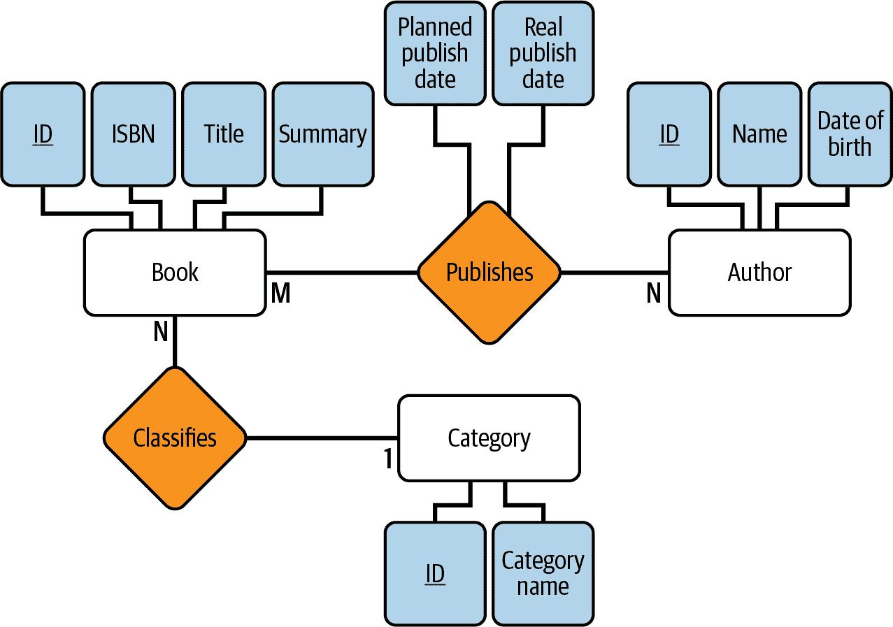
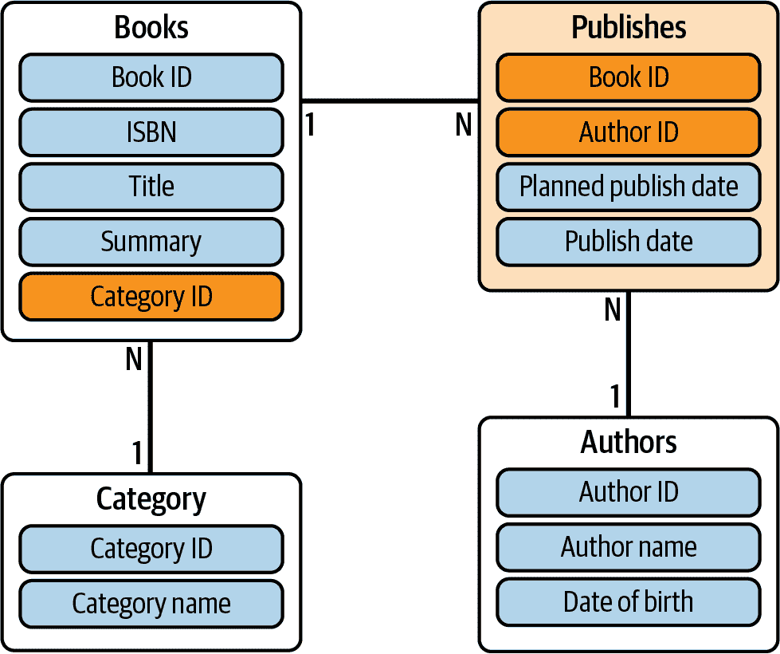
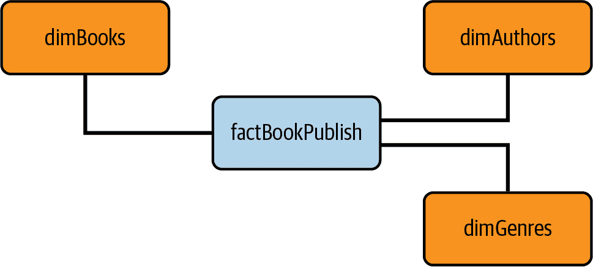
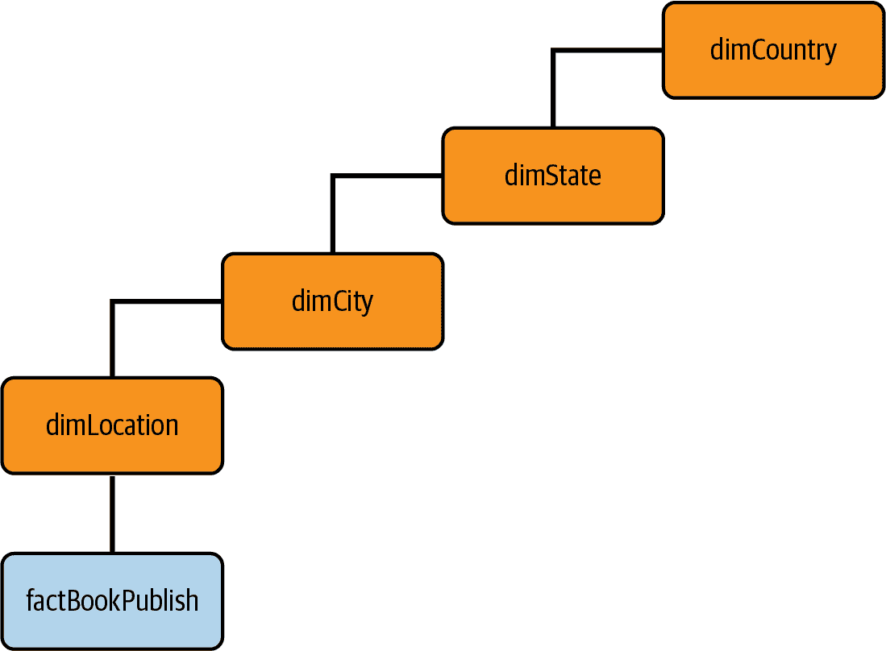
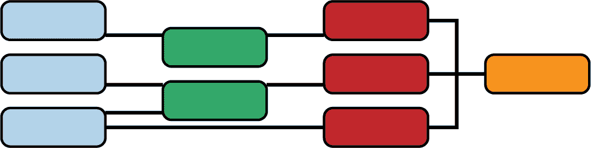
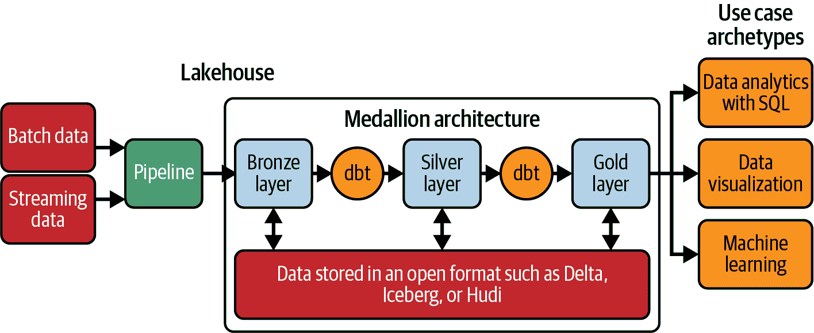

# 第二章：数据建模与分析

在当今数据驱动的世界中，组织越来越依赖数据分析来获取宝贵的见解并做出明智的决策。数据建模在此过程中扮演了至关重要的角色，为结构化和组织数据提供了坚实的基础，以支持有效的分析。此外，理解数据建模和规范化的概念对于实现分析的全部潜力并从复杂数据集中获得可操作的见解至关重要。

*数据建模*是定义系统内数据实体的结构、关系和属性。数据建模的一个重要方面是数据的规范化。*数据规范化*是消除数据冗余并提高数据完整性的技术。它涉及将数据分解为逻辑单元，并将其组织成单独的表格，从而减少数据重复，并提高整体数据库效率。规范化确保数据以结构化和一致的方式存储，这对于准确的分析和可靠的结果至关重要。

在分析领域，数据建模为创建分析模型提供了坚实的基础。分析师可以通过理解实体和数据结构之间的关系来设计有效的模型，捕捉相关信息并支持所需的分析目标。换句话说，一个设计良好的数据模型使分析师能够执行复杂的查询，连接表格，并聚合数据以产生有意义的见解。

理解数据建模和规范化对于实际数据分析至关重要。分析师如果没有合适的数据模型，可能会难以访问和正确解释数据，从而导致错误的结论和无效的决策。此外，缺乏规范化可能导致数据异常、不一致性和难以聚合数据，阻碍分析过程。

在这本书中，我们将 SQL 和 dbt 作为两种核心技术突出展示，以支持有效的分析工程项目，这也适用于设计和实施有效的数据模型。背后的原因是，SQL 赋予用户定义表格、操作数据并通过其强大的查询能力检索信息的能力。其无与伦比的灵活性和多功能性使其成为构建和维护数据模型的强大工具，赋予用户表达复杂关系和轻松访问特定数据子集的能力。

与 SQL 相辅相成，dbt 在这一叙述中起着核心作用，将数据建模艺术推向全新高度。它作为一个全面的框架，用于构建和编排复杂的数据管道。在这个框架内，用户可以定义转换逻辑，应用关键业务规则，并编写可重复使用的模块化代码组件，称为*模型*。值得注意的是，dbt 不仅限于独立功能：它与版本控制系统无缝集成，使协作变得轻松，并确保数据模型保持一致性、可审计性和易复现性。

SQL 和 dbt 在数据建模中的另一个关键方面是它们对测试和文档的重视，尽管有一些值得澄清的区别。在数据建模的背景下，测试涉及验证数据模型的准确性、可靠性和遵守业务规则。虽然需要注意的是，dbt 的测试能力与软件开发中传统的单元测试有所不同，但它们的目的类似。dbt 提供的验证查询不同于传统的单元测试，它们类似于分析人员习惯运行的查询。这些验证查询检查数据质量、数据完整性以及遵守定义的规则，为模型的输出提供信心。此外，dbt 在文档编制方面表现出色，为分析人员和利益相关者提供了宝贵的资源。这些文档简化了理解驱动数据模型的基础逻辑和假设，增强了透明度并促进了有效的协作。

SQL 和 dbt 共同赋能数据专业人士创建强大、可扩展和可维护的数据模型，推动洞察性分析和明智的决策。通过利用这些工具，组织可以释放数据的全部潜力，在当今数据驱动的景观中获得竞争优势。将这两者结合在同一数据架构和策略中，对数据建模带来了显著的优势。

# 数据建模简介

在数据库设计领域，创建结构化和有组织的环境对于有效存储、操作和利用数据至关重要。数据库建模通过提供代表特定现实或业务的蓝图，并支持其过程和规则，对实现这一目标起到了重要作用。

然而，在我们深入创建这个蓝图之前，我们应该专注于理解业务的微妙差别。理解业务的运营、术语和流程对于创建准确和有意义的数据模型至关重要。通过采访、文档分析和流程研究收集需求，我们深入了解业务的需求和数据要求。在这个收集过程中，我们应该专注于自然的沟通方式——书面语言。通过清晰的句子表达业务事实，确保业务的表达准确且没有歧义。将复杂的句子分解为主语、谓语和宾语的简单结构，有助于简洁地捕捉业务实际情况。

除了这些基本实践之外，还值得注意的是，像劳伦斯·科尔在他的畅销书《敏捷数据仓库设计》（DecisionOne Press）中提倡的进一步技术，如白板绘图和画布设计，在数据模型设计的初始阶段可以增加细节，允许更全面地探索业务需求，并确保最终的数据模型与业务目标和复杂性无缝对接。

一旦理解阶段完成，我们将进入数据库建模的三个基本步骤：

+   概念阶段

+   逻辑阶段

+   物理阶段

这些步骤构成了创建稳健且良好组织的数据库结构的旅程。让我们以图书出版商为例来说明这个过程。

## 建模的概念阶段

数据库建模的*概念阶段*需要几个关键步骤。首先，需要确定数据库的目的和目标，并明确它需要解决的具体问题或要求。接下来是通过采访利益相关者和主题专家来收集需求，全面了解所需的数据元素、关系和约束条件。随后进行实体分析和定义，这涉及识别要在数据库中表示的关键对象或概念，并定义它们的属性和关系。

我们在设计数据库外观的初始草图时，首先进行轻度规范化，以确保识别的实体和关系之间的完整性，并通过将实体和属性组织在概念上相关的语义结构周围来减少冗余。识别包括主键和外键在内的键是保持唯一性和在表之间建立关系的关键。

这些数据库设计通常通过图表、文字描述或其他捕捉和有效传达数据库设计和概念的方法创建。最常用的视觉表示数据库概念的工具之一是实体-关系图（ERD）。使用 ERD 创建的视觉模型作为有效描述被建模实体、它们的关系以及这些关系的基数的图表表示。通过采用 ERD 模型，我们可以视觉描述数据库结构，包括实体作为主要组成部分、实体之间的连接或关联，以及关系的数量或程度。

让我们来做一个非常简单的数据库概念设计。想象一下，O'Reilly 的目标是跟踪以前出版的书籍和作者，以及尚未出版的新书的发布日期。我们与出版商的经理进行一系列的访谈，并开始准确理解需要存储在数据库中的数据。主要目标是识别涉及的实体、它们之间的关系以及每个实体的属性。请记住，这个练习是说明性的，并且是有意简化的。我们在书籍管理的这个子领域中识别了三个不同的实体：

书籍

此实体代表 O'Reilly 出版的一本书。属性可能包括`book_id`、`title`、`publication_date`、`ISBN`、`price`，以及一个特定的类别。采访者表示，在这个模型中，一本书可能只有一个类别。

作者

此实体代表为 O'Reilly 写书的作者。属性可能包括`author_id`、`author_name`、`email`，以及`bio`。

类别

此实体代表书籍类别，可以包含诸如`category_id`作为唯一标识符和`category_name`等属性。

下一步是识别实体之间的关系。在数据库设计中，实体之间可以存在几种类型的关系，关系的类型可以称为关系的*基数*。例如，在一对一的关系中，我们可以有一个书籍实体连接到一个作者实体，其中每本书都与一个作者相关联，反之亦然。在一对多的关系中，考虑一个类别实体与一个书籍实体连接，其中每本书只能属于一个类别，但每个类别可以有多本书。相反，在多对一的关系中，想象一个出版商实体连接到一个书籍实体，同一个出版商出版多本书。最后，在多对多的关系中，我们可以有一个书籍实体与一个读者实体相关联，表示多个读者可能拥有多本书。继续我们的练习，我们还确定了两个明确的关系：

书-类别关系

建立书籍和类别之间的连接。一本书可以有一个类别，一个类别可以有多本书。这种关系表示为一对多关系。

书籍-作者关系

建立书籍和作者之间的关系。一本书可以有多位作者，一个作者可以写多本书。这种关系表示为多对多关系。在这个关系中，特定书籍的出版发生。

在识别关系时，通常使用能够代表实体间真实交互的关系名称。例如，我们可以称之为*分类*而不是 Book-Category，因为类别对书籍进行分类，或者我们可以称之为*出版*而不是 Book-Author，因为作者出版了书籍。

现在我们对实体、属性和关系有了一个概念，我们可以使用 ERD 设计我们的数据库。通过这样做，我们可以直观地表示实体、关系和基数，如图 2-1 所示。



###### 图 2-1\. 书籍数据库的 ERD 示例

如我们所见，实体以白色矩形框表示，代表现实世界的对象或概念，如 Book 或 Author。关系以菱形表示，说明实体之间的关系。

属性表示为阴影框，描述实体的属性或特征。例如，名称或出版日期。此外，属性可以分类为关键属性（带有下划线的阴影框），这些属性唯一标识实体，或非关键属性（非下划线的阴影框），提供有关实体的额外信息。在设计这类图表时还存在更多类型的属性，但我们将坚持基础知识。

ERD 中的其他组成部分包括基数和参与约束。基数定义关系中实例的数量，通常用符号 1、M 或 N 表示，表示一对一或一对多关系，分别表示未确定数量的关系（N 表示）。

## 建模的逻辑阶段

在建模的*逻辑阶段*，重点是将数据规范化，消除冗余，提高数据完整性，并优化查询性能。结果是一个规范化的逻辑模型，准确反映实体之间的关系和依赖。

该阶段可分为两步。首先，实体关系模式的重构侧重于根据特定标准优化模式。此步骤与任何特定的逻辑模型无关。第二步将优化的 ERD 转换为特定的逻辑模型。

假设我们已决定将 ER 图映射到关系数据库模型（这将是我们的情况），而不是文档或图形数据库，那么每个从概念性 ER 图练习中得到的实体将被表示为一个表。每个实体的属性将成为相应表的列。为每个表的主键列指示主键约束。此外，多对多关系由单独的连接表表示，这些表包含引用相应实体的外键。

将概念性的 ER 图练习转换为使用关系模型的逻辑模式后，我们建立了实体、它们的属性以及它们之间关系的结构化表示。这个逻辑模式可以作为在特定数据库管理系统（DBMS）中实现数据库的基础，同时保持独立于任何特定系统。为了有效地进行这种转换，需要应用所有的规范化步骤，但我们愿意分享一个有效的算法：

+   实体*E*被转换为表*T*。

+   实体*E*的名称成为表*T*的名称。

+   实体*E*的主键成为表*T*的主键。

+   实体*E*的简单属性成为表*T*的简单属性。

谈到关系时，我们也可以分享一些步骤：

N:1 关系

在表 T1 中定义一个外键，引用表 T2 的主键。这建立了两个表之间的连接，指示了 N:1 的关系。与关系相关的属性（Attrs）被映射并包含在表 T1 中。

N:N 关系

创建一个特定的*交叉参照表*来表示关系 REL。REL 的主键被定义为作为外键在交叉参照表中的两个表 T1 和 T2 的主键的组合。与关系相关的属性（Attrs）被映射并包含在交叉参照表中。

现在让我们将这些规则应用到我们先前的概念模型中；参见图 2-2。



###### 图 2-2：图书数据库的逻辑 ERD 示例

在我们的示例中，有一些实体，如我们的算法所建议的那样，直接映射为表。这种情况包括作者、书籍和类别。

我们确定了图书和类别之间的 1:N 关系，其中一本书对应一个类别，但一个类别可以有多本书。为了映射这种关系，我们在`books`表中创建一个外键，引用相应的类别。

我们还有一个 N:N 的关系。在这种情况下，我们必须创建一个新的表（交叉参照表），用于存储这种关系。在我们的案例中，我们创建了一个名为 Publishes 的表，其主键成为相关实体（Book ID 和 Author ID）的复合键。与此同时，关系的属性成为这个交叉参照表的属性。

## 建模的物理阶段

现在我们准备将归一化的逻辑模型转换为物理数据库设计，这一步称为*物理阶段*或*物理模型创建*。这一步定义了存储结构、索引策略和数据类型，以确保数据的高效存储和检索。而逻辑模型侧重于概念表示，物理模型则处理平滑数据管理所需的实施细节。

在我们的案例中，让我们继续从前面的逻辑模型，并假设我们将使用 MySQL 数据库引擎。示例 2-1 显示了图书数据库的物理模型。

##### 示例 2-1\. 物理模型中的图书数据库

```
CREATE TABLE category (
  category_id INT PRIMARY KEY,
  category_name VARCHAR(255)
);

CREATE TABLE books (
  book_id INT PRIMARY KEY,
  ISBN VARCHAR(13),
  title VARCHAR(50),
  summary VARCHAR(255)
  FOREIGN KEY (category_id) REFERENCES category(category_id),
);

CREATE TABLE authors (
  author_id INT PRIMARY KEY,
  author_name VARCHAR(255),
  date_birth DATETIME
);

CREATE TABLE publishes (
  book_id INT,
  author_id INT,
  publish_date DATE,
  planned_publish_date DATE
  FOREIGN KEY (book_id) REFERENCES books(book_id),
  FOREIGN KEY (author_id) REFERENCES author(author_id)
);
```

在示例 2-1 中，我们创建了四个表：`category`、`books`、`authors`和`publishes`。物理设计方面对表结构、数据类型和约束进行了微调，以与 MySQL 数据库系统对齐。

例如，在`category`表中，我们可以将`c⁠a⁠t⁠e⁠g⁠o⁠r⁠y​_⁠i⁠d`列的数据类型指定为`INT`，确保其适合存储整数值，同时将其定义为主键，因为它标识表上的唯一记录。类似地，`category_name`列可以定义为`VARCHAR(255)`，以容纳可变长度的类别名称。

在`books`表中，可以为诸如`book_id (INT)`、`ISBN (VARCHAR(13))`、`title (VARCHAR(50))`和`summary (VARCHAR(255))`等列分配适当的数据类型和长度。此外，`category_id`列可以配置为引用`category`表中的`category_id`列的外键。注意，每个 ISBN 代码由长度为 13 个字符的字符串组成，因此我们不需要比这更大的字符串。

同样，在`authors`表中，可以为诸如`author_id (INT)`、`author_name (VARCHAR(255))`和`date_birth (DATETIME)`等列定义数据类型，所有这些都符合预期的值域。

在`publishes`表中，我们强调我们定义了外键约束，以建立`books`表中的`book_id`列与`authors`表中的`author_id`列之间的关系。同时，外键由两个表的主键组成。

经过所有这些步骤，我们已成功从需求到概念再到逻辑关系模型，并在 MySQL 中完成了模型的实际实现，从而构建了我们的数据库。

## 数据归一化过程

数据归一化技术由几个步骤组成，每个步骤旨在将数据组织成逻辑和高效的结构。示例 2-2 说明了包含几个相关属性的`books`表。

##### 示例 2-2\. `books`表需要归一化

```
CREATE TABLE books (
    book_id INT PRIMARY KEY,
    title VARCHAR(100),
    author VARCHAR(100),
    publication_year INT,
    genre VARCHAR(50)
);
```

规范化的第一步，称为*第一范式*（1NF），要求通过将数据拆分为较小的原子单元来消除重复组。我们将创建一个名为`authors`的表，包含作者 ID 和作者姓名。现在，`books`表引用作者 ID 而不是重复存储全名，如示例 2-3 中所示。

##### 示例 2-3\. 1NF 中的`books`表

```
-- Table Authors
CREATE TABLE authors (
    author_id INT PRIMARY KEY,
    author_name VARCHAR(100)
);

-- Table Books
CREATE TABLE books (
    book_id INT PRIMARY KEY,
    title VARCHAR(100),
    publication_year INT,
    genre VARCHAR(50),
    author_id INT,
    FOREIGN KEY (author_id) REFERENCES authors(author_id)
);
```

迁移到第二范式（2NF），我们检查数据内部的依赖关系。我们观察到出版年份功能上依赖于书籍 ID，而流派依赖于作者 ID。为了遵守 2NF，我们将`books`表拆分为三个表：

+   `books`，包含书籍 ID 和标题

+   `authors`，包含作者 ID 和姓名

+   `bookDetails`，存储书籍 ID、出版年份和流派

这确保每一列仅依赖于主键，如示例 2-4 所示。

##### 示例 2-4\. 2NF 中的`books`表

```
-- Table Authors
CREATE TABLE authors (
    author_id INT PRIMARY KEY,
    author_name VARCHAR(100)
);

-- Table Books
CREATE TABLE books (
    book_id INT PRIMARY KEY,
    title VARCHAR(100),
);

-- Table book details
CREATE TABLE bookDetails (
    book_id INT PRIMARY KEY,
    author_id INT,
    genre VARCHAR(50),
    publication_year INT,
    FOREIGN KEY (author_id) REFERENCES authors(author_id)
);
```

第三范式（3NF）侧重于消除传递依赖。我们意识到流派可以通过`bookDetails`表从书籍 ID 派生出来。为了解决这个问题，我们创建了一个名为`genres`的新表，包含流派 ID 和流派名称，而`bookDetails`表现在引用流派 ID 而不是直接存储流派名称（示例 2-5）。

##### 示例 2-5\. 3NF 中的`books`表

```
CREATE TABLE authors (
    author_id INT PRIMARY KEY,
    author_name VARCHAR(100)
);

CREATE TABLE books (
    book_id INT PRIMARY KEY,
    title VARCHAR(100),
);

CREATE TABLE genres (
    genre_id INT PRIMARY KEY,
    genre_name VARCHAR(50)
);

CREATE TABLE bookDetails (
    book_id INT PRIMARY KEY,
    author_id INT,
    genre_id INT,
    publication_year INT,
    FOREIGN KEY (author_id) REFERENCES authors(author_id),
    FOREIGN KEY (genre_id) REFERENCES genres(genre_id)
);
```

这些产生的标准化结构（3NF）通常用于操作系统中，也称为*在线事务处理系统*（OLTP），旨在有效处理和存储交易，并检索交易数据，例如客户订单、银行交易甚至工资单。重要的是要强调，如果需要，我们可以应用进一步的规范化步骤，如第四范式（4NF）和第五范式（5NF），以解决复杂的数据依赖关系，并确保更高水平的数据完整性。

数据规范化对于实现 OLTP 系统中个体事务的高效处理和存储至关重要。在这个过程中，数据被划分为较小、冗余较少的部分，以实现这一目标，并为 OLTP 系统带来多个优势。数据规范化以减少数据冗余和提高数据完整性而闻名，因为数据被组织成多个表，每个表都有特定的用途。这些表通过主键和外键进行链接以建立它们的关系，确保每个表中的记录是唯一的，并且同一字段不会在多个表中重复，除了关键字段或系统字段，如 ID 或创建时间戳。

数据归一化相关的另一个原因是它增强和最大化了性能。这些归一化数据库通过最小化数据冗余并在表之间建立明确定义的关系，设计成能够高效处理快速读写操作，从而可以处理大量的事务并具有闪电般的性能。这对于操作时间关键的事务系统非常重要。

最后但同样重要的是，归一化数据库专注于仅存储当前数据，以便数据库反映最新可用信息。在存储客户信息的表中，每条记录始终反映客户的最新详细信息，如名字、电话号码和其他相关数据，确保数据库准确反映当前事务状态。

然而，当涉及到分析项目或系统时，范式有些不同。通常，用户希望能够在不进行大量连接的情况下检索所需的数据，这是归一化过程的自然结果。虽然 OLTP 系统经过优化，以避免在诸如 Web 应用等实时系统中出现延迟增加的写操作，但分析系统的用户希望进行读取优化，以尽快获取其分析数据。与存储实时数据的归一化事务性数据库不同，分析数据库预计包含实时和非实时数据，并充当过去数据的历史存档。而且，通常期望分析数据库包含来自多个 OLTP 系统的数据，以提供业务流程的集成视图。

正是这些差异至关重要，因为它们支撑着数据组织、保留和利用的不同要求。然而，重要的是澄清我们刚刚探讨的主要是规范化在性能优化和遵循 OLTP 数据库设计最佳实践方面的基础。虽然这一基础非常宝贵，但它只代表了分析工程更广阔景观中的一个方面。

为了提供更清晰的路线图，让我们确立我们的旅程从探索这种基础数据建模开始，这种建模形成了 OLTP 系统的基础。接下来，我们将转向讨论针对 OLAP 环境优化的数据建模方法。通过做出这种区分，我们旨在全面理解数据建模的两个方面，为深入探讨分析工程方法论及其在后续章节中的应用做好铺垫。

# 维度数据建模

数据建模是设计和组织数据库以高效存储和管理数据的基本方面。正如我们之前讨论的，它涉及在系统内定义数据实体的结构、关系和属性。

数据建模的一种流行方法是*维度建模*，其重点在于为支持分析和报告需求而进行数据建模。维度建模特别适用于数据仓库和 BI 应用程序。它强调创建包含事实表和提供描述性上下文的维度表的维度模型。通过使用维度建模技术，如星型模式和雪花模式，数据可以以简化复杂查询并实现高效数据分析的方式进行组织。

数据建模与维度建模之间的关系在于它们的互补性质。数据建模为捕获和结构化数据提供基础，而维度建模则提供了一种专门的建模数据以支持分析和报告需求的技术。这些方法共同促使组织设计健壮且灵活的数据库，从而便于事务处理和深入数据分析。

要理解维度建模，我们首先应该向被认为是数据仓库和维度建模之父的两位先驱致敬：分别是 Bill Inmon 和 Ralph Kimball。他们被公认为企业级信息收集、管理和决策支持分析的先驱。

它们对数据仓库话题的重要讨论做出了贡献，每种方法都主张不同的哲学和方法。Inmon 提议创建一个涵盖整个企业的集中式数据仓库，旨在生成全面的 BI 系统。另一方面，Kimball 建议创建多个小型数据集市，专注于特定部门，从而实现部门级别的分析和报告。他们不同的观点导致了数据仓库的对比设计技术和实施策略。

除了他们不同的方法之外，Inmon 和 Kimball 还提出了在数据仓库的数据结构化背景下使用不同的方法。Inmon 主张在企业数据仓库中使用关系（ERD）模型，特别是第三范式（3NF）。相反，Kimball 的方法在维度数据仓库中采用多维模型，利用星型模式和雪花模式。

Inmon 主张在关系模型中组织数据可确保企业范围内的一致性。这种一致性有助于在维度模型中相对轻松地创建数据集市。另一方面，Kimball 认为在维度模型中组织数据有助于信息总线，允许用户更有效地理解、分析、聚合和探索数据不一致性。此外，Kimball 的方法使得可以直接从分析系统访问数据。相比之下，Inmon 的方法限制了分析系统仅从企业数据仓库访问数据，需要与数据集市互动来检索数据。

###### 提示

*数据集市*是数据仓库的一个特定部分，旨在满足特定部门或业务单位的独特需求。

在接下来的章节中，我们将深入探讨三种建模技术：星型模式、雪花模型和新兴的数据仓库。数据仓库，由 Dan Linstedt 于 2000 年推出，近年来已经获得了迅速发展。它遵循更规范化的结构，虽然与 Inmon 的方法并不完全一致，但相似。

## 使用星型模式建模

*星型模式*是关系数据仓库中广泛使用的建模方法，尤其适用于分析和报告目的。它将表格分类为维度表和事实表，以有效组织和表示业务单位及相关观察或事件。

维度表用于描述要建模的业务实体。这些实体可以包括产品、人员、地点和概念等各个方面，包括时间。在星型模式中，您通常会找到一个日期维度表，为分析提供全面的日期集合。维度表通常包括一个或多个键列，这些列作为每个实体的唯一标识符，以及提供有关实体的进一步信息的附加描述列。

另一方面，事实表存储发生在业务中的观察或事件。这些包括销售订单、库存水平、汇率、温度和其他可测量数据。事实表包含维度键列，这些列指向维度表，以及数值测量列。维度键列确定事实表的维度，并指定分析中包含的维度。例如，存储销售目标的事实表可能包含日期和产品键的维度键列，表明分析包括与时间和产品相关的维度。

事实表的粒度由其维度键列中的值决定。例如，如果销售目标事实表中的日期列存储表示每个月第一天的值，那么表的粒度就在月份/产品级别。这意味着事实表捕获了每个产品的月度销售目标数据。

通过在星型模式中结构化数据，其中维度表表示业务单元，而事实表捕获观察或事件，公司可以有效地执行复杂分析并获得有意义的洞见。星型模式为查询和聚合数据提供了清晰和直观的结构，使得分析和理解数据集中维度与事实之间的关系变得更加容易。

回到我们的`books`表，我们将遵循建模步骤来开发一个简单的星型模型。第一步将是识别维度表。但首先，让我们记住我们的基础表在示例 2-6 中。

##### 示例 2-6\. 我们星型模型的基础表

```
-- This is our base table
CREATE TABLE books (
    book_id INT PRIMARY KEY,
    title VARCHAR(100),
    author VARCHAR(100),
    publication_year INT,
    genre VARCHAR(50)
);
```

我们应该在`books`表中识别所有单独的维度（与特定业务实体相关的属性），并为每个创建单独的维度表。在我们的示例中，就像在规范化步骤中一样，我们识别了三个实体：books、authors 和 genres。让我们看看与示例 2-7 相对应的物理模型。

##### 示例 2-7\. 我们星型模型的维度表

```
-- Create the dimension tables
CREATE TABLE dimBooks (
    book_id INT PRIMARY KEY,
    title VARCHAR(100)
);

CREATE TABLE dimAuthors (
    author_id INT PRIMARY KEY,
    author VARCHAR(100)
);

CREATE TABLE dimGenres (
    genre_id INT PRIMARY KEY,
    genre VARCHAR(50)
);
```

当命名维度表时，建议使用描述性和直观的名称反映它们所代表的实体。例如，如果我们有一个表示书籍的维度表，我们可以命名为`dimBook`或简单地`books`。类似地，像`dimAuthor`或`dimGenre`这样的相关且自解释的名称可以用于代表作者、流派或其他实体的维度表。

对于事实表，建议使用能够指示所捕获测量或事件的名称。例如，如果我们有一个记录书籍销售数据的事实表，我们可以命名为`factBookSales`或`salesFact`。这些名称表明该表包含与书籍销售相关的数据。

现在我们可以创建一个名为`factBookPublish`的事实表，如示例 2-8 所示，来捕获出版数据。

##### 示例 2-8\. 我们星型模型的事实表

```
-- Create the fact table
CREATE TABLE factBookPublish (
    book_id INT,
    author_id INT,
    genre_id INT,
    publication_year INT,
    FOREIGN KEY (book_id) REFERENCES dimBooks (book_id),
    FOREIGN KEY (author_id) REFERENCES dimAuthors (author_id),
    FOREIGN KEY (genre_id) REFERENCES dimGenres (genre_id)
);
```

此代码创建一个名为`factBookPublish`的新事实表，其列代表与维度相关的测量或事件。在这种情况下，只有出版年份。外键约束建立了事实表与维度表之间的关系。

有了星型模型代表的书籍数据集，我们现在有了进行各种分析操作和提取宝贵洞见的坚实基础。星型模式的维度结构允许高效和直观地查询，使我们能够从不同角度探索数据。一旦我们完成建模过程，我们应该得到一个类似于图 2-3 的模型，它类似于星星，因此被称为星型模式。



###### 图 2-3\. 星型模型

使用这种模型，我们现在可以通过应用诸如流派、作者或出版年份等筛选器轻松分析图书出版情况。例如，我们可以快速检索特定流派的总出版物数量。通过将维度表与事实表连接，如在示例 2-9 中所示，我们可以轻松地深入了解书籍、作者、流派和销售之间的关系。

##### 示例 2-9\. 从星型模式检索数据

```
-- Example for retrieving the total publications for a specific genre.
SELECT COALESCE(dg.genre, 'Not Available'), -- Or '-1'
 		COUNT(*) AS total_publications
FROM factBookPublish bp
LEFT JOIN dimGenres dg ON dg.genre_id = bp.genre_id
GROUP BY g.genre;
```

正如您所见，当将事实表与维度表连接时，我们使用了`LEFT JOIN`。这是相当常见的。它确保包括结果中来自事实表的所有记录，无论维度表中是否存在匹配记录。这一考虑很重要，因为它承认并非每个事实记录必定在每个维度中都有对应的条目。

通过使用`LEFT JOIN`，您可以保留事实表中的所有数据，同时使用维度表中的相关属性进行丰富。这样可以基于不同的维度进行分析和聚合，从不同的视角探索数据。然而，我们必须处理任何缺失的对应关系。因此，我们使用`COALESCE`运算符，通常用于设置默认值，如`-1`或`不可用`。

`LEFT JOIN`还允许增量维度更新。如果向维度表添加新记录，则`LEFT JOIN`仍将包括现有的事实记录，并将它们与可用的维度数据关联起来。这种灵活性确保您的分析和报告在维度数据随时间演变的同时保持一致。

总体而言，星型模式的简单性和去规范化结构使其非常适合进行聚合和汇总。您可以生成各种报告，例如随时间变化的销售趋势、畅销流派或按作者的收入。此外，星型模式还支持逐步深入和上卷操作，使您可以深入了解更详细的信息或上卷到更高层次的聚合，从而全面查看数据。

这种建模技术还能无缝对接数据可视化工具和 BI 平台。通过将您的模型连接到诸如 Tableau、Power BI 或 Looker 等工具，您可以创建视觉上吸引人的仪表板和交互式报告。这些资源使利益相关者能够迅速掌握见解，并在一瞥间做出数据驱动的决策。

然而，值得注意的是，上述示例并未充分突出星型模式所倡导的去规范化方面。例如，如果您的数据集严格遵循每本书一个流派的情况，您可以通过直接在统一的`dimBooks`表中 consolida 流派信息来进一步简化模型，促进去规范化并简化数据访问。

## 采用雪花模式建模

在*雪花模式*中，数据模型比星型模式更归一化。它通过将维度表拆分为多个连续表来增加归一化级别。这有助于提高数据完整性并减少数据冗余。例如，考虑一个电子商务数据库的雪花模式。我们有一个维度表`customers`，包含客户信息，如 ID、姓名和地址。在雪花模式中，我们可以将这个表拆分为多个连续的表。

`customers`表可以拆分为`customers`表和单独的`addresses`表。`customers`表将包含特定于客户的属性，如 ID 和客户姓名。相比之下，`addresses`表将包含与地址相关的信息，如 ID、客户的街道、城市和邮政编码。如果几个客户具有相同的地址，则我们只需在`addresses`表中存储一次地址信息，并将其链接到相应的客户即可。

要从雪花模式检索数据，通常需要在相关表上执行多次连接操作，以获取所需的信息。例如，如果我们想查询客户姓名和地址，我们必须将`customers`表与`addresses`表在 ID 页上进行连接。虽然雪花模式提供了更好的数据完整性，但由于额外的连接，它也需要更复杂的查询。然而，由于提供了更好的归一化和数据管理灵活性，因此这种模式对于大数据集和复杂关系可能是有益的。

星型模式和雪花模式都是两种常见的数据仓库模式设计。在星型模式中，维度表是非归一化的，意味着它们包含冗余数据。星型模式提供了诸如更易于设计和实施、由于较少的`JOIN`操作而更高效的查询等优点。然而，由于冗余数据可能需要更多的存储空间，并且在更新和故障排除时可能更具挑战性。

这是我们经常看到混合模型的原因之一，公司在其中建模星型模式，并常常为不同的优化策略归一化少量维度。选择主要取决于您独特的需求和要求。如果您在数据仓库解决方案中优先考虑简单性和效率，星型模式可能是理想选择。这种模式提供了易于实施和高效的查询，适合简单的数据分析任务。然而，如果您预期数据需求经常变化，并且需要更多的灵活性，则雪花模式可能更好，因为它允许更容易地适应不断演变的数据结构。

想象一下，我们有一个表示全球特定客户位置的维度。在星型模式中建模它的一种方法是创建一个包含所有位置层次结构的单个维度表，使其反规范化。示例 2-10 展示了在星型模式范例下的 `dimLocation`。

##### 示例 2-10\. 星型模式位置维度

```
CREATE TABLE dimLocation (
  locationID INT PRIMARY KEY,
  country VARCHAR(50),
  city VARCHAR(50),
  State VARCHAR(50)
);
```

示例 2-11 模型按照雪花模式处理位置维度。

##### 示例 2-11\. 雪花模式位置维度

```
CREATE TABLE dimLocation (
  locationID INT PRIMARY KEY,
  locationName VARCHAR(50),
  cityID INT
);

CREATE TABLE dimCity (
  cityID INT PRIMARY KEY,
  city VARCHAR(50),
  stateID INT
);

CREATE TABLE dimState (
  stateID INT PRIMARY KEY,
  state VARCHAR(50),
  countryID INT
);

CREATE TABLE dimCountry (
  countryID INT PRIMARY KEY,
  country VARCHAR(50),
);
```

在雪花模式示例中，位置维度被分为四个表：`dimLocation`、`dimCity`、`dimState`和`dimCountry`。这些表使用主键和外键连接以建立它们之间的关系。

尽管我们有四个表来表示位置维度，但只有最高层次的表通过其主键与事实表（或事实表）连接是一个重要的主题。所有其他层次的层次结构都按照从最高到最低粒度的谱系进行遵循。图 2-4 说明了这种情况。



###### 图 2-4\. 雪花模式模型

## 使用 Data Vault 进行建模

*Data Vault 2.0* 是一种建模方法，不属于维度建模，但仍然值得一提。其方法结合了 3NF 元素和维度建模，以创建一个逻辑企业数据仓库。它旨在通过提供灵活和可扩展的模式来处理包括结构化、半结构化和非结构化数据在内的各种数据类型。其最突出的特点之一是专注于基于业务键构建模块化和增量的 Data Vault 模型。这种方法确保数据仓库能够适应不断变化的业务需求和不断发展的数据集。

更深入地说，这种建模技术提供了一个可扩展和灵活的数据仓库和分析解决方案。它旨在处理大数据量、不断变化的业务需求和不断发展的数据源。Data Vault 的模型由三个主要组件组成：hub、link 和 satellite。

*Hubs* 代表业务实体，并作为存储称为*业务键*的唯一标识符的中心点。每个 Hub 对应于特定的实体，如客户、产品或位置。Hub 表包含业务键列以及与实体相关的任何描述性属性。通过将业务键与描述性属性分开，Data Vault 能够轻松跟踪描述信息的变化，而不会损害业务键的完整性。

*链接*捕获业务实体之间的关系。它们被创建来表示多对多关系或复杂的关联。链接表包含参与的中心的外键，形成连接实体之间的桥梁。这种方法允许对复杂关系进行建模，而无需复制数据或创建不必要的复杂性。

*卫星*存储与中心和链接相关的特定上下文属性。它们包含不属于业务键但提供有关实体的有价值上下文信息的附加描述信息。通过外键，卫星与相应的中心或链接相关联，允许存储时变数据并保留历史记录。可以将多个卫星与中心或链接关联，每个卫星捕获不同时间点或不同视角的特定属性。

数据仓库架构推动可追溯性、可扩展性和审计性，同时为数据集成、分析和数据治理提供坚实的基础。通过中心（hubs）、链接（links）和卫星（satellites），组织可以构建支持其分析需求的数据仓库，适应不断变化的业务需求，并维护可靠的历史数据变更记录。

回到我们的`books`表，让我们按照三个建模步骤开发简单的数据仓库模型。第一步是识别业务键并创建相应的中心和卫星表。在这种情况下，我们只有一个业务实体，因此不会使用链接。示例 2-12 展示了`books`表的数据仓库建模。

##### 示例 2-12\. 使用数据仓库 2.0 建模`books`表

```
-- This is our base table
CREATE TABLE books (
    book_id INT PRIMARY KEY,
    title VARCHAR(100),
    author VARCHAR(100),
    publication_year INT,
    genre VARCHAR(50)
);
```

在数据仓库建模中，我们首先要识别业务键，即每个实体的唯一标识符。在这种情况下，`books`表的主键`book_id`充当业务键。

现在是时候对我们的第一张表进行建模和创建了：中心表，它存储唯一的业务键及其对应的哈希键以确保稳定性。示例 2-13 创建了中心表。

##### 示例 2-13\. 创建中心（hub）

```
CREATE TABLE hubBooks (
    bookKey INT PRIMARY KEY,
    bookHashKey VARCHAR(50),
    Title VARCHAR(100)
);
```

在中心表中，我们将每本书的唯一标识符存储为主键(`bookKey`)，并使用哈希键(`bookHashKey`)来保持稳定性。`Title`列包含关于书籍的描述信息。

接下来是我们的卫星表，显示在示例 2-14，它捕获了额外的书籍详情并保持了历史更改。

##### 示例 2-14\. 创建卫星（satellite）

```
CREATE TABLE satBooks (
    bookKey INT,
    loadDate DATETIME,
    author VARCHAR(100),
    publicationYear INT,
    genre VARCHAR(50),
    PRIMARY KEY (bookKey, loaddate),
    FOREIGN KEY (bookKey) REFERENCES hubBooks(bookKey)
);
```

通过将核心图书信息分离到中心表中，并在卫星表中存储历史细节，我们确保可以随时间捕获诸如作者、出版年份或流派等属性的变化，而不会修改现有记录。

在数据仓库模型中，我们可能会有额外的表，比如链接表来表示实体之间的关系，或者其他卫星表来捕获特定属性的历史变化。

# 单片数据建模

直到最近，数据建模的主流方法围绕创建大量的 SQL 脚本展开。在这种传统方法中，一个单独的 SQL 文件通常会延伸数千行，封装了整个数据建模过程。为了实现更复杂的工作流程，从业者们可能会将文件分割成多个 SQL 脚本或存储过程，然后通过 Python 脚本顺序执行。为了使工作流程更加复杂，这些脚本通常在组织内部鲜为人知。因此，即使另一个人希望以类似的方式进行数据建模，他们也会从头开始，错失利用现有工作的机会。

这种方法可以恰当地描述为数据建模的*单片*或传统方法，其中每个数据消费者都独立地从原始数据重构他们的数据转换。在这种范式内部，存在一些显著的挑战，包括脚本的版本控制缺失、管理视图之间依赖关系的艰巨任务，以及从原始数据源到最终报告阶段制作新视图或表的常见做法，损害了可重用性。此外，幂等性概念并不统一地应用于大表中，有时会导致冗余和回填操作，虽然这些操作很常见，但通常复杂且耗时。

在当今快速发展的数据工程世界中，特别是在 SQL 转换的背景下，单片数据模型构成了工程师们需要应对的重大挑战。考虑以下情景：你发现你的生产系统出了问题，最初看似简单的改变引发了一连串的错误，这些错误蔓延至整个基础设施。这个噩梦般的情景以高度互联的系统和微小的改动作为导火索，形成了连锁反应，对许多数据专业人士来说是一个令人不安但又熟悉的问题。

在设计数据模型时，我们要避免的正是与单片数据模型相关的风险。你最不希望的是紧密耦合的数据模型，这使得调试和实施变更变得艰巨，因为每一次变更都有可能干扰整个数据管道。缺乏模块化会妨碍在当今数据驱动的景观中至关重要的灵活性、可扩展性和可维护性。

在整体数据模型中，所有组件紧密相连，使得问题的识别和隔离成为一项具有挑战性的任务。本质上，这种传统的数据系统设计方法倾向于将整个系统统一为一个单一的单位，尽管并非始终内聚。

模型的这种相互连接性意味着看似无关的变更可能会对整个系统产生意外后果。这种复杂性不仅使故障排除变得更加困难，还增加了引入错误或忽视关键依赖性的风险。所有数据和功能都如此紧密集成和相互依赖，以至于修改或更新系统的任何一个部分都变得非常困难。

此外，数据模型缺乏模块化会阻碍适应不断变化的业务需求能力。在数据需求动态变化的环境中，整体模型成为进展的瓶颈。整合新数据源、扩展基础设施或集成新技术和框架变得日益具有挑战性。

此外，对整体数据模型的维护和更新变得耗时且资源密集。由于系统内复杂的依赖关系，每次变更都存在更高的风险。对于可能不经意地破坏关键组件的担忧导致过度谨慎的方法，从而减缓开发周期并抑制创新。

在当今数据工程领域，整体数据模型带来的挑战是显著的。相互依赖性、缺乏灵活性以及在维护和扩展方面的困难，迫使我们转向模块化数据模型。通过采用模块化，数据工程师可以在其数据基础设施中实现更大的灵活性、鲁棒性和适应性，以应对快速演变的数据生态复杂性。通过摆脱整体结构，组织可以实现数据的全部潜力，在我们生活的数据驱动世界中推动创新，并获得竞争优势。

dbt 在采用模块化方法和克服整体模型挑战方面发挥了重要作用。通过将单一数据模型拆分为各自具有独立 SQL 代码和依赖项的模块，它使我们能够提高可维护性、灵活性和可扩展性。这种模块化结构使我们能够独立处理每个模块，从而更容易开发、测试和调试数据模型的特定部分。这消除了意外更改影响整个系统的风险，使引入变更和更新更加安全。

dbt 中模块化的主题将在接下来的子章节中得到更多关注，并且第四章将深入探讨 dbt 的全面探索。

# 构建模块化数据模型

前面的例子突显了 dbt 和数据模型模块化在改进数据开发过程中的贡献。然而，为何数据工程师和科学家没有将此视为必备技能？事实是，在过去几十年的软件开发世界中，工程师和架构师选择了新的方式来利用模块化简化编码过程。模块化将编码过程从处理一个大代码块变成多个步骤。这种方法相较于替代策略具有几个优势。

模块化的一个主要优势是增强了可管理性。在开发大型软件程序时，集中精力处理一个大块编码可能会具有挑战性。但通过将其分解为个别任务，工作变得更加可管理。这有助于开发者保持专注，并防止他们因项目的庞大而感到不知所措。

模块化的另一个优点是支持团队编程。与将一个大任务交给单个程序员不同，可以将其分配给团队。每个程序员作为整体程序的一部分分配了特定的任务。最终，来自所有程序员的工作被结合起来创建最终程序。这种方法加速了开发过程，并允许团队内部的专业化。

模块化还有助于提升代码质量。将代码分解为小部分，并将责任分配给个别程序员，增强了每个部分的质量。当程序员专注于他们分配的部分，而不必担心整个程序时，他们可以确保代码的完美性。因此，当所有部分集成时，整体程序较少可能包含错误。

此外，模块化还能够使已被证明有效的代码模块得以重复利用。通过将程序分解为模块，可以打破基本的方面。如果某段代码在特定任务中运行良好，就无需重新发明。相反，可以重复使用相同的代码，节省程序员的时间和精力。在需要类似特性时，可以在整个程序中重复此过程，进一步简化开发。

此外，模块化的代码高度组织，提升了其可读性。通过根据任务组织代码，程序员可以轻松找到并引用特定的部分，基于其组织方案。这提升了多个开发者之间的协作，因为他们可以遵循相同的组织方案，更高效地理解代码。

所有模块化的优势最终都导致了改进的可靠性。代码更易阅读、调试、维护和共享，减少错误。在需要多名开发者共享代码或在未来与他人代码接口的大型项目中，这变得至关重要。模块化使得能够可靠地创建复杂软件。

尽管模块化在软件工程界是必须且已知的，但在数据领域，它在过去几年中才开始被重视。这背后的原因是需要在数据架构和软件工程之间更清晰的界定。然而，最近，行业已经演变成两者融合的形式，因为前述的优势也适用于数据分析和工程。

正如模块化简化了编码过程，它也可以简化数据模型的设计和开发。通过将复杂数据结构分解为模块化组件，数据工程师可以更好地管理和操作不同粒度的数据。这种模块化方法支持高效的数据集成、可扩展性和灵活性，使得对整体数据架构的更新、维护和增强更加容易。

与此同时，模块化促进了数据模块的重用，确保数据模型的一致性和准确性，减少了冗余。总体而言，模块化原则为有效的数据建模和工程提供了坚实的基础，增强了数据系统的组织性、可访问性和可靠性。

因此，模块化数据建模是设计高效可扩展数据系统的强大技术。开发人员可以通过将复杂数据结构分解为可重用的小组件来构建更健壮和易维护的系统。这是设计高效可扩展数据系统的强大技术，而 dbt 和 SQL 都提供了有效的工具来帮助我们实施这一技术。

总结：模块化数据建模的核心原则可以定义如下：

分解

将数据模型分解为更小、更易管理的组件

抽象化

隐藏数据模型实现细节的接口背后

可重用性

创建可以在系统多个部分重复使用的组件

这种数据建模可以通过标准化、数据仓库化和数据虚拟化技术来实现。例如，使用标准化技术，根据数据特征和关系将数据分离到表中，从而实现模块化数据模型。

另一个选择是利用 dbt，因为它有助于自动化创建模块化数据模型的过程，提供支持模块化数据建模原则的多个功能。例如，dbt 允许我们通过将数据模型拆分为更小的可重复使用组件来解决分解问题，从而提供了创建可重复使用的宏和模块化模型文件的方式。它还通过提供简单一致的数据源工作界面，抽象化数据模型的实现细节。

此外，dbt 通过提供一种定义和重复使用各种模型中通用代码的方式，鼓励可重用性。此外，dbt 通过提供一种测试和记录数据模型的方式，有助于提高可维护性。最后，dbt 允许您通过定义和测试不同的模型实现策略来优化性能，从而最终允许您调整数据模型的各个组件的性能。

然而，必须承认，模块化也带来潜在的缺点和风险。集成系统通常比模块化系统更易优化，无论是由于数据移动和内存使用的最小化，还是由于数据库优化器在幕后改进 SQL 的能力。创建视图然后创建表有时可能导致次优模型。然而，考虑到模块化的好处，这种权衡往往是值得的。模块化会创建更多文件，这可能意味着更多的对象需要拥有、治理和可能废弃。如果没有成熟的数据治理策略，这可能会导致模块化但未拥有的表的增多，在问题出现时管理起来可能会很具挑战性。

## 使用 dbt 实现模块化数据模型

正如我们之前强调的，构建模块化数据模型是开发健壮和可维护数据基础设施的重要方面。然而，随着项目规模和复杂性的增长，管理和协调这些模型的过程可能变得复杂起来。

这就是强大的数据转换工具如 dbt 的用武之地。通过将模块化数据建模原则与 dbt 的功能结合，我们可以轻松地在我们的数据基础设施中实现全新的效率和可伸缩性水平。

采用这种模块化方法后，组织内的每个数据生产者或消费者都能够在其他人已完成的基础数据建模工作基础上进行扩展，无需在每次使用源数据时都从头开始。

将 dbt 集成到数据建模框架中后，会发生一种视角转变，将数据模型的概念从单片实体转变为独立组件。每个模型的单独贡献者开始识别可以在各种数据模型中共享的转换。这些共享的转换被提取并组织成基础模型，允许在多个上下文中高效地引用它们。

正如图 2-5 所示，跨多个实例使用基本数据模型，而不是每次从头开始，简化了数据建模中 DAG 的可视化。这种模块化的多层结构阐明了数据建模逻辑层如何相互构建并显示依赖关系。但是，需要注意的是，仅仅采用像 dbt 这样的数据建模框架并不能自动确保模块化的数据模型和易于理解的 DAG。



###### 图 2-5\. dbt 模块化

您的 DAG 的结构取决于团队的数据建模理念和思维过程，以及表达这些理念的一致性。为了实现模块化数据建模，考虑诸如命名规范、可读性以及调试和优化的便利性等原则非常重要。这些原则可以应用于 dbt 中的各种模型，包括分段模型、中间模型和 mart 模型，以提高模块化并保持良好结构的 DAG。

让我们从理解 dbt 如何通过使用引用数据模型的 Jinja 语法实现模型可重用性开始，从而开始利用 dbt 构建模块化数据模型的旅程：`{{ ref() }}`。

### 引用数据模型

通过采用 dbt 的功能，如模型引用和 Jinja 语法，数据工程师和分析师可以建立模型之间清晰的依赖关系，增强代码的可重用性，并确保数据管道的一致性和准确性。在这种情况下，*Jinja*是一种模板语言，允许在 SQL 代码中进行动态和程序化的转换，为定制和自动化数据转换提供了强大的工具。这种模块化和 dbt 能力的强大结合使团队能够构建灵活和可维护的数据模型，加快开发过程，并促进利益相关者之间的无缝协作。

要充分利用 dbt 的全部功能并确保准确的模型构建，关键在于使用`{{ ref() }}`语法进行模型引用。通过这种方式引用模型，dbt 可以自动检测并建立基于上游表的模型依赖关系。这样一来，数据转换管道的执行变得顺畅可靠。

另一方面，应该节俭地使用`{{ source() }}` Jinja 语法，通常仅限于从数据库中选择原始数据的初始阶段。避免直接引用非 dbt 创建的表是很重要的，因为这可能会影响 dbt 工作流的灵活性和模块化。相反，应重点建立模型之间的关系，通过使用`{{ ref() }}` Jinja 语法确保上游表的更改正确传播到下游，并保持清晰和连贯的数据转换过程。通过遵循这些最佳实践，dbt 能够实现有效的模型管理，并在分析工作流中促进可伸缩性和可维护性。

例如，假设我们有两个模型：orders 和 customers，其中`orders`表包含有关客户订单的信息，而`customers`表存储客户详细信息。我们希望在这两个表之间执行联接，以用客户信息丰富订单数据（示例 2-15）。

##### 示例 2-15\. 引用模型

```
-- In the orders.sql file
SELECT
  o.order_id,
  o.order_date,
  o.order_amount,
  c.customer_name,
  c.customer_email
FROM
  {{ ref('orders') }} AS o
JOIN
  {{ ref('customers') }} AS c
ON
  o.customer_id = c.customer_id

-- In the customers.sql file
-- customers.sql
SELECT
  customer_id,
  customer_name,
  customer_email
FROM
  raw_customers
```

此示例演示了在 SQL 查询中通过使用`ref()`函数引用模型。该场景涉及两个模型文件：*orders.sql*和*customers.sql*。

在*orders.sql*文件中，编写了一个`SELECT`语句，用于从`orders`模型中检索订单信息。表达式`{{ ref('orders') }}`引用了`orders`模型，允许查询使用在该模型中定义的数据。查询通过使用`customer_id`列将`orders`模型与`customers`模型进行了连接，检索附加的客户信息，如姓名和电子邮件。

在*customers.sql*文件中，编写了一个`SELECT`语句，用于从`raw_customers`表中提取客户信息。这个模型代表了在任何转换之前的原始客户数据。

dbt 中的这种引用机制使得创建模块化和互连的模型成为可能，这些模型相互构建，以生成有意义的见解和报告。为了说明其必要性，让我们考虑一个实际的例子：想象一下，您正在处理一个复杂的数据集，例如每周的产品订单。没有结构化的方法，管理这些数据很快就会变得混乱。您可能最终得到一堆 SQL 查询的混乱网，这样就很难跟踪依赖关系、维护代码并确保数据的准确性。

通过将数据转换过程组织成从源到数据仓库表的不同层，您将获得几个好处。这简化了数据管道，使其更易理解和管理。它还允许增量改进，因为每个层次都专注于特定的转换任务。这种结构化方法增强了数据工程师和分析师之间的协作，减少了错误，并最终产生了更可靠和见解深刻的报告。

### 分期数据模型

分阶段层在数据建模中扮演着关键角色，因为它作为构建更复杂数据模型的模块化基础。每个*分阶段模型*对应于源表，与原始数据源之间存在一对一的关系。保持分阶段模型简单并在该层内尽量减少转换是很重要的。可接受的转换包括类型转换、列重命名、基本计算（如单位转换）以及使用条件语句（如`CASE WHEN`）进行分类。

分阶段模型通常被实现为视图，以保持数据的时效性并优化存储成本。这种方法允许中间或市场模型引用分阶段层以访问最新的数据，同时节省空间和成本。建议避免在分阶段层进行连接，以防止冗余或重复的计算。连接操作更适合在后续层次建立更复杂的关系时使用。

此外，应避免在分阶段层进行聚合，因为它们可能会分组并潜在地限制对宝贵源数据的访问。分阶段层的主要目的是为后续数据模型创建基本构建块，在模块化数据架构中提供灵活性和可伸缩性。遵循这些准则，分阶段层成为构建健壮数据模型的可靠和高效起点。

在 dbt 中利用分阶段模型允许我们在代码中采用“不重复你自己”（DRY）原则。通过遵循 dbt 的模块化和可重用的结构，我们旨在尽可能将对特定组件模型一致需要的任何转换推到最上游。这种方法帮助我们避免重复代码，从而降低复杂性和计算开销。

例如，假设我们始终需要将整数形式的美分转换为浮点形式的美元。在这种情况下，在分阶段模型中早期执行除法和类型转换更为高效。这样一来，我们可以在下游引用转换后的值，而无需多次重复相同的转换过程。通过利用分阶段模型，我们优化了代码复用，并以可扩展和高效的方式简化了数据转换过程。

假设我们有一个名为`raw_books`的源表，其中包含原始书籍数据。现在我们想要创建一个名为`stg_books`的分阶段模型，以在进一步处理之前对数据进行转换和准备。在我们的 dbt 项目中，我们可以创建一个名为*stg_books.sql*的新 dbt 模型文件，并定义生成分阶段模型的逻辑，如示例 2-16 所示。

##### 示例 2-16\. 分阶段模型

```
/* This should be file stg_books.sql, and it queries the raw table to create
the new model */

SELECT
  book_id,
  title,
  author,
  publication_year,
  genre
FROM
  raw_books
```

在这个示例中，像`stg_books`这样的分阶段模型从`raw_books`表中选择相关列。它可以包括基本的转换，如重命名列或转换数据类型。通过创建分阶段模型，您可以将初始数据转换与下游处理分开。这确保了数据质量、一致性，并符合标准，以便进一步使用。分阶段模型作为数据管道中间和市场层更复杂数据模型的基础。它们简化转换过程，维护数据完整性，并提高了您的 dbt 项目的可重用性和模块化。

### 基础数据模型

在 dbt 中，*基础模型*通常作为分阶段模型，但根据项目的特定需求，它们也可以包含额外的转换步骤。这些模型通常设计为直接引用输入到数据仓库中的原始数据，它们在数据转换过程中扮演着至关重要的角色。一旦您创建了分阶段或基础模型，您的 dbt 项目中的其他模型可以引用它们。

dbt 文档中从“基础”模型更改为“分阶段”模型的变化反映了不受“基础”名称约束的愿望，该名称暗示建立数据模型的第一步。新的术语允许更灵活地描述这些模型在 dbt 框架中的角色和目的。

### 中间数据模型

中间层通过将分阶段层的原子构建模块组合起来，创建更复杂和有意义的模型，在数据建模中扮演着至关重要的角色。这些*中间模型*代表着对业务有意义的构造，但通常不会通过仪表板或应用程序直接向最终用户展示。

为了保持分离和优化性能，建议将中间模型存储为临时模型。*临时模型*不会直接在数据库或数据集上创建，而是它们的代码会插入到引用它们的模型中作为公共表达式（CTE）。然而，有时将它们材料化为视图更为合适。临时模型不能直接选择，这使得故障排除变得具有挑战性。此外，通过`run-operation`调用的宏不能引用临时模型。因此，将特定的中间模型作为临时模型还是视图材料化取决于具体的用例，但建议从临时材料化开始。

如果选择将中间模型材料化为视图，则将它们放置在 dbt 配置文件中定义的主模式之外的自定义模式可能会有所帮助。这有助于组织模型并有效地管理权限。

中间层的主要目的是汇集不同实体并吸收最终马特模型的复杂性。这些模型提升了整体数据模型结构的可读性和灵活性。重要的是要考虑在其他模型中引用中间模型的频率。多个模型引用同一中间模型可能表明存在设计问题。在这种情况下，将中间模型转换为宏可能是增强模块化和保持更清晰设计的合适解决方案。

通过有效利用中间层，数据模型可以变得更加模块化和可管理，确保在吸收复杂性的同时保持组件的可读性和灵活性。

假设我们有两个分期模型，`stg_books`和`stg_authors`，分别代表书籍和作者数据。现在我们想要创建一个名为`int_book_authors`的中间模型，将来自两个分期模型的相关信息组合在一起。在我们的 dbt 项目中，可以创建一个名为*int_book_authors.sql*的新 dbt 模型文件，如示例 2-17 所示，并定义生成中间模型的逻辑。

##### 示例 2-17\. 中间模型

```
-- This should be file int_book_authors.sql

-- Reference the staging models
WITH
  books AS (
    SELECT *
    FROM {{ ref('stg_books') }}
  ),
  authors AS (
    SELECT *
    FROM {{ ref('stg_authors') }}
  )

-- Combine the relevant information
SELECT
  b.book_id,
  b.title,
  a.author_id,
  a.author_name
FROM
  books b
JOIN
  authors a ON b.author_id = a.author_id
```

在示例 2-17 中，`int_book_authors`模型使用`{{ ref() }}` Jinja 语法引用了分期模型`stg_books`和`stg_authors`，这确保了 dbt 能够正确推断模型依赖关系，并基于上游表构建中间模型。

### 马特模型

数据管道的顶层由*马特模型*组成，负责通过仪表板或应用程序将业务定义的实体集成和呈现给最终用户。这些模型将来自多个来源的所有相关数据结合在一起，形成一个统一的视图。

为了确保最佳性能，马特模型通常被物化为表格。物化模型能够加快查询执行速度，并在向最终用户提供结果时具备更好的响应性。如果物化表格的创建时间或成本成为问题，可以考虑配置为增量模型，允许随着包含新数据的加入而进行高效更新。

简单性是马特模型的关键，应避免过多的连接。如果在马特模型中需要多个连接，请重新思考设计，并考虑重新构造中间层。通过保持马特模型相对简单，可以确保查询执行的高效性，并维护数据管道的整体性能。

让我们来考虑一个数据马特（data mart）的例子，用于书籍出版分析。我们有一个名为`int_book_authors`的中间模型，包含原始书籍数据，包括每本书的作者信息（示例 2-18）。

##### 示例 2-18\. 马特模型

```
-- This should be file mart_book_authors.sql

{{
  config(
    materialized='table',
    unique_key='author_id',
    sort='author_id'
  )
}}

WITH book_counts AS (
  SELECT
    author_id,
    COUNT(*) AS total_books
  FROM {{ ref('int_book_authors') }}
  GROUP BY author_id
)
SELECT
  author_id,
  total_books
FROM book_counts
```

我们首先设置模型的配置，指定其应作为表物化。唯一键设置为`author_id`以确保唯一性，并且排序也基于`author_id`进行。

接下来，我们使用名为`book_counts`的 CTE 来汇总图书数据。我们选择`author_id`列，并计算与每位作者相关联的图书数量，这些数据来自`stg_books`暂存模型。最后，`SELECT`语句从`book_counts` CTE 检索汇总数据，返回每位作者的`author_id`及其对应的图书计数。由于这是一个物化表，可以根据需要随时刷新该模型，以反映原始数据的任何更改。

## 测试您的数据模型

在 dbt 中进行测试是确保数据模型和数据源准确性和可靠性的重要方面。dbt 提供了一个全面的测试框架，允许您使用 SQL 查询定义和执行测试。这些测试旨在识别不符合指定断言条件的行或记录，而不是检查特定条件的正确性。

dbt 有两种主要类型的测试：单独测试和通用测试。*单独测试*是具体而有针对性的测试，以 SQL 语句形式编写，并存储在单独的 SQL 文件中。它们允许您测试数据的特定方面，例如检查事实表中的`NULL`值的缺失或验证特定的数据转换。通过单独测试，我们可以利用 Jinja 的强大功能根据数据和业务需求动态定义断言。让我们通过分析 Example 2-19 来看一个 dbt 中的单独测试。

##### Example 2-19\. dbt 中的单独测试示例

```
version: 2

models:
  - name: my_model
    tests:
      - not_null_columns:
          columns:
            - column1
            - column2
```

在这个例子中，我们为 dbt 模型`my_model`定义了一个名为`not_null_columns`的单独测试。此测试检查模型中特定列是否包含`NULL`值。`columns`参数指定要检查`NULL`值的列。在这种情况下，指定了`column1`和`column2`。如果任何这些列包含`NULL`值，则测试失败。

*通用测试*则更加灵活，可以应用于多个模型或数据源。它们在 dbt 项目文件中通过特殊语法定义。这些测试允许我们定义更全面的条件来验证我们的数据，例如检查表之间的数据一致性或确保特定列的完整性。此外，它们提供了一种灵活且可重用的方式来定义断言，可以应用于 dbt 模型中。这些测试以 YAML（*.yml*）文件形式编写和存储，允许我们对查询进行参数化，并在各种情境中轻松重用。通用测试中的查询参数化使您能够快速地将测试适应多种情况。例如，您可以在将通用测试应用于不同模型或数据集时指定不同的列名或条件参数。

让我们看看 Example 2-20 中的其中一个通用测试。

##### Example 2-20\. dbt 中的通用测试示例

```
version: 2

tests:
  - name: non_negative_values
    severity: warn
    description: Check for non-negative values in specific columns
    columns:
      - column_name: amount
        assert_non_negative: {}
      - column_name: quantity
        assert_non_negative: {}
```

在本例中，通用测试被定义为`non_negative_values`。在这里，我们可以观察到要测试的列以及每列的断言标准。该测试检查`amount`和`quantity`列的值是否为非负数。通用测试允许您编写可重复使用的测试逻辑，可以应用于 dbt 项目中的多个模型。

要在多个模型中重用通用测试，我们可以在每个单独模型的 YAML 文件的测试部分引用它，如 Example 2-21 所示。

##### Example 2-21\. 重用通用测试

```
version: 2

models:
  - name: my_model
    columns:
      - column_name: amount
        tests: ["my_project.non_negative_values"]
      - column_name: quantity
        tests: ["my_project.non_negative_values"]
```

在此示例中，定义了模型`my_model`，并指定了`amount`和`quantity`列以及相应的测试。这些测试引用了来自命名空间`my_project`的通用测试`non_negative_values`（假设`my_project`是您的 dbt 项目名称）。

通过在每个模型的`tests`部分指定通用测试，您可以在多个模型中重复使用相同的测试逻辑。此方法确保了数据验证的一致性，并允许您轻松地将通用测试应用于不同模型中的特定列，而无需复制测试逻辑。

注意，您必须确保通用测试的 YAML 文件位于 dbt 项目结构内正确的目录中，并且可能需要修改测试引用以匹配项目的命名空间和文件夹结构。

## 生成数据文档

正确数据建模的另一个关键组成部分是*文档*。具体而言，确保组织中的每个人，包括业务用户，都能轻松理解和访问诸如 ARR（年度重复收入）、NPS（净推荐值）或者 MAU（月活跃用户）等指标，对于推动数据驱动决策至关重要。

通过利用 dbt 的功能，我们可以记录这些指标如何定义以及它们所依赖的具体源数据。这些文档成为任何人都可以访问的宝贵资源，促进透明度并实现自助数据探索。

当我们消除这些语义障碍并提供易于访问的文档时，dbt 使得所有技术水平的用户都能够浏览和探索数据集，确保宝贵的洞见对更广泛的受众可用。

假设我们有一个名为*nps_metrics.sql*的 dbt 项目模型，用于计算净推荐值。我们可以在 SQL 文件中使用 Markdown 语法通过注释轻松记录此指标，如 Example 2-22 所示。

##### Example 2-22\. 文档

```
/* nps_metrics.sql

-- This model calculates the Net Promoter Score (NPS)
for our product based on customer feedback.

Dependencies:
- This model relies on the "customer_feedback"
table in the "feedback" schema, which stores customer feedback data.
 - It also depends on the "customer" table in the "users"
schema, containing customer information.

Calculation:
-- The NPS is calculated by categorizing customer
feedback from Promoters, Passives, and Detractors
based on their ratings.
-- Promoters: Customers with ratings of 9 or 10.
-- Passives: Customers with ratings of 7 or 8.
-- Detractors: Customers with ratings of 0 to 6.
-- The NPS is then derived by subtracting the percentage
of Detractors from the percentage of Promoters.
*/

-- SQL Query:
WITH feedback_summary AS (
  SELECT
    CASE
      WHEN feedback_rating >= 9 THEN 'Promoter'
      WHEN feedback_rating >= 7 THEN 'Passive'
      ELSE 'Detractor'
    END AS feedback_category
  FROM
    feedback.customer_feedback
  JOIN
    users.customer
    ON customer_feedback.customer_id = customer.customer_id
)
SELECT
  (COUNT(*) FILTER (WHERE feedback_category = 'Promoter')
  - COUNT(*) FILTER (WHERE feedback_category = 'Detractor')) AS nps
FROM
  feedback_summary;
```

在本例中，注释提供了关于 NPS 指标的重要细节。它们指定了`nps_metrics`模型的依赖关系，解释了计算过程，并提到了查询涉及的相关表。

完成模型文档后，我们可以通过使用 dbt 命令行界面（CLI）运行以下命令来为我们的 dbt 项目生成文档（示例 2-23）。

##### 示例 2-23\. 运行文档生成

```
dbt docs generate
```

运行该命令将为您的整个 dbt 项目生成 HTML 文档，包括已记录的 NPS 指标。生成的文档可以托管，并向您的组织用户提供访问权限，使他们可以轻松找到和理解 NPS 指标。

## 调试和优化数据模型

改进 dbt 性能的宝贵建议是仔细分析和优化查询本身。其中一种方法是利用查询规划器的功能，例如 PostgreSQL（Postgres）查询规划器。理解查询规划器将帮助您识别查询执行中的潜在瓶颈和低效性。

另一种有效的优化技术是通过将复杂查询分解为更小的组件（如 CTE）来解构它们。根据操作的复杂性和性质，这些 CTE 可以转换为视图或表。简单的涉及轻量计算的查询可以作为视图物化，而复杂且计算密集型的查询可以作为表物化。dbt 配置块可以用于指定每个查询所需的物化方法。

通过选择适当的物化技术可以实现显著的性能改进。这可以导致更快的查询执行时间，减少处理延迟，并提高整体数据建模效率。特别是，使用表物化已显示出令人印象深刻的性能提升，可以根据场景显著提高速度。

实施这些优化建议将使 dbt 工作流更精简和高效。通过优化查询并使用适当的物化策略，您可以优化 dbt 模型的性能，从而实现更好的数据处理和更高效的数据转换。

让我们来看看 示例 2-24 中的复杂查询。

##### 示例 2-24\. 复杂查询 1

```
SELECT column1, column2, SUM(column3) AS total_sum
  FROM table1
  INNER JOIN table2 ON table1.id = table2.id
  WHERE column4 = 'some_value'
  GROUP BY column1, column2
  HAVING total_sum > 1000
```

该查询涉及表连接、应用过滤器和执行聚合。在创建最终模型之前，让我们将其解构为多个公共表达式（CTE）（示例 2-25）。

##### 示例 2-25\. 解构复杂查询 1

```
-- Deconstructing a complex query using CTEs for optimization

-- CTE 1: Joining required data
WITH join_query AS (
  SELECT table1.column1, table1.column2, table2.column3
  FROM table1
  INNER JOIN table2 ON table1.id = table2.id
)
-- CTE 2: Filtering rows
, filter_query AS (
  SELECT column1, column2, column3
  FROM join_query
  WHERE column4 = 'some_value'
)

-- CTE 3: Aggregating and filtering results
, aggregate_query AS (
  SELECT column1, column2, SUM(column3) AS total_sum
  FROM filter_query
  GROUP BY column1, column2
  HAVING total_sum > 1000
)

-- Final query to retrieve the optimized results, and this will be our model
SELECT *
FROM aggregate_query;
```

`join_query` CTE 专注于连接所需的表，而 `filter_query` CTE 应用过滤条件以缩小行数。然后，`aggregate_query` CTE 执行聚合并应用最终的筛选条件。

通过将复杂查询拆分为单独的 CTE，可以简化和组织逻辑以优化执行。这种方法允许更好的可读性、可维护性和潜在的性能改进，因为数据库引擎可以针对每个 CTE 优化执行计划。最终查询通过从`aggregate_query` CTE 选择列来检索优化的结果。

现在让我们探索在 dbt 中调试物化模型的过程。起初这可能是一个困难的任务，因为它需要彻底的验证。一个重要的方面是确保数据模型看起来如预期，并且值与非物化版本匹配。

为了便于调试和验证，可能需要完全刷新整个表，并将其视为非增量。这可以通过`dbt run --full-refresh`命令来完成，该命令会更新表并像第一次执行一样运行模型。

在某些情况下，首几天同时对模型和增量模型进行全面更新可能会有所帮助。这种比较的方法允许验证两个版本之间的一致性，并减少未来数据差异的风险。当与生产中经过时间验证且可靠的数据模型一起工作时，这种技术尤为有效，因为它增强了对已做更改的信心。通过比较更新和增量模型，我们可以确保更改的准确性，并减轻潜在的与数据相关的问题。

考虑一个示例场景，使用基于交易数据计算每月收入的物化 dbt 模型。我们希望调试和验证此模型以确保其准确性。我们开始怀疑物化模型生成的值可能与预期结果不符合。为了排除故障，我们决定完全刷新表格，就像它不是增量一样。使用`dbt full-refresh`命令，我们触发了更新整个表并从头运行模型的流程。

在最初的几天，我们还会运行一个并行过程来更新物化和增量模型。这使我们能够比较两个版本之间的结果，并确保它们匹配。通过检查更新模型和增量模型的一致性，我们增强了对所做更改准确性的信心。

例如，如果我们有一个经过时间验证并被认为是可靠的运行已久的收入模型，那么比较更新和增量模型的结果就更有意义。通过这种方式，我们可以确认对模型的更改未导致计算的收入数字出现意外差异。此外，全面的测试对确保数据模型的准确性和可靠性至关重要。在整个工作流程中实施测试可以帮助及早发现问题，并为 SQL 查询的性能提供宝贵的见解。

###### 注意

所有这些 dbt 功能，从构建 dbt 模型到测试和文档编制，将在第四章和第五章中讨论和强化。

# 中勋体架构模式

数据仓库在决策支持和商业智能方面有着丰富的历史，但在处理非结构化、半结构化和高多样化数据时存在限制。与此同时，数据湖作为存储多样数据格式的仓库出现，但缺乏关键特性，如事务支持、数据质量强制执行和一致性。

这阻碍了它们实现承诺的能力，并导致丧失与数据仓库相关的好处。为了满足企业不断发展的需求，需要一个灵活且高性能的系统，支持 SQL 分析、实时监控、数据科学和机器学习等多样的数据应用。然而，一些最新的人工智能进展侧重于处理广泛的数据类型，包括半结构化和非结构化数据，而传统的数据仓库并未为此进行优化。

因此，组织通常使用多个系统，包括数据湖、数据仓库和专用数据库，这增加了数据在系统之间移动和复制导致的复杂性和延迟。作为将所有这些传统系统整合成能够满足新市场需求的系统的自然结果，出现了一种新类型的系统：数据湖仓。

*数据湖仓* 结合了数据湖和数据仓库的优势，通过在开放格式（如 Apache Delta Lake、Iceberg 或 Apache Hudi）的成本效益云存储上实现类似仓库的数据结构和管理特性。这些格式相对于 CSV 和 JSON 等传统文件格式具有各种优势。虽然 CSV 缺乏列类型化，JSON 提供更灵活的结构但类型不一致。Parquet、Apache Avro 和 ORC（优化的行列式文件格式）通过面向列和更强类型化来改进这些问题，但不符合 ACID（原子性、一致性、隔离性、持久性）要求（在某些情况下除外，ORC 符合 ACID）。相反，Delta Lake、Iceberg 和 Hudi 通过增加 ACID 合规性和作为双向数据存储的能力来增强数据存储，支持修改的高吞吐量同时支持大量分析查询。与最初为本地 Hadoop 系统设计的传统格式 Parquet 不同，这些格式特别适合现代基于云的数据系统。

湖屋提供关键功能，如并发数据读写的事务支持、模式执行和治理、直接 BI 工具支持、为了可伸缩性而解耦存储和计算、开放式的标准化存储格式和 API，以便高效地访问数据、支持多种数据类型，并兼容包括数据科学、机器学习和 SQL 分析在内的各种工作负载。它们还经常提供端到端流处理能力，消除了实时数据应用需要单独系统的需求。企业级湖屋系统包括安全性、访问控制、数据治理、数据发现工具，并符合隐私规定的合规性。实施湖屋使组织能够将这些基本功能整合到一个由数据工程师、分析工程师、科学家、分析师甚至机器学习工程师共享的单一系统中，从而协作开发新的数据产品。

在湖屋和新开放格式的背景下，*勋章架构*应运而生。简而言之，这是一种数据建模范式，用于在湖屋环境中战略性地组织数据，旨在通过不同层次的迭代逐步提升数据质量。这种架构框架通常包括三个可辨识的层次，即青铜层、银层和金层，每一层代表数据精炼程度的逐级提升：

青铜层

这作为来自外部源系统数据的初始目标。此层中的表反映了源系统表的结构，包括任何额外的元数据列，以捕获加载日期/时间和处理 ID 等信息。此层优先考虑高效的变更数据捕获（CDC），保持源数据的历史存档，确保数据血统，便于审计，并支持重新处理，无需重新读取源系统的数据。

银层

在湖屋架构中，这一层在整合和精炼从青铜层获取的数据方面发挥着重要作用。银层通过匹配、合并、符合和清洗等过程创建了一个全面的视图，涵盖了关键业务实体、概念和交易。这包括主客户、商店、非重复交易和交叉引用表。银层作为自助分析的全面数据源，赋予用户自由报告、高级分析和机器学习能力。通常观察到银层可以采用 3NF 数据模型、星型模式、数据仓库或者雪花模型。与传统数据仓库类似，这是任何利用数据解决业务问题的项目和分析的宝贵资源。

金层

此层提供了解决业务问题的宝贵见解。它从银层聚合数据，并将其提供给 BI 临时报告工具和机器学习应用程序。该层确保了数据湖的可靠性、提高了性能，并为云数据存储提供了 ACID 事务，同时还统一了流处理和批处理事务。

图 2-6 描述了湖屋中奖牌架构的情境，并展示了 dbt 如何支持这种系统的创建。



###### 图 2-6\. 奖牌架构的表现形式及其与 dbt 的关系

从青铜层到黄金层的进展中，数据经历了摄取、清洗、增强和聚合等多个步骤，提供了无数的业务洞见。这种方法相对于传统的数据架构（如具有分段和维度模型层的数据仓库，甚至仅是一个数据湖，通常涉及更多的文件组织而不是创建适当的语义层），表示了一个重要的进步。

###### 注释

奖牌架构并不取代其他维度建模技术。每个层中模式和表的结构可以根据数据更新的频率和类型以及数据的预期使用而有所不同。相反，它指导数据应如何在三个层次之间组织，以实现更模块化的数据建模方法。

对于分析工程师来说，理解奖牌架构的基础和湖屋背后的概念是非常有价值的，因为在某些情况下，他们可能会花费大量时间在此处。这种参与可以包括在奖牌的某一层部署建模结构，利用开放格式提供的接口，或构建转换脚本（例如使用 dbt 等工具）以促进数据在架构各层之间的进展。

但是，需要注意的是，开放格式和湖屋在特定数据架构使用情况下的重要性可能有所不同。例如，在像 Snowflake 这样的架构中，数据可能主要被摄取到本地表中，而不是像 Iceberg 这样的开放格式，这使得理解湖屋更多地成为一种不可或缺的要求，而不是分析工程的基本需求。

# 摘要

在分析领域，数据建模已经在适应多样化的业务洞见和报告需求方面有了显著发展。星型模式通过将中心事实表环绕以维度表提供了简单的查询方法。雪花模式通过进一步分解这些维度提供了更深入的细粒度。相比之下，数据仓库方法优先考虑灵活性，以处理数据源快速变化的环境。新的奖牌设计结合了所有这些模型，形成了适应各种分析需求的完整计划。

所有建模进展都旨在解决特定的分析问题。其核心目标是高效提供可操作的洞察，无论是在星型和雪花模式的性能改进，还是数据仓库的多功能性。随着分析需求变得更加复杂，选择正确的建模方法不仅能使数据可用，还能确保数据具有意义并提供洞察。

分析工程师使用建模结构，如星型、雪花、数据仓库或勋章，创建和维护稳健、可扩展和高效的数据结构。他们的工作确保数据的最佳组织，使其易于访问，并对数据分析师和科学家有所帮助。分析工程师通过理解并应用这些模型，从海量数据流中创建连贯的数据集，为准确的洞察和明智的决策奠定基础。
