# 第三章：分析用 SQL

在数据和分析的广阔领域中，选择正确的工具和技术以有效处理和操作数据至关重要。一个经受住时间考验并始终处于前沿的工具是*结构化查询语言*（SQL）。它提供了一种强大而多功能的处理数据的方法，使其成为处理任何分析开发任务的优秀首选。SQL 是一种用于管理和操作关系数据库的标准化编程语言，使数据专业人员能够高效地检索、存储、修改和分析存储在数据库中的数据。由于其直观的语法和社区的广泛接受，SQL 已经成为数据专家的标准语言，他们用它与数据库进行交互，并从复杂数据集中获得宝贵的见解。

SQL 在当今数据驱动的世界中作为数据消费和分析的支柱。企业在执行数据分析操作以获得竞争优势时高度依赖它。SQL 的多功能性和丰富功能使其成为分析专业人员的重要工具，使他们能够检索特定子集的数据，执行复杂的聚合操作，并连接多个表以发现数据中隐藏的模式和关系。

SQL 的关键优势之一是其快速检索和操作数据的能力，提供了广泛的查询功能。这使得数据专家能够基于特定的标准对数据进行筛选、排序和分组，仅检索必要的数据，从而最大限度地减少资源使用并提高性能。此外，SQL 还支持数据操作，如插入、更新和删除记录，有助于在分析之前进行数据清洗和准备任务。

使用 SQL 的另一个相关好处是它与各种分析工具和生态系统（如 Python 或 BI 平台）的无缝集成，使其成为数据专业人士的首选语言，并允许他们将 SQL 的强大功能与高级统计分析、机器学习算法和交互式可视化结合起来。此外，基于云的数据库和数据仓库的崛起进一步增强了 SQL 在分析消费中的相关性，像谷歌的 BigQuery、亚马逊的 Redshift 和 Snowflake 等平台支持 SQL 作为其主要查询语言。

在本章中，我们将讨论 SQL 语言作为最常用的分析语言之一的弹性。然后，我们将探讨数据库的基础知识，并介绍 SQL 作为与其交互的标准语言。我们还将研究视图的创建和使用，这为简化复杂查询和抽象数据结构提供了强大的机制。

当我们深入研究 SQL 时，我们将回顾窗口函数，这些函数使您能够进行高级计算和聚合。此外，我们还将深入研究 CTE（公共表达式），它们提供了创建临时结果集和简化复杂查询的方法。最后，我们还将提供 SQL 用于分布式数据处理的一瞥，最后以一个额外的部分展示 SQL 在训练机器学习模型中的应用。

# SQL 的韧性

随着时间的推移，我们发现使用 SQL 开发的数据工程管道通常能够持续多年，而查询和存储过程仍然是支持金融机构、零售公司甚至科学活动的几个关键系统的核心。然而，令人惊讶的是，SQL 已被广泛应用并不断演进，以满足现代数据处理的需求，引入了新的功能。此外，令人着迷的是，诸如 dbt、DuckDB 甚至新的数据操作库 Polars 通过 SQL 接口提供其功能。但是，这种流行背后的主要原因是什么呢？我们认为可以强调几个因素。

首要的是代码的可读性。这是数据工程的一个关键方面。SQL 的语法虽然多才多艺，允许根据上下文和具体需求同时使用命令式和声明式。许多查询涉及命令式任务，比如为用户检索特定数据或计算给定日期范围内的结果。然而，SQL 的声明性质在指定需要的数据而非如何检索时表现出色。这种灵活性使得包括 BI 开发人员、业务分析师、数据工程师和数据科学家在内的广泛用户能够理解和解释代码。与一些其他严格的命令式数据处理语言不同，SQL 允许作者专注于描述所需的结果。这种自我记录特性使得 SQL 代码更易读、更易理解，促进跨功能团队的有效协作。

另一个令人兴奋的因素是，尽管 SQL 作为一个接口经过了多年的考验，但事实上它背后的引擎在过去几年里发生了巨大的进步。传统的 SQL 引擎得到了改进，而像 Spark 和 Presto 这样的分布式工具使得 SQL 能够处理海量数据集。近年来，DuckDB 已经成为一个变革者，通过在单台机器上进行极快的并行分析查询，为 SQL 赋予了新的功能。其功能与其他高性能替代方案不相上下，为各种规模的数据工程任务开辟了新的可能性。

然而，需要注意的是，并非所有基于 SQL 的系统都相同。例如，SQL Server 通常用于数据仓库，但设计用于 OLTP。另一方面，像 Snowflake 和 Redshift 这样的平台则是专门的 OLAP 数据仓库。它们擅长处理大规模的分析工作负载，并针对复杂查询和报告进行了优化。这些区别突显了 SQL 的多用途性，可以适应各种数据库架构和目的。SQL 仍然是一种统一的语言，弥合了 OLAP 和 OLTP 系统之间的差距，促进了跨数据库类型和技术的数据访问和分析。

数据类型是 SQL 的另一个显著优势，特别是在数据工程领域。经验丰富的数据工程师了解跨多种编程语言和 SQL 引擎管理数据类型的挑战，这是一个可能繁琐且容易出错的过程。然而，SQL 引擎在强制数据类型方面表现出色，确保数据管道中始终一致地处理数据类型。此外，SQL 生态系统提供像 Apache Arrow 这样的宝贵工具，解决不同工具和数据库带来的兼容性问题。Arrow 在各种环境中，包括 R、Python 和各种数据库中，促进了强大和一致的数据类型处理。选择与 Arrow 兼容的 SQL 引擎可以有效减轻许多数据类型挑战，简化维护工作，并减少依赖管理的负担，从而使数据工程师能够更专注于他们工作的核心方面。

SQL 与软件工程最佳实践的兼容性是数据工程领域的一个重要优势。数据工程师经常处理其组织数据管道中重要组成部分的复杂 SQL 脚本。过去，维护和修改此类脚本是一项重大挑战，并且通常导致难以理解和修改的代码。然而，SQL 工具的发展已经解决了这些挑战，并使得将 SQL 代码适应良好的技术实践变得更加容易。一个显著的进步是 DuckDB 的出现，这是一款专门用于分析查询的 SQL 引擎。DuckDB 的独特功能，如无依赖性和针对分析工作负载的优化，使数据工程师能够执行单元测试，并促进 SQL 代码的快速迭代。这确保 SQL 代码符合已建立的技术原则，增强了其可靠性和可维护性。

SQL 生态系统中另一个有用的工具是 CTEs，可用于将大型查询分解为更小、更可管理和可测试的部分。通过将复杂查询分解为语义上有意义的组件，数据工程师可以轻松验证和验证每个部分，促进更模块化和强大的开发过程。

其他改进也帮助推动 SQL 成为分析工程的前沿。Lambda 函数允许数据工程师将任意函数直接编写到 SQL 语句中。这种能力提高了 SQL 代码的灵活性和敏捷性，并在数据处理过程中实现动态计算和转换。

长期以来，窗口函数也被认为是 SQL 中的一种有价值的工具，因为它们通过将数据分割成可管理的段，提供了增强的分析能力。通过窗口函数，数据工程师可以在定义的数据子集上执行复杂的聚合、排名和统计计算，为分析和报告开辟了新的可能性。

现代 SQL 引擎已经整合了全文搜索、地理数据功能和用户定义函数等功能，进一步扩展了 SQL 的能力。这些新增功能针对特定用例和领域需求，并允许数据工程师在 SQL 环境中执行专业操作。

所有这些因素及更多其他因素随着时间的推移都有助于 SQL 的韧性，并鼓励许多人投资于学习并将其应用于日常分析活动。现在让我们回顾 SQL 的核心概念。

# 数据库基础知识

数据库基础知识对于分析师和数据工程师至关重要。数据库作为存储、组织和检索大量数据的支柱。随着时间的推移，数据库的发展为 SQL 的出现和完善铺平了道路，SQL 成为处理关系型数据库的强大且广泛采用的语言。然而，在探讨数据库的具体特性之前，了解数据、信息和知识的更广泛背景至关重要，因为它们或者存在于数据库中，或者从数据库中获取。

在这个背景的基础上，我们有 *DIKW 金字塔*，如 图 3-1 所示。这个概念模型描述了数据、信息、知识和智慧之间的层级关系。通过一系列迭代过程，DIKW 金字塔提供了一个框架，用于理解如何将原始数据转化为可操作的智慧。

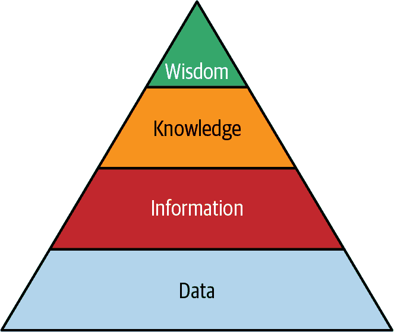

###### 图 3-1\. DIKW 金字塔

为了更好地理解 DIKW 金字塔，让我们分解每一层：

数据

缺乏上下文和含义的原始事实和数字。数据可以被视为信息的构建块。数据的例子：1989、教师、绿色。

信息

提供上下文并回答特定问题的数据的有序和结构化表示。信息的例子：

+   我的数学老师出生于 1989 年。

+   [Albany Ave 和 Avenue J 交汇处的交通灯](https://example.org/traffic_light)显示为绿色。

知识

当我们将信息与经验、专业知识和理解结合时，知识就产生了。它代表通过分析和解释信息获得的见解，使个人和组织能够做出明智的决策并采取适当的行动。知识的例子：

+   由于我的数学老师是 1989 年出生的，他已经成年了。

+   我正在驾驶的交通灯正在变绿。

智慧

超越知识的深度理解层次。智慧发生在个人和组织能够应用他们的知识并做出明智判断的时候，导致积极影响和转变性的见解。智慧的例子：

+   也许是时候让我的数学老师开始考虑退休储蓄计划了。

+   当交通灯变绿时，我可以前进了。

数据库在 DIKW 金字塔中发挥着至关重要的作用，作为存储、管理和组织数据的基础。这使得数据能够转化为有意义的见解，最终使企业获得必要的知识，以做出明智的决策。

## 数据库类型

数据库是现代数据管理系统的核心组成部分，提供了存储、组织和检索数据的结构化方法。为了更好地理解数据库如何实现这一点，让我们首先探讨数据库的两个主要类别：关系型和非关系型。通过理解这两种类型之间的特点和区别，您将更能够选择适合您特定数据需求的数据库解决方案。

图 3-2 显示了数据库的两个主要类别，在每个类别中映射了最常见的数据库类型。

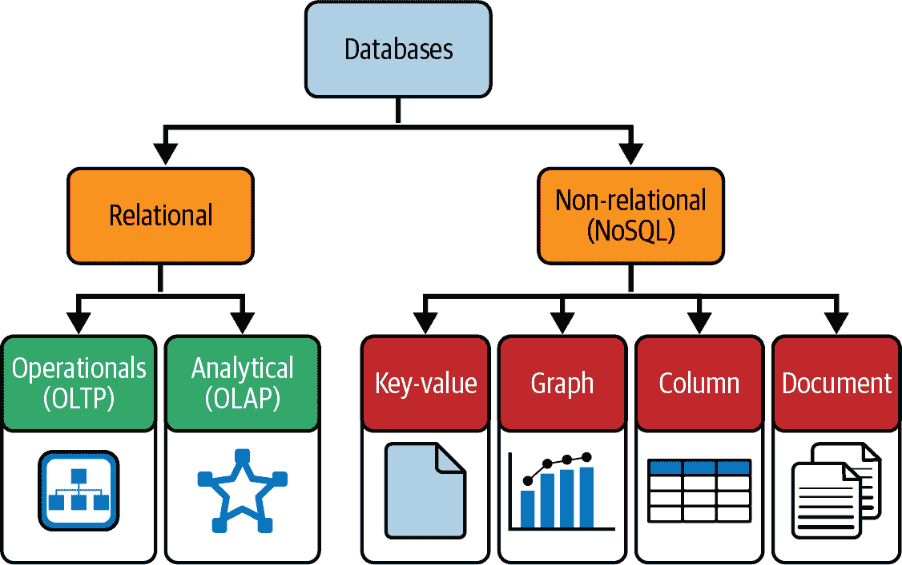

###### 图 3-2\. 数据库类别及其类型

关系型数据库

在这个最常见且广泛采用的数据库类别中，数据被组织成行和列的表格。键用于强制表之间的关系，SQL 用于查询和操作数据。关系型数据库提供强大的数据完整性、事务可靠性和支持 ACID 属性，确保数据库事务可靠、保持数据完整性，并能从故障中恢复。

非关系型数据库

也被称为*NoSQL*（不仅仅是 SQL）数据库，非关系型数据库作为管理大量非结构化和半结构化数据的替代方案而出现，具有可扩展性和灵活性。与关系型数据库相比，非关系型数据库不依赖于固定的模式。它们可以以各种格式存储数据，例如键-值对、文档、宽列存储或图形。非关系型数据库优先考虑高性能、水平扩展性和模式灵活性。它们非常适合于实时分析、处理非结构化数据的应用以及物联网数据等场景。

###### 注意

在接下来的几节中，我们将主要关注关系数据库，这是本章的整体目标的结果，即介绍 SQL 的基础知识。

我们可以把数据库想象成数据宇宙的一个子集 —— 它们被建立、设计和输入数据，这些数据具有特定于您的组织的特定目的。数据库是社会的重要组成部分。一些活动，例如列出的活动，广泛分布在整个社会中，并且一个数据库位于中心用于存储数据：

+   预订酒店

+   预订飞机票

+   在一个知名市场购买一部手机

+   输入您喜欢的社交网络

+   去看医生

但在实践中是什么样子呢？进入关系数据库，我们将数据组织成具有行和列的表。表代表我们宇宙中的一个实体，例如大学的学生或图书馆的书籍。列描述实体的属性。例如，学生有姓名或地址。一本书有标题或国际标准书号（ISBN）。最后，行是数据本身。学生的姓名可以是 Peter Sousa 或 Emma Rock。关于书名，一行可以是“使用 SQL 和 dbt 进行分析工程”。图 3-3 展示了一个带有其相应列和行的表的示例。

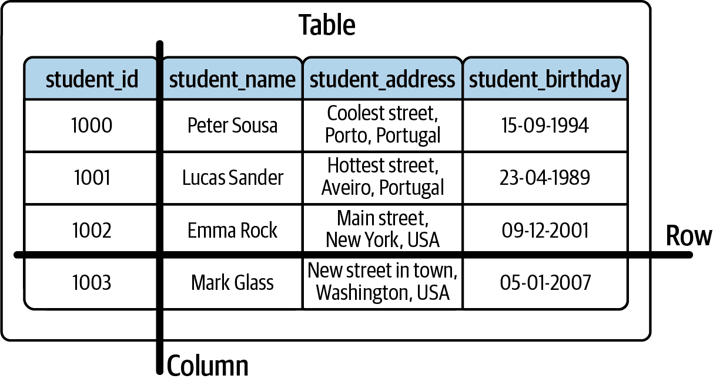

###### 图 3-3\. 表格及其行列示例

另一个需要考虑的主题是我们如何与数据建立关系并确保一致性。这是关系数据库中需要重点强调的一个重要因素，通过使用键可以在表之间强制建立连接。在关系数据库中执行这些关系和连接的操作涉及实施机制，以维护跨相关表的数据的完整性和一致性。这些机制维护表之间的关系，防止不一致或数据异常。

通过使用主键和外键来强制关系的一种方式。我们将介绍这一点，但现在，图 3-4 展示了表之间的相互关系。使用案例是一个大学，其中一个或多个学生可以注册一个或多个课程。

了解这些类型的数据库为我们的下一个主题铺平了道路：数据库管理系统（DBMS）。在下一节中，我们将更深入地探讨 DBMS 的功能和重要性，它们作为软件工具，能够在各种类型的数据库中实现高效的数据存储、检索和管理。

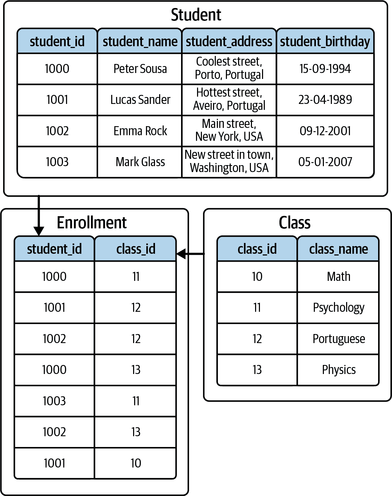

###### 图 3-4\. 表之间的相互关系

## 数据库管理系统

*DBMS* 是一个软件系统，它使数据库的创建、组织、管理和操作成为可能。它为用户和应用程序提供了一个接口和一组工具，用于与数据库交互，从而实现高效的数据存储、检索、修改和删除。

DBMS 充当用户或应用程序与底层数据库之间的中介。它抽象了与数据库交互的复杂性，提供了一种便捷和标准化的工作数据的方式。它作为软件层处理数据的存储、检索和管理，同时确保数据的完整性、安全性和并发控制。

DBMS 的主要功能包括以下几点：

数据定义

数据库管理系统 (DBMS) 允许用户通过创建和修改数据库模式来定义数据的结构和组织方式。它支持定义表、列、关系和约束，这些规定了数据库中存储的数据。

数据操作

用户可以通过查询语言（通常是 SQL）对存储在数据库中的数据执行操作。DBMS 提供了插入、检索、更新和删除数据的机制，允许高效和受控地操作数据库内容。

数据安全性和完整性

DBMS 提供机制来确保数据安全性，通过执行访问控制策略来实施。它支持定义用户角色和权限，限制对敏感数据的访问。此外，DBMS 通过实施约束和验证来保持数据的一致性和准确性。

数据并发性和事务管理

DBMS 处理多用户或应用程序对数据库的并发访问，确保数据保持一致性并受到保护，不会发生冲突。它提供事务管理功能，确保一组操作能够可靠和一致地执行，符合 ACID 特性。

数据恢复和备份

DBMS 包含功能以确保数据的持久性和可恢复性。它提供数据备份和恢复机制，允许在系统故障或灾难发生时进行数据恢复。

一些适用于关系型和非关系型数据库的常见 DBMS 可见于表 3-1。

表 3-1\. 常见的 DBMS

| 关系型数据库 | 非关系型数据库 |
| --- | --- |
| Microsoft Access | MongoDB |
| Microsoft SQL Server | Apache Cassandra |
| Postgres | Apache CouchDB |
| MySQL | Redis |
| SQLite | Elasticsearch |

## "与数据库交流"

从外部角度看，通过 DBMS 与数据库交互提供了四种类型的语言：

数据定义语言 (DDL)

处理模式，如表的创建

数据操作语言 (DML)

处理数据

数据控制语言 (DCL)

管理对数据库的权限

事务控制语言 (TCL)

处理发生在数据库中的事务

图 3-5 展示了与数据库交互时使用的主要语言及其主要命令。

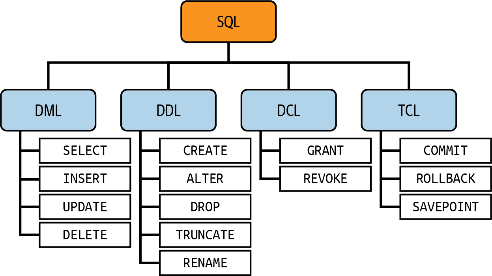

###### 图 3-5\. 主要 SQL 命令

对于本书，我们的主要重点将是通过学习如何查询、操作和定义数据库结构来提供 SQL 的坚实基础，因此我们将讨论 DDL 和 DML。不涉及像 DCL 和 TCL 这样的管理任务相关的活动。

# 使用 DDL 创建和管理数据结构

DDL 是 SQL 的子集，是一种标准化的语言，用于创建和修改数据库中对象的结构。它包括定义表、索引、序列、别名等的命令和语法。

最常见的 DDL 命令如下：

`CREATE`

创建新的数据库对象，如表、视图、索引或约束。它指定对象的名称及其结构，包括列、数据类型和任何附加属性。

`DROP`

删除或删除现有数据库对象。它永久删除指定的对象及其所有相关数据。

`ALTER`

修改现有数据库对象的结构。您可以使用它来添加、修改或删除表的列、约束或其他属性。它提供了适应不断变化的需求调整数据库架构的灵活性。

`RENAME`

重命名现有的数据库对象，如表或列。它提供了一种在不改变对象结构或数据的情况下更改对象名称的方式。

`TRUNCATE`

快速从表中删除所有数据，同时保留表结构。与使用`DELETE`命令逐行删除数据相比，它更快速，因为它会释放数据页而不记录单个行的删除操作。

`CONSTRAINT`

定义表列的约束，通过指定数据必须满足的规则或条件，确保数据的完整性和有效性。

`INDEX`

在表的一个或多个列上创建索引。通常，索引通过创建排序结构来提高数据检索操作的性能，从而实现更快的数据搜索和排序。

在进行实际应用之前，我们需要详细讨论一些主题和一个额外的主题引入。事实上，大多数 DDL 命令在某种意义上是不言自明的，只要稍后在代码中看到它们，它们将很容易理解。尽管如此，我们需要稍微详细地讨论`CONSTRAINT`命令，以介绍其特殊性。

正如前面提到的，约束是数据必须满足的规则或条件，以确保其完整性。通常，这些约束适用于列或表。最常见的约束如下：

主键

主键约束确保表中的列或列组合唯一标识每一行，防止重复和空值。它对数据完整性至关重要，并且通常用作相关表中外键约束的参考。

外键

外键约束指定两个表之间的关系。它确保一个表中列或列组合中的值与另一个表中主键值匹配，有助于维护引用完整性并强制执行跨相关表的数据一致性。

唯一

唯一约束确保列或列组合中的值是唯一的，并且不允许重复。与主键不同，唯一约束可以允许空值，但如果列有唯一约束，则只允许一个空值。

检查

检查约束对列中允许的值施加条件。通常用于强制执行业务规则、特定领域的要求或数据上的任何其他自定义条件。

非空

非空约束保证列不包含空值，因此具有此约束的特定列必须为每个插入或更新的行提供一个值。这有助于强制数据完整性并避免意外的空值。

最后，还有一个要讨论的点：用于分类可以存储在列或变量中的数据类型。这些字段在不同的数据库引擎中可能有所不同。在我们的情况下，我们将简单地使用 MySQL 数据类型作为参考：

整数

没有分数部分的整数。最常见的是`INT`、`SMALLINT`、`BIGINT`、`TINYINT`。可能的值示例：1、156、2012412、2。

十进制

带有小数部分的数字。一些最常见的是`DECIMAL`、`NUMERIC`、`FLOAT`、`DOUBLE`。可能的值示例：3.14、94.5482、5161.17620。

布尔

二进制值。传统上写作`BOOLEAN`、`BOOL`、`BIT`、`TINYINT`。用于存储真/假或 0/1 值。

日期

大多数是不言而喻的，但格式可能有所不同。声明为`DATE`，常用的标准格式是 2023-07-06。

时间

您也可以决定时间数据类型的格式。在数据库中写作`TIME`，一个常见的格式是 18:34:59。

时间戳

日期和时间结合在一起。通常我们使用`TIMESTAMP`或`DATETIME`。示例：2017-12-31 18:34:59。

文本

最通用的数据类型。但它只能是字母或字母、数字或任何其他字符的混合。通常声明为`CHAR`、`VARCHAR`、`NVARCHAR`、`TEXT`。请注意，选择正确的文本数据类型很重要，因为每种类型都有指定的最大长度。文本示例："hello world"、"porto1987"、"Hélder"、"13,487*5487+588"。

###### 注释

我们将使用 MySQL 因其广泛的采用率。您可以通过[MySQL 网站](https://oreil.ly/Mzrdt)下载 MySQL Workbench。

现在，您对 DDL 命令和最常见的数据库数据类型有了更好的理解，让我们为管理 O'Reilly 图书创建一个数据库。这与第二章中的示例相符，当时我们介绍了一个用于追踪图书的 O'Reilly 数据库，但现在让我们开始创建物理模型。

作为一种说明，对于数据工程师来说，精通所有类型的 SQL 命令至关重要，因为他们负责数据库设计（DDL）和数据操作（DML）。分析师主要专注于 DML SQL 命令，通常仅限于用于数据分析的 `SELECT` 查询。另一方面，分析工程师通常使用 DML 和一些 DDL SQL 命令的组合，尽管他们经常通过工具如 dbt 来抽象 DDL 操作。

首先，让我们创建数据库本身。在您的 MySQL 客户端中，执行 示例 3-1 中的命令。

##### 示例 3-1\. 创建数据库

```
-- Create the OReillyBooks database statement
CREATE DATABASE OReillyBooks;
```

现在，已经创建了数据库，执行 示例 3-2 中的代码。

##### 示例 3-2\. 创建数据库，第二部分

```
-- Use the database
USE OReillyBooks;

-- Create the tables

-- Table: Authors
CREATE TABLE authors (
  author_id INT PRIMARY KEY,
  author_name VARCHAR(100)
);

-- Table: Books
CREATE TABLE books (
  book_id INT PRIMARY KEY,
  book_title VARCHAR(100),
  author_id INT,
  rating DECIMAL(10,2),
  FOREIGN KEY (author_id) REFERENCES Authors(author_id)
);

-- Table: Category
CREATE TABLE category (
  category_id INT PRIMARY KEY,
  category_name VARCHAR(50)
);

-- Table: bookCategory
CREATE TABLE book_category (
  book_id INT,
  category_id INT,
  FOREIGN KEY (book_id) REFERENCES books(book_id),
  FOREIGN KEY (category_id) REFERENCES category(category_id)
);
```

总之，这两个示例创建了一个名为 `OReillyBooks` 的数据库，并定义了四个表：`authors`、`books`、`category` 和 `book_category`（表示书籍与类别之间的多对多关系）。每个表都有自己的列集和约束条件，例如主键和外键。

最后，为了测试其他 DDL 命令，假设现在有一个新的需求，我们还需要存储 `publication_year`，即特定书籍出版的年份。执行 示例 3-3 中显示的语法即可实现此目的。

##### 示例 3-3\. `ALTER TABLE` 语法

```
-- Add a new column
ALTER TABLE table_name
ADD column_name datatype [column_constraint];

-- Modify a datatype of an existing column
ALTER TABLE table_name
ALTER COLUMN column_name [new_datatype];

-- Rename a column
ALTER TABLE table_name
RENAME COLUMN old_column_name TO new_column_name;

-- Add a new constraint to a column
ALTER TABLE table_name
ADD CONSTRAINT constraint_name constraint_type (column_name);

-- Modify an existing constraint
ALTER TABLE table_name
ALTER CONSTRAINT constraint_name [new_constraint];

-- Remove an existing column
ALTER TABLE table_name
DROP COLUMN column_name;
```

根据 示例 3-3 中显示的语法，适合我们需求的修改是添加一个新列。现在通过执行 示例 3-4 中的代码片段来添加 `publication_year`。

##### 示例 3-4\. 添加出版年份

```
-- Add publication_year to the books table
ALTER TABLE books
ADD publication_year INT;
```

# 使用 DML 操作数据

DML 在数据库管理中是一个重要组成部分。该语言使得在数据库系统中进行数据选择、插入、删除和更新成为可能。其主要目的是检索和操作驻留在关系数据库中的数据，同时涵盖了几个关键命令。

## 使用 INSERT 插入数据

`INSERT` 命令便于向表中添加新数据。通过此命令，用户可以轻松地将一个或多个记录插入到数据库中的特定表中。利用 `INSERT`，可以通过包含额外条目来扩展表的内容。该命令在向最初为空的表中添加记录时非常有用，同时也允许不断扩展数据库中现有的数据。示例 3-5 展示了该命令的标准语法。

##### 示例 3-5\. `INSERT` 语句的语法

```
INSERT INTO table_name (column1, column2, ...)
VALUES (value1, value2, ...);
```

`INSERT INTO` 语句指定将插入数据的表，其中*`table_name`*代表表本身的名称。组件`(__column1__, __column2__, ...)`是可选的，允许指定要插入数据的列。如果省略列，则假定将为表中的所有列提供值。`VALUES`关键字表示要插入到指定列中的值列表的开始。在`VALUES`子句中，`(__value1__, __value2__, ...)`包含要插入到相应列中的实际值。确保提供的值数量与指定的列数相匹配至关重要，这是确保在插入过程中正确映射值到相应列的唯一方式。大多数数据库引擎如果不遵守此规则将引发错误。

现在让我们扩展我们的用例，我们从“使用 DML 操作数据”开始，并将数据插入到先前创建的表中。为此，请执行 示例 3-6 中的命令。

##### 示例 3-6\. 创建虚拟数据

```
-- Inserting data into the authors table
INSERT INTO authors (author_id, author_name) VALUES
(1, 'Stephanie Mitchell'),
(2, 'Paul Turner'),
(3, 'Julia Martinez'),
(4, 'Rui Machado'),
(5, 'Thomas Brown');

-- Inserting data into the books table
INSERT INTO books (book_id, book_title,
		author_id, publication_year,
		rating)
VALUES
(1, 'Python Crash Course', 1, 2012, 4.5),
(2, 'Learning React', 2, 2014, 3.7),
(3, 'Hands-On Machine Learning with Scikit-Learn, Keras, and TensorFlow',
  3, 2017, 4.9),
(4, 'JavaScript: The Good Parts', 4, 2015, 2.8),
(5, 'Data Science for Business', 5, 2019, 4.2);

-- Inserting data into the category table
INSERT INTO category (category_id, category_name) VALUES
(1, 'Programming'),
(2, 'Machine Learning'),
(3, 'Data Science'),
(4, 'Software Engineering'),
(5, 'Algorithms'),
(6, 'Computer Science');

-- Inserting data into the book_category table
INSERT INTO book_category (book_id, category_id) VALUES
(1, 1),
(2, 1),
(3, 2),
(4, 1),
(5, 3);
```

此代码创建了几个 `INSERT` 语句，每个都针对特定的表。我们首先向 `authors` 表插入数据。每一行代表一个作者，其中 `author_id` 和 `author_name` 列分别表示作者的唯一标识符和名称。

然后，我们向 `books` 表插入数据。每一行代表一本书，其中 `book_id`、`book_title` 和 `author_id` 列分别表示书籍的唯一标识符、标题和作者标识符。`author_id` 列与 `authors` 表中的 `author_id` 列关联，以建立书籍与作者之间的关系。请注意，由于引用完整性，我们无法插入引用不存在作者的书籍。

我们还创建了一个 `category` 表，根据其内容类型正确对书籍进行分类。每一行代表一个类别，其中 `category_id` 和 `category_name` 列分别表示类别的唯一标识符和名称。

最后，我们的中间表 `book_category` 存储了书籍和它们对应类别之间的关系。每一行表示此关系的一个发生，其中 `book_id` 和 `category_id` 列分别表示书籍和类别的标识符。这些列建立了书籍和类别之间的多对多关系。

让我们查看我们插入的数据。逐行执行 示例 3-7 中的代码。我们将在下一节详细介绍 `SELECT` 语句，但目前仅检查每个表中的数据就足够了。

##### 示例 3-7\. 使用 `SELECT` 语句查询 `authors`、`book_category`、`books` 和 `category` 表

```
select * from authors;
select * from book_category;
select * from books;
select * from category;
```

## 用 SELECT 选择数据

`SELECT`是 SQL 中最基本的 DML 命令之一。此命令允许您从数据库中提取特定的数据。执行此语句时，它检索所需的信息并将其组织成结构化的结果表，通常称为*结果集*。这个结果集包含满足指定条件的数据，使用户能够轻松访问和分析所选信息。在示例 3-8 中，我们可以分析此命令的（最简单的）语法。

###### 注意

如果您已经熟练掌握 SQL 和`SELECT`命令，并希望了解更高级的 SQL 语句，请参考“窗口函数”。如果您已经想要进入 dbt 世界，您可以在第四章找到相关内容。

##### 示例 3-8\. `SELECT`语句的语法

```
SELECT column1, column2, ...
FROM table_name;
```

此结构的`SELECT`部分指示从表中检索的具体列或表达式。`FROM`部分指定从中检索数据的表。我们还有更多内容可以详细说明这个命令，从数据过滤和相应的运算符到数据分组或连接。在接下来的部分，我们将讨论每个属性。

### 使用`WHERE`过滤数据

可选的`WHERE`子句允许用户定义检索数据必须满足的条件，有效地根据指定的条件过滤行。这是 SQL 查询的基本部分，允许您根据指定的条件过滤和检索表中的特定数据子集。示例 3-9 展示了`WHERE`语句的语法。

##### 示例 3-9\. 带有`WHERE`子句的`SELECT`语句语法

```
SELECT column1, column2, ...
FROM table_name
WHERE condition ;
```

要正确理解如何在 SQL 中编写*条件*并充分过滤数据，我们必须首先熟悉 SQL 运算符，这些运算符支持单个或多个条件。

#### SQL 运算符

SQL 运算符经常在`WHERE`子句中使用，用于建立过滤数据的条件。这些运算符允许您在 SQL 中比较符合定义条件的值和表达式。表 3-2 总结了最常见的运算符。

表 3-2\. SQL 运算符

| 运算符 | 运算符类型 | 意义 |
| --- | --- | --- |
| `=` | 比较 | 等于 |
| `<>` 或 `!=` | 比较 | 不等于 |
| `<` | 比较 | 小于 |
| `>` | 比较 | 大于 |
| `<=` | 比较 | 小于或等于 |
| `>=` | 比较 | 大于或等于 |
| `LIKE '%expression%'` | 比较 | 包含`"expression"` |
| `IN ("exp1", "exp2")` | 比较 | 包含任何一个`"exp1"`或`"exp2"` |
| `BETWEEN` | 逻辑 | 选择在给定范围内的值 |
| `AND` | 逻辑 | 将两个或多个条件组合在一起，只有当所有条件都为真时才返回`true` |
| `OR` | 逻辑 | 将两个或多个条件组合在一起，如果至少一个条件为真，则返回`true` |
| `NOT` | 逻辑 | 对条件进行否定，如果条件为假则返回`true`，反之亦然 |
| `UNION` | 集合 | 将两个 `SELECT` 语句的结果合并，去除重复的行。 |
| `UNION ALL` | 集合 | 将两个 `SELECT` 语句的所有记录合并，但使用 `UNION ALL` 时，重复的行不会被消除。 |

为了更好地理解它们的应用，让我们探讨比较运算符和逻辑运算符的示例。为了简化事情，由于我们没有深入研究 SQL 的其他元素，比如连接，让我们使用 `books` 表作为我们用例的数据源。

作为条件和逻辑运算符的初始示例，让我们尝试找到早于 2015 年出版的书籍。然后，让我们仅找到 2017 年出版的书籍，最后是标题中包含“Python”的书籍。示例 3-10 包含了三个代码片段，帮助你解决这个挑战。

##### 例 3-10\. 使用条件运算符选择数据

```
-- Books published earlier than 2015
SELECT
  book_title,
  publication_year
FROM books
WHERE publication_year < 2015;

-- Books published in 2017
SELECT
  book_title,
  publication_year
FROM books
WHERE publication_year = 2017;

-- Books with "Python" in the title
SELECT
  book_title,
  publication_year
FROM books
WHERE book_title LIKE '%Python%';
```

示例 3-10 展示了使用条件运算符处理的三个示例。随意尝试代码并测试之前介绍的其他内容。

最后，为了熟悉逻辑运算符，让我们搜索 2012 年或之后出版的书籍。示例 3-11 将帮助你完成这个任务。

##### 例 3-11\. 使用逻辑运算符选择数据

```
-- Books published in 2012 or after 2015
SELECT
  book_title,
  publication_year
FROM books
WHERE publication_year = 2012 OR publication_year > 2015;
```

还需注意这些运算符并不仅限于 `WHERE` 子句。它们也可以与其他过滤技术一起使用，例如我们将在下一节介绍的 `HAVING` 子句。

### 使用 `GROUP BY` 聚合数据

`GROUP BY` 子句是 SQL 中的一个可选特性，用于将结果集按一个或多个列分组。通常与聚合函数一起使用，`GROUP BY` 计算具有相同值的指定列或列的子集的行集合。换句话说，使用 `GROUP BY` 子句时，结果集被分成组，每个组代表给定聚合列或列的唯一组合的值。正如所述，`GROUP BY` 通常与聚合函数一起用于这些组，为数据提供有价值的见解。一些最常见的聚合函数显示在 表 3-3 中。

表 3-3\. 聚合函数

| 聚合函数 | 意义 |
| --- | --- |
| `COUNT()` | 计算列中行数或非空值的数量。  |
| `SUM()` | 计算列中数值的总和。  |
| `AVG()` | 计算列的平均值。  |
| `MAX()` | 从列中检索最大值。  |
| `MIN()` | 从列中检索最小值。  |
| `DISTINCT` | 虽然严格意义上不是聚合函数，`DISTINCT` 关键字通常与聚合函数一起在 `SELECT` 语句中使用，用于计算唯一的值。 |

`GROUP BY`通常用于趋势分析和汇总报告，如月销售报告和季度用户访问报告等。`GROUP BY`子句的通用语法在示例 3-12 中呈现。

##### 示例 3-12\. 带有`GROUP BY`子句的`SELECT`语句的语法。

```
SELECT column1, column2, ...
FROM table_name
GROUP BY column1, column2, ...
```

现在让我们在一个简单的用例中应用这些函数。使用表`book_category`，让我们分析每个类别平均书籍数量。为了帮助你解决这个问题，让我们看一下示例 3-13。

##### 示例 3-13\. 选择并聚合数据。

```
SELECT
  category_id,
  COUNT(book_id) AS book_count
FROM bookCategory
GROUP BY category_id;
```

我们正在使用`COUNT()`聚合函数，但也可以根据所需的用例使用其他函数。最后，这是一个简单的示例，因为我们只看到`category_id`，但如果我们有类别名称会更好；然而，这个字段仅在`category`表中可见。要包含它，我们需要知道如何使用连接。我们将在“使用 INNER、LEFT、RIGHT、FULL 和 CROSS JOIN 连接数据”中进一步讨论这个问题。

最后，我们来看看`HAVING`过滤器。作为与`GROUP BY`紧密相关的可选子句，`HAVING`过滤器应用于分组数据。与`WHERE`子句相比，`HAVING`在聚合之后过滤行，而`WHERE`在分组操作之前过滤行。然而，相同的运算符，如“等于”和“大于”，等等，与`WHERE`语句中的应用相同。

`HAVING`过滤器的 SQL 语法显示在示例 3-14 中。

##### 示例 3-14\. 带有`GROUP BY`子句和`HAVING`过滤器的`SELECT`语句的语法。

```
SELECT column1, column2, ...
FROM table_name
GROUP BY column1, column2, ...
HAVING condition
```

现在让我们看看`HAVING`过滤器的实际应用。参考示例 3-13，我们现在只想要至少出版两本书的类别。示例 3-15 将帮助你完成这一点。

##### 示例 3-15\. 选择并聚合数据，应用`HAVING`过滤器。

```
SELECT
  category_id,
  COUNT(book_id) AS book_count
FROM bookCategory
GROUP BY category_id
HAVING COUNT(book_id) >= 2;
```

通过利用`GROUP BY`子句和`HAVING`过滤器，您可以有效地组织和总结数据，对聚合数据集进行计算，从而发现数据中的模式、趋势和关系；促进数据分析；支持决策过程。

### 使用`ORDER BY`排序数据

`ORDER BY`子句是 SQL 中的排序语句，通常用于按特定顺序组织查询结果，使数据分析和解释更简单。它根据一个或多个列对查询结果集进行排序，允许您为每列指定排序顺序，即按升序（默认）和降序排列。

`ORDER BY`子句的基本语法显示在示例 3-16 中。

##### 示例 3-16\. 带有`ORDER BY`子句的`SELECT`语句的语法。

```
SELECT column1, column2, ...
FROM table_name
ORDER BY column1 [ASC|DESC], column2 [ASC|DESC], ...
```

在之前的用例中，一个显著的例子是按年度出版的书籍。查看表后，很难确定哪些是最新的和最旧的书籍。`ORDER BY`子句大大简化了这种分析。为了测试这个子句，请执行示例 3-17 中的代码片段，并检查有无`ORDER BY`的结果。需要注意的是，如果未明确声明`ASC/DESC`顺序，SQL 将默认使用`ASC`。

##### 示例 3-17\. 带有`ORDER BY`子句的`SELECT`语句

```
SELECT
  book_title,
  publication_year
FROM books
ORDER BY publication_year DESC;
```

总之，`ORDER BY`子句允许您根据最适合数据探索和分析的顺序排列结果集，简化获取有意义数据的过程。

### 使用 INNER、LEFT、RIGHT、FULL 和 CROSS JOIN 连接数据

*连接*是 SQL 中将多个表的数据合并的机制。理解和使用连接可以极大地提高您从复杂数据集中提取有价值见解并做出更加明智决策的能力。本节将指导您了解 SQL 中可用的连接类型、它们的语法和用法。

SQL 有几种连接类型。每种类型允许您基于指定的条件从多个表中合并数据。在看到连接实际操作之前，让我们通过增加一个新的作者来增强我们的数据集。这位作者没有任何书籍。要执行此操作，请执行示例 3-18 中的语句。

##### 示例 3-18\. 插入一个没有书籍的作者

```
INSERT INTO authors (author_id, author_name) VALUES
(6, 'John Doe')
```

我们创建没有任何书籍的作者的原因是为了探索我们将介绍的几种连接。以下是 SQL 连接中最常见的几种类型。

#### 内连接

`INNER JOIN`根据指定的连接条件仅返回两个表中匹配的行。如果我们想象一个 Venn 图，其中圆 A 和圆 B 分别代表每个数据集，在`INNER JOIN`中，我们只会看到包含两个表的匹配值的重叠区域。让我们查看图 3-6 以更好地可视化这个 Venn 图。

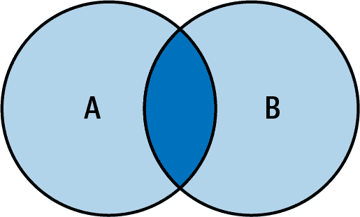

###### 图 3-6\. 展示`INNER JOIN`的 Venn 图

`INNER JOIN`的代码语法显示在示例 3-19 中。

##### 示例 3-19\. `INNER JOIN`的语法

```
SELECT
  columns
FROM Table_A
INNER JOIN Table_B ON join_condition;
```

要查看`INNER JOIN`的实际操作，让我们仅获取有书籍的作者。示例 3-20 展示了所需的代码。

##### 示例 3-20\. 仅获取有书籍的作者

```
SELECT
  authors.author_id,
  authors.author_name,
  books.book_title
FROM authors
INNER JOIN books ON Authors.author_id = Books.author_id
```

图 3-7 展示了查询结果。

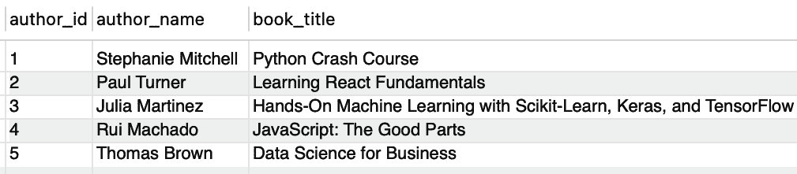

###### 图 3-7\. 展示仅包含有书籍的作者的`INNER JOIN`查询结果

通过分析结果，我们可以快速识别缺失的作者 John Doe。正如您可能记得的那样，我们创建了他但没有任何书籍，因此在使用`INNER JOIN`时，预期他会被排除。

#### LEFT JOIN（或 LEFT OUTER JOIN）

返回左表的所有行和右表的匹配行。如果没有匹配，则包括来自右表的列的空值。与前一个练习类似，圆圈 A 表示左表，圆圈 B 表示右表的 Venn 图。在 `LEFT JOIN` 中，左圆圈包含左表的所有行，重叠区域表示基于连接条件的匹配行。右圆圈包含来自右表的非匹配行，结果集中用空值表示。查看 图 3-8 更好地可视化 Venn 图。

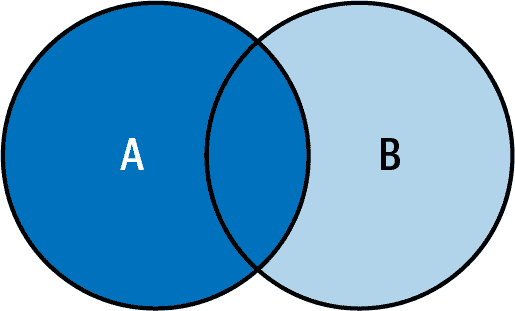

###### 图 3-8\. 展示了 `LEFT JOIN` 的维恩图。

`LEFT JOIN` 的代码语法在 示例 3-21 中。

##### 示例 3-21\. `LEFT JOIN` 的语法。

```
SELECT
  columns
FROM Table_A
LEFT JOIN Table_B ON join_condition;
```

为了测试 `LEFT JOIN`，我们保持与之前相同的用例，将作者与其书籍关联，但现在我们要列出所有作者及其各自的书籍，并且必须包括没有书籍的作者。在 示例 3-22 中执行代码片段。

##### 示例 3-22\. 收集作者及其书籍。

```
SELECT
  authors.author_id,
  authors.author_name,
  books.book_title
FROM authors
LEFT JOIN books ON authors.author_id = books.author_id
```

查询结果显示在 图 3-9 中。

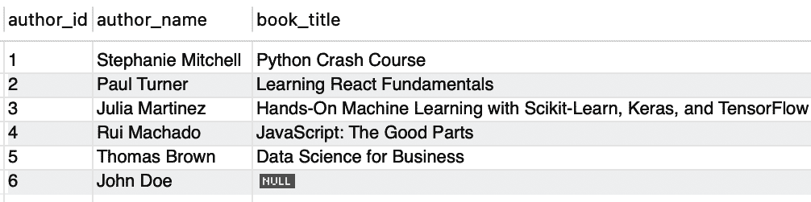

###### 图 3-9\. 展示了 `LEFT JOIN` 查询的作者及其相应书籍的输出。

与 `INNER JOIN` 相比，`LEFT JOIN` 允许我们看到作者 John Doe。这是因为在 `LEFT JOIN` 中，左表 `authors` 被完全显示，而右表 `books` 仅显示与 `authors` 交集的结果。

#### RIGHT JOIN（或 RIGHT OUTER JOIN）

右连接返回右表的所有行和左表的匹配行。如果没有匹配，则包括来自左表的列的空值。继续考虑每个数据集用圆圈 A（左）和圆圈 B（右）表示的 Venn 图。在 `RIGHT JOIN` 中，右圆圈包含右表的所有行，重叠区域表示基于连接条件的匹配行。左圆圈包含来自左表的非匹配行，结果集中用空值表示。最后，查看 图 3-10 更好地可视化 Venn 图。

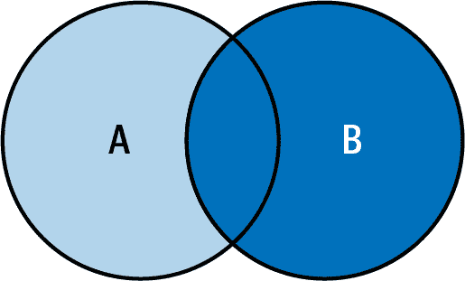

###### 图 3-10\. 展示了 `RIGHT JOIN` 的维恩图。

`RIGHT JOIN` 的代码语法如 示例 3-23 所示。

##### 示例 3-23\. `RIGHT JOIN` 的语法。

```
SELECT
  columns
FROM Table_A
RIGHT JOIN Table_B ON join_condition;
```

让我们首先将我们的训练情境化，看看 `RIGHT JOIN` 的实际应用。在这种情况下，我们希望看到所有书籍及其作者，因此在 示例 3-24 中执行代码。

##### 示例 3-24\. 收集书籍及其作者。

```
SELECT
  authors.author_id,
  authors.author_name,
  books.book_title
FROM authors
RIGHT JOIN books ON authors.author_id = books.author_id
```

查询结果显示在 图 3-11 中。

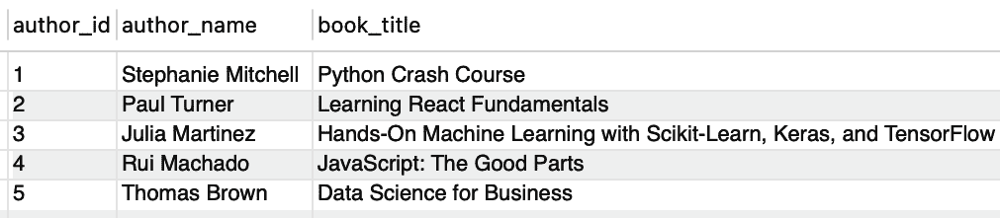

###### 图 3-11\. `RIGHT JOIN` 查询输出，显示了书籍及其对应作者

通过分析查询输出，我们可以看到所有书籍及其相应的作者。由于没有任何没有作者的书籍，我们无法看到`books`和`authors`之间的任何交集，即存在书籍但没有作者的情况。

#### `FULL JOIN`（或`FULL OUTER JOIN`）

在此连接中，从两个表中返回所有行。它结合了`LEFT JOIN`和`RIGHT JOIN`的结果。如果没有匹配项，将包括非匹配表中列的空值。在一个维恩图中，圆圈 A（左）和圆圈 B（右）分别表示每个数据集，`FULL JOIN`的图表将显示重叠区域，表示基于连接条件的匹配行，而每个圆圈的非重叠部分包括各自表中的非匹配行。最终生成的结果集包括来自两个表的所有行，对于非匹配行，将包括空值。让我们查看图 3-12 以更好地可视化。

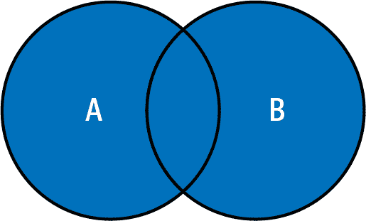

###### 图 3-12\. 用于说明`FULL JOIN`的维恩图

`FULL JOIN`的代码语法见示例 3-25。

##### 示例 3-25\. `FULL JOIN`的语法

```
SELECT
  columns
FROM Table_A
FULL JOIN Table_B ON join_condition;
```

###### 注意

MySQL 不原生支持`FULL JOIN`。我们必须在`LEFT JOIN`和`RIGHT JOIN`语句之间执行`UNION`来实现它。这有效地结合了两个方向的数据，复制了`FULL JOIN`的行为。

#### `CROSS JOIN`

`CROSS JOIN`（或笛卡尔积连接）返回两个表的笛卡尔积，即将第一个表的每一行与第二个表的每一行组合。它不需要连接条件。在`CROSS JOIN`的维恩图中，我们没有重叠的圆圈，因为它组合了圆圈 A（左）和圆圈 B（右）的每一行。结果集包括来自两个表的所有可能的行组合，如图 3-13 所示。

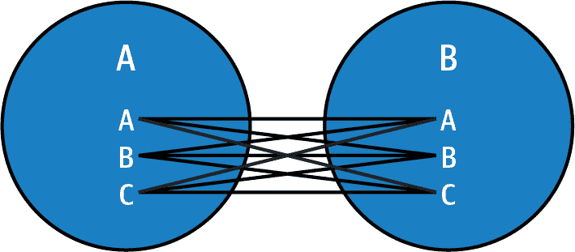

###### 图 3-13\. 用于说明`CROSS JOIN`的维恩图

`CROSS JOIN`的代码语法见示例 3-26。

##### 示例 3-26\. `CROSS JOIN`的语法

```
SELECT
  columns
FROM Table_A
CROSS JOIN Table_B;
```

展示了`authors`表和`books`表的`CROSS JOIN`，详见示例 3-27。

##### 示例 3-27\. `authors`表和`books`表的`CROSS JOIN`

```
SELECT
*
FROM authors
CROSS JOIN books;
```

总结一下，SQL 连接提供了根据条件从多个表中组合数据的灵活性。了解它们的用法和语法允许您提取所需的信息，并为跨表相关数据建立关系。通过维恩图可视化连接有助于解释表数据如何基于连接条件重叠和组合，突出显示结果集中匹配和不匹配的行，并清晰地展示连接操作期间表之间关系的表示。

## 使用 UPDATE 更新数据

`UPDATE` 命令允许我们在数据库中现有的表内修改记录。通过执行此命令，用户可以有效地更新和修改特定记录中存储的数据。`UPDATE` 允许对表内的一个或多个记录进行更改，确保数据准确反映最新信息。通过利用此命令，用户可以无缝地修改表的内容，以便根据需要进行数据的细化、更正或更新。示例 3-28 展示了该命令的语法。

##### 示例 3-28\. `UPDATE` 语句的语法

```
UPDATE table_name
SET column1 = value1, column2 = value2, ...
WHERE condition;
```

使用 `UPDATE` 关键字指定将被更新的表，*`table_name`* 表示将被修改的表的名称。`SET` 关键字指示将更新列并为它们分配新值。在 `SET` 子句内，*`column1`* = *`value1`*，*`column2`* = *`value2`*…​ 指定将要更新的列及其对应的新值。最后，可选的 `WHERE` 子句允许指定行必须满足的条件以便更新。它根据指定条件过滤行。

要在实际中测试 `UPDATE` 语句，假设书名中有个拼写错误：`Learning React` 应该是 “Learning React Fundamentals”。查看 `books` 表，可以看到 `Learning React` 的 `book_id = 2`。你可以参考 示例 3-29 中的代码，了解如何进行此更新。

##### 示例 3-29\. 更新 `books` 表

```
UPDATE books
SET book_title = 'Learning React Fundamentals'
WHERE book_id = 2;
```

就是这样。如果你再次查看 `books` 表的数据，你会看到新的名称（图 3-14）。

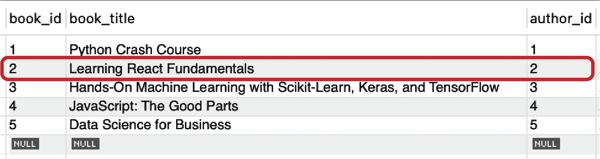

###### 图 3-14\. 更新 `books` 表

## 使用 DELETE 删除数据

`DELETE` 命令提供了根据指定条件选择性删除某些记录或删除表内所有记录的能力。`DELETE` 在数据维护中发挥着重要作用，允许用户通过删除不必要或过时的记录有效地管理和清理表的内容。此命令确保数据完整性，并通过消除冗余或无关信息来优化数据库。示例 3-30 展示了该命令的语法。

##### 示例 3-30\. `DELETE` 语句的语法

```
DELETE FROM table_name
WHERE condition;
```

`DELETE FROM` 部分指示了将要删除数据的具体表，而 *`table_name`* 则表示表的名称。可选的 `WHERE` 子句通过允许用户定义必须满足的行删除条件，发挥着重要作用。利用此子句，可以根据特定条件筛选行。如果不使用 `WHERE` 子句，则将删除表内的所有行。最后，*`condition`* 指的是行必须满足的具体条件，才能符合删除的资格。

为了实际地应用此命令，我们假设不会从计算机科学类别中发布任何书籍。通过查看`category_id`，我们可以看到它是 number 6. 让我们现在执行 示例 3-31 并查看发生了什么。

##### 示例 3-31\. 从`category`表中删除类别

```
DELETE FROM Category
WHERE category_id = 6
```

如果一切顺利，您应该能够选择`category`表，并看到我们不再拥有计算机科学类别，如 图 3-15 所示。

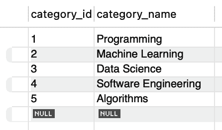

###### 图 3-15\. 从`category`表中删除的类别

最后，您还可以使用另一种数据管理技术，称为*软删除*，来“删除”数据。这种技术不会永久擦除记录，而是在数据库中设置一个标志或属性来指示应该视为已删除的记录。这样可以保留历史数据，在需要时确保轻松恢复，并通过保持变更审计跟踪来支持合规性。

# 将查询存储为视图

*view* is a virtual table in a database defined by a query. It is similar to a regular table, consisting of named columns and rows of data. However, unlike a table, a view does not physically store data values in the database. Instead, it retrieves data dynamically from the tables referenced in its query when the view is accessed.

在 示例 3-32 中，我们看到了创建视图的通用语法。

##### 示例 3-32\. `VIEW` 语法

```
CREATE VIEW view_name AS
SELECT column1, column2, ...
FROM table_name
WHERE condition;
```

使用我们的 `OReillyBooks` 数据库，示例 3-33 创建了一个视图，用于分析每位作者创建的书籍数量。

##### 示例 3-33\. 用于`books`数据库的视图

```
CREATE VIEW author_book_count AS
SELECT authors.author_id,
       authors.author_name,
       COUNT(books.book_id) AS book_count
FROM authors
LEFT JOIN books ON authors.author_id = books.author_id
GROUP BY authors.author_id, authors.author_name;
```

然后，我们可以查询 `author_book_count` 视图来分析每位作者创建的书籍数量; 参见 示例 3-34。

##### 示例 3-34\. 查询`books`数据库中的视图

```
SELECT * FROM author_book_count;
```

视图的主要目的之一是作为底层表的过滤器。定义视图的查询可以涉及同一数据库或不同数据库中的一个或多个表或其他视图。事实上，可以创建视图来 cons 折各式数据，允许您综合组织中的不同服务器存储在数据 for specific region.

视图通常用于简化和定制每个用户对数据库的感知。通过定义视图，您可以向不同的用户呈现数据的专注和定制视图，隐藏不必要的细节，并提供更直观的界面。此外，视图还可以作为安全机制，允许用户通过视图访问数据，而无需直接访问底层基表。这提供了额外的控制层，并确保用户只看到他们被授权查看的数据。

在 示例 3-35 中，我们基于 `books` 表创建了 `renamed_books` 视图。我们在 `SELECT` 语句中使用列别名将列重命名为某个特定用户更熟悉的名称，而不改变表结构。甚至可以在相同数据上创建不同的视图，使用不同的命名约定，以适应不同的用户群体。

##### 示例 3-35\. 重命名列的视图

```
CREATE VIEW renamed_books AS
SELECT
    id AS BookID,
    title AS BookTitle,
    rating AS BookRating
FROM books;
```

此外，当表的架构发生变化时，视图对于帮助很大。您可以创建一个视图来模拟旧的表结构，而不是修改现有的查询和应用程序，为访问数据提供向后兼容的接口。通过这种方式，您可以在改变底层数据模型的同时保持兼容性。

虽然视图提供了许多优点，但它们也有一些限制和潜在危险。一个限制是依赖于底层表结构，这是我们之前强调的好处；然而，它也是一个诅咒。如果基础表结构发生变化，视图定义必须相应更新，这可能会增加维护的工作量。此外，视图可能会影响查询性能，特别是对于涉及多个表或复杂计算的复杂视图。

为了避免不必要的开销，持续优化视图查询并学会有效使用执行计划以消除低效率至关重要。另一个危险是可能创建过于复杂或低效的视图，导致性能下降，并且难以随时间进行维护或修改。此外，视图可以通过限制对特定列或行的访问来提供数据安全的错觉。然而，它们并不能提供完全安全性，未经授权的用户如果能够访问视图，仍然可以访问底层数据。为了确保数据保护，我们必须实施适当的数据库级安全措施。最后，如果不正确地维护视图，它们可能会导致潜在的数据完整性问题，因为它们可能不会像物理表那样强制执行约束或引用完整性。总体而言，虽然视图提供了有价值的功能，但我们应了解并尽量减少它们的限制和潜在风险，以确保它们的有效和安全使用。

在 示例 3-36 中，我们演示了由于连接数量繁多并且包含来自不同表的各种列，视图的复杂性增加，使得一目了然地阅读和理解变得具有挑战性。解决这个问题的一个有趣方法是通过使用公共表达式（CTE），我们将在下一节中详细描述。

##### 示例 3-36\. 复杂视图

```
CREATE VIEW complex_books_view AS
SELECT
     b.book_id,
     b.book_title,
     b.author_id,
     b.rating,
     b.publication_year,
     a.author_id,
     a.author_name,
     c.category_id,
     c.category_name
FROM books b
INNER JOIN authors a ON a.author_id = b.author_id
LEFT JOIN bookCategory bc ON bc.book_id = b.book_id
LEFT JOIN category c ON c.category_id = bc.category_id;
```

# 公共表达式

许多数据分析师和开发人员面临理解复杂 SQL 查询的挑战。当处理复杂的业务逻辑和多个上游依赖时，特别是对特定查询组件的目的和依赖性不清楚时，很容易遇到困难。再加上意外的查询结果可能会让分析师不确定哪个查询部分导致了差异，这样的情况并不少见。公共表达式（CTEs）在这种情况下提供了宝贵的解决方案。

CTE 为简化复杂查询和提高查询可维护性提供了强大的工具。作为临时结果集，CTE 通过将复杂查询分解为可管理的块来增强 SQL 代码的可读性。

示例 3-37 展示了在 SQL 中创建 CTE 的通用语法。尽管看起来复杂，但它遵循简单的模式。

##### 示例 3-37\. CTE 语法

```
WITH cte_name (column1, column2, ..., columnN) AS ( 
    -- Query definition goes here 
)
SELECT column1, column2, ..., columnN               
FROM cte_name                                       
-- Additional query operations go here 
```


使用`WITH`关键字声明公共表达式（CTE），并为表达式命名。如果需要，也可以指定列，或使用*字符。


在`AS`关键字之后定义 CTE 查询，编写定义 CTE 的查询。该查询可以是简单或复杂的，包括过滤、连接、聚合或任何其他 SQL 操作。


在后续查询中使用 CTE，通过其名称引用 CTE，就像引用实际表一样。您可以从 CTE 选择列，或对 CTE 的数据执行其他操作。


在查询中添加更多的操作步骤——将 CTE 与您的查询管道化。这一步骤是可选的。我们可以包括额外的查询操作，如过滤、排序、分组或连接，以进一步操作从 CTE 检索的数据。

示例 3-38 使用`books`表作为参考创建了一个 CTE。

##### 示例 3-38\. 一个简单的 CTE

```
WITH popular_books AS (
    SELECT title,
           author,
           rating
    FROM books
    WHERE rating >= 4.5
)
SELECT title,
       author
FROM popular_books
ORDER BY rating DESC;
```

类似于派生表和数据库视图，CTE 提供了几个优点，使查询编写和维护更加容易。通过将复杂查询分解为较小的可重用块，CTE 增强了代码的可读性，并简化了整体查询结构。让我们来比较使用 CTE 和仅使用子查询的差异。在这个练习中，我们使用了一个虚构的`sales`表，展示了所有书籍销售情况，如示例 3-39 所示。该表通过`book_id`主键与`books`表连接。

##### 示例 3-39\. 没有 CTE 的查询

```
SELECT pb.book_id,
       pb.title,
       pb.author,
       s.total_sales
FROM (
    SELECT book_id,
           title,
           author
    FROM books
    WHERE rating >= 4.6
) AS pb
JOIN sales s ON pb.book_id = s.book_id
WHERE s.year = 2022
ORDER BY s.total_sales DESC
LIMIT 5;
```

这段代码使用子查询而不是 CTE 来获取 2022 年销量前五的畅销书。现在，让我们使用 CTE 来看看在示例 3-40 中如何提高可读性。

##### 示例 3-40\. 带有 CTE 的查询

```
WITH popular_books AS (
    SELECT book_id,
           title,
           author
    FROM books
    WHERE rating >= 4.6
),
best_sellers AS (
    SELECT pb.book_id,
           pb.title,
           pb.author,
           s.total_sales
    FROM popular_books pb
    JOIN sales s ON pb.book_id = s.book_id
    WHERE s.year = 2022
    ORDER BY s.total_sales DESC
    LIMIT 5
)
SELECT *
FROM best_sellers;
```

我们创建了两个公用表达式（CTE）。`popular_books` 是第一个 CTE，它从 `books` 表中选择 `book_id`、`title` 和 `author` 列，并筛选评分高于 4.6 的图书。需要注意的是，该 CTE 专注于一个明确的责任：仅获取评分最高的图书。

然后是`best_sellers`，第二个建立在第一个 CTE 基础上的 CTE。它从`popular_books`选择`book_id`、`title`、`author`和`total_sales`列，并根据`book_id`列与`sales`表进行连接。此外，它筛选了 2022 年发生的销售，并按总销售额降序排列结果，并将输出限制为前五名畅销书。同样，该 CTE 专注于另一个明确的责任：基于销售获取评分为 4.6 的前五名畅销书。

最后，主查询从`best_sellers`中选择所有列，并检索合并的结果。我们可以在主查询上应用额外的聚合或过滤器，但将代码保持简单并仅专注于选择最终分析所需的属性是一种最佳实践。

CTE 的一个常见用例是在单个查询中多次引用派生表。CTE 通过允许一次定义派生表并多次引用来消除冗余代码的需求。这提高了查询的清晰度，并减少了由于代码重复而导致错误的机会。为了看到其效果，让我们看一下示例 3-41，在这里我们将继续使用我们虚构的`sales`表。

##### 示例 3-41\. 使用 CTE，派生表查询

```
WITH high_ratings AS (
    SELECT book_id,
           title,
           rating
    FROM books
    WHERE rating >= 4.5
),
high_sales AS (
    SELECT book_id,
           count(book_id) AS nbr_sales
    FROM sales
    GROUP BY book_id
)
SELECT hr.title,
       hr.rating,
       hs.sales
FROM high_ratings hr
JOIN high_sales hs ON hr.book_id = hs.book_id;
```

正如我们所看到的，通过在这种场景中使用 CTE，我们通过一次定义派生表（`high_ratings` 和 `high_sales`）来消除冗余代码的需要。通过这种策略，我们可以在主查询或任何后续 CTE 中多次引用这些表。

另一个 CTE 发光的场景是作为创建永久数据库视图的替代方案。有时创建视图可能并非必要或可行。在这种情况下，CTE 可以作为临时和动态的替代品，提供灵活性和简单性，允许您在单个查询的范围内定义和引用结果集。我们可以在示例 3-42 中看到，在这种情况下通过使用 CTE，我们避免了创建永久数据库视图的需求。

##### 示例 3-42\. 使用 CTE 来避免永久创建视图

```
WITH filtered_books AS (
    SELECT title,
           author
    FROM books
    WHERE rating > 4.0
)
SELECT *
FROM filtered_books;
```

当需要在查询组件中执行相同的计算时，CTE 也非常有帮助。与在多个地方复制计算不同，CTE 允许计算只定义一次并根据需要重用。这促进了代码的可重用性，减少了维护工作，并增强了查询性能。让我们从示例 3-43 开始。

##### 示例 3-43\. 使用 CTE 促进代码的可重用性

```
WITH total_sales AS (
    SELECT customer_id,
           SUM(sales_amount) AS total_amount
    FROM sales
    GROUP BY customer_id
)
SELECT ts.customer_id,
       ts.total_amount,
       avg(total_amount) AS avg_amount
FROM total_sales ts;
```

我们可以看到，通过使用`total_sales` CTE，在 CTE 中一次定义总销售额的计算，并在主查询中重复使用以计算平均值，展示了第一个聚合的可重用性用于另一个聚合。

总之，CTEs 允许我们通过将复杂问题分解为更小、更可管理的部分来解决复杂问题。通过利用 CTEs，我们可以更模块化和可读地组织和结构化我们的查询。它们为解包复杂问题提供了一个解决方案，允许我们定义中间结果集并在单个查询中多次引用它们。这消除了冗余代码的需求，促进了代码的可重用性，减少了维护工作量和由于代码重复而产生错误的机会。

# 窗口函数

*窗口函数*是分析数据集的分区或窗口时，提高效率并减少查询复杂性的有用工具。它们提供了一种替代方法来处理更复杂的 SQL 概念，如派生查询，使得执行高级分析操作更加容易。

窗口函数的常见用例是在给定窗口内对结果进行排名，这允许按组排名或根据特定标准创建相对排名。此外，窗口函数允许访问同一窗口内另一行的数据，这对于生成跨时间段的报告或比较相邻行的数据非常有用。

同时，窗口函数便于在给定窗口内进行聚合，简化了运行或累计总计等计算。使用窗口函数使查询更高效、流畅和有意义，允许分析师和数据科学家进行对数据分区的复杂分析，而无需使用复杂的子查询或过程逻辑。最终，窗口函数增强了 SQL 的分析能力，并为数据分析提供了多功能工具。

更实际地看待窗口函数的一种方式是，它是在与当前行相关的一组表行上执行的计算。它类似于聚合函数，但不会将行分组为单个输出行。相反，每行保留其单独的身份。窗口函数可以访问查询结果中不止当前行的数据。

窗口函数的语法，如示例 3-44 所示，包括几个组成部分。首先，我们使用`SELECT`语句指定要包含在结果集中的列。这些列可以是表中可用列的任意组合。接下来，我们选择要使用的窗口函数。标准窗口函数包括`SUM()`、`COUNT()`、`ROW_NUMBER()`、`RANK()`、`LEAD()`、`LAG()`等等。我们可以使用这些函数对特定列或列集执行计算或应用聚合操作。

##### 示例 3-44\. 窗口函数语法

```
SELECT column1,
       column2,
       ...,
       window_function() OVER (PARTITION BY column1,
                column2,
                ... ORDER BY column3, column4, ...)
FROM table_name;
```

要定义窗口函数计算的窗口帧，请使用 `OVER` 子句。在 `OVER` 子句内部，我们有两个主要组件：`PARTITION BY` 和 `ORDER BY`。

`PARTITION BY` 子句根据一个或多个列将行分成分区。然后，窗口函数分别应用于每个分区。当我们想要在表中不同数据组中执行计算时，这是非常有用的。

`ORDER BY` 子句允许您指定一个或多个列来确定每个分区内的顺序。基于此顺序应用窗口函数。它有助于定义窗口函数处理的数据的逻辑顺序或顺序。在 `OVER` 子句内结合 `PARTITION BY` 和 `ORDER BY` 子句，使我们能够精确控制窗口函数对数据的操作方式，允许我们对表中特定窗口或行子集执行计算或应用聚合函数，而不改变整个结果集。

使用窗口函数的一个实际示例是计算运行总数。在给定查询中，`running_count` 列显示根据它们的出版年份的书籍的顺序计数。窗口函数 `ROW_NUMBER() OVER (ORDER BY publication_year)` 为每本书分配一个行号，按出版年份排序。此代码可在 示例 3-45 中看到，并且查询输出显示在 图 3-16 中。

##### 示例 3-45\. 窗口函数示例

```
SELECT book_id,
       book_title,
       publication_year,
       ROW_NUMBER() OVER (ORDER BY publication_year) AS running_count
FROM books;
```

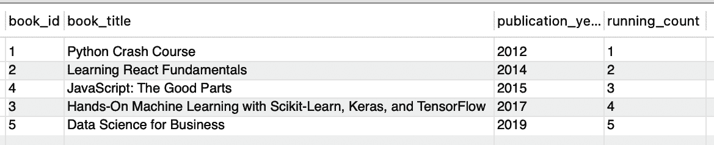

###### 图 3-16\. 运行计数

使用窗口函数，您还可以使用像 `COUNT()` 和 `AVG()` 这样的聚合函数，这些函数在 “使用 GROUP BY 聚合数据” 中介绍。这些函数可以类似于常规聚合使用，但它们作用于指定的窗口。

窗口函数提供额外的功能，例如用于编号和排名行的 `ROW_NUMBER()`、`RANK()` 和 `DENSE_RANK()`，用于确定百分位数或四分位数的 `NTILE()`，以及用于访问前后行的值的 `LAG()` 和 `LEAD()`。

表 3-4 总结了多种类型的窗口函数。

表 3-4\. 窗口函数

| 类型 | 函数 | 示例 |
| --- | --- | --- |
| 聚合函数 | 在每个窗口内进行聚合并为每一行返回单个值 | `MAX()`, `MIN()`, `AVG()`, `SUM()`, `COUNT()` |
| 排名函数 | 根据指定的标准为窗口内的每行分配排名或位置 | `ROW_NUMBER()`, `RANK()`, `DENSE_RANK()`, `NTILE()`, `PERCENT_RANK()`, `CUME_DIST()` |
| 分析函数 | 根据窗口中的数据计算值，而不修改行数 | `LEAD()`, `LAG()`, `FIRST_VALUE()`, `LAST_VALUE()` |

为了深入了解每种类型的函数，我们将使用 `publication_year` 列作为基础，并尝试一系列函数。

在第一个示例中，我们希望按照升序将最新到最旧的书籍进行排名。让我们来看一下示例 3-46 中的片段。

##### 示例 3-46\. 窗口函数—`RANK()`

```
SELECT book_id,
       book_title,
       publication_year,
       RANK() OVER (ORDER BY publication_year) AS rank
FROM books;
```

在使用`RANK()`函数时，一个重要的考虑因素是它根据指定的条件为窗口内的每一行分配一个唯一的排名。然而，如果多行共享相同的值并且被分配相同的排名，则会跳过后续的排名。例如，如果两本书的`publication_year`相同，那么下一个排名将按照具有相同排名的行数递增。如果不想要重复的排名，可以考虑使用`ROW_NUMBER()`替代。

在示例 3-47 中，我们希望按照`publication_year`来分桶我们的数据。

##### 示例 3-47\. 窗口函数—`NTILE()`

```
SELECT book_id,
       book_title,
       publication_year,
       NTILE(3) OVER (ORDER BY publication_year) AS running_ntile
FROM books;
```

`NTILE()`通常用于在你想要将行均匀地分布到指定数量的组中，或者当你需要将数据划分为进一步分析或处理的时候。这有助于诸如数据分段、百分位数计算或创建大小相等的样本等任务。

最后，我们想要知道先前发布的书籍的`publication_year`。为此，我们使用`LAG()`函数，如示例 3-48 中所示。

##### 示例 3-48\. 窗口函数—`LAG()`

```
SELECT book_id,
       book_title,
       publication_year,
       LAG(publication_year) OVER (ORDER BY publication_year) AS previous_year
FROM books;
```

SQL 中的`LAG()`函数允许你在窗口框架内访问前一行的数据。它根据`OVER`子句中指定的顺序检索指定列的值。

# 分布式数据处理的 SQL

随着企业进入云端，他们面临一个普遍的挑战。他们现有的关系数据库，作为关键应用程序的基础，无法充分发挥云端的潜力，并且难以有效扩展。显而易见，数据库本身正在成为限制速度和效率的瓶颈。因此，组织正在寻找一种解决方案，将诸如 Oracle、SQL Server、Postgres 和 MySQL 等经过验证的关系数据存储的可靠性与云端的可扩展性和全球覆盖性结合起来。

为了满足这些需求，一些公司已经转向了 NoSQL 数据库。虽然这些替代方案通常可以满足可扩展性的要求，但它们往往不适合作为事务性数据库。这种限制的原因在于它们的设计，因为它们最初并不是为了从根本上提供真正的一致性而设计的。尽管特定的 NoSQL 解决方案最近已经引入了一些用于处理某些类型挑战的进展，但它们受到各种限制，最终无法提供银行或医院等关键工作负载所需的必要隔离级别。

企业意识到传统关系数据库和 NoSQL 存储的缺点后，转向了一个被称为*分布式 SQL*的有前景的解决方案。这种创新方法在单个数据中心或根据需要分布在多个数据中心，跨多个物理节点部署单一逻辑数据库。通过利用分布式架构的力量，分布式 SQL 结合了弹性可扩展性和坚定的弹性。

分布式 SQL 的关键优势之一是其无缝扩展的能力，以满足现代云环境不断变化的需求。随着数据量的增长和用户需求的增加，组织可以轻松地向分布式部署中添加额外的节点，从而使数据库在水平方向上扩展。这种弹性扩展确保性能即使在高负载下也保持最佳，并消除了传统关系数据库经常面临的限制。

同时，分布式 SQL 提供了无与伦比的弹性。由于数据分布在多个节点上，它天生具有容错能力。如果一个节点失败或变得不可用，系统可以自动将查询转发到其余健康节点，确保对关键数据的不间断访问。这种强大的弹性显著降低了停机和数据丢失的风险，并增加了数据库的整体可靠性。其分布式特性还能实现全球覆盖和数据可用性。组织可以在不同的地理区域部署节点，以使它们更靠近最终用户并减少延迟。这种地理分布的方法确保数据可以从全球任何地方快速访问，促进高效的数据交付，并使组织能够为全球用户群提供服务。

本书的重点不在于实际的分布式处理引擎或它们的工作方式；相反，我们只触及它们为我们提供的接口，以便与之交互。大多数情况下，它们最终会公开 API 或 SDK。然而，一些更专注于数据分析的产品使用 SQL 作为接口语言。实际上，分布式处理和 SQL 结合起来已经成为一种强大的组合，SQL 作为一种便捷和熟悉的接口，可以充分利用分布式计算能力。

像 Spark、Hadoop 和 Dask 这样的分布式处理框架为跨多台机器或集群处理大规模数据提供了基础设施。这些框架分发工作负载并并行化计算，实现更快、更高效的数据处理。另一方面，SQL 提供了一种声明式且直观的方式来表达数据操作。用户可以利用他们的 SQL 技能，通过将 SQL 作为分布式处理的接口来发挥分布式计算框架的强大功能。这种方法能够实现无缝扩展、高效数据处理，并能处理大规模数据集上的复杂分析任务，同时使用熟悉的 SQL 语法。

这种组合使用户能够以简单高效的方式执行高级数据分析和处理任务。这种强大的组合的例子包括 DuckDB、dbt 本身，甚至是 FugueSQL。这些接口作为分布式计算引擎的一层，允许用户编写 SQL 查询并利用他们对 SQL 语法和语义的熟悉程度。DuckDB 特别旨在实现 SQL 查询的高效和可扩展执行，同时利用分布式计算的力量。它允许用户使用 SQL 制定其分析和数据处理工作流程，而底层的分布式处理引擎则处理多台机器上的并行执行。

然而，尽管存在这些 SQL 接口，它们经常与 Python 代码一起使用。即使在 Spark 文档中，Python 代码仍然需要用于各种任务，如数据转换、DataFrame 加载以及执行 SQL 查询后的后处理。这种对 Python 代码的依赖源于标准 SQL 缺乏用于表达在分布式计算环境中用户通常执行的许多操作的语法结构。因此，仅仅依靠 SQL 通常无法表达完整的端到端工作流程。

让我们通过一个示例深入探讨一下。假设我们需要创建一个 SQL 查询来了解自 O’Reilly 作者成立以来销售的所有单位。这将是一个直接的查询，如 示例 3-49 所示。

##### 示例 3-49\. 一个基本的 SQL 查询

```
-- Retrieve top-selling O'Reilly books
SELECT Title,
       UnitsSold
FROM Sales
WHERE Publisher = 'O''Reilly'
ORDER BY UnitsSold DESC
LIMIT 5
```

此时，SQL 查询为我们提供了所需的聚合结果。然而，如果我们想要执行其他数据操作或将结果集成到外部系统中，通常需要借助 Python 或其他编程语言。

例如，我们可以将聚合结果与存储在单独数据集中的客户人口统计数据进行连接，以获取更深入的见解。这种操作通常需要编写 Python 代码来执行数据合并和后处理步骤。此外，如果我们打算将结果可视化或导出到其他格式，同样需要使用 Python 代码来完成这些任务。

一个常见的用例实际上是将数据公开为 API，而 SQL 无法提供这样的能力。示例 3-50 展示了如何将 SQL 与 Python 结合使用以实现端到端流程。

##### 示例 3-50\. 一个基本的 FastAPI

```
from fastapi import FastAPI
import duckdb

app = FastAPI()

@app.get("/top_books")
def get_top_books():
    # Establish a connection to the DuckDB database
    conn = duckdb.connect()

    # Execute the SQL query
    query = '''
 SELECT Title, UnitsSold
 FROM sales
 WHERE Publisher = "O'Reilly"
 ORDER BY UnitsSold DESC
 LIMIT 5
 '''
    result = conn.execute(query)

    # Convert the query result to a list of dictionaries
    books = []
    for row in result:
        book = {
            "title": row[0],
            "units_sold": row[1]
        }
        books.append(book)

    # Return the result as JSON
    return {"top_books": books}
```

我们开发了一个 FastAPI 应用程序，并设置了一个单一的 `GET` 端点，可通过 `/top_books` 路径访问。简单来说，*端点* 是一个特定的网络地址（URL），我们可以用它来从我们的应用程序中检索信息。当某人在其网络浏览器或应用程序中访问此 URL 时，将触发我们定义的特定函数 `get_top_books` 的执行。这个函数包含了当某人从 `/top_books` 端点检索信息时该执行的指令。本质上，这就像我们有一个特定的按钮，当按下时，会导致我们的应用程序执行特定的操作，比如提供畅销书列表。

在函数内部，我们通过使用 `duckdb.connect()` 建立到 DuckDB 数据库的连接。然后使用连接对象的 `execute()` 方法执行 SQL 查询。该查询从 `sales` 表中选择由出版商 `O'Reilly` 发布的书籍的标题和销量。结果按销量降序排序，并限制为前五本书。

查询结果然后被转换成一个字典列表；每个字典代表一本书及其标题和销量。最后，结果被包装在一个带有键`top_books`的字典中，以 JSON 格式返回。

通过同时利用这两种语言，我们可以通过友好的 SQL 接口创建和操作数据，并通过优秀的 FastAPI 框架将其作为 API 公开。在接下来的部分中，我们将探讨三个著名的 Python 框架，它们通过类似 SQL 的接口抽象了对分布式数据处理的访问：DuckDB、FugueSQL 和 Polars。

## 数据操作与 DuckDB

当涉及到数据处理库时，大多数数据科学家非常熟悉 pandas，这是 Python 中主要的数据处理库。Pandas 以其简单性、多功能性和管理多种数据格式和大小的能力而闻名。它为数据操作提供了直观的用户界面。熟悉 SQL 的人士欣赏其强大的特性，使用户可以使用简洁的语法执行复杂的数据转换。然而，在某些情况下，必须在执行速度和工具的易用性或表达能力之间做出权衡。当处理超出内存限制或需要复杂数据处理操作的大型数据集时，这种困境尤为棘手。

在这种情况下，使用 SQL 而不是 pandas 可能是更好的解决方案。这就是 DuckDB 的用武之地。DuckDB 结合了 pandas 和 SQL 的优势，提供了一个快速高效的 SQL 查询执行引擎，能够处理大数据集上的复杂查询。它与 pandas DataFrames 无缝集成，允许直接在 DataFrames 上执行查询，无需频繁数据传输。通过 DuckDB，数据科学家可以在使用 pandas 时利用 SQL 的强大功能，平衡性能与易用性。

此外，我们看到一些公司决定将 Spark 作为数据处理引擎与 dbt 结合使用 DuckDB 来替代。当然，这必须根据具体情况进行评估，但它确实为分析师支持可以在数据管道中运行的更复杂的数据转换打开了大门。

### 安装 DuckDB

DuckDB 是一个非常轻量级的数据库引擎，可以在主机进程内工作，无需外部依赖。安装简单，只需几个简单的步骤。

要安装 DuckDB，我们有几个选项，这取决于操作系统和我们想要进行的安装类型。现在，让我们看看如何使用 pip 包管理器安装 DuckDB，如示例 3-51 中所示。

##### 示例 3-51\. 安装 DuckDB

```
pip install duckdb
```

就是这样。我们现在可以像使用任何其他库一样在 Python 中使用 DuckDB。示例 3-52 展示了如何将 pandas DataFrame 载入 DuckDB，操作数据，并将结果存储回 DataFrame 中。

##### 示例 3-52\. 使用 DuckDB

```
import pandas as pd
import duckdb

mydf = pd.DataFrame({'a' : [1, 2, 3]})
result = duckdb.query("SELECT SUM(a) FROM mydf").to_df()
```

正如我们所观察到的，代码导入了 pandas 库作为`pd`和 DuckDB 库。这使得代码能够访问这些库提供的功能。接下来，创建了一个名为`mydf`的 pandas DataFrame，其中包含一个名为`a`的单列，包含值为`[1, 2, 3]`的三行数据。代码的下一行使用 DuckDB 接口执行了一个 SQL 查询。查询是`SELECT SUM(a) FROM mydf`，计算了`mydf` DataFrame 中`a`列的值的总和。SQL 查询的结果存储在`result`变量中。通过在 DuckDB 查询结果上使用`to_df()`方法，数据被转换为 pandas DataFrame。这允许使用 pandas 中丰富的函数和方法进行进一步的数据操作或分析。

### 使用 DuckDB 运行 SQL 查询

现在我们已经看过一个简单的例子，让我们更详细地了解一些 DuckDB 的核心特性。与传统系统不同，DuckDB 直接在应用程序内部运行，无需外部进程或客户端/服务器架构。这种范式与 SQLite 的进程内模型密切相关，确保 SQL 查询的无缝集成和高效执行。

这种方法的重要性还延伸到 OLAP 领域，这是一种技术，它可以在尽量减少对事务系统影响的同时，对大型企业数据库进行复杂分析。与其他面向 OLAP 的数据库管理系统一样，DuckDB 通过利用其创新的向量化查询执行引擎来处理复杂的分析工作负载。其列式存储方法提高了性能和可扩展性，使其成为处理分析查询的最佳选择。

DuckDB 的一个显著优势是其自包含设计。与传统数据库不同，DuckDB 不需要您安装、更新或维护任何外部依赖项或服务器软件。这种简化的自包含架构简化了部署，并允许应用程序与数据库之间快速传输数据。结果是一个反应异常快速和高效的系统。

DuckDB 的另一个有趣特性是，它的技术能力归功于那些辛勤工作、能力出众的开发人员，他们确保了其稳定性和成熟性。从领先系统中的数百万个查询中进行的严格测试验证了 DuckDB 的性能和可靠性。它遵循 ACID 属性原则，支持次要索引，并提供强大的 SQL 能力，证明了其多才多艺和适合处理苛刻分析工作负载的特性。

DuckDB 集成了流行的数据分析框架，如 Python 和 R，实现了无缝和高效的交互式数据分析。此外，它不仅支持 Python 和 R，还提供了 C、C++和 Java 的 API，使其能够在各种编程语言和环境中使用。它以其卓越的性能和灵活性而闻名，非常适合高效处理和查询大量数据。在分析师中运行 SQL 查询是一项有价值的技能。分析师可以利用 DuckDB 的强大功能轻松执行复杂的 SQL 查询，并从数据中获得有价值的见解。

现在我们已经更多了解了 DuckDB，让我们逐步进行一些练习，以说明一些好处。我们将使用之前使用的相同的书籍分析查询。首先，导入我们需要的库，如示例 3-53 所示，包括 pandas 和 DuckDB。

##### 示例 3-53\. 在 DuckDB 中导入库

```
import duckdb
import pandas as pd
```

接下来是连接到 DuckDB 的内存数据库（参见示例 3-54）。

##### 示例 3-54\. 连接到 DuckDB

```
con = duckdb.connect()
```

让我们从创建一个虚构的 pandas DataFrame 开始，使用 DuckDB 进行操作。执行示例 3-55 中的代码。

##### 示例 3-55\. 加载数据文件

```
import pandas as pd

data = [
    {
        'Title': 'Python for Data Analysis',
        'Author': 'Wes McKinney',
        'Publisher': "O'Reilly",
        'Price': 39.99,
        'UnitsSold': 1000
    },
    {
        'Title': 'Hands-On Machine Learning',
        'Author': 'Aurélien Géron',
        'Publisher': "O'Reilly",
        'Price': 49.99,
        'UnitsSold': 800
    },
    {
        'Title': 'Deep Learning',
        'Author': 'Ian Goodfellow',
        'Publisher': "O'Reilly",
        'Price': 59.99,
        'UnitsSold': 1200
    },
    {
        'Title': 'Data Science from Scratch',
        'Author': 'Joel Grus',
        'Publisher': "O'Reilly",
        'Price': 29.99,
        'UnitsSold': 600
    }
]

df = pd.DataFrame(data)
```

现在，我们将 DuckDB 引入我们的代码。具体来说，我们通过使用连接将 DataFrame 注册为一个 DuckDB 表，并为其命名（在本例中为`sales`），如示例 3-56 所示。这使我们能够使用 SQL 来查询和操作数据。

##### 示例 3-56\. 创建 DuckDB 表

```
con.register('sales', df)
```

有了可查询的表之后，我们现在可以执行所需的任何分析任务。例如，我们可以计算 O'Reilly 图书的总收入，如 示例 3-57 所示。

##### 示例 3-57\. 应用分析查询

```
query_total_revenue = """
 SELECT SUM(Price * UnitsSold) AS total_revenue
 FROM sales
 WHERE Publisher = "O'Reilly"
"""
total_revenue = con.execute(query_total_revenue).fetchall()[0][0]
```

如果我们对获取结果不感兴趣，而是希望将执行结果存储为 DataFrame，我们可以在执行后立即调用 `duckdb df()` 函数。示例 3-58 创建了 DataFrame `df_total_revenue`，我们可以继续在 pandas 中进行操作。这展示了在 DuckDB 的 SQL 接口和 pandas 之间如何平滑过渡。

##### 示例 3-58\. 调用 `df()` 函数

```
query_total_revenue = """
 SELECT SUM(price * unitsSold) AS total_revenue
 FROM sales
 WHERE publisher = "O'Reilly"
"""
df_total_revenue = con.execute(query_total_revenue).df()
```

最后但同样重要的是，我们可以使用 Python 中任何可用的数据可视化库绘制结果，如 示例 3-59 所示。

##### 示例 3-59\. 数据可视化

```
# Create a bar plot
plt.bar("O'Reilly", total_revenue)

# Set the plot title and axis labels
plt.title("Total Revenue for O'Reilly Books")
plt.xlabel("Publisher")
plt.ylabel("Total Revenue")
```

回到 pandas，它提供了 `pandas.read_sql` 命令，允许在现有数据库连接上执行 SQL 查询，然后加载到 pandas 的 DataFrame 中。虽然这种方法适用于轻量级操作，但并不适用于密集的数据处理任务。传统的关系数据库管理系统（如 Postgres 和 MySQL）按顺序处理行，导致长时间的执行时间和显著的 CPU 开销。另一方面，DuckDB 是专为在线分析处理而设计的，采用了列矢量化的方法。这个决策使得 DuckDB 能够有效地并行处理磁盘 I/O 和查询执行，从而获得显著的性能提升。

在内部，DuckDB 使用了 Postgres SQL 解析器，并与 Postgres 完全兼容 SQL 函数。这使用了你熟悉的 SQL 函数，同时利用 DuckDB 的高效列处理。由于其性能和效率的重视，DuckDB 在运行 SQL 查询和处理资源密集型数据处理任务方面是一个引人注目的解决方案，特别是与传统的关系数据库管理系统相比。

## 数据处理与 Polars

与 DuckDB 类似，Polars 也专注于克服 pandas 在处理大数据集时的低性能和低效率。Polars 是一个完全用 Rust 编写的高性能 DataFrame 库，其一个关键优势是不使用 DataFrame 的索引。与经常冗余的索引依赖的 pandas 不同，Polars 消除了索引的需求，简化了 DataFrame 操作，使其更直观和高效。

此外，Polars 利用 Apache Arrow 数组进行内部数据表示。与使用 NumPy 数组的 pandas 相比（pandas 2.0 可能会修复此问题），使用 Arrow 数组在加载时间、内存使用和计算方面提供了显著的优势。Polars 利用这种高效的数据表示轻松处理大数据集，并更有效地执行计算。

Polars 的另一个优势是其支持并行操作。使用 Rust 编写，这是一种以性能和并发性为重点的语言，Polars 可以利用多线程并行运行多个操作。这种增强的并行能力允许更快速和可扩展的数据处理任务。最后，它还引入了一种强大的优化技术称为*惰性评估*。在 Polars 中执行查询时，库会检查和优化查询，并寻找加速执行或减少内存使用的机会。这种优化过程改善了查询的整体性能，并增强了数据处理的效率。相比之下，pandas 只支持急切评估，即遇到表达式时立即评估。

使用 Polars 进行数据操作对分析工程师非常有价值，因为它具备独特的能力。Polars 的设计强调性能和可伸缩性，非常适合高效处理大量数据。处理大数据集的分析工程师可以从其高效的内存操作和并行处理支持中受益，从而实现更快速的数据转换。Polars 与 Rust 生态系统的集成还使其成为使用 Rust 构建的数据管道的分析师的宝贵工具，提供了兼容性和易用性。查询优化能力、先进的数据操作功能以及对多数据源的支持使 Polars 成为我们工具箱中的一个宝贵补充，使其能够高效灵活地处理复杂的数据任务。

### 安装 Polars

要安装 Polars，我们有几个选项，这取决于我们的操作系统和我们想要进行的安装类型，但让我们看看 示例 3-60，它展示了如何使用 pip 软件包管理器安装 Polars 的简单示例。

##### 示例 3-60\. 安装 Polars

```
pip install polars
```

这将立即使 Polar 库在我们的 Python 环境中可用。让我们通过执行 示例 3-61 中的代码片段来测试它。

##### 示例 3-61\. Polars DataFrame

```
import polars as pl

df = pl.DataFrame(
    {
        'Title': ['Python Crash Course', 'Hands-On Machine Learning',
                  'Data Science for Business', 'Learning SQL',
                  'JavaScript: The Good Parts', 'Clean Code'],
        'UnitsSold': [250, 180, 320, 150, 200, 280],
        'Publisher': ["O'Reilly", "O'Reilly", "O'Reilly", "O'Reilly",
                      "O'Reilly", "O'Reilly"],
    }
)
df
```

我们有一个包含三列的 DataFrame：`Title`、`UnitsSold` 和 `Publisher`。`Title` 列表示各种 O'Reilly 图书的标题。`UnitsSold` 列指示每本书的销售单位数，而 `Publisher` 列指定所有书籍都由 O'Reilly 出版。

### 使用 Polars 运行 SQL 查询

使用 Polars，我们可以对这个 DataFrame 执行各种操作，以深入了解 O'Reilly 的图书销售。无论是计算总收入，分析按书名或作者销售，还是识别畅销书籍，如 示例 3-62 所示，Polars 提供了一个多功能和高效的数据分析平台。

##### 示例 3-62\. Polars DataFrame—畅销书籍

```
# Sort the DataFrame by UnitsSold column in descending order
top_selling_books = df.sort(by="UnitsSold", reverse=True)

# Get the top-selling books' title and units sold
top_books_data = top_selling_books.select(["Title",
  "UnitsSold"]).limit(5).to_pandas()

print("Top-selling O'Reilly Books:")
print(top_books_data)
```

如您所见，我们使用 `sort` 方法根据 `UnitsSold` 列按降序对 DataFrame `df` 进行排序。然后，我们使用 `limit` 方法选择前五本书。最后，我们使用 `to_pandas()` 将结果 DataFrame 转换为 pandas DataFrame，以便更轻松地打印和显示。

虽然这很有趣，并展示了与 pandas 语法的相似性，但我们提到了 Polars 具有将其功能作为 SQL 公开的能力。事实上，Polars 提供了多种在其框架内利用 SQL 功能的方法。

就像 pandas 一样，Polars 无缝集成了外部库（如 DuckDB），允许您利用它们的 SQL 功能。您可以从 DuckDB 或 pandas 导入数据到 Polars，对导入的数据执行 SQL 查询，并无缝结合 SQL 操作与 Polars DataFrame 操作。这种集成提供了全面的数据分析和操作生态系统，融合了 SQL 和 Polars 的优势。

在 Example 3-63 中，我们通过 `duckdb.connect()` 创建了一个 DuckDB 连接。然后，我们创建了一个 Polars DataFrame `df`，包含 `Title`、`Author`、`Publisher`、`Price` 和 `UnitsSold` 列，表示 O’Reilly 图书的数据。我们使用 `con.register()` 将这个 DataFrame 注册为名为 `books` 的表。接下来，我们使用 `con.execute()` 在 `books` 表上执行 SQL 查询，选择 `Title` 和 `UnitsSold` 列，并按 `Publisher = "O'Reilly"` 进行筛选。结果以元组列表形式返回。我们将结果转换为一个指定列名的 Polars DataFrame `result_df`。

##### Example 3-63\. 使用 DuckDB 的 Polars DataFrame

```
import polars as pl
import duckdb

# Create a DuckDB connection
con = duckdb.connect()

# Create a Polars DataFrame with O'Reilly books data
df = pl.DataFrame({
    'Title': ['Python for Data Analysis'
             , 'Hands-On Machine Learning'
             , 'Deep Learning'
             , 'Data Science from Scratch'],
    'Author': ['Wes McKinney'
              , 'Aurélien Géron'
              , 'Ian Goodfellow'
              , 'Joel Grus'],
    'Publisher': ["O'Reilly"
                 , "O'Reilly"
                 , "O'Reilly"
                 , "O'Reilly"],
    'Price': [39.99, 49.99, 59.99, 29.99],
    'UnitsSold': [1000, 800, 1200, 600]
})

# Register the DataFrame as a table in DuckDB
con.register('books', df)

# Execute a SQL query on the DuckDB table using Polars
result = con.execute("SELECT Title, UnitsSold FROM books WHERE Publisher =
  'O''Reilly'")

# Convert the result to a Polars DataFrame
result_df = pl.DataFrame(result, columns=['Title', 'UnitsSold'])

# Print the result
print(result_df)

# Close the DuckDB connection
con.close()
```

Polars 还提供了原生支持，可以在不依赖外部库的情况下执行 SQL 查询。使用 Polars，您可以直接在代码中编写 SQL 查询，利用 SQL 语法进行数据转换、聚合和过滤操作。这使您可以在 Polars 框架内充分利用 SQL 的强大功能，从而提供了处理结构化数据的便捷高效方法。

在 Polars 中使用 SQL 是一个简单而直接的过程。您可以按照以下步骤在 Polars DataFrame 上执行 SQL 操作。首先，创建一个 SQL 上下文，用于设置执行 SQL 查询的环境。这个上下文使您能够在 Polars 框架内无缝使用 SQL，如在 Example 3-64 中所示。

##### Example 3-64\. 创建 SQL 上下文

```
# Create a Polars DataFrame with O'Reilly books data
df = pl.DataFrame({
    'Title': ['Python for Data Analysis'
              , 'Hands-On Machine Learning'
              , 'Deep Learning'
              , 'Data Science from Scratch'],
    'Author': ['Wes McKinney'
               , 'Aurélien Géron'
               , 'Ian Goodfellow'
               , 'Joel Grus'],
    'Publisher': ["O'Reilly"
                 , "O'Reilly"
                 , "O'Reilly"
                 , "O'Reilly"],
    'Price': [39.99, 49.99, 59.99, 29.99],
    'UnitsSold': [1000, 800, 1200, 600]
})

# Create the SQL Context
sql = pl.SQLContext()
```

Example 3-65 展示了下一步操作：注册您要查询的 DataFrame。

##### Example 3-65\. 注册 DataFrame

```
# Register the DataFrame in the context
sql.register('df', df)
```

为 DataFrame 提供一个名称，可以为您的 SQL 查询建立一个参考点。此注册步骤确保 DataFrame 与一个可识别的标识符关联起来。

一旦 DataFrame 被注册，您可以使用 Polars 提供的`query()`函数在其上执行 SQL 查询。该函数将 SQL 查询作为输入，并返回一个 Polars DataFrame 作为结果。这个 DataFrame 包含符合 SQL 查询指定条件的数据。让我们看一下示例 3-66。

##### 示例 3-66\. 运行分析查询

```
# Run your SQL query
result_df = sql.execute(
    """
 select
 *
 from df
 where Title = 'Python for Data Analysis'
 """
).collect()
```

通过将 SQL 与 Polars 集成，具有深厚 SQL 知识的数据专业人士可以轻松利用 Polars 的强大和高效性。他们可以利用现有的 SQL 技能直接应用于 Polars 框架中的数据分析和操作任务。这种无缝集成允许用户在使用他们熟悉的 SQL 语法的同时，利用该库优化的查询执行引擎。

## 使用 FugueSQL 进行数据操作

Fugue 是一个强大的统一接口，用于分布式计算，允许用户在像 Spark、Dask 和 Ray 这样的流行分布式框架上无缝运行 Python、pandas 和 SQL 代码。借助 Fugue，用户可以以最小的代码更改实现这些分布系统的全部潜力。

Fugue 的主要用例围绕将现有的 Python 和 pandas 代码并行化和扩展到跨分布式框架轻松运行展开。通过无缝过渡到 Spark、Dask 或 Ray，用户可以享受这些系统的可扩展性和性能优势，而无需重写大量代码。

关于我们讨论的相关内容是，Fugue 提供了一个称为 FugueSQL 的独特功能，允许用户通过高级 SQL 接口在 pandas、Spark 和 Dask DataFrames 上定义端到端工作流程。它结合了熟悉的 SQL 语法和调用 Python 代码的能力。这为用户提供了一个强大的工具，用于简化和自动化他们的数据处理工作流程。

FugueSQL 提供了多种优势，在多种场景中可以利用，包括作为 Fugue 项目整体目标的并行代码执行或在单机上进行独立查询。无论是在分布式系统上工作还是在本地机器上进行数据分析，它都允许我们高效地查询我们的 DataFrames。

### 安装 Fugue 和 FugueSQL

我们有几种安装 Fugue 的选项，取决于我们的操作系统和安装类型。示例 3-67 使用`pip install`。

##### 示例 3-67\. 安装 Fugue

```
pip install fugue
```

Fugue 提供了各种安装额外功能，增强其功能并支持不同的执行引擎和数据处理库。这些安装额外功能包括以下内容：

`sql`

此附加功能支持 FugueSQL。尽管 Fugue 的非 SQL 功能仍可在没有此附加功能的情况下使用，但如果您打算使用 FugueSQL，则安装它是必要的。要实现这一点，请执行示例 3-68 中的代码片段。

##### 示例 3-68\. 安装 FugueSQL

```
pip install "fugue[sql]"
```

`spark`

安装此额外功能将 Spark 作为 Fugue 中的 ExecutionEngine。使用此额外功能，用户可以利用 Spark 的能力来执行其 Fugue 工作流。要添加此额外功能，请运行 Example 3-69 中的代码。

##### Example 3-69\. 安装 FugueSpark

```
pip install "fugue[spark]"
```

`dask`

此额外功能启用了对 Dask 作为 Fugue 中的 ExecutionEngine 的支持。通过安装此额外功能，用户可以在 Fugue 框架内利用 Dask 的分布式计算能力。

`ray`

安装此额外功能将 Ray 作为 Fugue 中的 ExecutionEngine。使用此额外功能，用户可以利用 Ray 的高效任务调度和并行执行能力来执行其 Fugue 工作流。

`duckdb`

此额外功能启用了对 DuckDB 作为 Fugue 中的 ExecutionEngine 的支持。通过安装此额外功能，用户可以在 Fugue 框架内使用 DuckDB 的高速内存数据库进行高效的查询执行。

`polars`

安装此额外功能提供了对 Polars DataFrames 和使用 Polars 库的扩展的支持。使用此额外功能，用户可以在 Fugue 中进行数据处理时利用 Polars 的功能和功能。

`ibis`

启用此额外功能允许用户将 Ibis 集成到 Fugue 工作流中。Ibis 提供了一个表达丰富且功能强大的界面，用于处理类似 SQL 的查询，通过安装此额外功能，用户可以将 Ibis 功能整合到其 Fugue 工作流中。

`cpp_sql_parser`

启用此额外功能使用 CPP（C++）antlr 解析器用于 Fugue SQL，与纯 Python 解析器相比，解析速度显著提高。虽然主要 Python 版本和平台提供了预编译的二进制文件，但此额外功能可能需要在其他平台上即时构建 C++ 编译器。

实际上，我们可以在单个 `pip install` 命令中安装几个之前的额外功能。在 Example 3-70 中，我们使用 Fugue 一次性安装了 `duckdb`、`polars` 和 `spark` 的额外功能。

##### Example 3-70\. 安装多个 Fugue 额外功能

```
pip install "fugue[duckdb,spark,polars]"
```

另一个有趣的额外功能与笔记本有关。FugueSQL 在 Jupyter Notebooks 和 JupyterLab 中都有一个笔记本扩展。此扩展提供语法高亮。我们可以运行另一个 `pip install` 命令来安装扩展 (Example 3-71).

##### Example 3-71\. 安装笔记本扩展

```
pip install fugue-jupyter

fugue-jupyter install startup
```

第二个命令 `fugue-jupyter install startup` 将 Fugue 注册到 Jupyter 的启动脚本中，以便您在每次打开 Jupyter Notebooks 或 JupyterLab 时都可以使用它。

如果您已安装 Fugue 并使用 JupyterLab，默认情况下会自动注册 `%%fsql` 单元格魔术。这意味着您可以在 JupyterLab 环境中直接使用单元格魔术，无需任何额外步骤。但是，如果您使用的是 Classic Jupyter Notebooks 或者 `%%fsql` 单元格魔术未注册，则可以通过在笔记本中使用 Example 3-72 中的命令来启用它。

##### Example 3-72\. 启用笔记本扩展

```
from fugue_notebook import setup
setup(is_lab=True)
```

### 使用 FugueSQL 运行 SQL 查询

FugueSQL 专为希望使用 Python 数据框架（如 pandas、Spark 和 Dask）的 SQL 用户设计。FugueSQL 提供一个 SQL 接口，可以解析和运行在您选择的底层引擎上。这对于那些更喜欢专注于定义逻辑和数据转换而不是处理执行复杂性的数据科学家和分析师尤为有益。

但它也为 SQL 爱好者量身定制，使他们能够在流行的数据处理引擎（如 pandas、Spark 和 Dask）上定义端到端工作流程。这样，SQL 爱好者可以利用他们的 SQL 技能，轻松编排复杂的数据流水线，而无需在不同工具或语言之间切换。

Fugue 为主要使用 pandas 并希望利用 Spark 或 Dask 处理大数据集的数据科学家提供了实用的解决方案。使用 Fugue，他们可以轻松地扩展其 pandas 代码，并顺利过渡到 Spark 或 Dask，实现分布式计算的潜力，几乎不费力气。例如，如果有人在 Spark 中使用 FugueSQL，框架将使用 SparkSQL 和 PySpark 来执行查询。尽管 FugueSQL 支持非标准 SQL 命令，但重要的是强调 Fugue 仍然完全兼容标准 SQL 语法。这种兼容性确保了 SQL 用户可以无缝地切换到 Fugue 并利用他们现有的 SQL 知识和技能，而无需进行重大的定制或复杂化。

最后，Fugue 正在证明是处理大数据项目时非常有价值的资产，这些项目通常面临代码维护问题。通过采用 Fugue，这些团队可以从一个统一的界面中受益，简化跨分布式计算平台执行代码的过程，确保开发过程中的一致性、效率和可维护性。

示例 3-73 展示了一个使用 FugueSQL 的端到端示例。

##### 示例 3-73. FugueSQL 完整示例

```
import pandas as pd
from pyspark.sql import SparkSession
from fugue.api import fugue_sql_flow

data = [
    {
        'Title': 'Python for Data Analysis',
        'Author': 'Wes McKinney',
        'Publisher': "OReilly",
        'Price': 39.99,
        'UnitsSold': 1000
    },
    {
        'Title': 'Hands-On Machine Learning',
        'Author': 'Aurélien Géron',
        'Publisher': "OReilly",
        'Price': 49.99,
        'UnitsSold': 800
    },
    {
        'Title': 'Deep Learning',
        'Author': 'Ian Goodfellow',
        'Publisher': "OReilly",
        'Price': 59.99,
        'UnitsSold': 1200
    },
    {
        'Title': 'Data Science from Scratch',
        'Author': 'Joel Grus',
        'Publisher': "OReilly",
        'Price': 29.99,
        'UnitsSold': 600
    }
]

# Save the data as parquet
df = pd.DataFrame(data)
df.to_parquet("/tmp/df.parquet")

# Fugue with pandas Engine
import fugue.api as fa

query = """
LOAD "/tmp/df.parquet"

SELECT Author, COUNT(Title) AS NbBooks
 GROUP BY Author
 PRINT
"""

pandas_df = fa.fugue_sql(query, engine="pandas")

# Fugue with Spark Engine
import fugue.api as fa

query = """
LOAD "/tmp/df.parquet"

SELECT Author, COUNT(Title) AS NbBooks
 GROUP BY Author
 PRINT
"""

spark_df = fa.fugue_sql(query, engine="spark")

# Fugue with DuckDB
import fugue.api as fa
import duckdb

query = """
df = LOAD "/tmp/df.parquet"

res = SELECT *
 FROM df
 WHERE Author = 'Wes McKinney'

SAVE res OVERWRITE "/tmp/df2.parquet"
"""

fa.fugue_sql(query, engine="duckdb")

with duckdb.connect() as conn:
        df2 = conn.execute("SELECT * FROM '/tmp/df2.parquet'").fetchdf()
        print(df2.head())
```

此示例创建了一个`FugueSQLWorkflow`实例。我们使用`workflow.df()`方法将 pandas DataFrame `df`注册为表格。然后，我们在`workflow.run()`方法中编写 SQL 查询来执行数据的各种操作。这个`FugueSQLWorkflow`是 Fugue 库提供的一个类，作为执行 FugueSQL 代码的入口点。它允许我们在各种数据源上定义和执行 SQL 查询，如前所述，无需显式数据转换或处理底层执行引擎。

该示例演示了三个查询：

+   计算 O'Reilly 书籍的总收入

+   计算 O’Reilly 书籍的平均价格

+   检索销量最高的 O'Reilly 书籍

结果存储在`result`对象中，我们可以使用`first()`和`collect()`方法访问数据。

最后，我们将结果打印到控制台。请注意，在 SQL 查询中，为了正确的语法，我们使用两个单引号（''）来转义出版者名称为`"O'Reilly"`的单引号。

人们可能会想知道 FugueSQL 是否是 pandas 的替代品或进化版本，而 pandasql 有 pandas 支持。我们认为，虽然 pandasql 仅支持 SQLite 作为后端，但 FugueSQL 支持多个本地后端，如 pandas、DuckDB、Spark 和 SQLite。在使用 FugueSQL 与 pandas 后端时，SQL 查询直接转换为 pandas 操作，消除了数据传输的需求。同样，DuckDB 对 pandas 有很好的支持，减少了数据传输的开销。因此，pandas 和 DuckDB 都是 FugueSQL 本地数据处理的推荐后端。总而言之，FugueSQL 是一个利用 SQL 语法的优秀框架，具有分布式处理和大规模数据操作的增强能力。

总的来说，Fugue、DuckDB 和 pandas 是提供高效数据处理能力的强大工具。然而，无论使用何种技术，识别出正确的数据建模对于成功的可扩展性至关重要。没有设计良好的数据模型，任何系统都将难以有效处理大规模数据处理。

健壮数据模型的基础确保数据被结构化、组织化并优化以供分析和操作。通过理解数据实体之间的关系、定义适当的数据类型和建立高效的索引策略，我们可以创建一个可扩展的架构，最大化性能并实现跨平台和工具的无缝数据操作。因此，尽管 Fugue、DuckDB 和 pandas 为高效的数据处理做出了贡献，但对于实现可扩展性来说，正确的数据建模的重要性不可言喻。这也是我们在第二章中涵盖数据建模的主要原因之一。

# 奖励：使用 SQL 训练机器学习模型

这个标题可能会让你觉得我们在推动类似 SQL 的能力的极限，但事实是，多亏了一个非常特定的库*dask-sql*，我们可以在 SQL 中使用 Python 机器学习生态系统。

Dask-sql 是一个最近开发的 SQL 查询引擎，在实验阶段，它建立在基于 Python 的分布式库 Dask 之上。它提供了将 Python 和 SQL 无缝集成的独特能力，使用户能够执行分布式和可扩展的计算。这一创新库打开了利用 Python 和 SQL 的优势进行数据分析和处理的机会。

我们可以运行`pip install`来安装扩展，如示例 3-74 所示。

##### 示例 3-74\. 安装 dask-sql

```
pip install dask-sql
```

在 示例 3-75 中，我们使用 `c = Context()` 这行代码创建了一个 `Context` 类的实例。通过这个实例，我们初始化了一个新的 SQL 查询执行上下文。这个上下文可以用来执行 SQL 查询，对数据进行过滤、聚合和连接等操作，还可以应用 Dask 提供的特殊命令来训练和测试机器学习模型。

##### 示例 3-75\. 从 dask_sql 导入上下文

```
from dask_sql import Context

c = Context()
```

现在我们有了加载数据集并进行操作的所有工具。在 示例 3-76 中，我们使用 Dask 的 `read_csv()` 函数来读取 [Iris 数据集](https://oreil.ly/vt4-s)。一旦数据加载完成，我们可以将其视为 Dask DataFrame 并进行访问和操作。

接下来的步骤是将加载的 Dask DataFrame (`df`) 注册为 *dask-sql* `Context` 中名为 `iris` 的表。使用 `Context` 类的 `create_table` 方法来注册表。完成此步骤后，我们可以使用 SQL 语法查询数据。

##### 示例 3-76\. 将数据加载为 Dask DataFrame 并注册为表

```
# Load data: Download the iris dataset
df = dd.read_csv('https://datahub.io/machine-learning/iris/r/iris.csv')

# Register a Dask table
c.create_table("iris", df)
```

让我们运行一个简单的选择，使用我们的 *dask-sql* `Context` 对象的 `sql()` 函数，在 示例 3-77 中，并将我们的 SQL 查询写为一个参数。

##### 示例 3-77\. 访问 dask-sql 表

```
# Test accessing the data
c.sql("""
 select * from iris
""")
```

数据准备好后，我们可以使用训练组件来训练机器学习模型。为此，我们首先使用 `CREATE OR REPLACE MODEL` 语句，这是 *dask-sql* 的扩展功能，允许在 SQL 上下文中定义和训练机器学习模型。

在这种情况下，聚类模型被命名为 `clustering`，并且使用了 *scikit-learn* 库中的 KMeans 算法创建了这个模型，这是一种流行的无监督学习算法，用于对数据点进行聚类。有趣的是，*dask-sql* 允许我们使用来自第三方库（如 *scikit-learn*）的模型类。`n_clusters` 参数设置为 3，表示算法应该在数据中识别三个聚类。

在 示例 3-78 中，我们展示了用于模型训练的训练数据来自于在 `c` 上下文中注册的 `iris` 表。`SELECT` 语句指定了用于训练的特征，包括 `iris` 表中的 `sepallength`、`sepalwidth`、`petallength` 和 `petalwidth` 列。

##### 示例 3-78\. 创建我们的聚类模型

```
# Train: Create our clustering model using sklearn.cluster.KMeans algorithm
c.sql("""
 CREATE OR REPLACE MODEL clustering WITH (
 model_class = 'sklearn.cluster.KMeans',
 wrap_predict = True,
 n_clusters = 3
 ) AS (
 SELECT sepallength, sepalwidth, petallength, petalwidth
 FROM iris
 )
""")
```

我们现在可以通过运行 `SHOW MODELS` 命令（示例 3-79）来验证我们的模型是否真的创建成功，这类似于传统 SQL 引擎中常用的 `SHOW TABLES`。后者显示特定数据库架构中所有表格，而前者则列出了在 *dask-sql* 上下文中创建的所有可用模型。

##### 示例 3-79\. 显示模型列表

```
# Show the list of models which are trained and stored in the context.
c.sql("""
 SHOW MODELS
""")
```

另一个有趣的命令是 `DESCRIBE MODEL *MODEL_NAME*`（示例 3-80），它展示了用于训练该模型的所有超参数。

##### 示例 3-80\. 获取某个模型的所有超参数

```
# To get the hyperparameters of the trained MODEL
c.sql("""
 DESCRIBE MODEL clustering
""")
```

在 示例 3-81 中，我们展示了 *dask-sql* 中最引人注目的命令之一——`PREDICT` 命令。它使用最近创建的聚类模型来预测 `df` DataFrame 的行的集群类。`PREDICT` 中的 `SELECT` 语句在 SQL 上下文中将训练好的机器学习模型应用于来自某个表的新数据点。

在这种情况下，`PREDICT` 命令用于将 `clustering` 模型应用于 `iris` 表的前 100 行数据。`MODEL` 子句指定要使用的模型名称为 `clustering`。`PREDICT` 命令中的 `SELECT` 语句指定用于预测的特征，这些特征与模型训练步骤中使用的相同特征相同，正如 示例 3-81 中演示的那样。

##### 示例 3-81\. 进行预测

```
''' Predict: Test the recently created model by applying
the predictions to the rows of the df—
in this case assign each observation to a cluster'''
c.sql("""
 SELECT * FROM PREDICT (
 MODEL clustering,
 SELECT sepallength, sepalwidth, petallength, petalwidth FROM iris
 LIMIT 100
 )
""")
```

*dask-sql* 的另一个有趣的能力是其实验组件。它通过使用 `CREATE EXPERIMENT` 语句对聚类模型尝试不同的超参数值来运行实验。

在 示例 3-82 中，实验被命名为 `first_experiment`。它使用来自 *scikit-learn* 的 `GridSearchCV` 类，这是一种流行的超参数调优技术。在这种情况下，正在调整的超参数是聚类数 (`n_clusters`)，这仅仅是展示其能力。`tune_parameters` 参数指定尝试 `n_clusters` 超参数的值范围。在此示例中，实验将尝试三个值 (2, 3 和 4)，这意味着我们期望获得的聚类数。

在机器学习项目的实际场景中，我们应该专注于选择模型的最相关超参数。这取决于问题是否是分类或回归任务，以及所使用的算法类型。

##### 示例 3-82\. 超参数调优

```
# Hyperparameter tuning: Run an experiment to try different parameters
c.sql("""
 CREATE EXPERIMENT first_experiment WITH (
 model_class = 'sklearn.cluster.KMeans',
 experiment_class = 'GridSearchCV',
 tune_parameters = (n_clusters = ARRAY [2, 3, 4]),
 experiment_kwargs = (n_jobs = -1),
 target_column = 'target'
 ) AS (
 SELECT sepallength, sepalwidth, petallength, petalwidth, class AS target
 FROM iris
 LIMIT 100
 )
""")
```

最后，我们有一个 `EXPORT MODEL` 语句，如在 示例 3-83 中所见。在这种情况下，模型以 pickle 格式导出，使用的格式参数设置为 `pickle`。Pickle 是一种 Python 特定的二进制序列化格式，允许您保存和加载 Python 对象。

`location` 参数指定应保存导出模型文件的路径和文件名。在此示例中，模型保存在当前目录，并命名为 *clustering.pkl*。

##### 示例 3-83\. 将模型导出为 pickle 文件

```
# Export the model: Export as a pickle file to be used in other contexts
c.sql("""
 -- for pickle model serialization
 EXPORT MODEL clustering WITH (
 format ='pickle',
 location = './clustering.pkl'
 )
""")
```

总的来说，*dask-sql* 是一个强大且有前景的机器学习工具，为大数据集提供了一个 SQL 接口，用于数据操作和机器学习操作。使用 *dask-sql*，我们可以利用熟悉的 SQL 语法来查询和转换数据，同时通过使用像 *scikit-learn* 这样的流行库来训练和评估机器学习模型。它允许我们注册数据表，在 SQL 上下文中应用 SQL 查询进行数据预处理，并创建和训练机器学习模型。

然而，我们必须强调，*dask-sql* 目前仍处于实验阶段，虽然它是一个对想要探索机器学习空间的 SQL 爱好者来说很吸引人的工具，但在其成长和成熟过程中必须谨慎使用。

# 概要

随着我们结束本章，让我们考虑数据库和 SQL 的重要旅程以及它们对我们过去和未来的不可否认的影响。SQL 仍然是在不断进步的数据景观中的可靠和坚定的组成部分，将成熟的技术与现代分析洞察结合起来，从而确保一个乐观的未来。

我们的探索表明，从清晰的表结构到满足迫切业务需求的复杂模型，SQL 的重要性仍然持续存在，数据库在不断创新中经历着持续的发展。

然而，值得注意的是，这些工具的有效性取决于使用者的技能。持续的教育和灵活性对分析工程师至关重要。SQL、数据库管理和数据分析领域不断发展。要取得成功，我们必须保持更新，保持好奇心，并自信面对挑战。

随着数据景观的迅速扩展，数据工程、分析和数据科学角色之间的区别变得更加显著。虽然这些角色确实存在重叠和融合的领域，但数据的庞大量和复杂性推动了对专业技能和专业知识的需求。本章的结论提醒我们，分析工程领域既广泛又迷人。在每一个查询和数据库中，都存在着探索和创新的新机会，这些机会是由对今天数据景观复杂性的导航需要的专业角色驱动的。
