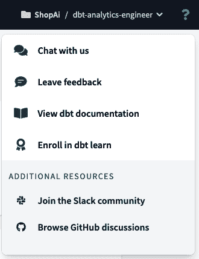
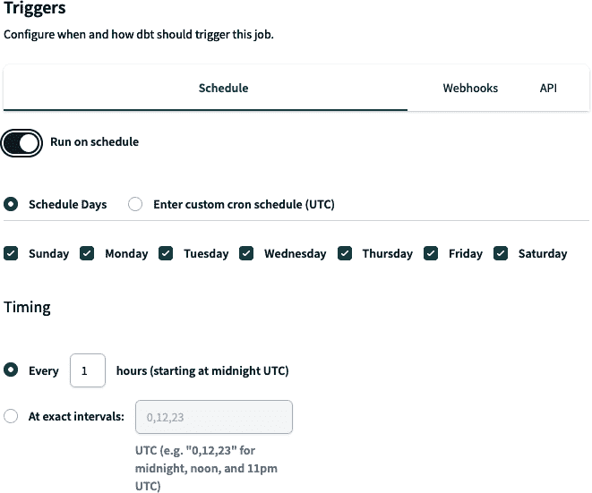

# 第四章：使用 dbt 进行数据转换

dbt 的主要目的是通过简单地编写 SQL 语句，帮助您在数据平台上*轻松*和*集成*地*转换*数据。将 dbt 置于 ELT 工作流中时，它与转换阶段的活动相匹配，为您提供额外的组件——如版本控制、文档、测试或自动部署——以简化数据专家的整体工作。这是否让您想起了分析工程师的实际活动？那是因为 dbt 是定义分析工程师工作的现代工具之一，为他们提供与平台集成的工具，减少了设置额外服务来解决特定问题并降低了整体系统复杂性的需求。

dbt 支持为分析工程师描述的任务，赋予他们在其数据平台上协作运行代码的能力，为指标和业务定义提供单一真实来源。它促进了中心化和模块化的分析代码，利用 Jinja 模板语言、宏或包来实现 DRY 代码。同时，dbt 还提供了我们通常在软件工程最佳实践中找到的安全性，例如*协作*在数据模型上，*版本*它们，并在*部署*到生产之前*测试*和*文档*您的查询，配合*监控*和*可见性*。

我们已经为您提供了 dbt 的全面介绍。然而，在本章中，我们将更深入地探讨 dbt 的具体内容，澄清其在数据分析世界中的重要性。我们将讨论 dbt 的设计理念，这种转换工具背后的原则，以及以 dbt 为核心的数据生命周期，展示 dbt 如何将原始数据转换为易于消费的结构化模型。我们将通过概述其各种功能，如构建模型、文档和测试，以及详细说明其他 dbt 工件，如 YAML 文件，来探索 dbt 项目结构。通过本章的学习，您将全面了解 dbt 及其能力，从而能够在您的数据分析工作流中有效实施它。

# dbt 设计理念

随着数据工程和分析工作流程变得日益复杂，重视数据质量和可靠性的流程简化工具至关重要。dbt 作为一个集中的解决方案，通过其对数据建模和分析工程的方法基础的设计理念，显现出其重要性。

简言之，dbt 的设计理念依赖于以下几点：

以代码为中心的方法

dbt 设计理念的核心是基于代码的数据建模和转换方法。dbt 鼓励用户使用代码定义数据转换，而不是依赖于基于 GUI 的界面或手动 SQL 脚本。这种转向代码驱动的开发促进了协作、版本控制和自动化。

可重用性的模块化

dbt 推广模块化，允许数据从业者创建可重用的代码组件。模型、宏和测试可以组织成包，从而促进代码维护和可扩展性。这种模块化方法符合最佳实践，并增强了代码的可重用性。

转换为 SQL `SELECT`语句

dbt 模型被定义为 SQL `SELECT`语句，使得具备 SQL 技能的分析师和工程师可以轻松访问。这种设计选择简化了开发，并确保数据建模紧密遵循 SQL 最佳实践。

声明性语言

dbt 使用声明性语言定义数据转换。分析师指定所需的结果，dbt 处理底层实现。这种抽象减少了编写复杂 SQL 代码的复杂性，并增强了可读性。

增量构建

效率是 dbt 设计的重点。它支持增量构建，这使得数据工程师可以仅更新受影响的数据管道部分，而不是重新处理整个数据集。这加速了开发并减少了处理时间。

文档即代码

dbt 倡导将数据模型和转换视为代码进行文档化。描述、解释和元数据存储在项目代码旁边，使团队成员更容易理解并有效协作。

数据质量、测试和验证

dbt 非常重视数据测试。它提供了一个测试框架，使分析师能够定义数据质量检查和验证规则。这包括数据可靠性和质量在整个管道中的保证，从而确保数据符合预定义的标准并遵循业务规则。

版本控制集成

与像 Git 这样的版本控制系统的无缝集成是 dbt 的一个基本特性。这个功能支持协同开发、变更追踪和回滚功能，确保数据管道始终处于版本控制之下。

与数据平台的本地集成

dbt 被设计成与 Snowflake、BigQuery 和 Redshift 等流行数据平台无缝集成。它利用这些平台的本地功能进行扩展和性能优化。

开源且可扩展

dbt 是一个开源工具，拥有一个充满活力的社区。用户可以通过创建自定义宏和包来扩展其功能。这种可扩展性允许组织根据其特定的数据需求定制 dbt。

转换与加载的分离

dbt 将数据管道中的转换和加载步骤分开。数据在 dbt 内部进行转换，然后加载到数据平台。

实质上，dbt 的设计理念根植于为数据工程师、分析师和数据科学家创建一个协作、代码中心化和模块化的环境，以便有效地转换数据、确保数据质量并生成有价值的洞察。dbt 通过简化数据建模和分析工程的复杂性，赋予组织充分利用数据的潜力。

# dbt 数据流

图 4-1 显示了数据流的大局观。它指出了 dbt 及其功能在整体数据景观中的位置。


###### 图 4-1\. 使用 dbt 的典型数据流，帮助您从 BigQuery、Snowflake、Databricks 和 Redshift 等数据平台转换您的数据（请参阅 [dbt 文档支持的数据平台](https://oreil.ly/9b8dG)）

正如提到的，dbt 的主要目的是帮助您 *转换* 数据平台的数据，并为此，dbt 提供了两个工具来实现这一目标：

+   dbt 云

+   dbt Core 是由 dbt Labs 维护的开源 CLI 工具，您可以在托管环境中设置或在本地运行

让我们看一个例子，了解 dbt 在实际生活中的工作原理及其作用。假设我们正在处理一个周期性从数据平台（如 BigQuery）提取数据的管道。然后，通过组合表格对数据进行转换（见图 4-2）。

我们将前两个表合并为一个，应用多种转换技术，如数据清洗或合并。这一阶段在 dbt 中进行，因此我们需要创建一个 dbt 项目来完成此合并。我们会逐步学习 dbt Cloud 及如何设置我们的工作环境。

###### 注意

本书中，我们将使用 dbt Cloud 编写我们的代码，因为这是从开发到编写测试、调度、部署和调查数据模型的最快最可靠的方式。此外，dbt Cloud 在 dbt Core 的 CLI 工具之上运行，因此在使用 dbt Cloud 时，我们将熟悉与 dbt Core 相同的命令。


###### 图 4-2\. 使用 dbt 的数据管道用例

# dbt 云

*dbt Cloud* 是 dbt 的云版本，提供广泛的功能和服务来编写和产品化您的分析代码。dbt Cloud 允许您调度 dbt 作业，监视其进展，并实时查看日志和指标。dbt Cloud 还提供高级协作功能，包括版本控制、测试和文档编制。此外，dbt Cloud 还与各种云数据仓库集成，如 Snowflake、BigQuery 和 Redshift，可以轻松地转换您的数据。

您可以使用 dbt Core 的大多数功能，但它需要在您的基础设施上进行配置和设置，类似于在自己的服务器或类似 Airflow 的工具上运行 Amazon 弹性计算云（EC2）实例。这意味着您需要自主维护和管理它，类似于在 EC2 上管理虚拟机（VM）。

相比之下，dbt Cloud 的运作方式类似于托管服务，类似于 Amazon 管理的 Apache Airflow 工作流服务（MWAA）。它提供了便利和易用性，因为许多操作方面都已为您处理，使您能够更专注于分析任务，而不是基础设施管理。

## 使用 BigQuery 和 GitHub 设置 dbt Cloud 的第一步

没有比通过实践学习特定技术更好的方法，所以让我们设置我们将用来应用知识的环境。首先，让我们注册一个[dbt 账户](https://oreil.ly/OGGji)。

注册后，我们将进入完整的项目设置页面（图 4-3）。


###### 图 4-3\. dbt 项目设置的起始页

此页面包含多个部分，用于正确配置我们的 dbt 项目，包括连接到我们期望的数据平台和代码库。我们将使用 BigQuery 作为数据平台，并使用 GitHub 存储我们的代码。

在 BigQuery 中设置新项目的第一步是在[GCP](https://oreil.ly/EQBXK)中搜索“创建项目”并点击搜索栏中的该选项（图 4-4）。


###### 图 4-4\. BigQuery 项目设置，第 1 步

展示了类似于图 4-5 的屏幕，您可以在此设置项目。我们将其命名为*dbt-analytics-engineer*。


###### 图 4-5\. BigQuery 项目设置，第 2 步

配置完成后，进入您的 BigQuery IDE —— 您可以再次使用搜索栏。它应该看起来类似于图 4-6。


###### 图 4-6\. BigQuery IDE

最后，测试 dbt 的公共数据集，以确保 BigQuery 正常工作。为此，请将代码复制到示例 4-1 中，并点击“运行”。

##### 示例 4-1\. BigQuery 中的 dbt 公共数据集

```
select * from `dbt-tutorial.jaffle_shop.customers`;
select * from `dbt-tutorial.jaffle_shop.orders`;
select * from `dbt-tutorial.stripe.payment`;
```

如果您看到图 4-7 的页面，那么您做得很好！

###### 注意

由于我们同时执行了三个查询，我们看不到输出结果。为此，请单击“查看结果”以逐个检查查询输出。


###### 图 4-7\. BigQuery 数据集输出

现在让我们将 dbt 与 BigQuery 连接，并在 dbt IDE 中执行这些查询。为了让 dbt 连接到您的数据平台，您需要生成一个*密钥文件*，类似于在大多数其他数据平台中使用数据库用户名和密码。

前往[BigQuery 控制台](https://oreil.ly/EQBXK)。在继续下一步之前，请确保您在页眉中选择了新项目。如果您看不到您的帐户或项目，请点击右侧的个人资料图片，并验证您是否在使用正确的电子邮件帐户：

1.  前往 IAM & Admin 并选择服务帐户。

1.  点击创建服务帐户。

1.  在名称字段中输入**`dbt-user`**，然后点击创建和继续。

1.  在“授予此服务帐户对项目的访问权限”中，在角色字段中选择 BigQuery 管理员。然后点击继续。

1.  在“授予用户访问此服务帐户”部分留空字段，然后点击完成。

屏幕应该看起来像图 4-8。


###### 图 4-8\. BigQuery 服务帐户屏幕

接下来继续进行剩余的步骤：

1.  点击刚刚创建的服务帐户。

1.  选择 Keys。

1.  点击添加密钥；然后选择“创建新密钥”。

1.  选择 JSON 作为密钥类型，然后点击创建。

1.  应提示您下载 JSON 文件。将其保存在一个易于记忆的位置，并使用清晰的文件名，例如*dbt-analytics-engineer-keys.json*。

现在让我们返回到 dbt Cloud 进行最后的设置：

1.  在项目设置屏幕上，为您的项目指定一个更详细的名称。在我们的案例中，我们选择了*dbt-analytics-engineer*。

1.  在“选择仓库”屏幕上，点击 BigQuery 图标然后点击下一步。

1.  上传先前生成的 JSON 文件。为此，请点击“上传服务帐户 JSON 文件”按钮，见图 4-9。

最后但同样重要的是，在上传文件之后，应用剩余的步骤：

1.  转到底部并点击“测试”。如果看到“您的测试成功完成”，就像图 4-10 所示，那么您就可以继续进行了！现在点击下一步。另一方面，如果测试失败，很有可能是您的 BigQuery 凭据出现了问题。尝试重新生成它们。


###### 图 4-9\. dbt Cloud，提交 BigQuery 服务帐户屏幕


###### 图 4-10\. dbt 和 BigQuery 连接测试

最后一步是设置 GitHub，但首先，让我们先了解我们在这里讨论的内容。GitHub 是一个流行的版本控制平台，托管 Git 仓库，允许您跟踪代码的更改并有效地与他人协作。正确使用 Git，遵循这些原则和最佳实践是至关重要的：

经常提交，早点提交

经常进行提交，即使是小的更改也要如此。这有助于跟踪您的进度并简化调试。每个提交应代表一个逻辑变更或功能。

使用有意义的提交消息

写简洁而描述性的提交消息。一个好的提交消息应该解释了什么被改变以及为什么被改变。

遵循分支策略

使用不同的分支来处理不同的功能、错误修复或开发任务。

先拉取再推送

在推送您的更改之前，始终从远程存储库拉取最新更改（例如，`git pull`）。这样可以减少冲突，并确保您的更改基于最新的代码。

在提交之前审查代码

如果您的团队进行代码审查，请确保在提交之前审查和测试您的更改。这有助于维护代码质量。

使用.gitignore

创建一个*.gitignore*文件，指定应从版本控制中排除的文件和目录（例如构建产物、临时文件）。

使用原子提交

保持提交集中于单一特定更改。避免在同一提交中混合不相关的更改。

使用 rebase 而非 merge

使用`git rebase`来将功能分支的更改集成到主分支中，而不是传统的合并。这将产生更清晰的提交历史。

保持提交历史干净

避免提交“正在进行中”的或调试语句。使用`git stash`等工具暂时保存未完成的工作。

使用标签

创建标签，例如版本标签，以标记项目历史中的重要节点，如发布或主要里程碑。

协作和沟通

与团队沟通关于 Git 工作流程和约定。建立处理问题、提交请求和冲突解决的指南。

知道如何撤销更改

学习如何撤销提交（`git revert`）、重置分支（`git reset`）以及在需要时恢复丢失的工作（`git reflog`）。

文档

在*README*或贡献指南中记录项目的 Git 工作流程和约定，以有效引导新团队成员。

使用备份和远程存储库

定期备份您的 Git 存储库，并使用 GitHub 等远程存储库进行协作和冗余备份。

持续学习

Git 是一个功能强大的工具，具有许多特性。继续学习和探索高级 Git 概念，如挑选、交互式重置和自定义挂钩，以改进您的工作流程。

为了更好地实践一些常见的 Git 术语和命令，请参考表 4-1。

表 4-1\. Git 术语和命令

| 术语/命令 | 定义 | Git 命令（如果适用） |
| --- | --- | --- |
| 存储库（repo） | 这类似于项目文件夹，包含项目的所有文件、历史记录和分支。 | - |
| 分支 | 分支是开发的一个独立线路。它允许您在不影响主代码库的情况下工作新功能或修复。 | `git branch *<branch_name>*` |
| 提交请求（PR） | 提交请求是您希望合并到主分支的建议更改。这是与团队协作和审查代码更改的一种方式。 | - |
| 暂存 | `git stash` 是一个命令，暂时保存您在工作目录中进行的更改，但尚未提交。 | `git stash save *"在此添加您的暂存消息"*` |
| 提交 | 提交是您代码在特定时间点的快照。它表示您对文件所做更改的集合。 | `git commit -m *"Commit message here"*` |
| 添加 | `git add` 用于将更改暂存到下一次提交。当您修改文件时，Git 不会自动包含它们在下一次提交中。您需要明确告诉 Git 要包含哪些更改。 | 要暂存所有更改，git 命令是 `git add .`，但您也可以指定文件或目录：`git add *<path/to/directory/>*` |
| 分叉 | 分叉存储库意味着在 GitHub 上创建别人项目的副本。您可以对分叉存储库进行更改，而不影响原始存储库。 | - |
| 克隆 | 克隆存储库意味着在本地创建远程存储库的副本。您可以在本地修改代码，并将更改推送到远程存储库。 | `git clone *<repository_url>*` |
| 推送 | `git push` 将您的本地更改上传到远程存储库。 | `git push *<origin branch_name>*` |
| 拉取 | `git pull` 将远程存储库的更改更新到您的本地存储库。 | `git pull` |
| 状态 | `git status` 显示您工作目录和暂存区的当前状态。 | `git status` |
| 记录 | `git log` 显示存储库中提交的时间顺序列表以及提交消息、作者和提交 ID。 | `git log` |
| 差异 | `gitdiff` 命令显示两组代码之间的差异。 | `git diff` |
| 合并 | `git merge` 命令将一个分支的更改与另一个分支合并。 | `git checkout *<target_branch>*` 或 `git merge *<source_branch>*` |
| 变基 | 变基允许您将一系列提交移动或合并到一个新的基础提交上。 | `git rebase base_branch` |
| 检出 | `checkout` 命令用于在不同分支或提交之间切换。 | `git checkout *<branch_name>*` |

这些 Git 命令和术语为项目中的版本控制奠定了基础。尽管如此，Git 命令通常具有许多额外的参数和选项，允许对版本控制任务进行精细调整。虽然我们在这里介绍了一些基本命令，但需要注意的是，Git 的灵活性远远超出了我们所概述的范围。

要获取更全面的 Git 命令列表及其多样的参数，请参阅官方的 [Git 文档](https://oreil.ly/kmUcc)。

现在您了解了 Git 和 GitHub 在项目中的角色及其作用，让我们建立到 GitHub 的连接。为此，您需要执行以下操作：

1.  如果您还没有 GitHub 账户，请注册一个。

1.  单击“新建”以创建一个新存储库，这是您将版本化您的分析代码的地方。在“创建新存储库”屏幕上，为您的存储库命名；然后单击“创建存储库”。

1.  创建存储库后，让我们回到 dbt。在“设置存储库”部分，选择 GitHub，然后连接 GitHub 账户。

1.  点击“配置 GitHub 集成”以打开一个新窗口，您可以选择安装 dbt Cloud 的位置。然后选择要安装的仓库。

现在点击“在 IDE 中开始开发”。图 4-11 就是您应该看到的样子。


###### 图 4-11\. dbt IDE

我们将在“使用 dbt Cloud IDE”中概述 dbt Cloud 集成开发环境（IDE），并在“dbt 项目结构”中详细介绍。

点击左上角的“初始化 dbt 项目”。现在，您应该能够看到屏幕的样子，就像图 4-12 中显示的一样。


###### 图 4-12\. 项目初始化后的 dbt

我们将在“dbt 项目结构”中详细描述每个文件夹和文件。现在，让我们看看查询是否有效。通过复制示例 4-2 的代码并点击预览来再次运行它们。

##### 示例 4-2\. BigQuery 中的 dbt 公共数据集，dbt 测试

```
--select * from `dbt-tutorial.jaffle_shop.customers`;
--select * from `dbt-tutorial.jaffle_shop.orders`;
select * from `dbt-tutorial.stripe.payment`;
```

如果输出看起来类似于图 4-13，那意味着您的连接正常。然后，您可以向您的数据平台提交查询，这在我们的情况下是 BigQuery。

###### 注意

这里提供的步骤是 dbt 中 BigQuery 适配器文档的一部分。随着技术的发展和改进，这些步骤和配置也可能发生变化。为确保您拥有最新的信息，请参阅最新的[dbt BigQuery 文档](https://oreil.ly/og-M8)。这个资源将为您提供与 dbt 和 BigQuery 一起工作的最新指导和说明。


###### 图 4-13\. BigQuery 公共数据集的 dbt 输出

最后，让我们测试您的 GitHub 集成是否按预期工作，通过进行您的第一次“提交和推送”。点击左侧具有相同描述的按钮，在图 4-14 中可见。一个弹出屏幕，如图 4-14 右侧的图像，将弹出，您可以在其中编写您的提交消息。点击“提交更改”。


###### 图 4-14\. 提交和推送到 GitHub

由于我们没有创建 Git 分支，它将在主分支中版本化我们的代码。进入您在此设置期间创建的 GitHub 仓库，并查看您的 dbt 项目是否存在。图 4-15 应该与您在 GitHub 仓库上看到的类似。


###### 图 4-15\. dbt GitHub 仓库，第一个提交检查

## 使用 dbt Cloud UI

当您登录到 dbt Cloud 时，初始页面将显示欢迎消息和您作业执行历史的摘要。正如 图 4-16 所示，初始页面是空的，但一旦我们创建并运行第一个作业，我们将开始看到信息。在 “作业和部署” 中，我们将详细介绍作业的执行。


###### 图 4-16\. dbt 登陆页面

在顶部菜单栏，您会看到几个选项。从左边开始，您可以进入开发页面，在这里您将开发所有分析代码并创建模型、测试和文档。这是 dbt 开发的核心，我们将在 “使用 dbt Cloud IDE” 中为您提供更多见解，并深入研究每个组件在 “dbt 项目结构” 中。

紧挨着开发选项的右侧是 Deploy 菜单，如 图 4-17 所示。从这个菜单中，您可以配置作业并通过运行历史监视其执行情况，配置开发环境，并验证快照的源数据新鲜度。


###### 图 4-17\. dbt Deploy 菜单

Deploy 菜单的第一个选项是运行历史，打开的页面显示在 图 4-18 中。在这里，您可以查看作业的运行历史。在 dbt 的上下文中，*作业* 是您配置的自动化任务或流程，用于执行特定操作，如运行模型、测试或生成文档。这些作业是协调 dbt 的重要组成部分，涉及管理和自动化各种数据转换和分析任务。


###### 图 4-18\. dbt 运行历史页面

假设您已经配置了在此部分中已执行的作业。在那种情况下，您可以检查每个作业的调用和状态。作业的运行历史提供了丰富的信息，包括其状态、持续时间、作业执行的环境以及其他有用的详细信息。您可以访问作业经历的步骤信息，包括每个步骤的日志。此外，您还可以找到作业生成的文档、模型或测试等生成物。

Deploy 菜单的下一个选项是作业。这将打开一个页面，用于配置所有自动化内容，包括 CI/CD 管道、运行测试和其他有趣的行为，而无需手动从命令行运行 dbt 命令。

图 4-19 显示了空的作业登陆页面。我们在 “作业和部署” 中有一个完整的作业部分。


###### 图 4-19\. dbt 作业页面

第三个部署菜单选项是环境。在 dbt 内部，我们有两种主要类型的环境：开发和部署。开箱即用，dbt 为您配置开发环境，这在您设置完 dbt 项目后就可以看到。图 4-20 展示了环境的着陆页面，如果您按照“使用 BigQuery 和 GitHub 设置 dbt Cloud”中的步骤进行操作，您的页面应该与此类似。


###### 图 4-20\. dbt 环境页面

最后，我们有数据源选项。这一页显示在 图 4-21，由 dbt Cloud 自动填充，一旦您配置了一个作业来快照源数据的新鲜度。在这里，您将看到最新快照的状态，可以分析您的源数据新鲜度是否符合您与组织定义的服务水平协议（SLAs）。我们将在“源新鲜度”中为您提供有关数据新鲜度的更好理解，以及在“测试数据源新鲜度”中如何进行测试。


###### 图 4-21\. dbt 数据源页面

接下来是文档选项，只要您和您的团队创建了确保您的 dbt 项目正确文档化的常规，这一步将具有特定的重要性。适当的文档可以回答以下问题：

+   这些数据意味着什么？

+   这些数据来自哪里？

+   这些指标是如何计算的？

图 4-22 展示了您项目的文档页面。我们将解释如何在编写代码的同时利用和编写您的 dbt 项目内的文档在“文档”章节。


###### 图 4-22\. dbt 文档页面

右上角菜单允许您选择您的 dbt 项目（图 4-23）。这个简短的菜单使得在 dbt 项目之间移动变得简单。


###### 图 4-23\. dbt 选择账户菜单

dbt 帮助菜单（图 4-24）可以通过点击问号符号找到。在这里，您可以直接与 dbt 团队通过聊天联系，提供反馈，并访问 dbt 文档。最后，通过帮助菜单，您可以加入 Slack dbt 社区或 GitHub dbt 讨论。



###### 图 4-24\. dbt 帮助菜单

设置菜单，图 4-25，是您可以配置与您的帐户、配置文件甚至通知相关的一切内容的地方。


###### 图 4-25\. dbt 设置菜单

一旦您点击三个选项中的任何一个，您将进入设置页面，类似于图 4-26。在第一个页面上，帐户设置中，您可以编辑和创建新的 dbt 项目，管理用户及其访问控制级别（如果您是所有者），以及管理计费。


###### 图 4-26\. dbt 帐户设置页面

第二个菜单选项，配置文件设置，访问了您的个人资料页面（图 4-27）。在这个页面上，您可以查看所有个人信息，并管理关联帐户，如 GitHub 或 GitLab、Slack 和单点登录（SSO）工具。您还可以查看和编辑为数据平台和 API 访问密钥定义的凭据。


###### 图 4-27\. dbt 个人资料页面

最后，通知设置选项访问了通知中心（图 4-28），在这里您可以配置在作业运行成功、失败或取消时在选择的 Slack 频道或电子邮件中接收到的警报。


###### 图 4-28\. dbt 通知中心

## 使用 dbt Cloud IDE

dbt Cloud 的重要部分之一是 IDE，您可以在其中编写所有分析代码，包括测试和文档。图 4-29 显示了 dbt IDE 的主要部分。


###### 图 4-29\. dbt IDE—注释

接下来，您可以找到每个部分代表的详细解释及其在集成开发环境中的重要性：

1.  Git 控制和文档

    这个菜单是您与 Git 交互的地方。在这里，您可以查看自上次提交以来的更改以及新增内容。IDE 中的所有 Git 命令都在这里，您可以决定是否提交和推送或还原您的代码。此外，在窗口右上角，您可以看到文档图标。一旦生成文档，您可以单击此快捷方式访问项目文档。

1.  文件资源管理器

    文件资源管理器为您提供了 dbt 项目的主要概述。在这里，您可以检查您的 dbt 项目是如何构建的——通常是*.sql*、*.yml*和其他兼容的文件类型。

1.  文本编辑器

    这部分 IDE 是您编写和成熟分析代码的地方。在这里，您还可以编辑和创建项目的其他相关文件，如 YAML 文件。如果您从文件资源管理器中选择这些文件，它们将在这里弹出。可以同时打开多个文件。

1.  信息窗口和代码预览、编译和构建

    一旦单击“预览”或“编译”按钮，此菜单将显示您的结果。预览将编译并运行您的查询以及您的数据平台，并在屏幕底部的“结果”选项卡中显示结果。另一方面，“编译”将把任何 Jinja 转换成纯 SQL。这将显示在屏幕底部的“编译代码”选项卡中的信息窗口中。预览或编译按钮适用于语句和 SQL 文件。

    “构建”是仅在特定文件中弹出的特殊按钮。根据您选择的构建类型，运行结果将包括有关所有模型、测试、种子和快照的信息，这些信息被合并到一个文件中。

    信息窗口在开发过程中排查错误或使用“谱系”选项卡来检查当前在文本编辑器中打开的模型及其祖先和依赖项的数据谱系也很有帮助。

1.  命令行

    命令行是您可以执行特定 dbt 命令（如 `dbt run` 或 `dbt test`）的地方。在命令执行期间或之后，它还会显示一个弹出屏幕，以显示正在处理的结果—为此，请单击命令行开头的箭头。日志也可以在这里查看。图 4-30 显示了扩展的命令行；要执行的命令位于顶部，并跟随执行的日志。


###### 图 4-30\. dbt 命令行扩展

# dbt 项目的结构

一个 dbt *项目* 是一个由文件夹和文件、编程模式和命名约定组成的目录。所有分析代码、测试、文档和参数化都将放置在这些文件和文件夹中。它将使用这些命名约定和编程模式。您如何组织文件夹和文件目录就是您的 dbt 项目结构。

建立一个合适的 dbt 项目需要付出努力。为了良好实施，它需要汇集公司的领域和部门，利用他们的专业知识来映射整个公司的目标和需求。因此，定义一套明确、全面和一致的惯例和模式是相关的。实现这一点将确保项目在公司扩展时保持可访问和可维护，同时利用 dbt 来赋能和惠及尽可能多的人。

您如何组织您的 dbt 项目可能会有所不同，并可能受到您或公司指南定义的变化的影响。这并不是问题。重要的是，您要明确声明这些变化，并以一种严格和易于访问的方式为所有贡献者保持一致。出于本书的目的，我们将保持您初始化时遇到的 dbt 项目的基本结构（示例 4-3）。

##### 示例 4-3\. dbt 项目的初始结构

```
root/
├─ analyses/
├─ dbt_packages/
├─ logs/
├─ macros/
├─ models/
│  ├─ example/
│  │  ├─ schema.yml
│  │  ├─ my_second_dbt_model.sql
│  │  ├─ my_first_dbt_model.sql
├─ seeds/
├─ snapshots/
├─ target/
├─ tests/
├─ .gitignore
├─ dbt_project.yml
├─ README.md
```

每个文件夹和文件将在本章节和第五章中的后续部分详细解释。有些比其他更加重要和经常使用。然而，理解它们的目的是非常重要的：

分析文件夹

在“分析”中详细介绍，这个文件夹通常用于存储审计目的的查询。例如，您可能希望在从其他系统迁移逻辑到 dbt 时查找不一致之处，并利用 dbt 的能力（如使用 Jinja 和版本控制），而无需将其包含在内置模型中。

dbt_packages 文件夹

您将在此处安装 dbt 包。我们将在“dbt 包”中详细介绍包的概念。总体来说，包是独立的 dbt 项目，解决特定问题，并可以在组织间共享和重用。这促进了更干净的代码，因为您不需要一遍又一遍地实现相同的逻辑。

日志文件夹

默认情况下，所有项目日志将写入此处，除非您在*dbt_project.yml*中进行了不同配置。

宏文件夹

您将在此处存储 DRY 转换代码。宏，类似于其他编程语言中的函数，是可以多次重用的 Jinja 代码片段。我们将在“使用 SQL 宏”中专门讨论它们。

模型文件夹

dbt 中的强制文件夹之一。一般来说，*模型*是一个包含`SELECT`语句的 SQL 文件，其中包含将原始数据转换为最终转换数据的模块化逻辑。在 dbt 中，模型的名称表示将来的表或视图的名称，或者如果配置为临时模型，则表示不包含。此主题将在“模型”中详细说明。

种子文件夹

我们将在“种子”中讨论，这里是我们存储查找表的地方。总体思路是，种子是 CSV 文件，变化不频繁，用于建模源系统中不存在的数据。一些有用的用例可能是将邮政编码映射到州或需要从分析中排除的测试电子邮件列表。

快照文件夹

包含项目的所有快照模型，必须与模型文件夹分开。dbt 快照功能记录了可变表格随时间的变化。它应用了类型 2 慢变化维度（SCD），用于标识表中行在时间内的变化。这在“快照”中有详细介绍。

目标文件夹

包含编译后的 SQL 文件，当您运行`dbt run`、`dbt compile`或`dbt test`命令时将被写入。您可以选择在*dbt_project.yml*中配置写入到另一个文件夹。

测试文件夹

用于同时测试多个特定表的目的。这不会是您编写测试的唯一文件夹。大部分还是会在您模型文件夹内的 YAML 文件中，或通过宏。然而，测试文件夹更适合单独的测试，报告多个特定模型之间如何互动或相关的结果。我们将在 “测试” 章节深入讨论此主题。

dbt_project.yml

是每个 dbt 项目的核心。这是 dbt 知道一个目录是一个 dbt 项目的方式，并且它包含重要信息，告诉 dbt 如何在您的项目上操作。我们将在本书的整个过程中介绍这个文件。它也在 “dbt_project.yml” 中有所涵盖。

*.gitignore* 和 README.md

这些文件通常用于您的 Git 项目。*gitignore* 指定了在提交和推送期间 Git 应该忽略的有意的文件，而 *README* 文件是一个重要的指南，为其他开发人员详细描述了您的 Git 项目。

我们将在本章和 第五章 中更详细地介绍这些文件夹，深入探讨 dbt 项目和其特性。

## Jaffle 商店数据库

在本书中，我们将提供一组实际示例，展示如何使用 dbt 的组件和功能。在大多数情况下，我们将需要开发 SQL 查询，以便更好地向您展示我们想要展示的内容。因此，有一个我们可以操作的数据库是非常重要的。这个数据库就是 Jaffle 商店。

*Jaffle 商店数据库* 是一个由两个表组成的简单数据库，用于存储客户和订单。为了提供更多背景信息，我们将有一个来自 Stripe 的附加数据库，其中包含与订单相关联的支付。这三个表将是我们的原始数据。

我们使用这个数据库的原因是它已经在 dbt Labs 的 BigQuery 中公开可用。它是他们文档和课程中主要使用的数据库之一，因此我们希望它能简化本书阶段 dbt 平台的整体学习曲线。

图 4-31 展示了我们的原始数据 ERD，显示了客户、订单和支付。


###### 图 4-31\. Jaffle 商店原始数据 ERD，我们如下阅读：单个客户（1）可以有多个订单（N），单个订单（1）可以有多个处理支付（N）

## YAML 文件

*YAML* 是一种人类可读的数据序列化语言，通常用于配置文件和应用程序中存储或传输数据的地方。在 dbt 中，YAML 用于定义你的 dbt 项目的组件的属性和一些配置：模型、快照、种子、测试、源，甚至实际的 dbt 项目，*dbt_project.yml*。

除了顶级的 YAML 文件，例如 *dbt_project.yml* 和 *packages.yml*，需要明确命名并放置在特定位置外，您组织 dbt 项目中的其他 YAML 文件的方式由您决定。请记住，与组织 dbt 项目的其他方面一样，最重要的指导原则是保持一致性，明确您的意图，并记录组织的方式及其原因。重要的是要在集中性和文件大小之间取得平衡，以便尽可能地方便查找特定配置。以下是关于如何组织、结构化和命名您的 YAML 文件的一套建议：

+   如前所述，平衡配置的集中性和文件大小尤为重要。将所有配置放在单个文件中可能会使得随着项目规模的扩展变得更难找到特定的配置（尽管在技术上可以使用一个文件）。由于文件的重复性质，使用 Git 进行变更管理也会变得复杂。

+   如前所述，如果我们采用每个文件夹的配置方法，在长期运行中，最好保持所有配置。换句话说，在每个模型的文件夹目录中，建议有一个 YAML 文件，以便简化该目录中所有模型的配置。通过在同一目录内部分离模型配置文件，扩展此规则，有一个特定文件用于您在同一目录内部的源配置（见 示例 4-4）。

    在这种结构中，我们使用了分期模型来代表所讨论的内容，因为它涵盖了大多数情况，比如源、YAML 文件。在这里，您可以看到每个文件夹系统的配置，其中源和模型配置被分开。它还介绍了文档的 Markdown 文件，我们将在 “文档” 中更详细地讨论。最后，文件名开头的下划线将所有这些文件放置在各自目录的顶部，以便更容易找到。

    ##### 示例 4-4\. 模型目录中的 dbt YAML 文件

    ```
    root/
    ├─ models/
    │  ├─ staging/
    │  │  ├─ jaffle_shop/
    │  │  │  ├─ _jaffle_shop_docs.md
    │  │  │  ├─ _jaffle_shop_models.yml
    │  │  │  ├─ _jaffle_shop_sources.yml
    │  │  │  ├─ stg_jaffle_shop_customers.sql
    │  │  │  ├─ stg_jaffle_shop_orders.sql
    │  │  ├─ stripe/
    │  │  │  ├─ _stripe_docs.md
    │  │  │  ├─ _stripe_models.yml
    │  │  │  ├─ _stripe_sources.yml
    │  │  │  ├─ stg_stripe_order_payments.sql
    ├─ dbt_project.yml
    ```

+   当使用文档块时，也要按照相同的方法创建每个模型目录的一个 Markdown 文件（`.md`）。在 “文档” 中，我们将更详细地了解这种类型的文件。

建议您在目录级别的*dbt_project.yml*文件中设置默认配置，使用级联的范围优先级来定义这些配置的变化。这可以帮助您简化 dbt 项目管理，确保您的配置一致且易于维护。例如，利用示例 4-4，想象一下我们所有的暂存模型默认配置为视图。这将在您的*dbt_project.yml*文件中进行配置。但是，如果您有特定的用例需要更改`jaffle_shop`暂存模型的物化配置，您可以通过修改*_jaffle_shop_models.yml*文件来实现。这样，您可以为这组特定模型定制物化配置，同时保持项目其余配置不变。

使用在 dbt 项目构建中使用的级联范围优先级，可以覆盖特定模型的默认配置。虽然所有暂存模型默认情况下都会作为视图物化，但暂存`jaffle_shop`模型将作为表物化，因为我们通过更新特定的*_jaffle_shop_models.yml* YAML 文件来覆盖了默认设置。

### dbt_project.yml

在 dbt 中最关键的文件之一是*dbt_project.yml*。此文件必须位于项目的根目录，并且它是您的项目的主要配置文件，包含 dbt 正常运行所需的相关信息。

*dbt_project.yml*文件在编写更加 DRY 的分析代码时也具有一定的相关性。一般来说，您的项目默认配置将存储在此处，并且所有对象都将从中继承，除非在模型级别进行覆盖。

这里是您将在此文件中遇到的一些最重要的字段之一：

name

(必须)。dbt 项目的名称。我们建议将此配置更改为您的项目名称。还要记得在模型部分和*dbt_project.yml*文件中做出相应更改。在我们的案例中，我们将其命名为*dbt_analytics_engineer_book*。

version

(必须)。项目的核心版本。与*dbt version*不同。

config-version

(必须)。版本 2 是目前可用的版本。

profile

(必须)。在 dbt 中，配置文件用于连接到您的数据平台。

[folder]-paths

(可选)。其中[folder]是 dbt 项目中的文件夹列表。它可以是模型、种子、测试、分析、宏、快照、日志等。例如，*model-paths*将说明您的模型和源文件的目录。*macro-paths*是您的宏代码所在位置，依此类推。

target-path

(可选)。此路径将存储编译后的 SQL 文件。

clean-targets

(可选)。包含通过`dbt clean`命令要删除的工件的目录列表。

models

（可选。）模型的默认配置。在 Example 4-5 中，我们希望将 staging 文件夹中的所有模型物化为视图。

##### Example 4-5\. dbt_project.yml，模型配置

```
models:
  dbt_analytics_engineer_book:
    staging:
      materialized: view
```

### packages.yml

*Packages* 是独立的 dbt 项目，解决特定问题并可以在组织之间重用和共享。它们是包含模型和宏的项目；通过将它们添加到你的项目中，这些模型和宏将成为其一部分。

要访问这些包，你首先需要在 *packages.yml* 文件中定义它们。详细步骤如下：

1.  你必须确保 *packages.yml* 文件位于你的 dbt 项目中。如果没有，请在与 *dbt_project.yml* 文件相同的级别创建它。

1.  在 *packages.yml* 文件中定义你希望在 dbt 项目中可用的包。你可以从 [dbt Hub](https://hub.getdbt.com)、GitHub 或 GitLab 等源安装包，甚至是本地存储的包。Example 4-6 展示了每种情况所需的语法。

1.  运行 `dbt deps` 命令来安装定义的包。除非你进行了不同的配置，否则默认情况下这些包会安装在 *dbt_packages* 目录中。

##### Example 4-6\. 从 dbt hub、Git 或本地安装包的语法

```
packages:
  - package: dbt-labs/dbt_utils
    version: 1.1.1

  - git: "https://github.com/dbt-labs/dbt-utils.git"
    revision: 1.1.1

  - local: /opt/dbt/bigquery
```

### profiles.yml

如果你决定使用 dbt CLI 并在本地运行 dbt 项目，则需要设置 *profiles.yml*，但如果使用 dbt Cloud 则不需要。此文件包含了 dbt 将用于连接数据平台的数据库连接信息。由于其敏感内容，此文件保存在项目之外，以避免将凭据版本化到代码库中。如果你的凭据存储在环境变量下，你可以安全地使用代码版本控制。

当你在本地环境中调用 dbt 时，dbt 会解析你的 *dbt_project.yml* 文件并获取配置文件名，这是 dbt 连接到你的数据平台所需的。根据需要，你可以拥有多个配置文件，但通常每个 dbt 项目或数据平台都有一个配置文件。即使在本书中使用 dbt Cloud，并且不需要配置文件。我们展示了一个 *profiles.yml* 的示例，如果你好奇或者更喜欢使用 dbt CLI 连接 BigQuery。

*profiles.yml* 的典型 YAML 模式文件如 Example 4-7 所示。我们在本书中使用 dbt Cloud，这意味着不需要配置文件。然而，我们展示了一个 *profiles.yml* 的示例，如果你好奇或者更喜欢使用 dbt CLI 连接 BigQuery。

##### Example 4-7\. profiles.yml

```
dbt_analytics_engineer_book:
  target: dev
  outputs:
    dev:
      type: bigquery
      method: service-account
      project: [GCP project id]
      dataset: [the name of your dbt dataset]
      threads: [1 or more]
      keyfile: [/path/to/bigquery/keyfile.json]
      <optional_config>: <value>
```

*profiles.yaml* 的最常见结构包含以下组件：

profile_name

配置文件的名称必须与 *dbt_project.yml* 中找到的名称相同。在我们的情况下，我们将其命名为 `dbt_analytics_engineer_book`。

target

这是在不同环境中拥有不同配置的方法。例如，当在本地开发时，您可能希望使用单独的数据集/数据库进行工作。但是在部署到生产环境时，最好将所有表放在单个数据集/数据库中。默认情况下，目标设置为`dev`。

类型

您希望连接的数据平台类型：BigQuery、Snowflake、Redshift 等。

特定于数据库的连接细节

示例 4-7 包括属性，如`method`、`project`、`dataset` 和 `keyfile`，这些属性在使用这种方法连接到 BigQuery 时是必需的。

线程

dbt 项目将运行的线程数。它创建了模型之间的链接 DAG。线程数代表 dbt 可以并行处理的图中路径的最大数量。例如，如果指定 `threads: 1`，dbt 将仅开始构建一个资源（模型、测试等），并在继续下一个之前完成它。另一方面，如果设置为 `threads: 4`，dbt 将同时处理多达四个模型，而不会违反依赖关系。

###### 注意

*profiles.yml* 文件的整体概念在这里介绍。我们不会进一步介绍，也不会提供有关如何配置您的 dbt 本地项目与 BigQuery 的详细设置指南。大部分任务已经描述过，比如在“使用 BigQuery 和 GitHub 设置 dbt 云” 中生成 keyfile，但可能还有一些细微差别。如果您想了解更多信息，dbt 提供了[全面的指南](https://oreil.ly/BeMDc)。

## 模型

*模型* 是您作为数据专家将在 dbt 生态系统内花费大部分时间的地方。它们通常以 `select` 语句的形式编写，保存为 *.sql* 文件，并且是帮助您在数据平台内转换数据的 dbt 中最重要的组成部分之一。

要正确构建您的模型并创建清晰一致的项目结构，您需要熟悉数据建模的概念和技术。如果您的目标是成为分析工程师或者说是希望与数据一起工作的人，这是核心知识。

正如我们在第 2 章中所看到的，*数据建模* 是通过分析和定义数据需求来创建支持组织业务流程的数据模型的过程。它塑造了您的源数据，即公司收集和生成的数据，将其转换为变换后的数据，以满足公司领域和部门的数据需求，并产生附加值。

遵循数据建模的原则，正如在第二章中介绍的，模块化是另一个对正确构建您的 dbt 项目和组织模型至关重要的概念。从概念上讲，*模块化* 是将问题分解为一组可以分离和重组的模块的过程，这降低了系统的整体复杂性，并常常带来灵活性和多样性的好处。在分析学中，情况也是如此。在构建数据产品时，我们不会一次性编写所有代码，而是逐步完成直到最终数据产品。

由于我们将从一开始就采用模块化方法，我们的初始模型也将考虑到模块化，并根据我们在第二章中讨论过的内容进行构建。遵循典型的 dbt 数据转换流程，我们模型目录中将有三层：

**Staging layer**

我们的初始模块化构建块位于我们的 dbt 项目的中间层（staging layer）内。在这一层，我们与源系统建立接口，类似于 API 与外部数据源的交互方式。在这里，数据被重新排序、清理并准备进行下游处理。这包括数据标准化和轻微转换的任务，为进一步的高级数据处理奠定基础。

**Intermediate layer**

此层包含介于中间层和数据仓库层之间的模型。这些模型是在我们的中间层模型基础上构建的，用于进行广泛的数据转换以及来自多个来源的数据整合，从而创建多样化的中间表，这些表将服务于不同的目的。

**Marts layer**

根据你的数据建模技术，数据仓库中的中间层（staging layer）将所有模块化的部分汇集在一起，以更广泛地展示公司关心的实体。例如，如果我们选择维度建模技术，数据仓库中的中间层包含事实表和维度表。在这个上下文中，*事实* 是随时间持续发生的事件，如订单、页面点击或库存变化，其相应的度量。*维度* 是描述这些事实的属性，如客户、产品和地理位置。*数据仓库（marts）* 可以被描述为数据平台内部特定领域或部门的子集，如财务、市场营销、物流、客户服务等。也可以养成一个名为“核心”的仓库，它不针对特定领域，而是核心业务事实和维度的集合。

With the introductions made, let’s now build our first models, initially only on our staging layer. Create a new folder inside your models folder, named *staging*, and the respective folders per source, *jaffle_shop* and *stripe*, inside the *staging* folder. Then create the necessary SQL files, one for *stg_stripe_order_payments.sql* (示例 4-8), another for *stg_jaffle_shop_customers.sql* (示例 4-9), and finally one for *stg_jaffle_shop_orders.sql* (示例 4-10). In the end, delete the example folder inside your models. It is unnecessary, so it would create unneeded visual noise while coding. The folder structure should be similar to 示例 4-11.

##### 示例 4-8\. stg_stripe_order_payments.sql

```
select
    id as payment_id,
    orderid as order_id,
    paymentmethod as payment_method,
    case
        when paymentmethod in ('stripe'
                               , 'paypal'
                               , 'credit_card'
                               , 'gift_card')
        then 'credit'
        else 'cash'
    end as payment_type,
    status,
    amount,
    case
        when status = 'success'
        then true
        else false
    end as is_completed_payment,
    created as created_date
from `dbt-tutorial.stripe.payment`
```

##### 示例 4-9\. stg_jaffle_shop_customers.sql

```
select
    id as customer_id,
    first_name,
    last_name
from `dbt-tutorial.jaffle_shop.customers`
```

##### 示例 4-10\. stg_jaffle_shop_orders.sql

```
select
    id as order_id,
    user_id as customer_id,
    order_date,
    status,
    _etl_loaded_at
from `dbt-tutorial.jaffle_shop.orders`
```

##### 示例 4-11\. Staging models’ 文件夹结构

```
root/
├─ models/
│  ├─ staging/
│  │  ├─ jaffle_shop/
│  │  │  ├─ stg_jaffle_shop_customers.sql
│  │  │  ├─ stg_jaffle_shop_orders.sql
│  │  ├─ stripe/
│  │  │  ├─ stg_stripe_order_payments.sql
├─ dbt_project.yml
```

Now let’s execute and validate what we did. Typically, typing `dbt run` in your command line is enough, but at BigQuery, you may need to type **`dbt run --full-refresh`**. After, look at your logs by using the arrow to the left of your command line. The logs should look similar to 图 4-32.


###### 图 4-32\. dbt 系统日志

###### Tip

Your logs should also give you a good idea of the issue if something goes wrong. In 图 4-32, we present a logs summary, but you can also check the detailed logs for more verbosity.

Expecting that you have received the “Completed successfully” message, let’s now take a look at BigQuery, where you should see all three models materialized, as 图 4-33 shows.


###### 图 4-33\. dbt BigQuery 模型

By default, dbt materializes your models inside your data platform as views. Still, you can easily configure this in the configuration block at the top of the model file (示例 4-12).

##### 示例 4-12\. 模型文件中的材化配置

```
{{
   config(
      materialized='table'
   )
}}

SELECT
    id as customer_id,
    first_name,
    last_name
FROM `dbt-tutorial.jaffle_shop.customers`
```

Now that we have created our first models, let’s move to the next steps. Rearrange the code using the YAML files, and follow the best practices recommended in “YAML Files”. Let’s take the code block from there and configure our materializations inside our YAML files (示例 4-12). The first file we will change is *dbt_project.yml*. This should be the core YAML file for default configurations. As such, let’s change the model’s configuration inside with the code presented in 示例 4-13 and then execute **`dbt run`** again.

##### 示例 4-13\. 将模型材化为视图和表

```
models:
  dbt_analytics_engineer_book:
    staging:
      jaffle_shop:
        +materialized: view
      stripe:
        +materialized: table
```

###### Note

前缀 + 是 dbt 语法增强功能，引入于 dbt v0.17.0，旨在澄清 *dbt_project.yml* 文件中的资源路径和配置。

自 Example 4-13 强制所有暂存 Stripe 模型作为表格材料化后，BigQuery 应该看起来像 Figure 4-34。


###### Figure 4-34\. dbt BigQuery 模型与材料化表格

Example 4-13 显示了如何在 *dbt_project.yml* 中配置每个文件夹内特定的期望材料化方式。您的暂存模型默认将保留为视图，因此可以在模型文件夹级别覆盖此配置，利用项目构建中的级联作用域优先级。首先，让我们修改我们的 *dbt_project.yml*，将所有暂存模型设置为视图，如 Example 4-14 所示。

##### Example 4-14\. 将暂存模型材料化为视图

```
models:
  dbt_analytics_engineer_book:
    staging:
      +materialized: view
```

现在让我们为 `stg_jaffle_shop_customers` 创建单独的 YAML 文件，声明其需要被材料化为表格。为此，在 *staging/jaffle_shop* 目录内创建名为 *_jaffle_shop_models.yml* 的 YAML 文件，并复制 Example 4-15 中的代码。

##### Example 4-15\. 定义模型将被材料化为表格

```
version: 2

models:
  - name: stg_jaffle_shop_customers
    config:
      materialized: table
```

在重新运行 dbt 后，查看 BigQuery。它应该类似于 Figure 4-35。


###### Figure 4-35\. dbt BigQuery 客户模型材料化为表格

这是使用 YAML 文件的简单示例，玩弄表格材料化，并看到级联作用域优先级在实践中的意义。还有很多要做和看到的内容，我们讨论的一些内容随着我们的前进将会有更多的适用性。目前，我们只需请您更改 *_jaffle_shop_models.yml* 中的模型，将其材料化为视图。这将是您的默认配置。

希望在这个阶段，您已经开发了您的第一个模型，并大致了解了 YAML 文件的总体目的和级联作用域优先级。接下来的步骤将是创建我们的中间和 Mart 模型，同时学习 `ref()` 函数。这将是我们首次使用 Jinja，我们将在 “使用 Jinja 进行动态 SQL” 中详细讨论它。

首先要明确我们的用例。在我们的模型位于我们的暂存区内时，我们需要知道我们想要做什么。正如我们在本节开头提到的，您需要定义支持组织业务流程的数据需求。作为业务用户，我们的数据可以从多个流中获取。其中之一，将成为我们的用例，是分析我们的每个客户订单，显示每个成功订单的总付款金额以及每个成功订单类型（现金和信用卡）的总金额。

由于我们在此处有一些转换，需要从付款类型级别改变到订单粒度，这正好解释了为什么在我们到达数据集市层之前需要隔离这个复杂操作。这就是中间层的落地点。在您的模型文件夹中，创建一个名为*intermediate*的新文件夹。在里面，创建一个名为*int_payment_type_amount_per_order.sql*的新 SQL 文件，并复制 Example 4-16 中的代码。

##### 示例 4-16\. int_payment_type_amount_per_order.sql

```
with order_payments as (
   select * from {{ ref('stg_stripe_order_payments') }}
)

select
    order_id,
    sum(
        case
            when payment_type = 'cash' and
                status = 'success'
            then amount
            else 0
        end
        ) as cash_amount,
    sum(
        case
            when payment_type = 'credit' and
                status = 'success'
            then amount
            else 0
        end
        ) as credit_amount,
    sum(case
            when status = 'success'
            then amount
        end
        ) as total_amount
from order_payments
group by 1
```

正如您在创建`order_payments` CTE 时可以看到，我们使用`ref()`函数从`stg_stripe_order_payments`中收集数据。此函数引用了构建您数据平台的上游表和视图。由于其带来的好处，如在我们实施分析代码时，我们将使用此函数作为标准：

+   它允许您以灵活的方式构建模型之间的依赖关系，这些依赖关系可以在共同的代码库中共享，因为它在`dbt run`期间编译数据库对象的名称，并从环境配置中收集该名称，当您创建项目时。这意味着在您的环境中，代码将根据您的环境配置编译，这些配置在您特定的开发环境中可用，但与您的队友的开发环境不同，但共享同一代码库。

+   您可以构建血统图，以可视化特定模型的数据流和依赖关系。我们将在本章后面讨论此问题，它还涵盖在“文档”中。

最后，虽然承认前面的代码可能看起来像是一种反模式，因为`CASE WHEN`条件的重复感，但需要澄清整个数据集包括所有订单，无论其付款状态如何。然而，对于本例子，我们选择仅对已达到“成功”状态的订单关联的支付进行财务分析。

中间表创建完成后，让我们进入最终层。考虑到所描述的用例，我们需要从客户角度分析订单。这意味着我们必须创建一个与事实表连接的客户维度。由于当前用例可以满足多个部门，我们不会创建一个特定的部门文件夹，而是一个名为 *core* 的文件夹。因此，首先在我们的模型文件夹中创建 *marts/core* 目录。然后将 示例 4-17 复制到名为 *dim_customers.sql* 的新文件中，将 示例 4-18 复制到名为 *fct_orders.sql* 的新文件中。

##### 示例 4-17\. dim_customers.sql

```
with customers as (
    select * from {{ ref('stg_jaffle_shop_customers')}}
)

select
    customers.customer_id,
    customers.first_name,
    customers.last_name
from customers
```

##### 示例 4-18\. fct_orders.sql

```
with orders as  (
    select * from {{ ref('stg_jaffle_shop_orders' )}}
),

payment_type_orders as  (
    select * from {{ ref('int_payment_type_amount_per_order' )}}
)

select
    ord.order_id,
    ord.customer_id,
    ord.order_date,
    pto.cash_amount,
    pto.credit_amount,
    pto.total_amount,
    case
        when status = 'completed'
        then 1
        else 0
    end as is_order_completed

from orders as ord
left join payment_type_orders as pto ON ord.order_id = pto.order_id
```

所有文件创建完成后，让我们在 *dbt_project.yml* 中设置默认配置，如 示例 4-19 所示，然后在 BigQuery 上执行 `dbt run`，或者可能是 `dbt run --full-refresh`。

##### 示例 4-19\. 在 dbt_project.yml 中，每层的模型配置

```
models:
  dbt_analytics_engineer_book:
    staging:
      +materialized: view
    intermediate:
      +materialized: view
    marts:
      +materialized: table
```

###### Tip

如果您收到类似于“rpc 请求中的编译错误...依赖于一个名为 *int_payment_type_amount_per_order* 的节点，但该节点尚未在您的数据平台中——在我们的情况下是 `int_payment_type_amount_per_order`。要解决此问题，请转到该特定模型并执行 `dbt run --select *MODEL_NAME*` 命令，将 `*MODEL_NAME*` 替换为相应的模型名称。

如果一切顺利，您的数据平台应已完全更新所有 dbt 模型。只需查看 BigQuery，其应类似于 图 4-36。


###### 图 4-36\. 带有所有模型的 dbt BigQuery

最后，打开 *fct_orders.sql* 并查看信息窗口中的 Lineage 选项（参见 图 4-37）。这是我们将在 “文档” 中介绍的众多功能之一，它为我们提供了关于数据流向特定模型及其上游和下游依赖关系的良好概念。


###### 图 4-37\. dbt fct_orders 数据血统

## 源

在 dbt 中，*sources* 是您数据平台上可用的原始数据，使用通用的抽取和加载（EL）工具捕获。区分 dbt 源与传统数据源至关重要。传统数据源可以是内部或外部的。*内部数据源* 提供支持组织日常业务操作的交易数据。客户、销售和产品数据是内部数据源潜在内容的示例。另一方面，*外部数据源* 提供源自组织外部的数据，例如从商业伙伴、互联网和市场研究等处收集的数据。这通常是与竞争对手、经济学、客户人口统计等相关的数据。

dbt sources 依赖于业务需求中的内部和外部数据，但其定义有所不同。正如前文所述，dbt sources 是您数据平台内的原始数据。这些原始数据通常由数据工程团队通过 EL 工具带入您的数据平台，并且将是支持您的分析平台运行的基础。

在我们的模型中，从“模型”中，我们通过使用硬编码字符串如`dbt-tutorial.stripe.payment`或`dbt-t​u​t​o​r​i​a​l​.​j​a​f​f​l​e​_​s​h​o​p​.​customers`引用我们的源。即使这样也能工作，但请考虑，如果您的原始数据发生变化，如位置或表名按照特定命名约定进行更改，则在多个文件中进行更改将会很困难且耗时。这就是 dbt sources 的用武之地。它们允许您在一个 YAML 文件中记录这些源表格，您可以在其中引用源数据库、模式和表格。

让我们把这些付诸实践。通过遵循“YAML 文件”中推荐的最佳实践，现在让我们在 *models/staging/jaffle_shop* 目录下创建一个名为 *_jaffle_shop_sources.yml* 的新 YAML 文件，并复制示例 4-20 中的代码。然后，在 *models/staging/stripe* 目录中创建另一个 YAML 文件，命名为 *_stripe_sources.yml*，并复制示例 4-21 中的代码。

##### 示例 4-20\. _jaffle_shop_sources.yml—Jaffle Shop 模式下所有表格的源参数化文件

```
version: 2

sources:
  - name: jaffle_shop
    database: dbt-tutorial
    schema: jaffle_shop
    tables:
      - name: customers
      - name: orders
```

##### 示例 4-21\. _stripe_sources.yml—stripe 模式下所有表格的源参数化文件

```
version: 2

sources:
  - name: stripe
    database: dbt-tutorial
    schema: stripe
    tables:
      - name: payment
```

配置好我们的 YAML 文件后，我们需要在模型中进行最后一次更改。不再使用硬编码的数据源，而是使用一个名为`source()`的新函数。这类似于我们在“引用数据模型”中介绍的`ref()`函数，但现在配置源时我们传递类似于`{{ source("stripe", "payment") }}`的内容，这在特定情况下将引用我们在示例 4-21 中创建的 YAML 文件。

现在让我们动手吧。拿出你之前创建的所有 SQL 分期模型代码，并用示例 4-22 中相应的代码替换它。

##### 示例 4-22\. 使用`source()`函数的付款、订单和客户分期模型

```
-- REPLACE IT IN stg_stripe_order_payments.sql
select
    id as payment_id,
    orderid as order_id,
    paymentmethod as payment_method,
    case
        when paymentmethod in ('stripe'
                               ,'paypal'
                               , 'credit_card'
                               , 'gift_card')
        then 'credit'
        else 'cash'
    end as payment_type,
    status,
    amount,
    case
        when status = 'success'
        then true
        else false
    end as is_completed_payment,
    created as created_date
from {{ source('stripe', 'payment') }}

-- REPLACE IT IN stg_jaffle_shop_customers.sql file
select
    id as customer_id,
    first_name,
    last_name
from {{ source('jaffle_shop', 'customers') }}

-- REPLACE IT IN stg_jaffle_shop_orders.sql
select
    id as order_id,
    user_id as customer_id,
    order_date,
    status,
    _etl_loaded_at
from {{ source('jaffle_shop', 'orders') }}
```

切换到使用我们的`source()`函数后，您可以通过运行`dbt compile`或单击 IDE 中的编译按钮来检查您的代码在数据平台中的执行情况。在后台，dbt 将查找引用的 YAML 文件，并将`source()`函数替换为直接的表格引用，如图 4-38 所示。


###### 图 4-38\. dbt 客户分期模型与`source()`函数及相应编译的代码。编译后的代码将在您的数据平台内运行。

使用`source()`函数的另一个好处是现在您可以在血统图中看到来源。例如，只需看一下*fct_orders.sql*的血统。现在，与图 4-37 中显示的相同的血统应该看起来像图 4-39。


###### 图 4-39\. dbt `fct_orders` 数据源血统与来源

### 数据源新鲜度

数据的新鲜度是数据质量的一个重要方面。如果数据不是最新的，它就是过时的，这可能会导致公司决策过程中的重大问题，因为这可能导致不准确的洞察。

dbt 允许您通过数据源新鲜度测试来缓解这种情况。为此，我们需要一个审计字段，该字段声明了您的数据平台中特定数据工件的加载时间戳。有了它，dbt 将能够测试数据的年龄，并根据指定的条件触发警告或错误。

为了实现这一点，让我们回到我们的源 YAML 文件。对于这个特定的例子，我们将使用我们数据平台中的订单数据，因此，通过推理，我们将用示例 4-23 中的代码替换*_jaffle_shop_sources.yml*中的代码。

##### 示例 4-23\. _jaffle_shop_sources.yml—Jaffle Shop 模式下所有表的源参数化文件，包含源新鲜度测试

```
version: 2

sources:
  - name: jaffle_shop
    database: dbt-tutorial
    schema: jaffle_shop
    tables:
      - name: customers
      - name: orders
        loaded_at_field: _etl_loaded_at
        freshness:
          warn_after: {count: 12, period: hour}
          error_after: {count: 24, period: hour}
```

正如您所看到的，我们在我们的数据平台中使用了`_etl_loaded_at`字段。我们不需要将其带入我们的转换过程中，因为它对于前向模型没有附加值。这并不是问题，因为我们正在测试我们的上游数据，而在我们的情况下是原始数据。在 YAML 文件中，我们创建了两个额外的属性：`loaded_at_field`，它代表在源新鲜度测试下要监视的字段，以及`freshness`，其中包含监视源新鲜度的实际规则。在`freshness`属性内部，我们配置它在数据过时 12 小时后使用`warn_after`属性发出警告，并且在过去 24 小时内未刷新数据时使用`error_after`属性发出实际错误。

最后，让我们看看如果执行命令**`dbt source freshness`**会发生什么。在我们的情况下，我们收到了一个警告，正如您可以在图 4-40 中看到的那样。


###### 图 4-40\. dbt 订单原始数据和数据源新鲜度测试日志

如果您检查日志详细信息，可以看到在您的数据平台中执行的查询并进行故障排除。这个特定的警告是预期的。`_etl_loaded_at`预计将从当前时间开始花费 16 小时，所以任何低于这个时间的值都会引发警告。如果您想继续测试，请将您的`warn_after`更改为更高的值，如 17 小时。所有测试都应该通过。

希望现在源数据新鲜度的概念已经清晰了。我们将在本书的后面回到这个概念，并向您展示如何自动化和快照源数据新鲜度测试。与此同时，了解其在整体测试环境中的目的、如何配置以及这种测试在减少数据质量问题中的重要性非常关键。

## 测试

作为分析工程师，您必须确保数据准确可靠，以建立对您提供的分析的信任，并为您的组织提供客观的见解。每个人都同意这一点，但即使您遵循所有工程最佳实践，当您必须处理工作中的数据波动、类型、结构等时，总会有例外情况。

有许多方法可以捕获这些异常。然而，当您处理大量数据时，您需要考虑一种可扩展的方法来分析大型数据集并快速识别这些异常。这就是 dbt 发挥作用的地方。

dbt 允许您快速且轻松地扩展数据工作流中的测试，以便您可以在其他人之前识别出问题。在开发环境中，您可以使用测试来确保您的分析代码产生所需的输出。在部署/生产环境中，您可以自动化测试并设置警报，以便在特定测试失败时通知您，以便您可以迅速做出反应并修复问题，以免产生更严重的后果。

作为数据从业者，重要的是要理解 dbt 中的测试可以总结为关于数据的断言。当您在数据模型之上运行测试时，您断言这些数据模型产生了预期的输出，这是确保数据质量和可靠性的关键步骤。这些测试是一种验证形式，类似于确认您的数据遵循特定模式并符合预定义标准。

然而，需要注意的是，在数据测试的更广泛环境中，dbt 测试只是测试的一种类型。在软件测试中，测试通常区分为验证和验证两种类型。dbt 测试主要侧重于验证，通过确认数据是否符合已建立的模式和结构来进行验证。它们并不设计用于测试数据转换中逻辑的细节，这类似于软件开发中单元测试的作用。

此外，dbt 测试可以在某种程度上协助数据组件的集成，特别是当多个组件一起运行时。尽管如此，需要认识到 dbt 测试有其局限性，可能无法涵盖所有测试用例。在数据项目的全面测试中，您可能需要使用其他针对特定验证和验证需求定制的测试方法和工具。

有了这个理解，让我们专注于可以在 dbt 中使用哪些测试。在 dbt 中，测试分为两类：单一测试和通用测试。让我们更多地了解一下这两种类型，它们的目的以及我们如何利用它们。

### 通用测试

dbt 中最简单但高度可扩展的测试是*通用测试*。通过这些测试，通常无需编写任何新逻辑，但也可以选择自定义通用测试。尽管如此，您通常只需编写几行 YAML 代码，然后根据测试来测试特定模型或列。dbt 提供了四种内置的通用测试：

`unique` 测试

验证特定列中的每个值是否唯一

`not_null` 测试

验证特定列中的每个值是否不为 null

`accepted_values` 测试

确保特定列中的每个值存在于给定的预定义列表中

`relationships` 测试

确保特定列中的每个值存在于另一个模型中的列中，因此我们保证了参照完整性

现在我们对通用测试有了一些背景了解，让我们尝试一下。我们可以选择想要的模型，但为了简化，让我们选择一个模型，可以对其应用所有测试。为此，我们选择了*stg_jaffle_shop_orders.sql*模型。在这里，我们将能够测试`customer_id`和`order_id`等字段的`unique`和`not_null`。我们可以使用`accepted_values`检查所有订单的`status`是否在预定义列表中。最后，我们将使用`relationships`测试检查`customer_id`的所有值是否在*stg_jaffle_shop_customers.sql*模型中。让我们从用示例 4-24 中的代码替换我们的*_jaffle_shop_models.yml*开始。

##### 示例 4-24\. 带有通用测试的 _jaffle_shop_models.yml 参数化

```
version: 2

models:
  - name: stg_jaffle_shop_customers
    config:
      materialized: view
    columns:
      - name: customer_id
        tests:
          - unique
          - not_null

  - name: stg_jaffle_shop_orders
    config:
      materialized: view
    columns:
      - name: order_id
        tests:
          - unique
          - not_null
      - name: status
        tests:
          - accepted_values:
              values:
                - completed
                - shipped
                - returned
                - placed
      - name: customer_id
        tests:
          - relationships:
              to: ref('stg_jaffle_shop_customers')
              field: customer_id
```

现在，在命令行中键入**`dbt test`**并查看日志。如果`accepted_values`测试失败，那么您做得很好。它应该失败的。让我们进行调试，了解失败的潜在根本原因。打开日志并展开失败的测试。然后点击详细信息。您将看到执行测试数据的查询，正如 Figure 4-41 所示。


###### Figure 4-41\. 通用测试，使用`accepted_values`失败的 dbt 日志

让我们将此查询复制到您的文本编辑器中——仅保留内部查询然后执行它。您应该会得到与 Figure 4-42 中类似的输出。


###### Figure 4-42\. 通用测试调试

天啊。我们发现了问题。附加状态`return_pending`在我们的测试列表中缺失。让我们添加它并重新运行我们的**`dbt test`**命令。现在所有测试都应该通过，如图 4-43 所示。


###### 图 4-43\. 所有测试成功执行的通用测试

###### 注意

除了 dbt Core 中的通用测试之外，dbt 生态系统中还有更多测试。这些测试位于 dbt 包中，因为它们是内置于 dbt 中的通用测试的扩展。“dbt Packages”将详细介绍包的概念及其安装方法，但是对于扩展测试功能，如来自 dbt 团队的*dbt_utils*（https://oreil.ly/MwqgC）或来自 Python 库 Great Expectations 的*dbt_expectations*（https://oreil.ly/bmrqJ）等包，都是出色的使用示例，并且是任何 dbt 项目中必不可少的。最后，自定义通用测试是 dbt 的另一个功能，它允许您定义适合特定项目需求的数据验证规则和检查。

### 单数测试

与通用测试不同，*单数测试*定义在*tests*目录下的*.sql*文件中。通常，在您想要测试特定模型内特定属性时很有帮助，但内置于 dbt 中的传统测试不符合您的需求。

在查看我们的数据模型时，一个很好的测试是检查没有订单的总金额为负数。我们可以在三个层次之一——分段、中间或市场中执行此测试。我们选择了中间层，因为我们做了一些可能影响数据的转换。首先，在*tests*目录中创建名为*assert_total_payment_amount_is_positive.sql*的文件，并复制 Example 4-25 中的代码。

##### 示例 4-25\. assert_total_payment_amount_is_positive.sql，用于检查`int_payment_type_amount_per_order`内的`total_amount`属性是否仅具有非负值的单数测试

```
select
    order_id,
    sum(total_amount) as total_amount
from {{ ref('int_payment_type_amount_per_order') }}
group by 1
having total_amount < 0
```

现在，您可以执行以下命令之一来运行您的测试，这些测试应该通过：

`dbt test`

执行您的所有测试

`dbt test --select test_type:singular`

仅执行单数测试

`dbt test --select int_payment_type_amount_per_order`

执行`int_payment_type_amount_per_order`模型的所有测试

`dbt test --select assert_total_payment_amount_is_positive`

执行我们创建的特定测试

这些命令提供了根据您的需求选择运行测试的能力。无论您需要运行所有测试、特定类型的测试、特定模型的测试，甚至是单独的特定测试，dbt 都允许您在命令中利用各种选择语法选项。这种多样的选择确保您可以精确地定位您希望执行的测试，以及其他 dbt 资源。

### 在“dbt 命令和选择语法”中，我们将提供对可用 dbt 命令的全面概述，并探讨如何有效地使用选择语法来指定资源。

要在您的 dbt 项目中测试您的模型，您还可以将这些测试扩展到您的数据源。您已经在“数据源新鲜度”中使用数据源新鲜度测试做过了这一点。此外，您还可以为此目的加强通用和单一测试。在您的数据源中使用测试功能将使我们确信原始数据构建得符合我们的期望。

与您在模型中配置测试的方式相同，您也可以为您的数据源进行配置。无论是通用测试的 YAML 文件，还是单一测试的*.sql*文件，规范始终如一。让我们分别看一下每种测试类型的一个示例。

从通用测试开始，您需要编辑数据源的特定 YAML 文件。让我们保留与顾客和订单分期表相同的`unique`、`not_null`和`accepted_values`测试，但现在您将测试它们的数据源。因此，为了实现这一目标，请将*_jaffle_shop_sources.yml*中的代码替换为示例 4-26 中的代码。

##### 执行`dbt test`或`dbt test --select source:stripe`，因为我们在这种情况下查看了 Stripe 数据源。一切也应该通过。

```
version: 2

sources:
  - name: jaffle_shop
    database: dbt-tutorial
    schema: jaffle_shop
    tables:
      - name: customers
        columns:
            - name: id
              tests:
                - unique
                - not_null
      - name: orders
        loaded_at_field: _etl_loaded_at
        freshness:
          warn_after: {count: 17, period: hour}
          error_after: {count: 24, period: hour}
        columns:
              - name: id
                tests:
                  - unique
                  - not_null
              - name: status
                tests:
                  - accepted_values:
                      values:
                        - completed
                        - shipped
                        - returned
                        - placed
                        - return_pending
```

一旦您在 YAML 文件中有了新的代码，您可以运行`dbt test`或更确切地执行命令，仅测试我们创建了这些测试的数据源，`dbt test --select source:jaffle_shop`。您的所有测试应该通过。

最后，您也可以像之前一样实施单一测试。让我们复制我们之前在示例 4-25 中执行的单一测试。在您的*tests*目录中创建一个名为*assert_source_total_payment_amount_is_positive.sql*的新文件，并从示例 4-27 复制代码。该测试检查付款来源表中订单的`amount`属性的总和是否仅为非负值。

##### 测试数据源

```
select
    orderid as order_id,
    sum(amount) as total_amount
from {{ source('stripe', 'payment') }}
group by 1
having total_amount < 0
```

示例 4-27\. assert_source_total_payment_amount_is_positive.sql 单一测试

## *analyses*文件夹可以存储您的特定查询、审计查询、培训查询或重构查询，例如，在影响模型之前检查代码外观的用途。

示例 4-26\. _jaffle_shop_sources.yml—使用通用测试的参数化

分析是模板化的 SQL 文件，您不能在 `dbt run` 中执行，但由于您可以在分析中使用 Jinja，因此您仍然可以使用 `dbt compile` 来查看您的代码的外观，同时保留您的代码在版本控制下。考虑到其目的，让我们看看可以利用 *analyses* 文件夹的一个用例。

想象一下，你不想建立一个全新的模型，但仍然想通过利用代码版本管理来保留未来需求的一部分信息。通过分析，你可以做到这一点。对于我们的用例，让我们分析总支付金额最高的前 10 名客户，仅考虑订单“完成”状态。要查看此信息，在 *analyses* 目录中，创建一个名为 *most_valuable_customers.sql* 的新文件，并复制来自 示例 4-28 的代码。

##### 示例 4-28\. most_valuable_customers.sql 分析，基于已完成订单输出前 10 名最有价值的客户

```
with fct_orders as (
    select * from {{ ref('fct_orders')}}
),

dim_customers as  (
    select * from {{ ref('dim_customers' )}}
)

select
    cust.customer_id,
    cust.first_name,
    SUM(total_amount) as global_paid_amount
from fct_orders as ord
left join dim_customers as cust ON ord.customer_id = cust.customer_id
where ord.is_order_completed = 1
group by cust.customer_id, first_name
order by 3 desc
limit 10
```

现在执行代码并检查结果。如果一切顺利，它将给出最有价值的前 10 名客户，就像 图 4-44 所示的那样。


###### 图 4-44\. 基于已完成订单支付的全球总金额最有价值的前 10 名客户

## 种子

*Seeds* 是您的 dbt 平台中的 CSV 文件，其中包含少量非易失性数据，可作为表在您的数据平台中实现。只需在命令行中输入 `dbt seed`，种子就可以像所有其他模型一样在您的模型中使用 `ref()` 函数。

我们可以找到种子的多个应用场景，从映射国家代码（例如，PT 表示葡萄牙或 US 表示美国）、邮政编码到州、需要排除在我们分析之外的虚拟电子邮件地址，甚至其他复杂的分析，比如价格范围分类。重要的是记住，种子不应该有大量或频繁变动的数据。如果情况是这样的话，重新考虑你的数据捕捉方法，例如使用 SFTP（SSH 文件传输协议）或 API。

为了更好地理解如何使用种子，请按照下一个用例继续操作。考虑到我们在 “分析” 中所做的工作，我们不仅希望看到根据已支付的订单确定的最有价值的前 10 名客户，还要根据支付的 `total_amount` 将所有客户分类为 *regular*、*bronze*、*silver* 或 *gold*。作为一个开始，让我们创建我们的种子。为此，在您的 seeds 文件夹中创建一个名为 *customer_range_per_paid_amount.csv* 的新文件，并复制 示例 4-29 的数据。

##### 示例 4-29\. seed_customer_range_per_paid_amount.csv，其中包含映射范围的数据

```
min_range,max_range,classification
0,9.999,Regular
10,29.999,Bronze
30,49.999,Silver
50,9999999,Gold
```

完成后，请执行**`dbt seed`**。它将把你的 CSV 文件转换成数据平台中的表格。最后，在*分析*目录下，让我们创建一个名为*customer_range_based_on_total_paid_amount.sql*的新文件，并从示例 4-30 复制代码。

##### 示例 4-30\. customer_range_based_on_total_paid_amount.sql 根据已完成订单和支付总额，显示了客户分类范围。

```
with fct_orders as (
    select * from {{ ref('fct_orders')}}
),

dim_customers as  (
    select * from {{ ref('dim_customers' )}}
),

total_amount_per_customer_on_orders_complete as (
    select
        cust.customer_id,
        cust.first_name,
        SUM(total_amount) as global_paid_amount
    from fct_orders as ord
    left join dim_customers as cust ON ord.customer_id = cust.customer_id
    where ord.is_order_completed = 1
    group by cust.customer_id, first_name
),

customer_range_per_paid_amount as (
    select * from {{ ref('seed_customer_range_per_paid_amount' )}}
)

select
        tac.customer_id,
        tac.first_name,
        tac.global_paid_amount,
        crp.classification
from total_amount_per_customer_on_orders_complete as tac
left join customer_range_per_paid_amount as crp
	on tac.global_paid_amount >= crp.min_range
		and tac.global_paid_amount <= crp.max_range
```

现在让我们执行我们的代码并查看结果。它将为每位客户提供总支付金额及其对应的范围（图 4-45）。


###### 图 4-45\. 基于完成订单和支付总额的客户范围。

## 文档

在全球软件工程领域，文档至关重要，但似乎又像个禁忌。一些团队做了，而其他团队则没有，或者做得不完整。文档可能会变得过于官僚主义或复杂，或者被视为开发者待办事项中的负担，因此不惜一切代价避免。你可能听到一长串理由来证明不创建文档或将其推迟到较不紧迫的时间。没有人会说文档是不重要的。只是“我们不会做”，“现在不做”，或者“我们没有时间”。

以下是几个理由，来证明创建和使用文档的必要性：

+   促进了入职、移交和招聘流程。有了适当的文档，任何新的团队成员都可以确保他们不是“被抛向狼群”。新同事将拥有书面的入职流程和技术文档，从而减少其对当前团队流程、概念、标准和技术发展的学习曲线。员工流失和知识分享过渡也适用同样的原则。

+   它将赋予真理的单一来源。从业务定义、流程和操作文章，到让用户自助回答问题，有文档将节省团队寻找信息的时间和精力。

+   通过文档分享知识，可以减少重复或冗余工作。如果文档已经完成，可以重新使用，而无需从头开始。

+   它促进了共同责任感，确保关键知识不局限于单个个体。在关键团队成员不可用时，这种共享所有权对防止中断至关重要。

+   当你希望建立质量、过程控制并遵守合规法规时，文档至关重要。有文档将使你的团队能够在公司各部门之间实现协调和一致性。

一个理由证明缺乏创建文档的动机是，它与实际开发流程并行，就像使用一个工具进行开发，另一个工具进行文档编写一样。但是，使用 dbt 不同。您在开发分析代码、测试和连接到源等任务时，同时构建项目文档。一切都在 dbt 内部进行，而不是在一个单独的界面中。

dbt 处理文档的方式使您能够在构建代码的同时创建文档。通常情况下，文档的很大一部分已经是动态生成的，例如我们之前介绍过的血统图，只需要您适当配置`ref()`和`source()`函数即可。另一部分是部分自动化的，需要您手动输入特定模型或列代表的内容。然而，再次强调，所有操作都是在 dbt 内部进行的，直接在 YAML 或 Markdown 文件中进行。

让我们开始我们的文档工作。我们想要实现的用例是记录我们的模型及其对应的`fct_orders`和`dim_customers`列。我们将使用模型的 YAML 文件，并为了更丰富的文档，我们将在 Markdown 文件中使用文档块。由于我们仍然需要在*marts*目录中为核心模型创建一个 YAML 文件，让我们使用名称为*_core_models.yml*。

复制示例 4-31。然后，在同一目录文件夹中创建一个名为*_code_docs.md*的 Markdown 文件，复制示例 4-32。

##### 示例 4-31\. _core_models.yml—带有`description`参数的 YAML 文件

```
version: 2

models:
  - name: fct_orders
    description: Analytical orders data.
    columns:
      - name: order_id
        description: Primary key of the orders.
      - name: customer_id
        description: Foreign key of customers_id at dim_customers.
      - name: order_date
        description: Date that order was placed by the customer.
      - name: cash_amount
        description: Total amount paid in cash by the customer with "success" payment
        status.
      - name: credit_amount
        description: Total amount paid in credit by the customer with "success"
        payment status.
      - name: total_amount
        description: Total amount paid by the customer with "success" payment status.
      - name: is_order_completed
        description: "{{ doc('is_order_completed_docblock') }}"

  - name: dim_customers
    description: Customer data. It allows you to analyze customers perspective linked
    facts.
    columns:
      - name: customer_id
        description: Primary key of the customers.
      - name: first_name
        description: Customer first name.
      - name: last_name
        description: Customer last name.
```

##### 示例 4-32\. _core_doc.md—带有文档块的 Markdown 文件

```


Binary data which states if the order is completed or not, considering the order
status. It can contain one of the following values:

| is_order_completed | definition                                                |
|--------------------|-----------------------------------------------------------|
| 0                  | An order that is not completed yet, based on its status   |
| 1                  | An order which was completed already, based on its status |


```

在生成文档之前，让我们尝试理解我们做了什么。通过分析 YAML 文件*_core_models.yml*，您可以看到我们添加了一个新属性：`description`。这个基本属性允许您用手动输入来补充文档。这些手动输入可以是文本，就像我们在大多数情况下使用的那样，也可以是引用 Markdown 文件中的文档块，就像我们在`fct_orders`列`is_order_completed`中所做的那样。我们首先在 Markdown 文件*_code_docs.md*中创建了文档块，并命名为`is_order_completed_docblock`。这个名称是我们用来引用描述字段中文档块的名称：`"{{ doc('is_order_completed_docblock') }}"`。

让我们通过在命令行中键入**`dbt docs generate`**来生成我们的文档。当它成功完成后，您可以浏览文档页面。

要查看文档页面很简单。在您成功执行`dbt docs generate`之后，在 IDE 中，在屏幕左上角，在 Git 分支信息的旁边，您可以点击文档站点书本图标，即 图 4-46。


###### 图 4-46\. 查看文档

一旦进入文档页面，您将看到类似 Figure 4-47 的概述页面。目前，您将看到 dbt 提供的默认信息，但此页面也是完全可定制的。


###### Figure 4-47\. 文档着陆页

查看概述页面，您可以看到左侧的项目结构（Figure 4-48），其中包括测试、种子和模型等，您可以自由导航。


###### Figure 4-48\. dbt 项目结构在文档中的展示

现在选择我们开发的一个模型并查看其相应的文档。我们选择了`fct_orders`模型。一旦我们点击其文件，屏幕将显示有关模型的多层信息，如 Figure 4-49 所示。


###### Figure 4-49\. `fct_orders`文档页面

在顶部，详细信息部分提供了关于表元数据的信息，例如表类型（也称为*物化*）。可用的其他详细信息包括使用的语言、行数以及表的大致大小。

紧接着，我们有模型的描述。您可能记得，这是我们在*_core_models.yml*文件中为`fct_orders`表配置的模型。

最后，我们有与`fct_orders`相关的列信息。该文档部分自动化（例如列类型），但也接受手动输入（例如列描述）。我们已经提供了这些输入，并使用文档块为`is_order_completed`属性提供了全面信息。要查看文档页上的文档块，请点击`is_order_completed`字段，该字段应扩展并呈现所需信息（Figure 4-50）。


###### Figure 4-50\. `is_order_completed`列显示配置的文档块

在列信息之后，我们有模型的下游和上游依赖关系，包括引用和依赖部分。这些依赖关系也显示在 Figure 4-51 中。


###### Figure 4-51\. `fct_orders` 在文档中的依赖关系

在`fct_orders`文档页面底部是生成特定模型的代码。您可以以原始格式、Jinja 或编译代码来可视化源代码。Figure 4-52 展示了其原始形式。


###### Figure 4-52\. `fct_orders` 源代码

最后，如果您查看文档页面右下角，会看到一个蓝色按钮。点击该按钮将访问您正在可视化的相应模型的血统图。我们已选择了`fct_orders`血统图，您可以在其中看到上游依赖项，如源表或中间表，以及下游依赖项，如图 4-53 中显示的分析文件。血统图非常强大，因为它提供了数据从您消耗它的那一刻起直到转换和提供的整体视图。

dbt 文档的另一个有趣的方面是通过使用`persist_docs`配置直接将列级和表级描述持久化到数据库的能力。此功能对于您数据仓库的所有用户都非常有价值，包括那些可能无法访问 dbt Cloud 的用户。它确保关键的元数据和描述对数据消费者是随时可用的，有助于更好地理解和利用您的数据资产。


###### 图 4-53\. `fct_orders`血统图

## dbt 命令和选择语法

我们已经介绍了几个 dbt 命令，例如`dbt run`和`dbt test`，以及我们如何与 CLI 交互来执行它们。在本节中，我们将探讨使您能够执行、管理和控制 dbt 项目各个方面的基本 dbt 命令和选择语法。无论是运行转换、执行测试还是生成文档，这些命令都是您有效项目管理的工具包。

让我们从头开始。在其核心，dbt 是一个旨在简化数据转换工作流程的命令行工具。它提供了一组命令，使您能够高效地与 dbt 项目交互。让我们更详细地探讨每一个这些命令。

### dbt run

`dbt run`命令是执行您 dbt 模型中定义的数据转换的首选工具。它与项目的配置文件（如*dbt_project.yml*）一起工作，了解需要运行哪些模型以及以何种顺序运行它们。该命令将根据其依赖关系识别必须执行的模型，并以适当的顺序运行它们。

### dbt test

确保数据的质量和可靠性至关重要。`dbt test`命令允许您定义和执行对数据模型的测试，验证它们是否符合您的业务规则和期望。

### dbt docs

充分的文档对于协作数据项目至关重要。`dbt docs`自动化生成您 dbt 项目的文档，包括模型描述、列描述和模型之间的关系。要生成文档，您需要执行`dbt docs generate`。

### dbt build

在运行 dbt 项目之前，通常需要编译它。`dbt build` 命令执行此任务，为执行创建所需的工件。此步骤对于优化执行过程并确保一切就位至关重要。一旦项目成功编译，您可以更有信心地进行像 `dbt run` 这样的其他命令。

### 其他命令

尽管上述命令可能是最常用的，您还应该了解其他 dbt 命令，例如以下命令：

`dbt seed`

将原始数据或参考数据加载到您的项目中

`dbt clean`

删除由 `dbt build` 生成的工件

`dbt snapshot`

对您的数据进行版本控制快照

`dbt archive`

存档表或模型至冷存储

`dbt deps`

安装在 *packages.yml* 中定义的项目依赖项

`dbt run-operation`

运行在项目中定义的自定义操作

`dbt source snapshot-freshness`

检查您的源数据的新鲜度

`dbt ls`

列出在 dbt 项目中定义的资源

`dbt retry`

从失败点重新运行最后一次运行的 dbt 命令

`dbt debug`

以调试模式运行 dbt，提供详细的调试信息

`dbt parse`

解析 dbt 模型而不运行它们，这对于语法检查非常有用

`dbt clone`

克隆从指定状态选择的模型

`dbt init`

在当前目录中创建一个新的 dbt 项目

### 选择语法

随着您的 dbt 项目的增长，您将需要针对特定模型、测试或其他资源进行执行、测试或文档生成，而不是每次运行所有资源。这就是选择语法发挥作用的地方。

选择语法允许您在运行 dbt 命令时精确指定要包括或排除的资源。选择语法包括各种元素和技术，例如以下内容。

#### 通配符 *

星号 (*) 表示任何字符或字符序列。让我们看看 示例 4-33。 

##### 示例 4-33\. 使用 * 通配符的选择语法

```
dbt run --select models/marts/core/*
```

在此，我们将 * 通配符与 `--select` 标志一起使用，以定位 *core* 目录中的所有资源或模型。此命令将执行该目录中的所有模型、测试或其他资源。

#### 标签

*标签* 是您可以分配给 dbt 项目中模型、宏或其他资源的标签，特别是在 YAML 文件中。您可以使用选择语法来定位具有特定标签的资源。例如，示例 4-34 展示了如何基于 `marketing` 标签选择资源。

##### 示例 4-34\. 使用标签的选择语法

```
dbt run --select tag:marketing
```

#### 模型名称

您可以通过选择语法中的模型名称精确选择单个模型，如 示例 4-35 所示。

##### 示例 4-35\. 使用模型的选择语法

```
dbt run --select fct_orders
```

#### 依赖关系

使用+和-符号来选择依赖于或被其他模型依赖的模型。例如，`fct_orders+`选择依赖于`fct_orders`的模型，而`+fct_orders`选择`fct_orders`依赖的模型（示例 4-36）。

##### 示例 4-36\. 使用依赖关系的选择语法

```
# run fct_orders upstream dependencies
dbt run --select +fct_orders

# run fct_orders downstream dependencies
dbt run --select fct_orders+

# run fct_orders both up and downstream dependencies
dbt run --select +fct_orders+
```

#### 包

如果将您的 dbt 项目组织为包，您可以使用包语法来选择特定包中的所有资源，如示例 4-37 所示。

##### 示例 4-37\. 使用包的选择语法

```
dbt run --select my_package.some_model
```

#### 多重选择

您可以组合选择语法的元素来创建复杂的选择，如示例 4-38 所示。

##### 示例 4-38\. 使用多个元素的选择语法

```
dbt run --select tag:marketing fct_orders
```

在本示例中，我们结合了标记和模型选择等元素。它将仅在 dbt 模型名称为`fct_orders`且具有标签`marketing`时运行。

选择语法允许您基于各种标准（包括模型名称、标签和依赖关系）控制运行哪些 dbt 资源。您可以使用`--select`标志以选择语法定制您的 dbt 操作，以适应项目的特定子集。

此外，dbt 还提供了几个其他与选择相关的标志和选项，如`--selector`、`--exclude`、`--defer`等，这些选项提供了更精细的控制，以便您与 dbt 项目的交互方式与项目的需求和工作流程保持一致。

## 作业和部署

到目前为止，我们一直在讨论如何使用 dbt 进行开发。我们学习了关于模型的知识，并且如何实施测试和编写文档，以及 dbt 提供的其他相关组件。通过利用我们的开发环境并手动执行 dbt 命令，我们完成并测试了所有这些工作。

使用开发环境不应该被忽视。它允许您在准备好之前继续构建 dbt 项目，而不会影响部署/生产环境。但现在我们已经达到了需要将我们的代码投入生产并自动化的阶段。为此，我们需要将我们的分析代码部署到生产分支，通常命名为主分支，并且部署到专用的生产模式中，例如 BigQuery 中的`dbt_analytics_engineering.core`，或者您数据平台中等效的生产目标。

最后，我们需要配置并安排一个作业来自动化我们希望投入生产的内容。配置作业是 CI/CD 过程的重要部分。它允许您根据业务需求的节奏自动执行命令。

首先，让我们将目前为止的所有工作提交并同步到我们的开发分支，然后与主分支合并。点击“提交和同步”按钮（图 4-54）。不要忘记写一条全面的消息。


###### 图 4-54\. “提交并同步”按钮

您可能需要发起一个拉取请求。如 “在 BigQuery 和 GitHub 中设置 dbt Cloud” 中简要说明的那样，拉取请求（PR）在协作开发中发挥着重要作用。它们作为将您提议的更改传达给团队的基本机制。然而，理解 PR 并不仅仅是通知同事您的工作进展；它们是审查和集成过程中的关键步骤。

当您创建 PR 时，实质上是邀请您的团队审查您的代码、提供反馈，并共同决定这些更改是否与项目的目标和质量标准一致。

回到我们的代码，在 PR 后，将其与 GitHub 上的主分支合并。您在 GitHub 上的最终屏幕应与图 4-55\. 类似。


###### 图 4-55\. 主分支合并后的拉取请求屏幕

在这个阶段，您的主分支应该与您的开发分支相同。现在是将其部署到数据平台的时候了。在创建作业之前，您需要设置您的部署环境：

1.  从部署菜单中，点击“环境”选项，然后点击“创建环境”按钮。会弹出一个屏幕，您可以在其中配置您的部署环境。

1.  保留最新的 dbt 版本，并且不勾选在自定义分支上运行的选项，因为我们已将代码合并到了主分支。

1.  将环境命名为“部署”。

1.  在“部署凭证”部分，编写将连接您的部署/生产环境的数据集。我们将其命名为 `dbt_analytics_engineer_prod`，但您可以根据需要选择最合适的名称。

如果一切顺利，您应该已经设置了一个与图 4-56\. 类似的部署环境配置。


###### 图 4-56\. 部署环境设置

现在是配置作业的时候了。在 dbt Cloud UI 中，点击部署菜单中的“作业”选项，然后点击“创建新作业”按钮。创建作业可以涵盖从简单概念到更复杂的概念。让我们设置一个涵盖我们讨论过的主要思想的作业：

1.  给作业命名（参见图 4-57\.）。


###### 图 4-57\. 定义作业名称

1.  在环境部分，我们将指向部署环境。将 dbt 版本配置为继承在部署环境中定义的版本。然后将目标名称设置为默认。如果您希望根据工作环境定义条件（例如：如果在部署环境中，则执行此操作；如果在开发环境中，则执行那个操作），这将非常有帮助。最后，我们在“profiles.yml”中覆盖了 Threads。让我们将其保持为默认配置。我们没有创建任何环境变量，因此该部分将保持为空。图 4-58 展示了整体环境部分的配置。


###### 图 4-58\. 定义作业环境

1.  图 4-59 显示了执行设置的全局配置。我们将运行超时设置为 0，因此如果作业运行时间超过一定时间，dbt 将不会终止作业。然后我们还选择了“不推迟到另一个运行”。最后，我们选中了“在运行时生成文档”和“运行源新鲜度”框。这个配置将减少您在 Commands 部分需要编写的命令数量。对于这个用例，我们仅保留了默认的`dbt build`。


###### 图 4-59\. 定义作业设置

1.  最后的配置设置是**Triggers**，在这里您可以配置如何启动作业。有三种选项可以触发作业：

    +   在 dbt 中配置的计划

    +   通过 Webhooks

    +   通过 API 调用

对于这个用例，我们选择了**Schedule**选项，并将计划设置为每小时运行一次，如图 4-60 所示。



###### 图 4-60\. 定义作业触发器

现在是执行并查看结果的时候了。保存您的作业；然后选择立即运行或者等待作业按照配置的计划自动触发。

在作业运行时或运行结束后，您可以随时检查状态和执行内容。从部署菜单中，选择运行历史选项。您将看到作业的执行情况。选择其中一个并查看运行概览。图 4-61 是您应该看到的内容。


###### 图 4-61\. 作业运行概览屏幕

一旦进入运行概览，您将获得有关特定作业执行的相关信息，这对于潜在的故障排除问题可能会有帮助。顶部显示作业执行状态的摘要，触发作业的人或系统，与此作业执行相关的 Git 提交，生成的文档，源和作业运行的环境。

在作业摘要之后，您可以找到执行细节，如执行作业所需的时间以及开始和结束的时间。最后，运行概述提供给您的其中一个关键信息是运行步骤，它详细列出了作业执行期间执行的所有命令，并允许您检查每个独立步骤及其日志，如 图 4-62 所示。查看每个步骤的日志将帮助您了解每个步骤中运行的内容，并在执行过程中查找问题。


###### 图 4-62\. 作业的运行步骤详细信息

通过使用 dbt 作业，您可以轻松自动化您的转换并以高效和可扩展的方式将项目部署到生产环境中。无论您是数据分析师、数据工程师还是分析工程师，dbt 都可以帮助您解决数据转换的复杂性，并确保您的数据模型始终准确和更新。

# 摘要

本章表明，分析工程是一个不断受创新影响的不断发展的领域。dbt 不仅仅是这个故事的一个方面；它是该领域中的一个关键工具。

分析工程的主要目标是将原始数据转化为有价值的见解，而此工具在简化数据转换的复杂性和促进各种利益相关者之间的合作中发挥着至关重要的作用。dbt 确保数据转换不仅是技术变革，还非常重视开放性、包容性和知识共享。

dbt 以其无缝集成大型数据仓库的能力而闻名。它还通过确保最佳可追溯性和准确性，促进数据转换的协作方法。此外，它强调彻底测试数据流程的重要性，以保证可靠性。其用户友好的界面强化了分析工程是一个包容性领域的观念，欢迎各种能力水平的个人贡献。

总之，我们强烈建议希望保持行业前沿的分析工程师深入了解这个变革性工具。由于 dbt 的重要性日益增加且显而易见的好处，精通这个工具不仅可以提升您的技能，还可以促进未来更顺畅和更协作的数据转换。
