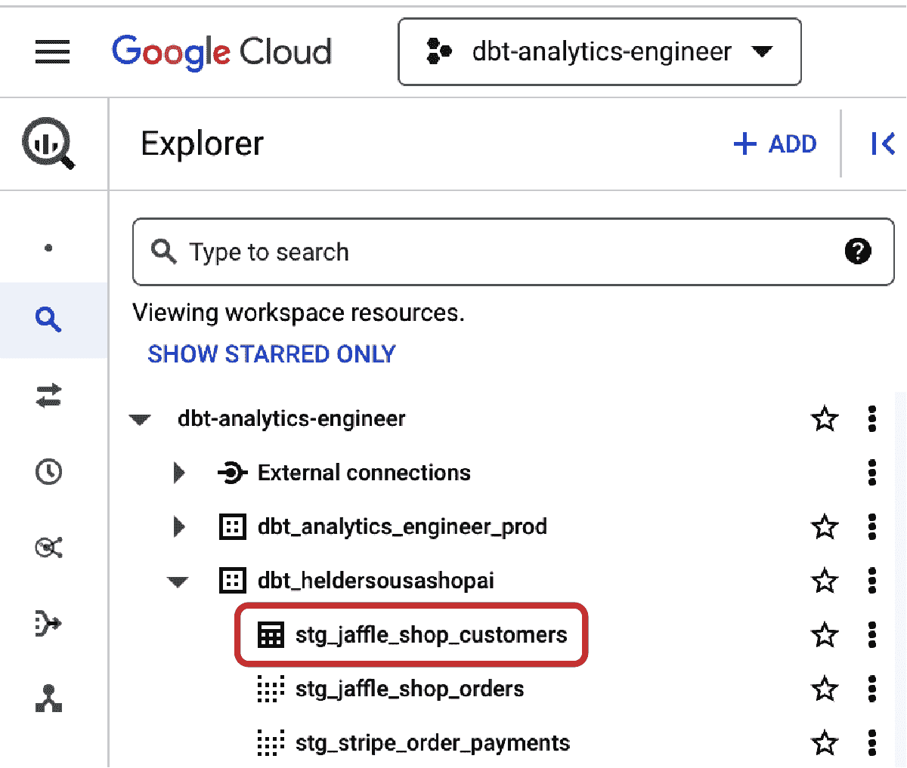
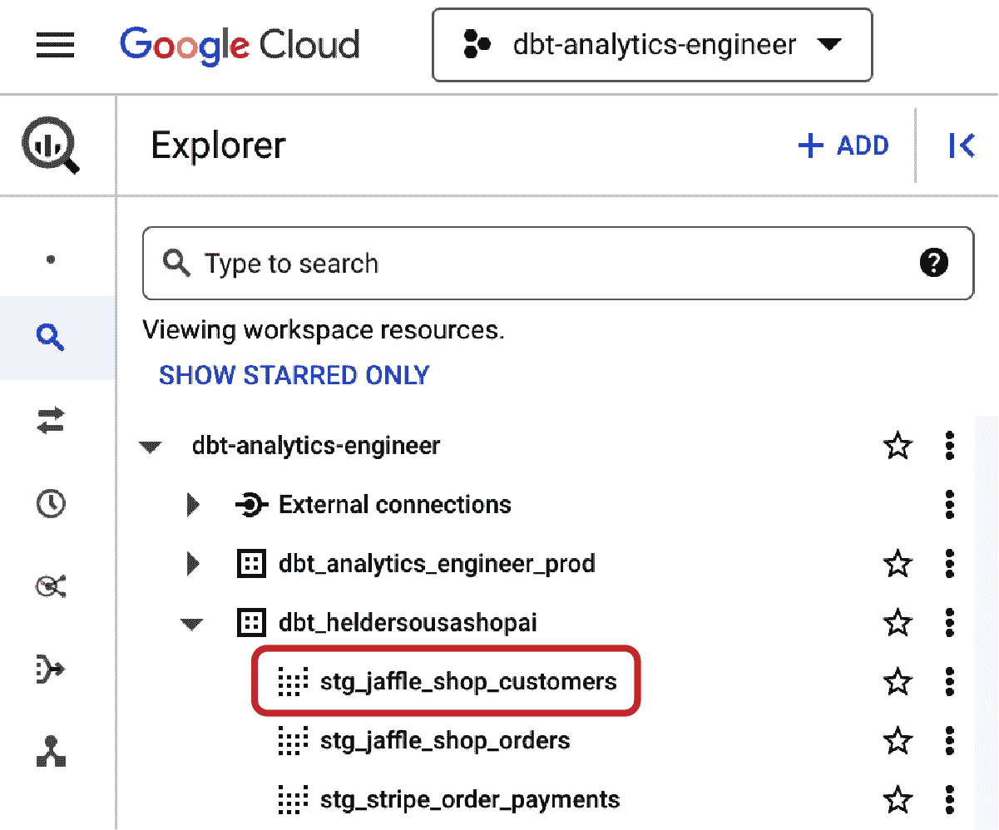
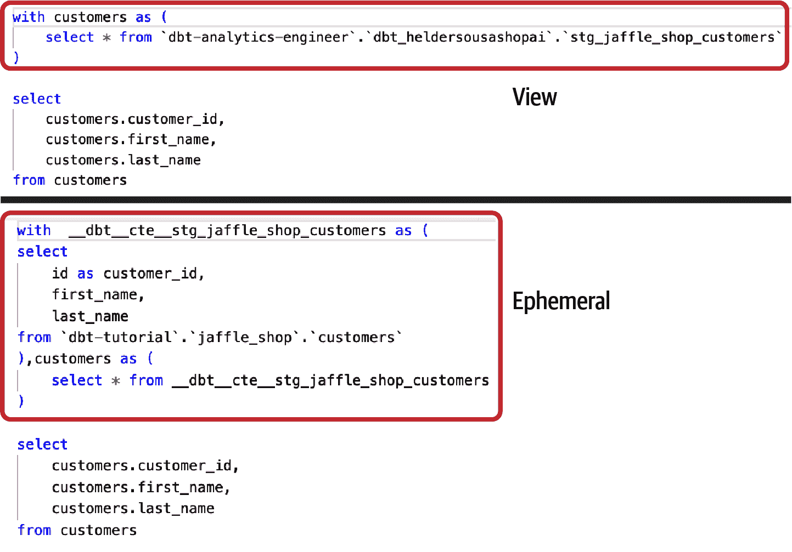
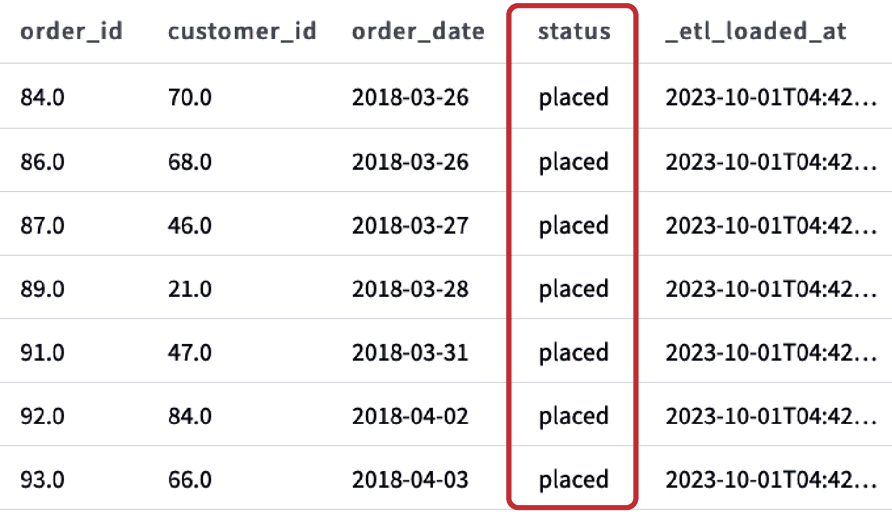
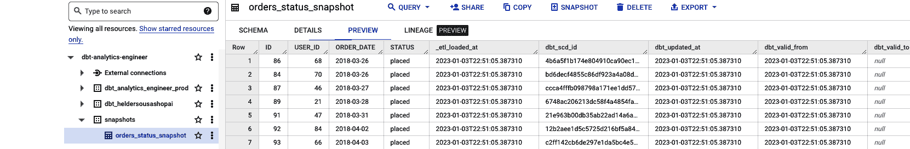
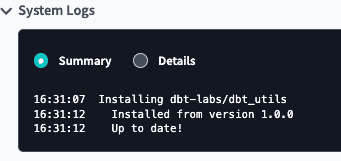

# 第五章：dbt 高级主题

dbt 是 ELT 过程中专注于转换部分的工具。只需具备 SQL 经验，我们便能利用这一工具开发所有的分析代码。与此同时，我们还可以将其封装在一套通常在软件工程中找到的最佳实践和标准下，例如测试开发、自动部署，甚至是在开发过程中并行构建文档。

在本章中，我们的 dbt 之旅将更加深入和微妙。我们将探索 dbt 中各种类型的模型物化。除了传统的视图和表之外，我们还将探索瞬时模型的潜力，利用物化视图，精确捕获数据快照，甚至使用增量模型，这些都可以使您摆脱重复的、资源密集型的完整数据加载。

但这还不是全部。我们将通过 Jinja、宏和包将您的分析代码提升到新的高度。我们的使命是转变您的代码库，使其更高效、更 DRY。在本章结束时，您将掌握提升分析工作流的知识和工具，从而更快、更精准地提供洞察力。

# 模型物化

*物化* 是在数据平台上持久化 dbt 模型的策略。在 dbt 中，物化可以通过减少即时计算查询和视图的需求，来提升数据模型的性能和可扩展性。

在 dbt 中，可以根据项目的需求和要求使用各种类型的物化。例如，您可以使用增量物化来存储仅需要增量更新的查询结果。此外，您还可以使用快照，它们与 dbt 中的物化类似，但具有独特的特征。快照用于在特定时间点存储查询或视图的结果，但快照不是 dbt 中的模型。它们被特意设计为非幂等，这使它们与 dbt 的大多数其他方面有所区别。

我们已经在 第四章 中使用了诸如视图和表之类的物化策略。然而，了解所有可用的物化类型非常重要，从瞬时模型到增量数据加载或甚至物化视图，这样您就可以在优化分析代码的同时充分利用它们，并为公司的数据消费者提供准确及时的响应。

## 表、视图和瞬时模型

我们一直在使用视图或表的物化来实现我们的模型。本章旨在深入探讨这两种物化类型并介绍临时模型。但让我们首先看一下 图 5-1，它展示了之前已经构建的 `dim_customers` 的当前谱系。在这个用例中，我们将通过更改 *stg_jaffle_shop_customers.sql* 模型的物化类型来测试各种物化策略。


###### 图 5-1\. `dim_customers` 数据谱系

让我们从表的物化类型开始。在 dbt 中，表是用于存储和组织数据的结构，由行和列组成；每一行代表一个记录或数据片段，而每一列则代表数据的特定属性或字段。当您选择这种类型的物化时，内部上，您正在参数化 dbt 以在您的数据平台中物理创建引用模型，并将数据存储在磁盘上；因此，构建速度会比较慢。通常，这些物化在 marts 层下游使用，并且在处理大量数据和需要快速响应的多个查询到我们的模型时推荐使用。

要测试表的物化，让我们再次修改您的 YAML 文件 *_jaffle_shop_models.yml*，将 `stg_jaffle_shop_customers` 模型的物化设置为`table`。如果您运行代码，应该与 BigQuery 中的 图 5-2 类似。



###### 图 5-2\. `stg_jaffle_shop_customers` 作为表物化

*视图* 是通过选择和组合来自一个或多个上游模型的数据而创建的虚拟表。视图本身不存储任何数据，而是在访问时从底层表中检索数据。通常，我们会在 dbt 中使用视图来简化复杂查询并促进整体转换过程，或者通过隐藏特定列或行的数据来提供安全性。当我们将一个模型设置为视图时，它将作为视图在您的数据平台中构建。存储在磁盘上的是查询本身，因此只有在运行时才捕获数据并执行转换，这可能导致查询响应时间较慢。

要测试视图的使用情况，请修改您的 YAML 文件 *_jaffle_shop_models.yml*，将 `stg_jaffle_shop_customers` 模型的物化设置为`view`。然后再次运行代码。这与 BigQuery 中的 图 5-3 应该是类似的。



###### 图 5-3\. `stg_jaffle_shop_customers` 作为视图物化

最后，我们有*临时*模型。dbt 在运行时构建这些临时数据模型，不在数据库中持久化存储它们。最好用临时模型进行轻量级数据操作或分析任务，这些任务不需要数据永久存储。选择这种策略时，要记住 dbt 将其解释为下游模型中的 CTEs，这可能会增加那些模型的构建时间。此外，如果滥用临时模型，调试代码时可能会带来一些复杂性，因为在数据平台中无法直接查询它们，因为它们在那里不存在。

要测试临时模型，并且遵循之前的示例，修改你的 YAML 文件 *_jaffle_shop_models.yml*，将`stg_jaffle_shop_customers`模型的实现设置为`ephemeral`。由于在这种情况下，你的数据平台中不会有实际的实现，看一下 `dim_product` 的编译代码。Figure 5-4 显示了使用视图和临时模型作为 `stg⁠_⁠j⁠a⁠f⁠f⁠l⁠e⁠_⁠shop_customers` 模型编译的代码之间的区别。



###### Figure 5-4\. `dim_customer` 代码编译，使用视图作为 `stg_jaffle_shop_customers` 模型的情况（顶部）和使用临时模型的情况（底部）

## 增量模型

在一个 dbt 项目中，*增量模型* 旨在处理源中仅有的新数据或更改的数据，而不是所有的数据。这些模型可以用来提高数据流水线的效率和速度，特别是在处理频繁更新的大型数据集时。

要测试增量模型，首先需要配置模型的 YAML 文件，将所需的模型设置为增量。我们将使用已创建的模型，`s⁠t⁠g​_⁠j⁠a⁠f⁠f⁠l⁠e⁠_⁠s⁠h⁠o⁠p_orders`，作为我们的测试案例。查看其 YAML 文件 *_jaffle_shop_models*，我们看到它被实现为`view`，如早期配置的那样。由于我们希望将其改为增量，改动是直接的，但我们还将其嵌入额外的能力，如`incremental_type`。因此，让我们使用 Example 5-1 的代码更新我们模型的 YAML 文件。

##### Example 5-1\. 增量模型，YAML 文件配置

```
version: 2

models:
  - name: stg_jaffle_shop_orders
    config:
      materialized: incremental
      incremental_strategy: merge
      unique_key: order_id
```

首先，我们将模型物化类型更改为 `incremental`。这是增量模型的核心和必选配置，使增量模型能够工作。与此同时，我们还包括了两个额外的配置项：`incremental_strategy: merge` 和 `unique_key: order_id`。这些配置帮助您优化和增强增量加载过程。增量策略被定义为 `merge`（在 dbt 中，您还有更多选项，如 `append` 或 `insert_overwrite`），每次增量运行将根据识别的唯一键将新行与现有行合并。在这种情况下，如果存在 `order_id` 的匹配项，则现有行将使用新信息更新。否则，如果没有匹配项，则创建新行。在标准的增量加载中，这两种情况同时发生。

最后一步是将模型代码排列，以使其与增量加载兼容。在 示例 5-2 中，您可以看到我们如何在我们的 `s⁠t⁠g⁠_​j⁠a⁠f⁠f⁠l⁠e⁠_⁠s⁠h⁠o⁠p⁠_⁠o⁠r⁠d⁠e⁠r⁠s` 模型中实现这一点。

##### 示例 5-2\. 增量模型，示例代码

```
select
    id as order_id,
    user_id as customer_id,
    order_date,
    status,
    _etl_loaded_at
from {{ source('jaffle_shop', 'orders') }}



  where _etl_loaded_at >= (select max(_etl_loaded_at) from {{ this }} )


```

通过分析查询，我们利用 Jinja 制作我们的增量模型。直接进入 `if` 语句，我们看到了 `is_incremental()` 宏的使用。如果正在运行的模型配置为 `materiali⁠z⁠e⁠d⁠=​'i⁠n⁠c⁠r⁠e⁠m⁠e⁠n⁠t⁠a⁠l'`，则此宏将返回 `true`，而 dbt 模型已存在且不在完全刷新模式下运行。`is_incremental()` 返回 `true`，在 `if` 代码块内部，我们有基于时间戳列 `_etl_loaded_at` 进行行过滤的 `where` 条件。它将此时间戳与当前表 (`{{ this }}`) 的最大 `_etl_loaded_at` 时间戳进行比较，有效地检查行的加载时间戳是否大于或等于当前表中的最大加载时间戳。

增量模型在优化 dbt 项目中的数据管道中扮演着至关重要的角色。它们的一大优势是成本效率。通过采用增量模型，您可以显著减少处理数据所需的计算资源。这种效率不仅加快了数据转换过程，还节省了成本，因为您无需重做不必要的工作。

此外，增量模型确保您的 dbt 项目始终使用最新的数据运行。这种与数据源的同步方式增强了分析的可靠性和准确性。无论您处理的是流数据还是周期性更新，增量模型都可以使您的分析洞察与数据变化同步。

## 物化视图

*物化视图* 本质上是专门设计用来将查询结果作为物理化表存储的数据库对象。它们的动态性质使其与普通表格有所区别；物化视图中的数据定期刷新，以反映底层数据集中的最新变化。这种刷新过程确保物化视图保持最新状态，无需重新处理，这使其在对低延迟数据访问至关重要时成为理想选择。

有趣的是，物化视图与 dbt 的增量模型分享了一些共同点，这种相似性并非巧合。在许多方面，物化视图可以被视为增量模型的继任者，提供了数据优化的另一种方法。根据项目的要求和所选的数据平台，您甚至可以考虑用物化视图模型替换所有增量 dbt 模型。这种转变简化了您的工作流程，消除了手动增量策略的需要，详细说明 dbt 应如何更新基表——数据平台无缝处理这些任务。

然而，认识到这一过渡带来的权衡是至关重要的。虽然物化视图提供了效率，但可能会导致对增量逻辑和编排的精细控制减少。通过委托数据平台定义更新逻辑和执行，您获得了便利性，但可能会失去增量模型可以提供的某些具体控制。

测试 dbt 物化视图的方法可能因您所用的数据平台而异。如果您使用的是 Postgres、Redshift、Databricks 或 BigQuery（在 dbt 1.7 中），并且假设您想保持对 `stg_jaffle_shop_customers` 模型的测试。在 *_jaffle_shop_models.yml* 文件中，将物化设置为 `materialized_view`，如示例 5-3 所示。

##### 示例 5-3\. 物化视图，YAML 文件配置

```
models:
  - name: stg_jaffle_shop_customers
    config:
      materialized: materialized_view
```

然而，如果您使用的是 Snowflake，概念稍有不同。Snowflake 没有物化视图的概念，而是有一个独特的概念：*动态表*。使用动态表的基本配置如示例 5-4 所示。

##### 示例 5-4\. 动态表，YAML 文件配置

```
models:
  - name: stg_jaffle_shop_customers
    config:
      materialized: dynamic_table
```

总之，物化视图是数据优化的一个重要组成部分，提供了性能改进和数据实时性的好处。它们的作用与 dbt 中的增量模型相交，为希望简化工作流程的数据工程师提供了选择，同时考虑控制和定制化的权衡。

## 快照

快照是在特定时间点保存的数据集的副本。通常，当我们的分析需要查看不断更新的表中的先前数据状态时，我们使用这些快照。例如，您可以使用快照跟踪数据集的历史，从而了解其随时间如何演变。此外，快照对于测试和调试也很有帮助，因为它们使您可以将数据集的当前状态与先前状态进行比较，以识别任何变化或差异。

dbt 快照通过在可变源表上应用类型 2 的慢速变化维度（SCDs）来实现。这些 SCD 标识表中行随时间变化的方式。让我们来看一个例子。使用 `jaffle_shop` 数据库，假设您想要记录订单状态的转换，以便监控和检查交货时间，并识别特定状态下的潜在瓶颈。通过查看 `stg_jaffle_shop_orders` 模型，我们可以看到在 Figure 5-5 中，我们已经有了订单状态，但我们需要查看订单在达到当前状态之前经历的所有状态的可见性。



###### Figure 5-5\. `stg_jaffle_shop_orders` 事务数据集

为了允许我们跟踪状态转换，我们首先需要保留快照，在 dbt 中，这些是在快照文件夹中的 *.sql* 文件中快照块内定义的 `select` 语句。因此，首先让我们在 *snapshots* 目录中创建一个名为 *snap_order_status_transition.sql* 的文件，并从 Example 5-5 中复制代码。

##### 示例 5-5\. snap_order_status_transition.sql 快照创建

```


{{
    config(
      target_schema='snapshots',
      unique_key='id',

      strategy='timestamp',
      updated_at='_etl_loaded_at',
    )
}}

select * from {{ source('jaffle_shop', 'orders') }}


```

在执行代码之前，让我们先概述这些配置的含义：

`target_schema`

这是 dbt 应该将快照表渲染到的模式。换句话说，dbt 允许您将快照存储在数据平台中与实际生产环境分开的不同模式中。这使您可以灵活地将它们取出并备份到另一个位置。您还可以利用这个字段与 `target_database` 的补充一起使用，将这些快照不仅存储在不同的模式中，还存储在不同的数据库中。

`unique_key`

典型情况下，这是记录的主键列或表达式。它必须指向一个唯一的键。

`strategy`

这指示使用的快照策略，可以是 `timestamp` 或 `check`。在前面的示例中，我们使用了 `timestamp` 策略。这是推荐的策略，因为它对于新列的添加是可扩展的。有时候时间戳不可靠，在这种情况下，我们可以使用 `check` 策略来比较一组列的当前值和历史值。

`updated_at`

当使用 `timestamp` 策略时，我们需要声明数据集中需要查看的列。

`check_cols`

仅在使用 `check` 策略时使用，这是 dbt 将需要检查以生成快照的列。

现在我们理解了这些配置代表什么，让我们执行快照并查看其输出。为此，在 CLI 中运行 **`dbt snapshot`**。成功完成后，查看 BigQuery。已创建一个名为 `snapshots` 的新模式，并实现了实际的快照材料化，如 图 5-6 所示。



###### 图 5-6\. BigQuery 内的 `snap_order_status_transition` 快照表

正如您所见，dbt 在您的数据平台内创建了名为 `orders_status_snapshot` 的快照，生成了四个额外的列：

`dbt_scd_id`

dbt 的内部使用，为每个记录快照生成一个唯一键。

`dbt_updated_at`

也在 dbt 的内部使用，这个字段是在插入这个快照行时源记录的`updated_at`时间戳。

`dbt_valid_from`

这个快照行首次插入的时间戳。可用于对记录的不同“版本”进行排序。

`dbt_valid_to`

当此行变为无效时的时间戳。如果记录仍然是最新/有效的记录，则会显示 `null`。

###### 注意

假设您希望继续探索快照的概念。在这种情况下，dbt 提供了详尽的文档，涵盖了我们在这里提到的内容以及额外的内容，如最佳实践和如何处理源系统中的硬删除。只需在 [dbt Developer Hub](https://docs.getdbt.com) 中搜索 [快照](https://oreil.ly/541Xm)。

# 使用 Jinja 的动态 SQL

Jinja 是一个广泛用于 Python 的模板语言，在 Web 开发中被广泛使用。它允许您通过使用变量和表达式创建动态的 HTML 页面，并轻松定制您网站的外观和行为。您还可以利用它来优化您的 SQL 代码，与 dbt 一起提升数据操作技能。

Jinja 的一个关键特性是能够将变量和表达式插入模板中，允许您为不同的用户或上下文创建定制模板，而无需将值硬编码到模板中。例如，您可能希望根据工作环境定义一些行为，比如在开发环境中限制数据量。对于这种情况，我们使用 dbt 中的 `target name` 属性，然后在我们的 SQL 代码中，通过利用 Jinja，我们可以定义处理它的规则，如 示例 5-6 所示。

##### 示例 5-6\. 带有 `target name` 属性的 Jinja 示例

```
select *
from {{ ref('fct_orders' )}}

-- limit the amount of data queried in dev

where order_date > DATE_SUB(CURRENT_DATE(), INTERVAL 3 MONTH)

```

请注意，我们正在使用 BigQuery 和 BigQuery 语法。如果您使用不同的数据平台，某些函数和语法可能会有所不同。现在，看看前面的代码，我们可以看到已经使用了一些 Jinja 标记：

``

用于语句，执行任何功能编程，如设置变量或开始`for`循环。在这个特定的例子中，我们使用了一个`if`语句，检查属性名是否与`prod`字段不同(`!=`)。

Jinja 还提供了一系列控制结构，如循环和条件语句，允许您创建更复杂的模板，以适应不同的数据和上下文。您可以使用循环来迭代项目列表，并动态生成 SQL 代码，而不是手动逐字段执行。

您可以使用您之前在示例 4-16 中创建的*i⁠n⁠t⁠_⁠p⁠a⁠y⁠m⁠e⁠n⁠t⁠_⁠t⁠y⁠p⁠e⁠_​a⁠m⁠o⁠u⁠n⁠t⁠_per_order.sql*模型来演示一个理想的例子。与手动编写每种类型的金额度量相比，您可以自动生成它们，并使其可扩展，处理当前和未来的支付类型。看看示例 5-7，看看我们如何利用 Jinja 来做到这一点。

##### 示例 5-7\. 使用动态 Jinja 的*i⁠n⁠t⁠_⁠p⁠a⁠y⁠m⁠e⁠n⁠t⁠_⁠t⁠y⁠p⁠e⁠_​a⁠m⁠o⁠u⁠n⁠t⁠_per_order 模型

```
{# declaration of payment_type variable. Add here if a new one appears #}


with

payments as (

   select * from {{ ref('stg_stripe_order_payments') }}

),

pivot_and_aggregate_payments_to_order_grain as (

   select
      order_id,
      

         sum(
            case
               when payment_type = '{{ payment_type }}' and
                    status = 'success'
               then amount
               else 0
            end
         ) as {{ payment_type }}_amount,

      
      sum(case when status = 'success' then amount end) as total_amount

   from payments

   group by 1

)

select * from pivot_and_aggregate_payments_to_order_grain
```

前面的代码是 Jinja 的更复杂用法，包括循环和变量声明，但一旦编译完成，它看起来与示例 5-6 中的代码结果非常相似。现在，如果我们想考虑一个新的支付类型，而不是手动创建一个新的度量标准，我们需要将其添加到代码顶部声明的`payment_types`列表中。

让我们讨论我们可以在示例 5-7 中找到的 Jinja 细微差别：

``

总结一下，这用于语句。在这种情况下，我们在两个不同的地方使用了它，不同于示例 5-6：

`set payment_types= ['cash','credit']`

这声明了后面代码中将要使用的`payment_types`变量。在这种情况下，它是一个包含两个元素（现金和信用卡）的列表。

`for payment_type in payment_types`

在这里，我们迭代在代码顶部声明的不同`payment_types`。逐行，我们将开始动态构建我们的代码。

`{{ …​ }}`

这用于表达式以打印到模板输出。在我们的示例中，我们使用它为`{{ payment_type }}`，即与`amount`字符串连接以生成每种支付类型的最终度量名称。此外，我们还在表达式上使用了实际的度量计算：`when payment_type = '{{ payment_type }}' and status = 'success'`。

`{# … #}`

用于注释，这使您可以内联文档化您的代码。

空格

这是代码中另一个小但重要的细节。您可以通过在 Jinja 分隔符的两侧使用连字符``来控制它们，这将修剪该表达式的两侧之间的空白。

###### 提示

我们建议探索专门的课程或参考官方[Jinja 模板设计文档](https://oreil.ly/U2gye)，以全面了解 Jinja。这些资源可以提供有价值的见解，并帮助你深入了解 Jinja 的功能。

# 使用 SQL 宏

*宏*是在 dbt 项目中用于自动化任务和流程的可重用代码片段。它们通过允许你自动化重复或复杂的任务，如查询、数据操作和数据可视化，提高了生产效率。开发完成宏后，你可以通过手动、自动或响应用户输入的方式调用和触发它们。

在 dbt 项目中，宏通常在单独的文件中定义，放在*macros*目录中，并使用 Jinja 语法编写。将宏与模型分开允许在项目中的多个模型和其他文件中使用它们。它还允许使用变量和表达式定制宏，使宏能够根据来自特定模型的参数进行调整。

要在 dbt 项目中使用宏，通常你会使用 Jinja 语法调用宏并传递任何必要的参数或选项。宏还可以与其他 dbt 功能（如视图）和其他宏交互，以创建更复杂和健壮的解决方案。例如，你可以使用宏自动刷新数据模型、以特定方式过滤或转换数据，或基于数据生成报告或图表。

让我们尝试创建我们的第一个宏。我们最初的用例很简单：创建一个可以对两个数字求和的宏。记住，你的宏需要使用 Jinja 语法。首先，在你的 dbt 项目中的*macros*目录中创建一个名为*macro_sum_two_values.sql*的宏文件。示例 5-8 展示了你的代码应该是什么样子的。

##### 示例 5-8\. macro_sum_two_values.sql

```

    select {{ x + y }}

```

现在我们来测试它。然后，在你的 dbt 项目中的新文件中，你可以通过调用宏并传入所需的`x`和`y`值来使用宏，如示例 5-9 所示。

##### 示例 5-9\. 在 macro_sum_two_values.sql 内触发宏

```
{{ sum(13, 89) }}
```

示例 5-9 将在触发宏时将宏的结果（102）显示在输出窗口中。你也可以将变量或表达式作为参数传递给宏，而不是硬编码的值。看看示例 5-10，它必须产生与前一个示例相同的输出。

##### 示例 5-10\. 在 macro_sum_two_values.sql 内触发宏，并在顶部定义变量

```


{{ sum(x, y) }}
```

在 dbt 项目中使用 Jinja 的宏允许您灵活和强大地重复使用代码并自定义您的模型。但现在，让我们举个例子来使用宏。使用`jaffle_shop`数据库，我们想要处理的第一个用例是一个宏，用于集中支付类型配置，以避免在每个模型中重新定义它，就像我们在*int_payment_type_amount_per_order.sql*的新版本中所做的那样。为此，在*macros*目录中，创建一个名为*get_payment_types.sql*的新文件，并复制示例 5-11 的代码。

##### 示例 5-11\. get_payment_types.sql 宏

```

    {{ return(["cash", "credit"]) }}

```

然后，在您的*int_payment_type_amount_per_order.sql*模型中，用来自示例 5-12 的代码替换顶部声明的`payment_types`变量。

##### 示例 5-12\. int_payment_type_amount_per_order.sql 中的`*payment_types*`变量声明调用了`*get_payment_types()*`宏。

```

```

现在您可以为其他用例使用您的宏，但请考虑以下内容：

+   通常，宏带有参数，因此尽管示例 5-11 是一个宏，但它并不代表您将构建的典型宏。参数指调用或执行宏时传递的值。这些参数可用于修改宏的行为，例如指定输入数据源、定义自定义配置设置或设置某些参数或标志。

+   在示例 5-11 中，我们使用了`return`函数来返回一个列表——没有这个函数，宏将返回一个字符串。

查看您的操作，示例 5-11 中的宏似乎并不是非常强大或静态。我们如何优化它以避免依赖手动输入？我们可以采取以下措施来解决这些问题：

+   理解源数据，我们可以动态提取支付类型。

+   重新思考具有模块化思维方式的宏。

我们可以使用从示例 5-13 获取的以下查询来解决第一个问题。

##### 示例 5-13\. 获取不同支付类型的查询

```
    select
        distinct payment_type
    from {{ ref('stg_stripe_order_payments') }}
    order by 1
```

正如您所见，如果运行查询，它具有不同的付款类型，因此为了从中制作宏，请将示例 5-14 中的代码复制到您的*get_payment_types.sql*文件中。

##### 示例 5-14\. 使`*get_payment_types*`更具动态性和可扩展性的新版本

```

    
    select
        distinct payment_type
    from {{ ref('stg_stripe_order_payments') }}
    order by 1
    

    

    
    {# Return the first column #}
    
    
    
    

    {{ return(results_list) }}


```

让我们看看我们做了什么：

1.  在顶部，我们声明了查询`payment_type_query`。

1.  就在那之后，我们使用`run_query`函数执行并将输出存储在`results`变量中。

1.  然后，我们检查了 Jinja 是否处于`execute`模式——这意味着正在执行 SQL——如果是这样，我们将数据集的第一列结果存储在`results_list`中。这个第一列将具有不同的值。

1.  最后，我们返回`results_list`变量以在我们的模型中使用。

现在，如果我们再次编译 *int_payment_type_amount_per_order.sql* 模型，不应有任何变化。然而，您已实现了更可扩展的代码。此时，不需要手动输入一旦新的支付类型出现。但是，我们可以通过模块化做得更多。想象一下，您希望在 dbt 项目的其他地方使用类似的模式（例如支付方法）。在那种情况下，我们可以做一些类似 Example 5-15 的事情。

##### Example 5-15\. 为不同情景重复使用我们的代码

```
{# Generic macro to give a column name and table, outputs
the distinct fields of the given column name #}



    select distinct
    {{ column_name }}
    from {{ table_name }}
    order by 1





{# Return the first column #}





{{ return(results_list) }}



{# Macro to get the distinct payment_types #}


{{ return(get_column_values('payment_type', ref('stg_stripe_order_payments'))) }}



{# Macro to get the distinct payment_methods #}


{{ return(get_column_values('payment_method', ref('stg_stripe_order_payments'))) }}


```

通过分析这段代码，我们可以看到三个宏。第一个 `get_column_values()` 接收 `column_name` 和 `table_name` 作为参数，并动态生成一个执行查询的查询语句，返回提供的 `column_name` 的不同值。接下来，我们分别调用该宏两次，使用 `get_payment_types()` 宏检索不同的 `payment_types`，并使用 `get_payment_methods()` 宏检索不同的 `payment_methods`。还请注意，宏文件名已更改为 *get_distinct_by_column.sql*，以使其更加透明，考虑到其目的。

上述示例展示了如何使用宏的有趣演示，但它们在许多其他情况下也很有用。另一个很好的例子是有一个宏，动态验证我们是否处于开发或部署环境中，然后自动过滤我们的数据集。为此，在 *macros* 目录中，创建一个名为 *limit_dataset_if_not_deploy_env.sql* 的新宏，并复制来自 Example 5-16 的代码。

##### Example 5-16\. `*limit_dataset_if_not_deploy_env*` 宏

```
{# Macro that considering the target name,
limits the amount of data queried for the nbr_months_of_data defined #}

-- limit the amount of data queried if not in the deploy environment.

where {{ column_name }} > DATE_SUB(CURRENT_DATE(), INTERVAL {{ nbr_months_of_data }}
 MONTH)


```

然后，在 `fct_orders` 模型中，在左连接之后的底部包含来自 Example 5-17 的代码。

##### Example 5-17\. 从 `*fct_orders*` 调用 `*limit_dataset_if_not_deploy_env*` 宏

```
with orders as  (
    select * from {{ ref('stg_jaffle_shop_orders' )}}
),

payment_type_orders as  (
    select * from {{ ref('int_payment_type_amount_per_order' )}}
)

select
    ord.order_id,
    ord.customer_id,
    ord.order_date,
    pto.cash_amount,
    pto.credit_amount,
    pto.total_amount,
    case
        when status = 'completed'
        then 1
        else 0
    end as is_order_completed

from orders as ord
left join payment_type_orders as pto ON ord.order_id = pto.order_id
-- Add macro here
{{- limit_dataset_if_not_deploy_env('order_date', 3) }}
```

现在编译代码。如果您处于开发环境，则您的 *fct_orders.sql* 模型应显示一个新的过滤器，`where order_date > DATE⁠_⁠S⁠U⁠B​(⁠C⁠U⁠R⁠R⁠E⁠N⁠T_DATE(), INTERVAL 3 MONTH)`。换句话说，在开发环境中，该过滤器仅允许您处理过去三个月的数据；否则，收集整个数据集。在开发环境中仅查看 *N* 个月的数据将大幅减少数据平台的开销，同时，您仍然可以使用一个良好的数据子集来开发和测试代码。如果不是这种情况，您可以增加为 12、24 或甚至 36 个月。

最后，重要的是提到 dbt 的适应性，能够定制其核心宏的能力。这些宏提供了一些 dbt 的核心功能，为常见任务提供了预定义模板。一个突出的例子是 `generate_schema_name` 宏。该宏负责为您的 dbt 模型制定模式名称。真正了不起的是，您可以调整它，使其与项目独特的命名约定无缝对接。想象一下，轻松生成与您组织的数据结构相匹配的模式名称。

定制这些核心宏不仅仅是技术上的壮举。它是改变游戏规则的方法，使您能够发挥 dbt 的能力，释放出根据项目需求精确制定数据转换流程的潜力。

总之，在 dbt 项目中使用宏可以是自动化和定制数据模型和流程的强大高效方式。宏使您可以轻松重用代码，并使您的模型适应不同的上下文和需求。使用 Jinja 语法，您可以创建灵活且易于维护的宏，可以以各种方式调用和触发。总体而言，宏可以帮助您提高生产力，创建更强大和可扩展的数据模型。

# dbt 包

*包*是组织和共享代码和资源的一种方式，例如已编写的模型和宏，在 dbt 项目中。它们允许您将项目结构化为逻辑单元，并在多个模型和文件中重复使用代码和资源。

在 dbt 项目中，包定义在 *packages.yml* 文件中，安装在 *dbt_packages* 目录中，并使用目录和文件的层次结构进行组织。每个包可以包含与特定主题或功能相关的模型、测试、宏和其他资源。

在 dbt 项目中，包可以用多种方式使用。例如，您可以使用包来执行以下操作：

将项目组织成逻辑单元

包可以帮助您以直观且易于理解的方式结构化项目，将相关模型、测试和其他资源组合在一起。

重复使用代码和资源

包允许您在多个模型和文件之间重复使用代码和资源，节省时间并减少维护开销。

封装功能

包可以帮助您封装特定功能，并隐藏项目其他部分的实现细节，使您的项目更模块化且易于理解。

与他人分享代码和资源

包可以与其他用户或项目共享，这使您可以利用他人的工作，并通过贡献自己的代码成为社区的一部分。

总体而言，包是 dbt 的一个有价值的功能，可以帮助你在项目中组织、重用和共享代码和资源。你可以从三个不同的地方安装 dbt 包：公共包集、Git 或本地目录。在本节中，我们将介绍如何安装包，并展示它们的使用示例。我们将使用一个最常见的包 `dbt_utils`，但请注意，还有许多优秀的包可以使用。你可以在 [dbt Hub](https://hub.getdbt.com) 找到大量的包或直接从 GitHub 导入它们。

## 安装包

安装一个包在一个 dbt 项目中是一个直接的过程，可以帮助你利用他人的工作并为你的项目添加新功能。我们之前已经概述了，但让我们进一步讨论安装包。

安装包的逐步指南如下：

1.  如果你还没有创建 *packages.yml* 文件，请创建一个。这个文件是你将要在你的 dbt 项目中配置需要安装的 dbt 包的地方。

1.  将包添加到你的 *packages.yml* 文件中：在你的 dbt 项目中打开文件，并为你想要安装的包添加一个条目。请注意，在安装包之前，确保你的 dbt 项目符合包可能具有的任何要求或依赖关系是非常重要的。这些可能包括特定版本的 dbt 或其他包，以及系统或软件要求。

1.  在终端中运行 **`dbt deps`** 命令来安装包及其依赖项到你的 dbt 项目中。

1.  测试包以确保它正常工作。你可以运行 **`dbt test`** 命令并验证包的模型和测试是否通过。

让我们尝试安装一个最常见的可用包：[`dbt_utils`](https://oreil.ly/W-rZN)，你可以在 [dbt Hub](https://hub.getdbt.com) 找到它。通常，使用公共包集中将为你提供必须放在你的 *packages.yml* 文件中特定 dbt 包的所有配置，从而实现更顺利的安装。因此，要安装 `dbt_utils`，请将配置从 示例 5-18 复制到你的 *packages.yml* 文件中。

##### 示例 5-18\. `*dbt_utils*` 包配置

```
packages:
  - package: dbt-labs/dbt_utils
    version: 1.1.1
```

保存你的 YAML 文件，并在你的 CLI 中运行 **`dbt deps`**。如果你收到像 图 5-7 中显示的成功消息，一切应该没问题。稍后在本章中，我们将使用 `dbt_utils` 来查看一切是否运行如预期。



###### 图 5-7\. `*dbt_utils*` 安装后日志中的成功消息

###### 注意

如果您在使用 dbt 版本时遇到包不兼容问题，请确保您正在运行与您想要使用的包兼容的 dbt 版本。查看包的文档或存储库，了解支持的 dbt 版本信息。您也可以更新包版本以与您的 dbt 版本兼容。最后，您还可以选择其他提供类似功能并与您的 dbt 版本兼容的包作为解决方案。

## 探索 `dbt_utils` 包

首先，让我们介绍一下我们将用于示例的包：`dbt_utils`。这个包由 dbt 的创建者 dbt Labs 开发和维护。它包含一系列实用函数、宏和其他资源，可以扩展和增强 dbt 项目的功能。

这里有一些包含在 `dbt_utils` 包中的资源类型示例：

+   用于执行常见任务的辅助函数，如生成列列表、格式化日期和时间戳以及处理空值

+   自定义数据类型用于更具表现力和灵活性地表示数据，例如数组、范围和间隔

+   用于您的 dbt 项目的调试和测试工具，如日志记录函数和测试框架

+   用于执行各种任务的宏和模型，如数据操作、可视化和测试

总之，`dbt_utils` 是一个有助于 dbt 用户通过各种方式扩展和定制其项目的有用包。它正在不断更新和扩展，以包含新功能和资源。

## 在宏和模型内部使用包

在 dbt 项目中，您可以在宏中使用包来访问其他宏、模型、测试和包中定义的其他资源。这使您可以在多个模型和文件中重用代码和资源，模块化您的项目，并因此编写更干净的代码（DRY）。

一旦安装了包，在我们“安装包”中概述的步骤后，您可以通过在包名称前加上前缀并按照特定语法使用其宏来访问其宏，如示例 5-19 所示。

##### 示例 5-19\. 示例宏调用

```
{{ package.my_macro() }}
```

使用 `dbt_utils`，我们可以在数据库中生成一系列数字或日期，这对于各种用例非常有用。但让我们看一个实际的例子。让我们尝试一下 `date_spine()` 宏。复制来自示例 5-20 的代码并执行它。

##### 示例 5-20\. `*date_spine*` 宏位于 `*dbt_utils*` 内部。

```
{{ dbt_utils.date_spine(
    datepart="day",
    start_date="cast('2023-01-01' as date)",
    end_date="cast('2023-02-01' as date)"
   )
}}
```

期望输出是从 2023 年 1 月 1 日到 2023 年 2 月 1 日之间的日期列表，但不包括 2 月 1 日。`date_spine` 宏是一个有效且灵活的函数，可以帮助您处理日期、生成日期序列或执行涉及日期的其他任务，例如在分析模型中创建 `dim_date` 维度。

另一个用例是在您开发的模型中直接使用已安装的包。例如，假设您想计算 `cash_amount` 在特定订单中所占的百分比，但需要确保在 `total_amount` 为 0 的订单中，您的代码不会因除以零而报错。您当然可以自行实现这个逻辑，但 `dbt_utils` 已经有一个内置函数可以处理此问题。让我们来看看在 Example 5-21 中的代码。

##### Example 5-21\. `*safe_divide*` 宏在 `*dbt_utils*` 内部

```
select
    order_id,
    customer_id,
    cash_amount,
    total_amount,
    {{ dbt_utils.safe_divide('cash_amount', 'total_amount') }}
from {{ ref('fct_orders') }}
```

此代码使用 `safe_divide` 宏将分子 `cash_amount` 除以分母 `total_amount`，并将结果存储在名为 `result` 的变量中。如果分母为 0 或 null，则 `safe_divide` 宏将返回 `null` 而不是引发错误。

`safe_divide` 宏非常适合在 dbt 项目中执行除法操作，特别是在处理可能包含 null 或 0 值的数据时。它可以通过消除手动检查 null 或 0 值的需要，节省时间并减少维护开销。

dbt 包是一种多功能工具，可帮助您构建更好、更高效的数据转换管道。在本章中，我们介绍了 `dbt_utils`，它提供了一组有用的宏和函数，简化了常见的数据建模任务，是您工具包的宝贵补充。另一个有趣的包是 [`dbt_expectations`](https://oreil.ly/p0Gmi)，它使您能够定义、记录和测试数据期望，确保数据质量和可靠性。此外，[`dbt_date`](https://oreil.ly/LFm4q) 简化了数据模型中与日期相关的计算和操作。通过利用这些包和其他工具，您可以简化代码共享和协作，减少重复劳动，并创建更可扩展和可维护的数据模型。

# dbt 语义层

在数据分析中，*语义层* 发挥着关键作用，充当原始数据与有意义洞察之间的桥梁。这种逻辑抽象是一个决策性的翻译器，简化复杂的数据结构，并促进组织内对数据的共同理解。这样做将复杂的数据库设置转化为用户友好的语言，赋予数据分析师到业务领导层等广泛观众轻松访问和理解数据的能力。除了简化外，语义层还提供数据的完整性和可靠性，确保数据可理解和可信任。

dbt 语义层的精髓在于，它从根本上区别于传统的语义层。在许多语义层中，用户通过明确指定左右连接键来描述数据中的连接关系。然而，dbt 语义层规范采用了一种独特的方法，引入了*实体*的概念。这些实体使我们能够在该层内自动推断数据连接，即图中的边。例如，考虑一个顾客表，其主键为`customer_id`，以及一个带有`customer_id`实体作为外键的订单表——这可以形成一个关系，或者更准确地说，是我们数据图中的一条边。这种创新显著减少了手动逻辑维护的需求，因为一个图通常具有比节点更少的边。

这种方法的美妙之处在于其简洁性和效率。它以极其 DRY 的方式封装语义逻辑，促进更广泛的度量和维度组合，以及更清晰的 SQL。这些优势使得数据团队更容易监督、演化和利用他们的数据模型。

在 dbt 语义层的核心是两个基本组件：语义模型和度量。*语义模型*是构建基础，包括三个关键元素：实体、维度和度量，用于创建度量标准。这些组件赋予了 MetricFlow 框架，即支持我们语义层的框架，构建查询以定义度量标准的能力。

*度量*则是我们用来衡量和分析数据的工具。它们位于语义模型之上，能够基于可重用组件创建复杂和精细的定义。

正如先前提到的，语义层依赖于三个基本概念来创建度量标准：实体、维度和度量。

*实体*指的是特定上下文中独立且可识别的对象。在数据库的术语中，实体通常对应于表，作为我们数据收集工作的核心主体。实体代表业务中的现实概念，例如顾客或订单。在我们的语义模型中，实体使用 ID 列表示，这些列作为连接键与语义图中的其他语义模型连接。

实体在帮助语义引擎理解表或数据集之间关系中至关重要。这使引擎能够理解数据如何相互连接，确保在查询特定实体相关信息时，引擎知道从哪里检索相关信息。

另一方面，*维度*通过作为分类属性来为度量提供上下文，允许在分析过程中以不同方式对数据进行分解。维度通常描述模型中其他元素相关的特征。

维度被配置为增强用户从不同角度探索和分析数据的能力。语义引擎利用这些维度根据用户的偏好定制查询。

最后，*度量* 是分析的主要关注点的可量化数据点，代表我们打算检查的度量。度量通常会被聚合，而在许多情况下，BI 工具的一个基本作用就是跨多个维度聚合这些度量。度量的定义确保计算在所有查询和报告中保持一致，消除任何语义模糊。

让我们来说明如何构建一个 dbt 语义层。我们将继续使用客户和订单实体的示例。我们希望衡量支付的总金额（`total_amount`），并分别列出现金支付金额（`cash_amount`）和信用支付金额（`credit_amount`）。最后，我们还希望知道订单总数（`order_count`）以及有订单的客户数量（`customers_with_orders`）。我们还希望了解每天的滑动能力（`order_date`）以及订单是否完成（`is_order_completed`）。

考虑到这些要求，完整的语义模型显示在 示例 5-22 中。您可以将其添加到先前创建的相应 YAML 文件 *_core_models.yml* 中，或者为语义模型创建一个新文件。

##### 示例 5-22\. 用于语义模型的 YAML 文件配置

```
semantic_models:
  - name: orders
    description: |
      Order fact table. This table is at the order grain with one row per order.
    model: ref('fct_orders')

    entities:
      - name: order_id
        type: primary
      - name: customer
        type: foreign
        expr: customer_id
    dimensions:
      - name: order_date
        type: time
        type_params:
          time_granularity: day
      - name: is_order_completed
        type: categorical
    measures:
      - name: total_amount
        description: Total amount paid by the customer with successful payment
          status.
        agg: sum
      - name: order_count
        expr: 1
        agg: sum
      - name: cash_amount
        description: Total amount paid in cash by the customer with successful
          payment status.
        agg: sum
      - name: credit_amount
        description: Total amount paid in credit by the customer with successful
          payment status.
        agg: sum
      - name: customers_with_orders
        description: Distinct count of customers placing orders
        agg: count_distinct
        expr: customer_id
```

转向最后阶段，所有先前涵盖的组件都需要语义引擎的参与来使它们操作化。这个引擎在解释提供的数据并根据这些定义构建分析查询方面发挥了基础作用。例如，即使在详细指定客户订单的所有方面之后，我们仍然依赖于一个引擎来解析语义模型并生成计算所需度量的查询。在 dbt 的领域内，MetricFlow 实现了这一功能。

语义引擎的概念类似于 dbt 文档引擎。当您为一个模型创建一个 YAML 文件时，它本身是惰性的，缺乏显著的功能。然而，dbt 文档引擎将这些数据转化为实用工具，包括文档网站、dbt 测试、警报系统、数据合同等等。类似地，MetricFlow 作为 dbt 语义引擎运作，利用其解释语义数据和生成有价值结果的能力，特别是标准化和可重用的分析查询。

要使用 MetricFlow 生成分析查询，初始步骤包括基于您精心构建的语义模型建立度量。您可以在与语义模型相同的 YAML 文件中定义度量，也可以创建一个新文件。

为了说明指标创建的过程，让我们首先澄清我们打算开发的具体指标。为了保持简单同时保持趣味性，包括计算订单总金额 (`order_total`) 的指标是值得的。此外，我们可以创建另一个跟踪下订单数量 (`order_count`) 的指标。最后，我们将探索一个基于下订单数量的指标，过滤指标本身，显示完成的订单占比。示例 5-23 提供了一个 YAML 文件，演示了这些指标的正确配置。

##### 示例 5-23\. 指标 YAML 文件配置

```
metrics:
  - name: order_total
    description: Sum of total order amount.
    type: simple
    label: Order Total
    type_params:
      measure: total_amount
  - name: order_count
    description: Count of orders.
    label: Orders
    type: simple
    type_params:
      measure: order_count
  - name: completed_orders
    description: Count of orders that were delivered
    label: Delivered Orders
    type: simple
    type_params:
      measure: order_count
    filter: |
      {{ Dimension('order_id__is_order_completed') }} = true
```

举个例子，要让 MetricFlow 在 `order_total` 上工作，使用 CLI 命令 `mf query --metric order_total`。MetricFlow 将根据这个定义以及度量的定义（在语义模型中概述）生成查询，详见 示例 5-24。

##### 示例 5-24\. 订单总额查询

```
SELECT SUM(total_amount) as order_total
FROM fct_orders
```

###### 注意

虽然本章旨在展示 dbt 内的语义层的工作原理，但请注意，在 `mf query` 方面，组织范围内可能有更好的选择。为了在整个组织中更广泛且更强大地使用，考虑使用 dbt 提供的 API。此外，我们建议参考 [“设置 dbt 语义层” 页面](https://oreil.ly/UaZbt) 获取语义层和 MetricFlow 的最新安装指南，因为它定期更新以反映最新信息和发展。

在建立了 dbt 语义层之后，您有效地创建了一个数据的抽象层。无论对订单数据集进行了任何修改，任何想要获取订单总金额的人都可以轻松访问 `order_total` 指标。这使用户能够根据他们的具体需求分析订单数据。

# 概要

在本章中，我们深入探讨了 dbt 世界中的高级主题，扩展了我们对这个变革性工具的理解。我们探讨了 dbt 模型和材料化的威力，揭示了它们如何使我们能够管理复杂的数据转换，同时确保高效的性能优化。使用 Jinja 动态 SQL 允许我们创建动态和可重用的查询，适应不断变化的需求，从而增强了我们数据处理的灵活性。

超越基础知识，我们介绍了 SQL 宏，解锁了我们代码库中自动化和可重用性的新水平。通过深入的示例，我们看到了 SQL 宏如何极大地简化我们的代码并为数据转换带来一致性。

此外，dbt 包的概念作为我们数据生态系统中协作和知识共享的基石出现。我们讨论了 dbt 包如何允许我们封装逻辑、最佳实践和可重复使用的代码，促进协作文化并加速开发周期。

最后，我们展示了 dbt 语义层如何通过为数据提供抽象层来增强您的分析解决方案。这一层确保了所有报告和分析的一致性和准确性，因为业务逻辑在语义层中是集中和验证的，从而最小化了差异或错误的风险。此外，随着数据库的扩展或经历修改，拥有语义层使您可以在单一位置进行调整，无需单独更新多个报告或查询。

在结束本章时，我们已经深入探讨了各种高级 dbt 主题，装备了优化数据流程所需的知识和工具。这些高级概念提升了我们的数据转换能力，并使我们能够将数据分析提升到前所未有的高度。凭借这些见解，我们在处理数据挑战的复杂性同时促进了数据驱动的创新。

然而，需要注意的是，尽管本指南全面介绍了 dbt，但 dbt 的宇宙是广阔且不断发展的。还有一些值得探索的附加主题，例如高级部署技术，比如蓝/绿、金丝雀或阴影部署。此外，深入研究 Write-Audit-Process（WAP）模式的使用可以为团队提供对数据质量和可追溯性更大的控制。同时，探索 dbt 如何与数据生态系统中的其他工具交互将非常有价值，以及如何与多项目组织合作。确实，dbt 是一个充满活力和广阔的世界；在这个激动人心的数据旅程中，总是有更多可以学习和发现的内容。
