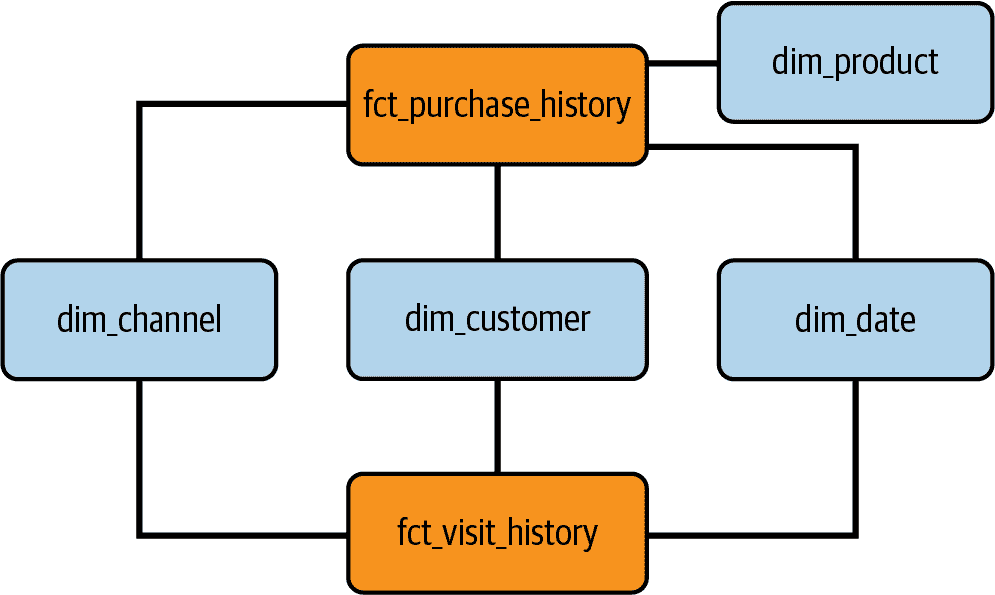

# 第六章：构建端到端的分析工程用例

欢迎来到我们关于使用 dbt 和 SQL 进行分析工程的书的最后一章。在前面的章节中，我们涵盖了将原始数据转化为可操作见解的各种概念、技术和最佳实践。现在是时候把这些主题整合起来，开始一个实用的旅程，构建一个端到端的分析工程用例。

在本章中，我们将探讨从头开始设计、实施和部署全面的分析解决方案。我们将充分利用 dbt 和 SQL 的潜力，构建一个强大和可扩展的分析基础设施，并且在操作和分析目的上使用数据建模。

我们的主要目标是展示本书涵盖的原则和方法如何实际应用于解决现实世界的数据问题。通过结合在前几章中获得的知识，我们将构建一个涵盖数据生命周期所有阶段的分析引擎，从数据摄入和转换到建模和报告。在整章中，我们将解决实施过程中常见的挑战，并提供如何有效克服这些挑战的指导。

# 问题定义：全渠道分析案例

在这个挑战中，我们的目标是通过在多个渠道上提供无缝和个性化的互动来增强客户体验。为了实现这一目标，我们需要一个全面的数据集，捕捉有价值的客户洞察。我们需要客户信息，包括姓名、电子邮件地址和电话号码，以构建一个强大的客户档案。跟踪客户在网站、移动应用和客户支持等渠道上的互动至关重要，以了解他们的偏好和需求。

我们还需要收集订单详细信息，包括订单日期、总金额和付款方式，以分析订单模式，并识别跨销售或交叉销售的机会。此外，包括产品信息如产品名称、类别和价格，将使我们能够有效地定制我们的营销活动和促销活动。通过分析这些数据集，我们可以发现有价值的见解，优化我们的全渠道策略，增强客户满意度，并推动业务增长。

# 操作数据建模

在我们追求整体方法的过程中，我们从操作步骤开始我们的旅程。通过这种方式，我们旨在为后续步骤打下坚实的基础。我们的方法涉及使用精心记录的管理数据库需求，这将指导我们。根据行业最佳实践，我们将认真遵循三个关键步骤——概念建模、逻辑建模和物理建模——来精心构建我们的数据库。

请记住，我们选择了广度优先策略，涵盖了所有步骤，但在细节方面并不深入。因此，请将其视为一种学术练习，具有简化的要求，旨在让您更好地理解构建操作数据库过程，而不是全面的过程。

## 概念模型

正如我们之前描述的，第一步，即概念建模阶段，使我们能够对数据库内部结构及其关系进行概念化和定义。这包括识别关键实体、它们的属性及其关联。通过仔细分析和与利益相关者的合作，我们将捕捉管理系统的本质，并将其转化为简明和全面的概念模型（图 6-1）。


###### 图 6-1\. 我们操作数据库的概念图

在图 6-1 的概念模型中，我们可以观察到三个实体：客户、渠道和产品，以及两个关键关系：购买和访问。第一个关系使我们能够追踪客户在某些渠道购买特定产品的情况。（请注意，我们需要渠道来了解其跨渠道的表现。）第二个关系允许我们跨渠道跟踪互动。对于每个实体和关系，我们定义了一些属性，使其成为一个更丰富的数据库。

## 逻辑模型

正如我们之前提到的，为了将概念性 ERD 练习转换为逻辑模式，我们创建了实体、属性及其关系的结构化表示。此模式充当在特定系统中实施数据库的基础。我们将实体转换为表，其属性成为表列。根据关系类型不同处理关系：对于 N:1 关系，我们使用外键连接表，对于 M:N 关系，我们创建一个单独的表来表示连接。通过这些步骤，我们确保数据完整性和高效的数据库管理，几乎在隐式地规范化我们的概念模型。

如果我们将上述规则应用于我们的概念，我们应该能够得出类似于图 6-2 的结果。


###### 图 6-2\. 我们操作数据库的逻辑模式

如您所见，现在我们有五个表：其中三个代表主要实体（客户、产品和渠道），而剩下的两个表则代表关系。但是为了简化起见，我们将这两个关系表从购买和访问改名为购买历史和访问历史。

## 物理模型

逻辑模型主要处理数据库的概念表示，而物理模型则深入探讨数据管理的实际方面，假设我们选择了特定的数据库引擎。在我们的情况下，将是 MySQL。因此，我们需要按照 MySQL 的最佳实践和限制将逻辑模型转换为具体的存储配置。

图 6-3 显示了我们的 ERD 图表，表示 MySQL 的数据类型和约束。


###### 图 6-3\. 我们在 MySQL 中操作数据库的物理图表。

现在我们可以将之前的模型翻译为一组 DDL 脚本，首先创建一个新的 MySQL 数据库以存储我们的表结构（示例 6-1）。

##### 示例 6-1\. 创建主表

```
CREATE DATABASE IF NOT EXISTS OMNI_MANAGEMENT;
USE OMNI_MANAGEMENT;
```

在 示例 6-2 中，我们现在处理创建三个主要表 `customers`、`products` 和 `channels` 的 DDL 代码。

##### 示例 6-2\. 创建我们的操作数据库

```
CREATE TABLE IF NOT EXISTS customers (
    customer_id INT PRIMARY KEY AUTO_INCREMENT,
    name VARCHAR(150),
    date_birth DATE,
    email_address VARCHAR(150),
    phone_number VARCHAR(30),
    country VARCHAR(100),
    CREATED_AT TIMESTAMP DEFAULT CURRENT_TIMESTAMP,
    UPDATED_AT TIMESTAMP DEFAULT CURRENT_TIMESTAMP ON UPDATE CURRENT_TIMESTAMP
);

CREATE TABLE IF NOT EXISTS products (
    product_sku INTEGER PRIMARY KEY AUTO_INCREMENT,
    product_name VARCHAR(150),
    unit_price DOUBLE,
    CREATED_AT TIMESTAMP DEFAULT CURRENT_TIMESTAMP,
    UPDATED_AT TIMESTAMP DEFAULT CURRENT_TIMESTAMP ON UPDATE CURRENT_TIMESTAMP
);

CREATE TABLE IF NOT EXISTS channels (
    channel_id INTEGER PRIMARY KEY AUTO_INCREMENT,
    channel_name VARCHAR(150),
    CREATED_AT TIMESTAMP DEFAULT CURRENT_TIMESTAMP,
    UPDATED_AT TIMESTAMP DEFAULT CURRENT_TIMESTAMP ON UPDATE CURRENT_TIMESTAMP
);
```

`customers` 表格包括诸如 `customer_id`、`name`、`date_birth`、`email_address`、`phone_number` 和 `country` 的列。`customer_id` 列充当主键，唯一标识每个客户。它被设置为每添加一个新客户时自动递增其值。其他列存储客户的相关信息。

`products` 和 `channels` 表格采用类似的方法。然而，`products` 包括列如 `product_sku`、`product_name` 和 `unit_price`，而 `channels` 只包含 `channel_id` 和 `channel_name`。

所有表格的创建代码都包括 MySQL 中的 `IF NOT EXISTS` 子句，这确保只有在数据库中不存在这些表时才创建它们。这有助于在多次执行代码时防止任何错误或冲突。

我们在所有表格中使用 `CREATED_AT` 和 `UPDATED_AT` 列，因为这是最佳实践。通过添加这些通常称为 *审计列* 的列，我们使我们的数据库准备好在将来进行增量数据提取。这也是许多处理此增量提取的 CDC 工具所需的。

现在我们可以创建关系表，如 示例 6-3 所示。

##### 示例 6-3\. 创建关系表

```
CREATE TABLE IF NOT EXISTS purchaseHistory (
    customer_id INTEGER,
    product_sku INTEGER,
    channel_id INTEGER,
    quantity INT,
    discount DOUBLE DEFAULT 0,
    order_date DATETIME NOT NULL,
    CREATED_AT TIMESTAMP DEFAULT CURRENT_TIMESTAMP,
    UPDATED_AT TIMESTAMP DEFAULT CURRENT_TIMESTAMP ON UPDATE CURRENT_TIMESTAMP,
    FOREIGN KEY (channel_id) REFERENCES channels(channel_id),
    FOREIGN KEY (product_sku) REFERENCES products(product_sku),
    FOREIGN KEY (customer_id) REFERENCES customers(customer_id)
);

CREATE TABLE IF NOT EXISTS visitHistory (
    customer_id INTEGER,
    channel_id INTEGER,
    visit_timestamp TIMESTAMP NOT NULL,
    bounce_timestamp TIMESTAMP NULL,
    CREATED_AT TIMESTAMP DEFAULT CURRENT_TIMESTAMP,
    UPDATED_AT TIMESTAMP DEFAULT CURRENT_TIMESTAMP ON UPDATE CURRENT_TIMESTAMP,
    FOREIGN KEY (channel_id) REFERENCES channels(channel_id),
    FOREIGN KEY (customer_id) REFERENCES customers(customer_id)
);
```

`purchaseHistory` 表可能是我们购买关系的核心，包含诸如 `customer_id`、`product_sku`、`channel_id`、`quantity`、`discount` 和 `order_date` 等列。`customer_id`、`product_sku` 和 `channel_id` 列分别表示引用 `customers`、`products` 和 `channels` 表中对应主键的外键。这些外键建立了表之间的关系。`quantity` 列存储购买的产品数量，而 `discount` 列存储购买时应用的折扣（如果没有指定，默认值为 0，假定这是标准）。`order_date` 列记录购买的日期和时间，并标记为 `NOT NULL`，意味着它必须始终有值。

`visitHistory` 表类似于 `PurchaseHistory`，包含诸如 `customer_id`、`channel_id`、`visit_timestamp` 和 `bounce_timestamp` 等列。`customer_id` 和 `channel_id` 列作为外键，引用 `customers` 和 `channels` 表的主键。`visit_timestamp` 列记录客户访问特定渠道的时间戳，而 `bounce_timestamp` 记录如果访问导致跳出（在没有进一步操作的情况下离开渠道）的时间戳。

`FOREIGN KEY` 约束确保了外键列中的值与参考表（`customers`、`products` 和 `channels`）中的现有值相对应，从而维护了数据库内数据的完整性和一致性。

建模运营数据库是分析师技能中宝贵的一部分，即使他们并非总是直接负责设计原始数据库结构。理解运营数据库建模背后的原则和考虑因素，使分析师能够全面了解整个数据管道。这种知识帮助他们理解他们正在处理的数据的起源和结构，从而使他们能够更有效地与负责运营层的数据工程师合作。

尽管分析师和分析工程师的工作并非从零开始设计这些数据库，但了解运营建模可以帮助他们解决数据源的复杂性，并确保数据按照他们的分析需求进行结构化和组织。此外，这种理解有助于故障排除和优化数据管道，因为分析工程师可以在运营数据库层面识别潜在的问题或改进机会。总之，熟悉运营数据库建模可以提升分析技能，促进更高效和协作的数据驱动工作流程。

# 高级数据架构

我们设计了一个精简的数据架构来支持我们全渠道使用案例的初始需求。我们将从开发一个 Python 脚本开始，从 MySQL 提取数据，清理一些数据类型，然后将数据发送到我们的 BigQuery 项目。图 6-4 说明了我们的目标解决方案。


###### 图 6-4\. 用于支持我们用例的精简数据架构图

一旦数据进入原始环境，我们将利用 dbt 来转换数据并构建所需的模型，这些模型将组成我们的星型模式。最后但同样重要的是，我们将通过对我们的星型模式数据模型运行 SQL 查询来分析 BigQuery 中的数据。

为了从 MySQL 提取数据并将其加载到 BigQuery，我们决定模拟一个 ETL 作业（示例 6-4）。包含单个函数`data_pipeline_mysql_to_bq`的编排器代码块执行几个步骤：从 MySQL 数据库中提取数据，转换数据，并将其加载到 BigQuery 的目标数据集中。代码从导入必要的模块开始，包括用于 MySQL 数据库连接的`mysql.connector`和用于数据操作的`pandas`。另一个关键库*pandas_bq*也在我们的代码结构中稍后使用。

`data_pipeline_mysql_to_bq`函数采用关键字参数(`**kwargs`)来接收流水线所需的配置详细信息。在 Python 中，`**kwargs`是一种特殊的语法，用于将可变数量的关键字参数传递给函数，形式上类似于字典。在函数内部，使用提供的连接详细信息与 MySQL 数据库建立连接。

为了自动化表提取，考虑到我们想要源数据库中的所有表，我们使用 MySQL 的`information_schema`创建了一个简单的例程。这是一个虚拟数据库，提供了关于数据库服务器、数据库、表、列、索引、权限和其他重要信息的元数据访问。`information_schema`是 MySQL 自动创建和维护的系统模式。我们利用`information_schema`获取我们数据库中所有表的表名，并将结果存储在名为`df_tables`的 DataFrame 中。

完成此步骤后，我们启动我们流水线的核心，调用提取、转换和加载函数来模拟 ETL 作业中的三个步骤。代码片段在示例 6-4 中展示了我们如何创建这些函数。

##### 示例 6-4\. 将数据加载到 BigQuery

```
import mysql.connector as connection
import pandas as pd

def data_pipeline_mysql_to_bq(**kwargs):

    mysql_host = kwargs.get('mysql_host')
    mysql_database = kwargs.get('mysql_database')
    mysql_user = kwargs.get('mysql_user')
    mysql_password = kwargs.get('mysql_password')
    bq_project_id = kwargs.get('bq_project_id')
    dataset = kwargs.get('dataset')

    try:
        mydb = connection.connect(host=mysql_host\
                                , database = mysql_database\
                                , user=mysql_user\
                                , passwd=mysql_password\
                                ,use_pure=True)

        all_tables = "Select table_name from information_schema.tables
                     where table_schema = '{}'".format(mysql_database)
        df_tables = pd.read_sql(all_tables,mydb,
                   parse_dates={'Date': {'format': '%Y-%m-%d'}})

        for table in df_tables.TABLE_NAME:
            table_name = table

            # Extract table data from MySQL
            df_table_data = extract_table_from_mysql(table_name, mydb)

            # Transform table data from MySQL
            df_table_data = transform_data_from_table(df_table_data)

            # Load data to BigQuery
            load_data_into_bigquery(bq_project_id,
                                  dataset,table_name,df_table_data)

            # Show confirmation message
            print("Ingested table {}".format(table_name))

        mydb.close() #close the connection
    except Exception as e:
        mydb.close()
        print(str(e))
```

在示例 6-5 中，我们定义了`extract_table_from_mysql`函数，模拟了 ETL 作业中的提取步骤。该函数负责从 MySQL 数据库中指定的表中检索数据。它接受两个参数：`table_name`，表示要提取的表的名称，以及`my_sql_connection`，表示 MySQL 数据库的连接对象或连接详细信息。

为了执行提取操作，该函数通过将表名与 `select * from` 语句连接起来构造 SQL 查询。这是一种非常简单的提取所有行的方法，在我们的示例中运行良好；然而，您可能希望通过筛选 `updated_at` 或 `created_at` 大于最后提取日期的记录（可以存储在元数据表中）来逐步提取这些数据。

接下来，该函数利用 *pandas* 库中的 `pd.read_sql` 函数执行提取查询。它将查询和 MySQL 连接对象 (`my_sql_connection`) 作为参数。该函数从指定表中读取数据，并将其加载到名为 `df_table_data` 的 pandas DataFrame 中。最后，它返回提取的包含从 MySQL 表中检索到的数据的 DataFrame。

##### 示例 6-5\. 加载数据到 BigQuery—提取

```
'''
 Simulate the extraction step in an ETL job
'''
def extract_table_from_mysql(table_name, my_sql_connection):
    # Extract data from mysql table
    extraction_query = 'select * from ' + table_name
    df_table_data = pd.read_sql(extraction_query,my_sql_connection)
    return df_table_data
```

在 示例 6-6，我们定义了 `transform_data_from_table` 函数，该函数代表了 ETL 作业中的转换步骤。该函数负责对名为 `df_table_data` 的 DataFrame 执行特定的转换。在这种情况下，我们做了一些简单的事情：通过将日期转换为字符串来清理 DataFrame 中的日期，以避免与 *pandas_bq* 库发生冲突。为了实现这一目标，该函数使用 `select_dtypes` 方法识别具有对象数据类型（字符串列）的列。然后，它迭代这些列，并通过将第一个值转换为字符串表示来检查每列的数据类型。

如果数据类型被识别为 `<class *datetime.date*>`，表明该列包含日期值，则函数继续将每个日期值转换为字符串格式。这是通过使用 `lambda` 函数将每个值映射到其字符串表示来完成的。在执行转换后，函数返回具有清理后日期的修改后的 DataFrame。

##### 示例 6-6\. 加载数据到 BigQuery—转换

```
'''
 Simulate the transformation step in an ETL job
'''
def transform_data_from_table(df_table_data):
    # Clean dates - convert to string
    object_cols = df_table_data.select_dtypes(include=['object']).columns
    for column in object_cols:
        dtype = str(type(df_table_data[column].values[0]))
        if dtype == "<class 'datetime.date'>":
            df_table_data[column] = df_table_data[column].map(lambda x: str(x))
    return df_table_data
```

在 示例 6-7，我们定义了 `load_data_into_bigquery` 方法，它提供了一种方便的方法，通过 *pandas_gbq* 库将数据从 pandas DataFrame 加载到指定的 BigQuery 表中。它确保现有表格被新数据替换，允许在 BigQuery 环境中进行无缝数据传输和更新。

该函数接受四个参数：`bq_project_id` 表示 BigQuery 项目的项目 ID，`dataset` 和 `table_name` 分别指定 BigQuery 中的目标数据集和表。`df_table_data` 参数是一个包含要加载的数据的 pandas DataFrame。

##### 示例 6-7\. 加载数据到 BigQuery—加载

```
'''
 Simulate the load step in an ETL job
'''
def load_data_into_bigquery(bq_project_id, dataset,table_name,df_table_data):
    import pandas_gbq as pdbq
    full_table_name_bg = "{}.{}".format(dataset,table_name)
    pdbq.to_gbq(df_table_data,full_table_name_bg,project_id=bq_project_id,
      if_exists='replace')
```

在示例 6-8 中，我们通过调用`data_pipeline_mysql_to_bq`函数并提供指定的关键字参数来执行数据管道。该代码创建了一个名为`kwargs`的字典，其中包含函数所需的关键字参数。这是在 Python 中传递多个参数的便捷方式，而无需将它们全部添加到方法签名中。`kwargs`字典包括 BigQuery 项目 ID、数据集名称、MySQL 连接详细信息（主机、用户名、密码）以及包含要传输数据的 MySQL 数据库的名称。但是，实际的 BigQuery 项目 ID、MySQL 主机信息、用户名和密码的值需要替换为适当的值。

通过提供`kwargs`字典内容作为关键字参数调用函数`data_pipeline_mysql_to_bq`。这会触发数据管道，将数据从指定的 MySQL 数据库移动到目标 BigQuery 表中。

##### 示例 6-8\. 加载数据到 BigQuery — 调用编排器

```
# Call main function

kwargs = {
    # BigQuery connection details
    'bq_project_id': <ADD_YOUR_BQ_PROJECT_ID>,
    'dataset': 'omnichannel_raw',
    # MySQL connection details
    'mysql_host': <ADD_YOUR_HOST_INFO>,
    'mysql_user': <ADD_YOUR_MYSQL_USER>,
    'mysql_password': <ADD_YOUR_MYSQL_PASSWORD>,
    'mysql_database': 'OMNI_MANAGEMENT'
}

data_pipeline_mysql_to_bq(**kwargs)
```

现在我们应该已经将原始数据加载到 BigQuery 的目标数据集中，准备使用 dbt 工具将其转换为维度模型。

# 分析数据建模

正如我们在本书前面所看到的，分析数据建模使用系统化的方法，包括若干关键步骤，以创建您业务流程的引人入胜且有意义的表示形式。第一步是确定和理解推动您组织的业务流程。这涉及映射关键运营活动、数据流和部门之间的相互依赖关系。通过充分理解您的业务流程，您可以确定生成、转换和利用数据的关键接触点。

一旦您清楚了解了业务流程，下一步是确定维度数据模型中的事实和维度。事实代表您想要分析的可衡量和可量化的数据点，例如销售数字、客户订单或网站流量。另一方面，维度为这些事实提供必要的上下文。它们定义了描述事实的各种属性和特征。有效地构建数据模型的关键在于确定这些事实和维度。

一旦确定了事实和维度，下一步是确定每个维度的属性。属性提供额外的细节，并且能够更深入地分析数据。它们描述与每个维度相关的特定特征或属性。以产品维度为例，属性可能包括产品的颜色、尺寸、重量和价格。同样，如果我们想要一个客户维度，属性可能涵盖诸如年龄、性别和位置等人口统计信息。通过确定相关属性，您可以增强数据模型的丰富性和深度，从而实现更深入的分析。

定义商业事实的粒度是分析数据建模的最后一步。*粒度*指的是捕获和分析业务事实的详细级别。在平衡捕获足够详细的数据以进行有意义分析和避免不必要的数据复杂性方面至关重要。例如，在零售销售分析中，粒度可以定义为交易级别，捕获每位客户的购买情况。另一方面，我们也可以选择其他更高层次的粒度，如每日、每周或每月的汇总。粒度的选择取决于您的分析目标、数据可用性以及从中获得有价值洞见所需的详细程度。

通过在分析数据建模中遵循这些步骤，您将为创建一个准确代表您的业务、捕获关键事实和维度、包含相关属性并定义适当粒度的数据模型奠定坚实的基础。一个设计良好的数据模型能让您释放数据的潜力，获取宝贵的洞见，并做出明智的决策，推动业务的增长和成功。

## 识别业务流程

在寻求开发有效的分析数据模型过程中，首要阶段是识别组织内的业务流程。经过与关键利益相关者的讨论和深入面试后，明确了主要目标之一是跟踪各渠道的销售表现。这一关键信息将为收入生成和各种销售渠道的有效性提供宝贵的洞见。

探索组织的目标时，另一个重要需求也显现出来：跟踪各渠道的访问量和跳出率。这一目标旨在揭示跨渠道的客户参与和网站性能。通过测量访问量和跳出率，组织可以确定哪些渠道带来了流量，以及改进的空间，以减少跳出率并增加用户参与度。

理解这些指标的重要性，我们意识到需要专注于两个不同的业务流程：销售跟踪和网站性能分析。销售跟踪流程将捕获并分析通过各种渠道产生的销售数据，例如移动端、移动应用或 Instagram。这一过程将提供销售表现的全面视角，使组织能够基于数据做出关于渠道优化和销售预测的决策。

与此同时，网站性能分析过程将收集关于网站访问和跳出率的数据，跨多个渠道进行分析。这将需要实施强大的跟踪机制，如网络分析工具，以监测和衡量用户在组织网站上的行为。通过检查特定渠道的访问模式和跳出率，组织可以识别趋势，优化用户体验，并提升网站性能，从而提高整体客户参与度。

因此，在分析数据建模过程中，识别这两个关键的业务流程——销售追踪和网站性能分析——成为一个重要的里程碑。有了这些知识，我们将能够充分准备进入下一阶段，在那里我们将深入了解与这些流程相关的数据流、相互依赖关系和特定数据点，形成一个与组织目标和要求相一致的全面维度数据模型。

## 在维度数据模型中识别事实和维度

基于销售追踪和网站性能分析的业务流程，我们推断需要四个维度和两个相应的事实表。让我们详细描述每一个。

第一个维度是渠道（`dim_channels`）。这个维度代表组织经营的各种销售和营销渠道。确定的常见渠道包括网站、Instagram 和移动应用渠道。通过跨渠道分析销售数据，组织可以洞察每个渠道在产生收入方面的表现和效果。

第二个维度是产品（`dim_products`）。这个维度关注组织的产品提供。通过包含产品维度，组织能够分析产品类别中的销售模式，并识别畅销产品或需要改进的领域。

第三个维度是客户（`dim_customers`）。该维度捕获了关于组织客户群体的信息。通过分析基于客户属性的销售数据，组织可以洞察客户偏好、行为和购买模式。

第四个也是最后一个维度是日期（`dim_date`）。这个维度允许对销售和网站性能进行时间分析。基于日期维度的数据分析允许组织识别趋势、季节性以及可能影响销售或网站性能的任何时间模式。

现在让我们转向事实表。第一个确定的事实表是购买历史（`fct_purchase_history`）。这张表是捕获购买交易并与相关维度——渠道、产品、客户和日期——关联的中心点。它允许详细的销售数据分析，使组织能够了解销售与维度之间的相关性。通过购买历史事实表，组织可以深入了解跨渠道、产品类别、客户细分和时间段的销售表现。

第二个事实表是访问历史表（`fct_visit_history`）。与购买历史不同，这张表专注于网站性能分析。它捕获与网站访问相关的数据，主要与渠道、客户和日期等维度相关联。通过分析访问历史，组织可以了解客户参与度，跟踪跨渠道的流量模式，以及衡量不同营销活动或网站功能的有效性。

有了这些确定的维度和事实表，我们已经为您的维度数据模型奠定了基础。这个模型使您能够有效分析和从各个维度的销售数据中获取洞察，以及跟踪与不同渠道、客户和时间段相关的网站性能指标。随着数据建模过程的进行，我们将进一步完善和定义每个维度内的属性，并建立必要的关系和层次结构，以进行全面分析，但目前，我们已经具备条件来设计我们的星型模式（图 6-5）。



###### 图 6-5\. 使用案例星型模式

星型模式包含四个主要维度：渠道、产品、客户和日期。这些维度作为分析的支柱，为数据提供了宝贵的背景信息。

###### 注意

三个维度——`dim_channels`、`dim_customers` 和 `dim_date`——是符合维度。*符合维度* 被多个事实表共享，确保一致性，并促进在多种分析视角之间的无缝集成。

## 识别维度的属性

确定了维度后，现在是详细说明每个维度内识别的属性的时候了。通过将这些属性与各自的维度结合起来，数据模型变得更加深入和完整。这些属性丰富了分析，使决策者能够从数据中获得更加精细的洞察。

在考虑渠道维度（`dim_channels`）时，识别了多个属性。首先，渠道代理键（`sk_channel`）为数据模型内每个渠道提供了唯一标识符。与之配套的渠道自然键（`nk_channel_id`）代表了源系统的键，确保与外部数据源的无缝集成。此外，渠道名称属性（`dsc_channel_name`）捕获了每个渠道的描述性名称，在数据模型内易于识别和理解。这可能是最令人感兴趣的分析部分。

转向产品维度（`dim_products`），识别了多个关键属性。产品代理键（`sk_product`）作为数据模型内每个产品的唯一标识符。类似地，产品自然键（`n⁠k⁠_​p⁠r⁠o⁠d⁠u⁠c⁠t⁠_sku`）捕获了来自源系统的键，确保产品相关数据的一致链接。产品名称属性（`dsc_product_name`）为每个产品提供了描述性名称，有助于清晰理解。最后，产品单价属性（`mtr_unit_price`）记录了每个产品的价格，促进了价格分析和收入计算。

在客户维度（`dim_customers`）中，不同的属性帮助提供了客户相关信息的广泛视角。客户代理键（`sk_customer`）是数据模型内每位客户的唯一标识符。客户自然键（`nk_customer_id`）保留了来自源系统的键，允许与外部数据源无缝集成。此外，客户姓名（`dsc_name`）、出生日期（`dt_date_birth`）、电子邮件地址（`dsc_email_address`）、电话号码（`dsc_phone_number`）和国家（`dsc_country`）等属性捕获了与个体客户相关的重要细节。这些属性使得客户分割、个性化营销以及深入的客户行为和人口统计分析成为可能。

最后，日期维度（`dim_date`）包括一系列与日期相关的属性。这些属性增强了对时间数据的理解和分析。日期属性本身捕获特定的日期。诸如月份、季度和年份等属性提供了更高级别的时间信息，促进了聚合分析。通过包含这些属性，数据模型实现了全面的基于时间的分析和模式识别。

###### 提示

*代理键* 是分配给数据库表中记录的人工标识符。它们提供了唯一性、稳定性和数据操作性能的提升。代理键独立于数据本身，确保每条记录都有一个唯一标识符，即使自然键值发生变化，也能保持稳定。它们简化了表之间的连接，增强了数据集成能力，并促进了高效的索引和查询。

## 为业务事实定义粒度

在完成了分析数据建模的早期阶段后，我们现在转向最后一个关键步骤，即确定未来业务事实的细粒度。细粒度指的是在维度数据模型内捕获和分析数据的详细程度。确定适当的细粒度对于确保数据模型有效地支持组织的分析需求和目标至关重要。

要定义我们业务事实的细粒度，需要考虑分析的具体需求，并在捕获足够详细信息和避免过度复杂化之间取得平衡。选择的细粒度应提供足够的信息进行有意义的分析，同时保持数据的可管理性和性能。

在销售数据的背景下，确定的细粒度是在交易级别确定的，捕获个别客户的购买情况：`fct_purchase_history`。这种细粒度允许对销售模式进行详细分析，如检查个别交易、识别客户行为趋势和进行产品级分析。

对于其他需求，网站性能分析，细粒度选定为访问级别，收集个别客户的访问以及他们进入平台的渠道：`fct_visit_history`。通过这些细节，组织可以了解客户参与度，跟踪跨渠道的流量模式，并衡量独特营销活动或网站功能的有效性。

或者，可以确定其他较少细粒度的分析单位，例如日常、每周或每月的聚合。对数据进行聚合可以提供更简洁的表达方式，同时提供有价值的见解。这种方法可以减少数据量并简化分析，使跨多个维度识别更广泛趋势、季节性模式或整体绩效更容易。

通过精确定义我们业务事实的细粒度，组织可以确保维度数据模型在捕获足够详细信息的同时保持数据的可管理性和性能。这一步骤为有意义的分析奠定了基础，使利益相关者能够从数据中获取有价值的见解，并基于数据做出明智的决策。

在完成这一阶段时，我们已成功地完成了分析数据建模的关键阶段，包括识别业务流程、事实、维度和属性，并定义了业务事实的细粒度。这些基础步骤为开发全面有效的维度数据模型提供了坚实的框架，支持组织内基于数据的决策。

# 通过 dbt 创建我们的数据仓库

在完成分析数据建模阶段后，现在是时候开始开发我们的数据仓库了。数据仓库作为结构化和集成数据的中心存储库，支持组织内强大的报告、分析和决策过程。

数据仓库开发的整体目标是通过建立必要的基础设施来开始。简而言之，在“高级数据架构”中，我们已经通过建立我们的 BigQuery 完成了这一点。在这个阶段，我们只需要设置我们的 dbt 项目并将其连接到 BigQuery 和 GitHub。在“使用 BigQuery 和 GitHub 设置 dbt Cloud”中，我们提供了一个全面的逐步指南，说明如何进行所有初始设置，因此我们将在本节中跳过此阶段。

在本节中，我们的主要目标是开发在分析数据建模阶段制定的所有 dbt 模型，这些模型作为设计和构建数据仓库的蓝图。与模型同时进行的是，我们还将开发所有参数化的 YAML 文件，以确保我们利用`ref()`和`source()`函数，最终使我们的代码更加 DRY。与开发 YAML 文件的目标一致，还需要执行另一个步骤：构建我们的分阶段模型区域。这些将是我们维度和事实的种子。

除了开发数据模型之外，建立数据仓库内部的命名约定也是至关重要的。这些命名约定提供了一种标准化的方法来命名表、列和其他数据库对象，确保数据基础设施的清晰度和一致性。表 6-1 展示了用于构建数据仓库的命名约定。

表 6-1\. 命名约定

| 约定 | 字段类型 | 描述 |
| --- | --- | --- |
| stg | Table/CTE | 分阶段表或 CTE |
| dim | Table | 维度表 |
| fct | Table | 事实表 |
| nk | Column | 自然键 |
| sk | Column | 代理键 |
| mtr | Column | 指标列（数值） |
| dsc | Column | 描述列（文本值） |
| dt | Column | 日期和时间列 |

要构建我们的第一个模型，我们必须确保我们的 dbt 项目已设置好，并且具备适当的文件夹结构。在此使用案例的这一部分中，我们将保持简单，仅构建*分阶段*和*marts*目录。因此，一旦初始化您的 dbt 项目，创建指定的文件夹。模型文件夹的目录应如示例 6-9。

##### 示例 6-9\. 全渠道数据仓库，模型目录

```
root/
├─ models/
│  ├─ staging/
│  ├─ marts/
├─ dbt_project.yml
```

现在我们已经建立了初始项目和文件夹，下一步是创建我们的分期 YAML 文件。按照我们在 “YAML Files” 中讨论的 YAML 文件最佳实践的分离，我们将为源和模型各有一个 YAML 文件。为了构建我们的分期层，我们现在只关注我们的 `source` YAML 文件。该文件必须位于 *staging* 目录内，看起来应该像 示例 6-10。

##### 示例 6-10\. _omnichannel_raw_sources.yml 文件配置

```
version: 2

sources:
  - name: omnichannel
    database: analytics-engineering-book
    schema: omnichannel_raw
    tables:
      - name: Channels
      - name: Customers
      - name: Products
      - name: VisitHistory
      - name: PurchaseHistory
```

使用这个文件将允许你利用 `source()` 函数来处理你数据平台中的原始数据。在 `omnichannel_raw` 模式下指定了五张表：`Channels`、`Customers`、`Products`、`VisitHistory` 和 `PurchaseHistory`。这些表对应于用来构建我们分期层的相关源表，dbt 将与这些表进行交互以构建分期数据模型。

让我们开始构建我们的分期模型。这里的主要想法是为每个源表创建一个分期模型 — `Channels`、`Customers`、`Products`、`VisitHistory` 和 `PurchaseHistory`。请记住，每个新的分期模型都需要在 *staging* 目录内创建。

示例 6-11 至 6-15 展示了构建每个分期模型的代码片段。

##### 示例 6-11\. `stg_channels`

```
with raw_channels AS
(
    SELECT
        channel_id,
        channel_name,
        CREATED_AT,
        UPDATED_AT
    FROM {{ source("omnichannel","Channels")}}
)

SELECT
    *
FROM raw_channels
```

##### 示例 6-12\. `stg_customers`

```
with raw_customers AS
(
    SELECT
        customer_id,
        name,
        date_birth,
        email_address,
        phone_number,
        country,
        CREATED_AT,
        UPDATED_AT
    FROM {{ source("omnichannel","Customers")}}
)

SELECT
    *
FROM raw_customers
```

##### 示例 6-13\. `stg_products`

```
with raw_products AS
(
    SELECT
        product_sku,
        product_name,
        unit_price,
        CREATED_AT,
        UPDATED_AT
    FROM {{ source("omnichannel","Products")}}
)

SELECT
    *
FROM raw_products
```

##### 示例 6-14\. `stg_purchase_history`

```
with raw_purchase_history AS
(
    SELECT
        customer_id,
        product_sku,
        channel_id,
        quantity,
        discount,
        order_date
    FROM {{ source("omnichannel","PurchaseHistory")}}
)

SELECT
    *
FROM raw_purchase_history
```

##### 示例 6-15\. `stg_visit_history`

```
with raw_visit_history AS
(
    SELECT
        customer_id,
        channel_id,
        visit_timestamp,
        bounce_timestamp,
        created_at,
        updated_at
    FROM {{ source("omnichannel","VisitHistory")}}
)

SELECT
    *
FROM raw_visit_history
```

总结一下，每个 dbt 模型从相应的源表中提取数据，并在单独的 CTE 中进行分期存储。这些分期表在加载数据到数据仓库的最终目标表之前，作为进一步数据转换的中间存储。

成功创建分期模型后，下一阶段是为分期层设置 YAML 文件。分期层的 YAML 文件将作为一个配置文件，引用分期模型并指定它们的执行顺序和依赖关系。该文件清晰地展示了分期层设置的结构化视图，允许在整体数据建模过程中一致地集成和管理分期模型。示例 6-16 展示了分期层中 YAML 文件的样式。

##### 示例 6-16\. _omnichannel_raw_models.yml 文件配置

```
version: 2

models:
  - name: stg_customers
  - name: stg_channels
  - name: stg_products
  - name: stg_purchase_history
  - name: stg_visit_history
```

一旦分段层 YAML 文件就位，就是前进构建维度模型的时候了。*维度模型*是数据仓库的一个重要组成部分，代表业务实体及其属性。这些模型捕捉提供上下文给事实数据并允许深入分析的描述性信息。维度表，如渠道、产品、客户和日期，将根据之前定义的维度和它们的属性构建，这些信息来自于“在维度数据模型中识别事实和维度”和“识别维度的属性”。这些表将使用来自分段层的相关数据填充，以确保一致性和准确性。

让我们继续我们的维度模型创建。在*marts*目录中创建示例 6-17 到 6-20 中的相应模型。

##### 示例 6-17\. `dim_channels`

```
with stg_dim_channels AS
(
    SELECT
        channel_id AS nk_channel_id,
        channel_name AS dsc_channel_name,
        created_at AS dt_created_at,
        updated_at AS dt_updated_at
    FROM {{ ref("stg_channels")}}
)

SELECT
    {{ dbt_utils.generate_surrogate_key( ["nk_channel_id"] )}} AS sk_channel,
    *
FROM stg_dim_channels
```

##### 示例 6-18\. `dim_customers`

```
with stg_dim_customers AS
(
    SELECT
        customer_id AS nk_customer_id,
        name AS dsc_name,
        date_birth AS dt_date_birth,
        email_address AS dsc_email_address,
        phone_number AS dsc_phone_number,
        country AS dsc_country,
        created_at AS dt_created_at,
        updated_at AS dt_updated_at
    FROM {{ ref("stg_customers")}}
)

SELECT
    {{ dbt_utils.generate_surrogate_key( ["nk_customer_id"] )}} AS sk_customer,
    *
FROM stg_dim_customers
```

##### 示例 6-19\. `dim_products`

```
with stg_dim_products AS
(
    SELECT
        product_sku AS nk_product_sku,
        product_name AS dsc_product_name,
        unit_price AS mtr_unit_price,
        created_at AS dt_created_at,
        updated_at AS dt_updated_at
    FROM {{ ref("stg_products")}}
)

SELECT
    {{ dbt_utils.generate_surrogate_key( ["nk_product_sku"] )}} AS sk_product,
    *
FROM stg_dim_products
```

##### 示例 6-20\. `dim_date`

```
{{ dbt_date.get_date_dimension("2022-01-01", "2024-12-31") }}
```

总而言之，每个代码块定义了一个特定维度表的 dbt 模型。前三个模型，`dim_channels`、`dim_customers` 和 `dim_products`，从对应的分段表中检索数据，并将其转换为维度表的所需结构。在每一个模型中，我们都包括了从自然键生成伪码的步骤。为此，我们借助了 `dbt_utils` 包，具体来说是 `generate_surrogate_key()` 函数。该函数接受一个列名数组作为参数，表示维度表的自然键（或业务键），并基于这些列生成一个伪码列。

最后一个维度，`dim_date`，与其他不同，因为它并不来自分段层。相反，它完全使用 `dbt_date` 包中的 `get_date_dimension()` 函数生成。`get_date_dimension()` 函数负责生成日期维度表，包括创建所有必要列和根据指定日期范围为每个列填充数据。在我们的案例中，我们选择的日期范围是从 2022-01-01 到 2024-12-31。

最后，请记住我们现在在使用包。为了顺利在这个阶段构建项目，我们需要安装它们，所以将示例 6-21 配置添加到你的*dbt_packages.yml*文件中。然后执行**`dbt deps`**和**`dbt build`**命令，查看你的数据平台，确认我们已经创建了新的维度。

##### 示例 6-21\. packages.yml 文件配置

```
packages:
  - package: dbt-labs/dbt_utils
    version: 1.1.1
  - package: calogica/dbt_date
    version: [">=0.7.0", "<0.8.0"]
```

最后一步是根据早前确定需要分析新业务流程的事实表创建模型。这些表是数据仓库的一个组成部分，代表捕捉业务事件或交易的可度量、数值数据。

示例 6-22 和 6-23 代表了需要开发的新事实表。请在*marts*目录内创建它们。

##### 示例 6-22\. `fct_purchase_history`

```
with stg_fct_purchase_history AS
(
    SELECT
        customer_id AS nk_customer_id,
        product_sku AS nk_product_sku,
        channel_id AS nk_channel_id,
        quantity AS mtr_quantity,
        discount AS mtr_discount,
        CAST(order_date AS DATE) AS dt_order_date
    FROM {{ ref("stg_purchase_history")}}
)

SELECT
    COALESCE(dcust.sk_customer, '-1') AS sk_customer,
    COALESCE(dchan.sk_channel, '-1') AS sk_channel,
    COALESCE(dprod.sk_product, '-1') AS sk_product,
    fct.dt_order_date AS sk_order_date,
    fct.mtr_quantity,
    fct.mtr_discount,
    dprod.mtr_unit_price,
    ROUND(fct.mtr_quantity * dprod.mtr_unit_price,2) AS mtr_total_amount_gross,
    ROUND(fct.mtr_quantity *
              dprod.mtr_unit_price *
              (1 - fct.mtr_discount),2) AS mtr_total_amount_net
FROM stg_fct_purchase_history AS fct
LEFT JOIN {{ ref("dim_customers")}} AS dcust
                       ON fct.nk_customer_id = dcust.nk_customer_id
LEFT JOIN {{ ref("dim_channels")}} AS dchan
                       ON fct.nk_channel_id = dchan.nk_channel_id
LEFT JOIN {{ ref("dim_products")}} AS dprod
                       ON fct.nk_product_sku = dprod.nk_product_sku
```

`fct_purchase_history`旨在回答首个识别的业务流程，即跟踪跨渠道的销售业绩。接下来，我们从`stg_purchase_history`模型中收集销售数据，并将其与相应的渠道、客户和产品维度结合，以捕获相应的代理键，使用`COALESCE()`函数处理自然键与维度表条目不匹配的情况。通过包括此事实与相应维度之间的关系，组织将能够从收入生成和各销售渠道在客户和产品方面的效果中获得有价值的见解。

要完全满足要求，还需计算两个额外的计算指标，即`m⁠t⁠r⁠_⁠t⁠o⁠t⁠a⁠⁠l​_⁠a⁠m⁠o⁠u⁠n⁠t⁠_⁠g⁠r⁠o⁠s⁠s`和`mtr_total_amount_net`，它们基于购买的产品数量(`mtr_quantity`)、每个产品的单价(`mtr_unit_price`)以及应用的折扣(`mtr_discount`)计算而得。

总结一下，Example 6-22 展示了将分期数据转换为捕获相关购买历史信息的结构化事实表的过程。通过联接维度表并执行计算，事实表提供了购买数据的综合视图，从而实现有价值的见解和分析。

转向最后一个事实表，让我们看看 Example 6-23。

##### 示例 6-23\. `fct_visit_history`

```
with stg_fct_visit_history AS
(
    SELECT
        customer_id AS nk_customer_id,
        channel_id AS nk_channel_id,
        CAST(visit_timestamp AS DATE) AS sk_date_visit,
        CAST(bounce_timestamp AS DATE) AS sk_date_bounce,
        CAST(visit_timestamp AS DATETIME) AS dt_visit_timestamp,
        CAST(bounce_timestamp AS DATETIME) AS dt_bounce_timestamp
    FROM {{ ref("stg_visit_history")}}
)

SELECT
    COALESCE(dcust.sk_customer, '-1') AS sk_customer,
    COALESCE(dchan.sk_channel, '-1') AS sk_channel,
    fct.sk_date_visit,
    fct.sk_date_bounce,
    fct.dt_visit_timestamp,
    fct.dt_bounce_timestamp,
    DATE_DIFF(dt_bounce_timestamp,dt_visit_timestamp
                , MINUTE) AS mtr_length_of_stay_minutes
FROM stg_fct_visit_history AS fct
LEFT JOIN {{ ref("dim_customers")}} AS dcust
                   ON fct.nk_customer_id = dcust.nk_customer_id
LEFT JOIN {{ ref("dim_channels")}} AS dchan
                   ON fct.nk_channel_id = dchan.nk_channel_id
```

`fct_visit_history`回答了另一个识别的业务流程：跟踪每个渠道的访问和跳出率，以揭示客户参与和网站性能的情况。为了创建它，我们从`stg_v⁠i⁠s⁠i⁠t​_h⁠i⁠s⁠t⁠o⁠r⁠y`模型中收集访问数据，并将其与客户和渠道维度结合，以获取相应的代理键，使用`COALESCE()`函数处理自然键与维度表条目不匹配的情况。通过建立这种事实与维度的关系，组织将能够确定推动更多流量的渠道。还添加了一个额外的计算指标`mtr_length_of_stay_minutes`，以了解特定访问的停留时间。此计算指标利用`DATE_DIFF()`函数计算跳出和访问日期之间的差异，旨在支持组织识别改进的领域，以减少跳出率并增加用户参与度。

总之，`fct_visit_history` 事实表将分期数据转换为一个结构化的事实表，记录了相关的访问历史信息。通过与维度表的连接和计算，就像我们为两个事实表所做的那样，`fct_visit_history` 表提供了访问数据的紧凑视图，能够提供有价值的洞察和分析。

在接下来的章节中，我们将继续我们的旅程，开发测试和文档，并最终部署到生产环境。这些将是 dbt 内的最后步骤，旨在确保数据模型的可靠性、可用性，并支持组织内基于数据的决策。

# 与 dbt 进行测试、文档编制和部署

随着我们数据仓库开发的完成，确保实施的数据模型的准确性、可靠性和可用性至关重要。本节侧重于测试、文档编制以及数据仓库的投入使用。

正如前文所述，在使用 dbt 时，应在开发模型的同时创建测试和文档。我们采取了这种方法，但为了清晰起见，选择将其分为两部分。这种分割允许更清晰地了解我们在 dbt 中为模型开发所取得的成果，以及我们在测试和文档编制方面的流程。

简而言之，测试在验证数据模型功能和完整性方面至关重要。测试验证维度表和事实表之间的关系，检查数据一致性，并验证计算指标的准确性。通过进行测试，您可以识别和纠正数据中的任何问题或不一致性，从而确保分析输出的可靠性。

执行单一和通用测试都很重要。单一测试针对数据模型的特定方面，例如验证特定指标计算的准确性或验证特定维度与事实表之间的关系。这些测试提供了对数据模型各个组成部分的集中洞察。

另一方面，通用测试涵盖更广泛的场景，并监视数据模型的整体行为。这些测试旨在确保数据模型在各种维度、时间段和用户交互中正确运行。通用测试有助于发现在实际使用过程中可能出现的潜在问题，并提供对数据模型处理各种场景能力的信心。

同时，为了知识转移、协作和未来维护的需要，记录数据模型及其相关流程至关重要。记录数据模型涉及捕获关于模型目的、结构、关系和基础假设的信息。这包括源系统的细节、转换逻辑、应用的业务规则以及任何其他相关信息。

为了记录数据模型，建议更新相应的 YAML 文件，包括详细的说明和元数据。YAML 文件作为配置和 dbt 模型文档的集中位置，使跟踪更改和理解每个模型的目的和用法变得更容易。记录 YAML 文件确保未来的团队成员和利益相关者清楚地了解数据模型，并能够有效地使用它们。

一旦测试和文档编写完成，本节的最后一步是准备您的数据仓库进行上线。这涉及将数据模型部署到生产环境，确保建立数据管道，并设置定期数据更新。在此阶段监视数据仓库的性能、可用性和数据质量非常重要。在数据仓库完全运行之前，通过在类似生产的环境中进行彻底的测试并获得最终用户的反馈，可以帮助识别任何剩余的问题。

让我们开始测试。我们的第一批测试将专注于通用测试。第一个用例是确保所有维度的代理键是唯一且不为空。对于第二个用例，我们还必须确保事实表中的每个代理键存在于指定的维度中。让我们首先在 marts 层创建相应的 YAML 文件，使用 Example 6-24 代码块来实现我们所述的所有内容。

##### Example 6-24\. _omnichannel_marts.yml 文件配置

```
version: 2

models:
  - name: dim_customers
    columns:
      - name: sk_customer
        tests:
          - unique
          - not_null

  - name: dim_channels
    columns:
      - name: sk_channel
        tests:
          - unique
          - not_null

  - name: dim_date
    columns:
      - name: date_day
        tests:
          - unique
          - not_null

  - name: dim_products
    columns:
      - name: sk_product
        tests:
          - unique
          - not_null

  - name: fct_purchase_history
    columns:
      - name: sk_customer
        tests:
          - relationships:
              to: ref('dim_customers')
              field: sk_customer
      - name: sk_channel
        tests:
          - relationships:
              to: ref('dim_channels')
              field: sk_channel
      - name: sk_product
        tests:
          - relationships:
              to: ref('dim_products')
              field: sk_product

  - name: fct_visit_history
    columns:
      - name: sk_customer
        tests:
          - relationships:
              to: ref('dim_customers')
              field: sk_customer
      - name: sk_channel
        tests:
          - relationships:
              to: ref('dim_channels')
              field: sk_channel
```

现在让我们执行我们的 **`dbt test`** 命令，看看是否所有测试都成功执行。如果日志如 图 6-6 所示，一切顺利。


###### 图 6-6\. 通用测试的日志

现在让我们进行第二轮测试，并开发一些单独的测试。在这里，我们将专注于事实表的度量。第一个单独用例是确保我们来自 `fct_purchase_history` 的 `mtr_total_amount_gross` 度量仅具有正值。为此，让我们在 *tests* 文件夹中创建一个新的测试，*assert_mtr_total_amount_gross_is_positive.sql*，其中包含 Example 6-25 中的代码。

##### Example 6-25\. assert_mtr_total_amount_gross_is_positive.sql

```
select
    sk_customer,
    sk_channel,
    sk_product,
    sum(mtr_total_amount_gross) as mtr_total_amount_gross
from {{ ref('fct_purchase_history') }}
group by 1, 2, 3
having mtr_total_amount_gross < 0
```

我们接下来要进行的测试是确认 `mtr_unit_price` 始终低于或等于 `mtr_total_amount_gross`。请注意，同样的测试无法应用于 `mtr_total_amount_net`，因为还应用了折扣。为了开发这个测试，首先创建文件 *a⁠s⁠s⁠e⁠r⁠t⁠_⁠m⁠t⁠r⁠_⁠u⁠n⁠i⁠t⁠_⁠p⁠r⁠i⁠c⁠e⁠_⁠i⁠s⁠_⁠e⁠q⁠u⁠a⁠l⁠_⁠o⁠r⁠_​l⁠o⁠w⁠e⁠r⁠_⁠t⁠h⁠a⁠n⁠_⁠m⁠t⁠r⁠_⁠t⁠o⁠t⁠a⁠l⁠_⁠a⁠m⁠o⁠u⁠n⁠t⁠_⁠g⁠r⁠o⁠s⁠s⁠.⁠s⁠q⁠l*，并粘贴 Example 6-26 中的代码。

##### Example 6-26\. assert_mtr_unit_price_is_equal_or_lower_than_mtr_total_amount_gross.sql

```
select
    sk_customer,
    sk_channel,
    sk_product,
    sum(mtr_total_amount_gross) AS mtr_total_amount_gross,
    sum(mtr_unit_price) AS mtr_unit_price
from {{ ref('fct_purchase_history') }}
group by 1, 2, 3
having mtr_unit_price > mtr_total_amount_gross
```

所有独立测试创建完成后，我们现在可以执行它们并检查输出。为了避免执行所有测试，包括通用测试，请执行**`dbt test --select test_type:singular`**命令。此命令将执行类型为`singular`的测试，忽略任何`generic`测试。图 6-7 显示了预期的日志输出。


###### 图 6-7\. 独立测试的日志

我们希望进行的最后一个独立测试是确认在`fct_visit_history`中，`mtr_length_of_stay_minutes`指标始终为正。这个测试将告诉我们是否有记录的弹跳日期早于访问日期，这是不可能发生的。为了执行这个测试，请创建*assert_mtr_length_of_stay_is_positive.sql*文件，其中包含示例 6-27 中的代码。

##### 示例 6-27\. assert_mtr_length_of_stay_is_positive.sql

```
select
    sk_customer,
    sk_channel,
    sum(mtr_length_of_stay_minutes) as mtr_length_of_stay_minutes
from {{ ref('fct_visit_history') }}
group by 1, 2
having mtr_length_of_stay_minutes < 0
```

通过实施测试，您可以验证数据的完整性，验证计算和转换，并确保符合定义的业务规则。dbt 提供了一个完整的测试框架，允许您进行单独和通用测试，涵盖数据模型的各个方面。

所有测试成功执行后，我们现在转向数据仓库开发过程的下一个重要方面：文档编制。在 dbt 中，大部分文档工作都是使用我们用来配置模型或执行测试的相同 YAML 文件完成的。让我们使用 marts 层来记录所有表和列。让我们参考*_omnichannel_marts.yml*文件，并将其替换为示例 6-28 中的代码。需要注意的是，我们只记录用于通用测试的列，以使示例更加清晰，但基本原理对所有其他列也适用。

##### 示例 6-28\. _omnichannel_marts.yml 文件配置及文档

```
version: 2

models:
  - name: dim_customers
    description: All customers' details. Includes anonymous users who used guest
    checkout.
    columns:
      - name: sk_customer
        description: Surrogate key of the customer dimension.
        tests:
          - unique
          - not_null

  - name: dim_channels
    description: Channels data. Allows you to analyze linked facts from the channels
    perspective.
    columns:
      - name: sk_channel
        description: Surrogate key of the channel dimension.
        tests:
          - unique
          - not_null

  - name: dim_date
    description: Date data. Allows you to analyze linked facts from the date
    perspective.
    columns:
      - name: date_day
        description: Surrogate key of the date dimension. The naming convention
        wasn't added here.
        tests:
          - unique
          - not_null

  - name: dim_products
    description: Products data. Allows you to analyze linked facts from the products
    perspective.
    columns:
      - name: sk_product
        description: Surrogate key of the product dimension.
        tests:
          - unique
          - not_null

  - name: fct_purchase_history
    description: Customer orders history.
    columns:
      - name: sk_customer
        description: Surrogate key for the customer dimension.
        tests:
          - relationships:
              to: ref('dim_customers')
              field: sk_customer
      - name: sk_channel
        description: Surrogate key for the channel dimension.
        tests:
          - relationships:
              to: ref('dim_channels')
              field: sk_channel
      - name: sk_product
        description: Surrogate key for the product dimension.
        tests:
          - relationships:
              to: ref('dim_products')
              field: sk_product

  - name: fct_visit_history
    description: Customer visits history.
    columns:
      - name: sk_customer
        description: Surrogate key for the customer dimension.
        tests:
          - relationships:
              to: ref('dim_customers')
              field: sk_customer
      - name: sk_channel
        description: Surrogate key for the channel dimension.
        tests:
          - relationships:
              to: ref('dim_channels')
              field: sk_channel
```

更新 YAML 文件后，执行**`dbt docs generate`**，我们来看看可用的新文档。例如，如果您的`fct_purchase_history`页面类似于图 6-8，那就准备好了。


###### 图 6-8\. `fct_purchase_history`文档页面

就这样。最后一步是将我们所做的部署到生产环境中。为此，我们需要在 dbt 中创建一个类似于图 6-9 中展示的环境。


###### 图 6-9\. 创建生产环境

请注意，我们将生产数据集命名为`omnichannel_analytics`。我们将在“使用 SQL 进行数据分析”中使用此数据集。创建环境后，现在是配置作业的时候。为了简化操作，在创建作业时，请提供作业名称，将环境设置为生产环境（刚刚创建的环境），勾选“运行时生成文档”选项，并最后，在命令部分，包含**`dbt build`**命令下方的**`dbt test`**命令。其余选项保持默认。

在作业创建后，手动执行该作业，然后检查日志。如果它们类似于图 6-10，这是一个良好的指标。


###### 图 6-10\. 作业执行日志

让我们来看看我们的数据平台，这里我们使用的是 BigQuery，并检查一下是否一切运行成功。BigQuery 中的模型应该与图 6-11 中展示的模型一致。


###### 图 6-11\. BigQuery 中的模型

总之，数据仓库建设的最后一部分专注于测试、文档编制和上线过程。通过进行广泛测试、文档化数据模型，并为生产部署做准备，您可以确保数据仓库的准确性、可靠性和可用性。在下一节中，我们将深入探讨使用 SQL 进行数据分析，将我们的数据仓库推向新的高度。

# 使用 SQL 进行数据分析

完成我们的星型模式模型后，我们现在可以开始分析发现阶段，并开发查询来回答具体的业务问题。正如先前提到的，这种数据建模技术使得可以轻松从事实表中选择特定指标，并丰富来自维度的属性。

在示例 6-29 中，我们首先创建了一个查询，用于“每个季度销售总额（包含折扣）”。在这个查询中，我们从两个表`fct_purchase_history`和`dim_date`中获取数据，并对检索到的数据进行计算。此查询旨在获取每年每个季度的总金额信息。

##### Example 6-29\. 每个季度销售总额（包含折扣）

```
SELECT dd.year_number,
      dd.quarter_of_year,
      ROUND(SUM(fct.mtr_total_amount_net),2) as sum_total_amount_with_discount
FROM `omnichannel_analytics`.`fct_purchase_history` fct
LEFT JOIN `omnichannel_analytics`.`dim_date` dd
                              on dd.date_day = fct.sk_order_date
GROUP BY dd.year_number,dd.quarter_of_year
```

通过分析运行此查询的结果（图 6-12），我们可以得出结论：2023 年第二季度是最好的，而 2024 年第一季度是最差的。


###### 图 6-12\. 获取每个季度销售总额（包含折扣）的分析查询

在示例 6-30 中，我们通过星型模式模型计算每个频道的平均停留时间（以分钟计）。它选择频道名称（`dc.dsc_channel_name`）和以函数`ROUND(AVG(mtr_length_of_stay_minutes),2)`计算的平均停留时间（分钟）。`dc.dsc_channel_name`指的是来自`dim_channels`维度表的`channel_name`属性。

`ROUND(AVG(mtr_length_of_stay_minutes),2)`通过在`fct_visit_history`事实表的`mtr_length_of_stay_minutes`列上使用`AVG`函数计算平均逗留时间（以分钟为单位）。`ROUND()`函数用于将结果四舍五入为两位小数。给计算的平均值分配别名`avg_length_of_stay_minutes`。

##### Example 6-30\. 每个渠道访问时间的平均值

```
SELECT dc.dsc_channel_name,
      ROUND(AVG(mtr_length_of_stay_minutes),2) as avg_length_of_stay_minutes
FROM `omnichannel_analytics.fct_visit_history` fct
LEFT JOIN `omnichannel_analytics.dim_channels` dc
on fct.sk_channel = dc.sk_channel
GROUP BY dc.dsc_channel_name
```

通过分析运行此查询的结果（Figure 6-13），我们可以得出结论，用户在网站上花费的时间比在移动应用或公司的 Instagram 帐户上的时间更多。


###### Figure 6-13\. 分析查询以获取每个渠道的访问时间平均值

在 Example 6-31 中，我们将模型带到了一个高级用例。我们现在对每个渠道获取前三个产品感兴趣。由于我们有三个不同的渠道，即移动应用程序、网站和 Instagram，我们有兴趣获取九行数据，每个渠道的前三个畅销产品各三行。

为此，我们利用 CTE 的结构优势，并从将返回每个产品和渠道的`sum_total_amount`的基本查询开始。现在，我们可以创建第二个 CTE，从上一个 CTE 开始，并按渠道降序排列总金额，这意味着每个产品在各个渠道中的性能顺序。为了获得这个排名，我们默认使用窗口函数，特别是`RANK()`函数，它将根据先前提到的规则对行进行评分。

##### Example 6-31\. 每个渠道的前三个产品

```
WITH base_cte AS (
    SELECT dp.dsc_product_name,
           dc.dsc_channel_name,
           ROUND(SUM(fct.mtr_total_amount_net),2) as sum_total_amount
    FROM `omnichannel_analytics`.`fct_purchase_history` fct
    LEFT JOIN `omnichannel_analytics`.`dim_products` dp
                                    on dp.sk_product = fct.sk_product
    LEFT JOIN `omnichannel_analytics`.`dim_channels` dc
                                    on dc.sk_channel = fct.sk_channel
    GROUP BY dc.dsc_channel_name, dp.dsc_product_name
),
ranked_cte AS(
    SELECT base_cte.dsc_product_name,
        base_cte.dsc_channel_name,
        base_cte.sum_total_amount,
        RANK() OVER(PARTITION BY dsc_channel_name
                    ORDER BY sum_total_amount DESC) AS rank_total_amount
    FROM base_cte
)
SELECT *
FROM ranked_cte
WHERE rank_total_amount <= 3
```

通过分析运行此查询的结果（Figure 6-14），我们得出结论，我们移动应用程序的表现最佳产品是带可拆卸兜帽的男式轰炸机夹克，销售额为€389.97；网站的表现最佳产品是皮质斜挎手提包，销售额为€449.97；Instagram 的表现最佳产品是男女款跑步鞋，销售额为€271.97。


###### Figure 6-14\. 分析查询以获取每个渠道的前三个产品

在 Example 6-32 中，我们通过利用最近创建的星型模式数据模型来分析我们 2023 年移动应用程序上的顶级客户，以支持业务问题。再次利用 CTE 正确构造查询，但这次我们结合`ORDER BY`子句和`LIMIT`修饰符，以获取在购买支出方面排名前三的买家。

##### Example 6-32\. 2023 年移动应用程序上的前三名客户

```
WITH base_cte AS (
    SELECT dcu.dsc_name,
           dcu.dsc_email_address,
           dc.dsc_channel_name,
           ROUND(SUM(fct.mtr_total_amount_net),2) as sum_total_amount
    FROM `omnichannel_analytics`.`fct_purchase_history` fct
    LEFT JOIN `omnichannel_analytics`.`dim_customers` dcu
                               on dcu.sk_customer = fct.sk_customer
    LEFT JOIN `omnichannel_analytics`.`dim_channels` dc
                               on dc.sk_channel = fct.sk_channel
    WHERE dc.dsc_channel_name = 'Mobile App'
    GROUP BY dc.dsc_channel_name, dcu.dsc_name, dcu.dsc_email_address
    ORDER BY sum_total_amount DESC
)
SELECT *
FROM base_cte
LIMIT 3
```

通过分析运行此查询的结果（Figure 6-15），我们得出结论，我们的顶级买家是 Sophia Garcia，花费了€389.97。我们可以通过*sophia.garcia@emailaddress.com*向她发送电子邮件，感谢她成为如此特别的客户。


###### Figure 6-15\. 分析查询以获取移动应用程序的前三名客户

通过展示这些查询，我们旨在突显使用星型模式来回答复杂业务问题的固有简单性和有效性。通过使用这种模式设计，组织可以获得宝贵的洞见，并更高效地做出基于数据的决策。

虽然前面的查询展示了每个查询的简单性，但真正的力量在于能够将它们与公共表达式（CTE）结合起来。这种策略性使用 CTE 使得查询可以在结构化和易于理解的方式下进行优化和组织。通过使用 CTE，分析师可以简化他们的工作流程，提高代码的可读性，并促进中间结果的重复使用。

此外，实现窗口函数为数据分析带来了额外的效率层级。通过使用窗口函数，分析师可以在特定数据分区或窗口中高效计算聚合结果，为趋势、排名和比较分析提供宝贵见解。分析师可以通过这些函数高效地从大数据集中推导出有意义的结论，加速决策过程。

通过撰写本节，我们意在概括本书涵盖的主题的重要性。它强调了掌握 SQL、熟练的数据建模技能以及全面理解围绕数据技术如 dbt 的技术环境的重要性，以提升您的分析工程技能。掌握这些能力使专业人士能够有效地在企业或个人项目中处理产生的大量数据。

# 结论

分析工程的风景如同人类想象力的边界一样广阔而多样化。正如托尼·斯塔克利用尖端技术变身为钢铁侠一样，我们受到数据库、SQL 和 dbt 的赋能，使我们不仅仅是观众，而是数据驱动时代中的积极英雄。就像斯塔克的一系列盔甲一样，这些工具为我们提供了灵活性、力量和精度，使我们能够直面最复杂的挑战。

数据库和 SQL 一直是我们在数据驱动策略中的基础支柱，提供稳定性和可靠性。然而，随着需求和复杂性的增长，分析已扩展到整合复杂的数据建模实践。这种转变不仅仅是技术上的，还强调了制定业务叙事、预见分析趋势和为未来需求进行前瞻规划的重要性。

dbt 在这个充满活力的领域中崭露头角。它不仅仅是 SQL 的补充，而是重新定义了我们在协作、测试和文档化方面的方法。借助 dbt，原始和碎片化数据的处理变得更加精细化，从而形成支持决策的可操作模型。

分析工程既融合了传统实践又结合了创新进展。虽然数据建模、严格测试和透明文档等原则已被确立，但像 dbt 这样的工具引入了新的方法和可能性。每一个面临的挑战都是新人和老手们的学习机会。每个数据库和查询都提供了独特的视角和潜在的解决方案。

正如福尔摩斯从零碎的证据中编织复杂的故事一样，分析工程师可以从高度分散的数据点中创建引人入胜的数据模型。他们手中的工具不仅仅是机械的，而是赋予他们预测分析趋势、将数据模型与业务需求对齐，并且像福尔摩斯一样，成为数据驱动时代的讲故事者的力量。在这个背景下，dbt 就像他们的沃森，促进协作和效率，就像那位著名侦探可靠的伙伴一样。与福尔摩斯的相似之处令人震撼，因为两者都以揭示隐藏在复杂数据集中的秘密为使命。我们希望通过本书的章节，您能够深入了解这一不断发展的学科，并获得洞见和更清晰的理解。
