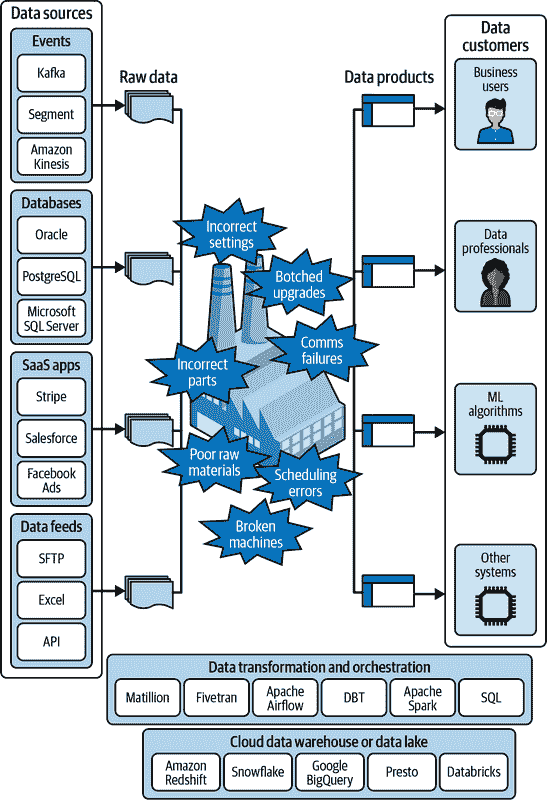

# 第一章：数据质量的重要性

2022 年 3 月，Equifax 正在将其数据从本地系统迁移到新的云基础设施，这是一个众所周知的棘手过程。在此过程中，[引入了一个错误](https://oreil.ly/5QLPJ)，影响了信用评分的计算方式。大约 12%的公司信用评分数据受到影响，成千上万的人最终得到了与实际情况相差[25 分或更多](https://oreil.ly/l5Zw8)的评分。由于不知道错误的存在，消费 Equifax 数据的贷款机构改变了他们提供给客户的利率，甚至拒绝了本应被批准的贷款和抵押贷款申请。

不幸的是，这并不是最近在新闻中曝光的唯一数据质量问题。

+   在 2020 年，[数据错误](https://oreil.ly/LzkkB)导致英国近 16000 例 COVID-19 阳性检测结果丢失，可能导致 50000 人未被告知自我隔离。

+   所谓的航空公司[“错误票价”](https://oreil.ly/GDR8a)，有时会无意中打折超过 90%，迫使航空公司要么亏损，要么因为[无法兑现](https://oreil.ly/bWrv2)这些“故障价格”而损害他们的声誉。

+   Facebook 向一群社会科学家提供了[一个数据集](https://oreil.ly/h25bk)，其中遗漏了其所有美国用户的一半，影响了研究社交媒体对选举和民主影响的学术工作的结果。

+   视频游戏公司 Unity 在从第三方获取的糟糕训练数据后，其 AI 广告系统损失了 1.1 亿美元。

这些新闻报道展示了特别严重的数据质量问题可能带来的影响，但这并不是全部。绝大多数数据质量问题从未被发现，正在偷偷地损害公司的价值，就像你现在阅读这些内容一样。而那些被发现的问题中，很少有公开披露的。

如果你曾经在数据团队工作过，下面这两个轶事可能会让你感同身受：

+   有一天，一家大型科技公司的产品仪表盘显示出净推荐者分数（NPS）调查结果的突然下降。这很可能意味着客户对产品变更感到不满，因此在整个组织中引发了警报。高级领导层介入，并成立了一个工作组。工程师和分析师评估了过去一个月内的所有代码更改，并彻底检查了他们的所有用户数据，以找出可能导致分数暴跌的原因。

    数据科学家分析 NPS 数据最终揭示了根本原因。在他们的分析中，他们发现最新结果中评分为 9 或 10（满分为 10）的数据完全消失了。这导致工程团队进行了调查，他们发现 NPS 调查嵌入的 iframe*裁剪了最高的 NPS 响应值*，因此顾客在物理上（或者我们应该说，在数字上？）无法选择 9 或 10。

+   一个顺风车公司建立了一个机器学习模型，用于检测潜在的欺诈新乘客账户，并自动阻止它们注册。他们的模型依赖于第三方信用卡数据。在其他事情之间，模型发现当来自第三方的数据为空时，欺诈可能性更高；这表明这些人使用的信用卡可能不合法。

    一切都很顺利，直到有一天，第三方出现了数据质量问题，导致它发送 NULL 数据的频率比以往更高。没有人注意到这个错误，公司继续使用机器学习模型进行欺诈预测。这导致许多新用户被拒绝注册公司的服务，因为他们被错误地分类为欺诈账户。

我们打赌，每位与数据打交道的读者都有过类似的经历。当数据处理得当时，它会释放出令人难以置信的价值。但如果你的数据没有经过质量保证，就像试图用可能被污染的食材经营餐厅一样。你可能会幸运地不会有人生病，但有时候，你的顾客和你的业务可能会遭受损失，可以肯定他们不会再以同样的眼光看待你的食物了。一项研究发现，[91%的 IT 决策者](https://oreil.ly/60PWo)认为他们需要改善公司的数据质量；77%的人表示他们不信任公司的业务数据。

是否有办法恢复对数据的信任？您能否确保我们刚提到的这些问题能够立即被检测出来并迅速解决，避免任何其他人（尤其是当您处理大量复杂数据时）受到影响？

我们相信答案是肯定的，并且解决方法是*通过机器学习自动化您的数据质量监控*。本书将帮助您发现自动化数据质量监控的力量。您将学习如何实施一个平台，以确保高质量、可信赖的业务数据。

# 高质量的数据成为新的黄金

感觉像是昨天，企业还在努力从孤立的数据库中提取数据。Apache Hadoop 使得可以在大规模和复杂数据集上运行更高级的查询（如果你知道该如何操作）。尽管如此，在不久的过去，数据通常局限于一小部分事务系统——一个“围墙花园”中的关键资源，受到严格控制，访问受到限制。

几年间，云数据仓库/湖和数据转换工具迅速改变了我们处理数据的方式。现在，组织接触的每一片信息都被记录并存储。组织中的任何决策者都可以（a）查看交互式仪表板或报告来用数据回答问题，或者（b）直接查询数据。建立在数据基础上的机器学习系统正在为业务决策提供信息或自动化，并推动新产品的发展。

“我们坚信未来的 10 年将是数据的十年，”2022 年硅谷投资公司[安德森·霍洛维茨](https://oreil.ly/u4mX3)如是写道。媒体喜欢称数据为新石油和新黄金。我们认为这类说法应该有一个重要的注解：*只有数据本身是高质量的时候才是正确的*。坏数据比根本没有数据更糟糕。

为了理解为什么会这样，让我们来看看围绕数据发生的一些趋势以及为什么质量在每种情况下都是成败的关键因素。

## 数据驱动的公司是今天的颠覆者。

常见的说法是，今天增长最快、最成功的公司都是软件公司。但仔细观察，它们实际上是*数据*公司。

以亚马逊为例。他们不仅仅是通过拥有世界一流的软件工程人才建立了全球最大的零售平台。他们通过找到如何利用数据进行个性化推荐、实时定价和优化物流来实现的。再举一个行业的例子，Capital One 是美国第一批将其数据从本地系统迁移到云端的银行之一。他们通过使用数据来个性化营销和做出更智能的信贷决策，成功区分并加速了他们的增长。

无论您看金融服务、商业、数字媒体还是医疗保健，数据和软件的交汇处是竞争的前沿。然而，如果企业使用的是低质量的数据，员工自己都难以信任，那么他们将无法做出好的决策，更不用说彻底改革一个行业了。如果您的数据质量基础不牢固，那么投资新的数据科学、机器学习和生成式 AI 项目就会是一个错误。

## 数据分析已经民主化。

渴望跟上颠覆者的步伐——或者成为颠覆者的一员——公司正在要求每个团队更加数据驱动。他们已经将分析专家嵌入功能单元（营销、增长、财务、产品团队等），以推动更复杂的数据使用来进行决策：我们能否拉取客户过去的浏览和购买活动统计数据，以便我们编写更贴合的电子邮件？我们能否查看我们的高级用户如何接受最新功能，以确定我们的发布是否成功？

现在有大量的工具让分析师——或者说是跨职能团队中的任何人——能够自助回答与数据相关的问题，而无需编写任何代码。他们可以在几秒钟内启动一个仪表板或报告，这在不久之前可能需要工程师一个月的时间来构建。为了支持这些分析需求，数据不再由一个小而集中的团队维护，也不再作为整个业务的统一事实表可用。相反，数据分散并由更广泛的人群管理，这些人更接近业务线。

如果没有高质量的数据，我们所见到的是，民主化对数据工程团队来说会成为一场噩梦。他们被积压的问题淹没，并时刻警惕着下一个紧急事件。与此同时，组织的其他部门越来越怀疑数据。启发式和直觉再次成为常态。最终，如果数据缺乏信任，民主化分析就是在浪费时间。

## AI 与机器学习的差异化

许多公司将 AI/ML 列入他们的路线图，因为它能够以个性化和自动化交互的形式创造令人难以置信的价值。机器学习（ML，我们将其与 AI 互换使用）依赖于先进的统计模型，根据数据中称为*特征*的历史信号来预测未来。凭借足够的特征数据和合适的建模技术，AI 可以优化或个性化与业务关心的任何实体（消费者、内容、交易等）的频繁交互。

数据质量决定了 ML 模型的成败。您必须确保自己拥有用于训练和推理的高质量数据集。如果生产中使用的数据与它们训练时看到的数据分布相匹配，模型通常表现良好。但是，当出现远远超出它们以前看到的数据分布的数据时，模型往往会彻底失败。（与人类相比，人类可以使用更高级的智能从一个领域或分布泛化到另一个，并考虑到与常规显著偏离的情况。）

### 生成式 AI 与数据质量

谈到差异化：生成式 AI 又如何？这些模型与传统 ML 不同。它们不是基于从结构化数据中提取的特征进行预测，而是直接摄取原始的非结构化数据——就像从消防水龙头中饮水一样。

如果企业越来越依赖生成式 AI，数据质量仍然重要吗？答案明确是肯定的。提示需要整合来自业务的结构化数据（例如客户信息）。如果您使用这些模型自动化业务的部分流程，您需要追踪该自动化并确保通过高质量的日志一切如预期般运行。而且，即使生成式 AI 达到或超越了期望，我们始终需要能够信任我们聚合、计数和分析的数据，就像时间和金钱一样。

此外，组织提供给这些生成式 AI 模型的非结构化数据仍然存在数据质量问题。这些问题使用传统的数据质量监控方法更难找到，需要自动化的 ML 或 AI 来识别。这使得本书中涵盖的技术作为确保新生成式 AI 应用程序使用高质量输入的基础显得更加重要。

## 公司正在投资现代数据堆栈

没有提及现代数据堆栈的数据趋势概述就不完整（尽管我们真的等不及这个术语被淘汰，坦率地说！）。如今，一套正确的软件即服务（SaaS）供应商可以完成 10 年前一支 100 人的全职数据工程师团队可以完成的工作。企业正在从传统的本地存储迁移到云系统，这些系统让它们比以往更轻松地利用更多的数据。

###### 图 1-1\. 现代数据堆栈。

现代数据堆栈是一项重要的投资。当数据质量工具被忽视（如图 1-1 所示）时，这项投资就会受到损害。特别是因为迁移经常是数据质量问题的主要来源，组织在升级后常常面临数据状况不佳的情况（见章节“数据迁移”）。在每个人都在学习新系统的绳索的情况下，问题的根本原因更难追踪。

# 数据越多，问题越多

在前一节中，我们解释了推动企业比以往任何时候更依赖高质量数据的趋势。不幸的是，如今要获得高质量数据比以往任何时候都更加困难。复杂性更高，发生得更快，而且缺乏有效的防护措施。这是同一硬币的两面：进步与痛苦。在本节中，我们将探讨导致数据质量下降的一些最重要因素。

要了解可能发生的具体数据质量问题类型的分类，请参阅附录 A。

## 数据工厂内部的问题

传统上，仓库一直是公司内部数据系统运作方式的比喻，强调货物的存储和运输。但随着现代数据堆栈的兴起和公司处理数据的新方式，这个比喻已经不再完整。相反，我们建议如今的公司正在操作更接近数据*工厂*的环境：一个复杂的环境，用于将原材料转化为有用的产品。

我们摄入的是流式数据集、数据库的副本、SaaS 应用程序的 API 提取以及数据源的原始文件，而不是钢铁、橡胶和电子产品。工厂建立在云数据仓库和数据湖的基础上，而不是水泥。在这种情况下，在工厂楼层操作的机器是像 Matillion 和 Fivetran 这样的 ETL 工具，像 Apache Airflow 这样的编排平台，以及在 dbt、Apache Spark 和 SQL 中进行的转换。操作这些机器的人员是现代数据团队的数据工程师和分析工程师。而生产的产品，不是消费品或工业品，而是支持业务用户和数据专业人员决策的精选数据产品，支持 ML 算法的训练和预测，以及直接输入其他数据系统的数据流。

物理工厂中可能出现的所有问题在数据工厂中也可能出现。Figure 1-2 提供了一个概述。

###### 图 1-2. 数据工厂及工厂楼层可能出现的问题。

机器故障

数据处理或编排工具可能完全崩溃，停止或降低数据的流动。

调度错误

数据处理作业可能以错误的顺序运行或以错误的节奏运行，导致数据丢失、计算不正确或重复数据。

原材料质量差

由于上游问题，输入工厂的原始数据质量可能较差，其不良影响可能在整个数据仓库中传播。

部件错误

SQL、Spark 或其他处理和操作数据的代码可能会引入错误，导致无效的连接、转换或聚合。

设置不正确

工程师可能在配置复杂数据处理作业时出错，这可能导致各种问题。

升级失败

尝试升级代码、应用程序版本或整个子系统可能会引入微妙但普遍存在的数据编码或转换方式的差异。

通信失败

为添加新功能或功能而进行的善意更改可能与其他受影响团队的沟通不畅，导致数据处理逻辑不一致，从而产生质量问题。

数据工厂内部的问题通常是数据质量问题的最常见源头，因为它们直接影响数据的流动和内容（而且在生产数据环境外部很难进行测试）。

## 数据迁移

随着公司寻求跟上最新和最伟大的基础设施，数据迁移越来越频繁。这包括从本地数据仓库到云提供商（例如从 Teradata 到 Snowflake），从一个云提供商到另一个（例如从亚马逊网络服务 [AWS] 到谷歌云平台 [GCP] 或反之），从一个数据库到另一个数据库（例如从 PostgreSQL 到 AWS Aurora），或从一个数据库版本到另一个数据库版本（例如 Elasticsearch 集群迁移）。

所有这些迁移都容易出现数据质量问题。让我们来看看从本地数据仓库迁移到云/SaaS 提供商的情况。许多公司有非常复杂的数据管道，源自传统的主机遗留系统，这些系统被转移到日益陈旧的本地数据仓库中。这些传统系统已经存在数十年，并且随着增加新功能、团队的变动和业务需求的变化，累积了大量的增量复杂性。

当将这些错综复杂的数据处理和存储迁移到云端时，公司试图复制在本地环境中所做的工作。但是在云端重新创建本地流程可能引入非常微妙的问题，导致重大的数据质量后果。

例如，我们与一家公司合作时提到，他们客户的出生日期在这样的迁移中被严重破坏（在图 1-3 中可视化）。在他们的传统主机上，出生日期存储为从某个参考日期（如 1900 年 1 月 1 日）偏移的整数。在导出时，这些整数然后被转换为新的云数据仓库中的日期。这看起来很简单，除了无人知晓的是，云数据仓库自动使用了 Unix 时间戳参考的 1970 年作为偏移量。所有的出生日期都被推到了遥远的未来。

与许多数据质量问题一样，后果是在后来默默发生的。公司有一个市场应用程序，根据客户的年龄发送电子邮件。一旦这个应用程序指向新的云数据仓库，直到有人注意到问题之前，*没有*客户收到*任何*电子邮件。（市场团队经常因为数据质量差而承受很大的痛苦。[一项调查发现](https://oreil.ly/idW6e)，营销人员在数据问题上浪费了其总预算的 21%。）

###### 图 1-3\. 当存储在本地数据仓库中的数据迁移到云数据仓库时，可能会出现不一致的情况，例如在计算客户出生日期时涉及不同的参考日期。

## 第三方数据源

使用第三方数据——即来自公司外部的数据——比以往任何时候都更容易和更普遍。举例来说，当 Jeremy 在 Instacart 时，定期收集的第三方数据包括：

+   天气数据用于需求预测/调度

+   用于路由的地图信息第三方服务

+   消费品包装（CPG）产品目录数据，用于丰富用户搜索和购物体验

+   欺诈倾向评分数据，以避免退款

+   零售商库存数据，用于确定每个店铺在特定时间内货架上的商品情况

经常情况下，第三方数据被编码为两个合作伙伴之间的数据关系：公司 A 和公司 B 必须共同合作为客户 X 提供服务或实现操作 Y，并且需要交换数据。有时，这被称为*第二方数据*。

在其他情况下，您正在使用公共数据或由第三方服务提供商打包的数据，以在一对多的关系中重新销售，通常用于对您了解有限的实体（客户、公司、位置）做出决策。如果您浏览在线目录[Demyst](https://oreil.ly/2g4vc)上的公开可用信息源，您会发现只需点击几下即可利用全面的税收、财产和商业数据。

第三方数据是数据质量问题的常见来源。这不仅因为提供者可能会出错，还因为他们经常对其 API 或数据格式进行更改。除非您已经明确制定了数据合同，否则第三方不一定会考虑到他们的更新可能会如何影响您的具体用例，也不一定有义务提供通知或减轻措施。

## 公司的增长和变化

我们认为*几乎所有数据最初都是高质量的*。当产品首次构建和装配时，由构建它的工程师捕获的关于该产品的数据通常与他们的意图和产品功能非常一致。

但数据并不孤立存在。在现实世界中，公司不断调整和改进其产品，这反过来影响这些产品所产生的数据。这就像热力学第二定律一样：数据的熵随时间总是增加的。随着时间的推移，以下因素导致数据质量下降：

新功能

新功能经常扩展系统捕获的数据范围。在这种情况下，“添加额外列”的风险不大。但是，在某些情况下，新功能可能会替换现有功能，这通常会对系统产生的数据产生突然的影响。在许多情况下，新功能可能会改变数据的形状。粒度级别可能会增加——例如，数据现在可能在项目级别而不是整个产品级别进行捕获。或者以前的单一消息可能会被分解并重构为多条消息。

Bug 修复

根据卡耐基梅隆大学 CyLab 可持续计算联盟的数据，商业软件的平均每 1000 行代码中包含 20-30 个错误。Bug 修复可能会与新功能产生相同的影响。它们也可以真正改善数据质量，但当这种突然的改善对依赖数据的系统造成“冲击”时，可能会产生负面后果（请参见“数据冲击”部分）。

重构

重构发生在团队希望改进应用程序背后代码或系统结构而不改变功能时。然而，重构往往会带来意外的变化风险，尤其是对于像数据捕获这样在应用程序代码中可能没有经过严格测试的东西。

优化

经常情况下，简单地为了提高应用程序的速度或效率而进行更改。在许多情况下，数据捕获方式可能会成为性能问题，而更改可能会影响系统发出的数据的可靠性、时间粒度或唯一性。

新团队

新团队经常继承一个旧应用，并且对其与其他系统的交互方式或者所产生的数据如何被消费的理解有限。当他们对产品进行更改时，他们可能会无意中打破其他团队对其现有期望，引入数据质量问题。

停机

除了有意的变更，许多系统会简单地发生停机，即它们停止正常运行或者在服务水平下降的情况下运行。在这些停机期间，数据捕获通常完全丢失。这通常并非是数据质量问题本身，因为数据缺失反映了停机期间活动的缺乏。但在许多情况下，停机可能会影响正在发出的数据，而不影响服务本身，这是一个数据质量问题。

## 外生因素

当您利用数据进行决策或构建产品时，总会有影响数据的因素是您无法控制的，例如用户行为、全球事件、竞争对手行动以及供应商和市场力量。请注意，这些并不是数据质量问题本身，但它们通常看起来和感觉起来像是数据质量问题，并且可能需要类似的处理方式。

例如，在某些行业中，公司根据竞争对手的实时数据做出自动化决策。电子商务公司监控竞争对手的价格数据，并且几乎可以立即调整其价格。航空公司也是如此。在这些情景中，如果竞争对手突然、急剧地改变了他们的行为，该业务也会立即做出相同的改变，并且在其数据中出现大幅度的变化。对公司来说，及时了解这些变化非常重要，因为这些变化并不总是期望的或者故意的。

任何关于外生因素的讨论都不应忽略 COVID-19 疫情。在分析用户行为时，每个人都不得不将 COVID-19 的前几个月视为特殊情况。例如，图 1-4 展示了有关芝加哥出租车行程里程数的数据在 2020 年 3 月份发生了显著变化。

###### 图 1-4\. 芝加哥出租车行程的平均长度在 2020 年 3 月份急剧下降。出租车数据可以从[芝加哥市官网公开获取](https://oreil.ly/mQDTq)。请查看此图的完整版本[*https://oreil.ly/adqm_1_4*](https://oreil.ly/adqm_1_4)。

在 COVID-19 期间，机器学习模型必须快速重新训练以应用新的数据，因为基于历史趋势的假设不再适用。在一个著名案例中，Zillow 用于预测房价的模型——这个模型支持 Zillow Offers 的新业务部门——无法及时适应变化的市场。这项自动化服务为未能在变化的市场中出售的房屋支付了过高的价格，导致 Zillow 不得不[裁减员工数达其总数四分之一](https://oreil.ly/oncgk)。

团队通常发现自己处于以下两种情况之一，涉及外部因素：

+   在某些情况下，例如 COVID-19，外部变化足够剧烈，以至于您需要提醒决策流程，并可能重新训练您的 ML 模型。这几乎就像数据质量问题——这是一个您希望立即被通知的变化，以便您可以进行损害控制。

+   在其他情况下，外部因素对您的决策有更微妙的影响，例如供应链问题影响您的订单处理时间。您需要快速理解这些变化的背景，并排除任何可能看起来像真正外部趋势的数据质量问题。

# 为何我们需要数据质量监控

随着高质量数据的日益重要，以及数据质量问题比以往任何时候都更加普遍，您可能已经被说服改善数据质量的重要性。但是，您应该如何考虑这样的举措呢？它是否作为一次性修复——在几个月或几个季度内将您的数据整理到位，并让事情顺利进行？

这种方法通常适用于软件，但对数据来说则不然。代码今天和明天一样，除非有意进行更新。您可以在受控的 QA 环境中进行测试，并运行仅隔离系统的单元测试。一旦测试通过，您基本上就完成了。

另一方面，数据是混乱且不断变化的。它依赖于您无法控制的外部因素，比如用户实时与产品的交互方式，因此您真正只能在生产环境中进行整体测试。您的测试必须能够过滤掉所有噪音——而真正的数据质量信号中有很多噪音。

出于这个原因，虽然软件错误通常通过自动化测试和用户反馈很快被检测和修复，*我们坚信大多数数据质量问题从未被捕捉到*。因为团队缺乏适合数据的正确持续监控工具，问题会默默发生并被忽视。

更糟糕的是，随着问题发生后经过的时间增加，修复数据质量问题的成本急剧增加：

+   可能导致问题的潜在变化数量随着评估时间的增长呈线性增加。

+   团队对为何进行变更或该变更可能带来的影响的背景了解数量随着变更时间的增长而减少。

+   “修复”问题的成本（包括回填数据）随着问题首次出现以来的时间增加而增加。

+   长时间存在的问题最终会变成其他下游系统的“正常行为”，因此修复它们可能会导致新的事件。

当引入一个事件然后稍后修复时，它实际上有两种不同类型的影响。我们称之为数据疤痕和数据冲击。

## 数据疤痕

事件发生后，除非数据被极其细致地修复（通常不可能或昂贵），否则它将在数据中留下一个*疤痕*。我们最早听到这个术语是由 Faire 的首席数据官兼联合创始人 Daniele Perito 使用的。疤痕是指一段时间内给定数据集的一部分记录是无效的或异常的，并且在未来对这些记录进行操作的任何系统中都无法信任。

数据疤痕将影响机器学习模型，因为这些模型必须适应在疤痕期间学习数据中不同的关系。这将削弱它们的性能，并限制它们从疤痕期间捕获的所有数据中学习的能力。它还会削弱模型对受疤痕影响的特征重要性的信任—模型会低估这些输入的权重，错误地认为它们在数据集中的普遍性较低。即使您设法回到过去修复疤痕，也很容易在下游的机器学习应用中引入所谓的*数据泄露*，因为无意中在修复过程中包含了当前状态信息。这会导致模型在离线评估中表现非常好（因为它可以访问来自未来的“时光旅行”信息），但在生产环境中表现不稳定。

数据创伤还会严重影响此数据集上进行的任何未来分析或数据科学工作。它们可能导致更复杂的数据流水线，难以编写和维护，因为数据用户必须添加大量的异常处理以避免由创伤引入的偏见。这些异常可能需要在包括来自创伤时段数据的任何报告或可视化中予以记录和解决，从而增加任何试图解释数据或从中做出决策的人的认知负担。或者，创伤可能需要从数据集中完全移除，导致该时期的“数据健忘症”，这可能会影响趋势分析或基于时间的比较（例如，这个统计数据的年度对比结果是多少？）。

## 数据震荡

除了造成的创伤效应外，在生产中还会出现数据质量问题引入时以及数据问题修复时的效应。这就是我们所说的数据质量“震荡”，它还会影响到人工智能/机器学习和决策制定。

当数据质量问题首次出现时，任何使用从数据派生特征的机器学习模型都将突然面对完全不同于它们训练过的数据。这将导致它们被新数据“震惊”，它们为受数据质量事件影响的任何观察结果常常产生极不准确的预测。此震荡会持续到模型使用新数据重新训练为止，而这在持续部署模型中通常会自动发生。

然后，一旦数据质量问题得到修复，实际上这将给模型带来另一种震荡（除非数据在历史上得到修复，这通常是不可能的）。修复带来的震荡往往与数据质量问题引入时的初始震荡一样严重！

对于分析/报告用例，这些震荡通常表现为指标或分析突然发生意外变化。当观察到这些变化时，它们常常被误认为是真实世界的变化（这些报告的整个目的是反映现实情况），因此会改变运营或者做出其他决策，以应对数据质量问题，就像它们是真实的一样。而当修复发布后，同样的情况可能会反向发生。

数据质量问题修复的时间越长，创伤越深，修复时的冲击也越大。

###### 图 1-5\. 演示随着时间累积，如何侵蚀数据质量和信任。每个条是事件留下的数据创伤。每个 X（标记事件首次发生时）代表一个数据震荡。值得注意的是，每个对号（解决事件 2 时）也是一个数据震荡。

允许伤疤和冲击继续积累的后果是，随着时间的推移，数据的客观质量逐渐下降。图 1-5 说明了事件如何堆积，以至于每个人都确信数据质量低且数据本身不可信任。填充数据已经很难，而建立信任更加困难。

因此，组织在思考如何应对数据质量不佳时需要进行框架变革。这不应该是一个一次性的项目，只是为了处理给定数据源的数据质量问题。相反，它应该是一个持续的数据质量监控倡议，可以在发生数据质量问题时及时发现并尽快解决。

没有数据质量监控，问题将不会被发现，直到业务用户、数据专业人员或机器学习算法或其他系统的客户注意到为止。以这种方式运行数据工厂，相当于在没有任何质量控制过程的情况下运行生产消费品的工厂。

# 自动化数据质量监控：新的前沿

当今的数据专业人员正在经历领域内令人兴奋、令人惊讶的变化。无论是投资于生成式人工智能，还是在整个企业中实现分析民主化，或者从传统数据库迁移到云端，几乎每家公司都在尝试一些前所未有的数据处理方式。

因此，对于大多数企业来说，现在是投资于数据质量的最佳时机。随着数据使用的增长，数据质量问题的风险和负面影响也在增加。数据质量是需要不断监控并通过尽快解决问题来维护的事项。

有效的数据质量监控并非易事，特别是对于大型企业来说，拥有成千上万张表和数十亿条记录是很常见的。虽然人工手动检查数据行不通是显而易见的，但使用像为数据编写测试和跟踪关键指标这样的传统解决方案也不适用。你可能希望为最重要的表格做这些工作，但对整个数据仓库实施这些工作是不可行的。

在本书中，我们将向您介绍使用无监督机器学习自动化数据质量监控的概念。这是一种具有多种好处的新技术。它几乎不需要手动设置，并且可以轻松扩展到您的数据仓库中。通过正确的实施，它可以自动学习数据变化是否足够大以信号质量问题的适当阈值。它可以检测到广泛的问题，包括那些没有人想过要为其编写测试的*未知未知*。

使用 ML 也带来了自己的挑战。构建模型本身就是一项复杂的任务，但你还需要确保它能在各种真实世界的数据上运行，而不会过度或不足报警。您将需要建立通知系统，帮助您的团队有效地处理问题，并与您的数据工具包集成，使数据质量成为组织的重中之重。您还需要制定长期部署和管理监控平台的计划。

不用担心——我们将在你前行的道路上提供所需的建议和工具。我们认为利用 ML 自动化数据质量监控与过去几年发生的任何数据创新一样令人兴奋，也是现代数据堆栈中最重要的突破之一。希望通过本书的学习，您也能认同这一观点。
