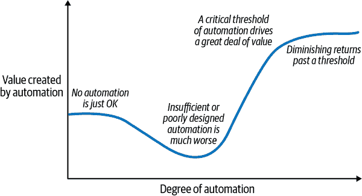

# 第二章：数据质量监控策略及自动化的角色

有许多不同的方法可以用来处理数据质量监控。在评估选项之前，思考成功的标志很有帮助。在本章中，我们将定义成功的要求。然后，我们将详细讨论传统策略——手动检查、基于规则的测试和指标监控——以及它们的测量结果。

接下来，我们将探讨*自动化*数据质量监控的概念。我们将解释无监督机器学习如何帮助我们满足成功标准的一些缺失方面，将监控扩展到大量数据，并减少警报疲劳。

最后，我们将介绍本书中提倡的数据质量监控策略：一个四柱结构方法，结合数据可观性、基于规则的测试、指标监控和无监督机器学习。正如我们将展示的那样，这种方法有许多优势。它允许主题专家（SMEs）强制执行基本约束，并跟踪重要表格的关键绩效指标（KPIs）——所有这些同时为大量多样化数据提供基础级别的监控，而无需服务器农场或大量分析师。

# 监控要求

为了解决第一章中概述的各种问题，一个成功的数据质量监控策略必须在四个维度上交付成果（如图 2-1 所示）：

+   第一，它必须*检测*所有重要数据的质量问题，以便您可以确信没有任何问题被忽视——无论这些问题出现在表格、列还是单个行的级别。

+   第二，当出现真正问题时，它必须*及时*向相关人员*发出警报*，同时避免由于非问题而导致*警报疲劳*。

+   第三，它必须帮助您*迅速和高效地解决*问题。（要查看这些问题的完整列表，请参阅附录 A。）

+   最后，它必须*扩展*以监控企业范围内数据的健康状况。


###### 图 2-1\. 数据质量监控解决方案应跨越检测、警报、解决和扩展四个维度取得成功。

# 数据可观性：必要但不充分

在讨论数据质量监控方法之前，让我们先了解一下数据可观性。这是任何全面的数据质量战略的关键部分，其重要区别在于数据可观性*监控关于你的表格的元数据，而不是数据内容本身*。

数据可观性类似于基础设施或网络可观性，但应用于数据仓库中的数据。换句话说，它解答以下问题：

+   这个表格还存在吗？

+   表格的模式有任何不利的变化吗？

+   最近是否更新过表格？

+   表格中的数据量是否与我的预期一致？

当确定您是否可以信任您的数据时，这些是重要问题。您会注意到在 附录 A 中的一些数据问题仅通过可观测性就可以检测到。

那么，数据可观测性是如何工作的呢？幸运的是，它使用的元数据可以从大多数现代数据仓库中收集，*甚至无需查询表格*。通常有一个 API 使得这些数据可用，或者可以查询的系统视图保持这些数据的更新。所需的数据包括表级统计数据，例如：

+   表格

+   最后更新时间

+   行数（或字节大小）

以及列级信息如：

+   表格

+   列名

+   列类型

平台只需要定期（例如每小时）捕获可观测性元数据，然后可以回答关于元数据如何随时间变化的问题。

例如，在 Snowflake 中，您可以使用以下查询检索表级元数据：

```
SELECT
    TABLE_NAME,
    ROW_COUNT,
    BYTES,
    LAST_ALTERED
FROM INFORMATION_SCHEMA."TABLES"
```

当涉及“最近是否更新过表格？”时，系统需要做出艰难的决定：什么是“最近”，什么时候延迟变得显著？有些表格使用流数据进行持续更新，有些每小时更新一次，还有些可能一天多次更新，或者仅多次更新每周（或每月、每年）。时间序列模型（如侧边栏中讨论的 “时间序列度量监控” ）在这里是一个强大的工具——它们可以利用更新历史来预测下一次更新到达的预期上限。

类似的事情也必须做出来决定数据量“是否与预期一致”。时间序列模型可以观察数据量的历史，并识别最近更新是否异常低。一旦解决了这些问题，数据可观测性可以应用于数据仓库中的成千上万个表格。

这是否意味着您解决了数据质量问题？当然不是！数据可观测性检查只涉及数据通过您的仓库的流动。它们不解决数据内容是否高质量的问题。仅使用数据可观测性就像在运营一个水处理厂，您的唯一质量控制是提供的水压——完全不关心这些水是否适用于饮用！ 表格 2-1 重申了数据可观测性和数据质量监控之间的主要区别。

表格 2-1\. 数据可观测性和数据质量监控之间的差异

|   | 数据可观测性 | 数据质量监控 |
| --- | --- | --- |
| **它回答了什么问题** | 数据是否及时通过我的仓库？ | 我的仓库生成的数据是否高质量？ |

| **它是如何工作的** | 目录元数据 作业监控

数据血统 | 查询数据 需要专家或 ML

解释性至关重要 |

| **为什么需要** | 捕捉数据的*移动*失败 | 对数据值进行深度监控 |
| --- | --- | --- |
| **主要缺点** | 忽视数据的*内容* | 难以扩展 |

# 数据质量的传统方法

许多团队发现，对整个数据仓库实施数据可观察性相对容易，但在扩展数据质量监控方面却遇到了困难。在历史上，团队通常通过手动检测、基于规则的测试和指标监控来监控数据质量。虽然我们在这里单独介绍了这些策略，但组织通常同时采用这三种策略的混合方法。每种策略都有其价值，但在规模化时也存在显著的缺陷。

## 手动数据质量检测

自数字数据问世以来，人们已经有可能通过手工查找潜在问题，但这越来越困难。

在某些企业中，存在一个有意的手动数据质量审查流程，无论是抽样检查、审查总结还是查看可视化数据。这通常对于监控数据质量是不够的。当数据足够小且简单，以至于人类可以查看电子表格并迅速发现潜在问题时，手动检查可能是有效的（顺便说一句，[各种研究报告](https://oreil.ly/oEMGS)称，近 90%的电子表格存在错误！）。但是，在规模化时，这种方法并不有效。此外，手动过程本质上是主观的。将同一复杂数据集分别交给 10 个不同的分析师，他们对所评估数据质量的结论可能会大相径庭。

手动数据质量检测也以一种截然不同的方式发生：偶然发现。有人在处理数据时，突然“发现”了一个数据质量问题。以下是一些例子：

计算汇总统计数据并将其与已知数据或其他参考数据点进行比较

例如，数据科学家可能会发现，在聚合数据集中，客户数量比另一个已知来源高出 50%，这表明可能存在数据质量问题。

创建可视化图表以总结数据，清楚地显示数据质量问题

例如，关于缺失值的时间序列可视化可能显示最近几周出现了非常明显的增加。

从分析结论或模型询问中得出的结论，这些结论实际上是不可证明的。

分析人员可能会发现，过去三周欧洲新账户的增长超过了每周 1000%，但实际上这是不可能的。或者，一个机器学习模型可能会建议，预测用户流失的最重要特征是用户的出生日期，但仔细检查后发现，这是由于有很大一部分用户出生于 1970 年 1 月 1 日（Unix 纪元的开始，表明存在错误数据）。

依靠分析师和数据科学家在工作过程中发现数据质量问题并不是一个成功的策略。从业者只会定期检查数据，并且有特定的目的。他们很可能会在数据质量问题发生很久之后才发现，并且几乎肯定会错过超出项目范围的数据质量问题。

这种边做边解决的方法实际上相当有害。在我们合作的一些组织中，分析师花费的时间*超过 50%*用于调查和解决数据质量问题。这种手工作业不仅削弱了团队的效率，而且随着时间的推移，对士气造成了巨大的打击。

尽管如此，分析师和数据科学家总是希望能够看到他们处理的数据，并且根据情况，手动审查可以增加价值。人类能够将不同的数据源和背景知识结合起来，并以算法无法自动化的方式得出结论。此外，当在分析或 ML 模型的背景中发现数据质量问题时，它们从定义上就是“重要”的数据质量问题，需要解决——没有误报的风险。

最终，无论选择哪种监控方法，都应减少手工工作量，并使其能够扩展监控数据。然而，它仍应使人类能够轻松地对其数据进行概述和手动检测问题，并且您可以通过生成摘要统计信息和可视化来帮助此过程。

## 基于规则的测试

在测试软件时，工程师编写单元测试来调用组件，测量所采取的操作，并对这些测量应用确定性规则，以验证软件是否按预期工作。例如，电子商务应用程序可能有一种计算税率的方法。单元测试可以向此方法提供各种商品篮子和商店位置，并确保它产生正确的答案。

尝试将适用于测试软件的方法（编写大量单元测试）应用于数据是很自然的。我们称之为*基于规则的测试*。常见的基于规则的测试工具包括 Great Expectations 和 dbt。基于规则的测试是一种确定性测试，可以应用于特定来源的数据。数据要么通过测试，要么未通过测试；中间没有灰色地带。

例如，基于规则的测试包括：

+   表`ticket_sales`中的列`number_of_tickets`从不为 NULL。

+   列`listing_time`中没有来自未来的值。

+   列`price_per_ticket`的平均值每天始终在 50 到 100 之间。

+   等式`number_of_tickets * price_per_ticket * (1 + tax_rate)`对于表`ticket_sales`中的每一行始终等于`total_price`的结果。

每个规则都可以看作具有范围、类型和（通常）若干约束条件：

范围

规则适用于哪些数据？什么数据存储？什么表或视图？哪些列？在什么时间范围内？哪些具体行？

请注意，在大多数情况下，可以对给定数据集的每一行评估基于规则的测试，这允许您清晰地将“好”行与“坏”行分开。但规则也可以应用于从数据中计算的统计信息（例如，`0 <= sum(column_x) <= 50`）。通常，我们将讨论规则作为独立应用于每一行数据的情况。将规则应用于统计数据的特殊情况可以视为首先计算聚合数据集（可以由某个实体（如客户）、时间单位（如日期）或根本不进行任何分组）然后对该聚合结果应用基于行的规则。

类型

将应用的规则类型是什么？例如，对于适用于给定列的规则，可以从各种类型中选择：列是唯一的，列从不包含 NULL 值，列字符串值在指定集合内等。规则类型可以扩展到个别列之外，还涵盖表的元数据（上次更新时间，总行数），表的模式（特定列名、类型和顺序）等。规则可以涉及多列及其相互关系，或表如何通过联接语义与其他表关联（例如，在给定主键上的 1：1 联接）。

最复杂的规则类型通常表达为 SQL 查询，可能包括联接、子查询和寻找表中“永远不会出现”的条件的复杂语句。例如：“每个完成结账但后来未被取消、作废或完成的订单的客户应在`customers_with_active_orders`表中有记录。”

在 SQL 中可以表示为：

```
SELECT COUNT(DISTINCT customer_id) as num_missing
FROM orders
WHERE checked_out
AND order_status NOT IN ('canceled', 'voided', 'completed')
AND customer_id NOT IN 
    (SELECT customer_id FROM customers_with_active_orders)
```

约束

选择了范围和类型后，通常还需要对规则提供一些常量约束。例如，在规则“`price_per_ticket`始终介于 50 和 100 之间”中，50 和 100 的值是常量约束。在某些情况下，这些不是必需的（“列 X 是唯一的”不需要约束），或者它们与规则类型重复（“列不为空”等同于“NULL 计数等于 0”，其中 0 是常量）。

规则是任何数据质量监控策略的重要组成部分。与人工分析相比，规则运行成本低且不会出错。规则也清晰而确定。每一行要么通过要么不通过。一旦完全理解了规则，你也会理解为什么基于规则的测试会失败，以及为使该行的测试通过，必须满足什么条件。当基于规则的测试失败时，你可以信任它确实失败了——数据良好但规则说不好（当然，除非规则本身是错误的；我们稍后会讨论这点）。

此外，规则是识别从数据集开始就存在的或从历史上未被捕捉和解决的数据质量问题的最可靠方式之一。为什么呢？规则允许专家在其对生成数据的系统或收集数据的业务背景的知识基础上表达他们对给定数据集的要求。专家可以编写一条规则，说明数据的过去、现在或未来不应该为空。相比之下，那些从数据历史中学习的方法（例如使用指标或无监督机器学习来检测意外变化）则是在寻找数据中的突然变化，这些变化从定义上来说是*新的*，而不是历史数据质量问题。这样的方法无法判断数据是否一直存在问题。

规则还擅长于识别海量数据中的个别问题。如果您正在处理一个有数十亿行的表格，那么规则通常是发现少数违反给定条件的记录最可靠的方式。（请注意，如果您不关心每一条记录，这可能是一个负担，因为您将不得不找到方法来排除您不再关心但仍然违反规则的数据质量“疤痕”。）

然而，仅依靠基于规则的测试是错误的。首先，在指定高质量规则时存在很大的出错空间：

+   *范围*可能被过于狭隘地指定（`WHERE` SQL 子句太紧凑），导致规则忽略数据质量问题（例如，规则仅适用于表的 X 段，但也应适用于表的 Y 段）。

+   *范围*可以过于广泛地指定（`WHERE` SQL 子句太过宽泛），导致规则错误地将有效数据标记为无效（例如，对于某些记录，这列实际上应该是*应该*为空）。

+   规则的*约束*可能被错误地指定。在设置列值或统计数据的范围时，这种情况非常普遍。范围可能过于广泛（从而忽略真实的数据质量问题），或者过于狭窄（从而在数据变化时产生非常嘈杂的结果）。

+   可能选择了错误的*类型*规则。测试可能无法捕获用户的真实意图，或者因为测试不恰当而产生无意义的通知（该列始终打算具有 NULL 值，但仍然应用了“永不为 NULL”的规则）。

此外，仅用高质量规则覆盖现代企业的所有数据是一个劳神费力的任务。考虑以下现实的假设性例子，组织需要监控 10,000 张表格以检测数据质量问题：

+   公司整体依赖的 10 张关键事实表至关重要（董事会的关键统计数据来自这些表）。

+   公司每天在业务和运营决策中使用的关键数据包含在 90 张表中。

+   900 个表对于个别团队或倡议至关重要，每周由产品经理、ML 工程师、分析师、数据科学家或其他数据专家使用。

+   剩余的 9,000 个表可能会在其他 1,000 个表中以微妙且难以检测的方式显示数据质量问题。

每个表可能有数十、数百甚至数千列。例如，事实表通常将关于特定类型实体的各种信息聚合到一个非常广泛的表中，以启动许多分析和用例。有些表还可能有数百或数千个段（行的组合），具有不同的行为。例如，Web 事件表通常捕获大量关于各种不同事件或用户行为的结构化数据（设备、IP 地址、URL、用户、时间等）和半结构化数据（JSON 负载）。

每个表的每一列或数据段可能需要 5 到 10 条规则来覆盖数据的最重要约束条件。因此，要使用基于规则的测试监控它们最重要的表，一个组织可能最终会写入*1,000 个表 * 每个表 50 列 * 每列 5 条规则 = 250,000 条规则*。这还不包括半结构化数据、段变化或其他 9,000 个潜在重要的表！


在大型数据仓库中创建和维护数据质量规则是一项苦不堪言的任务（Josie Stanley 插图）。

除了创建基于规则的测试之外，您还必须维护这些规则，这比维护单元测试要困难得多。代码的单元测试应该在每次运行时产生相同的结果，直到有软件更新打破预期行为，无论是有意还是无意。但是与代码不同，数据不断以不可预测的方式变化——随着新产品的推出、宏观环境的变化或用户行为的改变等等。因此，基于规则的测试可能非常脆弱。为了确保它们的定义——特别是它们的约束——保持准确，规则需要在产品和数据演变过程中不断更新。在一开始放宽约束以节省时间可能很诱人，但这会冒着忽略真实问题的风险。

总结一下，基于规则的测试并非是在现代企业中监控数据的可扩展解决方案。然而，规则是中小企业表达和强制执行数据期望的有力工具。例如，图 2-3，来自 Airbnb 关于其数据质量战略的报告，提供了由中小型企业定义的规则的实际示例，以确保列表数据的一致性。理想的数据质量解决方案使得各种中小企业能够轻松创建、编辑和分析规则。


###### 图 2-3\. 从 Medium 文章[“Airbnb 的数据质量”](https://oreil.ly/eTed_)摘录，展示了 Airbnb 内部用来确保数据质量的验证规则和指标检查的示例。

## 指标监控

下一个数据质量监控方法也受到软件工程的启发。大多数软件系统通过跟踪有关基础设施的指标来进行监控，并在有突然不利变化时通知。这些统计数据可以涉及硬件本身（CPU 利用率、内存等）、网络活动（丢包等）或正在运行的个别服务（队列长度、平均延迟等）。

类似地，您可以监控有关数据的统计信息，并设置阈值，以告知系统在数据高于或低于预期时发出警报。挑战在于，对于数据质量来说，需要监控的指标范围广泛。为了确保适当的覆盖范围，您需要为每一列、段和可能关心的统计量（如 NULL 值百分比、重复百分比、均值、最小/最大值等）准备指标。

除了可伸缩性问题外，数据质量的指标监控还存在其他问题。首先，因为它在聚合统计水平上测试数据，可能会错过只影响少数记录的数据质量问题。此外，大多数指标监控的实现并不识别导致指标变化的具体记录，这使得理解指标变化的原因以及其是否合理（如外部趋势）或由于数据质量问题而起变得困难。

指标监控还可能忽略随时间积累的数据问题。例如，假设数据质量问题的根源是一个位于功能标志后面的代码更改。如果功能逐步推出到客户段，数据将逐渐变化。任何指标的变化也将很缓慢，并且可能永远不会达到警报的阈值。

尽管如此，当您希望密切关注数据的特定片段时，指标监控至关重要。例如，图 3-1 展示了 Airbnb 选择优先考虑的一些指标，如活跃列表数、新活跃列表数、重新激活和停用。这些重要指标通常受整体数据集的小部分子集的影响，这些子集中的任何趋势可能不会被考虑整体数据的其他监控方法捕获。

同样，指标监控可以帮助当数据在预期的一定比例记录中降级时，但用户希望避免该百分比显著增加时。例如，可能有 20%的时间，用户记录因为创建用户记录的方式而没有有效地址。如果这个百分比显著增加，那么可能存在一个数据质量问题，该问题影响了更多用户的地址信息，超出预期范围。

鉴于这些优缺点，一个成功的数据质量监控策略应该让用户在关键指标上设置监控，并理想情况下使用时间序列模型来设置适当的阈值。但仅依赖指标监控是不够的。

# 自动化无监督机器学习进行数据质量监控

在覆盖了传统（非自动化）监控方法后，现在是时候介绍一种新策略：无监督机器学习。数据质量与许多其他领域无异，这些领域的流程曾经完全手动，如欺诈检测、核保和产品推荐，现在可以由机器学习算法处理。这些算法允许更高效率地操作，并以驱动更好业务结果的节奏和一致性运行。

虽然我们将在第四章和第五章更详细地探讨无监督机器学习，并在此概述其作用及其在规模化自动化数据质量监控中的关键角色。

## 什么是无监督机器学习？

广义上，机器学习算法可以分为有监督和无监督两类。在有监督学习中，模型用于学习的数据是由人类标记的。图像分类器通常使用有监督学习——人类向模型展示成千上万张被标记为树、猫等的图像，模型随后学习识别新图像中类似的对象。在无监督学习中，模型没有人类标签，只有数据本身，包含所有数据固有的模式和关系。模型从数据本身学习，并根据迄今为止看到的一切来解释新输入。

作为数据监控策略，有监督学习在实际中并不实际，因为它需要人类收集和标记大量多样的训练数据，这些数据代表模型需要可靠检测的真实世界数据质量问题。考虑到数据从表到表、从公司到公司的巨大差异，收集足够的标记数据使有监督机器学习能够有效工作将是困难的。这使得无监督学习更适合监控数据质量。假设您已开发出效果良好的模型，它可以开始监控数据集而无需任何初始设置，并在数据变化时继续学习和适应。这些算法可以被调整以检测数据中的深层复杂问题，例如：

+   一组柱子中的 NULL 值的百分比已经增加。

+   特定数据段（例如一个国家）已经消失或到达的记录比预期少。

+   在柱子中的分布发生了显著变化（例如，信用评分的分布偏高于预期）。

+   多列之间的关系发生了变化（例如，这些列过去相加等于彼此，但现在对于一部分记录不再是这样）。

我们注意到一些数据质量监控解决方案声称正在进行“机器学习”，但实际上只是依赖于时间序列模型来监控许多指标。根据使用的技术，时间序列模型可能在幕后使用 ML，但其范围狭窄，仅仅是试图预测序列中的下一个指标值。它无法分析基础数据，也不会发现不直接影响正在监控的指标的数据质量问题。在本书中，我们将使用无监督学习这个术语来指称在整个复杂数据集中检测到意外变化的更广泛挑战。

无监督机器学习最强大的一个方面之一是，它旨在理解表中数据的关系变化作为一个整体。这一点非常重要，因为表中的数据通常是高度相互关联的。


###### 图 2-4\. 台湾信用卡违约支付数据集中列之间的关系（[UCI 机器学习库](https://oreil.ly/j6kw8)）。查看此图片的完整尺寸版本，请访问[*https://oreil.ly/adqm_2_5*](https://oreil.ly/adqm_2_5)。

图 2-4 中展示的信用卡数据集是一个很好的现实世界的例子。每个柱子出现在垂直和水平轴上，圆圈的颜色基于柱子之间的[phi-K 相关性](https://oreil.ly/VcXnJ)进行着色。¹ 这揭示了数据集中柱子之间关系的许多信息。看看靠近对角线的黑色圆圈的集群，你会发现`pay_N, bill_amt_N`和`pay_amt_N`列彼此之间存在相关性。还有更多令人惊讶的关系。例如，`age`与`limit_balance`以及`marital_status`强相关。但`marital_status`与`limit_​bal⁠ance`之间的相关性较弱。

在监控数据质量时，我们往往会过于简化事物，仅考虑单独列中的值、分布或摘要统计，并创建规则或指标来监视单独列。但实际上，现实世界的数据具有我们在这个信用卡数据集中看到的丰富而复杂的相关结构。这对监控有两个重要的影响：

+   如果我们使用度量或验证规则分别监控这个数据集的每一列，那么我们的监控器也会高度相关。如果列之间的相关性与某些数据或过程有因果关系，那么底层机制的变化可能会导致许多依赖的度量值同时改变，验证失败。因此，我们可能会收到数十个或更多的警报，而不是一个警报。

+   如果我们仅仅评估每列数据质量的话，将忽略大量可能对数据质量非常重要的上下文信息。在信用卡的例子中，如果突然发现`age`和`limit_balance`的相关性较小，这可能表明其中一列经历了突然的数据质量问题。

为了充分利用现实世界数据集的丰富结构，避免为相关问题发送过多警报，并成功实现规模化的自动化数据质量监控，我们需要一种能够对整个表中的数据进行操作而不是单独对每列进行操作的监控方法。

这正是无监督机器学习算法的设计目的。与更窄范围的指标或验证规则相比，一个好的模型将发现更广泛的数据质量问题，包括人类未曾考虑到的未知未知。它将自动抑制重复的异常；在问题再次发生的第二天，它将能够将第一天作为“新正常”的基线。影响多列的问题可以被聚类在一起，并作为单一问题呈现；它们通过无监督算法的一次遍历被检测到，并相应地分配到适当的列和行中。

## 类比：车道偏离警告


使用 DALL-E 生成

当我们思考数据质量监控如何通过机器学习自动化时，脑海中浮现了一个类比：驾驶从完全手动变为由机器学习算法辅助的过程。这些算法之所以如此宝贵，是因为它们可以考虑到大量的上下文信息，这些信息可能对于人类来说太隐蔽或太复杂，无法通过硬编码、规则和阈值逻辑来捕捉。

考虑驾驶的一个方面：确保您的车辆保持在车道内并进行安全的车道变换。如果我们将讨论过的数据质量方法应用于这个问题，我们可能会得到以下结果：

完全手动方法

驾驶员只需注意车道标线，从不分神或在驾驶时意外入睡。这就是我们一直以来确保车辆保持在车道内的方式。这需要驾驶员高度的注意力和集中力，但仍然会发生与车道偏离相关的事故。

基于规则和度量的系统

想象一种依赖规则和指标的方法，考虑使用车载摄像头和一些基本统计数据来检测道路上的车道线。如果进入摄像头的像素中有一定百分比是黄色（基本上是一个指标阈值），那么车辆就会触发警告。这将是灾难性的，因为许多车道标线不是黄色的，也不是实线或足够大来触发这个阈值。此外，道路（或其他表面）上会有许多标记可能看起来是黄色的，但与车道线无关，导致误报。

此外，有许多情况下驾驶员**应该**跨越车道线，例如左转或变道以避开交通或障碍物。在实际操作中，这种过于简化的系统可能会导致过多的干扰性、无用的通知，使驾驶员禁用车辆的警报机制——回到默认情况下没有通知的状态。

机器学习方法

机器学习方法应用于车道偏离警告，能够更智能地判断是否发送通知。它会利用车辆的上下文，避免在转向灯开启时发送通知——或者当物体检测系统发现车辆前方有障碍物，并且车辆应该偏离车道时也不发送通知。它还可以优先提醒用户，只有在跨越车道时有高风险遇到其他车辆或障碍物时才会发出警报。

这种方法比简单的车道通知系统噪声要少得多，因此用户更有可能听从它。这显著提高了车辆和用户在驾驶时的安全性和满意度。

## 自动化的局限性



###### 图 2-5\. 随着自动化程度增加而创建的价值图示。

重要的是要仔细考虑机器学习自动化的使用案例。设计不良的自动化往往比没有自动化更糟糕。这就是为什么我们在本书的大部分内容中致力于开发一个在真实数据上表现良好，并避免用警报压倒用户的模型。

如图 2-5 所示，超过一定程度的自动化也会有收益递减。即使您拥有强大的模型，也会有无监督机器学习无法解决的问题。首先，因为它在对数据进行采样时，永远无法像验证规则那样找到针对三个列之间关系必须始终为真的情况。例如，如果说关系必须始终为真，而即使是单个记录违反了该约束，规则也能找到它——而在无监督学习中，可能根本不会对其进行采样或认为它不重要。

其次，无监督模型在定义上是在寻找数据中的新变化，永远不会捕捉到历史上一直存在问题的事物。例如，想象一下，一个代表客户拥有的车辆数量的列在创建时被错误编码，使得缺失值被编码为`0`而不是`NULL`。这会导致下游系统认为拥有零辆车的客户比实际情况更多，实际上，只是这些客户的数据尚未收集到。无监督模型或时间序列度量监视器将无法捕捉到这个问题，因为数据中的关系随时间并未发生变化。

第三，无监督模型将每列和每行视为同等重要——因此可能不会像直接定义在数据上的度量那样密切关注数据的某个切片。例如，如果您正在监视列等于某个值的百分比的次数，则这些记录对度量结果的影响要大得多，而对于无监督监视方法来说，它们将不会那么重要，因为后者看待的是整个表格。

### 自动化规则和度量的创建

自动化是否能够使用算法来自动创建规则和度量是一个自然的问题。尽管自动规则和度量监控是可能的，但这非常昂贵，并且会导致假阳性和假阴性（未检测到的问题）。

#### 规则

假设您想要自动为您的数据质量监控系统创建规则，而不是要求专家手动指定规则。您可以从预定义的常见规则类型（唯一性、NULL 值、正则表达式模式等）开始。然后，您可以对一些历史数据进行抽样分析。对于每个事先定义的规则，您可以检查表中的每列，以确定样本数据是否满足该规则。然后，您还需要检查所有历史数据，以确保规则继续通过。最后，您可以对所有历史数据上通过的规则进行生产。听起来不错，对吧？嗯，不完全是这样。

对于包含大量数据的表格，这种方法可能会非常昂贵，因为最终需要对每个历史记录评估每条规则，以避免未来频繁失败的情况。对于数据量较小的表格，规则会非常脆弱——许多规则可能仅仅是由于偶然才通过的。而且每次数据发生变化时，您都需要编辑规则或重新运行自动设置过程。最后，大多数用户希望的真正重要的规则需要使用 SQL 进行定制，以便仅适用于表格中的部分记录，或者表达列或表格之间复杂的关系。这些定制很少会成为系统预定义规则类别的一部分。

在实践中，我们没有看到这种方法在现实世界中起作用。我们建议您让最终用户可以轻松地自愿添加规则，使用他们自己的首要原则判断，用于需要数据完美的情况。这有两个优点。首先，只创建真正重要的规则，减少误报和随时间需要维护的规则数量。其次，如果新规则在历史数据上失败，这将成为一个学习机会。最终用户可能会找到并修复历史数据质量问题，或者在揭示为何规则失败时了解数据结构的新内容。

#### 指标

自动化指标创建意味着，与要求用户手动选择要监视的特定指标相比，系统会自动计算和监视每个表和列的一组指标。

这将非常容易实现。您可以决定您认为大多数用户会关心的开箱即用指标。对于表格来说，这可能是每天的记录数和表格上次更新时间。对于列来说，这可能是记录的空值、零值、空白值或唯一值的百分比。更进一步，您可以配置每个指标仅寻找不利事件——行数减少、空值数量增加等。

提前定义一些指标自动监控的方法，帮助用户立即了解其表格数据质量的一些见解，这是我们在 Anomalo 使用的策略。但请注意，即使是少量指标，这种解决方案也可能非常昂贵，因为您需要对每个需要监控的表格和每个列进行大量计算。除非您有假阳性抑制策略，否则也可能导致警报疲劳——单一的基础数据质量变化可能导致 10 个列出现空值增加，这将呈现为用户需要处理的 10 个单独警报。

尽管可以自动化一些指标，我们认为让用户能够定义自定义指标至关重要。这确保了不会错过重要的段落，可能出现轻微但关键的变化需要跟踪。它还允许您捕获对用户最重要的指标——通常涉及计算用例特定统计数据，例如满足多列约束条件的记录百分比，这些数据在完全自动化的方法中会被排除在外。

# 数据质量监控的四支柱方法

我们在本章中涵盖了广泛的监控策略。总结一下，组织可能采取的不同方法如下：

+   什么都不做（呀！）。

+   为您的数据仓库实施数据可观察性（基本要求，但您实际上并没有完全监控数据质量）。

+   使用手工制定的规则或度量监视数据的一个小子集。这会忽略未知的问题（您没有意识到需要检查的问题），并且仅覆盖数据的一小部分。

+   使用手工制定的规则和度量监视所有数据。这在设置和维护时间上非常昂贵，导致嘈杂的警报，并且还会错过未知的问题。

+   使用规则自动化监控。这非常昂贵，非常脆弱，并且仍然会错过大量分布和相关性问题。

+   使用度量自动化监控。这也非常昂贵，非常嘈杂，并且仍然会错过大量记录级问题。

+   仅使用无监督监控自动化。虽然这提供了良好的覆盖率，但不能捕捉所有问题，并且不会像手工制定的规则和度量那样密切关注关键数据。

+   （我们的建议）*采用四柱方法*。您可以以较低成本在整个数据仓库中实施数据可观察性。同时，对于数据质量，自动化的无监督机器学习可以提供明显问题和未知未知的基础覆盖。您的平台应该使中小企业能够通过低代码验证规则和时间序列度量监控最重要的数据和关系，从而非常容易地增强自动化监控。

数据可观察性、基于规则的测试、度量监控和无监督机器学习可以结合使用，以实现之前提到的*检测*、*警报*、*解决*和*扩展*的目标。这种策略可以高效覆盖真实数据质量风险，同时最小化误报和警报疲劳，而无需专门解决这个问题的分析师团队。

图 2-6 解释了这种策略的四个组成部分如何平衡彼此的优势和劣势。图 2-7 展示了规则、度量和机器学习在一些基本示例数据中的能力。


###### 图 2-6。全面自动化数据质量解决方案的四个支柱。


###### 图 2-7。不同策略如何检测数据中不同类型变化的示例。请注意，这是一个简化的示例，无论是显示的数据还是检测到的问题范围。

本书的其余部分是关于在您的组织中自动化数据质量监控的指南，按照我们在这里描述的四柱方法。我们将首先确保这种方法适合您的组织，并且投资回报率（ROI）对您和您的数据团队是合理的。然后，我们将涵盖建模策略和权衡，然后转向关键功能，如通知和集成。最后，我们将分享如何在您的组织发展过程中继续维护和增强您的数据健康。

¹ Phi-K 相关性类似于传统的相关方法（如斯皮尔曼或皮尔逊相关性），但可以用于不同类型的数据（数值和分类），并捕捉非线性关系，同时对于双变量正态分布的行为与皮尔逊相关性相同。
