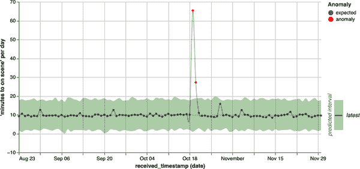

# 第三章：评估自动化数据质量监控对业务影响

通过机器学习自动化数据质量监控，您可以超越传统方法，如度量监控和基于规则的测试。但在深入讨论此方法的实施细节之前，我们想先解决可能存在的疑虑（或至少在页面上）。*是否值得？*

我们不会假装这个问题有一个唯一的正确答案。我们也不会告诉每个人明天就去建立或购买自动化数据质量监控平台。但我们可以帮助您回答诸如以下问题：

+   最适合自动化数据质量监控的数据类型是什么？

+   在我们投资之前，我们的数据堆栈应该是什么样子？

+   如何衡量新的数据质量监控方法的投资回报率？

数据质量问题是不可避免的（见下文侧栏）—但您选择的解决方案并非如此。本章结束时，您应该具备所有必要的工具，以进行对组织从自动化方法中获益的自我评估。我们将涵盖您应考虑的四个关键因素：您的数据、您的行业、您的数据成熟度以及您的利益相关者如何受益。然后，我们将提供有关如何通过 ROI 分析评估利弊的见解。

# 评估您的数据

您的数据及其特征可以告诉您很多关于自动化数据质量监控如何（以及是否）满足您公司需求的信息。多年前，IBM 提出了“大数据的四个 V”概念：体积、多样性、速度和真实性。它仍然是一个有用的框架，如原始[信息图](https://oreil.ly/0kYP1)所示。以下是我们对这四个方面及其对自动化数据质量监控的影响的解释。

## 体积

如果数据量足够小，那么人们可以手动审查它。但即使每天只有几十条新记录，也可能需要进行自动化数据质量监控。当每天的数据行数接近百万或十亿时，挑战在于找出数据小但重要的部分中的数据质量问题——这使得投资于无监督学习模型和避免警报疲劳的通知变得至关重要（这是我们将在未来章节讨论的方面）。

## 多样性

组织捕获的数据种类越多，数据质量问题的风险表面积就越大。多样性的来源包括：

+   数据的结构如何

+   数据是如何收集的

+   数据中时间的测量方式

+   数据更新的方式

+   数据中描述的实体是什么

+   数据中的记录如何与其他记录相关

+   描述的业务过程的变化

+   数据的粒度或摘要程度如何

对于不同类型的数据，您关心的监控内容通常会发生变化。例如，考虑一下列可以通常被分类为标识符列、时间列、分段列或度量列。在每一类数据中，您可能关心的监控事项都不同——我们在这里列出了最重要的几项：

标识符列（例如，客户 ID）

需要监控的内容：唯一性，格式，关系完整性

时间列（例如，事件时间戳）

需要监控的内容：粒度，顺序，到达时间间隔

分段列（例如，客户地区）

需要监控的内容：有效性，分布，基数

度量列（例如，每日总订单）

需要监控的内容：平均值，分布，异常值

数据多样性的一个重要方面是*结构*。您的数据有多结构化将极大地影响您可能想要应用的监控策略。通过合适的技术，即使是非结构化数据，您也可以自动化数据质量监控。但通常来说，数据结构化程度越高，使用自动化方法进行监控就会越容易。

### 非结构化数据

非结构化数据可能包括视频、图像、音频和文本文件。在处理非结构化数据时，您将需要额外的算法来“解码”其内容，以获取您可以监控的值。

一种方法是计算关于非结构化数据的元数据（例如视频的长度、图像的大小）并监控该元数据以检测数据质量问题。为了更直接地监控数据值，您有时可以训练一个 ML 分类器——例如，您可以想象训练一个计算机视觉模型来检测模糊图像。

或者，您可能已经有一个使用数据作为输入的深度学习模型，例如通过摄取大量非结构化文本学习预测序列中下一个词的模型。如果您希望尝试在输入数据中找到问题，您可以通过监控模型的*嵌入*来监控：N 维数值向量，代表输入数据。通过使用无监督的 ML 方法监控嵌入中的漂移，您可以通过代理监控输入数据的变化。

然而，每次模型重新训练时，其嵌入会发生巨大变化。因此，这种监控策略仅对静态深度学习模型有效。随着[基础模型](https://oreil.ly/uy_Ci)的崛起¹，这些模型是用于文本和图像处理的大规模深度学习模型（如 OpenAI 的 DALL-E 和 GPT-4），这些嵌入在主要版本升级之间是稳定的，因此监控您的非结构化数据在这些嵌入空间中如何变化是一个有用的建议。

理解您的非结构化数据在嵌入空间中如何变化的意义和影响仍然是一个具有挑战性的问题。然而，[解释个体神经元的新突破](https://oreil.ly/nGEs_)可能会使这变得更加容易。此外，组织可以将他们的结构化数据与非结构化数据嵌入关联起来，以表征其数据的哪些部分正在经历显著的变化。例如，可能会发现显著的分布变化仅限于特定地理区域的客户或来自特定平台的产品体验。最后，您可以随时返回文本本身，检查那些异常的样本，甚至可以要求生成式 AI 模型总结这些异常记录的样本。

### 半结构化数据

半结构化数据没有固定的平面表结构；其结构可能随时间而变化并且可以是嵌套的。但它确实有一个结构（例如标签和位置值），这些结构强制执行其元素之间的某种层次结构或关系。要自动化监视半结构化数据，通常需要混合使用模式验证、定制算法和规则。

许多类型的领域特定数据——例如地理数据或 DNA 序列——属于这一类别。但到目前为止，半结构化数据最常见的类型是 JSON 数据。特别是在公司较少成熟时，工程师通常会将数据存储为 JSON：每条记录都可以具有自定义模式，以捕获个别数字事件或用户配置文件的特殊性，并且随着时间的推移，此模式可以迅速变化，因此无需不断进行[迁移](https://oreil.ly/w2Dba)结构化数据存储。

对于 JSON 数据，您需要考虑如何监视两个概念：*对象*或`*{"key": <value>}*`对，以及*数组*，由括号括起来的值列表。在最复杂的情况下，您将同时具有对象和数组的嵌套组合。

JSON 对象可以作为数据表中给定列的附加列轻松扩展。假设一个列`json`包含值`{"name": "bob", "age": 32}`。该列可以扩展为一个包含`“bob”`的字符串`json.name`列和一个包含`32`的整数`json.age`列：

| `json` [json] | `json.name` [string] | `json.age` [integer] |
| --- | --- | --- |
| `{"name": "bob", "age": 32}` | `"bob"` | `32` |

一些数据仓库将自动支持这种扩展并帮助您强制执行 JSON 的模式。但是，事先知道模式是不常见的（因为不同团队的工程师经常会更改模式或编写新的模式）。在这种情况下，您需要在监视之前扩展数据。

JSON 数组更难处理。您可以将它们视为已“压缩”为单行的数据的关系形式。例如，数组可用于指定客户的地址。

虽然你可以将这些列表展开为关系表，但你的选择并不那么吸引人：你需要将每个列表扩展为一个新表，带有客户 ID 列（根据每个客户的地址数量重复 1 到 N 次）和包含地址信息的地址字符串列（实质上是进行数据库标准化），如下所示：

| `customer_id` [整数] | `address` [字符串] |
| --- | --- |
| ... | ... |

这将使这些数据与其他客户信息隔离开来，使得难以看到地址问题与其他数据问题之间的相关性，并且使得使用其他客户信息来找到地址问题的根本原因变得更加困难。

另一种选择是将地址信息扩展为多个列（其中大多数列将是稀疏的，因为许多用户只有少量地址，但某些用户可能有很多地址），如下所示。这两种情况都不适合使用无监督 ML 进行监控：

| `customer.address1` [字符串] | `customer.address2` [字符串] | ... | `customer.addressN` [字符串] |
| --- | --- | --- | --- |
| ... | ... | ... | ... |

处理此类数据列表的一种策略是随机抽样数组元素，并监视这些元素以发现数据质量问题。此策略还允许你优雅地处理对象和数组嵌套的情况。我们将在第四章深入讨论抽样。

### 结构化数据

结构化的关系数据通常是最重要的监控数据类型，因为它是最经常被分析平台、ML 模型和其他数据产品消耗的形式因子。虽然它可能不占组织累积数据总量的大部分，但它构成了不成比例的*有价值*数据。在此类别中，有三种类型的结构化数据是你应该考虑监控的：标准化的关系数据、事实表和汇总表。

#### 标准化的关系数据

在数据质量监控的背景下，你可以将标准化的关系数据视为分布在多个表中相互关联的数据（数据库标准化的确切定义和用途超出了本书的范围）。每个表都将有一个主键和与该主键唯一相关联的数据；每个表也可能有多个外键，可以用来与其他表进行连接。

此类数据在生产应用中非常常见。当在 OLTP（在线事务处理）模式下读取或写入数据库时，这是存储数据的最有效方式，每次应用程序交互都会生成与之相关的数据库读取和写入。许多数据仓库会将规范化数据直接复制到数据仓库中，作为存储在生产应用中的数据的原始“副本”。然后，这些数据将转换为事实表或汇总数据——“数据工厂”工作（参见章节“数据工厂内部的问题”），将数据转换为更适用于仪表板和其他数据产品的形式。

数据质量监控可以并且应该直接应用于规范化的关系数据，因为这些数据通常是下游问题“根源”的关键。然而，这些数据仅提供有限的监控表面，因为每个表都是狭窄且自包含的。要真正理解问题的范围和背景，数据监控解决方案需要与关系模型中的其他表连接——如果在查询时进行，这将是昂贵的。

#### 事实表

为了克服将每个查询编写为多个规范化表的复杂联接和聚合的分析挑战，许多组织创建了“事实”表，将数据非规范化为一个单一的物化表。

例如，电子商务公司可能有一个`fact_orders`表，其中每一行代表客户在其网站上的一个订单。除了与该特定订单相关的时间戳和标识符外，它还可能总结其他表中的信息：

+   关于客户在订单之前采取的行动的信息（来自网页/移动事件表）

+   关于下订单的客户的信息（从客户表中合并）

+   关于订单中购买的商品的信息（从商品表中合并）

+   与订单的履行、取消或其他处理相关的时间戳（从订单处理事件表中合并）

*这些表通常是监控数据质量问题时最具洞察力的。* 事实表采用非常细粒度的信息，原本可能分散在数十或数百个表中，并将其汇总到具有实际业务价值的实体中。它们也专门设计和维护，以作为其他分析、机器学习和产品团队的集中基础。因此，在这个层面上可见的问题通常是重要的问题；它们可以通过无监督机器学习监控、基于规则的测试和指标监控的组合来发现。事实表还提供了大量关于表中每条记录的上下文，这可以帮助理解问题何时发生。

#### 汇总表

摘要表是关系数据或事实表的聚合，通常用于支持仪表板和报告。例如，电子商务公司可能有一个客户摘要表，显示每位客户的最新统计信息，如订单数量、满意度评级和预期生命周期价值。或者，金融服务公司可能维护关键业务部门每日财务表现和风险信息的日汇总，用于生成财务报告。

*这些表格对于监控数据质量问题至关重要，因为它们是报告应用程序的基础。*一个微妙之处在于，这些表格通常只会显示每个实体的最新信息。因此，数据监控解决方案需要对这些表格进行快照，以便随时间检测到的问题。

## 速率

数据以各种速率收集、聚合和分发。例如，考虑每年生成的普查数据，与每毫秒生成的交易产品数据进行比较。

表格 3-1 显示随着数据更新频率的变化，监控数据质量问题的适当策略也在变化。

表格 3-1\. 数据更新频率与监控策略的变化方式

| 频率 | 范围 | 示例 | 监控 | 解决 |
| --- | --- | --- | --- | --- |
| 年 | 普查 | 大规模人口调查 | 手动 | 手动 |
| 季度 | 财务 | 季度财务报表 |
| 月 | 结算 | 每月结算周期报表 |
| 周 | 调度 | 零售业的每周调度数据 | 算法 | 人工审核 |
| 日 | 摘要 | 每日用户摘要统计 |
| 小时 | 上下文 | 医疗设备摘要统计 |
| 分钟 | 活动 | 广告归因数据 | 确定性 | 程序化 |
| 秒 | 事件 | 在线活动欺诈检测 |
| 毫秒 | 交易 | 信用卡批准流程 |

对于不频繁到达的数据，数据质量监控通常是一个手动过程。虽然可以使用机器学习模型比较不同时间段的数据集，但问题在于其相关性。当数据每年才到达一次时，模型需要多年时间来学习预期的变化——同时，生成数据的过程几乎肯定会发生变化，使模型的知识变得无关紧要。

对于每周、每日或每小时到达的数据，可以使用无监督机器学习进行自动监控，这既可能又强大。有足够的数据历史来训练模型，评估样本大小通常足够大以检测有意义的差异，并且频率开始变得过高，以至于无法在没有显著成本和负担的情况下由人类手动审查数据。

对于每分钟甚至毫秒级别到达的数据，监控考虑又有所不同。您需要能够通过程序响应实时纠正任何问题——涉及人类将会太慢。因此，尽管应自动监控此类数据，但仍需要更加确定性的解决方案（即仅基于规则的测试），以确保不存在误报的风险。

## 准确性

数据的准确性实质上是数据的真实性或正确性。我们无法真正知道数据是否准确地反映了现实世界，因此要对数据集的准确性进行良好的近似评估，您可以查看引入新数据质量问题的固有风险（见第一章）。您还可以考虑可能增加您对数据准确性信任的因素，例如数据生产者与数据消费者之间包含 SLA（服务级别协议）的合同，包括数据交付频率等。

您的数据源的准确性显然会影响您从数据质量监控中获得的价值。我们建议查阅第一章和附录 A，了解数据质量问题的示例及其发生原因，并将这些问题映射到您的业务中处理的数据类型。您还可以考虑审计您过去遇到的数据质量问题：数量、严重性等。

作为经验法则，以下数据源通常是最不可靠的：

+   尽管来自第三方的数据通常非常可靠，但其变化可能会出乎意料，而且未必与消费实体进行沟通。这通常是需要优先监控的数据。

+   由相互交互的非常复杂系统生成的数据更有可能遭遇数据质量问题，因为一个系统做出的假设可能不被其他系统尊重。

+   由正在持续变化和快速改进的系统生成的数据更有可能遭遇数据质量问题。

+   由传统系统生成的数据也更有可能存在问题，因为数据质量往往随时间而下降，并且这些系统通常未得到良好的维护。

## 特殊情况

在极少数情况下，某些类型的数据难以通过无监督的机器学习进行监控。在以下情况下，您可能需要手动或纯粹基于规则的方法：

+   数据的收集非常重要，尤其是需要手动输入的客户地址等个别数值。对于这种情况，您需要在输入时验证数据。如果直到数据进入数据仓库才发现问题，除非回头向客户再次确认地址，否则很难进行修复。

+   数据中实体或交易数量非常少。例如，金融公司有关并购的数据很难自动监控数据质量。这类数据数量不大，且交易形态和结构各异。

+   数据以单一的大型静态数据转储方式收集。例如，考虑来自制药试验的数据。如果试验持续时间较长，则可能需要进行数据质量监控，但在大多数情况下，这些数据是一次性使用相同的过程和系统收集的。如果存在数据质量问题，这些问题可能是数据固有的。您需要一个验证规则来发现这类问题，并将您对现实的预期与数据所说的进行比较。

# 评估您的行业

在 Anomalo，我们的客户主要来自以下行业：金融服务、电子商务、媒体、科技、房地产和医疗保健。虽然这一景观肯定会继续变化和发展，但我们对于为什么今天某些行业对数据质量的重要性感到如此迫切，进行了大量思考。

这部分是由之前讨论的数据因素造成的。所有提到的行业都与大量来自交易和事件的数据打交道。一些行业严重依赖第三方数据；例如，房地产公司依赖于来自多个合作伙伴的多列表服务（MLS）数据，这些数据的格式、及时性和质量各不相同。而在电子商务、科技和媒体等数字原生行业，平台和产品经常快速变化。

然而，还有一些额外因素可能会在推动行业采用自动化数据质量监控方面产生重大影响。

## 监管压力

毫无疑问，监管机构正在推动一些组织投资于自动化数据质量。例如，金融机构必须满足各种市场监管机构的监管要求，否则将面临重大的后果。例如，[富国银行](https://oreil.ly/-iddF) 在 2021 年因未能保护消费者免受不安全行为，被美国国家银行监督管理局处以 2.5 亿美元的罚款和法律约束同意令。花旗银行[被罚款 4 亿美元](https://oreil.ly/nnIMz)，涉及企业范围内风险管理、合规风险管理、数据治理和内部控制方面的缺陷。

[EDM 委员会](https://oreil.ly/XVogi)是一个著名的全球性协会，提供企业数据管理及其与监管义务交叉相关的咨询和建议（所以不要寻找音乐推荐）。他们的[云数据管理能力（CDMC）框架](https://oreil.ly/BiFge)为处理敏感数据提供了最佳实践，并经常在金融机构中使用以确保合规性。该框架的关键方面包括：

CDMC 1.1

当关键控制合规性指标监测到低于特定阈值时，自动生成警报。

CDMC 1.2

确保数据目录中的所有权字段对于迁移到或在云中生成的敏感数据是填充的，并且如果创建了未填充此字段的数据资产，则通过分类工作流通知客户。

CDMC 5.2

必须为敏感数据启用数据质量测量，并在可用时分发度量。数据质量指标将使数据所有者和数据消费者能够确定数据是否合适使用。这些信息需要对所有者和数据消费者可见：

+   自动向数据所有者和数据消费者提供数据质量指标。

+   在数据目录中提供数据质量指标。

+   自动警报数据所有者有关数据质量问题。

CDMC 6.0

所有敏感数据必须提供数据血统信息。这至少包括数据在云环境中被摄入的源或创建的源。

很难想象如何在规模上实现这些保证，如果没有本书讨论的技术。

即使今天大多数行业中没有这种严格的水平，规定通常从最紧急的情况开始在孤立的背景下开始，并随着时间推移成为其他人的榜样。例如，过去只有医院工作人员经常洗手以保护病人；逐渐地，这开始包括其他群体，如食品准备人员，最终成为每个人的常规做法。特别是随着 AI/ML 的使用增长，我们想象数据质量将会越来越受到监管，因为它开始影响我们日常生活的更多方面。

## AI/ML 风险

正如在第一章讨论的那样，当 AI/ML 模型在生产中使用的数据与其训练时的数据不匹配时，它们会表现不良。这很难调试，特别是因为数据质量问题通常不会以明显方式完全破坏模型，而是会使某些用户或场景下的表现变差。

如果你的组织正在构建模型，尤其是如果你将它们放在用户面前，那么你可能已经在数据科学、数据工程和 MLOps 方面进行了重大投资。如果没有将自动化数据质量监控作为 AI/ML 堆栈的一部分，这些投资将面临风险。为了说明这一点，让我们深入探讨由于数据质量问题在模型训练和推断期间可能发生的问题。

### 特征突发

图 3-1 展示了一种特征突发：一种影响 ML 模型特征的数据冲击。在单一天内，此特征的数据跃出了历史正常范围。这会对模型产生什么影响？

###### 图 3-1\. ML 模型数据中的特征突发。请在[*https://oreil.ly/adqm_3_1*](https://oreil.ly/adqm_3_1)查看此图的完整大小版本。

如果在训练数据中使用，这种突发将导致该特征的重要性减弱，因为模型会认为该特征对未来预测的可靠性较低。如果这种类型的突发发生在生产环境中，你的结果将根据所使用的模型类型而变化。

线性模型根据定义进行线性外推。因此，如果你的特征突发是预期值的五倍，那么该特征将对结果分数产生五倍更大的影响。基于树的模型通常更具韧性。特征突发将倾向于将特征推向分布的极端端点。然后，模型将开始解释这些值与“通常”处于极端的任何群体是同义的。

神经网络在特征突发时表现得非常不稳定。它们在架构中具有复合的非线性特性，当数据突然移动到典型分布之外时，可能会产生异常行为。几乎无法预测它们的行为会是怎样的。

### NULL 的增加

NULL 值的突增，在最好的情况下，对模型的影响与正常的特征突发相同。但在最坏的情况下，它可能以更加灾难性的方式影响模型。如果模型将 NULL 和零视为相同的方式处理，这种突增可能会使模型认为零值增加了，从而触发意外的行为。或者，如果模型聚合特征值，你可能会遇到 NULL 值叠加的问题。

想象一下，你有一张包含订单和订单中物品的表格，其中一个数据质量问题导致每十个物品价格中就有一个为 NULL。在某些平台上，如果计算物品价格的平均值，那些 NULL 值可能会主导聚合，导致每个订单的`avg_item_price`字段为 NULL，如果订单中有多个 NULL 物品的话。

### 相关性的改变

数据质量问题偶尔可能会改变列之间的相关性。例如，如果生成 ID 的方式出现故障，导致信用评分数据集错误地与贷款申请关联，那么结果的信用评分可能在分布上与正确值相同，但它们将不再与数据的其他特征（年龄、收入、信用历史等）相关联，也不会与未来的风险结果相关联！

当相关性突然改变时，结果行为将取决于模型的类型：

+   线性模型对特征之间的相关性非常敏感，尤其是如果它们没有很好地进行正则化（一种防止单个系数超过适当数值以适应数据的技术）。在这些情况下，相关性的变化可能导致模型预测出现较大偏移。

+   基于树的模型对相关性也非常敏感，因为它们通过逐列递归地对数据进行分区。相关性的变化将会使记录完全沿不同的路径进行路由，导致预测大幅波动。

+   神经网络会表现得不稳定，就像在特征突变时一样，因为数据分布突然开始进入一个空间（在多元意义上），而该模型并未经过训练。

### 重复数据

重复记录对于开发模型的数据科学家来说可能是一个主要问题。如果在创建训练数据集时错误地重复了数据，模型将在重复的信息上“过度拟合”，错误地认为它在现实中被过度表达。

在训练中，ML 模型学习将其参数“拟合”到训练数据集。然而，如果模型开始学习训练数据中的噪声，它可能会做得太好。这称为“过度拟合”。当构建机器学习模型时，数据科学家的主要关注之一是实现强大的泛化性能（避免欠拟合和过度拟合）。

另一个重复可能导致严重问题的地方是在拆分用于测试和训练的数据时。重复的记录很容易同时出现在训练数据和测试数据中。这将再次使模型“过度拟合”训练数据——在极端情况下，它可以简单地记住数据，因为相同的记录将出现在测试数据集中。结果是，模型看起来的表现比实际上好得多。

## 数据作为产品

当您将数据作为产品出售或打包时，您的数据质量就是您产品的质量，使数据质量监控对您的业务更有价值。一些公司直接提供数据作为服务。例如，金融服务中的信用聚合器、房地产中的 MLS 数据聚合器、投资中的上市公司财务表现数据以及电子商务中的竞争价格数据。

在其他行业中，企业并不一定在销售数据，但其数据仍然是产品提供中的重要组成部分。考虑媒体平台如何向内容创建者提供数据。这些创建者需要准确的指标，如观看次数和观看时长，以成功完成他们的工作，从而维护平台本身。如果在报告数据的方式上存在问题——也许是一个错误导致移动用户的双倍浏览被记录——这可能会对业务造成重大影响。

# 评估您的数据成熟度

随着组织的发展和成长，它们往往从“不成熟”的阶段，即刚开始收集数据，转向“成熟”的阶段，即构建人工智能和运行高级分析。在她的 Medium 文章中，我们的朋友和顾问 Monica Rogati 将此总结为[“数据科学需求层次”](https://oreil.ly/YmIce)。参见图 3-2。

###### 图 3-2。数据科学需求层次（来自 Monica Rogati 的文章，“AI 需求层次”，[Medium](https://oreil.ly/YmIce)，2017 年 8 月 1 日）。

在数据成熟度的早期阶段，您开始关注数据可观察性的问题，这些问题可以通过监控表格元数据来回答。数据是否已被摄取？最近一次更新是什么时候？

当您继续向金字塔顶部发展，并达到那个中间层时，在这个阶段，您开始探索和转换数据，现在是考虑自动化数据质量监控的好时机。在这个阶段，您很可能已经积累了大量的数据，并且希望为聚合和优化的下一阶段创建一个坚实的基础。这些未来阶段将依赖于高质量的数据，以提高效率。

达到数据成熟度金字塔的中间阶段后，企业通常会感到他们缺少资源（分析师、数据工程师、产品工程师）来*解决*可能通过更广泛的监控发现的数据质量问题。因此，他们得出结论认为不应该投资于自动化监控。然而，我们认为这是一个错误。这些数据质量问题几乎肯定正在干扰他们现有的工作人员，并且正在积累一个越来越难以克服的债务。

与其避免了解问题（并感到有义务去解决它们），您应该建立能够识别问题并积极优先考虑哪些问题值得投资修复的能力。通常情况下，这意味着从少数关键表（如事实表）中开始，同意前期必须满足的标准，以便在这些表中投资于数据质量问题的修复。

不确定您在数据成熟度方面处于何种位置？您的数据堆栈是一个很好的指标。

当一家公司尚未采用云数据仓库时，通常表明他们对所收集的数据的使用还不成熟，现在自动化数据质量监控可能为时过早。在生产数据存储或云存储中的静止数据上构建强大的分析报告堆栈和数据驱动的团队文化非常困难。

一些公司在投资现代化云数据仓库之前就试图解决数据质量问题，但这通常是一个错误。

在生产数据库（Oracle、SQL Server、PostgreSQL 等）直接监控数据，可能会给本不支持此类大规模查询的存储系统带来沉重的分析负载，这往往会影响生产流量。有时公司会尝试在云存储格式中监控数据的数据质量（Amazon S3 等），但如果没有直接查询这些数据的平台，你能做的最好的只是监控文件的元数据（大小、格式、写入日期等）。一种常见的折中方案是建立数据湖仓架构，以便通过查询引擎如 Presto（或其托管版本 Amazon Athena）或 Databricks（通过 Spark SQL）按需监控数据。数据也可以从云数据仓库如 BigQuery 或 Snowflake 作为外部表进行监控。然而，每次监控运行都需要读取每个文件的全部内容（除非缓存），因此将这些数据加载到数据仓库中最终可能成本更低且性能更好。

数据成熟度的另一个指标是您的组织是否使用像 Airflow、Databricks Workbench 和 dbt 这样的工具，在数据仓库中进行转换、聚合和丰富数据。这些活动的存在通常表明需要进行数据质量检查，因为它增加了引入数据质量问题的风险。此外，这些服务通常希望通过 API 与数据质量监控解决方案交互，以在数据转换或发布后触发数据质量检查，或者在上游数据源未通过关键数据质量检查时等待处理下游数据。

最后，成熟度的最后一个指标是您的公司是否已经在数据目录上进行了标准化。当您有许多利益相关者访问广泛的数据时，数据目录非常有用；它们有助于识别哪些数据最重要。通常应该密切监控数据质量的就是这些数据。这里还存在一种协同效应，因为数据质量监控的结果可以复制到数据目录，并向用户展示，帮助他们了解数据是否经过了充分测试并且质量高。

# 评估对利益相关者的益处

随着组织在数据需求金字塔上的提升，它往往会拥有一个更大的数据团队，对数据质量监控解决方案的要求也更高。例如，大部分工程师组成的团队可能仅需一个 API 来监控数据质量，但随着非技术用户数量的增加，拥有一个用户界面来探索数据并传达关于发现的质量问题的更丰富见解变得越来越有价值。

当确定自动化数据质量监控是否适合您时，最好的起点是直接与您的利益相关者进行沟通。在接下来的几节中，您将找到组织中许多角色如何从自动化解决方案中受益以及他们可能感兴趣的功能类型的描述。

## 工程师

这些是数据工程师、分析工程师或数据平台团队成员。他们负责管理平台、ETL 管道，并更新数据的跟踪和存储方式。他们最关心的数据问题与数据流动的新鲜度和量、以及不同来源数据的对账有关。

很可能一个工程团队将被指定负责数据质量监控平台的技术实施。因此，他们希望能够轻松配置、尽可能自动化，并且与堆栈的其他部分简单集成。工程师们通常希望有一个强大的 API，允许使用以下一个或多个选项：

+   直接通过代码与 API 进行交互。这可以是直接调用端点，或者通过 Python 包。这是与 API 交互最灵活的方式，但不一定是最简单的方式。

+   在像 Airflow 和 Databricks Workbench 这样的编排平台中使用包。这些平台将基础 API 中的功能整合，并直接集成到编排平台中。这里是[Anomalo Airflow 操作员](https://oreil.ly/R7P36)的一个示例。

+   与在代码版本控制系统（如 Git）中管理的配置文件（例如 YAML、JSON）进行交互，并通过 API 与监控平台同步。这允许配置更改作为代码管理，但不如直接调用 API 灵活。

## 数据领导

数据团队经理通常希望通过高级分析来追踪整体数据质量的健康状况、其随时间的趋势以及用户如何参与平台。

经理们通常感兴趣的典型 KPI 包括：

数据质量覆盖范围

有多少表格定义了检查？这些检查的执行情况如何？领导者可以通过高层次的覆盖视图精确定位盲点。

数据到达时间

领导层需要能够识别表格的数据是否按时到达或符合 SLA。

数据质量趋势

快照统计数据并不足以追踪数据质量。管理者必须能够通过时间序列视图和周对周的变化追踪随时间的改进。

多次违规

如果经理能够获得最有问题的表格列表或最常失败的检查以优先考虑他们的下一个数据质量倡议，这将非常有帮助。

为了了解数据质量监控解决方案如何为数据领导提供工具示例，请参见图 3-3 和图 3-4。

###### 图 3-3\. Anomalo 的 Pulse 仪表板提供组织的数据质量高级统计信息。

###### 图 3-4\. 点击任何统计数据可提供数据随时间的趋势，并识别重复出现的表格。在[*https://oreil.ly/adqm_3_4*](https://oreil.ly/adqm_3_4)查看此图的完整版本。

## 科学家

这些是数据分析师、数据科学家和 ML 平台团队的成员，他们参与构建数据产品和生成见解。他们通常对监控缺失数据、重复数据和分布变化感兴趣。

与工程师不同，这个群体倾向于使用易于使用的用户界面而不是 API。自动化数据质量监控解决方案可以赋予科学家权力的一种方式是为他们提供丰富的可视化工具来探索数据并确定问题的根本原因。

## 消费者

此类别包括所有依赖工程师和科学家构建的数据产品做出决策的其他人，如产品团队、运营、市场营销和合规性。这些通常是关于收集数据领域的最深的主题专家，并因此在指导数据质量监控和处理问题方面发挥重要作用。

为了建立对数据的信任并避免分散工具的大量使用，监控解决方案应为该组提供关于数据质量的单一真实来源。消费者不太可能参与问题解决，而应通过通知了解可能影响其工作的数据质量问题。这些通知应该清晰、易于理解，并以正确的紧急程度交付。

# 进行 ROI 分析

在评估所讨论的四个关键因素——您的数据、您的行业、您的数据成熟度和您的利益相关者之后，您可能会决定自动化数据质量监控似乎是个好主意。在这种情况下，您需要通过运行可能的 ROI 评估来说服自己和其他人。这种分析应考虑定量和定性指标。

对于在本章之外进行 ROI 分析的更多细节，有兴趣的读者可能希望查阅[案例研究](https://oreil.ly/_K7lj)，作者是 Discover Financial Services 的企业数据平台高级总监 Prakash Jaganathan。Discover 的大量数字银行和支付服务产品由数百个软件应用程序支持，并持续产生和存储 petabytes 的数据。该案例研究讲述了为何 Discover 通过订阅机器学习驱动的自动化数据质量监控平台，解决了传统确定性数据质量监控所面临的根本性挑战，以创新和卓越数据质量。

## 定量测量

要开始 ROI 分析，可以先看看业务中数据质量问题的频率。每个表发生这些问题的频率如何？每个事件通常造成多少成本：包括业务中断、调查和解决时间，以及其他对客户或运营的不利影响？对于你知道的每个数据质量问题，还有多少是*未被发现*但仍然对你的运营造成了不利影响？

一旦你估计出这个数字，你可以将其乘以每年每个表预期的问题数量，以及需要监控的重要表的数量。如果自动化数据质量监控解决方案的总成本能够减少这些事件的数量和严重程度，以及其产生的成本，那么你就可以证明其是合理的。

此外，看看你的团队在与数据质量相关任务上花费的时间，以及预计通过自动化数据质量监控来减少这些时间。典型任务包括：

+   创建和维护自动化数据检查

+   设置通知和警报

+   调查、探索和根本原因分析

+   长期监控关键指标

如果你有这些任务的历史统计数据，那么你可以计算通过实施自动化数据质量监控预计能够节省的小时数。这些小时可以作为时间和人才投入到其他项目中的回报。最好是能够与供应商进行试验，看看例如你在关心的表上设置监控需要多长时间。如果是内部建设，提前获得清晰的数字可能会有困难，但你可以设定一个目标，使投资变得值得，并在构建概念验证时记住这一点。

在与客户交谈时，我们经常被要求帮助估算配置监控表和分类警报所需的总小时数，以便他们将此时间与今天在数据质量上的支出进行比较。要记住，通过高效的监控平台，大部分数据质量工作将集中在相对较少的重要表上。在一个有 20,000 张表的数据仓库中，我们通常会看到如表格 3-2 中所示的分布：

+   10,000 个表格（50%）根本就不值得监控。通常这些是临时的、中间的或一次性的表格，可能会在未来被删除。

+   9,000 个表格用于处理，并应使用元数据监控数据新鲜度和数据量。我们称之为表格可观察性，它比在整个仓库上运行 ML 模型要便宜得多，同时提供基线水平的数据质量监控。

+   还有 900 个重要的团队特定表格，除了表格可观察性外，业务还希望使用自动化 ML 模型进行深入的数据质量监控。

+   在 90 个关键表格上，他们还希望设置验证规则和指标，以监控一些意外变化。

+   另外还可能有 10 个关键表格，除了所有其他的监控外，还必须具有多个记录级质量验证规则。这些往往是业务上至关重要的事实表。

表 3-2. 数据仓库中的监控表格

| 类型 | 表格 | 占比 | 用途 | 配置 | 监控策略 | 配置每表小时数 | 总配置小时数 | 每表警报频率 | 每周总警报数 | 每警报处理时间（分钟） | 每年处理时间（小时） |
| --- | --- | --- | --- | --- | --- | --- | --- | --- | --- | --- | --- |
| 临时 | 10,000 | 50% | 分阶段、测试或实验中 | 无监控 |   | 0 | 0 | 从不 | 0 | 0 | 0 |
| 处理 | 9,000 | 45% | 用于生成重要数据集的生产管道 | 表格可观察性 | 自动检测架构、新鲜度和数据量问题 | 0.01 | 90 | 每年 0.5 次 | 87 | 5 | 375 |
| 重要 | 900 | 5% | 原始数据和团队特定数据集 | 数据质量 | + 自动检测缺失、错误、重复或异常数据 | 0.2 | 180 | 每季度 1 次 | 69 | 20 | 1,200 |
| 关键 | 90 | 0.5% | 驱动数据产品和决策的事实和聚合表 | 数据质量 | + 监控指标和/或段以发现意外变化 | 8 | 720 | 每月 1 次 | 21 | 60 | 1,080 |
| 关键 | 10 | 0.1% | 关键数据元素和执行级别监控 | 数据质量 | + 强制记录级别质量的验证规则 | 40 | 400 | 每周 1 次 | 10 | 60 | 520 |
| 总计 | 20,000 | 100% |   |   |   |   | 1,390 |   |   |   | 3,175 |

您还应该权衡解决方案的设置和运行成本，如许可证、基础设施和计算。请注意，这些成本的额外考虑因素可能是支出（因此也是您预算）的可预测性如何。

## 定性措施

自动化数据质量监控的一些定性好处包括：

+   加快开发周期，因为您可以在功能发布后更快地捕捉生产问题。

+   由于高测试覆盖率、更少错误和更快的响应时间，与合作伙伴的信心提高

+   拥有“审计追踪”，您可以记录历史数据检查和数据的过去性能

+   民主化数据质量并提高协作和所有权，从而提高员工的生产力和满意度

+   提升数据的信任度，从而提高其他数据相关工作的投资回报率。

自动化数据质量监控的定性缺点可能包括：

+   对变革的抵制；员工必须掌握新的技能。

+   需要开发新的培训和入职资源。

+   潜在的安全风险；例如，如果您使用的 SaaS 解决方案没有部署在虚拟私有云（VPC）中。

+   （如果您在内部建设）需要随时间维护您的解决方案并承担故障的责任

+   存在假阳性或信息贫乏通知引起的警报疲劳的风险（另一方面，警报可以带有丰富的上下文和可视化，描述问题特征，识别根本原因，并帮助用户了解问题可能的严重性。用户界面还可以提供分类和解决问题的手段。所有这些便利措施在很大程度上有助于减少警报疲劳。）

最终，我们看到数据领导者将提高数据质量的价值视为其整个数据预算（技术和人员）投资回报率的乘数。例如，考虑一个每年在数据技术上花费 3000 万美元，数据专业人员（全面的薪酬）每年花费 7000 万美元的组织。该组织投资这 10000 万美元的预期回报率为 20%。然后，他们每年预期生成的价值为 1.2 亿美元，通过改善人类决策，通过 ML 和 AI 提供更好的运营和更好的客户体验，以及可以直接货币化的新数据产品。

如果数据质量能够显著提高，那么预期价值的增加可能会达到高达 10%。这可能发生在因为减少了追踪数据质量问题而浪费的时间，因此人力投入更具生产力，或者因为决策和机器学习模型的质量更高，直接转化为更高的投资回报率。

最终的效果将意味着该组织将创造价值 1.32 亿美元，每年因更高的数据质量而增加 1,200 万美元的价值。

在实践中，虽然在某些情况下进行严格的投资回报率分析可能是必要的（尤其是为了说服您的财务或采购部门需要投资于数据质量），但我们与许多大型企业合作时，很少有企业会费心进行此类分析。改善数据质量的理由可能是如此明显和强有力，以至于问题更少关于投资回报率，而更多关于速度。

# 结论

要实现规模化的数据质量监控自动化，您需要进行多项权衡。您需要投资新技术，引入新流程，并承诺解决您发现的新数据质量问题。

我们建立了一个自动化数据质量监控平台，因为我们相信这些权衡对许多公司都是有价值的。沿途中，我们与许多对这一解决方案感到兴奋的企业和团队进行了多次互动。但我们也了解到了时间不合适或者适配不对的情况。在本章中，我们尝试全面阐述为何您可能从自动化数据质量监控中受益，另一方面，它可能不适合您的解决方案。

对于自动化数据质量监控平台的投资回报率感到兴奋吗？在接下来的几章中，我们将提供您所需的详细指导，帮助您迈出下一步。从不同的建模技术和考虑因素到如何提供高质量通知，本书中最技术性的主题即将登场。拿出您的笔记本，特别是您的数据科学笔记本，因为现在是深入实施细节的时候了。

¹ Rishi Bommasani 等人，“基础模型的机遇与风险”，2022 年 7 月 12 日，https://arxiv.org/abs/2108.07258v3。
