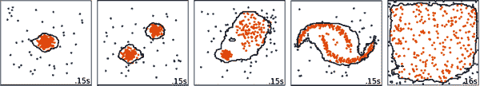
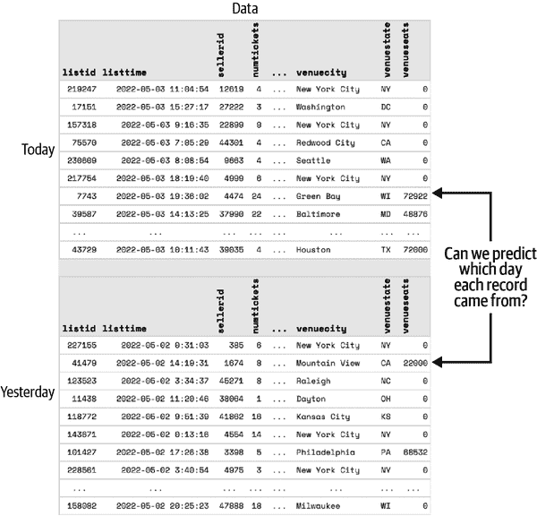
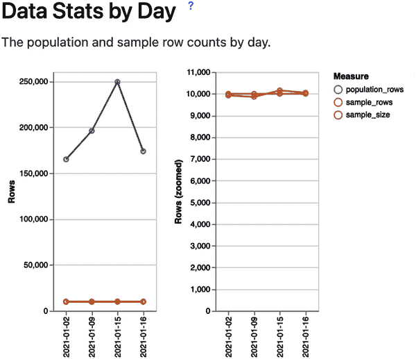
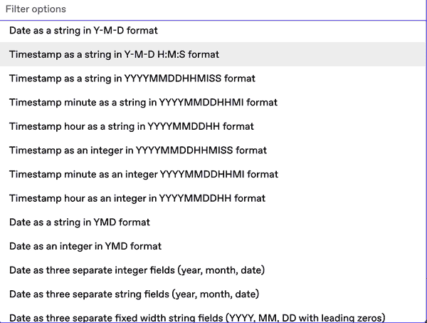
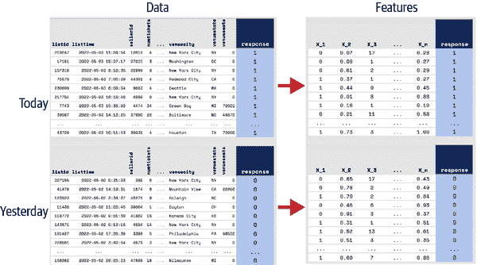
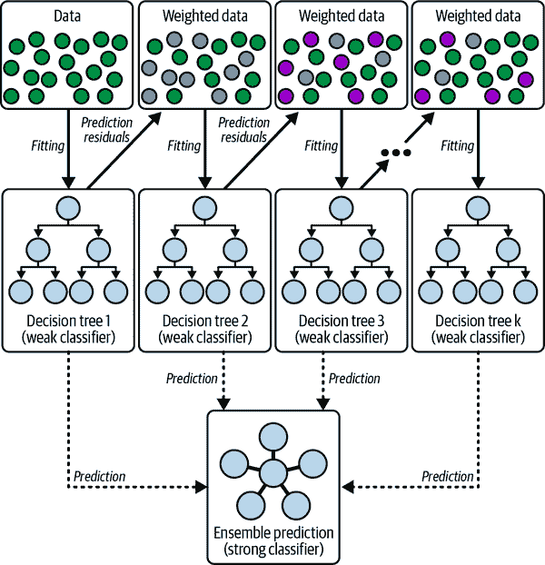
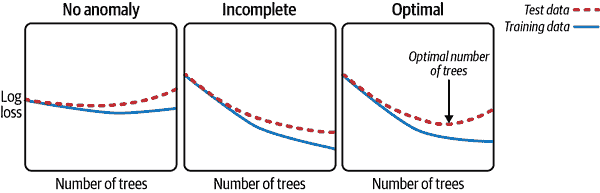
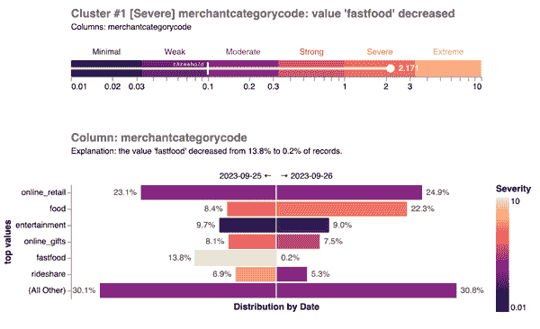
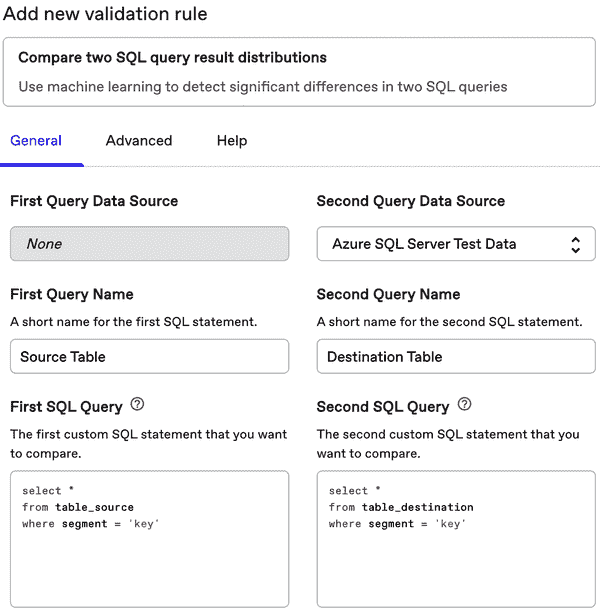

# 第四章：使用机器学习自动化数据质量监控

机器学习是一种统计方法，与基于规则的测试和指标监控相比，具有许多优势：可扩展性强，可以检测未知的变化，而且，在将风险人性化的前提下，它还很聪明。它可以从先前的输入中学习，使用上下文信息来减少误报，实际上可以越来越好地理解您的数据。

在前几章中，我们探讨了自动化 ML 何时以及如何对您的数据质量监控策略有意义。现在是探讨核心机制的时候：您如何训练、开发和使用模型来检测数据质量问题，甚至解释其严重性以及发生在数据中的位置。

在本章中，我们将解释哪种机器学习方法最适合数据质量监控，并展示您可以遵循的算法（一系列步骤）来实施这种方法。我们将回答诸如应该采样多少数据以及如何使模型的输出可解释等问题。需要注意的是，遵循这里的步骤不会导致一个准备好监控实际数据的模型。在第五章中，我们将转向调整和测试系统的实际方面，以使其在企业环境中可靠运行。

# 要求

对于给定问题，有许多 ML 技术可以潜在应用。要找出适合您使用案例的正确方法，需要在前期定义要求至关重要。我们认为用于数据质量监控的模型应具备四个特征：灵敏度、特异性、透明性和可扩展性。

## 灵敏度

灵敏度是衡量 ML 模型能够检测真正阳性的能力的指标。为了有效，算法应能够在实际表格数据中检测到各种数据质量问题。一个良好的基准是能够检测到影响超过 1%记录的变化。

实际上，我们发现试图检测影响不到 1%记录的变化会导致一个系统产生太多噪音。即使检测到的变化在统计上是显著的，也会有太多这样的变化需要分类和理解，特别是当规模扩展到大量复杂表格时。我们的经验表明，影响超过 1%记录的变化是数据生成或转换过程中的重大*结构性*变化，可能是重大的新冲击和创伤。

要查找小于 1%的变化，您可以使用确定性方法（如验证规则），或者可以通过在仅查询最重要记录的视图上运行模型来聚焦 ML 在数据子集上。

例如，社交媒体平台可能在单个大事件处理表中跟踪数百种不同类型的事件。在整个表上运行机器学习将捕捉格式和结构最常见的事件类型的严重问题。但如果您想要密切关注每个事件特定子集，您可以选择在每个事件特定的子集上运行模型。

## 特异性

与灵敏度相对应，特异性告诉您模型在*不触发假阳性警报*方面的表现有多好。这在数据质量监控中尤为重要，因为警报疲劳可能会威胁整个方法的采纳和功效。

通常，监控系统倾向于因为几个原因而过度报警。一个原因可能是季节性——如果数据中有每天、每周或每年重复的模式，数据看起来可能正在变化，但实际上并没有以异常或意外的方式变化。如果监视器不能聚合受同一数据变化影响的相关列，它也会变得嘈杂。或者如果它对数据的样本或时间窗口评估太小，也可能发送假阳性警报。此外，有些数据集比其他数据集更加“混乱”，因此需要校准每个数据集的检查灵敏度阈值（并可能随时间演变）。

我们将探讨模型如何在第五章中学习和考虑季节性、相关性和其他现实世界数据的挑战。

## 透明度

当出现问题时，模型应该是透明的，并帮助用户理解和找出问题的根本原因。你可能会认为这与模型本身无关——毕竟，任何复杂的可视化和问题根本原因分析都会在检测到数据问题之后发生。但你的选择确实取决于你使用的机器学习方法。你模型的架构和实现将决定你能够解释和归因其预测的程度。例如，某些机器学习特性可能有助于提高准确性，但在数据质量的背景下解释给用户可能会很困难。

## 可扩展性

要在数据仓库中每天运行可能涉及数十亿行数据的任务，您的系统必须具备人力、存储和计算成本的可扩展性。它不应该需要管理员进行任何预先配置或重新调整，因为这只会创造另一种手工编写的规则形式，我们已经在第二章中显示这不是一个可扩展的解决方案。它应该对数据仓库的查询占用尽可能小的资源，并且能够在仓库之外的廉价硬件上快速执行。这些约束条件将影响我们建模决策的许多方面，我们将在本章中探讨使解决方案更具可扩展性的方法。

## 非要求

定义系统*不*需要做的事情与定义应该做的事情一样有用。你可能还记得第二章中讨论的一个无监督机器学习模型应该是三支柱数据质量方法的一部分，另外还包括基于规则的测试和指标监控。这是因为期望自动化解决所有数据质量问题是不可行的。

下面是我们模型的非要求清单：

+   它不需要识别个别的坏记录（这是基于规则的测试的作用：当需要数据完美时）。相反，我们期望它寻找有意义百分比记录中的结构性变化。

+   并非需要实时处理数据。实时评估数据质量检测的机器学习模型不仅难以扩展，而且可能被迫评估单个记录，这超出了我们的范围。相反，我们期望它能够以每日或每小时批次评估数据。

+   我们不能期望它能够告诉我们数据一直都是损坏的 — 这不是机器学习的工作方式，因为模型必须基于历史数据训练。如果历史数据是错误的，我们无能为力！这就是为什么机器学习方法仅应依赖于识别数据中的*新*变化。

+   我们不能指望它在没有时间概念的情况下分析数据。模型将会随时间追踪数据以检测变化。如果数据本身没有时间戳，我们将需要开发其他方法来识别数据生成的时间（稍后详述）。

## 数据质量监控不等同于异常检测。

在我们结束对数据质量监控模型要求的讨论时，值得花一点时间解决一个常见的困惑：异常检测与数据质量监控的区别。

异常检测可以是理解复杂数据集的一种有用方式。有许多方法可以识别异常值，但其中一种最可扩展和灵活的方法是使用一种变体的随机森林，称为[孤立森林](https://oreil.ly/teNNd)，来识别远离多变量分布“中心”的数据行，如图 4-1 所示。



###### 图 4-1\. 使用 scikit-learn 中的孤立森林（Isolation Forest）查找异常观测的示例（那些在界定的簇外的点）；来源于《对玩具数据集上的异常检测算法进行比较》，[*Scikit-learn*](https://oreil.ly/rhJ9o)。

通过机器学习可以实现异常检测，它旨在发现数据的不寻常方面。但与数据质量监控的相似之处就到此为止。毕竟，每个数据集都会有异常观察结果——即使正态分布也会有极端值！这些异常值可能很有趣（它们可能是欺诈记录或者仅仅是非常罕见的事件或数据组合），但它们未必会是数据质量问题，这可能会影响常见或罕见记录的概率是一样的。

要识别数据质量问题，我们需要知道数据到达表中的分布是否出现了突然的结构变化。我们需要知道过去记录是否总是以某种分布、模式或关系出现，而现在突然之间，这种情况以显著的方式发生了变化。另一方面，每个数据集都有异常值。异常检测解决的是一个根本不同的问题。

# 机器学习方法和算法

现在我们已经涵盖了需求，我们将分享我们推荐的方法以及您可以采用的步骤来实施它。我们不愿声称这是使用机器学习检测数据质量问题的唯一方法，但我们尚未遇到比实践中更有效地满足要求的方法。正如常言道，细节决定成败。诸如特征工程和参数调整/阻尼在实现有效的实施与在真实世界数据上过度或不足报警之间起着至关重要的作用，我们将在第五章进一步讨论。

请回忆，我们希望开发一个机器学习模型来检测数据中的意外变化，而无需任何人员标记数据并告诉我们什么构成了数据质量问题。这使得这类机器学习问题成为*无监督学习*任务。然而，数据中确实有一个我们可以像人类标签一样使用的特征，那就是*数据到达表中的时间*。

这就是这种方法的关键洞察力所在。每天，我们都会对数据进行快照。然后，每天，我们都试图训练一个分类器来*预测数据是否来自今天*。



如果今天的数据在统计上没有什么显著的特点，那么我们尝试训练分类器的努力将会失败——预测数据是否来自今天应该是一个不可能的任务，基本上是扔硬币！

另一方面，如果我们*能够*构建一个分类器，能够相当准确地预测数据是否来自今天，那么我们可以非常确信今天的数据有些不同寻常。而且这种不寻常是有意义的——因为几条记录中的少量随机变化是不足以训练模型做出预测的。事实上，我们甚至能够使用这种方法来说出变化的*程度*，并设置适当的阈值以避免警报过度疲劳。通过解释模型的预测，我们可以解释数据内部最有可能发生的情况。

即使变化并不有趣，模型也能检测到显著的变化。最明显的例子是日期列。该列每天都会变化，因此它总是代表数据的显著变化！我们将在第五章讨论如何处理这类情况。另一种可能不具有意义的变化是最终用户根本不关心的变化。我们将讨论如何在第六章处理这类警报。

现在你已经了解了主要思路，让我们详细探讨每一步：

数据抽样

如何构建用于训练模型的数据集，以及合适的样本大小是多少？

特征编码

如何从表中的一行转换为模型可以用来进行预测的特征集？

模型开发

为这种算法选择正确的模型架构，以及如何训练模型？

模型可解释性

一旦你训练好一个模型，如何用它来解释数据质量问题？

## 数据抽样

构建任何模型的起点是从总体数据池中抽样创建一个训练数据集。对于我们刚刚描述的算法，您需要从“今天”（标签为 1 表示我们试图预测的类）和“不是今天”（标签为 0）中随机抽取一组健壮的数据。 “不是今天”的数据应该是之前的时间比较周期的混合物：昨天（或上次获得数据更新的时间）用于突然变化，以及其他周或年的其他时间用于控制季节性（参见章节“季节性”）。

例如，在图 4-2 中，我们看到一个示例数据集，每天的数据量在 15 万到 25 万行之间。一个健壮的样本可能包括来自以下日期的 1 万条记录：

+   2021-01-16：您希望评估数据质量问题的日期

+   2021-01-15：昨天，有助于识别任何突然变化

+   2021-01-09：一周前，为了控制星期几季节性因素

+   2021-01-02：两周前，以防上周出现异常



###### 图 4-2\. 展示样本大小与数据集整体大小的对比图。

### 样本大小

在实践中，我们发现这种算法每天至少需要 100 条记录才能有机会在相对复杂的数据中找到有意义的变化。但这引出了一个问题——对于算法来说，记录数的上限是多少才是有效的？

可以选择抽样率来平衡计算成本与精度。我们已经针对每天新增数十亿行的数据集运行了这种算法。在实践中，并基于严格的测试，我们发现每天抽样 10,000 条记录（如果随机抽样）提供了足够的数据来捕获大多数数据质量问题，即使这些问题只影响 1–5% 的记录。随着样本量超过 100,000，质量改善逐渐减弱。

可以使用大样本量（比如，每天 1,000,000 条记录），但计算成本尚未证明其价值。数据集需要非常稳定（背景混乱较少），变化必须在非常小的记录百分比内（比如，0.1% 的记录）才能使增加抽样大小变得值得。

将抽样固定为一个固定的样本大小（10,000 条记录）似乎是一个错误，而不是抽样，比如，数据的 10%。毕竟，如果我有 10 亿条记录，10,000 条如何代表那么庞大的人口？

或许出乎意料的是，因为样本完全是随机选择的，其精度并不依赖于数据的总大小，而只依赖于绝对样本大小。例如，考虑估计一个国家的平均收入。仅因为中国人口为 14 亿，卢森堡人口为 60 万，这是否意味着我们需要在中国抽样更多的人来估计平均收入？不是的。在这两种情况下，我们可以抽样 1,000 人，并得到一个非常好的平均收入估计。

### 偏差和效率

很重要的一点是从表中*随机抽样*样本。如果抽样中存在任何偏差，算法将能够发现这种偏差，并将其表示为数据中的虚假正变化，这会使用户感到困惑。

确保抽样尽可能高效也至关重要。在实践中，从数据仓库中随机抽取记录对于机器学习模型通常是这类系统中最昂贵的操作。这是因为表中可能包含数十亿甚至数万亿的记录，以及数百或数千列。如果一个查询天真地要求将每条记录读入内存或通过网络发送以进行抽样，这将对性能造成灾难性影响并产生大量的数据仓库成本。

偏倚和效率有时可能存在相互制衡的关系。例如，在现代数据仓库中有效地扩展随机采样的一种方式是使用 `TABLESAMPLE` 操作符，而不是 `random()` 调用。`TABLESAMPLE` 操作符是以一种允许仓库在查询执行期间有效地对随机记录进行采样的方式实现的，而无需将记录读入内存——但在某些情况下，它可能会对偏倚产生负面的权衡。

在 BigQuery 中，`TABLESAMPLE` 操作符的[实现](https://oreil.ly/xVPqO)是通过“随机选择表中一定百分比的数据块，并读取所选块中的所有行”来工作的。文档继续解释说，通常情况下，“如果 BigQuery 将表或表分区分割成大约 1 GB 的块，则...” 这意味着，在实践中，`TABLESAMPLE` 操作符返回的结果通常在 BigQuery 中不会是随机的，而可能完全在一个分区中。如果您对标识符（例如客户 ID）进行了数据分区，并且经常用于连接，则将具有特定子集的客户远比其他人更有可能出现在您的随机样本中。这可能会显著偏倚您的 ML 结果，导致您随着时间的推移不断看到用户群体的变化，而这完全是由于抽样实现而不是数据本身的任何真实漂移所导致的。

那么，如何高效抽样并避免偏倚呢？以下是我们的建议：

+   确保每次运行算法时仅使用少量天数的数据。这些天数可以存储为快照，因此无需再次查询它们（尽管重新查询它们可能是值得的，因为表中的历史数据可能已更改）。

+   确保表格在您用于选择数据的日期列上进行了分区。这允许数据仓库有效地导航到仅代表这些日期的磁盘文件，并读取和处理仅有的这些数据日期，而无需访问其他无关的日期。

+   使用 `TABLESAMPLE` 操作符可以有效地对比所需的较大的近似随机样本进行采样（例如，如果您需要 0.3%，则采样 1%）。通常情况下，可以使用该操作符进行采样的最低百分比是 1%，尽管实现因仓库而异。请注意，并非所有数据库或数据仓库都以健壮的方式支持 `TABLESAMPLE` ——请参阅前文有关 BigQuery 的段落。

+   统计您在查询日期上将拥有的总记录数，以便了解您需要查询的确切样本百分比。

+   使用类似以下代码获取最终随机样本：`random() <= X`，其中 `X` 可以给出 `TABLESAMPLE` 操作后每个日期大约正确行数的近似值。 这比看起来像 `order by random() limit 10,000` 的方法更有效，后者需要在仓库的主节点中将所有数据加载到内存中，并按随机数进行排序，然后应用限制。 `random() <= X` 方法的好处是可以在仓库中的每个工作节点上以分布式方式应用。 请注意，其轻微缺点是您的随机样本不太可能恰好是 10,000 行，而是会接近某个数。

查询数据时的另一个重要考虑因素是确保 `WHERE` SQL 过滤器的高效实施。 例如，对于具有日期列 `created_date`（以 YYYY-MM-DD 格式指定为字符串）的表，这样做非常低效：

```
WHERE cast(created_date as date) = cast('2023-06-01' as date)
```

此代码需要数据库在内存中读取每个分区，并转换 `created_date` 列以决定是否应包含记录。

而是，请尝试：

```
WHERE created_date = '2023-06-01'
```

现在，数据仓库可以使用关于每个分区的元数据来决定从查询中完全排除哪些分区。 对于格式化有不寻常日期或时间分区的表格，这可能非常具有挑战性。 在 Anomalo，我们不得不为 图 4-3 中的所有类型添加支持。



###### 图 4-3\. 日期/时间分区类型示例。

有时候，杰里米开玩笑说我们很快将支持“自凯文·培根诞生以来的天数”格式的时间。

## 特征编码

ML 模型通常不是在原始数据上训练的，而是使用数值特征进行学习，这些特征是将原始数据转换为模型可以使用的信号。 如何转换原始数据对模型性能有重要影响，通常需要 ML 和数据领域专业知识。 这个过程称为特征工程，在我们的异常检测算法中必须完全自动化。

这是它的工作原理：样本中的每条记录都有多列，每列可以是整数、浮点数、字符串、布尔值、日期或时间戳，或者像 JSON 或数组这样的复杂类型。 您需要一个自动化过程，遍历每一列（必要时展开复杂类型，如 JSON 为子列——详见 “半结构化数据” 以获取更多信息），提取可能对模型有趣的信息，并将此信息编码为 ML 特征的浮点数矩阵。



###### 图 4-4\. 将数据编码为特征。请注意，响应变量（又名标签）对应于日期：昨天为 0，今天为 1。在[*https://oreil.ly/adqm_4_4*](https://oreil.ly/adqm_4_4)上查看此图的完整版本。

您需要开发一组候选编码器类型，以应用于您认为可以告诉您数据是否以有意义的方式发生变化的特征（见图 4-4）。以下是我们推荐的一些编码器：

`Numeric`

将布尔值、整数和浮点值转换为浮点数

`Frequency`

样本数据中每个值出现的频率

`IsNull`

用于判断列是否为 NULL 的二进制指示器

`TimeDelta`

记录创建与时间之间的秒数

`SecondOfDay`

记录创建的时间点

`OneHot`

一种独热编码器，允许你将特征值（如类别或频繁整数值）映射到列中每个唯一值的二进制是或否指示变量

数据科学家可能会关心常见编码器如词项频率-逆文档频率（TF-IDF）、均值编码或拉普拉斯平滑的适用性。许多标准编码器对于基于树的模型（对数转换、均值编码、主成分分析[PCA]）并不十分相关。其他编码器可能需要大量关于具体数据的专业知识才能很好地使用（拉普拉斯平滑），还有一些可能是有用的，但解释起来非常困难（TF-IDF、词/向量嵌入）。

您必须小心您的编码器设计得多复杂，因为最终，您将需要使用这些编码器来向用户解释数据质量问题。例如，我们测试了一个用于时间、整数和数值字段的“间隔”编码器，它将每个观察值与该列中下一个较大值之间的间隔进行计算。在实践中，这能够检测到某些数据质量问题，但它也会检测到许多其他数据的变化，这些变化对于我们的目的来说既难以理解又/或不相关，例如数据记录方式的粒度变化或观察值的密度无关的变化。

## 模型开发

为了满足可伸缩性要求并在实际环境中工作，您需要一个快速推断和训练的模型架构，可以在相对小的样本上进行训练，并且将泛化到任何类型的表格数据（在适当的特征编码下）。梯度增强决策树非常适合这种用例，您会发现像[XGBoost](https://oreil.ly/_KZPk)这样的库非常适合模型开发。

梯度提升决策树通过在数据集上构建一系列决策树（或“步骤”）的迭代方式工作，其中每棵树都旨在纠正之前所有树的错误。最终，模型的预测考虑了在每个步骤训练的所有树的结果（这被称为集成模型）。参见图 4-5。



###### 图 4-5. 梯度提升决策树（改编自邓浩文等人，“集成学习早期预测基因特征新生儿黄疸”，BMC 医学信息学和决策制定 21 卷 338 号[2021 年]）。

值得注意的是，梯度提升决策树仅有少量的参数对调整非常重要（主要是学习率和每棵树的复杂度，尽管还有其他因素），并且可以在包含数千甚至数百万条记录的数据集上快速训练。

一些替代方法，比如线性模型，过于简单，无法学习大多数结构化数据集中的复杂模式。其他方法，如神经网络，通常对于这类问题过于复杂，并且需要极大量的异构数据才能发挥出很强的效力（比如在图像和语言模型中）。

与任何结构化机器学习技术一样，梯度提升决策树的缺点是需要进行特征工程：人类专家必须告诉模型在进行预测时应该考虑数据的哪些方面，这可能需要大量时间和精力。

### 训练与评估

理论上，梯度提升决策树可以无限迭代下去，因此非常重要的是设定步数的上限。为了做到这一点，通常需要在每一步之后评估模型的性能。选择数据的随机部分作为保留集用于评估（而非训练），并在每次迭代后测试模型。您的模型性能将表明今天的数据是否存在异常。

具体而言，在实践中我们通常看到三种模型性能模式，如图 4-6 所示。在这些图表中，x 轴表示添加到模型中的树的数量（迭代次数），而 y 轴则绘制了模型准确性的一种度量（损失函数的对数）。请注意，这里 y 轴技术上是绘制模型预测中的“错误”量，因此较低的值表示更高的准确性。

第一种情况，“无异常”，是指在训练数据上几乎没有进展，而测试数据的表现很快变得更糟。这意味着新数据中不太可能存在任何异常。

第二种情况，“不完整”，发生在模型没有足够时间收敛时。您达到了树的最大数量（设置为防止模型无限运行），但仍然发现训练误差和测试误差在下降。您需要增加更多的树，或者更谨慎地增加学习率，这会导致梯度提升算法在评估每棵树时采取更大的“步骤”。

第三种情况，“最优”，发生在模型在训练和测试上取得良好进展，直到测试损失开始增加的某一点。这表明您可以在测试损失达到最小值时停止。在那时，模型将尽可能多地了解区分这两个数据集的内容，考虑到学习算法的其他参数。



###### 图 4-6。当树的数量增加时，绘制模型在训练和测试数据上的表现时遇到的三种最常见情景。使用对数损失函数来衡量性能（y 轴上较低的值表示更好的性能）。

在实践中，为了提供一致可解释的模型统计和可解释性结果，您需要在优化单一数据集的模型和构建能够泛化到不同时间段多个数据集的模型之间取得平衡。

### 计算效率

许多组织拥有重要的数据表，可能包含数十亿条记录。例如：

+   来自金融服务行业的交易数据

+   来自高流量应用程序或网站的原始事件数据

+   数字广告印象和事件级数据

+   物理传感器数据

+   社交平台的消息信息

在这种规模的数据情况下，很容易创建一个监控策略，这可能会成本过高，或者简单地无法成功运行，即使使用现代数据仓库也是如此。

因为我们对每天采样的记录数量设定了限制，模型中的大部分计算和内存使用量将随着增加的列数呈线性增长。例如，在扩展决策树的每个节点时搜索最佳分割点将随着需要搜索的列数线性增加。尽管典型表格通常有 10 至 50 列，但表格通常会有 200 列，有些表格甚至有数千列。此外，表格可能包含 JSON 数据，您需要自动展开为新的合成列，在某些情况下可能会导致表格拥有 10,000 列。

下列优化措施可以使您的算法更具计算效率：

+   确保每次只查询一天的数据，并尽可能快照结果以建立历史。请注意，这将带来成本，因为算法在第一天将有更少的历史数据可供使用，并且在“冷启动”场景中不会像在其他情况下那样有效。

+   使用数据仓库从表格中随机抽样记录（使用之前提到的有效技术在“偏差和效率”中），并在随机样本上计算更复杂的分析或机器学习结果。

+   如果使用梯度提升决策树，请限制深度和总树数，因为我们通常不寻求非常复杂的交互作用，并在训练过程中如果测试误差显著增加则提前停止。

+   优化学习过程本身，这可能包括使用稀疏编码、通过多进程分布学习或利用 GPU 等步骤，具体取决于您的计算平台和学习算法。

## 模型可解释性

如果您的模型在测试集上表现良好，这表明您可能发现了潜在的数据质量问题。下一步是解释模型发现了什么。

可解释性是关键，因为它告诉您今天的数据异常程度。这使您可以执行各种调整以避免警报疲劳（更多详情请参见第五章和第六章）。对于那些确实发出警报的问题，了解严重程度将有助于最终用户优先处理其响应。

其次，可解释性告诉您数据中异常发生的*位置*。这使您可以将调查员指向数据的正确部分，并创建各种有趣的根本原因分析辅助工具，例如坏数据样本（更多细节请参见第六章）。

如何解释模型可解释性？其核心思想是衍生一个分数，以表明数据集中每个个体{行，列}单元对模型预测的贡献。虽然有多种方法，我们使用的是[SHAP](https://oreil.ly/TdiVx)，其本质上是对数据集中每个单元进行局部线性估计来近似算法的工作方式。

要了解这在实践中如何运作，假设我们试图检测信用卡交易数据表中的数据质量问题，并从昨天和今天中抽取了 10,000 条记录，对我们的特征进行编码，并建立了预测每条记录到达的哪一天的模型。然后让我们通过 SHAP 解释过程跟随以下四条记录：

| 金额 | 类型 | FICO 评分 | 品牌 | 类型 | 信用额度 |   | 来源 |
| --- | --- | --- | --- | --- | --- | --- | --- |
| $18 | 刷卡 | 684 | 发现 | 借记 | $12,564 |   | 今天 |
| $59 | 芯片 | 578 | 万事达卡 | 信用 | $7,600 |   | 今天 |
| –$445 | 芯片 | 689 | Visa | 信用 | $6,700 |   | 昨天 |
| $137 | 芯片 | 734 | 万事达卡 | 信用 | $7,100 |   | 昨天 |

在这种情况下，我们有两条来自昨天和两条来自今天的记录。（回想一下，源列并不用于预测数据到达的日期；相反，它是我们训练模型预测的响应。）

假设我们拿出模型，并为每一行做出预测，我们认为它可能在哪一天到达：

| 金额 | 类型 | FICO 评分 | 品牌 | 类型 | 信用额度 |   | 来源 | 预测的 Pr( 今天 ) |
| --- | --- | --- | --- | --- | --- | --- | --- | --- |
| $18 | 刷卡 | 684 | 发现 | 借记 | $12,564 |   | 今天 | 51% |
| $59 | 芯片 | 578 | 万事达卡 | 信用 | $7,600 |   | 今天 | 78% |
| –$445 | 芯片 | 689 | Visa | 信用 | $6,700 |   | 昨天 | 45% |
| $137 | 芯片 | 734 | 万事达卡 | 信用 | $7,100 |   | 昨天 | 52% |

在这种情况下，我们发现我们的模型认为第二条记录是今天的概率为 78%，而其他三条记录的预测都在 50% 的平均预测值的 ±5% 范围内，这表明模型对数据来自哪一天没有明显的偏见。

与直接使用预测概率（由于概率自然地限制在 0% 到 100% 之间，很难表达为线性关系），我们将概率转换为它们的对数几率，使用公式 `对数几率 = ln [ 概率 / (1 - 概率) ]`：

| 金额 | 类型 | FICO 评分 | 品牌 | 类型 | 信用额度 |   | 来源 | 预测的 Pr( 今天 ) | 对数几率 |
| --- | --- | --- | --- | --- | --- | --- | --- | --- | --- |
| $18 | 刷卡 | 684 | 发现 | 借记 | $12,564 |   | 今天 | 51% | 0.02 |
| $59 | 芯片 | 578 | 万事达卡 | 信用 | $7,600 |   | 今天 | 78% | 0.55 |
| –$445 | 芯片 | 689 | Visa | 信用 | $6,700 |   | 昨天 | 45% | –0.09 |
| $137 | 芯片 | 734 | 万事达卡 | 信用 | $7,100 |   | 昨天 | 52% | 0.03 |

之后，我们可以运行 SHAP 算法，将这些对数几率统计分解为每个列的贡献的线性组合，如在 ML 模型中使用的那样（实际上，我们需要在特征级别获取 SHAP 值，然后聚合这些值，但你明白我的意思）：

| 金额 | 类型 | FICO 分数 | 品牌 | 类型 | 信用额度 |   | 预测概率(今天) | 预测概率(今天) | 对数几率 |
| --- | --- | --- | --- | --- | --- | --- | --- | --- | --- |
| 0.01 | 0.02 | 0.02 | –0.01 | 0.00 | –0.01 |   | 今天 | 51% | 0.02 |
| –0.03 | 0.01 | 0.41 | 0.19 | –0.01 | –0.03 |   | 今天 | 78% | 0.55 |
| 0.02 | –0.03 | –0.05 | 0.02 | –0.03 | –0.02 |   | 昨天 | 45% | –0.09 |
| 0.01 | –0.02 | –0.01 | 0.01 | 0.02 | 0.02 |   | 昨天 | 52% | 0.03 |

在这种情况下，我们发现 `FICO SCORE` 和 `BRAND` 列的值对于模型预测第二条记录来自今天有显著贡献。查看上述数据值，我们可以看到这对应于：

+   `FICO SCORE = 578`

+   `BRAND = 'Mastercard'`

这表明，在 Mastercard 交易的低信用分布中可能发生了异常情况（尽管在这里我们只检查了几条记录—实际上，我们将查看每天所有 10,000 条记录的 SHAP 值分布）。

在对 SHAP 值进行归一化和适当调整之后（如第 5 章中的技术），最终结果就是我们所称的“异常分数”。重要的是，这个分数可以聚合和/或切片，以提供多种不同粒度的细节。

在最低层次上，您可以查看采样数据中每个个体{行，列}单元格的异常分数。从这里，您可以对一行的异常分数进行聚合，找出最异常的条目，或者按行集合找到异常段落。您可以按列计算平均异常分数，找出最异常的列。或者您可以计算整个表的异常分数。您还可以对异常分数进行聚类，以找出跨列的相关性（有关详细信息，请参见第 5 章）。

知道异常分数对于数据发生重大变化的情况至关重要。通过计算表中每条记录的分数，您可以创建将异常放入背景的可视化，如图 4-7 所示。



###### 在这个样本商户数据集中，数据质量监控平台检测到一个问题：在`merchantcategorycode`列中，值为`fastfood`的数据显著减少。与该表中其他值的异常分数相比，这个异常分数是可以看到`food`值同时显著增加。这两个变化可能相关，因为`fastfood`记录突然被错误分类为简单的`food`。请在[*https://oreil.ly/adqm_4_7*](https://oreil.ly/adqm_4_7)上查看这幅图片的完整版本。

如您在 Figure 4-7 中所见，您可以为异常分数分配人类可读的类别，以帮助解释。根据我们处理各种数据集的经验，我们将异常分数分为六个不同的桶，从最小到极端。这些类别基于整体异常分数的对数——每两个桶代表分数增加一个数量级：

Minimal

数据几乎没有显著变化。

Weak

一小部分数据受到需要解释和仔细研究以检测的变化的影响。

Moderate

数据的一小部分受到明显变化的影响，或者受到需要简单解释的变化的中等百分比影响。

Strong

数据的一大部分受到明显变化的影响，或者大多数数据受到容易解释的变化的影响（尽管一开始可能不明显）。

Severe

大多数数据受到明显变化的影响。

Extreme

今天的数据明显受到影响的变化。

您可能注意到 Figure 4-7 中的一个阈值——使用每个表的异常分数来学习何时触发警报的自定义阈值非常重要，因为某些表中的数据变化比其他表频繁。我们将在 Chapter 5 讨论这一点。

# 用伪代码综合一下

下面的 Python 伪代码示例说明了如何应用本章描述的方法来找到两天数据之间的异常，并按列汇总它们。但不要太过字面地理解这段代码；它只是简单地说明了概念及其高层次的整合方式。特别地，请注意，它忽略了更复杂的问题，如季节性、多个回溯和相关特征，并且没有详细实现抽样、特征工程或异常分数计算部分。

```
# General imports
import pandas as pd
import datetime as dt
import xgboost as xgb
from sklearn.model_selection import train_test_split
from shap import TreeExplainer

# Import hypothetical sub-modules that perform more detailed tasks
from data_access import query_random_sample
from feature_engineering import determine_features, encode_feature
from explainability import compute_column_scores

def detect_anomalies(
        table: str,
        time_column: str,
        current_date: dt.date,
        prior_date: dt.date,
        sample_size: int
    ) -> dict[str, float]:
```

这里我们定义了一个伪代码中的方法，通过比较两个不同日期的样本，训练模型并计算异常分数来检测数据中的异常。

它接受以下参数：

`table`

用来查询表的名称

`time_column`

用于过滤数据的时间列的名称

`current_date`

用于采样数据的当前日期

`prior_date`

用于采样数据的先前日期

`sample_size`

每个日期随机抽样的行数

它返回一个字典，其中每个键是列名，每个值是该列的异常分数。

伪代码的下一部分实现了方法的主体，并将我们从数据抽样步骤一直到解释模型预测的过程：

```
    # Obtain random samples of data for the specified dates
    data_current = query_random_sample(
        table, time_column, current_date, sample_size)
    data_prior = query_random_sample(
        table, time_column, prior_date, sample_size)

    # Create a binary response variable indicating the date
    y = [1] * len(data_current) + [0] * len(data_prior)

    # Concatenate the data, ensuring the order of concatenation
    data_all = pd.concat([data_current, data_prior], ignore_index=True)

    # Determine the features to build based on the data columns
    feature_list = {
        column: determine_features(data_all, column) 
        for column in data_all.columns
    }

    # Encode the features, here assuming that encode_feature returns a DataFrame
    encoded_features = [
        encode_feature(data_all, column, feature) 
        for column, feature in feature_list
    ]

    # Combine the encoded features into a single DataFrame
    X = pd.concat(encoded_features, axis=1)

    # Split data into training and evaluation sets
    X_train, X_eval, y_train, y_eval = train_test_split(
        X, y, test_size=0.2, random_state=42
    )

    # Train a machine learning model using the features and response variable
    model = xgb.XGBClassifier()
    model.fit(
        X_train, 
        y_train, 
        early_stopping_rounds=10, 
        eval_set=[(X_eval, y_eval)], 
        verbose=False,
    )

    # Obtain SHAP values to explain the model's predictions
    explainer = TreeExplainer(model)
    shap_values = explainer.shap_values(X)

    # Compute anomaly scores for each column based on the SHAP values
    column_scores = compute_column_scores(shap_values, feature_list)
    return column_scores
```

# 其他应用

我们专注于无监督机器学习如何帮助您在数据持续变化的情况下检测突发的结构性变化。然而，本章中概述的机器学习方法还有两个值得一提的用例。

第一个是发现*传统*数据质量问题，这些问题将出现在您数据历史中的震荡和疤痕中。可以通过在历史日期序列上运行本章概述的算法并调查发现的异常来完成此操作。事实上，在第五章中，我们将概述我们如何使用这一过程（我们称之为*回测*）来衡量我们的模型的有效性。

但请注意，这种方法可能会带来一些复杂性。首先是您可能会发现非常难以解释的问题。组织中经常会发生没有人记得的变更，验证这些变更是否令人担忧将需要昂贵且繁琐的调查工作。第二个复杂性是，您可能期望找到一些根本不存在的问题。当已知的数据质量问题得到修复并且团队补充数据以修复缺陷后，您就不应该再在数据历史记录中检测到该问题。

第二个用例更为重要，我们将在这里简要提及。与其使用无监督机器学习来比较同一表中不同时间的数据，您可以比较同一表中（或具有相同列模式的不同表中）的两个数据样本，以找到它们之间的有意义差异。

在这种情况下，无监督机器学习算法将检测并帮助解释两组数据之间的任何显著分布或关系差异。由于使用了抽样，这种方法可以应用于庞大的表格，甚至是位于不同源仓库或数据库中的表格！

这允许进行以下类型的应用程序：

+   将源数据库中的原始数据与目标数据仓库中的清洗和转换数据进行比较

+   比较当前 ETL 流水线版本的数据与新提议版本生成的数据

+   将当前数据样本与遥远过去的样本进行比较

+   比较来自不同业务部门、地理位置、产品类别或营销活动的数据

图 4-8 展示了监控平台如何将此功能呈现为用户可以配置并按需运行的自定义检查，以比较和对比感兴趣的数据集。

# 结论

无论您是经验丰富的数据科学家还是新手机器学习者，我们希望本章对构建模型以检测数据分布在一天之内的突变变得更加有用。我们已经涵盖了整体概念，该概念依赖于尝试构建分类器，以预测表中给定行是否来自今天的数据。如果您能够做到这一点，显然今天的数据发生了明显的变化。您可以使用 SHAP 值为表中的个别行打分，以表明它们在多大程度上帮助模型做出决策。对于数据质量监控而言，这些分数可以成为数据异常性的指标，以及异常的方式。这种方法甚至可以扩展到解释数据的历史变化或比较两个 SQL 查询结果的分布。



###### 图 4-8\. 使用无监督机器学习，数据质量监控平台可以揭示一项检查，允许用户比较两个数据集。

我们刚刚描述的步骤在实践中可能听起来很简单，但一旦涉及到处理真实数据的细节，一切都会发生变化。真实数据具有季节性趋势，包含不希望将其视为独立问题的相关性，并且经常在原地更新而没有任何指示——这仅仅是其中的一些障碍。我们将讨论这些挑战，以及您如何克服它们，在第五章中。
