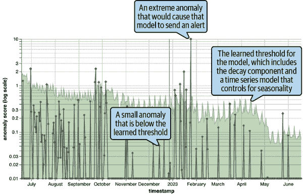
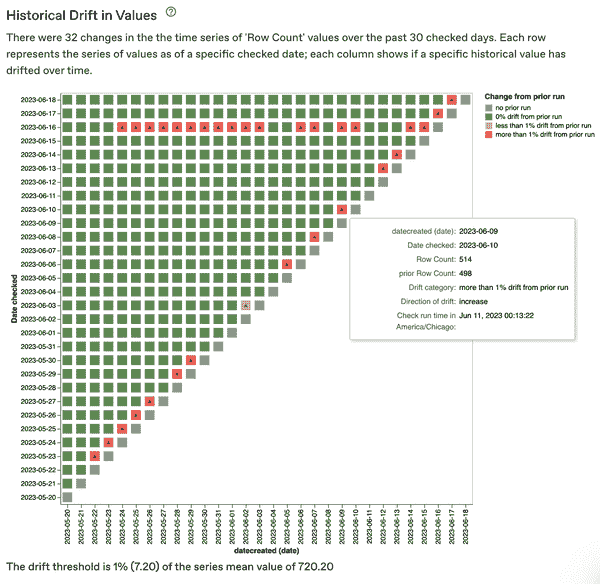
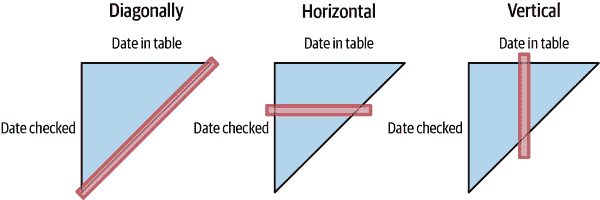
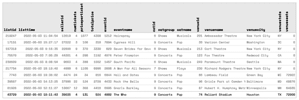
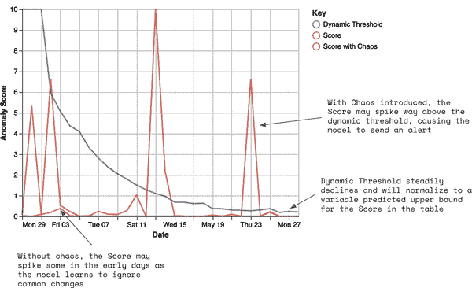
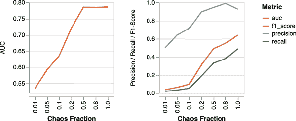
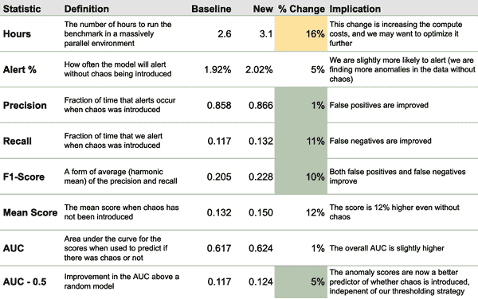

# 第五章：建立适用于现实世界数据的模型

在第四章中，我们分享了一个利用无监督机器学习进行数据质量监控的算法。阅读这些步骤和在任意实际世界数据集上实际构建表现良好模型是两回事。如果您没有考虑到季节性、基于时间的特征和列之间的相关性等细微差别的策略，您的模型可能会过度或不足报警，通常是非常显著的。

除了了解需要注意的陷阱外，您还需要持续评估模型与基准数据的对比情况，以找出改进的位置和方式。我们将分享有效模型测试的方法，包括开发一个库以将完全良好的数据引入混乱（伴有邪恶笑声）的思考。

# 数据挑战与缓解

要使您的模型真正有价值而不是嘈杂，您需要采取策略来克服野外数据所带来的挑战。

## 季节性

人类是非常季节性的生物。我们的行为模式会随着一天中的时间和一周中的日期而改变。我们每个月大致在同一天支付账单，并且每年大约在同一时间度假。大多数数据在某种程度上反映了人类的行为或受人类行为的影响，因此这些季节性模式几乎出现在我们关心的所有数据中。

正如你可能会回忆起的，我们的方法依赖于比较今天的数据和昨天的数据，具体可以参见第四章。但由于季节性的影响，事实证明这并不足够。例如，今天是星期一，昨天是星期天，数据的许多差异是由于季节性而非数据质量引起的问题。

如果改为始终将今天的数据与前一周的同一天的数据进行比较（例如，如果今天是星期一，则查看上周的星期一数据）呢？不幸的是，这并不能避免所有潜在的问题。首先，如果您的策略仅检查上周的数据，您将不知道问题存在了多长时间——它可能在过去的整个上周存在，或者只是今天才出现。其次，如果上周一存在数据质量问题呢？如果今天的数据是正常的，它可能看起来异常，只是因为它与上周一发生的情况不同。第三，如果上周一是假期，那么那一天的一切都可能异常。

要控制这些因素，有必要从*过去多个不同时间点*（昨天、前天、一周前、两周前等）采样数据。如果今天的数据与任何这些之前的日期比较时看起来“正常”，那么今天的数据就不应该异常。

另一种对抗季节性的方法是每次监控数据时自动生成大量的元数据统计信息。然后，您可以在时间上使用时间序列模型来识别特征是否具有长期一致的季节性趋势，并抑制这些特征。

## 时间特征

在您将天真的 ML 算法部署到现实世界后，您几乎肯定会遇到的问题是：表格中通常至少有一列与时间直接相关，例如时间戳或 ID。查看这些列并知道数据是否来自今天非常简单！在这些时间相关特征吸引过多模型注意力之前，我们需要识别并完全从样本数据集中删除它们。

我们的时间戳特征工程会计算每个时间戳与用于按时间分区数据的列之间的差值，因此通常会消除“我有 10 个不同的时间戳，它们都与时间相关”的明显相关性。难以处理的是那些不那么明显的情况。我们常遇到的示例包括：

+   自增 ID（每个新客户都获得稍大的 ID，因此您可以始终识别“今天”的记录为那些具有更大客户 ID 的记录）

+   表示日期信息的字符串或整数，如“月中的一天”或“星期中的一天”，这些信息总是在变化

+   应用程序或日志语义的版本标识符可能会不规律或频繁地更改，这取决于系统更新频率。

通过简单的汇总统计信息，例如检查某个特征是否每天都比前一天大，可以识别出其中一些问题。但在实际操作中，通过使用完整数据集构建一个额外简单版本的模型，您可以获得更健壮的覆盖范围。只需查找在很长时间内对该模型的预测非常重要的任何特征¹，然后将其从真实模型的数据集中删除。

## 混乱的表格

由于多种原因，数据集可能非常混乱。可能会有人类根据不可预测的时间表执行特定过程（如营销活动），这些过程会显著影响数据。或者，生成数据的产品或服务可能还处于成熟阶段，并且由敏捷工程团队快速更改中。如果不考虑表格的混乱程度，您的模型会平等对待所有数据，并在混乱表格上发出过多警报，而在更稳定的表格上发出过少警报。（在第六章我们将更详细地讨论警报。）



###### 图 5-1\. 随时间变化的表格异常分数和学习阈值示例。

因此，通过建立 ML 模型检测到的变化严重性的时间序列，设置通知阈值非常重要。图 5-1 给出了一个示例，其中表的整体异常分数（对数尺度上）基于 SHAP 值的平均幅度。这让您可以使用时间序列模型来学习每个表的混乱程度，并建议一个合理的警报阈值，可以随时间动态上下移动。

在模型首次开始观察表中数据时，为了避免噪音，我们建议从一个非常保守的阈值开始，并逐渐将其降低到数据集中存在的混乱水平。您可以从一个非常非常高的阈值开始（以至于模型几乎不可能在初始运行时触发警报），然后指数衰减基准阈值，使其向零逼近；一个合理的方法是每隔约 10 天衰减一次，衰减因子为二。然后，您可以将该基准阈值与适合您记录的分数的时间序列模型混合使用。

## 就地更新表

在第四章中，我们指出，我们的算法不应该在没有时间概念的情况下做出决策。由于某些类型的表格如何更新，这在实践中可能会非常棘手。

您可能在数据仓库中使用几种不同类型的表格：

静态表

这些是没有时间列的表格。它们可以是维度表或查找表（例如，关于特定实体已知的所有人口统计信息），也可以是汇总表（例如，关于一组实体当前状态的一组汇总统计信息）。

对于这些表，您需要每天对数据进行快照，因为任何记录都可能在任何时间更新（或整个表可能被删除并替换）。

日志表

这些是仅在现有表格中添加新记录时发生的唯一更改的表格。旧记录永远不会发生任何更改。这通常是原始交易或事件级数据的情况。

这些表通常有一个`created_at`时间列，指示每条记录的创建时间，并且可以用于将数据分割成基于时间的样本。

就地更新（变异）表格

这些是乍看之下似乎是日志表格的表格，因为每条记录对应特定事件或交易，并且新记录定期添加到表中。然而，这些记录本身在初始写入后*可以更改*。例如，电子商务订单表可能起初没有具有订单日期的记录，但尚不知道运输日期 —— 它从 NULL 开始，并在未来几天内填写一旦设置了运输日期。

这些表通常具有`created_at`时间列，但它们还将具有`updated_at`时间列，用于跟踪每条记录的最后更新时间。您需要小心处理这些表。

检测表中记录是否经常更新就地的一种方法是跟踪度量指标的历史值随时间的变化。例如，图 5-2 记录了每天表中记录的数量。x 轴是表中的时间列（`datecreated`列），而 y 轴是日期。每天，您可以比较当天获取的行数与前一天的情况。在图 5-2 中，方块的颜色基于数据的变化情况及其程度。



###### 图 5-2\. 表的时间变化中行数的变化。查看此图的全尺寸版本 [*https://oreil.ly/adqm_5_2*](https://oreil.ly/adqm_5_2)。

例如，对于 2023-06-09（根据`datecreated`），当我们首次观察到该日期的记录时，我们发现只有 498 行。但我们在第二天检查时（2023-06-10），发现有 514 行。这表明在随后的日期添加了更多的记录。

我们通常在这个可视化中观察到两种模式：

+   有彩色对角线模式意味着表中频繁更新新数据。具体而言，新数据在出现后的几天内更新。对角线的宽度表示您需要等待数据在表中“成熟”的时间。在图 5-2 中，我们看到一个对角线，表明成熟大约需要一天的时间。

+   一条水平线表示，在给定日期运行了一个批处理过程，该过程更改了大量历史数据——通常是为了解决数据质量问题或迁移数据集。

还有第三种类型的模式，即竖直变化线，但这种情况要少得多，因为它会表明有一个特定的日期，数据频繁更改。有关所有三种模式的视觉示例，请参见图 5-3。



###### 图 5-3\. 使用颜色跟踪数据随时间变化的更新就地表中的可视模式及其含义。

更新就地的表存在的问题是它们似乎总是在最近的日期上出现异常。例如，具有空运输日期的订单百分比在最近几天总是会剧增。然而，这实际上只是数据更新方式的副产品。如果我们将今天的数据与昨天*我们昨天观察到的数据*进行比较，那么我们会看到`shipped_at`列中 NULL 值的百分比实际上是符合预期的。

因此，您应该每天对您监控的每个表格的数据进行快照，并将当前数据与这些快照进行比较，以便排除可能由于即时更新动态而引起的任何更改。由于很难知道哪些表格是原地更新的（许多表格将在没有`updated_at`时间列的情况下进行原地更新），最好假设正在发生这种情况，并花费额外的计算资源，而不是因此问题发送重复的虚假警报。

请注意，使用这种方法很难实现“温暖启动”，因为您必须等待数据快照，以便可以信任算法不会发现与即时更新动态相关的问题。

## 列相关性

大多数数据集中都存在大量的相关结构（可以回顾一下图 2-4）。这可能由于多种原因导致。相同的数据可以以多种不同的形式捕获（例如标识符和字符串）。或者可能存在一种层次结构的标识符，它们都被捕获在同一张表中，并用于不同级别的业务报告数据组。此外，表通常表示因果漏斗，在某些事件发生之前必须发生其他事件，这些漏斗将表现为表结构中的相关性。

当列之间存在相关性时，这意味着一个单一的数据质量问题可能会影响所有这些列。如果算法不小心的话，可能会发送多个警报或者建议存在许多单独的问题，而实际上它们都是相关联的。

影响多列的数据质量问题通常发生在数据“分布”管道中。例如，我们可能从一个事件的整数 ID 列开始。然后该列与一个包含位置名称、日期、优先级等元数据的位置表进行连接。如果日志中原始的位置标识符丢失，那么连接将失败，并且所有其他位置元数据也将丢失。

利用表中个别值的 SHAP 值来表彰它们的异常性，您可以利用行级别的相关性将列聚合在一起，并将它们作为单个问题呈现给用户。例如，如果层级结构中的一个级别受到数据质量问题的影响，我们将看到多列存在异常，但都是相同的行。通过这种洞察力，我们可以提供单个异常，而不是给用户发送关于同一事件多次警报。

例如，考虑下面的表格，其中给出了一些存放在杂货店货架上的样品产品数据：

| `商品 ID` | `部门` | `货架` | `产品` | `品牌` | `商品` | `大小` |
| --- | --- | --- | --- | --- | --- | --- |
| `43112` | `冷藏` | `酸奶` | `希腊酸奶` | `Chobani` | `0% 原味` | `32 盎司` |
| `43113` | `冷藏` | `酸奶` | `希腊酸奶` | `Chobani` | `0% 原味` | `64 盎司` |
| `43114` | `冷藏` | `酸奶` | `希腊酸奶` | `Chobani` | `2% 原味` | `32 盎司` |
| `43115` | `冷藏` | `酸奶` | `希腊酸奶` | `Chobani` | `2% 原味` | `64 盎司` |
| `...` | `...` | `...` | `...` | `...` | `...` | `...` |
| `43945` | `冷藏` | `酸奶` | `希腊酸奶` | `Fage` | `0% 原味` | `32 盎司` |
| `...` | `...` | `...` | `...` | `...` | `...` | `...` |

在这样的数据集中，异常可能会发生在产品级别（所有的“希腊酸奶”都丢失了），这可能通过从`Aisle`列派生的特征（“酸奶”异常）、`Product`列（“希腊酸奶”）或`Brand`列（一组特定品牌异常）来捕捉。 `Department`可能过于高度聚合，无法对希腊酸奶的异常敏感，而`Item`列则过于碎片化，难以用来轻松检测异常。

给定我们的算法为每个单独的记录生成了基于 SHAP 的异常分数，我们可以将聚类算法应用于这些异常分数，以便检测这些列中的异常都发生在相同的一组行上。

# 模型测试

鉴于所有这些挑战，以及已经相当复杂的算法，您如何确保您构建的模型实际上在真实世界的数据上运行？此外，如何进行迭代改进？

收集基准数据，人类已经标记了什么是异常和什么不是可能乍一看似乎是合理的，但正如我们在本书的其他地方讨论过的那样，创建一个人工标记的数据集，其中评估员判断什么是异常的成本非常高昂（更不用说主观性了）。您需要成千上万个标记的异常才能形成一个强大的基准。

所以，我们需要采取不同的方法。这里的关键洞察力是，实际数据质量问题实际上并不难*以编程方式插入数据集*。毕竟，问题往往是由代码引起的！我们发现检测合成异常，即“混沌”，是检测真实数据质量问题的良好代理。正如电影《躲避球》中的 Patches O’Houlihan 宣布的那样，“如果你能躲开扳手，你就能躲开球。”

因此，基准测试的算法大致如下：收集一个代表性的表格数据集样本，在引入合成异常之前和之后在这些数据集上运行您的模型，并测量运行时间和评估准确性的统计数据。这使您能够通过更改参数或减少特征等方式来优化您的模型。反复进行这一过程。

让我们谈谈您可以引入的合成异常的种类及其方式，然后继续进行基准测试和微调您的模型。

## 注入合成问题

“混沌工程”是故意在系统中创建随机失败以测试系统响应的想法。一个众所周知的例子是 Netflix 的[混沌猴](https://oreil.ly/DYkV8)，这是一个随机终止生产实例以测试网络弹性的工具。

这个想法很好地转化为测试数据质量监控模型。您可以使用 SQL 操纵基准数据集，模拟在生产系统中可能发生的真实数据质量问题。由于真实数据问题往往只影响部分数据，因此重要的是还要变化*如何*应用合成问题：例如应用于一个段落、随机列、数据的随机百分比等等。然后，您可以根据 ML 指标如灵敏度、特异度和[曲线下面积（AUC）](https://oreil.ly/Qavzw)，以及其他性能特征，如模型所需的时间和检测某些问题相对于其他问题的能力，来衡量您的模型性能。

### 例子

图 5-4 显示了门票销售数据示例表，每行对应一个音乐会或体育赛事门票的列表。例如，我们可以看到`listid`编号 43729（最后一行）是在休斯敦德州依靠体育场（可容纳 72k 人！）为 The Who 乐队的四张票，每张票 131 美元（总计 524 美元）的列表。



###### 图 5-4\. 门票销售数据示例表。请在[*https://oreil.ly/adqm_5_4*](https://oreil.ly/adqm_5_4)查看此图的完整版。

假设我们知道`numtickets`列的最大值是 30。测试我们的算法是否能够检测到门票数量分布变化的一种方法是引入一些人为混乱，并将`numtickets`列的值更改为包含值 40。

仅对最近的日期进行此操作非常重要，因为我们希望这一变化在数据集中表现为突发的异常。此外，为了使这个数据质量问题显得更加微妙，我们将确保混乱仅适用于 30%的记录。我们将包括一个`where_sql`子句，使混乱仅适用于`venuestate = ‘NY’`中售出的门票。

在实践中，将此混乱注入表格的 SQL 如下所示：

```
WITH chaosed_table AS (
    SELECT "listid",
        "listtime",
        "sellerid",
        CASE
            WHEN `random`() < 0.3 THEN 40
            ELSE "numtickets"
        END AS "numtickets",
        "priceperticket",
        "totalprice",
        "eventid",
        "eventname",
        "catid",
        "catgroup",
        "catname",
        "venueid",
        "venuename",
        "venuecity",
        "venuestate",
        "venueseats"
    FROM fact_listing
    WHERE listtime >= Cast(
            Cast('2022-05-04' AS DATE) AS TIMESTAMP without time zone
        )
        AND listtime < Cast(
            Cast('2022-05-05' AS DATE) AS TIMESTAMP without time zone
        )
        AND venuestate = 'NY'
),
all_other AS (
    SELECT *
    FROM   fact_listing
    WHERE  NOT (
            listtime >= cast(
                cast('2022-05-04' AS date) AS timestamp without time zone
            )
            AND listtime < cast(
                cast('2022-05-05' AS date) AS timestamp without time zone
            )
            AND    venuestate = 'NY'
        )
)
SELECT *
FROM chaos_table
UNION ALL
SELECT *
FROM all_other
```

这听起来像是一个愚蠢的例子吗？嗯，由于数据质量错误，价格经常会变动，这点可能会让你感到惊讶。例如，看看图 5-5 中的略为高价的航空票。

![略为高价的航空票（Shaun Walker [@sbwalker]，Twitter，2023 年 4 月，下午 4:50，https://twitter.com/sbwalker/status/1647024519331168257）](assets/adqm_0505.png)

###### 图 5-5\. 略为高价的航空票（Shaun Walker [@sbwalker]，Twitter，2023 年 4 月，下午 4:50，[*https://oreil.ly/BsKtS*](https://oreil.ly/BsKtS)）。

如果您经常测试模型，将这些操作封装到一个库中将会很有帮助。Anomalo 内部混乱羊驼库中的混乱操作示例包括：

`ColumnGrow`

将列乘以均匀抽取的随机值。

`ColumnModeDrop`

删除具有等于给定列的众数值的行。要求众数表示至少一定比例的数据，否则会抛出错误。这旨在防止众数非常罕见的混乱情况。

`ColumnNull`

将 `table.column` 转换为 NULL，适用于部分记录。

`ColumnRandom`

使用随机浮点数或整数替换列中的值，布尔值的 True/False 比例为 50/50，或者对字符串进行哈希处理。

`TableReplicate`

在表中添加额外的行（从原始表随机抽样）。

为什么是混乱羊驼？嗯，“Anomalo”如果连续说得足够快，足够多次，可能听起来有点像“羊驼”。所以我们选择了羊驼作为我们的吉祥物，并且它们经常出现在我们的内部工具中。


## 基准测试

基准测试由许多样本数据集组成；我们称这些为*回测*。每个回测代表数据集在连续几天内的历史样本。对于每个回测，您可以按顺序在每一天运行您的模型。这模拟了数据集的配置以及每天到达新记录的过程。在此阶段，需要捕获的重要数据点是每个表的整体异常分数（与图 5-1 中使用的相同类型的分数）以及学习的动态警报阈值。这将为您提供一个基线，了解模型认为基准数据在引入任何合成异常之前的异常程度。

完成初始运行后，您可以再次循环遍历数据集——但这次每天都会引入一个随机的混乱操作到数据中。然后，您可以重新运行模型，看看它是否能够检测到这些混乱。同样，跟踪异常分数将告诉您模型对每种特定混乱操作的敏感性。

例如，图 5-6 总结了在单个表的回测结果，其中包含从 4 月 29 日到 5 月 28 日的数据。我们从 4 月 29 日开始，为该日期建立我们的模型，记录所有结果，然后依次遍历每个日期，直到 5 月 28 日结束。然后，我们在数据集中注入合成数据质量问题的同时重复此过程。



###### 图 5-6\. 回测显示了带有混乱和无混乱情况下的异常分数。随着时间的推移，模型会学习一个用于警报的阈值，因为遇到越来越多的异常。

黄线显示了在引入任何混乱之前模型的异常分数。你可以看到它在 5 月 3 日上升，但其他时间基本保持接近于零。表格在早期可能会有较高的异常分数，因为模型仍在学习哪些列和特征代表着需要抑制以找出真正异常的间歇性变化。得分接近于零表明，一旦这些因素得到控制，数据集非常可预测和规律。

蓝线显示了异常分数的阈值。它从 10 开始，这是最高的异常分数（代表影响 100%数据的极端变化）。我们在这最高值上保持三天，然后开始指数衰减。在 30 天结束时，阈值已经降低到 0.3 以下，这足够敏感以检测到中等异常。

最后，红线展示了在数据集中引入混乱时异常分数的变化情况。第二天，得分跃升至 5 以上——这是一个极端异常，很可能是由重大的混乱操作引起的。但阈值仍然很高（10），因此此问题会被抑制。我们希望在提醒方面保守，特别是在早期阶段。

然而，到了第四天，得分跃升到 6.5 以上，这已经足够高超过了阈值。即使在第一周，数据中足够异常的变化也可以导致模型提醒。随着时间过去，最终到了第 30 天和第 90 天，模型会逐渐校准数据中预期噪声的水平，对混乱更加敏感。

在图 5-7 中，y 轴显示了九个样本数据集的九次回测，每个数据集评估了 30 天（x 轴）。红色方块表示模型发送了提醒，黄色方块表示它接近提醒。灰色方块是模型未提醒的天数。如您所见，早期的提醒并不频繁。

![九个样本数据集的 30 天回测。可从[存储库直接链接]获取全尺寸、全彩色版本。](assets/adqm_0507.png)

###### 图 5-7\. 九个样本数据集的 30 天回测。查看此图的完整尺寸版本[*https://oreil.ly/adqm_5_7*](https://oreil.ly/adqm_5_7)。

比较顶部和底部的面板，很明显模型对引入混乱非常敏感，这对每个不同的数据集都是如此。然而，在底部面板中，有许多天仍然是灰色的（没有提醒）——即使我们每天都应用混乱操作。这可能由于几个不同的原因造成：

+   阈值仍然设置得很高，因为我们逐渐将阈值从 10（非常难以提醒）降低到数据集的学习阈值。即使到了第 30 天，这种衰减还没有完成。

+   在某些情况下，我们引入的混乱非常罕见。它可能仅针对 1%的记录，使得异常更难以检测。

+   在某些情况下，我们引入的混乱实际上可能不会改变数据。例如，如果我们将某列中 5%的值更改为 NULL，则如果该列中 99%的值已经是 NULL，这不会有任何影响。

### 分析表现

要了解模型的表现如何，您可以为整个基准计算不同类型的统计数据，如 AUC、F1 分数、精确度和召回率。

无论您选择查看哪些指标，都有许多不同的方式来分析和解释结果：

+   按数据集

+   模型运行了多少天

+   按照使用的混乱类型

+   按记录百分比应用混乱（*混乱分数*）

在实践中，我们查看所有这些指标，以及更多内容，以更好地理解模型的表现及其改进可能性。

混乱分数特别有用，因为它让您了解

+   模型在极限情况下的表现如何——当对整个数据集应用混乱时，您期望模型表现非常好。

+   在模型开始无法检测到问题时，考虑到您正在处理的数据样本大小。

在图 5-8 中，x 轴是我们应用给定混乱操作的记录分数（从 1%到 95%的记录），y 轴表示性能统计数据。



###### 图 5-8\. 不同混乱分数下模型基准的性能指标。

第一个面板绘制了 AUC 统计数据。这比较了我们对给定日期产生的异常分数（我们的“预测”）与是否在该日期引入混乱的二元“结果”的曲线下面积。AUC 通过在从 0.0 到 10.0 变化的得分的决策阈值上测量假阳性和真阳性率，来分类每个{表，日期}组合，确定是否存在混乱（异常）。当 AUC 接近 0.50 时，模型的表现不比随机猜测好。当 AUC 接近 1.0 时，模型能够完美地检测到数据中的混乱。

我们看到，随着混乱程度从 1%逐渐上升到 50%及以上，AUC 稳步提高，接近 0.80。在实际操作中，由于多种原因，这些 AUC 统计数据未能充分展示模型的表现：

+   某些{表，日期}组合虽然没有混乱，但源数据中确实存在我们需要警示的真实异常。换句话说，并非所有“负面”示例都是真负例。

+   我们的一些混乱操作影响的记录比混乱分数表明的百分比要少得多。该分数对受影响记录的百分比设置了一个最大值——如果我们改变了列的模式，或者一个不频繁的值，或者进行已存在数据中的更改，那么混乱可能无法检测到。

+   我们正在测量模型运行的前 30 天的性能，但在实践中，我们看到模型的性能继续在 90 天内显著提高。

虽然 AUC 有助于理解我们的模型在区分是否应用混乱时的表现如何，但它并不能解释模型在设置阈值时的表现如何。第二面板直接基于决定是否在得分高于或低于学习阈值时发出警报来测量精确率、召回率和 F1 分数。

在这种情况下，精确率衡量的是模型在存在混乱操作时警报的时间比例。这可以帮助您了解假阳性警报的频率。正如您可以在图 5-8 中看到的那样，当混乱影响的记录非常少时，精确率约为 50%。但当混乱影响的记录占比较大时，精确率可以达到 90%。

召回率衡量的是模型能够在混乱操作中警报的百分比。回到图 5-8，您可以看到它开始时非常低（接近 0），但当混乱应用到超过一半的数据时，召回率几乎达到了 50%。同样，召回率可能较低是因为混乱操作很难检测到，这是由于上述原因造成的。

提高召回率的一种方法是对阈值算法进行调整（从较低开始，更快衰减，或者收敛到得分的较低分位数估计），从而使模型对混乱更敏感。然而，这会增加假阳性（和警报疲劳）的可能性，特别是在模型仍在校准阶段的早期。

F1 分数同时考虑了精确率和召回率，并且计算公式为`2*((precision*recall)/(precision+recall))`。有很多改进可能会提高精确率但不会提高召回率，反之亦然，而 F1 分数则根据综合效果指示改进是否好坏。请注意，在实践中，假阳性和假阴性的成本可以直接估计，并用于决策如何改进和校准模型。

### 将其与伪代码结合起来

以下是 Python 伪代码的示例，演示了您如何应用我们刚刚概述的方法来评估您的算法性能。假设您从第四章中有`detect_anomalies`方法，并且有一组表格及其配置信息。然后，它对每个表格进行带有混乱和不带混乱的回测，并总结每个表格的异常分数。然后，根据算法在“预测”哪些结果引入混乱方面的准确性计算 AUC。

请不要太字面理解这段代码，因为它只是为了说明概念及其高层次的结合方式。特别是，我们忽略了算法可能从一次运行到下一次运行中保持状态（例如，阈值计算），并且我们没有为随机混乱生成提供任何详细信息。

我们首先定义如何计算给定日期范围和表格的异常分数：

```
# General imports
import datetime as dt
from sklearn.metrics import roc_auc_score

# Import hypothetical sub-modules that perform more detailed tasks
from chaos import generate_random_chaos
from prior_chapter import detect_anomalies

def calculate_anomaly_scores(
    table: str,
    time_column: str,
    current_date: dt.date,
    prior_date: dt.date,
    sample_size: int = 10_000
) -> float:
    column_scores = detect_anomalies(
        table, time_column, current_date, prior_date, sample_size
    )
    return sum(column_scores.values())
```

然后，我们在一系列日期范围内对异常检测逻辑进行回测，以获取带混乱和不带混乱的异常分数：

```
def backtest(
    table: str,
    time_column: str,
    start_date: dt.date,
    number_of_days: int
) -> list[list[float]]:
    anomaly_scores = []
    chaos_anomaly_scores = []

    for day in range(number_of_days):
        current_date = start_date + dt.timedelta(days=day)
        prior_date = current_date - dt.timedelta(days=1)

        overall_score = calculate_anomaly_scores(
            table, time_column, current_date, prior_date
        )
        anomaly_scores.append(overall_score)

        # Introduce chaos and recalculate
        table_chaos = generate_random_chaos(table, time_column, current_date)
        chaos_overall_score = calculate_anomaly_scores(
            table_chaos, time_column, current_date, prior_date
        )
        chaos_anomaly_scores.append(chaos_overall_score)

    return anomaly_scores, chaos_anomaly_scores
```

接下来，我们对多种表格配置运行回测，以评估它们的性能：

```
def benchmark(
    table_configurations: list[dict],
    number_of_days: int
) -> list[dict]:
    """
 Runs backtests on multiple table configurations to benchmark their performance.
 """
    benchmark_results = []

    for config in table_configurations:
        anomaly_scores, chaos_anomaly_scores = backtest(
            config['table'],
            config['time_column'],
            config['start_date'],
            number_of_days
        )
        benchmark_results.append({
            'table': config['table'],
            'anomaly_scores': anomaly_scores,
            'chaos_anomaly_scores': chaos_anomaly_scores
        })

    return benchmark_results
```

最后，我们根据所有表格中的异常和混乱分数计算单个 AUC 指标（作为示例模型指标）：

```
def calculate_global_auc(benchmark_results: list[dict]) -> float:
    """
 Calculate a single AUC based on the anomaly and chaos scores from all tables.
 """
    all_anomaly_scores = []
    all_chaos_anomaly_scores = []

    for result in benchmark_results:
        all_anomaly_scores.extend(result['anomaly_scores'])
        all_chaos_anomaly_scores.extend(result['chaos_anomaly_scores'])

    # Create labels: 0 for anomaly, 1 for chaos
    y_true = [0] * len(all_anomaly_scores) + [1] * len(all_chaos_anomaly_scores)

    # Concatenate scores
    y_scores = all_anomaly_scores + all_chaos_anomaly_scores

    # Calculate AUC
    auc = roc_auc_score(y_true, y_scores)

    return auc
```

## 改进模型

进行基准测试和分析性能统计数据对理解和调试模型非常有帮助。它也是向用户证明您的系统按预期工作的一种方式。

但是，您可以使用这些数据的最重要的方式之一是验证模型的变化，以确保您在微调中增加了价值。图 5-9 展示了为基准计算的摘要统计信息的示例，其目标是衡量模型变化是否朝着正确的方向发展。



###### 图 5-9\. 模型基准的摘要统计和影响。查看此图片的完整版本，请访问[*https://oreil.ly/adqm_5_9*](https://oreil.ly/adqm_5_9)。

图 5-9 中评估的假设更新是一种新类型的功能，允许模型对字符串列中的模式变化（如电话号码、标识符等）更加敏感。此变更显著增加了基准的运行时间，这表明可能需要进一步优化该变更，以避免增加模型的总体延迟和成本。

然而，从积极的一面来看，这一变化显著提高了精度和召回率，减少了误报。AUC 也有所改善，尽管在绝对基础上看起来改进的百分比很小。但是，如果我们问的是 AUC 相比 0.5 提高了多少（因为 0.5 表示随机行为），AUC 的改善实际上是（0.624 - 0.5）/（0.617 - 0.5） - 1 = 5% 更好，这是显著的。

# 结论

我们探讨了在构建模型时可能需要注意的一些真实世界数据属性——比如数据的相关性或就地更新的事实。我们还详细介绍了如何通过向样本数据集注入混乱来对模型进行基准测试。这些测试的结果将帮助您衡量模型的性能并随时间进行迭代。

建立一个能够适当地警示真实世界数据问题的模型并不容易——既不能错过重要问题，也不能因小而过警报。然而，一旦你拥有了高质量的模型，真正重要的是如何利用它来赋能负责数据质量的人员。在下一章中，我们将解释如何利用你的模型输出来构建有效的通知，帮助用户彻底了解数据异常变化的原因。

¹ 如果不这样做，你可能会从数据集中删除一个数据质量问题！
