# 第六章：在避免警报疲劳的同时实施通知

如果监控系统在出现问题时没有通知你，那么它有什么用呢？然而，警报既是监控的精髓，也是它的致命弱点。正确地执行，通知将通过适当的渠道将信息传达给正确的人员，帮助他们理解问题的严重性，甚至指出快速解决问题的根本原因。但是，如果执行不当，通知将会向太多人发送，缺乏上下文，并且难以采取行动。它们将是不可信的，并最终被忽视。

警报疲劳是数据质量监控工作失败的最大原因之一，尤其是在企业扩展时（参见侧边栏“警报疲劳”）。如果有数十人参与数据质量工作，并且成千上万的表格触发了警报，那么如果这些警报没有帮助、令人困惑或嘈杂，那么大量的员工时间和精力将被浪费。

在本章中，我们将分享多种技术，帮助您确保通知能够赋予团队解决数据质量问题的能力。我们将介绍问题解决过程中的步骤以及如何设计通知以在每个阶段（包括根本原因分析）提供帮助。我们将讨论如何找到特定通知的正确受众和适当的传递机制。我们将探讨许多避免警报疲劳的策略，以便您的系统尊重可能是我们最宝贵的人力资源之一：我们的注意力。

# 如何通过通知促进数据问题响应

你可以随时监控数据质量，但只有在监控结果产生积极作用时，你才能真正改善数据质量。通知是你的监控系统和其试图实现的结果之间的关键联系。它们使人类能够采取步骤，以真正理解和解决数据质量问题。

不管通知本身的详细内容是什么，我们稍后会讨论，响应通常遵循相同的步骤。当我们讨论构建良好通知的要求时，这些步骤对于我们来说是很重要的。高质量的通知将在响应过程的每个阶段赋予人类能力。

## 分类

分类步骤可以总结为“判断问题是否值得关注”。例如，对于电子商务业务而言，一个令人关注的警报可能是跟踪 Android 设备上结账转化事件数量的大幅下降。另一方面，在假日期间整体结账转化事件数量的减少对业务可能并不那么令人关注，除非是黑色星期五。

对于从第三方获取信用卡数据用于欺诈模型的银行，高优先级问题可能是跟踪近期交易的某一列的 NULL 值突然增加。NULL 值的突然增加对模型尤为灾难性（见章节“NULL 增加”），业务将希望快速跟进这个问题。相反，如果他们在推出针对新客户段的产品后看到信用评分分布的变化，可能就不会那么担心。

请记住，自动化数据质量监视器正在寻找数据值中的显著且意外的变化——它们并不关心这些变化是否*确实对业务有影响*。因此，在本章中，我们将花费大量时间讨论如何使通知更容易进行分类，甚至在许多情况下静音某些类型的通知，以免团队花费大量时间查看低优先级的警报。

## 路由

一旦确定了问题的严重性，下一步就是决定通知谁，以便进行进一步的调查或解决方案。这一过程在很大程度上取决于您的数据组织结构。表 6-1 显示了几个不同功能团队的示例以及它们可能参与解决不同类型问题的方式。

表 6-1\. 示例数据质量问题映射到团队

| 问题 | 负责团队 |
| --- | --- |
| --- | --- |
| 负责应用程序中某些活动的服务偶尔失败，导致数据丢失。 | 工程基础设施 |
| 由于代码更改导致应用程序在某些情况下记录重复事件。 | 产品工程 |
| 第三方提供商已更改其 API，并未就此变更进行沟通。 | 数据合作伙伴关系 |
| 更改广告活动运行方式的配置更改删除了跟踪信息。 | 营销运营 |
| 以前每小时运行一次的 ETL 过程现在计划改为每六小时运行一次。 | 数据工程 |
| 使用`CASE WHEN` SQL 子句重新映射类别的转换已更改，一些类别被删除，导致 NULL 值。 | 分析工程 |

路由可能非常复杂。根据领域的不同，您可能会有不同的数据质量问题的受众；例如，关于广告活动的数据与关于客户的数据可能有不同的团队。有时，您可能需要涉及多个团队以提供所有必要的背景信息。本章后面，我们将讨论如何确保通知到达合适的人员，同时避免创建过于广泛的受众的错误。

## 解决方案

这是修复数据质量问题（震惊）和/或回填历史数据（疤痕）所需的实际工作。通常会在诸如 Linear、GitHub Issues 或 Jira 之类的单独系统中进行跟踪。解决过程极大地取决于数据质量问题是如何引入的，以及组织是否对数据的生产、传输或转换有任何控制。在本书中，我们不会过多讨论解决的具体细节，但稍后会讨论根本原因分析如何帮助解决问题。

## 文档

最后，在关闭问题时，记录解决问题所采取的任何行动（如果有的话）至关重要。许多问题会以某些微小变化的形式再次出现，过去如何处理问题的历史记录可以成为未来可能类似的问题的重要信息库。此外，解决数据质量问题远非一帆风顺，有时会出错——修复背后的逻辑可能不合理或可能导致意外副作用。没有文档记录，要想回头撤销或以其他方式纠正错误的修复将会很困难。

# 没有通知就采取行动

在进一步进行之前，我们应该承认，通知不一定是解决数据质量问题时采取行动的唯一触发器。让我们探讨一下在没有通知的有限场景下，您可以采取行动的情况。

有些团队直接将数据质量监视器集成到其编排工具和流程中（例如 Airflow、dbt）。每次将数据加载到暂存环境时，他们都会运行一系列数据质量检查。如果检查通过，数据将被复制到生产环境并用于下游用例的“发布”。如果检查失败，自动化脚本可能会清理一些数据质量问题，例如重复记录。例如，您可以想象一个规则，根据时间戳仅保留最近的客户记录。

这些自动化测试在某些场景下非常有价值。例如，它们可以阻止数据发布，在某些情况下，晚发或者不发数据要比发错数据好（例如用于做不可逆决策）。或者应用的“修复”可能相当于“重试”。特别是对于数据新鲜度或者体积问题，有时候稍等片刻问题就会自行解决。在复杂的分布式编排中，确保一切都按照适当的计划进行可能很困难，因此在系统中内置重试功能可以使其更加健壮。

但当基础数据质量问题真正只是糟糕的数据时，用修复数据的方法掩盖问题通常不是个好主意。虽然它可以确保下游系统按预期工作（数据加载到一个类型字段中；在下游没有抛出异常），但实际上只是掩盖了问题，防止任何人意识到它的存在。它还会引入可能以意想不到的方式影响决策或 ML 模型的数据偏差。

还有一些其他情况，你可能不需要设置通知，因为你直接检查系统的输出。例如，你可能会使用 API 与你的数据质量监控系统交互，因此可以完全控制其响应。如果你正在执行数据迁移，并希望通过命令行运行检查并检索其状态，这可能非常有用。或者，你可能会运行检查生成仪表板，计划的运行后手动检查。然而，这些情况从定义上讲是手动的，并且不可扩展。

现在，让我们回到通知问题上，这是监控结果转化为改进数据质量行动的主要手段，也是本章的重点。

# 通知的构成

鉴于解决过程中需要采取的步骤，设计数据质量监控系统时我们要问的问题是：如何创建通知，以尽可能地促进这些步骤，使问题易于分类、路由、解决和记录？

让我们从高层次定义通知本身的主要组成部分开始。接下来，我们将进行所有不包括通知内容的决策，例如如何传递通知、避免警报疲劳以及为根本原因分析提供额外上下文。

对于这堂解剖课，图 6-1 展示了我们将一同剖析的一个 Slack 通知样本。

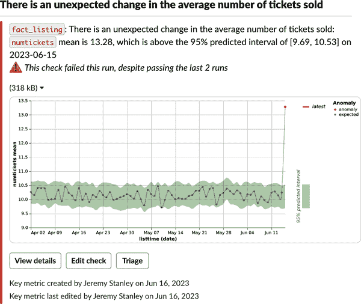

###### 图 6-1\. 数据质量问题的 Slack 通知样本。在[*https://oreil.ly/adqm_6_1*](https://oreil.ly/adqm_6_1)查看这幅图的完整版本。

## 可视化

根据 Jill Hardy [指出](https://oreil.ly/ejHOM)，一个可视化图表胜过一千个数据点。¹ 图形可以包含大量关于基础问题的信息，问题的严重程度以及可能需要的下一步措施。

我们每个通知中只包含一个可视化图表，其类型随检查和发现的问题而异。点击“查看详情”并转到完整报告中，可以找到更多详细信息。

可视化不仅显示当前问题，还提供一些上下文或历史。可能有许多用户会看到通知，但可能不是监控平台的活跃参与者。请记住，如果可视化太复杂，用户将无法快速理解。

## 操作

重要的是立即使通知变得可操作。我们建议从通知中支持三种不同的操作（您可以在图 6-1 的底部看到这些操作按钮）：

查看详细信息

允许用户调查问题并更多地了解背景和历史。此操作将用户直接带入数据质量监控平台，他们可以看到额外的可视化、记录示例、采取的行动摘要等。

编辑检查

引发编辑配置，用于发送此通知的检查。这使用户可以轻松地进入并更改配置，以便检查更好地针对他们关心的问题或将来少发通知。

分类

将用户直接带入平台上的分类流程，他们可以执行以下操作之一：

+   确认：通知其他人已经意识到问题并正在进一步调查。

+   解决：解决问题，无论是因为已修复还是因为不需要解决或预期内。

+   提交工单：为额外的工作创建一个工单，他们可以直接通过 API 在平台上执行，或者在像 Jira 这样的工单系统中跟踪。例如，工程师可能需要更改事件记录方式以修复此基础问题。参见图 6-2，显示了关于分类选项的截图。

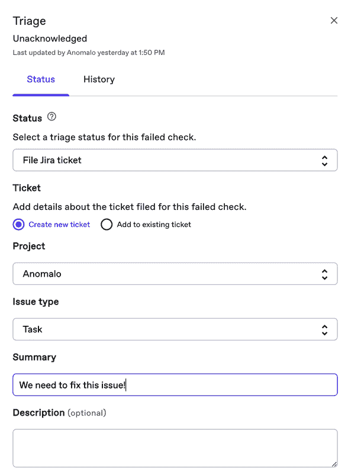

###### 图 6-2\. 示例分类选项。

## 文本描述

除了可视化外，一些文本信息可以帮助更多地了解检测到的问题背景。我们通常推荐三种不同的文本组件：

标题

用户定义的字符串，表示检查的意图或目的，通常由用户在创建检查时提供。这有助于将额外的业务、数据或工程上下文传递给最终接收警报的人员。

摘要

自动生成的警报摘要，识别发现的问题性质并量化其重要程度。

历史记录

过去触发警报的次数。在调查问题时非常有帮助。这个警报已经静默了几百天吗？天啊，一定发生了什么重大的事情！相比之下，这是连续第四次触发警报吗？这可能意味着我们仍然需要修复一个持续存在的问题，或者可能需要重新配置检查本身。

## 谁创建/最后编辑了检查

在操作按钮下面，我们识别了首次创建检查的人和最后编辑检查的人。这是有帮助的背景信息，因为接收警报的人可能想要向这些人提问，例如为什么他们首先设置了这个检查或者谁可以帮助进一步调查或解决问题。

# 传递通知

无论您的通知设计得有多么周到，如果它们发送给错误的人或者进入一个没有人检查的收件箱，它们都不会产生结果。因此，您的监控平台必须与多种不同的交付渠道集成，并允许用户配置通知的交付方式。您可以通过查看图 6-3 中的下拉菜单来了解可能的各种渠道的情况。

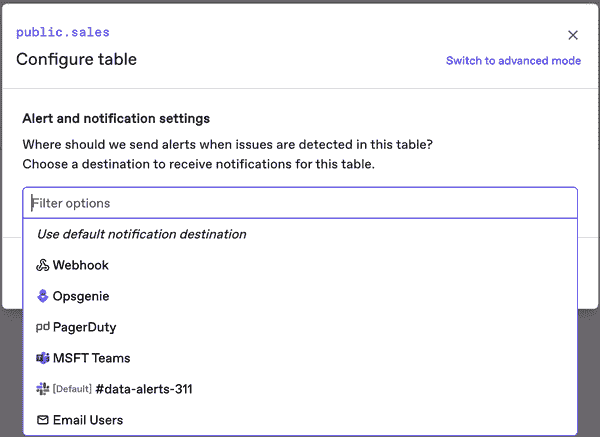

###### 图 6-3。示例警报和通知目的地。

通知传递的三个维度真正存在：(1) *谁*会收到通知，(2) *他们*会如何收到（在他们的电子邮件收件箱？Slack？他们会被呼叫吗？），以及(3) *他们*会在什么时候收到（立即还是总结中？）。

## 通知受众

应该通知谁是一个关键决策，对于减少警报疲劳至关重要。一个大公司可能有数百名对各种数据质量问题感兴趣的人。如果每个人都收到每个警报，那将会完全不堪重负！

在考虑受众时，要专注于所有权和背景信息。通知只有在采取行动时才会创造价值。因此，接收通知的人应对相关表的数据质量有*很高的所有权*。他们必须有动力来负责通知及其分类和路由。您还需要确保已经包括了能够提供必要*背景信息*的人员。在某些情况下，可能需要多个人来理解问题并决定接下来应该采取什么步骤。

假设您已控制了所有权和足够的背景信息，那么接下来您希望将接收通知的受众最小化。通知会分散注意力：每个看到它们的人都必须停下手头的工作并处理信息。您可能有很多方面对数据质量感兴趣的各方，但这并不意味着他们都应该被通知。如果他们对响应不是必不可少的，给他们其他发现相关信息的手段，比如报告、仪表板或总结。

更具体地说，定义受众的最常见策略是按表分组，然后按照对这些表感兴趣的用户域分组。这确保了每个主题领域（例如市场营销、财务、增长、运营等）只接收他们关心的表的通知。不同行业的域因组织团队的方式而异。例如，Jeremy 在 Instacart 工作时，领域包括物流、目录、广告、消费者增长和消费者应用。

您还可以根据检测到的问题*类型*确定受众。数据工程可能对表的新鲜度和量最感兴趣，而分析和业务用户可能最关心关键指标的变化。

无论如何，一个基本的经验法则是将任何给定的警报发送给一个，而且只有一个受众。这样可以确保您保持高度的责任感，并且针对每个问题进行单线程对话。否则，您可能会陷入两种糟糕的情况之一：

低所有权

多个受众收到每个警报，并且每个组中的个人都认为另一组正在查看警报。

重复的努力

多个受众收到警报，现在有两个独立的对话和工作流用于分析和解决潜在问题。

## 通知渠道

不同的受众将会有不同的偏好，以何种方式接收通知。有些类型的通知更适合通过电子邮件而不是紧急提示。以下是您希望您的数据质量监控系统集成的主要渠道，以及它们在大多数企业中的使用方式。

### 电子邮件

电子邮件，作为最常见的异步通信形式，通常用于发送摘要通知（例如每周问题和状态列表），不打算迅速回复。但是，在某些组织中，电子邮件仍然是主要的通信形式，因此电子邮件警报可以成为主要渠道。

### 实时通信

如今，大多数团队希望通过像 Slack 或 Microsoft Teams 这样的实时通信提供商接收通知。通常，团队会希望设置一个或多个群组（例如 Slack 频道），在这些群组中相关受众接收其数据质量通知。

实时通信为一些节省时间的策略提供了便利，其他方式难以实现。例如，在 Slack 上，许多团队使用表情符号反应来帮助快速分析和管理通知状态，如图 6-4 所示。从通知本身开始，还可以轻松启动一个对话线程，以跟踪调查/分析或解决方案，同时保持共享的上下文。

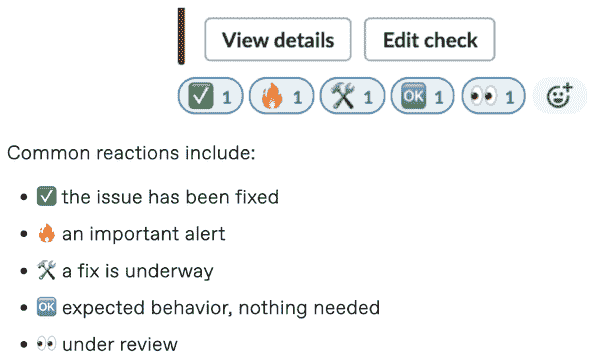

###### 图 6-4。在 Slack 或 Microsoft Teams 中对警报的常见表情符号反应示例。

### PagerDuty 或 Opsgenie 类型的平台（警报，值班管理）

对于最重要的检查（这些应该很少见），您可能希望通过像 PagerDuty 或 Opsgenie 这样的警报或值班系统“唤醒”指定的人员以响应问题。

### 票务平台（Jira，ServiceNow）

在罕见的情况下，您甚至可能希望通过直接将通知插入到票务平台来为某人创建工作项，但我们建议在创建工作票之前，让人类中介评估和分类问题。否则，您可能会得到无法执行或重要性不大的工单。

### Webhook

Webhook 是通过网络通知另一个任意系统的通用手段。通过支持 Webhook，您确保用户可以将通知路由到不适合前述类别的任意系统。例如，一些公司可能有他们购买或内部构建的企业通知路由系统，他们希望将警报发送到这些系统，然后根据如何向最终用户发送这些通知应用额外的业务逻辑或规则。

## 通知时机

通常有两种策略决定*何时*发送通知：

+   一旦检查完成（实时），即时发送失败的通知，因此通知渠道变成了随着计算而产生的“日志”。

+   等待特定数据集（表格，模式或其他分组）的所有检查完成，然后发送包含所有通过和/或失败检查摘要的单个通知。

几个原因推荐第一种方法。首先，它允许用户在识别问题后尽快接收通知，从而缩短响应时间。特别是当检查应用于大数据集和/或利用机器学习时，不同检查的运行时间可能会有很大差异。如果等待所有检查完成以发送单个摘要通知，可能会延迟某些通知的到达时间数小时，加剧数据质量问题的伤害。

第二点是，通常即使没有数据质量问题，也会发送汇总通知。这些“全绿”警报可能令人放心，但它们需要用户消耗不需要采取行动的内容，这可能无意中加剧警报疲劳。当包含重要失败的摘要到达时，人们是否仍会关注？

最后，一组给定的数据可能存在多个数据质量问题。我们发现每个通知单独到达是有价值的，这样关于不同问题的讨论可以在相应的数据质量通知下进行。使用汇总警报时，可能会导致用户讨论或分类多个不相关的问题，形成混乱的线程。

# 避免警报疲劳

如何避免在设置数据质量监控系统时用噪音通知过度冲击您的用户是一个最棘手的问题之一。在这一章节中，我们将探讨更直接的技术，以限制团队接收的低价值警报数量。

## 按正确顺序安排检查

在许多监控系统中，如何安排检查是许多误报通知的最大原因之一。这是因为安排数据质量检查有两种简单的方法，而这两种方法都有问题。

第一种方法是在处理完一组新的进入数据后自动运行所有检查。例如，在更新表的 Airflow 有向无环图（DAG）结束时，您可以通过 API 自动触发针对加载到表中的最新日期的数据质量检查。第二种简单的方法是按照设定的时间表每天运行检查。例如，您可能期望第三方数据每天早上 5 点前到达，因此您会在东部时间早上 7 点运行所有数据质量检查。

这两种方法的问题在于，您通常会在不完整的数据上运行检查。如果按照设定的时间表运行检查而数据延迟，那么所有检查可能会失败或抛出异常，因为没有数据。而且无论哪种情况，当您运行检查时数据可能尚未完全交付，这意味着跨表比较或聚合数据的验证规则几乎肯定会失败。您正在监控的任何指标看起来也会异常。不完整的数据几乎总是有偏差的——无论是因为一天中的时间、可用或加载的子集，还是显而易见的总体数据量。

那么，如何避免在数据还没有完全到达时运行检查，并创建大量噪音警报呢？最好的方法是首先设置检查，以查看特定数据分区（通常是以分区时间列指定的一天或一小时的数据）内是否具有足够的*新鲜度*和*数据量*。然后，在这些检查通过后，再运行深度数据质量检查。

通过数据质量监控平台解决这个问题的一种方法如下（见图 6-5）。作为系统行为的一部分，设置一个“数据新鲜度”检查，查找每个日期分区内的记录。由于并非所有数据都以相同的频率交付，此检查应学习和适应变化，例如，如果数据通常不会在某些周几到达。一旦“数据新鲜度”完成，运行“数据量”检查，确保记录的数量在预期的特定时间段内的预测分布范围内（使用时间序列模型来控制季节性、趋势、方差变化等）。仅当数据新鲜度和数据量运行后，才应启动该数据新分区的深度数据质量检查。

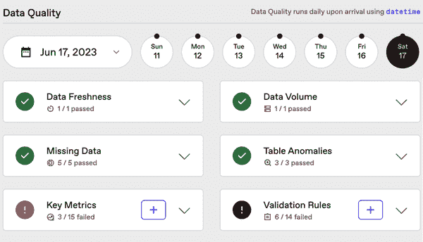

###### 图 6-5\. 在正确顺序中安排数据检查。数据新鲜度和数据量检查每 15 分钟运行一次，并且“门”控制下面显示的深度数据质量检查。所有其他检查（缺失数据、表异常等）只有在我们确定它们不会因新鲜度或数据量问题触发误报通知时才运行。

## 使用机器学习对警报进行聚类

警报疲劳的另一个来源是系统触发了源自同一问题的重复警报。造成这种情况的原因有几个。首先，数据新鲜度和数据量问题可以“级联”到依赖上游表的派生表中。其次，表中可能有多列彼此密切相关，并且可能都反映同一潜在的数据质量问题。最后，外生效应——可能表现为数据质量问题，但实际上是产品行为或产品正在交互的世界中的变化——可能会在多个列或表中引起多种相关效应。

这意味着聚类或去重警报是监控系统的一个重要特性。当相同表内发生重复警报时，您可以使用机器学习对其进行聚类。假设您的数据质量问题可以映射到个别记录，您可以在问题的上下文中将每条记录分类为“良好”或“不良”。然后，您可以计算“不良”和“良好”记录在多个数据质量问题中的相关性，并确定它们是否可能标识出相同的一组不良记录。正如在第四章中所解释的那样，能够为其检测到的异常分配信用的机器学习算法可以类似地将问题聚类在一起。

一些团队将使用数据血统来跨多个表聚类数据质量问题。图 6-6 展示了血统的截图。当表格的新鲜度或容量出现问题时，您可以向上查看，看看供给此表的表格是否也在失败，并以此方式聚类警报。

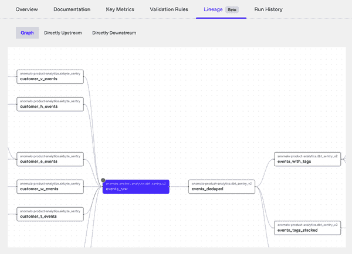

###### 图 6-6\. 展示问题如何影响上游和下游表的血统。在[*https://oreil.ly/adqm_6_6*](https://oreil.ly/adqm_6_6) 可查看此图片的完整版本。

## 抑制通知

管理警报疲劳的一大部分是在其达到用户之前抑制通知。让我们探讨几种实现这一目标的方式。

### 优先级别

抑制通知的一种方法是要求用户设置不同检查的优先级别。

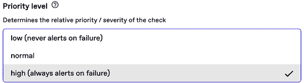

###### 图 6-7\. 数据质量检查的优先级别。

如图 6-7 所示，我们建议三个优先级别：高、普通和低。Anomalo 平台以以下方式实现这些优先级别，尽管您可能发现需要不同的解释：

高

这些检查将在每次失败时警报用户，以及在首次通过后重新失败时。

普通

普通检查在连续三次失败后首次警报，会抑制额外的重复警报。与高优先级检查类似，当这些检查在失败后重新通过时也会发出警报。大多数检查应该属于此优先级别，也是新检查的默认设置。

低

当这些检查失败时，它们永远不会警报用户。此优先级别对于调试数据问题或者想要记录特定类型的数据质量问题但不希望收到通知时非常有用。

### 连续再训练

我们在第四章中描述的数据质量监控的机器学习方法包括在每天新数据到来时重新训练模型。这样做的好处是自动抑制“已知问题”的警报，否则可能会继续通知用户。

如果在第 1 天出现了突如其来的新问题，例如某列分布的变化，模型将在第 1 天发出警报。但是在第 2 天，我们将使用第 1 天的数据重新训练模型。因此，该模型基本上会认识到第 1 天代表了这个数据集的“新正常”，并会抑制出现在第 1 天的问题的警报。

### 缩小模型的范围

为了减少总体接收到的数据质量警报数量，将监控 ML 应用于真正关心的表格范围内可能是有帮助的。参考表格 3-1 ，了解如何将 ML 监控应用于大数据仓库中的重要表格的示例。

对于扫描整个表格的基于机器学习的方法，你也可以将列限制在感兴趣的那些列上。数据往往会随着时间的推移而迁移其模式，新增列和废弃其他列。为了避免造成下游故障，大多数系统会保留旧的列并始终添加新的列，而不是修改旧列。这可能导致许多已被废弃的列，应该从监控中排除，因为它们可能会导致不必要的额外通知。

最后一个非常有效的缩小完全自动化监控范围的方法是查看命中数据仓库的 SQL 查询日志。由仪表板、机器学习模型或特定分析查询生成的 SQL 查询是显示出最重要数据的线索（我们称之为数据中的“热”）。通过解析这些查询并确定使用最多的表和列，自动化方法可以进一步缩小范围，仅关注组织中最重要的数据。

### 使检查 less sensitive

最后，为了让用户能够手动调节特定检查的敏感度，以便更少频繁地发出警报，这非常有帮助。例如，您可以让他们扩大可接受坏值的范围，或者他们可以决定监视器是否仅在表格中出现*新*坏记录时发出警报。

对于利用时间序列动态设置范围的检查（例如我们在第二章中讨论的指标监控），用户还可以改变置信区间，使这些检查 less sensitive，如“指标监控”中所示。

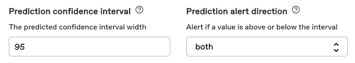

###### 图 6-8. 警报的置信区间选项。

置信区间可以对通知的敏感性产生很大影响。图 6-9 显示了具有左侧 95% 置信区间和右侧 80% 置信区间的时间序列指标监控检查。

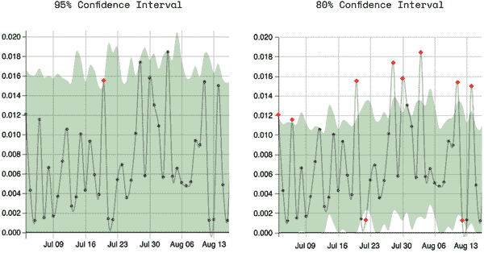

###### 图 6-9. 比较不同置信区间。

80% 的置信区间意味着，平均而言，我们预期最新的度量值将在置信区间内的时间占 80%。这意味着它将有 20% 的时间超出此区间。平均而言，这意味着您每 5 天将会收到一次警报（1 / .2 = 5）。

相比之下，在 99% 的置信区间之外的情况只会发生 1% 的时间，这意味着你每 1 / .01 = 100 天可以预期会收到一次警报。

请注意，实际情况下可能会有频繁发生警报的时间段，也会有长时间没有警报的时期。

### 不应该屏蔽的内容：预期变更

有时候您预期数据会发生变化。例如，您可能计划在某个表中弃用一个列，因此您预期它的所有值明天将变为空。或许您会自然而然地认为，也许您应该屏蔽此类变更的警报，例如向监控系统提供预期变更的列表。

通常情况下，这不是一个好主意。维护一份预期变更列表相当困难，并且很难将每个变更映射到特定的表、列、变更类型和变更生效的时间点。如果这种映射不精确，你可能会冒着未能屏蔽预期变更或屏蔽意外变更的风险。这两种情况都会对信任产生后果。

实际上，我们发现允许预期变更继续触发数据质量检查更好。警报将验证变更确实发生，并可以提供可能有用的上下文（根本原因分析、时间等）。此外，通知将作为变更及其影响的保存日志，这对未来的分析师特别有帮助，尤其是如果有任何意外后果。

# 自动化根本原因分析

通常在解决数据质量问题之前，您需要准确定位问题发生的数据位置。时间在流逝——只要问题未解决，数据损伤只会加剧，随着时间的推移，这将花费企业更多的金钱和资源。但传统的根本原因分析非常耗时，需要分析师仔细查阅记录并执行定制的复杂 SQL 分析。

想象一下，您有一个数据质量检查，用于验证某个列永远不会为空。突然之间，该检查失败了，您想要找出在拥有数百万条记录的表中所有空值来自何处。如果您的通知能够伴随自动根本原因分析，会怎么样？

实现这一点的一种方法是使用第四章中描述的无监督机器学习方法来解释好坏行之间的差异。然而，在实践中，用户最关心的是是否存在特定数据段最能解释坏数据来源的情况（例如，特定地理位置、事件类型或产品线），并且他们希望得到尽可能清晰的解释。我们发现，可以通过更简单、计算量较少的方法实现这一目标。换句话说，您可以对数据进行采样，分割数据（“`WHERE column = x`”），并独立分析每个数据段。

要理解这个过程，让我们从考虑图中的矩形开始，Figure 6-10 代表所有数据。 A 和 B 部分是数据通过检查的地方。 C 和 D 部分是数据未通过检查的地方。问题数据段是右侧的 B/D 区域，与左侧的 A/C 区域中的其他数据进行比较。

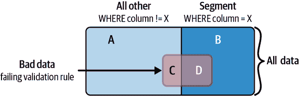

###### Figure 6-10\. 当查看特定段时，表中可能出现不良数据的方式。

在段内的不良行的百分比，与总数据中的不良行相比，为 D / (C + D)。段内的良好行的百分比，与总数据中的良好行相比，为 B / (A + B)。然后我们可以比较这些百分比。我们寻找的是不良行在整体人群中显著过度表现的样本，以及良好行显著低估的情况。

为了进一步解释，Figure 6-11 显示了段可能落入的四个类别。如果一个段包含的不良数据比整体人群几乎相同的比例（左上），它很可能与事件无关。如果一个段包含所有的不良数据，但也包含大量的良好数据（右上），它可能有助于指出问题的方向，但不足以精确定位问题。如果一个段大部分是不良数据，但同时也缺少很多不良数据（左下），这是无法理解问题的。最后，如果一个段包含所有的不良数据并且几乎没有其他数据（右下），那么你很可能找到了根本原因。

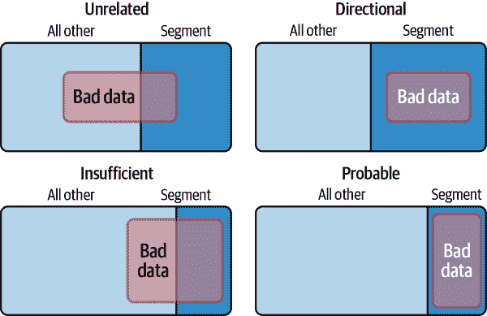

###### Figure 6-11\. 不良数据可能出现在与片段相比的不同可能位置，以及相应的影响。

由于早先描述的百分比计算非常快速，您可以自动化此过程并提供可视化，显示最可能是根本原因段的部分。例如，图 6-12 显示了可能导致数据检查失败的数据段（在本例中，表跟踪了票务销售，票价为 NULL 的数量令人担忧）。顶部段是我们的主要嫌疑：它覆盖了所有的坏行和极少量的良好行（浅灰色矩形）。接下来的三个段也覆盖了所有的坏行，但良好行的比例显著更高，使它们更具指向性而非概率性。显示的最后一个段，其中`eventname = "Il Trovatore"`，值得注意，因为它只包含坏行。但由于它的坏行总数非常少，这个段无法理解其根本原因。

请注意，由于您已经对数据进行了采样并将其分为良好和坏行，因此您还可以使这些样本可供探索和/或导出进行进一步分析，如图 6-13 所示。

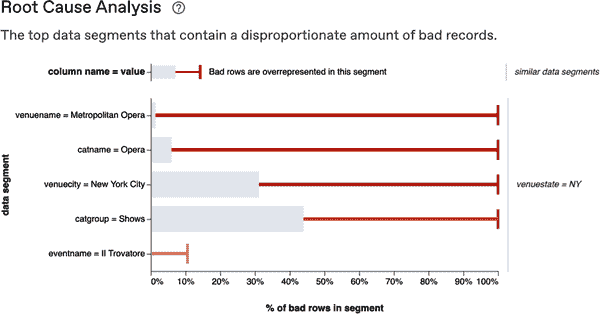

###### 图 6-12\. 包含大量坏记录的数据段。在[*https://oreil.ly/adqm_6_12*](https://oreil.ly/adqm_6_12)上查看此图的完整版本。

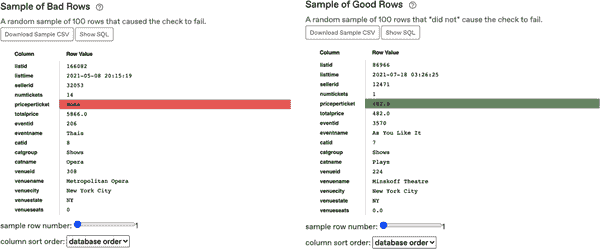

###### 图 6-13\. 良好和坏行的样本。在[*https://oreil.ly/adqm_6_13*](https://oreil.ly/adqm_6_13)上查看此图的完整版本。

# 结论

在实施自动化数据质量监控系统的通知时，您需要做出许多设计决策。当这些通知需要在大型数据仓库和多个团队之间扩展时，问题变得特别复杂。我们希望本章为您提供了一个良好的起点，了解通知内容应包含哪些内容以便采取行动，它们如何传递给适当的受众，以及您应该考虑在哪里构建调节旋钮和防范警报疲劳的防护栏。正如您所见，通过深思熟虑的自动化，您可以做很多事情，甚至可以在通知中直接帮助进行根本原因分析。

通知是用户如何采取数据质量问题行动的核心，以解决数据冲击和治愈数据伤痕的方式。但正如我们将在第七章中看到的集成中所述，自动化数据质量监控系统还可以通过不同部分扩展到您的运营中，建立对数据的信任。

¹ Jill Hardy，“为什么可视化值千言万语”，*Looker*（博客），2019 年 7 月 18 日。
