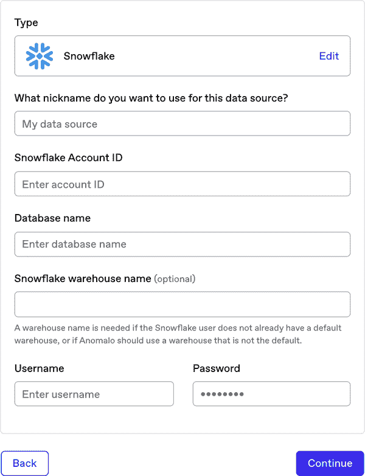
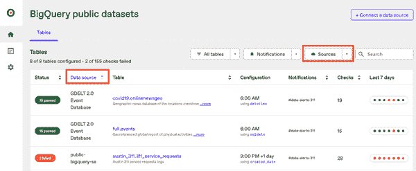
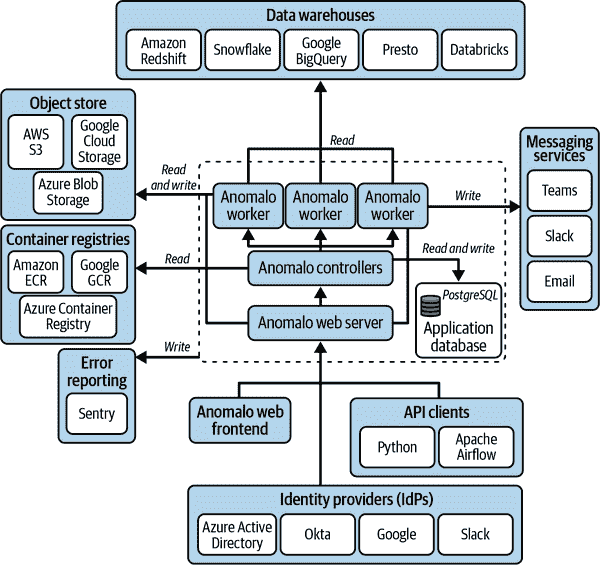
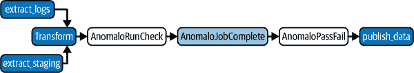
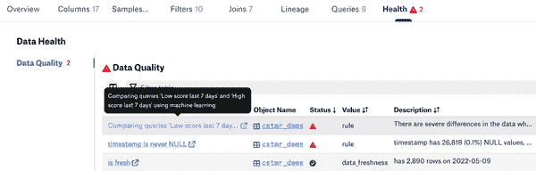
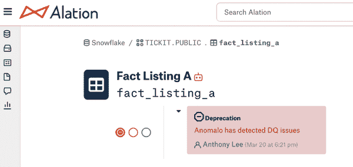
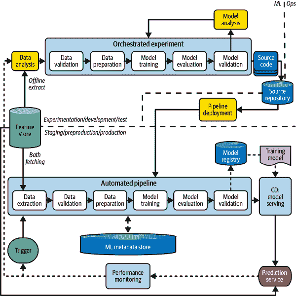

# 第七章：将监控与数据工具和系统集成

正如我们在第一章讨论的，数据质量监控并非孤立存在，它是组织数据堆栈的关键部分，包含许多不同的系统和组件。这意味着集成是任何数据质量监控平台的重要部分。有两种类型的集成：基础功能和差异化功能。基础功能的集成与数据仓库/数据湖和 ETL 工具是必需的，以便您的平台能够检测静态数据和动态数据的数据质量问题。

然后还有差异化功能：这些集成并非必要用于检测数据质量问题，但在提供大量次要价值时非常重要。例如，与数据目录、分析或商业智能（BI）工具的集成。这些确保当某人在数据质量监控平台的数据 UX 之外的不同上下文中查看数据时，他们可以立即了解该数据的质量是否高。

在本章中，我们将探讨如何与以下工具集成：

+   像 Snowflake 和 Databricks 这样的数据仓库

+   像 Apache Airflow 和 dbt 这样的数据编排器

+   像 Alation 和 Databricks Unity Catalog 这样的数据目录

+   像 BI 仪表板和机器学习模型这样的数据消费者

我们将解释为什么您可能希望与每类工具集成，并逐步介绍成功集成所需的步骤。但首先，让我们全局看一下数据质量监控如何融入现代数据堆栈。

# 监控您的数据堆栈

一个企业的数据堆栈通常包括以下系统：

+   事件、日志、SaaS 应用程序和第三方数据源等原始数据源

+   数据存储工具，如云数据仓库或数据湖

+   用于 ETL 数据从一种格式转换为另一种格式的编排工具；例如，为了准备操作数据以供分析工具使用

+   数据目录和治理工具用于探索可用数据、理解血统和审计更改

+   专门用于机器学习的 MLOps 基础设施

+   用于从数据中获取洞察的 BI 和分析工具

大多数企业希望在其堆栈的多个位置部署数据质量监控，而不仅仅是一个位置。例如，他们可能希望平台持续监控数据仓库中的关键表，同时将平台的检查集成为其编排工作流程中的任务，以确保在引入数据质量问题时无法完成转换。

此外，即使在这些地方没有积极发生检查，堆栈中的某些位置可能也会受益于数据质量*信息*。例如，如果数据质量发生重大变化，您可能希望自动重新训练 ML 模型。或者，您可能希望 BI 分析师能够看到供应仪表板的数据存在未解决的质量问题时。

尽管数据堆栈中的大多数工具都提供了发送和检索信息的接口，但它们看起来大不相同，并且数据本身将以不同的格式存在；例如，没有标准的方法与每个数据仓库集成。在数据质量集成方面，数据生态系统已经有了一些鼓舞人心的向标准化的运动，例如 Alation 的开放数据质量倡议和 dbt 的语义层。尽管如此，集成仍然需要大量的工程工作和强大的 API 支持。

使事情变得更加困难的是，大多数企业在数据堆栈的每个部分都尚未确定单一的工具。通常情况下，不同业务垂直领域中运行的独立数据团队已经演变出使用不同的工具集。

如果您正在内部构建数据质量监控平台，您将希望审计这些工具，估计与每个工具集成所需的时间，并优先考虑您的努力。这可能会影响您的自行构建与外购决策（详见第八章以获取更多详细信息）。另一方面，如果您正在与供应商合作，您将希望确保他们支持与您关心的工具的集成，而不会给您的团队增加大量工作量。

# 数据仓库

数据仓库（我们简单地使用这个总称；它包括其他形式的存储，如数据湖）是一个基础的集成。监控进入仓库的数据至关重要，因为这是数据以其预期的“静态”格式存在的中心来源。此外，数据仓库还向下游的数据消费者（如机器学习模型和分析仪表板）提供数据。

大多数大型企业没有围绕单一的数据仓库进行标准化，通常需要支持多个数据仓库的集成。这可能包括传统的本地数据仓库（例如 Teradata），如果您的业务计划无限期使用其中之一或正在迁移到云上。许多公司还希望监控来自其实时事务性数据库的数据（例如 Postgres、SQL Server、Oracle）。一些组织还选择同时使用多个云数据仓库（例如同时使用 Snowflake 和 Databricks）以充分利用它们的相对优势。

当我们稍后讨论时，使用无监督机器学习进行数据质量监控在一个组织拥有多个数据仓库时尤为有用，因为它可以检查数据是否准确地在这些仓库之间复制。

## 与数据仓库集成

后端集成的详细信息将根据数据仓库的不同而有所不同。大多数数据源支持基于 SQL 的查询，这通常是通过 API 进行数据测试、计算统计信息或从底层数据中提取样本的方式。然而，SQL 方言可能差异巨大，用于规则、统计或样本的 SQL 也需要在每个支持的平台上进行调整和测试。

此外，不同的平台具有不同的可扩展性要求——例如，在 Presto 中，每个查询中都包括基于时间的`WHERE` SQL 过滤器至关重要。在 BigQuery 中，没有一种无偏的方式可以随机抽样数据，而不需要扫描大量行。传统或事务性数据存储可能无法很好地响应来自自动化监控的查询负载，并且监控系统可能需要能够抵御短查询超时或长查询队列；在这种情况下，优化 SQL 查询变得至关重要。

一般情况下，用户需要以下内容来启用监控：

网络连接性

您可能需要将您的监控应用程序的 IP 地址添加到数据仓库的允许列表中。

数据库的只读访问凭证

我们建议为监控创建一个专用服务账户，该账户具有对您要监控的表的只读访问权限。

此外，对于许多传统数据仓库，用户只需提供主机、端口、数据库名称、用户 ID 和密码。Snowflake 只需要帐户 ID 和数据库名称，如图 7-1 所示。要连接到 Databricks，用户需要[生成个人访问令牌](https://oreil.ly/C8UZR)。



###### 图 7-1\. 设置 Snowflake 集成。

通过适当的访问权限，在后端，您需要设置扫描数据仓库以获取每个可查询对象的过程，这些对象是凭证有权访问的，包括表、视图和物化视图。这些对象应该组织和呈现给用户，以便他们可以配置监控表。参见图 7-2。



###### 图 7-2\. 按数据源筛选。查看此图片的完整版本，请访问[*https://oreil.ly/adqm_7_2*](https://oreil.ly/adqm_7_2)。

正如第 2 章所述，从数据仓库提取元数据也很重要，比如表上次更新的时间以及上次更新的数据量，这对可观察性很有用。元数据还用于血统，这对根本原因分析很有用。现代化的云数据仓库将通过 API 公开大部分此类信息，例如 Databricks 的[数据血统 API](https://oreil.ly/zTimS)。提取和跟踪元数据比在整个数据仓库上运行无监督的机器学习更具成本效益，因此，正如本书其他地方提到的那样，大多数组织将使用基于元数据的可观察性来监控大部分表格，将深度数据质量监控保留给最重要的表格。

在数据仓库中，您应该多频繁地扫描新对象和元数据？我们建议每天运行此过程，以检测新表和表结构的更改，因为这与大多数数据质量检查发生的频率相匹配。如果您预期会有需要实时更新并在工具中看到这些变化的情况，则提供一种让用户手动触发数据仓库刷新的方法可能会很有用（例如，通过 REST 端点）。

要进一步说明，图 7-3 展示了 Anomalo 架构如何与典型部署中的所有其他系统集成的简化示例，并清楚地划分了运行在数据质量监控平台内部的内容（虚线框）。该平台本身可以在单个虚拟机上运行，使用开放容器倡议（OCI）容器（例如，通过 Docker），或者为了水平扩展，可以使用 Helm 图表在 Kubernetes 集群上部署。



###### 图 7-3\. Anomalo 架构如何与典型部署中的所有其他系统集成的简化示例。

从底部开始，用户通过 Web 前端或 API 客户端与平台交互，通过企业身份提供商（IdP）的单点登录（SSO）集成和 API 密钥进行安全保护。Web 前端提供了丰富的图形用户界面，用于通过浏览器与平台进行交互，并通过 HTTPS 与 Web 服务器通信。

Web 服务器通过 HTTPS 响应来自 SSO、API 或浏览器会话的所有外部请求。然后，后端控制器创建作业，这些作业排队并计划执行。有一个动态工作池可以接手这些作业并处理它们（这些作业可以是元数据检索任务、SQL 查询、检查逻辑或机器学习作业）。

所有这些内部系统在内部数据库中维护共享状态（我们使用 Postgres）。该数据库本身可以托管在环境内（如 Docker 或 Kubernetes 中），也可以是像 AWS RDS 这样的托管 Postgres 服务。

大部分操作发生在执行检查的工作者中。这些工作者将向外部通道（例如 Slack、Microsoft Teams、PagerDuty）发送通知，并从正在监控的数据仓库、数据湖或数据库中读取数据（例如 Snowflake、Databricks、BigQuery、Amazon Redshift）。

他们还会将处理的大型对象，例如记录级数据的样本或生成的可视化内容，写入云对象存储（如 AWS S3）。在典型的部署中，这是客户控制的文件存储桶。

当任何工作者遇到运行时错误时，它们会将有关异常的信息写入像 Sentry 这样的外部平台，用于调试异常（不包括任何客户数据）。

最后，整个平台可以自动升级。控制器监视 Anomalo 容器注册表，以寻找标记为特定客户或环境的新部署，然后以安全可靠的方式自动升级所有内部组件。

## 安全性

或许不用说，但我们还是说一下：当您与业务数据源集成时，您承担了保护数据的重大责任，这些数据可能包含个人身份信息（PII）和其他敏感信息。根据您的使用情况，您可能需要遵守围绕数据处理的特定合规和法律要求（请参阅我们的[数据处理协议示例](https://oreil.ly/vCTzJ)）。

在为第三方客户开发解决方案时，应该考虑与数据安全相关的里程碑。 SOC 2 认证是存储客户数据在云中的服务提供商的行业标准。由[AICPA](https://oreil.ly/dEz8X)开发的 SOC 2 是一种广泛的审计程序，确保公司安全地处理客户数据，并保护组织及其客户隐私。

## 在多个数据仓库之间进行数据对账

当您的组织利用多种数据存储解决方案时，通常在多个位置表示重复数据，并希望在两个表中确保数据在迁移前后是相同的。一个例子是在迁移前后确保数据的一致性。

监控以确保数据的一致性通常采用两种形式：基于规则的测试或无监督机器学习。

### 使用基于规则的测试比较数据集

如果两个数据仓库中的两个表完全相同，则必须满足三个条件：

+   架构是相同的。表必须具有相同的列，相同的类型，以相同的顺序排列。

+   主键集是相同的。表的行必须在主键上一对一连接。

+   每一行具有相同的值。在主键连接时，两个表的行中的值必须相同。

如果这三个条件都成立，则两个表必须完全相同。在两者之间，没有已添加、重复、丢失或修改的数据。

然而，基于规则的测试方法要求数据位于同一个数据仓库中，以便能够在规模上评估表之间的连接。这对于非常大的数据集来说是不实际的，并且引入了因 ETL 过程中将数据移动到同一数据仓库平台中的问题而导致的假阳性风险。

### 使用无监督机器学习比较数据集

在第四章中，我们讨论了无监督机器学习方法如何用于按需比较两个数据集的数据质量监控。在这种情况下，您将从各自的数据仓库中的表中抽取数据样本，然后训练模型来预测数据是来自仓库 A 还是仓库 B。通过使用 SHAP 值解释模型的预测，您可以精确定位和根本原因样本数据中的差异。

尽管这种方法可能无法像规则那样捕捉每个行级问题，但它适用于大规模数据集，并允许您比较来自不同源数据仓库的数据，而无需进行任何 ETL 过程。

### 比较摘要统计信息

比较两个表的最终方法是计算每个表的一些摘要统计信息，然后比较这些统计信息以确保它们是相同的。例如，您可以计算按产品类别分组的行数和平均价格，以比较产品价格列表数据是否在不同环境之间一致地复制。这种方法具有很好的可伸缩性，并允许您确保某些小方面的数据是相同的。但是，如果表很大，它无法比较表中的所有记录。

实际上，我们发现后两种方法的组合——在聚合时确保行数和一些关键统计信息相同，并确保在绘制样本时使用 ML 没有显著的分布差异——是跨平台数据集对账的最可扩展和可靠的方法。

# 数据编排器

不同的业务用户希望在不同的位置查看或执行数据质量检查。在某些情况下，他们希望在数据传输和转换过程中进行数据质量检查——换句话说，在数据进入您的数据仓库的“静止”状态之前。有时候，他们甚至希望在数据进入数据仓库之前就执行数据质量检查。

这就是编排器和 ETL 工具如 Apache Airflow、dbt、Fivetran、Databricks Workflows 或 Prefect 的作用所在。

## 与编排器集成

与编排或工作流工具集成的标准模式是创建作业，允许您的监控解决方案插入数据编排 DAG。简单地说，DAG 是一系列按特定顺序完成的任务，具有上游和下游依赖关系。

一个常见的 DAG 是首先从适当的源中提取数据，例如用户日志和分级环境。这些可能是启动 DAG 的独立任务，如图 7-4 所示。完成这两个任务后，可以合并和转换数据到所需的格式，最后加载到存储的适当位置。编排工具自动化和调度此过程，提供在特定任务完成或失败时的可见性。

通过将您的监控平台与编排工具集成，您可以在 DAG 的几乎任何时刻运行检查。例如，您可能希望在转换阶段之后或数据提取阶段之后（或两者都）运行检查。



###### 图 7-4\. 一个包含数据质量检查的数据编排 DAG 示例，在发布数据之前。

我们建议您至少支持三种类型的功能：

运行检查

连接到您的监控解决方案，并运行已配置为表的检查。在图 7-4 中，这是`AnomaloRunCheck`。

作业传感器

您需要一种方法来确定监控系统何时完成运行检查。我们通过轮询方法来实现此目的。在图 7-4 中，这是`AnomaloJobComplete`。

校验检查

这使用户可以决定他们是否关心所有检查是否通过，还是仅有些检查通过。一旦我们获得检查的输出，我们可以确保如果未通过任何“必须通过”检查，我们会引发异常，停止工作流的完成并触发向用户的通知。在图 7-4 中，这一步是`AnomaloPassFail`。

通常，将此功能打包到 ETL 工具的库中对用户非常有用。这些功能背后的代码并不特别复杂。这里是一个用于运行检查的 Airflow 运算符示例：

```
# Importing BaseOperator for creating custom operators in Airflow.
from airflow.operators import BaseOperator

# Importing AnomaloHook to interact with Anomalo API.
from anomalo import AnomaloHook

class AnomaloRunCheckOperator(BaseOperator):
    def __init__(self,
                 table_name,
                 anomalo_conn_id="anomalo_default",
                 *args,
                 **kwargs):
        super().__init__(*args, **kwargs)
        self.anomalo_conn_id = anomalo_conn_id
        self.table_name = table_name

    def execute(self, context):
        # Creating an API client.
        api_client = AnomaloHook(
            anomalo_conn_id=self.anomalo_conn_id
            ).get_client()
        # Fetching the table_id corresponding to the table name.
        table_id = api_client.get_table_information(
            table_name=self.table_name
            )["id"]
        # Triggering the run checks operation in Anomalo and getting job ID.
        run = api_client.run_checks(table_id=table_id)
        # Logging the information about the triggered checks.
        self.log.info(f"Triggered Anomalo checks for {self.table_name}")
        # Returning the job ID for the triggered run.
        return run["run_checks_job_id"]
```

`AnomaloRunCheckOperator`触发一个作业，运行给定表中的所有检查。`table_name`是 Anomalo 中表的完整名称，`anomalo_conn_id`是连接到平台的连接 ID。

接下来，我们将演示如何设置一个示例 Airflow DAG，该 DAG 摄取数据，然后使用`AnomaloRunCheckOperator`对其运行检查。

我们首先导入定义 DAG 所需的 Airflow 模块和类，以及自定义的 Anomalo 运算符和传感器：

```
from airflow.models import DAG
from airflow.operators.empty import EmptyOperator
from airflow.utils.dates import days_ago

from airflow.providers.anomalo.operators.anomalo import (
    AnomaloPassFailOperator,
    AnomaloRunCheckOperator,
)
from airflow.providers.anomalo.sensors.anomalo import AnomaloJobCompleteSensor
```

接下来，我们为 DAG 任务定义默认参数，并设置 DAG 的基本参数：

```
# Default arguments for DAG tasks.
args = {
    "owner": "AL",
    "start_date": days_ago(1),
}

# Define the DAG using context manager.
with DAG(
    dag_id="AnomaloDAG",  # Unique identifier for the DAG.
    default_args=args,  # Default task arguments.
    description="Simple Anomalo Airflow operator example",  # DAG description.
    schedule_interval="@daily",  # Frequency of DAG execution.
) as dag:
```

DAG 包括多个任务。有`ingest_transform_data`，这是将数据引入并对其进行一些操作的初始任务。完成后，我们希望有一个任务可以使用`AnomaloRunCheckOperator`在表格上运行检查。请注意，以下步骤均缩进，因为它们发生在 Airflow DAG 上下文管理器内部：

```
    # Initial task to ingest and transform data.
    ingest_transform_data = EmptyOperator(task_id="ingest_transform_data")

    # Task to run checks on a specific table using AnomaloRunCheckOperator.
    anomalo_run = AnomaloRunCheckOperator(
        task_id="AnomaloRunCheck",
        table_name="public-bq.crypto_bitcoin.outputs",
    )
```

正如之前讨论的，我们希望在 Anomalo 作业完成之前轮询，并使用`anomalo_sensor`任务完成这一操作：

```
    anomalo_sensor = AnomaloJobCompleteSensor(
        task_id="AnomaloJobCompleteSensor",
        # Reference to the previous task's job ID.
        xcom_job_id_task=anomalo_run.task_id,  
        poke_interval=60,
        timeout=900,  # 15 minutes
        mode="poke",
    )
```

工作完成后，我们将运行一个任务来验证各种数据质量检查，并最终发布数据：

```
    anomalo_validate = AnomaloPassFailOperator(
        task_id="AnomaloPassFail",
        table_name="public-bq.crypto_bitcoin.outputs",
        must_pass=[
            "data_freshness",
            "data_volume",
            "metric",
            "rule",
            "missing_data",
            "anomaly",
        ],
    )

    publish_data = EmptyOperator(task_id="publish_data")
```

定义好这些任务后，只需设置任务依赖关系来形成 DAG：

```
    (
        ingest_transform_data
        >> anomalo_run
        >> anomalo_sensor
        >> anomalo_validate
        >> publish_data
    )
```

# 数据目录

由于今天许多企业正在处理大量不同类型的数据集，数据目录正成为数据从业者工具箱中越来越重要的一部分。数据目录提供了数据资产、元数据和关系的集中视图，使组织更容易发现、理解和使用数据。例如 Alation、Databricks Unity Catalog、DataHub 和 Atlan。

数据目录与数据质量工具之间的集成是自然而然的发展——企业意识到了理解其数据和确保数据高质量是相互关联的目标。这两个步骤都可以视为数据治理的一部分，它是一个框架，用于定义组织中管理数据资产的政策、流程和标准。它确保数据得到适当的访问、保护和信任，以满足组织及其利益相关者的需求。

作为进一步促进数据质量工具与数据目录之间连接的示例，Alation 在 2022 年推出了[开放数据质量倡议](https://oreil.ly/RSXVl)，提供“开放的 DQ API、开发者文档、入门、集成最佳实践和共同营销支持”。他们在目录中添加了一个数据质量标签（参见图 7-5），数据质量系统可以通过 API 推送信息。



###### 图 7-5。作为他们的开放数据质量倡议的一部分，Alation 添加了显示数据质量检查的钩子。查看此图的完整版本，请访问[*https://oreil.ly/adqm_7_5*](https://oreil.ly/adqm_7_5)。

目录与数据质量监控之间的集成可以是双向的。在目录内部，能够直接看到与表格相关的数据质量信息非常有帮助，而无需切换上下文。或者，从监控平台内部，深入到目录中也可以很有用，以探索表格使用情况和元数据。

在目录内显示详细的数据质量信息（参见 图 7-6）有几个重要的原因。数据目录通常是企业探索数据集的主要工具，可能有助于特定用例，例如开发新的分析仪表板。在此阶段，分析师可能正在从数百个他们一无所知的表格中进行选择。重要的是了解给定表中的数据是否良好：它是有效和已批准的，还是从未经过测试？在分析师的指尖提供数据质量详细信息可以确保企业基于可信赖的信息做出决策。



###### 图 7-6\. 数据质量检查显示在表的目录概述中，任何问题都会在 UI 中标记。

此外，数据目录的一个任务不仅是整理资产，还要告诉企业哪些资产最受欢迎和常用。通过将数据质量信息整合到目录中，可以快速看到哪些受欢迎的表格实际上已验证。如果管理者正在推动改进数据质量的倡议，这对于确定投资资源的优先级非常有帮助。总体而言，它作为企业是否依赖可信赖数据的一个评估标准。

## 与目录集成

与数据目录的基本集成包括标记表格是否完全设置了检查或监控，显示数据质量检查结果在目录中，并深度链接到监控平台获取更多信息。

然而，随着目录增加对数据质量工具的增强支持，更先进的集成正在变得可能。例如，如果您的监控工具提供了额外的可视化功能（例如根本原因分析），您可能考虑将其整合到目录中。

通常，与数据目录集成遵循一个发布模型，数据质量监视器将汇总其结果并发布到目录拥有的指定位置。集成主要基于 API，因此拥有安全且企业级准备的 API 非常重要。

例如，您可以提供一个返回监控结果的 REST API，格式为 JSON。端点可能包括：

`GET /get_checks_for_table`

返回给定表格 ID 的当前配置检查/验证的列表。

`POST /run_checks`

在给定表格上手动运行所有或部分检查。

`GET /get_run_results`

获取单次运行的执行检查结果。

对于 `GET /get_run_results` 调用，检查你可能需要提供的元数据包括：

+   检查 ID：特定数据检查的标识符

+   检查运行 ID：检查运行实例的标识符

+   完成时间：检查运行完成的时间

+   创建元数据：关于谁何时创建检查的信息

+   最后编辑的元数据：关于最后编辑的信息，包括时间和编辑者

+   错误状态：检查是否遇到错误

+   评估消息：详细描述检查评估情况的文本

+   异常详细信息：任何异常的消息和回溯信息

+   历史上下文：检查随时间推移的表现摘要

+   样本数据：用于良好和坏数据样本的 SQL 查询和 URL

+   结果统计：与检查相关的定量指标及其名称

+   成功标志：指示检查成功或失败的布尔值

+   检查配置：包括类型、描述和优先级级别

+   分类状态：在分类工作流中的当前状态

在我们的经验中，集成最棘手的部分是正确匹配表 ID，因为表名并不总是一个完美的标识符（它们在不同的数据目录中可能会有稍微不同的表示），而且每个企业的环境都会有所不同。

您还需要考虑安排问题：您希望多频繁地将结果推送到目录和/或从目录中获取更新？作为第一步，您可以使用脚本运行更新，最终将调度程序集成到您的平台中，以便每天或在其他某种节奏上自动化这个过程。

# 数据消费者

尽管仍处于初期阶段，数据质量集成的另一个强大领域——并且可能变得更受欢迎——是消费数据的应用程序，如 BI 和分析工具以及 MLOps 平台。

## 分析和 BI 工具

像 Tableau 这样的分析工具，因为它作为数据使用的目的地，是显示数据质量监控信息的好选择，例如数据集是否已验证为高质量。实际上，Tableau 有几个数据质量 API，比如一个用于[添加数据质量警告](https://oreil.ly/2zMbN)的 API。如果您使用 BI 仪表板来跟踪关键绩效指标，请考虑将此度量监控与您的数据质量工具同步，以便您可以轻松地找到根本数据漂移的原因。

数据驱动的组织通常会遇到业务指标定义不一致的问题。例如，业务的一部分可能会将`view_count`定义为不包括非常短的视图，比如持续时间少于 10 毫秒的视图，而另一组可能会包括所有视图，这看起来像是数据质量问题，但实际上只是缺乏一致性。

我们一直对 dbt 如何通过推出 dbt 指标和 dbt 语义层来解决这个问题感兴趣。这使得组织能够在 dbt 中集中定义关键的业务指标，如收入、客户数量和流失率。数据质量监控工具可以成为 dbt“指标就绪集成”，并使用 dbt 指标定义。例如，如果您的工具监视关键绩效指标，可以自动接收在 dbt 中定义的指标。

## MLOps

如果您的公司正在使用像 Amazon SageMaker 这样的 MLOps 平台，很可能已经内置了某种模型监控水平。然而，大多数平台监控的指标通常是模型性能、延迟和可用性，而不是数据流入模型时更难检测到的问题，导致预测结果不佳。通过将数据质量监控与 MLOps 工具集成，您可以构建一个系统，当模型需要重新训练时，警告数据科学家底层数据已发生漂移，或者存在像数据中的 NULL 值这样的错误可能导致模型行为不稳定。

图 7-7 是从 Google Cloud 架构中心调整过的示例 MLOps 架构图。



###### 图 7-7\. 示例 MLOps 架构图（来源于“MLOps: Continuous Delivery and Automation Pipelines in Machine Learning”，Cloud Architecture Center，[*https://oreil.ly/rfAmt*](https://oreil.ly/rfAmt)）。

这种复杂的流程旨在自动化 ML 系统的持续集成、交付和训练。以下是您可能希望引入数据质量监控的几个关键点：

源数据

源数据通常来自云数据仓库或数据湖，被转换为模型的信号，然后存储在特征存储中。监控这些数据非常重要，因为这是训练 ML 模型的入口点。

特征存储

特征存储可能已在您的数据仓库中复制，这是您希望监控的另一组表。如 第三章 所讨论的，特别是要查找 NULL 值百分比的变化、分布偏移和相关性变化。这些任何一个都可能表明特征计算不正确，或者模型可能遇到会导致意外行为的冲击。

训练数据

训练数据从特征存储中批量获取。使用数据质量监控来比较当前训练快照与先前的训练数据集或生产数据可能会有所帮助。如果训练数据的分布突然发生变化，您可能会面临一些模型风险。

模型性能

在训练的模型评估步骤中，您可以记录训练和推断时间、测试集性能和特征重要性分数等数据。模型监控理想情况下已集成到您的 MLOps 工具包中，但如果这些指标在您的数据仓库中可用，数据质量平台也可以监控这些指标。

特征服务

当您的模型在线并进行预测时，获取预测时的特征、记录它们，并与最新训练运行使用的特征值进行比较，这是非常有价值的。这可以告诉您在训练和实际数据之间是否存在显著差异，这意味着您的模型在生产环境中可能表现不佳。

预测和业务逻辑

虽然您可以直接监控机器学习模型的预测，但我们认为监控由这些预测驱动的*业务逻辑*更为重要。例如，您是否突然将大量交易标记为欺诈？这可能表明外部数据中存在真实的趋势，但也可能意味着您的模型由于数据质量问题而表现不稳定。

# 结论

当您在大规模自动化数据质量监控时，您可以创建验证数据质量（或否）的方法。通知是解决数据质量问题的主要方式，但要真正让您组织内的用户与系统互动，并在公司整体上关注数据质量，您需要超越通知，并将监控的信息和信号整合到整个数据工作流程中。在本章中，我们为您提供了这样做的工具。
